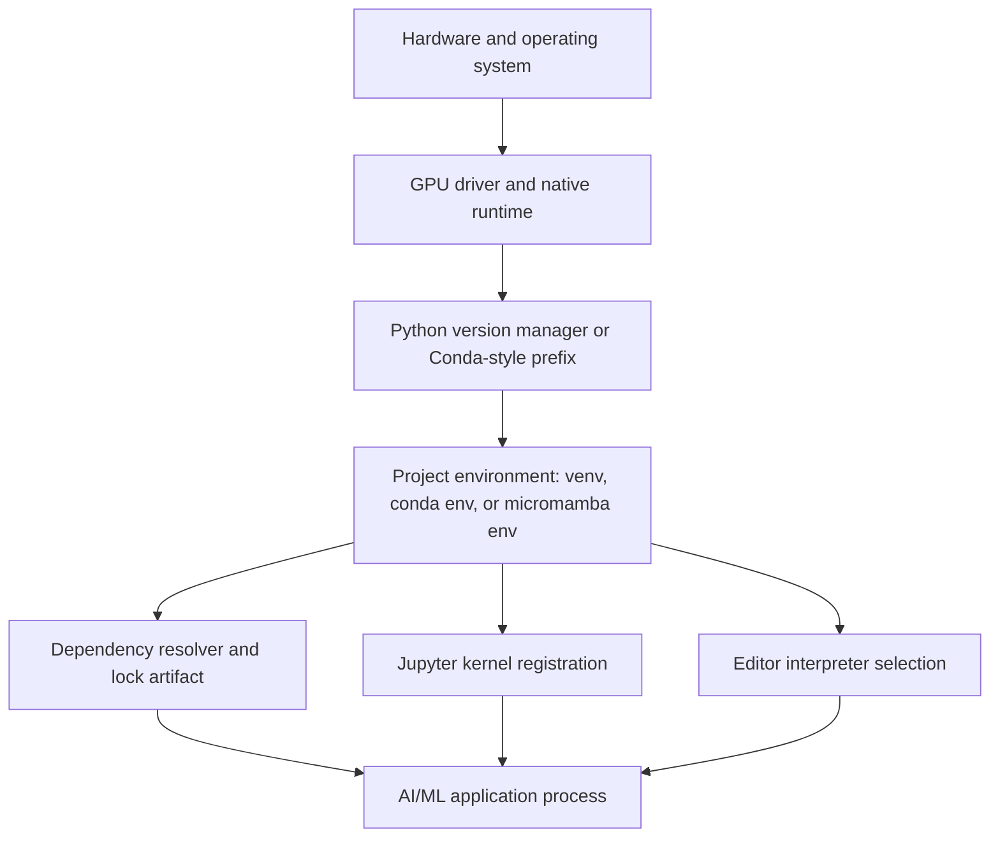
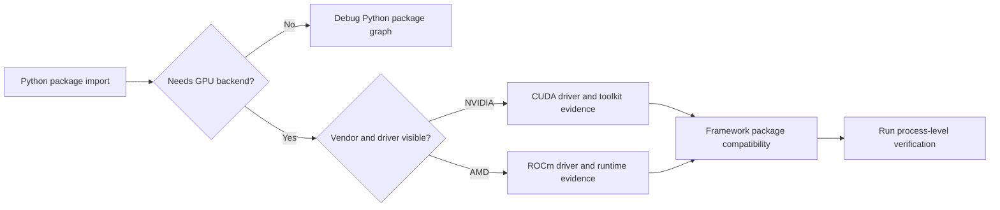

> **AI/ML Engineering Track** | Complexity: `[QUICK]` | Time: 2-3 hours
>
> **Prerequisites**: A workstation you control, terminal access, Git installed, and permission to install development tools

## Learning Outcomes

By the end of this module, you will be able to:

- **Analyze** an AI/ML workstation environment by separating interpreter ownership, package isolation, native runtime libraries, editor discovery, and notebook kernels.
- **Compare** `pyenv` plus `venv`, Conda, and micromamba as environment strategies for Python-first, compiled-science, and GPU-aware workloads.
- **Design** a dependency workflow with `pip-tools`, `uv`, or PDM that produces reproducible installs without mixing package managers accidentally.
- **Diagnose** import, `PYTHONPATH`, Jupyter kernel, and Visual Studio Code interpreter mismatches using evidence from the active process rather than from shell prompts alone.
- **Implement** a GPU-aware setup plan that records whether NVIDIA CUDA or AMD ROCm is owned by the host, a Conda-style environment, or a Python wheel stack.

## Why This Module Matters

An AI/ML environment is not a folder of convenience scripts. It is a contract between the operating system, the Python interpreter, installed packages, compiled native libraries, notebook kernels, and the editor that launches your code. Python's `venv` documentation describes virtual environments as isolated Python environments, while the Python Packaging User Guide teaches package installation inside virtual environments to avoid sharing dependency state with other projects. If those boundaries are not explicit, the first model import error can look like a model problem when the real defect is a process running under the wrong interpreter. ([Python venv](https://docs.python.org/3/library/venv.html), [PyPA: Installing packages using virtual environments](https://packaging.python.org/en/latest/guides/installing-using-pip-and-virtual-environments/))

The most expensive environment failures are rarely dramatic at first. A notebook may silently keep using yesterday's kernel, Visual Studio Code may analyze a different interpreter than the terminal, or a global `PYTHONPATH` may place a local package ahead of the package you meant to test. Python documents `PYTHONPATH` as an environment variable that augments the module search path, IPython documents explicit kernel installation for Jupyter, and Visual Studio Code documents interpreter selection and workspace-local environment discovery. Those three facts make environment debugging an evidence problem, not a preference argument. ([Python command line and environment](https://docs.python.org/3/using/cmdline.html#envvar-PYTHONPATH), [IPython kernel install](https://ipython.readthedocs.io/en/stable/install/kernel_install.html), [VS Code Python environments](https://code.visualstudio.com/docs/python/environments))

The operator decision is to choose the smallest environment system that owns the risk you actually have. A pure Python service usually needs one interpreter, one virtual environment, and one lock or compiled requirements file. A scientific workload with compiled libraries may need Conda or micromamba because those tools manage non-Python packages as part of the environment. A GPU workstation may also need host-level NVIDIA CUDA or AMD ROCm installation work before Python packages can use the hardware reliably. ([pyenv](https://github.com/pyenv/pyenv), [Conda environment management](https://docs.conda.io/projects/conda/en/latest/user-guide/tasks/manage-environments.html), [micromamba user guide](https://mamba.readthedocs.io/en/latest/user_guide/micromamba.html), [NVIDIA CUDA installation guide for Linux](https://docs.nvidia.com/cuda/cuda-installation-guide-linux/), [AMD ROCm installation for Linux](https://rocm.docs.amd.com/projects/install-on-linux/en/latest/))

Treat this module as the setup standard for the rest of the track. You are not trying to memorize every tool flag. You are learning to answer ownership questions before running commands: which program owns the Python version, which program owns dependency resolution, which layer owns GPU libraries, which process owns the notebook kernel, and which files should be committed. Git's ignore rules and Python packaging specifications matter because a reproducible environment is partly source control discipline and partly runtime discipline. ([Git ignore](https://git-scm.com/docs/gitignore), [PyPA: Externally managed environments](https://packaging.python.org/en/latest/specifications/externally-managed-environments/))

## Environment Boundary Map

Start by drawing the boundary before choosing a tool. A Python process imports modules from the interpreter's configured search path, loads installed packages from its environment, and may load native libraries supplied by the operating system, a Conda-style prefix, or wheel-bundled runtime components. Python's `venv` module creates an isolated environment for Python packages, but it does not install a GPU driver or replace the host operating system's device stack. NVIDIA and AMD both document Linux installation work outside normal Python package installation, so a GPU import failure can sit below the virtual environment even when `pip list` looks correct. ([Python venv](https://docs.python.org/3/library/venv.html), [NVIDIA CUDA installation guide for Linux](https://docs.nvidia.com/cuda/cuda-installation-guide-linux/), [AMD ROCm installation for Linux](https://rocm.docs.amd.com/projects/install-on-linux/en/latest/))



Read the diagram from bottom to top when you debug and from top to bottom when you install. During installation, hardware and driver support must be true before a project environment can use acceleration. During debugging, the running application process is the evidence that matters, so you first prove which interpreter, import path, and native libraries it can see. This habit prevents the common mistake of changing the shell while the failing process is actually a Jupyter kernel, a test runner, or an editor language server using a different environment. ([Python command line and environment](https://docs.python.org/3/using/cmdline.html#envvar-PYTHONPATH), [IPython kernel install](https://ipython.readthedocs.io/en/stable/install/kernel_install.html), [VS Code Python environments](https://code.visualstudio.com/docs/python/environments))

The boundary map also explains why no single environment manager is always correct. `venv` is excellent at Python package isolation, but it does not resolve system compilers, GPU driver installation, or non-Python shared libraries. Conda and micromamba can manage packages inside an environment prefix, including many compiled packages, but that strength also means they should not be casually mixed with unrelated `pip` resolution unless you document the order and reason. `pyenv` can provide a user-owned interpreter version, but the project still needs `venv` or another environment boundary for dependencies. ([Python venv](https://docs.python.org/3/library/venv.html), [pyenv](https://github.com/pyenv/pyenv), [Conda environment management](https://docs.conda.io/projects/conda/en/latest/user-guide/tasks/manage-environments.html), [micromamba user guide](https://mamba.readthedocs.io/en/latest/user_guide/micromamba.html))

The reliable operator move is to record the boundary as project metadata. A `.python-version` file can tell `pyenv` which interpreter a directory expects, a lock file or compiled requirements file can tell installers what package graph was tested, and a committed editor setting can point teammates at a workspace-local environment without embedding a machine-specific absolute path. Git should ignore local environment directories and secret files, but it should track files that describe how to recreate the environment. ([pyenv](https://github.com/pyenv/pyenv), [pip-tools](https://pip-tools.readthedocs.io/en/latest/), [uv](https://docs.astral.sh/uv/), [PDM](https://pdm-project.org/latest/), [Git ignore](https://git-scm.com/docs/gitignore))

## Choosing Python Version Ownership

Python version ownership answers one question: when a terminal in this project says `python`, which interpreter is it allowed to mean? The Python standard library gives you `venv` for isolating packages, but a virtual environment is created from an existing interpreter. If your workstation has several Python versions, you still need a clear source for the base interpreter before you create the environment. `pyenv` fills that role for many developer workstations by selecting installed Python versions per shell, globally, or per directory. ([Python venv](https://docs.python.org/3/library/venv.html), [pyenv](https://github.com/pyenv/pyenv))

Use `pyenv` plus `venv` when the project is Python-first and you want the operating system package manager out of your dependency graph. The interpreter comes from `pyenv`, the project packages live in `.venv`, and the resolver writes a lock or compiled dependency artifact that teammates can use. This keeps the ownership chain short: `pyenv` owns the interpreter version, `venv` owns isolation, and the chosen packaging tool owns resolution. ([pyenv](https://github.com/pyenv/pyenv), [Python venv](https://docs.python.org/3/library/venv.html), [PyPA: Installing packages using virtual environments](https://packaging.python.org/en/latest/guides/installing-using-pip-and-virtual-environments/))

Do not use the operating system's Python as your project package sandbox. Modern Linux distributions can mark their Python installation as externally managed, and PyPA documents this behavior so Python-specific package managers know not to modify the interpreter owned by the operating system. That is a protection boundary, not an inconvenience. If a command requires elevated privileges to install a normal project dependency, stop and create a project environment instead of teaching the system interpreter about your AI experiment. ([PyPA: Externally managed environments](https://packaging.python.org/en/latest/specifications/externally-managed-environments/), [PyPA: Installing packages using virtual environments](https://packaging.python.org/en/latest/guides/installing-using-pip-and-virtual-environments/))

The following bootstrap uses `pyenv` only for interpreter selection and uses `venv` for the project environment. The exact Python patch release should match your team's support policy, but the decision shape is stable: set the version, create the environment from that interpreter, activate it, upgrade the installer tooling, and then install through one resolver path. ([pyenv](https://github.com/pyenv/pyenv), [Python venv](https://docs.python.org/3/library/venv.html))

```bash
mkdir -p ai-env-lab
cd ai-env-lab

pyenv install --skip-existing 3.12.8
pyenv local 3.12.8
python -m venv .venv
source .venv/bin/activate
# Windows: .venv\Scripts\activate

python -m pip install --upgrade pip
python -c "import sys; print(sys.prefix); print(sys.version)"
```

The verification command is more important than the prompt prefix. Shell prompts can be customized, reused, or misleading inside editor terminals. The runtime prefix and Python version describe the interpreter context used by the running process, which is the same evidence you need when a notebook, test runner, or language server behaves differently from the terminal. The rule is simple: prove the process, not the prompt. ([Python command line and environment](https://docs.python.org/3/using/cmdline.html#envvar-PYTHONPATH), [VS Code Python environments](https://code.visualstudio.com/docs/python/environments))

## Choosing `venv`, Conda, or Micromamba

The environment manager decision should start with the hardest dependency in the project. If the project is an API service, evaluation harness, or retrieval application that depends mostly on Python wheels, `pyenv` plus `venv` is usually the easiest boundary to audit. If the project needs a consistent stack of compiled scientific libraries that are packaged through Conda channels, Conda or micromamba may reduce native-library drift. If the project needs both Python packages and GPU runtime packages inside an environment prefix, Conda-style tooling can be a reasonable owner, but the host driver still remains outside that prefix. ([Python venv](https://docs.python.org/3/library/venv.html), [Conda environment management](https://docs.conda.io/projects/conda/en/latest/user-guide/tasks/manage-environments.html), [micromamba user guide](https://mamba.readthedocs.io/en/latest/user_guide/micromamba.html), [NVIDIA CUDA installation guide for Linux](https://docs.nvidia.com/cuda/cuda-installation-guide-linux/))

| Strategy | Choose it when | Avoid it when | Primary evidence |
|---|---|---|---|
| `pyenv` plus `venv` | The project is Python-first and packages come primarily from PyPI | You need one tool to solve non-Python native packages inside the environment prefix | Python documents `venv`; PyPA documents virtual-environment package installation |
| Conda | The environment must carry Python plus compiled packages from Conda channels | You only need a simple Python package sandbox and want minimal tool surface | Conda documents named environments and environment files |
| micromamba | You want Conda-compatible environments with a smaller standalone client | Your team standardizes on the full Conda CLI and training material | micromamba documents environment creation and activation |

The practical mistake is mixing these strategies without assigning ownership. Installing a package with Conda, then upgrading the same dependency with `pip`, then regenerating a lock with a third tool creates an environment no one can explain. There are legitimate cases where `pip` installs into a Conda environment, but that must be a documented exception after the Conda solve, not a habit that hides which resolver last touched the environment. Conda and micromamba documentation both present environment creation as a managed prefix, so treat that prefix as a system with one primary owner. ([Conda environment management](https://docs.conda.io/projects/conda/en/latest/user-guide/tasks/manage-environments.html), [micromamba user guide](https://mamba.readthedocs.io/en/latest/user_guide/micromamba.html), [PyPA: Installing packages using virtual environments](https://packaging.python.org/en/latest/guides/installing-using-pip-and-virtual-environments/))

Choose `pyenv` plus `venv` for early API-first AI engineering because it has fewer moving parts. You can read `.python-version`, inspect `.venv`, compile or lock requirements, and reproduce the install on a second machine with standard Python packaging tools. This is the right default when your hardest problem is application behavior rather than native library assembly. It also maps cleanly to production containers later because the project dependencies are separate from workstation-level tools. ([pyenv](https://github.com/pyenv/pyenv), [Python venv](https://docs.python.org/3/library/venv.html), [PyPA: Installing packages using virtual environments](https://packaging.python.org/en/latest/guides/installing-using-pip-and-virtual-environments/))

Choose Conda or micromamba when the environment is really a scientific runtime, not just a Python package set. If a lab depends on compiled numeric packages, shared native libraries, or packages distributed through Conda channels, letting the Conda solver own the environment can be more reproducible than scattering compiler and library assumptions across shell startup files. micromamba gives a smaller client with Conda-compatible environment semantics, so it is useful when you want the environment model without a large base installation. ([Conda environment management](https://docs.conda.io/projects/conda/en/latest/user-guide/tasks/manage-environments.html), [micromamba user guide](https://mamba.readthedocs.io/en/latest/user_guide/micromamba.html))

The right answer can change between modules. A text-processing module may use `venv` because every dependency is a Python wheel. A GPU module may use Conda-style tooling if the lab intentionally teaches environment-level native packages. A production service may return to `venv` because the deployed image pins system packages separately from Python packages. The senior habit is not loyalty to one manager; it is making the boundary explicit before the first install. ([Python venv](https://docs.python.org/3/library/venv.html), [Conda environment management](https://docs.conda.io/projects/conda/en/latest/user-guide/tasks/manage-environments.html), [micromamba user guide](https://mamba.readthedocs.io/en/latest/user_guide/micromamba.html))

## Dependency Resolution and Lock Artifacts

Package installation is a resolver decision, not a download event. The resolver chooses a compatible graph from version constraints, and the artifact it writes becomes the evidence that a teammate can recreate the same graph. PyPA's packaging guide documents installing packages in virtual environments, while `pip-tools`, `uv`, and PDM each document a different workflow for turning project intent into installed packages. Choose one workflow per repository unless a migration plan says otherwise. ([PyPA: Installing packages using virtual environments](https://packaging.python.org/en/latest/guides/installing-using-pip-and-virtual-environments/), [pip-tools](https://pip-tools.readthedocs.io/en/latest/), [uv](https://docs.astral.sh/uv/), [PDM](https://pdm-project.org/latest/))

| Tooling choice | Operator decision | Good artifact | Source basis |
|---|---|---|---|
| `pip-tools` | Keep plain requirements files while compiling transitive pins from small input files | `requirements.in` and generated `requirements.txt` | `pip-tools` documentation describes compile and sync workflows |
| `uv` | Use a fast, modern toolchain that can manage projects, virtual environments, and lock files | `pyproject.toml` and `uv.lock` | `uv` documentation describes project and lock workflows |
| PDM | Use project metadata and a PEP 517/518-style project workflow with a lock artifact | `pyproject.toml` and `pdm.lock` | PDM documentation describes project management and locking |

Use `pip-tools` when your team wants low ceremony and direct visibility into requirements files. The operator writes human constraints in an input file, compiles the complete graph, reviews the resulting pins, and synchronizes the environment from the generated file. That workflow is easy to explain during code review because the input expresses intent and the compiled output expresses the tested dependency graph. ([pip-tools](https://pip-tools.readthedocs.io/en/latest/), [PyPA: Installing packages using virtual environments](https://packaging.python.org/en/latest/guides/installing-using-pip-and-virtual-environments/))

```bash
cat > requirements.in <<'EOF'
ipykernel
numpy
pandas
python-dotenv
EOF

python -m pip install pip-tools
pip-compile requirements.in
pip-sync requirements.txt
```

Use `uv` when the project benefits from fast creation, locking, syncing, and tool execution under one interface. That does not make `uv` morally better than `pip-tools`; it changes the ownership surface. If `uv` owns the lock, the team should review and commit `uv.lock`, run `uv sync` as the standard install path, and avoid hand-editing installed packages behind the lock's back. ([uv](https://docs.astral.sh/uv/))

```bash
uv init --bare
uv venv .venv
uv add ipykernel numpy pandas python-dotenv
uv sync
```

Use PDM when the repository is already organized around `pyproject.toml` metadata and a project-level lock file. PDM's value is strongest when the project needs a packaging-oriented workflow rather than only a requirements compiler. The same operational rule applies: if PDM owns the lock, do not let another resolver mutate the environment without updating the project artifact that collaborators will use. ([PDM](https://pdm-project.org/latest/), [PyPA: Externally managed environments](https://packaging.python.org/en/latest/specifications/externally-managed-environments/))

Lock artifacts are not generated clutter. They are the reviewable record of a dependency graph at a moment in time. Commit them when the project expects repeatable installs, and regenerate them deliberately when you accept dependency upgrades. Ignore the local environment directory because it contains machine-specific binaries and paths; commit the files that explain how to rebuild it. Git's ignore rules are path-pattern rules, so verify the ignore file before assuming `.venv` or `.env` is excluded. ([Git ignore](https://git-scm.com/docs/gitignore), [pip-tools](https://pip-tools.readthedocs.io/en/latest/), [uv](https://docs.astral.sh/uv/), [PDM](https://pdm-project.org/latest/))

```bash
cat > .gitignore <<'EOF'
.venv/
.env
.ipynb_checkpoints/
__pycache__/
EOF

git check-ignore -v .venv .env
```

## GPU Runtime Ownership: CUDA and ROCm

GPU support adds a second dependency graph below Python. A Python virtual environment can install packages that call accelerated libraries, but it cannot make an unsupported driver, missing device permission, or absent native runtime disappear. NVIDIA's CUDA guide documents Linux toolkit installation methods, including distribution packages and runfile installation, while AMD's ROCm guide documents Linux installation options and runtime packages. Put those host-level facts in the setup record before blaming the Python resolver. ([NVIDIA CUDA installation guide for Linux](https://docs.nvidia.com/cuda/cuda-installation-guide-linux/), [AMD ROCm installation for Linux](https://rocm.docs.amd.com/projects/install-on-linux/en/latest/))



For NVIDIA systems, distinguish the driver from the CUDA Toolkit and from Python packages that consume CUDA. The CUDA installation guide states that the toolkit can be installed through distribution-specific packages or a distribution-independent runfile, and it documents the default runfile toolkit location under `/usr/local/cuda-<version>` (for the selected toolkit release) with a `/usr/local/cuda` symbolic link for that release. It also documents `PATH` and `LD_LIBRARY_PATH` setup for runfile installations. That means a project note should record whether CUDA came from system packages, a runfile path, Conda packages, or Python wheels, because each choice changes where you inspect failures. ([NVIDIA CUDA installation guide for Linux](https://docs.nvidia.com/cuda/cuda-installation-guide-linux/))

For AMD systems, distinguish ROCm runtime packages from Python packages that call ROCm-enabled libraries. AMD's Linux installation documentation describes ROCm installation options, native package installation, runtime packages, and post-install path configuration such as `/opt/rocm-<version>/bin` and ROCm library paths. If a Python import cannot see the GPU, the first question is whether the ROCm runtime and device access are visible to the process, not whether the notebook cell was re-run enough times. ([AMD ROCm installation for Linux](https://rocm.docs.amd.com/projects/install-on-linux/en/latest/), [AMD ROCm post-installation](https://rocm.docs.amd.com/projects/install-on-linux/en/latest/install/post-install.html))

| Hardware path | What Python owns | What the host or environment prefix owns | First evidence to collect |
|---|---|---|---|
| CPU-only development | Python packages, kernels, editor interpreter | Operating system Python only as a base if you choose it | runtime prefix, package list, lock artifact |
| NVIDIA CUDA through host install | Python framework package and project code | Driver, toolkit path, linker path, device access | CUDA install method, `PATH`, `LD_LIBRARY_PATH`, driver visibility |
| NVIDIA CUDA through Conda-style env | Python packages plus environment-level CUDA packages where selected | Host driver and device access remain outside the env | Conda or micromamba environment file plus driver evidence |
| AMD ROCm through host install | Python framework package and project code | ROCm runtime packages, ROCm paths, device permissions | ROCm package set, `/opt/rocm` path choice, runtime visibility |

Do not install GPU tooling just because a tutorial includes it. The first modules in this track can run CPU-only and API-first, which means a GPU-specific stack may add failure modes before it adds learning value. When you do need acceleration, install from the vendor's supported path for your distribution and record that path beside the project setup notes. A notebook that says "CUDA unavailable" is easier to diagnose when you know whether CUDA should come from `/usr/local/cuda`, a Conda prefix, or a wheel bundle. ([NVIDIA CUDA installation guide for Linux](https://docs.nvidia.com/cuda/cuda-installation-guide-linux/), [AMD ROCm installation for Linux](https://rocm.docs.amd.com/projects/install-on-linux/en/latest/))

Use process-level verification after installation. A shell command may prove that a binary exists, while the Python process proves whether your environment can import the package and see the runtime it needs. Capture both layers in bug reports because they answer different questions. The environment may have the correct Python package graph while the host runtime is absent, or the host runtime may be healthy while the notebook kernel points at a stale environment. ([Python command line and environment](https://docs.python.org/3/using/cmdline.html#envvar-PYTHONPATH), [IPython kernel install](https://ipython.readthedocs.io/en/stable/install/kernel_install.html), [NVIDIA CUDA installation guide for Linux](https://docs.nvidia.com/cuda/cuda-installation-guide-linux/), [AMD ROCm post-installation](https://rocm.docs.amd.com/projects/install-on-linux/en/latest/install/post-install.html))

```bash
python - <<'PY'
import os
import sys

print("prefix:", sys.prefix)
print("version:", sys.version.split()[0])
print("pythonpath:", os.environ.get("PYTHONPATH", "unset"))
print("path_head:", os.environ.get("PATH", "").split(":")[:5])
PY

nvidia-smi || true
nvcc --version || true
rocminfo | grep -i "Marketing Name:" || true
```

The verification commands use `|| true` because this module is not assuming every learner has both vendor stacks installed. The point is to collect evidence without stopping the rest of the bootstrap. On a CPU-only machine, absent `nvidia-smi`, absent `nvcc`, or absent `rocminfo` is expected. On a GPU workstation, the same absence tells you which layer to inspect before changing Python packages. ([NVIDIA CUDA installation guide for Linux](https://docs.nvidia.com/cuda/cuda-installation-guide-linux/), [AMD ROCm post-installation](https://rocm.docs.amd.com/projects/install-on-linux/en/latest/install/post-install.html))

## Import Path, Kernels, and Editor Alignment

`PYTHONPATH` is a powerful escape hatch because Python documents it as a way to augment the default module search path. It is also a common source of false results because the variable affects any compatible process that inherits it. If a workstation globally exports a project directory through `PYTHONPATH`, imports can resolve from local source files instead of the installed package you meant to test. The senior response is to unset broad `PYTHONPATH` values and install the project intentionally, not to keep adding paths until the import succeeds. ([Python command line and environment](https://docs.python.org/3/using/cmdline.html#envvar-PYTHONPATH))

The fastest import-path diagnosis is a short Python probe from the failing launch surface. Run it in the terminal, inside the notebook kernel, and from any editor task that behaves differently. Compare the prefix, current working directory, and first few `sys.path` entries. If those values differ, you have an environment alignment problem before you have an application defect. ([Python command line and environment](https://docs.python.org/3/using/cmdline.html#envvar-PYTHONPATH), [IPython kernel install](https://ipython.readthedocs.io/en/stable/install/kernel_install.html), [VS Code Python environments](https://code.visualstudio.com/docs/python/environments))

```python
import os
import sys
from pathlib import Path

print("prefix:", sys.prefix)
print("base_prefix:", sys.base_prefix)
print("cwd:", Path.cwd())
print("PYTHONPATH:", os.environ.get("PYTHONPATH", "unset"))
print("sys.path head:")
for entry in sys.path[:8]:
    print("  ", entry)
```

Jupyter adds another environment boundary because a notebook document is not the kernel process. IPython documents installing a kernel specification from the desired environment, including the environment name and display name that Jupyter will show. Register the kernel from inside the environment you want to use, then select that named kernel in the notebook interface. If a package imports in the terminal but not in the notebook, prove the kernel executable before reinstalling packages. ([IPython kernel install](https://ipython.readthedocs.io/en/stable/install/kernel_install.html), [Python venv](https://docs.python.org/3/library/venv.html))

```bash
source .venv/bin/activate
python -m pip install ipykernel
python -m ipykernel install --user --name ai-env-lab --display-name "Python (ai-env-lab)"
```

On containers or shared machines, `python -m ipykernel install --sys-prefix ...` is the more portable alternative because it writes the kernelspec into the active environment prefix instead of the user's Jupyter data directory.

Visual Studio Code adds a different boundary because the editor, integrated terminal, test runner, debugger, and language server can each surface Python environment state. The VS Code Python documentation describes interpreter selection through the command palette and discovery of workspace-local `.venv` directories. Commit portable workspace settings only when they avoid machine-specific paths, and prefer environment folder names like `.venv` that the extension can discover in the workspace. ([VS Code Python environments](https://code.visualstudio.com/docs/python/environments))

```json
{
  "python.defaultInterpreterPath": "${workspaceFolder}/.venv/bin/python",
  "python.terminal.activateEnvironment": true
}
```

Do not trust green editor highlighting as proof that runtime execution is aligned. Static analysis can see one interpreter while an external terminal, Jupyter server, or task runner uses another. When a test behaves differently between the command line and the editor button, collect the same runtime-prefix probe from both paths and compare them. This turns a vague "VS Code is broken" complaint into a concrete mismatch between configured interpreter discovery and process launch. ([VS Code Python environments](https://code.visualstudio.com/docs/python/environments), [Python command line and environment](https://docs.python.org/3/using/cmdline.html#envvar-PYTHONPATH))

Credential files are part of environment hygiene even though they are not dependency managers. A project may need API keys, dataset paths, or endpoint URLs during local development, but those values should not be committed. Commit an example file that names required variables without secrets, ignore the real local file, and make the application fail clearly when a required variable is absent. Git's ignore documentation is the source for the exclusion rule behavior, so verify ignored paths instead of assuming your pattern worked. ([Git ignore](https://git-scm.com/docs/gitignore))

```bash
cat > .env.example <<'EOF'
OPENAI_API_KEY=
ANTHROPIC_API_KEY=
DATASET_ROOT=
EOF

touch .env
git check-ignore -v .env
```

## A Reproducible Bootstrap Workflow

The safest first project workflow is intentionally boring. Choose the interpreter owner, create one project environment, choose one resolver, register the notebook kernel from that environment, and point the editor at the same interpreter. Do not install GPU tooling, alternate package managers, or global shell variables until the project has a workload that justifies them. This creates a baseline where later failures have fewer possible causes. ([Python venv](https://docs.python.org/3/library/venv.html), [pip-tools](https://pip-tools.readthedocs.io/en/latest/), [IPython kernel install](https://ipython.readthedocs.io/en/stable/install/kernel_install.html), [VS Code Python environments](https://code.visualstudio.com/docs/python/environments))

```bash
mkdir -p ai-env-lab
cd ai-env-lab

pyenv install --skip-existing 3.12.8
pyenv local 3.12.8
python -m venv .venv
source .venv/bin/activate
# Windows: .venv\Scripts\activate

python -m pip install --upgrade pip pip-tools
cat > requirements.in <<'EOF'
ipykernel
numpy
pandas
python-dotenv
EOF
pip-compile requirements.in
pip-sync requirements.txt

python -m ipykernel install --user --name ai-env-lab --display-name "Python (ai-env-lab)"
python -c "import sys; print(sys.prefix)"
```

On containers or shared machines, replace `--user` with `--sys-prefix` so the kernelspec stays inside the active environment prefix.

After the baseline works, add complexity one boundary at a time. If you need Conda or micromamba, create a separate branch of the setup notes rather than mutating the `venv` workflow in place. If you need CUDA or ROCm, record the vendor install path, runtime evidence, and Python package compatibility separately from application dependencies. If you need Jupyter, register the kernel from the environment after dependencies are installed. Every additional layer should leave evidence that can be checked by a teammate. ([Conda environment management](https://docs.conda.io/projects/conda/en/latest/user-guide/tasks/manage-environments.html), [micromamba user guide](https://mamba.readthedocs.io/en/latest/user_guide/micromamba.html), [NVIDIA CUDA installation guide for Linux](https://docs.nvidia.com/cuda/cuda-installation-guide-linux/), [AMD ROCm installation for Linux](https://rocm.docs.amd.com/projects/install-on-linux/en/latest/))

The minimum project record should answer five questions. Which Python version should the project use? Which environment directory or environment name contains dependencies? Which resolver owns the dependency graph? Which notebook kernel and editor interpreter point at the environment? Which files are ignored because they are local state or secrets? These questions are operationally useful because they map directly to failure modes you will see later in the track. ([pyenv](https://github.com/pyenv/pyenv), [Git ignore](https://git-scm.com/docs/gitignore), [VS Code Python environments](https://code.visualstudio.com/docs/python/environments))

When a bootstrap fails, do not start by reinstalling everything. Capture the command, executable path, environment prefix, package artifact, notebook kernel name, and GPU evidence if relevant. Then decide which boundary is wrong. Reinstallation is justified only after you can name the owner that produced the bad state. That discipline is what turns environment setup from folklore into engineering. ([Python command line and environment](https://docs.python.org/3/using/cmdline.html#envvar-PYTHONPATH), [IPython kernel install](https://ipython.readthedocs.io/en/stable/install/kernel_install.html), [NVIDIA CUDA installation guide for Linux](https://docs.nvidia.com/cuda/cuda-installation-guide-linux/), [AMD ROCm post-installation](https://rocm.docs.amd.com/projects/install-on-linux/en/latest/install/post-install.html))

## Environment Audit Workflow

Use this workflow whenever two launch surfaces disagree. A launch surface can be a terminal, a notebook kernel, an editor task, a debugger, or a scheduled job. Start with the surface that fails, not the one that succeeds. The failed process contains the evidence you need. Python's environment documentation makes this practical because the process can report its prefix, version, import path, and inherited environment variables. ([Python command line and environment](https://docs.python.org/3/using/cmdline.html#envvar-PYTHONPATH))

First, capture the runtime context. Print the Python prefix, the base prefix, the current working directory, `PYTHONPATH`, and the first entries of `sys.path`. Keep that output beside the exact command or notebook cell that failed. This step tells you whether the process is inside the intended environment, whether it inherited a broad import path, and whether local source code is shadowing an installed package. ([Python command line and environment](https://docs.python.org/3/using/cmdline.html#envvar-PYTHONPATH), [Python venv](https://docs.python.org/3/library/venv.html))

Second, capture the resolver artifact. If the project uses `pip-tools`, compare the installed environment with the compiled requirements file. If it uses `uv`, treat `uv.lock` as the graph owner. If it uses PDM, inspect the project metadata and PDM lock file. Do not repair the environment with a different resolver until you decide to migrate the project. ([pip-tools](https://pip-tools.readthedocs.io/en/latest/), [uv](https://docs.astral.sh/uv/), [PDM](https://pdm-project.org/latest/))

Third, check whether the environment manager matches the artifact. A `.venv` directory beside a Conda environment file may be legitimate during migration, but it is suspicious when no note explains it. A micromamba environment and a `requirements.txt` file can coexist, but the team still needs one documented install sequence. Conda and micromamba both frame environments as managed prefixes, so the prefix deserves a named owner. ([Conda environment management](https://docs.conda.io/projects/conda/en/latest/user-guide/tasks/manage-environments.html), [micromamba user guide](https://mamba.readthedocs.io/en/latest/user_guide/micromamba.html))

Fourth, audit notebook registration separately from package installation. A notebook can stay attached to an old kernel after you rebuild the environment. IPython documents kernel installation as a specific action that writes a kernel specification with a name and display name. If the notebook cannot import a package that the terminal can import, inspect the selected kernel before installing the package again. ([IPython kernel install](https://ipython.readthedocs.io/en/stable/install/kernel_install.html))

Fifth, audit editor discovery as its own boundary. Visual Studio Code can discover workspace-local `.venv` folders, but a manually selected interpreter can still point elsewhere. The editor's language server may analyze one environment while a terminal task launches another. Record the selected interpreter, then run the same runtime-prefix probe through the editor path. Differences here explain many false import warnings and false test failures. ([VS Code Python environments](https://code.visualstudio.com/docs/python/environments))

Sixth, audit GPU visibility only after the Python boundary is clear. For NVIDIA, record whether the system uses distribution packages, a runfile toolkit path, Conda packages, or another documented path. For AMD, record the ROCm installation method and the post-install path settings that expose ROCm tools and libraries. The GPU layer should not be guessed from a Python exception alone. ([NVIDIA CUDA installation guide for Linux](https://docs.nvidia.com/cuda/cuda-installation-guide-linux/), [AMD ROCm installation for Linux](https://rocm.docs.amd.com/projects/install-on-linux/en/latest/), [AMD ROCm post-installation](https://rocm.docs.amd.com/projects/install-on-linux/en/latest/install/post-install.html))

Seventh, inspect source control hygiene before committing a fix. The environment directory is local state. A lock file or compiled requirements file is usually project evidence. A secret file is local state. An example configuration file can be project evidence if it contains names without values. Git's ignore rules are pattern based, so verify the path you intend to exclude before trusting the repository state. ([Git ignore](https://git-scm.com/docs/gitignore))

Eighth, change only one boundary per repair attempt. If you recreate the environment, change the kernel, switch the editor interpreter, and install CUDA in one pass, the next failure has no clean explanation. A disciplined fix changes one owner, records the result, and then retests from the failing launch surface. This is slower for one command and faster for the incident, because it leaves a traceable cause. ([Python venv](https://docs.python.org/3/library/venv.html), [IPython kernel install](https://ipython.readthedocs.io/en/stable/install/kernel_install.html), [VS Code Python environments](https://code.visualstudio.com/docs/python/environments))

Ninth, write environment notes as decisions, not as a transcript of every command. A useful note says that `pyenv` owns the Python version, `.venv` owns package isolation, `pip-tools` owns the dependency graph, and a named Jupyter kernel launches notebooks. A weak note says only that the setup was installed yesterday. Future operators need ownership and evidence, not memory. ([pyenv](https://github.com/pyenv/pyenv), [Python venv](https://docs.python.org/3/library/venv.html), [pip-tools](https://pip-tools.readthedocs.io/en/latest/), [IPython kernel install](https://ipython.readthedocs.io/en/stable/install/kernel_install.html))

Tenth, separate migration from repair. Moving from `venv` to micromamba can be the right decision when the workload grows into compiled native packages. That change should update setup notes, environment files, notebook kernels, editor settings, and cleanup instructions together. It should not appear as a silent fix for one import error. Conda-style environments are powerful because they own more of the runtime, and that power deserves an explicit migration boundary. ([Conda environment management](https://docs.conda.io/projects/conda/en/latest/user-guide/tasks/manage-environments.html), [micromamba user guide](https://mamba.readthedocs.io/en/latest/user_guide/micromamba.html))

Eleventh, keep CPU-only and GPU-ready paths separate in early learning projects. A CPU-only path proves Python, packages, notebooks, and editor alignment without vendor runtime variables. A GPU-ready path adds driver, toolkit, runtime, and library-path evidence. Mixing those paths too early makes a missing package look like a hardware problem, or a missing driver look like a Python resolver problem. ([NVIDIA CUDA installation guide for Linux](https://docs.nvidia.com/cuda/cuda-installation-guide-linux/), [AMD ROCm installation for Linux](https://rocm.docs.amd.com/projects/install-on-linux/en/latest/), [Python venv](https://docs.python.org/3/library/venv.html))

Twelfth, make the happy path easy to repeat. A teammate should be able to clone the repository, read the environment note, create the expected environment, sync dependencies from the documented artifact, register the kernel, and run the verification probe. If they need your shell history, the environment is not yet operational documentation. The sources in this module matter because each boundary can be checked against a primary tool reference, not against a private habit. ([PyPA: Installing packages using virtual environments](https://packaging.python.org/en/latest/guides/installing-using-pip-and-virtual-environments/), [Git ignore](https://git-scm.com/docs/gitignore), [VS Code Python environments](https://code.visualstudio.com/docs/python/environments))

For shared repositories, make environment drift visible during review. A dependency change should explain which resolver produced it and why the lock or compiled requirements file changed. A notebook kernel change should name the environment it targets. An editor setting should avoid a personal home directory. These details are small, but they prevent reviewers from accepting machine-specific state as project design. ([pip-tools](https://pip-tools.readthedocs.io/en/latest/), [uv](https://docs.astral.sh/uv/), [PDM](https://pdm-project.org/latest/), [VS Code Python environments](https://code.visualstudio.com/docs/python/environments))

For solo projects, write the same notes for your future self. Environment problems often return after an operating system upgrade, a Python patch release, or a notebook server restart. A short record of the interpreter owner, resolver owner, kernel name, and GPU runtime owner turns that future repair into inspection. Without the note, you will rediscover the setup by trial and error. ([pyenv](https://github.com/pyenv/pyenv), [Python venv](https://docs.python.org/3/library/venv.html), [IPython kernel install](https://ipython.readthedocs.io/en/stable/install/kernel_install.html))

For teaching labs, prefer the least surprising default. A learner should not need Conda, micromamba, CUDA, ROCm, and an editor-specific setting before they can run the first exercise. Start with CPU-safe Python isolation, then introduce richer environment managers when the workload actually needs them. This sequencing keeps attention on the concept being taught instead of on accidental setup complexity. ([PyPA: Installing packages using virtual environments](https://packaging.python.org/en/latest/guides/installing-using-pip-and-virtual-environments/), [Conda environment management](https://docs.conda.io/projects/conda/en/latest/user-guide/tasks/manage-environments.html), [micromamba user guide](https://mamba.readthedocs.io/en/latest/user_guide/micromamba.html))

For production-adjacent prototypes, keep local convenience out of the runtime contract. A global shell alias, broad `PYTHONPATH`, or manually selected editor interpreter may help one workstation, but it does not define a deployable service. The project should say how dependencies are resolved, how configuration is supplied, and which native runtime assumptions exist. Everything else is personal workstation state. ([Python command line and environment](https://docs.python.org/3/using/cmdline.html#envvar-PYTHONPATH), [Git ignore](https://git-scm.com/docs/gitignore), [NVIDIA CUDA installation guide for Linux](https://docs.nvidia.com/cuda/cuda-installation-guide-linux/))

For GPU investigations, record negative evidence too. "No NVIDIA device is expected on this laptop" is useful context. "ROCm is not installed on this CPU-only workstation" prevents a reviewer from chasing irrelevant commands. Vendor tools should appear in the setup record only when the project expects hardware acceleration. Otherwise, their absence is not a failure. ([NVIDIA CUDA installation guide for Linux](https://docs.nvidia.com/cuda/cuda-installation-guide-linux/), [AMD ROCm installation for Linux](https://rocm.docs.amd.com/projects/install-on-linux/en/latest/))

For environment cleanup, remove stale launch points after migration. A deleted `.venv` is not enough if an old Jupyter kernel still points at it. A new micromamba environment is not enough if Visual Studio Code still launches the old interpreter. Cleanup should include kernels, editor settings, resolver artifacts, and setup notes. The goal is one active path, not several half-working memories. ([IPython kernel install](https://ipython.readthedocs.io/en/stable/install/kernel_install.html), [VS Code Python environments](https://code.visualstudio.com/docs/python/environments), [micromamba user guide](https://mamba.readthedocs.io/en/latest/user_guide/micromamba.html))

For every repair, end by reproducing from a clean shell. Activate only the documented environment, sync dependencies from the documented artifact, select the documented kernel, and run the documented probe. If the process succeeds only inside yesterday's terminal, the repair is not complete. Reproducibility means another process can follow the same contract and land in the same environment. ([Python venv](https://docs.python.org/3/library/venv.html), [pip-tools](https://pip-tools.readthedocs.io/en/latest/), [uv](https://docs.astral.sh/uv/), [PDM](https://pdm-project.org/latest/))

## Did You Know?

1. Python's `venv` module records environment metadata in `pyvenv.cfg`, which helps tools understand the relationship between the environment and its base interpreter. ([Python venv](https://docs.python.org/3/library/venv.html))
2. PyPA's externally managed environment specification exists so Python package managers can avoid modifying an interpreter owned by an operating system package manager. ([PyPA: Externally managed environments](https://packaging.python.org/en/latest/specifications/externally-managed-environments/))
3. Visual Studio Code's Python tooling searches workspace-local `.venv` folders, so a consistent environment folder name can reduce per-developer configuration. ([VS Code Python environments](https://code.visualstudio.com/docs/python/environments))
4. The CUDA Linux guide documents both distribution-package and runfile installation paths, which is why two machines can both have CUDA while exposing different filesystem evidence. ([NVIDIA CUDA installation guide for Linux](https://docs.nvidia.com/cuda/cuda-installation-guide-linux/))

## Common Mistakes

| Mistake | Why it happens | Operational consequence | Better operator decision |
|---|---|---|---|
| Installing into system Python | The shell already has `python` and `pip` available | Project packages collide with an interpreter owned by the operating system | Create a project environment and keep package installation inside it |
| Mixing Conda and `pip` casually | A missing package is installed with the nearest command | The environment graph no longer has one clear resolver owner | Let Conda or micromamba solve first, then document any `pip` exception |
| Trusting the shell prompt | The prompt says `.venv`, so the process is assumed correct | Editor tasks and notebooks may still launch a different interpreter | Print runtime prefix and version from the failing process |
| Leaving `PYTHONPATH` global | A previous project needed an import workaround | Unrelated projects import local source files accidentally | Unset broad `PYTHONPATH` and install packages intentionally |
| Forgetting Jupyter kernels | The terminal environment was activated before launching notebooks | Notebook cells run under an old or global kernel | Register and select a named kernel from the project environment |
| Hard-coding editor paths | A local settings file stores one user's home directory | Teammates inherit broken interpreter settings | Use workspace-relative interpreter settings or editor discovery |
| Treating CUDA or ROCm as `pip` problems | The failing import appears inside Python | Host driver, toolkit, runtime, or path evidence is skipped | Prove vendor runtime visibility before changing Python packages |
| Committing local state | `.venv`, `.env`, or notebook checkpoints are staged by accident | Secrets or machine-specific binaries enter version control | Verify `.gitignore` with `git check-ignore -v` before committing |

## Quiz

**Q1.** A teammate reports that `import pandas` works in the integrated terminal but fails in a notebook opened from the same repository. What evidence should you collect before reinstalling any package?

<details>
<summary>Answer</summary>

Collect the notebook kernel's runtime prefix, Python version, and first few `sys.path` entries, then compare them with the terminal process. The likely defect is a Jupyter kernel mismatch, not a missing package in the environment that worked in the terminal. Register the kernel from the intended project environment and select that named kernel in the notebook interface.

</details>

**Q2.** A project uses `pyenv local 3.12.8`, a `.venv` directory, and `requirements.txt` generated by `pip-tools`. A developer then installs several scientific packages with Conda in the same repository because a tutorial used Conda. What design problem did they introduce?

<details>
<summary>Answer</summary>

They introduced competing environment owners. In the original design, `pyenv` owned the interpreter version, `venv` owned isolation, and `pip-tools` owned dependency resolution. Adding Conda without a migration plan creates a second resolver and a second environment model, so the team can no longer tell which artifact recreates the tested package graph.

</details>

**Q3.** Your workstation has an NVIDIA GPU, `nvidia-smi` works, but a Python package still reports that CUDA is unavailable. Why is changing Python packages not the first step?

<details>
<summary>Answer</summary>

`nvidia-smi` proves part of the host driver layer, but it does not prove which CUDA Toolkit path, linker path, environment prefix, or Python package build the process can see. First record the Python executable, package environment, CUDA install method, relevant path variables, and process-level import diagnostics. Only change Python packages after you know which boundary is actually wrong.

</details>

**Q4.** A learner sets `PYTHONPATH` in a shell startup file so every project can import a local utilities directory. Later, tests in a new project pass locally but fail in continuous integration. What is the most likely environment lesson?

<details>
<summary>Answer</summary>

The local process inherited an import path that continuous integration did not have. Python documents `PYTHONPATH` as a way to augment the module search path, so a global value can hide missing package installation or incorrect project layout. The better fix is to remove the broad variable and install the package or configure the test environment explicitly.

</details>

**Q5.** A team needs a quick API-first prototype with no compiled scientific stack and no local GPU requirement. Should the first setup use `pyenv` plus `venv`, Conda, or micromamba?

<details>
<summary>Answer</summary>

Use `pyenv` plus `venv` unless the team has a separate standard that says otherwise. The hardest dependency is ordinary Python package isolation, so a smaller boundary is easier to audit. Conda or micromamba becomes more attractive when the environment must own non-Python packages, compiled libraries, or Conda-channel packages as part of the reproducible runtime.

</details>

**Q6.** Visual Studio Code shows red import warnings for packages that run successfully when tests are launched from a terminal. What should you inspect in the editor configuration?

<details>
<summary>Answer</summary>

Inspect the selected Python interpreter and compare it with the test process's runtime prefix and Python version. VS Code can discover workspace `.venv` directories and also allows explicit interpreter selection, but the language server may analyze a different interpreter than the terminal uses. Point the editor at the workspace environment or use a portable workspace setting that resolves to `.venv`.

</details>

## Hands-On Practice

Complete this exercise in a new throwaway repository so the environment evidence is easy to inspect and discard. The goal is not to install the largest AI stack. The goal is to prove that the terminal, dependency resolver, notebook kernel, editor, and ignore rules all describe the same project boundary.

- [ ] Create a new project directory and initialize Git so ignore rules can be verified with `git check-ignore -v`.
- [ ] Choose whether this project uses `pyenv` plus `venv`, Conda, or micromamba, and write one sentence explaining the hardest dependency that drove the choice.
- [ ] If using `pyenv` plus `venv`, create `.python-version`, create `.venv`, activate it, and print the runtime prefix from the environment.
- [ ] Choose exactly one resolver workflow from `pip-tools`, `uv`, or PDM, then create and commit the dependency artifact that recreates the package graph.
- [ ] Add `.venv/`, `.env`, `.ipynb_checkpoints/`, and `__pycache__/` to `.gitignore`, then prove `.env` and `.venv` are ignored.
- [ ] Register a Jupyter kernel from the project environment with a display name that includes the project name.
- [ ] Configure Visual Studio Code or your chosen editor to use the same interpreter, then run the runtime-prefix probe from the editor path.
- [ ] Inspect `PYTHONPATH` from the running process and remove any broad global value that is not required for the project.
- [ ] On NVIDIA hardware, record the CUDA install method, expected toolkit path, and output from `nvidia-smi` or `nvcc --version`; on AMD hardware, record the ROCm install method and `rocminfo` evidence.
- [ ] Write a short `ENVIRONMENT.md` note that names the interpreter owner, environment owner, resolver owner, notebook kernel name, editor interpreter, ignored local files, and any GPU runtime owner.

## Next Module

Continue to [Module 1.2: Home AI Workstation Fundamentals](/ai-ml-engineering/prerequisites/module-1.2-home-ai-workstation-fundamentals/). The next module uses this environment boundary discipline to decide which hardware constraints matter for local AI workloads and which experiments should stay CPU-only, API-first, or cloud-backed.

## Sources

- [Python venv](https://docs.python.org/3/library/venv.html) — Primary Python reference for virtual environment behavior, creation, activation notes, and `pyvenv.cfg` metadata.
- [Python command line and environment](https://docs.python.org/3/using/cmdline.html#envvar-PYTHONPATH) — Primary Python reference for `PYTHONPATH` and process environment behavior.
- [PyPA: Installing packages using virtual environments](https://packaging.python.org/en/latest/guides/installing-using-pip-and-virtual-environments/) — Official Python packaging guide for installing packages inside virtual environments.
- [PyPA: Externally managed environments](https://packaging.python.org/en/latest/specifications/externally-managed-environments/) — Official PyPA specification for interpreters managed by an external package manager.
- [pyenv](https://github.com/pyenv/pyenv) — Primary project documentation for selecting Python versions globally, per shell, and per directory.
- [Conda environment management](https://docs.conda.io/projects/conda/en/latest/user-guide/tasks/manage-environments.html) — Official Conda documentation for creating, managing, exporting, and removing environments.
- [micromamba user guide](https://mamba.readthedocs.io/en/latest/user_guide/micromamba.html) — Official micromamba documentation for standalone Conda-compatible environment management.
- [pip-tools](https://pip-tools.readthedocs.io/en/latest/) — Official documentation for compiling and synchronizing requirements files.
- [uv](https://docs.astral.sh/uv/) — Official documentation for uv project, environment, and lock workflows.
- [PDM](https://pdm-project.org/latest/) — Official PDM documentation for Python project and dependency management.
- [NVIDIA CUDA installation guide for Linux](https://docs.nvidia.com/cuda/cuda-installation-guide-linux/) — Official NVIDIA guide for CUDA Toolkit installation methods, paths, and environment variables.
- [AMD ROCm installation for Linux](https://rocm.docs.amd.com/projects/install-on-linux/en/latest/) — Official AMD documentation for ROCm installation choices on Linux.
- [AMD ROCm post-installation](https://rocm.docs.amd.com/projects/install-on-linux/en/latest/install/post-install.html) — Official AMD documentation for ROCm path, library path, and runtime verification.
- [IPython kernel install](https://ipython.readthedocs.io/en/stable/install/kernel_install.html) — Official IPython documentation for registering kernels for Jupyter.
- [VS Code Python environments](https://code.visualstudio.com/docs/python/environments) — Official Visual Studio Code documentation for Python environment discovery and interpreter selection.
- [Git ignore](https://git-scm.com/docs/gitignore) — Official Git documentation for ignore pattern behavior and ignore-file precedence.
