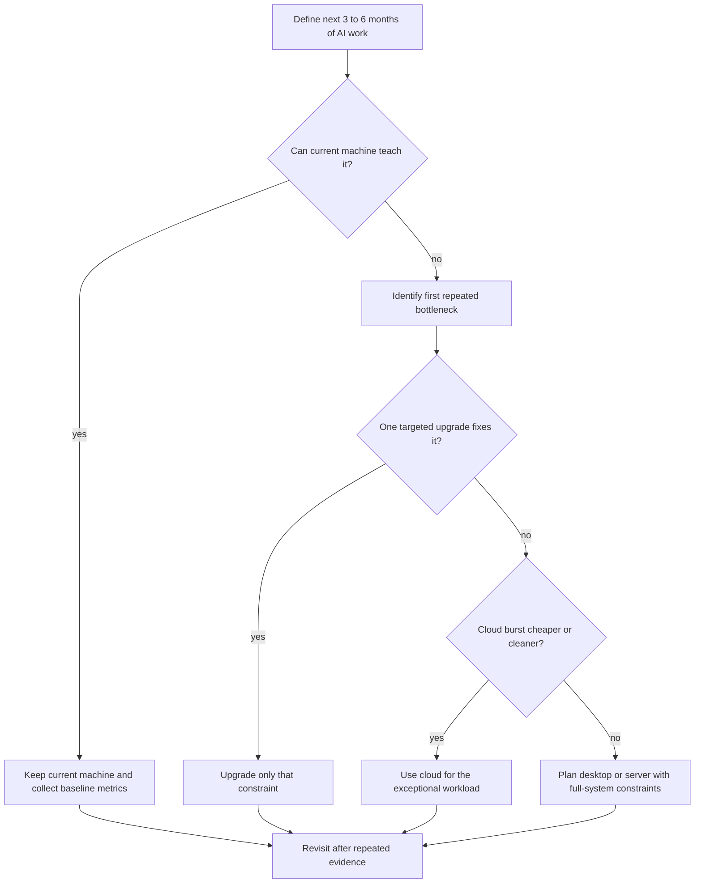

> **AI/ML Engineering Track** | Complexity: `[MEDIUM]` | Time: 2-3 hours

**Reading Time**: 2-3 hours

**Prerequisites**: Module 1.1 complete, basic comfort with terminal commands, package installation, and reading system specifications

---

## Learning Outcomes

By the end of this module, you will be able to:

- **Evaluate** whether a laptop, desktop, or small home server is appropriate for a specific AI learning workload.
- **Compare** CPU, RAM, VRAM, storage, thermals, power, and network constraints as system-level trade-offs rather than isolated parts.
- **Design** a staged home AI workstation plan that supports the next 3 to 6 months of work without overbuying.
- **Debug** common workstation bottlenecks by mapping symptoms such as slow model loading, crashes, throttling, and out-of-memory errors to likely causes.
- **Justify** when local hardware is the right tool and when short cloud usage is the more rational engineering choice.

---

## Why This Module Matters

Maya had a capable laptop, a new interest in local AI coding assistants, and a bookmarked shopping cart full of expensive hardware. She believed the purchase would make her learning serious. Then her first month of work turned out to be mostly Python environments, API calls, notebooks, Git workflows, and reading model documentation. The large GPU she almost bought would have sat idle while her real friction came from a crowded system disk and not enough memory for browser-heavy notebooks.

That story repeats constantly in AI engineering. People buy for status, benchmark charts, or social media screenshots before they understand their own workload. The result is not just wasted money. It is also wasted attention, because a learner who is fighting heat, noise, driver issues, bad storage layout, and unstable package installs is not learning model behavior, data flow, evaluation, or deployment discipline.

A home AI workstation is not a miniature datacenter. It is a learning instrument. The goal is to make repeated experiments cheap, private, and fast enough that you can iterate every day. That means the correct design depends on the work you will actually do soon: API-first application building, small local inference, embeddings and retrieval, notebooks, light fine-tuning, or always-on services.

This module teaches hardware as an engineering decision rather than a shopping list. You will learn how to reason from workload to bottleneck, from bottleneck to upgrade, and from upgrade to a staged plan. The senior-level skill is not naming the most powerful component. It is knowing which constraint matters first, which constraint can wait, and which workload should leave your house and run in the cloud.

---

## Core Content

### 1. Start With Workload, Not Hardware

The most reliable way to make a bad workstation decision is to begin with a component catalog. Hardware only becomes meaningful when it is connected to a job. A GPU that is excellent for one learner may be unnecessary for another, and a laptop that looks weak on paper may be completely adequate for API-first engineering work.

A practical workstation discussion starts with a time box. Ask what you need to accomplish in the next 3 to 6 months, not what you might theoretically do someday. Future-proofing sounds responsible, but unlimited future-proofing turns every decision into an excuse to overspend. In engineering, a useful plan has a bounded horizon, a known workload, and a measurable bottleneck.

For this module, treat home AI work as a set of workload families. API-first development depends mostly on CPU responsiveness, RAM, storage space, and a clean developer environment. Local inference depends heavily on VRAM, with RAM and storage close behind. Retrieval-augmented generation depends on RAM, storage, embeddings throughput, and reliable local services. Fine-tuning adds VRAM pressure, checkpoint growth, thermal load, and longer job duration.

The central question is not "Can this machine run AI?" Almost any modern machine can participate in AI engineering if the workload is chosen well. The stronger question is "Which AI workload becomes painful first on this machine, and is that pain worth fixing locally?" That framing leads to better decisions because it focuses attention on repeated friction instead of imagined prestige.

**Pause and predict:** If two learners both say "I need a machine for AI," but one plans to build API-backed tools and the other plans to run quantized local LLMs every day, which hardware constraint will diverge first? Write your answer before reading the next paragraph, then check whether you named a workload-specific bottleneck rather than a generic "more power" answer.

The API-first learner may be blocked first by RAM, package environment mess, disk space, or general development ergonomics. The local LLM learner is much more likely to hit VRAM first, then system RAM and storage. The same phrase, "AI workstation," hides different systems problems. Your job is to expose the specific system problem before spending money.

| Workload Family | Primary Bottleneck | Secondary Bottleneck | Local Fit |
|---|---|---|---|
| API-first AI applications | RAM, CPU responsiveness, environment reliability | storage, network | excellent on most modern laptops |
| Local coding assistant models | VRAM, RAM | storage, thermals | realistic on desktops and some laptops |
| Embeddings and RAG experiments | RAM, storage, embeddings throughput | CPU or GPU acceleration | very realistic on one machine |
| Notebook-heavy data exploration | RAM, storage | CPU, browser overhead | realistic if memory is not starved |
| Quantized LLM inference | VRAM | RAM, storage, thermals | realistic with the right single GPU |
| Small LoRA-style fine-tuning | VRAM, cooling | storage, RAM, job duration | realistic on selected single-GPU desktops |
| Large model training | multi-GPU bandwidth, storage fabric, budget | operations overhead | usually cloud or lab infrastructure |

This table is intentionally workload-first. It prevents the common mistake of treating all AI work as the same hardware problem. A learner building API-backed features can make excellent progress without local GPU investment. A learner studying local inference needs to care about model size, quantization, context length, and VRAM capacity much earlier.

The useful habit is to describe your next workload in one sentence. For example: "For the next 4 months, I will build API-first AI applications and run small notebooks." Another learner might write: "For the next 6 months, I will run local coding models, build a small RAG system, and test one lightweight fine-tuning workflow." Those two sentences lead to different machines, different upgrades, and different cloud decisions.

### 2. The Five Constraints That Actually Matter

A home AI workstation is a system, not a pile of parts. The GPU can be the star component, but it cannot rescue a machine with inadequate RAM, slow storage, unstable thermals, weak power delivery, or poor upgrade layout. Senior engineers reason about the whole path from dataset to model load to inference or training loop to artifact storage.

The five constraints that matter most are VRAM, system RAM, storage, thermals, and power or physical expansion. CPU, networking, and operating system support also matter, but they usually become decisive after the primary five are understood. This section builds the mental model that lets you debug symptoms later.

```ascii
+----------------------+        +----------------------+        +----------------------+
|      Your Task       |        |   First Constraint   |        |    Typical Symptom   |
+----------------------+        +----------------------+        +----------------------+
| Load local LLM       | -----> | VRAM                 | -----> | model will not fit   |
| Preprocess dataset   | -----> | system RAM           | -----> | swapping or crashes  |
| Save checkpoints     | -----> | NVMe capacity/speed  | -----> | slow runs, full disk |
| Run jobs for hours   | -----> | thermals/airflow     | -----> | throttling, noise    |
| Upgrade GPU later    | -----> | PSU/PCIe/case space  | -----> | rebuild required     |
+----------------------+        +----------------------+        +----------------------+
```

The diagram shows why workstation design is not solved by one purchase. Each task stresses a different part of the machine. If you only optimize the component with the best marketing, you can still end up with an unreliable workstation.

#### VRAM: The First Hard Wall For Local Models

VRAM is the memory physically attached to the GPU. For modern local model work, it is often the first hard wall because a model either fits comfortably, fits with compromises, or does not fit in a useful way. When it does not fit, the system may fall back to slower memory paths, reduce context length, lower batch size, use heavier quantization, or fail with out-of-memory errors.

VRAM affects model size, quantization choices, batch size, sequence length, and whether small fine-tuning is realistic. A developer running a tiny local model for code completion has different needs from someone testing longer-context inference, embedding batches, or LoRA-style adaptation. The key is to treat VRAM as capacity planning rather than a trophy number.

A useful beginner mistake to avoid is comparing GPUs only by raw compute. Compute matters after the workload fits. If the model, context, and batch do not fit in memory, theoretical speed becomes secondary. This is similar to having a fast truck that cannot carry the load you need to move.

For learning, think in bands rather than exact product names. Low VRAM is suitable for small quantized models, experimentation, and understanding the workflow. Midrange VRAM makes local inference much more comfortable and reduces the number of compromises. Higher VRAM on one card is where selected single-machine fine-tuning experiments start to become practical, especially with quantization and parameter-efficient methods.

**Pause and predict:** A model loads successfully with a short prompt, but the same model fails or becomes unstable when you increase context length and batch size. Which constraint should you investigate first, and why is CPU speed probably not your first suspect?

The first suspect is VRAM because context length and batch size directly increase memory pressure. CPU speed can affect latency, preprocessing, and parts of the pipeline, but the symptom described is capacity failure under a larger model memory footprint. Good debugging begins by mapping the symptom to the resource being stressed.

#### System RAM: The Second Wall That Shapes Comfort

System RAM is the memory used by the operating system, notebooks, Python processes, browsers, local databases, vector stores, preprocessing jobs, and CPU-side model operations. It is less glamorous than VRAM, but it determines whether the workstation feels stable during real learning. Many learners underestimate it because spec sheets and benchmark videos often focus on the GPU.

RAM matters whenever work leaves the GPU or surrounds the GPU. Dataset preprocessing, document chunking, embeddings pipelines, notebook experimentation, local service stacks, and browser-based documentation all consume memory. If the machine starts swapping to disk, the experience can become painfully slow even if the GPU itself is capable.

For a learner, too little RAM creates compound friction. You close browser tabs to run notebooks, stop local services to load a model, or restart processes after memory pressure causes instability. Each workaround interrupts the learning loop. A machine with balanced RAM often teaches better because the learner can keep documentation, code, notebooks, logs, and services open at the same time.

Do not treat RAM as a binary pass or fail. A smaller amount can be workable for API-first learning and lightweight notebooks. A moderate amount is a comfortable floor for serious local AI development. A larger amount becomes attractive when running several services together, maintaining local vector databases, preprocessing larger datasets, or doing CPU-heavy work.

#### Storage: The Constraint That Grows Quietly

AI workflows create and duplicate large files. Model weights, tokenizer files, datasets, embeddings, vector indexes, container layers, package caches, notebook outputs, fine-tuning checkpoints, evaluation logs, and experiment artifacts all compete for space. Storage problems often arrive later than RAM problems, which makes learners underestimate them at purchase time.

Fast NVMe storage matters for productivity, not just benchmark pride. Slow storage turns environment creation, model loading, dataset reads, checkpoint writes, and container operations into repeated delays. If every experiment starts with waiting, the cost is not just time. It is lost iteration frequency.

A healthy layout separates the operating system from large AI artifacts when possible. That does not always require multiple drives on day one, but it does require planning. Keep enough free space on the system disk for package managers, caches, temporary files, and updates. Place downloaded models, datasets, checkpoints, and indexes somewhere that can grow without threatening the OS.

The storage lesson is simple: assume growth. The first model download is interesting. The tenth model, three datasets, repeated checkpoints, and container layers become a capacity plan. A workstation that is otherwise adequate can become unreliable when the system disk is constantly full.

#### Thermals And Noise: Sustained Load Is The Real Test

AI workloads often run longer than ordinary desktop tasks. A laptop or compact desktop may perform well for a short benchmark but throttle during repeated inference, embeddings over a large corpus, or a multi-hour fine-tuning run. Sustained load reveals whether the machine is truly useful for learning.

Thermals are not cosmetic. Heat affects clocks, stability, component lifespan, fan noise, and whether the machine can share a room with you during a long job. A workstation that is technically fast but too loud to run while you study is not a good learning tool. A quiet, stable system that runs at a predictable speed often beats a more powerful system that constantly throttles.

Cooling also changes upgrade decisions. A GPU upgrade may require better case airflow, a stronger power supply, more clearance, or different fan curves. If those supporting changes are ignored, the upgrade can create a worse daily experience. The lesson is to evaluate the operating environment, not just the part.

Thermal debugging is practical. If performance starts high and then drops after minutes, suspect heat or power limits. If fans surge constantly and the room becomes uncomfortable, the machine may not fit your lifestyle even if benchmarks look good. Engineering decisions include human constraints because humans operate the system.

#### Power, PCIe, And Physical Expansion: Upgrade Paths Are Designed Early

Many beginner builds fail because the upgrade path was assumed rather than designed. A future GPU may need more power, more physical space, more cooling, and a suitable PCIe slot. Additional storage may need open M.2 slots or drive bays. Faster networking may need expansion space. A small case can be elegant but unforgiving.

Power supply headroom is not only about total wattage. Quality, connectors, transient load behavior, efficiency, and cable layout also matter. A system that barely supports today's components may be fragile tomorrow. For learning workstations, stable power is part of reliability.

PCIe layout matters because physical slots can conflict with GPU thickness, capture cards, storage adapters, or network cards. Some motherboards disable certain slots when multiple drives are installed. These details are easy to ignore until an upgrade arrives and does not fit electrically or physically.

The senior habit is to read the platform as an upgrade map. Before buying a desktop or used workstation, ask what can be expanded without replacing the core. If the answer is "almost nothing," then it may still be a good machine, but it should be treated as a fixed appliance rather than a long-term expandable workstation.

| Constraint | What It Controls | Healthy Design Question | Common Symptom When Undersized |
|---|---|---|---|
| VRAM | model fit, context, batch, fine-tuning viability | Can my target model and context fit without desperate compromises? | out-of-memory errors or severe fallback slowdowns |
| System RAM | notebooks, preprocessing, services, CPU-side work | Can I keep my normal learning environment open while running the workload? | swapping, crashes, browser tab pressure, stalled jobs |
| Storage | models, datasets, caches, checkpoints, containers | Can artifact growth happen without filling the system disk? | slow loads, failed installs, constant cleanup |
| Thermals | sustained performance and usability | Can this machine run the job for hours in my room? | throttling, fan noise, unstable clocks |
| Power and PCIe | upgrade path and stability | Can the platform support the next realistic component? | surprise rebuilds, connector problems, no slot clearance |
| CPU | preprocessing, orchestration, non-GPU work | Does the CPU keep the pipeline fed for my workload? | underused GPU, slow data prep, sluggish tools |
| Network | downloads, remote storage, cloud workflows | Can I move models and datasets without constant waiting? | slow pulls, failed syncs, awkward remote work |

### 3. Three Practical Workstation Archetypes

Most home AI setups fall into three archetypes: laptop-first, single-GPU desktop, and small home server or used workstation. These are not strict categories. They are decision patterns. The archetype tells you which strengths you are buying and which limits you must accept.

A laptop-first setup is the lowest-friction starting point. It is portable, already available for many learners, and perfectly adequate for API-first development, Python environments, notebooks, documentation, Git workflows, and small local experiments. Its main weaknesses are thermal limits, limited upgradeability, smaller storage options, and often limited VRAM.

A single-GPU desktop is usually the best long-term learner value for local inference, embeddings, RAG, and first fine-tuning attempts. It offers better cooling, easier storage expansion, more stable sustained performance, and a cleaner upgrade path. Its trade-off is that it is not portable and still does not solve datacenter-scale training.

A small home server or used workstation is useful when jobs should run continuously, services need to stay up, or storage-heavy learning becomes important. It can host vector databases, model servers, experiment tracking, or background pipelines. Its trade-offs are noise, power use, maintenance, space, and operational complexity.

| Archetype | Best For | Strengths | Limits |
|---|---|---|---|
| Laptop-first | API coding, notebooks, small models, travel | already owned, portable, simple start | thermal limits, weak upgrade path, limited sustained load |
| Single-GPU desktop | local inference, RAG, embeddings, light fine-tuning | best learner value, expandable, stable under load | stationary, still single-machine constrained |
| Small home server or used workstation | always-on services, background jobs, storage-heavy labs | continuous experiments, self-hosting, separation of duties | noise, power draw, operations overhead |
| Cloud burst paired with local machine | occasional large jobs beyond home limits | no local heat, access to bigger hardware, pay per use | cost surprises, setup repeatability, data transfer friction |

For most serious local AI learners, the single-GPU desktop is the best default upgrade path after a laptop becomes limiting. That does not mean every learner should buy one immediately. It means that if repeated local inference, embeddings, and fine-tuning experiments become central to your learning, the desktop shape solves more constraints at once than a thin laptop.

A laptop remains valuable even after a desktop enters the picture. Many engineers use the laptop for code, documentation, Git, remote access, and light notebooks while the desktop handles heavier local runs. This split can be more ergonomic than forcing one machine to be perfect at everything.

A home server should usually arrive later. If you have not yet run local inference, containerized a service, maintained a Python environment, or managed a local vector store on one machine, a multi-machine lab adds complexity before it adds insight. Learn the single-node lessons first, then add always-on infrastructure when the operational learning itself becomes the goal.

```ascii
+-----------------------+       +-------------------------+       +-------------------------+
|   Stage 1: Laptop     |       |   Stage 2: Desktop      |       |   Stage 3: Home Server  |
+-----------------------+       +-------------------------+       +-------------------------+
| API apps              | ----> | local inference         | ----> | always-on services      |
| notebooks             |       | embeddings              |       | vector DB persistence   |
| Git and tooling       |       | RAG experiments         |       | background jobs         |
| small experiments     |       | light fine-tuning       |       | remote access patterns  |
+-----------------------+       +-------------------------+       +-------------------------+
        keep if enough                  upgrade when repeated                 add only when service
        for next workload               bottlenecks are proven                operation is the lesson
```

This progression is not mandatory, but it is a useful default. It avoids the trap of beginning with a complex home lab before you know which workloads deserve to run there. Each stage earns the next stage by exposing a real constraint.

### 4. Sizing Rules That Age Well

Hardware recommendations age quickly. Specific models, prices, and availability change, but the workload constraints stay recognizable. Durable sizing rules focus on memory capacity, storage growth, thermal behavior, and upgrade flexibility instead of pretending that one current part is the permanent answer.

For RAM, start by asking how many things need to be open during learning. A small memory system can handle focused API-first work, but it becomes restrictive when notebooks, browsers, local databases, model processes, and container tools run together. A comfortable learner system leaves headroom for ordinary multitasking while experiments run.

For VRAM, ask what model class, quantization level, context length, and batch behavior you expect. Small local models and experiments can tolerate lower VRAM. Comfortable local inference needs more space so every run is not a compromise. Fine-tuning, even parameter-efficient fine-tuning, pushes the requirement higher because optimizer state, activations, sequence length, and checkpoints all affect memory behavior.

For storage, plan for both capacity and speed. The system disk should not live permanently near full capacity. AI artifacts should have room to grow. If a machine supports an additional NVMe drive, that upgrade can be one of the best productivity improvements for a learner who downloads models and datasets regularly.

For thermals, evaluate sustained behavior rather than peak behavior. A machine that performs well for a short test may still be a poor workstation if it throttles, becomes noisy, or overheats during a longer run. Your learning schedule matters: a machine used in a bedroom, shared apartment, or small office must satisfy practical noise and heat constraints.

For upgrade planning, document what can be changed later. Some laptops are nearly fixed. Some desktops can accept more RAM, storage, and a larger GPU with modest effort. Some used workstations have proprietary power supplies or unusual layouts that limit upgrades. A cheap used system can be excellent, but only if its constraints match your plan.

| Resource | Entry Learning Band | Comfortable Local Band | Heavier Home Band |
|---|---|---|---|
| RAM | enough for API-first work and light notebooks | enough for notebooks, services, embeddings, and browsing together | enough for multi-service stacks and heavier preprocessing |
| VRAM | small quantized models and workflow learning | comfortable inference with fewer compromises | selected single-card fine-tuning and larger contexts |
| Storage | one fast disk with disciplined cleanup | separate space for models, datasets, caches, and projects | multiple fast drives or dedicated artifact storage |
| Cooling | short jobs and light local experiments | sustained inference and embeddings without severe throttling | repeated long jobs with predictable noise and heat |
| Power | supports current components safely | leaves headroom for one realistic upgrade | supports future GPU, storage, and cooling plan |

Notice that the table avoids exact product names. That is deliberate. Your goal is not to memorize a fixed build. Your goal is to classify whether a machine is entry-level, comfortable, or heavy for your actual work.

**Decision check:** Imagine you have enough money for either more RAM, a larger SSD, or a better GPU, but not all three. Your notebooks are slow because the system swaps when browser tabs, a vector database, and preprocessing run together. Which upgrade should come first, and what evidence supports that choice?

The correct first upgrade is likely RAM, assuming the machine supports it. The symptom is memory pressure during multitasking and preprocessing, not model-fit failure. A better GPU might still be useful later, but it does not solve the first repeated bottleneck. This is how evidence-based upgrade planning prevents prestige buying.

### 5. Local, Cloud, Or Hybrid: The Cost And Control Trade-Off

Local hardware gives you privacy, repetition, immediate access, and a stable personal environment. It is excellent for daily iteration, small to medium experiments, debugging, learning toolchains, and building intuition about model behavior. It also gives you responsibility for heat, noise, power, drivers, storage, and hardware failures.

Cloud hardware gives you burst capacity, access to larger GPUs, easier experimentation with hardware you cannot own, and the ability to stop paying when work ends. It is excellent for occasional large jobs, tests that exceed local capacity, and time-sensitive experiments. It also introduces cost tracking, data transfer, remote environment reproducibility, account limits, and security decisions.

A hybrid strategy is often the most rational. Use local hardware for repeated learning loops and cloud hardware for occasional scale. This keeps daily practice cheap and fast while avoiding the fantasy that a home machine must satisfy every possible future workload.

The key economic question is utilization. A local purchase makes sense when the machine will be used frequently enough to justify ownership, maintenance, power, and opportunity cost. Cloud makes sense when the workload is rare, bursty, too large for home, or easier to isolate remotely.

Privacy also matters. Local work can keep personal documents, proprietary code, and experimental datasets on your own machine. Cloud work can still be secure, but it requires deliberate configuration. For early learners, the simplest secure workflow may be local development with carefully chosen cloud bursts for non-sensitive or properly prepared workloads.

| Decision | Choose It When | Avoid It When | Engineering Risk |
|---|---|---|---|
| Stay laptop-first | next workload is API-heavy or light local work | repeated local bottlenecks are already clear | underestimating future storage and RAM needs |
| Buy or build single-GPU desktop | repeated local inference, RAG, or fine-tuning is central | workload is rare, bursty, or uncertain | overspending before measuring constraints |
| Add home server | always-on services are part of the learning goal | single-machine basics are not mastered | operations overhead hides the AI lesson |
| Use cloud bursts | large jobs are occasional or heat/noise is unacceptable | work is constant and predictable locally | cost drift and environment drift |
| Use hybrid | daily iteration is local, scale tests are occasional | you cannot manage two environments cleanly | inconsistent dependencies and artifact movement |

The hybrid risk is environment drift. If local and cloud environments differ too much, results become hard to reproduce. Later modules cover reproducible Python, CUDA, and ROCm environments because hardware decisions and software reproducibility are connected. A powerful workstation with chaotic environments is still a weak learning platform.

### 6. Reading Symptoms Like An Engineer

A senior engineer does not diagnose hardware by guessing. They map symptoms to resources, gather evidence, and change one thing at a time. This habit is especially important in AI work because many failures look similar at first. A crash might be VRAM, RAM, driver mismatch, storage exhaustion, thermal instability, or a bad package environment.

Start by recording the workload and the symptom. Did the model fail at load time, during longer prompts, during batch processing, while writing checkpoints, or after running for an hour? The timing often points to the constraint. Load-time failures often implicate VRAM or storage. Degradation over time often suggests thermals, memory leaks, or disk growth. Failures during preprocessing often point to system RAM or CPU-side data handling.

Then collect system facts from the machine itself. Do not rely only on marketing specifications or memory. The commands below are designed for inventory, not benchmarking. Some commands only work on the platform or hardware that supports them, so treat missing output as information rather than panic.

```bash
# Linux: collect basic workstation inventory.
uname -a
lscpu | sed -n '1,20p'
free -h
df -h
lsblk -o NAME,SIZE,TYPE,MOUNTPOINT
lspci | grep -Ei 'vga|3d|display' || true
nvidia-smi --query-gpu=name,memory.total,driver_version --format=csv || true
```

```bash
# macOS: collect basic workstation inventory.
uname -a
sysctl -n machdep.cpu.brand_string
sysctl -n hw.memsize
df -h
system_profiler SPDisplaysDataType
system_profiler SPNVMeDataType
```

Inventory commands do not solve the problem by themselves. They give you a baseline: total memory, free storage, GPU identity, driver visibility, and disk layout. Once you know the baseline, you can compare it to the workload that failed.

For Linux systems with an NVIDIA GPU, `nvidia-smi` is useful during a workload because it shows memory use, utilization, temperature, and power information. For non-NVIDIA systems, use the vendor tools available for the platform, operating system activity monitors, and application logs. The principle is the same: watch the resource while the workload runs.

```bash
# Linux with NVIDIA GPU: observe resource pressure during a run.
watch -n 2 nvidia-smi
```

```bash
# Linux: observe memory and disk pressure during a run.
free -h
df -h .
uptime
```

```bash
# macOS: observe memory and disk pressure during a run.
vm_stat
df -h .
uptime
```

A good diagnosis connects evidence to action. If GPU memory is saturated and the model fails when context grows, lower context, use a smaller model, change quantization, or choose a GPU with more VRAM later. If system memory is saturated while preprocessing, reduce batch size, stream data, close competing services, or add RAM if possible. If storage is full, move artifacts and redesign the storage layout before buying compute.

The worst diagnosis is "the machine is bad." That phrase hides the constraint. Replace it with a testable statement: "This workload saturates VRAM when context length increases," or "This notebook plus vector database pushes system memory into swap," or "Checkpoint writes are slow because artifacts live on the same nearly full system disk." Testable statements lead to targeted fixes.

### 7. Worked Example: Designing A Workstation Plan For A Specific Learner

Jordan is a software developer who wants to spend the next 6 months learning AI engineering at home. Their budget is limited, they already own a recent laptop with moderate RAM, and they are tempted by a single-GPU desktop build. Their planned work is API-first application development for the first month, local embeddings and RAG experiments by month three, and one small LoRA-style fine-tuning experiment near the end of the period.

The first step is to identify what the current laptop can already teach. API-first development, Python packaging, Git workflows, notebooks, prompt evaluation, and basic service design do not require a local GPU. Jordan should not buy a desktop before discovering whether they can maintain clean environments, run notebooks reliably, and structure projects well. Those skills transfer directly to the future desktop.

The second step is to predict the first likely bottleneck. For month one, RAM and storage are more likely than GPU. If the laptop has limited free disk space, package caches, notebooks, and datasets may create friction early. If RAM is moderate but not generous, browser-heavy learning plus notebooks can become uncomfortable. The correct action is to measure those limits during actual work.

The third step is to design a staged plan instead of one big purchase. Stage one keeps the laptop, cleans the storage layout, and records real memory pressure while building API-first projects. Stage two adds cloud bursts only if a specific experiment exceeds the laptop. Stage three considers a single-GPU desktop if Jordan repeatedly runs local models, embeddings, and fine-tuning experiments enough to justify ownership.

The fourth step is to choose desktop priorities if the evidence supports buying. Jordan should prioritize adequate VRAM for target local models, enough system RAM to keep services and notebooks open, fast NVMe storage for models and checkpoints, reliable cooling, and a power supply with realistic headroom. They should not spend the entire budget on the GPU and leave the rest of the machine fragile.

The final recommendation is not "buy" or "do not buy." It is conditional: keep the laptop for API-first work now, measure RAM and storage pressure, use cloud for any rare large run, and buy or build the desktop only when local inference and RAG become repeated weekly work. That decision respects the learning sequence and avoids turning uncertain future ambition into immediate cost.

```ascii
+----------------------------+       +----------------------------+       +----------------------------+
| Jordan's Next Workload     |       | Evidence To Collect        |       | Decision                   |
+----------------------------+       +----------------------------+       +----------------------------+
| API-first apps             | ----> | RAM, disk, environment     | ----> | keep laptop first          |
| RAG experiments            | ----> | storage growth, RAM, speed | ----> | upgrade storage or desktop |
| Small fine-tuning attempt  | ----> | VRAM need, job duration    | ----> | desktop or cloud burst     |
+----------------------------+       +----------------------------+       +----------------------------+
```

This worked example is deliberately conservative. Conservative does not mean timid. It means each purchase is triggered by evidence from the learning path. A senior engineer can defend the plan because every stage names the workload, the likely bottleneck, the measurement, and the next action.

### 8. Building A Decision Framework You Can Reuse

The reusable framework is a sequence of questions. First, can the current machine teach the next concept? If yes, keep it and learn. Second, if it cannot, what is the first repeated bottleneck: VRAM, RAM, storage, thermals, power, or time? Third, can that bottleneck be fixed with one targeted change? Fourth, if not, is a short cloud run cheaper and cleaner than rebuilding locally? Fifth, only then consider a larger workstation or server path.

This sequence works because it separates learning goals from ownership goals. Many people enjoy hardware, and there is nothing wrong with that. The mistake is pretending that every hardware desire is a learning requirement. A framework helps you be honest about which decisions serve the curriculum and which decisions serve a hobby.

The framework also protects against premature clustering. A home cluster can teach networking, orchestration, service reliability, storage, and operations. It can also bury the learner under maintenance before they understand a single-node AI workflow. Unless the module goal is explicitly infrastructure operations, one reliable machine is usually the better first classroom.

Use the following decision flow when you feel the urge to upgrade. Do not skip the measurement step. If you cannot name the bottleneck from evidence, you are not ready to claim the upgrade is necessary.



The flow is intentionally slow. It makes you prove the problem before changing the system. That discipline is valuable beyond hardware. The same mindset appears in capacity planning, incident response, Kubernetes scheduling, MLOps platform design, and cost control.

### 9. Hardware Specifics Without Turning This Into A Shopping List

CPU choice matters, but not in the same way for every workload. API-first development, notebooks, preprocessing, data conversion, compression, and orchestration all use CPU. Local LLM inference may be GPU-dominant, but CPU still prepares data, manages processes, and coordinates the pipeline. A wildly unbalanced system can leave expensive GPU capacity waiting on slow data preparation.

Core count helps when workloads parallelize, but single-thread responsiveness still affects developer comfort. Package installs, editors, notebooks, and many scripts benefit from snappy cores. For learners, a balanced CPU is usually better than chasing an extreme part that forces compromises in cooling, noise, or budget.

Memory channels and expandability matter because RAM upgrades are easier on some platforms than others. A laptop with soldered memory may be locked forever. A desktop with open memory slots can adapt as workloads grow. Before buying, check whether the advertised memory capacity is the installed amount, the maximum supported amount, or a configuration that requires replacing existing modules.

GPU choice should start with software ecosystem compatibility. Many AI libraries are easiest on NVIDIA CUDA today, but other platforms can be reasonable depending on framework support, operating system, model format, and workload. The important beginner habit is to verify the toolchain you intend to use before buying hardware. A faster unsupported path is not faster if you spend weeks fighting compatibility.

Storage should include both active project space and artifact space. Active project space holds code, environments, notebooks, and current datasets. Artifact space holds downloaded models, checkpoints, vector indexes, logs, and container layers. If these share one small disk, cleanup becomes part of every lesson. If they are planned separately, the workstation feels calmer.

Networking becomes relevant when models, datasets, and artifacts move between local machines or cloud systems. A strong internet connection helps with downloads, but local network quality matters if you add a home server later. Do not design a network-heavy workflow before you need it, but do avoid choices that make future file movement painful.

Operating system choice affects driver support, package behavior, filesystem layout, and troubleshooting resources. Linux is common for AI engineering because many tools assume it, servers run it, and GPU documentation often targets it. macOS can be excellent for development and some local inference workflows. Windows can work, especially with WSL-based workflows, but you must be deliberate about paths, drivers, and environment boundaries.

The best workstation is the one whose constraints you understand. If you know why it was designed, what it can do, what it cannot do, and when you will revisit the decision, then even a modest setup can be excellent. If you do not know those things, an expensive setup can still be a poor teacher.

---

## Did You Know?

- **Quantization changes the memory conversation**: Lower-precision model representations can make larger models fit on smaller hardware, but they can also change speed, accuracy behavior, and supported operations, so they are a trade-off rather than magic.
- **Checkpoint growth can surprise learners**: Fine-tuning experiments may create repeated checkpoints, logs, and adapter files, which means storage planning matters even when the model itself already fits.
- **Sustained performance is different from peak performance**: A machine can look impressive in a short benchmark and still be a poor learning workstation if heat or noise makes long runs unpleasant.
- **Cloud and local hardware are complements**: Many strong learning setups use local machines for daily iteration and cloud hardware only for occasional jobs that exceed home constraints.

---

## Common Mistakes

| Mistake | What Goes Wrong | Better Move |
|---|---|---|
| Buying for model hype instead of the next 3 to 6 months of work | The machine is expensive but poorly utilized because the learner mostly does API, notebooks, and tooling work | Define the next workload first, then buy only when repeated bottlenecks appear |
| Treating laptops and desktops as interchangeable | The learner expects laptop portability and desktop sustained performance from the same device | Decide whether portability or long-running local workloads matter more for this stage |
| Spending the whole budget on the GPU | RAM, storage, cooling, and power become weak links that make the system unstable | Budget the workstation as a complete system, not as a GPU with leftovers |
| Ignoring storage growth | Model downloads, datasets, package caches, containers, and checkpoints fill the system disk | Plan fast artifact storage early and keep the operating system disk healthy |
| Building a multi-node home lab too early | Operations overhead hides the AI learning goal and creates too many failure modes | Master one reliable machine before adding service and network complexity |
| Confusing home-scale AI with production AI infrastructure | The learner expects datacenter-scale training behavior from a single home machine | Treat home hardware as a learning and iteration platform, not a miniature production cluster |
| Ignoring thermals and noise | Long jobs throttle, fans become distracting, and the machine is unpleasant to use | Evaluate sustained load, case airflow, room constraints, and cooling before upgrading |
| Choosing local hardware when cloud bursts are cheaper | Rare large jobs drive an oversized local purchase that sits idle most of the month | Use cloud for occasional scale and local hardware for repeated daily practice |

---

## Quiz

**Q1.** Your team has one modern laptop with moderate RAM and no dedicated high-VRAM GPU. For the next 4 months, the work is API-backed AI applications, prompt evaluation, Git workflows, and a few small notebooks. A teammate argues that buying a powerful desktop GPU now will "make the team serious." What decision would you recommend, and what evidence would you collect before revisiting it?

<details>
<summary>Answer</summary>

Keep the laptop-first setup for now and collect evidence about RAM pressure, storage growth, package environment reliability, and notebook performance. The described workload is not primarily local model inference or fine-tuning, so a large GPU is unlikely to be the first constraint. Revisit the desktop decision only after repeated local workloads show that VRAM or sustained GPU compute is blocking progress.

</details>

**Q2.** You can load a quantized local model with a short prompt, but the process fails or becomes unstable when you increase context length and run larger batches. CPU utilization is not especially high, and storage has enough free space. Which constraint should you investigate first, and what mitigation could you try before buying hardware?

<details>
<summary>Answer</summary>

Investigate VRAM first because context length and batch size increase model memory pressure. Before buying hardware, try a smaller model, a stronger quantization setting, shorter context, smaller batch size, or a different inference configuration. If those mitigations repeatedly make the workload unacceptable, then a GPU with more VRAM may be justified.

</details>

**Q3.** A learner wants to run local embeddings, a vector database, browser documentation, notebooks, and a small web service at the same time. The GPU has unused capacity, but the machine slows dramatically and begins swapping. Which upgrade or redesign is most aligned with the module's reasoning?

<details>
<summary>Answer</summary>

The most aligned fix is to address system RAM pressure first, either by adding RAM if the platform supports it or reducing concurrent services and batch sizes. The symptom is not primarily GPU capacity because the GPU is not saturated. The workload surrounds the GPU with memory-heavy processes, so system RAM is the likely first bottleneck.

</details>

**Q4.** Your workstation has enough VRAM for a local model and enough RAM for notebooks, but model loads, container builds, checkpoint writes, and dataset reads are slow. The system disk is nearly full and also holds models, projects, containers, and checkpoints. What should you change before blaming the GPU?

<details>
<summary>Answer</summary>

Redesign storage before blaming the GPU. Add or free fast NVMe storage, move large artifacts away from the system disk where possible, and keep enough free space for caches, temporary files, package managers, and updates. The symptoms point to storage capacity and speed rather than model compute.

</details>

**Q5.** A group wants to build a three-machine home lab immediately because they associate AI engineering with production infrastructure. They have not yet run local inference, containerized a model service, or maintained a vector store on one machine. How should you guide their next step?

<details>
<summary>Answer</summary>

Guide them to master one reliable machine first. A single machine can teach environment management, model loading, notebooks, vector stores, containers, serving basics, and bottleneck diagnosis. A multi-node lab is useful later when service operation and infrastructure behavior are the learning goals, but it adds distracting complexity too early in this scenario.

</details>

**Q6.** You have an apartment where heat and fan noise are major constraints. Your largest jobs happen only a few times per month, but daily work is light development and notebooks. A local desktop upgrade would be expensive and noisy. What architecture should you recommend?

<details>
<summary>Answer</summary>

Recommend a hybrid approach: keep local hardware for daily development and use cloud bursts for the occasional large jobs. The workload is rare and the local environment has strong heat and noise constraints, so owning larger hardware is not automatically rational. The main caution is to manage cloud cost, data movement, and environment reproducibility.

</details>

**Q7.** A used workstation looks inexpensive and powerful, but it has a proprietary power supply, limited case clearance, few open storage options, and unclear GPU support. The learner says they can "upgrade later." How would you evaluate this claim?

<details>
<summary>Answer</summary>

Treat the upgrade claim skeptically until the platform is mapped. Check power connectors, power headroom, PCIe slot layout, GPU clearance, storage slots, cooling, memory maximums, and driver compatibility. If those limits are tight, the workstation may still be useful as a fixed appliance, but it should not be purchased as an expandable long-term AI platform.

</details>

**Q8.** A desktop runs local inference quickly for the first few minutes, then slows down while fans become loud and temperatures rise. Memory and storage look acceptable. What category of problem does this suggest, and how should the learner validate it?

<details>
<summary>Answer</summary>

This suggests thermal or power-related throttling under sustained load. The learner should monitor temperatures, clocks, power draw, and performance during a longer run using platform tools such as GPU monitoring utilities, operating system activity monitors, or vendor tools. If performance falls as heat rises, improve airflow, fan behavior, case layout, or workload duration before assuming the GPU is too weak.

</details>

---

## Hands-On Exercise

Goal: audit the machine you already have, identify the first realistic bottleneck for your next AI workload, and choose a keep, upgrade, cloud, or hybrid plan based on evidence.

### Step 1: Define The Workload Before Reading Specs

Write one paragraph describing your next 3 to 6 months of AI engineering work. Use concrete language such as "API-first AI applications," "local coding models," "RAG experiments," "notebook-heavy data exploration," "small LoRA-style fine-tuning," or "always-on local services." Do not write "AI work" as the whole answer because that hides the decision.

- [ ] I described the next 3 to 6 months of work in one paragraph.
- [ ] I named at least one workload family from the module.
- [ ] I avoided choosing hardware before naming the workload.

### Step 2: Identify Your Current Archetype

Classify your current setup as laptop-first, single-GPU desktop, small home server or used workstation, cloud-first, or hybrid. Then write one sentence explaining why that archetype fits your actual use. A laptop connected to cloud GPUs is a hybrid workflow, not a weak desktop.

- [ ] I classified my current setup into an archetype.
- [ ] I wrote one sentence explaining the classification.
- [ ] I noted whether portability, sustained load, or always-on service operation matters most.

### Step 3: Collect System Facts From The Machine

Run the command block that matches your platform. Save the output in your notes. If a command is unavailable or not relevant, record that fact instead of treating it as failure.

```bash
# Linux
uname -a
lscpu | sed -n '1,20p'
free -h
df -h
lsblk -o NAME,SIZE,TYPE,MOUNTPOINT
lspci | grep -Ei 'vga|3d|display' || true
nvidia-smi --query-gpu=name,memory.total,driver_version --format=csv || true
```

```bash
# macOS
uname -a
sysctl -n machdep.cpu.brand_string
sysctl -n hw.memsize
df -h
system_profiler SPDisplaysDataType
system_profiler SPNVMeDataType
```

- [ ] I recorded CPU, RAM, storage, and GPU information where available.
- [ ] I recorded free space on the active project disk.
- [ ] I noted whether GPU tooling is visible to the operating system.
- [ ] I wrote down any unknowns instead of guessing.

### Step 4: Convert Raw Specs Into Constraints

Create a short constraint summary using this format:

```text
Workload:
Archetype:
Likely first bottleneck:
Evidence:
Second likely bottleneck:
Keep, upgrade, cloud, or hybrid:
Next action:
```

The important part is the connection between evidence and decision. A statement like "I need a better GPU" is too vague. A better statement is "Local model inference fails when context grows, and GPU memory is saturated, so VRAM is the first bottleneck."

- [ ] I named the likely first bottleneck.
- [ ] I connected the bottleneck to a symptom or measurement.
- [ ] I named a second bottleneck to monitor later.
- [ ] I avoided describing the whole machine as simply "good" or "bad."

### Step 5: Match Symptoms To Fixes

Use the table below to map what you observe to a likely action. If you have no symptom yet, choose "keep current machine and collect evidence" rather than inventing a problem.

| Symptom | Likely Constraint | First Fix To Try |
|---|---|---|
| model fails when context or batch grows | VRAM | smaller model, lower context, stronger quantization, smaller batch |
| notebooks slow while browser and services are open | system RAM | close competing processes, reduce service count, add RAM if supported |
| installs, model loads, and checkpoints are slow | storage | free space, move artifacts, add fast NVMe storage |
| performance drops after several minutes | thermals or power | monitor temperatures, improve airflow, reduce sustained load |
| upgrade part does not fit or lacks connectors | case, PCIe, power | redesign platform plan before buying |
| rare large jobs exceed local capacity | workload scale | use cloud burst with cost and environment controls |

- [ ] I matched at least one symptom to a likely constraint.
- [ ] I chose a first fix that targets that constraint.
- [ ] I did not choose a larger GPU for a non-GPU symptom.
- [ ] I documented what evidence would change my decision.

### Step 6: Make A Staged Plan

Write a staged plan with three checkpoints: now, after one month of evidence, and after the first repeated bottleneck. Each checkpoint should include a decision rule. For example, "If local model inference becomes weekly work and VRAM is saturated after quantization changes, plan a single-GPU desktop." Another example is "If the only large jobs are monthly, keep laptop-first and use cloud bursts."

- [ ] I wrote a now decision.
- [ ] I wrote a one-month evidence checkpoint.
- [ ] I wrote a decision rule for the first repeated bottleneck.
- [ ] I included cloud as an option instead of assuming every problem needs local ownership.

### Step 7: State The Final Recommendation

Write one final paragraph using this format: "For the next stage, I will choose `keep current machine`, `make one targeted upgrade`, `build or buy a single-GPU desktop`, `add an always-on box later`, or `use hybrid cloud bursts`, because..." The paragraph must name the workload, the bottleneck, and the evidence.

- [ ] My recommendation names a concrete option.
- [ ] My recommendation names the workload.
- [ ] My recommendation names the first bottleneck.
- [ ] My recommendation is based on measured or observed constraints.
- [ ] My recommendation avoids buying for prestige.

### Success Criteria

- [ ] You can state your workstation archetype and next 3 to 6 months of AI workload clearly.
- [ ] You have recorded actual RAM, GPU, storage, and basic system details from the machine.
- [ ] You can name the first likely bottleneck for your intended workload.
- [ ] You can explain why another attractive upgrade should wait.
- [ ] You have chosen one rational next step: keep, targeted upgrade, desktop plan, server later, cloud burst, or hybrid.
- [ ] Your decision is based on evidence rather than on the largest component you can afford.

---

## Next Modules

- [Reproducible Python, CUDA, and ROCm Environments](./module-1.3-reproducible-python-cuda-rocm-environments/)
- [Notebooks, Scripts, and Project Layouts](./module-1.4-notebooks-scripts-project-layouts/)
- [Local Models for AI Coding](../ai-native-development/module-1.2-local-models-for-ai-coding/)

## Sources

- [huggingface.co: bitsandbytes](https://huggingface.co/docs/transformers/en/quantization/bitsandbytes) — The Transformers bitsandbytes documentation explicitly says quantization reduces memory requirements and makes large models easier to fit on limited hardware.
- [huggingface.co: perf train gpu one](https://huggingface.co/docs/transformers/main/en/perf_train_gpu_one) — The official Transformers GPU training guide states that batch size affects memory usage and that the feasible batch size depends on the GPU.
- [huggingface.co: reducing memory usage](https://huggingface.co/docs/trl/reducing_memory_usage) — The TRL memory guide explains that large max_length values can spike memory usage and lead to OOM errors.
- [arxiv.org: 2305.14314](https://arxiv.org/abs/2305.14314) — The QLoRA paper shows that quantized LoRA-style fine-tuning can reduce memory use enough to make single-GPU fine-tuning feasible.
