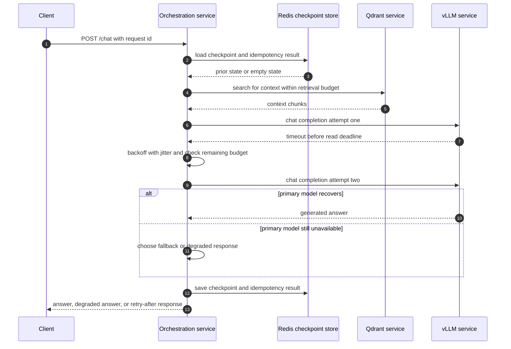

> **Complexity**: `[ADVANCED]`
>
> **Time to Complete**: 90-120 min
>
> **Prerequisites**: [LLM-Native Stack: Inference and Memory on Kubernetes](../module-3.1-llm-native-stack-k8s/), [High-Performance LLM Inference: vLLM and sglang](../ai-infrastructure/module-1.3-vllm-sglang-inference/)

---

## What You'll Be Able to Do

By the end of this module, you will be able to:

- **Design** an orchestration service boundary that separates product logic, retrieval, generation, state persistence, and backend protection without hiding those responsibilities inside vLLM or Qdrant.
- **Implement** internal service calls with cluster DNS, connection reuse, per-hop deadlines, request budgets, and readiness behavior that matches how Kubernetes actually routes traffic.
- **Diagnose** orchestration failures by distinguishing state loss, retrieval timeout, inference saturation, duplicate request replay, and caller-side cancellation from one another.
- **Evaluate** retry, fallback, circuit breaker, concurrency, and load-shedding choices using both reliability impact and cost impact rather than treating retries as harmless.
- **Compare** a framework-shaped implementation such as LangGraph with a custom workflow service by identifying the durable state and idempotency contract both approaches must satisfy.

## Why This Module Matters

Hypothetical scenario: a team finishes Module 3.1 and now has two healthy internal services: `vllm.llm-system.svc.cluster.local` for generation and `qdrant.llm-system.svc.cluster.local` for vector memory. The demo app is still a notebook that calls both services directly, holds conversation history in local process memory, and waits indefinitely when the model is slow. During a routine pod restart, one user sees a duplicated tool action, another waits ninety seconds for a request that should have failed fast, and the platform team cannot tell whether the problem was retrieval, generation, checkpoint state, or the notebook itself.

That failure is not caused by Kubernetes being unreliable or by LLMs being mysterious. It is caused by the missing application boundary between the user-facing request and the backing services. vLLM and Qdrant can be healthy as independent Kubernetes services while a user request still fails because the orchestration code has no timeout, no durable checkpoint, no idempotency key, no fallback policy, and no way to shed load before the GPU queue becomes saturated. The backing services answer "can I serve my own API?" The orchestration layer answers "can this user request be completed safely under the current budget?"

This module teaches that boundary. The orchestration service is the unit you deploy, version, observe, and scale separately from vLLM, Qdrant, and Redis. It receives the request, loads state, retrieves context, assembles the model call, writes progress, handles backend failure explicitly, and returns a user-facing response. The goal is not to memorize one agent framework. The goal is to make the request path reliable enough that Module 3.3 can gate deployments with evaluations and traces instead of testing a pile of undefined failure behavior.

## The Orchestration Boundary

The simplest mental model is that the orchestration layer is the air traffic controller for an LLM application. It does not build the aircraft, pave the runway, or control the weather. It decides which request is allowed to move, which dependency it needs next, how long it may wait, where progress is recorded, and what happens when a dependency cannot answer. Without that controller, every caller becomes its own improvised control tower, and the same failure is handled differently by notebooks, APIs, background jobs, and support tools.

Module 3.1 deliberately stopped below this layer. It made inference and memory reachable through Kubernetes Services, bound them with ResourceQuota and NetworkPolicy, and showed what backend restart symptoms look like. The orchestration service consumes that substrate but does not own it. If a GPU pod cannot schedule, the orchestration service should surface inference unavailable rather than mutating node labels. If Qdrant is rebuilding an index, the orchestration service should decide whether to wait, degrade, or fail rather than restarting the vector database.

The boundary is important because LLM applications combine two very different kinds of logic. Product logic decides who the user is, which tools they may call, what system prompt applies, what safety policy is in scope, and what a useful degraded answer looks like. Substrate logic decides whether a model server is ready, whether a vector collection can answer, whether Redis can persist state, and whether the GPU backend is saturated. The orchestration service is where those two kinds of logic meet, but it should still keep their responsibilities named.

```text
+--------------------------------------------------------------------------------+
|                              User or client API                                 |
|  Browser, CLI, webhook, internal service, batch job, or support workflow         |
+---------------------------------------+----------------------------------------+
                                        |
                                        v
+--------------------------------------------------------------------------------+
|                         Orchestration service Deployment                        |
|  Request validation, auth context, prompt assembly, retrieval plan, budgets,     |
|  retries, fallback policy, idempotency, checkpoint reads and writes              |
+-----------+-----------------------------+-----------------------------+--------+
            |                             |                             |
            v                             v                             v
+-----------------------+     +-----------------------+     +--------------------+
| vLLM Service          |     | Qdrant Service        |     | Redis Service      |
| generation backend    |     | vector memory backend |     | checkpoint state   |
| llm-system namespace  |     | llm-system namespace  |     | llm-system ns      |
+-----------------------+     +-----------------------+     +--------------------+
```

Notice what the diagram does not show. The client does not call vLLM directly. The browser does not send arbitrary prompts to Qdrant. Redis is not a magic memory sidecar hidden inside the app container. Each backing service has one clear reason to exist, and the orchestration service is the only component that knows how to combine their outputs into a product response. That narrow path gives you a place to enforce authentication, token budgets, tenant limits, audit logging, and quality gates later in the arc.

The orchestration layer also gives you a clean deployment unit. Changing the prompt assembly algorithm, fallback threshold, state schema, or retry policy should not require replacing the GPU inference backend. Updating vLLM flags, moving Qdrant storage classes, or replacing Redis with PostgreSQL-backed checkpointing should not require changing the public API contract. Those boundaries are not bureaucracy. They are how a team can improve one part of the system without turning every change into a full-stack incident.

This boundary becomes even more valuable when more than one client appears. A browser chat surface, a Slack bot, an internal batch summarizer, and a support-console assistant may all need the same inference and memory substrate, but they should not each invent their own retry loops and prompt assembly code. The orchestration service centralizes the rules that must be consistent: which tenants can use which model, which retrieval filters apply, which budget class is allowed, which state key identifies the conversation, and which fallback paths are acceptable. That centralization is not about making a monolith. It is about giving shared application policy one enforceable place to live.

Pause and predict: if Qdrant is unavailable but vLLM is healthy, should the orchestration service return a generic 500, retry generation, or make a retrieval-specific decision? The answer is retrieval-specific. Generation is not the failed dependency, and the user-facing choice depends on whether the product allows a clearly labelled ungrounded answer, a cached answer, or a retry-after response.

## Service Discovery And Internal Calls

Inside the cluster, the orchestration service should call the Module 3.1 services by Kubernetes DNS names, not pod IPs, node ports, or public ingress routes. A normal Service gives you a stable name that resolves to the Service's cluster IP, and Kubernetes keeps the endpoint list aligned with pods that match the selector and pass readiness. That is the contract the application should consume: `vllm.llm-system.svc.cluster.local:8000`, `qdrant.llm-system.svc.cluster.local:6333`, and `redis.llm-system.svc.cluster.local:6379`.

Using the fully qualified service name is not always required, because a pod's DNS search path can resolve shorter names in its own namespace. For cross-namespace calls, however, the explicit form prevents ambiguity. The orchestration pod will usually run in `llm-apps`, while vLLM, Qdrant, and Redis run in `llm-system`. A call to `http://vllm:8000` from `llm-apps` asks for a Service named `vllm` in `llm-apps`; a call to `http://vllm.llm-system.svc.cluster.local:8000` names the intended backend without relying on search-path luck.

Service discovery only solves naming. It does not solve time. Every internal call needs a deadline that is shorter than the caller's total request deadline, and those deadlines need to be designed together. A missing timeout on an LLM generation call is a latent outage because one slow backend can pin an application worker indefinitely. Once enough workers are pinned, new users cannot be served even if Kubernetes shows the pod as Running and the process is technically alive.

Deadlines should also flow from the caller into the work, not sit only at the outer HTTP gateway. If the client cancels after fifteen seconds but the orchestration service keeps generating for another minute, the cluster burns capacity for an answer nobody is waiting to receive. If the gateway has a thirty-second timeout and the vLLM client has a sixty-second read timeout, the model call may keep running after the client has already retried. A correct design propagates cancellation through the request context, stops optional work when the user budget is gone, and writes a checkpoint only when continuing work after disconnect is a deliberate asynchronous feature.

The useful pattern is a request budget that is allocated across hops. The total request might have a thirty-five-second deadline. Retrieval might receive eight hundred milliseconds for the first attempt and one retry. Checkpoint reads might receive two hundred milliseconds because a state store that cannot answer quickly should not hold a user connection hostage. Generation might receive twenty-five seconds, with a fallback branch if the primary model cannot respond. The exact numbers change by product, but the invariant is stable: no dependency gets unlimited time.

```yaml
requestBudgets:
  default:
    totalDeadlineMs: 35000
    checkpointReadMs: 250
    retrievalDeadlineMs: 800
    generationDeadlineMs: 25000
    checkpointWriteMs: 500
    maxInputTokens: 3200
    maxOutputTokens: 700
    maxGenerationAttempts: 2
    maxRetrievedChunks: 6
```

Connection pooling is the second half of the internal-call story. The orchestration service should create long-lived HTTP clients for vLLM and Qdrant when the process starts, then reuse those clients across requests. Creating a new TCP connection for every retrieval and generation call adds latency, increases file descriptor pressure, and hides saturation behind connection setup time. In Python, that usually means one `httpx.AsyncClient` per backend per process, configured with limits and timeouts. In Go, Java, Node, or Rust, the same idea applies through each runtime's pooled HTTP client.

```python
from __future__ import annotations

import os

import httpx


class BackendClients:
    """Illustrative client holder for one orchestration process."""

    def __init__(self) -> None:
        self.vllm = httpx.AsyncClient(
            base_url=os.environ["VLLM_BASE_URL"],
            timeout=httpx.Timeout(connect=1.0, read=25.0, write=2.0, pool=1.0),
            limits=httpx.Limits(max_connections=64, max_keepalive_connections=16),
        )
        self.qdrant = httpx.AsyncClient(
            base_url=os.environ["QDRANT_BASE_URL"],
            timeout=httpx.Timeout(connect=0.5, read=0.8, write=0.8, pool=0.5),
            limits=httpx.Limits(max_connections=32, max_keepalive_connections=8),
        )

    async def close(self) -> None:
        await self.vllm.aclose()
        await self.qdrant.aclose()
```

The timeouts above are not universal recommendations. They are a shape: connect timeout, read timeout, write timeout, and pool acquisition timeout are different failure modes. A pool timeout means your own process has no available connection slot. A connect timeout suggests service discovery, NetworkPolicy, endpoint availability, or backend saturation at the network boundary. A read timeout says the backend accepted the request but did not produce a response within budget. Treating all of those as "the AI is slow" throws away useful evidence.

Readiness and liveness for the orchestration pod should follow the same separation Module 3.1 applied to vLLM. Liveness should answer whether the process is wedged and should be restarted. It should not call vLLM, Qdrant, Redis, or an external API on every probe, because a dependency outage would make Kubernetes restart healthy application pods and amplify the incident. Readiness should answer whether this pod can accept more work now, which may include local queue capacity, configuration validity, and a recent dependency-health snapshot rather than a fresh deep call on every probe.

For an LLM app, readiness often has a backpressure role. If the local in-flight request counter is at its cap, readiness can fail so the Service stops routing more traffic to that pod while existing work drains. If Redis is hard down and the product requires durable state for every turn, readiness may fail because accepting new conversations would violate the state contract. If vLLM has one transient timeout but the fallback policy can still answer, readiness should probably stay true while the request path degrades. The difference is product-specific, so write it down instead of copying a generic `/healthz`.

## State, Checkpointing, And Idempotency

LLM workflows are stateful even when the HTTP endpoint looks stateless. A single user turn may load prior messages, retrieve context, call a model, call a tool, revise a plan, and store the result. A longer agent run may span multiple model calls and external actions before the final answer is ready. If all of that progress lives only in one pod's memory, a restart turns ordinary Kubernetes replacement into lost conversation state, duplicated work, or a confusing answer that forgets what happened earlier.

Checkpointing is the practice of recording workflow state at meaningful boundaries so a request can resume or at least fail with a known position. A checkpoint is not the same thing as a transcript. The transcript says what the user and assistant said. The checkpoint says where the workflow was, which retrieved context was used, which generation attempt happened, which tool step has already completed, what budget remains, and what idempotency key protects the turn. That extra structure is what lets a restarted pod continue safely.

Redis is a common checkpoint store for this teaching path because it is fast, familiar, and well supported by application frameworks. It is not automatically durable just because it runs as a Service. If checkpoints matter, the Redis deployment needs persistence settings, backups, resource requests, and an availability story that match the application. For a classroom design exercise, it is enough to name Redis as the checkpoint store and explain the contract. For production, you must decide whether Redis persistence, managed Redis, PostgreSQL, or another durable store is the right failure domain.

State design should separate hot workflow state from long-term memory. Hot workflow state is the material needed to resume the current turn: request identifiers, step status, selected budget class, retrieved chunk references, tool results, attempt counts, and final response. Long-term memory is material intentionally retained across conversations, such as user preferences, saved facts, or durable records of completed work. Mixing them makes retention and deletion hard. A checkpoint store should not quietly become an infinite user-profile database, and a long-term memory store should not be required for every small retry window.

LangGraph is one implementation of this shape, not the shape itself. Its checkpointer model persists graph state so long-running, stateful workflows can resume, replay, or inspect prior state. A custom orchestration service can implement the same contract without LangGraph: load state by thread ID, run the next step, write a checkpoint, and make duplicate requests idempotent. The framework choice changes the API, but it does not remove the need for durable state boundaries.

```python
from __future__ import annotations

from typing import NotRequired, TypedDict


class OrchestrationState(TypedDict):
    thread_id: str
    request_id: str
    idempotency_key: str
    messages: list[dict[str, str]]
    retrieved_chunks: NotRequired[list[dict[str, str]]]
    generation_attempts: int
    budget_remaining_tokens: int
    answer: NotRequired[str]
    status: str


class Checkpointer:
    """Generic interface; a LangGraph checkpointer is one concrete option."""

    async def load(self, thread_id: str) -> OrchestrationState | None:
        raise NotImplementedError

    async def save(self, state: OrchestrationState) -> None:
        raise NotImplementedError

    async def remember_result(self, idempotency_key: str, result: dict) -> None:
        raise NotImplementedError

    async def load_result(self, idempotency_key: str) -> dict | None:
        raise NotImplementedError
```

Idempotency is the other half of durable state. A client retry, browser refresh, gateway timeout, or pod restart can cause the same user turn to arrive twice. If the orchestration service treats both arrivals as new work, it may charge for two generations, write two assistant messages, or call an external tool twice. An idempotency key turns "maybe this is a duplicate" into an explicit lookup. The key should be stable for one logical user turn, usually derived from tenant, conversation, client request ID, and turn sequence.

The idempotency store should record both completed results and in-progress ownership. If the same key arrives while another pod is already handling it, the service can wait briefly, return a retry-after response, or attach to the existing checkpoint depending on the product. If the key arrives after completion, the service should return the stored result rather than repeating retrieval and generation. That behavior is especially important when a gateway times out after thirty seconds but the backend completes at thirty-two seconds. The user's retry should receive the completed answer, not start a second expensive generation.

There is a storage cost lens here that is easy to miss. By default, a checkpointing system may store the full state at each step, and LLM state can grow quickly because messages, retrieved chunks, tool outputs, and model metadata are verbose. Storing six retrieved chunks with long text in every checkpoint is different from storing chunk IDs and a compact summary. A checkpoint should be rich enough to resume safely, but not so bloated that Redis memory becomes the hidden bill for every conversation.

Pause and predict: if the orchestration pod restarts after retrieval succeeds but before generation returns, which data must already be durable to resume correctly? At minimum, the thread ID, request ID, idempotency key, user turn, retrieval result or retrievable chunk IDs, generation attempt count, and remaining budget need to be recoverable. Without those fields, the restarted service cannot know whether to retrieve again, generate again, or return a duplicate-safe result.

## Explicit Failure Handling

Retries are useful only after you classify the failure. A connection reset during a vLLM pod replacement is a transient infrastructure symptom. A 400 response because the model name is wrong is a configuration bug. A Qdrant timeout while the collection is loading may be transient, but an empty retrieval result from a healthy collection is a data or query-quality issue. Retrying all of those failures with the same policy creates latency, wastes GPU time, and teaches the system to hide its own bugs.

The orchestration layer should define failure classes in code and in logs. Retrieval can fail because Qdrant is unreachable, because the collection is missing, because the query vector has the wrong dimension, because the search timed out, or because no useful chunks were found. Generation can fail because vLLM is unavailable, because the request exceeded context length, because the model returned a tool-call shape the product does not support, or because the per-request token budget is exhausted. State can fail because Redis is unavailable, because a checkpoint write timed out, or because the idempotency key is already owned by another request.

```python
from __future__ import annotations

import asyncio
import random
from collections.abc import Awaitable, Callable
from dataclasses import dataclass
from typing import TypeVar

T = TypeVar("T")


class TransientBackendError(RuntimeError):
    pass


class PermanentBackendError(RuntimeError):
    pass


@dataclass(frozen=True)
class RetryPolicy:
    attempts: int
    base_delay_seconds: float
    max_delay_seconds: float


async def call_with_backoff(
    operation_name: str,
    call: Callable[[], Awaitable[T]],
    policy: RetryPolicy,
) -> T:
    last_error: Exception | None = None

    for attempt in range(1, policy.attempts + 1):
        try:
            return await call()
        except TransientBackendError as exc:
            last_error = exc
            if attempt == policy.attempts:
                break
            delay = min(
                policy.max_delay_seconds,
                policy.base_delay_seconds * (2 ** (attempt - 1)),
            )
            jitter = random.uniform(0, delay * 0.25)
            await asyncio.sleep(delay + jitter)

    raise TransientBackendError(
        f"{operation_name} unavailable after {policy.attempts} attempts"
    ) from last_error
```

Backoff needs jitter because synchronized clients can create a recovery storm. If every orchestration pod retries exactly one second after a vLLM restart, the first ready backend receives a burst just as it is trying to stabilize. Jitter spreads retry attempts across time. The point is not to make the user wait randomly; the point is to avoid turning a small backend restart into a coordinated spike that fills the inference queue.

Circuit breaking is the next protection layer. A circuit breaker watches recent failures for one dependency and stops sending normal traffic when the dependency is clearly failing. During the open period, the orchestration service can return a fast degraded response, use a fallback model, answer from cache, or tell the user that generation is temporarily unavailable. After a short sleep window, the breaker allows a limited probe request. If that succeeds, traffic resumes. If it fails, the circuit stays open.

Circuit breakers are often misunderstood as availability magic. They do not make vLLM faster or Qdrant healthier. They protect users and backends from wasted work while the dependency is failing. A fast, honest fallback can be better than letting every request burn thirty seconds and then fail. The operational win is that failures become bounded: bounded attempts, bounded concurrency, bounded time, bounded cost, and bounded user confusion.

Breaker state should be observable and scoped. A single global "AI down" flag is too blunt because retrieval, generation, checkpointing, embedding, and tool calls have different failure domains. The orchestration service should expose which backend is open, half-open, or closed; how many requests were short-circuited; and which fallback path was used. That information gives operators a way to see whether the app is protecting the backend or merely hiding failures from users. It also gives reviewers in Module 3.3 a concrete trace dimension for evals that run during degraded conditions.

Graceful degradation needs product language, not just code branches. If retrieval fails but the model is available, a support assistant might answer with a clear label: "The private knowledge base is unavailable right now, so this answer is general guidance." A compliance assistant might refuse to answer without retrieved policy context. A code assistant might use cached documentation chunks from the last successful retrieval if their freshness is acceptable. The same backend symptom leads to different user experiences because the product risk is different.

Bounded concurrency protects the GPU backend before Kubernetes autoscaling can react. An orchestration pod can use a semaphore for generation calls, a separate cap for retrieval calls, and a queue depth limit for incoming requests. When the cap is reached, the service should shed load with a clear response rather than accepting unlimited work. This is especially important for GPU inference because a small number of long generations can occupy capacity while new short requests pile up behind them.

```python
import asyncio

generation_slots = asyncio.Semaphore(12)


async def generate_with_limit(payload: dict) -> dict:
    try:
        async with asyncio.timeout(26):
            async with generation_slots:
                return await call_primary_model(payload)
    except TimeoutError as exc:
        raise TransientBackendError("generation deadline exceeded") from exc
```

The cost lens is blunt: retries are not free. On a hosted API, a retried generation may duplicate input and output token charges. On self-hosted vLLM, the team may not see a per-token bill, but every retry still consumes GPU seconds, KV-cache memory, and queue space that another request could have used. If a request allows two full generation attempts, the worst-case generation cost is roughly doubled before you count retrieval, checkpoint writes, tracing, or fallback calls. A reliable system budgets retries because it respects both users and capacity.

The same logic applies to fallback. A fallback path that calls another model, performs another retrieval, or writes another trace can be the right user experience, but it still consumes capacity. Treat fallback as a budgeted branch with its own metrics, not as an invisible rescue path.

## Request Budgets And Backpressure

Request budgets turn policy into arithmetic. Instead of saying "try to answer quickly," the orchestration layer carries explicit limits: total deadline, max input tokens, max output tokens, max retrieved chunks, max tool calls, max generation attempts, max queue wait, and max cost tier. These values can come from a static ConfigMap, a tenant plan, a request header accepted only from trusted callers, or a policy service. The important part is that each downstream call consumes from the same budget rather than inventing its own limits.

Token budgets are not only about model context windows. They are also about latency, cost, and answer quality. A retrieval step that returns twenty large chunks may technically fit in the context window but leave too little room for the model's answer. A fallback model may have a smaller context limit than the primary model. A retry may need to reuse the same prompt and therefore spend the same input tokens again. The orchestration service should compute the prompt budget before it sends the generation request, not discover the overflow from a backend error.

```python
from dataclasses import dataclass


@dataclass
class TokenBudget:
    max_input_tokens: int
    max_output_tokens: int
    reserved_system_tokens: int = 400
    reserved_answer_tokens: int = 700

    def retrieval_room(self) -> int:
        room = self.max_input_tokens - self.reserved_system_tokens
        room -= self.reserved_answer_tokens
        return max(0, room)
```

Queue depth is the signal most teams forget until the outage. CPU utilization on the orchestration pod might look fine while all request workers are waiting on vLLM. GPU utilization might look high, but that does not tell you how many users are already queued at the application layer. A request queue metric gives you an earlier backpressure signal: when queue wait exceeds the allowed budget, reject or degrade before the user spends the whole deadline waiting for a slot that will never arrive.

Queue design should preserve fairness across tenants and request classes. If one tenant sends many background synthesis requests, those jobs should not starve short interactive requests from another tenant. A simple first-in-first-out queue can be unfair when request costs vary widely, because one long context generation may sit ahead of several small answers. Even if the first implementation uses an in-process queue, write the policy in terms of budget class, tenant limit, and maximum wait. That language makes it possible to move the work to a real queue later without changing the product contract.

Backpressure should happen at several boundaries. The HTTP server can limit accepted connections. The orchestration process can cap in-flight requests. The generation client can cap concurrent vLLM calls. The retrieval client can cap Qdrant calls. The readiness endpoint can fail when local queue depth is too high. Each boundary prevents a different kind of overload. Relying only on the GPU backend to say "I am busy" is too late because the application has already accepted work and may already owe the user a response.

Load shedding is not the same as giving up. A well-designed overload response preserves trust by being fast and specific. For example, the service might return `429 Too Many Requests` with a short retry-after when the local queue is full, `503 Service Unavailable` when the primary model circuit is open and no fallback is allowed, or a degraded answer when retrieval times out but product policy permits general guidance. Those responses are easier for clients to handle than a long wait followed by a generic 500.

The cost lens for backpressure is capacity protection. Suppose one generation attempt uses a twenty-five-second read deadline and the service allows two attempts. A single request can occupy a generation slot for roughly fifty seconds before fallback. If twelve slots are available per pod, a burst of long prompts can fill the pod for nearly a minute even though Kubernetes still reports the pod as Ready unless you connect readiness to queue pressure. Backpressure converts that hidden occupancy into an explicit admission decision.

One practical design is to keep a small table of budget classes. A "fast answer" path uses fewer retrieved chunks, lower output tokens, and one generation attempt. A "deep answer" path uses more context and permits a longer generation deadline. A "background synthesis" path may run asynchronously and write the result later. Those classes are easier to reason about than allowing every request to choose arbitrary values. They also give Module 3.3 a clean input for eval gates: each budget class can have its own quality and latency criteria.

```yaml
budgetClasses:
  fast:
    totalDeadlineMs: 12000
    maxRetrievedChunks: 3
    maxInputTokens: 1800
    maxOutputTokens: 300
    maxGenerationAttempts: 1
  standard:
    totalDeadlineMs: 35000
    maxRetrievedChunks: 6
    maxInputTokens: 3200
    maxOutputTokens: 700
    maxGenerationAttempts: 2
  background:
    totalDeadlineMs: 180000
    maxRetrievedChunks: 10
    maxInputTokens: 6000
    maxOutputTokens: 1400
    maxGenerationAttempts: 2
```

## Deploying The Orchestration Service

The Kubernetes deployment shape should make dependencies visible. The orchestration service needs a Deployment because it is stateless in local process memory, a Service because clients need a stable internal or ingress-facing endpoint, a ConfigMap because budgets and backend URLs are reviewable policy, and a Secret for credentials or tokens that should not live in source. It also needs resource requests so the scheduler can place it predictably, probes that reflect process and admission health, and labels that let NetworkPolicy and future metrics selectors identify it.

Those NetworkPolicy labels are the point where the access boundary closes. The orchestrator is meant to be the only component that reaches inference and memory directly, so pair it with policies on both ends: an ingress policy on Qdrant and Redis (in `llm-system`) that admits only the orchestrator's namespace, and — if your CNI enforces default-deny egress — an egress policy on the orchestrator that allows only vLLM (`8000`), Qdrant (`6333`), and Redis (`6379`). Module 3.1 introduced this pattern for vLLM ingress; the orchestration tier is where it earns its keep, because an open Redis or Qdrant behind a locked-down orchestrator is not a closed boundary.

The app should not mount model weights, Qdrant storage, or Redis data. Those belong to backing services. The orchestration pod should carry application code, configuration, and temporary memory only. That distinction keeps scaling simple: adding orchestration replicas increases request handling capacity without duplicating vector indexes or loading another GPU model. It also makes rollbacks simpler because a bad prompt assembly release can be rolled back independently from the vLLM image or Qdrant chart.

Configuration should be boring to review. Backend URLs, timeout profiles, concurrency caps, and budget classes belong in a ConfigMap because reviewers need to see when policy changes. Credentials, internal API tokens, and Redis passwords belong in a Secret because they should not appear in source or logs. Neither object should contain per-user state. When configuration and state are mixed, rollbacks become dangerous: reverting a bad budget value should not roll back conversation history, and deleting an old pod should not delete the state needed to answer duplicate requests safely.

```yaml
apiVersion: v1
kind: ConfigMap
metadata:
  name: llm-orchestrator-config
  namespace: llm-apps
data:
  VLLM_BASE_URL: "http://vllm.llm-system.svc.cluster.local:8000/v1"
  QDRANT_BASE_URL: "http://qdrant.llm-system.svc.cluster.local:6333"
  REDIS_URL: "redis://redis.llm-system.svc.cluster.local:6379/0"
  DEFAULT_BUDGET_CLASS: "standard"
  GENERATION_CONCURRENCY: "12"
  RETRIEVAL_CONCURRENCY: "32"
  REQUEST_QUEUE_LIMIT: "100"
---
apiVersion: v1
kind: Secret
metadata:
  name: llm-orchestrator-secrets
  namespace: llm-apps
type: Opaque
stringData:
  INTERNAL_API_TOKEN: "your-api-token-here"
```

The Deployment below is illustrative. It assumes the container exposes `/livez` for process liveness, `/readyz` for admission readiness, and `/metrics` for Prometheus scraping. The readiness probe should be implemented by the app, not by a shell command that calls every dependency on demand. The app can maintain recent backend health observations internally and combine them with queue depth, configuration validity, and state-store requirements to decide whether it should receive new traffic.

```yaml
apiVersion: apps/v1
kind: Deployment
metadata:
  name: llm-orchestrator
  namespace: llm-apps
  labels:
    app: llm-orchestrator
spec:
  replicas: 3
  selector:
    matchLabels:
      app: llm-orchestrator
  template:
    metadata:
      labels:
        app: llm-orchestrator
    spec:
      terminationGracePeriodSeconds: 45
      containers:
        - name: app
          image: ghcr.io/kubedojo/llm-orchestrator:0.1.0  # placeholder image — replace with your built orchestrator image
          imagePullPolicy: IfNotPresent
          ports:
            - name: http
              containerPort: 8080
            - name: metrics
              containerPort: 9090
          envFrom:
            - configMapRef:
                name: llm-orchestrator-config
            - secretRef:
                name: llm-orchestrator-secrets
          readinessProbe:
            httpGet:
              path: /readyz
              port: http
            periodSeconds: 5
            timeoutSeconds: 1
            failureThreshold: 2
          livenessProbe:
            httpGet:
              path: /livez
              port: http
            periodSeconds: 20
            timeoutSeconds: 1
            failureThreshold: 3
          resources:
            requests:
              cpu: "500m"
              memory: 512Mi
            limits:
              cpu: "2"
              memory: 2Gi
---
apiVersion: v1
kind: Service
metadata:
  name: llm-orchestrator
  namespace: llm-apps
  labels:
    app: llm-orchestrator
spec:
  type: ClusterIP
  selector:
    app: llm-orchestrator
  ports:
    - name: http
      port: 8080
      targetPort: http
```

Horizontal scaling for the orchestration service is useful, but it is not the same as scaling inference. Adding more orchestration pods can increase HTTP admission, retrieval parallelism, and checkpoint throughput. It does not create more GPU capacity behind vLLM. If the bottleneck is a single saturated model server, scaling the orchestration Deployment without backpressure may worsen the queue by sending more concurrent generation calls into the same backend. That is why the HPA hook below uses an application queue metric rather than pretending CPU alone captures LLM serving pressure.

```yaml
apiVersion: autoscaling/v2
kind: HorizontalPodAutoscaler
metadata:
  name: llm-orchestrator
  namespace: llm-apps
spec:
  scaleTargetRef:
    apiVersion: apps/v1
    kind: Deployment
    name: llm-orchestrator
  minReplicas: 3
  maxReplicas: 8
  metrics:
    - type: Pods
      pods:
        metric:
          name: llm_orchestrator_inflight_requests
        target:
          type: AverageValue
          averageValue: "20"
```

This HPA is a hook for Module 3.3, not a complete scaling strategy. A cluster needs a metrics pipeline that exposes `llm_orchestrator_inflight_requests` through the custom metrics API before the HPA can use it. Even after that works, you still need to compare orchestration scaling with vLLM capacity. The service should emit metrics for in-flight requests, queue wait, dependency latency, retry counts, circuit state, budget class, fallback path, and token counts so the next module can connect deployment gates to real request behavior.

The single-request flow now has enough structure to reason about failure. The client sends one request. The orchestrator checks idempotency, reads state, retrieves context, calls generation, retries if the failure is transient and budget remains, optionally falls back, writes a checkpoint, and returns the response. That sequence is longer than a notebook demo, but each step has a name and a budget. Named steps are debuggable. Anonymous waiting is not.



The final deployment detail is shutdown behavior. A rolling update sends termination to old pods while new pods become ready. The orchestration process should stop accepting new work, let in-flight requests finish within a drain deadline, write checkpoints for work that cannot finish, and close pooled backend clients cleanly. If the process simply exits, Kubernetes will replace it, but users may see duplicate turns and the next pod may not know where to resume. Graceful termination is part of the state contract, not an optional polish item.

## Patterns & Anti-Patterns

Reliable orchestration is less about one heroic function and more about small contracts that reinforce each other. These patterns are worth naming because they show up repeatedly across frameworks, languages, and hosting models. A team can use LangGraph, LangChain, LlamaIndex, a custom FastAPI service, or a Go workflow engine and still apply the same operational ideas.

| Pattern | What It Looks Like | Why It Works |
|---------|--------------------|--------------|
| Bounded dependency calls | Each call to Redis, Qdrant, and vLLM has a timeout that fits inside the total request deadline. | A slow backend cannot pin workers indefinitely, and logs can show exactly which hop consumed the budget. |
| Durable workflow checkpoints | The service records thread state, request ID, retrieved context references, attempt count, and final result at explicit boundaries. | Pod restarts and client retries become resumable or duplicate-safe instead of losing state or repeating expensive work. |
| Separate readiness and liveness | Liveness checks local process health, while readiness reflects admission capacity and state requirements. | Kubernetes does not restart healthy pods because a dependency is down, and overloaded pods can stop receiving new traffic. |
| Per-backend circuit breakers | Retrieval, generation, and state store failures are tracked independently with short open and half-open windows. | A Qdrant outage does not poison vLLM calls, and a failing model server does not consume every request deadline. |
| Budget classes | Requests choose from reviewed budget profiles such as fast, standard, and background instead of arbitrary limits. | Product behavior, cost, latency, and eval expectations can be discussed with concrete numbers. |

Anti-patterns usually come from optimism. The code assumes the demo path is the normal path, the backend will be fine, the user will not refresh, the pod will not restart, and the model will answer quickly. Production systems punish that optimism because ordinary events arrive together: a model restart, a user retry, a slow retrieval, and a deployment rollout can overlap in one request window.

| Anti-Pattern | Failure Mode | Better Approach |
|--------------|--------------|-----------------|
| Direct browser-to-vLLM calls | Users bypass auth context, retrieval policy, token budgets, and internal failure handling. | Put the orchestration service in front and allow direct inference access only from trusted application namespaces. |
| Infinite or default HTTP timeouts | A single slow generation can occupy a worker until the client gives up and retries somewhere else. | Allocate explicit per-hop deadlines from a total request budget and surface budget exhaustion as a named error. |
| Local-only conversation memory | A pod restart, rollout, or reschedule loses state and can make the next answer forget the prior turn. | Persist checkpoints in Redis or another durable store using thread IDs and idempotency keys. |
| Retrying every exception | Bad requests, wrong model names, auth failures, and schema bugs are hidden behind slow repeated attempts. | Retry only transient classes and fail fast on permanent request or configuration errors. |
| Scaling orchestration to fix GPU saturation | More app pods send more concurrent requests into the same constrained inference backend. | Combine orchestration HPA with generation concurrency caps, vLLM capacity metrics, and load shedding. |
| Deep dependency checks in liveness | Kubernetes restarts healthy application pods whenever Qdrant, Redis, or vLLM has a temporary issue. | Keep liveness local and use readiness, circuit state, and user-facing fallback for dependency health. |

## Decision Framework

Use the orchestration decisions below when you are designing the first production-shaped version of an LLM app. The framework intentionally starts from failure and budget questions rather than from a library choice. A framework can accelerate implementation, but it cannot decide your product's fallback behavior, state durability requirement, or acceptable cost per request.

| Decision | Choose This When | Avoid It When | Operational Check |
|----------|------------------|---------------|-------------------|
| Stateless request handler | Each request is independent, no multi-turn memory is required, and duplicate execution has no side effects. | The workflow spans turns, tools, retries, or long-running steps that must survive pod replacement. | Can a pod restart between retrieval and generation without confusing the user? |
| Redis checkpoint store | You need low-latency thread state, duplicate suppression, and resumability for conversational workflows. | You cannot operate Redis durably, need relational audit queries, or must keep long-lived history with strict transactional reporting. | Are persistence, backups, memory limits, and idempotency records part of the design? |
| One generation attempt | Latency and cost matter more than recovering from brief backend restarts, or the caller can retry later. | Short vLLM readiness windows are common and a second attempt often succeeds within user patience. | Does the request budget reserve time for backoff and a second read deadline? |
| Fallback model | A smaller or hosted model can produce an acceptable labelled answer under primary model failure. | The product requires the exact primary model, private context, or deterministic policy behavior. | Is the fallback answer clearly labelled and evaluated separately? |
| Cached or partial answer | The product can reuse recent context or return progress without pretending the result is complete. | The domain is safety-critical, policy-specific, or likely to mislead without fresh retrieval. | Is cache freshness visible in logs and user-facing metadata? |
| Load shedding | Queue wait exceeds the user budget or generation slots are full. | The request is asynchronous and can safely complete later outside the user connection. | Does the response include retry guidance or a job handle rather than a generic failure? |

```text
Start with the user request
        |
        v
Is durable state required for this turn?
        | yes                                      | no
        v                                          v
Load checkpoint and idempotency key          Validate request only
        |
        v
Can the request fit inside token and time budget?
        | yes                                      | no
        v                                          v
Run retrieval if required                     Reject or ask for narrower input
        |
        v
Did retrieval produce usable context?
        | yes                    | transient failure            | no useful context
        v                        v                              v
Call primary model       Retry or degrade by policy      Use no-context policy
        |
        v
Did generation succeed within budget?
        | yes                    | transient failure            | permanent failure
        v                        v                              v
Save result              Retry, fallback, or shed        Fail fast with clear error
        |
        v
Return answer with budget and degradation metadata
```

The framework should be reviewed with product owners, not only platform engineers. "Return a no-context answer" is not a purely technical decision. "Use a hosted fallback" may affect privacy, data residency, or cost. "Retry once" may be acceptable for an internal assistant and unacceptable for an interactive customer workflow. The orchestration layer is where those choices become executable policy, so the policy needs an owner.

## Did You Know?

1. Kubernetes documents **three** probe types for containers: startup, liveness, and readiness. The same documentation lists **four** probe mechanisms: `exec`, `grpc`, `httpGet`, and `tcpSocket`, which is why a probe design should name both the purpose and the mechanism instead of saying only "add a health check."
2. Kubernetes normal Services receive DNS **A and/or AAAA** records in the form `my-svc.my-namespace.svc.cluster-domain.example`, while headless Services resolve to the selected pod IPs. For this module, `vllm.llm-system.svc.cluster.local` is the stable Service name, not a pod address.
3. Redis persistence documentation gives `save 60 1000` as an RDB snapshot example, meaning Redis can snapshot after **60 seconds** if at least **1000** keys changed. That kind of setting matters when checkpoint loss would duplicate or forget user turns.
4. LangGraph's checkpointer integration table lists a growing set of backend package families — in-memory, SQLite, PostgreSQL, MongoDB, Redis, Azure Cosmos DB, and AWS-backed options among them, with more added over time. That breadth reinforces the main lesson: checkpointing is an architectural contract, not a requirement to choose one storage product forever.

## Common Mistakes

| Mistake | Why It Happens | How to Fix It |
|---------|----------------|---------------|
| Treating the orchestration service as a thin proxy to vLLM. | The first demo only forwards a prompt and returns a completion, so retrieval, state, and failure policy feel optional. | Make the service own request validation, budget allocation, state loading, retrieval, generation, fallback, and checkpoint writes. |
| Calling pod IPs or public ingress names from inside the cluster. | Developers copy whatever endpoint worked during debugging, including port-forward URLs and node addresses. | Use Kubernetes Service DNS names across namespaces and keep direct backend access internal to trusted callers. |
| Giving every backend the same timeout. | A single "request timeout" constant feels simple, but retrieval, state, and generation have different latency profiles. | Allocate a total deadline across per-hop budgets and log which hop exhausted its budget. |
| Storing full retrieved documents in every checkpoint. | It seems safer to persist everything, but repeated long context can grow state storage quickly. | Store compact state, chunk IDs, summaries, and enough metadata to resume or audit the request without duplicating large text unnecessarily. |
| Retrying generation after the user has already cancelled. | The backend task is detached from the caller's deadline, so expensive work continues after the result is no longer useful. | Propagate cancellation and deadlines through async tasks, then checkpoint only work that should continue intentionally. |
| Failing readiness for every transient dependency error. | Teams want Kubernetes to stop traffic during any backend issue, but brief failures can flap every pod out of Service endpoints. | Base readiness on local admission capacity and required state guarantees, while using circuit breakers and fallbacks for backend-specific failures. |
| Returning degraded answers without metadata. | The service tries to be helpful but hides that retrieval failed, a fallback model was used, or cached context was stale. | Include structured response metadata and logs that identify fallback path, budget class, retrieval status, and model used. |
| Scaling app pods without protecting vLLM. | HPA responds to application pressure, but all new replicas call the same constrained GPU backend. | Pair HPA with generation concurrency limits, queue-depth readiness, per-backend circuit breakers, and inference capacity planning. |

## Quiz

<details>
<summary>Your orchestration pods are Running, but users wait until their browser times out whenever vLLM is slow. What design flaw should you look for first?</summary>

Look for missing or misallocated deadlines on the vLLM call and on the total request. A Running pod can still have all of its workers blocked on slow generation reads, especially if the HTTP client uses an infinite default timeout. The fix is not simply to restart pods; the orchestration service needs bounded read time, bounded connection-pool wait, and a fallback or load-shedding path when the generation budget is exhausted.

</details>

<details>
<summary>Qdrant times out during retrieval, but vLLM is healthy. Should the service retry generation, return a no-context answer, or fail the request?</summary>

It should make a retrieval-specific decision based on product policy and remaining budget. Retrying generation does not address the failed dependency because the prompt has not been assembled with context. A low-risk assistant might return a clearly labelled no-context answer, while a policy assistant should fail or ask the user to retry because an ungrounded answer would be misleading.

</details>

<details>
<summary>A client retries the same turn after a gateway timeout, and the application writes two assistant messages. Which contract was missing?</summary>

The missing contract is idempotency for one logical user turn. The service should derive or require an idempotency key, record in-progress and completed results, and return the stored result when the same key arrives again. Checkpointing alone records state, but idempotency tells the service whether a new HTTP request is actually duplicate work.

</details>

<details>
<summary>Your liveness probe calls Redis and restarts the pod whenever Redis has a short outage. Why is this harmful?</summary>

Liveness should answer whether the local process is wedged and needs a restart. Calling Redis from liveness turns a dependency outage into application restarts, which can drop in-flight work and amplify the incident. Redis availability belongs in readiness policy, circuit state, and request handling, with checkpoint failure surfaced explicitly to the caller when durable state is required.

</details>

<details>
<summary>The team wants to scale the orchestration Deployment from three pods to twelve because generation latency is high. What question should be answered before changing replicas?</summary>

Ask whether the bottleneck is application admission or inference capacity. If vLLM is already saturated, more orchestration pods may send more concurrent calls into the same GPU backend and make queueing worse. Inspect in-flight generation, vLLM latency, GPU utilization, queue wait, and circuit state before deciding whether to scale app pods, reduce concurrency, add inference capacity, or shed load.

</details>

<details>
<summary>A workflow framework promises durable execution. Why do you still need to design request budgets and fallback behavior?</summary>

Durable execution helps preserve state and resume work, but it does not decide how long a user should wait, how many tokens a request may spend, or whether a degraded answer is acceptable. Those are application policy decisions. A framework can provide the checkpoint API while the orchestration service still owns deadlines, idempotency keys, cost limits, and user-facing failure semantics.

</details>

<details>
<summary>Retrieval returns no chunks from a healthy Qdrant collection. Should the retry policy treat this like a transient backend failure?</summary>

Usually no. An empty result from a healthy collection may reflect query wording, embedding mismatch, filters, missing data, or a legitimate absence of relevant content. Retrying the same search immediately is unlikely to change the outcome unless the collection is actively being updated. The service should follow a no-context policy, broaden retrieval deliberately, or ask for clarification rather than hiding the condition behind generic backoff.

</details>

## Hands-On Exercise

This is a design exercise, not a runnable lab. Use the Module 3.1 substrate as the assumed environment: vLLM and Qdrant are internal Services in `llm-system`, and the new orchestration service will run in `llm-apps`. Your goal is to produce a reviewable design note for the application boundary before anyone writes a deployment pipeline or a full kind-cluster lab.

### Task 1: Draw the request path and name each failure boundary

Sketch the path from client to orchestration service, then to Redis, Qdrant, and vLLM. For each arrow, write one timeout, one likely transient failure, and one failure that should not be retried.

<details>
<summary>Solution</summary>

A strong sketch shows the client calling only `llm-orchestrator`, with the orchestrator calling `redis.llm-system.svc.cluster.local`, `qdrant.llm-system.svc.cluster.local`, and `vllm.llm-system.svc.cluster.local`. Redis transient failures include connection timeout or brief failover, while a malformed checkpoint schema should not be retried blindly. Qdrant transient failures include readiness windows and request timeouts, while wrong vector dimension is a permanent request or data bug. vLLM transient failures include connection reset during pod replacement, while an unknown model name should fail fast.

</details>

### Task 2: Allocate a standard request budget

Create a budget for one interactive request with a total deadline, checkpoint read and write limits, retrieval limit, generation limit, max retrieved chunks, max output tokens, and max generation attempts. Explain which value you would reduce first during overload.

<details>
<summary>Solution</summary>

A reasonable standard budget might use a thirty-five-second total deadline, two hundred fifty milliseconds for checkpoint read, eight hundred milliseconds for retrieval, twenty-five seconds for generation, five hundred milliseconds for checkpoint write, six retrieved chunks, seven hundred output tokens, and two generation attempts. During overload, reduce retrieved chunks and output tokens before increasing timeouts, because smaller prompts and shorter answers lower both latency and cost. If the generation queue is already full, shed load or switch budget class rather than allowing unlimited waits.

</details>

### Task 3: Define checkpoint contents

List the fields that must be persisted before retrieval, after retrieval, after generation, and after response. Mark which fields are needed for idempotency and which are needed for audit or debugging.

<details>
<summary>Solution</summary>

Before retrieval, persist thread ID, request ID, idempotency key, user turn, budget class, and initial status. After retrieval, persist retrieved chunk IDs or compact context references, retrieval latency, and retrieval status. After generation, persist model name, generation attempt count, token usage, fallback path, answer draft, and error class if generation failed. After response, persist the final result tied to the idempotency key so a duplicate client retry can return the same answer without repeating the workflow.

</details>

### Task 4: Choose fallback behavior for three products

Compare a documentation assistant, a compliance policy assistant, and an internal brainstorming assistant. Decide what each should do when retrieval fails but generation is still available.

<details>
<summary>Solution</summary>

The documentation assistant can often return a labelled general answer if it clearly states that private documentation retrieval is unavailable, though it should avoid pretending the answer is grounded. The compliance policy assistant should usually fail closed or ask the user to retry because an ungrounded policy answer can cause real harm. The brainstorming assistant may continue with a fallback model or no-context answer because the task is exploratory and lower risk. The same backend symptom receives different handling because product risk changes the correct failure policy.

</details>

### Task 5: Review the deployment shape

Read the illustrative ConfigMap, Secret, Deployment, Service, and HPA hook from this module. Identify one field that controls backend addressing, one field that controls local backpressure, one probe decision, and one scaling caveat.

<details>
<summary>Solution</summary>

Backend addressing is controlled by values such as `VLLM_BASE_URL`, `QDRANT_BASE_URL`, and `REDIS_URL`, which use internal Service DNS names. Local backpressure is controlled by values such as `GENERATION_CONCURRENCY`, `RETRIEVAL_CONCURRENCY`, and `REQUEST_QUEUE_LIMIT`. The readiness probe should reflect admission capacity and required state guarantees, while liveness should stay local to the process. The HPA caveat is that scaling orchestration pods does not add GPU inference capacity, so the app still needs generation caps and backend-aware metrics.

</details>

Success criteria:

- [ ] Your diagram has exactly one user-facing orchestration entry point and no direct client access to vLLM, Qdrant, or Redis.
- [ ] Every backend call has a timeout, retry classification, and permanent-failure example.
- [ ] Your checkpoint design supports pod restart, client retry, and duplicate-safe final result lookup.
- [ ] Your fallback policy changes by product risk instead of applying one generic degraded answer everywhere.
- [ ] Your deployment review distinguishes orchestration scaling from inference capacity and names the metric you would watch before increasing replicas.

## Sources

- Kubernetes, "DNS for Services and Pods": https://kubernetes.io/docs/concepts/services-networking/dns-pod-service/
- Kubernetes, "Liveness, Readiness, and Startup Probes": https://kubernetes.io/docs/concepts/workloads/pods/probes/
- Kubernetes, "Service": https://kubernetes.io/docs/concepts/services-networking/service/
- Kubernetes, "Network Policies": https://kubernetes.io/docs/concepts/services-networking/network-policies/
- Kubernetes API Reference, "HorizontalPodAutoscaler autoscaling/v2": https://kubernetes.io/docs/reference/kubernetes-api/autoscaling/horizontal-pod-autoscaler-v2/
- vLLM, "OpenAI-Compatible Server": https://docs.vllm.ai/en/latest/serving/online_serving/openai_compatible_server/
- Qdrant, "Collections": https://qdrant.tech/documentation/manage-data/collections/
- Redis, "Persistence": https://redis.io/docs/latest/operate/oss_and_stack/management/persistence/
- LangGraph, "Persistence": https://docs.langchain.com/oss/python/langgraph/persistence
- LangGraph, "Checkpointer integrations": https://docs.langchain.com/oss/python/integrations/checkpointers/index

## Next Module

Once the orchestration service handles backend failure, the next module gates its deployments with automated evals before traffic rolls: [Production Gates: LLM Evals in CI](../module-3.3-llm-evals-in-ci/).
