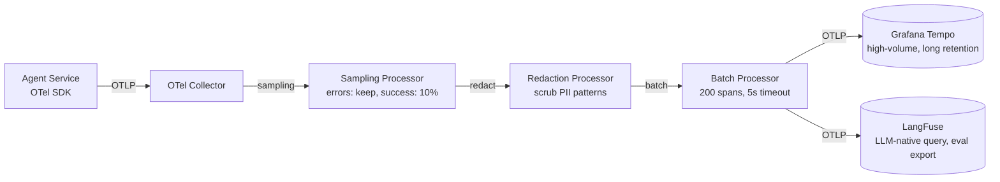

> **Complexity**: `[ADVANCED]`
>
> **Time to Complete**: 90-120 min
>
> **Prerequisites**: [Production Gates: LLM Evals in CI](../module-3.3-llm-evals-in-ci/), [Wiring the LLM App: The Orchestration Layer](../module-3.2-orchestration-layer/)

---

## What You'll Be Able to Do

Learning outcome: you can instrument an LLM agent with OpenTelemetry to produce a
trace tree that captures every model call, tool invocation, and sub-agent
delegation, then use those spans to attribute latency and cost, debug
non-deterministic responses, and close the loop from production failures back to
the eval pipeline that Module 3.3 established.

By the end of this module, you will be able to:

- **Design** a span tree for an agent run that models the agent as the root span,
  each LLM call and tool invocation as a child span, and sub-agent calls as
  nested sub-trees with explicit parent-child relationships.
- **Instrument** LLM calls with OpenTelemetry GenAI semantic convention
  attributes (`gen_ai.provider.name`, `gen_ai.request.model`, `gen_ai.usage.*`) and
  tool calls with tool-specific attributes, so a tracing backend can distinguish
  model latency from retrieval latency without reading application logs. Select
  a tracing backend — generic (Jaeger, Tempo) or LLM-native (LangFuse,
  Traceloop) — based on the query patterns and retention needs of your debugging
  workflow.
- **Attribute** per-request cost to a tenant, feature, or model by deriving
  dollar amounts from token-count span attributes and model pricing tables,
  rather than relying on a separate billing pipeline.
- **Evaluate** the trade-offs of capturing full prompt and response payloads on
  spans — against storage cost, PII exposure, and sampling complexity — and
  design a sampling strategy that preserves debugging capability for error
  traces while bounding storage cost for success traffic.
- **Close the loop** by identifying production trace patterns that should become
  new eval cases in the Module 3.3 pipeline, converting real failures into
  regression tests.

## Why This Module Matters

Hypothetical scenario: a support team deploys an agent that answers
infrastructure questions by calling an internal documentation retrieval tool,
then an LLM for synthesis, then a Jira tool to create tickets when the answer is
incomplete. The eval suite from Module 3.3 passed with a 92% score across all
gates. Three days after deployment, users report that the agent sometimes
creates duplicate Jira tickets, occasionally takes 23 seconds to respond, and
once hallucinated a non-existent runbook command that an operator followed
verbatim.

Nobody can explain which run produced which failure because the only signal is a
request counter and a p99 latency metric. The aggregate dashboard says the
system is healthy. The individual request that caused an incident is
indistinguishable from the thousands that worked correctly. The team starts
reading raw application logs, correlating timestamps by hand, and guessing which
tool call caused the 23-second spike. That manual investigation takes longer
than writing the agent did, and it produces no durable artifact — next week's
incident will require the same detective work from scratch.

This module teaches the observability substrate that prevents that situation.
Module 3.3 gave you eval gates that answer "should we ship this change?" This
module gives you the instrumentation that answers "what actually happened when
the agent ran in production, and why?" The two are complementary: evals catch
regressions before deployment, and traces catch the failures that evals did not
anticipate. An agent without observability is a black box with a quality score
attached. An agent with structured traces is a system whose every decision path
can be replayed, costed, and fed back into the quality pipeline.

The skill you are building is not "install an OpenTelemetry SDK." It is the
ability to look at an agent architecture — agent loop, model calls, tool calls,
sub-agents, state transitions — and design a span tree that captures the signal
that matters for debugging, cost attribution, and eval-set growth. That skill
transfers across frameworks, backends, and instrumentation libraries. The OTel
SDK is the vehicle; the span design is the lesson.

## Why LLM Agent Observability Is Different

A traditional microservice request follows a predictable path: ingress,
authentication, business logic, database query, response. Latency spikes usually
localize to one hop, and the payload is structured enough that aggregate metrics
can surface the problem. An LLM agent request does not follow that shape. A
single user message can trigger several model calls, each of which may trigger
tool calls, each of which may trigger sub-agent calls that themselves trigger
more model and tool calls. The latency of the user-facing answer is the sum of a
variable-depth tree whose shape is not known in advance, and whose leaf nodes
may include network calls to external APIs, database queries, or multi-second
model inference.

Non-determinism compounds the problem. The same user prompt can produce
different tool-call sequences across two runs because the model chose a
different approach. Aggregate metrics like "average agent latency" hide this
variation. A p50 of 3 seconds and a p99 of 28 seconds might reflect two
completely different execution paths: the fast path calls retrieval and
generates an answer, the slow path calls retrieval, decides it needs
clarification, calls a second retrieval, then generates. Without per-request
trace data that shows which path was taken, the p99 is just a number on a
dashboard. You cannot fix what you cannot see.

The payload also differs from traditional services. A REST API request carries
structured JSON with predictable field sizes. An LLM call carries a prompt that
may be thousands of tokens, a response that may be similarly large, and tool
call arguments that can include entire document chunks. The observability system
must decide what to capture — full payloads for debugging, or metadata-only for
cost efficiency — and that decision changes the storage bill and the debugging
workflow. Traditional APM tools assume small payloads and high cardinality on
numeric attributes; LLM observability requires large payloads with moderate
cardinality and careful sampling.

Finally, the cost story is different. A slow database query costs engineering
time to optimize. A slow LLM call costs engineering time AND token dollars. A
debugging workflow that cannot attribute cost to individual spans — "this
retrieval-augmented generation sequence cost \$0.14, and 40% of that was the
re-ranking tool call" — cannot answer the question that product and finance
teams ask about LLM features. Cost attribution belongs in the trace because the
trace already captures the token counts and model identifiers that determine
cost. Duplicating that data into a separate billing pipeline creates drift,
reconciliation bugs, and blind spots when the billing system attributes cost to
the wrong tenant or feature.

## OpenTelemetry Primitives for GenAI Observability

OpenTelemetry is a CNCF graduated project that defines a vendor-neutral standard
for traces, metrics, and logs. The tracing subsystem is the most relevant for
agent observability, and it is built on three primitives that appear in every
OTel-instrumented application regardless of language or backend.

A **span** represents a single unit of work with a start time, an end time, a
name, and a set of key-value attributes. A **trace** is a directed acyclic graph
of spans connected by parent-child relationships, all sharing a single trace ID.
**Context propagation** is the mechanism that passes the trace ID and span ID
across process boundaries — through HTTP headers, gRPC metadata, or message
queue envelopes — so that spans created in different services can be assembled
into one trace. When an agent calls an LLM API, the agent's span context must
travel with the HTTP request so the LLM provider's instrumentation (if it
exists) can create a child span under the agent's span.

The GenAI semantic conventions are a set of attribute names and span kinds
defined by the OpenTelemetry community specifically for LLM and agent workloads.
These conventions are still evolving, and the exact attribute set may shift as
the working group stabilises the specification. The stable convention, however,
is the namespace: `gen_ai.*` attributes describe the LLM interaction, and they
live on spans that represent model calls. The attributes that have the strongest
consensus and widest adoption include `gen_ai.provider.name` (the LLM provider
or framework, such as `openai`, `anthropic`, or `vllm`; legacy `gen_ai.system`,
still emitted by older instrumentation), `gen_ai.request.model` (the specific
model name), `gen_ai.usage.input_tokens` and `gen_ai.usage.output_tokens`
(token counts from the API response), and `gen_ai.response.finish_reasons` (an
array of reasons why the model stopped generating). Some instrumentation
libraries also capture `gen_ai.input.messages` and `gen_ai.output.messages` as
span events or attributes, but these are large fields that require explicit
opt-in because they can dominate storage costs.

The distinction between a span attribute and a span event matters when payload
size enters the picture. Attributes are indexed key-value pairs intended for
search and aggregation; they are best suited for low-cardinality, small values
like model names, token counts, and finish reasons. Span events are timestamped
log entries attached to a span, intended for narrative detail that you might
search occasionally but do not need to aggregate — a full prompt, a tool call
result, or a stack trace. Some backends treat span events as cheaper to store
than attributes, but the operational reality is that large text payloads cost
storage regardless of which OTel primitive carries them. The lesson is not
"always use events for prompts." The lesson is that every text field you capture
on a span should be there because a specific debugging or eval workflow cannot
function without it.

Manual instrumentation with the OTel SDK gives you full control over span
boundaries and attribute names. The pattern is straightforward: obtain a tracer,
start a span, set attributes, optionally add events, and end the span. The
wrapper libraries built on top of the SDK — OpenLLMetry from Traceloop, the
LangFuse OTel integration, and the native instrumentation in some LLM
frameworks — automate this pattern for common LLM provider calls, reducing the
instrumentation burden to a few lines of configuration. The trade-off is that
auto-instrumentation may not capture agent-specific semantics like "this span
represents a sub-agent delegation" or "this tool call failed because the API
returned a 429." You should understand the manual pattern first, then choose a
wrapper that automates the parts you trust and leaves the agent-specific
boundaries under your control.

The following illustrative span shows the shape of a manually instrumented LLM
call using the Python OTel SDK. It is not a complete, runnable agent — it is a
pattern that teaches where the boundaries go and which attributes carry the
debugging signal. The `gen_ai.*` attributes used here are the ones with the
strongest cross-vendor consensus and widest adoption — the `gen_ai.*` namespace
is the durable anchor, even though the broader convention is still in
Development status (see the note above), so treat the namespace as stable and the
exact attribute set as subject to change; custom attributes like `agent.tenant_id`
and `agent.feature` carry the business context that turns a generic trace into an
operationally useful one.

```python
from opentelemetry import trace

# The OTel Python SDK also ships these as constants under
# opentelemetry.semconv._incubating.attributes.gen_ai_attributes, but the import
# path and names vary by SDK version, so string literals are used here for clarity.

tracer = trace.get_tracer("agent-service")

def call_llm_with_tracing(prompt: str, model: str, tenant_id: str, feature: str):
    with tracer.start_as_current_span("chat.completion") as span:
        span.set_attribute("gen_ai.provider.name", "openai")
        span.set_attribute("gen_ai.request.model", model)
        span.set_attribute("agent.tenant_id", tenant_id)
        span.set_attribute("agent.feature", feature)

        try:
            response = openai_client.chat.completions.create(
                model=model,
                messages=[{"role": "user", "content": prompt}],
                max_tokens=512,
            )
        except Exception as exc:
            span.set_status(trace.Status(trace.StatusCode.ERROR, str(exc)))
            span.record_exception(exc)
            raise

        span.set_attribute(
            "gen_ai.usage.input_tokens",
            response.usage.prompt_tokens,
        )
        span.set_attribute(
            "gen_ai.usage.output_tokens",
            response.usage.completion_tokens,
        )
        span.set_attribute(
            "gen_ai.response.finish_reasons",
            [response.choices[0].finish_reason],
        )
        return response
```

The pattern is intentionally explicit. Every attribute is set by name so a
reader can see which signals the trace carries. A production wrapper would
extract the common pattern — start span, set standard attributes, call the
provider, capture response attributes — into a decorator or context manager. The
teaching value here is in seeing the attribute names and understanding why each
one exists: `gen_ai.provider.name` tells the backend which cost table to apply,
`gen_ai.request.model` tells the backend which tokeniser to use for accurate
counts, the token-count attributes feed cost attribution, and the custom
`agent.tenant_id` attribute enables per-tenant filtering in the trace UI. If you
skip any of these, the trace loses one dimension of usefulness.

Pause and predict: before reading the next section, decide whether the
`agent.feature` attribute belongs on the LLM call span or on a parent agent
span. If you put it on the LLM call span, you can filter all model calls for a
given feature. If you put it on the parent agent span, you can see the feature
context for the entire request but not filter individual model calls by feature.
Neither answer is always correct; the right choice depends on whether you filter
traces by feature or by individual call characteristics during debugging.

## The Agent Trace Tree

An agent run is not a flat sequence of model calls. It is a tree. The root span
represents the entire agent invocation, from the user message arriving to the
final response returning. Under the root, each LLM call is a child span. Each
tool call that the model requested is a child span, and each tool call may
itself contain an LLM call if the tool uses a model internally. Sub-agent
delegations are sub-trees: the parent agent span creates a child span for the
sub-agent, and the sub-agent's own model and tool calls become grandchildren
under that sub-agent span. This tree structure is what makes an agent trace
readable — a flat list of 40 spans is incomprehensible, but a tree where you can
collapse the sub-agent branch and inspect the three model calls under it is a
debugging tool.

The following ASCII diagram shows a representative agent trace tree. The root
agent span is the entry point. The first LLM call decides which tools to invoke.
The retrieval tool call produces a child span with document IDs as attributes.
The second LLM call synthesises the retrieved context into an answer. A Jira
tool call creates a ticket and returns the ticket key. The token counts and
latencies on each span are what an operator inspects when a user reports
slowness or an incorrect automation.

```text
root: agent.run (trace-id: a1b2c3, 4.3s total)
 |
 +-- llm.call (model: gpt-4o, 1.2s, 340 in / 85 out tokens)
 |     intent classification + tool selection
 |
 +-- tool.retrieval (qdrant.search, 0.3s)
 |     query: "runbook restart process"
 |     hits: [doc-42, doc-87, doc-103]
 |
 +-- tool.ticket_create (jira.create_issue, 1.8s)
 |     project: OPS, type: Task
 |     result: OPS-2931
 |
 +-- llm.call (model: gpt-4o, 0.9s, 890 in / 160 out tokens)
       synthesis: "Created ticket OPS-2931. The runbook..."
```

The attributes you place on each span type determine what a tracing backend can
show you. On an LLM call span, you want the model name, the token counts, the
finish reasons, and the latency. Optionally, you may capture input and output
messages as span events for debugging — but only if your sampling strategy and
storage budget support it. On a tool call span, you want the tool name, the
input arguments (abbreviated if large), the output or result, and a status.
Optionally, you may capture the full tool response if it feeds into the next LLM
call's prompt and you need to debug prompt-assembly logic. On a sub-agent span,
you want the sub-agent identifier, the delegated task description, the sub-agent
result, and a link to the sub-agent's own trace if it runs as a separate
service.

Prompt and response capture is the most expensive decision in agent
observability, and it deserves more thought than a binary "capture everything"
or "capture nothing" choice. Full prompt capture on every span lets you replay
any user request against a new model version and compare outputs, which is
invaluable for regression testing. It also lets you investigate a hallucination
by seeing exactly what context the model received. The cost is storage: a single
agent run with three LLM calls, each carrying a few thousand tokens of prompt
and a few hundred tokens of response, generates tens of kilobytes of text per
request. At modest scale — say, 10,000 agent runs per day — that is hundreds of
megabytes daily for prompt text alone, before indexing overhead. The storage
cost compounds if you retain traces for weeks or months.

The sampling trade-off is the standard answer. Keep full prompt capture for a
fraction of traces — 5% or 10%, or all traces that match a specific tenant or
feature — and store metadata-only spans for the rest. Metadata-only means token
counts, model name, latency, finish reasons, and tool call names, but not the
actual input or output message text. This gives you cost visibility and latency
debugging at scale, while preserving a sample of full traces for deep
investigation. The sampling decision should be configurable per trace: an error
span or a span whose finish reasons include `content_filter` might justify full
capture even if the sampling rate is low, because those are the traces you will
need when something goes wrong.

PII and sensitive data add another constraint. If your agent processes user
queries that may contain personal data, email addresses, or internal system
names, capturing those on spans creates a data governance obligation. Some
organizations solve this with a redaction layer in the OTel Collector pipeline —
a processor that scrubs spans before they reach storage — while others solve it
at the instrumentation layer by never capturing prompt text on spans, only
metadata. The correct choice depends on your compliance requirements, but the
wrong choice — capturing everything and hoping nobody notices — creates a
liability that traces were supposed to reduce.

Pause and predict: an agent run produced a hallucinated command. You have
metadata-only traces that show three LLM calls with token counts and latencies,
but no prompt or response text. What debugging step is blocked? You cannot see
what context the model received before the hallucinated call, so you cannot
determine whether the retrieval returned wrong documents, the prompt assembly
dropped a crucial instruction, or the model simply generated an incorrect output
from correct context. Full prompt capture on a sample of traces would let you
replay the exact prompt and inspect the retrieval results.

## Cost Attribution from Spans

Token-based LLM pricing means that every LLM call on a trace carries its own
cost information — you just need to extract it. The input token count multiplied
by the model's input price per token, plus the output token count multiplied by
the output price, gives you the exact dollar cost of that call. Summing across
all LLM call spans in a trace gives you the per-request cost. Grouping traces by
tenant, feature, or model gives you the aggregate cost dimensions that product
and finance teams need.

Why put cost attribution in the trace rather than a separate billing pipeline?
Because the trace already has the ground truth. The token counts come from the
API response that the agent code received, and those counts are the same numbers
that the provider will bill. If you build a separate pipeline that counts tokens
from logs or from a different API call, you create two sources of truth that
will diverge. The trace, by contrast, captures the token counts at the point of
consumption, in the same span that records the latency, the model name, and the
finish reasons. A single query against the trace backend can answer "how much did
tenant X cost yesterday, broken down by feature?" because the trace already
contains the tenant and feature attributes alongside the token counts.

The cost attribution logic itself is a simple table lookup. For each model name
on a span, you need the current input and output price per token. The following
Python snippet shows the pattern: a price table and a function that derives cost
from span attributes. In practice, you would run this in the OTel Collector as a
processor that enriches spans with a derived `agent.cost_usd` attribute, or in a
batch job that queries the trace backend nightly. Putting the derived cost on
the span itself makes it queryable without joining to an external price table at
query time.

> **Landscape snapshot — model list prices as of 2026-06.** These are
> illustrative per-million-token list prices and change frequently; verify each
> provider's current pricing page before relying on specifics. The teaching point
> is the derivation pattern, not these exact numbers.

```python
PRICE_PER_M_TOKEN = {
    "gpt-4o":          {"input": 2.50, "output": 10.00},
    "gpt-4o-mini":     {"input": 0.15, "output":  0.60},
    "claude-sonnet-4": {"input": 3.00, "output": 15.00},
    "llama-3.1-70b":   {"input": 0.59, "output":  0.79},
}

def span_cost(model: str, input_tokens: int, output_tokens: int) -> float | None:
    prices = PRICE_PER_M_TOKEN.get(model)
    if prices is None:
        return None
    input_cost = (input_tokens / 1_000_000) * prices["input"]
    output_cost = (output_tokens / 1_000_000) * prices["output"]
    return round(input_cost + output_cost, 6)
```

The price table above uses illustrative per-million-token prices that reflect
the general magnitude of mid-2026 LLM API pricing. The exact numbers change
frequently enough that hard-coding them in instrumentation code is fragile; a
better pattern stores the price table in a ConfigMap or a remote configuration
source that the Collector or a batch processor can reload without redeploying
the agent. The teaching point is not the specific prices — it is the pattern of
deriving cost from token-count span attributes, which are stable even as prices
fluctuate.

The cost lens should also consider the trace storage itself. High-cardinality
prompt capture is expensive not only in API tokens but in observability
infrastructure. A tracing backend that charges by ingested span volume or by
retained storage will make every kilobyte of prompt text on every span a
line-item cost. The cost-attribution math should therefore include the
observability cost: if capturing full prompts on all traces costs more in trace
storage than the LLM tokens themselves, your observability strategy is more
expensive than the system it observes. This is not hypothetical — at high
request volumes with long context windows, prompt capture can exceed inference
cost if retained at full fidelity for extended periods.

The operational habit to build is a regular cost review that treats trace
storage as a first-class infrastructure expense alongside GPU compute and model
API fees. Set a retention policy, measure trace ingest volume by span count and
byte size, and sample aggressively for the text-heavy spans. A trace that
carries only numeric attributes — token counts, latencies, status codes — is
cheap to store and still answers most cost and performance questions. A trace
that carries full prompt and response text on every span is a debugging luxury
that should be reserved for traces you are likely to inspect.

## Pipeline and Backends

The path from agent code to a queryable trace follows a standard OpenTelemetry
pipeline: instrumented application, OTel Collector, tracing backend. The
application creates spans and exports them, usually over OTLP (the
OpenTelemetry Protocol) to a Collector. The Collector can batch, filter, sample,
redact, enrich, and route spans to one or more backends. The backend stores
spans and provides a query interface. This architecture is the same whether you
are tracing a payment service or an LLM agent, but the agent workload stresses
two parts of the pipeline that generic microservice tracing does not.

The first stress point is span payload size. A typical microservice span carries
a few dozen attributes with small values — HTTP method, status code, URL path,
database query summary. An LLM call span may carry the full prompt and response
as span events, each of which can be thousands of characters. If the OTLP
exporter is not configured with a reasonable max payload size, large spans are
silently dropped or truncated. If the Collector's receivers are not sized for
the larger average span size, memory pressure builds and spans are lost. The fix
is explicit buffer and payload configuration, not a hopeful default.

The second stress point is the query pattern. A generic tracing backend like
Jaeger or Grafana Tempo is optimised for searching by trace ID, service name, or
latency range. An LLM agent debugging workflow often starts with a different
question: "show me all traces where the model's finish reasons include
`content_filter`" or "show me traces where the retrieval tool returned zero
hits." Those queries require the backend to index span attributes — model name,
finish reasons, tool name, error status — and support free-text search over span
events if prompt text is captured. A generic backend can do this, but an
LLM-native backend like LangFuse or Traceloop builds the query UI and the
indexing around these exact workflows.

The mermaid diagram below shows the pipeline topology. The agent service exports
spans to the OTel Collector. The Collector's pipeline includes a sampling
processor that keeps all error spans and a fraction of success spans, a
redaction processor that scrubs known PII patterns, and a batch processor that
reduces network overhead. The Collector exports to two backends: Tempo for
high-volume, long-retention trace storage with cost-efficient object storage,
and LangFuse for LLM-specific querying, prompt version tracking, and eval-set
export.



Collector processors are in-process pipeline stages inside the Collector pod,
not separate network hops — the arrows above show data flow through the
pipeline, not additional services.

Deploying the OTel Collector on Kubernetes follows the same pattern as any
stateless workload, with a few LLM-specific considerations. The Collector should
run as a Deployment with at least two replicas for availability, fronted by a
Service so agent pods can discover it by DNS name. The Collector configuration
lives in a ConfigMap, which makes it easy to adjust sampling rates, redaction
rules, and backend endpoints without rebuilding the agent images. The following
illustrative Deployment shows the shape, not a production-tuned manifest — you
would adjust replicas, resource requests, and persistent storage for trace
buffering based on your ingest volume.

```yaml
# The ConfigMap holds the Collector pipeline: OTLP receiver -> tail sampling
# (keep errors, sample 10% of successes) -> PII redaction -> batch -> Tempo and
# LangFuse exporters. This is the config the Deployment below mounts at /etc/otel.
apiVersion: v1
kind: ConfigMap
metadata:
  name: otel-collector-config
  namespace: llm-system
data:
  config.yaml: |
    receivers:
      otlp:
        protocols:
          grpc:
            endpoint: 0.0.0.0:4317
          http:
            endpoint: 0.0.0.0:4318

    processors:
      # Keep every error trace; sample a fraction of successful traces.
      tail_sampling:
        decision_wait: 10s
        policies:
          - name: keep-errors
            type: status_code
            status_code:
              status_codes: [ERROR]
          - name: sample-success
            type: probabilistic
            probabilistic:
              sampling_percentage: 10
      # Scrub known PII patterns from span attribute values.
      redaction:
        allow_all_keys: true
        blocked_values:
          - "[A-Za-z0-9._%+-]+@[A-Za-z0-9.-]+\\.[A-Za-z]{2,}"   # email
          - "4[0-9]{12}(?:[0-9]{3})?"                            # card-like
      batch:
        send_batch_size: 200
        timeout: 5s

    exporters:
      # High-volume, long-retention trace store.
      otlp/tempo:
        endpoint: tempo.observability.svc.cluster.local:4317
        tls:
          insecure: true
      # LLM-native query surface; endpoint and auth are deployment-specific.
      otlphttp/langfuse:
        endpoint: http://langfuse.observability.svc.cluster.local:3000/api/public/otel
        headers:
          Authorization: "Basic ${env:LANGFUSE_AUTH}"

    extensions:
      health_check:
        endpoint: 0.0.0.0:13133

    service:
      extensions: [health_check]
      pipelines:
        traces:
          receivers: [otlp]
          processors: [tail_sampling, redaction, batch]
          exporters: [otlp/tempo, otlphttp/langfuse]
---
apiVersion: apps/v1
kind: Deployment
metadata:
  name: otel-collector
  namespace: llm-system
  labels:
    app: otel-collector
spec:
  replicas: 2
  selector:
    matchLabels:
      app: otel-collector
  template:
    metadata:
      labels:
        app: otel-collector
    spec:
      containers:
        - name: otel-collector
          # Pin to a current opentelemetry-collector-contrib release; exact tags
          # drift. Tag below verified current as of 2026-06 — check for a newer
          # release before relying on it.
          image: otel/opentelemetry-collector-contrib:0.154.0
          args:
            - "--config=/etc/otel/config.yaml"
          ports:
            - name: otlp-grpc
              containerPort: 4317
            - name: otlp-http
              containerPort: 4318
            - name: metrics
              containerPort: 8888
            - name: health
              containerPort: 13133
          volumeMounts:
            - name: collector-config
              mountPath: /etc/otel
          resources:
            requests:
              cpu: "500m"
              memory: 1Gi
            limits:
              cpu: "2"
              memory: 4Gi
          readinessProbe:
            httpGet:
              path: /
              port: 13133
            periodSeconds: 10
      volumes:
        - name: collector-config
          configMap:
            name: otel-collector-config
---
apiVersion: v1
kind: Service
metadata:
  name: otel-collector
  namespace: llm-system
spec:
  type: ClusterIP
  selector:
    app: otel-collector
  ports:
    - name: otlp-grpc
      port: 4317
      targetPort: otlp-grpc
    - name: otlp-http
      port: 4318
      targetPort: otlp-http
```

The choice between a generic tracing backend and an LLM-native one is not
binary. Many teams run both: Tempo or Jaeger for infrastructure-level tracing
and long-term retention, and LangFuse or Traceloop for the LLM-specific query
surface that developers actually use during agent debugging. The generic backend
handles the volume; the LLM-native backend handles the workflow. The Collector
makes this dual-export pattern straightforward because it can fan out to
multiple exporters from a single pipeline.

The concrete criteria for choosing between backends come down to query patterns
and data residency. If your primary debugging workflow is latency analysis
across thousands of traces — finding the slowest LLM call in the last hour,
plotting p99 tool-call latency by tool name over a week — Tempo or Jaeger excels
because those are exactly the aggregation workloads that generic tracing
backends are optimised for. If your primary workflow is inspecting an individual
trace to see the exact prompt, the model's response, the retrieved documents,
and the tool call results in a single view, an LLM-native backend like LangFuse
or Traceloop provides that view without custom dashboard work. The reason many
teams converge on dual export is not that one backend is better — it is that the
two workflows need different indexing strategies and query surfaces, and trying
to make one backend serve both forces a compromise that satisfies neither.

LangFuse and Traceloop represent two approaches to LLM-native observability.
LangFuse started as an open-source LLM tracing and evaluation platform and later
added OTel ingestion so teams could send spans from standard OTel SDKs rather
than using a proprietary SDK. Traceloop, through its OpenLLMetry project, took
the opposite approach: build an OTel-compatible instrumentation layer that
auto-captures LLM provider calls with the right GenAI attributes, then let users
send those spans to any OTel-compatible backend. Both approaches converge on the
same insight: the value is in the LLM-aware query surface and the eval
integration, not in a proprietary wire protocol. For a team that already has an
OpenTelemetry investment, the LangFuse approach reduces onboarding friction
because existing spans just need a new exporter. For a team starting from zero
with no OTel instrumentation, OpenLLMetry's auto-capture reduces the time to
first useful trace to a few lines of code, at the cost of less control over span
boundaries and attribute naming.

## Closing the Loop: Production Traces to Eval Signals

Module 3.3 taught you to gate deployments with automated evals. The evals test
known failure modes — hallucination, grounding, tool-call correctness — against
a curated set of test cases. The curated set has a weakness: it only tests what
someone thought to include. Production traces reveal failure modes that the eval
author did not anticipate. When a user reports a wrong answer, a hallucinated
command, or a duplicated ticket, the trace that captured that request is the
rawest possible eval case. Feeding it back into the eval set makes the
regression test suite grow organically from real failures.

The workflow has three steps. First, identify production traces that represent
failures: spans with error status, finish reasons of `content_filter` or
`length`, tool calls that returned empty results, or traces that a user flagged
through a feedback mechanism. Second, extract the input — the user message and
any retrieved context that the agent received — from the trace. Third, convert
that input into an eval case: the user query is the test input, the expected
behaviour is whatever the corrected behaviour should have been (a different tool
call, a refusal to answer, a grounded citation), and the eval metric is whatever
the Module 3.3 pipeline already measures.

The extraction step depends on what you captured on the spans. If you captured
full prompts as span events, extracting an eval case is a query against the
trace backend. If you captured only metadata, you have the token counts and the
model name but not the actual prompt, and the trace is insufficient for
reconstructing the failure. This is the strongest argument for full prompt
capture on a sample of traces: even a 5% sample captures enough real failures
over time to grow the eval set meaningfully, and the storage cost is bounded by
the sample rate.

Alerting on span-derived signals closes the loop in the other direction. If a
trace shows a cost spike — a single agent run that consumed 50,000 tokens
because the model entered a retrieval-retry loop — an alert can fire before the
monthly bill arrives. If the tool-error rate on a specific tool climbs above a
threshold, an alert can trigger before users notice degraded answers. These
alerts use the same span attributes that power the trace UI: token counts for
cost, error status for reliability, and tool-call latency for performance. The
alerting rules belong in your observability stack, not in the agent code,
because the agent code should not need to know about alerting thresholds.

The alerting surface should be narrow and actionable. A "cost spike" alert that
fires on every slightly-expensive request trains the team to ignore it. A
"tool-error rate above 5% for the last 15 minutes" alert points to a specific
tool that may be experiencing an upstream outage. A "p99 agent latency above 30
seconds for the last 5 minutes" alert suggests a model serving issue or a
retrieval degradation. Each alert should name the span attribute that triggered
it and link to a pre-built trace query that shows the offending traces, so the
on-call engineer starts with evidence rather than a dashboard.

The cost alert deserves special attention because LLM spend can spike silently.
A traditional service that consumes more CPU will show up in resource metrics. A
model call that consumes more tokens shows up only if you are tracking token
counts per request. There is no `gen_ai.usage.total_tokens` attribute in the
spec — derive the per-request total by summing `gen_ai.usage.input_tokens` and
`gen_ai.usage.output_tokens` across all child LLM call spans on the root agent
trace. Aggregating that derived total across all traces in a time window gives
you the cost rate. Setting an alert on a sudden increase in the per-minute token
rate catches the loop condition before it runs for hours.

## Patterns and Anti-Patterns

### Patterns

| Pattern | What It Looks Like | Why It Works |
|---------|-------------------|--------------|
| Root-span context attributes | The root agent span carries `tenant_id`, `feature`, `session_id`, and `agent_version` as attributes. Every child span inherits the trace ID but does not duplicate these attributes. | Filtering by tenant or feature works by querying the root span, which keeps the query simple and the child spans small. The trace ID links every child to the root, so a join is unnecessary. |
| Error-span full capture | The sampling processor keeps 10% of successful traces with full prompt capture and 100% of traces where any span has an error status. | Errors are rare enough that full capture is affordable, and errors are exactly the traces you need for debugging. The success-traffic sample gives you eval candidates without the storage cost of capturing everything. |
| Derived cost as a span attribute | A Collector processor reads `gen_ai.usage.input_tokens` and `gen_ai.usage.output_tokens` from every LLM call span, looks up the model's current price, and sets a derived `agent.cost_usd` attribute on the span. | The cost attribute is queryable without a join, which makes per-tenant and per-feature cost dashboards fast. The price table lives in the Collector config, so prices can change without touching agent code. |
| Dual backend export | The Collector exports all spans to Tempo for long-term retention and a sampled subset to LangFuse for LLM-specific querying. | Tempo handles the volume with cheap object storage. LangFuse provides the prompt-version tracking, eval export, and LLM-native query UI that developers use daily. Neither backend carries the full burden alone. |
| Tool-result cardinality limit | Tool call spans carry the tool name, status, and a result summary (first 256 characters or a structured result ID), but not the full response body. | Full tool responses can be enormous — a retrieval that returns 20 documents of 2,000 tokens each would produce a span payload that dominates the trace. The summary gives enough context to decide whether to investigate further. |

### Anti-Patterns

| Anti-Pattern | Why It Happens | How to Fix It |
|-------------|----------------|---------------|
| Flat span list with no parent-child relationships | The instrumentation creates a span for each LLM call and tool call but does not set the parent span, so all spans are siblings under an implicit root. | Every span must have an explicit parent. The agent span is the parent of the first LLM call; subsequent LLM and tool calls are children of the agent span or of the preceding span if the dependency is sequential. |
| Token counts only at the root span | The root agent span captures total token usage but the individual LLM call spans do not carry per-call token counts. | Token counts belong on the LLM call span that consumed them. Per-call counts enable cost attribution to specific model invocations. The root span total can be derived by summing child spans. |
| All attributes on every span | Every span carries `tenant_id`, `feature`, `model_name`, and every other attribute, regardless of whether the span is an LLM call, tool call, or sub-agent. | Put business context on the root span. Put model-specific attributes on LLM call spans. Put tool-specific attributes on tool call spans. Cross-cutting attributes like `tenant_id` should appear once on the root, not on every leaf. |
| Full prompt capture on 100% of production traces | The team wants to be able to debug any request, so they capture every prompt and response as span events with no sampling. | Storage cost grows linearly with traffic and can exceed inference cost. Sample at 5-10% for success traces and keep 100% for errors. Set a retention policy that matches the debugging window. |
| Single backend for all LLM observability needs | The team picks one tool (e.g. LangFuse) and routes all spans through it, treating it as both the trace store and the alerting surface. | LangFuse and similar tools are strong at the LLM query surface but may not be optimised for high-volume, long-retention trace storage. Use a dual-backend pattern: a volume backend for retention and an LLM-native backend for the query workflow. |
| Ignoring PII in span payloads | The instrumentation captures the full user message and tool response without considering what data might be present. | Add a redaction processor in the OTel Collector pipeline that scrubs email patterns, API keys, and other known PII shapes before spans reach storage. If redaction is insufficient, do not capture prompt text and rely on metadata-only spans with an out-of-band PII-safe debugging mechanism. |

## Decision Framework

Choosing what to capture on your agent spans is a series of trade-offs between
debugging power, storage cost, and compliance risk. The following matrix maps
common observability goals to the minimum span attributes and events needed, the
sampling strategy, and the storage implication.

| Goal | Minimum Span Data | Sampling | Storage Impact |
|------|------------------|----------|----------------|
| Latency debugging (which hop is slow?) | Span kind, span name, duration, parent span ID | 100% (numeric attributes only) | Low: attributes are a few dozen bytes per span |
| Cost attribution per tenant/feature | Token counts on LLM spans, `tenant_id` on root span, model name | 100% (numeric attributes only) | Low: token counts are integers |
| Debugging incorrect agent behaviour | Full input and output messages as span events, tool call arguments, finish reasons | 10% success, 100% error | High: message text dominates storage |
| Eval set growth from production | Full prompt and response as span events, user feedback tag | 10% success, 100% error, plus traces tagged with user feedback | High: but bounded by sample rate |
| Compliance-safe observability | Token counts, model name, finish reasons, tool name and status — no message text | 100% (no text payloads) | Low: no PII risk from span data |
| End-to-end agent replay | Full prompt and response, tool call inputs and outputs, sub-agent trace links | Error traces only, or on-demand for specific trace IDs | Very high: full replay captures are megabytes per trace |

The flow chart below is a decision tool for the most common choice: whether to
capture a particular trace with full prompt text or metadata-only.

```text
                    Incoming trace
                          |
                +---------v---------+
                | Any span error?   |
                +----+---------+----+
                     | yes     | no
                     v         v
              Full capture  +-------------------+
                            | Sampling bucket?  |
                            +----+----------+---+
                                 | < 10%    | > 90%
                                 v          v
                          Full capture  Metadata only
```

When a trace reaches a backend, the query question drives the backend choice.
Use the table below to decide where to route your queries.

| You want to... | Best Backend | Why |
|---------------|-------------|-----|
| Find the slowest LLM call in the last hour | Jaeger / Tempo | Optimised for latency aggregation over many traces |
| See the exact prompt that produced a hallucination | LangFuse / Traceloop | LLM-native UI shows prompt/response inline with the span |
| Compare prompt versions across deployments | LangFuse | Prompt versioning is a first-class feature |
| Export a production trace as an eval case | LangFuse | Eval export is built into the trace-to-dataset workflow |
| Store traces for 90 days at minimum cost | Tempo with object storage | Object storage backends are cheaper than database-backed LLM platforms |
| Build a custom cost dashboard | Any backend with a query API | Token count attributes are numeric and backend-agnostic |

## Did You Know?

1. OpenTelemetry traces can include **span links** — references to related traces
   that share a causal relationship but not a parent-child hierarchy. An agent
   that delegates work to an asynchronous sub-agent running in a separate
   service can link the sub-agent's trace to the parent trace, so both appear
   in the same investigation without forcing a single gigantic trace.
2. The OTel Collector's **tail sampling** processor can decide to keep a trace
   AFTER all its spans have arrived, which means you can write a policy like
   "keep this trace if any span has an error status or if the total token count
   exceeds 10,000." Head-based sampling makes the decision on the first span,
   before the error or token total is known.
3. LangFuse's OTel ingestion endpoint accepts standard OTLP, which means you
   can send the same spans to LangFuse and Tempo from one Collector pipeline
   without running a LangFuse-specific SDK. The LangFuse backend maps OTel span
   attributes to its internal trace model automatically for the attributes it
   recognises.
4. The `gen_ai.*` semantic convention namespace was proposed because existing
   conventions like `http.*` and `db.*` cannot express LLM-specific concepts
   such as token counts, model names, and finish reasons. Before the GenAI
   conventions stabilised, many teams used custom attribute names that made
   cross-tool trace analysis fragile — the same model name might appear as
   `llm.model`, `model_id`, or `ai.model` depending on the instrumentation
   library.

## Common Mistakes

| Mistake | Why It Happens | How to Fix It |
|---------|----------------|---------------|
| Creating a new root span for every LLM call instead of nesting them under an agent span. | The auto-instrumentation for an LLM provider creates spans but does not know about your agent loop, so each call becomes its own trace. | Start a manual agent span before the agent loop begins, and pass the span context to the LLM call instrumentation so it creates child spans. |
| Capturing the full prompt and response on every span without sampling. | Teams turn on full capture during development, the traces are useful, and nobody revisits the decision before production traffic arrives. | Configure the Collector's sampling processor before deploying to production. Review trace storage cost monthly, and reduce the sample rate or add retention limits if storage cost exceeds a defined budget. |
| Storing price tables in agent code instead of in the Collector or a configuration source. | The cost attribution function is written during development with a small hard-coded table, and the pattern persists. | Move the price table to a Collector processor configuration or a ConfigMap that the agent reads at startup. Update prices without redeploying agent code. |
| Using trace attributes for high-cardinality fields like session IDs or user IDs on every span. | Teams want to filter by user, so they add a user ID attribute to every span. | High-cardinality attributes degrade backend query performance and increase storage. Put user and session identifiers on the root span only, and use the trace ID to link child spans to the root. |
| Treating the OTel Collector as optional and exporting directly from the agent to the backend. | In development, sending spans directly to a local Jaeger instance works and avoids configuring a Collector. | In production, the Collector provides buffering, sampling, redaction, and routing that the agent should not need to implement. Without a Collector, a backend outage causes span loss in the agent process, which can block or slow requests. |
| Capturing tool call responses that contain entire documents without truncation. | The tool returns a large result, and the instrumentation captures it verbatim because truncation feels like data loss. | Truncate tool responses to a summary — the first N characters, a structured result ID, or a document count — and provide a link to the full result in an external store if needed. |
| Ignoring span status codes and relying on log messages for error detection. | The team is used to searching logs for "error" and does not set `span.set_status(ERROR)` in the instrumentation. | Set span status to ERROR on every exception or unexpected result. Backends index span status, which makes error-rate alerts and error-trace queries possible without log parsing. |
| Not distinguishing between a tool call that failed and a tool call that returned an empty result. | The instrumentation sets an error status on both, or sets no error status on either. | An empty result is a valid outcome — a search that found nothing. A failure is a network error, a timeout, or an API rejection. Use different span statuses or a custom attribute so alerts and dashboards can distinguish them. |

## Quiz

<details>
<summary>An agent trace shows three LLM call spans, all at the same depth as siblings under the root, but one of them was actually a sub-agent delegation that made its own LLM calls. What is wrong with the span structure, and what debugging capability is lost?</summary>

The sub-agent's internal LLM calls should be nested under a sub-agent span, not
flattened into siblings of the main agent's calls. When the sub-agent's calls
appear as siblings, an operator cannot collapse the sub-agent branch to see its
aggregate latency or token cost, and cannot distinguish a sub-agent failure from
a main-agent LLM call failure. The debugging workflow loses the ability to ask
"did the sub-agent as a whole succeed or fail?" and must instead inspect each
sub-agent LLM call individually without the grouping that the sub-agent span
would provide.

</details>

<details>
<summary>A team captures full prompt text on every span in production. After three months, their trace storage bill exceeds their LLM API bill. What three changes would reduce storage cost without eliminating the ability to debug production issues?</summary>

First, sample success traces at 5-10% and keep full capture only on error traces
and on traces tagged with user feedback. This preserves the traces most likely
to be inspected while dramatically reducing volume. Second, set a retention
policy that matches the debugging window — 14 or 30 days instead of indefinite
retention — because traces older than the debugging window are rarely accessed.
Third, truncate tool call response capture to a summary rather than storing full
document payloads, and use an external store with a reference link if full
payloads are occasionally needed.

</details>

<details>
<summary>A cost attribution query shows that tenant A consumed 3 million tokens yesterday across a single feature, but the LLM provider's billing dashboard shows 3.4 million tokens for the same period. Give two non-bug reasons the numbers could differ, and explain why the trace-based number is still useful.</summary>

First, the trace may not capture tokens consumed by system prompts, retries
where the initial call failed before token counting, or background tasks that
are not part of the traced agent path. Second, the provider's billing may count
tokens differently — for example, counting tokens in tool call definitions or in
special formatting tokens that the API response's `usage` field does not report.
The trace-based number is still useful because it attributes cost to specific
tenants, features, and model calls at the granularity that product decisions
require, and a consistent offset from the provider bill can be calibrated once
and accounted for.

</details>

<details>
<summary>You instrument an agent with OpenTelemetry and configure the OTel Collector with sampling at 10%. A user reports that the agent produced a hallucinated answer, but when you search for their request in the trace backend, no trace exists. What likely happened, and how should you adjust the sampling configuration to prevent losing error traces?</summary>

The trace likely fell into the 90% of requests that were sampled out. Head-based
or simple probabilistic sampling makes the keep/drop decision before the trace
is complete, so it cannot know that the request would later produce an error or
a user report. The fix is to switch to tail sampling in the Collector, which
waits until all spans in a trace have arrived and can apply a policy like "keep
if any span has an error status" or "keep if the trace is tagged with a user
feedback flag." Tail sampling requires the Collector to buffer spans for a short
window, but it ensures that error traces are never lost to a sampling decision.

</details>

<details>
<summary>An agent's p99 latency doubled after a deployment, but the aggregate latency dashboard shows no change in p50 or p95. What span attributes would you inspect to determine whether the regression is in model inference, tool calls, or sub-agent delegation?</summary>

Inspect the duration of each span kind separately: filter LLM call spans and
compare their p99 latency before and after the deployment; do the same for tool
call spans and sub-agent spans. If the latency increase appears only on tool
call spans, the regression is likely in an external API that one of the tools
calls. If it appears only on LLM call spans, the model serving infrastructure or
a longer prompt (more input tokens) may explain the increase. If it appears on
sub-agent spans but not on individual LLM or tool calls within the sub-agent,
the sub-agent's orchestration logic — a retry loop, a sequential dependency that
used to be parallel — is the likely cause. Aggregate agent latency alone cannot
answer the question because it conflates all span types.

</details>

<details>
<summary>A team wants to extract eval cases from production traces, but they only capture token counts and latency on their spans. What specific data is missing, and what is the minimum change to their instrumentation to enable eval extraction?</summary>

The missing data is the actual user prompt, the retrieved context that the agent
received, and the agent's final response. Token counts tell you how much data
flowed through the system but not what the data contained. The minimum change is
to add full prompt and response capture as span events on a sampled subset of
traces — even 5% is enough to accumulate meaningful eval cases over weeks of
production traffic. If PII concerns prevent prompt capture, an alternative is to
capture a hashed or anonymised version of the prompt that can be linked to an
out-of-band logging system where the raw prompt is stored with stricter access
controls.

</details>

<details>
<summary>The OTel Collector's memory usage grows steadily throughout the day and eventually the pod is OOM-killed. The agent services export roughly 200 spans per second. What Collector configuration is likely missing?</summary>

The Collector is likely not configured with a batch processor and a memory
limiter. Without a batch processor, the Collector sends each span individually,
which is inefficient but not the direct cause of the memory growth. The memory
growth suggests that spans are accumulating in an exporter's queue because the
backend cannot ingest them fast enough, or that a tail sampling processor is
buffering spans without an upper bound. The fix is to configure the batch
processor with a maximum batch size and timeout, set a memory limiter on the
Collector process, and verify that the backend ingestion rate can sustain the
export volume. If tail sampling is enabled, set a maximum decision wait time and
an upper bound on the number of traces held in the sampling buffer.

</details>

## Hands-On Exercise

In this exercise, you will design an observability strategy for an agent, map
its execution to a span tree, and make sampling and cost-attribution decisions.
You do not need a running agent or cluster — this is a design and sketching
exercise that builds the mental model for production instrumentation. Optional:
deploy the illustrative Collector manifest from this module if you want to
inspect health endpoints.

### Task 1: Map an agent run to a span tree

Below is a textual description of an agent run. Draw a span tree (pen and paper
or text diagram) showing the root span, child spans, and the attributes you
would set on each. Label each span with its span kind and the minimum attributes
needed for latency and cost debugging.

The agent receives a user message: "Find the latest incident postmortem for the
payment service and create a follow-up task if any action items are
unaddressed." The agent calls the LLM to decide on a plan. The model requests a
tool call to search the incident database. The search returns three postmortems.
The model calls the LLM again to evaluate whether each postmortem has
unaddressed action items. The model requests a Jira tool call to create a
follow-up task. The Jira call succeeds and returns a ticket key. The model calls
the LLM a final time to synthesise a user-facing answer that includes the
postmortem summary and the new ticket key.

<details>
<summary>Solution</summary>

```text
root: agent.run (trace-id: xyz, 5.1s total)
 |  attributes: tenant_id, feature, agent_version
 |
 +-- llm.plan (model: gpt-4o, 0.8s, 210 in / 95 out tokens)
 |     attributes: gen_ai.provider.name=openai, gen_ai.request.model=gpt-4o,
 |                 gen_ai.usage.input_tokens=210, gen_ai.usage.output_tokens=95
 |     purpose: decide which tools to call
 |
 +-- tool.incident_search (incident_db.query, 0.6s)
 |     attributes: tool.name=incident_db, tool.query="payment service postmortem",
 |                 tool.result_count=3, tool.status=ok
 |
 +-- llm.evaluate_action_items (model: gpt-4o, 1.4s, 1420 in / 210 out tokens)
 |     attributes: gen_ai.provider.name=openai, gen_ai.request.model=gpt-4o,
 |                 gen_ai.usage.input_tokens=1420, gen_ai.usage.output_tokens=210
 |     purpose: evaluate which postmortems have unaddressed items
 |
 +-- tool.jira_create (jira.create_issue, 1.3s)
 |     attributes: tool.name=jira, tool.project=OPS, tool.result=OPS-3172,
 |                 tool.status=ok
 |
 +-- llm.synthesize (model: gpt-4o, 0.9s, 1680 in / 130 out tokens)
       attributes: gen_ai.provider.name=openai, gen_ai.request.model=gpt-4o,
                   gen_ai.usage.input_tokens=1680, gen_ai.usage.output_tokens=130
       purpose: produce user-facing answer
```

The root span carries business context. Each LLM call span carries GenAI
convention attributes. Each tool call span carries tool-specific attributes. The
span names describe the purpose, not just the provider, so the trace UI shows a
narrative rather than a list of identical "chat.completion" entries.

</details>

### Task 2: Design a sampling strategy

Given an agent that handles 5,000 requests per day, with an average of 4 LLM
calls per request and 2 tool calls per request, and a requirement to debug any
user-reported issue within 30 days, propose a sampling strategy. Specify the
sampling rate for success traces, whether error traces receive full prompt
capture, and the retention period for metadata-only versus full-capture traces.

<details>
<summary>Solution</summary>

A reasonable strategy: sample 10% of success traces with full prompt and
response capture, keep 100% of error traces with full capture, and store
metadata-only spans (token counts, latency, model, tool name, status) for all
traces. Retain metadata-only traces for 30 days and full-capture traces for 14
days. This means each day you store full capture for roughly 500 success traces
plus all error traces (perhaps 50-100), and metadata for all 5,000 traces. The
metadata storage is negligible; the full-capture storage is bounded by the 10%
sample and the 14-day retention window. At 5,000 requests per day with an
average of 6 LLM-plus-tool spans per request, full capture at 10% produces 500
full-capture traces per day, which is manageable for most tracing backends.

</details>

### Task 3: Add cost attribution to the span tree

Using the span tree from Task 1 and the illustrative price table from the cost
attribution section, calculate the per-request cost for the agent run described.
Show your work: identify the input and output token counts from each LLM span,
apply the price for the model, and sum the costs. Assume the model is `gpt-4o`
with input price \$2.50 per million tokens and output price \$10.00 per million
tokens.

<details>
<summary>Solution</summary>

Token counts from the three LLM spans:
- llm.plan: 210 input, 95 output
- llm.evaluate: 1,420 input, 210 output
- llm.synthesize: 1,680 input, 130 output

Total input: 3,310 tokens. Total output: 435 tokens.

Input cost: (3,310 / 1,000,000) × \$2.50 = \$0.008275
Output cost: (435 / 1,000,000) × \$10.00 = \$0.004350
Total: \$0.012625 (approximately 1.26 cents)

This per-request cost is small, but at 5,000 requests per day it becomes
\$63.13 per day or roughly \$1,894 per month just for the LLM calls, not
counting tool API costs, trace storage, or infrastructure. The trace attributes
make it possible to break this cost down by span type — the evaluate step is the
most expensive individual call at \$0.00565 — which tells the team where to
focus optimisation effort.

</details>

### Task 4: Identify eval candidates from a production trace pattern

The trace backend shows a pattern: 3% of agent runs have a `tool.jira_create`
span with status `error` and an attribute `tool.error_reason=duplicate_ticket`.
The agent apparently creates a ticket, the Jira API returns a duplicate
detection, and the agent does not handle this gracefully. Describe how you would
extract the raw data for an eval case and what the eval case should verify.

<details>
<summary>Solution</summary>

Query the trace backend for all traces where `tool.name=jira` and
`tool.status=error` and `tool.error_reason=duplicate_ticket`. From the returned
traces, extract the span events that contain the full prompt (if captured) or
the root span's user message attribute. Choose one representative trace where
the user query clearly should not have produced a duplicate — for example, a
query that mentions a distinct incident number that should have a unique ticket.
Build an eval case where the input is that user query, the expected behaviour is
that the agent checks for an existing ticket before creating one, and the eval
metric is `tool_call_correctness`: the agent either finds the existing ticket
and reports it, or creates a single new ticket. Add this case to the Module 3.3
eval suite so future deployments are tested against the duplicate-ticket
failure mode.

</details>

### Task 5: Design an alert from span attributes

The agent team wants an alert when the per-minute token consumption rate exceeds
three times the baseline. The baseline is the average per-minute token rate over
the last hour. What span attributes does the alert query need, and where in the
observability stack should the alert rule live?

<details>
<summary>Solution</summary>

The alert query needs the sum of `gen_ai.usage.input_tokens` and
`gen_ai.usage.output_tokens` from every LLM call span, aggregated per minute
(the spec has no `gen_ai.usage.total_tokens` attribute — derive the total from
the two token-count fields). The alert rule should live in the
observability backend's alerting system — Prometheus Alertmanager if the trace
backend exports metrics derived from spans, or the trace backend's native
alerting if it supports metric extraction from span attributes. The rule
compares the current minute's token sum to the running average of the last 60
minutes and fires when the ratio exceeds 3.0. The alert payload should include a
link to a pre-built trace query that shows the highest-token traces from the
spike window, so the on-call responder can immediately see whether the spike is
a single runaway request or a broad increase.

</details>

Success criteria:

- [ ] The span tree correctly nests all LLM calls and tool calls under the root agent span, with sub-agent delegations as nested sub-trees when present.
- [ ] Each LLM call span carries at minimum the model name, input token count, output token count, and finish reasons as GenAI semantic convention attributes.
- [ ] The sampling strategy defines separate rates for success traces and error traces, with a justification for each rate based on debugging needs and storage cost.
- [ ] The cost attribution calculation uses token-count span attributes and a price table, producing a per-request cost that can be grouped by tenant or feature.
- [ ] At least one production trace pattern is identified as an eval candidate, with a concrete plan for extracting the input and defining the expected behaviour.

## Sources

- https://opentelemetry.io/docs/concepts/signals/traces/
- https://opentelemetry.io/docs/specs/semconv/gen-ai/
- https://github.com/open-telemetry/semantic-conventions/tree/main/docs/gen-ai
- https://github.com/traceloop/openllmetry
- https://langfuse.com/docs/integrations/opentelemetry
- https://github.com/open-telemetry/opentelemetry-collector
- https://github.com/open-telemetry/opentelemetry-collector-contrib
- https://opentelemetry.io/docs/collector/
- https://grafana.com/docs/tempo/latest/
- https://www.jaegertracing.io/docs/
- https://opentelemetry-python.readthedocs.io/
- https://kubernetes.io/docs/concepts/configuration/configmap/

## Next Module

*[Advanced GenAI & Safety](../advanced-genai/)* — once you can see every agent
request as a trace, safety and quality gates have something concrete to watch.
