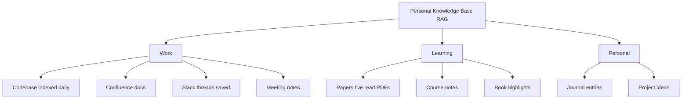

## Why This Module Matters

In 2023, Air Canada was forced to pay damages to a customer after its customer service chatbot hallucinated a bereavement fare policy that did not exist. The customer booked a flight relying on the bot's promise of a retroactive discount, only for the airline to later state the bot had provided false information. A civil tribunal ruled against Air Canada, stating the airline was responsible for all information on its website, including that generated by its AI.

This incident highlighted a critical flaw in deploying raw language models: they are knowledge-frozen and prone to hallucination when generating factual responses. For enterprise applications, a model cannot simply guess the answer based on its training weights; it must retrieve accurate, up-to-date, and authoritative information before responding. 

Retrieval-Augmented Generation (RAG) is the definitive architecture for solving this problem. By forcing the language model to synthesize answers strictly from retrieved database records, RAG transforms the model from an unpredictable oracle into a reliable reasoning engine. Without RAG, an enterprise AI is a liability; with RAG, it becomes an indispensable, highly accurate asset.

## Learning Outcomes

By the end of this module, you will be able to:
- **Design** a production-ready Retrieval-Augmented Generation pipeline across indexing, retrieval, and generation phases.
- **Implement** document chunking strategies (fixed, semantic, recursive) to optimize context retrieval for specific data types.
- **Evaluate** retrieval performance and answer quality using metrics like Recall @K and Mean Reciprocal Rank.
- **Diagnose** common RAG failures such as context stuffing, stale indexes, and missing chunk boundaries.
- **Debug** poor retrieval results by applying hybrid search, query expansion, and cross-encoder reranking techniques.

## Did You Know?

- In 2020, Facebook AI Research published the original RAG paper, demonstrating that a 400M parameter model with retrieval could outperform a 175B parameter model without it.
- Perplexity AI generated $20 million in annual recurring revenue in 2024 entirely by commercializing a highly optimized RAG architecture.
- Anthropic researchers discovered in 2023 that a chunk size of exactly 500 tokens yielded an 85 percent retrieval recall, outperforming both smaller and larger chunk sizes.
- A standard enterprise RAG deployment costing $5,700 per month can deflect 10,000 support tickets, generating a return on investment of approximately 30x.

## Introduction: Teaching AI to Look Things Up

Think of a Large Language Model (LLM) like a highly educated scholar who has been locked in a room without internet access since their graduation day. They possess immense reasoning capabilities and understand language deeply, but they are entirely unaware of anything that happened after their training cutoff date. Furthermore, they have never read your company's proprietary codebases, internal wikis, or customer databases.

When you ask a standard LLM a factual question about private or recent data, it attempts to satisfy the query by predicting the most statistically likely next words. This often results in confident hallucinations. RAG changes the paradigm. It is the equivalent of an open-book exam. Instead of asking the model to answer from memory, you first query a database for the relevant facts, prepend those facts to the user's prompt, and instruct the model to synthesize its answer exclusively from the provided context.

### The $100 Million Problem RAG Solved

```text
Without RAG:
User: "What's the status of order #12345?"
LLM: "Your order is being processed." (HALLUCINATION - made up!)

With RAG:
User: "What's the status of order #12345?"
→ Retrieve order from database: {"id": 12345, "status": "shipped", "tracking": "1Z999..."}
→ Prompt: "Based on this order data: {data}, answer: What's the status of order #12345?"
LLM: "Your order #12345 has shipped! Tracking number: 1Z999..." (ACCURATE!)
```

### The Core Concept

The RAG pipeline operates as an orchestration bridge between the user's query and the LLM's generation capabilities. It intercepts the question, searches for relevant context, and constructs a robust prompt dynamically.

```mermaid
flowchart TD
    User[User Query: "How do I configure authentication in kaizen?"] --> Embed[Embed: Convert query to vector]
    Embed --> Search[Search: Vector Database]
    Search -- "176K docs" --> Retrieved[Retrieved Context: <br>- auth.md: Configure JWT tokens...<br>- security.md: Best practices for...<br>- api.md: Authentication endpoints...]
    Retrieved --> Generate[Generate: LLM creates answer from context]
    Generate --> Answer[Answer: "To configure authentication in kaizen:<br>1. Set JWT_SECRET in .env<br>2. Configure auth middleware in app.py<br>3. See auth.md for complete guide..."]
```

> **Stop and think**: If the embedding model used during retrieval is different from the embedding model used during indexing, what will happen to the search results?

## System Architecture: The Three Phases

A production RAG system is divided into three distinct phases. Indexing happens offline and continuously as documents change. Retrieval and Generation happen online in real-time as users submit queries.

```mermaid
flowchart TD
    subchart Phase 1: Indexing Offline - done once per document update
        D[Documents raw] --> C[Chunk] --> E[Embed] --> S[Store in Vector DB]
    end
    subchart Phase 2: Retrieval Online - per query
        Q[Query] --> E2[Embed] --> S2[Search Vector DB] --> T[Top-K Documents]
    end
    subchart Phase 3: Generation Online - per query
        CTX[Context + Query] --> B[Build Prompt] --> LLM[LLM Generate] --> A[Answer]
    end
```

### Phase 1: Indexing

Before you can retrieve anything, you must prepare your data. Think of indexing like preparing a massive recipe book for quick access. Instead of reading every page to find "chocolate cake," you create an index at the back mapping topics to page numbers. 

Indexing involves ingesting raw documents, splitting them into manageable pieces (chunks), converting those pieces into dense numerical vectors (embeddings), and storing them in a specialized vector database like Qdrant or Pinecone.

```python
def index_documents(documents: list[str], vector_db: QdrantClient):
    """Index documents into vector database."""
    for doc in documents:
        # 1. Chunk the document
        chunks = chunk_document(doc, chunk_size=500, overlap=50)

        # 2. Generate embeddings
        embeddings = embedding_model.encode(chunks)

        # 3. Store in vector database
        for i, (chunk, embedding) in enumerate(zip(chunks, embeddings)):
            vector_db.upsert(
                collection_name="documents",
                points=[{
                    "id": f"{doc.id}_{i}",
                    "vector": embedding,
                    "payload": {
                        "text": chunk,
                        "source": doc.filename,
                        "chunk_index": i
                    }
                }]
            )
```

The metadata payload is critical here. If you do not store the original text and its source alongside the vector, the retrieval phase will only return a mathematical array, which the LLM cannot read or cite.

### Phase 2: Retrieval

When a user asks a question, the system must immediately convert that question into a vector using the exact same embedding model used during indexing. Think of retrieval like a detective searching for clues. You have a case (the user's question) and a warehouse of evidence (your document chunks). The detective doesn't read every file—they use their training to quickly identify which evidence boxes are most likely to contain relevant clues.

```python
def retrieve(query: str, vector_db: QdrantClient, k: int = 5) -> list[dict]:
    """Retrieve top-k relevant chunks."""
    # 1. Embed the query
    query_embedding = embedding_model.encode(query)

    # 2. Search vector database
    results = vector_db.search(
        collection_name="documents",
        query_vector=query_embedding,
        limit=k
    )

    # 3. Return chunks with metadata
    return [
        {
            "text": r.payload["text"],
            "source": r.payload["source"],
            "score": r.score
        }
        for r in results
    ]
```

### Phase 3: Generation

The final step is constructing a strict prompt. Think of generation like a journalist writing an article. The journalist (LLM) doesn't make up facts—they synthesize information strictly from their research notes (retrieved chunks) into a coherent, readable answer.

```python
def generate_answer(query: str, context: list[dict], llm) -> str:
    """Generate answer from retrieved context."""
    # Build prompt with context
    context_text = "\n\n".join([
        f"[Source: {c['source']}]\n{c['text']}"
        for c in context
    ])

    prompt = f"""Answer the question based ONLY on the following context.
If the context doesn't contain the answer, say "I don't have information about that."

Context:
{context_text}

Question: {query}

Answer:"""

    # Generate with LLM
    response = llm.generate(prompt)

    return response
```

## Document Chunking: The Foundational Decision

Chunking is the process of splitting large documents into smaller segments. Think of chunking like cutting a pizza. Fixed-size chunking is using a massive grid cutter—neat and uniform, but you might slice straight through the middle of a pepperoni slice. Semantic chunking is like cutting along the natural boundaries between toppings—the slices might be different sizes, but each one contains complete, meaningful pieces.

### Why Chunking Matters

```text
Original document:
"Authentication in kaizen uses JWT tokens. To configure authentication,
set the JWT_SECRET environment variable. The token expires after 24 hours
by default. You can customize this in config.py. For production, always
use HTTPS to protect tokens in transit."

Chunk too small (50 chars):
- "Authentication in kaizen uses JWT tokens. To conf"
- "igure authentication, set the JWT_SECRET environ"
→ Query "How to configure auth?" might not match!

Chunk too large (entire doc):
- Returns full doc even for specific questions
→ LLM must parse through irrelevant info

Chunk just right (~200 chars, semantic):
- "Authentication in kaizen uses JWT tokens. To configure authentication, set the JWT_SECRET environment variable."
- "The token expires after 24 hours by default. You can customize this in config.py."
- "For production, always use HTTPS to protect tokens in transit."
→ Each chunk answers a specific question type!
```

Anthropic's exhaustive study on chunk sizes revealed a clear sweet spot for general-purpose retrieval:

| Chunk Size | Retrieval Recall | Answer Quality | Best For |
|------------|------------------|----------------|----------|
| 100 tokens | 45% | Poor | N/A |
| 250 tokens | 72% | Good | Simple QA |
| **500 tokens** | **85%** | **Best** | **General use** |
| 1000 tokens | 78% | Good | Complex questions |
| 2000 tokens | 65% | OK | Long-form analysis |

### Chunking Strategies

#### Fixed-Size Chunking
The simplest approach. You slice the text into arbitrary lengths, using a sliding window overlap to prevent severing words or critical clauses right at the boundary.

```python
def fixed_chunk(text: str, chunk_size: int = 500, overlap: int = 50) -> list[str]:
    """Split text into fixed-size chunks with overlap."""
    chunks = []
    start = 0

    while start < len(text):
        end = start + chunk_size
        chunk = text[start:end]
        chunks.append(chunk)
        start = end - overlap  # Overlap for continuity

    return chunks
```

#### Sentence-Based Chunking
Using Natural Language Processing libraries to identify sentence boundaries. This guarantees you never cut a sentence in half, though it may result in highly variable chunk lengths depending on the author's writing style.

```python
import nltk

def sentence_chunk(text: str, sentences_per_chunk: int = 5) -> list[str]:
    """Chunk by sentence boundaries."""
    sentences = nltk.sent_tokenize(text)
    chunks = []

    for i in range(0, len(sentences), sentences_per_chunk):
        chunk = " ".join(sentences[i:i + sentences_per_chunk])
        chunks.append(chunk)

    return chunks
```

#### Semantic Chunking
This strategy respects the document's logical structure by splitting on paragraph breaks or markdown headers. It is generally the best starting point for corporate wikis and documentation.

```python
def semantic_chunk(text: str, max_chunk_size: int = 500) -> list[str]:
    """Chunk by semantic units (paragraphs, sections)."""
    # Split by paragraph
    paragraphs = text.split("\n\n")

    chunks = []
    current_chunk = ""

    for para in paragraphs:
        if len(current_chunk) + len(para) < max_chunk_size:
            current_chunk += para + "\n\n"
        else:
            if current_chunk:
                chunks.append(current_chunk.strip())
            current_chunk = para + "\n\n"

    if current_chunk:
        chunks.append(current_chunk.strip())

    return chunks
```

#### Recursive Chunking
Used extensively by frameworks like LangChain, this approach attempts to split text using large boundaries first (like double newlines), and recursively moves to smaller separators (single newlines, spaces) only if the chunk exceeds the maximum size.

```python
def recursive_chunk(text: str, chunk_size: int = 500, separators: list[str] = None) -> list[str]:
    """Recursively split using hierarchy of separators."""
    if separators is None:
        separators = ["\n\n", "\n", ". ", " ", ""]

    separator = separators[0]
    remaining_separators = separators[1:]

    splits = text.split(separator)
    chunks = []
    current_chunk = ""

    for split in splits:
        if len(current_chunk) + len(split) < chunk_size:
            current_chunk += split + separator
        else:
            if current_chunk:
                chunks.append(current_chunk.strip())

            # If split itself is too large, recurse with finer separator
            if len(split) > chunk_size and remaining_separators:
                sub_chunks = recursive_chunk(split, chunk_size, remaining_separators)
                chunks.extend(sub_chunks)
            else:
                current_chunk = split + separator

    if current_chunk:
        chunks.append(current_chunk.strip())

    return chunks
```

> **Pause and predict**: If a user asks a highly technical question requiring multiple disparate concepts to be linked, but each concept was chunked into completely separate records, how will the generation phase perform?

## Advanced RAG Techniques

As your dataset grows, simple vector search begins to fail. You will encounter the "semantic gap," where the user's vocabulary differs entirely from the document's vocabulary. These advanced techniques help bridge that gap to maintain high recall.

### 1. Hybrid Search (BM25 + Vector)

Vector search excels at conceptual matching but struggles with exact entity names, acronyms, or error codes. Keyword search (BM25) excels at exact string matches but fails at conceptual similarity. Hybrid search runs both concurrently and merges the results using Reciprocal Rank Fusion.

```python
def hybrid_search(query: str, k: int = 5) -> list[dict]:
    """Combine BM25 and vector search."""
    # Keyword search (BM25)
    keyword_results = bm25_search(query, k=k*2)

    # Vector search
    vector_results = vector_search(query, k=k*2)

    # Reciprocal Rank Fusion (RRF)
    combined = reciprocal_rank_fusion(
        [keyword_results, vector_results],
        k=60  # RRF constant
    )

    return combined[:k]

def reciprocal_rank_fusion(result_lists: list[list], k: int = 60) -> list:
    """Combine multiple result lists using RRF."""
    scores = {}

    for results in result_lists:
        for rank, doc in enumerate(results):
            doc_id = doc["id"]
            if doc_id not in scores:
                scores[doc_id] = 0
            scores[doc_id] += 1 / (k + rank + 1)

    # Sort by combined score
    sorted_docs = sorted(scores.items(), key=lambda x: x[1], reverse=True)
    return [doc_id for doc_id, score in sorted_docs]
```

### 2. Query Expansion

Users frequently write overly brief or vague questions. By asking a smaller, faster LLM to expand the query into multiple terminology variants, you cast a significantly wider net and dramatically increase the likelihood of hitting the correct semantic cluster in your vector database.

```python
def expand_query(query: str, llm) -> list[str]:
    """Generate related queries for better retrieval."""
    prompt = f"""Generate 3 alternative phrasings of this question:

Original: {query}

Alternative phrasings (one per line):"""

    expansions = llm.generate(prompt).strip().split("\n")

    return [query] + expansions

# Example:
# Query: "How to fix authentication?"
# Expansions:
#   - "How to fix authentication?"
#   - "Troubleshooting auth issues"
#   - "Authentication not working solution"
#   - "Debug login problems"
```

### 3. Reranking

Standard bi-encoders evaluate documents in isolation. A cross-encoder model evaluates the document *and* the query together, yielding a significantly more accurate relevance score. Because cross-encoders are computationally expensive, you typically retrieve the top 20 candidates using standard vector search, and then rerank those 20 using the cross-encoder to isolate the true top 5.

```python
from sentence_transformers import CrossEncoder

reranker = CrossEncoder('cross-encoder/ms-marco-MiniLM-L-6-v2')

def rerank(query: str, documents: list[dict], top_k: int = 5) -> list[dict]:
    """Rerank documents using cross-encoder."""
    # Create query-document pairs
    pairs = [[query, doc["text"]] for doc in documents]

    # Score with cross-encoder
    scores = reranker.predict(pairs)

    # Sort by score
    ranked = sorted(
        zip(documents, scores),
        key=lambda x: x[1],
        reverse=True
    )

    return [doc for doc, score in ranked[:top_k]]
```

### 4. Contextual Compression

Sometimes a large chunk contains the answer buried within paragraphs of irrelevant filler. Contextual compression uses a fast LLM to parse the chunk and extract only the sentences pertinent to the query, saving context window space and reducing the chance of hallucination.

```python
def compress_context(query: str, chunk: str, llm) -> str:
    """Extract only relevant parts of a chunk."""
    prompt = f"""Extract only the parts of this text that are relevant to the question.
If nothing is relevant, respond with "NOT_RELEVANT".

Question: {query}

Text: {chunk}

Relevant excerpt:"""

    compressed = llm.generate(prompt)

    if "NOT_RELEVANT" in compressed:
        return None

    return compressed
```

## Production War Stories

### The Healthcare Chatbot That Retrieved the Wrong Patient
In 2023, a hospital deployed a RAG-powered assistant to help nurses find patient information. A nurse asked: "What medications is patient in room 302 taking?" The system retrieved records and confidently listed medications. The problem: it had retrieved records for a *different* patient with a similar name who had been in room 302 three months earlier. 
**The Fix:** They implemented strict metadata filtering for identifiable information. Patient ID must exactly match before semantic search runs. 

### The Legal Research Tool That Missed Superseding Cases
A law firm built a RAG system for case research. An associate cited a case from the system in a brief, only for opposing counsel to point out the case had been overruled years ago. The RAG system had retrieved the original case but missed the superseding decision because it was located in a separate chunk.
**The Fix:** Every case chunk now includes hard metadata about its current status (good law, distinguished, overruled), and the prompt explicitly instructs the LLM to verify the status metadata.

### The E-commerce Chatbot That Couldn't Find Anything
An e-commerce company launched a RAG shopping assistant. A customer asking for "comfy pants for working from home" received zero results because the formal product descriptions strictly used the terms "relaxed-fit trousers" or "loungewear bottoms."
**The Fix:** They implemented Query Expansion to automatically generate synonyms ("sweatpants," "loungewear") before executing the vector search.

## Common Mistakes and Pitfalls

Implementing RAG is deceivingly simple, but tuning it for production requires navigating several traps.

### Code Pitfalls

**Pitfall 1: Ignoring Chunk Boundaries**
```python
# BAD: Fixed chunking breaks mid-concept
chunks = split_every_n_chars(text, 500)
# "To configure authentication, you need to..." | "...set the JWT_SECRET variable"

# GOOD: Respect semantic boundaries
chunks = split_by_paragraphs(text, max_size=500)
# "To configure authentication, you need to set the JWT_SECRET variable."
```

**Pitfall 2: Not Handling "I Don't Know"**
```python
# BAD: Forces answer even when context doesn't help
prompt = f"Answer this question: {query}\nContext: {context}"

# GOOD: Explicit instruction for unknown cases
prompt = f"""Answer the question based ONLY on the context below.
If the context doesn't contain enough information to answer, say:
"I don't have information about that in my knowledge base."

Context: {context}
Question: {query}
Answer:"""
```

**Pitfall 3: Stuffing Too Much Context**
```python
# BAD: Include all 20 retrieved chunks
context = "\n".join([c["text"] for c in retrieve(query, k=20)])
# → Context too long, LLM gets confused, costs more

# GOOD: Quality over quantity
chunks = retrieve(query, k=20)
reranked = rerank(query, chunks, top_k=5)
context = "\n".join([c["text"] for c in reranked])
# → Only most relevant context
```

**Pitfall 4: Not Including Sources**
```python
# BAD: Answer without attribution
answer = llm.generate(f"Answer: {query}\nContext: {context}")

# GOOD: Include sources in prompt
context_with_sources = "\n".join([
    f"[{i+1}] {c['source']}: {c['text']}"
    for i, c in enumerate(chunks)
])

prompt = f"""Answer the question and cite sources using [1], [2], etc.

Context:
{context_with_sources}

Question: {query}
Answer (with citations):"""
```

**Pitfall 5: Stale Index**
```python
# BAD: Index once, never update
index_documents(docs)  # Done in 2023
# → 2024 queries get outdated answers!

# GOOD: Incremental updates
def update_index(new_docs, modified_docs, deleted_ids):
    """Keep index fresh."""
    # Add new documents
    for doc in new_docs:
        add_to_index(doc)

    # Update modified documents
    for doc in modified_docs:
        delete_from_index(doc.id)
        add_to_index(doc)

    # Remove deleted documents
    for doc_id in deleted_ids:
        delete_from_index(doc_id)

# Run nightly or on document changes
```

**Pitfall 6: Extreme Chunk Sizes**
```python
# WRONG - Chunks too large
chunk_size = 2000  # Retrieves whole documents, loses specificity
# Each chunk contains too many topics, diluting relevance

# WRONG - Chunks too small
chunk_size = 100  # Retrieves fragments without context
# "The company reported Q3 revenue of" - cut off!

# RIGHT - Balanced with overlap
chunk_size = 500
chunk_overlap = 100  # Overlap preserves context at boundaries
# "The company reported Q3 revenue of $42B, up 15% YoY."
```

**Pitfall 7: Ignoring Low Confidence Scores**
```python
# WRONG - Always returns something
def retrieve_and_answer(query):
    results = vector_db.search(query, k=5)
    context = "\n".join([r.text for r in results])
    return llm.generate(f"Based on: {context}\nAnswer: {query}")
    # Even if results are terrible, we pretend they're relevant

# RIGHT - Check retrieval quality
def retrieve_and_answer(query):
    results = vector_db.search(query, k=5)

    # Check if results are actually relevant
    if results[0].score < 0.7:  # Low confidence threshold
        return "I don't have information about that in my knowledge base."

    # Filter to only high-quality results
    good_results = [r for r in results if r.score > 0.6]
    context = "\n".join([r.text for r in good_results])

    return llm.generate(
        f"Based on: {context}\nAnswer: {query}\n"
        f"If the context doesn't contain the answer, say so."
    )
```

**Pitfall 8: No Freshness Rules**
```python
# WRONG - Index once and forget
# Index created: January 2024
# Query (March 2024): "What is our current pricing?"
# Answer: Returns January pricing (now outdated!)

# RIGHT - Scheduled re-indexing with freshness metadata
index_config = {
    "reindex_schedule": "daily",
    "source_types": {
        "pricing": {"reindex": "hourly", "priority": "high"},
        "policies": {"reindex": "weekly"},
        "blog_posts": {"reindex": "on_publish"}
    },
    "freshness_boost": True  # Prefer recent documents
}
```

**Pitfall 9: Skipping Reranking**
```python
# WRONG - Retrieve everything that might be relevant
results = vector_db.search(query, k=20)  # Too many!
context = "\n".join([r.text for r in results])
# Context is now 8000 tokens of mixed relevance

# RIGHT - Quality over quantity with reranking
results = vector_db.search(query, k=20)  # Cast wide net
reranked = reranker.rerank(query, results)  # Score each result
top_results = reranked[:5]  # Keep only the best
context = "\n".join([r.text for r in top_results])
# Context is 2000 tokens of highly relevant information
```

### Common Mistakes Quick Reference

| Mistake | Why | Fix |
|---------|-----|-----|
| Chunking entirely by characters | It frequently severs semantic meaning in half. | Use semantic chunking based on paragraphs or newlines. |
| Forcing an answer | The LLM will fabricate facts to satisfy the prompt. | Add explicit "say you don't know" logic to the system prompt. |
| Context Window Stuffing | Dilutes the prompt with noise, leading to lost in the middle phenomenon. | Retrieve a broader pool, then aggressively rerank down to the top 5 chunks. |
| Missing Source Tracking | The LLM cannot provide citations if metadata was stripped. | Embed source URLs or file paths as distinct payload metadata during indexing. |
| Static Vector Indexes | Documentation mutates over time, making vectors stale and incorrect. | Build incremental sync processes tied to document webhooks or commit hooks. |
| Blind Vector Search | Embedding similarity struggles to match precise acronyms or part numbers. | Implement Hybrid Search combining BM25 keyword matching with vector matching. |
| Missing Chunk Overlap | Context is severed cleanly at the character limit, destroying adjacent word meaning. | Always configure 10-20% chunk overlap in your text splitter. |
| Relying Solely on Bi-Encoders | Bi-encoders are fast but lack deep query-document cross-attention accuracy. | Implement a cross-encoder reranker to process the final top 20 candidates. |

## RAG Evaluation Metrics

If you cannot measure your RAG system, you cannot improve it. You must evaluate the two major subsystems independently: the retrieval system (did we find the right documents?) and the generative system (did we formulate a good answer based on what we found?).

### Retrieval Metrics

#### Recall @K
This measures the proportion of relevant documents that were successfully retrieved in the top K results.

```python
def recall_at_k(retrieved_ids: list, relevant_ids: list, k: int) -> float:
    """Calculate recall at k."""
    retrieved_k = set(retrieved_ids[:k])
    relevant = set(relevant_ids)

    return len(retrieved_k & relevant) / len(relevant)

# Example:
# Relevant docs: [1, 2, 3]
# Retrieved top-5: [1, 4, 2, 5, 6]
# Recall @5 = 2/3 = 0.67
```

#### Mean Reciprocal Rank (MRR)
This measures how high up the list the first relevant document appeared.

```python
def mrr(retrieved_ids: list, relevant_ids: list) -> float:
    """Calculate mean reciprocal rank."""
    relevant = set(relevant_ids)

    for i, doc_id in enumerate(retrieved_ids):
        if doc_id in relevant:
            return 1 / (i + 1)

    return 0

# Example:
# Relevant: [1, 2, 3]
# Retrieved: [4, 2, 1, 3, 5]
# First relevant at position 2 → MRR = 1/2 = 0.5
```

### Answer Quality Metrics

#### Faithfulness
Also known as groundedness, this checks whether the generated answer relies exclusively on the retrieved context or if it hallucinated external details.

```python
def check_faithfulness(answer: str, context: str, llm) -> float:
    """Check if answer is faithful to context."""
    prompt = f"""Rate how well the answer is supported by the context.
Score from 0-1 where:
- 1.0 = Fully supported, no hallucination
- 0.5 = Partially supported
- 0.0 = Not supported / hallucinated

Context: {context}
Answer: {answer}

Score (just the number):"""

    score = float(llm.generate(prompt).strip())
    return score
```

#### Relevance
This metric determines if the final answer actually addressed the user's question, penalizing verbose but unhelpful responses.

```python
def check_relevance(query: str, answer: str, llm) -> float:
    """Check if answer is relevant to question."""
    prompt = f"""Rate how well the answer addresses the question.
Score from 0-1 where:
- 1.0 = Directly answers the question
- 0.5 = Partially answers
- 0.0 = Doesn't answer

Question: {query}
Answer: {answer}

Score (just the number):"""

    score = float(llm.generate(prompt).strip())
    return score
```

#### The RAGAS Framework
RAGAS is an industry-standard framework that automates these checks by using LLMs as evaluators.

```python
from ragas import evaluate
from ragas.metrics import faithfulness, answer_relevancy, context_precision

# Evaluate your RAG
results = evaluate(
    dataset,
    metrics=[faithfulness, answer_relevancy, context_precision]
)

print(f"Faithfulness: {results['faithfulness']:.2f}")
print(f"Answer Relevancy: {results['answer_relevancy']:.2f}")
print(f"Context Precision: {results['context_precision']:.2f}")
```

## Real-World Applications

RAG architecture is remarkably flexible and powers wildly different use cases simply by swapping out the data sources and tweaking chunking parameters.

### Application 1: Technical Documentation Assistant
A documentation assistant requires strict chunking boundaries to avoid mixing up instructions for different software versions.

```python
# Kaizen RAG Configuration
kaizen_rag = RAGPipeline(
    knowledge_sources=[
        "docs/*.md",           # Documentation
        "src/**/*.py",         # Code (with docstrings)
        "issues/*.json",       # GitHub issues
        "runbooks/*.md"        # Operations runbooks
    ],
    chunk_strategy="recursive",
    chunk_size=500,
    embedding_model="all-MiniLM-L6-v2",
    vector_db="qdrant",
    llm="claude-4.6-sonnet",
    reranker="cross-encoder/ms-marco"
)

# Example queries:
# "How do I deploy to production?"
# "What's the fix for error E1234?"
# "Show me the authentication flow"
```

### Application 2: Educational Course Assistant
A student Q&A assistant must handle specialized formats like code blocks and equations without breaking them apart.

```python
# Vibe RAG for student Q&A
vibe_rag = RAGPipeline(
    knowledge_sources=[
        "courses/**/*.md",     # Course content
        "videos/*.json",       # Video transcripts
        "qa/*.json",           # Previous Q&A
        "assignments/*.md"     # Assignment specs
    ],
    chunk_strategy="semantic",
    chunk_size=400,
    # Smaller chunks for focused answers
    special_handling={
        "code_blocks": "keep_intact",
        "equations": "keep_intact"
    }
)

# Example queries:
# "Explain the difference between RAG and fine-tuning"
# "What's due next week?"
# "How do I solve problem 3?"
```

### Application 3: Financial Research Analysis
Financial documents are notoriously long and complex. They require larger chunk sizes and strict metadata filters to ensure the system is reading from the correct fiscal quarter.

```python
# Contrarian RAG for financial analysis
contrarian_rag = RAGPipeline(
    knowledge_sources=[
        "sec_filings/*.pdf",   # 10-K, 10-Q filings
        "earnings/*.json",     # Earnings call transcripts
        "news/*.json",         # Financial news
        "analysis/*.md"        # Your analysis notes
    ],
    chunk_strategy="semantic",
    chunk_size=600,
    # Larger chunks for financial context
    metadata_filters=[
        "company",
        "date",
        "document_type"
    ],
    freshness_weight=0.3  # Prefer recent documents
)

# Example queries:
# "What did AAPL management say about AI in last earnings?"
# "Compare MSFT and GOOGL R&D spending"
# "What are the risk factors for TSLA?"
```

### The 10x Developer's RAG Setup



## Economics and Cost

RAG transforms the unit economics of AI deployment. Instead of constantly fine-tuning models on massive datasets to instill knowledge, you compute embeddings once and perform cheap vector lookups.

| Component | Cost Driver | Typical Range |
|-----------|-------------|---------------|
| Embedding | API calls or compute for generating embeddings | $0.0001-0.001 per 1K tokens |
| Storage | Vector database hosting | $20-500/month depending on scale |
| Inference | LLM API calls for generation | $0.001-0.06 per 1K tokens |

```text
Monthly Costs:
- Vector database: $100
- Embeddings (1M queries): $100
- LLM inference (1M queries): $500
- Engineering time: $5,000
Total: ~$5,700/month

Monthly Value:
- Support tickets deflected (10,000 × $15 each): $150,000
- Engineer time saved (200 hours × $100/hour): $20,000
- Faster customer resolutions: Incalculable goodwill
Total value: $170,000+/month

ROI: ~30x
```

## Quiz

<details>
<summary>Question 1: You are designing a RAG system for a legal firm. Lawyers are searching for specific precedent case IDs (e.g., "TX-2023-441A"), but the retrieval system keeps returning conceptually similar but entirely different cases. What architectural change is required to diagnose and resolve this issue?</summary>

You must implement Hybrid Search. Pure semantic vector search attempts to understand the general meaning of the query. Mathematically, two entirely different legal cases might discuss identical topics and thus appear near each other in vector space. By introducing BM25 keyword search alongside vector search, exact alphanumeric string matches (like the specific case ID) will spike in relevance, effectively solving the retrieval failure.
</details>

<details>
<summary>Question 2: A customer service bot is provided with accurate policy documents via RAG. However, users complain that the bot occasionally outputs instructions belonging to an internal HR policy instead of customer-facing rules. How do you diagnose and fix this?</summary>

The diagnosis points to missing metadata filtering logic during the retrieval phase. Both HR policies and customer policies were likely embedded into the same vector space. Because they discuss similar topics (e.g., "refunds" or "reimbursements"), they are semantically close. The fix is to attach a `document_type` or `audience` metadata tag during indexing, and strictly filter the vector database search to `audience=customer` before applying nearest-neighbor search.
</details>

<details>
<summary>Question 3: Your RAG metrics dashboard reports that your Recall @K is consistently high, but your Answer Faithfulness score has plummeted below 0.4. What is the root cause?</summary>

The LLM is ignoring the context and hallucinating. A high Recall @K means your vector database is successfully finding the correct documents and feeding them into the prompt. However, a low Faithfulness score indicates the generated answer contains facts not present in those retrieved documents. This points to a weak system prompt. You must enforce stricter constraints, commanding the LLM to rely strictly on the provided text and to admit ignorance if the data is insufficient.
</details>

<details>
<summary>Question 4: You implemented semantic chunking for your company's technical blog. A user asks "How do I restart the billing service?" but the retrieval system returns an isolated chunk that just says "Run the systemctl restart command" without mentioning which service it applies to. What went wrong?</summary>

The chunking strategy severed the pronoun/subject relationship. The sentence explaining the restart command was likely separated from the preceding sentence that established the context of the "billing service." To diagnose and fix this, you must introduce a chunk overlap (e.g., 50-100 tokens) so that boundary context is preserved across adjacent chunks, ensuring the entity name remains attached to the action.
</details>

<details>
<summary>Question 5: A financial RAG application requires the LLM to compare Q1 revenue to Q2 revenue. The vector search is configured to return the top `k=3` results. The LLM consistently states it cannot find Q1 data. Why?</summary>

The value for `k` is too restrictive. A query requiring a comparison across multiple distinct documents (Q1 reports and Q2 reports) requires a broader context window. If the top 3 semantically matched chunks all happen to belong to the Q2 report, the Q1 data is starved out of the prompt. The system must increase the `k` retrieval limit, or implement query expansion to run separate parallel searches for "Q1 revenue" and "Q2 revenue."
</details>

<details>
<summary>Question 6: Your engineering team is complaining that RAG latency is exceeding 4 seconds, severely degrading the chat experience. Upon review, the system is performing a bi-encoder vector search, a BM25 search, and a cross-encoder reranking pass on 100 documents. How do you optimize this?</summary>

The cross-encoder reranking phase is computationally heavy and is bottlenecking the pipeline by evaluating too many candidates. To fix this, you should drastically reduce the initial retrieval pool before reranking. You can retrieve 20 documents via the hybrid approach (bi-encoder + BM25) and only pass those top 20 into the cross-encoder to select the final 5. This will slash latency while maintaining high accuracy.
</details>

## Hands-On Exercise: Building an Executable RAG Pipeline

In this exercise, you will run a lightweight, step-by-step RAG pipeline using open-source tools directly on your local machine. We will use a mock LLM generator to focus entirely on the mechanics of chunking, embedding, and retrieval.

### Prerequisites

Ensure you have a modern Python environment available. Execute the following in your terminal:
```bash
python3 -m venv rag-env
source rag-env/bin/activate
pip install qdrant-client sentence-transformers
```

### Task 1: Prepare the Knowledge Base
Create a python script named `rag_pipeline.py` and open it in your editor. First, we need raw data. Add the following mock documents.

<details>
<summary>Solution</summary>

```python
from qdrant_client import QdrantClient
from qdrant_client.models import Distance, VectorParams, PointStruct
from sentence_transformers import SentenceTransformer

# 1. Our raw knowledge base
documents = [
    {"id": "doc1", "text": "The billing service runs on port 8080. To restart it, use systemctl restart billing-svc."},
    {"id": "doc2", "text": "Authentication is handled by the auth-gateway. JWT tokens expire after 24 hours."},
    {"id": "doc3", "text": "If the database is locked, check the pg_stat_activity table and terminate idle connections."}
]
```
</details>

### Task 2: Initialize the Vector Database and Embedding Model
We will use an in-memory instance of Qdrant and a fast, small embedding model from HuggingFace to keep execution times under a few seconds.

<details>
<summary>Solution</summary>

```python
# 2. Initialize the embedding model
print("Loading model...")
model = SentenceTransformer('all-MiniLM-L6-v2')

# 3. Initialize an in-memory vector database
client = QdrantClient(":memory:")
client.create_collection(
    collection_name="knowledge_base",
    vectors_config=VectorParams(size=384, distance=Distance.COSINE),
)
```
</details>

### Task 3: Embed and Index the Documents
Iterate through the documents, convert their text into vectors, and store them with metadata payloads.

<details>
<summary>Solution</summary>

```python
# 4. Indexing Phase
points = []
for idx, doc in enumerate(documents):
    # Convert text to numerical vector
    vector = model.encode(doc["text"]).tolist()
    
    # Create a database point containing the vector AND the original text payload
    point = PointStruct(
        id=idx,
        vector=vector,
        payload={"original_text": doc["text"], "source_id": doc["id"]}
    )
    points.append(point)

client.upsert(
    collection_name="knowledge_base",
    points=points
)
print("Documents successfully indexed!")
```
</details>

### Task 4: Execute a Retrieval Query
Now, simulate a user asking a question. Embed the query and search the database using cosine similarity.

<details>
<summary>Solution</summary>

```python
# 5. Retrieval Phase
user_query = "How do I fix a locked database?"
query_vector = model.encode(user_query).tolist()

search_results = client.search(
    collection_name="knowledge_base",
    query_vector=query_vector,
    limit=1  # We only want the single most relevant chunk
)

# Extract the context
retrieved_chunk = search_results[0].payload["original_text"]
source_id = search_results[0].payload["source_id"]
print(f"\nUser asked: {user_query}")
print(f"Retrieved Context: {retrieved_chunk} (Source: {source_id})")
```
</details>

### Task 5: Construct the Generation Prompt
Finally, build the strict prompt that would be sent to an LLM.

<details>
<summary>Solution</summary>

```python
# 6. Generation Phase
prompt = f"""You are a helpful assistant. Answer the user's question based strictly on the context below. 
If the context does not contain the answer, reply with 'I do not have enough information'.

Context:
[Source: {source_id}] {retrieved_chunk}

Question: {user_query}

Answer:"""

print("\n--- Final LLM Prompt ---")
print(prompt)
```
</details>

### Execution
Run the complete file:
```bash
python3 rag_pipeline.py
```

### Success Checklist
- [ ] The script executes without throwing any import errors.
- [ ] The `SentenceTransformer` successfully downloads the weights on the first run and embeds the text.
- [ ] The query "How do I fix a locked database?" correctly retrieves `doc3` as the top result based on semantic similarity.
- [ ] The final printed output constructs a prompt that strictly bounds the context and explicitly includes the source ID.

## Module Summary

```text
RAG = Retrieval + Augmented Generation

Recall @K = |Retrieved ∩ Relevant| / |Relevant|

MRR = 1 / (rank of first relevant document)
```

## Key Links
- [Simple RAG Pipeline](../../examples/module_12/01_simple_rag.py)
- [Document Chunking](../../examples/module_12/02_chunking_strategies.py)
- [RAG Evaluation](../../examples/module_12/03_rag_evaluation.py)
- [LangChain RAG Tutorial](https://python.langchain.com/docs/use_cases/question_answering/)
- [LlamaIndex Getting Started](https://docs.llamaindex.ai/en/stable/)
- [Pinecone RAG Guide](https://www.pinecone.io/learn/retrieval-augmented-generation/)

## Next Steps

Ready to move beyond basic RAG? Proceed to [Module 13: RAG vs Fine-tuning Trade-offs](module-1.3-rag-vs-finetuning). You will explore parameter-efficient fine-tuning techniques like LoRA and discover exactly when to inject facts into a prompt versus baking them directly into the model weights.