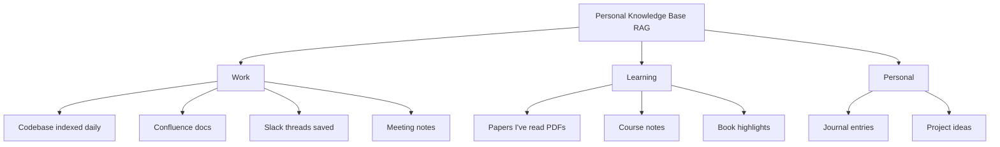

## Learning Outcomes

When you finish this module, you will be able to design, implement, evaluate, and debug complete Retrieval-Augmented Generation pipelines rather than treating retrieval as a black-box library call. The learning outcomes below map directly to the hands-on lab and knowledge check at the end of the module. Each outcome corresponds to a phase of the ingest→retrieve→generate loop you will assemble in code, instrument in metrics, and defend in production reviews.

- **Design** a production-ready Retrieval-Augmented Generation pipeline across indexing, retrieval, and generation phases.
- **Implement** document chunking strategies (fixed, semantic, recursive) to optimize context retrieval for specific data types.
- **Evaluate** retrieval performance and answer quality using metrics like Recall @K and Mean Reciprocal Rank.
- **Diagnose** common RAG failures such as context stuffing, stale indexes, and missing chunk boundaries.
- **Debug** poor retrieval results by applying hybrid search, query expansion, and cross-encoder reranking techniques.

## Why This Module Matters

In February 2024, the British Columbia Civil Resolution Tribunal held Air Canada liable after its customer-service chatbot fabricated a bereavement-fare policy that did not exist in the airline's official rules. A passenger named Jake Moffatt booked flights following a family death, relied on the chatbot's explicit promise that bereavement discounts could be applied retroactively within 90 days, and later discovered that human agents would not honor that policy. The tribunal rejected Air Canada's argument that the chatbot was a separate legal entity and ordered the airline to pay damages, establishing that organizations remain responsible for every factual claim their automated systems produce on public-facing channels. The full decision is indexed as *Moffatt v. Air Canada, 2024 BCCRT 149*.

This incident is the canonical cautionary tale for enterprise generative AI. Large language models excel at fluent language but have no built-in guarantee of factual accuracy, especially for policies, pricing, or procedures that change after training or that never appeared in training data at all. When a model answers from parametric memory alone, it predicts plausible text rather than looking up authoritative records. For customer support, internal knowledge bases, compliance workflows, or any domain where wrong answers carry legal or financial consequences, that behavior is unacceptable.

Retrieval-Augmented Generation (RAG) addresses the gap by forcing the model to synthesize answers from retrieved documents at inference time. Instead of treating the LLM as an oracle, you treat it as a reasoning layer over a searchable knowledge base you control. The architecture does not eliminate every failure mode—bad chunks, stale indexes, and weak retrieval still break systems—but it gives engineers explicit levers for grounding, citation, freshness, and access control. This module walks through those levers end to end: how raw documents become searchable vectors, how queries retrieve the right context, and how prompts constrain generation so the model cites what it actually read.

Enterprise teams adopt RAG because it separates knowledge updates from model weight updates. Publishing a revised refund policy means re-indexing documents, not scheduling a fine-tuning job. That separation improves auditability: you can point to the exact paragraph the bot referenced, swap embedding models with a controlled re-index, and roll back bad document uploads without retraining GPUs. The tradeoff is operational complexity—you now run search infrastructure—but for most organizations that complexity is preferable to hallucinated compliance answers.

## Introduction: Teaching AI to Look Things Up

Think of a large language model like a highly educated scholar who has been locked in a room without internet access since graduation day. The scholar reasons well and writes clearly, but knows nothing about your company's internal wikis, yesterday's incident postmortem, or the policy revision published last week. When you ask a factual question about private or recent data, the model still tries to satisfy you by predicting statistically likely continuations. That produces confident hallucinations—the exact failure mode that made Air Canada liable.

RAG changes the paradigm from closed-book to open-book examination. You intercept the user's question, search a knowledge base for relevant passages, prepend those passages to the prompt, and instruct the model to answer strictly from the supplied context. The LLM still generates natural language, but the facts come from documents you indexed rather than from weights frozen at training time. The shift is architectural: retrieval becomes a first-class subsystem with its own metrics, failure modes, and operational requirements, not an afterthought bolted onto a chat wrapper.

Many teams first encounter RAG after a plain LLM demo impresses executives but fails on real tickets. The demo answers generic questions fluently because those answers lived in pretraining; it fails on internal acronyms, SKU lists, or policies updated last quarter. RAG is the standard pattern for closing that gap without claiming you can "just fine-tune" proprietary facts into weights cheaply. Fine-tuning still shapes tone and format; retrieval supplies the facts fine-tuning should not attempt to memorize.

### The Grounding Problem RAG Solves

```text
Without RAG:
User: "What's the status of order #12345?"
LLM: "Your order is being processed." (HALLUCINATION - made up!)

With RAG:
User: "What's the status of order #12345?"
→ Retrieve order from database: {"id": 12345, "status": "shipped", "tracking": "1Z999..."}
→ Prompt: "Based on this order data: {data}, answer: What's the status of order #12345?"
LLM: "Your order #12345 has shipped! Tracking number: 1Z999..." (ACCURATE!)
```

The diagram above is simplified, but the pattern generalizes. Whether the backing store is a vector database of markdown runbooks, a SQL row about an order, or a hybrid index over PDF filings, the LLM should receive evidence before it speaks. Your job as an engineer is to build the pipeline that finds that evidence reliably and to refuse generation when evidence is missing or low confidence.

### The Core Concept

The RAG pipeline operates as an orchestration bridge between the user's query and the LLM's generation capabilities. It intercepts the question, searches for relevant context, and constructs a prompt dynamically rather than sending the raw question straight to the model.

```mermaid
flowchart TD
    User[User Query: "How do I configure authentication in kaizen?"] --> Embed[Embed: Convert query to vector]
    Embed --> Search[Search: Vector Database]
    Search -- "176K docs" --> Retrieved[Retrieved Context: <br>- auth.md: Configure JWT tokens...<br>- security.md: Best practices for...<br>- api.md: Authentication endpoints...]
    Retrieved --> Generate[Generate: LLM creates answer from context]
    Generate --> Answer[Answer: "To configure authentication in kaizen:<br>1. Set JWT_SECRET in .env<br>2. Configure auth middleware in app.py<br>3. See auth.md for complete guide..."]
```

> **Stop and think**: If the embedding model used during retrieval is different from the embedding model used during indexing, what will happen to the search results?

Using mismatched embedding models is one of the most common silent failures in RAG prototypes. Vectors from different models live in incompatible semantic spaces, so similarity scores become meaningless even when the underlying text is perfect. Production systems pin a single embedding model version for both indexing and query time, document that choice, and re-index entirely when the model changes.

## System Architecture: The Three Phases

A production RAG system divides cleanly into three phases. **Indexing** runs offline or on a schedule as documents change: load raw files, chunk them, embed them, and upsert vectors with metadata payloads. **Retrieval** runs online per query: embed the question, search the vector store (often with metadata filters), optionally rerank candidates, and assemble a context bundle. **Generation** runs online per query: build a strict prompt, call the LLM, attach citations, and return the answer—or an explicit "I don't know" when context is insufficient.

```mermaid
flowchart TD
    subchart Phase 1: Indexing Offline - done once per document update
        D[Documents raw] --> C[Chunk] --> E[Embed] --> S[Store in Vector DB]
    end
    subchart Phase 2: Retrieval Online - per query
        Q[Query] --> E2[Embed] --> S2[Search Vector DB] --> T[Top-K Documents]
    end
    subchart Phase 3: Generation Online - per query
        CTX[Context + Query] --> B[Build Prompt] --> LLM[LLM Generate] --> A[Answer]
    end
```

Each phase owns distinct engineering decisions. Indexing choices—chunk size, overlap, metadata schema—determine what retrieval can ever find. Retrieval choices—`k`, hybrid search, rerankers, filters—determine what the LLM actually sees. Generation choices—system prompts, citation format, abstention rules—determine whether the model stays faithful to that context. Weakness at any layer surfaces as user-visible errors even when the other layers are sound.

Before writing code, sketch the data flow on paper: which systems produce documents, how often they change, who may read them, and what "grounded success" means for stakeholders. A customer-facing FAQ bot and an internal SRE runbook assistant share mechanics but differ sharply in metadata filters, freshness SLAs, and tolerance for abstention. Clarifying those constraints early prevents rework when security or legal reviews ask how you prevent cross-tenant leakage or outdated policy citations.

### Phase 1: Indexing

Before you can retrieve anything, you must prepare your data. Indexing is not a one-time dump; it is an ongoing ingestion pipeline that tracks document identity, version, access scope, and freshness. Frameworks such as LangChain and LlamaIndex provide document loaders for PDFs, HTML, wikis, and object storage, but the conceptual steps remain the same regardless of tooling: parse bytes into text, split into chunks, embed each chunk, and store vectors with enough metadata to reconstruct citations and enforce filters at query time.

```python
def index_documents(documents: list[str], vector_db: QdrantClient):
    """Index documents into vector database."""
    for doc in documents:
        # 1. Chunk the document
        chunks = chunk_document(doc, chunk_size=500, overlap=50)

        # 2. Generate embeddings
        embeddings = embedding_model.encode(chunks)

        # 3. Store in vector database
        for i, (chunk, embedding) in enumerate(zip(chunks, embeddings)):
            vector_db.upsert(
                collection_name="documents",
                points=[{
                    "id": f"{doc.id}_{i}",
                    "vector": embedding,
                    "payload": {
                        "text": chunk,
                        "source": doc.filename,
                        "chunk_index": i
                    }
                }]
            )
```

The metadata payload is critical. If you store only vectors without the original text, source URI, document version, and access-control tags, retrieval returns mathematical arrays the LLM cannot read and auditors cannot trace. Treat every chunk as a row in a citation graph: it must point back to an authoritative origin.

### Phase 2: Retrieval

When a user asks a question, the system converts that question into a vector using the same embedding model used during indexing, then queries the vector store for nearest neighbors. Retrieval is not merely "return the top five chunks"; it is a ranking problem constrained by latency budgets, access policies, and the need to surface diverse evidence when a question spans multiple documents.

```python
def retrieve(query: str, vector_db: QdrantClient, k: int = 5) -> list[dict]:
    """Retrieve top-k relevant chunks."""
    # 1. Embed the query
    query_embedding = embedding_model.encode(query)

    # 2. Search vector database
    results = vector_db.search(
        collection_name="documents",
        query_vector=query_embedding,
        limit=k
    )

    # 3. Return chunks with metadata
    return [
        {
            "text": r.payload["text"],
            "source": r.payload["source"],
            "score": r.score
        }
        for r in results
    ]
```

In production you typically retrieve a wider candidate pool—perhaps twenty chunks—then rerank down to five. You also apply metadata filters before vector search when the user's role or the query intent narrows the corpus (for example, `audience=customer` versus internal HR policies). Skipping filters because "semantic search will figure it out" is how customer bots quote internal documents.

### Phase 3: Generation

Generation is prompt assembly plus constrained decoding. You present the retrieved passages with explicit source labels, instruct the model to answer only from those passages, and require it to abstain when context is insufficient. Citation markers—numeric footnotes or inline source tags—let users verify claims without trusting the model's memory.

```python
def generate_answer(query: str, context: list[dict], llm) -> str:
    """Generate answer from retrieved context."""
    # Build prompt with context
    context_text = "\n\n".join([
        f"[Source: {c['source']}]\n{c['text']}"
        for c in context
    ])

    prompt = f"""Answer the question based ONLY on the following context.
If the context doesn't contain the answer, say "I don't have information about that."

Context:
{context_text}

Question: {query}

Answer:"""

    # Generate with LLM
    response = llm.generate(prompt)

    return response
```

The system prompt is a contract. Weak contracts ("help the user") invite fabrication; strong contracts ("cite sources; say you don't know if unsupported") align model behavior with compliance requirements. Generation quality is measured separately from retrieval quality—a system can retrieve perfect documents and still hallucinate if the prompt allows it.

Temperature and sampling choices matter at generation time even though retrieval is deterministic. Lower temperature settings often improve faithfulness for support bots because they reduce creative paraphrasing that introduces unsupported details. For brainstorming assistants you might allow higher temperature while still requiring citations for factual claims. Document these choices per use case instead of copying defaults from playground sessions.

## Document Ingestion: From Raw Files to Chunk Candidates

RAG quality begins before chunking. Loaders must preserve structure: markdown headings, code fences, table rows, and page boundaries carry semantic signal that naive plain-text extraction destroys. A PDF loader that concatenates footers into body text creates junk chunks; a wiki crawler that drops heading hierarchy makes semantic splitting impossible. Document-aware parsers attach structural hints—section titles, page numbers, MIME types—that downstream chunkers use to keep related sentences together.

Ingestion pipelines also assign stable document identifiers and content hashes so you can detect changes incrementally. When a runbook revision lands, you delete stale vectors for that document ID and upsert fresh chunks rather than rebuilding the entire index. Pair each document with operational metadata: `last_modified`, `audience`, `product`, `jurisdiction`, and for legal corpora a `status` field distinguishing good law from overruled precedent. Metadata is cheap at index time and expensive to infer at query time if you omit it.

Format-specific quirks matter in practice. HTML exports from wikis embed navigation chrome that pollutes embeddings unless stripped. PDFs require layout-aware parsing so columns and tables do not interleave randomly. Source code benefits from chunking at function or class boundaries with docstrings attached, because developers ask questions in terms of symbols ("where do we validate JWT expiry?") that raw line splits fragment. Transcripts and chat logs need speaker or timestamp metadata so retrieval can filter to the relevant portion of a long thread.

Treat ingestion as a data engineering pipeline with the same rigor you apply to analytics ETL. Validate that each loader output contains expected fields, log parse failures instead of silently dropping documents, and snapshot a few indexed chunks during CI so regressions in splitting logic surface before they reach production search.

## Document Chunking: The Foundational Decision

Chunking splits large documents into segments small enough to embed precisely yet large enough to retain local context. Think of chunking like cutting a pizza: fixed-size chunking uses a uniform grid—fast and predictable, but you may slice through the middle of a topic. Semantic chunking cuts along natural boundaries—paragraphs, sections, speaker turns—so each slice is self-contained even when sizes vary. Document-aware chunking goes further by never splitting tables, code blocks, or list items that lose meaning when separated.

Your chunker should expose tunable parameters—size, overlap, separator hierarchy—in configuration rather than hard-coded constants so technical writers and ML engineers can iterate without redeploying application code. Version the chunk configuration alongside index snapshots; when someone asks why answers changed on Tuesday, you want a git diff of chunk settings as well as document edits.

### Why Chunking Matters

```text
Original document:
"Authentication in kaizen uses JWT tokens. To configure authentication,
set the JWT_SECRET environment variable. The token expires after 24 hours
by default. You can customize this in config.py. For production, always
use HTTPS to protect tokens in transit."

Chunk too small (50 chars):
- "Authentication in kaizen uses JWT tokens. To conf"
- "igure authentication, set the JWT_SECRET environ"
→ Query "How to configure auth?" might not match!

Chunk too large (entire doc):
- Returns full doc even for specific questions
→ LLM must parse through irrelevant info

Chunk just right (~200 chars, semantic):
- "Authentication in kaizen uses JWT tokens. To configure authentication, set the JWT_SECRET environment variable."
- "The token expires after 24 hours by default. You can customize this in config.py."
- "For production, always use HTTPS to protect tokens in transit."
→ Each chunk answers a specific question type!
```

Chunk size and overlap interact. **Chunk size** controls specificity: smaller chunks match narrow questions but lose surrounding context; larger chunks preserve narrative but dilute relevance signals. **Overlap** copies trailing sentences into the next chunk so boundary concepts—like which service a `systemctl restart` command applies to—appear in both neighbors. A practical starting point for general documentation is roughly 400–800 tokens per chunk with 10–20% overlap, then tune against a labeled evaluation set rather than guessing from first principles.

Anthropic's contextual retrieval research demonstrates that chunk boundaries are not the only lever: prepending chunk-specific context before embedding—summarizing where the chunk sits inside the parent document— materially reduces retrieval failures on real corpora. Their published benchmarks report roughly 35% fewer top-20 retrieval failures with contextual embeddings alone, and larger gains when hybrid BM25 retrieval and reranking are added. Treat those numbers as motivation to invest in chunk metadata, not as guarantees for your corpus without measurement.

| Design knob | Smaller values tend to… | Larger values tend to… |
|-------------|-------------------------|------------------------|
| Chunk size | Improve precision for narrow factoids | Preserve multi-sentence reasoning within one hit |
| Overlap | Reduce storage cost | Keep pronouns and entities attached to actions at boundaries |
| Separator hierarchy | Split aggressively on newlines | Respect sections before characters |

### Chunking Strategies

#### Fixed-Size Chunking

Fixed-size chunking slices text by character or token count with a sliding overlap window. It is the fastest strategy to implement and behaves predictably on homogeneous prose, but it ignores document structure and can bisect sentences or code blocks unless you add guardrails.

```python
def fixed_chunk(text: str, chunk_size: int = 500, overlap: int = 50) -> list[str]:
    """Split text into fixed-size chunks with overlap."""
    chunks = []
    start = 0

    while start < len(text):
        end = start + chunk_size
        chunk = text[start:end]
        chunks.append(chunk)
        start = end - overlap  # Overlap for continuity

    return chunks
```

#### Sentence-Based Chunking

Sentence-based chunking uses NLP sentence boundaries so you never cut mid-clause. Chunks vary in length when authors write long compound sentences, which means you still need a maximum size cap or recursive splitting for outliers.

```python
import nltk

def sentence_chunk(text: str, sentences_per_chunk: int = 5) -> list[str]:
    """Chunk by sentence boundaries."""
    sentences = nltk.sent_tokenize(text)
    chunks = []

    for i in range(0, len(sentences), sentences_per_chunk):
        chunk = " ".join(sentences[i:i + sentences_per_chunk])
        chunks.append(chunk)

    return chunks
```

#### Semantic Chunking

Semantic chunking respects paragraphs, markdown headings, or speaker turns before falling back to size limits. It is often the best default for internal wikis and technical manuals where structure mirrors meaning.

```python
def semantic_chunk(text: str, max_chunk_size: int = 500) -> list[str]:
    """Chunk by semantic units (paragraphs, sections)."""
    # Split by paragraph
    paragraphs = text.split("\n\n")

    chunks = []
    current_chunk = ""

    for para in paragraphs:
        if len(current_chunk) + len(para) < max_chunk_size:
            current_chunk += para + "\n\n"
        else:
            if current_chunk:
                chunks.append(current_chunk.strip())
            current_chunk = para + "\n\n"

    if current_chunk:
        chunks.append(current_chunk.strip())

    return chunks
```

#### Recursive Chunking

Recursive chunking—common in LangChain's `RecursiveCharacterTextSplitter`—tries coarse separators first (`\n\n`, `\n`, `. `) and subdivides only when a segment still exceeds the max size. It balances structure awareness with hard upper bounds.

```python
def recursive_chunk(text: str, chunk_size: int = 500, separators: list[str] = None) -> list[str]:
    """Recursively split using hierarchy of separators."""
    if separators is None:
        separators = ["\n\n", "\n", ". ", " ", ""]

    separator = separators[0]
    remaining_separators = separators[1:]

    splits = text.split(separator)
    chunks = []
    current_chunk = ""

    for split in splits:
        if len(current_chunk) + len(split) < chunk_size:
            current_chunk += split + separator
        else:
            if current_chunk:
                chunks.append(current_chunk.strip())

            # If split itself is too large, recurse with finer separator
            if len(split) > chunk_size and remaining_separators:
                sub_chunks = recursive_chunk(split, chunk_size, remaining_separators)
                chunks.extend(sub_chunks)
            else:
                current_chunk = split + separator

    if current_chunk:
        chunks.append(current_chunk.strip())

    return chunks
```

> **Pause and predict**: If a user asks a technical question requiring multiple disparate concepts, but each concept landed in a separate chunk with no overlap, how will the generation phase perform?

The model sees only what retrieval returns. If each concept sits in a different chunk and `k` is too small, the prompt may contain incomplete evidence even when the corpus holds the full answer. Fixes include modest overlap, raising `k`, hybrid retrieval, or decomposing complex questions into sub-queries—patterns Module 1.4 explores in greater depth.

### Worked Example: Sizing Chunks and Overlap

Suppose a runbook section contains 2,400 characters (~600 tokens) describing deployment, rollback, and monitoring for a single microservice. If you choose `chunk_size=500` tokens with `overlap=100` tokens (~20%), the first chunk covers roughly the opening deployment steps, the second chunk repeats the last 100 tokens of deployment plus rollback content, and a third chunk carries rollback tail plus monitoring. A question about rollback therefore appears in at least two overlapping chunks, reducing the chance that subject and verb land in different records.

If you instead set `chunk_size=100` tokens with zero overlap, the same section might split mid-command: one chunk ends with `kubectl apply -f` and the next begins with an unrelated filename. A user asking "which manifest do I apply?" might retrieve the fragment without the filename because neither chunk alone is semantically complete. This toy arithmetic explains why overlap is not wasted storage—it is insurance against boundary cuts. Always validate chosen sizes against labeled questions from real users rather than assuming defaults transfer across corpora.

## Embedding Models and Vector Stores

Embeddings map text into dense vectors such that semantically similar passages sit close together in vector space. The embedding model is a long-lived dependency: changing it invalidates every stored vector unless you re-index. Teams typically choose bi-encoder models—Sentence Transformers, hosted embedding APIs, or domain-tuned variants—based on language coverage, dimensionality, latency, and licensing. Smaller models like `all-MiniLM-L6-v2` (384 dimensions) suit prototypes and labs; larger models may improve recall on specialized vocabulary at higher compute and storage cost.

When selecting a model, evaluate on your own queries rather than leaderboard averages alone. Legal, medical, and internal engineering vocabularies often diverge sharply from general web text. If recall is weak despite sensible chunking, try a domain-adapted encoder or prepend contextual summaries to chunks before embedding, as described in Anthropic's contextual retrieval work. Pin model version strings in configuration management so staging and production never drift silently.

Vector databases—Qdrant, pgvector, Milvus, Elasticsearch dense vectors, and others—are peers with different operational profiles rather than a single default choice. Compare them on metadata filtering, hybrid search support, replication, backup, and fit with existing infrastructure. A managed service reduces operational burden; an in-memory Qdrant instance suits local exercises. What matters architecturally is that collections declare distance metrics (usually cosine) consistent with your embedding model, that payloads store citation metadata, and that you can upsert and delete by document ID for incremental freshness.

Dimensionality affects cost linearly: doubling vector width doubles storage and distance computations. That tradeoff is acceptable when recall gains are measurable, wasteful when they are not. Collections should retain enough granular chunks for reranking headroom rather than storing only document-level summaries that hide the specific sentence users need. Monitor embedding throughput during bulk re-index jobs because ingestion spikes—not online queries—often dominate monthly embedding spend.

## Advanced RAG Techniques

As corpora grow and vocabulary diverges from user language, plain vector search misses relevant chunks. Users say "comfy pants"; product catalogs say "relaxed-fit trousers." Users cite error code `E1234`; documents bury it inside stack traces. Hybrid search, query expansion, reranking, and contextual compression address those gaps without abandoning the core RAG pattern.

Choosing which advanced technique to enable depends on failure signatures. If logs show exact SKU or ticket-ID queries missing while paraphrases succeed, add BM25 hybrid retrieval first. If queries are short telegraphic phrases ("auth 500 prod"), try query expansion before investing in heavier rerankers. If retrieved chunks are long but answers ramble, contextual compression may help more than raising `k`. Instrument retrieval traces so you are fixing measured bottlenecks instead of stacking every technique from blog posts.

### 1. Hybrid Search (BM25 + Vector)

Vector search excels at conceptual matching but can underweight exact tokens—SKUs, case IDs, acronyms, error codes. BM25 keyword search excels at lexical overlap but misses paraphrases. Hybrid pipelines run both retrievers and fuse rankings, commonly with Reciprocal Rank Fusion (RRF), so a document that appears in both lists rises to the top.

```python
def hybrid_search(query: str, k: int = 5) -> list[dict]:
    """Combine BM25 and vector search."""
    # Keyword search (BM25)
    keyword_results = bm25_search(query, k=k*2)

    # Vector search
    vector_results = vector_search(query, k=k*2)

    # Reciprocal Rank Fusion (RRF)
    combined = reciprocal_rank_fusion(
        [keyword_results, vector_results],
        k=60  # RRF constant
    )

    return combined[:k]

def reciprocal_rank_fusion(result_lists: list[list], k: int = 60) -> list:
    """Combine multiple result lists using RRF."""
    scores = {}

    for results in result_lists:
        for rank, doc in enumerate(results):
            doc_id = doc["id"]
            if doc_id not in scores:
                scores[doc_id] = 0
            scores[doc_id] += 1 / (k + rank + 1)

    # Sort by combined score
    sorted_docs = sorted(scores.items(), key=lambda x: x[1], reverse=True)
    return [doc_id for doc_id, score in sorted_docs]
```

### 2. Query Expansion

Brief user queries under-specify intent. Query expansion generates alternative phrasings—synonyms, formal variants, sub-questions—and searches with each variant before merging results. Expansion adds latency and must be guarded against drift (expanded queries should stay tied to the original intent), but it dramatically helps vocabulary mismatch failures.

```python
def expand_query(query: str, llm) -> list[str]:
    """Generate related queries for better retrieval."""
    prompt = f"""Generate 3 alternative phrasings of this question:

Original: {query}

Alternative phrasings (one per line):"""

    expansions = llm.generate(prompt).strip().split("\n")

    return [query] + expansions

# Example:
# Query: "How to fix authentication?"
# Expansions:
#   - "How to fix authentication?"
#   - "Troubleshooting auth issues"
#   - "Authentication not working solution"
#   - "Debug login problems"
```

### 3. Reranking

Bi-encoders embed queries and documents independently—fast but shallow. Cross-encoders jointly encode query-document pairs and produce sharper relevance scores at higher compute cost. Production pattern: retrieve twenty candidates with bi-encoder or hybrid search, rerank with a cross-encoder such as `cross-encoder/ms-marco-MiniLM-L-6-v2`, and pass the top five to the LLM.

```python
from sentence_transformers import CrossEncoder

reranker = CrossEncoder('cross-encoder/ms-marco-MiniLM-L-6-v2')

def rerank(query: str, documents: list[dict], top_k: int = 5) -> list[dict]:
    """Rerank documents using cross-encoder."""
    # Create query-document pairs
    pairs = [[query, doc["text"]] for doc in documents]

    # Score with cross-encoder
    scores = reranker.predict(pairs)

    # Sort by score
    ranked = sorted(
        zip(documents, scores),
        key=lambda x: x[1],
        reverse=True
    )

    return [doc for doc, score in ranked[:top_k]]
```

### 4. Contextual Compression

Large chunks may contain the answer buried in filler paragraphs. Contextual compression runs a lightweight model pass that extracts query-relevant sentences before prompt assembly, shrinking context window usage and reducing "lost in the middle" confusion when many mediocre chunks crowd the prompt.

```python
def compress_context(query: str, chunk: str, llm) -> str:
    """Extract only relevant parts of a chunk."""
    prompt = f"""Extract only the parts of this text that are relevant to the question.
If nothing is relevant, respond with "NOT_RELEVANT".

Question: {query}

Text: {chunk}

Relevant excerpt:"""

    compressed = llm.generate(prompt)

    if "NOT_RELEVANT" in compressed:
        return None

    return compressed
```

## RAG Evaluation Metrics

If you cannot measure retrieval and generation separately, you cannot improve them systematically. Build a golden set of question–answer pairs with labeled relevant document IDs, then track metrics before every prompt tweak or chunk-size change. Golden sets should include adversarial cases: acronyms, negation, multi-hop comparisons, and questions whose answer is explicitly "not in corpus" to verify abstention.

Human review still matters even with automated frameworks. Sample live traffic weekly, annotate retrieval misses, and feed those misses back into chunking or metadata fixes. A single misfiled PDF can poison answers for an entire product area until someone traces the bad citation. Evaluation is therefore not a one-time gate before launch but a continuous control loop paired with deployment.

### Retrieval Metrics

**Recall @K** measures what fraction of known-relevant documents appear in the top K hits. **Mean Reciprocal Rank (MRR)** measures how high the first relevant document ranks. High recall with poor answers implicates generation; low recall with fluent answers implicates chunking, embeddings, or search strategy.

```python
def recall_at_k(retrieved_ids: list, relevant_ids: list, k: int) -> float:
    """Calculate recall at k."""
    retrieved_k = set(retrieved_ids[:k])
    relevant = set(relevant_ids)

    return len(retrieved_k & relevant) / len(relevant)

# Example:
# Relevant docs: [1, 2, 3]
# Retrieved top-5: [1, 4, 2, 5, 6]
# Recall @5 = 2/3 = 0.67
```

```python
def mrr(retrieved_ids: list, relevant_ids: list) -> float:
    """Calculate mean reciprocal rank."""
    relevant = set(relevant_ids)

    for i, doc_id in enumerate(retrieved_ids):
        if doc_id in relevant:
            return 1 / (i + 1)

    return 0

# Example:
# Relevant: [1, 2, 3]
# Retrieved: [4, 2, 1, 3, 5]
# First relevant at position 2 → MRR = 1/2 = 0.5
```

### Answer Quality Metrics

**Faithfulness** (groundedness) asks whether the answer's claims appear in the retrieved context. **Answer relevance** asks whether the response addresses the question without rambling. Frameworks like RAGAS automate these checks with LLM judges, giving you regression signals across deployments.

```python
def check_faithfulness(answer: str, context: str, llm) -> float:
    """Check if answer is faithful to context."""
    prompt = f"""Rate how well the answer is supported by the context.
Score from 0-1 where:
- 1.0 = Fully supported, no hallucination
- 0.5 = Partially supported
- 0.0 = Not supported / hallucinated

Context: {context}
Answer: {answer}

Score (just the number):"""

    score = float(llm.generate(prompt).strip())
    return score
```

```python
from ragas import evaluate
from ragas.metrics import faithfulness, answer_relevancy, context_precision

# Evaluate your RAG
results = evaluate(
    dataset,
    metrics=[faithfulness, answer_relevancy, context_precision]
)

print(f"Faithfulness: {results['faithfulness']:.2f}")
print(f"Answer Relevancy: {results['answer_relevancy']:.2f}")
print(f"Context Precision: {results['context_precision']:.2f}")
```

Module 1.4 dives deeper into evaluation harnesses; the key habit here is to never ship retrieval changes without re-running labeled metrics. Treat evaluation artifacts—golden questions, expected document IDs, rubric notes—as version-controlled code reviewed alongside application changes. When product managers add new intents, extend the golden set before enabling the feature flag, not after users report regressions in production.

Split metrics dashboards by subsystem so on-call engineers can tell within minutes whether an incident is a retrieval outage (embedding service down, empty index) versus a generation issue (prompt template deploy). Pair automated scores with periodic human audits because LLM judges inherit their own biases. The goal is not a perfect single number but a trend line that catches drift early enough to fix before it becomes the next Air Canada headline.

## Production Operations: Freshness, Access Control, and Cost

RAG systems fail operationally when indexes drift stale, when users retrieve documents they should not see, or when teams underestimate embedding and inference spend. Freshness requires incremental sync: webhooks on CMS publishes, nightly diffs against source buckets, or change-data-capture from databases. Tag chunks with `valid_from`, `valid_to`, and `supersedes` identifiers so legal or policy corpora can exclude overruled material at filter time rather than hoping semantic search ranks the newest document first.

Operational playbooks should define re-index SLAs by content class. Pricing pages might re-index hourly; architectural decision records might re-index weekly; archived PDFs might re-index only on explicit upload. When a re-index job fails halfway, idempotent document IDs prevent duplicate vectors from corrupting search. Surface index lag as a metric—if the vector store is three days behind git `main`, engineers should see that on a dashboard before customers encounter stale answers.

Access control belongs in retrieval, not in hope. Encode tenant ID, clearance level, or audience into metadata at index time and apply mandatory filters on every query. Semantic similarity does not respect confidentiality boundaries; only explicit filters do. **Hypothetical scenario:** A nurse asks a ward assistant for medications for the patient currently in room 302, but retrieval returns chunks from a different patient who occupied that room months earlier because room numbers recycled and metadata lacked a stable patient identifier. The fix is exact-match metadata gates on patient ID before vector search runs, not a larger embedding model.

Cost splits into embedding ingestion (one-time or periodic), vector storage, and per-query LLM tokens. Embeddings for a static corpus amortize; highly dynamic corpora pay repeatedly. Generation dominates online spend when models are large or contexts are long—another reason reranking down to five tight chunks beats stuffing twenty verbose passages. Track cost per successfully grounded answer, including abstentions that prevented a costly support escalation. Capacity planning should include worst-case re-index scenarios such as migrating embedding models, which forces a full rebuild even when document text unchanged.

Latency budgets interact with quality knobs. Hybrid search plus cross-encoder reranking on dozens of candidates can push p95 query times past interactive thresholds. Profile each stage—embed query, filter, retrieve, rerank, compress, generate—and optimize the slowest hop first. Often halving rerank candidates preserves most accuracy gains while restoring snappy UX.

## Real-World Application Patterns

RAG architecture stays constant while data sources and chunk parameters change. Documentation assistants emphasize recursive chunking and version metadata so v1 and v2 instructions never merge. Educational assistants preserve code blocks intact. Financial research assistants use larger semantic chunks plus fiscal-period filters.

```python
# Kaizen RAG Configuration
kaizen_rag = RAGPipeline(
    knowledge_sources=[
        "docs/*.md",           # Documentation
        "src/**/*.py",         # Code (with docstrings)
        "issues/*.json",       # GitHub issues
        "runbooks/*.md"        # Operations runbooks
    ],
    chunk_strategy="recursive",
    chunk_size=500,
    embedding_model="all-MiniLM-L6-v2",
    vector_db="qdrant",
    llm="claude-4.6-sonnet",
    reranker="cross-encoder/ms-marco"
)

# Example queries:
# "How do I deploy to production?"
# "What's the fix for error E1234?"
# "Show me the authentication flow"
```

```python
# Vibe RAG for student Q&A
vibe_rag = RAGPipeline(
    knowledge_sources=[
        "courses/**/*.md",     # Course content
        "videos/*.json",       # Video transcripts
        "qa/*.json",           # Previous Q&A
        "assignments/*.md"     # Assignment specs
    ],
    chunk_strategy="semantic",
    chunk_size=400,
    # Smaller chunks for focused answers
    special_handling={
        "code_blocks": "keep_intact",
        "equations": "keep_intact"
    }
)

# Example queries:
# "Explain the difference between RAG and fine-tuning"
# "What's due next week?"
# "How do I solve problem 3?"
```

```python
# Contrarian RAG for financial analysis
contrarian_rag = RAGPipeline(
    knowledge_sources=[
        "sec_filings/*.pdf",   # 10-K, 10-Q filings
        "earnings/*.json",     # Earnings call transcripts
        "news/*.json",         # Financial news
        "analysis/*.md"        # Your analysis notes
    ],
    chunk_strategy="semantic",
    chunk_size=600,
    # Larger chunks for financial context
    metadata_filters=[
        "company",
        "date",
        "document_type"
    ],
    freshness_weight=0.3  # Prefer recent documents
)

# Example queries:
# "What did AAPL management say about AI in last earnings?"
# "Compare MSFT and GOOGL R&D spending"
# "What are the risk factors for TSLA?"
```


```mermaid
graph TD
    PKB[Personal Knowledge Base RAG] --> Work
    PKB --> Learning
    PKB --> Personal
    Work --> Codebase[Codebase indexed daily]
    Work --> Confluence[Confluence docs]
    Work --> Slack[Slack threads saved]
    Work --> Meeting[Meeting notes]
    Learning --> Papers[Papers I've read PDFs]
    Learning --> CourseNotes[Course notes]
    Learning --> Books[Book highlights]
    Personal --> Journal[Journal entries]
    Personal --> Ideas[Project ideas]
```

Across patterns, the engineering invariant is the same: match chunk boundaries to how users ask questions, store metadata needed for citations and filters, and measure retrieval before blaming the LLM for wrong answers. When migrating from prototype to production, revisit each pattern's assumptions: documentation assistants need version tags; educational assistants need intact code blocks; financial assistants need fiscal-period filters. Copying one team's chunk size into another domain without re-evaluating recall on labeled questions is a common source of silent regressions.

Personal knowledge-base setups index notes, papers, and meeting transcripts into a private corpus using the same pipeline at smaller scale. The diagram above shows how practitioners fan multiple sources into one retrieval index while keeping metadata tags separate so work queries do not collide with personal journals during search.

## Prompt Assembly, Citations, and Abstention

Retrieval supplies evidence; prompt assembly tells the model how to use it. A production template typically includes four blocks: role and safety constraints, retrieved context with numbered sources, the user question, and explicit output rules covering citation format and abstention. Numbering sources as `[1]`, `[2]` lets the model reference them inline and lets UI layers render clickable footnotes back to original documents.

Abstention is not a failure mode—it is a safety feature. When maximum similarity scores fall below a calibrated threshold, or when reranked chunks disagree materially, the system should respond with a transparent "I don't have enough information" message rather than forcing synthesis. Thresholds are dataset-specific; calibrate them on golden questions with known answers rather than copying defaults from tutorials.

Citation discipline also supports audit. Regulators and customers increasingly expect explainability: not just what the bot said, but which policy paragraph supported it. Store retrieval logs—query embedding, filter set, candidate IDs, rerank scores—alongside generated answers so investigators can replay decisions after incidents.

## End-to-End Pipeline Walkthrough

Consider a support engineer asking, "How do I rotate JWT secrets in the auth service without downtime?" The pipeline begins when the query text is embedded with the same model used at index time. Metadata filters restrict search to `audience=internal` and `product=auth-gateway` so customer-facing FAQ chunks never enter the prompt. Hybrid retrieval pulls twenty candidates; a cross-encoder reranker keeps five; contextual compression optionally trims boilerplate from each chunk.

The prompt builder concatenates the five chunks with source paths, adds abstention language, and sends the package to the LLM. The answer should cite `runbooks/auth-rotation.md` and refuse to invent steps absent from context. After deployment, evaluation jobs sample live queries, score faithfulness with RAGAS or human review, and alert when recall or groundedness drops—often the first signal that documentation drifted or chunk boundaries need retuning.

This walkthrough highlights a recurring theme: RAG is a systems problem. Chunking, metadata, retrieval fusion, prompt contracts, logging, and evaluation each guard a different failure class. Optimizing only the LLM while ignoring retrieval is how teams build fluent liars; optimizing retrieval while ignoring prompts wastes perfect context the model still mis summarizes.

## Did You Know?

- Facebook AI Research (Meta) published the original RAG paper in 2020, showing that retrieval-augmented generation could outperform much larger non-retrieval models on knowledge-intensive tasks by injecting external passages at inference time.
- Anthropic reported in 2024 that contextual retrieval—adding document-level context to each chunk before embedding—reduced top-20 chunk retrieval failure rates by 35%, with further gains when combined with BM25 hybrid search and reranking.
- Cross-encoder rerankers trained on MS MARCO, such as `cross-encoder/ms-marco-MiniLM-L-6-v2`, remain a standard second-stage ranker because they score query–document pairs jointly, trading latency for meaningfully sharper ordering than bi-encoders alone.
- The RAGAS framework (2023) popularized automated LLM-as-judge metrics—including faithfulness and answer relevance—so teams can regression-test RAG pipelines without manually reading every answer in a golden set.

These facts reinforce a design principle: RAG rewards engineering investment in retrieval and evaluation, not just larger generators. When recall improves, even modest LLMs produce trustworthy answers; when retrieval fails, scaling model size mostly scales confident errors. Measure both stages carefully before buying bigger GPUs or expanding context windows without fixing retrieval search quality first in production deployments.

## Common Mistakes

Implementing a demo RAG pipeline takes an afternoon; tuning it for production takes weeks. Most failures cluster around chunking, retrieval scope, prompt contracts, and operational drift. The hypothetical scenarios below illustrate failure modes that look like model bugs but originate in retrieval design; the quick-reference table summarizes fixes without repeating every code example above.

**Hypothetical scenario:** A clinical support assistant retrieves vitals for the wrong individual because room-number metadata persisted after a patient discharge and semantic search ran without an exact patient-ID filter. **Lesson:** Apply hard metadata filters on identifiers before nearest-neighbor search whenever records must match a unique entity.

**Hypothetical scenario:** A legal research assistant cites an overruled precedent because the overruling decision lived in a separate chunk without status metadata linking the pair. **Lesson:** Store explicit legal-status fields (`good_law`, `overruled`, `superseded_by`) and instruct the generator to surface status in answers.

**Hypothetical scenario:** A shopping assistant returns zero useful hits for "comfy pants for working from home" because catalog copy uses formal terms like "relaxed-fit trousers." **Lesson:** Add query expansion or hybrid lexical search so colloquial language can match formal product descriptions.

When triaging production incidents, ask whether the bad answer could occur even with a perfect LLM given the retrieved context. If yes, retrieval or chunking failed. If retrieval logged the right passages but the answer still invented details, generation prompts or faithfulness checks failed. That binary split keeps debugging focused instead of retraining models unnecessarily.

### Code Pitfalls

The following anti-patterns appear repeatedly in code review. Each example contrasts a fragile approach with a production-safe alternative.

#### Pitfall 1: Ignoring Chunk Boundaries

```python
# BAD: Fixed chunking breaks mid-concept
chunks = split_every_n_chars(text, 500)
# "To configure authentication, you need to..." | "...set the JWT_SECRET variable"

# GOOD: Respect semantic boundaries
chunks = split_by_paragraphs(text, max_size=500)
# "To configure authentication, you need to set the JWT_SECRET variable."
```

#### Pitfall 2: Not Handling "I Don't Know"

```python
# BAD: Forces answer even when context doesn't help
prompt = f"Answer this question: {query}\nContext: {context}"

# GOOD: Explicit instruction for unknown cases
prompt = f"""Answer the question based ONLY on the context below.
If the context doesn't contain enough information to answer, say:
"I don't have information about that in my knowledge base."

Context: {context}
Question: {query}
Answer:"""
```

#### Pitfall 3: Stuffing Too Much Context

```python
# BAD: Include all 20 retrieved chunks
context = "\n".join([c["text"] for c in retrieve(query, k=20)])
# → Context too long, LLM gets confused, costs more

# GOOD: Quality over quantity
chunks = retrieve(query, k=20)
reranked = rerank(query, chunks, top_k=5)
context = "\n".join([c["text"] for c in reranked])
# → Only most relevant context
```

#### Pitfall 4: Not Including Sources

```python
# BAD: Answer without attribution
answer = llm.generate(f"Answer: {query}\nContext: {context}")

# GOOD: Include sources in prompt
context_with_sources = "\n".join([
    f"[{i+1}] {c['source']}: {c['text']}"
    for i, c in enumerate(chunks)
])

prompt = f"""Answer the question and cite sources using [1], [2], etc.

Context:
{context_with_sources}

Question: {query}
Answer (with citations):"""
```

#### Pitfall 5: Stale Index

```python
# BAD: Index once, never update
index_documents(docs)  # Done in 2023
# → 2024 queries get outdated answers!

# GOOD: Incremental updates
def update_index(new_docs, modified_docs, deleted_ids):
    """Keep index fresh."""
    # Add new documents
    for doc in new_docs:
        add_to_index(doc)

    # Update modified documents
    for doc in modified_docs:
        delete_from_index(doc.id)
        add_to_index(doc)

    # Remove deleted documents
    for doc_id in deleted_ids:
        delete_from_index(doc_id)

# Run nightly or on document changes
```

#### Pitfall 6: Extreme Chunk Sizes

```python
# WRONG - Chunks too large
chunk_size = 2000  # Retrieves whole documents, loses specificity
# Each chunk contains too many topics, diluting relevance

# WRONG - Chunks too small
chunk_size = 100  # Retrieves fragments without context
# "The company reported Q3 revenue of" - cut off!

# RIGHT - Balanced with overlap
chunk_size = 500
chunk_overlap = 100  # Overlap preserves context at boundaries
# "The company reported Q3 revenue of $42B, up 15% YoY."
```

#### Pitfall 7: Ignoring Low Confidence Scores

```python
# WRONG - Always returns something
def retrieve_and_answer(query):
    results = vector_db.search(query, k=5)
    context = "\n".join([r.text for r in results])
    return llm.generate(f"Based on: {context}\nAnswer: {query}")
    # Even if results are terrible, we pretend they're relevant

# RIGHT - Check retrieval quality
def retrieve_and_answer(query):
    results = vector_db.search(query, k=5)

    # Check if results are actually relevant
    if results[0].score < 0.7:  # Low confidence threshold
        return "I don't have information about that in my knowledge base."

    # Filter to only high-quality results
    good_results = [r for r in results if r.score > 0.6]
    context = "\n".join([r.text for r in good_results])

    return llm.generate(
        f"Based on: {context}\nAnswer: {query}\n"
        f"If the context doesn't contain the answer, say so."
    )
```

#### Pitfall 8: No Freshness Rules

```python
# WRONG - Index once and forget
# Index created: January 2024
# Query (March 2024): "What is our current pricing?"
# Answer: Returns January pricing (now outdated!)

# RIGHT - Scheduled re-indexing with freshness metadata
index_config = {
    "reindex_schedule": "daily",
    "source_types": {
        "pricing": {"reindex": "hourly", "priority": "high"},
        "policies": {"reindex": "weekly"},
        "blog_posts": {"reindex": "on_publish"}
    },
    "freshness_boost": True  # Prefer recent documents
}
```

### Common Mistakes Quick Reference

| Mistake | Why | Fix |
|---------|-----|-----|
| Chunking entirely by characters | It frequently severs semantic meaning in half. | Use semantic chunking based on paragraphs or newlines. |
| Forcing an answer | The LLM will fabricate facts to satisfy the prompt. | Add explicit "say you don't know" logic to the system prompt. |
| Context window stuffing | Dilutes the prompt with noise, leading to lost-in-the-middle errors. | Retrieve a broader pool, then aggressively rerank down to the top five chunks. |
| Missing source tracking | The LLM cannot provide citations if metadata was stripped. | Embed source URLs or file paths as distinct payload metadata during indexing. |
| Static vector indexes | Documentation mutates over time, making vectors stale and incorrect. | Build incremental sync processes tied to document webhooks or commit hooks. |
| Blind vector search | Embedding similarity struggles to match precise acronyms or part numbers. | Implement hybrid search combining BM25 keyword matching with vector matching. |
| Missing chunk overlap | Context is severed at character limits, destroying boundary meaning. | Configure 10–20% chunk overlap in your text splitter. |
| Skipping reranking | Bi-encoders are fast but lack deep query-document cross-attention. | Rerank the top twenty candidates with a cross-encoder before generation. |

## Quiz

<details>
<summary>Question 1: You are designing a RAG system for a legal firm. Lawyers are searching for specific precedent case IDs (e.g., "TX-2023-441A"), but the retrieval system keeps returning conceptually similar but entirely different cases. What architectural change is required to diagnose and resolve this issue?</summary>

You must implement hybrid search. Pure semantic vector search attempts to understand the general meaning of the query. Mathematically, two entirely different legal cases might discuss identical topics and thus appear near each other in vector space. By introducing BM25 keyword search alongside vector search, exact alphanumeric string matches (like the specific case ID) will spike in relevance, effectively solving the retrieval failure.
</details>

<details>
<summary>Question 2: A customer service bot is provided with accurate policy documents via RAG. However, users complain that the bot occasionally outputs instructions belonging to an internal HR policy instead of customer-facing rules. How do you diagnose and fix this?</summary>

The diagnosis points to missing metadata filtering logic during the retrieval phase. Both HR policies and customer policies were likely embedded into the same vector space. Because they discuss similar topics (e.g., "refunds" or "reimbursements"), they are semantically close. The fix is to attach a `document_type` or `audience` metadata tag during indexing, and strictly filter the vector database search to `audience=customer` before applying nearest-neighbor search.
</details>

<details>
<summary>Question 3: Your RAG metrics dashboard reports that your Recall @K is consistently high, but your Answer Faithfulness score has plummeted below 0.4. What is the root cause?</summary>

The LLM is ignoring the context and hallucinating. A high Recall @K means your vector database is successfully finding the correct documents and feeding them into the prompt. However, a low Faithfulness score indicates the generated answer contains facts not present in those retrieved documents. This points to a weak system prompt. You must enforce stricter constraints, commanding the LLM to rely strictly on the provided text and to admit ignorance if the data is insufficient.
</details>

<details>
<summary>Question 4: You implemented semantic chunking for your company's technical blog. A user asks "How do I restart the billing service?" but the retrieval system returns an isolated chunk that just says "Run the systemctl restart command" without mentioning which service it applies to. What went wrong?</summary>

The chunking strategy severed the pronoun/subject relationship. The sentence explaining the restart command was likely separated from the preceding sentence that established the context of the "billing service." To diagnose and fix this, you must introduce a chunk overlap (e.g., 50-100 tokens) so that boundary context is preserved across adjacent chunks, ensuring the entity name remains attached to the action.
</details>

<details>
<summary>Question 5: A financial RAG application requires the LLM to compare Q1 revenue to Q2 revenue. The vector search is configured to return the top `k=3` results. The LLM consistently states it cannot find Q1 data. Why?</summary>

The value for `k` is too restrictive. A query requiring a comparison across multiple distinct documents (Q1 reports and Q2 reports) requires a broader context window. If the top three semantically matched chunks all happen to belong to the Q2 report, the Q1 data is starved out of the prompt. The system must increase the `k` retrieval limit, or implement query expansion to run separate parallel searches for "Q1 revenue" and "Q2 revenue."
</details>

<details>
<summary>Question 6: Your engineering team is complaining that RAG latency is exceeding 4 seconds, severely degrading the chat experience. Upon review, the system is performing a bi-encoder vector search, a BM25 search, and a cross-encoder reranking pass on 100 documents. How do you optimize this?</summary>

The cross-encoder reranking phase is computationally heavy and is bottlenecking the pipeline by evaluating too many candidates. To fix this, you should drastically reduce the initial retrieval pool before reranking. You can retrieve twenty documents via the hybrid approach (bi-encoder plus BM25) and only pass those top twenty into the cross-encoder to select the final five. This will slash latency while maintaining high accuracy.
</details>

## Hands-On Exercise: Building an Executable RAG Pipeline

In this exercise, you will run a lightweight, step-by-step RAG pipeline using open-source tools directly on your local machine. We use a printed prompt instead of a live LLM API so you can focus on chunking, embedding, and retrieval mechanics without managing inference keys or network calls. Completing the lab gives you a minimal reference implementation you can compare against framework abstractions in LangChain or LlamaIndex when those tools hide retrieval details behind chain objects.

### Prerequisites

Ensure you have a modern Python environment available, then create an isolated virtual environment and install the two dependencies the lab requires (`qdrant-client` for vector storage and `sentence-transformers` for local embeddings). Execute the following commands in your terminal before starting the tasks below.

```bash
python3 -m venv rag-env
source rag-env/bin/activate
pip install qdrant-client sentence-transformers
```

### Task 1: Prepare the Knowledge Base

Create a Python script named `rag_pipeline.py` and add the mock document list shown in the solution panel. These three short passages stand in for runbook entries you would normally load from markdown files or a CMS export.

<details>
<summary>Solution</summary>

```python
from qdrant_client import QdrantClient
from qdrant_client.models import Distance, VectorParams, PointStruct
from sentence_transformers import SentenceTransformer

# 1. Our raw knowledge base
documents = [
    {"id": "doc1", "text": "The billing service runs on port 8080. To restart it, use systemctl restart billing-svc."},
    {"id": "doc2", "text": "Authentication is handled by the auth-gateway. JWT tokens expire after 24 hours."},
    {"id": "doc3", "text": "If the database is locked, check the pg_stat_activity table and terminate idle connections."}
]
```
</details>

### Task 2: Initialize the Vector Database and Embedding Model

The lab uses an in-memory Qdrant instance so nothing persists after the script exits, which keeps setup friction low while still exercising real vector APIs. The `all-MiniLM-L6-v2` embedding model produces 384-dimensional cosine vectors and downloads automatically on first run.

<details>
<summary>Solution</summary>

```python
# 2. Initialize the embedding model
print("Loading model...")
model = SentenceTransformer('all-MiniLM-L6-v2')

# 3. Initialize an in-memory vector database
client = QdrantClient(":memory:")
client.create_collection(
    collection_name="knowledge_base",
    vectors_config=VectorParams(size=384, distance=Distance.COSINE),
)
```
</details>

### Task 3: Embed and Index the Documents

During indexing, each document becomes a `PointStruct` carrying both the embedding vector and a payload that preserves the original text plus a stable `source_id` for citations. Without that payload, search would return only anonymous vectors unusable in a grounded prompt.

<details>
<summary>Solution</summary>

```python
# 4. Indexing Phase
points = []
for idx, doc in enumerate(documents):
    # Convert text to numerical vector
    vector = model.encode(doc["text"]).tolist()
    
    # Create a database point containing the vector AND the original text payload
    point = PointStruct(
        id=idx,
        vector=vector,
        payload={"original_text": doc["text"], "source_id": doc["id"]}
    )
    points.append(point)

client.upsert(
    collection_name="knowledge_base",
    points=points
)
print("Documents successfully indexed!")
```
</details>

### Task 4: Execute a Retrieval Query

Simulate a user question by embedding the query with the same model, then call `client.search` with `limit=1` to retrieve the single nearest neighbor. Compare the returned `source_id` against your expectations before moving on to prompt construction.

<details>
<summary>Solution</summary>

```python
# 5. Retrieval Phase
user_query = "How do I fix a locked database?"
query_vector = model.encode(user_query).tolist()

search_results = client.search(
    collection_name="knowledge_base",
    query_vector=query_vector,
    limit=1  # We only want the single most relevant chunk
)

# Extract the context
retrieved_chunk = search_results[0].payload["original_text"]
source_id = search_results[0].payload["source_id"]
print(f"\nUser asked: {user_query}")
print(f"Retrieved Context: {retrieved_chunk} (Source: {source_id})")
```
</details>

### Task 5: Construct the Generation Prompt

Build the final prompt string that an LLM would consume, including explicit instructions to stay within context and to refuse when information is missing. Printing the prompt lets you verify formatting before paying for inference tokens.

<details>
<summary>Solution</summary>

```python
# 6. Generation Phase
prompt = f"""You are a helpful assistant. Answer the user's question based strictly on the context below. 
If the context does not contain the answer, reply with 'I do not have enough information'.

Context:
[Source: {source_id}] {retrieved_chunk}

Question: {user_query}

Answer:"""

print("\n--- Final LLM Prompt ---")
print(prompt)
```
</details>

### Execution

After assembling all five tasks into `rag_pipeline.py`, run the script from the activated virtual environment and confirm the retrieval phase selects the database-locking document for the sample query about fixing a locked database.

```bash
python3 rag_pipeline.py
```

### Success Checklist

- [ ] The script executes without throwing any import errors.
- [ ] The `SentenceTransformer` successfully downloads the weights on the first run and embeds the text.
- [ ] The query "How do I fix a locked database?" correctly retrieves `doc3` as the top result based on semantic similarity.
- [ ] The final printed output constructs a prompt that strictly bounds the context and explicitly includes the source ID.

## Next Module

Ready to move beyond baseline retrieval pipelines? Continue to [Module 1.3 — Advanced RAG Patterns](/ai-ml-engineering/vector-rag/module-1.3-advanced-rag-patterns/) for query transformation, multi-hop retrieval, agentic RAG orchestration, and the architectural tradeoffs that separate prototype demos from production-grade systems. Module 1.3 assumes the chunking, embedding, and baseline hybrid retrieval patterns from this module are already in place.

## Sources

- [Retrieval-Augmented Generation for Knowledge-Intensive NLP Tasks (Lewis et al., 2020)](https://arxiv.org/abs/2005.11401) — Foundational RAG architecture: retrieve passages, condition the generator, and evaluate on knowledge-intensive benchmarks.
- [Introducing Contextual Retrieval (Anthropic, 2024)](https://www.anthropic.com/research/contextual-retrieval) — Empirical guidance on contextual embeddings, hybrid BM25 retrieval, and reranking to reduce chunk retrieval failures.
- [RAGAS: Automated Evaluation of Retrieval Augmented Generation](https://arxiv.org/abs/2309.15217) — Defines faithfulness, answer relevance, and related metrics for regression-testing RAG pipelines.
- [Moffatt v. Air Canada, 2024 BCCRT 149](https://decisions.civilresolutionbc.ca/crt/crtd/en/525448/1/document.do) — Tribunal decision holding Air Canada liable for chatbot misinformation about bereavement fares.
- [Build a RAG App (LangChain tutorial)](https://python.langchain.com/docs/tutorials/rag/) — End-to-end reference for loaders, text splitters, retrievers, and prompt chains in Python.
- [RecursiveCharacterTextSplitter (LangChain)](https://python.langchain.com/docs/how_to/recursive_text_splitter/) — Practical recursive chunking with separator hierarchies and overlap configuration.
- [LlamaIndex RAG Concepts](https://docs.llamaindex.ai/en/stable/understanding/rag/) — Conceptual overview of indexing, querying, and orchestrating retrieval with LlamaIndex.
- [Qdrant Collections Documentation](https://qdrant.tech/documentation/concepts/collections/) — Vector collection configuration, payload metadata, and distance metrics for stored embeddings.
- [Sentence Transformers Pretrained Models](https://www.sbert.net/docs/pretrained_models.html) — Catalog of bi-encoder embedding models used during indexing and query encoding.
- [Reciprocal Rank Fusion (Elasticsearch reference)](https://www.elastic.co/guide/en/elasticsearch/reference/current/rrf.html) — Formal description of RRF score fusion used to merge ranked result lists from hybrid retrievers.
- [cross-encoder/ms-marco-MiniLM-L-6-v2 (Hugging Face)](https://huggingface.co/cross-encoder/ms-marco-MiniLM-L-6-v2) — Widely used cross-encoder reranker trained on MS MARCO passage ranking data.
