> **AI/ML Engineering Track** | Complexity: `[COMPLEX]` | Time: 6-8
---
**Reading Time**: 5-6 hours
**Prerequisites**: Module 12
**Heureka Moment**: This insight changes everything about how you build AI systems
---

## Why This Module Matters

In November 2023, a prominent North American airline faced a highly publicized legal and public relations disaster when their customer-facing AI chatbot confidently invented a bereavement fare policy. A grieving customer, relying on the chatbot's explicit instructions, booked a full-price flight under the assumption that a partial refund would be issued retroactively. When the airline's human support team denied the refund, citing their actual, documented policy, the customer took the matter to a civil tribunal. The tribunal ruled firmly against the airline, legally establishing that a company is fully liable for the factual claims generated by its automated systems. The financial impact extended far beyond the single ticket refund; the airline suffered intense reputational damage, froze their entire generative AI deployment strategy, and had to write off millions of dollars in engineering investment.

This incident perfectly illustrates the catastrophic danger of conflating what a Large Language Model inherently "knows" with how it "behaves." The engineering team behind the failed chatbot had likely utilized extensive fine-tuning to make the model sound exceptionally helpful, empathetic, and authoritative. However, they critically failed to ground the model's factual retrieval in a strict, real-time reference architecture. By allowing the model's parametric memory—its internal weights—to serve as the source of truth for dynamic business rules, they essentially built an authoritative hallucination engine. 

Understanding the architectural boundary between Retrieval-Augmented Generation (injecting facts) and parameter fine-tuning (shaping behavior) is the singular difference between deploying a robust enterprise intelligence system and launching a costly liability. This module provides the definitive engineering frameworks required to avoid these multi-million dollar architectural blunders. You will learn exactly how to design systems that speak flawlessly in your brand's specific voice while strictly adhering to verifiable, rapidly changing facts, ensuring your Kubernetes-native AI deployments are both performant and legally defensible.

## Learning Outcomes

By the end of this module, you will be able to:
- **Diagnose** the root causes of LLM behavioral failures versus knowledge deficits in production systems.
- **Compare** the latency, cost, and maintenance tradeoffs between Retrieval-Augmented Generation and fine-tuning methodologies.
- **Design** hybrid architectural patterns that route queries to the optimal strategy based on programmatic intent classification.
- **Implement** a programmable decision engine CLI to evaluate AI use cases and recommend the appropriate customization approach.
- **Evaluate** the data readiness of a project to determine if LoRA or full fine-tuning is computationally viable.

---

## The Heureka Moment

The most critical breakthrough in applied artificial intelligence architecture is realizing that Retrieval-Augmented Generation and parameter fine-tuning solve completely different problems. Most developers default to assuming that if a model lacks specific domain knowledge, it must be fine-tuned. This is an architectural fallacy. 

The fundamental truth of modern AI system design is that dynamic knowledge must be retrieved, while behavior must be trained. When you inject facts at runtime, you are leveraging non-parametric memory. When you modify weights during training, you are altering parametric memory.

```text
┌─────────────────────────────────────────────────────────────────┐
│                    THE FUNDAMENTAL DISTINCTION                  │
├─────────────────────────────────────────────────────────────────┤
│                                                                 │
│   RAG: "What does the model KNOW?"                              │
│   → External knowledge injection at inference time              │
│   → Facts, documents, current information                       │
│   → Changes frequently, needs to be up-to-date                  │
│                                                                 │
│   Fine-tuning: "How does the model BEHAVE?"                     │
│   → Internal weight modification at training time               │
│   → Style, format, reasoning patterns, domain expertise         │
│   → Changes rarely, defines the model's personality             │
│                                                                 │
└─────────────────────────────────────────────────────────────────┘
```

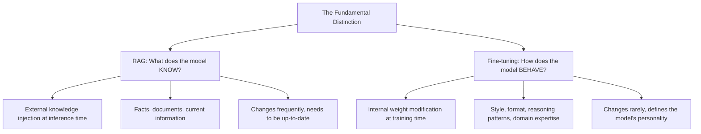

Once you internalize this distinction, the correct architectural choice for any given feature becomes immediately obvious. Attempting to force an LLM to memorize dynamic facts via gradient descent is as futile as attempting to teach a human calculus by having them read a dictionary.

> **Stop and think**: If you need an LLM to consistently output responses in a strict JSON format matching a deeply nested, proprietary schema, which approach makes more sense from a computational efficiency standpoint: RAG or fine-tuning?

---

## Theory: The Two Approaches to Customizing LLMs

When you want an LLM to perform better for your specific enterprise use case, you are faced with a fundamental fork in the architectural road. Think of the difference between RAG and fine-tuning like the difference between giving an employee a reference manual versus sending them to an intensive certification bootcamp. 

### 1. Retrieval-Augmented Generation (RAG)

With RAG, you hand the model a reference manual at the exact moment a question is asked. The model has not fundamentally changed its internal logic, but it can look up verified facts in its provided notes during generation. This approach excels in environments where information is factual, rapidly changing, and requires strict audit trails.

RAG operates by providing relevant context to the model strictly at inference time:

```text
User Query → Retrieve Relevant Docs → Inject into Prompt → Generate Response
```

The underlying mechanism involves vectorizing the user query using an embedding model (such as OpenAI's text-embedding-3-large), performing a cosine similarity search against a vector database (like Qdrant or Milvus deployed in your Kubernetes cluster), and injecting the top-k results into the context window.

```text
You are a helpful assistant. Use the following context to answer the question.

Context:
{retrieved_documents}

Question: {user_question}

Answer:
```

### 2. Fine-tuning

Fine-tuning is akin to enrolling the model in a specialized training program. After its initial pre-training phase, the model possesses generalized capabilities. Fine-tuning embeds specialized skills, distinct brand voices, or complex reasoning patterns permanently into the model's neural pathways. 

Fine-tuning permanently modifies the model's floating-point weights to change its intrinsic behavior:

```text
Training Data → Gradient Updates → Modified Weights → New Model
```

During this process, you collect hundreds or thousands of high-quality input/output pairs. The system runs a forward pass, calculates the cross-entropy loss against your expected output, and uses backpropagation to update the weights. This can be done via Full Fine-tuning (updating all parameters) or Parameter-Efficient Fine-Tuning (PEFT) methods like LoRA.

---

## The Decision Framework

Choosing between these architectures requires a rigorous, data-driven approach rather than relying on intuition. You must evaluate your use case against five critical dimensions.

### Question 1: Does the knowledge change frequently?

If the data your application relies upon updates regularly, embedding that data into model weights is an anti-pattern. You will be forced to retrain the model continuously to prevent hallucinations.

| Answer | Approach |
|--------|----------|
| **Yes, changes daily/weekly** | RAG |
| **No, relatively static** | Either (consider other factors) |

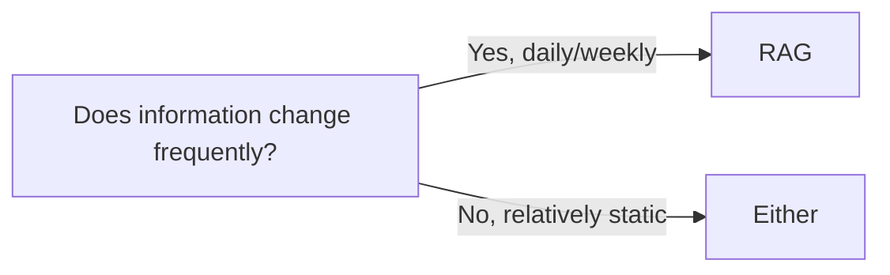

### Question 2: Do you need attribution or citations?

Enterprise compliance often requires knowing exactly where an AI obtained its information. Parametric memory acts as a black box; a fine-tuned model cannot accurately cite the specific training row that influenced its generation.

| Answer | Approach |
|--------|----------|
| **Yes, must cite sources** | RAG |
| **No, just need accurate answers** | Either |

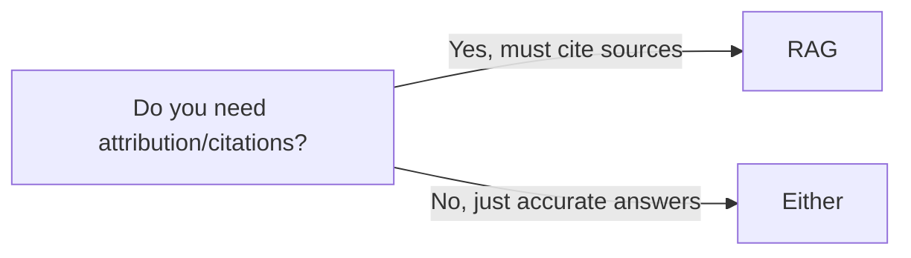

### Question 3: Is the task about KNOWLEDGE or BEHAVIOR?

This is the core of the Heureka moment. Assess whether the model is failing because it lacks facts, or because it is formatting its response incorrectly.

| Task Type | Example | Approach |
|-----------|---------|----------|
| **Knowledge** | "What's our refund policy?" | RAG |
| **Behavior** | "Write in our brand voice" | Fine-tuning |
| **Both** | "Answer support tickets in our style" | Hybrid |

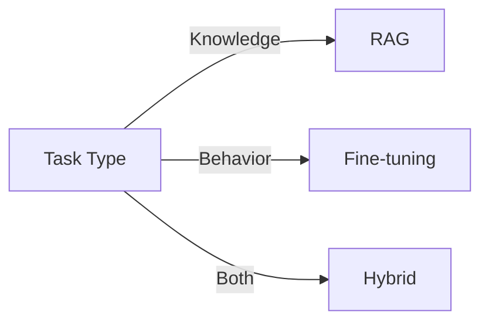

### Question 4: How much training data do you have?

Neural networks require significant statistical signal to overcome their pre-trained biases. Attempting to fine-tune with a handful of examples will result in overfitting or absolutely no noticeable change in behavior.

| Data Amount | Approach |
|-------------|----------|
| **< 100 examples** | RAG (fine-tuning won't work well) |
| **100-1000 examples** | LoRA/QLoRA |
| **> 1000 examples** | Full fine-tuning possible |

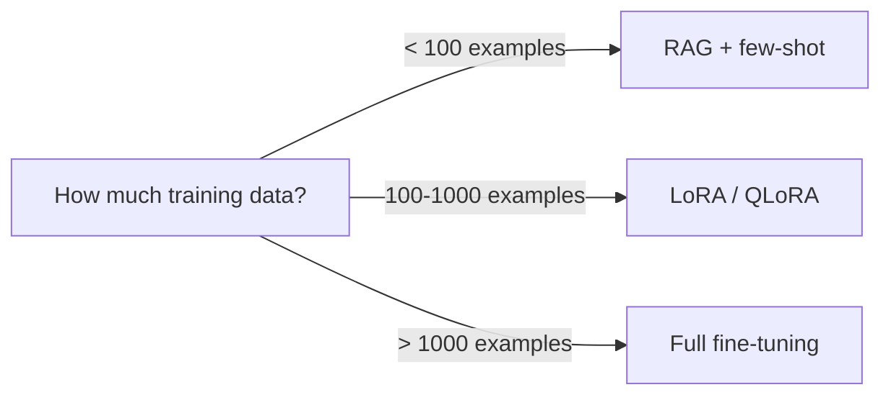

### Question 5: What is your latency requirement?

Every architectural component adds latency. RAG introduces network hops for embedding generation and vector database queries before the LLM even begins streaming tokens.

| Latency Need | Approach |
|--------------|----------|
| **Strict (< 100ms)** | Fine-tuning (no retrieval overhead) |
| **Flexible (< 2s)** | RAG is fine |
| **Very flexible** | Either |

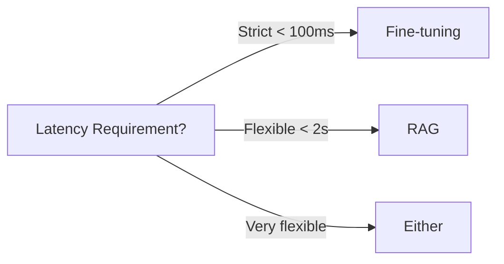

### The Complete Decision Matrix

```text
┌────────────────────────────────────────────────────────────────────────┐
│                       WHEN TO USE WHAT                                 │
├────────────────────────────────────────────────────────────────────────┤
│                                                                        │
│   USE RAG WHEN:                                                      │
│  ─────────────────                                                     │
│  • Knowledge changes frequently (docs, FAQs, product info)             │
│  • You need citations/source attribution                               │
│  • You have a large corpus (thousands of documents)                    │
│  • You can't afford fine-tuning compute costs                          │
│  • Latency requirements are flexible (200ms-2s OK)                     │
│  • You need to add new knowledge instantly                             │
│  • Compliance requires audit trails                                    │
│                                                                        │
│   USE FINE-TUNING WHEN:                                              │
│  ─────────────────────────                                             │
│  • You need a specific writing style or tone                           │
│  • You're teaching domain-specific reasoning patterns                  │
│  • Latency is critical (< 100ms)                                       │
│  • You have consistent, curated training data (100+ examples)          │
│  • The knowledge is stable (won't change for months)                   │
│  • You need the model to "think differently"                           │
│  • Security requires no external data access                           │
│                                                                        │
│   USE BOTH (HYBRID) WHEN:                                            │
│  ─────────────────────────                                             │
│  • You need specific behavior AND dynamic knowledge                    │
│  • Example: Customer support with brand voice + knowledge base         │
│  • Example: Legal assistant with citation style + case database        │
│  • Example: Code assistant with company conventions + API docs         │
│                                                                        │
└────────────────────────────────────────────────────────────────────────┘
```

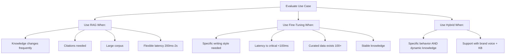

---

## The Cost Reality: What Each Approach Actually Costs

Engineering leadership frequently underestimates the true total cost of ownership (TCO) for fine-tuning, while overestimating the ongoing operational expenditures (OpEx) associated with RAG. Let us examine the actual numbers for a production system handling 100,000 queries per month.

### RAG Costs (Monthly)

RAG systems scale predictably. You pay for the underlying infrastructure and the API tokens consumed. Managing a vector database in a Kubernetes v1.35 cluster using StatefulSets ensures high availability without breaking the bank.

| Component | Cost | Notes |
|-----------|------|-------|
| Vector Database (Qdrant Cloud) | $25-100 | Depends on collection size |
| Embedding API (OpenAI) | $20-50 | For indexing new docs + queries |
| LLM API (Claude/gpt-5) | $200-800 | Main cost driver |
| **Total Monthly** | **$245-950** | Highly predictable |

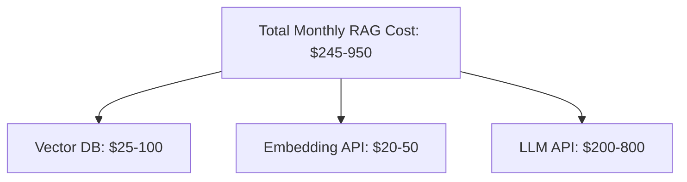

### Fine-tuning Costs (One-time + Ongoing)

Fine-tuning involves heavy capital expenditure (CapEx) upfront for data engineering and compute, followed by significantly higher inference costs if you are utilizing managed endpoints for custom models.

| Component | Cost | Notes |
|-----------|------|-------|
| Training compute | $50-5,000 | Depends on model size, data |
| Data preparation | $500-5,000 | Often underestimated |
| Evaluation pipeline | $200-1,000 | You need to measure quality |
| Hosting (if self-hosted) | $200-2,000/mo | GPU instance costs |
| **Total Initial** | **$1,000-13,000** | Plus $200-2,000/mo hosting |

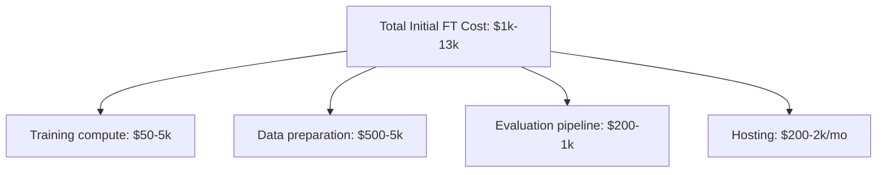

### The Hidden Costs of Fine-Tuning

The most severe hidden cost of fine-tuning is human data engineering time. Creating pristine, high-signal data is a laborious process.

| Task | Time Estimate | Often Forgotten? |
|------|---------------|------------------|
| Data collection | 1-2 weeks | No |
| Quality filtering | 1-3 weeks | Yes |
| Format standardization | 1 week | Yes |
| Edge case handling | 1-2 weeks | Yes |
| Validation set creation | 1 week | Yes |
| Annotation/labeling | 2-4 weeks | Sometimes |
| **Total** | **8-14 weeks** | — |

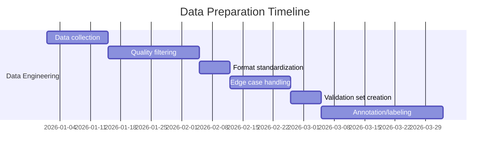

When accounting for engineering salaries over a two-year horizon, the disparity becomes shocking:

| Cost Category | RAG | Fine-tuning | Hybrid |
|--------------|-----|-------------|--------|
| Initial build | $10K | $80K | $20K |
| API/compute | $60K | $240K | $62K |
| Maintenance | $10K | $100K | $15K |
| Iteration | $5K | $40K | $10K |
| **Total** | **$85K** | **$460K** | **$107K** |

### Scenario Breakdown: 1 Million Queries per Month

```text
Cost Components:
├── LLM API Calls (gpt-5)
│   └── 1M queries × 1000 tokens/query × $2.50/1M tokens = $2,500/month
├── Embedding API (for retrieval)
│   └── 1M queries × 100 tokens × $0.02/1M tokens = $2/month
├── Vector Database (Pinecone)
│   └── $70/month (starter tier)
└── Total: ~$2,572/month
```

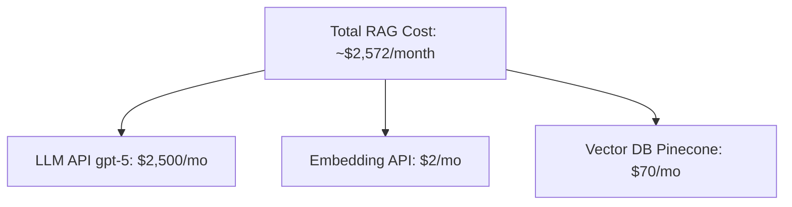

```text
Cost Components:
├── Training Cost (one-time)
│   └── gpt-5 fine-tuning: $25/million training tokens
│   └── 10M tokens training data: $250 (one-time)
├── Inference Cost
│   └── 1M queries × 1000 tokens × $12/1M tokens = $12,000/month
│   └── (Fine-tuned models cost 4-8x more per token!)
└── Total: ~$12,000/month + $250 one-time
```

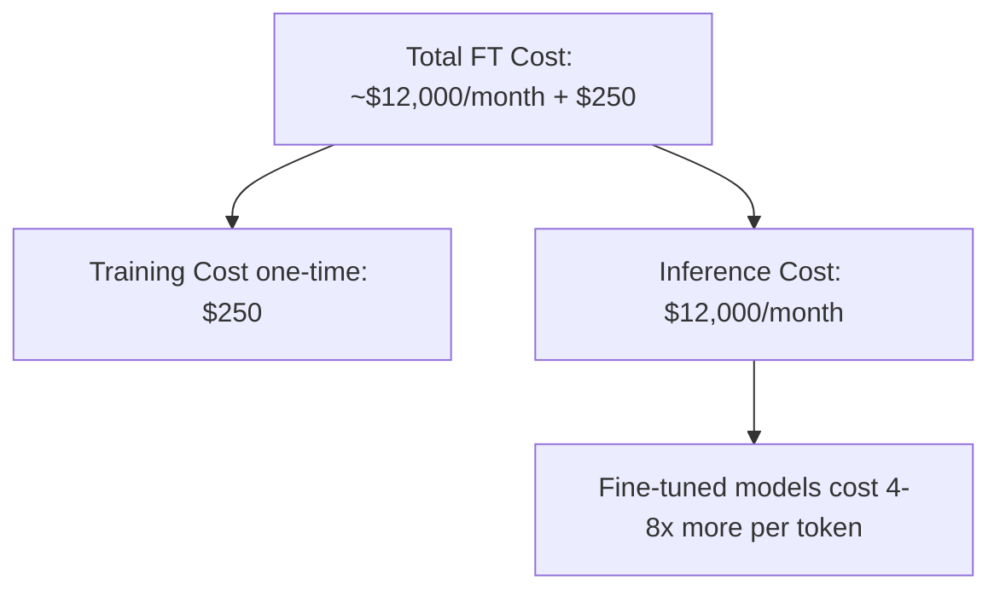

```text
Cost Components:
├── Training Cost (one-time)
│   └── LoRA fine-tuning: ~$50-200 (much cheaper)
├── LLM API Calls (base model, not fine-tuned)
│   └── 1M queries × 1000 tokens × $2.50/1M = $2,500/month
├── Embedding + Vector DB
│   └── $72/month
└── Total: ~$2,572/month + $100 one-time

But wait! The hybrid model:
- Has better quality (style + knowledge)
- No ongoing fine-tuned model costs
- Best of both worlds
```

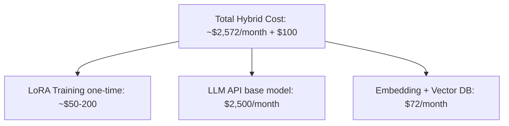

| Approach | Monthly Cost | One-time Cost | Quality |
|----------|--------------|---------------|---------|
| RAG Only | $2,572 | $0 | Good (knowledge) |
| Fine-tuned Only | $12,000 | $250 | Good (behavior) |
| Hybrid | $2,572 | $100-200 | Best (both!) |

---

## The Latency Trade-off: When Milliseconds Matter

In modern cloud-native architectures, latency budgets are strictly enforced. If you are building a system for high-frequency algorithmic decision making or real-time autonomous vehicle routing, the inherent network hops of RAG become a severe liability. 

**RAG Latency Breakdown:**
```text
User Query → Embed Query (20-50ms) → Vector Search (10-50ms) →
Retrieve Docs (5-20ms) → Build Prompt → LLM Generation (500-2000ms)

Total: 535-2120ms typical
```

**Fine-tuned Model Latency:**
```text
User Query → LLM Generation (500-2000ms)

Total: 500-2000ms typical
```

The difference of 35-120ms might seem negligible to a human reading a chat interface, but in microservice architectures where upstream services are waiting on AI output to proceed, it is a critical bottleneck. Furthermore, every external call (embedding API, Vector DB) introduces a new point of failure that must be managed with circuit breakers and fallback logic in your Kubernetes deployment.

---

## The Psychology of Knowledge vs Behavior

The hardest aspect of deciding between RAG and fine-tuning is cognitive bias. Humans naturally conflate knowledge with behavior. A senior software engineer does not just possess knowledge about Python syntax; they *behave* like a senior engineer when structuring code. We subconsciously project this unified cognitive model onto artificial neural networks.

LLMs, however, decouple these traits. Their pre-trained parametric knowledge is distinct from their ability to retrieve dynamic facts. 
- **Fine-tuning on facts makes them confident, not accurate.** The gradient updates teach the model to answer with unwavering authority, bypassing its internal uncertainty thresholds.
- **RAG on style guides doesn't change tone.** Injecting a PDF detailing your brand's voice into the context window is treated as a weak suggestion compared to the overwhelming inertia of the model's pre-trained weights.

> **Pause and predict**: If you implement a hybrid search (vector + BM25) but skip the cross-encoder reranking step, what kind of search results are likely to bubble to the top, and how might this affect the LLM's generation quality?

---

## The Data Quality Paradox

There is a counterintuitive truth in ML engineering: **fine-tuning requires significantly higher quality data than RAG**.

In a RAG system, the retrieved documents simply need to contain the relevant string of facts. The robust pre-trained capabilities of the LLM will effortlessly extract and format those facts into a coherent sentence, smoothing over any typos or bad grammar in your source documents.

In contrast, every single row of fine-tuning data acts as a direct behavioral mandate. If your training data contains inconsistent formatting, the model will output inconsistent formatting permanently.

```text
Fine-tuning promise: "We'll teach the model our domain expertise!"
Fine-tuning reality: "Our domain experts write inconsistently, and now our model does too."
```

If you provide an LLM with 1,000 examples of clinical notes where doctors haphazardly used lowercase abbreviations, your expensive fine-tuned model will meticulously replicate those exact grammatical errors.

---

## When Fine-tuning Goes Wrong: Production Horror Stories

Understanding theoretical constraints is helpful, but analyzing production failures builds architectural wisdom.

### Horror Story 1: The Confident Liar

A fintech company fine-tuned a base model on their internal documentation to create a "smart" customer service agent. Their dataset contained explicit policy numbers:

```text
Q: What are the wire transfer fees?
A: Wire transfers cost $25 for domestic and $45 for international.
```

Six months later, the business logic evolved, and fees increased. The fine-tuned model ignored the new documentation uploaded to the company wiki. It confidently and repeatedly quoted the outdated prices baked into its weights, overriding all attempts at context injection. The business lost $180,000 honoring the hallucinated fees before pulling the deployment.

### Horror Story 2: The Style Chameleon Gone Wrong

A marketing agency attempted to consolidate five distinct client brand voices into a single fine-tuned model. They merged casual copy, corporate jargon, and highly technical documentation into one massive training run. The resulting model suffered from severe mode collapse, randomly outputting highly formal technical specifications peppered with casual slang in the exact same paragraph. They had to scrap the project and implement isolated LoRA adapters for each specific client, loaded dynamically at inference time.

### Horror Story 3: Catastrophic Forgetting

An enterprise software company executed a full parameter fine-tune on their proprietary API documentation. While the model became a savant at answering API queries, the backpropagation process overwrote critical generalized weights. The model entirely lost its ability to perform basic logical reasoning and arithmetic, dropping its benchmark scores by over 40%. They were forced to abandon full fine-tuning and pivot to LoRA to protect the base model's generalized capabilities.

---

## The RAG Reliability Problem (And How to Solve It)

RAG is not a silver bullet. Its primary vulnerability is the retrieval mechanism itself. If the vector database returns irrelevant context, the LLM is guaranteed to fail. Typical vector-only retrieval accuracy hovers around 70-85% in production.

To bridge this gap, modern systems implement complex hybrid retrieval pipelines that combine dense vector embeddings with sparse keyword algorithms like BM25, culminating in a computationally intensive cross-encoder reranking phase.

```python
# Hybrid retrieval example
def hybrid_search(query: str, k: int = 5):
    # Vector search
    vector_results = vector_store.search(query, k=k)

    # Keyword search
    bm25_results = bm25_index.search(query, k=k)

    # Combine and deduplicate
    combined = merge_results(vector_results, bm25_results)

    # Rerank with cross-encoder
    reranked = cross_encoder.rerank(query, combined)

    return reranked[:k]
```

By forcing the cross-encoder to evaluate the relationship between the query and each retrieved document simultaneously, you eliminate the semantic mismatch commonly found in pure cosine similarity searches.

---

## Advanced Hybrid Patterns

Enterprise deployments rarely rely on pure RAG or pure fine-tuning. They utilize orchestration layers to dynamically route workloads.

### Pattern 1: Routing Architecture

```python
class IntelligentRouter:
    def route(self, query: str) -> str:
        # Classify query type
        query_type = self.classifier.classify(query)

        if query_type == "factual":
            # Pure RAG - needs citations and current info
            return self.rag_handler(query)

        elif query_type == "creative":
            # Pure fine-tuned - needs style, no facts
            return self.finetuned_handler(query)

        elif query_type == "analysis":
            # Hybrid - needs facts AND reasoning style
            return self.hybrid_handler(query)

        else:
            # Default to hybrid
            return self.hybrid_handler(query)
```

### Pattern 2: Cascading Models

To optimize cost without sacrificing quality, queries are routed to progressively larger, more expensive models only when confidence thresholds drop.

```text
Query → Small/Fast Model (RAG)
         ↓ (if low confidence)
      Medium Model (Fine-tuned)
         ↓ (if still uncertain)
      Large Model (Hybrid + Human Review)
```

### Pattern 3: Speculative RAG

To eliminate the latency overhead of retrieval, modern interfaces predict intent and execute vector queries asynchronously.

```python
# When user is typing...
def on_user_typing(partial_query: str):
    # Predict likely full query
    predicted_queries = query_predictor.predict(partial_query)

    # Pre-fetch context for top predictions
    for q in predicted_queries[:3]:
        context_cache.prefetch(q)

    # When user submits, context is already ready
    # Reduces latency from 200ms to 20ms
```

### The Hybrid Architecture Flow

```text
┌─────────────────────────────────────────────────────────────────────────┐
│                     HYBRID ARCHITECTURE                                 │
│                                                                         │
│  ┌─────────────┐     ┌─────────────┐     ┌──────────────────┐          │
│  │   User      │────▶│  Retriever  │────▶│  Retrieved Docs  │          │
│  │   Query     │     │  (RAG)      │     │  (Knowledge)     │          │
│  └─────────────┘     └─────────────┘     └────────┬─────────┘          │
│                                                    │                    │
│                                                    ▼                    │
│                      ┌───────────────────────────────────────┐         │
│                      │         Fine-tuned LLM                │         │
│                      │    (Style + Reasoning Patterns)       │         │
│                      │                                       │         │
│                      │   Input: Query + Retrieved Context    │         │
│                      │   Output: Styled, Accurate Response   │         │
│                      └───────────────────────────────────────┘         │
│                                          │                              │
│                                          ▼                              │
│                      ┌───────────────────────────────────────┐         │
│                      │        Final Response                 │         │
│                      │  (Brand voice + Factual + Cited)      │         │
│                      └───────────────────────────────────────┘         │
│                                                                         │
└─────────────────────────────────────────────────────────────────────────┘
```

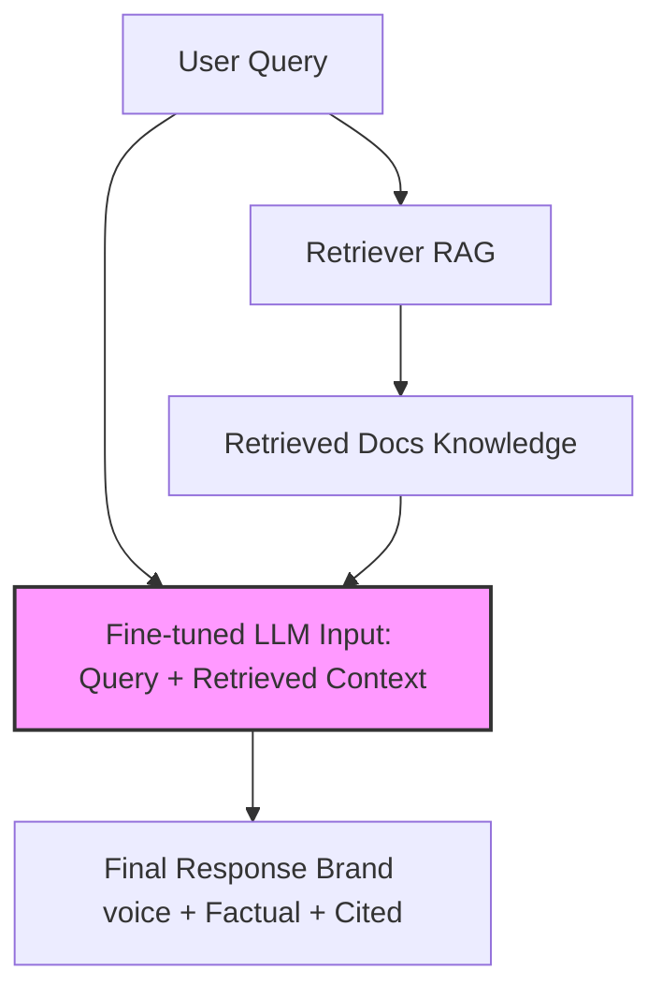

---

## Common Mistakes (And How to Avoid Them)

The road to production AI is paved with avoidable errors. Review these anti-patterns carefully to ensure your Kubernetes deployments are stable and performant.

| Mistake | Why it happens | How to Fix |
|---|---|---|
| Fine-tuning for dynamic data | Misunderstanding parametric memory limitations; assuming weights act as a reliable database. | Implement a vector retriever to fetch live data at runtime. |
| Injecting style via RAG context | LLMs heavily prioritize base training behaviors over context constraints for stylistic formatting instructions. | Use LoRA fine-tuning on a highly curated dataset of brand voice examples. |
| Ignoring vector database latency | Assuming vector lookups are instantaneous; ignoring the 20-50ms embedding network penalty. | Implement semantic caching and speculative pre-fetching in your routing layer. |
| Training with insufficient data | Assuming massive neural networks can generalize deep stylistic nuances from less than fifty data points. | Gather a minimum of one hundred diverse, high-quality examples before initiating LoRA. |
| Skipping capability evaluations | Focusing exclusively on narrow domain accuracy and entirely missing catastrophic forgetting of basic logic. | Build an automated regression test suite covering general math and reasoning benchmarks. |
| Over-engineering the router | Premature optimization; building highly complex orchestrators before empirical failure data exists to justify them. | Start with simple RAG, and only build routing logic when qualitative analysis demands it. |
| Deploying unquantized models | Wasting massive GPU VRAM allocations on FP32 or FP16 weights for standard inference workloads. | Use 4-bit or 8-bit quantization via QLoRA to reduce memory footprints drastically. |

### Anti-Pattern: Fine-tuning for Knowledge Updates

```python
# WRONG - Fine-tuning on FAQs that change monthly
training_data = [
    {"input": "What's the refund policy?",
     "output": "You can get a refund within 30 days..."},  # What if this changes?
]
model.fine_tune(training_data)

# RIGHT - RAG retrieves current policy
def answer_policy_question(question):
    current_policy = db.get_latest("refund_policy")
    return llm.generate(f"Policy: {current_policy}\nQuestion: {question}")
```

### Anti-Pattern: RAG for Style Requirements

```python
# WRONG - Trying to inject style through RAG
style_doc = """Our brand voice is casual, witty, and uses pop culture references.
We never use corporate jargon. We speak like a friend, not a company."""

def write_marketing_copy(topic):
    # Style doc gets lost in the noise
    return llm.generate(f"{style_doc}\n\nWrite copy about: {topic}")
    # Result: Generic, corporate-sounding copy

# RIGHT - Fine-tune on actual brand examples
training_data = [
    {"input": "Write about our new feature",
     "output": "Remember when you had to wait for things? Neither do we. "},
    # ... hundreds more examples in brand voice
]
brand_model = fine_tune(base_model, training_data)
# Result: Naturally writes in brand voice
```

### Anti-Pattern: The Cold Start Problem

```python
# WRONG - Assuming fine-tuning works with little data
training_data = get_examples()
print(f"Training examples: {len(training_data)}")  # Output: 42

# LoRA with 42 examples will barely move the needle
model = fine_tune_lora(base_model, training_data)
# Result: Model behaves almost identically to base model

# RIGHT - Check data sufficiency first
MIN_EXAMPLES = 100  # Absolute minimum for LoRA
GOOD_EXAMPLES = 500  # For reliable results

if len(training_data) < MIN_EXAMPLES:
    print("Not enough data for fine-tuning. Use RAG or collect more examples.")
elif len(training_data) < GOOD_EXAMPLES:
    print("Fine-tuning possible but quality may be limited. Consider few-shot prompting.")
else:
    print("Sufficient data for high-quality fine-tuning.")
```

### Anti-Pattern: Skipping Evaluation Pipelines

```python
# WRONG - "Ship it and see"
fine_tuned_model = fine_tune(base_model, data)
deploy(fine_tuned_model)  # Hope it works!

# RIGHT - Comprehensive evaluation before deployment
def evaluate_model(model, test_set):
    results = {
        "task_accuracy": test_task_performance(model, test_set),
        "general_capability": test_base_capabilities(model),  # Catch catastrophic forgetting
        "safety": test_safety_guidelines(model),  # Ensure guardrails intact
        "latency": measure_inference_time(model),
        "cost": calculate_cost_per_query(model),
    }

    if results["general_capability"] < 0.9 * baseline:
        raise ValueError("Catastrophic forgetting detected!")

    if results["safety"] < 0.95:
        raise ValueError("Safety guardrails degraded!")

    return results

# Only deploy if all checks pass
eval_results = evaluate_model(fine_tuned_model, test_set)
if all_checks_pass(eval_results):
    deploy(fine_tuned_model)
```

### Anti-Pattern: Over-engineering the Hybrid

```python
# WRONG - Unnecessarily complex hybrid
def answer(query):
    # Retrieve documents
    docs = retrieve(query)
    # Classify query type
    query_type = classify(query)
    # Route to specialized model
    if query_type == "technical":
        model = tech_model
    elif query_type == "sales":
        model = sales_model
    elif query_type == "support":
        model = support_model
    # Rerank retrieved documents
    reranked = rerank(docs, query)
    # Generate with selected model
    response = model.generate(query, reranked)
    # Post-process for compliance
    response = compliance_filter(response)
    # Check confidence and maybe escalate
    if confidence(response) < 0.8:
        response = escalate_to_human(query)
    return response
# Result: 500ms latency, 5 failure points, maintenance nightmare

# RIGHT - Start simple, add complexity only when needed
def answer_v1(query):
    docs = retrieve(query)  # Simple RAG
    return llm.generate(f"Context: {docs}\nQuestion: {query}")

# Only add complexity when you have DATA showing v1 fails
# "We had 15% of queries where style was wrong" → Add fine-tuning
# "Latency was 300ms and we need 100ms" → Add caching
```

---

## The Fine-Tuning Decision Checklist

Before allocating expensive GPU clusters for training, enforce this checklist across your engineering teams.

```text
□ Do I have at least 100 high-quality examples? (500+ preferred)
□ Is the knowledge static (won't change for 6+ months)?
□ Do I need behavioral changes (style/tone/reasoning)?
□ Have I tested RAG + few-shot prompting first?
□ Do I have an evaluation pipeline ready?
□ Can I afford the iteration time (3-5 training cycles)?
□ Do I have a plan for model maintenance when base models improve?
□ Have I tested for catastrophic forgetting?
□ Is latency critical enough to justify removing retrieval?
□ Do I understand why fine-tuning is better than prompting for this case?
```

```text
┌────────────────────────────────────────────────────────────────┐
│                    THE 30-SECOND DECISION                      │
├────────────────────────────────────────────────────────────────┤
│                                                                │
│  1. Does the information change frequently?                    │
│     YES → RAG                                                  │
│                                                                │
│  2. Do you need citations or audit trails?                     │
│     YES → RAG                                                  │
│                                                                │
│  3. Do you need a specific style or behavior?                  │
│     YES → Fine-tuning (LoRA)                                   │
│                                                                │
│  4. Do you have < 100 training examples?                       │
│     YES → Don't fine-tune, use RAG + few-shot                  │
│                                                                │
│  5. Is latency < 100ms critical?                               │
│     YES → Consider fine-tuning to remove retrieval             │
│                                                                │
│  6. Still unsure?                                              │
│     → Start with RAG. Add fine-tuning if needed.               │
│                                                                │
└────────────────────────────────────────────────────────────────┘
```

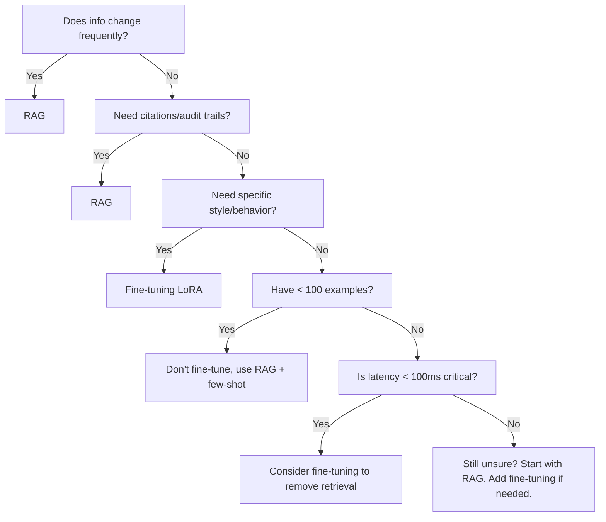

---

## Real-World Implementations

### Example 1: Customer Support Bot

```python
# RAG approach - knowledge injection at runtime
def answer_support_question(question: str) -> str:
    # Retrieve relevant docs
    docs = vector_store.search(question, k=5)

    # Inject into prompt
    context = "\n\n".join([d.content for d in docs])

    prompt = f"""You are a helpful support agent for Acme Inc.

Use the following documentation to answer the customer's question.
Always cite the source document.

Documentation:
{context}

Customer Question: {question}

Answer:"""

    return llm.generate(prompt)
```

### Example 2: Brand Voice Generator

```python
# Fine-tuning approach - modify model behavior
training_data = [
    {"input": "Write a tagline for our new feature",
     "output": "Revolutionize your workflow. Effortlessly."},
    {"input": "Describe our product in one sentence",
     "output": "The only tool you'll ever need to crush your goals."},
    # ... 498 more examples
]

# Fine-tune with LoRA
model = fine_tune_lora(
    base_model="claude-4.6-sonnet",
    training_data=training_data,
    rank=16,
    alpha=32,
    epochs=3
)
```

### Example 3: Legal Research Assistant

```python
# Hybrid approach - best of both worlds
class LegalAssistant:
    def __init__(self):
        # Fine-tuned model for legal reasoning and style
        self.model = load_finetuned_model("legal-llm-v3")

        # RAG for case law and statutes
        self.case_db = VectorStore("legal_cases")
        self.statute_db = VectorStore("statutes")

    def research(self, question: str) -> str:
        # Retrieve relevant cases and statutes
        cases = self.case_db.search(question, k=10)
        statutes = self.statute_db.search(question, k=5)

        # Use fine-tuned model with retrieved context
        prompt = f"""As a legal research assistant, analyze the following question.

Relevant Cases:
{format_cases(cases)}

Relevant Statutes:
{format_statutes(statutes)}

Legal Question: {question}

Provide a thorough legal analysis with citations:"""

        # Fine-tuned model handles style + reasoning
        # RAG provides accurate, up-to-date legal knowledge
        return self.model.generate(prompt)
```

---

## Parameter-Efficient Fine-Tuning (PEFT)

Full fine-tuning updates all model weights (billions of parameters). This approach is computationally devastating, demands massive GPU VRAM allocation, and frequently triggers catastrophic forgetting. 

PEFT methods resolve this structural issue by freezing the original model weights and injecting small, trainable adapter layers.

### Low-Rank Adaptation (LoRA)

LoRA hypothesizes that weight updates during fine-tuning possess a low intrinsic dimension. Instead of updating a massive weight matrix `W` directly, LoRA learns two exponentially smaller matrices that are multiplied together to represent the necessary adjustments.

```text
W' = W + BA

Where:
- W is the original weight matrix (frozen)
- B is a small matrix (d × r)
- A is a small matrix (r × k)
- r is the "rank" (typically 8-64)
```

```python
# LoRA configuration example
lora_config = {
    "r": 16,              # Rank (lower = fewer params, less capacity)
    "lora_alpha": 32,     # Scaling factor
    "target_modules": [   # Which layers to adapt
        "q_proj",         # Query projection
        "v_proj",         # Value projection
        "k_proj",         # Key projection
        "o_proj",         # Output projection
    ],
    "lora_dropout": 0.05, # Dropout for regularization
}
```

### Quantized LoRA (QLoRA)

QLoRA pushes efficiency to its absolute limit by quantizing the massive, frozen base model down to 4-bit precision, while training the tiny LoRA adapters in higher precision. This engineering feat allows developers to fine-tune massive 70-billion parameter models on commodity GPU hardware.

```python
# QLoRA example with Hugging Face
from transformers import AutoModelForCausalLM, BitsAndBytesConfig
from peft import LoraConfig, get_peft_model

# Quantize base model to 4-bit
quantization_config = BitsAndBytesConfig(
    load_in_4bit=True,
    bnb_4bit_compute_dtype=torch.float16,
    bnb_4bit_quant_type="nf4",
)

# Load quantized model
model = AutoModelForCausalLM.from_pretrained(
    "meta-llama/Llama-2-7b-hf",
    quantization_config=quantization_config,
)

# Add LoRA adapters
lora_config = LoraConfig(
    r=16,
    lora_alpha=32,
    target_modules=["q_proj", "v_proj"],
    lora_dropout=0.05,
)

model = get_peft_model(model, lora_config)

# Now you can fine-tune on a single 24GB GPU!
```

| Method | Params Updated | GPU Memory | Training Time | Quality |
|--------|----------------|------------|---------------|---------|
| Full fine-tune | 100% | Very High | Hours-Days | Best |
| LoRA (r=16) | ~1% | Medium | Minutes-Hours | Very Good |
| QLoRA (r=16) | ~1% | Low | Minutes-Hours | Good |
| Prompt tuning | 0.01% | Low | Minutes | OK |

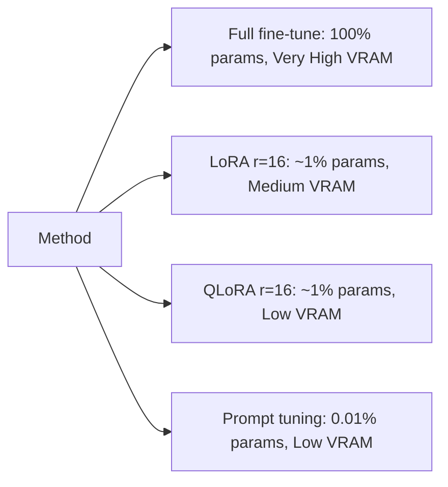

---

## Did You Know?

- **Did You Know?** In a 2023 survey by the MLOps Community, 67% of production fine-tuning projects were abandoned within 18 months because rapidly advancing base models entirely outpaced their expensive, custom-trained counterparts.
- **Did You Know?** Catastrophic forgetting in neural networks was first formally documented in 1989 by researchers McCloskey and Cohen, a fundamental problem that still plagues massive LLMs today when full fine-tuning is applied without heavy regularization.
- **Did You Know?** Uber's production RAG system processes roughly 2 billion embedding updates every single day, utilizing custom incremental indexing to reduce their daily compute bill from $200,000 to an astoundingly low $8,000.
- **Did You Know?** The seminal LoRA paper by Hu et al., published in June 2021, empirically demonstrated that fine-tuning a 7-billion parameter model could be done effectively while updating as little as 0.8% of its original weights, democratizing model customization forever.

---

## Module Quiz

<details>
<summary>Question 1: A hospital network needs an LLM to quickly retrieve patient records. Strict HIPAA regulations dictate that patient data absolutely cannot be embedded within the model's parametric weights to prevent accidental disclosure via prompting. Which architectural approach is legally required here?</summary>

**Answer:** A pure RAG architecture is legally required. Retrieval-Augmented Generation ensures that the LLM only accesses patient data via context injection at inference time. Because the underlying model weights are never updated with the sensitive data, there is zero risk of the model hallucinating patient data to unauthorized users outside of the explicit context window session.
</details>

<details>
<summary>Question 2: A marketing firm wants an open-source LLM to natively output JSON objects conforming to a deeply nested, proprietary company schema. They do not want to consume massive amounts of tokens by including few-shot examples in every single prompt. What is the optimal strategy?</summary>

**Answer:** The optimal strategy is parameter-efficient fine-tuning (LoRA or QLoRA). The task involves strictly modifying the formatting behavior of the model, not injecting new dynamic knowledge. By fine-tuning the model on examples of the proprietary schema, the model learns the exact structural constraints natively, saving thousands of input tokens per query in production.
</details>

<details>
<summary>Question 3: A financial institution deployed a LoRA adapter over Llama-3 to answer complex tax questions. Users are now reporting that the model confidently dispenses tax advice based on regulations from two years ago. What is the architectural root cause of this failure?</summary>

**Answer:** The team committed the anti-pattern of using fine-tuning to encode dynamic knowledge. Tax regulations change annually, but the fine-tuned adapter effectively froze the model's knowledge state at the time of training. To fix this, they must transition to a RAG architecture that queries an up-to-date vector database containing current tax statutes, overriding the outdated parametric knowledge.
</details>

<details>
<summary>Question 4: A latency-critical algorithmic trading application requires intent classification and response generation in under 100ms. The team currently utilizes a standard RAG pipeline, but their P95 latency is 350ms due to the vector search overhead. How can they meet their strict SLA?</summary>

**Answer:** The team must pivot away from RAG and perform full or LoRA fine-tuning for this specific classification task. By embedding the classification logic directly into the model weights, they entirely eliminate the network hops required for the embedding API and the vector database lookup. This removes the retrieval overhead, allowing the model to begin generating tokens immediately.
</details>

<details>
<summary>Question 5: A development team has collected exactly 30 high-quality examples demonstrating a highly specific functional programming paradigm. They attempt to use QLoRA to teach the model this paradigm. What is the mathematically expected outcome?</summary>

**Answer:** The model will demonstrate virtually zero behavioral change, or it will severely overfit to those specific 30 examples. Neural networks require significant statistical signal to override their pre-trained inertia. A dataset of 30 examples is vastly insufficient for fine-tuning; the team must either use those examples in a few-shot RAG prompt or gather a minimum of 100-500 examples before attempting QLoRA.
</details>

<details>
<summary>Question 6: Following a massive full-parameter fine-tuning run designed to teach an LLM corporate HR policies, the engineering team notices the model can no longer solve basic logic puzzles it previously handled easily. What specific phenomenon has occurred?</summary>

**Answer:** The model has suffered from catastrophic forgetting. By updating 100% of the model's parameters to heavily favor corporate HR data, the gradient updates mathematically overwrote the weights responsible for generalized reasoning and logic. To resolve this, the team should either use RAG for the policy documents or utilize a PEFT method like LoRA to freeze the base capabilities.
</details>

---

## Hands-On: Build a RAG vs Fine-tuning Decision Engine CLI

In this lab, you will build an executable procedural Python CLI tool that ingests constraints and outputs a definitive architectural recommendation, complete with cost projections. This bridges the theoretical decision matrix with an automated engineering pipeline.

### Task 1: Environment Setup and Scaffolding

First, set up your Python environment and install the required formatting and CLI libraries. We will use `argparse` for dependency-free parsing and `rich` to render the output beautifully in the terminal.

<details>
<summary>View the solution for Task 1</summary>

```bash
python3 -m venv venv
source venv/bin/activate
pip install rich
touch decision_engine.py
```
</details>

### Task 2: Define the CLI Interface

Create the basic structure of `decision_engine.py` to accept the required arguments exactly as specified in the deliverable. 

<details>
<summary>View the solution for Task 2</summary>

```python
import argparse
import sys
from rich.console import Console
from rich.panel import Panel

def setup_parser():
    parser = argparse.ArgumentParser(description="RAG vs Fine-tuning Decision Engine")
    subparsers = parser.add_subparsers(dest="command", required=True)
    
    analyze_parser = subparsers.add_parser("analyze")
    analyze_parser.add_argument("--knowledge-changes", type=str, required=True, help="Frequency of changes (e.g., 'weekly', 'rarely')")
    analyze_parser.add_argument("--needs-citations", type=str, required=True, help="'true' or 'false'")
    analyze_parser.add_argument("--style-requirements", type=str, required=True, help="'high', 'medium', or 'low'")
    analyze_parser.add_argument("--training-data", type=str, required=True, help="Number of examples (e.g., '200 examples')")
    analyze_parser.add_argument("--latency-requirement", type=str, required=True, help="Latency bound (e.g., '2s', '50ms')")
    analyze_parser.add_argument("--monthly-queries", type=int, required=True, help="Expected monthly query volume")
    
    return parser

if __name__ == "__main__":
    parser = setup_parser()
    args = parser.parse_args()
    print(f"Arguments parsed successfully for {args.monthly_queries} queries.")
```
</details>

### Task 3: Implement the Scoring Heuristic

The engine must evaluate the string inputs and assign an architectural path based on our decision matrix. If knowledge changes frequently or citations are required, RAG is mandatory. If style requirements are high and data > 100, LoRA is viable.

<details>
<summary>View the solution for Task 3</summary>

```python
def evaluate_architecture(args):
    needs_rag = False
    needs_ft = False
    reasons = []

    # Evaluate RAG constraints
    if args.knowledge_changes.lower() in ['daily', 'weekly', 'monthly']:
        needs_rag = True
        reasons.append(f"Knowledge changes {args.knowledge_changes} → RAG for dynamic content")
    
    if args.needs_citations.lower() == 'true':
        needs_rag = True
        reasons.append("Citations required → RAG provides source attribution")

    # Evaluate Fine-tuning constraints
    data_count = int(''.join(filter(str.isdigit, args.training_data)))
    if args.style_requirements.lower() == 'high':
        needs_ft = True
        reasons.append("High style requirements → Fine-tune for consistent voice")
        
        if data_count >= 100:
            reasons.append(f"{data_count} examples sufficient for LoRA")
        else:
            needs_ft = False
            reasons.append(f"WARNING: {data_count} examples is INSUFFICIENT for LoRA. Gathering more data recommended.")

    # Determine final architecture
    if needs_rag and needs_ft:
        return "Hybrid (RAG + LoRA Fine-tuning)", reasons
    elif needs_rag:
        return "RAG Only", reasons
    elif needs_ft:
        return "Fine-Tuning Only (LoRA)", reasons
    else:
        return "RAG (Default Safe Choice)", reasons
```
</details>

### Task 4: Implement Cost Projections

Implement the mathematical logic to project the exact OpEx and CapEx based on the calculated architecture and the total `monthly_queries`. Assume an average of 1000 tokens per query.

<details>
<summary>View the solution for Task 4</summary>

```python
def calculate_costs(architecture, queries):
    costs = {}
    
    if "RAG" in architecture:
        # LLM API: $2.50 per 1M tokens
        costs['LLM API'] = (queries * 1000 / 1_000_000) * 2.50
        # Embeddings: $0.02 per 1M tokens (assume 100 tokens per query)
        costs['Embeddings'] = (queries * 100 / 1_000_000) * 0.02
        costs['Vector DB'] = 70.00
        
    if "Fine-tuning" in architecture or "LoRA" in architecture:
        costs['LoRA hosting'] = 250.00
        costs['LoRA one-time'] = 150.00
        
    total_monthly = sum(v for k, v in costs.items() if 'one-time' not in k)
    return total_monthly, costs
```
</details>

### Task 5: Format the Final Deliverable

Connect the functions and output the data using `rich` panels to strictly match the requested deliverable layout. Run your script using the provided CLI arguments to verify success.

<details>
<summary>View the solution for Task 5</summary>

```python
# Add this to your main block
def generate_report(args):
    console = Console()
    architecture, reasons = evaluate_architecture(args)
    total_cost, costs = calculate_costs(architecture, args.monthly_queries)
    
    report = f"[bold green]RECOMMENDATION: {architecture}[/bold green]\n\n"
    report += "[bold]Reasoning:[/bold]\n"
    for r in reasons:
        report += f"- {r}\n"
        
    report += f"\n[bold]Estimated Monthly Cost: ${total_cost:,.0f}[/bold]\n"
    if 'LLM API' in costs:
        report += f"- LLM API: ${costs['LLM API']:,.0f}\n"
    if 'Vector DB' in costs:
        report += f"- Vector DB: ${costs['Vector DB']:,.0f}\n"
    if 'Embeddings' in costs:
        report += f"- Embeddings: ${costs['Embeddings']:,.0f}\n"
    if 'LoRA hosting' in costs:
        report += f"- LoRA hosting: ${costs['LoRA hosting']:,.0f} (one-time: ${costs['LoRA one-time']:,.0f})\n"
        
    console.print(Panel(report, title="Analysis Report", expand=False))

if __name__ == "__main__":
    parser = setup_parser()
    args = parser.parse_args()
    if args.command == "analyze":
        generate_report(args)
```

Run the following command in your terminal to validate the tool:
```bash
# Analyze a use case
python decision_engine.py analyze \
    --knowledge-changes "weekly" \
    --needs-citations true \
    --style-requirements "high" \
    --training-data "200 examples" \
    --latency-requirement "2s" \
    --monthly-queries 100000

# Output:
# RECOMMENDATION: Hybrid (RAG + LoRA Fine-tuning)
#
# Reasoning:
# - Knowledge changes weekly → RAG for dynamic content
# - Citations required → RAG provides source attribution
# - High style requirements → Fine-tune for consistent voice
# - 200 examples sufficient for LoRA
#
# Estimated Monthly Cost: $2,850
# - LLM API: $2,500
# - Vector DB: $70
# - Embeddings: $30
# - LoRA hosting: $250 (one-time: $150)
```
</details>

**Success Checklist:**
- [x] CLI parses all 6 required flags seamlessly without throwing Python runtime errors.
- [x] The engine correctly routes high-frequency data changes directly to RAG architectures.
- [x] The cost formulas correctly multiply token rates against the `monthly-queries` integer.
- [x] The script successfully outputs the exact terminal structure modeled in the `[CODE-31]` deliverable blueprint.

---

## Next Steps

Now that you have mastered the exact architectural boundaries determining when to use RAG versus when to fine-tune weights via gradient descent, you are prepared to build complex orchestrations that tie these systems together.

[Module 14: LangChain Fundamentals](./module-1.4-langchain-fundamentals) - Build sophisticated RAG and chain routing systems utilizing LangChain's powerful abstractions. You will learn to construct sequence chains, inject complex memory profiles, and write seamless LangChain Expression Language (LCEL) scripts to manage your new hybrid architectures.

_Last updated: 2026-04-13_
_Next: Module 14 - LangChain Fundamentals_