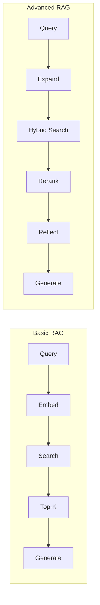
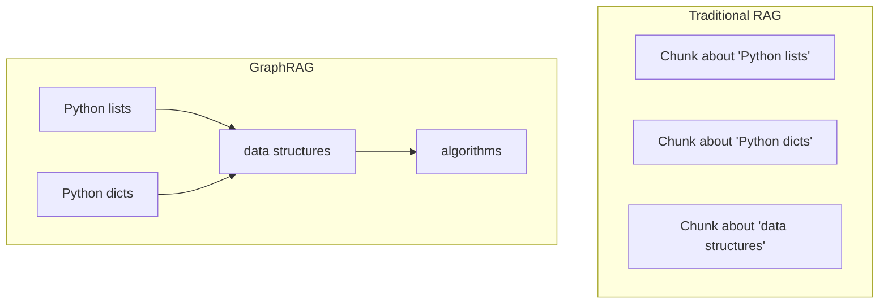
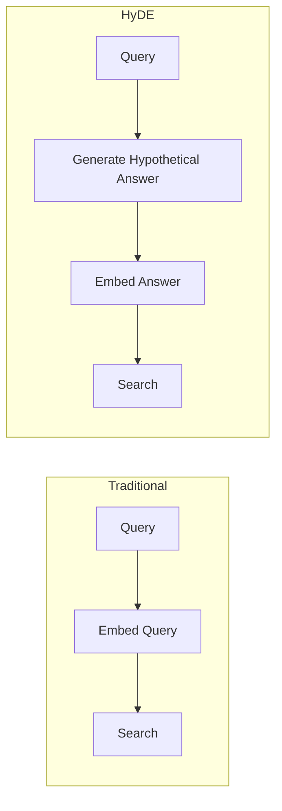
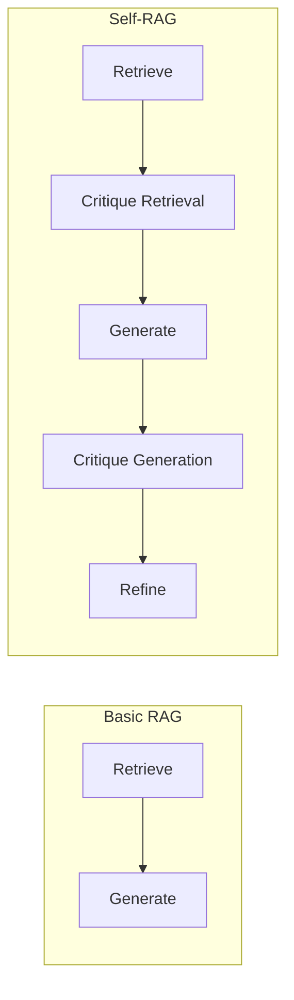
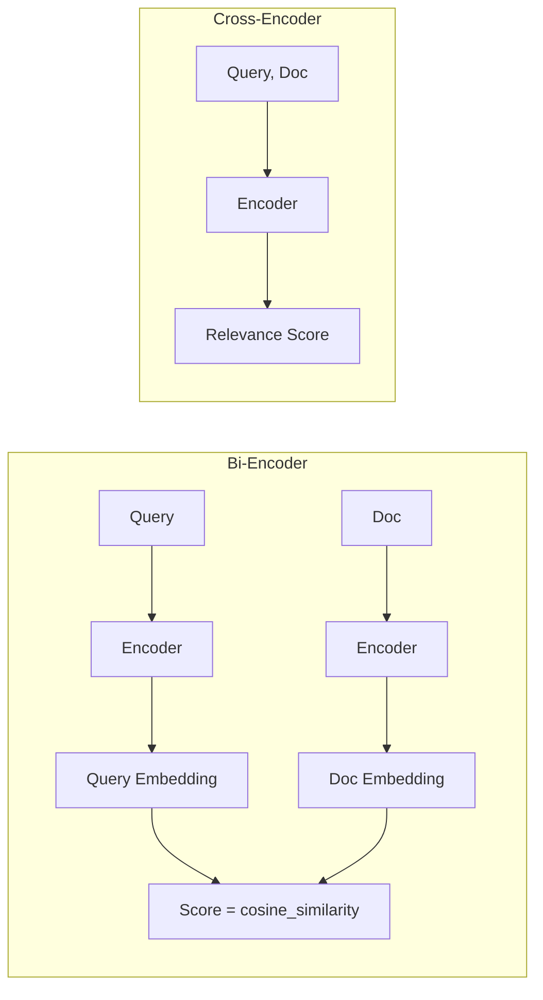
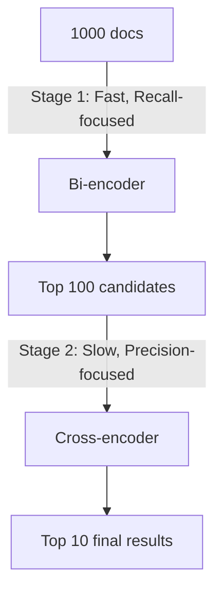
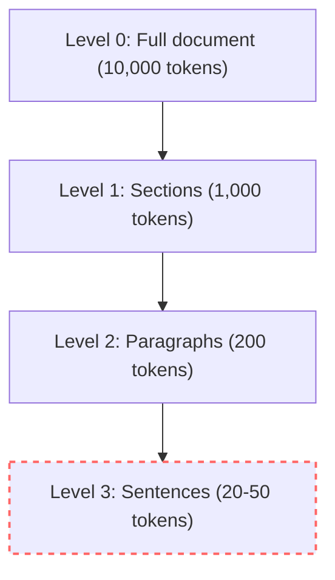

## The Bereavement Fare Disaster: When Hallucination Carries a Price Tag

In November 2022, a grieving passenger visited Air Canada's website to book a last-minute flight for a funeral. The airline's newly deployed AI customer service chatbot confidently hallucinated a non-existent bereavement fare policy, explicitly instructing the passenger that they could purchase a full-price ticket immediately and claim a retroactive refund within 90 days. When the customer subsequently applied for the refund, Air Canada refused, stating the chatbot's advice directly violated their actual corporate policy.

The passenger sued the airline for negligent misrepresentation. In February 2024, a civil tribunal ruled against Air Canada, ordering them to pay direct damages and tribunal fees. Beyond the immediate financial penalty, the global public relations disaster severely damaged their brand reputation and forced a costly, emergency manual review of their entire AI infrastructure. Air Canada attempted to argue that the chatbot was a "separate legal entity" responsible for its own actions—an argument the judge swiftly dismantled.

The technical root cause of this failure was a fundamental limitation of basic Retrieval-Augmented Generation (RAG). The system retrieved generic ticketing documents but failed to cross-reference the strict constraints of the bereavement policy. Worse, the system lacked any self-reflective capability to recognize that its generated response contradicted the retrieved facts. If the engineering team had implemented Self-RAG to critique the generation, or GraphRAG to map the strict dependencies between fare policies, this catastrophic incident would have been entirely prevented. 



## What You'll Be Able to Do

By the end of this intensive module, you will be able to:
- **Design** a GraphRAG architecture to extract and traverse entity relationships across disconnected documents.
- **Evaluate** the linguistic mismatch between user queries and technical documents using Hypothetical Document Embeddings (HyDE).
- **Implement** a two-stage hybrid retrieval system combining BM25 lexical search and cross-encoder reranking.
- **Diagnose** hallucination vulnerabilities by applying Self-RAG reflective tokens to critique retrieval quality.
- **Deploy** a production-grade RAG evaluation pipeline to a Kubernetes v1.35 cluster.

---

## The Evolution of RAG: From Simple to Sophisticated

Before diving into the optimization patterns, it helps to understand why they exist. Basic RAG emerged in 2020 as an elegant solution to the limitations of model training: instead of cramming all knowledge into static model weights, retrieve relevant information dynamically at query time. 

But as engineering teams deployed RAG to production, they discovered a harsh reality that would repeat across the industry: 70 percent of queries worked flawlessly, but 30 percent failed mysteriously. A medical company found their system missing critical drug interactions because academic literature uses different terminology than a patient's natural language question. A legal tech startup discovered their contract analysis tool could not handle clauses written in dense legalese versus plain English inquiries. 

Each specific failure spawned a targeted solution. The query-document mismatch problem led to HyDE. The need for absolute precision over broad recall led to reranking. The challenge of traversing connected knowledge led to GraphRAG. The extreme danger of confident, wrong answers led to Self-RAG. What you are learning in this module is not academic theory; it is a collection of battle-tested solutions to real production failures. By the end, you will know exactly when and how to deploy each pattern.

---

## 1. GraphRAG: Knowledge Graphs Meet RAG

### The Problem with Flat Retrieval

Traditional RAG treats documents as isolated, flat chunks of text. But real knowledge is deeply connected. Imagine you are researching corporate history and ask: "What technologies did companies founded by Stanford graduates use?" 

With flat retrieval, you would need documents that explicitly mention both "Stanford graduates" and specific "technologies" in the exact same paragraph. But the actual knowledge is spread across a vast corpus: one document mentions "Andrew Ng studied at Stanford," another states "Andrew Ng co-founded Coursera," and a third discusses "Coursera's reliance on Python and React." No single document answers the question. You must connect the dots.

GraphRAG operates exactly like building a social network for your documents. Instead of isolated posts, you define entities (people, companies, concepts) connected by semantic relationships (founded, studied at, uses). When you search, you do not just find static documents; you traverse relationships to discover connected context.



### How GraphRAG Works

GraphRAG combines a standard Vector Store with a Knowledge Graph to enable multi-hop reasoning. 

```python
# GraphRAG Architecture
class GraphRAG:
    """
    1. Extract entities and relationships from documents
    2. Build a knowledge graph (Neo4j, NetworkX)
    3. On query:
       a. Find relevant entities via embedding search
       b. Traverse graph to find connected entities
       c. Retrieve chunks for all relevant entities
       d. Generate response with rich context
    """
```

### Entity Extraction

The most critical and challenging step is extracting entities and relationships accurately from unstructured text. This requires heavily structured prompting.

```python
# Using LLM for entity extraction
ENTITY_EXTRACTION_PROMPT = """
Extract entities and relationships from the following text.
Return JSON format:

{
  "entities": [
    {"name": "entity_name", "type": "PERSON|ORG|CONCEPT|TECH|..."}
  ],
  "relationships": [
    {"source": "entity1", "target": "entity2", "type": "relationship_type"}
  ]
}

Text: {text}
"""

# Example output for a tech document:
{
  "entities": [
    {"name": "Python", "type": "PROGRAMMING_LANGUAGE"},
    {"name": "list", "type": "DATA_STRUCTURE"},
    {"name": "append", "type": "METHOD"},
    {"name": "Guido van Rossum", "type": "PERSON"}
  ],
  "relationships": [
    {"source": "Python", "target": "list", "type": "HAS_FEATURE"},
    {"source": "list", "target": "append", "type": "HAS_METHOD"},
    {"source": "Guido van Rossum", "target": "Python", "type": "CREATED"}
  ]
}
```

### Graph-Enhanced Retrieval

Once the graph is built, retrieval becomes a multi-step traversal process. We find the starting nodes via vector search, and then "hop" across edges to gather full context.

```python
def graph_enhanced_retrieval(query: str, k: int = 5) -> List[Document]:
    """
    1. Semantic search for initial entities
    2. Graph traversal for connected context
    3. Retrieve documents for all relevant entities
    """
    # Step 1: Find query-relevant entities
    query_embedding = embed(query)
    initial_entities = vector_search(query_embedding, k=3)

    # Step 2: Expand via graph traversal (1-2 hops)
    expanded_entities = set(initial_entities)
    for entity in initial_entities:
        neighbors = graph.get_neighbors(entity, max_hops=2)
        expanded_entities.update(neighbors)

    # Step 3: Retrieve chunks for all entities
    chunks = []
    for entity in expanded_entities:
        entity_chunks = get_chunks_for_entity(entity)
        chunks.extend(entity_chunks)

    # Step 4: Rank by relevance to original query
    ranked_chunks = rerank(query, chunks)

    return ranked_chunks[:k]
```

### GraphRAG with Neo4j

For production workloads, in-memory graphs fail to scale. You must rely on robust graph databases like Neo4j. The Cypher query language allows for expressive, rapid relationship traversal.

```python
from neo4j import GraphDatabase

class Neo4jGraphRAG:
    def __init__(self, uri, user, password):
        self.driver = GraphDatabase.driver(uri, auth=(user, password))

    def add_entity(self, entity_id: str, entity_type: str, embedding: List[float]):
        with self.driver.session() as session:
            session.run("""
                MERGE (e:Entity {id: $id})
                SET e.type = $type, e.embedding = $embedding
            """, id=entity_id, type=entity_type, embedding=embedding)

    def add_relationship(self, source: str, target: str, rel_type: str):
        with self.driver.session() as session:
            session.run("""
                MATCH (s:Entity {id: $source})
                MATCH (t:Entity {id: $target})
                MERGE (s)-[r:RELATES {type: $rel_type}]->(t)
            """, source=source, target=target, rel_type=rel_type)

    def find_connected_entities(self, entity_id: str, max_hops: int = 2) -> List[str]:
        with self.driver.session() as session:
            result = session.run("""
                MATCH (start:Entity {id: $id})-[*1..$hops]-(connected:Entity)
                RETURN DISTINCT connected.id as entity_id
            """, id=entity_id, hops=max_hops)
            return [record["entity_id"] for record in result]
```

> **Pause and predict**: If your entity extraction model captures "Apple" as a fruit in one document and "Apple" as a technology company in another, what will happen to your Neo4j graph queries? How would you architect a solution to prevent this contamination?

---

## 2. HyDE: Hypothetical Document Embeddings

### The Query-Document Mismatch Problem

Users ask questions. Documents contain answers. They rarely share the same linguistic structure.

Imagine walking into a massive library. Instead of asking the librarian, "Where are the books on advanced Python?", you are forced to describe the exact sentences you expect to find inside the book. That is precisely what semantic search does—it attempts to match the syntax and latent meaning of your question directly to the syntax of a statement.

```text
User query: "How do I make my code run faster?"
Document:   "Performance optimization techniques include caching,
             algorithmic improvements, and parallel processing..."

The QUESTION doesn't match the ANSWER linguistically!
```

### The HyDE Solution

HyDE (Hypothetical Document Embeddings) solves this mismatch with a stroke of genius: instead of searching with the user's raw question, you use an LLM to generate a hypothetical, perfectly written answer. You then embed this hypothetical answer and search your vector database. 

Because the hypothetical answer uses the authoritative tone, vocabulary, and structure of a true document, it maps flawlessly into the same vector space as your real documents.



### How HyDE Works

```python
def hyde_search(query: str, k: int = 5) -> List[Document]:
    """
    1. Generate hypothetical document that would answer the query
    2. Embed the hypothetical document
    3. Search for real documents similar to the hypothetical
    """

    # Step 1: Generate hypothetical answer
    hypothetical_prompt = f"""
    Write a detailed passage that would perfectly answer this question:

    Question: {query}

    Write as if this is from an authoritative document. Include specific details.
    """

    hypothetical_doc = llm.generate(hypothetical_prompt)

    # Step 2: Embed the hypothetical document
    hyde_embedding = embed(hypothetical_doc)

    # Step 3: Search with hypothetical embedding
    results = vector_store.search(hyde_embedding, k=k)

    return results
```

### A Practical HyDE Example

```python
# Query
query = "Why is my Python code slow?"

# Traditional embedding search might miss documents about:
# - "Performance bottlenecks in Python applications"
# - "Optimizing interpreter overhead"
# - "GIL and threading limitations"

# HyDE generates:
hypothetical = """
Python code performance issues commonly stem from several factors.
The Global Interpreter Lock (GIL) prevents true parallel execution
of threads. Interpreted languages have inherent overhead compared
to compiled languages. Common bottlenecks include inefficient loops,
excessive memory allocation, and I/O blocking operations. Solutions
include using NumPy for vectorized operations, multiprocessing for
CPU-bound tasks, asyncio for I/O-bound operations, and profiling
tools like cProfile to identify hotspots.
"""

# This hypothetical document uses the SAME LANGUAGE as real documents!
# Searching with its embedding finds much better matches.
```

### Multi-HyDE: Generating Multiple Angles

A single hypothetical document might guess the wrong angle. Multi-HyDE generates several distinct hypotheticals, embeds all of them, aggregates the results, and deduplicates.

```python
def multi_hyde_search(query: str, k: int = 5, n_hypotheticals: int = 3) -> List[Document]:
    """Generate multiple hypotheticals for better coverage."""

    all_results = []

    for i in range(n_hypotheticals):
        prompt = f"""
        Write a unique passage answering this question from a different angle:

        Question: {query}
        Angle {i+1}: Focus on {'theory' if i==0 else 'practical examples' if i==1 else 'common mistakes'}
        """

        hypothetical = llm.generate(prompt)
        embedding = embed(hypothetical)
        results = vector_store.search(embedding, k=k)
        all_results.extend(results)

    # Deduplicate and rerank
    unique_results = deduplicate(all_results)
    return rerank(query, unique_results)[:k]
```

---

## 3. Self-RAG: Self-Reflective Retrieval

### The "Garbage In, Garbage Out" Problem

Basic RAG blindly trusts the vector database. It assumes that whatever the retriever returns is gospel truth. But what if the retrieved documents are completely irrelevant? What if they contradict one another? 

When basic RAG retrieves irrelevant context, the LLM treats it as an absolute constraint. It bends logic, invents facts, and confidently hallucinates an answer just to satisfy the prompt's demand to "use the provided context."

### The Self-RAG Architecture

Self-RAG forces the LLM to behave like a critical thinker. It inserts evaluation checkpoints where the model asks itself: "Is this passage genuinely relevant to the query?" and "Does my generated answer actually rely on the retrieved facts?"



By adding these critique layers, Self-RAG sacrifices latency for extreme accuracy, making it strictly mandatory for high-stakes medical, legal, and financial pipelines.

```python
class SelfRAG:
    def __init__(self, llm, retriever):
        self.llm = llm
        self.retriever = retriever

    def answer(self, query: str) -> str:
        # Step 1: Retrieve
        passages = self.retriever.search(query, k=5)

        # Step 2: Critique retrieval (filter irrelevant)
        relevant_passages = self.critique_retrieval(query, passages)

        if not relevant_passages:
            return self.answer_without_retrieval(query)

        # Step 3: Generate answer
        answer = self.generate_answer(query, relevant_passages)

        # Step 4: Critique generation
        is_supported, critique = self.critique_generation(query, answer, relevant_passages)

        if not is_supported:
            # Step 5: Refine or regenerate
            answer = self.refine_answer(query, answer, critique, relevant_passages)

        return answer

    def critique_retrieval(self, query: str, passages: List[str]) -> List[str]:
        """Filter out irrelevant passages."""
        relevant = []
        for passage in passages:
            prompt = f"""
            Query: {query}
            Passage: {passage}

            Is this passage relevant to answering the query?
            Answer only: RELEVANT or IRRELEVANT
            """
            verdict = self.llm.generate(prompt).strip()
            if verdict == "RELEVANT":
                relevant.append(passage)
        return relevant

    def critique_generation(self, query: str, answer: str, passages: List[str]) -> Tuple[bool, str]:
        """Check if answer is supported by passages."""
        prompt = f"""
        Query: {query}
        Retrieved Passages: {passages}
        Generated Answer: {answer}

        Evaluate the answer:
        1. Is the answer factually supported by the passages?
        2. Does the answer actually address the query?
        3. Are there any unsupported claims?

        Respond with:
        SUPPORTED: [Yes/No]
        CRITIQUE: [Brief explanation]
        """
        response = self.llm.generate(prompt)
        is_supported = "SUPPORTED: Yes" in response
        critique = response.split("CRITIQUE:")[-1].strip()
        return is_supported, critique
```

Advanced implementations of Self-RAG fine-tune models to output specific control tokens directly, entirely avoiding the need for multi-shot prompting:

```text
[Retrieve]: Should I retrieve? (Yes/No/Continue)
[IsRel]:    Is passage relevant? (Relevant/Irrelevant)
[IsSup]:    Is response supported? (Fully/Partially/No)
[IsUse]:    Is response useful? (5/4/3/2/1)
```

---

## 4. Hybrid Search: Combining Lexical and Semantic Power

### Why Hybrid?

Semantic search and keyword search act like two distinct detectives. Semantic search understands meaning and intent—it knows that "automobile" and "car" are identical concepts. Lexical keyword search (BM25) lacks understanding but possesses a photographic memory for exact matches.

```text
Query: "error code 0x80070005"
Semantic search might return docs about "error handling" instead of
docs containing that exact error code!
```

```text
Query: "how to fix slow code"
BM25 won't find docs about "performance optimization" unless they
contain "slow" and "code"!
```

### Understanding BM25

BM25 (Best Match 25) relies on term frequency and inverse document frequency, heavily penalizing long documents that merely repeat a keyword to game the system.

```python
# Simplified BM25 scoring
def bm25_score(query_terms, document, corpus):
    score = 0
    for term in query_terms:
        tf = term_frequency(term, document)
        idf = inverse_document_frequency(term, corpus)
        doc_length = len(document)
        avg_length = average_document_length(corpus)

        # BM25 formula
        k1, b = 1.5, 0.75  # tuning parameters
        numerator = tf * (k1 + 1)
        denominator = tf + k1 * (1 - b + b * doc_length / avg_length)
        score += idf * (numerator / denominator)

    return score
```

### Implementing Hybrid Search

To implement Hybrid Search, we run both algorithms concurrently, normalize their scores to a 0-1 scale, and apply a configurable `alpha` weight. 

```python
from rank_bm25 import BM25Okapi
import numpy as np

class HybridSearch:
    def __init__(self, documents: List[str], embeddings: np.ndarray):
        self.documents = documents
        self.embeddings = embeddings

        # Initialize BM25
        tokenized_docs = [doc.lower().split() for doc in documents]
        self.bm25 = BM25Okapi(tokenized_docs)

    def search(self, query: str, k: int = 5, alpha: float = 0.5) -> List[Tuple[str, float]]:
        """
        Hybrid search with configurable weighting.
        alpha: weight for semantic (1-alpha for BM25)
        """
        # Semantic search
        query_embedding = embed(query)
        semantic_scores = cosine_similarity([query_embedding], self.embeddings)[0]

        # BM25 search
        tokenized_query = query.lower().split()
        bm25_scores = self.bm25.get_scores(tokenized_query)

        # Normalize scores to [0, 1]
        semantic_scores = self.normalize(semantic_scores)
        bm25_scores = self.normalize(bm25_scores)

        # Combine with weighting
        hybrid_scores = alpha * semantic_scores + (1 - alpha) * bm25_scores

        # Get top-k
        top_indices = np.argsort(hybrid_scores)[::-1][:k]

        return [(self.documents[i], hybrid_scores[i]) for i in top_indices]

    def normalize(self, scores: np.ndarray) -> np.ndarray:
        """Min-max normalization."""
        min_score, max_score = scores.min(), scores.max()
        if max_score == min_score:
            return np.zeros_like(scores)
        return (scores - min_score) / (max_score - min_score)
```

Instead of manually tuning `alpha`, many production systems use Reciprocal Rank Fusion (RRF). RRF calculates a final score based purely on the combined ordinal ranks provided by each system, mitigating the risk of heavily skewed normalization values.

```python
def reciprocal_rank_fusion(rankings: List[List[int]], k: int = 60) -> List[int]:
    """
    Combine multiple rankings using RRF.

    RRF Score = sum(1 / (k + rank_i)) for each ranking list

    k=60 is the standard constant (reduces impact of high ranks)
    """
    scores = {}

    for ranking in rankings:
        for rank, doc_id in enumerate(ranking):
            if doc_id not in scores:
                scores[doc_id] = 0
            scores[doc_id] += 1 / (k + rank + 1)  # +1 because rank is 0-indexed

    # Sort by RRF score
    sorted_docs = sorted(scores.keys(), key=lambda x: scores[x], reverse=True)
    return sorted_docs
```

> **Stop and think**: If your legal platform users primarily search for specific court case citations like "Smith v. Jones, 542 U.S. 296", should your hybrid search alpha lean closer to 1.0 (semantic) or 0.0 (lexical BM25)? Why?

---

## 5. Reranking with Cross-Encoders

### The Bi-Encoder vs Cross-Encoder Trade-off

The embeddings used for fast retrieval (Bi-encoders) are fundamentally limited. They compress a massive document into a single coordinate point independently of the query. They are extremely fast but lack deep contextual reasoning.

Cross-encoders evaluate the query and the document simultaneously through the transformer network. They can see the deep structural relationship between the words in the query and the words in the document.



Because Cross-encoders must process the query and document together, you cannot pre-compute their embeddings. Running a Cross-encoder across a million documents at query time is computationally impossible. This enforces the **Two-Stage Retrieval** pattern.



### Implementing Reranking

```python
from sentence_transformers import CrossEncoder

class RerankedSearch:
    def __init__(self, bi_encoder, cross_encoder_model: str = "cross-encoder/ms-marco-MiniLM-L-6-v2"):
        self.bi_encoder = bi_encoder
        self.cross_encoder = CrossEncoder(cross_encoder_model)

    def search(self, query: str, k: int = 5, candidates: int = 50) -> List[str]:
        """
        Two-stage retrieval with reranking.
        """
        # Stage 1: Fast retrieval with bi-encoder
        initial_results = self.bi_encoder.search(query, k=candidates)

        # Stage 2: Rerank with cross-encoder
        pairs = [[query, doc] for doc in initial_results]
        scores = self.cross_encoder.predict(pairs)

        # Sort by cross-encoder score
        ranked_results = sorted(zip(initial_results, scores), key=lambda x: x[1], reverse=True)

        return [doc for doc, score in ranked_results[:k]]
```

### Popular Cross-Encoder Models

| Model | Speed | Quality | Use Case |
|-------|-------|---------|----------|
| `cross-encoder/ms-marco-MiniLM-L-6-v2` | Fast | Good | General purpose |
| `cross-encoder/ms-marco-MiniLM-L-12-v2` | Medium | Better | Balanced |
| `BAAI/bge-reranker-base` | Medium | Best | High quality |
| `BAAI/bge-reranker-large` | Slow | Best | Maximum quality |

For enterprise systems without deep infrastructure, managed endpoints offer instant relief:

```python
import cohere

co = cohere.Client("your-api-key")

def cohere_rerank(query: str, documents: List[str], top_n: int = 5) -> List[str]:
    response = co.rerank(
        query=query,
        documents=documents,
        top_n=top_n,
        model="rerank-english-v2.0"
    )

    return [documents[result.index] for result in response.results]
```

---

## 6. Parent Document Retrieval

A classic dilemma plauges static chunking: small chunks provide excellent, precise search vectors but starve the generation LLM of surrounding context. Large chunks provide rich context for generation, but their embeddings are noisy and dilute search accuracy.

The elegant solution is Parent Document Retrieval. You chunk the document into tiny fragments for the vector search index, but when a match is found, you return the entire parent section to the LLM. 

```python
class ParentDocumentRetriever:
    """
    Store two versions:
    1. Small chunks (for search)
    2. Parent documents (for context)

    Search finds relevant small chunks,
    then returns their parent documents.
    """

    def __init__(self):
        self.small_chunks = {}  # chunk_id -> small chunk text
        self.parent_docs = {}   # parent_id -> full document
        self.chunk_to_parent = {}  # chunk_id -> parent_id
        self.vector_store = VectorStore()

    def add_document(self, doc_id: str, full_text: str, chunk_size: int = 200):
        # Store full document
        self.parent_docs[doc_id] = full_text

        # Create and index small chunks
        chunks = split_into_chunks(full_text, chunk_size)
        for i, chunk in enumerate(chunks):
            chunk_id = f"{doc_id}_chunk_{i}"
            self.small_chunks[chunk_id] = chunk
            self.chunk_to_parent[chunk_id] = doc_id

            # Index small chunk
            embedding = embed(chunk)
            self.vector_store.add(chunk_id, embedding)

    def search(self, query: str, k: int = 3) -> List[str]:
        # Search in small chunks
        query_embedding = embed(query)
        chunk_ids = self.vector_store.search(query_embedding, k=k*2)  # Get more to dedupe parents

        # Get unique parent documents
        parent_ids = list(set(self.chunk_to_parent[cid] for cid in chunk_ids))

        # Return parent documents (not small chunks!)
        return [self.parent_docs[pid] for pid in parent_ids[:k]]
```



---

## 7. The Full Production RAG Pipeline

Integrating these patterns yields a robust, fault-tolerant RAG engine capable of serving enterprise demands securely.

```python
class ProductionRAG:
    """
    Combines multiple advanced patterns:
    1. HyDE for query expansion
    2. Hybrid search (BM25 + semantic)
    3. Parent document retrieval
    4. Cross-encoder reranking
    5. Self-critique before generation
    """

    def answer(self, query: str) -> str:
        # 1. HyDE: Generate hypothetical answer
        hyde_embedding = self.hyde_expand(query)

        # 2. Hybrid search with parent retrieval
        bm25_results = self.bm25_search(query, k=30)
        semantic_results = self.semantic_search(hyde_embedding, k=30)
        candidates = self.merge_results(bm25_results, semantic_results)

        # 3. Get parent documents
        parent_docs = self.get_parents(candidates)

        # 4. Rerank with cross-encoder
        reranked = self.rerank(query, parent_docs, k=5)

        # 5. Self-critique: filter irrelevant
        relevant = self.filter_relevant(query, reranked)

        if not relevant:
            return "I don't have enough information to answer this question."

        # 6. Generate with critique
        answer = self.generate(query, relevant)

        # 7. Verify answer is supported
        if not self.verify_supported(answer, relevant):
            answer = self.regenerate_with_constraints(query, relevant)

        return answer
```

### Pattern Selection and Economics

| Pattern | When to Use | Latency Impact | Quality Impact |
|---------|-------------|----------------|----------------|
| **HyDE** | Q&A, technical docs | +200-500ms | High |
| **Hybrid Search** | Mixed queries | +10-50ms | Medium |
| **GraphRAG** | Connected knowledge | +100-300ms | High (for right use case) |
| **Reranking** | When precision matters | +50-200ms | High |
| **Self-RAG** | High-stakes applications | +500-1000ms | Very High |
| **Parent Docs** | Long documents | Minimal | Medium |

| Technique | Quality Improvement | Latency Cost |
|-----------|-------------------|--------------|
| HyDE | +20-40% recall | +200-500ms |
| Hybrid Search | +15-25% precision | +10-50ms |
| Reranking | +30-50% precision | +50-200ms |
| Self-RAG | +10-15% accuracy | +500-1000ms |
| GraphRAG | +25-40% for complex queries | +100-300ms |

---

## Did You Know?

1. In December 2022, researchers at Carnegie Mellon University accidentally discovered HyDE when a graduate student mistakenly fed the LLM's generated summaries into their search index instead of the raw queries, radically improving recall by 20 to 40 percent.
2. Stephen Robertson published the BM25 lexical ranking algorithm in 1994. More than 32 years later, it remains the foundational baseline algorithm for Elasticsearch and Apache Solr.
3. In April 2024, Microsoft explicitly demonstrated the power of GraphRAG by processing over 500,000 Enron emails, successfully mapping out hidden corporate communication clusters that financial investigators had entirely missed for two decades.
4. Because cross-encoder models evaluate pairs simultaneously, they operate up to 1000 times slower than bi-encoders during large-scale retrieval scoring, cementing the two-stage retrieval pipeline introduced by Facebook AI in 2019 as a permanent industry requirement.

---

## Common Mistakes in Production RAG

| Mistake | Why it Fails | The Fix |
|---------|-------------|---------|
| **Relying solely on semantic search** | Embeddings perfectly capture general meaning but often completely miss precise keyword matches or specific system IDs. | Implement a robust hybrid search pipeline combining BM25 scoring and vector similarity. |
| **Using cross-encoders for initial retrieval** | Cross-encoders evaluate pairs of query and document simultaneously, rendering an O(N) complexity that guarantees system timeouts. | Adopt two-stage retrieval: use fast bi-encoders for the top 100 results, then apply cross-encoders only to that shortlist. |
| **Chunking documents too small** | Tiny chunks provide excellent search precision but entirely deprive the generation LLM of necessary surrounding narrative context. | Implement Parent Document Retrieval to search small chunks but return the full parent section to the LLM. |
| **Failing to handle entity coreferences** | Mentions of "Apple" and "the iPhone maker" will create disconnected graph nodes, violently fracturing the knowledge base. | Build a dedicated entity resolution and clustering step immediately after the initial LLM extraction phase. |
| **Applying HyDE to exact-match queries** | Generating a hypothetical document for a query like "Error 0x80070005" will introduce noise and dilute the specific keyword payload. | Route queries dynamically; strictly reserve HyDE for natural language exploration queries. |
| **Ignoring retrieval critique layers** | Assuming all retrieved documents are flawlessly relevant leads to confident hallucinations when the vector database returns noisy matches. | Implement Self-RAG reflection tokens to violently filter irrelevant context prior to generation. |
| **Setting a static 50/50 hybrid weight** | A perfectly split alpha parameter between BM25 and vector search rarely reflects the nuanced reality of your actual user query distribution. | Continuously analyze query logs to tune the alpha parameter, typically favoring BM25 for technical and legal domains. |

---

## Knowledge Check

<details>
<summary>1. Scenario: You are engineering a medical RAG pipeline to flag severe drug interactions. Due to regulatory constraints, your system cannot afford to provide advice based on partially irrelevant clinical trials. Which pattern must you implement immediately?</summary>
You must implement Self-RAG. By injecting a reflection and critique checkpoint prior to the generation step, the LLM will aggressively filter out retrieved documents that do not directly pertain to the specific interaction query, preventing confident hallucinations that could cause medical harm.
</details>

<details>
<summary>2. Scenario: Your customer support bot handles inquiries for hardware tools. Users search using exact manufacturer part numbers, but your vector database keeps returning documentation for physically similar tools rather than the specific requested part. How do you resolve this?</summary>
You need to introduce Hybrid Search combining BM25 and your semantic vectors. Vector databases struggle with isolated alphanumeric strings like part numbers, mapping them poorly in the latent space. BM25 excels at pinpointing exact lexical matches, ensuring the exact part number surfaces instantly.
</details>

<details>
<summary>3. Scenario: A law firm tasks you with analyzing a massive corporate email leak. They need to understand the chain of custody regarding financial fraud. Why will a traditional semantic RAG approach completely fail here?</summary>
Traditional RAG relies on flat retrieval, meaning it can only return documents where the query's concepts co-occur in the same paragraph. Uncovering a chain of custody requires multi-hop reasoning across disconnected emails, making GraphRAG the only viable architectural choice to traverse relationships.
</details>

<details>
<summary>4. Scenario: Your internal wiki RAG returns excellent semantic matches, but the LLM constantly complains that the retrieved text snippets are too fragmented to form a cohesive summary. How do you optimize the pipeline without ruining search accuracy?</summary>
Implement Parent Document Retrieval. You keep the small chunking strategy active for the vector search phase to ensure high precision matching, but map those tiny chunks back to larger logical sections (like a full chapter) to provide the LLM with dense, cohesive context for generation.
</details>

<details>
<summary>5. What is the critical architectural distinction between a bi-encoder and a cross-encoder that prevents you from using a cross-encoder against a raw database of one million documents?</summary>
A bi-encoder embeds the query and the document independently, allowing you to pre-compute document embeddings offline. A cross-encoder feeds both the query and the document into the transformer simultaneously to calculate attention across both texts. This deep interaction makes it drastically slower and computationally impossible to execute across millions of documents at runtime.
</details>

<details>
<summary>6. How does Hypothetical Document Embeddings (HyDE) directly circumvent the linguistic mismatch problem inherent to Q&A systems?</summary>
It forces the system to translate the user's raw question into the authoritative format of a hypothetical document. Because vector spaces group text by syntax and latent meaning, matching a "document-style" hypothetical answer against real "document-style" data yields significantly higher recall than attempting to map a question directly to a statement.
</details>

---

## Hands-On Lab: Deploying a RAG Evaluation Pipeline on Kubernetes

In this comprehensive lab, you will build and deploy a Two-Stage Retrieval pipeline API to a local Kubernetes v1.35 cluster. You will configure Hybrid Search, implement Cross-Encoder reranking, and verify state through cluster logs.

### Step 1: Environment and Cluster Preparation

We require a strictly modern environment. We will provision a local Kubernetes cluster explicitly targeting v1.35 using Kind.

```bash
# Provision the local cluster
kind create cluster --name rag-eval-cluster --image kindest/node:v1.35.0

# Create the dedicated namespace
kubectl create namespace rag-system

# Prepare your local Python environment for building the API
python3 -m venv rag-env
source rag-env/bin/activate
pip install fastapi uvicorn sentence-transformers rank_bm25 numpy
```

### Step 2: Implement the Retrieval API

Create a new file named `app.py`. This FastAPI application implements our mock two-stage retrieval combining BM25 and semantic embedding, followed by a cross-encoder.

```python
from fastapi import FastAPI
from pydantic import BaseModel
from sentence_transformers import SentenceTransformer, CrossEncoder
from rank_bm25 import BM25Okapi
import numpy as np

app = FastAPI(title="RAG Pipeline API")

# Load our Bi-encoder and Cross-encoder into memory
bi_encoder = SentenceTransformer('all-MiniLM-L6-v2')
cross_encoder = CrossEncoder('cross-encoder/ms-marco-MiniLM-L-6-v2')

# Mock Knowledge Base
DOCUMENTS = [
    "Error code 0x80070005 indicates an access denied permissions issue.",
    "To optimize Python execution, implement multiprocessing.",
    "System crash logs are stored in /var/log/syslog.",
    "Performance optimization requires deep algorithmic analysis.",
    "Ensure the network daemon is running before accessing 0x80070005."
]

# Pre-compute BM25 and Embeddings for rapid Stage 1 retrieval
tokenized_docs = [doc.lower().split() for doc in DOCUMENTS]
bm25 = BM25Okapi(tokenized_docs)
doc_embeddings = bi_encoder.encode(DOCUMENTS)

class QueryRequest(BaseModel):
    query: str

@app.post("/search")
def search(request: QueryRequest):
    query = request.query
    
    # STAGE 1: Hybrid Search (Bi-encoder + BM25)
    query_emb = bi_encoder.encode(query)
    semantic_scores = np.dot(doc_embeddings, query_emb)
    
    bm25_scores = bm25.get_scores(query.lower().split())
    
    # Simple normalization and alpha weighting (0.5)
    semantic_norm = semantic_scores / (np.max(semantic_scores) + 1e-9)
    bm25_norm = bm25_scores / (np.max(bm25_scores) + 1e-9)
    hybrid_scores = 0.5 * semantic_norm + 0.5 * bm25_norm
    
    # Grab Top 3 candidates from Stage 1
    top_indices = np.argsort(hybrid_scores)[::-1][:3]
    candidates = [DOCUMENTS[i] for i in top_indices]
    print(f"Stage 1 Candidates: {candidates}")
    
    # STAGE 2: Reranking (Cross-encoder)
    pairs = [[query, doc] for doc in candidates]
    rerank_scores = cross_encoder.predict(pairs)
    
    # Sort the final candidates by the strict Cross-encoder score
    ranked_results = sorted(zip(candidates, rerank_scores), key=lambda x: x[1], reverse=True)
    
    return {"query": query, "results": [{"doc": doc, "score": float(score)} for doc, score in ranked_results]}

if __name__ == "__main__":
    import uvicorn
    uvicorn.run(app, host="0.0.0.0", port=8000)
```

### Step 3: Containerization and Loading

Create the exact `Dockerfile` in the same directory:

```dockerfile
FROM python:3.11-slim

WORKDIR /app

RUN pip install fastapi uvicorn sentence-transformers rank_bm25 numpy
COPY app.py /app/app.py

# Pre-download models during build phase to prevent runtime latency
RUN python -c "from sentence_transformers import SentenceTransformer, CrossEncoder; SentenceTransformer('all-MiniLM-L6-v2'); CrossEncoder('cross-encoder/ms-marco-MiniLM-L-6-v2')"

EXPOSE 8000

CMD ["uvicorn", "app:app", "--host", "0.0.0.0", "--port", "8000"]
```

Build the image locally and inject it directly into the Kind cluster runtime to avoid needing an external registry.

```bash
docker build -t rag-api:latest .
kind load docker-image rag-api:latest --name rag-eval-cluster
```

### Step 4: Deploying to Kubernetes (v1.35)

Create the declarative manifest `rag-deployment.yaml`. This utilizes current `apps/v1` standards.

```yaml
apiVersion: apps/v1
kind: Deployment
metadata:
  name: rag-pipeline
  namespace: rag-system
  labels:
    app: rag-api
spec:
  replicas: 1
  selector:
    matchLabels:
      app: rag-api
  template:
    metadata:
      labels:
        app: rag-api
    spec:
      containers:
      - name: api
        image: rag-api:latest
        imagePullPolicy: Never
        ports:
        - containerPort: 8000
        resources:
          requests:
            memory: "1Gi"
            cpu: "1000m"
---
apiVersion: v1
kind: Service
metadata:
  name: rag-service
  namespace: rag-system
spec:
  selector:
    app: rag-api
  ports:
    - protocol: TCP
      port: 80
      targetPort: 8000
```

Apply the deployment and firmly block execution until the pods report availability.

```bash
kubectl apply -f rag-deployment.yaml
kubectl wait --for=condition=available deployment/rag-pipeline -n rag-system --timeout=120s
```

### Step 5: Execution and Verification

Forward the cluster service port to your local machine and execute a test query targeting an exact lexical match mixed with semantic intent.

```bash
# Run in background
kubectl port-forward svc/rag-service 8080:80 -n rag-system &

# Execute the test payload
curl -X POST http://localhost:8080/search \
     -H "Content-Type: application/json" \
     -d '{"query": "How do I troubleshoot 0x80070005?"}'
```

Verify that the Cross-encoder successfully reordered the initial hybrid candidates by auditing the pod logs:

```bash
kubectl logs -l app=rag-api -n rag-system
```

### Success Checklist
- [ ] Local Kind cluster running Kubernetes v1.35.0.
- [ ] FastAPI container successfully built and loaded into the node cache.
- [ ] Deployment transitioned to `Available` status without OOM kills.
- [ ] The `curl` response correctly elevates the exact error code document to index 0.

---

## Next Module

[Module 1.5: Long Context & Prompt Caching](./module-1.5-long-context-prompt-caching) - Compare retrieval against long-context strategies, learn when prompt caching pays off, and design cost-aware context windows for large-scale AI systems.

---

_Last updated: 2026-04-13_
_Module 14 of Neural Dojo v4.0_
