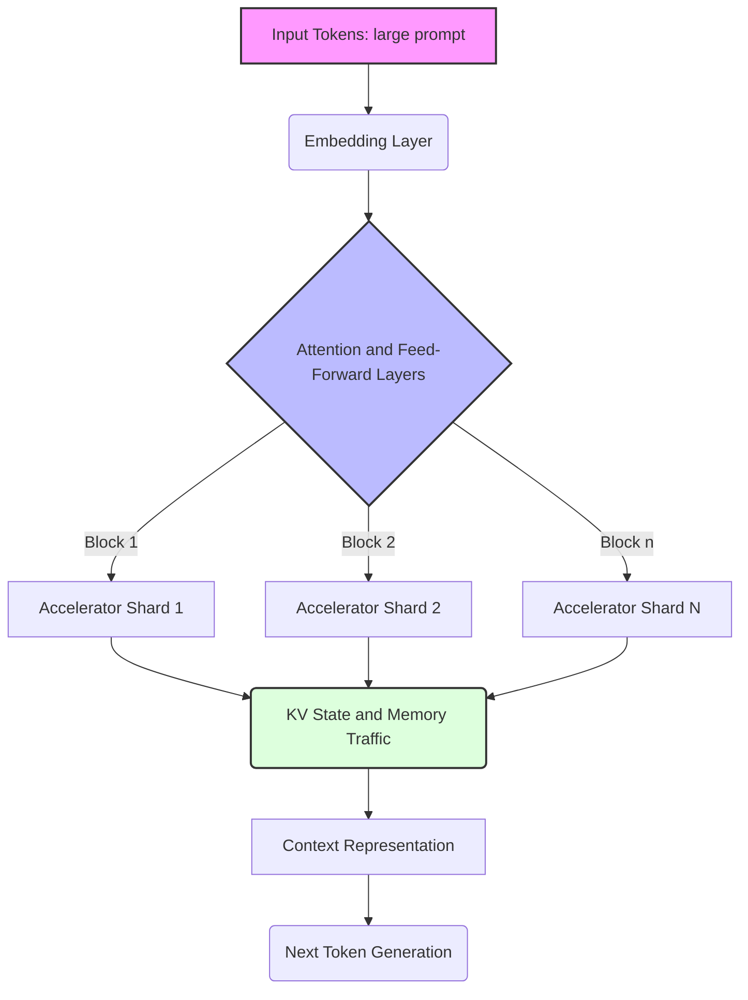
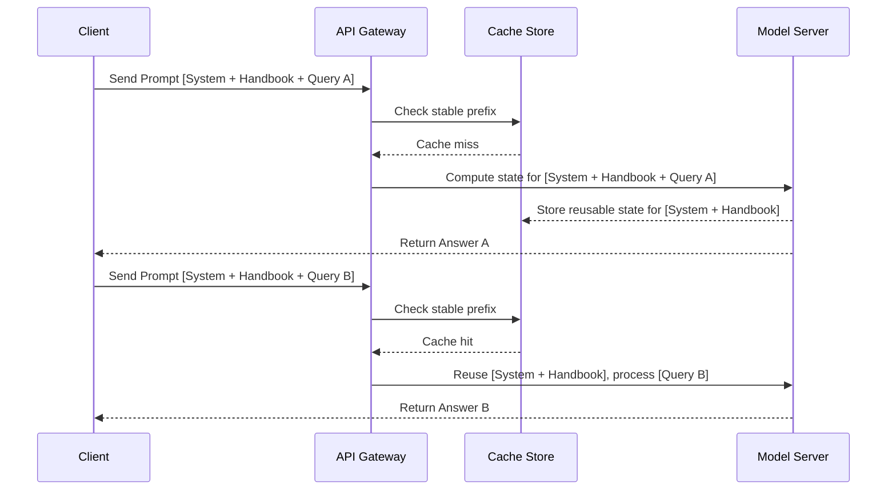
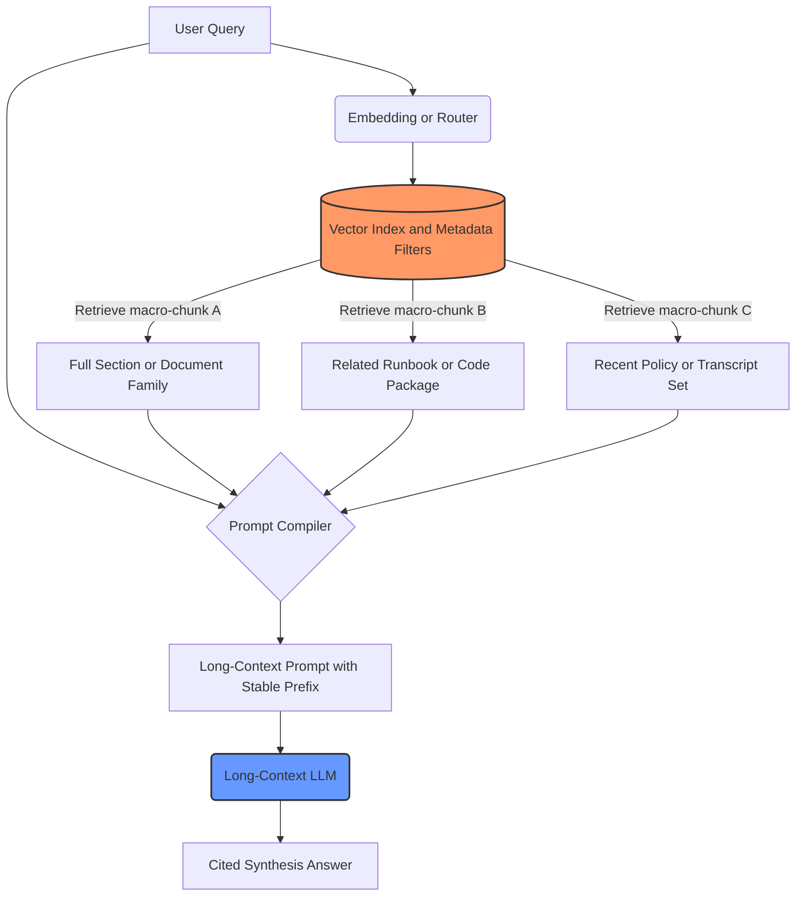

## Learning Outcomes

By the end of this module, you will be able to:

- **Compare** long-context, Vector RAG, and hybrid architectures using latency, precision, corpus size, privacy, and cost tradeoffs rather than vendor marketing claims.
- **Diagnose** lost-in-the-middle, context rot, and prompt-cache miss failures by inspecting prompt position, prompt shape, usage metadata, and evaluation evidence.
- **Design** prompt-cache hit architecture using stable prefix ordering, immutable prompt artifacts, tenant-aware cache keys, and dynamic suffix discipline.
- **Calculate** prompt-cache break-even economics with symbolic unit costs, cache-write penalties, TTL assumptions, retrieval costs, and workload reuse rates.
- **Operate** a hybrid long-context and RAG system with cache-hit monitoring, retrieval-quality evals, source traceability, and regression tests.

## Why This Module Matters

Hypothetical scenario: a product team owns a large set of policy manuals, support transcripts, and design notes. Their first RAG system uses embeddings, a vector database, chunk metadata, and a reranker. The system is not elegant, but it usually finds the right fragments. When long-context models become easier to access, the team wonders whether they can remove the whole retrieval layer and paste the full corpus into every request. The prototype feels wonderful on the first demo because the model can refer to documents that retrieval previously missed.

The second week is less pleasant. Some answers cite old text from the beginning of the prompt even when newer corrections appear in the middle. Other answers ignore a clause that is present but buried deep inside the combined document. The team also discovers that their prompt starts with a timestamp and a trace identifier, so the large shared corpus is not a stable prefix. Instead of reusing cached attention state, the system recomputes most of the prompt on each call. Nobody did anything malicious. They simply treated a long context window as if it were a bigger string buffer.

That mistake is common because the phrase "context window" sounds like capacity is the only issue. If the text fits, the application should work. In practice, capacity is only the outer boundary. Attention has compute cost, position matters, irrelevant text dilutes useful signals, and cache systems reward exact prefix discipline. Long-context models change what is possible, but they do not remove the need for retrieval design, evaluation, observability, and cost modeling.

This module teaches the durable spine behind the current product cycle. You will learn why long context gets expensive, why information in the middle can be harder to use, what prompt caching actually reuses, how prefix ordering affects cache hits, how to compute break-even economics without trusting stale pricing tables, and how to choose between long context, Vector RAG, and hybrid designs. Vendor names and model limits move quickly, so current specifics live in one dated snapshot. The engineering judgment should survive the next wave of models.

## 1. The Physics of Large Context Windows

A transformer does not read a long prompt the way a person scrolls a document. During the prefill phase, the model turns each input token into internal representations and computes attention relationships that let later layers use earlier text. In standard self-attention, each token can attend to every other token in the sequence. The important practical consequence is that longer prompts do not merely add more text to transmit over the network. They increase the amount of attention work and memory traffic required before the model can generate the first output token.

The original Transformer architecture made this tradeoff explicit: attention is powerful because it connects positions directly, but the straightforward form has quadratic cost in sequence length. Modern serving stacks use tiling, optimized memory movement, paged KV caches, distributed attention, and other improvements, so real systems do not behave like a classroom matrix multiplication benchmark. Even with those improvements, the direction of pressure remains the same. A very long prefill consumes scarce accelerator time, memory bandwidth, and cache capacity before the first generated token appears.

Think of the context window as a conference room. A bigger room lets more people attend the meeting, but it does not guarantee that every person will be heard, that the agenda will stay focused, or that the room can be reset instantly for the next meeting. Long-context engineering is the discipline of deciding who needs to be in the room, where the important people sit, what notes are pinned near the chair, and which parts of the meeting setup can be reused.



The diagram keeps the original module's core idea: long context is an infrastructure problem, not just a prompt-writing trick. The model server must prefill the prompt, retain key/value state for generation, and manage memory so that useful prefixes can be reused later. Optimizations such as FlashAttention reduce memory reads and writes; distributed techniques such as Ring Attention spread work across devices; positional schemes such as RoPE help the model represent token order. None of these make irrelevant text free, and none of them prove that every position in a long prompt is equally useful.

It helps to separate two phases. Prefill is the expensive phase that processes the input prompt and builds the attention state. Decode is the repeated phase that generates output tokens using the already-built state. Prompt caching targets the prefill cost of repeated prefixes. It does not precompute the answer, and it does not make output generation free. If two requests share a large stable prefix, the provider may reuse the already-computed state for that prefix, then process only the new suffix and generation work.

This distinction explains a surprising latency pattern. A cached long prompt can feel dramatically faster than an uncached long prompt, yet still slower than a tiny RAG prompt. The cached path can avoid much of the prefill compute, but it still has to route the request, load or reference cached state, process the dynamic suffix, and generate output. Caching changes the economics of repeated long prompts. It does not erase the physics of moving and using a large state.

The application-level lesson is that long-context systems need workload shape before model selection. A prompt that contains a complete handbook, a stable tool schema, and many follow-up questions from the same session has a natural reuse pattern. A prompt that contains a different uploaded file for every request may have almost no reusable prefix, even if the model can accept the file. A prompt that includes a repository snapshot may benefit from long context during a focused refactor, but the same repository may be better served by RAG for ordinary "where is this function defined?" questions. Context length is only useful when it matches the evidence shape and the reuse pattern.

There is also a concurrency cost that is easy to miss. A single very long prefill can occupy serving resources that could have handled many shorter prompts, so providers and self-hosted teams both care about admission control, batching, memory pressure, and cache eviction. In a private deployment, the same issue appears as accelerator memory exhaustion or queueing delay. In a managed API, it appears as higher latency, rate-limit pressure, or volatile billing. This is why prompt caching, retrieval, and prompt length budgeting belong in the architecture document, not only in an optimization ticket after launch.

## 2. Why Long Context Degrades: Lost-in-the-Middle and Context Rot

Long context has a quality failure mode that is separate from cost. A model may accept a large prompt and still fail to use the right evidence inside it. The "Lost in the Middle" work showed that models can perform better when relevant information appears near the beginning or end of a long input, while performance can degrade when the same information appears in the middle. RULER and other long-context benchmarks extend this lesson: advertised context length and effective context use are not identical measurements.

The practical term many engineers use is context rot. As the prompt grows, each useful fact competes with more irrelevant or weakly relevant text, conflicting instructions, stale examples, duplicated chunks, and formatting noise. The model is not doing exact database lookup over a clean index. It is compressing and attending over a sequence. If the sequence mixes current policies with obsolete policies, critical clauses with casual notes, and source text with old chat history, the answer can drift toward the most salient or recent pattern rather than the most correct evidence.

Needle-in-a-haystack tests are useful because they isolate one question: can the model retrieve a known hidden fact from a long body of distractor text? They are not enough for production acceptance. Real RAG and long-context systems often require multi-hop reasoning, conflict resolution, citation discipline, date awareness, and source filtering. A model that finds a synthetic needle can still fail a realistic policy question if the prompt contains near-duplicate clauses, ambiguous section headings, or a newer correction placed far away from an older rule.

Position is therefore an architectural variable. If the most important instruction is buried after a large document dump, recency will not help it. If the most relevant document is always concatenated in the middle of a giant corpus, a lost-in-the-middle effect may appear even when the model has enough nominal context. If the prompt includes a final instruction asking the model to cite exact evidence before answering, that instruction benefits from being close to generation time, but it does not magically repair a noisy corpus.

You can diagnose these failures with controlled perturbations. Move the target evidence to the beginning, middle, and end of an otherwise identical prompt. Ask for exact citations before the answer. Remove distractor documents and compare behavior. Use a small gold set where the expected source is known. If the answer changes sharply when position changes, you are seeing a context-use problem rather than a missing-data problem. If the model cites a source that was not present, you are seeing a grounding failure. If the answer is correct only when retrieval prefilters the prompt, you have evidence that RAG is improving signal-to-noise rather than merely saving tokens.

The durable lesson is not "long context is bad." The lesson is that a large window is a capacity tool, while retrieval and prompt structure are signal-management tools. You should use long context when the task truly needs broad, simultaneous evidence. You should use RAG when the task needs precise, sparse evidence from a larger corpus. You should combine them when retrieval can pick the right regions and long context can preserve enough surrounding structure for reasoning.

A useful mitigation is to give the model landmarks before asking for synthesis. Landmarks can be stable document identifiers, section headings, source dates, explicit conflict markers, or a manifest that lists which sources appear in the prompt. They do not guarantee correctness, but they make the evidence easier to navigate and easier to evaluate. If the final answer cites `policy-2026-03` when the expected source is `policy-2026-05`, the evaluator can classify the failure as a source-selection issue instead of a generic hallucination.

Another mitigation is to make the model surface evidence before it reasons over that evidence. A final instruction such as "first list the cited sections you will rely on, then answer" can improve debuggability because it turns a hidden context-use failure into an observable intermediate artifact. This is not a request for private chain of thought. It is a request for externally verifiable evidence. The application can reject an answer that lacks citations, cites missing sources, or cites stale documents when newer documents are present.

Document order should also be treated as a design choice. Chronological order helps tasks that reason over time. Authority order helps policy tasks where newer or higher-level documents should dominate. Dependency order helps code tasks where public interfaces should appear before implementations and callers. Random filesystem order is rarely defensible. If order changes from run to run, both cache hits and answer quality become harder to reason about. Deterministic ordering is therefore a quality control and an economics control at the same time.

## 3. Prompt Caching Mechanics

Prompt caching is often described as "the provider remembers your prompt," but that wording hides the important mechanics. In transformer inference, the reusable object is not the final answer. It is the model's internal attention state for a repeated prefix, often discussed as key/value state. If a later request begins with the exact same token sequence, the server may reuse the already-computed state for that prefix and continue from the new suffix.

Prefix is the important word. Exact-prefix caching is left-to-right. Static content belongs at the beginning: system instructions, tool schemas, durable examples, static documents, tenant handbook text, or other large repeated material. Dynamic content belongs at the end: current user message, timestamp, trace identifier, request-specific transcript, temporary retrieval result, or current experiment flag. If dynamic text appears before the large static block, the prefix changes and the cache cannot match the expensive part.



This sequence diagram preserves the useful structure from the original module while removing the false implication that a single hash of the whole prompt is always the whole implementation. Providers differ in how they route requests, where they place cache breakpoints, whether the cache is automatic or explicit, how TTL works, and how usage metadata is reported. The common engineering contract is simpler: repeated prefixes are eligible for reuse, variable text at the front destroys reuse, and your application must measure cached tokens instead of assuming the cache worked.

TTL matters because cache state is expensive to retain. A provider may evict cached prefixes after inactivity, offer explicit retention choices, or provide no guarantee beyond opportunistic reuse. That means prompt caching is not a storage system and should not be treated as one. If a workflow depends on a warm prefix, you need a plan for cold starts, warmup cost, cache-miss latency, and user experience during rebuilds. A sparse workload with one request per day may not benefit from caching even if the prompt is perfectly structured.

The other subtle rule is tokenization stability. "Same text" to a person is not always the same token sequence to a model API. Different line endings, whitespace normalization, tool schemas in a different order, JSON keys emitted in non-deterministic order, a formatter that rewrites indentation, or a library upgrade that changes message serialization can alter the prefix. Cache-aware systems treat the prompt compiler as production infrastructure. They snapshot prompt artifacts, test deterministic serialization, and alert on cache-hit regressions.

> **Landscape snapshot — as of 2026-06. This changes fast; verify against vendor docs before relying on specifics.**
>
> | Provider surface | Prompt-caching facts to verify before use | Design implication |
> |---|---|---|
> | [OpenAI Prompt Caching](https://developers.openai.com/api/docs/guides/prompt-caching) | Official docs describe automatic caching for prompts at or above a documented token threshold, cached-token reporting in usage metadata, cache-routing guidance, and retention policies that may vary by model and organization policy. | Keep shared content at the front, log `cached_tokens`, and treat retention and eligible model lists as live vendor configuration rather than curriculum truth. |
> | [Anthropic Prompt Caching](https://platform.claude.com/docs/en/build-with-claude/prompt-caching) | Official docs describe explicit `cache_control` breakpoints, a default short-lived cache, an optional longer duration at additional cost, and cache read/write pricing expressed as multipliers of base input price. | Place breakpoints after large stable blocks, calculate whether cache writes are repaid by later reads, and verify TTL and pricing for the specific deployment path. |
> | [Gemini Context Caching](https://ai.google.dev/gemini-api/docs/caching) | Official docs describe implicit caching on newer Gemini models, explicit cached-content objects with configurable TTL, cached-token reporting in `usage_metadata`, and model-specific minimum input sizes. | Use explicit caches when guaranteed reuse matters, keep cached content immutable, and check current model-specific limits instead of copying stale examples. |
> | [Mistral Prompt Caching](https://docs.mistral.ai/studio-api/conversations/advanced/prompt-caching) | Official docs describe `prompt_cache_key`, cached-token accounting, a reduced cached-token billing path, and the warning that a cache key increases hit likelihood without guaranteeing a hit. | Use stable application-level cache keys, never place secrets in cache keys, and still measure actual cached tokens per request. |
>
> This snapshot intentionally does not rank models or reproduce complete context-window and price tables. Those values are volatile. Use the linked vendor docs as the current source of truth, then apply the stable design rules in this module.

## 4. Design Prompt-Cache Hit Architecture

The safest prompt-cache architecture is boring. It builds a deterministic prefix from versioned artifacts, appends dynamic data only after the stable portion, and logs enough metadata to prove whether the cache is being used. Treat the prefix like an API contract. If a team member changes the prefix, that change should pass review, tests, and rollout monitoring just like a database migration or schema change.

The main anti-pattern is the dynamic header. Web developers often put request metadata first because it is readable in logs. That habit is costly for prompt caching. A trace ID, timestamp, user name, feature flag, or current ticket number at the first line means every later token shifts behind a new prefix. The prompt still looks mostly identical to a person, but it no longer begins with the same token sequence.

```python
from datetime import datetime, timezone


def generate_bad_prompt(user_name: str, user_query: str, massive_document: str) -> str:
    current_time = datetime.now(timezone.utc).isoformat()
    return f"""
Current Time: {current_time}
User: {user_name}

Analyze the following document based on the user's query:
{user_query}

DOCUMENT:
{massive_document}
"""
```

That function is not unsafe because timestamps are evil. It is unsafe because the timestamp and user name come before the stable document. The expensive part of the prompt is no longer an exact repeated prefix. Worse, the structure hides the problem because most of the string is still the same. Cache misses caused by prefix jitter often look like a provider problem until you log prompt hashes and cached-token counts.

```python
from datetime import datetime, timezone


SYSTEM_PROMPT = (
    "You are an expert analyst. Rely strictly on the provided documents. "
    "When evidence conflicts, cite the newer source and explain the conflict."
)


def generate_optimized_prompt(user_name: str, user_query: str, massive_document: str) -> str:
    static_prefix = (
        f"{SYSTEM_PROMPT}\n\n"
        "<document_set name=\"tenant-handbook\">\n"
        f"{massive_document}\n"
        "</document_set>\n\n"
    )

    current_time = datetime.now(timezone.utc).isoformat()
    dynamic_suffix = (
        "<request>\n"
        f"user: {user_name}\n"
        f"time: {current_time}\n"
        f"query: {user_query}\n"
        "</request>\n"
    )

    return static_prefix + dynamic_suffix
```

The optimized function still includes dynamic values, but only after the stable prefix. It also wraps the large document in simple structural tags. Tags are not magic, yet they give the model landmarks and give your tests something stable to validate. If you later add a second document set, you can enforce deterministic ordering by sorting document identifiers, rendering a manifest, and snapshotting the final prefix text.

Multi-tenant systems need one more layer of discipline. A global prefix might include system instructions, response rules, common product documentation, and tool schemas. A tenant prefix might include that tenant's handbook, allowed products, and support policy. A user suffix might include the current transcript, permission-filtered notes, and the immediate question. The sequence should be global, then tenant, then user, then request. That ordering maximizes reuse without mixing private data across tenants.

```text
+-------------------+-------------------+-------------------+-------------------+
| Global Prefix     | Tenant Prefix     | User Context      | Current Request   |
+-------------------+-------------------+-------------------+-------------------+
| system rules      | tenant handbook   | allowed user data | question          |
| tool schemas      | tenant glossary   | session facts     | trace id          |
| shared docs       | tenant examples   | preferences       | timestamp         |
+-------------------+-------------------+-------------------+-------------------+
```

The table is also a privacy boundary. Shared global content can be reused across many requests. Tenant content should not be shared across tenants unless the provider's cache isolation, account structure, and your own data policy make that safe. User context usually belongs near the suffix because it changes more often. Current request metadata belongs last because it changes every time and should never determine whether a large prefix can be reused.

Two safeguards make this architecture practical. First, generate a prefix fingerprint in your application and log it with each request. The fingerprint should be computed over the static prefix before dynamic suffixes are appended. Second, run a serialization test in CI that renders the prefix twice from the same inputs and asserts byte-for-byte equality. If a formatter, JSON encoder, document ordering change, or template library upgrade introduces jitter, the test catches it before your bill does.

Prefix fingerprints should be descriptive enough for operations but not sensitive enough to leak data. A good log record might contain the prompt template version, corpus version, tenant identifier hash, prefix byte length, prefix token estimate, and prefix fingerprint. It should not contain the raw handbook text or a user-visible secret. The goal is to correlate cache behavior with deploys and corpus changes. When a cache-hit ratio drops, you want to know whether the prompt version changed, the corpus version changed, or the traffic pattern changed.

Cache-aware design also needs rollout discipline. If you deploy a new prompt prefix to every tenant at once, every tenant experiences a cold prefix at the same time. A staged rollout can warm the new prefix gradually, compare old and new answer quality, and detect cache-bust bugs before they affect the full workload. This resembles index migration in RAG: the prompt prefix is a compiled artifact with cost and quality consequences, so it deserves a migration plan rather than an invisible string edit.

## 5. Calculate Prompt-Cache Break-Even Economics

Prompt caching does not automatically make long context cheaper than RAG. It changes the variables. RAG pays for ingestion, embeddings, retrieval infrastructure, reranking, and a smaller generation prompt. Cached long context pays for cold prefill or cache write events, cached-prefix reads, dynamic suffix input, output tokens, and sometimes cache storage or retention. The right architecture depends on corpus size, question shape, reuse rate, latency target, and quality requirement.

Use symbols first so the model survives pricing churn. Let `Q` be the number of requests in a period. Let `P` be the static prefix size in million tokens. Let `S` be the dynamic suffix size in million tokens. Let `R` be the retrieved context size in million tokens for a RAG request. Let `C_input` be the current base input unit cost. Let `C_cached_read` be the current cached-read unit cost. Let `C_cache_write` be the effective unit cost of creating or refreshing the cache. Let `C_index` be the fixed cost of embedding, storage, and retrieval operations for the same period.

```text
Cost_RAG =
  C_index
  + Q * ((R + S) * C_input)

Cost_cached_long_context =
  cache_write_events * (P * C_cache_write)
  + Q * ((P * C_cached_read) + (S * C_input))
```

This simplified model omits output tokens because they are usually similar between designs for the same answer length. Add them back when output length differs, especially for summarization or report-generation workloads. Also add reranker cost, embedding refresh cost, explicit cache storage cost, and cold-start user-experience cost if those are material. The point is not to build a universal equation. The point is to prevent an architecture decision from being made by vibes.

Hypothetical cost model: suppose your current provider documentation says cached reads are a reduced fraction of base input cost, and your workload repeats the same large prefix across many questions. If each question only needs a few retrieved passages, RAG may still be cheaper because it sends a tiny high-signal prompt instead of paying even the discounted read cost for the whole prefix. If each question requires comparing evidence across most of the corpus, RAG may need to retrieve so much context that it loses both quality and simplicity. The break-even point moves with reuse rate, prefix size, cache TTL, and the amount of evidence the task truly needs.

The fastest sanity check is to compute marginal cost per request after warmup. For cached long context, the marginal input cost is approximately `P * C_cached_read + S * C_input`. For RAG, it is approximately `(R + S) * C_input` plus small retrieval and embedding-query costs. If `P * C_cached_read` is still much larger than `R * C_input`, RAG is usually the cheaper narrow-QA path. If `R` must approach `P` for acceptable answers, long context or macro-RAG becomes more attractive.

TTL changes the answer because cache write events are not evenly distributed. A busy support assistant may keep a tenant handbook warm all day. A monthly audit workflow may pay cold-start cost on almost every run. A batch job may intentionally warm a cache once, issue many related questions, then let it expire. You should model real arrival patterns rather than assuming a perfect cache hit rate. Plot cost against cold-cache, partial-hit, high-hit, and highest-observed scenarios. If the architecture only works at a perfect hit rate, it is fragile.

Latency uses a similar model. RAG adds retrieval latency and often reranking latency, but it sends a smaller prompt. Cached long context avoids much of the repeated prefill, but it still uses a large cached state and longer prompt accounting. The user experience also differs. A cold cache might produce a slow first answer followed by faster follow-up answers. A RAG system might produce steadier latency but fail when retrieval misses. Good product design makes those tradeoffs visible instead of pretending one architecture dominates every workload.

To calculate a practical break-even point, start with the current vendor snapshot and replace every price with a variable in a spreadsheet or small script. Then run the same workload through three rows: RAG with the expected retrieved context, cached long context with the observed cache-hit rate, and hybrid macro-RAG with the expected macro-chunk size. Record both money and latency. A route that is cheap but misses citations is not a win, and a route that is accurate but only works when the cache is warm may still need a product fallback.

The quality term belongs in the break-even worksheet because some tasks cannot be reduced to narrow retrieval without losing the point of the task. A legal-summary workflow may need to compare clauses across a full agreement family. A code-review workflow may need enough neighboring files to see call relationships. A research workflow may need to compare tone, omissions, and contradictions across many notes. In those cases, the "cost" of RAG is not only token price. It includes missed relationships, shallow synthesis, and the engineering effort of reconstructing broader context from fragments.

The opposite failure is also common. A team proves that cached long context is acceptable for one bursty workload and then routes every question through the same giant prefix. The cost model should include a routing decision, not just an average. Ask whether the question is sparse lookup, broad synthesis, conflict resolution, code navigation, or session follow-up. A router that sends sparse lookup to RAG and broad synthesis to long context can be cheaper and more accurate than either architecture alone.

## 6. Compare Long-Context, Vector RAG, and Hybrid Patterns

Long context is strongest when the task requires broad simultaneous evidence. Examples include reading a complete design document before proposing a migration plan, comparing a sequence of meeting notes for changing commitments, reviewing a medium-sized repository for a cross-file refactor, or synthesizing a report where the answer depends on narrative arc rather than one paragraph. In those cases, chunk-level retrieval can fragment the evidence and hide the relationships that matter.

Vector RAG is strongest when the corpus is larger than any practical prompt, when the answer usually depends on a small number of relevant passages, when citations and source filtering matter, or when latency has to stay predictable for many unrelated queries. A well-designed RAG system improves signal-to-noise before the model sees the prompt. It can also enforce metadata filters such as tenant, freshness, document type, access level, or jurisdiction before any text reaches the generator.

Hybrid systems combine the two. Retrieval narrows the universe, but the long-context model receives larger macro-chunks with enough surrounding structure to reason. Instead of retrieving ten tiny snippets, the system might retrieve three complete sections, a full runbook, a small package from a repository, or a document family. This pattern keeps RAG's filtering power while using long context to avoid over-fragmenting the evidence.



The hybrid prompt compiler has two jobs that often conflict. It wants stable prefixes for cache hits, and it wants query-specific evidence for quality. The usual compromise is to cache durable layers such as system rules, tool schemas, evaluation rubric, and tenant corpus summaries, then append retrieved macro-chunks and the user query as the dynamic suffix. For workloads where the same macro-chunks are reused across a session, the compiler can also group requests by corpus region or cache key so that repeated sessions benefit from the same prefix order.

Use this decision table as a starting point, not as a universal rule:

| Workload signal | Prefer RAG | Prefer long context | Prefer hybrid |
|---|---|---|---|
| Corpus is much larger than the context window | Retrieval is required to reduce the search space before generation. | Full loading is impossible or wasteful for ordinary requests. | Retrieve document families, then pass larger high-signal chunks. |
| Question needs one or two facts with citations | Small retrieved prompts are cheaper, faster, and easier to audit. | A full corpus prompt dilutes the evidence and raises cost. | Use long context only for disambiguation after retrieval finds candidates. |
| Question needs broad synthesis across many sources | Small chunks may hide relationships and produce shallow summaries. | Full or near-full context can preserve narrative and cross-document links. | Retrieve macro-chunks and ask the model to compare across them. |
| Data changes constantly | Fresh retrieval and metadata filters are easier to update incrementally. | Cached prefixes may expire or become stale before they pay off. | Cache durable instructions while retrieving fresh evidence dynamically. |
| Prompt prefix is reused heavily in bursts | RAG still helps if evidence is sparse and precise. | Cached long context can amortize prefill cost over repeated questions. | Cache shared layers and retrieve query-specific evidence into suffixes. |
| Privacy rules vary by tenant or user | Metadata filters can enforce access before text enters the prompt. | Long static prefixes must be isolated carefully by tenant and account. | Combine access-controlled retrieval with tenant-specific cache boundaries. |

The important word in the table is "signal." A single application may use all three patterns. A support assistant might use RAG for ordinary policy lookup, long context for reviewing an entire escalated case history, and hybrid macro-RAG for comparing a customer's transcript family against the tenant handbook. The mature design is not loyal to a technique. It routes by evidence shape.

## 7. Operate a Hybrid Long-Context and RAG System

Production systems need cache observability, retrieval observability, and answer-quality evals. Cache observability tells you whether the prompt is economically shaped. Retrieval observability tells you whether the right evidence entered the prompt. Answer evals tell you whether the model used that evidence correctly. Any one of the three can look healthy while the others fail.

At minimum, log prompt token count, cached token count, cache hit ratio, prefix fingerprint, prompt template version, tenant or corpus identifier, retrieval query, retrieved source identifiers, source freshness, time to first token, total latency, output token count, and final citation set. Do not log raw sensitive prompt text unless your privacy policy allows it. The point is to create enough structured data to debug "why was this expensive?" and "why did this answer cite the wrong source?" without reconstructing the incident from memory.

```python
def record_llm_usage(response, *, prefix_fingerprint: str, prompt_version: str) -> None:
    usage = response.usage
    prompt_tokens = usage.prompt_tokens
    cached_tokens = usage.prompt_tokens_details.cached_tokens
    uncached_tokens = prompt_tokens - cached_tokens
    cache_hit_ratio = cached_tokens / prompt_tokens if prompt_tokens else 0.0

    log_metrics(
        prompt_version=prompt_version,
        prefix_fingerprint=prefix_fingerprint,
        prompt_tokens=prompt_tokens,
        cached_tokens=cached_tokens,
        uncached_tokens=uncached_tokens,
        cache_hit_ratio=cache_hit_ratio,
        time_to_first_token=response.metrics.time_to_first_token,
    )
```

The code is intentionally provider-shaped rather than provider-specific. Most APIs expose usage metadata, but field names differ. Your adapter should normalize those fields into an internal metric contract. If one provider reports cached tokens and another reports cached content tokens, the rest of your application should not care. If a provider does not report the metric you need, you can still log prefix fingerprints and observed latency, but you should be honest about the lower confidence of your cache diagnosis.

Eval design should include position sensitivity. Build a small test set where the answer is known and the supporting evidence can be placed near the beginning, middle, and end of a prompt. Run the same question with and without distractors. Run it through RAG, long context, and hybrid routes. Require cited evidence before final answers. Track whether the model cites the expected source, whether it ignores newer corrections, and whether it changes answer when document order changes.

You also need cache regression tests. Render the stable prefix twice from the same inputs and assert exact equality. Render it after sorting source documents and assert the order is deterministic. Add a test that prepends a fake timestamp and proves the prefix fingerprint changes, so new engineers understand why dynamic headers are banned. Add a budget test that estimates cost at observed hit rates rather than assumed hit rates. These tests turn prompt caching from tribal knowledge into an enforceable contract.

Operational runbooks should distinguish cold-cache and warm-cache incidents. A cold-cache incident means the prefix is structurally correct but expired, evicted, or routed away from an available cache. A cache-bust incident means the prefix changed unexpectedly. A retrieval incident means the wrong evidence entered the suffix. A context-use incident means the right evidence entered the prompt but the model ignored or misused it. The fixes are different, so the dashboard should help classify the failure quickly.

A good rollout dashboard separates those incident classes into different panels. Cache panels show cached-token ratio by prompt version and tenant. Retrieval panels show expected-source recall, reranker score distribution, and metadata-filter use. Generation panels show citation validity, answer acceptance, refusal behavior, and latency. When a new prompt version ships, you compare all three panels. A higher cache-hit ratio is not enough if source recall drops, and higher source recall is not enough if the model ignores the middle of the constructed prompt.

Finally, write post-incident notes in terms of mechanism. "The model was bad" is not actionable. "The retrieved evidence was correct, but the relevant clause appeared between two large unrelated sections and the answer cited an older clause from the prompt beginning" is actionable. That diagnosis points to document ordering, citation-first prompting, macro-chunk boundaries, or a route back to RAG. Mechanism-level notes also make the curriculum durable: today's vendor behavior may change, but prompt shape, evidence position, cache observability, and eval design remain the controls you can operate.

## Did You Know?

- **Capacity and usability are different promises:** a model can accept a long prompt while still showing position-sensitive behavior, so long-context acceptance tests should measure evidence use rather than only checking whether the API call succeeds.
- **RoPE is a positional encoding idea, not a quality guarantee:** rotary position embeddings help represent order inside attention, but any context-extension method still needs task-specific evaluation for retrieval, reasoning, and citation accuracy.
- **Prompt caching usually reuses internal attention state for repeated prefixes:** it can reduce repeated prefill cost and latency, but it does not store final answers or remove the need to process new suffixes and output tokens.
- **RAG and long context solve different constraints:** RAG manages corpus scale and signal-to-noise, while long context preserves surrounding structure for synthesis when the relevant evidence is broader than a few chunks.

## Common Mistakes

| Mistake | Why it happens | Better approach |
|---|---|---|
| **Hypothetical scenario: putting a timestamp at the first line** | Request metadata feels natural at the top of a log-like prompt, but it changes before the expensive static corpus and destroys prefix reuse. | Put trace IDs, timestamps, user names, and current request metadata at the end of the prompt or outside the prompt in application logs. |
| **Hypothetical scenario: allowing a formatter to rewrite the prefix** | Whitespace, JSON key order, line endings, and template rendering can change tokenization even when the prompt looks equivalent in review. | Store static prefixes as versioned artifacts, render them deterministically, and snapshot-test byte-for-byte equality in CI. |
| **Assuming long context means reliable retrieval** | Teams confuse context capacity with evidence use and stop running retrieval-quality or position-sensitivity tests. | Keep a gold evaluation set with evidence at different prompt positions and require citations before accepting a long-context route. |
| **Using a million-token prompt for sparse lookup** | A large window is exciting, so simple QA workloads get routed through an expensive full-corpus prompt. | Use Vector RAG when the answer depends on a few high-signal passages from a larger corpus. |
| **Ignoring cache TTL and cold-start behavior** | The demo runs in a burst, but real traffic is sparse enough that cached prefixes expire between user sessions. | Model arrival patterns, measure real cached-token counts, and design a cold-cache user experience instead of assuming perfect warmth. |
| **Mixing tenant data in a shared prefix** | Cache-hit pressure tempts teams to maximize reuse without re-checking privacy and access-control boundaries. | Isolate tenant prefixes according to policy, verify provider cache isolation, and enforce access filtering before prompt compilation. |
| **Dumping unstructured documents into the middle** | Raw concatenation is easy, especially when the model accepts the full input without API errors. | Add stable document manifests, section tags, source identifiers, and deterministic ordering so the model and evaluator can navigate the evidence. |

## Knowledge Check

1. **Compare long-context, Vector RAG, and hybrid architectures for a support assistant that answers ordinary policy questions and occasionally reviews entire escalated case histories. Which route should handle each workload, and why?**

   <details>
   <summary>Answer</summary>

   Ordinary policy lookup should usually use Vector RAG because the answer depends on a small number of cited passages and benefits from metadata filtering. Entire escalated case review can justify long context because the answer may depend on the full sequence of transcripts, notes, and prior decisions. A hybrid route is appropriate when retrieval can select the relevant case family or policy family, then a long-context model can synthesize across those larger macro-chunks without losing surrounding structure.

   </details>

2. **Diagnose a lost-in-the-middle failure: the correct clause is present in a long prompt, but the model answers from an older clause near the beginning. What experiment would prove whether position is part of the problem?**

   <details>
   <summary>Answer</summary>

   Create controlled variants of the same prompt with the target clause near the beginning, middle, and end while holding the rest of the evidence constant. Ask for exact citations before the final answer and compare whether the cited source changes. If the model succeeds when the clause is near the ends but fails when it is in the middle, the failure is position-sensitive context use rather than missing data.

   </details>

3. **Design a prompt-cache hit architecture for a multi-tenant handbook assistant. Where should global rules, tenant documents, user session facts, and the current question appear?**

   <details>
   <summary>Answer</summary>

   Global rules and shared tool schemas should come first because they are stable across many requests. Tenant documents should come next because they are stable for that tenant but must not leak across tenants. User session facts should follow because they change more often and may have narrower privacy scope. The current question, timestamp, trace identifier, and request-specific transcript should appear last so they do not break reuse of the expensive stable prefix.

   </details>

4. **Calculate prompt-cache break-even economics conceptually: if a one-million-token cached prefix is reused for many narrow fact questions, why might Vector RAG still be cheaper?**

   <details>
   <summary>Answer</summary>

   Cached long context still pays a cached-read cost for the whole large prefix on each request, plus the dynamic suffix and output. Vector RAG pays retrieval and generation over a much smaller context when each answer needs only a few passages. If `P * C_cached_read` is larger than `R * C_input` for the workload, RAG is cheaper even after caching. This is the prompt-cache break-even economics calculation: use symbolic unit costs, cache-write penalties, TTL assumptions, retrieval costs, and workload reuse rates before deciding. Long context becomes more attractive when the task truly needs evidence spanning much of the prefix.

   </details>

5. **Operate a cache-aware system: your dashboard shows cached tokens dropping sharply after a template library upgrade, while retrieval quality and output length are unchanged. What should you inspect first?**

   <details>
   <summary>Answer</summary>

   Inspect deterministic prefix rendering first. The upgrade may have changed whitespace, JSON key ordering, message serialization, tool schema ordering, or line endings before the dynamic suffix. Compare prefix fingerprints before and after the upgrade, render the same prefix twice, and diff the static artifact. This is more likely to be a cache-bust regression than a retrieval issue because retrieval quality stayed stable while cached-token counts dropped.

   </details>

6. **A model finds synthetic needles in a benchmark but fails production questions that involve conflicting policy versions. What does this say about your eval design?**

   <details>
   <summary>Answer</summary>

   The eval is too narrow. Needle tests measure whether the model can retrieve a known fact from distractors, but production questions also require freshness, conflict handling, citation discipline, and reasoning over source metadata. Add tests with obsolete and current clauses, required citation of the newer source, document-order perturbations, and comparison across RAG, long-context, and hybrid routes.

   </details>

## Hands-On Exercise

In this exercise, you will debug a high-cost LLM pipeline, restructure it for prefix caching, and run a local simulator that makes cache hits and misses visible. The simulator uses artificial delays to teach the shape of the problem. It is not a vendor latency benchmark and should not be used as evidence for real TTFT claims.

### Prerequisites and Environment Setup

Create a small working directory and initialize a local virtual environment so the simulator stays separate from the KubeDojo repository and can be removed after the lab:

```bash
mkdir prompt-cache-lab
cd prompt-cache-lab
python3 -m venv .venv
```

Create a file named `mock_llm.py` and paste the following simulator code, which hashes only the static prefix to make cache-hit and cache-miss behavior visible:

```python
import hashlib
import time


class MockProviderAPI:
    def __init__(self):
        self.server_cache = set()

    def generate(self, static_prefix, dynamic_suffix="", max_tokens=100):
        prefix_hash = hashlib.sha256(static_prefix.encode("utf-8")).hexdigest()
        prompt = static_prefix + dynamic_suffix

        if prefix_hash in self.server_cache:
            print("[SIMULATOR] CACHE HIT: reused static prefix state")
            time.sleep(0.2)
            cached = True
        else:
            print("[SIMULATOR] CACHE MISS: computed static prefix state")
            time.sleep(1.0)
            self.server_cache.add(prefix_hash)
            cached = False

        return {
            "status": "success",
            "cached": cached,
            "prompt_chars": len(prompt),
            "max_tokens": max_tokens,
        }


api_instance = MockProviderAPI()


def call_api(static_prefix, dynamic_suffix="", max_tokens=100):
    return api_instance.generate(static_prefix, dynamic_suffix, max_tokens)
```

Create your entry point `main.py` with the following starter code, then leave the bad function in place so you can compare it with the optimized version:

```python
from datetime import datetime, timezone
from mock_llm import call_api


def load_file(filename):
    return f"[MASSIVE CONTENT OF {filename} ...]"


def analyze_transcript_bad(ticket_id, transcript, handbook_text):
    dynamic_header = f"Ticket: {ticket_id}\nTime: {datetime.now(timezone.utc).isoformat()}\n"
    static_body = f"HANDBOOK:\n{handbook_text}\n\n"
    suffix = f"TRANSCRIPT:\n{transcript}\n\nDid the agent follow the handbook?"
    return call_api(dynamic_header + static_body, suffix)
```

Complete the lab tasks below in order, because each task isolates a different production failure mode that a cache-aware prompt compiler must handle:

- [ ] Analyze `analyze_transcript_bad` and identify the dynamic values that appear before the expensive handbook prefix.
- [ ] Refactor prompt construction into a deterministic `STATIC_PREFIX` and a request-specific `DYNAMIC_SUFFIX`.
- [ ] Implement multi-tenant prefix construction so Company A and Company B handbooks produce separate stable prefix fingerprints.
- [ ] Add a cache warmup function that sends a cheap suffix after a stable tenant prefix and prints which tenant was warmed.
- [ ] Run repeated calls for the same tenant and verify that the second call reports a simulator cache hit.
- [ ] Add one intentional cache-bust experiment by changing whitespace in the static prefix, then explain why the hit disappeared.

### Suggested Solution

Use this implementation if you want to compare your answer with a working reference after you have tried the refactor yourself:

```python
from datetime import datetime, timezone
from mock_llm import call_api


def load_file(filename):
    return f"[MASSIVE CONTENT OF {filename} ...]"


def analyze_transcript_bad(ticket_id, transcript, handbook_text):
    dynamic_header = f"Ticket: {ticket_id}\nTime: {datetime.now(timezone.utc).isoformat()}\n"
    static_body = f"HANDBOOK:\n{handbook_text}\n\n"
    suffix = f"TRANSCRIPT:\n{transcript}\n\nDid the agent follow the handbook?"
    return call_api(dynamic_header + static_body, suffix)


GLOBAL_SYSTEM_PROMPT = "You are a QA auditor. Follow the handbook and cite evidence.\n"
TENANT_HANDBOOKS = {
    "company_a": "[MASSIVE CONTENT OF handbook_a.txt ...]",
    "company_b": "[MASSIVE CONTENT OF handbook_b.txt ...]",
}


def tenant_static_prefix(tenant_id):
    handbook = TENANT_HANDBOOKS[tenant_id]
    return (
        GLOBAL_SYSTEM_PROMPT
        + f"<tenant id=\"{tenant_id}\">\n"
        + f"<handbook>\n{handbook}\n</handbook>\n"
        + "</tenant>\n"
    )


def analyze_tenant_transcript(tenant_id, ticket_id, transcript):
    static_prefix = tenant_static_prefix(tenant_id)
    dynamic_suffix = (
        "<request>\n"
        f"ticket_id: {ticket_id}\n"
        f"time: {datetime.now(timezone.utc).isoformat()}\n"
        f"transcript: {transcript}\n"
        "question: Did the agent follow the handbook?\n"
        "</request>\n"
    )
    return call_api(static_prefix, dynamic_suffix)


def warmup_cache(tenant_id):
    static_prefix = tenant_static_prefix(tenant_id)
    return call_api(static_prefix, "SYSTEM WARMUP. Reply OK.", max_tokens=2)


if __name__ == "__main__":
    print("--- Unoptimized shape ---")
    analyze_transcript_bad("TCK-001", "Hello, I need help.", load_file("handbook_a.txt"))
    analyze_transcript_bad("TCK-002", "My password is lost.", load_file("handbook_a.txt"))

    print("\n--- Optimized multi-tenant shape ---")
    analyze_tenant_transcript("company_a", "TCK-100", "Hello there.")
    analyze_tenant_transcript("company_a", "TCK-101", "Help me.")
    analyze_tenant_transcript("company_b", "TCK-200", "Different handbook.")

    print("\n--- Warmup shape ---")
    warmup_cache("company_a")
```

Run the script through the lab virtual environment so the command uses the dependencies and interpreter created for this exercise:

```bash
.venv/bin/python main.py
```

Success criteria should be checked against the simulator output and your own explanation, not just against whether the Python process exits successfully:

- [ ] The first optimized call for `company_a` reports a simulator cache miss and the second optimized call reports a cache hit.
- [ ] The first call for `company_b` reports a separate cache miss because the tenant prefix is intentionally different.
- [ ] The dynamic timestamp appears only in the suffix, never before the stable handbook prefix.
- [ ] Your explanation distinguishes cache-bust failures from lost-in-the-middle failures and retrieval misses.

## Next Module

Continue to [Module 1.6: Home-Scale RAG Systems](/ai-ml-engineering/vector-rag/module-1.6-home-scale-rag-systems/), where you will apply retrieval and evaluation discipline to a private, local-first RAG system.

## Sources

- [Attention Is All You Need](https://arxiv.org/abs/1706.03762) - Introduces the Transformer architecture and the attention mechanism that makes long-context cost and memory behavior central to modern LLM systems.
- [RoFormer: Enhanced Transformer with Rotary Position Embedding](https://arxiv.org/abs/2104.09864) - Primary RoPE paper for understanding rotary position embeddings before treating context-extension methods as quality guarantees.
- [FlashAttention: Fast and Memory-Efficient Exact Attention with IO-Awareness](https://arxiv.org/abs/2205.14135) - Explains why memory movement matters for attention performance and why long prompts are an infrastructure concern.
- [Ring Attention with Blockwise Transformers for Near-Infinite Context](https://arxiv.org/abs/2310.01889) - Presents a distributed blockwise attention approach that helps explain how very long sequences become feasible in practice.
- [Lost in the Middle: How Language Models Use Long Contexts](https://arxiv.org/abs/2307.03172) - Core evidence that relevant information position can affect long-context retrieval behavior even when the input fits the window.
- [RULER: What's the Real Context Size of Your Long-Context Language Models?](https://arxiv.org/abs/2404.06654) - Benchmark reference for separating nominal context length from effective context use across retrieval and reasoning tasks.
- [LongBench: A Bilingual, Multitask Benchmark for Long Context Understanding](https://arxiv.org/abs/2308.14508) - Long-context evaluation suite covering question answering, summarization, few-shot learning, synthetic tasks, and code completion.
- [Prompt Cache: Modular Attention Reuse for Low-Latency Inference](https://arxiv.org/abs/2311.04934) - Research paper explaining reusable prompt modules and attention-state reuse for lower latency inference.
- [OpenAI Prompt Caching](https://developers.openai.com/api/docs/guides/prompt-caching) - Official vendor documentation for prompt-cache structuring, cached-token reporting, retention behavior, and current OpenAI-specific limits.
- [Anthropic Prompt Caching](https://platform.claude.com/docs/en/build-with-claude/prompt-caching) - Official vendor documentation for cache breakpoints, TTL options, and cache read/write pricing multipliers.
- [Gemini Context Caching](https://ai.google.dev/gemini-api/docs/caching) - Official vendor documentation for implicit and explicit context caching, TTL configuration, and cached-token usage metadata.
- [Mistral Prompt Caching](https://docs.mistral.ai/studio-api/conversations/advanced/prompt-caching) - Official vendor documentation for prompt cache keys, cache-hit accounting, and current cached-token billing behavior.
