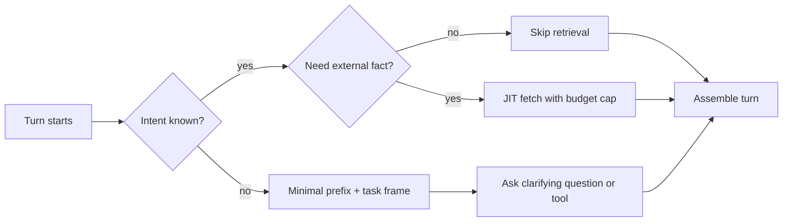
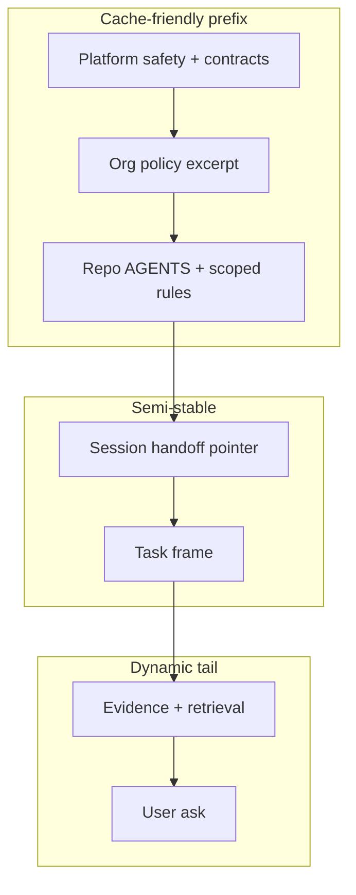
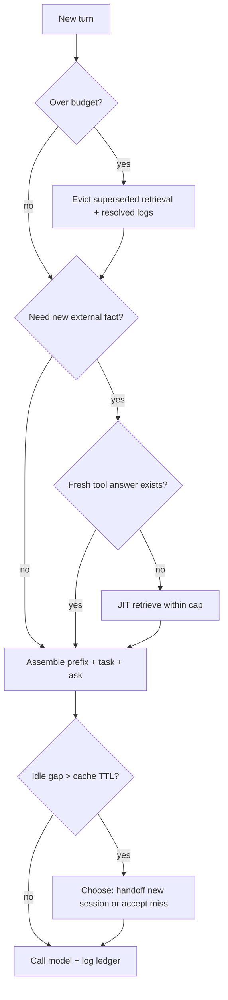

> **Complexity**: `[COMPLEX]`
>
> **Time to Complete**: ~50 minutes
>
> **Prerequisites**: [Context Engineering Fundamentals](module-2.1-context-fundamentals/), [Repository Engineering for Agents](module-2.2-repository-engineering-for-agents/), and [Retrieval, Tools, and Memory Boundaries](module-2.3-retrieval-tools-and-memory-boundaries/); comfort reading Python traces and basic shell.

---

## Learning Outcomes

By the end of this module, you will be able to apply the following skills in production harness design and review:

- **Design** a per-turn context orchestration policy that decides what to load, retain, summarize, evict, or refresh against a fixed token budget.
- **Evaluate** cache hit economics using provider TTL rules, especially Anthropic's default five-minute ephemeral prompt cache lifetime and OpenAI's prefix-cache behavior.
- **Implement** compaction and handoff flows that preserve load-bearing decisions while dropping stale tool output and redundant retrieved snippets.
- **Compare** just-in-time versus just-in-case context loading and diagnose when lazy retrieval beats eager front-loading.
- **Debug** context bloat with attribution logs that answer why each block entered the model window on a given turn.

## Why This Module Matters

Mira's agent harness finally has the static substrate in place. The repository exposes `AGENTS.md`, scoped rules, retrieval indexes, and memory boundaries, while the model has a large window, MCP tools, and a vector store that returns ranked snippets. On paper, the Context arc from modules 2.1 through 2.3 is complete, yet in production the expensive failures moved one layer up into runtime policy rather than static authoring.

**Hypothetical scenario:** Mira starts a long debugging session on a flaky deployment controller. Turn 12 still carries the full stack trace from turn 3 even though she fixed that error six turns ago. Turn 18 injects a fresh retrieval hit about an old runbook revision while a newer policy file sits unread in the repo map. Turn 22 misses a cache hit because someone appended a timestamp to the stable system prefix. Turn 28 opens a sub-agent for a multi-file refactor where the child session inherits the parent's entire chat log instead of a narrow task contract.

None of these failures is fixed by writing a better single prompt, because they are runtime orchestration failures where the harness did not manage context as a dynamic resource with a budget, a freshness policy, and observable decisions. Static context tells the agent what the world looks like when the session begins, while dynamic context orchestration decides what the agent sees on turn *N* after tools, retrieval, memory, compaction, cache refresh, and sub-task fan-out have already reshaped the working set. Teams that skip this layer often blame the model when the real issue is an implicit policy equivalent to "forward the entire chat transcript forever," which is neither measurable nor safe under cost pressure.

This module closes the Context triplet by giving you an explicit policy layer you can review in code, in configuration diffs, and in telemetry dashboards. You will treat each model call as a compiled turn composed of stable prefix, injected rules, retrieved evidence, tool results, summaries, and the current ask. You will learn when to spend tokens on just-in-case loading versus just-in-time fetches, how Anthropic's five-minute cache TTL changes sleep-and-resume math, and how handoffs migrate durable state without dragging transcript noise. You will also learn how to measure whether orchestration improved cache hit rate instead of only shrinking prompts. LangChain's context documentation frames the same idea as managing short-term versus long-term state across a run; this module focuses on the harness-owned compiler that decides which of those surfaces enters each turn. The design goal is not maximal context but **correct context under budget**, with enough logging that an on-call engineer can explain every injected block without downloading the full prompt verbatim.

## The Runtime Context Loop

Every agent turn is a small batch job where the harness gathers inputs, applies a policy, compiles a prompt, calls the model, records outputs, and updates internal state for the next turn. Module 2.1 named the working-set layers (stable prefix, task frame, evidence, and scratch), module 2.2 placed durable policy in the repository, and module 2.3 split runtime facts across retrieval, tools, and memory; module 2.4 owns the loop that connects those pieces across time instead of treating each API call as an isolated chat append. LlamaIndex describes querying as the composition step that turns indexes and retrievers into a final model input; in agent harnesses that composition must be **repeatable and testable**, not delegated entirely to the model's appetite for more context.

```text
+------------------------------------------------------------------+
|                    Runtime context loop (one turn)               |
+------------------------------------------------------------------+
| 1. Read session state (budget, cache clock, open decisions)      |
| 2. Classify intent (debug, edit, review, plan, handoff)           |
| 3. Select static prefix (repo rules, tool schemas, skills)       |
| 4. Decide dynamic inserts (retrieve? tool? memory? skip?)        |
| 5. Apply eviction / compaction on existing working set           |
| 6. Assemble ordered prompt + log attribution ledger              |
| 7. Call model -> parse output -> update state for turn N+1       |
+------------------------------------------------------------------+
```

The loop is not optional infrastructure: if your product only forwards chat history to the API, you still have a policy, but it is implicit, unmeasured, and usually means "keep everything forever until the window breaks." Explicit orchestration makes that policy reviewable in pull requests the same way you review authentication middleware, because the alternative is debugging production spend spikes by editing prose prompts. A practical maturity ladder helps teams prioritize: **Level 0** forwards raw chat; **Level 1** adds static repo files at session start; **Level 2** adds per-turn retrieval and tool output with caps; **Level 3** adds eviction, compaction, and ledgers; **Level 4** adds cache-aware prefix layout and TTL-aware session pacing. Most production incidents in this arc sit between Level 1 and Level 2, where retrieval and tools exist but no harness-owned eviction runs.

### Static Versus Dynamic Context

Static context changes slowly relative to a task and includes repository instruction stacks, tool definitions, rubrics, and schema-stable skill files. Dynamic context changes every turn or on intent triggers and includes the latest user message, fresh tool output, newly retrieved chunks, conditional rule injections, and compaction summaries generated inside the session. The orchestrator's job is to keep static bytes stable for caching while treating dynamic bytes as **lease-held**: they enter with metadata, earn their place by relevance to the current intent, and leave when superseded or resolved.

| Class | Examples | Typical load trigger | Risk if mishandled |
|---|---|---|---|
| Static | `AGENTS.md`, MCP tool schemas, output contracts | session start, cache-friendly prefix | stale repo policy if not refreshed after merge |
| Semi-static | issue body, branch name, feature flags | task start | wrong issue context carried across tasks |
| Dynamic | command output, file reads, retrieval hits | per turn or on tool event | bloat, stale evidence, cache breakage |
| Derived | compaction summaries, handoff notes | after compaction or `/handoff` | dropped load-bearing decisions |

**Pause and predict:** You are on turn 15 of a refactor where the agent no longer needs the full `kubectl describe` output from turn 4 because the pod is healthy now. Should that output stay in the window for cache stability, or should the harness summarize and evict it? Write down your choice before reading the compaction section, because the answer depends on whether the bytes are still decision-critical or only historical noise; keeping resolved logs "for stability" often **destroys** stability by pushing the cache breakpoint or evicting still-needed task-frame bytes under pressure.

### Just-in-Time Versus Just-in-Case

Just-in-case loading front-loads context because it might become useful: it feels safe and reduces mid-task retrieval latency, but it spends budget early and pushes variable bytes into prefix positions that can break provider caches. Just-in-time loading waits until a specific decision needs a fact, then fetches or reads narrowly, which pairs well with staged context from module 2.1 but requires reliable intent detection and a retrieval budget per turn. The failure mode of pure just-in-case is prefix bloat and contradictory evidence; the failure mode of pure just-in-time is latency spikes and tool loops when the model does not know a corpus exists. Production coding agents therefore use **hybrid staging** with explicit logging of which branch fired.



A practical default for production coding agents is hybrid staging: load the repo map and task frame just-in-case because almost every turn needs them, but load file bodies, logs, and vector snippets just-in-time with a per-turn cap. Log the reason code for each injection (`intent:debug`, `tool:read_file`, `retrieve:policy`) so reviewers can reconstruct the policy later during incident review. When two mechanisms could supply the same fact (repo file versus vector chunk versus tool output), the orchestrator should pick the **freshest authoritative source** and skip the others, logging the skip reason instead of silently stacking duplicates.

### Intent-Triggered Loads

Intent triggers are guardrails, not magic: they map observable signals to context actions such as file-path globs that inject security rules, task labels that attach evaluation rubrics, and failure classes that allow larger log excerpts. Triggers should be versioned configuration checked into the repo, not ad-hoc prompt paragraphs, so changes receive code review and tests. A trigger that fires on `**/deploy/**` but ignores environment-specific overrides is a common source of "the agent knew the runbook but not the cluster policy" bugs.

```yaml
orchestration_triggers:
  - when:
      paths_match: "**/deploy/**"
    inject:
      - docs/runbooks/deployment-checklist.md
    budget_tokens: 1200
    freshness: require_repo_head
  - when:
      intent: debug
    allow:
      tool_output_max_tokens: 3500
      retrieve: true
    evict:
      resolved_errors: true
  - when:
      intent: handoff
    action:
      compact_transcript: aggressive
      write_session_note: docs/session-state/
```

Triggers should be idempotent and logged, and if two triggers fire on the same turn the orchestrator needs deterministic precedence (for example, safety rules before convenience snippets) rather than whichever retrieval ranker spoke loudest. Precedence tables belong in configuration alongside budgets, because "both fired" is normal during refactors that touch deploy paths and tests simultaneously. Without precedence, you get oscillation: turn 19 loads a security rubric, turn 20 loads a performance tuning snippet, and turn 21 contradicts both because the model attended to whichever block appeared last.

### Lazy Retrieval And Tool Gating

Lazy retrieval means the model does not receive corpus excerpts until the harness decides they are worth their token cost, and it should be paired with tool gating so the model cannot bypass the budget by spamming search tools. A simple gate is a per-turn retrieval allowance enforced before any snippet bytes are appended to the prompt. RECOMP-style compression (Retrieve, Compress, Prepend) is the research analogue: compress multiple retrieved documents into a short summary before prepending, and emit an empty summary when retrieval is irrelevant so the model is not forced to attend to noise. Your harness can implement a lighter version without training a compressor—dedupe by source hash, cap tokens, and require a one-line "why retrieved" justification in the ledger—but the economic intuition is the same: **retrieval is not free just because the vector database returned a hit**.

```python
# Illustrative policy fragment — not a production harness
MAX_RETRIEVAL_TOKENS_PER_TURN = 1800

def allow_retrieval(state, query, estimated_tokens):
    if state.retrieval_tokens_this_turn + estimated_tokens > MAX_RETRIEVAL_TOKENS_PER_TURN:
        state.log("retrieval_skipped", reason="turn_budget")
        return False
    if state.has_fresh_tool_answer(query):
        state.log("retrieval_skipped", reason="fresh_tool_cache")
        return False
    return True
```

The gate turns retrieval from a model impulse into a harness decision, which is the core of dynamic orchestration. MCP tool definitions belong in the stable prefix when possible, but tool *results* are dynamic evidence; the MCP tools specification describes structured tool results so harnesses can validate and redact before injection rather than pasting raw JSON. That validation step is part of gating: a tool that returns ten thousand tokens of logs should not automatically become ten thousand tokens of model context.

> **Active learning prompt:** Open a recent agent trace from your environment and, for three injected blocks, answer whether each is static or dynamic, just-in-time or just-in-case, and what eviction rule should have removed it. If you cannot answer from the trace, list the telemetry fields you would add (block kind, source hash, freshness timestamp, load-bearing flag, cache hit class). Traces that only show "messages[]" without injection metadata are Level 0 systems; your goal in this module is Level 3 or better.

## Context-Window Economics Under Pressure

Token budgets are not only model limits—they are cost, latency, and cache contracts. Module 2.1 introduced prefix caching and effective attention budgets; this section adds turn-level economics covering what you pay when the cache hits, what you pay when it misses, and how Anthropic's five-minute ephemeral TTL changes pause behavior. Google's Gemini long-context documentation emphasizes that very large windows still reward selective placement of critical facts; orchestration remains necessary because "fits in the window" is not the same as "reliably used by the model."

### Per-Turn Budget Accounting

Treat each turn as debits against a working budget where every block has an owner and a renewal policy, not as a single "remaining tokens" gauge on the API client.

| Bucket | What consumes it | Orchestration knob |
|---|---|---|
| Stable prefix | instructions, schemas, maps | keep byte-stable across turns |
| Task frame | issue, acceptance criteria | refresh only when task changes |
| Evidence | tool output, file reads | cap size, summarize when resolved |
| Retrieval | vector snippets | rank + dedupe + TTL |
| Output reserve | model completion | never steal from input silently |

A turn that spends 90% of the budget on historical logs may technically fit the window while still failing the task because the acceptance criterion no longer fits in the effective attention zone described in Liu et al.'s lost-in-the-middle findings. Always reserve completion tokens explicitly and treat overrun as a harness bug, not as a model character flaw. When budgets tighten, cut in this order unless a load-bearing registry says otherwise: superseded retrieval, resolved tool logs, optional examples, narrative repetition, and only then semi-static session material.

```yaml
turn_budget:
  model_limit_tokens: 200000
  target_input_tokens: 52000
  output_reserve_tokens: 6000
  allocations:
    stable_prefix: 14000
    task_frame: 2500
    evidence: 18000
    retrieval: 3500
    scratch_summaries: 4000
    headroom: 10000
```

Headroom is not waste: it absorbs unexpected tool output and prevents emergency compaction from deleting the wrong block under pressure when a single `kubectl` or test command dumps a larger-than-expected payload. Teams that run at 98% utilization every turn are optimizing for a demo, not for a week-long refactor where one noisy command should not collapse the session.

### Anthropic Five-Minute TTL As A Control Variable

Anthropic documents ephemeral prompt caching with a default **five-minute** lifetime, refreshed on cache use, with optional longer TTL at higher cost. OpenAI documents automatic prefix caching with in-memory retention often on the order of **five to ten minutes** of inactivity for many models, with extended retention on newer model families. These numbers are not trivia—they are scheduling constraints for agent sessions where human review loops routinely exceed five minutes. Anthropic's engineering guidance for Claude Code explicitly treats context window fill as the primary resource to manage, which aligns with treating TTL as part of session design rather than as vendor trivia.

```text
Timeline (Anthropic ephemeral cache)
|-- write cache entry (turn 1) --|
|.......... 5 min TTL ..........|
|          refresh on hit       |
|.......... 5 min TTL ..........|
| expire -> full prefix reprocess (cache miss) |
```

**Worked example:** Suppose a stable prefix costs 18,000 tokens to process uncached and 1,800 tokens on a cache read at a 0.1× multiplier (per Anthropic's published caching price table). A cache miss on turn 20 costs roughly the difference, so three accidental misses in an hour can exceed the cost of a careful human-written summary policy. If your harness pauses for eight minutes while the human reviews a diff, the cache may expire and the next turn pays the miss unless you intentionally keep the session warm with low-cost heartbeat turns (which has its own ethics and cost profile) or you restructure the prefix so reprocessing is cheap enough to tolerate. Heartbeat turns are not free ethics-wise: they consume model capacity and can create the illusion of progress while the human is away, so document them as an explicit policy with rate limits.

Compare two orchestration choices during a coffee break where the human is away for eight minutes and the stable prefix is large enough that cache misses are material:

| Strategy | What happens after 8-minute pause | Tradeoff |
|---|---|---|
| Do nothing | cache likely expired; next turn reprocesses prefix | simple, predictable cost spike |
| Lightweight ping | may refresh TTL if provider counts the hit | spends tokens; may annoy rate limits |
| Split stable prefix externally | reload smaller compiled map | engineering work; smaller miss penalty |

Neither strategy is universally correct: the right choice depends on how often pauses exceed TTL and how large the stable prefix is. If pauses are long and prefixes are huge, handoff-first orchestration usually beats heartbeat-first orchestration because it resets dynamic tail noise while preserving promoted decisions in a semi-static artifact. If pauses are short and prefixes are modest, accepting occasional misses may be cheaper than engineering elaborate ping machinery.

**Pause and predict:** Your stable prefix is 22,000 tokens and your median inter-turn gap is six minutes during code review. Do you expect cache hits on most turns, or frequent misses? What orchestration change reduces miss cost without stuffing timestamps into the prefix? A correct answer usually involves moving clocks and request IDs into external logs, splitting tool schemas into a versioned attachment loaded only when tools change, and promoting acceptance criteria into a compact task frame that survives compaction.

### Cache Miss Taxonomy

Not every expensive turn is a "cache miss" in the provider sense, so classify misses so telemetry stays actionable instead of lumping all costly turns into one bucket.

| Miss type | Symptom | Typical orchestration fix |
|---|---|---|
| Prefix drift | `cache_read_input_tokens` drops to 0 after harmless-looking edit | remove per-turn timestamps from stable prefix |
| Below minimum length | no cache fields despite `cache_control` | increase stable prefix or accept no cache |
| TTL expiry | miss after idle gap | shorten pauses, shrink prefix, or tolerate miss |
| Breakpoint too late | growing chat pushes breakpoint past 20-block lookback | add explicit breakpoint on semi-static boundary |
| Tool schema churn | tools changed between turns | version tool definitions separately |

Log provider usage fields every turn: for Anthropic, inspect `cache_creation_input_tokens` and `cache_read_input_tokens`; for OpenAI, inspect `usage.prompt_tokens_details.cached_tokens`. Without those counters, teams optimize prose instead of economics and will ship "shorter prompts" that still miss caches because a dynamic header moved by one byte. Pair provider counters with harness ledger hashes of the stable prefix so you can tell drift apart from TTL expiry in one glance.

### When Sleeping Is Cheaper Than Re-Priming

**Hypothetical scenario:** A long-running agent session compacts aggressively every 30 turns, which shrinks the transcript but leaves a 25,000-token stable prefix intact; the human pauses for lunch, and after lunch the cache is cold. Re-priming requires re-sending the prefix plus re-loading two retrieved policy snippets the orchestrator thought were still "fresh enough" in memory. Sometimes the cheapest operational move is to start a **new session** with a structured handoff note rather than resurrecting the bloated internal state machine, and that is not failure—it is orchestration choosing a clean working set over nostalgic attachment to chat history. OpenAI's harness engineering writing describes multi-session workflows where durable state lives outside the chat transcript; dynamic orchestration generalizes that pattern to any long-horizon agent product.

## Compaction, Summarization, And Handoff

Compaction is lossy compression with obligations: you are allowed to drop bytes only when you can show either that the information is no longer decision-critical or that its durable form already lives in a better surface (repo doc, memory store, handoff file). Treat compaction as a **scheduled batch job** tied to turn count, budget pressure, or explicit `/compact` commands—not as an emergency-only panic button—because emergency compaction under pressure is when teams delete acceptance criteria. RECOMP research shows that compressing retrieved evidence into a short faithful summary before prepending can preserve task quality at a fraction of token cost; session compaction applies the same idea to tool logs and chat evidence inside a long agent run.

### What To Drop, Summarize, Or Migrate

| Content type | Default action when resolved | Migrate to |
|---|---|---|
| Verbose tool logs | summarize to causal chain | scratch summary in session |
| Retrieved snippets | evict when superseded | link + hash in ledger |
| Open questions | keep until answered | task frame |
| Accepted decisions | promote summary | handoff note + issue comment |
| Rejected options | keep short veto line | session summary |
| Durable policy discovered mid-task | promote | repo doc via human PR |

Compaction should never delete the only copy of a load-bearing constraint: if the acceptance criterion existed only in turn 2 prose, compaction must lift it into the task frame or an explicit `open_decisions` block before the original text disappears. A promotion checklist before compaction runs prevents the most common regression: "the agent forgot it must not commit generated artifacts" after a summarize pass that sounded fluent but dropped negations. Run promotion first, compact second, and log both steps in the ledger so reviewers can see causality.

```text
Before compaction (turn 19)
+------------------------------------------------+
| stable prefix                                  |
| task frame (issue + AC)                        |
| tool log A (resolved)                          |
| tool log B (resolved)                          |
| retrieval chunk X (superseded)                 |
| fresh tool log C (active)                    |
| user ask                                       |
+------------------------------------------------+

After compaction (turn 20)
+------------------------------------------------+
| stable prefix                                  |
| task frame (issue + AC + promoted decisions)   |
| summary: logs A+B merged into 12 lines         |
| retrieval pointer: X archived in ledger        |
| fresh tool log C (active)                      |
| user ask                                       |
+------------------------------------------------+
```

### Preserving Load-Bearing Decisions

Load-bearing decisions are constraints that change tool authorization, file edit scope, or merge requirements, such as "do not touch generated artifacts," "must run `.venv/bin/python scripts/test_pipeline.py`," and "split PR if diff exceeds 200 LOC." Store them in a machine-visible list, not buried inside narrative summary prose, because summaries are optimized for fluency while registries are optimized for enforcement. The orchestrator should refuse to compact away any registry item unless it is promoted to the task frame or written to a handoff artifact with a backlink, mirroring how production policy engines refuse to delete rules without an explicit deprecation event.

```yaml
load_bearing_decisions:
  - id: ac-3
    text: "Do not commit .pipeline/state.yaml"
    source_turn: 2
    expires: task_end
  - id: review-1
    text: "Cross-family review required before merge"
    source_turn: 11
    expires: task_end
```

The orchestrator refuses to compact away any item in that list unless it is promoted to the task frame or written to a handoff artifact with a backlink.

### The `/handoff` Pattern Across Sessions

Handoffs are how dynamic orchestration survives session boundaries without dumping the entire transcript into the next prompt. A good handoff is HTML or markdown with stable sections: goal, current state, decisions, blockers, next actions, and links to evidence. KubeDojo's own session workflow uses `docs/session-state/` plus a `STATUS.md` index, and that pattern is intentional: the index stays small while the narrative lives in a dedicated artifact, which preserves cache-friendly prefixes in later sessions. The orchestration lesson generalizes to any product where session B should cold-start from pointers, not from replaying session A's entire tool output history.

```text
Session A ends
   |
   v
/handoff writer -> docs/session-state/2026-05-25-topic.html
   |
   v
STATUS.md index updated (pointers only)
   |
   v
Session B starts
   |
   v
cold-start API -> briefing/orient -> load handoff pointer
   |
   v
JIT repo reads only for files referenced in handoff
```

Dynamic orchestration for session B should treat the handoff as semi-static context for the first turns, then return to just-in-time expansion for file bodies and retrieval. Do not paste the handoff plus the entire previous chat log unless you are performing forensic review, because that duplicates decisions and breaks cache locality while giving the illusion of "more context." Claude Code's documented workflow explicitly recommends `/clear` between unrelated tasks and structured handoffs for larger features; your harness should encode the same separation between exploratory research sessions and implementation sessions.

### Summarization Quality Gates

Summaries fail in predictable ways: they smooth away negations, drop version numbers, or merge incompatible decisions. Add a quality gate before accepting a compaction summary, and keep raw evidence one more turn when the gate fails even if token pressure is high.

| Check | Question |
|---|---|
| Coverage | Does every `load_bearing_decisions` entry appear? |
| Freshness | Are timestamps and versions still present where needed? |
| Provenance | Can a reviewer open the source turn or artifact? |
| Conflict | Did we merge incompatible instructions? |

If the gate fails, keep the raw evidence block one more turn and tighten the summarizer prompt, because spending extra tokens for one turn is cheaper than shipping the wrong patch. Gates can be automated cheaply: require every load-bearing registry ID to appear verbatim in the summary, require version strings to match a regex, and require explicit "rejected option" lines when the session debated alternatives.

## Dynamic Prompt Assembly And Policy Injection

Dynamic prompt assembly is the compiler pass that turns policy into bytes: static repo files supply defaults, and the orchestrator selects which rules, skills, and schemas enter **this** turn. Treat assembly like a linker: unresolved symbols (missing skills, stale tool schemas) should fail closed or fall back to a known-safe minimal prefix, not silently link random documents because retrieval ranked them highly.

### Layered System Prompts

Think in layers, not one giant string, because monolithic system prompts defeat caching, review, and team ownership boundaries.

| Layer | Owner | Changes when | Cache impact |
|---|---|---|---|
| Platform | vendor / harness | rare | highest stability |
| Organization | company policy | weekly | high |
| Repository | `AGENTS.md`, rules | per merge | medium |
| Session | handoff, preferences | per session | medium-low |
| Turn | user ask, tool results | every turn | dynamic tail |

Assembly order should follow provider cache hierarchy: tools, system, then messages (Anthropic documents this ordering). Put stable layers first and append volatile layers last so cache breakpoints align with semi-static boundaries rather than with the latest user sentence. When tool lists change between turns, version them explicitly; MCP servers can emit `tools/list_changed` notifications, and harnesses that hot-swap schemas without adjusting breakpoints are a common source of silent cache invalidation.



### Rule Injection By Glob And Task Class

Scoped rules are policies, not prose decorations: module 2.2 showed repository surfaces, and module 2.4 shows the runtime selector that decides which surfaces compile into today's turn. Selectors should be conservative—inject the smallest rule set that covers the edited paths—because over-injection trains the model to ignore rules as noise.

```yaml
rule_injection:
  - match:
      globs: ["src/content/docs/**"]
    rules: [".claude/rules/new-content-checklist.md"]
  - match:
      task_class: review
    rules: ["docs/quality-rubric.md"]
  - match:
      task_class: security
    rules: ["docs/security/agent-threat-model.md"]
```

The selector must log `{rule_id, matched_glob, injected_tokens}` because without logs debugging context bloat becomes guesswork during incidents. Anthropic's Claude Code guidance recommends keeping `CLAUDE.md` concise and moving occasional workflows into skills loaded on demand; orchestration should mirror that split so the always-on prefix stays cache-stable while procedural depth loads only when triggers fire.

### Conditional Skill Loading

Skills are procedural context, and loading every skill at session start is just-in-case overkill. Load skills when triggers match, unload skill bodies from the prefix when the task class changes, and keep a compact index in the stable prefix so the model knows what can be loaded without paying full skill token cost up front.

| Approach | When to use | Failure mode |
|---|---|---|
| Eager skill load | tiny skill library | prefix bloat |
| Lazy skill load | large skill tree | model unaware skill exists |
| Triggered load | clear task taxonomy | misclassified intent |

A workable pattern is an index block in the prefix listing available skills with one-line descriptions while full skill bodies load on trigger, which preserves discoverability without paying thousands of tokens up front. Sub-agents described in Claude Code best practices are another form of conditional loading: they receive a narrow bundle instead of the parent transcript, which is the same orchestration boundary expressed for human-driven sessions.

### Rule-As-Policy Versus Rule-As-Prose

Rules written as vague prose ("be careful with secrets") are not machine-enforceable policy, while rules written as policy ("never print values matching `AKIA*`; use `<TOKEN>` placeholders") support linting, tests, and orchestration before bytes reach the model.

| Style | Example | Orchestrator can |
|---|---|---|
| Prose | "Handle customer data responsibly" | hope |
| Policy | "Redact emails in tool logs before model injection" | regex + block |
| Policy + test | same, with CI fixture | fail closed |

Convert recurring prose rules into policy tables the harness enforces before bytes reach the model, because the model then receives already-sanitized context which is cheaper than arguing with it after the fact. Policy tables also make cross-family review possible: reviewers can diff orchestration config without reading ten thousand tokens of chat.

## Eviction, Freshness, And Multi-Agent Boundaries

Eviction is how orchestration reclaims budget without waiting for catastrophic window overflow, freshness is how orchestration decides whether to trust a remembered fact, and multi-agent boundaries are how orchestration prevents child tasks from polluting parent state. StreamingLLM research on attention sinks shows that retaining a small set of initial tokens can stabilize very long runs when using sliding windows; the lesson for harness design is not to copy KV caches literally, but to recognize that **some early session anchors** (task frame, load-bearing registry) should survive aggressive eviction of middle evidence that models otherwise under-attend.

### Streaming Session Analogy

Long agent sessions resemble streaming inference: middle turns pile up, attention rots, and naive sliding windows drop critical early constraints. Orchestration compensates by promoting early constraints into a durable task frame and registry, analogous to keeping sink tokens while evicting middle tool logs. Infini-attention style research (complementary to lost-in-the-middle) explores architectures that retain long-range state; until your provider exposes that transparently, harness policy is the retention layer you control today.

### Eviction Policies For Retrieved Snippets

Retrieved snippets should carry metadata at injection time so eviction policies can reason about staleness, supersession, and budget pressure without re-parsing prose.

```yaml
snippet_record:
  id: ret-9f2a
  source: vector://runbooks/deploy.md#restart
  injected_turn: 14
  tokens: 420
  freshness: 2026-05-20
  relevance_score: 0.82
```

Eviction candidates are evaluated each turn against the policies in the table below, and the orchestrator should log which policy fired when multiple candidates compete for the same bytes.

| Policy | Evict when | Keep when |
|---|---|---|
| Staleness | `freshness` older than task SLA | still matches live tool verification |
| Superseded | newer snippet same topic | newer snippet lower quality |
| Low salience | relevance below floor for 3 turns | linked in `load_bearing_decisions` |
| Budget pressure | over allocation | promotes to task frame this turn |

Under budget pressure, evict in this order: superseded retrieval, resolved tool logs, old scratch summaries, optional examples, and only then touch semi-static session material; evict stable prefix only as a last resort and expect a cache miss tax when you do. Eviction without ledger entries is invisible in postmortems, so log `{block_id, policy, tokens_freed}` every time.

### Staleness Detection On Memory

Memory is not truth—it is a cached claim with an owner. Require `source`, `scope`, `captured_at`, and `verification_method` on memory writes, and at read time orchestration should ask whether scope is still valid (user, repo, tenant), whether a fresher tool or repo source exists, and whether a deletion event invalidated the memory. If a fresher source exists, prefer re-verify over trusting memory, because module 2.3's cross-user leakage scenario is what happens when this check is skipped. Memory should enter the prompt as a cited claim with freshness metadata, not as omniscient narrative authority.

### Re-Verify Versus Trust

| Signal | Action |
|---|---|
| Live tool contradicts memory | drop memory for this turn, log conflict |
| Repo file changed since memory | JIT re-read targeted file |
| Memory older than SLA | retrieve or tool-verify |
| Memory matches tool + repo | allow with citation |

Orchestration should surface conflicts to the model as structured deltas, not silent overwrites, because silent overwrite teaches the harness to lie confidently while looking efficient on token graphs. A structured delta might be: "memory says deployment freeze active; tool `deploy_status` reports rollout completed 10:05Z; using tool, archiving memory with conflict flag."

### Parent And Child Context Boundaries

Multi-step tasks invite sub-agents, but without boundaries children inherit parent bloat and return unmergeable essays. Child bundles should include a narrow task frame, file allowlist, token ceiling, and explicit output schema, while excluding parent chat logs and parent retrieval hits unless converted into short evidence cards with provenance.

```text
Parent session
  |
  +-- spawn child with bundle:
  |     task_frame (narrow)
  |     file allowlist
  |     token ceiling
  |     no parent chat log
  |
  +-- child returns:
        patch summary
        test results
        open questions
  |
  v
Parent merges child contract into evidence bucket
```

Spawn fresh when the subtask is independently reviewable or needs a clean cache prefix, and continue in-process when the subtask is a single tool call's worth of work. The parent merge step should validate child output against schema before appending to evidence, rejecting essays that ignore the contract.

| Use fresh child | Continue parent |
|---|---|
| parallel file refactors | one-file typo fix |
| cross-family review | formatting pass |
| long research branch | reread single constant |

Child prompts should not include parent retrieval hits unless converted into a short evidence card with provenance, otherwise you duplicate chunks under different message IDs and confuse eviction logic. Treat child sessions like microservices: contracts, timeouts, and idempotent merges, not like threads that share all memory by default.

## Observability: Debugging What Got Loaded

If you cannot explain why a byte was present, you cannot operate dynamic orchestration in production, because observability turns context from a mystery meat prompt into an auditable compile artifact. The minimum viable observability stack is: per-turn ledger JSON, provider cache counters, and a diff of stable-prefix hash between turns. Anything less leaves you tuning prompts during incidents.

### Token Attribution Ledger

Append a per-turn ledger alongside the model call so on-call engineers can answer "why was this in context?" without downloading full prompts containing customer data.

```json
{
  "turn": 18,
  "intent": "debug",
  "budget": {"target_input": 52000, "actual_input": 49812, "output_reserve": 6000},
  "blocks": [
    {"kind": "stable_prefix", "tokens": 13840, "cache": "hit"},
    {"kind": "task_frame", "tokens": 2100, "cache": "n/a"},
    {"kind": "tool_output", "id": "kubectl_describe_pod", "tokens": 6200, "fresh": true},
    {"kind": "retrieval", "id": "ret-9f2a", "tokens": 420, "evicted_next_turn": false}
  ],
  "decisions": ["skipped_retrieval: fresh_tool_cache"]
}
```

The ledger answers "why is this in my context?" without reading the entire prompt, and redaction classes let you store hashes and source URIs in centralized logs while keeping raw text in the customer environment only. Pair ledgers with trace IDs shared across sub-agents so parent merges can reference child ledger slices.

### Cache Telemetry Dashboards

Track these series per workflow and review them weekly, not only during incidents, because slow drift in retrieval tokens per turn is easier to fix before it becomes a mandatory compaction spiral.

| Metric | Formula / source | Healthy signal |
|---|---|---|
| Cache hit rate | `cache_read / (cache_read + cache_create)` | stable on repeated prefix |
| Miss after idle | misses where `idle_gap_sec > TTL` | near zero if sessions continuous |
| Retrieval tokens / turn | sum retrieval bucket | flat or falling with JIT |
| Eviction count | evicted blocks per turn | rises under pressure, not always zero |
| Compaction savings | tokens before - after | positive when logs verbose |

Alert on prefix drift: sudden drop in cache hits with unchanged task shape, which often means someone injected a dynamic header above the stable prefix. Dashboards should segment by task class (debug, review, implement) because optimal retrieval budgets differ: debug may tolerate large logs briefly, while review should cap logs and emphasize rubric injection.

### Finding Context Bloat

Bloat hunts follow a consistent order. Sort ledger blocks by tokens descending. Flag blocks without `load_bearing` linkage or active tool dependency. Check for duplicate retrieval on the same `source`. Check for tool logs older than the last successful command. Check for skills or rules loaded but not referenced in the last three turns.

**Hypothetical scenario:** Turn 25 is slow and expensive. The ledger shows 19,000 tokens of tool output labeled `fresh: true` but the commands succeeded ten turns ago. The fix is not a better model but an orchestration freshness bug that never flipped `resolved_errors: true`. Add a unit test that simulates a resolved failure and asserts the freshness flag clears on the next turn.

## Patterns & Anti-Patterns

The patterns below are production defaults that survived multi-week agent sessions, while the anti-patterns are shortcuts that look fine in demos and fail under week-long sessions with real tool output and human pauses.

### Patterns

| Pattern | When to use | Why it works | Scaling note |
|---|---|---|---|
| Turn compiler with ledger | any production harness | makes policy explicit and measurable | store ledgers in object storage with retention |
| Hybrid JIT/JIC staging | coding agents | balances latency and budget | tune per task class |
| Load-bearing decision registry | long sessions | prevents compaction amnesia | sync to issue tracker on handoff |
| TTL-aware session pacing | cost-sensitive teams | aligns human pauses with cache economics | document ethical ping policy |
| Narrow child bundles | parallel subtasks | controls fan-out bloat | cap concurrent children |

### Anti-Patterns

| Anti-pattern | Why teams pick it | What breaks | Better move |
|---|---|---|---|
| Infinite chat history | simplest transport | cache miss + attention rot | compaction + handoff |
| Timestamped stable prefix | observability habit | cache never hits | log time outside prefix |
| Retrieval as default filler | feels safer than empty context | noise drowns task frame | lazy retrieval with budget |
| Parent log inheritance for children | easier spawn code | unreviewable child prompts | child task contract only |
| Memory without verification | speed | stale or cross-tenant facts | re-verify against tool/repo |
| Compaction without promotion | token panic | loses acceptance criteria | promote load-bearing items first |

## Decision Framework

Use this flow when designing or reviewing orchestration policy, and treat each diamond as a configuration knob you can test in simulation before shipping to users.



| Question | If yes | If no |
|---|---|---|
| Will this block be needed on the next turn? | keep in evidence | summarize or evict |
| Is it durable beyond the task? | migrate to repo/memory | keep session-local |
| Does it change tool/file permissions? | promote to load-bearing list | treat as narrative |
| Is it already in stable prefix? | do not duplicate in retrieval | inject or refresh |
| Will a child need parent chat? | export evidence card | spawn narrow bundle |

## Did You Know?

1. Anthropic's prompt caching documentation states that the default ephemeral cache has a **five-minute** lifetime, refreshed when cached content is reused, with optional longer TTL at additional cost. Source: [Anthropic Prompt Caching](https://docs.anthropic.com/en/docs/build-with-claude/prompt-caching).

2. OpenAI's prompt caching guide notes that cache hits require **exact prefix matches**, recommends static content before variable user content, and reports that caching can reduce latency by up to **80%** and input token costs by up to **90%** for eligible workloads. Source: [OpenAI Prompt Caching](https://platform.openai.com/docs/guides/prompt-caching).

3. Anthropic documents a **20-block lookback window** when matching cache breakpoints in growing conversations — if your breakpoint drifts too far, earlier cache writes fall out of range and you pay fresh processing. Source: [Anthropic Prompt Caching — Structuring your prompt](https://docs.anthropic.com/en/docs/build-with-claude/prompt-caching).

4. Liu et al.'s "Lost in the Middle" work shows that models often under-use information placed in the middle of long contexts, which is why orchestration should keep load-bearing constraints in the task frame ends, not buried inside verbose tool logs; RECOMP adds that retrieval summaries can preserve quality at a fraction of token cost when compression is harness-owned. Sources: [arXiv:2307.03172](https://arxiv.org/abs/2307.03172), [arXiv:2310.04408](https://arxiv.org/abs/2310.04408).

## Common Mistakes

Teams new to orchestration often copy chat UI behavior into backend harnesses, which guarantees cache miss and attention rot at scale. The table lists frequent failures; the paragraphs after it explain how to institutionalize fixes so they survive the next hire.

| Mistake | Why It Happens | How to Fix It |
|---|---|---|
| Treating chat history as the orchestration policy | default UI behavior | implement turn compiler + ledger |
| Appending dynamic headers above stable prefix | debugging convenience | log timestamps outside prefix |
| Never evicting retrieved snippets | fear of missing context | staleness + superseded rules |
| Compacting without promoting acceptance criteria | token panic | `load_bearing_decisions` registry |
| Spawning sub-agents with full parent transcripts | quick copy-paste | child task contract + allowlist |
| Ignoring cache TTL during human review pauses | focus on code not economics | handoff or accept miss explicitly |
| Trusting memory without re-verify | memory feels authoritative | tool/repo freshness checks |
| No telemetry on injected blocks | privacy or effort | token attribution ledger per turn |

**Treating chat history as policy** is the most expensive mistake because it hides inside "the model forgot." Replace implicit history with an explicit turn compiler, ledger, and promotion registry. Add CI fixtures that assert eviction runs after resolved failures.

**Timestamped stable prefixes** feel like observability wins but destroy economics. Log time outside the prefix and correlate with trace IDs instead.

**Compaction without promotion** is a merge-risk event. Treat missing load-bearing lines in summaries as a build failure, not as acceptable lossy compression.

**Parent log inheritance for children** turns parallel speedups into unmergeable noise. Use child contracts and schema-validated outputs.

**Ignoring TTL during human review** should trigger a conscious choice: handoff, accept miss, or shrink prefix. Do not treat the first turn after lunch as a surprise bill.

## Quiz

### Question 1

Your agent's cache hit rate collapses on turn 30 even though the repository rules did not change, because the only code change appended an ISO timestamp to the system message each turn. What should you change first?

<details>
<summary>Answer</summary>

Move per-turn timestamps out of the stable prefix into the dynamic tail or external logs.

Anthropic and OpenAI both emphasize exact prefix matching for cache hits.

A timestamp in the system block changes the prefix hash every turn, which forces cache creation or uncached processing.

Keep observability without mutating cache-stable bytes.

</details>

### Question 2

**Hypothetical scenario:** Turn 40 still includes a 6,000-token stack trace from a fixed test failure, and the agent keeps citing the old error even though the latest test run passed. Which orchestration rule failed?

<details>
<summary>Answer</summary>

Resolved-error eviction failed.

Tool output from fixed failures should be summarized into a short "was failing, now passing" note or removed.

The model is attending to stale evidence because the harness never marked the log as superseded.

Freshness metadata and `resolved_errors: true` triggers prevent this.

</details>

### Question 3

A team pauses sessions for code review meetings that last 25 minutes while Anthropic ephemeral cache TTL is five minutes. What are two legitimate orchestration responses?

<details>
<summary>Answer</summary>

First, start a new session after review with a structured handoff that promotes load-bearing decisions without replaying the entire transcript.

Second, accept cache miss cost but shrink the stable prefix so reprocessing is cheaper.

Optional heartbeat pings may refresh TTL but should be an explicit policy with cost and rate-limit review, not an accidental loop.

</details>

### Question 4

You spawn three sub-agents to refactor separate packages, each child returns a 4,000-token essay, and the parent session exceeds budget on merge. What boundary change helps most?

<details>
<summary>Answer</summary>

Narrow the child output contract to patch summary, test commands run, and open questions — not narrative essays.

Children should not inherit parent retrieval chunks; they should receive allowlisted paths and a token ceiling.

The parent merges structured evidence cards, which eviction logic can rank and drop safely.

</details>

### Question 5

Retrieval keeps injecting the same deployment runbook chunk every turn even though the agent already read the live deployment status via a tool. How should orchestration gate retrieval?

<details>
<summary>Answer</summary>

Skip retrieval when a fresh tool answer covers the same intent, logging `retrieval_skipped: fresh_tool_cache`.

This is lazy retrieval plus tool gating.

It saves budget and reduces contradictory evidence.

Re-open retrieval only if the tool answer is stale or contradictory.

</details>

### Question 6

After compaction, the agent forgets it must not commit `.pipeline/state.yaml` even though the rule was only mentioned in turn 3 conversation prose. What promotion step was skipped?

<details>
<summary>Answer</summary>

The harness compacted without promoting a load-bearing decision into the task frame or registry.

Compaction must lift constraints that affect permissions or merge requirements into durable session structures before deleting raw prose.

</details>

### Question 7

**Hypothetical scenario:** Turn 22 is slow, logs show 0 cache read tokens and 24,000 cache creation tokens, and idle gap was only 2 minutes. What else should you inspect besides TTL expiry?

<details>
<summary>Answer</summary>

Inspect prefix drift, breakpoint placement, and minimum cacheable length.

TTL is not the only miss cause.

A changed tool schema, modified system block, or breakpoint beyond the 20-block lookback can produce expensive turns even with short idle gaps.

Use the ledger to see which block changed first.

</details>

### Question 8

Your organization wants observability without exposing customer content in logs. Which ledger fields balance debuggability and privacy?

<details>
<summary>Answer</summary>

Log block kind, token counts, cache hit/miss, rule IDs, retrieval source hashes, and redaction class — not raw customer text.

Attach provenance pointers so reviewers can open authorized sources in a secure environment.

This answers "why was this in context?" without copying PII into telemetry.

</details>

## Hands-On Exercise: Build A Context Budgeter

You will implement a small turn simulator that applies orchestration policy against a fixed token budget, logs cache hits and misses using a five-minute TTL, and demonstrates improved cache hit rate after eviction-by-staleness. Use `.venv/bin/python` from the repository root (never bare `python3`) so results match the repository virtual environment used in CI gates.

### Setup

Create a working directory and save the harness below as `context_budgeter.py`, then run all phases from that directory so SQLite paths stay relative and reproducible.

```python
#!/usr/bin/env python3
"""Context budgeter lab — simulates per-turn orchestration policy."""

from __future__ import annotations

import json
import sqlite3
import time
from dataclasses import dataclass, field
from pathlib import Path

DB_PATH = Path("context_budgeter.sqlite")
TURN_BUDGET = 8000
STABLE_PREFIX_TOKENS = 3200
CACHE_TTL_SEC = 300  # Anthropic ephemeral default: 5 minutes
RETRIEVAL_COST = 900
TOOL_LOG_COST = 1100
SUMMARY_COST = 350


@dataclass
class Snippet:
    snippet_id: str
    topic: str
    tokens: int
    captured_at: float
    stale_after_sec: int = 120


@dataclass
class SessionState:
    turn: int = 0
    tokens_used: int = 0
    cache_written_at: float | None = None
    cache_hit: bool = False
    snippets: list[Snippet] = field(default_factory=list)
    tool_log_tokens: int = 0
    summaries: list[str] = field(default_factory=list)


def init_db() -> sqlite3.Connection:
    conn = sqlite3.connect(DB_PATH)
    conn.execute(
        """
        CREATE TABLE IF NOT EXISTS turn_log (
            turn INTEGER,
            action TEXT,
            tokens INTEGER,
            cache_hit INTEGER,
            total_tokens INTEGER,
            note TEXT
        )
        """
    )
    conn.commit()
    return conn


def cache_valid(state: SessionState, now: float) -> bool:
    if state.cache_written_at is None:
        return False
    return (now - state.cache_written_at) <= CACHE_TTL_SEC


def evict_stale_snippets(state: SessionState, now: float) -> int:
    kept: list[Snippet] = []
    freed = 0
    for snip in state.snippets:
        age = now - snip.captured_at
        if age > snip.stale_after_sec:
            freed += snip.tokens
            continue
        kept.append(snip)
    state.snippets = kept
    return freed


def simulate_turn(
    conn: sqlite3.Connection,
    state: SessionState,
    *,
    now: float,
    action: str,
    inject_snippet: Snippet | None = None,
    add_tool_log: bool = False,
    compact: bool = False,
    idle_gap_sec: float = 0,
    evict: bool = True,
) -> None:
    state.turn += 1
    state.tokens_used = 0
    state.cache_hit = False
    note_parts: list[str] = []

    if idle_gap_sec:
        now += idle_gap_sec
        note_parts.append(f"idle_gap={idle_gap_sec}s")

    if cache_valid(state, now):
        state.tokens_used += int(STABLE_PREFIX_TOKENS * 0.1)
        state.cache_hit = True
        note_parts.append("cache_hit")
    else:
        state.tokens_used += STABLE_PREFIX_TOKENS
        state.cache_written_at = now
        note_parts.append("cache_miss")

    if evict:
        freed = evict_stale_snippets(state, now)
        if freed:
            note_parts.append(f"evicted_stale={freed}")

    if compact and state.tool_log_tokens:
        state.tokens_used += SUMMARY_COST
        state.tool_log_tokens = 0
        state.summaries.append(f"summary@turn{state.turn}")
        note_parts.append("compacted_tool_log")

    if add_tool_log:
        state.tool_log_tokens = TOOL_LOG_COST
        state.tokens_used += TOOL_LOG_COST
        note_parts.append("tool_log")

    if inject_snippet:
        state.snippets.append(inject_snippet)
        note_parts.append(f"inject:{inject_snippet.snippet_id}")

    for snip in state.snippets:
        state.tokens_used += snip.tokens

    over_budget = state.tokens_used > TURN_BUDGET
    if over_budget:
        note_parts.append("OVER_BUDGET")

    conn.execute(
        "INSERT INTO turn_log (turn, action, tokens, cache_hit, total_tokens, note) "
        "VALUES (?, ?, ?, ?, ?, ?)",
        (
            state.turn,
            action,
            state.tokens_used,
            int(state.cache_hit),
            state.tokens_used,
            ";".join(note_parts),
        ),
    )
    conn.commit()


def report(conn: sqlite3.Connection) -> None:
    rows = conn.execute(
        "SELECT turn, action, tokens, cache_hit, note FROM turn_log ORDER BY turn"
    ).fetchall()
    hits = sum(1 for row in rows if row[3])
    print("turn | action | tokens | cache_hit | note")
    for turn, action, tokens, cache_hit, note in rows:
        print(f"{turn:4} | {action:16} | {tokens:6} | {cache_hit:9} | {note}")
    rate = hits / len(rows) if rows else 0.0
    print(f"cache_hit_rate={rate:.2f} ({hits}/{len(rows)})")


def main() -> None:
    if DB_PATH.exists():
        DB_PATH.unlink()
    conn = init_db()
    state = SessionState()
    t0 = time.time()

    # Phase A — baseline without stale eviction discipline
    simulate_turn(conn, state, now=t0, action="prime", add_tool_log=True, evict=False)
    simulate_turn(
        conn,
        state,
        now=t0 + 30,
        action="retrieve_old",
        inject_snippet=Snippet("r1", "deploy", 900, captured_at=t0 - 200),
        add_tool_log=True,
        evict=False,
    )
    simulate_turn(conn, state, now=t0 + 60, action="followup", add_tool_log=True, evict=False)

    # Phase B — same shape but eviction-by-staleness enabled
    simulate_turn(conn, state, now=t0 + 90, action="compact", compact=True)
    simulate_turn(
        conn,
        state,
        now=t0 + 120,
        action="retrieve_fresh",
        inject_snippet=Snippet("r2", "deploy", 900, captured_at=t0 + 120),
    )
    simulate_turn(conn, state, now=t0 + 150, action="steady", idle_gap_sec=0)

    # Phase C — TTL miss after idle gap > 5 minutes
    simulate_turn(conn, state, now=t0 + 180, action="pre_idle", idle_gap_sec=0)
    simulate_turn(conn, state, now=t0 + 200, action="post_idle", idle_gap_sec=400)

    report(conn)
    print(json.dumps({"db": str(DB_PATH), "ttl_sec": CACHE_TTL_SEC}, indent=2))


if __name__ == "__main__":
    main()
```

### Part A: Baseline Trace

- [ ] Run `.venv/bin/python context_budgeter.py` from your lab directory.
- [ ] Capture the printed table and `cache_hit_rate` from phase A turns.
- [ ] Identify which turns are cache misses and which notes explain them.
- [ ] Record total tokens per turn in a scratch file.

### Part B: Measure Staleness Eviction

- [ ] Re-run the script after reading how `evict_stale_snippets` uses `stale_after_sec`.
- [ ] Confirm turns where `evicted_stale` appears in the note column.
- [ ] Compare token totals before and after eviction turns.
- [ ] Write one sentence on how eviction prevented `OVER_BUDGET` if applicable.

### Part C: TTL Experiment

- [ ] Modify only the final turn's `idle_gap_sec` to 120 and rerun.
- [ ] Modify it to 400 again and rerun.
- [ ] Tabulate cache hit rate for both idle gaps.
- [ ] Relate results to Anthropic's five-minute ephemeral TTL documentation.

### Part D: Policy Tweaks

- [ ] Add a `skip_retrieval_if_tool_log` flag to `simulate_turn` and short-circuit injection when true.
- [ ] Run a three-turn scenario where turn 2 sets the flag and retrieval would have duplicated tool knowledge.
- [ ] Log `retrieval_skipped` in the note field.
- [ ] Compare token spend against the duplicate retrieval run.

### Part E: Deliverable — Three-Turn Improvement Trace

- [ ] Produce a three-turn trace (turns you choose) where eviction-by-staleness yields a higher cache hit rate or lower tokens than a baseline without eviction.
- [ ] Paste the `turn_log` rows and computed `cache_hit_rate`.
- [ ] Add a five-line "policy README" describing JIT retrieval, eviction order, and TTL handling.

<details>
<summary>Solution sketch (policy README + sample interpretation)</summary>

Policy README (example):

1. Keep `STABLE_PREFIX_TOKENS` byte-stable; never append per-turn clocks to the prefix.
2. Evict retrieval snippets when `now - captured_at > stale_after_sec` before adding new snippets.
3. Compact resolved tool logs into summaries once failures are fixed.
4. Skip retrieval when a fresh tool log already answers the topic.
5. After idle gaps greater than 300 seconds, expect cache misses and optionally start a handoff session.

In the provided script, phase B turns should show `evicted_stale` notes and improved token stability.

The final `post_idle` turn should miss cache because `idle_gap_sec=400` exceeds `CACHE_TTL_SEC=300`.

If your three-turn improvement trace does not beat baseline, tighten `stale_after_sec` or lower `RETRIEVAL_COST` until eviction frees enough budget for steady cache hits on turns 2-4.

</details>

### Success Criteria

- [ ] SQLite log contains at least six turns with action, tokens, cache_hit, and note fields.
- [ ] You recorded cache hit rate for baseline and improved three-turn traces.
- [ ] You demonstrated stale snippet eviction in notes (`evicted_stale=...`).
- [ ] You explained one TTL miss using the five-minute reference.
- [ ] You implemented or documented `skip_retrieval_if_tool_log` behavior.
- [ ] Your policy README lists eviction order under budget pressure.

## Sources

- Anthropic, "Prompt caching": [https://docs.anthropic.com/en/docs/build-with-claude/prompt-caching](https://docs.anthropic.com/en/docs/build-with-claude/prompt-caching)
- OpenAI, "Prompt caching": [https://platform.openai.com/docs/guides/prompt-caching](https://platform.openai.com/docs/guides/prompt-caching)
- Model Context Protocol, "Specification 2025-11-25": [https://modelcontextprotocol.io/specification/2025-11-25](https://modelcontextprotocol.io/specification/2025-11-25)
- Model Context Protocol, "Tools (server)": [https://modelcontextprotocol.io/specification/2025-11-25/server/tools](https://modelcontextprotocol.io/specification/2025-11-25/server/tools)
- Nelson F. Liu et al., "Lost in the Middle: How Language Models Use Long Contexts": [https://arxiv.org/abs/2307.03172](https://arxiv.org/abs/2307.03172)
- M. Ainslie et al., "Leave No Context Behind: Efficient Infinite Context Transformers with Infini-attention": [https://arxiv.org/abs/2404.07143](https://arxiv.org/abs/2404.07143)
- OpenAI, "Harness Engineering": [https://openai.com/index/harness-engineering/](https://openai.com/index/harness-engineering/)
- LangChain, "Context": [https://python.langchain.com/docs/concepts/context/](https://python.langchain.com/docs/concepts/context/)
- LlamaIndex, "Querying": [https://docs.llamaindex.ai/en/stable/module_guides/querying/](https://docs.llamaindex.ai/en/stable/module_guides/querying/)
- Anthropic, "Claude Code — best practices": [https://www.anthropic.com/engineering/claude-code-best-practices](https://www.anthropic.com/engineering/claude-code-best-practices)
- Fang et al., "RECOMP: Improving Retrieval-Augmented LMs with Compression and Selective Augmentation": [https://arxiv.org/abs/2310.04408](https://arxiv.org/abs/2310.04408)
- Xiao et al., "Efficient Streaming Language Models with Attention Sinks": [https://arxiv.org/abs/2309.17453](https://arxiv.org/abs/2309.17453)
- Google, "Gemini API — Long context": [https://ai.google.dev/gemini-api/docs/long-context](https://ai.google.dev/gemini-api/docs/long-context)

## Next Module

The Context arc ends here.

Continue to **Harness Fundamentals — Layers and System of Record** (Module 3.1 in the [AI Engineering Foundations index](../#planned-modules)), where prompt and context policies become durable gates, observability contracts, and team-wide harness mechanics instead of per-session improvisation.
