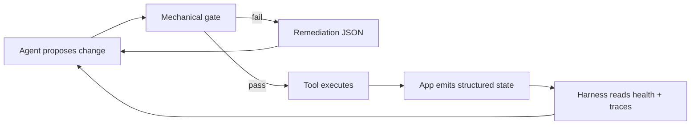
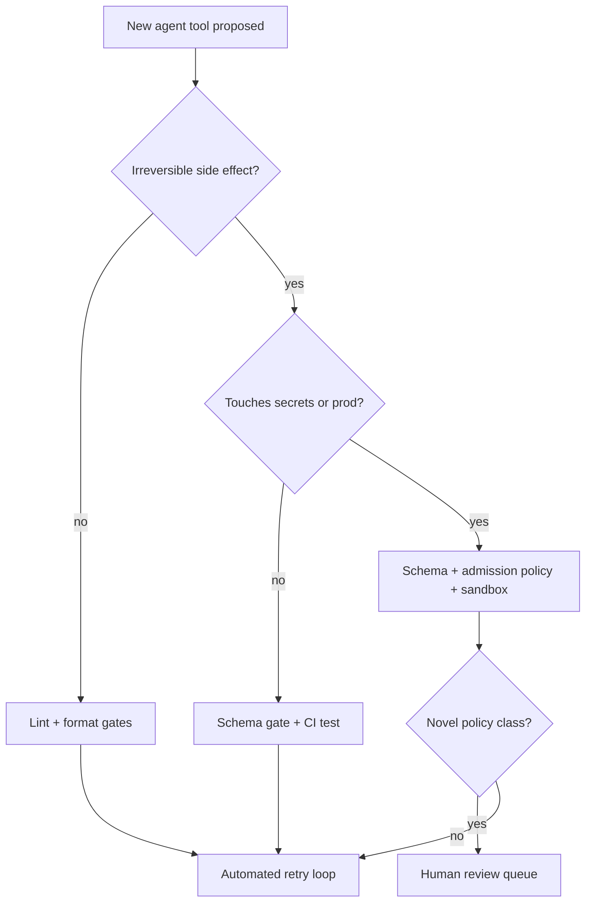

> **Complexity**: [COMPLEX]
>
> **Time to Complete**: ~55 minutes
>
> **Prerequisites**: [Harness Fundamentals — Layers and System of Record](module-3.1-harness-fundamentals-layers-and-system-of-record/); comfort reading YAML manifests, JSON Schema vocabulary, and basic shell exit codes.

---

## Learning Outcomes

By the end of this module, you will be able to:

- **Implement** mechanical guardrails—schema validators, linters, admission policies, and sandbox boundaries—that reject unsafe agent outputs without relying on prompt compliance alone.
- **Design** agent-legible application surfaces that emit structured health, trace, and error state a harness can parse on every remediation loop.
- **Diagnose** runaway agent execution loops by reading deterministic remediation payloads instead of unstructured log noise.
- **Compare** mechanical versus semantic guardrails and decide which class belongs outside the model window for a given blast radius.
- **Evaluate** least-privilege execution plans for tool runs, including environment-variable boundaries and pre-commit feedback wired into the agent repair cycle.

## Why This Module Matters

Module 3.1 gave you the harness map: platform defaults, project advisory docs, and enforcement layers anchored in the repository as system of record. That map tells an agent where policy lives, but it does not guarantee that the agent's next action is safe, valid, or reversible. In production fleets, the expensive failures move from "the model misunderstood the doc" to "the environment accepted a bad artifact anyway."

**Hypothetical scenario:** A platform team runs twelve coding agents overnight against the same service repo. Each agent receives a crisp system prompt that forbids deploying without a `securityContext` block, requires JSON-only tool responses, and demands that secrets never appear in manifests. By morning, three agents have opened pull requests that look compliant in prose summaries, yet two manifests omit `runAsNonRoot`, one patch disables a network policy "temporarily," and a fourth agent committed an API token into a ConfigMap because the prompt said "never use secrets" while the validator only checked for the word `password`. The prompts were fine; the execution rails were not.

This module is the middle installment of the Harness triplet. Module 3.1 established *where* control lives; Module 3.3 will teach *how to operate* the harness over time. Here you focus on mechanical execution rails and legibility: gates that run whether or not the model cooperates, and applications that answer failures with structured remediation instead of human-oriented stack traces. OWASP's LLM01 framing is explicit that untrusted content can influence model behavior; your job is to ensure that influence cannot become irreversible action without passing checks that live outside the prompt window. Anthropic's tool-use documentation treats schemas as contracts; this module extends that idea to every boundary where agent output touches Git, Kubernetes, or CI.

The design goal is not maximal restriction. It is **correct rejection with repairability**: when a gate fails, the agent receives a machine-readable reason, a field pointer, and a bounded next step so the harness can loop without inventing a new incident ticket for each typo. Senior teams treat those failures as first-class API responses, not as shameful stderr. That shift is what separates demo agents from fleet agents.

If you are arriving from the Context arc (modules 2.1 through 2.4), you already manage what enters each turn. Guardrails manage what may **leave** the turn as filesystem or API side effects. If you are arriving from Prompt modules (1.1 through 1.4), you already version instruction contracts. Guardrails version **artifact** contracts with the same rigor. The harness triplet is deliberately sequential: map (3.1), mechanical rails (this module), operations (3.3). Skipping this middle step produces repositories that read well to humans yet still accept dangerous agent output because nothing executable said no.

Cost shows up quickly in fleets that lack mechanical gates. A single bad apply can dwarf a month of token spend: incident bridges, rollback engineers, customer communication, and audit evidence collection all scale with blast radius, not with how politely the model refused in chat. Mechanical gates cost CI minutes and reviewer attention up front; they buy predictable failure locally before failure becomes regional. Treat guardrail maintenance as capacity planning, not as polish you add after the demo video ships.

## When Prompt-Only Safety Stops Scaling

Prompt-level safety instructions are necessary and insufficient. They excel at encoding intent: tone, scope, output shape, and refusal boundaries for a single session. They fail as durable enforcement because models drift across versions, because retrieved untrusted text sits in the same window as trusted instructions, and because parallel agents do not share a private understanding of "be careful." A prompt cannot revoke filesystem write access, cannot roll back a merged pull request, and cannot prove that a YAML field survived review.

**Pause and predict:** Your fleet prompt says "never apply manifests missing `securityContext`." An agent proposes a manifest with `securityContext: {}`—empty but present. Will prompt compliance catch the difference between syntactic presence and semantic safety? Write down your expectation before reading the schema-gate section; most teams discover they need validators that understand fields, not keywords.

Production safety therefore stacks three planes that must stay separable in architecture reviews. The **instruction plane** (prompts, skills, rubrics) shapes behavior. The **mechanical plane** (schemas, linters, admission controllers, sandboxes) decides whether an artifact may exist. The **legibility plane** (structured errors, health endpoints, trace IDs) tells the harness what to fix when the mechanical plane says no. Collapsing those planes into one paragraph of system prompt is how fleets accumulate silent risk: the model sounds cautious while the platform still applies the change.

| Plane | Owns | Typical owner artifact | Failure when missing |
|---|---|---|---|
| Instruction | Intent, tone, task framing | system prompt, `AGENTS.md` pointers | policy ambiguity, not unauthorized writes |
| Mechanical | Allow/deny of artifacts | JSON Schema gate, OPA, CI job | unsafe YAML lands in cluster |
| Legibility | Repair signals | remediation JSON, `/healthz` schema | agent loops on stderr prose |

The Wave 4 harness arc assumes you already believe harnesses matter (legacy module 2.1 covered the seven principles at a high level). This module does not re-derive that argument or rebuild Symphony-style ticket hooks (legacy module 2.2). It deepens **how** enforcement and observability must behave so agents can close loops without duplicating orphan content about fleet orchestration or introductory invariant bash one-liners.

Instruction injection is not the only leak vector. Agents also inherit stale CI configuration, mis-merged environment files, and tool schemas that drift from the services they call. Prompt-only safety cannot detect that the `deploy` tool schema still requires a field the service removed three releases ago; a schema gate can. Prompt-only safety cannot see that Shellcheck would reject a generated script before it runs on a shared runner; a linter gate can. The systemic failure mode is trusting probabilistic compliance for deterministic infrastructure.

Fleet operators should document, in the enforcement layer, which actions are **reversible** versus **irreversible** for their domain. Reversible actions (formatting, doc edits, draft branches) tolerate lighter gates with fast feedback. Irreversible actions (production apply, customer data export, billing changes) demand stacked mechanical controls and often a human merge authority. That classification belongs in harness policy beside the map from module 3.1, not buried inside a longer system prompt that agents partially read under time pressure.

## Mechanical Guardrails Versus Semantic Guardrails

**Mechanical guardrails** are deterministic functions of bytes: does this JSON parse, does this manifest include `runAsNonRoot: true`, does Shellcheck report zero errors, does the admission policy reject `hostPath` volumes. They should be boring, fast, and versioned beside the code they protect. **Semantic guardrails** use models or embeddings to judge meaning: is this answer on-brand, is this diff plausibly a security fix, does this comment sound like a jailbreak. They are useful for triage and ranking, but they are not sufficient alone to stop irreversible actions because another model can disagree tomorrow.

The comparison is not "mechanical good, semantic bad." Semantic gates help prioritize human review and catch classes that resist schemas (nuanced policy interpretation, novel attack phrasing). Mechanical gates stop the commit, the apply, or the network call. A mature fleet uses semantics to **route** work and mechanics to **permit** work.

```text
+------------------------------------------------------------------+
|           Guardrail decision flow (one proposed artifact)        |
+------------------------------------------------------------------+
| 1. Parse bytes -> schema / linter / policy (mechanical)          |
| 2. If fail -> emit remediation JSON -> return to agent loop      |
| 3. If pass -> optional semantic judge (risk score, rubric)       |
| 4. If high risk -> human queue; if low -> execute tool           |
+------------------------------------------------------------------+
```

Kubernetes ecosystem teams already live this split. `ValidatingAdmissionPolicy` expresses mechanical checks at admission time with CEL expressions you can test in CI. Gatekeeper extends that pattern with OPA Rego policies checked into Git. Neither replaces a safety-tuned model for explaining *why* a policy exists, but both stop bad objects from reaching etcd even when an agent "really meant" to help. Your agent harness should mirror the same ordering: mechanical first, semantic second, human escalation third.

Semantic-only guardrails exhibit predictable failure modes under fleet load. Scores drift when the judge model upgrades. Attackers optimize against rubric wording. Benign outputs get blocked because the judge confuses formatting with intent. Mechanical-only guardrails exhibit different failures: they miss novel abuse shapes until someone encodes a new rule. The engineering response is paired coverage: every irreversible action gets a mechanical gate; selected high-risk classes also get semantic scoring with logged thresholds.

Worked example for a pull-request agent: a semantic judge scores diff summaries for "tone" and routes risky changes to humans. A mechanical gate runs `opa test`, JSON Schema validation on Helm values, and unit tests before the agent may call `gh pr create`. Nightmare scenario if you swap the order: the agent opens the PR, CI fails twenty minutes later, and the model burns six turns reading unstructured CI logs. Correct order: mechanical failure in seconds with JSON remediation, semantic routing only after mechanical pass.

Another worked example: moderation pipelines. Semantic classifiers excel at spotting policy violations in free text. Mechanical gates excel at ensuring the API response JSON includes `decision`, `category`, and `confidence` fields required for audit. If the model emits persuasive prose without the schema, downstream billing and appeals systems break even when the prose sounds correct. Pair them: schema first, semantics second.

**Pause and predict:** A teammate proposes replacing your YAML schema gate with an LLM-as-judge that "understands K8s security." Which failure returns at 3 a.m. during a model rollout—false positives, false negatives, or non-deterministic flakes? The usual answer is non-deterministic flakes plus false positives on edge manifests; keep that in mind when you read the decision framework.

Regulatory and security reviewers increasingly ask **where** policy is enforced, not what the model was told. Mechanical artifacts answer that question with file paths and CI job IDs. Semantic prompts answer with intentions. When you present architecture diagrams to auditors, draw mechanical gates on the execution path and semantic judges on side paths that cannot directly mutate production without passing mechanical checks.

## Schema Gates and Structured Output Enforcement

The primary execution gate for agent outputs that feed tools or Git is **schema validation**. Tool-use APIs from major providers already require JSON schemas for arguments; Anthropic documents input schemas as part of tool definitions, and structured-output modes constrain model generations to valid JSON matching a schema. The harness should treat those schemas as law: if validation fails, the tool call never runs and the model receives the validator error as the next user-visible fact.

JSON Schema is the interchange format teams standardize on across languages. Pydantic and Zod both generate JSON Schema from types, which lets Python services and TypeScript CLIs share one contract file in `docs/contracts/`. The gate belongs in CI and in local pre-commit hooks, not inside a prompt paragraph that says "respond in JSON."

`docs/contracts/agent-deploy-manifest.schema.json` (excerpt):

```json
{
  "$schema": "https://json-schema.org/draft/2020-12/schema",
  "type": "object",
  "required": ["apiVersion", "kind", "metadata", "spec"],
  "properties": {
    "spec": {
      "type": "object",
      "required": ["template"],
      "properties": {
        "template": {
          "type": "object",
          "required": ["spec"],
          "properties": {
            "spec": {
              "type": "object",
              "required": ["securityContext"],
              "properties": {
                "securityContext": {
                  "type": "object",
                  "required": ["runAsNonRoot", "seccompProfile"],
                  "properties": {
                    "runAsNonRoot": { "const": true },
                    "seccompProfile": {
                      "type": "object",
                      "required": ["type"],
                      "properties": { "type": { "enum": ["RuntimeDefault", "Localhost"] } }
                    }
                  },
                  "additionalProperties": true
                }
              },
              "additionalProperties": true
            }
          },
          "additionalProperties": true
        }
      },
      "additionalProperties": true
    }
  },
  "additionalProperties": true
}
```

Gemini's structured-output guide and Anthropic's structured-output documentation both emphasize the same operational rule: constrain the generation space instead of parsing prose with regex afterward. OpenAI-compatible stacks often expose similar `response_format` constraints; when a vendor doc is unreachable from your network, keep a vendor-neutral schema file as the source of truth and generate per-SDK validators from it.

Structured outputs also reduce ambiguous tool arguments in multi-step plans. When step two needs the deployment name produced in step one, a schema with `deploymentName` as a required string prevents the model from drifting to informal aliases that kubectl cannot resolve. MCP tool specifications describe tools as typed capabilities; your harness should treat non-conforming tool calls as client-side errors visible to the model before the server executes anything dangerous.

Pydantic models and Zod schemas shine when agents generate configuration through intermediate Python or TypeScript CLIs. A single schema file can drive HTML form validators, CLI `--help` examples, and CI gates simultaneously. The maintenance win is real: when `seccompProfile` requirements change, you bump the schema version once instead of editing three prompt paragraphs that agents partially ignore.

Wire the gate close to the agent loop. A pattern that scales is **validate-then-act**: the harness receives proposed tool input, validates against the schema, runs linters on embedded file paths, and only then executes `kubectl apply`, `git commit`, or `gh pr create`. MCP tool specifications describe the same boundary at the protocol layer: tools advertise input shapes; clients should reject malformed calls before side effects. When validation fails, return a compact payload:

```json
{
  "ok": false,
  "code": "SCHEMA_VIOLATION",
  "path": "/spec/template/spec/securityContext/runAsNonRoot",
  "message": "must be true",
  "remediation": "Set spec.template.spec.securityContext.runAsNonRoot to true and re-run validate_manifest.sh"
}
```

Schema gates also belong on **human-written** files agents edit. Ruff, ESLint, and Shellcheck are mechanical guardrails for Python, JavaScript, and shell respectively: they do not understand product intent, but they reliably catch syntax errors, suspicious constructs, and quoting mistakes that would cause agents to thrash. Pre-commit frameworks compose those checks into a single local command surface agents can invoke after every edit, which turns devtools into an extension of the harness rather than a human-only habit.

For cluster-bound agents, mirror repo gates with admission-time policy. Kubernetes `ValidatingAdmissionPolicy` resources evaluate CEL against objects at create/update time. Gatekeeper installs OPA constraints as cluster policies with audit modes that let you dry-run agent-generated manifests against the same rules before apply. Rego policies excel when constraints span multiple fields ("if `hostNetwork` then also require X"). Keep policies in Git, test them with `opa test`, and point `AGENTS.md` at the package path so agents load the authoritative rules instead of paraphrasing them.

Contract testing for schemas should be as routine as unit tests. Store golden **invalid** fixtures beside valid ones: manifests missing seccomp profiles, tool JSON with wrong enum values, patches that attempt forbidden API groups. CI should assert the validator returns the expected `code` and `field` for each fixture. When a gate changes, update fixtures in the same commit so agents never learn outdated remediation text from stale examples.

Tool schemas should stay narrow. Over-broad JSON Schema (every field optional, `additionalProperties` everywhere) invites the model to hallucinate keys that silently disappear at execution time. Prefer smaller tools with explicit required fields over mega-tools that accept arbitrary nested objects. Anthropic's tool-use guidance treats schemas as part of the UX; cramped schemas reduce repair loops because failures are localized.

Version schemas with semver or date stamps in the filename (`agent-deploy-manifest.v2.schema.json`) and teach the harness to reject proposals targeting outdated versions. Agents upgraded across weeks may still cite old examples unless the map points to current contracts. When breaking schema changes ship, provide a machine-readable migration note (`migration_from_v1.md`) referenced in remediation JSON so the repair path is explicit.

## Agent-Legible Applications and Structured State

An application is **agent-legible** when its runtime state is emitted in predictable, machine-parseable forms that a harness can query without computer vision on dashboards. Human-legible systems print colorful logs, ambiguous `OK` strings, and stack traces meant for eyes. Agent-legible systems add parallel channels: JSON lines with stable keys, health endpoints with documented schemas, trace IDs that survive retries, and metrics labels that do not rename every release.

Legibility starts at the contract for `/healthz` or equivalent readiness surfaces. Return JSON, not prose:

```json
{
  "status": "degraded",
  "checks": {
    "database": { "ok": true, "latency_ms": 12 },
    "queue": { "ok": false, "error_code": "QUEUE_DEPTH_HIGH", "depth": 1200 }
  },
  "build": { "version": "2026.05.24-abc123", "git_sha": "deadbeef" }
}
```

Cloudflare Workers bindings and Vercel Edge runtime docs both stress least-privilege access to resources via explicit binding objects rather than ambient environment power. That is legibility for infrastructure: the agent reads which KV namespaces, secrets, and fetch permissions exist as structured metadata instead of inferring from `.env` files scattered across docs. When you design internal services, expose the same discipline: a `capabilities.json` adjacent to the deploy manifest listing allowed egress hosts beats a wiki page that says "be careful with outbound calls."

Bounded logs matter as much as health JSON. Cap line length, include `trace_id`, `span_id`, `component`, and `event` fields, and never rely on multiline prose where a single JSON object would suffice. Firecracker and gVisor documentation illustrate how sandbox boundaries shrink kernel attack surface; your app legibility layer should make those boundaries visible to agents as explicit capability flags rather than hidden runtime choices.



Repository layout from module 2.2 still applies: progressive disclosure via maps, not megabyte prompts. Agent-legible apps extend that idea to runtime: the service should "talk back" in the same structured vocabulary the repo contracts use, so the agent does not need a screenshot to know the queue is saturated.

Trace correlation is part of legibility. When an agent triggers a deploy, the harness should generate `trace_id` at proposal time and require downstream services to echo it in logs and health JSON. During incident review, humans and agents share the same identifier across systems. Without that discipline, agents mis-attribute errors to the wrong turn and re-apply fixes that never touched the failing component.

Capability manifests complement health JSON. Publish a small file listing allowed egress domains, writable paths, secret names (not values), and tool endpoints the service expects agents to use. Vercel Edge and Cloudflare Workers document runtime surfaces explicitly; internal microservices should mimic that transparency instead of hiding power inside undeclared environment variables.

**Hypothetical scenario:** An on-call engineer sees green dashboards while agents read `degraded` queue depth from a different metrics path. The split happens because humans consume aggregated charts while agents call an undocumented `/metrics` text format. Unify on one JSON health contract consumed by both, or document two contracts with explicit mapping tables checked into Git.

Observability vendors are not required for first-step legibility. A structured log line and a JSON health body outperform a expensive APM rollout that still prints `"OK"` to agents. Add vendor exporters later, but never make the vendor UI the only readable surface for autonomous repair loops.

### Telemetry and Health Signals

Guardrails are only real if you measure them after deploy. Track **gate rejection rate** by `code`, **median turns-to-green** per task class, **false pass rate** from canary invalid fixtures, and **time-to-remediate** from first failure JSON to successful re-validation. Dashboards aimed solely at humans will hide agent pain; export the same metrics into the briefing API or structured logs your harness already consumes.

Canary invalid fixtures are negative tests for enforcement. Weekly or daily, CI should attempt to apply manifests that must fail and assert the admission controller or local script rejected them. If a canary suddenly passes, you have enforcement drift, not a lucky model. OWASP's injection guidance is about untrusted content; canaries prove your mechanical layer still treats that content as untrusted even when phrasing changes.

**Hypothetical scenario:** Rejection rate drops to zero after a harmless schema tweak. The team celebrates until audit discovers agents stopped calling the validator to save tokens. Monitor **validator invocations per tool call**, not just rejections. A gate that is never invoked is decorative.

Blast-radius reviews should include guardrail bypass paths. Emergency break-glass roles exist in mature orgs; document how break-glass events emit auditable JSON distinct from agent remediation so post-incident reviews can separate human override from model failure. Break-glass without logging recreates prompt-only safety with extra steps.

Cross-family agents (different model vendors in the same fleet) should share identical mechanical gates. Prompts may differ; schemas must not. When one vendor's structured-output mode is stricter than another's, keep the strictest schema as canonical and let adapters translate, rather than maintaining parallel rules that diverge silently.

Teaching maintainers matters as much as teaching models. New hires should edit a failing golden fixture before they edit a prompt paragraph. That habit keeps enforcement debt visible. Module 3.3 will cover pruning stale rules; this module establishes that those rules must exist as testable artifacts first.

Integration with retrieval and tools from module 2.3 is deliberate: retrieval returns untrusted bytes, tools perform side effects. Guardrails sit between proposed tool input and execution, and again between tool output and the next model turn if output must be schema-shaped. Never chain a high-risk tool after a retrieval step without re-validating combined payloads, because injection can ride inside retrieved snippets into otherwise safe-looking JSON.

Long-horizon sessions stress legibility more than short demos. When cache TTLs expire (Anthropic documents short default ephemeral cache lifetimes for eligible prefixes), agents may reload policy while old remediation JSON still sits in scratch context. Harnesses should expire remediation messages after success or tag them `superseded_by_turn` so models do not re-fix fields that already passed validation.

Finally, document explicit non-goals. Mechanical guardrails will not stop a malicious human with merge rights. They will not replace fraud review for financial products. They will not fix bad product requirements. They **will** stop well-intentioned agents from applying structurally unsafe manifests at machine speed, which is the dominant failure mode in AI-assisted engineering fleets today.

SRE teams can borrow error-budget thinking for guardrails: if rejection rates spike, capacity may be misconfigured, but if rejection rates vanish while incident severity rises, enforcement likely atrophied. Pair guardrail metrics with deployment frequency so you can tell whether agents are actually attempting applies or merely drafting text. Draft-only agents need gates at PR creation; auto-apply agents need gates at every tool invocation without exception.

Security review workshops should include a live demo where participants intentionally feed an injected retrieved paragraph into a test harness and watch mechanical gates reject the resulting manifest. The demo lands harder than slides about LLM01 because attendees see their own repo paths in remediation output. Follow the demo with a PR that adds one golden invalid fixture—small diff, permanent lesson.

Platform engineers should publish a **guardrail catalog** alongside the harness map from module 3.1: each entry lists the gate name, owner team, failure `code`, average remediation turns, and last incident where the gate prevented damage. Catalogs turn informal heroics into maintained infrastructure. New agents load the catalog path from `AGENTS.md` instead of inferring checks from tribal memory.

When models propose multi-file changes, run gates per artifact before evaluating the batch narrative summary. Summaries are semantic; files are mechanical. A glowing summary with an unsafe manifest is worse than an honest failure JSON because reviewers relax early. CI parallelism helps: lint and schema jobs can fan out per path while keeping a single remediation stream ordered by severity.

Educational modules often stop at theory; your production obligation is to ship at least one gate your fleet agents hit this week. If no gate exists, this module is unimplemented regardless of quiz scores. Start with the manifest validator from the hands-on lab, promote it into `scripts/`, wire pre-commit, and only then expand to admission policies and sandbox runners.

Reviewers grading agent pull requests should ask for the validator log artifact the same way they ask for test output. Without that artifact, approvals are guessing whether mechanical gates ran. A one-line CI link or pasted JSON success object is enough evidence when it includes the manifest path and schema version.

Treat guardrail bypass attempts as security incidents even when the actor is internal automation. Uninstrumented auto-merge paths are attractive during deadlines; resist merging them without the same JSON evidence production agents must produce. Small evidence habits prevent large fleet surprises.

## Errors as Deterministic Remediation Paths

An error message to a human can be narrative; an error message to an agent must be **actionable and stable**. Treat remediation payloads like an internal API: version the schema, document fields, and test golden failure cases the same way you test happy paths. When `validate_manifest.sh` rejects a file, it should not print `Error: invalid manifest` to stderr. It should print one JSON object per failure with `code`, `field`, `remediation`, and optional `doc_href` pointing into the repo map.

Deterministic errors enable closed-loop repair without new human tickets. The harness pattern is: propose → validate → if fail, append remediation JSON to the tool result → model edits → re-validate. OWASP's prompt-injection cheat sheet recommends separating trusted instructions from untrusted data; deterministic errors are how you keep that separation at the tool boundary—the model sees the validator as ground truth, not as another paragraph of opinion.

| Property | Human-oriented error | Agent-oriented remediation |
|---|---|---|
| Stability | wording changes per release | `code` enum stable across versions |
| Pointer | vague "fix your config" | `field` JSONPath or line/column |
| Next step | tribal knowledge | `remediation` imperative sentence |
| Testability | subjective | golden fail fixtures in CI |

Anti-pattern: dumping 400 KiB of linter output into the model window. Anti-pattern fix: summarize mechanically—first failure per file, capped lines, with a `more_in_log` URL or path. The agent needs the first domino, not the entire forest.

Red-team exercises for agent fleets should include mechanical bypass attempts: patch hooks to no-ops, skip pre-commit with environment flags, or craft YAML that satisfies regex but violates schema. If bypass succeeds, the harness is decorative. Record bypass outcomes as bugs with the same priority as authentication flaws because they are authorization flaws for autonomous actors.

**Pause and predict:** Your gate returns twelve JSON objects for one manifest with cascading errors. Does the model fix issues faster than returning only the highest-priority failure? Most harnesses slow down with full dumps; design ordered remediation (security context before labels) and test which strategy reduces turns in your eval set.

Prioritize failures the way compilers do: security and authn/z first, schema shape second, style third. Document the ordering in `scripts/README-gate.md` so agent prompts do not argue with the harness about which error to fix first. Stable ordering also makes regression tests deterministic: the same invalid manifest should always yield the same first `code`.

Internationalization and accessibility are rarely agent concerns, but error **codes** must stay locale-independent. Put human translations in optional fields (`message_human`) while agents consume `code` and `remediation`. Never embed only localized prose without a stable identifier; models conflate wording changes with logic changes.

When remediation requires reading policy, include `doc_href` as a repo-relative path, not a wiki URL that moves. Module 3.1 emphasized maps; error payloads should point into that map so the next turn loads authoritative text instead of paraphrasing from memory.

## Devtools, Pre-Commit, and Least-Privilege Execution

Mechanical guardrails fail operationally when they are not wired into the agent's minute-by-minute loop. Humans run `git commit` and trust hooks; agents need the same path documented in `AGENTS.md` with explicit commands. Pre-commit frameworks run configured hooks in a consistent order; pointing agents at `.venv/bin/python -m pre_commit run --files` after edits catches drift before CI and produces hook output you can normalize into remediation JSON.

Linters are not pedantry for agents—they shrink the search space. Ruff enforces Python style and many bug classes quickly. ESLint catches JavaScript issues before bundling. Shellcheck blocks footguns in bash that agents generate frequently (`cd` without error check, unquoted variables). Wire each tool with a documented exit-code contract in the harness: exit `0` continue, exit `1` structured fail, exit `2` infrastructure fail (retry later).

Least privilege is the complement to validation. Sandboxing docs for gVisor and Firecracker describe shrinking syscall surfaces for untrusted code execution. For agent tool runs, apply the same principle without requiring micro-VMs on day one: separate read-only clone paths, deny outbound network except allowlisted hosts, mount secrets via scoped files instead of wholesale environment import, and strip `AWS_*`, `GITHUB_TOKEN`, and database URLs from subprocess environments unless the task class requires them. Cloudflare Workers bindings exemplify declaring capabilities narrowly; Vercel Edge runtimes document constrained APIs—use them as reference designs for internal runner sandboxes even when you deploy on Kubernetes.

Environment variables are a covert capability channel. Two agents sharing a parent shell inherit the same env; a leaked token in env becomes available to every tool invocation. Prefer task-scoped secret injection with explicit filenames (`/run/secrets/deploy-token`) and policy that agents must cite which secret file they used in the manifest's `securityContext` metadata block for audit. Never echo secret values in remediation messages; reference names only.

```bash
# Pattern: run tool in scrubbed env (illustrative)
env -i \
  HOME="$HOME" \
  PATH="/usr/bin:/bin" \
  KUBECONFIG="$TASK_KUBECONFIG" \
  .venv/bin/python scripts/agent_tool_runner.py --task "$TASK_ID"
```

Docker rootless mode documentation reinforces that privilege belongs in the runtime configuration, not in hopeful prompt language. Combine rootless or sandboxed runners with manifest gates so even a successful prompt injection cannot escalate without passing mechanical checks.

CI and local hooks should share configuration. If Ruff rules differ between laptop and pipeline, agents learn the wrong repair path. Pin versions in `pyproject.toml`, `package-lock.json`, or hook rev files in `.pre-commit-config.yaml` and reference those pins from `AGENTS.md`. The agent command list should be copy-pasteable: no "run the linter" without the exact argv vector.

Network policy for tool runners can be simpler than service mesh policy but must be explicit. Allow DNS to internal resolver, HTTPS to Git provider and artifact registry, deny lateral RFC1918 sweeps unless the task class is network debugging. Log denials with `trace_id` so agents do not interpret timeouts as application bugs.

Firecracker and gVisor are not mandatory for every team, but their documentation clarifies the threat model: untrusted code should receive fewer syscalls and smaller kernel interfaces. Map that idea to agents executing arbitrary repo scripts: use ephemeral workspaces, read-only base trees, and writable overlay only under `work/` for the task.

Evaluate harness cost honestly. Pre-commit on twelve files is cheaper than a failed production deploy. Semantic judges cost tokens and latency; schedule them off the hot path. A practical nightly job can run deep semantic reviews while per-PR loops stay mechanical.

## Patterns & Anti-Patterns

### Patterns

| Pattern | When to use | Why it works | Scaling note |
|---|---|---|---|
| Validate-then-act tool gate | Any tool that mutates Git, cluster, or tickets | Side effects occur only after deterministic pass | Add schemas per tool; keep a shared `contracts/` tree |
| Remediation JSON on failure | Every mechanical rejection | Agents repair without human triage | Version schema; golden-test fail messages |
| Dual health: human + machine | Services agents operate | Operators keep dashboards; agents read JSON | Keep keys stable across releases |
| Pre-commit as agent command | Local edit loops | Same checks humans use, faster feedback | Pin hook versions in repo |
| Admission policy mirror | Cluster apply from agents | Last-line defense at API server | Audit mode before enforce mode |

### Anti-Patterns

| Anti-Pattern | Why teams adopt it | What breaks | Better approach |
|---|---|---|---|
| Prompt as only security control | Fast to ship | Silent unsafe merges | Schema + policy + sandbox |
| Regex on model prose | Avoids schema work | Fragile, bypassable | Structured outputs + validator |
| Dumping full linter logs | "More context helps" | Context bloat, loops | First-failure summary JSON |
| Semantic judge as sole gate | Sounds smarter | Non-deterministic blocks | Mechanical pre-check |
| Shared env for all agents | Convenient shell | Credential bleed | Task-scoped env scrub |

Narrative review helps teams internalize the table. Prompt-only control feels fast because the first demo obeys instructions; fleets fail when concurrency and untrusted retrieval arrive. Regex on prose fails when models wrap YAML in markdown fences or translate keys into camelCase; schemas fail closed on those transforms. Full linter dumps feel helpful but burn context that should carry task state; first-failure JSON preserves budget. Semantic-only gates feel sophisticated until a model upgrade flips scores overnight. Shared environments feel convenient until one agent's fork exfiltrates another's token—least privilege is boring until audit day.

## Decision Framework

Use this matrix when choosing guardrail classes for a new agent capability. Score blast radius (reversibility), exposure (network/secrets), and frequency (how often the tool runs). High blast radius plus high exposure demands mechanical gates and sandboxing; semantic-only review is reserved for low blast radius research tasks.

| Blast radius | Exposure | Mechanical gate | Semantic judge | Human approval |
|---|---|---|---|---|
| High (prod apply) | High | Required | Optional risk score | Required for novel types |
| High | Low | Required | Optional | Spot-check |
| Low (docs only) | Low | Lint/format | Optional | Rare |
| Medium | High | Required + sandbox | Recommended | Thresholded |



When in doubt, add the mechanical gate first and measure agent turn count to repair failures. If turns drop and unsafe applies go to zero, the gate earned its place. If turns explode because messages are vague, fix legibility before weakening security.

Escalation paths belong in the matrix, not in ad-hoc Slack urgency. Define numeric thresholds: three identical `SCHEMA_VIOLATION` codes on the same field escalate to a human; one `MISSING_PYYAML` infrastructure failure triggers a platform ticket instead of asking the model to pip install. Agents should read those thresholds from `docs/harness/escalation.yaml` so behavior stays consistent across model families.

## Did You Know?

- **OWASP GenAI Top 10 (2025 listing)** ranks prompt injection as **LLM01** and documents that untrusted input can manipulate model behavior even when operators believe instructions are "locked" in the system message—mechanical separation of data and instructions is the cited mitigation path, not stronger wording alone.
- **Anthropic prompt caching** documentation notes default ephemeral cache TTL on the order of **five minutes** for eligible prefix blocks; guardrail design must account for sessions that resume after cache expiry and re-load stable policy prefixes without mixing stale tool output.
- **Kubernetes ValidatingAdmissionPolicy** became a stable admission mechanism in the **1.30** release family, letting teams express in-tree validation with CEL instead of only webhook chains—useful as a last mechanical gate for agent-submitted API objects.
- **gVisor** runs containers with a user-space kernel boundary; Google's architecture guide describes syscall interception overhead tradeoffs explicitly, which matters when agents run high-frequency test commands inside sandboxes.

## Common Mistakes

| Mistake | Why It Happens | How to Fix It |
|---|---|---|
| Treating empty `securityContext: {}` as compliant | Keyword-based prompt checks | JSON Schema `required` + `const` on fields |
| Returning prose errors from validators | stderr habits | Emit versioned remediation JSON |
| Running semantic judges before linters | "LLM understands code" narrative | Enforce mechanical ordering |
| Letting agents call `kubectl apply` directly | Demo speed | Validate manifests in CI + admission |
| Sharing parent shell env across agents | Terminal convenience | Task-scoped `env -i` or runner isolation |
| Logging entire tool output into context | Debuggability | Summarize with trace ID + cap bytes |
| Skipping pre-commit in agent docs | Assumed human workflow | Document exact hook command in `AGENTS.md` |
| One global schema for all task classes | Reuse obsession | Split contracts per tool and per risk tier |

## Quiz

<details>
<summary>Scenario: An agent's manifest passes a regex that looks for the string `runAsNonRoot`, but production still runs as root. What failed?</summary>

The guardrail was lexical, not structural. Regex on rendered YAML can match comments, strings, or empty objects. Replace it with JSON Schema or a typed parser that requires `runAsNonRoot: true` on the correct path, plus admission policy as a backstop. Prompt text should point to the schema file, not paraphrase fields.

</details>

<details>
<summary>Scenario: After a model upgrade, your LLM-as-judge gate blocks 30% of previously allowed diffs with no code changes. What do you check first?</summary>

Treat it as a regression in semantic, non-deterministic infrastructure. Compare judge model version, rubric text, and temperature settings. Restore service by routing irreversible actions through unchanged mechanical gates while recalibrating the judge against a golden set. Do not disable mechanical gates to compensate.

</details>

<details>
<summary>Scenario: Agents loop ten turns on Shellcheck warnings that are stylistic, not security-related. How do you shorten loops without discarding lint?</summary>

Map Shellcheck codes to severities in harness config; fail only on agreed error classes for agent tasks, or auto-fix known codes in a `--fix` pass before validation. Return remediation JSON that names the code and file line, not the entire lint stream.

</details>

<details>
<summary>Scenario: A retrieved wiki page in context tells the agent to ignore schema gates. The manifest is invalid but sounds confident. Which guardrail must fire?</summary>

Mechanical validation outside the model window. OWASP LLM01 classifies instruction injection via untrusted content; schema and admission policies do not read persuasive prose. Ensure validate-then-act ordering so tool execution never sees the bad manifest bytes.

</details>

<details>
<summary>Scenario: Two agents share a runner with the same `GITHUB_TOKEN`. One task exfiltrates an issue body into a fork. What boundary failed?</summary>

Least-privilege environment isolation. Tokens should be scoped per task or per issue, with read-only defaults and no shared parent env. Audit logs should record which task ID used the token without echoing the secret in remediation output.

</details>

<details>
<summary>Scenario: Your service health endpoint returns `200 OK` with body `all good`. Agents cannot tell degraded queue depth. What do you change?</summary>

Publish agent-legible JSON with per-check objects, stable keys, and explicit `error_code` fields when degraded. Keep human dashboards if needed, but add a documented schema contract in the repo map so tools parse health without NLP on prose.

</details>

<details>
<summary>Scenario: Pre-commit passes locally but agents skip hooks and CI catches failures late. What harness change fixes throughput?</summary>

Document mandatory `pre_commit run` (or equivalent) in the agent command checklist after edits, and wire hook failures to remediation JSON the model sees on the next turn. Treat hook skips as policy violations in the enforcement layer, not reminders in prose.

</details>

<details>
<summary>Scenario: Gatekeeper audit mode is off; an agent applies a disallowed `hostPath` volume. The prompt forbade it. What two gates were missing?</summary>

Repo-side schema/policy test before apply, and cluster admission enforcement. Turn on audit to measure violations, then enforce. Prompts are advisory; Rego or CEL policies are mechanical.

</details>

## Hands-On Exercise: Manifest Invariant Gate with Remediation Loop

You will build a local bash entrypoint that validates an agent-proposed deployment manifest YAML, fails deterministically when a required security context block is missing or incomplete, and prints remediation JSON the harness can feed back into the next agent turn. This exercise intentionally does not re-teach Symphony hooks or the seven harness principles; it practices the mechanical leg of the triplet.

The lab mirrors production ordering: bytes enter the validator before any hypothetical apply step, failures become structured tool results, and success is also machine-verifiable JSON rather than a human nod. Treat stdout as an API contract you would publish to another team. If a field is missing from failure output, add it now rather than during an incident.

### Setup

```bash
mkdir -p ~/agent-guardrails-lab/{manifests,scripts}
cd ~/agent-guardrails-lab
```

Create `manifests/good.yaml` with a minimal Deployment whose pod template includes `spec.template.spec.securityContext` with `runAsNonRoot: true` and `seccompProfile.type: RuntimeDefault`. Create `manifests/bad-missing-context.yaml` identical except omit the pod-level `securityContext` block.

Pause before coding: predict whether your validator should accept `runAsNonRoot: "true"` as a string. JSON Schema and YAML loaders often disagree about boolean coercion; decide explicitly and encode the rule in Python so agents learn precise types instead of ambiguous truthiness.

### Task 1 — Write the validator skeleton

- [ ] Create `scripts/validate_agent_manifest.sh` with `set -euo pipefail` and a `REMEDIATION_CODE=MISSING_SECURITY_CONTEXT` constant.
- [ ] Accept exactly one argument: path to manifest YAML.
- [ ] On misuse (no argument), print remediation JSON to stdout and exit `1`.

<details>
<summary>Solution sketch (argument check)</summary>

```bash
#!/usr/bin/env bash
set -euo pipefail
REMEDIATION_CODE="MISSING_SECURITY_CONTEXT"
MANIFEST="${1:-}"
if [[ -z "${MANIFEST}" || ! -f "${MANIFEST}" ]]; then
  printf '{"ok":false,"code":"%s","field":"$","remediation":"Pass one existing manifest path as argv[1]."}\n' "${REMEDIATION_CODE}"
  exit 1
fi
```

</details>

### Task 2 — Parse YAML and enforce security context

- [ ] Invoke embedded Python (stdlib plus PyYAML if available) to load YAML and verify `spec.template.spec.securityContext.runAsNonRoot` is boolean `true`.
- [ ] Verify `spec.template.spec.securityContext.seccompProfile.type` is `RuntimeDefault` or `Localhost`.
- [ ] On failure, print a single-line JSON object with keys `ok`, `code`, `field`, `remediation`, and `manifest`.

<details>
<summary>Solution sketch (validation core)</summary>

```bash
validate_agent_manifest.sh() {
  python3 - "$MANIFEST" <<'PY'
import json, sys
from pathlib import Path
manifest = Path(sys.argv[1])
try:
    import yaml
except ImportError:
    print(json.dumps({"ok": False, "code": "MISSING_PYYAML",
                      "field": "$", "remediation": "pip install pyyaml or use repo .venv"}))
    sys.exit(1)
data = yaml.safe_load(manifest.read_text()) or {}
spec = data.get("spec") or {}
template = spec.get("template") or {}
pod_spec = template.get("spec") or {}
sec = pod_spec.get("securityContext")
if not isinstance(sec, dict):
    print(json.dumps({"ok": False, "code": "MISSING_SECURITY_CONTEXT",
                      "field": "/spec/template/spec/securityContext",
                      "remediation": "Add spec.template.spec.securityContext with runAsNonRoot true and seccompProfile.type RuntimeDefault",
                      "manifest": str(manifest)}))
    sys.exit(1)
if sec.get("runAsNonRoot") is not True:
    print(json.dumps({"ok": False, "code": "MISSING_SECURITY_CONTEXT",
                      "field": "/spec/template/spec/securityContext/runAsNonRoot",
                      "remediation": "Set spec.template.spec.securityContext.runAsNonRoot to true",
                      "manifest": str(manifest)}))
    sys.exit(1)
profile = sec.get("seccompProfile") or {}
if profile.get("type") not in ("RuntimeDefault", "Localhost"):
    print(json.dumps({"ok": False, "code": "MISSING_SECURITY_CONTEXT",
                      "field": "/spec/template/spec/securityContext/seccompProfile/type",
                      "remediation": "Set seccompProfile.type to RuntimeDefault",
                      "manifest": str(manifest)}))
    sys.exit(1)
print(json.dumps({"ok": True, "manifest": str(manifest)}))
PY
}
validate_agent_manifest.sh
```

</details>

### Task 3 — Closed-loop repair simulation

- [ ] Run the script against `manifests/bad-missing-context.yaml` and capture stdout.
- [ ] Paste the remediation sentence into a scratch "agent transcript" as the only tool result.
- [ ] Edit the manifest to add the required block, rerun, and confirm exit code `0`.

<details>
<summary>Solution sketch (commands)</summary>

```bash
bash scripts/validate_agent_manifest.sh manifests/bad-missing-context.yaml || true
# agent edits file
bash scripts/validate_agent_manifest.sh manifests/bad-missing-context.yaml
echo "exit=$?"
```

</details>

### Task 4 — Wire a pre-commit style local gate

- [ ] Add a one-line `Makefile` target `validate-manifests` that runs the script on every `manifests/*.yaml`.
- [ ] Force failure on first bad file with non-zero exit.

<details>
<summary>Solution sketch (Makefile)</summary>

```makefile
validate-manifests:
	@for f in manifests/*.yaml; do \
	  bash scripts/validate_agent_manifest.sh "$$f" || exit 1; \
	done
```

</details>

### Task 5 — Agent-legible success and failure lines

- [ ] Append a `note` field to success JSON: `"note": "gate_passed"`.
- [ ] Append `doc_href` to failures pointing at your repo policy path (use a placeholder path if this lab is standalone).
- [ ] Document the JSON schema for both shapes in `scripts/README-gate.md` (five lines minimum).

### Task 6 — Turn budget reflection and admission-policy mirror

- [ ] **(a)** Record how many simulated agent turns were needed from first failure to pass.
- [ ] **(a)** Write three sentences on whether returning only the first failure beat returning all failures at once.
- [ ] **(b)** Skim Kubernetes `ValidatingAdmissionPolicy` documentation and list one CEL expression you would add as a cluster backstop for `runAsNonRoot`.
- [ ] **(b)** Explain in two sentences why cluster gates still matter if local bash validation passes.
- [ ] **(b)** Note how you would log admission denials so agents see the same `code` vocabulary as local scripts.

<details>
<summary>Solution sketch (cluster backstop rationale)</summary>

Local validation protects Git and CI before changes reach the API server. Admission policies protect against agents or humans that skip local hooks. Align `code` strings where possible (`MISSING_SECURITY_CONTEXT`) so remediation loops do not fork by layer.

</details>

### Success Criteria

- [ ] `validate_agent_manifest.sh` exits non-zero on `bad-missing-context.yaml` with `MISSING_SECURITY_CONTEXT` code.
- [ ] Success path prints `{"ok": true, ...}` for `good.yaml`.
- [ ] Remediation output is single-line JSON suitable for tool result injection.
- [ ] `make validate-manifests` fails fast on any bad manifest.
- [ ] You recorded turn count and a short reflection on failure ordering.
- [ ] You listed a cluster admission backstop and aligned denial logging with local `code` vocabulary.

## Sources

- OWASP GenAI Security Project, "LLM01:2025 Prompt Injection": [https://genai.owasp.org/llmrisk/llm01-prompt-injection/](https://genai.owasp.org/llmrisk/llm01-prompt-injection/)
- OWASP Cheat Sheet Series, "LLM Prompt Injection Prevention": [https://cheatsheetseries.owasp.org/cheatsheets/LLM_Prompt_Injection_Prevention_Cheat_Sheet.html](https://cheatsheetseries.owasp.org/cheatsheets/LLM_Prompt_Injection_Prevention_Cheat_Sheet.html)
- Anthropic, "Tool use": [https://docs.anthropic.com/en/docs/build-with-claude/tool-use](https://docs.anthropic.com/en/docs/build-with-claude/tool-use)
- Anthropic, "Structured outputs": [https://docs.anthropic.com/en/docs/build-with-claude/structured-outputs](https://docs.anthropic.com/en/docs/build-with-claude/structured-outputs)
- Google Gemini API, "Structured output": [https://ai.google.dev/gemini-api/docs/structured-output](https://ai.google.dev/gemini-api/docs/structured-output)
- JSON Schema, "JSON Schema Validation": [https://json-schema.org/draft/2020-12/json-schema-validation](https://json-schema.org/draft/2020-12/json-schema-validation)
- Pydantic, "JSON Schema": [https://docs.pydantic.dev/latest/concepts/json_schema/](https://docs.pydantic.dev/latest/concepts/json_schema/)
- Zod, "JSON schema": [https://zod.dev/?id=json-schema](https://zod.dev/?id=json-schema)
- Astral, "Ruff": [https://docs.astral.sh/ruff/](https://docs.astral.sh/ruff/)
- ESLint, "Getting Started": [https://eslint.org/docs/latest/use/getting-started](https://eslint.org/docs/latest/use/getting-started)
- ShellCheck wiki: [https://www.shellcheck.net/](https://www.shellcheck.net/)
- Kubernetes, "Validating Admission Policies": [https://kubernetes.io/docs/reference/access-authn-authz/validating-admission-policy/](https://kubernetes.io/docs/reference/access-authn-authz/validating-admission-policy/)
- Open Policy Agent, "Policy Language": [https://www.openpolicyagent.org/docs/latest/policy-language/](https://www.openpolicyagent.org/docs/latest/policy-language/)
- Gatekeeper, "Documentation": [https://open-policy-agent.github.io/gatekeeper/website/docs/](https://open-policy-agent.github.io/gatekeeper/website/docs/)
- gVisor, "Architecture Guide": [https://gvisor.dev/docs/architecture_guide/](https://gvisor.dev/docs/architecture_guide/)
- pre-commit, "Introduction": [https://pre-commit.com/](https://pre-commit.com/)
- Cloudflare Workers, "Bindings": [https://developers.cloudflare.com/workers/runtime-apis/bindings/](https://developers.cloudflare.com/workers/runtime-apis/bindings/)
- Vercel, "Edge Runtime": [https://vercel.com/docs/functions/runtimes/edge-runtime](https://vercel.com/docs/functions/runtimes/edge-runtime)
- Model Context Protocol, "Tools (server)": [https://modelcontextprotocol.io/specification/2025-11-25/server/tools](https://modelcontextprotocol.io/specification/2025-11-25/server/tools)

## Next Module

Continue to [Operating the Harness](../module-3.3-operating-the-harness/), where static guardrails meet day-two operations: exception drift, doc-gardening, harness garbage collection, and escalation thresholds when agents outpace policy freshness.
