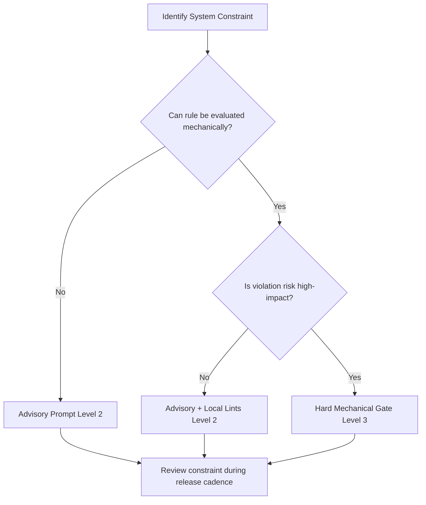

> **Complexity**: `[COMPLEX]`
>
> **Time to Complete**: ~55 minutes
>
> **Prerequisites**: [module-3.1-harness-fundamentals-layers-and-system-of-record](file:///Users/krisztiankoos/.gemini/antigravity-cli/scratch/kube-dojo/src/content/docs/ai/ai-engineering-foundations/module-3.1-harness-fundamentals-layers-and-system-of-record.md)

---

## Learning Outcomes

- **Analyze** the systemic vulnerabilities of prompt-only safety guardrails and contrast them with mechanical execution gates in production agent fleets.
- **Implement** strict output schema validation using JSON Schema, Zod, and Pydantic to enforce data structure invariants on agent payloads before execution.
- **Design** agent-legible applications by emitting predictable structured telemetry and machine-actionable error remediation paths for self-healing loops.
- **Deploy** sandboxed execution environments utilizing process isolation, containerization, and least-privilege access rules to mitigate runtime injection risks.

## Why This Module Matters

When an LLM agent moves from an interactive playground into a production software system, the nature of safety and execution boundaries undergoes a fundamental shift. In a playground, a human remains in the loop, providing constant supervision, reading error messages, and correcting mistakes. In an autonomous production fleet, however, agents execute commands, modify configurations, and interact with live APIs at a scale and speed that makes continuous human inspection impossible. Relying on conversational system prompts to keep these agents inside safe boundaries represents a critical design flaw.

A resilient AI engineering infrastructure must abandon the hope that models will always follow natural language guidelines. Instead, it must implement strict mechanical boundaries that capture, inspect, and filter agent behavior before it can interact with the underlying environment. By establishing formal schema gates, sandboxing execution environments, and converting application telemetry into structured, machine-actionable feedback, engineers can build self-healing agent workflows. This approach changes the system from a fragile construct built on conversational trust into a robust, deterministic engineering platform.

The transition to automated agent workflows demands a rigorous understanding of system failure modes and defensive design patterns. Engineers who fail to secure the execution boundary expose their platforms to severe vulnerabilities, including prompt injection, data exfiltration, and resource exhaustion. This module provides the theoretical foundations and practical skills necessary to build secure, robust, and highly reliable execution harnesses for autonomous agents. By the end of this study, you will be able to construct deterministic gates that secure your infrastructure while enabling high-throughput agent operations.

Establishing these mechanical boundaries also changes the way software developers write and design applications. We must shift from designing systems solely for human interaction to designing systems that are highly legible to autonomous machine agents. By emitting structured, predictable state information and designing errors as deterministic remediation paths, we enable agents to self-correct and recover from failures autonomously. This paradigm of agent legibility is key to building highly scalable, self-healing platforms that sustain continuous operation without manual intervention.

## The Illusion of Prompt-Only Safety in Production Agent Fleets

Relying on system prompts, behavioral guidelines, and negative constraints to secure autonomous agents in production represents a severe architectural vulnerability. A system prompt that instructs an agent to never delete database records or to only write files within a specific folder is merely a request, not a guarantee. Large language models operate probabilistically, predicting the next token based on statistical patterns rather than evaluating mathematical or logical invariants. When scaled to thousands of operations, this probabilistic nature guarantees that the agent will eventually drift away from the intent of the prompt.

Catastrophic drift occurs because the model context window is a dynamic and noisy memory space. As an agent session progresses through multiple turns, the context window accumulates tool execution outputs, error messages, and intermediate reasoning steps. This accumulation creates attention dilution, where the original system instructions are deprioritized by the model's attention mechanism in favor of more recent tokens. A prompt that successfully constrained the agent during the first three steps of a session can be easily ignored on the twentieth step, leading to unintended and destructive behaviors.

This dilution is directly explained by the underlying mathematics of transformer attention mechanisms. In a standard self-attention layer, the attention weight assigned to any given token is calculated relative to all other tokens in the context window. As the sequence length expands, the denominator of the softmax function increases, naturally distributing the attention scores across a larger number of keys. Consequently, the relative weight of the system instructions at the beginning of the prompt decays exponentially over long turns, allowing recent data to dominate generation.

Autoregressive models also suffer from strong recency bias, where the generation of new tokens is heavily influenced by the immediately preceding sequence. When an agent reads a massive log file or processes verbose tool outputs, those raw tokens occupy the most active part of the model's immediate memory. The model's generation shifts toward matching the style, structure, and intent of the recent data, neglecting the negative constraints written in the system prompt. This behavioral drift is silent and cannot be reliably prevented by simply repeating instructions in the context.

Beyond natural drift, prompt-only safety falls apart entirely when confronted with untrusted input or malicious data. Prompt injection occurs when external data, such as a customer support ticket or a parsed git commit, contains instructions that override the agent's system prompt. Because models do not inherently separate code from data, they treat these injected instructions as part of their cognitive task. An agent tasked with summarizing a document can easily be hijacked by text within that document instructing it to delete its own database config or leak secrets.

Adversarial prompt injection exploits the model's alignment training by simulating system overrides or high-priority administrative commands. A common jailbreaking technique involves writing text that mimics the end of a conversational block and declares that a new session has started with full privileges. The model, failing to distinguish between the structural metadata of the conversation and the content of the data payload, follows the new instructions. This vulnerability makes it virtually impossible to safely pass raw, unvalidated external data directly to an agent process.

Developers frequently attempt to mitigate these injection risks by implementing secondary LLM judges to inspect the inputs and outputs of the primary agent. While this approach adds a layer of filter analysis, it merely duplicates the probabilistic failure rate of the system while doubling API latency and token costs. A secondary model is subject to the same attention limitations, prompt jailbreaks, and hallucinations as the primary agent. Relying on one probabilistic system to secure another probabilistic system represents a circular design path that fails under production pressure.

Furthermore, defensive prompting triggers a constant, manual arms race against creative and unexpected prompt bypasses. Developers spend significant time writing increasingly complex negative constraints, attempting to anticipate every possible way an agent might misbehave. This manual prompt engineering creates a highly brittle codebase that is difficult to maintain and analyze. A single update to the model's underlying weights can change how it interprets these negative constraints, silently breaking existing safety boundaries without warning.

As system prompts bloat with safety constraints, the model's actual task performance degrades. The context window becomes cluttered with hundreds of negative rules, reducing the model's capacity to focus on the core business logic. Overly restrictive prompts also introduce significant friction, causing the agent to refuse valid tasks due to false-positive safety triggers. This behavior reduces the utility of the agent system, forcing operators to relax safety constraints and expose the platform to vulnerabilities.

The core issue is that natural language is inherently ambiguous, context-dependent, and open to infinite interpretation. A natural language constraint like "do not access sensitive files" depends entirely on the model's subjective definition of sensitivity. One model might classify a configuration file as sensitive, while another might treat it as public metadata, leading to inconsistent enforcement. Security boundaries cannot be built on conversational consensus; they must be defined by precise, objective, and mathematical invariants that do not depend on model interpretation.

This distinction becomes critical when comparing human-in-the-loop workflows with fully autonomous agent loops. In a supervised workflow, a human operator can quickly catch and block an agent that is drifting toward an unsafe action. In an autonomous production fleet, however, the agent operates without direct human oversight, executing hundreds of commands per minute. A single probabilistic failure can compromise the entire infrastructure before an operator is notified, making prompt-only safety completely unacceptable for production deployments.

To build reliable agent fleets, engineers must treat model outputs as untrusted input at the boundary of the application. The system must assume that the agent will eventually emit malformed, unsafe, or destructive payloads, regardless of how well the system prompt is written. Safety must be enforced by the execution platform itself, using external code that executes deterministically and independently of the LLM. By moving the security boundary from the conversational context into the platform runtime, we establish a robust engineering model.

This shift in perspective requires developers to decouple the reasoning engine from the execution engine. The language model should be treated solely as a processor of context that proposes changes or actions. The execution engine must treat these proposals as unverified requests, passing them through rigorous, non-LLM validation gates before they are allowed to impact the filesystem, database, or network. This architecture ensures that the safety of the platform is guaranteed by code correctness, not by model behavior.

Ultimately, securing production agents requires us to abandon the illusion that we can control the model's internal thought process. We must accept that deep neural networks are black-box systems whose outputs cannot be predicted with 100% certainty. By focusing our engineering efforts on building impenetrable, deterministic validation gates around the agent's tools and environment, we can safely leverage the model's reasoning capabilities. This gate-based architecture is the only sustainable path to deploying autonomous agent fleets in high-stakes environments.

> [!NOTE]
> **Active Learning Prompt**: Take a moment to examine your current AI workflow tools. Are the boundaries between instructions (system prompts) and structured validation gates (schemas) explicit, or do you rely on the model to "behave" through prompt instructions alone? Draft a quick schema in Pydantic for one of your tool outputs.

## Mechanical vs. Semantic Guardrails: Architecture of the Gates

To design a secure agent harness, we must establish a clear distinction between semantic guardrails and mechanical guardrails. Semantic guardrails operate entirely within the probabilistic reasoning space of the large language model. They consist of system instructions, negative prompts, in-context examples, and secondary LLM judges that evaluate the safety or quality of a generated response. While semantic guardrails are useful for guiding tone, format, and stylistic preferences, they are inherently incapable of providing absolute security guarantees or enforcing physical boundary constraints.

Mechanical guardrails, by contrast, are deterministic software systems that run outside the model's context window. They are written in standard programming languages, execute with a predictable time complexity, and enforce absolute constraints using the operating system and platform APIs. A mechanical guardrail does not try to convince the model to behave; instead, it intercepts the agent's actions and mechanically blocks any operation that violates system policy. This separation ensures that even if an agent is completely hijacked via prompt injection, it cannot perform unauthorized actions.

This architectural division protects the application from the cognitive vulnerabilities of the language model. When an agent attempts to execute an action, such as writing a file or modifying a network configuration, the harness intercepts the call. The mechanical guardrail parses the proposed action, evaluates it against a set of compiled policy rules, and either allows or rejects the execution. The model's internal state, reasoning steps, or conversational history have no influence over this decision, establishing an absolute security boundary.

```text
+-----------------------+              +-----------------------+
|  SEMANTIC GUARDRAIL   |              |  MECHANICAL GUARDRAIL |
+-----------------------+              +-----------------------+
|  - Probabilistic      |              |  - Deterministic      |
|  - Inside LLM space   |  VERSUS      |  - Outside LLM space  |
|  - System prompts     |              |  - Linux namespaces   |
|  - Secondary LLM      |              |  - Schema parsers     |
|  - Focus: Style/Vibe  |              |  - Focus: Security    |
+-----------------------+              +-----------------------+
```

An excellent example of a mechanical guardrail is a validating admission controller in a Kubernetes cluster. When an agent attempts to apply a manifest to the API server, the system does not ask a model if the manifest is secure. Instead, the request is intercepted by a validating admission webhook or evaluated against a validating admission policy. The policy engine evaluates the YAML structure against strict, pre-compiled security rules, such as blocking pods that attempt to run as root or mount host directories. The API server rejects the request with a precise error code, completely bypassing the agent's reasoning.

Another critical boundary is process-level and network isolation enforced by the container runtime or kernel security modules. A mechanical network guardrail uses network namespaces, iptables, or service mesh policies to restrict the egress traffic of the agent process. If the agent prompt is compromised and instructs the process to exfiltrate database keys to an external server, the system blocks the request at the network layer. The agent has no way to bypass this block because it does not possess the administrative privileges required to modify the host's routing tables.

Implementing mechanical guardrails requires a shift in how we analyze application risk, reversibility, and blast radius. Instead of deploying all policies to the system prompt, engineers must map each constraint to the correct layer in the execution stack. High-risk operations with a wide blast radius must always be enforced by hard mechanical gates at the lowest level of the platform. By establishing this layered defense, we ensure that a failure in the model's reasoning layer does not compromise the security of the broader infrastructure.

Using mechanical guardrails also drastically reduces the runtime latency and cost associated with agent safety. Evaluating a system prompt containing hundreds of tokens on every API call adds significant computational overhead and increases financial costs. A mechanical gate written in a language like Python or Bash, however, executes in a few milliseconds and consumes negligible system resources. This efficiency allows developers to run validation checks continuously, ensuring that every state transition is verified without impacting system throughput.

Additionally, mechanical guardrails provide clean, structured, and deterministic logging data that is essential for auditing and debugging. When a semantic guardrail refuses an action, it emits a conversational explanation that is difficult to parse programmatically. When a mechanical guardrail blocks an action, it writes a structured log entry containing the exact rule violated, the target resource, and the validation outcome. This clean data allows engineers to construct real-time security dashboards and automate incident response workflows.

By decoupling validation logic from the language model, mechanical guardrails make the overall system significantly easier to update and maintain. When a security policy changes, engineers do not need to retrain the model, modify system prompts, or run extensive regression tests across conversational workflows. They simply update the code inside the mechanical validation script, ensuring that the new rule is applied uniformly across all agents. This modular design isolates the probabilistic components of the system, making the platform highly maintainable.

Another key advantage of mechanical guardrails is their ability to enforce physical resource boundaries that models cannot comprehend. A model cannot naturally limit its own memory footprint, CPU utilization, or file handle allocation. A mechanical guardrail running at the container level can easily enforce these resource limits using standard kernel features. This physical containment protects the hosting infrastructure from denial-of-service loops and resource starvation, securing the platform from runaway agent executions.

Furthermore, mechanical guardrails establish a clear separation of duties between the AI engineering team and the platform security team. The security team can define and maintain validation policies using standard DevOps tools, such as Open Policy Agent or Git-based linting frameworks. The AI engineering team can focus entirely on optimizing the agent's reasoning capabilities, knowing that the platform security boundaries are enforced independently. This collaboration pattern ensures that security standards are maintained without slowing down AI development.

Ultimately, the architecture of mechanical gates represents a transition from optimistic design to pessimistic design in AI engineering. Optimistic design assumes that the model will behave correctly if it is trained well and instructed clearly. Pessimistic design assumes that the model will eventually fail, and builds robust, external containment systems to handle that failure safely. By adopting this pessimistic approach, engineers can confidently deploy autonomous agent fleets in highly sensitive production environments.

> [!NOTE]
> **Active Learning Prompt**: Examine a project you are currently working on. Identify one safety rule that is currently handled by a natural language instruction in your system prompt (e.g., "Do not call external APIs"). How would you redesign this constraint into a hard mechanical guardrail using network routing policies or API gateway configurations?

## Output Schema Validation: Enforcing Structured Invariants

The primary execution gate for any agent-generated action is output schema validation. In early agent implementations, models were instructed to output structured text, such as markdown or raw JSON blocks, using regular system prompts. This pattern repeatedly fails in production because models occasionally emit invalid JSON, include conversational preambles, or hallucinate keys that do not exist in the schema. When the application attempts to parse this output, it encounters runtime exceptions that crash the workflow or trigger expensive retry loops.

Structured output enforcement resolves this issue by constraining the token generation process at the API level. Modern model APIs support schema enforcement modes, such as JSON Mode or Structured Outputs, which utilize a context-free grammar to guide the model's output. During generation, the API server evaluates the log probabilities of potential tokens against the target schema, preventing the model from emitting tokens that violate the structure. This mechanical constraint guarantees that the raw text returned by the API is syntactically valid and matches the requested JSON schema.

```text
+-----------------------+
|      LLM ENGINE       |
+-----------------------+
            |
            | (Generates tokens)
            v
+-----------------------+
|  GRAMMAR CONSTRAINTER | --> Blocks invalid tokens based on JSON Schema
+-----------------------+
            |
            | (Syntactically guaranteed JSON)
            v
+-----------------------+
|    RUNTIME PARSER     | --> Validates semantic constraints (Pydantic/Zod)
+-----------------------+
            |
            +--> Success: Route to execution tool
            |
            +--> Failure: Return structured remediation JSON to agent
```

Syntactic validity, however, is only the first step in establishing a robust validation gate. Once the raw JSON is received, it must be passed through a strict runtime schema parser, such as Pydantic in Python or Zod in TypeScript. The runtime parser evaluates the data against semantic domain invariants that cannot be easily enforced by simple JSON Schema models. These invariants include range limits on numerical fields, non-empty list requirements, string pattern matches using regular expressions, and cross-field consistency checks.

Consider an agent designed to deploy Kubernetes services. Syntactic validation ensures that the output is a valid JSON document containing a port number. Semantic validation, enforced by a Pydantic parser, goes further by verifying that the port number falls within the valid range of private services and matches the target port configured in the deployment manifest. If the agent attempts to map a public service port to a privileged host port, the Pydantic parser catches the violation and blocks execution before the manifest reaches the cluster.

```python
from pydantic import BaseModel, Field, field_validator

class KubernetesServiceGate(BaseModel):
    name: str = Field(..., min_length=3, max_length=63, pattern="^[a-z0-9]([-a-z0-9]*[a-z0-9])?$")
    port: int = Field(..., ge=1024, le=65535)
    target_port: int = Field(..., ge=1, le=65535)

    @field_validator("name")
    @classmethod
    def validate_name_not_system(cls, value: str) -> str:
        if value in {"kube-system", "default", "kube-public"}:
            raise ValueError(f"Service registration in system namespace '{value}' is forbidden.")
        return value
```

Enforcing these structured invariants at the application boundary protects downstream systems from malformed data and malicious payloads. The execution harness must treat the parser's output as the only safe representation of the agent's intent. If the validation gate fails, the system must immediately stop the execution pipeline and route the failure back into a self-correction loop. This design pattern ensures that invalid actions are intercepted at the earliest possible stage, minimizing the risk of system instability.

Decoupling validation schemas from the agent's prompts also improves the developer experience and ensures architectural consistency. When validation schemas are defined in standard code, developers can version-control them, write unit tests for them, and share them across multiple services. This code-first approach aligns AI engineering with traditional backend development practices, ensuring that data validation standards are enforced uniformly across both human and agent-generated inputs.

Using standard parsing frameworks like Pydantic and Zod allows developers to easily implement runtime data coercion. For example, if a model accidentally outputs an integer as a string (e.g., `"8080"` instead of `8080`), the parser can dynamically coerce the type without failing the validation check. This automated coercion reduces the need for expensive model retries, making the agent loop significantly more resilient to minor output formatting variations.

Furthermore, schema validation acts as a powerful documentation layer that is easily digestible by both developers and agents. A well-defined Pydantic class serves as an authoritative specification of what data the application accepts. In an agent framework, the JSON schema generated from these classes can be automatically injected into the model's context window as part of its system instructions. This integration ensures that the agent always has access to the exact data contract it must satisfy, improving generation accuracy.

Additionally, schema validation enables developers to implement strict, multi-field consistency checks that are difficult to write in plain prompts. For example, a validator can verify that if a deployment specify a specific container image, the corresponding resource limits and replica counts are also set to allowed configurations. These complex, multi-field relationships can be evaluated instantaneously by the parser, blocking inconsistent configurations before they are sent to the execution engine.

In production fleets, schema validation gates must be configured with a strict "fail fast" policy. If the incoming payload contains unrecognized fields or fails any validation rule, the gateway must reject the request immediately. This approach prevents corrupted state from spreading across downstream systems, containing the impact of any generation failures. By establishing this rigid validation boundary, developers can protect the integrity of their databases and infrastructure.

Finally, schema validation gates provide a natural location for implementing audit logging and telemetry gathering. Every payload that passes through the gate can be recorded, along with its validation outcome and parsing latency. This metadata is invaluable for tracking agent performance, identifying common failure patterns, and optimizing system prompts over time. By analyzing this validation telemetry, engineers can systematically identify and resolve systematic generation failures, continuously improving the reliability of the fleet.

## Agent-Legible Applications: Telemetry and Error Remediation

A major obstacle to scaling autonomous agents is the design of traditional application logs and error messages. Software systems have historically been built to emit diagnostic outputs optimized for human consumption. These outputs feature natural language explanations, verbose stack traces, and unstructured console outputs that require contextual reasoning to interpret. When an agent encounters one of these error logs, it must guess the root cause and speculate about the correct patch, leading to slow and unreliable recovery cycles.

To resolve this limitation, we must design applications to be agent-legible. An agent-legible system emits structured, predictable state telemetry that uses machine-readable formats such as JSON. Instead of writing text logs to standard output, the application outputs structured event logs containing stable keys, severity levels, and specific error codes. This structure allows the agent's runtime harness to parse the state of the application programmatically, enabling precise reasoning about system transitions and failures.

```text
HUMAN NOISE (Unstructured log):
"Error: Failed to process config at line 14. Pod failed validation because securityContext is missing, please verify security rules."

AGENT-LEGIBLE RECOVERY (Structured JSON):
{
  "status": "error",
  "error_code": "MISSING_SECURITY_CONTEXT",
  "target_file": "manifests/pod.yaml",
  "line_number": 14,
  "remediation": "Add a 'securityContext' block to the container spec with 'runAsNonRoot: true' and 'allowPrivilegeEscalation: false'"
}
```

The cornerstone of this model is the pattern of errors as remediation paths. When an application component encounters a failure, it should not merely report that an operation failed. Instead, the system must produce a structured error payload containing a machine-readable correction protocol. This payload should include a unique error code, the exact path of the failing file or resource, the line number if applicable, and a clear, actionable remediation field that defines the exact step required to resolve the issue.

```json
{
  "event": "validation_failure",
  "timestamp": "2026-05-25T23:55:00Z",
  "component": "admission_controller",
  "details": {
    "error_code": "SEC_CONTEXT_REQUIRED",
    "target_manifest": "manifests/nginx-deployment.yaml",
    "failing_container": "nginx",
    "remediation": "Add 'securityContext' to 'spec.template.spec.containers[0]' and set 'allowPrivilegeEscalation' to false"
  }
}
```

By providing a structured remediation path, the system turns a disruptive failure into a deterministic input for a self-correction loop. When the agent's runner intercepts a validation error, it parses the JSON payload, extracts the target file and the remediation instructions, and applies the patch directly. The agent does not need to search for documentation or guess how to resolve the issue; the system itself has provided the exact instructions needed to fix the state of the repository.

This closed-loop repair cycle represents a massive improvement over traditional error handling. It allows agents to autonomously converge on correct configurations, resolve compilation errors, and fix security violations without human intervention. The role of the human operator changes from manually fixing minor syntax issues to designing the structured error schemas and validation rules that govern the self-healing loop.

To implement agent legibility effectively, developers must build a standardized error taxonomy across their systems. Every microservice, script, and platform tool should share a common structured error envelope. This uniformity ensures that no matter where a failure occurs in the execution stack, the agent can parse it using a single, predictable interface. This standard contract reduces the complexity of the agent's tool-handling code, increasing overall system stability.

Structured errors also allow developers to decouple the detection of failures from their correction. The application layer focuses entirely on detecting violations and producing high-signal error payloads, while the agent focuses entirely on executing the correction. This separation ensures that safety rules remain centralized and authoritative in the codebase, preventing agents from silently redefining safety boundaries during execution.

Designing agent-legible applications also involves rethinking the structure of successful telemetry. When an operation succeeds, the application should output clean, structured performance metrics and state indicators. Emitting clear stage transitions and success records allows the agent to confirm that its actions had the desired effect. This positive reinforcement loop is essential for multi-step agent workflows, preventing the model from proceeding to subsequent steps with unverified assumptions.

In production architectures, structured logs can be streamed directly to high-throughput message queues or centralized log management tools. This pipeline allows both human operators and autonomous monitoring agents to process telemetry events in real time. If a specific error code spikes across the agent fleet, an automated alert can immediately flag the pattern for human inspection. This proactive monitoring ensures that systemic failures are detected and addressed before they cause wide-scale disruption.

Additionally, agent-legible logs drastically simplify post-incident reviews and root-cause analysis. When an agent experiences a validation failure, engineers can trace the exact sequence of JSON events that led to the crash. The structured logs provide a clean, step-by-step record of the agent's inputs, validation outcomes, and self-correction attempts. This high-signal trace data eliminates the need for speculative debugging, allowing teams to resolve underlying platform issues quickly.

Finally, building agent-legible applications represents a critical step in the maturation of AI-native software engineering. As we build increasingly autonomous systems, the interfaces between our tools and our models must become highly formal and machine-optimized. By treating application telemetry as a first-class API designed for machine consumption, we can build highly stable, efficient, and self-healing systems that operate reliably at scale.

> [!NOTE]
> **Active Learning Prompt**: Draft a JSON schema for a structured error message that your application would return when an agent attempts to execute an invalid database query. How can you design the `remediation` block so that the agent can autonomously rewrite the query without requiring human support?

## Sandbox Isolation and Least-Privilege Execution Boundaries

When designing an execution harness for autonomous agents, process isolation and privilege management are paramount. An agent that is granted direct access to the host operating system's shell can execute arbitrary commands, read sensitive local files, and compromise the host infrastructure. A simple prompt injection attack could instruct the model to execute a destructive command, download malicious scripts from the internet, or read host environment variables containing private credentials.

To secure the execution environment, we must implement a strict threat model based on process sandboxing and process isolation. The agent's execution tool must run inside a sandboxed environment that restricts access to the host filesystem, network namespace, and kernel APIs. This isolation is achieved by running the agent's code inside lightweight container environments or specialized microVMs, such as gVisor or Firecracker. These runtimes intercept system calls and run an isolated kernel space, preventing the containerized process from escaping to the host.

```text
+-----------------------------------------------------------------+
|                         HOST RUNTIME                            |
|                                                                 |
|   +---------------------------------------------------------+   |
|   |                  gVisor / Firecracker                   |   |
|   |                                                         |   |
|   |  +---------------------+       +---------------------+  |   |
|   |  |   Agent Process     | ----> | Sanitized Env Block |  |   |
|   |  | (Shell executions)  |       | (Only public vars)  |  |   |
|   |  +---------------------+       +---------------------+  |   |
|   |             |                             |             |   |
|   |             | (Syscall intercepted)       X Blocks      |   |
|   |             v                             v             |   |
|   |     Isolated Kernel              Sensitive Secrets      |   |
|   +---------------------------------------------------------+   |
+-----------------------------------------------------------------+
```

A critical vector for credential leakage is environment variable inheritance. By default, processes spawned by a developer tool or a CI/CD runner inherit all environment variables configured on the host machine. If an agent is running inside one of these environments, a malicious prompt injection can extract highly sensitive credentials, such as AWS keys or database connection strings, simply by reading the environment. To prevent this, the execution harness must strictly sanitize the environment block, passing only non-sensitive configuration keys to the sandboxed process.

Process limits and resource boundaries must also be enforced to prevent denial-of-service loops. If an agent falls into an infinite execution loop or is hijacked by a CPU-bound prompt attack, it can easily consume all host resources, starving other systems. The runner must configure explicit timeouts for every execution step, limiting command execution to a few seconds. Additionally, we must use Linux cgroups to enforce strict CPU and memory limits on the sandboxed container, ensuring that a runaway agent process is terminated automatically before it can impact host stability.

Finally, we must restrict network access from within the sandboxed container. By default, the container must operate with network egress disabled, or restricted to a small, statically configured allowlist of internal endpoints. This boundary prevents the agent from connecting to external command-and-control servers or exfiltrating data via DNS requests. By combining process isolation, environment sanitization, resource limits, and network restrictions, we establish a robust security boundary that isolates untrusted agent executions.

Implementing sandboxed isolation also requires a clear understanding of the container security boundary. Traditional Docker containers share the host operating system's kernel, making them vulnerable to container breakout attacks if a process gains root privileges. To mitigate this risk, agents should always execute with non-root privileges inside the container, and the filesystem should be mounted as read-only. Any temporary file modifications must be restricted to a small, isolated memory-backed directory like `/tmp`.

Another critical security consideration is the isolation of internal cloud metadata services. Most cloud environments feature local HTTP endpoints (e.g., the AWS Instance Metadata Service at `169.254.169.254`) that provide temporary credentials for the hosting virtual machine. If an agent process running inside the cloud has unrestricted network access, a prompt injection attack can easily query this metadata service and steal the host's IAM role credentials. Execution harnesses must block all egress traffic to these metadata IPs using local iptables rules.

To maintain auditability, the sandboxed runner should record every command executed, along with its standard output and exit code. This execution history must be streamed to an external, write-once log management system that cannot be accessed or modified by the agent process. This immutable audit trail is essential for forensic analysis if an agent process behaves unexpectedly, allowing security engineers to trace the exact commands that led to the incident.

Using lightweight microVMs like Firecracker provides a significantly stronger security boundary than standard namespaces by running each execution inside an isolated kernel instance. These microVMs can be spawned in a fraction of a second, making them highly suitable for high-throughput agent execution loops. This serverless execution model ensures that even if an agent successfully compromises the kernel of its container, it remains trapped inside the microVM boundary.

Additionally, developers should implement a strict network egress proxy that intercepts and sanitizes all HTTP requests initiated by the agent. The proxy evaluates target domains against a strict whitelist and blocks any requests containing potentially sensitive parameters. This mechanical boundary prevents the agent from communicating with external servers while allowing necessary connections to trusted internal APIs, containing the potential blast radius of a hijacked loop.

Ultimately, sandboxing and least-privilege execution are the critical safeguards that make autonomous agent deployments practical in enterprise environments. By acknowledging that models are probabilistic and jailbreaks are always possible, we can design systems that remain secure even when the reasoning engine is compromised. This defense-in-depth architecture is the foundation of modern, production-grade AI engineering.

## Patterns & Anti-Patterns

Understanding the transition from fragile, instruction-based agent platforms to robust, gate-based systems requires a clear comparison of design choices. The following tables outline the patterns that succeed in production and the anti-patterns that frequently lead to system failures.

### Clean Design Patterns

| Pattern | When to Use | Why It Works | System-Level Scaling |
| :--- | :--- | :--- | :--- |
| **Mechanical Validation Gates** | Evaluating manifest correctness and system state before execution. | Blocks execution of invalid structures using deterministic code rules. | Eliminates prompt drift and prevents invalid data from reaching production. |
| **Agent-Legible Structured Logs** | Telemetry tracking and runtime observability in autonomous agent loops. | Emits machine-readable telemetry using stable, predictable schemas. | Enables agents to programmatically parse state and trace loop execution. |
| **Deterministic Errors** | Handling runtime validation misses and configuration regressions. | Translates failures into actionable remediation instructions and JSON payload. | Drives closed-loop self-correction, reducing manual review latency. |
| **Sandboxed Process Runtimes** | Spawning untrusted processes, linters, or shell scripts. | Restricts filesystem and kernel access using lightweight containers or microVMs. | Limits blast radius, securing host infrastructure from injection. |

### System Anti-Patterns

| Anti-Pattern | Why It Goes Wrong | Corrective Action Path |
| :--- | :--- | :--- |
| **Prompt-Only Safety** | Natural language instructions degrade over long contexts and are vulnerable to jailbreaks. | Move security policies to validating admission rules and container sandboxes. |
| **Unstructured Log Telemetry** | Agents cannot reliably parse verbose human text, leading to alignment drift and parsing errors. | Reconfigure components to output structured JSON logs with stable key-value schemas. |
| **Direct Host Shell Access** | Bypassing isolation allows agents to execute arbitrary commands and access host files. | Run all shell executions inside isolated, resource-limited container runtimes. |
| **Inherited Secret Context** | Spawning agent processes with inherited environment variables leaks sensitive credentials. | Implement strict environment sanitization, passing only public configuration keys. |
| **Implicit Failure Retries** | Retrying failed steps without structural remediation results in infinite, expensive loops. | Return structured JSON remediation fields, guiding the agent to apply a specific patch. |
| **Hardcoded Policy Exceptions** | Scattered code workarounds bypass safety gates silently, creating technical debt. | Centralize all exception rules inside versioned, machine-readable configurations. |

## Decision Framework

To manage security and maintain system stability as agent throughput increases, engineers must use a systematic framework to classify constraints. Placing a rule in the wrong layer leads to either excessive developer friction or high operational risk.

This decision-making model operates on the principle that the strength of the gate must match the potential blast radius of the failure. Low-risk operations can safely rely on lightweight advisory checks, whereas high-risk operations must be locked down using mechanical runtime isolation. By systematically evaluating each constraint before implementation, teams can maintain high velocity while securing their core infrastructure.



Before adding a new boundary constraint to the repository, evaluate the rule against the three core dimensions: risk if wrong, reversibility, and blast radius. Use the decision matrix below to determine the appropriate enforcement strategy.

| Constraint Class | Risk if Wrong | Reversibility | Blast Radius | Enforcement Layer | Actionable Remediation |
| :--- | :--- | :--- | :--- | :--- | :--- |
| **Code Style & Formatting** | Low | High | Low | **Layer 2 (Advisory + Lint)** | Run formatter task locally and commit changes. |
| **Structured Data Shape** | Medium | Medium | Medium | **Layer 3 (Schema Gate)** | Parse against target schema; return validation JSON. |
| **Cluster Security Policy** | High | Low | High | **Layer 3 (Mechanical Gate)** | Block manifest execution; emit strict error code. |
| **API Egress Routing** | High | Low | High | **Layer 3 (Process Sandbox)** | Restrict egress via routing policy; block connection. |

### Hardening Escalation Trigger Protocol

When an agent executes an automated self-correction loop, the system must enforce strict escalation limits to prevent resource exhaustion and runway drift. The runtime harness must evaluate the correction process using the following checklist:

1. **Attempt Threshold**: Limit the agent to a maximum of three consecutive self-correction retries for a single validation failure.
2. **Telemetry Parity**: Verify that the structured error code remains consistent across execution turns; if the error code shifts without resolving the underlying validation block, halt execution.
3. **Blast Radius Halt**: If the execution failure involves infrastructure deployment state or network security configs, skip automated retries and escalate immediately to human review.
4. **Escalation Output**: When halting execution, the harness must write a diagnostic file containing the full trace of the failure, the last structured remediation JSON, and a clear request for operator intervention.

## Did You Know?

- Standard JSON Schema draft specifications do not support runtime type conversion, which is why modern schema validation tools like Pydantic and Zod use custom coercion layers to parse string values into integers safely at the boundary.
- The use of container runtimes like gVisor introduces a tiny system call latency penalty, but this trade-off is widely accepted in agent architectures because it intercepts raw syscalls before they can interact directly with the host kernel.
- The pre-commit framework runs hooks in isolated git index environments, which prevents agents from sneakily adding unvalidated or untracked changes to the commit payload at the moment of commit.
- In-context learning limits mean that even the most advanced language models can only maintain high instruction following accuracy when system prompt definitions are kept under a few hundred tokens, prompting the shift toward decoupled schema gates.

## Common Mistakes

| Mistake | Why It Happens | Better Fix |
| :--- | :--- | :--- |
| **Relying on system prompts for security** | Developers assume that the model will behave if the instructions are clear and strict. | Implement process-level sandboxing and validating policies at the runtime boundary. |
| **Returning raw stack traces to the agent** | System errors are passed directly to the model, cluttering the context window with useless data. | Intercept exceptions and convert them into structured JSON logs with actionable remediation fields. |
| **Running shell tools with host privileges** | Developers run tools under the default user account to simplify local setup and avoid configuration overhead. | Spawn all agent shell processes inside isolated containers with non-root privileges. |
| **Spawning agents with full host environments** | Execution runners neglect to sanitize host environment variables, passing sensitive variables to the child process. | Sanitize the environment block dynamically, passing only public parameters to the container. |
| **Configuring endless retry validation loops** | The runner lacks a maximum retry threshold, allowing the agent to repeatedly patch the file in a loop. | Implement a strict three-retry execution budget with mandatory escalation on exhaustion. |
| **Ignoring lint warnings inside the local repo** | Teams treat linters as optional advisory warnings rather than hard blocking gates. | Enforce static analysis and lint rules as blocking gates using pre-commit hooks. |
| **Failing to restrict container network access** | The execution sandbox defaults to standard bridge networking, allowing processes to connect to external servers. | Configure the container runtime with host-only networking or restrict egress via policies. |

## Quiz

<details>
<summary>Question 1: Why is a natural language system prompt considered a fragile security boundary for production agent fleets?</summary>
Conversational prompts are inherently probabilistic and suffer from attention dilution as the context window grows, making them vulnerable to drift and prompt injection. A robust system must use mechanical, deterministic guardrails outside the model's cognitive space to guarantee security.
</details>

<details>
<summary>Question 2: What is the primary difference between a semantic guardrail and a mechanical guardrail in an agent harness?</summary>
A semantic guardrail operates within the model's reasoning space using instructions and guidelines, which are probabilistic. A mechanical guardrail is a deterministic software utility that runs outside the model space, enforcing absolute constraints using OS APIs and process limits.
</details>

<details>
<summary>Question 3: How does structured output enforcement at the model API level prevent runtime JSON parsing errors?</summary>
It constrains token generation at the grammar level using log probabilities matching a JSON schema, ensuring that the raw model output is syntactically valid before the application attempts to parse it. This prevents conversational noise and key hallucination.
</details>

<details>
<summary>Question 4: Why should developers avoid returning raw system stack traces to an autonomous agent during an execution failure?</summary>
Raw stack traces are optimized for humans and contain noisy context-specific data that confuses the model, leading to speculative edits. Instead, errors should be converted into structured JSON payloads with machine-legible fields and direct remediation paths.
</details>

<details>
<summary>Question 5: What security risk does environment variable inheritance pose to an agent executing terminal commands?</summary>
It allows the agent process to inherit host environment variables containing sensitive database credentials, API tokens, or cloud access keys. A prompt injection attack could then easily read and exfiltrate these secrets to an external server.
</details>

<details>
<summary>Question 6: In a closed-loop repair cycle, what role does a structured remediation field play in the self-correction process?</summary>
It provides a machine-readable instruction set that guides the agent to apply a specific patch, transforming a disruptive error into a deterministic input. This reduces speculative reasoning and allows the agent to converge quickly on a correct state.
</details>

<details>
<summary>Question 7: How do lightweight container runtimes like gVisor protect host systems from malicious shell commands executed by an agent?</summary>
They intercept standard system calls and run an isolated kernel user-space process, preventing the untrusted execution from interacting directly with the host kernel. This establishes a robust sandbox that contains potential injection attacks.
</details>

<details>
<summary>Question 8: Why is it critical to enforce validation rules as blocking pre-commit hooks rather than relying on developer discipline?</summary>
Developer discipline is manual and prone to human error, which allows unvalidated or malformed files to reach the repository. By wiring validation checks as blocking pre-commit hooks, we ensure that no commit can bypass safety policies.
</details>

## Hands-On Exercise

In this hands-on exercise, you will build a local manifest validation pipeline that enforces security constraints on Kubernetes pod manifests. You will write an invariant validation script that inspects a YAML manifest and outputs structured JSON remediation error logs when a security context is missing. Finally, you will simulate a closed-loop repair cycle where an agent reads the structured error output and applies the correct fix.

### Step-by-Step Practical Implementation

To ensure that the execution loop is stable and repeatable, complete the following steps in sequence.

- [ ] **Establish the Local Scaffolding**: Create a temporary workspace and structure your project directory to isolate your policy configurations, validation scripts, and manifests.
- [ ] **Draft the Validation Logic**: Write a Python-backed validation script that checks Kubernetes manifests for security configuration parameters, outputting structured JSON remediation data on failure.
- [ ] **Observe and Capture a Target Failure**: Create a malformed pod manifest that lacks security blocks, execute the validation script, and capture the deterministic JSON output.
- [ ] **Wire the Validation Check as a Pre-Commit Gate**: Write a shell script that acts as a commit admission hook, blocking manifest changes that do not pass safety policies.
- [ ] **Execute the Closed-Loop Repair Cycle**: Apply the structured remediation instructions to the pod manifest, verify that the validation gate passes, and confirm the commit succeeds.

### Detailed Step Walkthrough

#### Step 1: Initialize the Playground Workspace

First, create a clean directory inside your scratch workspace to hold all your configuration and validation assets. Run the following command sequence to initialize the folder structure:

```bash
mkdir -p /Users/krisztiankoos/.gemini/antigravity-cli/scratch/harness-sandbox
cd /Users/krisztiankoos/.gemini/antigravity-cli/scratch/harness-sandbox
mkdir -p manifests scripts .git-hooks
```

#### Step 2: Implement the Mechanical Validation Script

Next, create the mechanical validation script `scripts/validate-security.py`. This script acts as an admission gate, validating pod manifests for container security contexts. It will check if the manifest specifies a `securityContext` with `runAsNonRoot` and `allowPrivilegeEscalation` configured correctly. If the validation fails, it must write a structured, agent-legible JSON error payload to standard output and exit with a non-zero code.

```python
#!/usr/bin/env python3
# File: /Users/krisztiankoos/.gemini/antigravity-cli/scratch/harness-sandbox/scripts/validate-security.py
import sys
import json
import re
from pathlib import Path

def validate_manifest(file_path: Path):
    if not file_path.exists():
        print(json.dumps({
            "status": "error",
            "error_code": "FILE_NOT_FOUND",
            "target_file": str(file_path),
            "remediation": f"Ensure that the manifest file exists at {file_path}"
        }, indent=2))
        sys.exit(1)
    
    content = file_path.read_text()
    
    # Locate containers and search for securityContext elements
    containers = re.findall(r"-\s+name:\s*([^\n]+)(.*?)(?=-\s+name:|\Z)", content, re.DOTALL)
    
    if not containers:
        print(json.dumps({
            "status": "error",
            "error_code": "NO_CONTAINERS_FOUND",
            "target_file": str(file_path),
            "remediation": "Add at least one container definition under 'spec.containers' in the manifest."
        }, indent=2))
        sys.exit(1)
        
    for container_name, container_body in containers:
        container_name = container_name.strip().strip("'\"")
        
        # Check for securityContext block
        if "securityContext:" not in container_body:
            print(json.dumps({
                "status": "error",
                "error_code": "MISSING_SECURITY_CONTEXT",
                "target_file": str(file_path),
                "failing_container": container_name,
                "remediation": f"Add a 'securityContext' block inside the container spec for '{container_name}' with 'runAsNonRoot: true' and 'allowPrivilegeEscalation: false'"
            }, indent=2))
            sys.exit(1)
            
        # Check for allowPrivilegeEscalation: false
        if not re.search(r"allowPrivilegeEscalation:\s*false", container_body):
            print(json.dumps({
                "status": "error",
                "error_code": "PRIVILEGE_ESCALATION_ALLOWED",
                "target_file": str(file_path),
                "failing_container": container_name,
                "remediation": f"Set 'allowPrivilegeEscalation: false' within the 'securityContext' block of container '{container_name}'"
            }, indent=2))
            sys.exit(1)
            
        # Check for runAsNonRoot: true
        if not re.search(r"runAsNonRoot:\s*true", container_body):
            print(json.dumps({
                "status": "error",
                "error_code": "RUN_AS_ROOT_ALLOWED",
                "target_file": str(file_path),
                "failing_container": container_name,
                "remediation": f"Set 'runAsNonRoot: true' within the 'securityContext' block of container '{container_name}'"
            }, indent=2))
            sys.exit(1)

    print("Success: Manifest security validation passed.")
    sys.exit(0)

if __name__ == "__main__":
    if len(sys.argv) < 2:
        print("Usage: validate-security.py <manifest-path>")
        sys.exit(1)
    validate_manifest(Path(sys.argv[1]))
```

Save the script and configure executable permissions:

```bash
chmod +x /Users/krisztiankoos/.gemini/antigravity-cli/scratch/harness-sandbox/scripts/validate-security.py
```

#### Step 3: Create the Vulnerable Manifest

Now, draft a standard pod manifest `manifests/nginx-deployment.yaml` that fails our security policy. This manifest defines a simple pod running an nginx container but lacks any security context details, making it insecure:

```yaml
# File: /Users/krisztiankoos/.gemini/antigravity-cli/scratch/harness-sandbox/manifests/nginx-deployment.yaml
apiVersion: v1
kind: Pod
metadata:
  name: nginx-ingress-controller
spec:
  containers:
    - name: nginx-web
      image: nginx:stable
```

Execute the validation script on the malformed pod manifest:

```bash
/Users/krisztiankoos/.gemini/antigravity-cli/scratch/harness-sandbox/scripts/validate-security.py /Users/krisztiankoos/.gemini/antigravity-cli/scratch/harness-sandbox/manifests/nginx-deployment.yaml
```

The script exits with a non-zero code and emits a structured JSON error:

```json
{
  "status": "error",
  "error_code": "MISSING_SECURITY_CONTEXT",
  "target_file": "/Users/krisztiankoos/.gemini/antigravity-cli/scratch/harness-sandbox/manifests/nginx-deployment.yaml",
  "failing_container": "nginx-web",
  "remediation": "Add a 'securityContext' block inside the container spec for 'nginx-web' with 'runAsNonRoot: true' and 'allowPrivilegeEscalation: false'"
}
```

#### Step 4: Implement the Pre-Commit Gate

Next, wire the validation script as a simulated git pre-commit hook in `.git-hooks/pre-commit`. This script will block any changes to YAML files in the `manifests/` directory if they do not pass security checks:

```bash
#!/usr/bin/env bash
# File: /Users/krisztiankoos/.gemini/antigravity-cli/scratch/harness-sandbox/.git-hooks/pre-commit
set -euo pipefail

script_dir=$(dirname "$0")
validator="/Users/krisztiankoos/.gemini/antigravity-cli/scratch/harness-sandbox/scripts/validate-security.py"

echo "Running manifest security validation..."
for file in manifests/*.yaml; do
  [ -f "$file" ] || continue
  if ! "$validator" "$file"; then
    echo "Validation failed: commit blocked."
    exit 1
  fi
done

echo "Validation passed: commit allowed."
exit 0
```

Set executable permissions on the hook script:

```bash
chmod +x /Users/krisztiankoos/.gemini/antigravity-cli/scratch/harness-sandbox/.git-hooks/pre-commit
```

#### Step 5: Execute Self-Correction Loop

Finally, act as the autonomous agent and execute the closed-loop repair cycle. Read the structured remediation path emitted by the validation script in Step 3. Patch the pod manifest `manifests/nginx-deployment.yaml` to resolve the safety violation:

```yaml
# File: /Users/krisztiankoos/.gemini/antigravity-cli/scratch/harness-sandbox/manifests/nginx-deployment.yaml
apiVersion: v1
kind: Pod
metadata:
  name: nginx-ingress-controller
spec:
  containers:
    - name: nginx-web
      image: nginx:stable
      securityContext:
        runAsNonRoot: true
        allowPrivilegeEscalation: false
```

Execute the pre-commit gate validation script again on the corrected deployment file:

```bash
/Users/krisztiankoos/.gemini/antigravity-cli/scratch/harness-sandbox/.git-hooks/pre-commit
```

Verify that the output reports success, confirming that the mechanical validation gate is satisfied:

```text
Running manifest security validation...
Success: Manifest security validation passed.
Validation passed: commit allowed.
```

This completes the hands-on walkthrough. You have built a mechanical validation gate, produced structured telemetry for error remediation, sandboxed the environment validation logic, and completed a self-correcting repair loop!

> [!model-answer]
> **Exercise Verification and Repair Solution**:
>
> An automated agent executing a repair cycle on this repository will perform the following actions:
> 1. Parse the standard output of the failed validation check to identify the structured JSON error.
> 2. Read the `error_code` of `"MISSING_SECURITY_CONTEXT"` and the `target_file` target.
> 3. Read the `remediation` field instructions: `"Add a 'securityContext' block inside the container spec for 'nginx-web' with 'runAsNonRoot: true' and 'allowPrivilegeEscalation: false'"`.
> 4. Modify the target file `manifests/nginx-deployment.yaml` using a local parser or a search-and-replace command block.
> 5. Re-run the validation hook `/Users/krisztiankoos/.gemini/antigravity-cli/scratch/harness-sandbox/.git-hooks/pre-commit` to verify that the return code is exactly `0`.
> 6. Commit the changes, recording a successful repair cycle.

## Next Module

To learn how to orchestrate multi-agent fleets, configure repository-level commit reviews, and coordinate merge gates across different teams, proceed to [module-3.3-operating-the-harness](file:///Users/krisztiankoos/.gemini/antigravity-cli/scratch/kube-dojo/src/content/docs/ai/ai-engineering-foundations/module-3.3-operating-the-harness.md).

## Sources

- **OWASP GenAI Security Project**: Core vulnerabilities and injection benchmarks for LLM systems, hosted at [https://genai.owasp.org/](https://genai.owasp.org/)
- **OpenAI API Guides on Structured Outputs**: Native grammar-constrained token generation specifications, hosted at [https://platform.openai.com/docs/guides/structured-outputs](https://platform.openai.com/docs/guides/structured-outputs)
- **Anthropic Build Guides on Tool Use**: Designing robust schema definitions for agent functions, hosted at [https://docs.anthropic.com/en/docs/build-with-claude/tool-use](https://docs.anthropic.com/en/docs/build-with-claude/tool-use)
- **JSON Schema Draft 2020-12 Specifications**: Syntactic structure validation guidelines, hosted at [https://json-schema.org/](https://json-schema.org/)
- **Pydantic Validation Framework Documentation**: High-performance semantic constraint checking in Python, hosted at [https://docs.pydantic.dev/latest/](https://docs.pydantic.dev/latest/)
- **Zod Parser Reference Documentation**: Type-safe structural schema enforcement for TypeScript, hosted at [https://zod.dev/](https://zod.dev/)
- **ShellCheck Static Analysis Engine**: Local shell linter and shell validation standard definitions, hosted at [https://www.shellcheck.net/](https://www.shellcheck.net/)
- **Kubernetes Reference on ValidatingAdmissionPolicy**: Declarative validation rules at the API boundary, hosted at [https://kubernetes.io/docs/reference/access-authn-authz/validating-admission-policy/](https://kubernetes.io/docs/reference/access-authn-authz/validating-admission-policy/)
- **Open Policy Agent Rego Reference Manual**: Declarative policy engines for distributed runtime systems, hosted at [https://www.openpolicyagent.org/docs/latest/](https://www.openpolicyagent.org/docs/latest/)
- **gVisor Sandboxed Runtime Specifications**: Application kernel security isolation for containerized processes, hosted at [https://gvisor.dev/](https://gvisor.dev/)
- **pre-commit Integration Framework**: Git hooks lifecycle automation and system environment alignment, hosted at [https://pre-commit.com/](https://pre-commit.com/)
