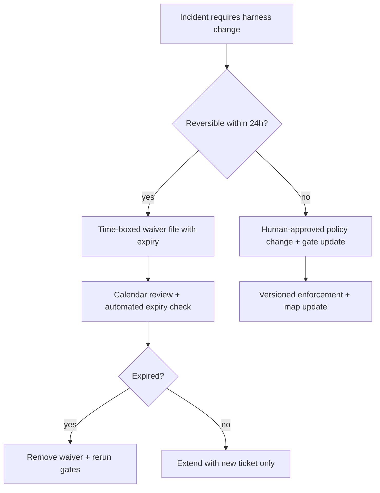
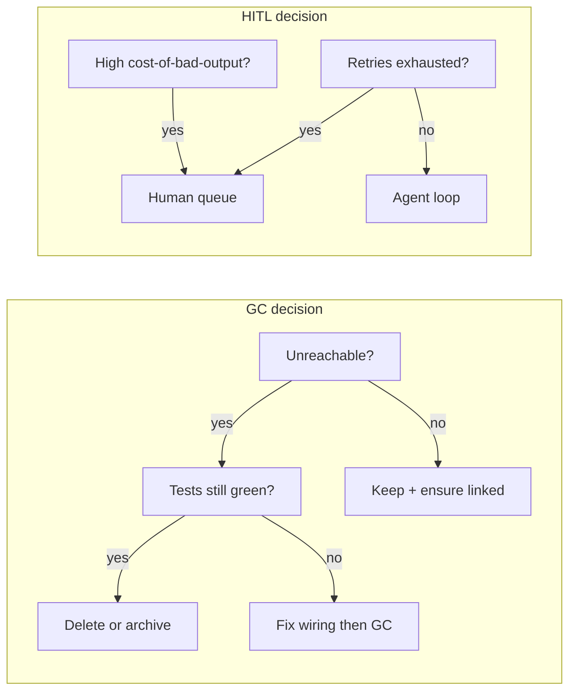

> **Complexity**: [COMPLEX]
>
> **Time to Complete**: ~50 minutes
>
> **Prerequisites**: [Guardrails, Gates, and Agent-Legible Apps](module-3.2-guardrails-gates-and-agent-legible-apps/); [Harness Fundamentals — Layers and System of Record](module-3.1-harness-fundamentals-layers-and-system-of-record/) for tier vocabulary; comfort with Git, CI labels, and scheduled maintenance jobs.

---

## Learning Outcomes

By the end of this module, you will be able to:

- **Diagnose** harness decay by separating instruction debt from enforcement debt and tracing which layer failed when agents "follow the rules" yet still ship unsafe artifacts.
- **Implement** a continuous garbage-collection cadence for maps, prompt templates, and validation scripts so obsolete policy cannot masquerade as authority.
- **Design** a human-in-the-loop escalation matrix keyed to retry limits, reversibility, and cost-of-bad-output rather than ad hoc pager fatigue.
- **Compare** merge philosophies for AI-scale throughput, routing deterministic low-risk changes through automation while reserving high-risk paths for explicit human confirmation.
- **Evaluate** whether policy freshness, enforcement freshness, and recovery freshness clocks are synchronized—or which clock drift is causing silent regressions.

## Why This Module Matters

**Hypothetical scenario:** Six months after adopting agent-assisted development, a platform team celebrates merge velocity: median time-to-merge dropped from two days to four hours, and agents now open thirty pull requests per week. Then a production incident traces to a manifest that violates a security rule everyone thought was enforced. The postmortem finds three root causes that no single bug fix addresses: an `AGENTS.md` map still points at a retired policy path, a pre-incident exception file grants a permanent waiver for a "temporary" outage, and a validation script was disabled because it conflicted with a new linter—then never re-enabled. The agents did not go rogue; the harness rotted while the team optimized for speed.

This module closes the Harness triplet. [Harness Fundamentals — Layers and System of Record](module-3.1-harness-fundamentals-layers-and-system-of-record/) taught you where policy lives and how to build a system of record. [Guardrails, Gates, and Agent-Legible Apps](module-3.2-guardrails-gates-and-agent-legible-apps/) taught you how mechanical rails reject bad artifacts and return structured remediation. Operating the harness is the day-two discipline: pruning stale instructions, retiring exceptions, scheduling doc-gardening, tuning merge paths, and keeping three freshness clocks aligned so yesterday's emergency does not become tomorrow's default behavior.

If you arrived from [Dynamic Context Orchestration](../module-2.4-dynamic-context-orchestration/) in the Context arc, you already manage per-turn evidence and session loops. Harness operations extend that mindset to **durable** control artifacts: the files and hooks that survive session boundaries. Legacy introductions in [Harness Engineering](../../ai-native-work/module-2.1-harness-engineering/) and fleet orchestration in [Orchestrating Fleets: Symphony](../../ai-native-work/module-2.2-orchestrating-fleets-symphony/) are not repeated here; Wave 4 assumes you accept harnesses as necessary and focuses on **lifecycle governance** instead.

The economic argument is blunt. Instruction debt inflates token spend—agents re-read contradictory prose every turn. Enforcement debt inflates incident spend—bad artifacts escape because gates were bypassed, silenced, or never wired. Doc-gardening costs calendar time, but it is cheaper than re-litigating the same policy argument in every agent session. Teams that skip operating discipline often discover the bill only when an exception registry outlives the engineers who wrote it and no one remembers which waiver is still valid.

Operating the harness is also how you preserve the investment from modules 3.1 and 3.2. A beautiful three-tier map and a strict schema gate both decay without owners. The map rots when links break; the gate rots when exceptions bypass it. Neither decay shows up in unit tests unless you write maintenance tests—link checks, expiry checks, hook invocation checks—that treat the harness itself as production code. That mindset shift is the core of day-two operations: **the harness is a service you run**, not a document you published once.

Cross-functional alignment matters because instruction debt feels like "docs" and enforcement debt feels like "platform," yet both show up as "the agent failed." A single weekly harness review with docs, security, and developer productivity present prevents thrash. Docs wants clearer prose; security wants stricter gates; productivity wants faster merges. The three clocks give you an agenda that turns debates into measurements instead of taste arguments.

**Hypothetical scenario:** Your organization adopts a central agent gateway that injects platform defaults on every session. Project repos still maintain local maps. After three months, local maps reference gateway features that renamed, and gateway release notes reference repo hooks that moved. Neither team feels responsible because each thought the other was system of record. Operating discipline assigns **one written SoR table per integration point**—gateway owns runtime defaults, repo owns project enforcement, shared registry lists cross-links with version pins.

## Operational Decay: Instruction Debt Versus Enforcement Debt

Harness decay is not random entropy; it is the predictable outcome of high-throughput autonomous work on a static control plane. Two debt classes dominate postmortems, and conflating them sends remediation to the wrong owner. **Instruction debt** accumulates when prose policies multiply faster than anyone consolidates them: duplicate `AGENTS.md` pointers, forked prompt templates, onboarding docs that contradict enforcement scripts, and "helpful" comments agents treat as law. **Enforcement debt** accumulates when mechanical controls lag reality: hooks disabled during a firefight, CI jobs skipped for bot accounts, schema gates that no longer match the service API, or recovery runbooks that reference deleted scripts.

Instruction debt hurts first in observability. Agents appear compliant because they cite the right filenames while following the wrong paragraph. Enforcement debt hurts first in blast radius. Agents appear reckless while actually satisfying an outdated waiver file the map never mentioned. A useful diagnostic question after any agent failure is: **did the wrong bytes leave the machine, or did the right bytes leave while the policy was wrong?** The first case is enforcement failure; the second is instruction failure. Mixed cases are common—an obsolete exception file is instruction debt that masquerades as enforcement because it lives beside hooks.

```text
+------------------------------------------------------------------+
|              Harness decay diagnostic (two debt classes)           |
+---------------------------+--------------------------------------+
| Symptom                   | Likely debt class                    |
+---------------------------+--------------------------------------+
| Agent quotes policy text  | Instruction debt (stale / duplicate) |
| Gate never ran            | Enforcement debt (hook / CI gap)     |
| Gate ran, waiver applied  | Exception drift (instruction + ops)  |
| Map link 404              | Instruction debt (broken routing)    |
| Schema pass, unsafe apply | Enforcement debt (weak invariant)    |
+---------------------------+--------------------------------------+
```

Google's SRE framing for **toil**—manual, repetitive, automatable work that does not persist enduringly—maps cleanly onto harness operations. Writing a new paragraph in `AGENTS.md` after every incident is toil when the lesson should become a versioned gate. Disabling a gate to unblock agents is toil when nobody files a ticket to restore it. The Twelve-Factor **dev/prod parity** principle pushes the same idea for environments: if agents validate against a harness shape that production CI does not enforce, you have built a parity debt that will surface as "works in the agent sandbox, fails in org policy." Operating the harness means converting recurring human reminders into durable automation, then **garbage-collecting** the reminders that lost the race.

**Pause and predict:** Your repository has twelve markdown files mentioning "never force-push to main," but only branch protection enforces the rule. Estimate how many agent turns per week re-read those twelve files. Before continuing, decide which single canonical path should remain and what you would delete in the first GC pass.

Instruction debt also shows up as **competing clocks**. Policy authors update a doc on Monday; enforcement engineers update a schema on Thursday; nobody updates the map that connects them. Agents inherit whichever file they open first. Enforcement debt shows up as **competing owners**: platform hooks enforce secret scanning while a package-level script disables the hook for speed.

Both debts worsen when teams measure success by merge count alone. Throughput metrics without freshness metrics reward skipping maintenance. A practical weekly review asks two numbers: how many new policy sentences landed in the repo, and how many new enforced checks landed beside them. When the first number grows faster for three weeks straight, instruction debt is winning. When the second number stalls while incidents cite "process drift," enforcement debt is winning. Publishing those numbers beside merge velocity prevents the leadership team from optimizing the wrong curve.

Instruction debt also compounds across **model generations**. A prompt written for a tool-poor model becomes dangerous noise for a tool-rich model that no longer needs step-by-step persuasion but still obeys bold imperative sentences. Gardening therefore includes **model-fit review**: delete instructions that duplicate tool schemas, and move safety constraints into gates the model cannot negotiate. Anthropic's prompt-engineering overview emphasizes evaluating outputs against criteria; harness operations extend that idea to evaluating **artifacts** against repository criteria on every merge, not only on demo prompts.

The Pragmatic Programmer's **software entropy** metaphor is not nostalgia—it is an operational model. Small inconsistencies in harness files signal that larger inconsistencies are tolerated, which encourages more exceptions and more silent disables. Broken-windows dynamics are especially dangerous in agent-heavy repos because models pattern-match on whatever is present, not on whatever was intended. A single `TEMPORARY: skip manifest gate` comment trains the fleet on the exception path until someone promotes it to default behavior without noticing.

Teams sometimes run **instruction audits** separate from **enforcement audits** because the skills differ. Instruction audits ask: for each task class, which files can an agent load in the first minute, and do they agree? Enforcement audits ask: for each merge path, which checks ran, and could anything skip them? Running only one audit type gives false confidence. Combined audits often reveal that enforcement is sound while instruction is chaotic—exactly the pattern that produces "CI passed but the agent did the wrong thing socially." Quantify instruction debt by counting authoritative sentences about the same invariant. Quantify enforcement debt by counting bypass mechanisms: `--no-verify`, emergency labels, bot accounts without checks, optional CI jobs. The operating goal is not zero bypass—it is **counted, expiring bypasses** with owners.

| Debt type | Primary artifact | Typical owner | First fix |
|---|---|---|---|
| Instruction | maps, prompts, waivers | docs/platform | consolidate + GC |
| Enforcement | hooks, CI, admission | security/platform | restore + test |
| Mixed | exception registry | incident commander | expire + link |

## Exception Drift and the Temporary-Permanent Trap

Incident response for agent fleets introduces a failure mode traditional software rarely documents: **exception drift**. During an outage, someone adds a waiver file, relaxes a gate, or patches `AGENTS.md` with a bold "until Monday" note. The incident closes; the waiver remains. Six weeks later, an agent reads the waiver as standing policy and merges a change the original responders would have rejected. The trap is psychological as much as technical—temporary fixes feel virtuous in the moment because they restore service, yet they create invisible technical debt unless the harness has an **expiry contract**.

Treat every harness exception like a certificate: it must name an owner, a scope, a review date, and a removal condition. Scoped exceptions beat global ones. A waiver that applies only to `deploy/overlays/staging/` is easier to audit than a sentence in root `AGENTS.md` that agents interpret as org-wide permission. Exceptions should link to a ticket or incident identifier in your system of record, not to a chat thread. Chat is evidence; the repository is authority.



**Hypothetical scenario:** A database migration agent needs to bypass a manifest schema gate for twelve hours while an upstream field is renamed. The on-call engineer adds `exceptions/INC-2041-waiver.yaml` but forgets the expiry. New agents later read the file, apply the bypass to unrelated services, and the fleet learns that "INC-2041" means optional security context. The fix is not a stricter prompt—it is operational hygiene: automated expiry checks in CI, a map entry pointing to the exception registry, and a postmortem action that either promotes the change into real policy or deletes the waiver.

Postmortem culture from mature SRE organizations emphasizes blameless learning **and** tracked follow-ups. Atlassian's incident postmortem guidance and Google SRE's postmortem chapters both stress that action items without owners become folklore. For harness operations, the non-negotiable action item is: **either merge the exception into enforced policy or delete it before the next sprint ends.** If neither happens, the exception was not temporary—it was an alternate policy channel.

Exception drift interacts with instruction debt when waivers live in prose. "Ignore the coverage gate for hotfix branches" in a README is an exception without metadata. Agents cannot evaluate expiry; humans forget context. Move exceptions into structured files your GC scripts can parse: `expires_on`, `applies_to`, `owner`, `incident_ref`. Then wire CI to fail when `expires_on` is in the past. That converts a social promise into a failing build—the same language agents already understand from module 3.2 remediation JSON.

Fleet-scale incidents multiply exception drift because parallel agents read the same waiver concurrently. One agent extends the waiver "just for this PR" while another interprets the extension as org policy. Serial human review of exceptions does not scale; **machine-readable scope** scales. Require `applies_to` globs narrow enough that a waiver cannot cover the entire repository. Pair with CODEOWNERS or path protections so exception files need harness-owner approval. The combination preserves incident velocity without surrendering the map.

Registries beat scattered files. A single `exceptions/README.md` index that lists active waivers, sorted by expiry, gives gardeners one choke point. When the index diverges from filesystem reality, CI should fail—same discipline as lockfile integrity. Google SRE postmortem culture expects action items to close; harness operations expects **waiver items** to close with equal rigor.

**Active learning prompt:** Open your team's last three incident docs. Highlight every sentence that changed agent or CI behavior. For each, mark whether it is still true, expired, or promoted into enforcement. How many would fail an automated expiry check today?

## Continuous Garbage Collection for Harness Artifacts

Garbage collection in managed runtimes reclaims unreachable objects. **Harness GC** reclaims unreachable **policy objects**: dead links in `AGENTS.md`, prompt templates superseded by skills, validation scripts for retired APIs, duplicate hooks that enforce the same invariant twice with different error messages, and map entries pointing at deleted paths. Without GC, the harness becomes a museum where agents tour obsolete exhibits and pick whichever interpretation fits the task.

GC is not a one-time spring cleaning. It is a continuous process with an explicit **reachability model**. Start from the system of record defined in module 3.1: the map file, enforcement entrypoints, and active CI jobs. Mark every other policy artifact as suspect until linked from those roots. If a prompt template is not referenced by the map, a skill, or a gate, it is unreachable. If a script is not invoked by pre-commit, CI, or a documented Makefile target, it is unreachable. Unreachable does not always mean delete—sometimes it means archive—but it always means **remove from agent-default traversal**.

```text
Harness GC reachability (simplified)
====================================
ROOTS: AGENTS.md / CLAUDE.md  -->  enforcement hooks / CI jobs
          |                              |
          v                              v
    advisory docs (linked)         validation scripts (invoked)
          |                              |
          X  unlinked markdown           X  orphan .sh / stale schema
```

Tooling accelerates GC without replacing judgment. **Knip**-style dead-code and unused-export detection for JavaScript/TypeScript monorepos finds scripts and config no importer references. **pre-commit** hook definitions rot when repositories rename directories but `.pre-commit-config.yaml` still lists old paths; the framework documents autoupdate flows so hook versions and repo URLs stay current. **Renovate** and **Dependabot** apply the same hygiene metaphor to dependencies: automated proposals with human merge gates. Harness GC extends that metaphor to **policy dependencies**—files that other files assume exist.

A practical GC pull request has four sections in the description: what was unreachable, what was deleted, what was relinked, and which integration tests prove enforcement still works. Agents can assist by generating inventories, but humans (or cross-family reviewers) must approve deletions because the model cannot know which prose is legally required. Never delete an artifact only because an agent said it looked unused; delete when reachability analysis and tests agree.

| GC target | Signal of staleness | Safe action |
|---|---|---|
| Map link | path 404 / moved | update or remove link |
| Prompt template | unreferenced + old date | archive outside default path |
| Validation script | CI not invoked | wire or delete |
| Duplicate rule | two gates, one invariant | merge messages |
| Exception file | past `expires_on` | delete + restore gate |

GC also includes **content deduplication**. When the same rule appears in six files, agents may follow the shortest file, not the strictest. Consolidate to one canonical enforcement path and replace duplicates with a single-line pointer: "See `policy/manifest-security.md`." The AGENTS.md open format explicitly encourages treating the map as living documentation that should evolve with the repository; large orgs maintain many `AGENTS.md` files, which makes **per-directory GC** mandatory, not optional.

GC cadence should match change velocity, not calendar nostalgia. A repo with five agent-merged PRs daily needs weekly reachability scans; a quarterly release train may garden monthly. The mistake is copying another team's schedule without measuring **policy churn**: commits touching `AGENTS.md`, `CLAUDE.md`, `.claude/rules/`, `scripts/*validate*`, or `exceptions/`. When churn spikes after a platform upgrade, run an out-of-band GC before raising concurrency. Knip and similar tools answer "what is unused in code"; harness GC answers "what is unused in **authority**." Combine both in the same gardening rotation so dead scripts do not keep enforcing obsolete APIs.

Agents accelerate inventory but must not own deletion authority. A sound workflow: agent generates `harness-gc-report.json` with candidates, human or harness-owner approves, CI proves integration tests, then merge. The report format mirrors module 3.2 remediation JSON—stable keys, one issue per line—so the next agent turn can consume results without parsing prose bullet lists. Store reports in CI artifacts, not in the default map path, or you recreate instruction debt inside the evidence channel.

**Pause and predict:** You find two pre-commit hooks that both ban secrets with different regexes and different error text. Will deleting one hook increase or decrease agent confusion? Write your prediction, then check whether both hooks are referenced from the map roots.

## Doc-Gardening as Scheduled Engineering Maintenance

Doc-gardening is the scheduled counterpart to reactive GC. Instead of waiting for a broken link to surface in an agent trace, the team calendars maintenance the same way it calendars dependency upgrades and certificate rotation. A doc-gardening sprint is not "write more docs"; it is **prune, reconcile, and re-link** under a time box with measurable outcomes: N broken map links fixed, M exceptions expired, K duplicate policies merged, integration test suite green.

Cron jobs and **systemd timers** are the boring technology that makes schedules real. A weekly timer that runs `scripts/harness-audit.sh` and opens a ticket when invariants fail is more reliable than a Slack reminder. The job should emit machine-readable output—JSON lines with `path`, `issue`, `severity`—so agents can ingest results in the next remediation loop. Human gardeners review the ticket; agents can propose diffs, but merges follow the risk routing you define later in this module.

Doc-gardening tasks belong in the same work-tracking system as feature work. Linear, GitHub Issues, or your orchestration capstone in module 4.1 all work; the critical property is **visibility**. Hidden harness debt is how teams accidentally ship a policy change and a contradictory waiver in the same sprint. Gardening issues should use a consistent label (`harness-gc`, `doc-garden`) so throughput dashboards do not hide maintenance load behind feature work.

Anthropic's guidance on long-running agent workflows and OpenAI's prompting cookbooks both emphasize iteration: system instructions change as tools change. Doc-gardening is how you prevent yesterday's iteration from colliding with today's toolchain. When a new MCP server arrives, the map must gain a pointer; when an old server leaves, the pointer must vanish. Prompt libraries without gardening become **prompt landfills**—models see every historical experiment on every task.

**Pause and predict:** If you moved doc-gardening from "when we have time" to a weekly 90-minute rotation with two engineers, which metric would move first: median agent turns per task, CI failure rate, or postmortem count? Defend your answer with which debt class you believe dominates today.

Good gardening checklists are finite. A strong checklist for a fifty-minute rotation: (1) run link checker against map roots, (2) list exception files past expiry, (3) diff enforcement scripts against CI job manifests, (4) sample three recent agent failures for debt class, (5) file tickets for anything not fixable in the rotation. Checklists beat ad hoc zeal because they make the work teachable—new teammates can garden without oral tradition.

Gardening also includes **tone and size hygiene** for agent-facing prose. Maps that grow past a few screens become their own form of instruction debt—agents skim the top, miss the bottom, and invent shortcuts. Prefer links to focused policy files over pasting entire runbooks into `AGENTS.md`. When a section has not changed in six months but enforcement moved twice, the section is probably lying. Replace it with a pointer and let the canonical policy file carry detail.

SRE eliminating-toil guidance applies to gardeners themselves: if you manually click through forty broken links each week, automate the scan and spend human time only on ambiguous removals. systemd timers and CI schedules are interchangeable for many teams; choose whichever your platform team already operates. The operational outcome matters more than the scheduler brand—missed runs are enforcement debt for maintenance.

## Merge Philosophy at AI Scale: Velocity Without Blindness

High agent throughput breaks merge philosophies designed for human-only teams. A human team might tolerate "every PR reviewed by two humans" because volume is low. A fleet opening dozens of PRs daily needs **risk-tiered merge paths**: deterministic low-risk changes flow through automation; high-risk changes require human confirmation; ambiguous changes escalate with evidence packages (diff summaries, gate logs, objective completion checks—previewed in module 4.1).

Low-risk paths are not "unreviewed." They are reviewed by **machines first** with narrow scope: formatting, generated lockfiles within allowlists, documentation-only diffs that touch no enforcement roots, or dependency bumps where CI proves invariants. The Twelve-Factor emphasis on parity matters here—if the low-risk path skips a gate that main requires, you have created a bypass channel agents will discover. High-risk paths include production manifest changes, authz policy, data retention rules, and anything touching exception registries.

| Change class | Typical signals | Suggested path |
|---|---|---|
| Docs-only, no map | no enforcement roots touched | bot merge after link CI |
| Tooling bump | lockfile + green tests | bot merge + audit log |
| Harness map | `AGENTS.md` / hooks | human + agent evidence |
| Security policy | schema / OPA / secrets | human required |
| Post-incident waiver | `exceptions/` | human + expiry enforced |

GitHub's Dependabot documentation describes automated version proposals with maintainer control; harness merge philosophy mirrors that split—automation proposes, policy decides. Renovate's configuration options show how schedules, grouping, and automerge can be constrained per package ecosystem. Apply the same pattern to harness files: automerge doc fixes; never automerge exception creation.

**Hypothetical scenario:** A bot account can merge doc-only PRs in under five minutes, but agents start labeling manifest edits as "docs" because the label unlocks speed. The remediation is not revoking bots—it is **label integrity**: CI verifies path classes, rejects misleading labels, and routes violations to the high-risk queue. Agents learn faster from deterministic label rejection than from prose scolding.

Throughput without freshness measurement is vanity. Track **merge latency** alongside **policy age** (last commit date per canonical policy file), **enforcement age** (last green run per gate), and **recovery age** (last successful restore drill). When latency improves while ages stagnate, you are borrowing speed against future incidents.

Branch protection rules are merge philosophy made concrete. Require status checks that include harness-audit jobs, not only unit tests. Bot accounts need identities distinct from humans so reviewers can filter "agent proposed, machine verified, human approved" in the event log. When bots and humans share the same identity, postmortems cannot answer who accepted risk. OpenAI's cookbook guidance on iterative prompting is not a substitute for branch protections—iteration belongs in development branches, not in bypassing checks on main.

Dependabot-style dependency PRs teach another pattern: **group low-risk changes** to reduce reviewer load while keeping high-risk changes isolated. Harness GC PRs benefit from the same grouping—one PR that only removes expired waivers is easier to review than a PR that also refactors enforcement scripts. Mixed-purpose PRs train reviewers to skim, which is when exception drift returns.

**Hypothetical scenario:** Leadership mandates "zero human review on docs" to match competitor velocity. Within a month, agents edit `AGENTS.md` alongside typo fixes in the same PR, and enforcement maps drift because the path-class checker was never required. The operational fix is split policies: docs-only automerge with path verification, map changes always human-reviewed, and a dashboard proving the split is honored.

## Human-in-the-Loop Escalation and the Three Operational Clocks

Human-in-the-loop (HITL) is not "humans review everything." It is a **capacity-aware escalation system** that spends human attention where marginal value is highest. Module 3.2 placed mechanical gates before semantic judges; operations places **humans after** agents exhaust bounded mechanical retries. The escalation matrix defines when an agent must stop, what evidence it attaches, and which role may resume work.

Design escalation thresholds with three inputs: **retry budget**, **reversibility**, and **cost-of-bad-output**. Retry budget prevents infinite remediation loops that burn tokens and hide root causes. Reversibility tells you whether a failed gate can be rolled back without customer impact. Cost-of-bad-output includes regulatory exposure, revenue loss, and recovery time—not just whether someone is annoyed on Slack.

```text
Escalation matrix (example thresholds)
======================================
Retries   Reversibility   Cost        Action
-------------------------------------------------
0-2       high            low         agent loop
3-5       high            medium      senior agent + rubric
any       low             any         human required
any       any             high        human + freeze automerge
```

PagerDuty's incident response material and Atlassian's postmortem practice both assume severities and roles. Translate that into harness language: a **severity-1 harness drift** might mean enforcement freshness exceeded seven days on secret scanning; a **severity-2** might mean map links broke but gates still run. Escalation routes to the on-call **harness owner**, not whichever engineer merged last—ownership must be in the map file.

The **three operational clocks** synchronize harness health:

1. **Policy freshness** — canonical prose and maps reflect current intent. Measured by review dates, gardening commits, and absence of contradictory duplicates.
2. **Enforcement freshness** — hooks and CI jobs match policy and run on every relevant path. Measured by gate success telemetry, not by whether a file exists.
3. **Recovery freshness** — rollbacks, restores, and incident playbooks were exercised recently. Measured by drill results, not by doc word count.

When clocks diverge, predictable failures appear. Fresh policy with stale enforcement yields "everyone agreed but CI never checked." Fresh enforcement with stale recovery yields "we blocked the bad merge but took hours to restore service." Stale policy with fresh enforcement yields "CI passes while violating the spirit of the rule." Operating the harness means publishing a single dashboard or weekly note that states all three ages; module 4.1 will attach ticket-level orchestration to these clocks.

Recovery freshness is the clock teams skip until it hurts. A restore drill proves backups, rollback scripts, and incident runbooks still match production—not that the harness docs mention them. Drill outputs should feed gardening: if rollback took ninety minutes because a map link pointed to a deleted script, that is harness debt with measurable cost. PagerDuty incident response guidance stresses defined roles; harness escalation should name **harness owner** the same way incident command names communications lead.

Escalation thresholds should be versioned like APIs. When retry limits change from five to three, announce it in the map file with a date so agents and humans do not argue from memory. Pair threshold changes with a short table in `policy/merge-routing.md` or equivalent so module 4.1 orchestration can read stable identifiers. Thresholds without documentation become folklore within two sprints.

Cost-of-bad-output is not only customer impact. It includes audit labor, regulatory notification, and the opportunity cost of freezing other agent work while one bad merge is reverted. OWASP LLM09 overreliance warns that humans trust fluent model answers; harness operations warns that humans trust **green CI** when CI no longer measures the right threats. Re-align checks before you re-align prompts.

Symphony-style fleet orchestration (module 4.1) will add ticket states and workpads; operating the harness prepares you by making repository clocks honest first. Otherwise orchestration merely moves stale policy faster. The handoff criterion is simple: policy, enforcement, and recovery ages are all under agreed SLAs, and exception registries have zero expired entries.

OWASP's overreliance risk for LLM applications is relevant: teams assume the model read the right doc. Operations assumes the **repository** still points to the right doc. Claude Code best-practices and Anthropic prompt-engineering docs describe iterative refinement; your job is to ensure iteration does not fork into twelve unofficial sources. One controlled iteration channel beats twelve heroic prompts.

**Active learning prompt:** For your current project, estimate the age in days of each clock. Which drift would hurt you first if an agent fleet doubled in size next month? Write one gardening action and one enforcement action to close that gap.

### Connecting the Harness Triplet for Day-Two Work

Module 3.1 gave you stable **addresses** for policy—where to look. Module 3.2 gave you **rails**—what may execute. Module 3.3 gives you **custody**—who keeps addresses and rails honest over time. Custody is not a role title; it is a set of recurring actions: expire exceptions, delete unreachable prompts, align CI with maps, route merges by risk, and escalate when retries exhaust. Teams that hire a "prompt engineer" but not a "harness owner" often wonder why quality regresses after the first successful pilot; the pilot had temporary human custody, not institutional custody.

Day-two work also includes **teaching agents how to maintain the harness without widening blast radius**. Agents may propose GC diffs, but merges to map roots and enforcement scripts should stay behind human or harness-owner review. Agents may run `harness-audit.sh`, but the audit rules must be enforced in CI so agents cannot silence them. The pattern is the same as module 3.2: agents operate inside mechanical boundaries; humans move the boundaries deliberately.

Finally, operating discipline prepares the Symphony capstone. Ticket-centric orchestration multiplies the number of concurrent harness states—one per workspace clone—so drift that was annoying at single-repo scale becomes catastrophic at fleet scale. If you cannot keep one repository's three clocks synchronized, adding a scheduler will schedule chaos faster. Fix custody locally, then export the same expiry, GC, and merge-routing ideas into `WORKFLOW.md` hooks in module 4.1.

A useful maturity ladder helps teams pace investment. Progression is measured by clocks and audits, not by tool purchases or agent brand names. **Level 1** teams have a map and hooks but no gardening schedule. **Level 2** teams run scheduled audits and track clock ages. **Level 3** teams tie merge routing, exception expiry, and escalation thresholds into CI with JSON evidence agents can consume. **Level 4** teams connect those signals to fleet orchestration in module 4.1. Skipping levels sounds efficient; it usually means buying fleet tooling before the repository can tell the truth about its own policy state. Use the ladder in planning conversations so stakeholders see why gardening time is not optional overhead for agent safety.

## Patterns & Anti-Patterns

| Pattern | When to use | Why it works | Scaling note |
|---|---|---|---|
| Time-boxed exception files | Incidents need temporary bypass | Expiry is machine-checkable | Pair with CI `expires_on` lint |
| Weekly harness audit job | Any agent-heavy repo | Finds drift before merges | Output JSON for agent consumption |
| Single map root per repo | Multi-agent gateways | Cuts ambiguous traversal | Subprojects get nested `AGENTS.md` |
| Risk-tiered automerge | High PR volume from bots | Protects humans for true risk | Requires path-class CI |
| Blameless postmortem → GC ticket | After harness-related incidents | Closes exception drift | Ticket must cite reachable paths |

| Anti-pattern | Why teams adopt it | Damage | Better alternative |
|---|---|---|---|
| Prompt apology loops | Faster than fixing gates | Token spend, false confidence | Mechanical remediation JSON |
| Global "TEMPORARY" notes | Incident urgency | Becomes permanent policy | Scoped waiver files + expiry |
| Disable hook, merge, forget | Pressure to ship | Enforcement debt | Time-boxed disable ticket |
| Map everything in root `AGENTS.md` | Fear agents won't find rules | Context bloat, stale links | Progressive disclosure per directory |
| Humans review every bot PR | Safety theater | Reviewer burnout | Tiered paths + evidence packages |

| Anti-pattern | Why teams adopt it | Damage | Better alternative |
|---|---|---|---|
| Metric: merges per day only | Executives like throughput | Hides decay | Add freshness + incident rate |
| Copy-paste postmortem prose into map | Fast documentation | Instruction debt | Link incident; promote or delete |
| Agent-generated policy without review | Automation enthusiasm | Wrong authority | Human merge on map changes |

Sustainable harness operations treat **maintenance PRs** as first-class velocity, not as cleanup shame. A team that merges fifteen agent feature PRs and zero gardening PRs per month is borrowing time. Cap agent concurrency until at least one gardening PR lands per sprint, or automate gardening outputs so they ride along with enforcement changes. The cap sounds harsh; it is cheaper than explaining to customers why a six-month-old waiver still governs production.

## Decision Framework

Use this matrix when deciding **garbage-collect now**, **keep but link**, or **escalate to human**:

| Question | If yes | Action |
|---|---|---|
| Is the artifact unreachable from map/enforcement roots? | | GC candidate after test proof |
| Does deletion break CI or integration tests? | | Keep; fix tests first |
| Is it an exception past expiry? | | Delete waiver; restore gates |
| Does it duplicate an enforced invariant? | | Merge text; keep one gate |
| Would automerge touch enforcement roots? | | Human path required |
| Have agents failed 3+ times on same gate? | | Escalate with logs + diff |
| Is policy newer than enforcement? | | Freeze features; fix gates |
| Is recovery untested > 90 days? | | Schedule drill before scale |



When clocks disagree, prioritize **enforcement freshness** before expanding agent concurrency. Running more agents against stale gates scales incidents, not learning. When enforcement and policy are fresh but recovery is stale, prioritize a drill before the next exception-heavy release.

Document clock SLAs the way you document API availability. Example starter targets: policy files reviewed within thirty days of last enforcement change; enforcement jobs green on every default branch push; recovery drill succeeded within the last quarter. SLAs can be tighter for regulated services. The point is not the exact numbers—it is that violations become visible before an agent fleet scales. Leadership can then fund gardening time instead of interpreting incident spikes as "model quality regressions."

Evidence packages for human escalation should be boring and small: gate log excerpt, diff stat, map path touched, exception files touched, retry count, estimated reversibility. Module 4.1 will attach those packages to tickets; module 3.3 insists the repository already produces the ingredients. Without ingredients, humans re-run the agent mentally—expensive and inconsistent.

## Did You Know?

- Google's SRE book defines **toil** as manual, repetitive, automatable work that lacks enduring value—and recommends measuring toil percentage so teams can cap operational drag before it consumes engineering capacity.
- The AGENTS.md open format is stewarded by the Agentic AI Foundation under the Linux Foundation; major coding-agent products adopted the convention so repositories can ship agent guidance without proprietary sidecar formats.
- pre-commit's documented autoupdate workflow exists because hook repositories move and tag new versions; teams that never autoupdate accumulate silent hook drift similar to unpinned dependencies.
- Dependabot and Renovate both support **scheduled** update proposals—harness teams borrowed that model for weekly doc-gardening windows so maintenance competes fairly with feature work in sprint planning.

## Common Mistakes

| Mistake | Why It Happens | How to Fix It |
|---|---|---|
| Treating prompts as enforcement | Fast to edit in chat | Move invariant to gate; shorten prompt to pointer |
| Exceptions without expiry | Incident adrenaline | Add `expires_on` + CI failure when past |
| GC without running tests | Deadline pressure | Require green integration suite on GC PR |
| One global `AGENTS.md` novel | Fear of invisible rules | Split per package; link from map roots |
| Disabling hooks "temporarily" | Unblock merge | Ticket + auto-remind + restore date |
| Measuring only merge speed | Visible executive metric | Publish three clock ages weekly |
| Humans review all bot PRs | Distrust after one incident | Tier paths; escalate with evidence |
| Stale map links after moves | Refactors skip docs | Link checker in gardening job |

## Quiz

<details>
<summary>Scenario: Agents cite a retired CONTRIBUTING.md while CI enforces a newer policy file. Post-merge incidents mention "the agent knew the rule." Which debt class dominates, and what is the first fix?</summary>

Instruction debt dominates: multiple prose sources disagree while enforcement follows the newer file. Agents pattern-match on retired text they discover via search. First fix: remove or redirect retired CONTRIBUTING.md from all maps, link only the canonical policy path, and run a gardening PR that proves link reachability. Do not add a longer prompt—shrink traversal to one authority.
</details>

<details>
<summary>Scenario: INC-1988 waiver file expired three weeks ago, but agents still bypass the manifest gate. CI is green. What failed—enforcement, policy, or recovery clock?</summary>

Enforcement freshness failed: either CI does not evaluate `expires_on`, the gate was disabled and not restored, or agents read the waiver without CI seeing it. Policy may be fresh while enforcement is stale. Add CI lint for expired waivers, delete the file, and rerun integration tests. Recovery clock may also be stale if nobody practiced restore after the incident.
</details>

<details>
<summary>Scenario: Your fleet merges doc-only PRs in minutes, but manifest-labeled PRs wait days. Recently a manifest change shipped with a "docs" label. Design one mechanical control.</summary>

Add a path-class verifier job that rejects the automerge label when diffs touch `deploy/`, `policy/`, or `exceptions/`. Emit remediation JSON listing allowed labels per path class. This is merge-philosophy integrity—machines enforce routing, not prompts.
</details>

<details>
<summary>Scenario: After doubling agent concurrency, token spend rose 40% but incidents rose 80%. Policy files were updated last week; hooks last quarter. Which clock drift explains the gap?</summary>

Enforcement freshness drift: policy outran gates, so agents consumed more tokens re-attempting actions that should have been blocked earlier—or re-read contradictory instructions while gates stayed stale. Synchronize clocks by updating hooks and schemas before raising concurrency.
</details>

<details>
<summary>Scenario: A gardener deletes an unreferenced prompt template; integration tests fail because a hidden CI job still sourced it. What process guardrail was missing?</summary>

GC without reachability analysis that includes CI job manifests. Require GC PRs to list test proof and run `git grep` plus CI config scan for the filename before deletion. Treat CI configs as map roots alongside `AGENTS.md`.
</details>

<details>
<summary>Scenario: On-call disables Shellcheck for agents during an outage. Two months later, unsafe shell returns. What exception practice would have prevented silent drift?</summary>

Time-boxed disable ticket with expiry, owner, and automated restoration. Never leave hooks disabled without a failing CI job that reminds the team daily. Pair with postmortem action: either restore Shellcheck or replace with an equivalent gate.
</details>

<details>
<summary>Scenario: Three operational clocks show policy age 5 days, enforcement age 60 days, recovery age 200 days. Leadership wants faster automerge. What do you recommend?</summary>

Decline faster automerge until enforcement and recovery clocks improve. Fresh policy with stale enforcement increases blast radius; stale recovery means incidents will last longer when automerge ships a bad change. Run a drill and refresh gates first.
</details>

<details>
<summary>Scenario: An agent opens a PR that only updates `AGENTS.md` map links after gardening. A reviewer asks for human review despite green CI. Apply the escalation matrix—should this be low-risk automerge?</summary>

Map changes are harness-policy changes: they affect every future agent traversal. Route to human review with a short evidence package (link checker output, diff of removed paths). Do not classify as docs-only low-risk unless your policy explicitly defines map edits as advisory-only—which is rare.
</details>

## Hands-On Exercise: Harness Doc-Gardening Audit Lab

You will audit a synthetic repository with conflicting policies, stale incident exceptions, and broken map targets—then prune obsolete artifacts and repair the harness map without breaking integration tests. The lab mirrors exception drift and instruction debt called out in the Stage-0 brief. Treat the lab like a production gardening rotation: measure before delete, run integration tests after every destructive change, and document merge routing when you finish. The skills transfer directly to real repos where `AGENTS.md` grew faster than enforcement and where incident waivers outlived their owners.

### Setup

Create an isolated working copy (do not run inside the KubeDojo repo):

```bash
LAB_ROOT="${TMPDIR:-/tmp}/harness-gc-lab-$$"
mkdir -p "$LAB_ROOT"
cd "$LAB_ROOT" || exit 1

# Scaffold synthetic repo
mkdir -p policy exceptions scripts .github/workflows deploy/overlays/staging

cat > AGENTS.md <<'EOF'
# Agent map (synthetic lab)

## Authority roots
- Enforcement entry: `scripts/validate_manifests.sh`
- Policy canon: `policy/manifest-security.md`
- Exceptions registry: `exceptions/README.md`

## Stale / conflicting pointers (intentional bugs)
- Also see `docs/RETIRED-contributing.md` for branch rules
- Incident bypass: `exceptions/INC-2099-waiver.yaml` (still linked)
- Old template: `prompts/legacy-deploy.txt`
EOF

cat > policy/manifest-security.md <<'EOF'
# Manifest security (canonical)

Required: `securityContext.runAsNonRoot: true` on all Deployments.
EOF

cat > docs/RETIRED-contributing.md <<'EOF'
# RETIRED — do not use

Agents may skip securityContext on hotfix branches.
EOF

cat > exceptions/INC-2099-waiver.yaml <<'EOF'
incident_ref: INC-2099
owner: oncall@example.com
expires_on: 2024-06-01
applies_to: deploy/overlays/staging/
action: skip securityContext check in validate_manifests.sh
EOF

cat > exceptions/README.md <<'EOF'
# Exceptions registry

All waivers must include expires_on. CI should reject past dates.
EOF

cat > prompts/legacy-deploy.txt <<'EOF'
Deploy without securityContext when rushing.
EOF

cat > scripts/validate_manifests.sh <<'EOF'
#!/usr/bin/env bash
set -euo pipefail
WAIVER="exceptions/INC-2099-waiver.yaml"
if [[ -f "$WAIVER" ]]; then
  exp=$(grep expires_on "$WAIVER" | awk '{print $2}')
  today=$(date +%F)
  if [[ "$today" > "$exp" ]]; then
    echo '{"ok":false,"code":"WAIVER_EXPIRED","path":"'"$WAIVER"'"}'
    exit 1
  fi
  echo '{"ok":true,"skipped":"securityContext","reason":"active waiver"}'
  exit 0
fi
grep -q runAsNonRoot deploy/overlays/staging/deployment.yaml || {
  echo '{"ok":false,"code":"MISSING_RUN_AS_NON_ROOT"}'
  exit 1
}
echo '{"ok":true}'
EOF
chmod +x scripts/validate_manifests.sh

cat > deploy/overlays/staging/deployment.yaml <<'EOF'
apiVersion: apps/v1
kind: Deployment
metadata:
  name: demo
spec:
  template:
    spec:
      containers:
        - name: app
          image: demo:1.0
EOF

cat > Makefile <<'EOF'
.PHONY: test-integration validate-manifests
test-integration: validate-manifests
validate-manifests:
	./scripts/validate_manifests.sh
EOF

cat > .github/workflows/integration.yml <<'EOF'
name: integration
on: [push]
jobs:
  test:
    runs-on: ubuntu-latest
    steps:
      - uses: actions/checkout@v4
      - run: make test-integration
EOF

echo "Lab created at $LAB_ROOT"
```

### Task 1 — Classify debt

Inventory `AGENTS.md`, `docs/RETIRED-contributing.md`, `exceptions/INC-2099-waiver.yaml`, and `prompts/legacy-deploy.txt`. Label each artifact as instruction debt, enforcement debt, or mixed. Record which clock (policy, enforcement, recovery) each item affects.

<details>
<summary>Solution</summary>

`docs/RETIRED-contributing.md` and `prompts/legacy-deploy.txt` are instruction debt—they contradict canonical policy without mechanical effect. `INC-2099-waiver.yaml` is mixed: instruction surface plus enforcement behavior because the script reads it. `AGENTS.md` stale links are instruction debt breaking policy freshness. Enforcement debt appears if CI never fails on expired waivers (the script implements expiry, but the map still advertises the waiver as active guidance).
</details>

### Task 2 — Map reachability audit

List files reachable from roots (`AGENTS.md`, `Makefile`, workflow). Mark unreachable artifacts. Propose deletions or relinks before editing.

<details>
<summary>Solution</summary>

Reachable: `policy/manifest-security.md`, `scripts/validate_manifests.sh`, `exceptions/README.md`, staging manifest. Unreachable by default: `prompts/legacy-deploy.txt`, `docs/RETIRED-contributing.md` (linked only as stale pointers). `INC-2099-waiver.yaml` is reachable via script but should not remain linked in `AGENTS.md` after expiry.
</details>

### Task 3 — Expire exception and restore enforcement

Remove or archive `exceptions/INC-2099-waiver.yaml`, update `AGENTS.md` to stop advertising it, and fix `deploy/overlays/staging/deployment.yaml` to satisfy `runAsNonRoot: true`. Run `make test-integration` until JSON output shows `{"ok":true}` without skip.

<details>
<summary>Solution</summary>

Delete the waiver file, add under container spec: `securityContext: { runAsNonRoot: true }`, remove stale links from `AGENTS.md`, rerun `make test-integration`. Expect `{"ok":true}` without `"skipped":"securityContext"`.
</details>

### Task 4 — Garbage-collect instruction debt

Delete `docs/RETIRED-contributing.md` and `prompts/legacy-deploy.txt`. Replace stale pointers in `AGENTS.md` with a single canonical link to `policy/manifest-security.md`. Run `grep -R "RETIRED-contributing\|legacy-deploy" .` and confirm zero hits.

<details>
<summary>Solution</summary>

After deletion, `AGENTS.md` should list only canonical paths. Optional: add `scripts/harness-audit.sh` that fails on `RETIRED` in filenames. grep should return no matches.
</details>

### Task 5 — Add gardening automation stub

Create `scripts/harness-audit.sh` that emits JSON lines for broken map links and expired exceptions. Wire `make harness-audit` target. Run it once and capture output.

<details>
<summary>Solution</summary>

Example stub checks: if `grep -q RETIRED AGENTS.md`; if waiver exists and `date` > `expires_on`; if `legacy-deploy` referenced. Emit `{"path":"AGENTS.md","issue":"stale_link"}` per finding. `make harness-audit` should exit non-zero when issues remain.
</details>

### Task 6 — Document merge routing

Add `policy/merge-routing.md` describing low-risk (docs-only outside map), medium (policy prose), and high-risk (exceptions, enforcement scripts, deploy manifests). Tie each class to human vs bot merge in two paragraphs.

<details>
<summary>Solution</summary>

Docs-only outside enforcement roots may use automerge after link CI. Map, exceptions, and `scripts/*` require human review with harness-audit output attached. Manifest changes always high-risk with integration green required.
</details>

### Success checklist

- [ ] Debt classification written for four intentional stale artifacts
- [ ] Reachability audit lists unreachable files before deletion
- [ ] Expired waiver removed and `make test-integration` passes without skip
- [ ] `grep` shows no `RETIRED-contributing` or `legacy-deploy` references
- [ ] `scripts/harness-audit.sh` exists and `make harness-audit` runs
- [ ] `policy/merge-routing.md` defines three risk tiers with human/bot rules

## Sources

- Twelve-Factor App, "Dev/prod parity": [https://12factor.net/dev-prod-parity](https://12factor.net/dev-prod-parity)
- Google SRE Book, "Eliminating toil": [https://sre.google/sre-book/eliminating-toil/](https://sre.google/sre-book/eliminating-toil/)
- Google SRE Book, "Postmortem culture": [https://sre.google/sre-book/postmortem-culture/](https://sre.google/sre-book/postmortem-culture/)
- AGENTS.md open format: [https://agents.md/](https://agents.md/)
- pre-commit, "Introduction": [https://pre-commit.com/](https://pre-commit.com/)
- Renovate docs, "Configuration options": [https://docs.renovatebot.com/configuration-options/](https://docs.renovatebot.com/configuration-options/)
- GitHub Docs, "About Dependabot version updates": [https://docs.github.com/en/code-security/dependabot/dependabot-version-updates/about-dependabot-version-updates](https://docs.github.com/en/code-security/dependabot/dependabot-version-updates/about-dependabot-version-updates)
- Knip, "Unused files, dependencies, and exports": [https://knip.dev/](https://knip.dev/)
- systemd, "systemd.timer": [https://www.freedesktop.org/software/systemd/man/latest/systemd.timer.html](https://www.freedesktop.org/software/systemd/man/latest/systemd.timer.html)
- Atlassian, "Incident postmortems": [https://www.atlassian.com/incident-management/postmortem](https://www.atlassian.com/incident-management/postmortem)
- Pragmatic Programmer, 20th Anniversary Edition: [https://pragprog.com/titles/tpp20/the-pragmatic-programmer-20th-anniversary-edition/](https://pragprog.com/titles/tpp20/the-pragmatic-programmer-20th-anniversary-edition/)
- Anthropic, "Claude Code best practices": [https://www.anthropic.com/engineering/claude-code-best-practices](https://www.anthropic.com/engineering/claude-code-best-practices)
- Anthropic, "Prompt engineering overview": [https://docs.anthropic.com/en/docs/build-with-claude/prompt-engineering/overview](https://docs.anthropic.com/en/docs/build-with-claude/prompt-engineering/overview)
- OpenAI Cookbook, "GPT-4.1 prompting guide": [https://developers.openai.com/cookbook/examples/gpt4-1_prompting_guide](https://developers.openai.com/cookbook/examples/gpt4-1_prompting_guide)
- PagerDuty, "Incident response": [https://www.pagerduty.com/resources/learn/incident-response/](https://www.pagerduty.com/resources/learn/incident-response/)
- OWASP GenAI, "LLM09 Overreliance": [https://genai.owasp.org/llmrisk/llm09-overreliance/](https://genai.owasp.org/llmrisk/llm09-overreliance/)

## Next Module

Continue to [Symphony — Work Orchestration as Applied Harness](../module-4.1-symphony-work-orchestration-as-applied-harness/), where ticket-centric control planes, lifecycle hooks, and Proof-of-Work packages turn harness operations into fleet-scale orchestration without losing human review capacity.
