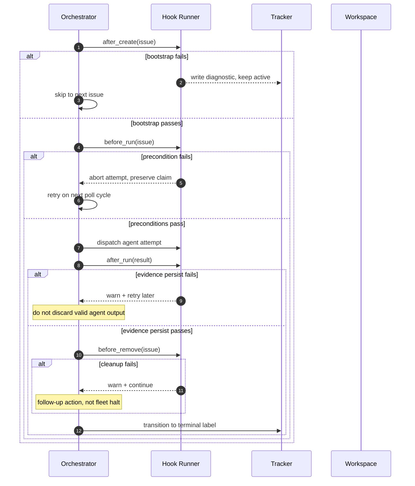
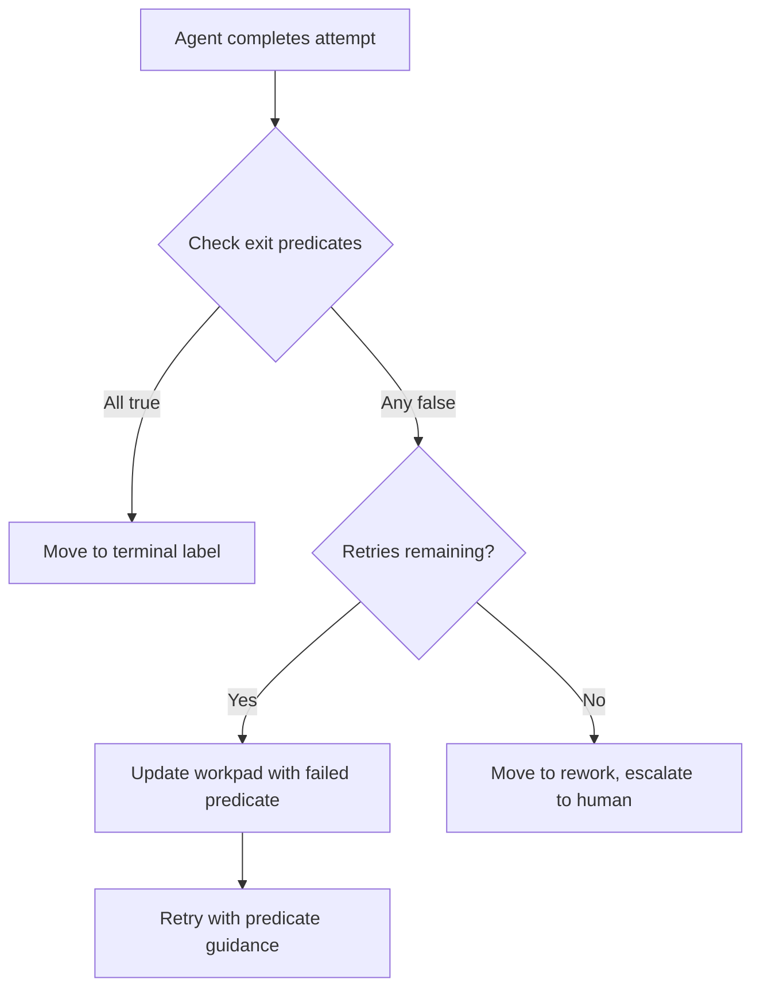

> **Complexity**: [COMPLEX]
>
> **Time to Complete**: ~60 minutes
>
> **Prerequisites**: [Operating the Harness](../module-3.3-operating-the-harness/) for exception drift, harness GC, and escalation matrices; [Guardrails, Gates, and Agent-Legible Apps](../module-3.2-guardrails-gates-and-agent-legible-apps/) for mechanical enforcement patterns; [Harness Fundamentals — Layers and System of Record](../module-3.1-harness-fundamentals-layers-and-system-of-record/) for the three-tier model and AGENTS.md pointer architecture. Working familiarity with GitHub Issues labels and REST API semantics, basic shell scripting, and YAML configuration files.

---

## Learning Outcomes

By the end of this module, you will be able to:

- **Design** a ticket-orchestrated polling loop that delegates control authority to a project management tracker rather than an ephemeral terminal session, and justify each design choice against session-first alternatives.
- **Implement** the four lifecycle hooks with correct failure contracts — distinguishing hard-abort semantics, retry-with-evidence semantics, and degrade-and-continue semantics for each hook class.
- **Construct** a persistent workpad artifact that survives retry cycles, prevents timeline spam, and provides a reviewer with enough context to authorize a merge decision in under two minutes of reading.
- **Evaluate** a fleet workload against a three-dimensional risk model and select the correct orchestration posture: strict state machine for reversible mechanical tasks, objective-driven thresholds for ambiguous work, and human-in-the-loop sessions for high-cost or irreversible changes.
- **Assemble** a Proof of Work package from autonomous agent output — CI results, diff summaries, objective completion predicates — that enables confident human merge decisions without re-running or re-auditing the full agent session.

## Why This Module Matters

**Hypothetical scenario:** A platform engineering team runs twenty-two autonomous coding agents across six repositories, each managed by a different `WORKFLOW.md` contract. The team's merge velocity is fast enough that no human reviewer reads more than the CI pass/fail badge before clicking merge. Three weeks later, a production rollout fails because an agent merged a configuration change whose CI result was stale — the check ran against a cached environment, not the actual deployment target. The agent had followed its contract perfectly, producing a comment that said "CI passed," and the contract had no mechanism to distinguish evidence freshness from evidence presence. No rule was violated; no rule checked was sufficient.

What makes this failure instructive is that every component in the pipeline performed exactly as specified. The agent opened the PR, CI produced a green result, the orchestrator updated the workpad, and the reviewer clicked merge. The failure was not a component failure but a design failure: the system measured evidence quantity while the operation required evidence quality. Freshness — whether the CI result was produced against the current code state — is a dimension of evidence quality that a simple pass/fail badge does not express. This is the gap that applied harness engineering exists to close.

This capstone module closes the AI Engineering Foundations section by applying the entire harness framework you built across modules 3.1, 3.2, and 3.3 to the project management layer. The three-tier harness model taught you where rules live and who enforces them. The guardrails module taught you how mechanical gates reject bad output and return structured remediation. The operations module taught you how to prevent exception drift, prune stale policy, and route work by risk tier. This module applies all three disciplines to the question that fleet-scale teams face daily: when an autonomous agent declares a task complete, can you trust that declaration without re-auditing the agent's full session?

The answer requires more than a CI status badge. It requires a control plane that treats the project management tracker as the source of truth for work ownership, lifecycle hooks that enforce evidence collection at every state transition, workpad artifacts that survive retry cycles without accumulating noise, and a decision framework that routes simple reversible work through automation while reserving complex ambiguous work for human judgment. When these layers compose correctly, a pull request arriving from an agent carries enough structured evidence that a reviewer can decide in under two minutes — not by trusting the agent, and not by distrusting it, but by reading the Proof of Work it assembled.

This module assumes you have read the Symphony introductory material in the ai-native-work section and that you accept the ticket-first premise. You already know that `WORKFLOW.md` defines the contract, that the four baseline lifecycle hooks exist, and that claim states are separate from ticket states. This module does not re-teach those definitions. It deepens them into an operational applied-harness pattern: when each hook fires, what precise evidence it must produce, how the orchestrator recovers when a hook fails, and how the completed evidence package enables a human reviewer to make a confident merge decision without chasing context across four different comment threads and three CI pipelines.

## The Ticket as Control Plane: Architecture Beyond Sessions

The central architectural choice in fleet orchestration is not whether to use state machines or pipeline queues. It is which abstraction the system treats as the canonical unit of work ownership. In session-first designs, the canonical unit is a terminal process — when the process dies, ownership metadata dies with it, and the next operator must reconstruct context from logs, commit messages, and chat threads. In ticket-first designs, the canonical unit is an issue record on a project management tracker, and every other artifact — workspaces, branches, comments, labels — is derivative of that record. The ticket outlives the terminal, the CI run, and the agent that spawned it.

This pivot is not cosmetic. It changes what the orchestrator optimizes. A session-first orchestrator optimizes for keeping shells alive and reducing process churn; it asks "which terminal is still running" and "which agent has capacity." A ticket-first orchestrator optimizes for moving issues from the active queue to a terminal state while producing verifiable evidence at each transition. It asks "which issue has met its completion predicates" and "which evidence gaps still block merge."

The shift from terminal throughput to ticket throughput is the difference between a system that feels fast at small scale and a system that remains legible as concurrency grows. A session-orchestrated fleet of three agents is manageable through operator vigilance. A session-orchestrated fleet of thirty agents is unreliable because vigilance does not scale linearly. The ticket-orchestrated fleet scales because the tracker is already designed for concurrent access by distributed actors, and the labels and comments that encode ownership are durable enough to survive any single agent's lifecycle.

The practical mechanism that makes a PM tracker a control plane rather than a passive tracking board is the label-driven state model. In the simplest form, labels encode which issues the orchestrator should act on, which it should ignore, and which it considers terminal. The orchestrator polls the tracker API — GitHub Issues, Linear, Jira — filters by active labels, claims issues under a concurrency cap, and dispatches agents against the claimed set. The tracker becomes the durable source of truth for work ownership because every claim, transition, and release is recorded as a label or comment mutation, not as an in-memory variable.

```
+------------------------------------------------------------------+
|                     Tracker-as-Control-Plane                      |
+----------------------------+--------------------------------------+
| Orchestrator role           | Tracker role                        |
+-----------------------------+-------------------------------------+
| Read active-label set       | Store canonical ownership           |
| Claim issues under cap      | Record transitions as labels/state   |
| Dispatch agent per attempt  | Persist workpad per attempt          |
| Run lifecycle hooks         | Surface evidence for human review    |
| Release on completion/fail  | Serve as audit trail                |
+-----------------------------+--------------------------------------+
```

The claim workflow deserves precise attention because it is where concurrency bugs appear. When the orchestrator polls the tracker and finds five issues labeled `agent:active`, it must claim each one atomically so two workers cannot both claim the same issue. The claim operation is an API mutation — add a label like `agent:claimed` or set an assignee, with an ETag or conditional request to detect races — not a local variable assignment. If the claim API call fails because another worker beat this one to the issue, the orchestrator skips that issue and moves to the next. If the claim succeeds, the orchestrator writes the claim timestamp into a workpad comment so subsequent failure analysis can determine whether a stalled issue was actually running or was abandoned mid-claim.

This pattern uses the tracker API's native consistency guarantees rather than building a distributed locking layer on top of it. GitHub's Issues API supports conditional requests via ETag headers; Linear's GraphQL API supports optimistic concurrency control through mutation IDs. The orchestrator does not need to coordinate with other workers through a separate service — it lets the tracker resolve conflicts the same way it resolves conflicts when two humans try to assign the same issue simultaneously. This keeps the architecture boring, which is exactly the property you want in a component that controls whether autonomous agents can modify production code.

The tracker also solves the handoff problem that session-first architectures struggle with. When an issue moves to `agent:rework`, the next poll cycle reads the workpad comment, inspects what changed since the last attempt, and launches a new attempt with full context — no operator reconstruction required. When a human reviewer needs to understand why a particular change was merged, they open the issue, read the workpad, inspect the linked PR CI results, and close the issue. The evidence chain starts and ends on the tracker, not scattered across terminal session logs on a machine that was recycled last Tuesday.

**Pause and predict:** Your team runs twelve agents against a shared Linear board. Every agent claims issues by reading the `agent:active` label, waiting 200 milliseconds, and then writing `agent:claimed`. How many issues will be double-claimed in the next hundred poll cycles, and what single API call pattern would eliminate the race condition without adding a distributed lock?

The tracker-as-control-plane pattern also scales cleanly with incident response because the control channel is independent of the work channel. When a production incident occurs and the team needs to halt all automation, changing one label policy — removing `agent:active` from the active label set or adding a `blocked:incident` label that the orchestrator's filter treats as a suspension condition — pauses the fleet within one poll cycle. No SSH sessions to kill, no process trees to hunt, no orphaned worktrees to clean up. The control surface is a label change that a human can make from a phone during an on-call rotation, and the orchestrator respects it on its next read.

## Lifecycle Hooks as Enforcement Points

The Symphony architecture defines four lifecycle hooks: `after_create`, `before_run`, `after_run`, and `before_remove`. The orphan introductory module named them and described their basic purpose. This section deepens their failure semantics — what happens when each hook fails, how the orchestrator ought to recover, and what evidence each hook must produce for the rest of the pipeline to function.

Hooks are not optional decorations in a YAML file. They are enforcement points that must produce deterministic, machine-readable output. A hook that succeeds silently is marginally useful. A hook that fails with a human-readable paragraph is an incident waiting to be missed by a polling loop. Every hook in a production-quality Symphony contract should emit at least a structured status line — a single JSON line, a key-value pair, or a conventional exit code with a specific message on stderr — that the orchestrator can parse without a language model interpreting free-text prose.

### after_create — The Bootstrap Gate

`after_create` runs once when the per-issue workspace is born. If this hook fails, the orchestrator must not call any later hooks for that attempt, because the workspace does not exist or is not in a usable state. Common bootstrap operations include cloning the repository into a per-issue worktree, verifying that no stale lock files remain from a prior partial attempt, and initializing language-specific toolchains or environment variables.

The failure contract for `after_create` is **hard abort with retry**. If the clone fails because the network is unavailable, the orchestrator should keep the issue in the active label set, write a diagnostic to the workpad explaining the failure, and let the next poll cycle retry the bootstrap. If the clone fails because the repository URL in the contract is malformed, the orchestrator should keep the issue active and write a diagnostic that will not resolve without human intervention — a human must fix the contract, not wait for a retry to succeed. The difference between "transient failure, retry" and "permanent failure, escalate" must be explicit in the hook's exit code or output schema. An exit code of 2 might mean "transient — retry on next poll," while an exit code of 3 might mean "permanent — move to rework."

This hook is also the right place to enforce repository-specific workspace policy. If your repositories require specific Git LFS pulls, submodule initializations, or language-package installs before any agent work can begin, `after_create` is where those operations should live — not in `before_run`, which runs on every attempt and would redundantly re-execute bootstrap operations that only need to happen once. Teams that place expensive bootstrap in `before_run` often discover that their poll cycles consume significant wall-clock time on operations whose results are discarded when the workspace is cleaned up between attempts. Bootstrap once; validate every time.

```bash
#!/usr/bin/env bash
# after_create.sh — bootstrap per-issue workspace
set -euo pipefail
WORKTREE="worktrees/issue-${ISSUE_NUMBER}"

if [ -d "$WORKTREE" ]; then
    echo '{"status":"warn","reason":"worktree_exists","action":"reuse"}' >&2
    exit 0
fi

if ! git worktree add "$WORKTREE" main 2>/tmp/clone-err; then
    if grep -q "already exists" /tmp/clone-err; then
        echo '{"status":"fail","reason":"stale_lock","retry":true}' >&2
        exit 2
    fi
    echo '{"status":"fail","reason":"clone_failed","retry":false}' >&2
    exit 3
fi

echo '{"status":"ok","worktree":"'"$WORKTREE"'"}'
```

### before_run — The Precondition Guard

`before_run` validates the environment before each attempt: issue label freshness, workspace permissions, credential availability, and toolchain presence. If the issue has been relabeled to `agent:blocked` since the claim, `before_run` should abort the attempt without consuming a retry. If required credentials are missing — an API token has expired, a cloud provider session has timed out — the hook should abort with a diagnostic that tells the orchestrator whether the next poll cycle should retry or escalate.

The failure contract for `before_run` is **abort this attempt, preserve claim state**. The issue remains in the active label set, the claim state transitions to `RetryQueued` internally, and the workpad receives a diagnostic entry. The orchestrator must not treat a `before_run` failure as a completion or a permanent failure — it is a transient readiness gap. A common anti-pattern is failing `before_run` and moving the issue to `agent:rework`, which forces a human to re-read and re-stage context even though nothing substantive failed. Reserve `rework` for cases where the agent produced output that needs human judgment, not for cases where a credential rotated.

```bash
#!/usr/bin/env bash
# before_run.sh — validate preconditions
set -euo pipefail

ISSUE_LABELS=$(gh issue view "$ISSUE_NUMBER" --json labels -q '.labels[].name')

if echo "$ISSUE_LABELS" | grep -q "agent:blocked"; then
    echo '{"status":"abort","reason":"issue_blocked","retry":false}' >&2
    exit 10
fi

if [ ! -d "worktrees/issue-${ISSUE_NUMBER}" ]; then
    echo '{"status":"fail","reason":"workspace_missing","retry":true}' >&2
    exit 2
fi

echo '{"status":"ok","issue":'"$ISSUE_NUMBER"'}'
```

### after_run — The Evidence Persistence Gate

`after_run` is the most architecturally significant hook because it is where evidence transitions from ephemeral session output to durable, reviewable artifact. This hook must write or update a persistent workpad comment on the issue, attach or link any structured output artifacts (CI run URLs, diff summaries, lint reports), and record the attempt number, the completion status, and any known risks that the next attempt or a human reviewer should be aware of.

The failure contract for `after_run` is **degrade to warning, do not block**. If the comment API call fails transiently, the evidence is already written to local files — `after_run` should log a warning and the orchestrator should retry the comment write on the next poll cycle. If the comment API call fails permanently (authentication expired), the orchestrator should escalate the issue to rework with a clear diagnostic. The critical invariant is that a successful agent run should not be discarded because a comment API call timed out. The evidence exists locally; the comment is a convenience for human review, not the primary storage mechanism.

The workpad update must be idempotent — writing the same evidence twice should not create duplicate entries or confuse the next reader. The simplest idempotent pattern is an in-place update: the workpad comment has a stable header and section markers, and `after_run` replaces the content between specific markers rather than appending to an ever-growing comment. This prevents timeline spam, keeps the issue view clean for human readers, and avoids the "scroll through forty-seven comments to find the active one" frustration that plagues chat-driven workflows.

```bash
#!/usr/bin/env bash
# after_run.sh — persist evidence as workpad update
set -euo pipefail
WORKPAD_HEADER="## Codex Workpad"
COMMENT_BODY="${WORKPAD_HEADER}\n\n- **Attempt**: ${ATTEMPT_NUMBER}\n- **Status**: ${ATTEMPT_STATUS}\n- **Changed files**: $(git diff --name-only HEAD~1 2>/dev/null | tr '\n' ' ')\n- **CI**: ${CI_RESULT:-pending}\n- **Risks**: ${KNOWN_RISKS:-none}\n\n---\n_Last updated: $(date -u +%Y-%m-%dT%H:%M:%SZ)_"

EXISTING_ID=$(gh api "repos/${OWNER}/${REPO}/issues/${ISSUE_NUMBER}/comments" -q '.[] | select(.body | startswith("'"${WORKPAD_HEADER}"'")) | .id' 2>/dev/null | head -1)

if [ -n "$EXISTING_ID" ]; then
    gh api "repos/${OWNER}/${REPO}/issues/comments/${EXISTING_ID}" -X PATCH -f body="$COMMENT_BODY" 2>/tmp/patch-err || {
        echo '{"status":"warn","reason":"patch_failed","retry":true}' >&2
        exit 0
    }
else
    gh api "repos/${OWNER}/${REPO}/issues/${ISSUE_NUMBER}/comments" -f body="$COMMENT_BODY" 2>/tmp/create-err || {
        echo '{"status":"warn","reason":"create_failed","retry":true}' >&2
        exit 0
    }
fi

echo '{"status":"ok","attempt":'"$ATTEMPT_NUMBER"',"comment_updated":true}'
```

### before_remove — The Cleanup Contract

`before_remove` handles workspace teardown: removing worktree directories, pruning temporary files, and releasing any compute resources consumed by the attempt. The critical operational property of `before_remove` is that it must not be allowed to block the global orchestration queue. If cleanup fails on one issue, the orchestrator should log the failure, surface it as a diagnostic, and continue processing other issues. A stuck cleanup is a follow-up action item, not a fleet-wide stop-the-world event.

The failure contract is **warn and continue unconditionally**. The exit code of `before_remove` must not influence whether the orchestrator transitions the issue to a terminal state. If the agent's output was valid and the evidence was persisted, the cleanup failure is an operational hygiene issue, not a correctness issue. That said, cleanup failures should be counted and trended — if `before_remove` fails on more than five percent of attempts, the team likely has a filesystem permissions problem, a disk-full condition, or a stale lock pattern that needs root-cause investigation.



**Pause and predict:** Your `after_run` hook fails because the GitHub comment API returns a 403 — the token expired. The agent completed its work successfully and wrote a local results file. Your `before_remove` hook is about to delete the workspace directory. If `before_remove` runs before the evidence is duplicated somewhere safe, what happens to the proof that the agent did correct work? Before reading further, design the minimum sequence change that prevents this data loss.

## Persistent Workpads and Evidence Chains

The workpad comment is the single most valuable artifact in a ticket-orchestrated fleet because it is the only durable thread that connects attempt zero to merge. Without a workpad, each retry starts from scratch — the next agent knows neither what was attempted nor what assumptions were invalidated, and a human reviewer sees N disconnected bot comments that describe similar but slightly different approaches to the same task. With a well-structured workpad, the reviewer reads one comment, understands the arc of attempts, and decides whether the final result is acceptable.

The workpad serves two distinct audiences with different reading patterns. The next agent on retry needs to know what failed on the previous attempt and what constraints the previous attempt established — it reads the workpad as a launch checklist. The human reviewer deciding whether to merge needs to know whether the final output satisfies the issue's requirements and whether any known risks remain unaddressed — they read the workpad as an audit summary. A workpad structured around these two reading patterns simultaneously serves both audiences without redundancy.

An effective workpad has a stable structure with section markers that `after_run` can update in place. The recommended stable section model — Plan, Acceptance Criteria, Validation, Notes, Confusions — provides enough structure for both agent continuity and human review without becoming a bureaucratic checklist. "Plan" records what the agent intended to do on this attempt. "Acceptance Criteria" records the completion predicates it is targeting. "Validation" records what verification steps ran and their results. "Notes" captures observations the next attempt should see. "Confusions" records ambiguities the agent could not resolve, which is often the single most valuable section for a human reviewer trying to understand why an agent made a particular decision.

```
## Codex Workpad
- **Issue**: #1523 — Add retry backoff to polling loop
- **Attempt**: 2 of 4
- **Status**: retry_queued (transient API failure in validation)

### Plan
Add exponential backoff to the poller with jitter. Replace fixed 30-second sleep
with configurable base + max backoff from WORKFLOW.md polling section.

### Acceptance Criteria
- Poller sleeps between 1s and 64s based on failure streak
- Jitter prevents thundering herd on tracker API
- Max backoff capped at `polling.max_backoff_seconds`

### Validation
- Unit test: backoff doubles on each failure up to cap (PASS)
- Integration test: tracker API returns 429, poller backs off (FAIL — 429 not
  returned in mock; mock needs updating before next attempt)

### Notes
Mock GitHub API in test suite does not return rate-limit headers. Next attempt
should fix the mock before retrying the full integration.

### Confusions
- Should backoff reset when a single poll cycle succeeds, or decay gradually?
- Not clear from WORKFLOW.md whether `max_concurrent_agents` interacts with
  backoff (e.g., should concurrency drop when backoff is active?)

---
Last updated: 2026-05-25T14:32:00Z
```

The key property that makes this workpad survive retries is that it is a single comment, updated in place, with stable section markers. A polling loop that appends a new comment per attempt produces timeline spam — the issue page accumulates bot commentary, human conversation threads get buried, and reviewers stop reading the comments entirely because extracting signal from noise costs more than re-auditing the diff. A polling loop that updates one comment preserves the issue as a readable communication channel.

The most common failure mode in workpad design is treating it as a log instead of as a report. A log records every event in chronological order, which is useful for debugging but terrible for rapid human review. A report summarizes what a reviewer needs to know and omits what they do not. The workpad should be a report with a timestamp, not a log with a scrollbar.

The evidence chain extends beyond the workpad. The workpad anchors the narrative, but the Proof of Work package — the collection of artifacts a human reviewer uses to make a merge decision — also includes CI run results, diff summaries, objective completion checks, and any structured validation output the hooks produced. The workpad links to these artifacts rather than embedding them; a workpad that embeds a thousand-line CI log is as unreadable as a workpad that contains nothing. The discipline is: the workpad tells the reviewer what happened and why; the linked artifacts prove it.

## Dynamic WORKFLOW.md: Hot-Reload as Operational Control

One of the most operationally significant properties of a well-designed Symphony polling loop is that it re-reads the `WORKFLOW.md` contract on every poll cycle, not once at process start. This hot-reload behavior turns the contract from a one-time bootstrap configuration into a live operational control surface. A team that needs to reduce concurrency during an incident changes one YAML value, commits, and the polling loop picks up the change within seconds — no restart, no deploy, no SSH session.

The implementation requirement is straightforward: the polling loop must read and parse `WORKFLOW.md` at the start of each cycle, apply any changes to its in-memory runtime configuration, and use the refreshed values for the current cycle's dispatch decisions. The contract should be read from the repository's current state — the file on disk as of the most recent poll — not from a cached in-memory copy from process start. This makes the repository the operational dashboard for the fleet: editing a file changes fleet behavior, and the change is versioned, reviewed, and revertible like any other code change.

The hot-reload property is most valuable during incidents. When a deployment window opens and the team wants to reduce the fleet's blast radius, lowering `polling.max_concurrent_agents` from 20 to 2 limits parallelism without stopping work entirely. When a rate-limiting incident hits the tracker API, increasing `polling.interval_seconds` from 30 to 120 reduces API pressure across the fleet. When a vulnerability is discovered in a dependency and the team wants to pause all changes to affected repositories, adding a `blocked:security` label to the `rework_labels` set stops the fleet from claiming new issues while the security investigation proceeds. Each of these changes is a single YAML edit, a commit, and a poll cycle — no SSH, no process management, no coordination across twenty agent terminals.

```
+------------------------------------------------------------------+
|     Hot-Reload: Contract Edit to Fleet Behavior Pipeline          |
+-----------------+-----------------+---------------+---------------+
| Engineer edits  | Commit to repo  | Poller reads   | Fleet obeys  |
| WORKFLOW.md     | (versioned,     | fresh contract | new policy   |
| (YAML change)   |  reviewed)      | (next cycle)   | (no restart) |
+-----------------+-----------------+---------------+---------------+
```

Hot-reload does introduce a sharp edge: a bad contract edit takes effect across the entire fleet within one poll cycle. If an engineer accidentally sets `max_concurrent_agents` to 0, the fleet stops claiming work but stays running — silently producing no output until someone notices. If an engineer removes the `active_labels` entry entirely, the poller may interpret the missing key as "no filter" and attempt to claim every issue in the repository.

This sharp edge is not an argument against hot-reload. It is an argument for treating the contract file with the same operational caution as a production database migration. You would not apply a migration without a dry run; you should not commit a contract change without validating it against a representative poller instance first. Teams that add a CI check that parses the contract and prints the effective configuration — active labels, concurrency cap, hook paths — can review the intended effect before the commit reaches the fleet. A one-line CI output that says "Active labels: agent:active, agent:priority" gives a reviewer more confidence than the raw YAML alone.

These failure modes argue for validation: before the poller applies a freshly read contract, it should validate that required keys exist, that numeric values are within sane bounds, and that label lists are non-empty where the semantics require them. A contract validation failure should pause the loop without crashing it — emit a structured error, keep the previous valid contract in memory, and retry the read on the next cycle.

```bash
# Inside the polling loop, contract validation snippet
validate_contract() {
    local errors=0
    local max_agents
    max_agents=$(yq '.polling.max_concurrent_agents' WORKFLOW.md 2>/dev/null)
    if [ -z "$max_agents" ] || [ "$max_agents" -le 0 ] 2>/dev/null; then
        echo '{"severity":"fatal","field":"polling.max_concurrent_agents","reason":"missing_or_invalid"}' >&2
        errors=$((errors + 1))
    fi
    if [ "$max_agents" -gt 100 ] 2>/dev/null; then
        echo '{"severity":"warn","field":"polling.max_concurrent_agents","reason":"unusually_high"}' >&2
    fi
    return "$errors"
}
```

The hot-reload pattern also creates a natural audit trail for operational decisions. Every change to fleet behavior — concurrency adjustments, label policy changes, hook path updates — is a commit with a message, an author, and a timestamp. When a postmortem asks "why did the fleet stop processing issues for seven hours on Tuesday," the answer is in the git log, not in a chat thread or an oral history recounted by the engineer who was on call.

This audit trail is one of the less obvious but more valuable properties of contract-as-file architecture: the behavior of the automated fleet is as reviewable as the behavior of any other code path. A new team member can read the contract file history and understand why the fleet behaves the way it does, in the same way they can read the commit history of a configuration file to understand why a service uses specific parameters.

## From State Machines to Objective-Driven Orchestration

The orphan Symphony module introduced a late architectural correction: strict state-machine choreography is not enough when models improve and task complexity increases. The module described this as moving from "rigid nodes in a state machine" to "giving agents objectives instead of strict transitions." This section applies that lesson operationally — building the concrete mechanisms that let an orchestrator use objective-driven thresholds alongside, or instead of, hardcoded state transitions.

A strict state machine says: the agent moves from InProgress to Merging only when a specific sequence of labeled transitions has completed. An objective-driven orchestrator says: the agent may propose a transition when a specific set of evidence predicates are satisfied, regardless of how many internal attempt phases were consumed to reach them. The difference is not about removing control — it is about what the control surface measures. A state machine measures conformance to a pre-scripted path. An objective-driven orchestrator measures conformance to a set of completion predicates, and the path between predicates is the agent's problem to solve.

This distinction matters operationally because the two modes fail differently. A state machine fails when the agent takes an unexpected path — even if the path produced correct output. An objective-driven orchestrator fails when the predicates are not met — even if the agent followed every step in the expected sequence. Choosing the wrong mode for a task class means the orchestrator either rejects correct work for procedural reasons or accepts incorrect work because the procedure was satisfied.

The KubeDojo `/goal` paradigm is an instructive working example of objective-driven orchestration. A `/goal` session sets a completion condition — "get the k8s/cka track readiness to 82 percent" or "drain the verifier queue until actions.next is empty" — and the agent keeps running until the condition is met or an abort condition fires. The evaluator checks the transcript for literal status signals (`GOAL_DONE`, `GOAL_ABORT`) and integer counters for blocked and no-progress thresholds. The orchestrator does not care which files the agent edited between turn 4 and turn 7; it cares whether the objective predicate is true at the end of the run.

This approach translates to ticket orchestration as follows. Instead of defining the agent's lifecycle as a rigid sequence of eight states that must be traversed in order, define it as a set of exit predicates that the workpad must satisfy before the orchestrator moves the issue to a terminal label. A typical set of exit predicates for a code-change task might be:

1. The agent wrote at least one commit to a branch.
2. The workpad comment contains a non-empty Validation section with specific test names and results.
3. CI ran on the branch and returned a pass or a documented failure with a remediation path.
4. The diff is bounded by the issue's stated scope — no files outside the expected path were modified.

If all four predicates are true, the orchestrator moves the issue to `agent:done` regardless of how many attempts were consumed or which internal phases fired. If any predicate is false, the orchestrator keeps the issue active and records which predicate failed in the workpad. The agent retries with the failed predicate as explicit guidance.



This model is not a rejection of state machines. It is a recognition that state machines are excellent at sequencing steps where the steps themselves are well-defined — "clone the repository, then install dependencies, then run tests" — and weaker at evaluating outcomes where the outcome quality depends on context the state machine cannot enumerate. The mature fleet uses both: state-machine choreography for workspace setup and cleanup (the lifecycle hooks), and objective-driven thresholds for completion evaluation (the exit predicates). The hooks ensure the environment is deterministic; the predicates ensure the output is evaluable.

**Pause and predict:** Your team runs a ticket-orchestrated loop that validates pull requests against a security context gate. The state machine says an issue moves from InProgress to Merging only when CI passes. The CI gate runs `kubectl --dry-run` validation. An agent proposes a manifest that passes dry-run validation but references a namespace that does not exist in the target cluster. Does the state machine catch this failure, and what exit predicate would you add to catch it?

## Proof of Work: Assembling Evidence for Merge Decisions

The final applied-harness concept in this capstone is the Proof of Work package — the structured collection of evidence that an orchestrator attaches to a completed issue so a human reviewer can make a confident merge decision without re-running the agent's session. Proof of Work is not a substitute for code review, and it is not a claim that the agent's output is correct. It is a claim that the agent followed its contract, passed its gates, and produced evidence that a human can evaluate in minutes rather than hours.

A minimal Proof of Work package for a code-change task includes five components. First, the workpad comment — the narrative artifact that explains what the agent attempted and what it observed. Second, CI results — the pass/fail status of every pipeline job that ran against the agent's branch, with URLs that a reviewer can click to inspect failing tests. Third, a diff summary — a one-paragraph description of which files changed, why, and whether any changes fell outside the issue's stated scope. Fourth, objective completion evidence — the exit predicates the orchestrator evaluated, with the values that satisfied or failed each predicate. Fifth, known risks — any unresolved confusions, untested paths, or assumptions the agent made that a human should verify before merging.

The orchestrator assembles this package during the `after_run` hook and writes it to a structure that the tracking system can display alongside the pull request. On GitHub, this is typically a PR body update or a linked issue comment. On Linear, it is a comment with links to external CI artifacts. The formatting should be predictable enough that a reviewer who reads ten Proof of Work packages a day can scan for the five components in under thirty seconds.

```
## Proof of Work — Issue #1523

### Workpad Summary
[Link to workpad comment](#issuecomment-...) — 3 attempts, resolved on
attempt 3. Primary challenge was mock compatibility with rate-limit headers.

### CI Results
- Unit tests: PASS (https://github.com/org/repo/actions/runs/987654321)
- Integration tests: PASS (https://github.com/org/repo/actions/runs/987654322)
- Lint: PASS (ruff, shellcheck)

### Diff Summary
- `scripts/poller.sh`: +34 lines — added exponential backoff with jitter
- `scripts/poller_test.sh`: +52 lines — unit and integration test coverage
- Scope check: all changes within `scripts/` directory, consistent with #1523

### Objective Completion
- Commit produced: true
- Workpad Validation section populated: true
- CI passed: true
- Diff scope bounded: true

### Known Risks
- Backoff interacts with existing rate-limit handling; edge case when tracker
  returns 429 during an active backoff period is untested.
- Jitter seed is system-time dependent; reproducible test may need fixed seed.
```

The purpose of this package is not to eliminate human judgment from the merge decision. It is to reduce the time required to exercise that judgment. A reviewer who reads this package knows what the agent did, whether the gates passed, what might be risky, and where to look for more detail. They can decide to merge, request changes, or escalate to a domain expert in under two minutes. The alternative — opening the agent's session log, grepping for error messages, cross-referencing CI pipelines, and reconstructing the agent's decision chain from raw output — takes twenty minutes and produces a less confident outcome because the reviewer can never be sure they found all the relevant evidence.

The design principle behind a good Proof of Work package is that it answers the questions a reviewer actually asks, in the order they ask them, without requiring the reviewer to open a separate tool. A reviewer typically asks: "What did this do?" (workpad summary), "Did it pass?" (CI results), "What did it touch?" (diff summary), "Did it meet the spec?" (objective completion predicates), and "What should I worry about?" (known risks). If the Proof of Work answers these questions in a single scrollable view, the reviewer spends their cognitive budget on the decision itself rather than on assembling the evidence.

The Proof of Work package also creates a durable audit artifact that persists beyond the merge. When a security auditor asks six months later "was this change properly reviewed," the Proof of Work package answers the question without requiring the original reviewer to be available. The reviewer's merge decision is recorded; the evidence they based it on is linked; the known risks they accepted are documented. This is what turns orchestration from "the agent moved fast" into "the system produced a reviewable, auditable outcome."

Building this package well requires the orchestrator to collect evidence during the run, not after the run completes. The workpad is updated incrementally — attempt by attempt — so when the exit predicates are satisfied and the orchestrator assembles the Proof of Work, it is summarizing evidence that already exists rather than generating it from scratch. This incremental collection is what makes the Proof of Work assembly fast enough to include automatically on every PR: the documents are already written, the CI results are already linked, and the only remaining work is formatting them into the template.

## Patterns and Anti-Patterns

### Patterns

1. **Single workpad, updated in place.** Use one persistent comment per issue with stable section markers that `after_run` replaces on each attempt. This preserves the issue as a readable communication channel for humans and prevents bot commentary from burying human discussion threads. When a reviewer opens an issue that has been through six attempts, they read one comment with a six-entry Validation section, not six separate comments that require chronological reconstruction.

2. **Claim-then-verify with conditional API mutations.** The orchestrator reads the active label set, claims an issue by atomically adding a `agent:claimed` label or assignee via a conditional API request, and only dispatches an agent if the claim succeeded. If the conditional request fails because another worker raced to the same issue, the orchestrator skips that issue and moves to the next candidate. No distributed lock, no consensus protocol, no database — the tracker API's native conditional write is sufficient.

3. **Exit predicates over state sequences.** Define what completion looks like as a set of observable, machine-checked predicates rather than as a sequence of states the agent must visit. A state machine choreographs the lifecycle hooks because hook order matters. Exit predicates evaluate the agent's output because output quality matters. Keep the two control mechanisms separate and use each where it is strongest.

4. **Expiring claim leases on the tracker.** Write a claim timestamp into the workpad and give the orchestrator a maximum claim duration. If an issue has been in `agent:claimed` state longer than `max_claim_seconds`, the orchestrator treats the claim as expired, releases the issue back to the active pool, and records the expiry as a diagnostic. This prevents orphaned claims from permanently blocking work when an agent process is killed mid-attempt.

5. **Structured contract validation on every poll cycle.** Before the orchestrator applies a freshly read `WORKFLOW.md`, validate that required keys exist, numeric fields are within sane bounds, and label lists are non-empty where the semantics require them. A contract validation failure must not crash the polling loop — log the error, keep the previous valid contract in memory, and retry the read on the next cycle.

### Anti-Patterns

1. **Appending a new comment per attempt.** Each retry adds a comment to the issue timeline, burying human conversation under bot-generated updates and forcing reviewers to scroll through potentially dozens of near-identical status messages just to find the human feedback they need. Fix with in-place workpad updates using stable section markers.

2. **Allowing cleanup failures to halt the fleet.** If `before_remove` exits non-zero and the orchestrator treats that exit code as a global stop signal, one stale worktree directory blocked the entire fleet. A single disk-full condition on one worker can prevent all other workers from processing their issues. Fix by treating cleanup failures as warnings that populate a diagnostics queue, not as orchestration errors that pause dispatch.

3. **Using session identity as claim identity.** If the orchestrator claims an issue by writing the process ID or terminal session ID as the claim marker, the claim dies with the process. A reviewer who opens the issue a day later cannot determine whether the issue was ever claimed or whether the claim is still active. Fix by writing timestamps and worker identifiers to the workpad in a machine-readable format that persists across process restarts.

4. **Hot-reloading without contract validation.** A bad YAML edit — a missing quote, a negative integer, an empty label list — takes effect across the entire fleet within one poll cycle with no guard. The fleet either stops working silently or misbehaves in a way that takes hours to diagnose. Fix by validating the contract after reading it and refusing to apply an invalid contract.

5. **Merging without a Proof of Work package.** A reviewer sees a PR from an agent with a green CI badge and merges. There is no evidence of what the agent attempted, which gates passed, what risks the agent identified, or what the agent was confused about. The merge is fast but the audit trail is empty. Fix by requiring a Proof of Work section in the PR body or a linked issue comment before the orchestrator moves the issue to a terminal label.

6. **Encoding business logic in hook scripts instead of WORKFLOW.md.** The contract file defines what the orchestrator should do; hooks are executable implementations of those definitions. When business logic — which labels are active, what the retry policy is, how concurrency is capped — migrates from the contract YAML into the hook scripts, the fleet loses auditability because behavior changes are no longer a single file diff. Fix by keeping policy in the contract and hooks as stateless policy executors.

## Decision Framework

Selecting the correct orchestration posture for a given task class requires evaluating three dimensions: reversibility of bad output, cost of bad output, and audit burden. Reversibility measures how quickly and completely a bad artifact can be undone — a formatting change is highly reversible, a database migration is not. Cost of bad output measures the operational, financial, and reputational damage of a wrong merge — a typo in internal documentation costs minutes, a security regression in a public-facing service costs hours or days. Audit burden measures how much structured evidence is needed for a reviewer to confidently approve the output — a mechanical label change needs a CI pass badge, a content policy change needs multiple rounds of review and approval.

```
+------------------------------------------------------------------+
|                  Orchestration Posture Decision Matrix             |
+-------------+----------------+----------------+-------------------+
| Dimension   | State Machine  | Objective-     | Human-in-the-Loop |
|             | (Strict)       | Driven (/goal) | Session           |
+-------------+----------------+----------------+-------------------+
| Best for    | Mechanical,    | Ambiguous,     | High-cost,        |
|             | reversible,    | evolving,      | irreversible,     |
|             | well-specified | quality-driven | regulated         |
+-------------+----------------+----------------+-------------------+
| Reversibility| High           | Moderate       | Low               |
| Cost of     | Low            | Moderate       | High              |
| bad output  |                |                |                   |
| Audit burden| Light (CI +    | Moderate       | Heavy (full       |
|             | diff bounds)   | (CI + exit     | session review)   |
|             |                | predicates)     |                   |
| Concurrency | High (parallel | Moderate       | Low (serial or    |
|             | safe)          |                | single-issue)     |
+-------------+----------------+----------------+-------------------+
```

Use strict state-machine orchestration when all three risk dimensions score low: the work is mechanical (doc fixes, formatting, label updates), the output is trivially reversible (a single `git revert` restores the previous state), and the audit burden is satisfied by a CI pass and a bounded diff. This posture supports the highest concurrency and the lowest human attention cost because the failure modes are cheap and fast to correct.

Use objective-driven orchestration when the cost of bad output is moderate and the quality criteria are complex enough that a rigid state sequence would miss important failures. Content additions, restructuring refactors, and dependency upgrades fall into this category — the work is mostly reversible but the quality assessment requires evaluating predicates (are all links valid, do the examples still compile, did the test coverage change) that a sequence of three states cannot express. The exit predicates become the control surface, and the orchestrator routes to human review when predicates fail.

Use human-in-the-loop sessions when irreversibility or cost-of-bad-output is high. Production configuration changes, security policy updates, database migrations, and learner-facing content live here. The orchestrator may still handle workspace setup and pre-run validation through lifecycle hooks, but the completion decision remains with a human reviewer who reads the full session context, not just the Proof of Work summary. In this posture, the ticket is a coordination mechanism — it tracks where the work is and who owns it — but it is not an automation authorization mechanism.

The decision framework is not static. A task class that scores low risk today may score moderate risk six months from now if the repository's blast radius grows or if the domain's regulatory requirements tighten. Re-evaluate each task class quarterly or after any incident that involved an orchestrated change. The evaluation should be a five-minute exercise: assign a reversibility score from 0 to 5, a cost-of-bad-output score from 0 to 5, and an audit-burden score from 0 to 5. If the sum is below 6, strict state-machine orchestration is appropriate. If between 6 and 10, objective-driven with exit predicates. If above 10, human-in-the-loop with the ticket as coordination only.

## Did You Know?

1. The Symphony specification explicitly states that its runtime is "technically just a SPEC.md file" — there is no required binary, no required database, and no required infrastructure beyond a repository and a tracker API. This design choice is deliberate: it makes the entire orchestration system reviewable, forkable, and auditable within the same Git workflows teams already use for code.

2. The "single workpad comment updated in place" pattern emerged from operational experience with fleet-scale agent loops that initially appended a comment per attempt. Teams observed that issues with more than twelve attempts became unreadable for humans, and the signal-to-noise ratio of the issue timeline degraded to the point where reviewers skipped reading comments entirely and relied on CI badges alone.

3. In Symphony's documented design, the orchestrator distinguishes two categories of failure: "hard stop" conditions that should pause the entire fleet (contract parsing failure, authentication breakage, required label set corruption) and "suspension" conditions that should pause a single issue while the rest continue (transient hook timeout, rate-limit backoff, cleanup drift). Treating every failure as a fleet-wide stop is the single most common cause of fleet fragility at scale.

4. The `max_concurrent_agents` field in `WORKFLOW.md` serves a dual operational purpose that is not obvious from the YAML specification alone. It controls parallelism during normal operations, but it is also the blast-radius limiter during abnormal operations. Setting concurrency to a value that saturates the team's review capacity during steady state means that a single bad contract edit can produce more agent output than the team can audit before the next merge window. The field should be set to a value that the team can review in one working day, not to the maximum the tracker API rate limit allows.

## Common Mistakes

| Mistake | Why It Happens | How to Fix It |
|---|---|---|
| Using `after_run` as a blocking gate for orchestration | Teams treat all hook failures identically, applying the same "abort and retry" logic to evidence persistence that they apply to workspace creation | Distinguish hook failure contracts: `after_create` and `before_run` can block the attempt; `after_run` should degrade to warning and retry evidence persistence on the next poll cycle |
| Reading WORKFLOW.md once at process start | Developers treat the contract file as a configuration that requires a process restart to apply, missing the hot-reload property that is essential for incident response | Re-read and validate the contract at the start of every poll cycle; apply changes immediately |
| Writing claim state to an in-memory variable instead of the tracker | Sessions feel durable while they are running, so engineers use local claim tracking that disappears when the process exits | Write claim timestamps and worker identifiers to the tracker as comment metadata or issue fields |
| Allowing `before_remove` failures to block the queue | Cleanup failures look like "something went wrong at the end" and teams treat them as errors that must be resolved before continuing | Treat `before_remove` failures as warnings; count and trend them, but never let a cleanup failure block processing of other issues |
| Running objective-driven orchestration with only a CI badge as the completion predicate | CI badges are the easiest signal to wire into exit predicates, but they do not capture scope violations, assumption errors, or incomplete validation | Define a minimum of three exit predicates: CI pass, workpad Validation section populated, and diff scope bounded by issue statement |
| Skipping contract validation because "we review PRs" | Teams assume that human review of the YAML file catches all errors, missing the gap between "review looks correct" and "polling loop can parse it" | Add a contract validation step to the polling loop that checks required keys, numeric bounds, and non-empty label lists before applying a freshly read contract |

## Quiz

<details>
<summary>Your team's Symphony poller processes twenty issues per cycle. On a Tuesday morning release day, you reduce `polling.max_concurrent_agents` from 20 to 3. Within one cycle, the poller reads the new value and caps concurrency. A junior engineer asks why you didn't need to restart the poller process. Explain the architectural property that made the change take effect without a restart, and identify one risk this property introduces.</summary>

The poller re-reads the `WORKFLOW.md` contract at the start of every poll cycle rather than caching it from process startup. This hot-reload property is the architectural feature that applies the new `max_concurrent_agents` value within one cycle. The risk it introduces is that a malformed contract edit — a YAML syntax error, a missing required key, a negative integer — takes effect across the entire fleet in the same one-cycle window with no guard. This is why contract validation before application is necessary: the poller must check that required keys exist, numeric fields are within sane bounds, and label lists are non-empty before accepting a freshly read contract.

</details>

<details>
<summary>An agent completes a code change and exits successfully. The `after_run` hook attempts to update the workpad comment, but the GitHub API returns 503 — the service is temporarily unavailable. The hook script logs the error and exits with code 0 (success). Your `before_remove` hook then runs, deletes the worktree directory containing the agent's local evidence file, and exits with code 0. The next poll cycle finds the issue still labeled `agent:active` and launches a new attempt that starts from scratch. What two design decisions produced this outcome, and what would you change first?</summary>

Two design decisions combined to produce this data loss. First, `after_run` exited with code 0 despite failing to persist the evidence, which signaled to the orchestrator that persistence succeeded when it did not. The hook should have exited with a distinct code or written a structured warning that the orchestrator interprets as "evidence not yet persisted — do not clean up." Second, `before_remove` deleted the workspace unconditionally without checking whether `after_run` had confirmed evidence persistence. The simplest fix is to have `after_run` write a sentinel file to the workspace on successful persistence, and have `before_remove` refuse to delete if the sentinel is absent. The orchestrator should then retry evidence persistence on the next poll cycle before cleanup.

</details>

<details>
<summary>Your team configures an objective-driven orchestration loop for content-writing tasks. The exit predicate is "CI passes and the workpad Validation section contains at least one observation." An agent writes a new module, CI passes, and the workpad Validation section reads "No issues observed." The orchestrator marks the issue done. A reviewer later discovers the module contains three broken URLs and a citation to a deprecated API that returns errors. Was the exit predicate wrong, or was the predicate checking mechanism wrong, and how would you fix it?</summary>

The exit predicate was wrong because it tested for the presence of a populated Validation section rather than testing for the presence of verification that matters. "Contains at least one observation" is a structural check, not a quality check. A correct exit predicate would test specific quality dimensions: "all URLs in the Sources section return HTTP 200 at generation time," "all YAML examples pass `yamllint`," and "the diff scope matches the issue's stated topic area." The fix is to replace a single weak structural predicate with multiple specific quality predicates, each of which tests a verifiable property of the output. The orchestrator should also run these checks itself — a link checker, a linter, a scope auditor — rather than trusting the agent's self-reported Validation observations.

</details>

<details>
<summary>You are designing a ticket-orchestrated loop for a repository that contains both documentation pages and infrastructure-as-code manifests. The documentation changes are low-risk and highly reversible; the manifest changes touch production cluster configuration. How would you configure the workspace, hooks, and exit predicates differently for these two task classes within the same repository?</summary>

For documentation tasks, configure `workspace.clone_template` to a lightweight checkout (shallow clone, no submodules), use standard hooks that validate prose structure and link integrity, and set exit predicates to "CI passes + diff bounded to docs/ directory + link checker reports zero broken." Allow `max_retries: 3` because documentation fixes are fast and cheap to retry. For manifest tasks, configure a full clone with all dependencies, add a `before_run` hook that verifies the target cluster context is set and the credentials are valid, set exit predicates to "CI passes + `kubectl --dry-run` validation passes + admission policy review passes + diff bounded to manifests/ + no `securityContext: {}` empty blocks." Set `max_retries: 1` and force human-in-the-loop merge — the orchestrator should move the issue to `agent:review` rather than `agent:done` so a human must approve before merge. The two task classes can coexist in the same repository by using issue labels to select which hook configuration is applied.

</details>

<details>
<summary>Your fleet processes a hundred issues per hour. The primary workpad comment template uses stable section markers, but `after_run` replaces the entire comment body on each update. Over a day, the comment update API calls consume thirty thousand requests — nearly forty percent of your GitHub API rate limit budget. Propose two changes that reduce API consumption without reducing evidence quality.</summary>

First, switch from full-body replaces to section-level patches: instead of sending the entire workpad body on every update, compute a diff of which section changed and send only the changed section. If only the Validation section changed between attempts, send only the new Validation block. Second, batch updates within a time window: if the agent completes three quick attempts within five minutes, write the full resolution to the workpad only after the final attempt, and buffer intermediate attempt state in a local file that the orchestrator reads if it needs to restart mid-batch. These changes reduce the API call count from N per attempt (N full-body updates) to 1-2 per resolved issue, without removing any evidence from the final workpad.

</details>

<details>
<summary>Your team uses a Linear board for ticket tracking. The Symphony poller reads issues labeled `agent:active`, claims them by adding `agent:claimed`, and dispatches agents. A network partition causes the poller to lose connectivity to Linear for eleven minutes. The poller's in-memory claim state still shows six claimed issues, but Linear's label state has not been updated to show the claims. When connectivity returns, what state inconsistency exists, and how should the poller resolve it without double-claiming any issue?</summary>

The inconsistency is that the poller believes it owns six issues (in-memory claim state), but Linear has no record of those claims (the network partition prevented the label mutations from reaching the API). When connectivity returns, the poller has two options: replay the claim mutations and risk double-claiming if another worker claimed them during the partition, or abandon the in-memory state and re-read the board from scratch. The safer option is the second: discard all in-memory claim state, re-read the board, and treat every issue not explicitly owned by this worker (by label or assignee) as unclaimed. This may cause the same issues to be re-processed if the previous agent attempts were interrupted, but re-processing is always safer than double-claiming, and the workpad will record the interrupted attempt so the next agent picks up context rather than starting blind.

</details>

<details>
<summary>An agent's `after_run` hook writes a workpad comment containing a CI link. The CI run for the agent's branch was triggered but had not completed by the time the comment was written — the CI link shows "pending" at generation time. A human reviewer opens the issue seven hours later, reads the workpad, clicks the CI link, and sees "CI passed." The reviewer merges. Was the reviewer correct to trust the CI badge without checking the timestamp? What metadata should the workpad have included to prevent this ambiguity?</summary>

The reviewer was not correct to trust the CI badge without temporal context, because the CI link could have been stale — the run might have completed with a different result than "passed" in the intervening seven hours, or another CI run on the same branch might have overwritten the result. The workpad comment should have included a CI generation timestamp and a CI run ID alongside the link: `CI: PASS (run 987654321, completed 2026-05-25T14:30:00Z)`. The orchestrator's `after_run` hook should also verify, before setting the issue to a terminal label, that the CI run it is linking to has completed and the result has not changed since the workpad was written. This is the "evidence freshness" check — evidence must be both present and contemporary to be trustworthy.

</details>

<details>
<summary>You are importing an existing ten-repository project into ticket-orchestrated automation. Five repositories have no `WORKFLOW.md`, three have partial contracts from prototype experiments, and two have contracts that reference Linear labels that were renamed during an org-wide cleanup last month. Describe the minimum viable audit you would run before enabling orchestration, and which single failure mode would cause you to halt the rollout.</summary>

The minimum viable audit has three checks per repository. First, does the contract file exist at the expected path and does it parse correctly? Second, does every `active_label`, `rework_label`, and `terminal_label` value in the contract match a label that currently exists on the tracker? Third, does every hook path referenced in the contract resolve to an executable file in the repository? Run these checks across all ten repositories and produce a table of pass/fail per check per repository. The single failure mode that should halt the rollout is a contract that references labels that do not exist on the tracker. A poller reading such a contract may either silently process nothing (if the filter produces zero matches) or process everything (if the filter is bypassed), and neither outcome is correct. Fix label mismatches before enabling orchestration, even if all other checks pass.

</details>

## Hands-On Exercise

In this exercise, you will configure a minimal `WORKFLOW.md` contract, implement a bash polling script that reads issues from a mock GitHub repository, and simulate a failing `after_run` hook to observe how the orchestrator preserves ticket state and workpad evidence across retries.

### Setup

Create a local directory structure to simulate the fleet environment:

```bash
mkdir -p symphony-lab/worktrees
mkdir -p symphony-lab/hooks
mkdir -p symphony-lab/mock-api
cd symphony-lab
```

Create a mock tracker that simulates GitHub Issues API responses for a small set of test issues. A mock is used instead of real API calls so the exercise is self-contained and repeatable without network access or API credentials.

### Task 1 — Write the minimal WORKFLOW.md contract

Create `WORKFLOW.md` with the six required top-level sections: `tracker`, `polling`, `workspace`, `hooks`, `agent`, and `codex`. Use `simulated` as the tracker kind since this exercise uses a mock API. Set `max_concurrent_agents: 2`, `interval_seconds: 10`, and `max_retries: 3`. Point `workspace.root` to the local `worktrees/` directory and use `worktrees/issue-{{ number }}/` as the clone template. Point each hook to a script under `hooks/`.

<details><summary>Solution</summary>

```yaml
tracker:
  kind: simulated
  owner: lab
  repo: test-repo
  active_labels:
    - agent:active
  rework_labels:
    - agent:rework
  terminal_labels:
    - agent:done
polling:
  interval_seconds: 10
  max_concurrent_agents: 2
workspace:
  root: ./symphony-lab/worktrees
  clone_template: "worktrees/issue-{{ number }}/"
hooks:
  after_create: ./symphony-lab/hooks/after_create.sh
  before_run: ./symphony-lab/hooks/before_run.sh
  after_run: ./symphony-lab/hooks/after_run.sh
  before_remove: ./symphony-lab/hooks/before_remove.sh
agent:
  max_turns: 30
  max_retries: 3
codex:
  command: echo "agent simulated"
  approval_policy: never
```

</details>

### Task 2 — Implement the four lifecycle hook stubs

Create each hook script under `hooks/` with the failure contracts described in this module. `after_create` creates a per-issue directory under `worktrees/`. `before_run` checks that the issue directory exists and is writable. `after_run` appends a timestamped status line to a local workpad file. `before_remove` removes the per-issue directory. Make each hook emit structured JSON to stdout so the polling loop can parse success and failure.

<details><summary>Solution</summary>

```bash
#!/usr/bin/env bash
# hooks/after_create.sh
set -euo pipefail
ISSUE_DIR="worktrees/issue-${ISSUE_NUMBER:-0}"
mkdir -p "$ISSUE_DIR"
[ -d "$ISSUE_DIR" ] && echo "{\"status\":\"ok\",\"dir\":\"$ISSUE_DIR\"}" || echo "{\"status\":\"fail\",\"reason\":\"mkdir_failed\"}"
```

```bash
#!/usr/bin/env bash
# hooks/before_run.sh
set -euo pipefail
ISSUE_DIR="worktrees/issue-${ISSUE_NUMBER:-0}"
if [ ! -d "$ISSUE_DIR" ] || [ ! -w "$ISSUE_DIR" ]; then
    echo "{\"status\":\"fail\",\"reason\":\"workspace_unavailable\"}"
    exit 2
fi
echo "{\"status\":\"ok\"}"
```

```bash
#!/usr/bin/env bash
# hooks/after_run.sh
set -euo pipefail
ISSUE_DIR="worktrees/issue-${ISSUE_NUMBER:-0}"
WORKPAD="$ISSUE_DIR/workpad.md"
ATTEMPT="${ATTEMPT_NUMBER:-0}"
STATUS="${ATTEMPT_STATUS:-unknown}"
cat >> "$WORKPAD" <<EOF
---
Attempt: $ATTEMPT
Status: $STATUS
Timestamp: $(date -u +%Y-%m-%dT%H:%M:%SZ)
Changed: $(echo "${CHANGED_FILES:-none}")
EOF
echo "{\"status\":\"ok\",\"attempt\":$ATTEMPT,\"workpad\":\"$WORKPAD\"}"
```

```bash
#!/usr/bin/env bash
# hooks/before_remove.sh
set -euo pipefail
ISSUE_DIR="worktrees/issue-${ISSUE_NUMBER:-0}"
if [ -d "$ISSUE_DIR" ]; then
    rm -rf "$ISSUE_DIR" && echo "{\"status\":\"ok\",\"cleaned\":\"$ISSUE_DIR\"}" || echo "{\"status\":\"warn\",\"reason\":\"rm_failed\"}"
else
    echo "{\"status\":\"ok\",\"cleaned\":\"none\"}"
fi
```

</details>

### Task 3 — Write the polling loop

Create `poller.sh` that reads the mock issue list, applies the `WORKFLOW.md` contract, claims active issues, runs lifecycle hooks, simulates agent execution, and respects concurrency limits. The poller must re-read `WORKFLOW.md` on every cycle and print the active configuration to stdout so you can verify hot-reload behavior.

<details><summary>Solution</summary>

```bash
#!/usr/bin/env bash
# poller.sh
set -euo pipefail

CONTRACT="WORKFLOW.md"
CYCLE=0

while true; do
    CYCLE=$((CYCLE + 1))
    echo "=== Cycle $CYCLE ==="

    # Hot-reload: re-read contract
    MAX_AGENTS=$(yq '.polling.max_concurrent_agents' "$CONTRACT" 2>/dev/null || echo "1")
    echo "max_concurrent_agents: $MAX_AGENTS"

    # Read mock active issues
    ACTIVE_ISSUES=$(cat mock-api/active-issues.json 2>/dev/null | python3 -c "
import json, sys
data = json.load(sys.stdin)
print('\n'.join(str(i['number']) for i in data.get('issues', [])))
" 2>/dev/null || echo "")

    COUNT=0
    for ISSUE in $ACTIVE_ISSUES; do
        if [ "$COUNT" -ge "$MAX_AGENTS" ]; then
            echo "Concurrency cap reached ($MAX_AGENTS)"
            break
        fi
        export ISSUE_NUMBER="$ISSUE"
        export ATTEMPT_NUMBER="$CYCLE"
        export ATTEMPT_STATUS="completed"

        echo "Processing issue #$ISSUE"
        bash hooks/after_create.sh || echo "after_create failed, skipping issue #$ISSUE"
        bash hooks/before_run.sh || { echo "before_run failed for #$ISSUE"; continue; }
        echo "Simulating agent execution..."
        sleep 1
        bash hooks/after_run.sh
        bash hooks/before_remove.sh
        COUNT=$((COUNT + 1))
    done

    echo "Cycle $CYCLE complete. Processed $COUNT issues."
    sleep "${INTERVAL:-10}"
done
```

</details>

### Task 4 — Simulate a failing `after_run` hook and observe retry behavior

Modify `after_run.sh` to simulate a transient failure on the first attempt for issue number 3. Specifically: if `ISSUE_NUMBER` is 3 and `ATTEMPT_NUMBER` is 1, the hook should exit with code 0 but write a warning to stderr indicating that the API call failed, and the local workpad file should contain only a partial entry. Run the poller for three cycles and observe whether the workpad for issue 3 survives the failing attempt and whether the subsequent retry adds evidence to the same workpad file rather than overwriting it.

<details><summary>Solution</summary>

```bash
# Insert into after_run.sh before the cat command:
if [ "$ISSUE_NUMBER" = "3" ] && [ "$ATTEMPT_NUMBER" = "1" ]; then
    echo "{\"status\":\"warn\",\"reason\":\"transient_api_failure\",\"retry\":true}" >&2
    cat >> "$WORKPAD" <<EOF
---
Attempt: $ATTEMPT (API FAILED — retry queued)
Status: retry_queued
Timestamp: $(date -u +%Y-%m-%dT%H:%M:%SZ)
EOF
    exit 0
fi
```

After three cycles, inspect `worktrees/issue-3/workpad.md`. It should contain the failed attempt entry and a subsequent successful attempt entry in the same file, demonstrating that the workpad survives the failing hook and preserves context across retries.

</details>

### Task 5 — Test hot-reload by changing max_concurrent_agents during polling

While the poller is running, edit `WORKFLOW.md` to change `max_concurrent_agents` from 2 to 1. Wait for the next cycle. Confirm that the poller prints the new value and processes at most one issue. Then change it to 5 and confirm that the poller adopts the new cap without restarting. Document which line of the poller code enables this behavior.

<details><summary>Solution</summary>

The line that enables hot-reload is the `yq` invocation at the start of each cycle: `MAX_AGENTS=$(yq '.polling.max_concurrent_agents' "$CONTRACT")`. Because the poller re-executes this line on every cycle, it reads the current file content rather than a cached value from process start. After reducing to 1, the poller should print "max_concurrent_agents: 1" and process at most one issue per cycle. After increasing to 5, it should print "max_concurrent_agents: 5" and process up to five.

</details>

### Task 6 — Build a minimal Proof of Work summary

Extend the polling loop to produce a Proof of Work summary for each completed issue. The summary should include: the final attempt number, the workpad file path, whether CI passed (simulated — always pass in this exercise), and a list of changed files (simulated — use a placeholder). Write the summary to `proof-of-work/issue-{{ number }}.md`.

<details><summary>Solution</summary>

```bash
# Add after the after_run hook call in poller.sh:
POW_DIR="proof-of-work"
mkdir -p "$POW_DIR"
cat > "$POW_DIR/issue-${ISSUE}.md" <<EOF
## Proof of Work — Issue #${ISSUE}

### Workpad
$(cat "worktrees/issue-${ISSUE}/workpad.md" 2>/dev/null || echo "No workpad found")

### CI Results
- Simulated CI: PASS

### Diff Summary
- Changed files: placeholder (exercise simulation)

### Known Risks
- None identified (exercise simulation)

---
Generated: $(date -u +%Y-%m-%dT%H:%M:%SZ)
EOF
echo "Proof of Work written to $POW_DIR/issue-${ISSUE}.md"
```

</details>

### Success Criteria

- [ ] `WORKFLOW.md` defines all six required top-level sections and parses correctly via `yq`.
- [ ] All four hook scripts exist, are executable, and emit structured JSON output.
- [ ] The polling loop re-reads `WORKFLOW.md` on each cycle and prints the active `max_concurrent_agents` value.
- [ ] Issue 3's workpad survives the simulated `after_run` failure and contains entries from multiple attempts.
- [ ] Changing `max_concurrent_agents` in `WORKFLOW.md` takes effect within one poll cycle without restarting the poller.
- [ ] Each completed issue produces a Proof of Work file under `proof-of-work/` with workpad contents, CI status, and a diff summary.

## Sources

- [Symphony SPEC.md](https://github.com/openai/symphony/blob/main/SPEC.md) — canonical specification defining lifecycle hooks, state machine semantics, and WORKFLOW.md contract structure
- [Symphony README.md](https://github.com/openai/symphony/blob/main/README.md) — architectural overview describing proof-of-work artifacts and the tracker-as-control-plane paradigm
- [OpenAI Harness Engineering](https://openai.com/index/harness-engineering/) — Lopopolo's foundational post on harness layers, system-of-record discipline, and the three-tier governance model
- [Anthropic Claude Code Hooks](https://docs.anthropic.com/en/docs/claude-code/hooks) — lifecycle hook documentation for Claude Code, describing `before_run`, `after_run`, and conditional execution semantics
- [Anthropic Tool Use](https://docs.anthropic.com/en/docs/build-with-claude/tool-use) — schema-constrained tool definitions and structured output patterns that underpin agent-legible hook contracts
- [OpenAI Model Spec](https://model-spec.openai.com/2025-09-12.html) — the platform-level instruction hierarchy defining authority boundaries between platform, developer, and user instructions
- [GitHub Issues REST API](https://docs.github.com/en/rest/issues/issues) — API reference for programmatic issue creation, label mutation, and comment management
- [GitHub Actions Workflow Syntax](https://docs.github.com/en/actions/writing-workflows/workflow-syntax-for-github-actions) — workflow lifecycle events and conditional execution patterns that map to Symphony's hook semantics
- [Linear GraphQL API](https://developers.linear.app/docs/graphql/) — API reference for issue state management, label operations, and comment mutations
- [AGENTS.md Specification](https://agents.md/) — community spec for agent-facing repository contracts, the control-artifact pattern that WORKFLOW.md extends
- [XState Documentation](https://stately.ai/docs/xstate) — statecharts and state machine patterns as the contrast point for objective-driven orchestration
- [Temporal Documentation](https://docs.temporal.io/) — durable execution and workflow orchestration as the heavyweight comparison for lightweight ticket-driven loops
- [OpenHands (formerly OpenDevin)](https://github.com/All-Hands-AI/OpenHands) — open-source AI coding agent platform demonstrating long-running autonomous workflows and evidence persistence patterns

## Next Module

You have completed the AI Engineering Foundations curriculum. The harness framework you built across modules 3.1, 3.2, 3.3, and 4.1 is composable: the three-tier model governs where policy lives, the guardrails control what artifacts may be created, the operations discipline prevents decay, and the ticket-orchestration capstone scales these controls across fleets. For continuation paths, explore the [AI-Native Work section](../../ai-native-work/) for session-level pattern libraries, or the [AI for Kubernetes Platform Work section](../../ai-for-kubernetes-platform-work/) to apply the harness toolkit to infrastructure automation.
