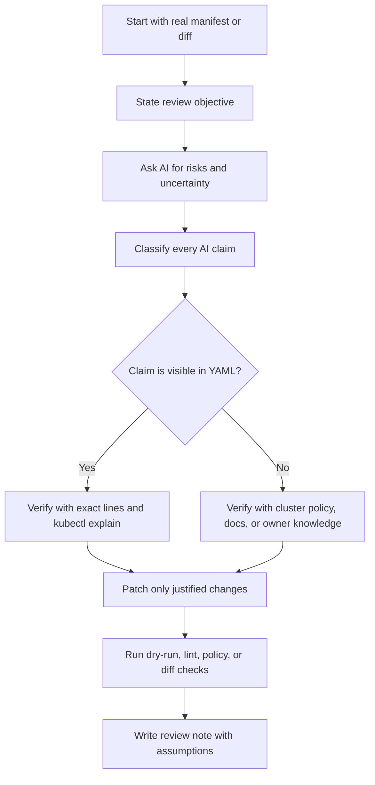

# AI for YAML, Manifests, and Config Review

> **AI for Kubernetes & Platform Work** | Complexity: `[MEDIUM]` | Time: 50-70 min | Prerequisites: Kubernetes manifests, Deployments, Services, probes, resource requests, and basic `kubectl`

## Learning Outcomes

By the end of this module, you will be able to evaluate AI feedback on Kubernetes YAML by separating confirmed findings from assumptions, uncertain claims, and cluster-specific questions that still require verification.

You will be able to design a constrained review prompt that gives an AI assistant the manifest, the review objective, the expected output structure, and explicit uncertainty rules before it offers recommendations.

You will be able to debug a manifest review by tracing each AI claim back to YAML evidence, Kubernetes documentation, or real cluster behavior instead of accepting fluent explanations at face value.

You will be able to compare generation-first and review-first AI workflows and justify which one is safer for production platform work, especially when admission policies, security standards, and workload-specific tradeoffs matter.

You will be able to create a small review note that records what changed, why the change is justified, what still depends on the cluster, and which verification command or policy check supports each conclusion.

## Why This Module Matters

A platform team is preparing a routine rollout on a Thursday afternoon. The application looks ordinary: a Deployment, a Service, a ConfigMap, and a few Helm values that have survived several previous releases. A senior engineer is in another incident call, a junior engineer is trying to help, and an AI assistant has been asked to review the YAML because the diff is larger than expected.

The assistant replies with confidence. It says the manifest is production ready, recommends a few harmless-looking formatting changes, and misses the fact that the Deployment has no readiness probe. During rollout, pods begin accepting traffic before the application has warmed its caches and connected to its downstream dependency. The cluster did exactly what the YAML asked it to do; the team failed because the review process trusted a fluent summary instead of forcing evidence.

That story is not a warning against AI. It is a warning against using AI without a review system. Kubernetes configuration is executable operational intent, not documentation. A single field can change how traffic flows, how pods are scheduled, how processes run inside containers, and how failures spread during a rollout.

AI can make YAML review better when it is treated as a reviewer that asks sharper questions. It can summarize unfamiliar manifests, compare two versions, point out common omissions, and help less-experienced engineers understand why a field matters. The same assistant becomes dangerous when it is treated as an authority that knows your cluster, your policies, your incident history, or your workload behavior.

This module teaches a review-first workflow. You will still use AI, but you will constrain the task, demand uncertainty, verify every operational claim, and keep human ownership of the final manifest. The goal is not to make AI write Kubernetes YAML faster. The goal is to make your team inspect, question, and explain Kubernetes YAML with more discipline.

## The Review Mindset: AI Is a Reviewer, Not the Owner

The safest starting point is a simple mental model: the human owns the manifest, and the AI helps inspect it. That means the AI is not allowed to invent missing context, silently assume policy defaults, or turn a vague request into a production recommendation. A reviewer can raise concerns, ask questions, and explain tradeoffs, but the owner must verify and decide.

Generation-first prompts are tempting because they produce a complete-looking file quickly. A prompt like “generate a production Deployment and Service” feels productive, especially when the result has valid indentation and familiar fields. The problem is that generic output usually reflects generic assumptions, not your cluster’s admission controllers, namespaces, runtime classes, Pod Security settings, network policies, or SLOs.

Review-first prompts begin with real material. You provide the actual manifest or diff, state what kind of review you need, and ask the model to separate visible issues from assumptions. That shift changes the AI from a creative generator into a constrained analysis tool. It also forces you to read the YAML closely enough to know what you are asking.

```ascii
+----------------------+        +-----------------------+        +----------------------+
| Human-owned YAML     | -----> | Constrained AI review | -----> | Human verification   |
| actual manifest      |        | risks + questions     |        | docs + cluster checks|
+----------------------+        +-----------------------+        +----------------------+
          |                                |                                |
          v                                v                                v
+----------------------+        +-----------------------+        +----------------------+
| Review objective     |        | Uncertainty labels    |        | Reviewed decision    |
| rollout/security/etc |        | confirmed/possible    |        | change or do not     |
+----------------------+        +-----------------------+        +----------------------+
```

Think of AI review like bringing another engineer into a code review. You would not accept “looks good” from a human reviewer on a risky production change without evidence. You would expect them to point at exact lines, explain failure modes, distinguish certainty from suspicion, and ask questions when they lack context. The same standard applies to an AI assistant.

A good review prompt therefore asks for risks, not just improvements. Improvements can become a shopping list of unrelated suggestions, many of which add complexity without solving a real problem. Risks force the review toward operational consequences: failed scheduling, unsafe rollout behavior, unexpected privilege, missing observability, or policy rejection.

The review mindset also protects learning. If the model gives a correct answer but the engineer does not understand it, the team has only outsourced thinking. If the model explains the risk and the engineer verifies it, the team improves both the manifest and the operator’s judgment. That is the durable value of AI in platform work.

| Workflow | What the AI does | Main risk | Safer use |
|---|---|---|---|
| Generation-first | Produces new YAML from a broad request | Generic defaults appear production-ready | Use only for drafts or examples after stating constraints |
| Review-first | Inspects real YAML against a narrow goal | Reviewer may still miss context | Use for production review with verification |
| Diff-focused | Compares old and new manifests | May ignore unchanged inherited risk | Use when rollout impact matters |
| Policy-focused | Checks against known standards | May misstate policy behavior | Use with admission or policy tooling nearby |
| Explanation-focused | Translates YAML into plain language | May sound correct while omitting failure modes | Use for onboarding, then verify claims |

### Active Learning: Predict the Safer Prompt

Before reading the next paragraph, compare these two prompts and decide which one is safer for a production Deployment review: “Improve this YAML” or “Review this exact Deployment for rollout, resource, and security risks; separate confirmed findings from assumptions; do not invent fields.” Write down one reason before you continue, because the reason matters more than the label.

The second prompt is safer because it limits the task, defines the review dimensions, and requires uncertainty to be visible. The first prompt asks the model to decide what “improve” means, which invites style comments, unnecessary changes, and confident recommendations that may not fit your environment. In platform work, vague prompts create vague accountability.

## The YAML Review Workflow

A strong AI-assisted YAML review has a sequence. The order matters because each step reduces a specific failure mode. If you ask for recommendations before stating the review goal, the model may optimize for style instead of risk. If you patch before verification, you may replace one problem with another. If you verify without recording assumptions, the next reviewer will not know which decisions were cluster-specific.



The first step is to start with the real manifest or a focused diff. A model cannot review operational intent that it cannot see. If your prompt only describes the workload in prose, the assistant has to fill gaps with assumptions, and those assumptions often become hidden defects. Copying the exact YAML is more work, but that friction is useful because it anchors the review.

The second step is to state the review objective. A Deployment can be reviewed for rollout safety, security posture, scheduling predictability, service exposure, compatibility, naming consistency, observability, or policy compliance. Asking for all of those at once can overload both the model and the human reviewer, so choose the dimensions that fit the change.

The third step is to ask for risks and uncertainty. The model should not merely suggest edits. It should tell you what is confirmed from the YAML, what is plausible but not proven, and what question must be answered before a change is safe. This is how you keep a distinction between “the manifest has no readiness probe” and “the application probably needs a longer startup time.”

The fourth step is to classify every claim. A claim that points to a missing field can often be checked directly in the YAML. A claim about admission behavior, runtime identity, network reachability, or workload readiness usually requires external evidence. Senior review quality comes from knowing which kind of claim you are holding.

The fifth step is to patch only justified changes. This is where many AI workflows fail. The assistant may recommend ten changes, but a production review should accept only the changes that solve a real risk and have a verification path. “AI suggested it” is not a reason to mutate infrastructure.

The final step is to record the decision. A short review note helps the next engineer understand which risks were confirmed, which assumptions remain, and which checks were run. That note is especially useful when a later incident asks why the team chose a particular probe, resource request, or security setting.

| Step | Reviewer question | Evidence to collect | Common failure if skipped |
|---|---|---|---|
| Inspect input | What exact YAML or diff is under review? | Manifest, rendered Helm output, or Kustomize build | AI reviews an imagined configuration |
| Define goal | What risk dimension matters now? | Rollout, security, resources, policy, exposure | Review becomes unfocused advice |
| Prompt AI | What format should the answer use? | Confirmed, possible, questions, tradeoffs | Certainty and speculation blend together |
| Classify claims | Is the claim visible or contextual? | YAML line, docs, policy, cluster command | Possible concerns become assumed defects |
| Verify | What command or source confirms this? | `k explain`, dry-run, diff, policy test | Fluent text replaces evidence |
| Patch | Which changes are justified? | Minimal manifest edit with rationale | Unrelated fields drift into the change |
| Record | What should the next reviewer know? | Review note with assumptions | Future maintainers repeat the same reasoning |

A review workflow is not bureaucracy for its own sake. It is a way to make uncertainty explicit before it becomes production behavior. Kubernetes will not ask whether a missing request was intentional, whether a privileged container was accidental, or whether a probe path actually matches the application. The reviewer has to ask before apply time.

### Active Learning: Classify the Claim

Suppose an AI review says, “This Deployment will be rejected by your cluster because it lacks `runAsNonRoot: true`.” Do not decide whether the recommendation is good yet. First classify the claim: which part is visible in the YAML, and which part requires cluster-specific verification?

The visible part is whether the manifest includes `runAsNonRoot: true` in a pod or container security context. The rejection claim is not visible in the YAML. It depends on admission policy, namespace labels, Pod Security admission mode, or another controller such as Kyverno or OPA Gatekeeper, so it must be verified against the actual cluster or policy source.

## Worked Example: From Vague YAML to Evidence-Based Review

A worked example makes the workflow concrete. The manifest below is valid enough to look ordinary, but it has several production review targets. The point is not that every workload must use the exact same settings. The point is to learn how an AI assistant can help identify risks while the human reviewer still verifies and decides.

```yaml
apiVersion: apps/v1
kind: Deployment
metadata:
  name: config-review-demo
  labels:
    app: config-review-demo
spec:
  replicas: 2
  selector:
    matchLabels:
      app: config-review-demo
  template:
    metadata:
      labels:
        app: config-review-demo
    spec:
      containers:
        - name: web
          image: nginx:1.27
          ports:
            - containerPort: 80
          resources:
            limits:
              cpu: "500m"
              memory: "256Mi"
```

A weak prompt asks the assistant to “make this production ready.” That prompt hides the reviewer’s intent and invites the model to add fields that may not match the workload. A stronger prompt constrains the review to specific dimensions and asks the model to show uncertainty.

```text
Review this Kubernetes Deployment for operational risks.

Focus on:
- rollout safety
- readiness and liveness behavior
- resource scheduling predictability
- container security context

Do not invent fields. If a claim depends on workload behavior, cluster policy,
or organizational standards, say that explicitly.

Return:
1. confirmed concerns visible in the YAML
2. possible concerns requiring verification
3. questions I should answer before changing the manifest
4. minimal changes worth considering, with tradeoffs
```

A useful answer should identify that no readiness probe is configured, so rollout traffic readiness cannot be inferred from Kubernetes readiness checks. It should notice that resource limits exist but requests do not, which affects scheduling predictability because requests are the scheduler’s reservation signal. It should also notice that no explicit security context is present, while avoiding an unsupported claim that the cluster will definitely reject the pod.

The same answer should avoid overclaiming. For example, it should not state that a liveness probe is mandatory for every service, because a poorly designed liveness probe can restart a slow but healthy application. It should not assume the correct readiness path without knowing the application. It should not claim that `nginx:1.27` is forbidden unless the organization has a tag policy or image policy that says so.

A reviewer now classifies the findings. “No readiness probe exists” is visible in the YAML. “Readiness probe path should be `/healthz`” is not visible, because the path depends on the application. “No resource requests exist” is visible. “The CPU request should be `100m`” is a sizing recommendation that depends on workload measurements, SLOs, and cluster capacity.

| AI claim | Classification | How to verify | Decision quality |
|---|---|---|---|
| No readiness probe is configured | Confirmed from YAML | Search manifest and use `k explain` | Strong basis for review discussion |
| Traffic may reach pods before the app is ready | Plausible operational risk | Confirm app startup behavior and Service routing | Needs workload context |
| Resource limits exist without requests | Confirmed from YAML | Inspect `resources` block | Strong basis for scheduling discussion |
| CPU request should be `100m` | Requires verification | Check metrics, load tests, or team standard | Do not accept blindly |
| No explicit security context exists | Confirmed from YAML | Inspect pod and container security contexts | Strong basis for security discussion |
| Cluster will reject this pod | Requires verification | Check Pod Security, Kyverno, Gatekeeper, or admission logs | Do not assert without evidence |

A minimal revised manifest might add a readiness probe, resource requests, and a security context. These changes are not magic defaults. They are examples of justified changes that a reviewer would still tune for the real workload. The readiness path must exist in the container image. The request values should reflect observed usage or a team baseline. The security context must match how the image is built.

```yaml
apiVersion: apps/v1
kind: Deployment
metadata:
  name: config-review-demo
  labels:
    app: config-review-demo
spec:
  replicas: 2
  selector:
    matchLabels:
      app: config-review-demo
  template:
    metadata:
      labels:
        app: config-review-demo
    spec:
      securityContext:
        runAsNonRoot: true
        seccompProfile:
          type: RuntimeDefault
      containers:
        - name: web
          image: nginx:1.27
          ports:
            - containerPort: 80
          readinessProbe:
            httpGet:
              path: /
              port: 80
            initialDelaySeconds: 5
            periodSeconds: 10
          resources:
            requests:
              cpu: "100m"
              memory: "128Mi"
            limits:
              cpu: "500m"
              memory: "256Mi"
          securityContext:
            allowPrivilegeEscalation: false
            capabilities:
              drop:
                - ALL
```

This revised YAML is better only if its assumptions are true. If the image requires root, `runAsNonRoot: true` may prevent startup. If the application returns success on `/` before dependencies are ready, the readiness probe may provide false confidence. If the request values are too low, the scheduler may pack pods too tightly and create noisy-neighbor risk. AI can surface the tradeoff, but it cannot erase the need for workload knowledge.

Verification begins with Kubernetes-native checks. The `kubectl` command is shown first because it is the portable command name; after you define `alias k=kubectl` in your shell, the shorter `k` alias is used throughout the rest of this module and in many KubeDojo labs. The alias does not change behavior; it only reduces typing during repeated inspection.

```bash
alias k=kubectl
k apply --dry-run=client -f deployment-reviewed.yaml
k get -f deployment-reviewed.yaml --dry-run=client -o yaml
k explain deployment.spec.template.spec.containers.readinessProbe
k explain deployment.spec.template.spec.containers.resources.requests
k explain deployment.spec.template.spec.securityContext
```

Dry-run checks syntax and client-side object construction, but it does not prove the workload is healthy. `k explain` confirms field shape and documentation, but it does not prove the chosen values are right. That distinction is important: validation tells you whether Kubernetes accepts a field, while review decides whether the field expresses the correct operational intent.

The review note should be short and concrete. A good note says that the manifest now has a readiness probe because the original Deployment had no readiness gate before Service traffic. It says that resource requests were added to make scheduling intent explicit, while the exact values require measurement. It says that a non-root security context was added as a security posture improvement, while image compatibility must be verified in an environment that runs the container.

### Active Learning: Predict the Hidden Failure

Before moving on, predict one way the revised manifest could fail even though the YAML is valid and the AI recommendation sounded reasonable. Choose from readiness, resources, or security context, then explain what evidence would confirm or disprove your prediction.

One possible answer is that `runAsNonRoot: true` could fail if the container image starts as UID `0` and does not define a non-root user. Another is that the readiness probe could be technically valid but semantically weak if `/` returns success before the application is ready for real traffic. A third is that requests could be too low for the workload, causing pods to be scheduled onto nodes where they later contend for CPU or memory.

## Designing Prompts That Constrain the Model

Prompt design is not about clever wording. In platform engineering, prompt design is about reducing the space in which the model can make unsupported assumptions. A safe prompt gives the assistant enough context to review the actual object while limiting the output to evidence, uncertainty, and tradeoffs.

A strong manifest review prompt has five parts. It includes the exact YAML or rendered diff, the review goal, the cluster or policy context that is known, the output format, and the uncertainty rule. If one of those parts is missing, the model will often fill the gap with generic Kubernetes advice.

```ascii
+-----------------------+
| Safe Review Prompt    |
+-----------------------+
| 1. Exact YAML or diff  |
| 2. Review objective   |
| 3. Known context      |
| 4. Output structure   |
| 5. Uncertainty rule   |
+-----------------------+
            |
            v
+-----------------------+
| Reviewable response   |
+-----------------------+
| confirmed concerns    |
| possible concerns     |
| verification steps    |
| tradeoff questions    |
+-----------------------+
```

The exact YAML or diff prevents hallucinated fields. The review objective tells the assistant whether to prioritize rollout, security, scheduling, exposure, or policy compatibility. Known context prevents generic recommendations from overriding real constraints, such as an organization that requires image digests or a namespace that enforces restricted Pod Security. The output structure makes the response easier to audit. The uncertainty rule tells the model that “I do not know” is an acceptable and expected answer.

The most common prompting mistake is asking the model to both review and rewrite in the same pass. That mixes diagnosis with treatment. It is safer to first ask for findings and questions, then ask for a minimal patch after the findings have been verified. This keeps the reviewer from turning every suggestion into a change.

| Prompt element | Weak version | Strong version | Why it matters |
|---|---|---|---|
| Input | “Here is my app” | “Here is the rendered Deployment YAML” | Review must anchor to concrete configuration |
| Goal | “Improve it” | “Review rollout and scheduling risks” | Narrow goals produce actionable findings |
| Context | “Production cluster” | “Kubernetes 1.35+, restricted namespace, Kyverno image policy” | Context prevents generic advice |
| Output | “Tell me issues” | “Confirmed, possible, questions, verification commands” | Structured output is easier to audit |
| Uncertainty | “Be confident” | “Say when a claim needs verification” | Explicit uncertainty prevents false authority |
| Patch timing | “Fix it now” | “Do not rewrite until findings are classified” | Diagnosis stays separate from changes |

A senior prompt also asks for the absence of evidence. For example, “Which risks cannot be determined from this manifest alone?” is often more valuable than “What is wrong?” The model might then point out that it cannot know traffic patterns, startup behavior, admission policies, image user identity, or whether a Service targets the labels. Those missing facts guide the human reviewer toward the next verification step.

A production review prompt should avoid asking for absolute correctness. Kubernetes manifests are full of contextual decisions. A liveness probe can be protective or harmful. A CPU limit can reduce noisy-neighbor impact or throttle a latency-sensitive application. A non-root security context can improve posture or reveal an image build problem. The assistant should explain tradeoffs instead of pretending every field has one universal best value.

Here is a reusable prompt pattern for a Deployment review. You can adapt the review dimensions, but keep the separation between confirmed findings, possible concerns, and questions.

```text
Review the Kubernetes manifest below as a platform engineer.

Environment context:
- Kubernetes version target: 1.35+
- Treat this as a production workload unless the YAML proves otherwise.
- Do not assume admission policy behavior unless it is stated here.

Review dimensions:
- rollout safety
- scheduling predictability
- runtime security
- service exposure
- fields that may be deprecated, invalid, or misleading

Rules:
- Do not invent fields that are not present.
- Quote or reference the YAML path for each confirmed concern.
- Separate confirmed concerns from possible concerns.
- For each possible concern, name the verification needed.
- Do not produce a rewritten manifest unless explicitly asked.

Return:
1. one-paragraph summary of what the manifest does
2. confirmed concerns visible in the YAML
3. possible concerns requiring external verification
4. questions for the workload owner
5. minimal next checks using kubectl or policy tooling
```

When asking for a patch, use a second prompt that narrows the task. The second prompt should refer to the verified findings rather than reopening the entire manifest for creative improvement. This mirrors good human review: first discuss the issue, then apply the smallest change that addresses it.

```text
Using only the confirmed findings below, propose a minimal YAML patch.

Confirmed findings:
- The Deployment has no readinessProbe.
- Resource limits are present, but resource requests are absent.
- No pod or container securityContext is defined.

Rules:
- Do not add unrelated fields.
- Explain one operational tradeoff for each change.
- Mark any value that must be tuned with workload evidence.
- If a change could break the container image, say how to verify it.
```

This two-step prompting pattern teaches the model to behave like a reviewer instead of a generator. It also teaches the human to separate the thinking stages. That separation is one of the strongest defenses against prompt-induced technical debt, where YAML grows fields because an assistant suggested them and no one remembers why.

### Active Learning: Rewrite a Weak Prompt

Take the prompt “Make this Helm values file secure and reliable” and rewrite it in your own words before reading further. Your rewrite should mention exact input, review dimensions, output structure, and uncertainty. If your rewrite asks the AI to produce final YAML immediately, revise it so review comes first.

A better prompt would say: “Review this exact rendered manifest and the Helm values that produced it for security and reliability risks. Separate confirmed concerns from assumptions, name any cluster policy that must be checked, and return questions before suggesting changes.” The wording can vary, but the structure should make evidence and uncertainty visible.

## Verifying AI Claims Against Kubernetes Reality

Verification is where AI-assisted review becomes platform engineering instead of autocomplete. The model can point you toward likely risks, but Kubernetes truth comes from API schemas, controller behavior, admission policy, workload behavior, and the running cluster. A reviewer needs to know which verification tool fits which claim.

A field-shape claim is usually checked with `k explain`, schema-aware tools, dry-run apply, or server-side validation. For example, if the assistant suggests a field under `securityContext`, you can ask Kubernetes where that field belongs. This catches a frequent AI failure mode: placing a valid field at the wrong level.

```bash
k explain deployment.spec.template.spec.securityContext
k explain deployment.spec.template.spec.containers.securityContext
k explain deployment.spec.template.spec.containers.readinessProbe
k apply --dry-run=client -f deployment-reviewed.yaml
```

A cluster-policy claim requires policy evidence. If the AI says a manifest violates Pod Security, Kyverno, Gatekeeper, or an internal admission rule, the reviewer must check the actual policy source or a server-side dry run in the target namespace. Client-side dry-run cannot prove admission behavior because admission runs on the API server path.

```bash
k apply --dry-run=server -n platform-review -f deployment-reviewed.yaml
k get ns platform-review --show-labels
k get validatingadmissionpolicy
k get validatingwebhookconfiguration
```

A workload-behavior claim requires workload evidence. A readiness probe path is not correct merely because it exists in YAML. The application must return success only when it can safely receive traffic. Resource requests are not correct merely because they are present. They should be informed by metrics, load tests, team baselines, or known operating envelopes.

A rollout-risk claim requires controller understanding. Deployments use a rollout strategy to replace pods while trying to maintain availability, but the exact risk depends on replicas, readiness, surge settings, disruption budgets, and application startup behavior. An AI assistant may identify a missing probe, but the reviewer must reason through the rollout path.

```ascii
+-------------------------+       +-------------------------+       +-------------------------+
| Deployment controller   | ----> | ReplicaSet creates pods | ----> | Service sends traffic   |
| desired state changes   |       | readiness gates matter  |       | only to ready endpoints |
+-------------------------+       +-------------------------+       +-------------------------+
            |                                  |                                  |
            v                                  v                                  v
+-------------------------+       +-------------------------+       +-------------------------+
| maxSurge/maxUnavailable |       | readinessProbe result   |       | user-visible behavior   |
| controls replacement    |       | controls availability   |       | depends on app health   |
+-------------------------+       +-------------------------+       +-------------------------+
```

The diagram shows why a readiness probe is not just a checkbox. During a rollout, Kubernetes needs a signal that a new pod can receive traffic. Without that signal, pod readiness can become too coarse for real application readiness. With a poor signal, Kubernetes may receive false reassurance. The field matters because it participates in a controller workflow.

The same verification principle applies to resource requests. A missing request does not always break a deployment immediately, but it weakens scheduling predictability. The scheduler uses requests to decide where pods fit. Limits affect runtime enforcement differently. AI reviews often mention “add resources,” but the reviewer must ask which part of resource management is being improved and which values are justified.

| Claim type | Example AI statement | Verification source | Reviewer decision |
|---|---|---|---|
| YAML structure | “`allowPrivilegeEscalation` belongs under container securityContext” | `k explain` and schema validation | Accept field placement if schema confirms |
| Admission behavior | “This namespace will reject root containers” | Server-side dry-run and policy inspection | Treat as unknown until policy confirms |
| Controller behavior | “Readiness affects rollout availability” | Kubernetes docs and rollout testing | Evaluate with replicas and strategy |
| Workload behavior | “The `/healthz` endpoint proves readiness” | App docs, test environment, owner confirmation | Verify before relying on it |
| Capacity sizing | “Use `100m` CPU request” | Metrics, load test, team baseline | Tune, do not copy blindly |
| Security posture | “Drop Linux capabilities by default” | Security standard and image compatibility test | Prefer minimal privileges when compatible |

A senior reviewer is comfortable saying “we do not know yet.” That is not weakness. It is the correct response when a claim depends on data the manifest does not contain. AI should help you find those unknowns faster, not hide them behind confident prose.

### Active Learning: Choose the Verification Path

Your AI assistant says, “This manifest is invalid because `seccompProfile` is in the wrong place.” Which verification path should you use first: load testing, `k explain`, server-side dry-run, or checking application logs? Decide before reading the answer, and explain why the other paths are less direct.

The first check should be `k explain` or schema validation because the claim is about field placement and API shape. Server-side dry-run can also help, but it may mix schema validation with admission behavior. Load testing and application logs are useful for workload behavior, not for deciding where a Kubernetes field belongs in the manifest.

## Senior Review: Context, Tradeoffs, and Team Practice

Beginner reviewers often ask, “Is this YAML valid?” Senior reviewers ask, “What operational promise does this YAML make, and can the platform keep that promise?” Valid YAML can still create unreliable systems. A Deployment can pass validation and still route traffic too early, schedule unpredictably, run with more privilege than necessary, or violate an internal release standard.

AI is most useful at the middle of this reasoning chain. It can help explain what a field usually means, compare two versions of a manifest, and propose questions the reviewer should ask. It is less reliable at the edges: knowing your exact cluster on one side and making final production decisions on the other. Keep the model in the middle, where it accelerates thinking without owning authority.

The senior pattern is to connect each YAML field to a failure mode. A readiness probe connects to traffic safety. Resource requests connect to scheduling and capacity planning. Security context connects to process identity and privilege. Labels and selectors connect to whether controllers and Services find the pods they intend to manage. Environment variables and ConfigMaps connect to runtime configuration drift.

When reviewing generated or AI-modified YAML, pay special attention to unnecessary fields. More YAML is not automatically more mature. Extra fields increase maintenance cost, can conflict with platform defaults, and may become copied cargo cult. A minimal manifest that expresses intentional decisions is usually safer than a verbose manifest that no one can explain.

Team practice matters because AI adoption changes review habits. If one engineer uses AI privately and pastes a polished manifest into a PR, other reviewers may see the final YAML without the uncertainty that produced it. A better team workflow includes the AI review note in the PR description or change record. That note should say which findings were accepted, rejected, or left for follow-up.

A good review note is not long. It can be a short table with the claim, evidence, decision, and remaining assumption. The discipline is in recording reasoning, not in producing paperwork. When a later incident happens, that record helps the team see whether the failure was an unknown risk, a rejected recommendation, or an assumption that was never verified.

| Review note field | Good entry | Weak entry |
|---|---|---|
| Claim | “No readinessProbe exists in the Deployment” | “AI said readiness is bad” |
| Evidence | “Confirmed by manifest search and `k explain`” | “Looks right” |
| Decision | “Add readiness probe using app-owned endpoint” | “Added probe” |
| Assumption | “Endpoint returns success only after dependencies are ready” | “Should be fine” |
| Follow-up | “Validate in staging rollout before production” | “Monitor” |

A mature AI-assisted workflow also defines where AI is not allowed to decide. For example, the model should not choose production resource requests without metrics. It should not decide that a policy exception is acceptable. It should not approve a privilege increase. It should not merge a risky rollout because the YAML passes dry-run. Those decisions belong to humans and team process.

There is one more senior habit: ask the model to critique its own limits. A prompt like “What can you not determine from this manifest?” often reveals missing context that a normal review would overlook. The answer may mention Service selectors, actual image user, admission policies, PodDisruptionBudget, traffic shape, startup time, or whether the app supports graceful shutdown.

Use AI to make review conversations better. A junior engineer can ask the assistant to explain a manifest in plain English before the team review. A senior engineer can ask it to generate a checklist of verification questions. A platform lead can ask it to compare a diff against team standards. In each case, the final judgment remains grounded in evidence.

## Did You Know?

- **Readiness is a traffic signal, not a startup timer**: A readiness probe tells Kubernetes whether a container should receive traffic through Services and endpoints. Setting only `initialDelaySeconds` without a meaningful readiness condition can hide startup timing problems rather than model real readiness.

- **Resource requests and limits answer different questions**: Requests influence scheduling because they describe reserved capacity, while limits constrain runtime usage for supported resources. AI reviews that simply say “add resources” are incomplete unless they explain which scheduling or runtime problem the values address.

- **Pod and container security contexts are related but not identical**: Some security settings can be placed at the pod level, while others belong at the container level. This is why field placement should be verified with Kubernetes schema information instead of trusting a generated example.

- **Server-side dry-run sees more than client-side dry-run**: Client-side dry-run can catch local object construction issues, but server-side dry-run goes through the API server path and can expose admission behavior. It still does not prove the application is healthy, so it complements rather than replaces rollout testing.

## Common Mistakes

| Mistake | Why It Hurts | Better Practice |
|---|---|---|
| Asking AI to “improve this YAML” without a review goal | The model chooses its own definition of improvement and may focus on style, verbosity, or generic best practices | State the review dimension, such as rollout safety, security posture, scheduling predictability, or policy compatibility |
| Treating every AI concern as a confirmed defect | Possible risks become unnecessary changes, and the manifest drifts away from known workload behavior | Classify each claim as confirmed from YAML, requiring verification, or rejected with rationale |
| Letting AI rewrite before the findings are understood | The reviewer loses the link between problem, evidence, and patch | Run a review pass first, then request a minimal patch only for verified findings |
| Trusting field names without checking placement | Valid-looking YAML can put a field at the wrong level or use a field that does not apply to the object | Use `k explain`, dry-run, schema validation, and official documentation to verify field shape |
| Assuming the model knows admission policy | AI cannot infer your namespace labels, policy engines, exceptions, or enforcement mode from the manifest alone | Check server-side dry-run, policy definitions, and admission events in the target environment |
| Copying generic probe paths or resource values | A manifest may become syntactically better while still misrepresenting application readiness or capacity needs | Tie probes to application semantics and tie resource values to measurements or team baselines |
| Omitting a review note after AI assistance | Later reviewers cannot tell which recommendations were verified, rejected, or accepted as assumptions | Record claim, evidence, decision, and remaining uncertainty in the PR or change record |

## Quiz

**Q1.** Your team is reviewing a Deployment generated by an AI assistant. The YAML passes client-side dry-run, but it has no readiness probe and the assistant says, “The rollout should be safe because there are two replicas.” How should you respond in the review?

<details>
<summary>Answer</summary>

Two replicas do not prove rollout safety by themselves. The missing readiness probe is a confirmed YAML finding, while the safety claim depends on application readiness behavior, rollout strategy, Service routing, and possibly disruption constraints. A strong response would ask for the readiness risk to be recorded, verify the relevant fields with `k explain` or manifest inspection, and ask the workload owner what signal proves the app can receive traffic before deciding on the probe design.

</details>

**Q2.** A junior engineer asks AI to “make this manifest secure,” and the assistant adds several security fields. The container then fails to start in staging because it expected to run as root. What review step was skipped, and how would you redesign the AI workflow?

<details>
<summary>Answer</summary>

The skipped step was verification of workload and image compatibility before accepting the patch. The safer workflow is to ask AI first for confirmed security concerns, possible concerns, and questions, then verify whether the image can run with a non-root user and dropped privileges. Only after that should the reviewer request a minimal patch with explicit tradeoffs and a staging validation plan.

</details>

**Q3.** Your AI review says a Deployment will be rejected by “restricted Pod Security” because it lacks `runAsNonRoot: true`. The namespace labels are not included in the prompt. What should you classify as confirmed, what remains uncertain, and what check would you run?

<details>
<summary>Answer</summary>

It is confirmed only if the manifest visibly lacks `runAsNonRoot: true` or another relevant security context. The rejection claim remains uncertain because namespace enforcement mode and admission configuration are external to the manifest. A reviewer should inspect namespace labels, applicable admission policies, and use server-side dry-run in the target namespace before claiming rejection.

</details>

**Q4.** A model suggests adding CPU request `100m` and memory request `128Mi` to every container because “these are safe defaults.” Your team runs latency-sensitive services with uneven traffic. What is the right way to evaluate the suggestion?

<details>
<summary>Answer</summary>

The presence of requests is a valid scheduling concern, but the exact values require workload evidence. The reviewer should treat the numbers as placeholders, compare them with metrics, load tests, historical usage, SLOs, and team baselines, then choose values that express real scheduling intent. Accepting generic values blindly could cause under-reservation, poor placement, or misleading capacity planning.

</details>

**Q5.** During a PR review, an engineer includes AI output that lists twelve recommendations but no distinction between visible findings and assumptions. You are the reviewer. What change do you request before discussing the YAML patch?

<details>
<summary>Answer</summary>

Ask the engineer to reorganize the AI output into confirmed concerns, possible concerns requiring verification, rejected suggestions, and open questions. The patch should not be evaluated as a bundle of AI recommendations until each claim has evidence. This preserves the link between manifest line, operational risk, verification path, and accepted change.

</details>

**Q6.** Your team compares two rendered Helm manifests. The new version adds a readiness probe, removes resource requests, and changes Service labels. The AI summary focuses only on the added probe and says the change improves reliability. What did the review miss?

<details>
<summary>Answer</summary>

The review missed the full diff impact. Adding a readiness probe may improve traffic safety, but removing requests weakens scheduling predictability, and changing Service labels can affect whether traffic reaches the intended pods. A diff-focused review should compare all operationally meaningful changes, not only the change that sounds beneficial.

</details>

**Q7.** An AI assistant recommends a liveness probe for an application that sometimes pauses during expensive startup migrations. The YAML is valid, but previous incidents involved restart loops during slow startup. What question should the reviewer ask before accepting the recommendation?

<details>
<summary>Answer</summary>

The reviewer should ask whether the liveness probe can distinguish a permanently unhealthy process from a temporarily slow startup. They should also consider startup probes, probe timing, and application-specific health behavior. A valid liveness probe can make reliability worse if it restarts containers that would have recovered without intervention.

</details>

## Hands-On Exercise

Goal: use AI as a constrained manifest reviewer, then verify its claims with Kubernetes-native checks and a written review note. You can use any AI assistant, but the scoring target is your process and evidence, not the assistant’s fluency.

- [ ] Create a file named `deployment.yaml` with the starting manifest below. The manifest intentionally has review targets around readiness, resource requests, and security context, but you should not patch it yet.

```yaml
apiVersion: apps/v1
kind: Deployment
metadata:
  name: ai-yaml-review-demo
  labels:
    app: ai-yaml-review-demo
spec:
  replicas: 2
  selector:
    matchLabels:
      app: ai-yaml-review-demo
  template:
    metadata:
      labels:
        app: ai-yaml-review-demo
    spec:
      containers:
        - name: web
          image: nginx:1.27
          ports:
            - containerPort: 80
          resources:
            limits:
              cpu: "500m"
              memory: "256Mi"
```

- [ ] Define the `k` alias after confirming `kubectl` works in your environment. Use the full command once, then use the shorter alias for the rest of the exercise.

```bash
kubectl version --client
alias k=kubectl
k apply --dry-run=client -f deployment.yaml
```

- [ ] Read the manifest manually before using AI. Write three review objectives in a scratch note: rollout safety, scheduling predictability, and runtime security. This step prevents the assistant from defining the review goal for you.

```bash
grep -nE 'readinessProbe|livenessProbe|resources|requests|limits|securityContext' deployment.yaml || true
k explain deployment.spec.template.spec.containers
```

- [ ] Send the exact manifest to an AI assistant with this constrained prompt. Do not ask for a rewritten manifest yet, because the first pass is for classification and reasoning.

```text
Review this Kubernetes Deployment for operational risks.

Focus on:
- rollout safety
- readiness and liveness behavior
- resource scheduling predictability
- runtime security context

Do not invent fields. If a claim depends on workload behavior, cluster policy,
or organizational standards, say that explicitly.

Return:
1. confirmed concerns visible in the YAML
2. possible concerns requiring external verification
3. questions I should answer before changing this manifest
4. verification commands or evidence sources for each concern
```

- [ ] Classify the AI output into a table with four columns: claim, classification, evidence, and decision. At least one claim must be marked “requires verification,” because no manifest contains every fact about the cluster or workload.

```bash
grep -nE 'readinessProbe|resources|requests|securityContext|runAsNonRoot|allowPrivilegeEscalation' deployment.yaml || true
k explain deployment.spec.template.spec.containers.readinessProbe
k explain deployment.spec.template.spec.containers.resources
k explain deployment.spec.template.spec.securityContext
k explain deployment.spec.template.spec.containers.securityContext
```

- [ ] Create `deployment-reviewed.yaml` only after the claims are classified. Add a readiness probe, resource requests, and a minimal security posture if your review justifies those changes. Use the example below as a starting point, but adjust only when you can explain the tradeoff.

```yaml
apiVersion: apps/v1
kind: Deployment
metadata:
  name: ai-yaml-review-demo
  labels:
    app: ai-yaml-review-demo
spec:
  replicas: 2
  selector:
    matchLabels:
      app: ai-yaml-review-demo
  template:
    metadata:
      labels:
        app: ai-yaml-review-demo
    spec:
      securityContext:
        runAsNonRoot: true
        seccompProfile:
          type: RuntimeDefault
      containers:
        - name: web
          image: nginx:1.27
          ports:
            - containerPort: 80
          readinessProbe:
            httpGet:
              path: /
              port: 80
            initialDelaySeconds: 5
            periodSeconds: 10
          resources:
            requests:
              cpu: "100m"
              memory: "128Mi"
            limits:
              cpu: "500m"
              memory: "256Mi"
          securityContext:
            allowPrivilegeEscalation: false
            capabilities:
              drop:
                - ALL
```

- [ ] Validate field shape and object construction. If you have access to a disposable namespace in a real cluster, also run server-side dry-run there to catch admission behavior; if not, record that admission verification is still pending.

```bash
k apply --dry-run=client -f deployment-reviewed.yaml
k get -f deployment-reviewed.yaml --dry-run=client -o yaml
k diff --server-side=false -f deployment-reviewed.yaml || true
```

- [ ] Ask the AI a second, narrower question that explains tradeoffs without suggesting new fields. This helps you test whether the changes are understood rather than merely copied.

```text
Explain the operational tradeoff of each change in deployment-reviewed.yaml.

Rules:
- Do not suggest additional fields.
- Separate what is known from the YAML from what depends on workload behavior.
- For readiness, resources, and security context, name one verification step each.
```

- [ ] Write a review note named `ai-yaml-review-note.md` with four sections: confirmed findings, accepted changes, rejected or deferred suggestions, and assumptions requiring cluster or workload validation. The note should be short enough for a PR description but specific enough that another reviewer can audit it.

- [ ] Confirm your final review process meets the success criteria below. If any item fails, revise the prompt, verification, or manifest before treating the exercise as complete.

Success criteria:
- [ ] The original manifest and reviewed manifest both pass `k apply --dry-run=client`.
- [ ] Every AI claim is classified as confirmed, requiring verification, rejected, or deferred.
- [ ] At least one verification command was used for probes, resources, and security context.
- [ ] The reviewed manifest contains no unrelated fields added only because AI suggested them.
- [ ] The review note identifies at least one assumption that cannot be proven from YAML alone.
- [ ] The final decision explains why each accepted change improves rollout safety, scheduling predictability, or runtime security.

## Next Module

Continue to [AI for Kubernetes Troubleshooting and Triage](./module-1.2-ai-for-kubernetes-troubleshooting-and-triage/).

## Sources

- [Liveness, Readiness, and Startup Probes](https://kubernetes.io/docs/concepts/configuration/liveness-readiness-startup-probes/) — Explains how readiness probes affect whether traffic is sent to Pods during rollout and steady-state operation.
- [Configure a Security Context for a Pod or Container](https://kubernetes.io/docs/tasks/configure-pod-container/security-context/) — Describes the Kubernetes securityContext fields used to set runtime user, group, and privilege-related controls.
- [Resource Management for Pods and Containers](https://kubernetes.io/docs/concepts/configuration/manage-resources-containers/) — Covers resource requests and limits, including how requests influence scheduling decisions.
