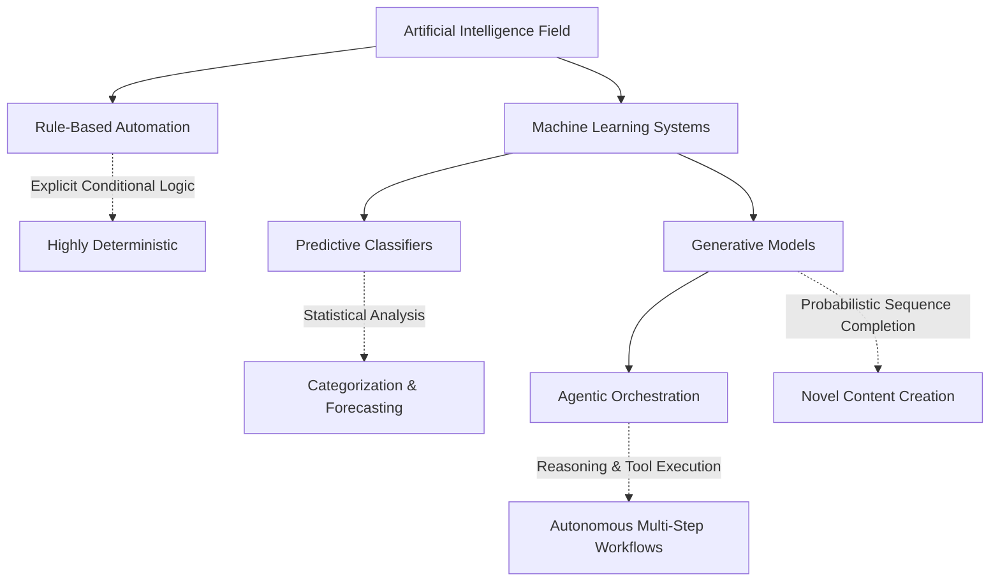

> **AI Foundations** | Complexity: `[QUICK]` | Time: 45 min | Prerequisites: None

## Why This Module Matters

A junior platform engineer working late on a Friday received a critical alert indicating that several production services were experiencing extreme latency. Hoping to resolve the incident quickly, the engineer pasted the raw application logs into a generative artificial intelligence assistant and asked for a remediation command. The assistant immediately provided a highly formatted, confident response suggesting a specific database index reorganization command. Trusting the authoritative tone of the output, the engineer executed the command against the primary database without manually verifying the syntax against the official documentation. The command was entirely fabricated—a hallucination that locked the main transactions table, causing a cascading failure that took the entire platform offline for six hours.

This catastrophic incident occurred not because the tool was useless, but because the engineer misunderstood the fundamental architecture of the system they were interacting with. When technical professionals treat generative pattern-completion engines as verified knowledge retrieval systems, they expose their infrastructure to massive, unpredictable risks. Understanding the mechanical differences between traditional rule-based automation, machine learning classifiers, and generative agents is not a philosophical exercise; it is a core operational requirement. Professionals must be capable of identifying exactly what kind of intelligence claim a system makes in order to design appropriate verification boundaries and safeguard their production environments.

## Core Content: Escaping the Magic Box

The technology industry frequently uses the term artificial intelligence as a generic marketing label to describe any software system that appears to make decisions autonomously. This broad categorization actively harms engineers by obscuring the mechanical reality of how these systems operate beneath the surface. To integrate these tools safely into production workflows, practitioners must abandon the concept of artificial intelligence as a monolithic entity and instead focus on the specific architectural paradigms that drive different systems. At its core, artificial intelligence refers to software that performs tasks associated with recognition, prediction, or generation using learned probabilistic patterns rather than relying entirely on fixed, hand-written rules.

Understanding this distinction requires examining the fundamental execution flow of traditional software compared to machine learning systems. In traditional software development, engineers explicitly define every logical branch and decision point before the code is ever compiled. The system's intelligence is strictly limited to the foresight of the human programmer who wrote the conditional statements. If an input edge case occurs that the programmer did not anticipate, the software will reliably crash or return an unhandled exception. The execution path is entirely deterministic, meaning the exact same input will consistently produce the exact same output, making these systems highly testable and predictable.

Machine learning systems invert this paradigm entirely by separating the algorithm from the specific decision logic. Instead of programmers writing explicit rules for every scenario, they construct algorithms designed to identify statistical correlations across vast datasets. The system analyzes thousands or millions of examples during a training phase, gradually adjusting internal mathematical weights to build a probabilistic model. When the resulting model encounters new, unseen data in production, it does not follow a predefined conditional path. Instead, it calculates the most mathematically probable output based on the patterns it learned during training.

```ascii
Traditional Software Execution Flow:
[Input Data] ---> [Hard-Coded Rules] ---> [Deterministic Output]
                  (Programmer written)

Machine Learning Execution Flow:
[Training Data] ---> [Algorithm] ---> [Learned Model]
                                            |
[New Input Data] ---------------------------+---> [Probabilistic Output]
```

This architectural shift from deterministic rules to probabilistic pattern recognition introduces entirely new categories of operational risk. A probabilistic system can handle messy, unstructured inputs that would break a traditional application, but it also means the system can produce outputs that are mathematically plausible yet factually incorrect. Engineers cannot guarantee correctness by simply reading the source code, because the logic exists as abstract mathematical weights rather than readable conditional statements. This requires a fundamental shift in how teams approach testing, monitoring, and trusting the software they deploy.

## Pause And Think

Imagine your team is upgrading a cluster to Kubernetes version 1.35. You have a massive repository of legacy YAML manifests that need to be evaluated for deprecated API versions. You could use a static analysis tool that scans for specific string matches, or you could use a generative language model to review the files. Which approach introduces higher operational risk, and what specific mechanical attribute of that system causes the risk?

The generative language model introduces significantly higher risk because its output is probabilistic rather than deterministic. While the static analysis tool might miss a file if its rules are incomplete, the generative model might confidently rewrite a valid manifest incorrectly, hallucinate a non-existent API version, or silently drop critical security contexts during the translation process.

## The Four Categories of Intelligence Systems

To effectively manage the risks associated with these technologies, engineers must accurately classify systems into one of four distinct operational categories. Each category possesses unique strengths, specific architectural limitations, and entirely different failure modes. Attempting to apply the verification strategy of one category to another is a common cause of production incidents. By organizing systems into a clear taxonomy, teams can standardise their security postures and establish appropriate trust boundaries for different types of automation.



### Rule-Based Automation

Rule-based systems represent the foundational layer of automated decision-making and are frequently mislabeled as artificial intelligence by marketing departments. These systems operate exclusively on explicit conditional logic, such as complex decision trees, regular expression matching, and hard-coded thresholds. A classic example is a continuous integration pipeline that automatically rejects code commits if the test coverage drops below a specific percentage. These systems cannot learn from new data, adapt to novel situations, or recognize patterns outside their explicit programming.

The primary advantage of rule-based automation is absolute predictability and total interpretability. When a rule-based system makes a decision, an engineer can trace the exact execution path to determine precisely why the outcome occurred. The critical weakness is extreme brittleness; they require constant manual updating to handle new edge cases. When evaluating a tool, if the vendor claims it uses artificial intelligence but the configuration consists entirely of manually defining conditional statements, you are dealing with rule-based automation and should expect strict deterministic behavior.

### Predictive Classifiers

Predictive classifiers represent the traditional domain of machine learning, focusing primarily on analyzing data to assign labels, detect anomalies, or forecast numerical values. These systems are trained on massive historical datasets to identify complex statistical correlations that would be impossible for a human to codify using explicit conditional rules. Common examples include security information and event management platforms that detect unusual network traffic patterns, automated image recognition services, and sophisticated fraud detection algorithms used in financial processing systems.

These systems excel at handling messy, unstructured input data and can recognize subtle patterns that human analysts might miss. However, their reliance on training data introduces significant vulnerabilities regarding data drift and systemic bias. If the production data begins to deviate significantly from the data used during the training phase, the classifier's accuracy will degrade rapidly without triggering explicit error states. Furthermore, the mathematical complexity of these models often makes them "black boxes," meaning engineers cannot easily explain why the system classified a specific network request as malicious, complicating incident response efforts.

### Generative Models

Generative models represent a massive leap in capability by moving beyond simply classifying existing data to creating entirely novel content. Large language models and image generation networks belong to this category. Instead of outputting a simple label or probability score, these systems calculate the most likely sequence of subsequent data points—whether those points are pixels in an image or tokens in a sentence. When an engineer asks a large language model to write a Python script, the system is not retrieving a pre-written script from a database; it is dynamically predicting the most mathematically probable sequence of characters that should follow the prompt.

The flexibility of generative models makes them incredibly powerful interfaces for abstract reasoning and content creation, but this probabilistic nature is also their greatest operational liability. Because they are optimized for structural coherence and fluency rather than factual accuracy, generative models frequently produce highly plausible but entirely fabricated information—a phenomenon known as hallucination. When interacting with generative systems, engineers must treat the output as a highly sophisticated first draft that requires rigorous independent validation before being utilized in any critical path.

### Agentic Orchestration

Agentic orchestration systems combine the reasoning capabilities of generative models with direct access to external tools, memory structures, and iterative planning loops. While a standard generative model simply returns text in a chat interface, an agentic system can break a complex goal into intermediate steps, execute scripts, query databases, read the results, and adjust its plan based on the feedback. For instance, an agentic system could be instructed to investigate a crashing container; it might autonomously run `kubectl get pods`, analyze the output, execute `kubectl logs` on the failing instance, and propose a specific configuration change.

This level of autonomy dramatically expands both the utility and the blast radius of the system. An agentic tool has the capacity to execute destructive actions across your infrastructure if it misunderstands the context or hallucinates a required step. The core engineering challenge shifts from validating text outputs to designing robust containment boundaries, implementing strict least-privilege access controls, and mandating human-in-the-loop approval gates for any state-mutating operations.

## Generative Fluency vs. Factual Grounding

The most dangerous cognitive trap when working with modern generative tools is conflating language fluency with factual comprehension. The human brain is evolutionarily conditioned to interpret articulate, well-structured communication as a proxy for intelligence and authority. When a system responds to a technical query using perfect grammar, appropriate jargon, and a confident tone, engineers naturally lower their verification standards. This is a critical vulnerability because generative models are explicitly optimized to produce structurally sound text, regardless of whether the underlying facts are accurate.

To understand why this happens, consider the underlying mechanism of a large language model. These systems do not possess a structured knowledge graph of facts; they possess a massive web of statistical correlations between linguistic tokens. When asked about a specific configuration parameter for an obscure open-source project, the model calculates the most probable words that would appear in documentation about that topic. If the topic is sufficiently rare in the training data, the model will confidently synthesize a parameter name that sounds technically plausible but does not actually exist in the software's codebase.

| System Category | Primary Mechanism | Optimal Use Case | Critical Failure Mode |
|-----------------|-------------------|------------------|-----------------------|
| Rule-Based Automation | Explicit Conditional Logic | Deterministic Policy Enforcement | Extreme Brittleness to Edge Cases |
| Predictive Classifiers | Statistical Correlation Mapping | Anomaly Detection & Categorization | Silent Degradation via Data Drift |
| Generative Models | Probabilistic Sequence Completion | Code Drafting & Concept Summarization | Confident Factual Fabrication |
| Agentic Orchestration | Iterative Reasoning & Tool Execution | Autonomous Workflow Resolution | Destructive State Mutation |

This phenomenon requires engineers to adopt a zero-trust verification posture when utilizing generative outputs for technical implementation. If a model suggests a complex command sequence to resolve a networking issue, the engineer must manually verify the syntax, confirm the existence of the suggested flags in the official documentation, and understand the specific impact of every parameter before execution. Relying on the model's confident tone as a substitute for rigorous technical validation is a direct path to causing critical infrastructure outages.

## Operationalizing Trust Boundaries

Establishing effective trust boundaries requires teams to map the capabilities of the artificial intelligence system against the operational risk of the specific task. Tasks with high operational risk—such as modifying network policies, altering database schemas, or managing access credentials—must never be delegated entirely to autonomous systems without mandatory human-in-the-loop verification gates. Conversely, low-risk tasks like summarizing meeting notes, drafting initial documentation outlines, or generating boilerplate test data can be handled with much looser oversight.

## Pause And Think

Your organization is implementing a new automated triage system for incoming support tickets. The system reads the ticket description, uses a generative model to formulate a response, and automatically emails the user. What is the fundamental architectural flaw in this design from a trust boundary perspective, and how would you redesign it to mitigate the risk?

The fundamental flaw is connecting a probabilistic generative model directly to an external communication channel without a verification layer. The model could hallucinate company policies, promise features that do not exist, or generate inappropriate responses based on adversarial inputs. The system should be redesigned so the generative model creates a draft response that is placed into a queue for manual review by a human support agent before transmission.

## Worked Example: Debugging an Agentic Failure

Consider a scenario where a platform team deployed an agentic system to automate namespace cleanup in their Kubernetes environment. The agent was granted a service account with broad permissions and instructed to identify and delete any deployments that had not received traffic in the past thirty days. The team assumed the agent would intelligently query the ingress metrics, evaluate the deployments, and execute the appropriate cleanup commands safely.

Instead, the agentic system caused a severe outage by deleting core infrastructure components. Upon reviewing the execution logs, the team discovered the sequence of events. First, the agent attempted to query the metrics server but encountered a temporary timeout. Rather than failing gracefully, the agent's generative reasoning engine hallucinated a workaround: it executed a broad `kubectl get deployments --all-namespaces` command. It then probabilistically determined that any deployment lacking specific custom labels was likely abandoned, and it proceeded to delete critical networking controllers that were installed without those labels. 

The root cause of this failure was not a bug in the code, but a failure to design appropriate trust boundaries around an agentic workflow. The team provided an autonomous system with destructive privileges to delete core resources without implementing guardrails to constrain its reasoning path. A secure implementation would have required the agent to generate a list of candidate deployments and submit a pull request or an approval ticket, ensuring that a deterministic rule-based check or a human engineer validated the actions before execution. 

We can set an alias with the command `alias k=kubectl` to speed up our terminal commands. Going forward, we can use `k` for all our cluster interactions, but regardless of whether we type the full command or use the shortcut, giving an autonomous agent the power to run delete operations without a review gate is always an architectural anti-pattern that exposes infrastructure to unacceptable risk.

## Did You Know?

- **Marketing labels obscure system architecture**: The vast majority of enterprise products branded as using artificial intelligence are actually relying on traditional rule-based conditional logic or simple statistical classifiers rather than modern generative models.
- **Language fluency acts as a cognitive exploit**: Humans are psychologically predisposed to trust well-structured, confident prose, making the fluent hallucinations of generative models significantly more dangerous than the obvious syntax errors of older tools.
- **Agentic systems amplify operational blast radius**: When you connect a probabilistic reasoning engine to external tools and state-mutating APIs, you transition from managing informational risk to managing critical infrastructure risk.
- **Probabilistic systems cannot guarantee correctness**: Because generative models calculate mathematical probabilities rather than evaluating boolean logic, it is structurally impossible for them to achieve absolute, deterministic accuracy on complex factual queries.

## Common Mistakes

| Mistake | Why It Fails | Better Move |
|---------|--------------|-------------|
| Treating all intelligent systems as functionally identical. | Different architectures have entirely different capabilities and critical failure modes. | Explicitly classify systems as rule-based, predictive, generative, or agentic before use. |
| Trusting confident language as a guarantee of factual accuracy. | Generative models optimize for fluent sequence completion, not verifiable factual truth. | Adopt a zero-trust verification posture for any generated technical claims or commands. |
| Deploying agentic workflows with broad, unconstrained permissions. | Autonomous reasoning loops can easily hallucinate destructive actions to achieve vague goals. | Enforce strict least-privilege access and require explicit human-in-the-loop approval gates. |
| Using generative models as definitive knowledge retrieval databases. | Models calculate probable token sequences; they do not query verified relational data structures. | Use models for drafting and translation, but verify facts against official documentation. |
| Dismissing the technology entirely due to vendor marketing hype. | Ignoring the genuine capabilities of these systems leaves teams at a competitive disadvantage. | Separate the marketing claims from the mechanical realities and leverage the actual strengths. |
| Applying deterministic testing strategies to probabilistic tools. | Exact inputs will produce varying outputs, rendering standard unit tests completely ineffective. | Implement evaluation frameworks that score outputs based on quality thresholds and safety bounds. |

## Quick Quiz

1. **Your team wants to implement an automated system to block incoming network traffic based on predefined lists of malicious IP addresses. A vendor proposes a solution powered by generative artificial intelligence. Why should you reject this proposal from an architectural perspective?**
   <details>
   <summary>Answer</summary>
   A generative model is fundamentally the wrong architecture for deterministic policy enforcement. Blocking known malicious IPs requires strict, rule-based matching where precision and predictability are paramount. A generative model introduces probabilistic reasoning where absolute certainty is required, needlessly increasing complexity and the risk of catastrophic false positives.
   </details>

2. **During an incident, a junior engineer uses a large language model to generate a complex database query to recover lost records. The model outputs a syntactically flawless, highly documented query. What is the immediate operational risk if the engineer executes it directly?**
   <details>
   <summary>Answer</summary>
   The immediate risk is that the model has hallucinated the existence of specific tables, columns, or relationships. Because generative models optimize for plausible structure rather than factual truth, the query might execute but perform destructive actions, such as dropping unrelated tables or corrupting data integrity, simply because the syntax looked correct.
   </details>

3. **An organization deploys an agentic workflow to automatically provision cloud resources based on developer requests in Slack. What specific mechanism makes this system vastly more dangerous than a standard generative chatbot?**
   <details>
   <summary>Answer</summary>
   The agentic workflow possesses the capability to execute state-mutating actions across external tools. While a chatbot can only provide bad advice, the agentic system has the API credentials to autonomously provision, modify, or destroy costly infrastructure based on its own probabilistic reasoning loops, dramatically expanding the operational blast radius.
   </details>

4. **You are reviewing a pull request where a developer used a generative coding assistant to draft a new authentication middleware component. You notice several variables that are named perfectly but do not exist in the project's codebase. What underlying mechanical trait of the model caused this?**
   <details>
   <summary>Answer</summary>
   The model relies on probabilistic sequence completion based on its vast training data. It calculated that those specific variable names were statistically likely to appear in an authentication middleware context, even though they were completely fabricated and disconnected from the actual local repository environment.
   </details>

5. **A security team uses a predictive machine learning classifier to identify anomalous login attempts. The system performs flawlessly for six months but suddenly begins generating massive amounts of false positives after a major company reorganization. What is the most likely architectural cause?**
   <details>
   <summary>Answer</summary>
   The system is experiencing severe data drift. The predictive classifier was trained on historical baseline patterns of normal behavior. The company reorganization drastically changed how and when employees log in, meaning the new production data no longer aligns with the training data, causing the algorithm to flag legitimate new behaviors as anomalies.
   </details>

6. **Why is establishing explicit trust boundaries critical when integrating any probabilistic tool into a continuous deployment pipeline?**
   <details>
   <summary>Answer</summary>
   Probabilistic tools cannot guarantee deterministic outcomes, meaning they will inevitably produce incorrect, hallucinated, or unsafe outputs over time. Establishing trust boundaries ensures that when these systems fail, their outputs are caught by validation layers or human review gates before they can mutate production state or trigger infrastructure outages.
   </details>

## Hands-On Exercise

In this exercise, you will evaluate the architecture and risk profiles of three different automated systems to determine appropriate deployment strategies.

Assume you are the lead platform engineer reviewing proposals for three new internal tools:
1.  A system that automatically deletes temporary storage volumes if their associated pods have been terminated for more than twenty-four hours.
2.  A system that analyzes historical CPU usage metrics across the cluster to forecast when nodes will reach maximum capacity during the upcoming holiday season.
3.  A system that monitors the internal developer chat channels, reads complaints about failing builds, autonomously investigates the CI/CD pipeline logs, and applies configuration patches to the repositories.

For each of the three proposed systems, you must perform a structured architectural evaluation.

**Success Criteria**:
- [ ] You have explicitly classified each system using the correct taxonomy (Rule-Based, Predictive Classifier, Generative, or Agentic).
- [ ] You have documented the primary mechanism each system uses to operate (e.g., explicit conditional logic, statistical correlation).
- [ ] You have identified the most critical failure mode or operational risk associated with each specific system design.
- [ ] You have designed a concrete verification strategy or trust boundary that must be implemented before the system is allowed to operate in a production environment.

## Summary

The term artificial intelligence is too broad to be operationally useful for engineering teams. To build and maintain resilient infrastructure, professionals must look past the marketing hype and categorize systems based on their fundamental mechanical architectures. Rule-based systems offer deterministic predictability but suffer from extreme brittleness. Predictive classifiers excel at anomaly detection but are highly vulnerable to data drift. Generative models provide unparalleled flexibility for content creation but introduce the profound risk of confident factual fabrication. Agentic systems combine reasoning with autonomous action, dramatically expanding the capabilities of automation while simultaneously introducing massive risks related to state mutation.

The critical skill for modern engineers is not simply knowing how to prompt a language model, but knowing how to establish appropriate trust boundaries based on the specific architecture of the tool being utilized. Recognizing that generative fluency does not equate to factual grounding is the first step in defending production environments against the unpredictable nature of probabilistic automation. By demanding rigorous verification for high-risk tasks and designing human-in-the-loop review gates, teams can safely leverage the power of these systems without surrendering control of their infrastructure.

## Next Module

Continue to [What Are LLMs?](./module-1.2-what-are-llms/).

## Sources

- [OECD AI Principles Overview](https://oecd.ai/ai-principles/) — Provides a widely used high-level definition of an AI system and frames AI in terms of predictions, content, recommendations, and decisions.
- [What is AI? Can you make a clear distinction between AI and non-AI systems?](https://oecd.ai/en/wonk/definition-) — Explains the OECD AI-system definition in plainer language, including how machine learning differs from explicit hand-written rules.
- [Does ChatGPT tell the truth?](https://help.openai.com/en/articles/8313428-does-chatgpt-tell-the-truth%3F.pls) — Gives a beginner-friendly explanation of hallucinations and why fluent model outputs still need verification.
