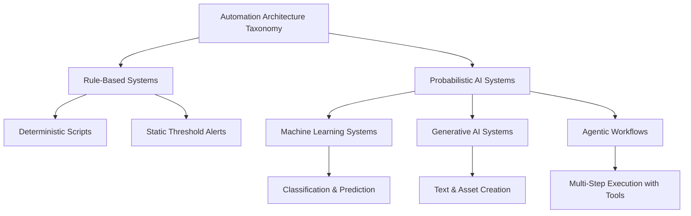

> **AI Foundations** | Complexity: `[QUICK]` | Time: 35-50 min

## Learning Outcomes

By the end of this module, you should be able to:
- Classify a given automation system into one of four AI architecture categories by identifying its operational mechanism and boundaries.
- Compare the risk profiles of rule-based systems, machine learning systems, generative AI, and agentic workflows when applied to infrastructure automation tasks.
- Design a trust boundary for an agentic workflow by mapping its destructive permissions to required human-approval gates.
- Evaluate the reliability of an AI-generated operational response by distinguishing between fluent language generation and factually grounded systemic reasoning.

## Why This Module Matters

An infrastructure engineer wakes up at 3:00 AM to a barrage of alerts indicating that the primary database is experiencing massive query latency. Groggy and stressed, they paste the complex error logs into a newly integrated generative AI assistant, asking for an immediate remediation script. The assistant quickly outputs a highly structured, perfectly formatted set of shell commands that promise to gracefully restart the connection pool and prune orphaned transactions. Because the response looks authoritative and uses the correct terminology, the engineer executes the script without deep inspection. Instead of fixing the latency, the script forcefully terminates all active connections and initiates a destructive rebuild of the primary index, causing a complete system outage. The engineer fell into the trap of confusing linguistic fluency with operational competence.

Understanding what Artificial Intelligence actually is—and more importantly, what it is not—is critical for modern engineering teams. As AI systems become deeply embedded into operational workflows, from intelligent alerting and automated remediation to code generation and architecture planning, the ability to accurately categorize these systems becomes a core safety skill. Treating a probabilistic generative model as if it were a deterministic rule-based script leads to catastrophic failures in production environments. Engineers must move beyond marketing terminology and learn to evaluate the specific architectural mechanisms, failure modes, and required trust boundaries of the tools they deploy. This module establishes that foundational taxonomy, transforming AI from a magical black box into a comprehensible engineering component with measurable operational risks.

## AI vs Ordinary Software

Traditional software engineering relies on deterministic, rule-based logic where a human programmer explicitly defines every decision pathway in advance. If a specific condition is met, the system executes a predetermined corresponding action, producing identical outputs for identical inputs every single time. This predictability is the foundation of traditional infrastructure automation, allowing engineers to build highly reliable systems by exhaustively mapping out expected states and edge cases. When a traditional system fails, it is almost always because a human failed to anticipate a specific condition or wrote flawed logic, making debugging a process of tracing the execution path to find the logical error. The mechanics of this approach are straightforward and highly visible, as demonstrated by this rudimentary scaling logic.

```text
if (cpu_utilization_percentage > 80) {
    execute_scale_up_procedure();
} else if (cpu_utilization_percentage < 20) {
    execute_scale_down_procedure();
} else {
    maintain_current_replica_count();
}
```

In stark contrast, artificial intelligence systems operate fundamentally differently by leveraging statistical approximations and learned patterns rather than explicit, hard-coded rules. Instead of an engineer writing a comprehensive list of instructions for every possible scenario, the system is fed massive amounts of data and utilizes complex mathematical algorithms to deduce the underlying structures and relationships on its own. When presented with new, unseen inputs, the AI system does not follow a predefined path but instead calculates the probability of various outcomes based on its learned internal representations. This probabilistic nature allows AI systems to handle incredibly complex, ambiguous tasks that would be impossible to program manually, such as recognizing natural language or detecting novel security anomalies. However, this power comes at the cost of strict determinism, meaning the system can produce different or unexpected outputs, requiring fundamentally different approaches to testing, monitoring, and establishing operational trust.

> **Active Learning: Predict the Failure Mode**
> Imagine you are replacing the deterministic scaling script above with a machine learning model trained to predict future CPU spikes based on historical traffic patterns. Before reading further, predict what might happen if a sudden, unprecedented marketing event drives a massive traffic spike that looks completely different from anything in the historical training data. How would the failure of the deterministic script differ from the failure of the machine learning model in this exact scenario?

## The Four Categories You Will Actually Meet

To effectively utilize modern automation tools without introducing unacceptable operational risks, engineers must categorize systems based on their underlying architectural mechanisms. The broad, marketing-driven term "AI" obscures critical differences in how systems make decisions, what inputs they require, and how they fail when encountering edge cases. By organizing these systems into a clear taxonomy ranging from rigid deterministic rules to autonomous probabilistic agents, teams can apply appropriate trust boundaries and verification strategies. The following diagram illustrates the relationship between these different operational architectures, separating traditional rule-based approaches from the probabilistic systems that constitute modern artificial intelligence.



### 1. Rule-Based Systems

Rule-based systems represent the traditional approach to software engineering and infrastructure automation, relying entirely on explicit, human-authored logic to process inputs and determine outputs. These systems excel in environments with clearly defined parameters and predictable failure domains, such as basic continuous integration pipelines, static alerting thresholds, and standard configuration management tools. Because their execution paths are entirely deterministic, rule-based systems are highly auditable, allowing engineers to precisely trace why a specific decision was made by simply reading the underlying code or configuration files. Their primary limitation is fragility in the face of ambiguity or unprecedented situations; if an input does not match a pre-programmed condition, the system will either fail safely or produce an unhandled exception, requiring constant manual updates to accommodate changing operational realities.

### 2. Machine Learning Systems

Machine learning systems move beyond hard-coded logic by utilizing statistical models that have been trained on historical datasets to identify patterns and make predictions or classifications on new, unseen data. In infrastructure contexts, these systems are typically deployed for tasks like predictive autoscaling, intelligent anomaly detection in metric streams, and automated log clustering, where the volume and complexity of data make manual rule creation impossible. Unlike generative models, traditional machine learning systems usually output specific classifications, probability scores, or numerical predictions rather than creating net-new unstructured content. To understand the mechanical contrast between this approach and ordinary software, consider the following logic-flow snippet that demonstrates how a trained model applies probabilistic weights rather than explicit conditional rules.

```text
historical_model_weights = load_trained_anomaly_model()
current_system_metrics = fetch_live_telemetry_data()
anomaly_probability_score = calculate_probability(current_system_metrics, historical_model_weights)

if (anomaly_probability_score > 0.95) {
    trigger_high_severity_incident_alert()
}
```

The primary risk profile of machine learning systems revolves around data drift and historical bias, where the system confidently makes incorrect predictions because the current operational environment has diverged significantly from the data used during training. Engineers must implement continuous monitoring of the model's performance metrics and establish clear fallback mechanisms for when the model's confidence scores drop below acceptable thresholds.

### 3. Generative AI Systems

Generative artificial intelligence represents a paradigm shift where massive neural networks, typically Large Language Models, are trained to predict the next logical token in a sequence, enabling them to produce highly fluent, unstructured content across a vast array of topics. These systems are incredibly flexible and are increasingly used by engineering teams to draft documentation, explain complex error messages, generate boilerplate configuration files, and assist in synthesizing post-incident review documents. Because they are designed to prioritize linguistic fluency and structural coherence, generative systems can rapidly accelerate workflows that involve translating intent into code or summarizing large volumes of text. However, this same architectural design leads to their most dangerous failure mode: producing entirely fabricated information, often called hallucinations, that sounds incredibly authoritative and plausible. A generative system will confidently invent nonexistent configuration flags, reference deprecated API endpoints as if they were current, or explain a fundamentally flawed architectural pattern with flawless grammar and logical flow, requiring engineers to rigorously verify every output before applying it to production environments.

### 4. Agentic Systems

Agentic systems represent the most operationally complex and potentially dangerous category, combining the reasoning and planning capabilities of generative models with direct access to external tools, APIs, and execution environments. Instead of simply generating a response for a human to review, an agentic workflow receives a high-level goal, autonomously formulates a multi-step execution plan, invokes specific tools to gather information or modify state, evaluates the results of its actions, and iteratively adjusts its approach until it determines the goal has been achieved. In an infrastructure context, an agentic system might be granted permissions to independently investigate a monitoring alert by querying logging databases, analyzing the results, and automatically deploying a configuration change to remediate the identified issue. While this level of autonomous orchestration promises massive efficiency gains, it dramatically expands the operational blast radius by removing the human from the immediate execution loop, requiring entirely new paradigms of identity management, strict principle-of-least-privilege access controls, and mandatory human-in-the-loop approval gates for any destructive actions.

## Worked Example: Debugging an Agentic Failure

Let's examine a concrete scenario where treating an agentic system like a traditional rule-based tool leads to a significant operational incident. An engineering team deployed a newly purchased autonomous remediation agent designed to automatically rollback container deployments if it detected a spike in application errors immediately following a rollout. The team granted the agent broad administrative permissions, assuming it would operate with the predictable reliability of their existing continuous delivery pipelines, and configured it to act immediately without any human approval gates to ensure minimal downtime. During a routine deployment of a non-critical background service, the application developers intentionally introduced a new, highly verbose logging format that output benign debug messages to the standard error stream, a change completely unrelated to the application's actual health or performance.

The agentic system, utilizing a generative model to analyze log streams, misinterpreted this sudden influx of unstructured debug information as a catastrophic failure, despite the fact that the actual HTTP error rates and latency metrics remained perfectly stable. Acting on this flawed probabilistic inference, the agent autonomously formulated a plan to remediate the perceived incident and executed a forceful rollback of the deployment, terminating the new pods and restoring the previous version. Furthermore, because the agent was designed to iteratively resolve issues, it became trapped in a destructive loop; every time the developers attempted to manually push the update forward, the agent immediately detected the new logging format, falsely declared an emergency, and violently reverted the system state, effectively locking the team out of their own environment. The engineers spent hours fruitlessly debugging their continuous integration pipelines and application code, assuming a standard deployment failure, before realizing the autonomous agent was overriding their commands based on a linguistic hallucination regarding the log contents. This incident perfectly illustrates why agentic systems require fundamentally different operational boundaries, specifically the necessity of correlating multiple deterministic metric signals before allowing an autonomous system to execute state-altering commands without explicit human authorization.

> **Active Learning: Designing the Trust Boundary**
> Review the incident above. If you were tasked with redesigning the deployment remediation workflow to utilize the agent safely, what specific operational boundaries would you implement? Think about how you would restrict the agent's permissions, what deterministic signals it must verify before acting, and where you would mandate a human-in-the-loop approval gate.

## Evaluating Trust and Establishing Boundaries

Successfully integrating artificial intelligence into engineering workflows requires abandoning the binary concept of absolute trust and replacing it with a nuanced, risk-based approach to system boundaries. Engineers must critically evaluate every AI tool by determining its specific architectural category, identifying its primary failure modes, and mapping those risks against the potential blast radius of the task it is performing. A machine learning model predicting optimal scaling parameters for a stateless application might operate safely with a high degree of autonomy, as the worst-case scenario is temporary over-provisioning and increased cloud costs, which can be mitigated with simple financial alerts and budget caps. Conversely, a generative system tasked with synthesizing security audit logs must be treated with extreme skepticism, as a fabricated finding or a missed anomaly could lead to a catastrophic breach, requiring mandatory peer review and cross-referencing against deterministic security scanners. By systematically applying appropriate trust boundaries, teams can harness the immense power of probabilistic systems while maintaining the rigorous safety and reliability standards required for modern infrastructure operations. To operationalize this approach, engineering teams must maintain an updated matrix of approved AI architectures alongside their required verification mechanisms, ensuring that every new tool introduced to the platform is properly constrained before it can impact production workloads.

| System Category | Typical Operational Use Case | Primary Failure Domain | Required Trust Boundary |
|-----------------|------------------------------|------------------------|-------------------------|
| Rule-Based Systems | Static threshold alerting and deterministic configuration | Brittleness when encountering unprecedented edge cases | Standard peer review and unit testing |
| Machine Learning | Predictive autoscaling and anomaly detection | Degradation due to training data drift and historical bias | Continuous confidence score monitoring and fallback rules |
| Generative AI | Documentation synthesis and incident summary drafting | Plausible but completely fabricated technical details | Mandatory independent verification against authoritative sources |
| Agentic Workflows | Autonomous alert remediation and infrastructure provisioning | Unbounded execution loops and destructive state changes | Strict human-in-the-loop approval gates for all actions |

## Did You Know?

- **Older AI is still everywhere**: Many systems currently marketed as revolutionary new AI products are actually utilizing traditional, well-understood machine learning classifiers or basic rule-based ranking pipelines under the hood.
- **Language fluency acts as a dangerous trust amplifier**: Human psychology naturally associates polished, confident, and highly structured prose with factual accuracy, making engineers significantly more likely to blindly trust a fluent but entirely hallucinated technical response.
- **Flexibility dramatically changes the risk profile**: As a system moves from narrow, specific tasks to broad, open-ended capabilities, the potential failure surface expands exponentially, making rigorous trust boundaries increasingly critical for operational safety.
- **The generic label obscures the underlying architecture**: Two completely different infrastructure tools might both be branded as "AI-powered," despite one utilizing a deterministic decision tree and the other leveraging a probabilistic agentic workflow with a vastly larger operational blast radius.

## Common Mistakes

| Mistake | Operational Consequence | Better Engineering Practice |
|---------|-------------------------|-----------------------------|
| Treating all AI systems as a single, uniform technology category | Masks drastically different risk profiles and failure domains | Categorize every new tool by its specific underlying architectural mechanism |
| Assuming linguistic fluency guarantees technical correctness | Leads to the deployment of hallucinated or fundamentally flawed configurations | Rigorously verify all generative outputs against official documentation or deterministic tests |
| Using "AI" as a shortcut term in architectural design discussions | Creates vague reasoning and prevents accurate threat modeling | Explicitly name the actual capability being used, such as "probabilistic classifier" |
| Assuming machine learning systems are infallible black boxes | Blinds teams to performance degradation caused by data drift over time | Implement continuous monitoring of prediction confidence and establish clear fallback rules |
| Dismissing all probabilistic systems entirely due to marketing hype | Prevents the adoption of highly effective anomaly detection and automation tools | Separate vendor marketing claims from the actual verifiable capabilities of the system |
| Trusting generative models most on tasks you understand the least | Creates massive operational blind spots and prevents critical error detection | Rely on AI primarily for accelerating tasks you already possess the expertise to evaluate |
| Deploying agentic workflows without human approval gates | Expands the automated blast radius and enables rapid, destructive system changes | Mandate human-in-the-loop authorization for any state-altering or destructive actions |

## Quick Quiz

1. **Your team wants to deploy a system that automatically categorizes incoming support tickets based on historical resolution data. Which architectural category best describes this tool, and what is its primary risk?**
   <details>
   <summary>Answer</summary>
   This is a Machine Learning System focused on classification. Its primary risk is historical bias or data drift, where it confidently miscategorizes novel issues because they do not match the patterns found in the training data.
   </details>

2. **A vendor pitches a new "AI DevOps Assistant" that can automatically write infrastructure-as-code templates based on natural language prompts. Why is this system significantly riskier than a standard configuration linter?**
   <details>
   <summary>Answer</summary>
   As a Generative AI System, it prioritizes linguistic fluency and structural coherence over factual accuracy. It can confidently fabricate deprecated configuration flags or insecure architectural patterns, whereas a standard linter relies on deterministic, auditable rules.
   </details>

3. **During a severe incident, an engineer uses a large language model to generate a complex database recovery script. The script is perfectly formatted and uses the correct terminology. Why must the engineer still independently verify every command?**
   <details>
   <summary>Answer</summary>
   Because impressive output is a weak trust signal. Generative models can produce highly structured, confident, and plausible-sounding code that is fundamentally incorrect or destructive, easily tricking users who mistake fluency for operational competence.
   </details>

4. **Your organization is implementing an autonomous agent designed to detect security vulnerabilities and automatically apply patches to running containers. What critical boundary must be established before enabling this system?**
   <details>
   <summary>Answer</summary>
   The system must have a strict human-in-the-loop approval gate. Agentic workflows have a massive operational blast radius, and allowing an autonomous system to execute state-altering changes without human authorization risks catastrophic downtime or cascading failures.
   </details>

5. **A legacy alerting system triggers a page every time CPU utilization exceeds 90% for five minutes. A new engineer suggests replacing it with an "AI model." What is the first question the team should ask before proceeding?**
   <details>
   <summary>Answer</summary>
   The team must ask what specific problem they are trying to solve and what kind of AI system is being proposed. Replacing a highly predictable, deterministic Rule-Based System with a probabilistic model introduces new failure modes that must be justified by a clear operational benefit.
   </details>

6. **An autonomous remediation workflow is stuck in an infinite loop, continuously restarting a healthy service because it misinterprets a new log format. What does this incident reveal about the difference between generative systems and human judgment?**
   <details>
   <summary>Answer</summary>
   It reveals that AI systems often lack basic factual grounding and real-world judgment. The system was unable to step back, correlate the logs with healthy performance metrics, and realize its probabilistic inference was fundamentally incorrect.
   </details>

## Hands-On Exercise

In this exercise, you will analyze the operational risks of different automation architectures by designing appropriate trust boundaries for a hypothetical production environment. You are tasked with safely integrating three distinct systems into your team's workflow.

**Scenario Context:**
Your platform engineering team manages a massive fleet of stateless microservices. You have been given approval to evaluate three new tools to reduce operational toil. For each tool, you must determine its architectural category, identify its primary failure mode, and establish a mandatory operational constraint before it can be deployed.

**The Tools:**
1. A static script that automatically deletes temporary cache files from all nodes every Sunday at midnight.
2. A dashboard widget that analyzes historical traffic patterns and predicts when you will need to manually scale up resources for upcoming marketing events.
3. An autonomous Slack bot that can read error alerts, query the production database for context, and independently execute database migrations to resolve schema mismatches.

**Success Criteria**:
- [ ] You have successfully classified the static script as a Rule-Based System and noted its primary failure mode is brittleness when encountering unexpected directory structures.
- [ ] You have classified the traffic predictor as a Machine Learning System and established a constraint that its predictions must be verified against current marketing schedules to account for data drift.
- [ ] You have accurately classified the autonomous Slack bot as an Agentic System, recognizing it carries the highest operational risk.
- [ ] You have mandated a strict human-in-the-loop approval gate for the Slack bot, ensuring it can never execute a database migration without explicit authorization from a senior engineer.

## Next Module

Continue to [What Are LLMs?](./module-1.2-what-are-llms/).

## Sources

- [OECD AI Principles Overview](https://oecd.ai/ai-principles/) — Provides a widely used high-level definition of an AI system and frames AI in terms of predictions, content, recommendations, and decisions.
- [What is AI? Can you make a clear distinction between AI and non-AI systems?](https://oecd.ai/en/wonk/definition-) — Explains the OECD AI-system definition in plainer language, including how machine learning differs from explicit hand-written rules.
- [Does ChatGPT tell the truth?](https://help.openai.com/en/articles/8313428-does-chatgpt-tell-the-truth%3F.pls) — Gives a beginner-friendly explanation of hallucinations and why fluent model outputs still need verification.
