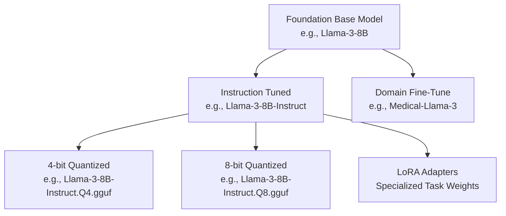

> **Open Models & Local Inference** | Complexity: `[INTERMEDIATE]` | Time: 45-60 min

## Learning Outcomes

- Evaluate open weight licensing restrictions to determine if a specific model can be legally deployed in a commercial enterprise environment.
- Analyze model cards to extract input modalities, tokenizer configurations, and hardware requirements before attempting to download checkpoint files.
- Differentiate between base, instruction-tuned, and quantized model variants to select the correct architecture for specific runtime hardware constraints.
- Compare major open model families based on their context window sizes, multilingual capabilities, and parameter footprints for targeted application use cases.

## Why This Module Matters

Consider an engineer tasked with adding an automated document summarization feature to their company's core product. They find a highly rated model on a community hub, download a massive twenty-gigabyte checkpoint file, and deploy it directly to a production cluster. The deployment immediately crashes with catastrophic out-of-memory errors across all worker nodes. After the engineering team provisions expensive graphics processing instances to force the model to run, the corporate legal team suddenly flags the entire deployment. The model's license strictly prohibits commercial usage without a negotiated paid agreement, meaning the engineer just exposed the company to massive compliance liabilities. This scenario illustrates a fundamental misunderstanding of the modern artificial intelligence ecosystem, where downloading a file is the final and least important step in the deployment pipeline.

The actual skill of working with open models lies in rigorous evaluation and environmental awareness. When you hear the term open model, you might incorrectly assume it means public domain, universally safe, and guaranteed to run on your local laptop. The reality is that the open ecosystem is a massive, decentralized registry of weights, architectures, and fine-tunes, each carrying highly specific hardware prerequisites and legal boundaries. Understanding how to navigate model hubs, read model cards critically, and select the appropriate variant for your infrastructure is the critical difference between a successful, secure deployment and a costly architectural failure.

## Decoding the Illusion of "Open"

The software engineering industry has spent decades standardizing the definition of open source software, but the machine learning ecosystem operates under entirely different paradigms. When a research organization releases an open model, they are rarely releasing the training data, the exact training code, or the proprietary cluster configurations used to generate the neural network. Instead, they are typically releasing what the industry refers to as open weights. This means you receive the final, compiled matrix of parameters and the architecture definition required to run inferences against them. You can execute the model locally, but you cannot easily inspect the dataset it learned from or reproduce the original training process from scratch. 

Because foundational weights are the product of millions of dollars of raw compute time, organizations protect them using specialized licensing structures rather than standard permissive software licenses like Apache or Massachusetts Institute of Technology licenses. For instance, several leading open model families utilize bespoke community licenses that grant broad usage rights but include specific commercial limitations based on monthly active users, or strictly prohibit using the model's outputs to train competing systems. A systems engineer must evaluate these terms exactly as they would evaluate the terms of a proprietary software vendor. Deploying a restricted model without verifying the license can poison your entire application stack with severe compliance violations.

**Active Learning Prompt:** Imagine your team builds an internal continuous integration debugging tool using an open-weights model that explicitly forbids commercial deployment. Because the tool is strictly internal and never exposed to customers, are you insulated from licensing violations? Take a moment to think about how corporate compliance defines commercial benefit. Even internal tools that optimize commercial operations typically fall under commercial use clauses, meaning you must secure an enterprise agreement or switch to a truly permissive alternative architecture.

## The Anatomy of a Model Hub

A model hub serves as the central registry and version control system for machine learning artifacts, functioning much like a container registry does for microservices. However, while a container registry primarily holds immutable image layers that execute consistently, a model hub repository contains a complex constellation of interdependent configuration files. When you browse a repository on a platform like Hugging Face, you are not just looking at a simple download link for a massive binary file. You are looking at the entire configuration state required to instantiate the complex neural network directly into system memory.

Inside a standard model repository, you will find the weights serialized into formats like Safetensors or PyTorch binaries, typically split across multiple chunked files to handle network interruptions during massive downloads. Alongside the weights sits the core configuration file defining the tensor shapes, attention heads, and neural network layers. Crucially, the repository also contains the tokenizer configuration, which dictates exactly how raw text strings are mapped into the numerical tokens the model actually understands. If you attempt to run the weights with a mismatched or missing tokenizer, the model will output unpredictable gibberish, highlighting exactly why the hub treats these files as an inseparable package.

```ascii
+-------------------------------------------------------------+
|                 Model Hub Repository                        |
|                                                             |
|  +--------------------+   +------------------------------+  |
|  | Documentation      |   | Configuration Artifacts      |  |
|  |                    |   |                              |  |
|  | - README.md        |   | - config.json                |  |
|  |   (Model Card)     |   | - tokenizer_config.json      |  |
|  | - license.txt      |   | - generation_config.json     |  |
|  +--------------------+   +------------------------------+  |
|                                                             |
|  +-------------------------------------------------------+  |
|  |                 Weight Artifacts                      |  |
|  |                                                       |  |
|  | - model-00001-of-00004.safetensors  (4.5 GB)          |  |
|  | - model-00002-of-00004.safetensors  (4.5 GB)          |  |
|  | - model-00003-of-00004.safetensors  (4.5 GB)          |  |
|  | - model-00004-of-00004.safetensors  (1.2 GB)          |  |
|  +-------------------------------------------------------+  |
+-------------------------------------------------------------+
```

## Worked Example: Analyzing a Model Card

The most critical file in any model repository is the model card, which serves as the architectural blueprint and safety datasheet for the artificial intelligence system. A model card is fundamentally different from a standard software readme file. It documents the empirical bounds of the system, detailing exactly what data the model was exposed to, what biases it might exhibit, and what specific benchmarks it has successfully passed. Skipping the model card and proceeding straight to downloading the weights is a guaranteed path to deploying an inadequate or highly dangerous application. Let us demonstrate how a senior engineer evaluates a model card using a real-world example: deploying an eight-billion parameter instruction-tuned model.

When you open the model card, the first section you must locate is the Intended Use declaration. In our example model, the card explicitly states it is designed for commercial and research use in the English language, primarily targeting chat and dialogue use cases. If your project involves translating complex legal documents into Japanese, the model card has already told you this specific system will fail, saving you the bandwidth and compute costs of testing it. The intended use section establishes the baseline functional boundaries, warning you away from tasks like medical diagnosis or autonomous financial decision-making where the model has not been validated.

Next, you must evaluate the Hardware Requirements and Context Window specifications. Our example card indicates a parameter count of eight billion and an eight-thousand token context window limit. As a reliable rule of thumb, running an eight-billion parameter model in sixteen-bit precision requires roughly sixteen gigabytes of video memory. If your Kubernetes deployment environment only consists of worker nodes with eight gigabytes of random access memory and no dedicated graphics processing units, you immediately know this specific baseline artifact is incompatible with your infrastructure. You must either upgrade your physical hardware footprint or seek out a heavily compressed version of the model.

Finally, you must rigorously scrutinize the Bias and Limitations disclosures. Every foundational model contains statistical biases inherited directly from its vast training data. The model card for our example explicitly notes that the system may produce inaccurate information regarding historical events and is highly susceptible to generating harmful text if deliberately bypassed using adversarial prompts. This explicitly tells your engineering team that you cannot deploy this model directly to end-users without implementing a dedicated intermediary safety filtering layer to catch malicious inputs and toxic outputs.

## The Ecosystem of Model Variants

The baseline model you initially find on a hub is rarely the exact model variant you will end up deploying in a production environment. The open ecosystem is defined by a massive secondary market of modifications, where a single foundational release branches into hundreds of highly specialized variants. Understanding this branching structure is critical because the base model released by a major research laboratory is essentially just a raw autocomplete engine. It is not designed to follow instructions, answer questions, or format code; it is only designed to predict the next logical token in a sequence based purely on its training corpus.

To make these neural networks useful for application development, they must undergo a secondary training phase called instruction tuning. The resulting Instruct or Chat variant is what you actually need for building conversational agents or task-solving application systems. If you accidentally download a foundation base model and prompt it with a question, it might respond by generating ten more similar questions rather than providing a structured answer. You must always verify whether the repository name or model card explicitly indicates that the weights have been tuned for dialogue or instruction following.



Beyond behavioral instruction tuning, models branch extensively via quantization. Quantization is the mathematical process of reducing the precision of the numerical weights from thirty-two or sixteen-bit floats down to eight-bit, four-bit, or even lower numerical representations. This process drastically shrinks the memory footprint of the model, allowing massive neural networks to run efficiently on consumer-grade hardware. When you browse a major model hub, you will see entirely separate repositories dedicated exclusively to providing quantized versions of popular models in formats like GGUF, which are heavily optimized for running on standard central processing units. Selecting the right quantization level is a constant architectural balancing act between massive memory savings and a slight degradation in the model's complex reasoning capabilities.

**Active Learning Prompt:** You find two repositories for the exact same instruction-tuned model. One contains pure Safetensors files totaling sixteen gigabytes. The other contains a single GGUF file totaling five gigabytes. If your deployment environment is an edge device with limited unified memory and no dedicated graphics card, which variant must you choose and what trade-off are you accepting? You must choose the heavily quantized GGUF file because the uncompressed model will immediately trigger an out-of-memory kernel panic. The trade-off is that the four-bit quantization process slightly alters the model's numerical precision, which may result in minor drops in complex reasoning or formatting accuracy.

## Evaluating Major Model Families

The landscape of open models is dominated by several distinct architectural families, each backed by different research organizations and mathematically optimized for different operational use cases. You should never default to a single family out of brand loyalty or market hype. Instead, you must rigorously evaluate them based on their context windows, parameter efficiency, and ecosystem tooling support. The Llama family, pioneered by Meta, is often considered the baseline standard for open weights. Because of its massive global popularity, it enjoys unparalleled support across all inference engines, quantization tools, and fine-tuning frameworks. If you are building a general-purpose reasoning engine and have standard enterprise hardware, Llama variants are typically the safest architectural starting point.

The Mistral family emerged by prioritizing extreme parameter efficiency and architectural innovations like sliding window attention. Mistral models consistently punch above their weight class, often outperforming models twice their mathematical size in logical reasoning benchmarks. If your infrastructure is strictly constrained by memory bandwidth or you require high throughput on smaller edge deployment nodes, Mistral variants provide an exceptional balance of inference speed and structural competence. Their core architecture was specifically designed to prove that you do not need seventy billion parameters to achieve highly sophisticated instruction following capabilities.

When your application requires robust multilingual capabilities or deep coding proficiency, the Qwen family, developed by Alibaba Cloud, often leads the global pack. While Western-developed models frequently suffer massive performance degradation in non-Latin scripts, Qwen was trained on a heavily diverse global dataset from its inception. If you are building an application that must seamlessly pivot between English, Arabic, and Mandarin within the exact same context window, Qwen variants will typically drastically outperform equivalent Llama models. Similarly, the Gemma family from Google offers exceptionally tight integration with the broader Google Cloud ecosystem and is built on the identical underlying research as their proprietary Gemini models, making them highly effective for developers already entrenched in that specific architectural landscape.

## Did You Know?

- Did you know that the term "Safetensors" refers to a file format developed explicitly to prevent malicious code execution? Older machine learning formats like PyTorch pickles could execute arbitrary Python code upon loading, meaning downloading a model was equivalent to downloading a random executable script.
- Did you know that a model's context window represents a hard mathematical limit in its attention mechanism? If you feed a document that exceeds the context window size, the model does not simply summarize the end; it physically cannot process the overflowing tokens and will drop context entirely.
- Did you know that quantization is often applied dynamically during loading rather than just statically residing in the file? Some advanced inference servers can take a massive sixteen-bit model and compress it into eight-bit precision on the fly as it is loaded directly into the graphics processing unit memory.
- Did you know that the tokenizer is completely independent of the neural network architecture? The tokenizer is essentially a static dictionary that maps character chunks to integer IDs, and swapping tokenizers between incompatible models will result in catastrophic structural failure during inference.

## Common Mistakes

| Mistake | Why It Hurts | Better Move |
|---|---|---|
| Selecting models by leaderboard rank alone | Leaderboards measure academic benchmarks that rarely translate to specific production domain performance. | Evaluate models using custom, domain-specific evaluation datasets that reflect your actual user inputs. |
| Downloading base models for chat applications | Base models only predict the next token and will fail to answer questions or follow formatting instructions. | Always verify the repository explicitly contains an instruction-tuned or chat-optimized variant. |
| Ignoring the commercial license restrictions | Deploying a restricted model in an enterprise product exposes the organization to massive legal compliance liabilities. | Audit the license file in the model hub repository before running the very first test inference. |
| Attempting to load unquantized models on edge nodes | Full-precision models will immediately exhaust system memory and trigger kernel panics or out-of-memory kills. | Select aggressively quantized GGUF variants designed specifically for constrained central processing unit environments. |
| Assuming open weights means open training data | You cannot verify the safety or bias of the training data because it is almost never released alongside the weights. | Rely on the model card's documented limitations and implement robust post-generation safety filtering. |
| Neglecting to download the matching tokenizer files | The neural network will receive mismatched token IDs, causing it to generate complete and unpredictable gibberish. | Ensure your inference engine pulls the `tokenizer.json` and config files alongside the core tensor weights. |
| Overlooking context window limitations | Passing documents larger than the model's attention mechanism supports will result in silent truncation and lost data. | Calculate your maximum expected input tokens and select a model family built for long-context retrieval. |
| Failing to verify the required input modality | Passing image data to a text-only architecture results in immediate pipeline failures and crash loops. | Verify the exact input and output modalities defined in the model card before constructing the API payload. |

## Quick Quiz

1. **Scenario: Your development team is building a proprietary customer service chatbot. An engineer suggests downloading a highly capable open-weights model that is governed by a strict non-commercial research license, arguing that because the inference runs entirely on internal corporate servers, it is not a commercial deployment. Evaluate this architectural decision.**
   <details>
   <summary>Answer</summary>
   This is a critical licensing violation. Internal corporate tools that support commercial operations, like customer service routing, are universally classified as commercial use under these specific licenses. You must select a model with a permissive license like Apache 2.0 or secure a commercial enterprise agreement.
   </details>

2. **Scenario: You deploy a new language model to your production cluster, but when users submit technical questions, the model responds by generating a long list of similar, slightly rephrased questions instead of providing any answers. Diagnose the most likely architectural mistake made during deployment.**
   <details>
   <summary>Answer</summary>
   The engineer downloaded the foundation base model instead of the instruction-tuned variant. Base models are only trained to predict the next logical token in a sequence, so they often continue a pattern of questions rather than switching to an answering format.
   </details>

3. **Scenario: Your Kubernetes worker nodes are equipped with thirty-two gigabytes of standard system memory and no dedicated graphics processing units. You need to deploy a highly capable seven-billion parameter model. Determine the necessary model format and variant required to achieve stable inference in this specific hardware environment.**
   <details>
   <summary>Answer</summary>
   You must select a heavily quantized variant formatted as GGUF. Running a full-precision model would likely exceed the system memory bandwidth, while GGUF is specifically engineered to run efficiently on standard central processing units using compressed four-bit or eight-bit mathematical weights.
   </details>

4. **Scenario: During a critical incident response, an engineer discovers that the inference server is successfully loading a massive multi-gigabyte weight file into memory, but every text response generated by the application consists of completely random, unreadable characters and disjointed symbols. Identify the missing or mismatched configuration component.**
   <details>
   <summary>Answer</summary>
   The tokenizer configuration is mismatched or completely missing. The tokenizer maps raw text strings to the specific integer IDs the neural weights expect. If the tokenizer is wrong, the model processes the wrong mathematical inputs and outputs absolute garbage text.
   </details>

5. **Scenario: Your data science team needs to build a document analysis pipeline that must accurately process English legal contracts, Mandarin regulatory filings, and Arabic compliance reports within the exact same active user session. Evaluate which major open model family provides the strongest baseline architecture for this specific requirement.**
   <details>
   <summary>Answer</summary>
   The Qwen family is the optimal choice for this scenario. Unlike models heavily biased toward Western datasets, Qwen was explicitly trained on a massive multilingual corpus from its inception, making it exceptionally capable at handling diverse global scripts and complex cross-lingual context switching.
   </details>

6. **Scenario: You are rigorously reviewing a model card for a newly released vision-language model. The intended use section explicitly states "research purposes only for image captioning" and the limitations section warns of "high hallucination rates on medical imagery." An ambitious engineer wants to use it to pre-screen patient X-rays to save radiologists time. Decide how to proceed based purely on the model card.**
   <details>
   <summary>Answer</summary>
   Reject the deployment architecture immediately. The model card explicitly establishes that medical imagery is completely outside the intended use boundaries and highlights a known critical limitation regarding medical hallucinations, making it fundamentally unsafe for any patient screening scenarios.
   </details>

## Hands-On Exercise

Your task is to navigate a major model hub, evaluate a specific architecture, and document the deployment constraints based purely on the provided repository artifacts.

1. Navigate to a major model registry like Hugging Face and search for the `meta-llama/Meta-Llama-3-8B-Instruct` repository.
2. Open the model card and locate the hardware sizing recommendations. Document the exact memory footprint required to run the model in its native sixteen-bit precision format.
3. Analyze the licensing section. Identify the specific monthly active user threshold that triggers a requirement for a commercial enterprise agreement.
4. Search the hub for a quantized GGUF variant of the exact same instruction-tuned model. Compare the file size of the four-bit quantization against the original Safetensors artifacts.
5. Review the files tab of the base repository. Locate and open the `tokenizer_config.json` file to identify the specific token limit or vocabulary size utilized by the architecture.

**Success Criteria**
- [ ] You have identified the exact memory requirements for native precision inference.
- [ ] You can articulate the commercial user limits defined by the bespoke community license.
- [ ] You have located a GGUF variant and calculated the storage footprint reduction achieved by four-bit quantization.
- [ ] You have successfully extracted the vocabulary size from the tokenizer configuration artifact.

## Next Module

Continue to [Hugging Face for Learners](./module-1.2-hugging-face-for-learners/).

## Sources

- [Gated Models](https://huggingface.co/docs/hub/en/models-gated) — Explains how public model pages can still require approval, access requests, or license acknowledgment.
- [Model Cards](https://huggingface.co/docs/hub/model-cards) — Describes the documentation fields learners should inspect, including intended use, limitations, and licensing context.
- [The Model Hub](https://huggingface.co/docs/hub/en/models-the-hub) — Provides a primary-source overview of what a model hub contains and how repositories are organized.
