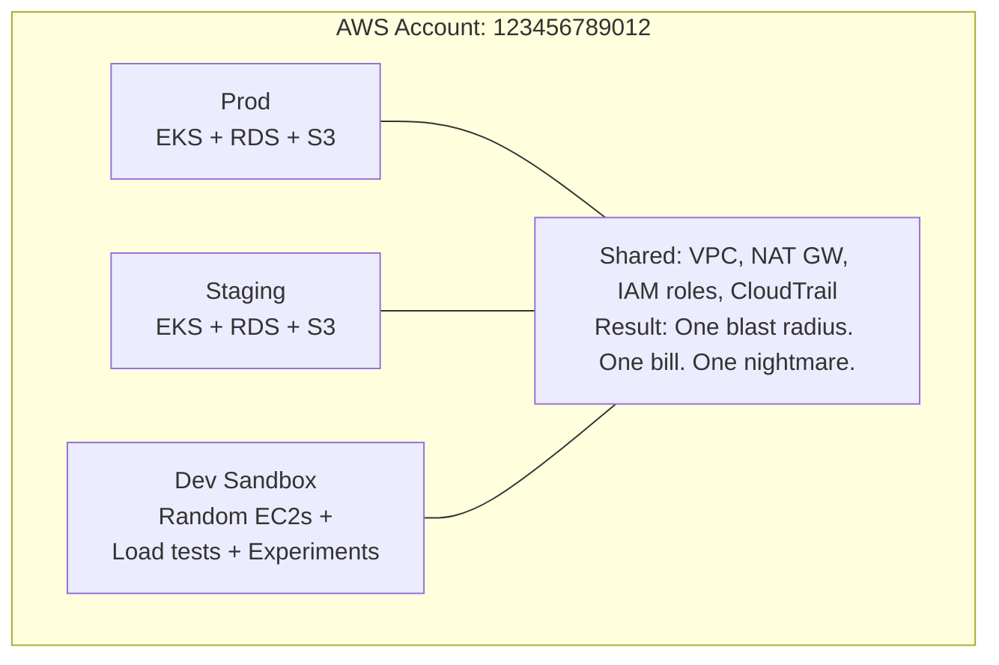
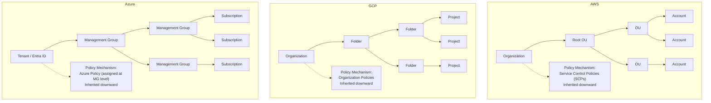
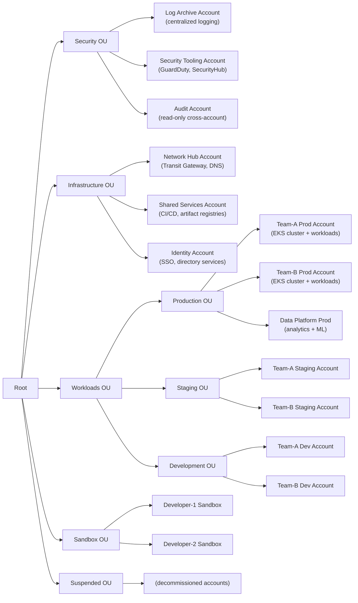
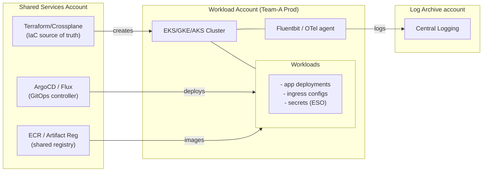
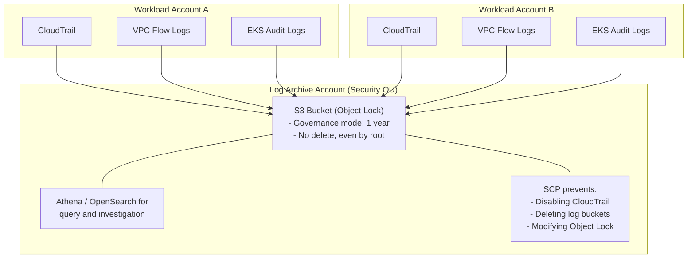
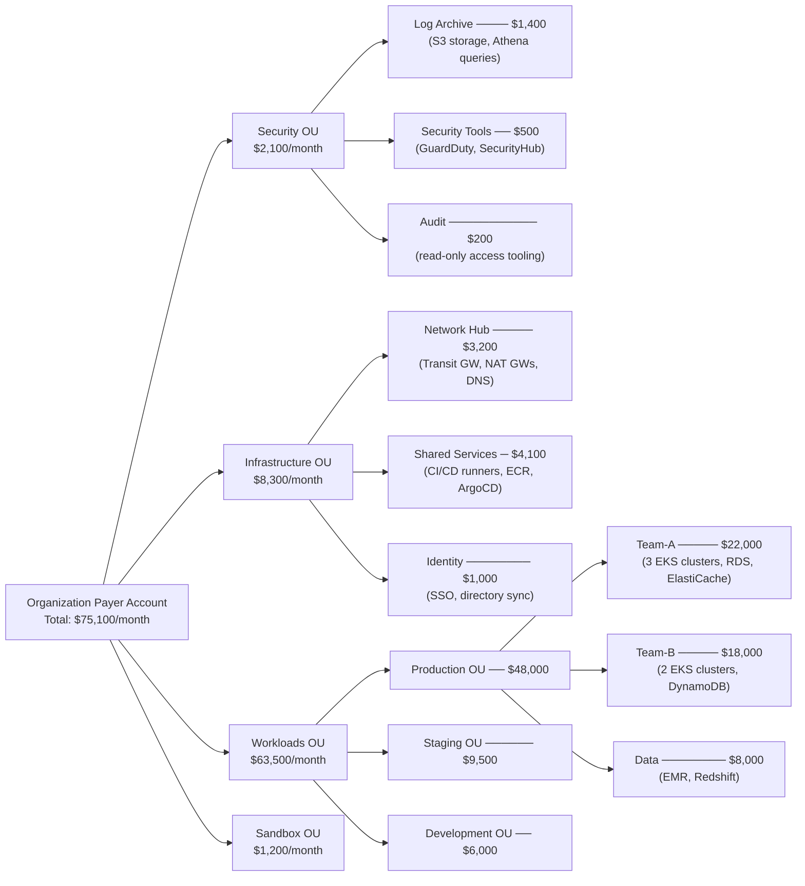
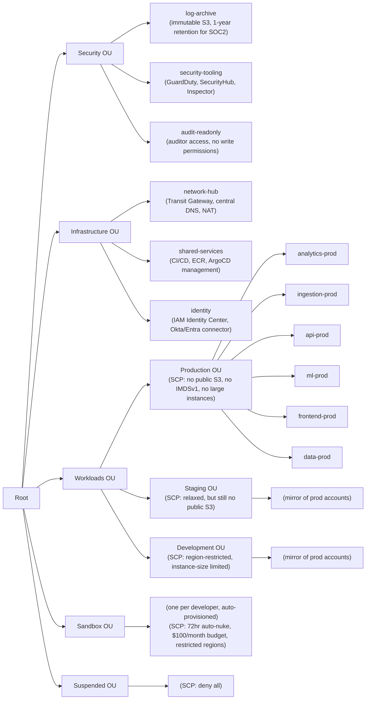

> **Complexity**: `[COMPLEX]`
>
> **Time to Complete**: 2.5 hours
>
> **Prerequisites**: [Cloud Architecture Patterns](/cloud/architecture-patterns/), familiarity with at least one hyperscaler (AWS, GCP, or Azure)
>
> **Track**: Advanced Cloud Operations

## What You'll Be Able to Do

After completing this module, you will be able to:

- **Design multi-account organization structures using AWS Organizations, GCP Folders, and Azure Management Groups**
- **Implement automated account vending pipelines that provision new cloud accounts with security guardrails built in**
- **Configure cross-account networking with Transit Gateway, Shared VPC, and VNet peering for hub-spoke topologies**
- **Evaluate account-per-team vs account-per-environment strategies for blast radius isolation and compliance**

---

## Why This Module Matters

**March 2019. A mid-sized fintech company. 42 engineers. One AWS account.**

Everything lived together: production databases, staging environments, CI/CD pipelines, developer sandboxes, and the shared services that glued it all together. One Friday afternoon, a junior developer running load tests in what they believed was a staging environment accidentally saturated the NAT Gateway that production traffic also depended on. Payment processing halted for 93 minutes. The incident cost $2.1 million in failed transactions and triggered a PCI-DSS audit that consumed two months of engineering time.

The root cause was not the load test. It was the architecture -- or rather, the lack of it. When everything lives in a single account, there are no blast radius boundaries. IAM policies become impossibly complex. Cost attribution is guesswork. Audit trails are a tangled mess of production and development activity. And one mistake in any environment can cascade into every other.

This module teaches you how to design multi-account architectures across AWS, GCP, and Azure. You will learn to build organizational hierarchies that enforce isolation by default, centralize what should be shared (logging, security, networking), and keep what should be separate truly separate. More importantly, you will understand how these decisions directly impact your Kubernetes clusters -- where they live, how they communicate, and who controls their lifecycle.

---

## The Single-Account Trap

Before we design multi-account architectures, let's understand why teams end up in single-account messes. The pattern is always the same:

1. Start a project. Create one account. Deploy everything.
2. Grow the team. Add more workloads. Still one account.
3. Need staging. Create a namespace or tag. Still one account.
4. Need compliance. Realize IAM policies are spaghetti. Panic.

The single-account model works for a solo developer building a side project. It stops working the moment you need any of these: environment isolation, cost visibility, compliance boundaries, or team autonomy.

> **Stop and think**: Consider a scenario where an attacker compromises a developer's IAM credentials in a single-account setup. Even if the developer only has permissions for staging resources, how might the shared underlying control plane (like API rate limits or centralized networking) still allow the attacker to impact production availability?



Problems:
- Dev load test saturates prod NAT Gateway
- IAM role for staging accidentally gets prod DB access
- Cost report says "$84,000 this month" but WHO spent it?
- CloudTrail logs mix dev experiments with prod audit events

The multi-account model solves all of these by creating hard boundaries. An AWS account, a GCP project, or an Azure subscription is the strongest isolation boundary each cloud offers below the organization level.

---

## Organizational Hierarchies Across Clouds

Every hyperscaler provides a hierarchy for organizing accounts. The terminology differs, but the concept is the same: nest accounts inside groupings that inherit policies downward.

### The Rosetta Stone of Cloud Organization



### Key Differences That Matter

| Feature | AWS (Organizations) | GCP (Resource Manager) | Azure (Management Groups) |
|---|---|---|---|
| Isolation unit | Account | Project | Subscription |
| Max nesting depth | 5 levels of OUs | 10 levels of folders | 6 levels of MGs |
| Policy mechanism | SCPs (deny-only) | Org Policies (boolean/list) | Azure Policy (deny + audit) |
| Billing boundary | Account-level | Project-level or Billing Account | Subscription-level |
| Hard resource limits | Per-account quotas | Per-project quotas | Per-subscription quotas |
| Cross-boundary networking | VPC Peering, Transit GW | Shared VPC, VPC Peering | VNet Peering, Virtual WAN |

One critical nuance: AWS SCPs can only deny -- they cannot grant permissions. This means your SCP strategy is about guardrails, not access grants. GCP Organization Policies work differently: they constrain resource configurations (e.g., "VMs can only be created in these regions"). Azure Policy can both deny and audit, making it the most flexible but also the most complex to reason about.

---

## Designing Your OU Structure

The organizational unit (OU) structure is the skeleton of your cloud architecture. Get it wrong, and you will fight it for years. Get it right, and it becomes invisible -- quietly enforcing isolation, compliance, and cost boundaries.

### The Reference Architecture

Here is a battle-tested OU structure used by organizations running 20-200 AWS accounts. The same pattern maps to GCP folders and Azure management groups.



### Why This Structure Works

**Security OU at the top**: Security accounts have the most restrictive SCPs. The Log Archive account is write-only for other accounts and read-only for security teams. No one can delete CloudTrail logs. No one can disable GuardDuty findings.

**Infrastructure OU is separate from Workloads**: The networking team manages Transit Gateways and DNS without needing access to application workloads. The CI/CD pipeline runs in a shared services account, pushing artifacts that workload accounts pull.

**Workloads OU splits by environment, not team**: This is critical. If you split by team first, you end up with Team-A-Prod, Team-A-Staging, Team-A-Dev all in one OU. This makes it impossible to apply environment-specific policies (like "production accounts cannot have public S3 buckets") without per-account exceptions.

> **Pause and predict**: If an organization structures its top-level OUs by business unit (e.g., Marketing, Engineering, HR) instead of environment (Prod, Staging, Dev), how will the cloud platform team have to manage SCPs for organization-wide security mandates? What operational bottlenecks will this create during compliance audits?

**Sandbox OU has aggressive cost controls**: Sandbox accounts get auto-nuke policies (using tools like aws-nuke) that clean up resources older than 72 hours. Budget alarms fire at $50/month. This gives developers freedom to experiment without burning money.

### Setting Up AWS Organizations

```bash
# Create the organization (from management account)
aws organizations create-organization --feature-set ALL

# Create the OU structure
ROOT_ID=$(aws organizations list-roots --query 'Roots[0].Id' --output text)

# Create top-level OUs
SECURITY_OU=$(aws organizations create-organizational-unit \
  --parent-id $ROOT_ID \
  --name "Security" \
  --query 'OrganizationalUnit.Id' --output text)

INFRA_OU=$(aws organizations create-organizational-unit \
  --parent-id $ROOT_ID \
  --name "Infrastructure" \
  --query 'OrganizationalUnit.Id' --output text)

WORKLOADS_OU=$(aws organizations create-organizational-unit \
  --parent-id $ROOT_ID \
  --name "Workloads" \
  --query 'OrganizationalUnit.Id' --output text)

# Create environment sub-OUs under Workloads
PROD_OU=$(aws organizations create-organizational-unit \
  --parent-id $WORKLOADS_OU \
  --name "Production" \
  --query 'OrganizationalUnit.Id' --output text)

STAGING_OU=$(aws organizations create-organizational-unit \
  --parent-id $WORKLOADS_OU \
  --name "Staging" \
  --query 'OrganizationalUnit.Id' --output text)

DEV_OU=$(aws organizations create-organizational-unit \
  --parent-id $WORKLOADS_OU \
  --name "Development" \
  --query 'OrganizationalUnit.Id' --output text)

# Create a new account and move it to the Production OU
aws organizations create-account \
  --email "team-a-prod@company.com" \
  --account-name "Team-A-Production"

# Move account to Production OU (once created)
aws organizations move-account \
  --account-id 111122223333 \
  --source-parent-id $ROOT_ID \
  --destination-parent-id $PROD_OU
```

### GCP Equivalent with Folders

```bash
# Create folder structure
ORG_ID=$(gcloud organizations list --format="value(ID)")

# Create top-level folders
gcloud resource-manager folders create \
  --display-name="Security" \
  --organization=$ORG_ID

gcloud resource-manager folders create \
  --display-name="Infrastructure" \
  --organization=$ORG_ID

WORKLOADS_FOLDER=$(gcloud resource-manager folders create \
  --display-name="Workloads" \
  --organization=$ORG_ID \
  --format="value(name)")

# Create environment sub-folders
gcloud resource-manager folders create \
  --display-name="Production" \
  --folder=$WORKLOADS_FOLDER

gcloud resource-manager folders create \
  --display-name="Staging" \
  --folder=$WORKLOADS_FOLDER

# Create a project in the Production folder
gcloud projects create team-a-prod-2026 \
  --folder=$PROD_FOLDER_ID \
  --name="Team A Production"
```

---

## Workload Isolation Patterns

Not every team needs its own account. And not every workload needs its own cluster. The art is matching isolation level to actual requirements.

### Isolation Decision Matrix

| Requirement | Same Account, Same Cluster | Same Account, Separate Clusters | Separate Accounts |
|---|---|---|---|
| Team autonomy | Low (shared RBAC) | Medium (cluster admin) | High (account admin) |
| Blast radius | Pod/Namespace level | Cluster level | Account level |
| Compliance boundary | Cannot achieve PCI/HIPAA | Possible with effort | Clean boundary |
| Cost visibility | Tags only | Tags + cluster | Account-level billing |
| Network isolation | NetworkPolicy | VPC/subnet separation | VPC per account |
| Resource contention | High risk | Medium risk | Zero risk |
| Operational overhead | Low | Medium | High |

### The War Story: When Namespace Isolation Isn't Enough

A healthcare company ran production workloads in a single EKS cluster, using namespaces for isolation between teams. Their compliance team signed off because NetworkPolicies were in place. Then during a PCI audit, the auditor asked: "Can a pod in namespace `team-b` read the Kubernetes API and discover that namespace `team-a-pci` exists?" The answer was yes. Due to overly permissive default RBAC configurations, `kubectl get namespaces` worked for any authenticated service account in the cluster. The auditor flagged it as a data leakage risk -- not because data was exposed, but because the existence of a PCI workload was discoverable.

The fix required separate clusters. But by then, 14 teams had built tooling assuming a single cluster. The migration took five months.

Lesson: decide your isolation boundaries before you have tenants, not after.

> **Stop and think**: NetworkPolicies in Kubernetes can restrict traffic between namespaces, but they cannot restrict access to the Kubernetes API itself. If two distinct compliance zones (like PCI and non-PCI) share a cluster, what specific API discovery techniques could a compromised non-PCI pod use to map out the PCI infrastructure, even with perfectly configured NetworkPolicies?

### Kubernetes Lifecycle in a Multi-Account World

Each account that runs Kubernetes clusters needs a clear lifecycle model:



Key principle: Clusters are CATTLE, not pets.
The IaC in Shared Services can recreate any cluster from scratch.

The critical decision is whether each team manages their own cluster infrastructure or whether a platform team provisions clusters centrally. Most organizations that scale past five teams find that central provisioning with team-owned workload deployment strikes the best balance.

---

## Centralized Logging & Audit

In a multi-account world, logging becomes both more important and more complex. You need a single pane of glass for security events, but you also need to ensure that no individual account can tamper with its own logs.

### The Immutable Log Archive Pattern



### AWS: Organization-Wide CloudTrail

```bash
# Create organization trail (from management account)
aws cloudtrail create-trail \
  --name org-trail \
  --s3-bucket-name company-org-cloudtrail-logs \
  --is-organization-trail \
  --is-multi-region-trail \
  --enable-log-file-validation \
  --kms-key-id arn:aws:kms:us-east-1:999888777666:key/mrk-abc123

aws cloudtrail start-logging --name org-trail

# SCP to prevent member accounts from disabling CloudTrail
cat <<'EOF' > deny-cloudtrail-changes.json
{
  "Version": "2012-10-17",
  "Statement": [
    {
      "Sid": "ProtectCloudTrail",
      "Effect": "Deny",
      "Action": [
        "cloudtrail:StopLogging",
        "cloudtrail:DeleteTrail",
        "cloudtrail:UpdateTrail"
      ],
      "Resource": "arn:aws:cloudtrail:*:*:trail/org-trail"
    }
  ]
}
EOF

aws organizations create-policy \
  --name "ProtectCloudTrail" \
  --description "Prevent member accounts from disabling org CloudTrail" \
  --type SERVICE_CONTROL_POLICY \
  --content file://deny-cloudtrail-changes.json

# Attach SCP to the root (applies to ALL accounts)
aws organizations attach-policy \
  --policy-id p-1234567890 \
  --target-id $ROOT_ID
```

> **Pause and predict**: An attacker gains full administrative access to a workload account and discovers they cannot disable CloudTrail due to an organizational SCP. Given that they still control the local compute resources, what alternative tactics might they employ to obscure their malicious activities or degrade the central logging system without ever touching the CloudTrail configuration?

### GCP: Organization-Level Log Sinks

```bash
# Create organization-level log sink
gcloud logging sinks create org-audit-sink \
  storage.googleapis.com/company-org-audit-logs \
  --organization=$ORG_ID \
  --include-children \
  --log-filter='logName:"cloudaudit.googleapis.com"'

# Grant the sink's service account write access to the bucket
# (The sink creates a unique service account automatically)
SINK_SA=$(gcloud logging sinks describe org-audit-sink \
  --organization=$ORG_ID \
  --format="value(writerIdentity)")

gsutil iam ch $SINK_SA:objectCreator gs://company-org-audit-logs
```

### EKS Audit Logs to Central Logging

Kubernetes audit logs are separate from cloud-level audit trails. You need both.

```yaml
# Fluentbit ConfigMap to ship EKS audit logs to central account
apiVersion: v1
kind: ConfigMap
metadata:
  name: fluent-bit-config
  namespace: logging
data:
  fluent-bit.conf: |
    [SERVICE]
        Flush         5
        Log_Level     info
        Parsers_File  parsers.conf

    [INPUT]
        Name              tail
        Tag               kube.audit.*
        Path              /var/log/kubernetes/audit/*.log
        Parser            json
        Refresh_Interval  10
        Mem_Buf_Limit     50MB

    [OUTPUT]
        Name              s3
        Match             kube.audit.*
        bucket            central-audit-logs-cross-account
        region            us-east-1
        role_arn          arn:aws:iam::999888777666:role/audit-log-writer
        total_file_size   50M
        upload_timeout    60s
        s3_key_format     /eks-audit/$TAG/%Y/%m/%d/%H/$UUID.gz
        compression       gzip
```

---

## Shared Services: What to Centralize

Not everything should be isolated. Some resources are natural shared services that benefit from centralization. The challenge is identifying which ones and building the right access patterns.

### Centralize vs. Distribute Decision Framework

| Resource | Centralize | Distribute | Reasoning |
|---|---|---|---|
| Container registry | Yes | | One source of truth for images, scan once |
| CI/CD pipelines | Yes | | Consistent build process, shared runners |
| DNS management | Yes | | Single delegation, avoid split-brain |
| Secrets management | Hybrid | Hybrid | Central vault, local caching (ESO pattern) |
| Service mesh control | Depends | Depends | Centralize if cross-cluster, distribute if single |
| Monitoring stack | Yes | | Unified dashboards, correlation across clusters |
| Cluster provisioning (IaC) | Yes | | Consistent configs, version control |
| Application deployment | | Yes | Teams own their deploy cadence |

> **Stop and think**: Centralizing CI/CD pipelines in a shared services account establishes a single source of truth, but it also means the deployment runners require highly privileged cross-account access to modify production resources. How must you design the IAM trust boundaries so that a compromised runner cannot arbitrarily pivot and destroy resources across the entire organization?

### The Shared VPC Pattern (GCP)

GCP's Shared VPC is one of the cleanest implementations of centralized networking. A host project owns the VPC, and service projects attach to it.

```bash
# Enable Shared VPC in the host project (network hub)
gcloud compute shared-vpc enable network-hub-project

# Associate a service project (workload account)
gcloud compute shared-vpc associated-projects add team-a-prod \
  --host-project=network-hub-project

# Grant the service project's GKE service account access to the shared subnet
gcloud projects add-iam-policy-binding network-hub-project \
  --member="serviceAccount:service-TEAM_A_PROJECT_NUM@container-engine-robot.iam.gserviceaccount.com" \
  --role="roles/container.hostServiceAgentUser"

# Create a GKE cluster in the service project using the shared VPC
gcloud container clusters create team-a-prod \
  --project=team-a-prod \
  --network=projects/network-hub-project/global/networks/shared-vpc \
  --subnetwork=projects/network-hub-project/regions/us-central1/subnetworks/team-a-subnet \
  --cluster-secondary-range-name=pods \
  --services-secondary-range-name=services
```

This gives you centralized network management (firewall rules, routes, IP allocation) while letting each team own their cluster and workloads. The networking team sees all traffic flows. The application team sees only their project.

---

## Hierarchical Billing & Cost Allocation

Multi-account architecture gives you the most accurate cost attribution possible -- costs are naturally isolated to the account that incurred them.

### AWS: Consolidated Billing with Cost Allocation Tags

```bash
# Enable cost allocation tags at the organization level
aws ce update-cost-allocation-tags-status \
  --cost-allocation-tags-status \
    TagKey=Environment,Status=Active \
    TagKey=Team,Status=Active \
    TagKey=CostCenter,Status=Active

# Create a budget per workload account
aws budgets create-budget \
  --account-id 111122223333 \
  --budget '{
    "BudgetName": "team-a-prod-monthly",
    "BudgetLimit": {"Amount": "15000", "Unit": "USD"},
    "TimeUnit": "MONTHLY",
    "BudgetType": "COST"
  }' \
  --notifications-with-subscribers '[
    {
      "Notification": {
        "NotificationType": "ACTUAL",
        "ComparisonOperator": "GREATER_THAN",
        "Threshold": 80,
        "ThresholdType": "PERCENTAGE"
      },
      "Subscribers": [
        {"SubscriptionType": "EMAIL", "Address": "team-a-lead@company.com"},
        {"SubscriptionType": "SNS", "Address": "arn:aws:sns:us-east-1:111122223333:budget-alerts"}
      ]
    }
  ]'
```

### Cost Hierarchy Visualization



With single-account: "$75,100 — but we have no idea where it goes"
With multi-account:  Per-team, per-environment breakdown by default

### Pro tip: Tagging standards across accounts

Even with multi-account, you still need consistent tags for cross-cutting views. Define a tagging policy at the organization level.

```bash
# AWS: Create a tag policy (enforced via Organizations)
cat <<'EOF' > tag-policy.json
{
  "tags": {
    "Environment": {
      "tag_key": {"@@assign": "Environment"},
      "tag_value": {"@@assign": ["production", "staging", "development", "sandbox"]},
      "enforced_for": {"@@assign": ["ec2:instance", "eks:cluster", "rds:db"]}
    },
    "Team": {
      "tag_key": {"@@assign": "Team"},
      "enforced_for": {"@@assign": ["ec2:instance", "eks:cluster"]}
    },
    "CostCenter": {
      "tag_key": {"@@assign": "CostCenter"},
      "enforced_for": {"@@assign": ["ec2:instance", "eks:cluster", "rds:db", "s3:bucket"]}
    }
  }
}
EOF

aws organizations create-policy \
  --name "RequiredTags" \
  --type TAG_POLICY \
  --content file://tag-policy.json

aws organizations attach-policy \
  --policy-id p-tag12345 \
  --target-id $WORKLOADS_OU
```

---

## Did You Know?

1. **AWS Control Tower can provision a landing zone in under 60 minutes** that creates your management account, log archive account, audit account, and baseline SCPs. What used to take weeks of manual setup is now a wizard. GCP has a similar concept called "Fabric FAST" and Azure has "Enterprise-Scale Landing Zones" -- all three try to codify the multi-account best practices described in this module.

2. **GCP projects have a soft limit of 30 projects per billing account** but this can be raised to thousands. The real constraint is that every project gets its own set of quotas (API calls, resource limits), which means you sometimes need to spread workloads across projects to avoid hitting per-project ceilings -- not for organizational reasons, but for capacity.

3. **The AWS "Root" account email is the most powerful credential in your organization** and cannot be protected by SCPs. If someone compromises the root email address of your management account, they control your entire organization. Best practice: use a distribution list email (not a personal inbox), enable MFA with a hardware token, and store the credentials in a physical safe. This is not hyperbole.

4. **Azure Management Groups support "deny assignments"** that are even stronger than role assignments. A deny assignment at a management group level prevents any user, even Owner, from performing specific actions on resources below. This is how Azure enforces compliance for regulated industries -- the hierarchy physically prevents non-compliant configurations.

---

## Common Mistakes

| Mistake | Why It Happens | How to Fix It |
|---|---|---|
| Organizing OUs by team instead of environment | Feels natural to team ownership | Structure by environment first, team second. Apply environment policies at the OU level. |
| Running everything in the management/payer account | "It's the first account, might as well use it" | Management account should run NOTHING except billing and organization management. Zero workloads. |
| Not creating a Suspended OU | Forgot about account decommissioning | Create a Suspended OU with SCPs that deny all actions. Move decommissioned accounts here instead of closing them (closing has a 90-day reopen window). |
| Sharing VPCs across environments | Trying to save on NAT Gateway costs | Separate VPCs per environment. The $30/month NAT Gateway savings is not worth the blast radius. |
| Manual account creation | "We only need a few accounts" | Automate with Account Factory (Control Tower), Terraform, or Crossplane from day one. Even if you only have three accounts. |
| Forgetting centralized DNS | Each account creates its own hosted zone | Create a central DNS account with Route53/Cloud DNS. Delegate subdomains to workload accounts via NS records. |
| No SCP/policy guardrails on day one | "We'll add governance later" | Apply baseline SCPs immediately: deny disabling CloudTrail, deny leaving the organization, restrict regions. |
| One IAM Identity Center permission set for all environments | "Admin is admin" | Create separate permission sets for prod (read-only default, break-glass for write) vs dev (broader access). |

---

## Quiz

<details>
<summary>1. Scenario: You have inherited an AWS environment where the primary data warehouse runs in the organization's management (payer) account to "save on NAT gateway costs." Your security team wants to apply a new Service Control Policy (SCP) to restrict access to certain regions globally. How does the placement of this data warehouse impact your security posture?</summary>

The management account is strictly exempt from Service Control Policies (SCPs), meaning any workload running within it operates completely outside the organization's automated guardrails. If an SCP is applied to restrict regions, the data warehouse and any other resources in the management account will entirely bypass these restrictions. Furthermore, running workloads in this account needlessly expands the attack surface of your most privileged environment, which inherently possesses access to billing data and org-wide settings. To maintain strict security boundaries, the management account must be reserved solely for billing and organization administration, with zero active workloads.
</details>

<details>
<summary>2. Scenario: Your cloud engineering team is migrating a multi-account architecture from AWS to GCP. In AWS, you relied on an SCP that explicitly denied the `s3:DeleteBucket` action to prevent accidental data loss. A junior engineer proposes creating an identical "deny action" Organization Policy in GCP for Cloud Storage. Why will this approach fail, and what is the fundamental difference in how these two mechanisms operate?</summary>

AWS SCPs function as strict IAM permission boundaries that can only explicitly deny API actions, effectively filtering what user policies are allowed to execute regardless of their granted permissions. Conversely, GCP Organization Policies do not evaluate IAM actions; instead, they constrain the actual configuration state of resources, such as enforcing that buckets must have uniform bucket-level access enabled or restricting resource creation to specific regions. The engineer's approach will fail because GCP Organization Policies cannot deny specific API calls like bucket deletion. You must adapt your strategy to use GCP's resource configuration constraints combined with proper IAM role scoping to achieve the same data protection goals.
</details>

<details>
<summary>3. Scenario: A fast-growing software company has 8 development teams. Each team manages 2 EKS clusters: one for staging and one for production. The CTO suggests creating 8 AWS accounts (one per team) to keep the billing simple. What critical security and operational risks does this 8-account strategy introduce, and what is the recommended alternative?</summary>

Using an 8-account strategy mixes staging and production environments within the same blast radius, meaning a misconfigured IAM role or a runaway process in staging could directly compromise or degrade production resources. Furthermore, this structure makes it impossible to apply environment-wide Service Control Policies (SCPs), such as enforcing strict public access blocks exclusively on all production accounts, without creating complex, per-account exceptions. The recommended alternative is to use 16 accounts—one per team per environment—which establishes a hard boundary that naturally aligns with environment-specific SCPs. The operational overhead of managing 16 accounts instead of 8 is negligible when utilizing automated account vending solutions like AWS Control Tower or Terraform.
</details>

<details>
<summary>4. Scenario: An enterprise currently allows each of its 15 workload accounts to host its own container registry. A recent security audit revealed that 40% of deployed images contain critical vulnerabilities, and patching them requires coordinating with all 15 account owners. How would migrating to a centralized container registry in a shared services account resolve this operational bottleneck?</summary>

A centralized container registry establishes a single, authoritative source of truth for all container images across the organization, eliminating image sprawl and version inconsistencies. By consolidating images, security teams can implement a unified scanning pipeline where an image is scanned exactly once upon push, and vulnerabilities are caught before the image is distributed to workload accounts. This architecture also drastically simplifies CI/CD workflows, as pipelines only need to push to one destination while workload accounts securely pull images using cross-account IAM resource policies. Ultimately, this reduces storage costs for duplicate images and shifts the security enforcement point to a single, manageable chokepoint.
</details>

<details>
<summary>5. Scenario: A platform team identifies an orphaned AWS account previously used by a departed contractor. The account contains an active Amazon Route 53 hosted zone serving production DNS records. To immediately stop the billing charges, an administrator clicks "Close Account" without deleting the resources. What are the immediate and long-term consequences of this action?</summary>

When an AWS account is closed, it enters a 90-day suspended state where it becomes completely inaccessible via the console or API, but the underlying resources are not immediately destroyed. During this period, the active Route 53 hosted zone will continue to route traffic, but you will be entirely unable to modify or manage those DNS records if an emergency arises. After the 90-day window, AWS will permanently close the account and begin a non-deterministic deletion of resources, potentially causing a catastrophic outage when the DNS records are eventually purged. To avoid this, best practices dictate moving the account to a Suspended OU with a "deny all" SCP to stop activity, allowing administrators to safely identify, migrate, or manually delete critical resources before initiating the final closure.
</details>

<details>
<summary>6. Scenario: A multi-national corporation is designing a hub-and-spoke network topology to connect 50 regional workload environments. The AWS architecture team plans to use VPC Peering between every account, while the GCP team proposes a Shared VPC model. What architectural scaling challenges will the AWS team face with their approach compared to the GCP team's strategy?</summary>

The AWS team's VPC Peering approach relies on a decentralized, point-to-point model, meaning connecting 50 environments requires creating and managing an N-squared mesh of peering connections, each with its own independent route tables and security groups. This rapidly becomes an operational nightmare to maintain, audit, and troubleshoot at scale, which is why AWS Transit Gateway is typically recommended for this volume. In contrast, GCP's Shared VPC uses a centralized model where a single host project manages one unified VPC, its subnets, and its firewall rules, while service projects simply deploy resources into those shared subnets. This allows the GCP networking team to maintain centralized visibility and control over all traffic flows without the compounding complexity of point-to-point peering.
</details>

<details>
<summary>7. Scenario: To boost developer velocity, an organization provides 50 engineers with their own personal AWS sandbox accounts, granting them full administrative access to experiment. After three months, the monthly cloud bill spikes by $15,000, primarily driven by forgotten GPU instances and unattached EBS volumes. How does implementing automated resource cleanup solve this issue beyond just reducing costs?</summary>

While the immediate benefit of automated resource cleanup is stopping the financial bleed caused by abandoned infrastructure, its deeper value lies in enforcing an ephemeral mindset and reducing the attack surface. Forgotten resources like unpatched EC2 instances or exposed load balancers inevitably become critical security vulnerabilities over time, providing attackers with easy footholds into the organization. By automatically wiping resources older than 48 to 72 hours, you proactively eliminate these lingering security risks while simultaneously removing the "guilt barrier" for developers, allowing them to freely experiment knowing the system will clean up after them. This practice ensures sandbox environments remain safe, cost-effective scratchpads rather than permanent, unmanaged technical debt.
</details>

---

## Hands-On Exercise: Design a Multi-Account Architecture

In this exercise, you will design and partially implement a multi-account architecture for a fictional company.

### Scenario

**Company**: CloudBrew (a SaaS analytics platform)
- 6 engineering teams
- 3 environments: production, staging, development
- Compliance requirement: SOC2 Type II (audit logs must be immutable for 1 year)
- Budget: team-level cost attribution required for quarterly planning
- Kubernetes: each team runs 1-2 EKS clusters per environment

### Task 1: Draw the OU Structure

Design the OU hierarchy for CloudBrew. Include all accounts, organized by OU.

<details>
<summary>Solution</summary>



Total accounts: 3 (security) + 3 (infra) + 18 (workloads: 6 teams x 3 envs) + N (sandboxes) = 24 + sandboxes
</details>

### Task 2: Write the Baseline SCP

Write an SCP that should apply to ALL member accounts (attached at the root).

<details>
<summary>Solution</summary>

```json
{
  "Version": "2012-10-17",
  "Statement": [
    {
      "Sid": "DenyCloudTrailTampering",
      "Effect": "Deny",
      "Action": [
        "cloudtrail:StopLogging",
        "cloudtrail:DeleteTrail",
        "cloudtrail:UpdateTrail"
      ],
      "Resource": "arn:aws:cloudtrail:*:*:trail/org-trail"
    },
    {
      "Sid": "DenyLeavingOrganization",
      "Effect": "Deny",
      "Action": "organizations:LeaveOrganization",
      "Resource": "*"
    },
    {
      "Sid": "DenyDisablingGuardDuty",
      "Effect": "Deny",
      "Action": [
        "guardduty:DeleteDetector",
        "guardduty:DisassociateFromMasterAccount",
        "guardduty:UpdateDetector"
      ],
      "Resource": "*"
    },
    {
      "Sid": "RestrictToAllowedRegions",
      "Effect": "Deny",
      "NotAction": [
        "iam:*",
        "organizations:*",
        "sts:*",
        "support:*",
        "billing:*"
      ],
      "Resource": "*",
      "Condition": {
        "StringNotEquals": {
          "aws:RequestedRegion": [
            "us-east-1",
            "us-west-2",
            "eu-west-1"
          ]
        }
      }
    }
  ]
}
```
</details>

### Task 3: Configure Cross-Account ECR Access

Write the ECR repository policy that allows all workload accounts to pull images from the shared services account's ECR.

<details>
<summary>Solution</summary>

```bash
# In the shared-services account, set the ECR repository policy
aws ecr set-repository-policy \
  --repository-name company/api-service \
  --policy-text '{
    "Version": "2012-10-17",
    "Statement": [
      {
        "Sid": "AllowWorkloadAccountsPull",
        "Effect": "Allow",
        "Principal": {
          "AWS": [
            "arn:aws:iam::111111111111:root",
            "arn:aws:iam::222222222222:root",
            "arn:aws:iam::333333333333:root"
          ]
        },
        "Action": [
          "ecr:GetDownloadUrlForLayer",
          "ecr:BatchGetImage",
          "ecr:BatchCheckLayerAvailability"
        ]
      }
    ]
  }'

# Better approach: use an organization condition
aws ecr set-repository-policy \
  --repository-name company/api-service \
  --policy-text '{
    "Version": "2012-10-17",
    "Statement": [
      {
        "Sid": "AllowOrgPull",
        "Effect": "Allow",
        "Principal": "*",
        "Action": [
          "ecr:GetDownloadUrlForLayer",
          "ecr:BatchGetImage",
          "ecr:BatchCheckLayerAvailability"
        ],
        "Condition": {
          "StringEquals": {
            "aws:PrincipalOrgID": "o-abc1234567"
          }
        }
      }
    ]
  }'
```

The organization condition is superior because you don't need to update the policy every time a new account is created.
</details>

### Task 4: Implement Centralized Logging for EKS Audit

Write a Terraform snippet that creates the centralized logging infrastructure: an S3 bucket with Object Lock in the log archive account and a cross-account role that workload accounts can assume to write logs.

<details>
<summary>Solution</summary>

```hcl
# In the log-archive account
resource "aws_s3_bucket" "audit_logs" {
  bucket = "cloudbrew-org-audit-logs"

  object_lock_enabled = true

  tags = {
    Environment = "security"
    Purpose     = "immutable-audit-logs"
    CostCenter  = "security-ops"
  }
}

resource "aws_s3_bucket_object_lock_configuration" "audit_logs" {
  bucket = aws_s3_bucket.audit_logs.id

  rule {
    default_retention {
      mode = "GOVERNANCE"
      days = 365
    }
  }
}

resource "aws_s3_bucket_versioning" "audit_logs" {
  bucket = aws_s3_bucket.audit_logs.id
  versioning_configuration {
    status = "Enabled"
  }
}

resource "aws_s3_bucket_policy" "audit_logs" {
  bucket = aws_s3_bucket.audit_logs.id

  policy = jsonencode({
    Version = "2012-10-17"
    Statement = [
      {
        Sid       = "AllowOrgWrite"
        Effect    = "Allow"
        Principal = { AWS = "arn:aws:iam::*:role/audit-log-writer" }
        Action    = ["s3:PutObject"]
        Resource  = "${aws_s3_bucket.audit_logs.arn}/*"
        Condition = {
          StringEquals = {
            "aws:PrincipalOrgID" = "o-abc1234567"
          }
        }
      },
      {
        Sid       = "DenyDeleteForEveryone"
        Effect    = "Deny"
        Principal = "*"
        Action    = ["s3:DeleteObject", "s3:DeleteObjectVersion"]
        Resource  = "${aws_s3_bucket.audit_logs.arn}/*"
      }
    ]
  })
}

# IAM role in each workload account (deployed via StackSets)
resource "aws_iam_role" "audit_log_writer" {
  name = "audit-log-writer"

  assume_role_policy = jsonencode({
    Version = "2012-10-17"
    Statement = [
      {
        Effect = "Allow"
        Principal = {
          Service = "pods.eks.amazonaws.com"
        }
        Action = [
          "sts:AssumeRole",
          "sts:TagSession"
        ]
      }
    ]
  })
}

resource "aws_iam_role_policy" "audit_log_writer" {
  name = "write-to-central-bucket"
  role = aws_iam_role.audit_log_writer.id

  policy = jsonencode({
    Version = "2012-10-17"
    Statement = [
      {
        Effect   = "Allow"
        Action   = ["s3:PutObject"]
        Resource = "arn:aws:s3:::cloudbrew-org-audit-logs/*"
      }
    ]
  })
}
```
</details>

### Task 5: Calculate Cost Allocation

Given this simplified monthly cost data, calculate per-team costs including shared infrastructure allocation.

| Account | Monthly Cost |
|---|---|
| Network Hub | $3,200 |
| Shared Services | $4,100 |
| Team-Alpha Prod | $12,000 |
| Team-Alpha Staging | $2,400 |
| Team-Beta Prod | $8,000 |
| Team-Beta Staging | $1,600 |

<details>
<summary>Solution</summary>

Shared infrastructure: $3,200 + $4,100 = $7,300

Allocation method: proportional to direct workload spend.

Total workload spend: $12,000 + $2,400 + $8,000 + $1,600 = $24,000

Team Alpha direct: $12,000 + $2,400 = $14,400 (60% of workload spend)
Team Beta direct: $8,000 + $1,600 = $9,600 (40% of workload spend)

Team Alpha shared allocation: $7,300 x 0.60 = $4,380
Team Beta shared allocation: $7,300 x 0.40 = $2,920

**Team Alpha total: $14,400 + $4,380 = $18,780/month**
**Team Beta total: $9,600 + $2,920 = $12,520/month**

Grand total: $18,780 + $12,520 = $31,300 (matches $24,000 + $7,300)

This proportional model is the most common approach. Alternatives include equal split (unfair if teams have different scale) or usage-based (accurate but complex to measure).
</details>

### Success Criteria

- [ ] OU structure includes Security, Infrastructure, Workloads (with sub-OUs), Sandbox, and Suspended
- [ ] Baseline SCP protects CloudTrail, prevents leaving the org, and restricts regions
- [ ] ECR cross-account policy uses organization condition (not hardcoded account IDs)
- [ ] Centralized logging uses S3 Object Lock for immutability
- [ ] Cost allocation includes proportional shared infrastructure distribution

---

## Next Module

[Module 8.2: Advanced Cloud Networking & Transit Hubs](../module-8.2-transit-hubs/) -- Learn how to connect all these accounts without creating a networking nightmare. Hub-and-spoke, transit gateways, and the art of routing traffic across organizational boundaries.