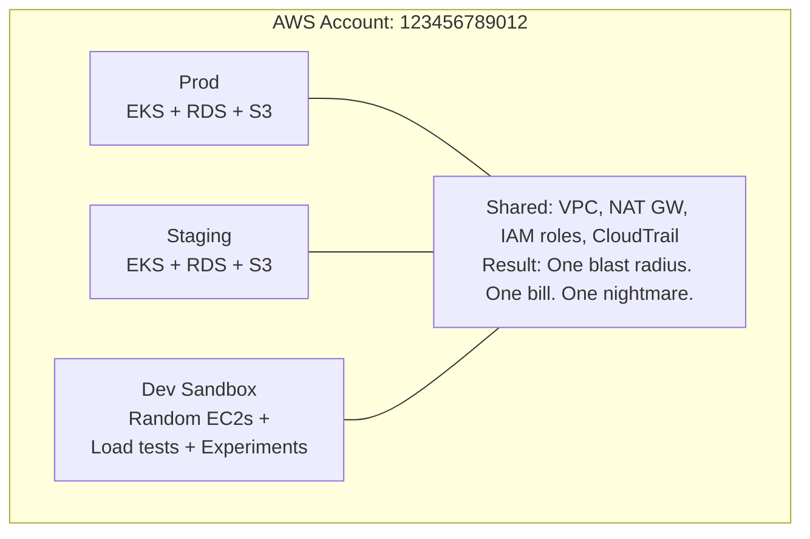
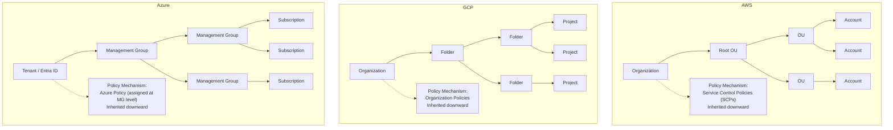
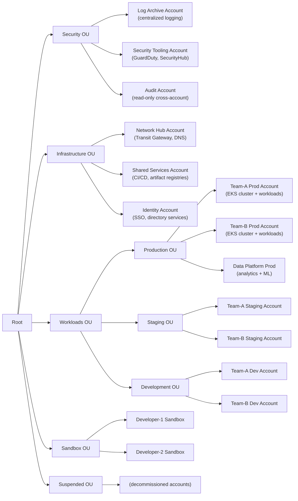
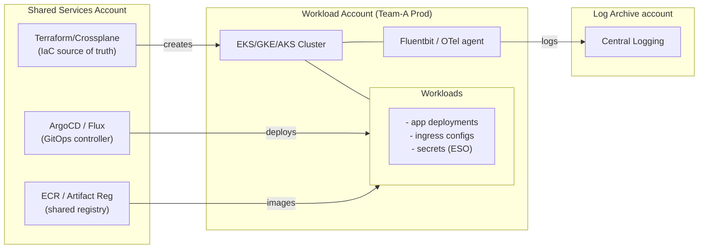
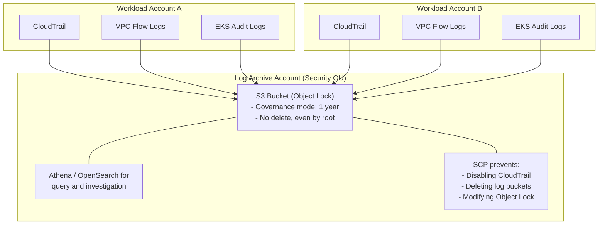
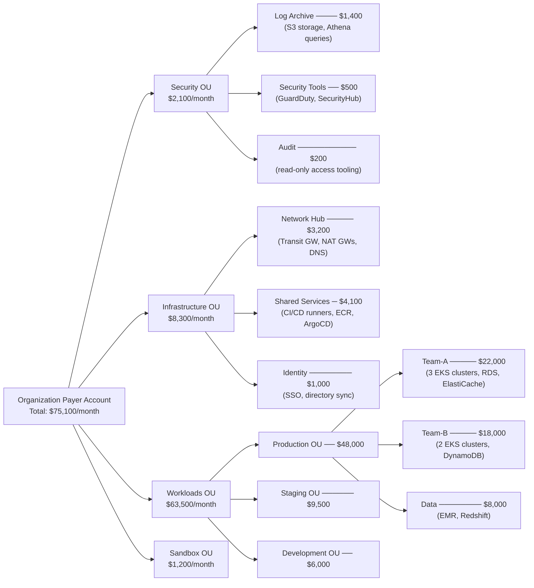
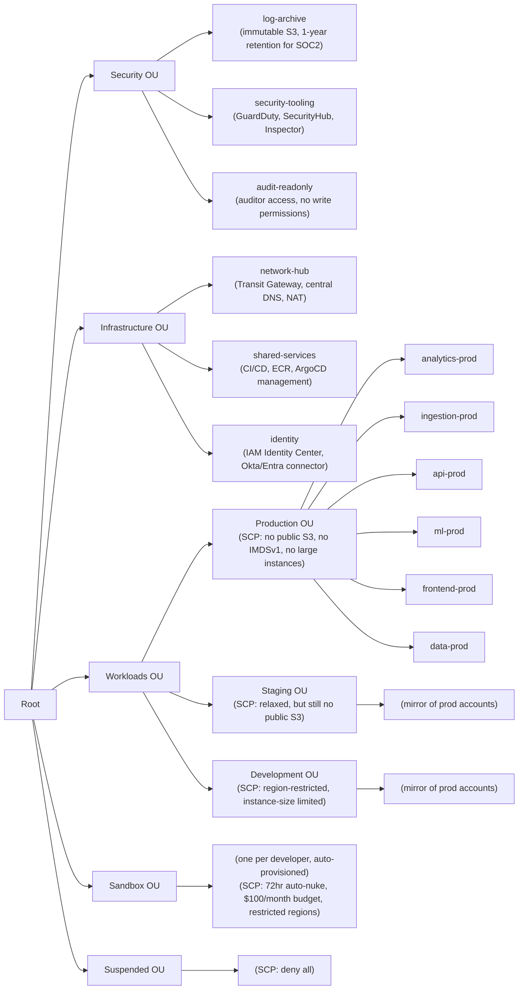

> **Complexity**: `[COMPLEX]`
>
> **Time to Complete**: 2.5 hours
>
> **Prerequisites**: [Cloud Architecture Patterns](/cloud/architecture-patterns/), familiarity with at least one hyperscaler (AWS, GCP, or Azure)
>
> **Track**: Advanced Cloud Operations

## What You'll Be Able to Do

After completing this comprehensive engineering module, you will be able to:

- **Design multi-account organization structures using AWS Organizations, GCP Folders, and Azure Management Groups** to enforce strict administrative and billing boundaries across massive enterprise environments.
- **Implement automated account vending pipelines that provision new cloud accounts with security guardrails built in**, eliminating manual configuration drift and securing environments from the moment of inception.
- **Configure cross-account networking with Transit Gateway, Shared VPC, and VNet peering for hub-spoke topologies**, enabling secure, centralized traffic inspection.
- **Evaluate account-per-team vs account-per-environment strategies for blast radius isolation and compliance**, ensuring that your architectural topology matches your organizational risk appetite.
- **Diagnose cross-account IAM permissions and Service Control Policy conflicts**, allowing you to troubleshoot complex access issues without compromising the principle of least privilege.

---

## Why This Module Matters

**March 2019. A mid-sized fintech company. 42 engineers. One AWS account.**

Everything lived together in a single, massive, entangled environment: production databases holding sensitive customer ledger data, staging environments used for integration testing, ephemeral CI/CD pipelines executing deployment scripts, developer sandboxes for rapid prototyping, and the shared networking services that glued it all together. One Friday afternoon, a junior developer running performance load tests in what they genuinely believed was an isolated staging environment accidentally saturated the core NAT Gateway that production API traffic also depended upon. The resulting port exhaustion caused payment processing to halt completely for 93 minutes. The incident cost the company $2.1 million in failed transactions and instantly triggered a mandatory PCI-DSS compliance audit that consumed two full months of dedicated engineering time to resolve.

The root cause of this catastrophic failure was not the load test itself, nor was it the junior developer's actions. The fundamental failure was the architecture—or rather, the complete lack of a defensive architectural strategy. When every resource, identity, and network component lives in a single cloud account, there are zero hard blast radius boundaries. IAM policies become impossibly complex and impossible to audit effectively. Cost attribution degrades into pure guesswork based on inconsistent resource tagging. Audit trails transform into a tangled mess of production operations interspersed with random development activity. Most dangerously, a single misconfiguration or resource exhaustion event in a non-critical environment can effortlessly cascade into a total production outage.

This module teaches you how to systematically dismantle the single-account anti-pattern and design robust, scalable multi-account architectures across AWS, GCP, and Azure. You will learn to build organizational hierarchies that enforce complete isolation by default, centralize only what strictly needs to be shared (such as centralized logging, security scanning, and core networking), and keep everything else cryptographically separate. More importantly, you will understand how these foundational cloud boundary decisions directly dictate the operational posture of your Kubernetes clusters—determining exactly where they live, how they communicate across network boundaries, and who ultimately controls their lifecycle.

---

## The Single-Account Trap

Before we can confidently design sophisticated multi-account architectures, we must first deeply understand why engineering teams consistently fall into the single-account trap. The evolutionary pattern of a growing startup or a new enterprise project is universally similar and predictably flawed:

1. **The Genesis**: A team starts a new project. They create a single cloud account because it is the fastest path to value. They deploy everything into a default VPC.
2. **The Growth Phase**: The team expands. More workloads, databases, and microservices are added. Everything is still deployed into the single account, relying on naming conventions to differentiate resources.
3. **The Isolation Attempt**: The team realizes they need a staging environment. They create a new Kubernetes namespace, a new VPC, or rely entirely on resource tagging. Everything still resides within the exact same administrative billing and identity boundary.
4. **The Breaking Point**: Compliance requirements arrive, or an insider threat simulation is conducted. The team realizes their IAM roles are a spaghetti network of cross-connected permissions. Implementing true least-privilege access is mathematically impossible without breaking existing applications. Panic ensues.

The single-account model works perfectly for a solo developer building a low-stakes side project. It immediately stops working the absolute moment your organization requires any of the following enterprise pillars: strict environment isolation, granular cost visibility, regulatory compliance boundaries, or true team autonomy without stepping on each other's toes.

> **Stop and think**: Consider a scenario where an attacker compromises a developer's IAM credentials in a single-account setup. Even if the developer only has permissions for staging resources, how might the shared underlying control plane (like API rate limits or centralized networking) still allow the attacker to impact production availability?



The compounding problems of this architecture are severe and unavoidable:
- A development load test easily saturates the production NAT Gateway, severing outbound internet access for mission-critical pods.
- An IAM role designed strictly for a staging background worker accidentally receives wild-card permissions that grant it destructive access to the production relational database.
- The monthly AWS cost report indicates a spend of "$84,000 this month," but tracing exactly which team or which experimental feature generated that cost is practically impossible because tagging enforcement is inherently manual and error-prone.
- Security and compliance logs (like AWS CloudTrail) mix noisy developer experiments alongside critical production audit events, making real-time threat detection alerting virtually useless due to overwhelming false positives.

The multi-account model systematically solves all of these inherent flaws by creating cryptographically hard boundaries. An AWS account, a GCP project, or an Azure subscription represents the absolute strongest isolation boundary that any cloud provider offers below the root organization level.

---

## Organizational Hierarchies Across Clouds

Every major hyperscaler recognizes the necessity of multi-account isolation and provides a top-level hierarchy for logically organizing these massive fleets of accounts. While the specific terminology differs wildly between AWS, GCP, and Azure, the underlying architectural concept remains universally the same: you must nest individual accounts inside hierarchical logical groupings that forcefully inherit strict administrative policies downward from the root.

### The Rosetta Stone of Cloud Organization

The diagram below serves as your translation matrix for understanding how organizational hierarchies map across the three dominant public cloud providers.



### Key Differences That Matter

Understanding the subtle mechanical differences in how these providers enforce policy is critical for platform engineers designing cross-cloud strategies.

| Feature | AWS (Organizations) | GCP (Resource Manager) | Azure (Management Groups) |
|---|---|---|---|
| Isolation unit | Account | Project | Subscription |
| Max nesting depth | 5 levels of OUs | 10 levels of folders | 6 levels of MGs |
| Policy mechanism | SCPs (deny-only) | Org Policies (boolean/list) | Azure Policy (deny + audit) |
| Billing boundary | Account-level | Project-level or Billing Account | Subscription-level |
| Hard resource limits | Per-account quotas | Per-project quotas | Per-subscription quotas |
| Cross-boundary networking | VPC Peering, Transit GW | Shared VPC, VPC Peering | VNet Peering, Virtual WAN |

There is one exceptionally critical nuance you must internalize: **AWS Service Control Policies (SCPs) can only deny actions; they cannot explicitly grant permissions.** This means your entire SCP strategy must be based on establishing preventative guardrails rather than attempting to perform access grants. If an SCP allows an action, the IAM principal still requires an explicit `Allow` in their identity-based or resource-based policy to actually perform the action. 

Conversely, GCP Organization Policies operate on a vastly different paradigm. They do not evaluate low-level IAM API actions; instead, they aggressively constrain the actual configuration state of resources (for instance, mandating that "Virtual Machines can only be created in specific geographic regions" or "Public IP addresses are strictly forbidden"). Azure Policy represents the most flexible hybrid of both worlds, possessing the capability to explicitly deny deployments, seamlessly audit existing non-compliant resources, and even automatically remediate configurations on the fly, which makes it incredibly powerful but correspondingly complex to reason about and debug.

---

## Designing Your OU Structure

The Organizational Unit (OU) structure is the foundational administrative skeleton of your entire cloud architecture. If you get it wrong in the beginning, you will be locked in a perpetual struggle against it for years to come. If you get it right, the structure becomes entirely invisible—quietly and efficiently enforcing isolation, regulatory compliance, and cost boundaries without adding any daily friction to the engineering teams.

### The Reference Architecture

The architecture depicted below is a battle-tested, enterprise-grade OU structure actively utilized by highly regulated organizations running fleets of 20 to 200 AWS accounts. The exact same logical pattern seamlessly maps to GCP folders and Azure management groups.



### Why This Structure Works

**The Security OU resides at the absolute top tier**: Security accounts logically demand the most draconian and restrictive SCPs in the organization. For example, the Log Archive account is configured as strictly write-only for all other member accounts, and exclusively read-only for the security investigation teams. No human or automated process—not even the organization root—is permitted to delete CloudTrail audit logs. No principal is allowed to disable Amazon GuardDuty findings or tamper with the S3 bucket object locks.

**Infrastructure OU is entirely isolated from Application Workloads**: The core networking team manages immense, org-wide routing topologies via Transit Gateways and centralized Route 53 DNS configurations without ever requiring or desiring access to the actual application workloads. The CI/CD pipeline infrastructure runs completely isolated in a dedicated shared services account, securely pushing compiled container artifacts to registries that the disparate workload accounts can securely pull from via highly scoped resource policies.

**Workloads OU splits rigorously by environment, not by team**: This is arguably the most critical design decision you will make. If you choose to split your hierarchy by team first (resulting in a structure like Team-A-Prod, Team-A-Staging, Team-A-Dev all residing within the same parent Team-A OU), it becomes mechanically impossible to apply environment-wide policies without resorting to complex, error-prone per-account exception lists. By structuring by environment first, you can easily apply a single SCP to the entire Production OU stating "No public S3 buckets allowed anywhere," guaranteeing comprehensive compliance.

> **Pause and predict**: If an organization structures its top-level OUs by business unit (e.g., Marketing, Engineering, HR) instead of environment (Prod, Staging, Dev), how will the cloud platform team have to manage SCPs for organization-wide security mandates? What operational bottlenecks will this create during compliance audits?

**Sandbox OU demands aggressive, automated cost controls**: Sandbox environments are explicitly designed for safe experimentation. These accounts are provisioned with auto-nuke lifecycle policies (utilizing open-source tools like `aws-nuke` or customized lambda functions) that automatically and mercilessly destroy any infrastructure resources older than 72 hours. Hard budget alarms are configured to fire if spend exceeds $50 per month. This architecture empowers developers with total freedom to experiment using native cloud primitives without risking runaway bills.

### Setting Up AWS Organizations

Executing this structure via the CLI demonstrates the fundamental building blocks, though in production environments, this must always be driven by an Account Vending Pipeline.

```bash
# Create the organization (from management account)
aws organizations create-organization --feature-set ALL

# Create the OU structure
ROOT_ID=$(aws organizations list-roots --query 'Roots[0].Id' --output text)

# Create top-level OUs
SECURITY_OU=$(aws organizations create-organizational-unit \
  --parent-id $ROOT_ID \
  --name "Security" \
  --query 'OrganizationalUnit.Id' --output text)

INFRA_OU=$(aws organizations create-organizational-unit \
  --parent-id $ROOT_ID \
  --name "Infrastructure" \
  --query 'OrganizationalUnit.Id' --output text)

WORKLOADS_OU=$(aws organizations create-organizational-unit \
  --parent-id $ROOT_ID \
  --name "Workloads" \
  --query 'OrganizationalUnit.Id' --output text)

# Create environment sub-OUs under Workloads
PROD_OU=$(aws organizations create-organizational-unit \
  --parent-id $WORKLOADS_OU \
  --name "Production" \
  --query 'OrganizationalUnit.Id' --output text)

STAGING_OU=$(aws organizations create-organizational-unit \
  --parent-id $WORKLOADS_OU \
  --name "Staging" \
  --query 'OrganizationalUnit.Id' --output text)

DEV_OU=$(aws organizations create-organizational-unit \
  --parent-id $WORKLOADS_OU \
  --name "Development" \
  --query 'OrganizationalUnit.Id' --output text)

# Create a new account and move it to the Production OU
aws organizations create-account \
  --email "team-a-prod@company.com" \
  --account-name "Team-A-Production"

# Move account to Production OU (once created)
aws organizations move-account \
  --account-id 111122223333 \
  --source-parent-id $ROOT_ID \
  --destination-parent-id $PROD_OU
```

### GCP Equivalent with Folders

Google Cloud utilizes an incredibly robust hierarchical structure heavily centered around Folders and Projects. The methodology is remarkably similar to AWS Organizations.

```bash
# Create folder structure
ORG_ID=$(gcloud organizations list --format="value(ID)")

# Create top-level folders
gcloud resource-manager folders create \
  --display-name="Security" \
  --organization=$ORG_ID

gcloud resource-manager folders create \
  --display-name="Infrastructure" \
  --organization=$ORG_ID

WORKLOADS_FOLDER=$(gcloud resource-manager folders create \
  --display-name="Workloads" \
  --organization=$ORG_ID \
  --format="value(name)")

# Create environment sub-folders
gcloud resource-manager folders create \
  --display-name="Production" \
  --folder=$WORKLOADS_FOLDER

gcloud resource-manager folders create \
  --display-name="Staging" \
  --folder=$WORKLOADS_FOLDER

# Create a project in the Production folder
gcloud projects create team-a-prod-2026 \
  --folder=$PROD_FOLDER_ID \
  --name="Team A Production"
```

---

## Automated Account Vending Pipelines

Creating accounts manually via the cloud provider's web console or iterative bash scripts is an architectural anti-pattern. Manual creation inevitably leads to severe configuration drift, accidentally bypassed security guardrails, and entirely forgotten baseline integrations. To maintain uncompromising consistency and security at enterprise scale, you must urgently implement an automated account vending pipeline. This pipeline acts as an immutable factory, ensuring every newly minted environment adheres strictly to organizational standards from the precise moment of inception.

An automated account vending pipeline deeply relies on Infrastructure as Code (IaC) tools—such as Terraform, Pulumi, or AWS CloudFormation—which are rigorously orchestrated by a centralized CI/CD system. In a modern GitOps workflow, when a development team requires a brand-new cloud environment, they do not submit an IT service desk ticket that lingers for weeks; instead, they simply open a Pull Request against a central governance configuration repository. This repository contains the structured metadata defining the requested account, specifying critical details such as the owner's email address, the target Organizational Unit, the assigned financial cost center, and the specific required network topology tier.

Once the platform engineering team approves and merges the Pull Request, the pipeline executes a deterministic sequence of strictly defined automated steps:
1. It executes an initial API call to the cloud provider to provision the raw, empty account structure.
2. It pauses execution, utilizing a polling mechanism to wait for the asynchronous account creation to fully finalize across the provider's global control plane.
3. It assumes a highly privileged initial cross-account deployment role inside the newly formed account and begins an automated bootstrap sequence.
4. The bootstrap sequence systematically deletes default VPCs (which are universally recognized as non-compliant due to implicit internet accessibility), establishes custom network subnets attached to the central Transit Gateway, configures robust centralized logging agents, and establishes the local IAM roles mapped directly to the organization's central Identity Provider.

### The Role of AWS Control Tower and Account Factory

In the massive AWS ecosystem, this complex orchestration is frequently handled by AWS Control Tower and its native Account Factory feature. Control Tower abstracts away the immense complexities of coordinating AWS Organizations, AWS IAM Identity Center, and AWS Service Catalog into a unified managed service. It provides a structured Landing Zone that automatically applies preventative and detective guardrails upon account birth. When paired directly with Account Factory for Terraform (AFT), platform teams achieve a fully automated, GitOps-driven workflow.

With AFT, engineers define an account request inside a centralized Terraform module map. Pushing this declarative code triggers an underlying AWS CodePipeline workflow that not only safely creates the account but also seamlessly applies localized custom baseline modules. For example, if a team explicitly requests a "production" environment, the pipeline intelligently attaches a stricter set of customized Service Control Policies, configures a higher-tier enterprise support plan, and locks down cross-region resource creation.

### Extending Vending to Kubernetes

The account vending philosophy extends seamlessly into the modern Kubernetes lifecycle. Once the foundational cloud account is permanently established and secured, the exact same automated pipeline can transparently invoke secondary modules to deploy an EKS, GKE, or AKS cluster. By physically embedding the Kubernetes cluster provisioning inside the larger account vending logic, you mathematically guarantee that the cluster is automatically registered with your central ArgoCD or Flux instance, its audit logs are hard-wired to the immutable log archive account, and its inbound ingress controllers are correctly peered with the central network hub. This holistic pipeline transforms the creation of a secure, production-ready environment from a multi-week manual effort into a predictable, highly auditable thirty-minute execution.

---

## Workload Isolation Patterns

Not every single development team needs its own dedicated cloud account. And similarly, not every distinct workload demands its own isolated Kubernetes cluster. The true art of platform engineering lies in precisely matching the isolation level to the actual technical and regulatory requirements of the workloads in question.

### Isolation Decision Matrix

The following matrix provides a clear framework for deciding when to share infrastructure and when to enforce hard boundaries.

| Requirement | Same Account, Same Cluster | Same Account, Separate Clusters | Separate Accounts |
|---|---|---|---|
| Team autonomy | Low (shared RBAC) | Medium (cluster admin) | High (account admin) |
| Blast radius | Pod/Namespace level | Cluster level | Account level |
| Compliance boundary | Cannot achieve PCI/HIPAA | Possible with effort | Clean boundary |
| Cost visibility | Tags only | Tags + cluster | Account-level billing |
| Network isolation | NetworkPolicy | VPC/subnet separation | VPC per account |
| Resource contention | High risk | Medium risk | Zero risk |
| Operational overhead | Low | Medium | High |

### The War Story: When Namespace Isolation Isn't Enough

A large healthcare analytics company decided to run their core production workloads inside a single, massive EKS cluster, heavily utilizing Kubernetes namespaces as the primary mechanism for isolation between independent development teams. Their internal compliance team initially signed off on this architecture strictly because extensive NetworkPolicies were actively in place, preventing unauthorized pod-to-pod communication. However, during an intense external PCI-DSS compliance audit, the auditor posed a simple but devastating question: "Can a completely unprivileged pod running in the `team-b` namespace query the core Kubernetes API and discover that the highly sensitive `team-a-pci` namespace currently exists?" 

The shocking answer was yes. Due to seemingly benign but overly permissive default Kubernetes RBAC configurations, commands like `kubectl get namespaces` executed successfully for any authenticated service account interacting with the cluster. The auditor aggressively flagged this as a critical data leakage risk—not because actual financial data was directly exposed, but because the mere existence and infrastructure footprint of a PCI workload was easily discoverable by unauthorized internal tenants.

The permanent fix required the architecture team to provision entirely separate physical clusters. But by the time this was mandated, 14 different engineering teams had already built deeply intertwined deployment tooling that fundamentally assumed a single-cluster reality. The forced migration to isolated clusters took five agonizing months of engineering effort.

The harsh lesson learned: You must decisively establish your hard isolation boundaries before onboarding tenants, never after.

> **Stop and think**: NetworkPolicies in Kubernetes can restrict traffic between namespaces, but they cannot restrict access to the Kubernetes API itself. If two distinct compliance zones (like PCI and non-PCI) share a cluster, what specific API discovery techniques could a compromised non-PCI pod use to map out the PCI infrastructure, even with perfectly configured NetworkPolicies?

### Kubernetes Lifecycle in a Multi-Account World

Every individual account that hosts Kubernetes clusters requires an incredibly clear and rigorously enforced lifecycle model. In modern Kubernetes (v1.35+), the tooling to enforce this has matured significantly, but the architectural pattern remains the foundational key to stability.



The absolute golden rule of this architecture is that clusters are ephemeral cattle, never beloved pets. The Infrastructure as Code repository centralized in the Shared Services account possesses the capability to completely recreate any workload cluster from scratch in minutes. The critical strategic decision for platform teams is whether each individual development team physically manages their own cluster infrastructure configurations, or whether a centralized platform engineering team provisions the base clusters globally. Most organizations scaling past five unique product teams universally find that centralized platform provisioning combined with team-owned GitOps workload deployment strikes the perfect balance of security and velocity.

---

## Centralized Logging & Audit

In an expansive multi-account architecture, security logging becomes simultaneously vastly more important and significantly more complex to execute securely. You absolutely require a unified single pane of glass for security event correlation, but you must also guarantee mathematically that no individual compromised account can tamper with or destroy its own historical audit logs to cover an attacker's tracks.

### The Immutable Log Archive Pattern

To achieve this level of forensic guarantee, organizations employ the Immutable Log Archive Pattern, heavily utilizing write-once-read-many (WORM) storage mechanics.



### AWS: Organization-Wide CloudTrail

To ensure no account falls out of compliance, CloudTrail is configured at the organization root level. This enforces logging across every existing and future account automatically.

```bash
# Create organization trail (from management account)
aws cloudtrail create-trail \
  --name org-trail \
  --s3-bucket-name company-org-cloudtrail-logs \
  --is-organization-trail \
  --is-multi-region-trail \
  --enable-log-file-validation \
  --kms-key-id arn:aws:kms:us-east-1:999888777666:key/mrk-abc123

aws cloudtrail start-logging --name org-trail

# SCP to prevent member accounts from disabling CloudTrail
cat <<'EOF' > deny-cloudtrail-changes.json
{
  "Version": "2012-10-17",
  "Statement": [
    {
      "Sid": "ProtectCloudTrail",
      "Effect": "Deny",
      "Action": [
        "cloudtrail:StopLogging",
        "cloudtrail:DeleteTrail",
        "cloudtrail:UpdateTrail"
      ],
      "Resource": "arn:aws:cloudtrail:*:*:trail/org-trail"
    }
  ]
}
EOF

aws organizations create-policy \
  --name "ProtectCloudTrail" \
  --description "Prevent member accounts from disabling org CloudTrail" \
  --type SERVICE_CONTROL_POLICY \
  --content file://deny-cloudtrail-changes.json

# Attach SCP to the root (applies to ALL accounts)
aws organizations attach-policy \
  --policy-id p-1234567890 \
  --target-id $ROOT_ID
```

> **Pause and predict**: An attacker gains full administrative access to a workload account and discovers they cannot disable CloudTrail due to an organizational SCP. Given that they still control the local compute resources, what alternative tactics might they employ to obscure their malicious activities or degrade the central logging system without ever touching the CloudTrail configuration?

### GCP: Organization-Level Log Sinks

Google Cloud handles centralized auditing gracefully through hierarchical log sinks that cascade down and capture all activity seamlessly.

```bash
# Create organization-level log sink
gcloud logging sinks create org-audit-sink \
  storage.googleapis.com/company-org-audit-logs \
  --organization=$ORG_ID \
  --include-children \
  --log-filter='logName:"cloudaudit.googleapis.com"'

# Grant the sink's service account write access to the bucket
# (The sink creates a unique service account automatically)
SINK_SA=$(gcloud logging sinks describe org-audit-sink \
  --organization=$ORG_ID \
  --format="value(writerIdentity)")

gsutil iam ch $SINK_SA:objectCreator gs://company-org-audit-logs
```

### EKS Audit Logs to Central Logging

Cloud provider audit logs (like CloudTrail) track infrastructure changes, but Kubernetes audit logs are entirely separate and must be explicitly handled. They track critical API calls executed inside the cluster. You absolutely must capture both streams.

```yaml
# Fluentbit ConfigMap to ship EKS audit logs to central account
apiVersion: v1
kind: ConfigMap
metadata:
  name: fluent-bit-config
  namespace: logging
data:
  fluent-bit.conf: |
    [SERVICE]
        Flush         5
        Log_Level     info
        Parsers_File  parsers.conf

    [INPUT]
        Name              tail
        Tag               kube.audit.*
        Path              /var/log/kubernetes/audit/*.log
        Parser            json
        Refresh_Interval  10
        Mem_Buf_Limit     50MB

    [OUTPUT]
        Name              s3
        Match             kube.audit.*
        bucket            central-audit-logs-cross-account
        region            us-east-1
        role_arn          arn:aws:iam::999888777666:role/audit-log-writer
        total_file_size   50M
        upload_timeout    60s
        s3_key_format     /eks-audit/$TAG/%Y/%m/%d/%H/$UUID.gz
        compression       gzip
```

---

## Shared Services: What to Centralize

While extreme isolation is necessary for workloads, not every operational resource should be heavily isolated. Certain infrastructure components act as natural shared services that benefit tremendously from centralization, reducing operational overhead and establishing single sources of truth. The architectural challenge lies in properly identifying which resources to consolidate and building the appropriate cross-account access patterns.

### Centralize vs. Distribute Decision Framework

Use this framework when debating whether an architectural component should be consolidated into the Shared Services account or distributed into individual Workload accounts.

| Resource | Centralize | Distribute | Reasoning |
|---|---|---|---|
| Container registry | Yes | | One source of truth for images, scan once |
| CI/CD pipelines | Yes | | Consistent build process, shared runners |
| DNS management | Yes | | Single delegation, avoid split-brain |
| Secrets management | Hybrid | Hybrid | Central vault, local caching (ESO pattern) |
| Service mesh control | Depends | Depends | Centralize if cross-cluster, distribute if single |
| Monitoring stack | Yes | | Unified dashboards, correlation across clusters |
| Cluster provisioning (IaC) | Yes | | Consistent configs, version control |
| Application deployment | | Yes | Teams own their deploy cadence |

> **Stop and think**: Centralizing CI/CD pipelines in a shared services account establishes a single source of truth, but it also means the deployment runners require highly privileged cross-account access to modify production resources. How must you design the IAM trust boundaries so that a compromised runner cannot arbitrarily pivot and destroy resources across the entire organization?

### The Shared VPC Pattern (GCP)

GCP's Shared VPC architecture is widely regarded as one of the cleanest, most efficient implementations of centralized networking available in modern cloud environments. In this robust model, a dedicated host project physically owns the VPC network infrastructure, and individual workload service projects merely attach their resources to it.

```bash
# Enable Shared VPC in the host project (network hub)
gcloud compute shared-vpc enable network-hub-project

# Associate a service project (workload account)
gcloud compute shared-vpc associated-projects add team-a-prod \
  --host-project=network-hub-project

# Grant the service project's GKE service account access to the shared subnet
gcloud projects add-iam-policy-binding network-hub-project \
  --member="serviceAccount:service-TEAM_A_PROJECT_NUM@container-engine-robot.iam.gserviceaccount.com" \
  --role="roles/container.hostServiceAgentUser"

# Create a GKE cluster in the service project using the shared VPC
gcloud container clusters create team-a-prod \
  --project=team-a-prod \
  --network=projects/network-hub-project/global/networks/shared-vpc \
  --subnetwork=projects/network-hub-project/regions/us-central1/subnetworks/team-a-subnet \
  --cluster-secondary-range-name=pods \
  --services-secondary-range-name=services
```

This advanced topology provides the central networking team with total, uncompromised control over network management tasks—such as updating global firewall rules, managing dynamic BGP routes, and assigning IP address blocks—while simultaneously allowing each application team to retain full ownership over their cluster configurations and workload deployments. The networking team monitors all traffic flows globally, but the application team interacts solely with their local, isolated project space.

---

## Hierarchical Billing & Cost Allocation

A properly implemented multi-account architecture rewards organizations with the most highly accurate, transparent cost attribution possible. Instead of relying on fragile, manually applied resource tags to determine who spent what, costs are naturally and automatically isolated to the exact account that physically incurred them.

### AWS: Consolidated Billing with Cost Allocation Tags

To maximize cost visibility, organizations activate consolidated billing at the root level and enforce strict cost allocation tags that cascade downwards.

```bash
# Enable cost allocation tags at the organization level
aws ce update-cost-allocation-tags-status \
  --cost-allocation-tags-status \
    TagKey=Environment,Status=Active \
    TagKey=Team,Status=Active \
    TagKey=CostCenter,Status=Active

# Create a budget per workload account
aws budgets create-budget \
  --account-id 111122223333 \
  --budget '{
    "BudgetName": "team-a-prod-monthly",
    "BudgetLimit": {"Amount": "15000", "Unit": "USD"},
    "TimeUnit": "MONTHLY",
    "BudgetType": "COST"
  }' \
  --notifications-with-subscribers '[
    {
      "Notification": {
        "NotificationType": "ACTUAL",
        "ComparisonOperator": "GREATER_THAN",
        "Threshold": 80,
        "ThresholdType": "PERCENTAGE"
      },
      "Subscribers": [
        {"SubscriptionType": "EMAIL", "Address": "team-a-lead@company.com"},
        {"SubscriptionType": "SNS", "Address": "arn:aws:sns:us-east-1:111122223333:budget-alerts"}
      ]
    }
  ]'
```

### Cost Hierarchy Visualization

Visualizing the financial spend across an enterprise demonstrates the immediate, striking power of structural boundaries. Organizations can trace every dollar down to the precise team and environment.



When existing in a primitive single-account state, finance teams can only declare: "$75,100 was spent—but we have absolutely no idea where it goes or why." With a robust multi-account model, you unlock a granular, mathematically verifiable per-team and per-environment breakdown by absolute default.

### Pro tip: Tagging standards across accounts

Even with the clearest multi-account boundaries, you still urgently need consistent, universally applied tags for creating cross-cutting financial views across the entire organization. You must mathematically enforce a strict tagging policy at the highest organization level.

```bash
# AWS: Create a tag policy (enforced via Organizations)
cat <<'EOF' > tag-policy.json
{
  "tags": {
    "Environment": {
      "tag_key": {"@@assign": "Environment"},
      "tag_value": {"@@assign": ["production", "staging", "development", "sandbox"]},
      "enforced_for": {"@@assign": ["ec2:instance", "eks:cluster", "rds:db"]}
    },
    "Team": {
      "tag_key": {"@@assign": "Team"},
      "enforced_for": {"@@assign": ["ec2:instance", "eks:cluster"]}
    },
    "CostCenter": {
      "tag_key": {"@@assign": "CostCenter"},
      "enforced_for": {"@@assign": ["ec2:instance", "eks:cluster", "rds:db", "s3:bucket"]}
    }
  }
}
EOF

aws organizations create-policy \
  --name "RequiredTags" \
  --type TAG_POLICY \
  --content file://tag-policy.json

aws organizations attach-policy \
  --policy-id p-tag12345 \
  --target-id $WORKLOADS_OU
```

---

## Did You Know?

1. **AWS Control Tower can provision a foundational landing zone in under 60 minutes.** Introduced in June 2019, this powerful automation abstracts away what previously took weeks of complex manual setup. It instantly creates your core management account, logging archive account, audit tooling account, and deploys critical baseline SCPs without requiring deep manual intervention. GCP offers a similar concept called "Fabric FAST," and Azure provides "Enterprise-Scale Landing Zones." All three frameworks vigorously attempt to codify the exact multi-account best practices meticulously described in this module.

2. **GCP projects inherently carry a soft limit of 30 projects per single billing account.** While this threshold can easily be raised to thousands via a simple support ticket, the true hidden constraint is that every individual project uniquely receives its own completely independent set of resource quotas (such as specific API call rates or CPU core limits). This mechanical reality often forces architects to distribute massive workloads across multiple projects solely to evade hitting restrictive per-project ceilings, rather than exclusively for organizational compliance reasons.

3. **The AWS "Root" account email address represents the absolute most powerful, unstoppable credential within your entire organization** and critically cannot be constrained by Service Control Policies. If an external attacker successfully compromises the root email address of your primary management account, they instantly possess total control over your entire corporate infrastructure. Best practice dictates using an impersonal distribution list email, mandating ultra-secure MFA via a physical hardware token, and literally storing the root credentials inside a physically secured vault. This is not hyperbole; it is a critical defensive baseline.

4. **Azure Management Groups support aggressive "deny assignments" that are fundamentally stronger than standard role assignments.** A deny assignment applied forcefully at a high-level management group permanently prevents any underlying user—even one possessing absolute `Owner` privileges—from performing specific restricted actions on the resources situated below. This powerful mechanical capability is exactly how Azure rigorously enforces regulatory compliance for highly regulated industries, as the hierarchy physically overrides any potential human error or malicious internal intent.

---

## Common Mistakes

Organizational hierarchies are notoriously difficult to refactor once workloads are actively deployed. Avoid these catastrophic architectural missteps from day one.

| Mistake | Why It Happens | How to Fix It |
|---|---|---|
| Organizing OUs by team instead of environment | Feels natural to team ownership | Structure by environment first, team second. Apply environment policies at the OU level. |
| Running everything in the management/payer account | "It's the first account, might as well use it" | Management account should run NOTHING except billing and organization management. Zero workloads. |
| Not creating a Suspended OU | Forgot about account decommissioning | Create a Suspended OU with SCPs that deny all actions. Move decommissioned accounts here instead of closing them (closing has a 90-day reopen window). |
| Sharing VPCs across environments | Trying to save on NAT Gateway costs | Separate VPCs per environment. The $30/month NAT Gateway savings is not worth the blast radius. |
| Manual account creation | "We only need a few accounts" | Automate with Account Factory (Control Tower), Terraform, or Crossplane from day one. Even if you only have three accounts. |
| Forgetting centralized DNS | Each account creates its own hosted zone | Create a central DNS account with Route53/Cloud DNS. Delegate subdomains to workload accounts via NS records. |
| No SCP/policy guardrails on day one | "We'll add governance later" | Apply baseline SCPs immediately: deny disabling CloudTrail, deny leaving the organization, restrict regions. |
| One IAM Identity Center permission set for all environments | "Admin is admin" | Create separate permission sets for prod (read-only default, break-glass for write) vs dev (broader access). |

---

## Quiz

<details>
<summary>1. Scenario: You have inherited an AWS environment where the primary data warehouse runs in the organization's management (payer) account to "save on NAT gateway costs." Your security team wants to apply a new Service Control Policy (SCP) to restrict access to certain regions globally. How does the placement of this data warehouse impact your security posture?</summary>

The management account is strictly exempt from Service Control Policies (SCPs), meaning any workload running within it operates completely outside the organization's automated guardrails. If an SCP is applied to restrict regions, the data warehouse and any other resources in the management account will entirely bypass these restrictions. Furthermore, running workloads in this account needlessly expands the attack surface of your most privileged environment, which inherently possesses access to billing data and org-wide settings. To maintain strict security boundaries, the management account must be reserved solely for billing and organization administration, with zero active workloads.
</details>

<details>
<summary>2. Scenario: Your cloud engineering team is migrating a multi-account architecture from AWS to GCP. In AWS, you relied on an SCP that explicitly denied the `s3:DeleteBucket` action to prevent accidental data loss. A junior engineer proposes creating an identical "deny action" Organization Policy in GCP for Cloud Storage. Why will this approach fail, and what is the fundamental difference in how these two mechanisms operate?</summary>

AWS SCPs function as strict IAM permission boundaries that can only explicitly deny API actions, effectively filtering what user policies are allowed to execute regardless of their granted permissions. Conversely, GCP Organization Policies do not evaluate IAM actions; instead, they constrain the actual configuration state of resources, such as enforcing that buckets must have uniform bucket-level access enabled or restricting resource creation to specific regions. The engineer's approach will fail because GCP Organization Policies cannot deny specific API calls like bucket deletion. You must adapt your strategy to use GCP's resource configuration constraints combined with proper IAM role scoping to achieve the same data protection goals.
</details>

<details>
<summary>3. Scenario: A fast-growing software company has 8 development teams. Each team manages 2 EKS clusters: one for staging and one for production. The CTO suggests creating 8 AWS accounts (one per team) to keep the billing simple. What critical security and operational risks does this 8-account strategy introduce, and what is the recommended alternative?</summary>

Using an 8-account strategy mixes staging and production environments within the same blast radius, meaning a misconfigured IAM role or a runaway process in staging could directly compromise or degrade production resources. Furthermore, this structure makes it impossible to apply environment-wide Service Control Policies (SCPs), such as enforcing strict public access blocks exclusively on all production accounts, without creating complex, per-account exceptions. The recommended alternative is to use 16 accounts—one per team per environment—which establishes a hard boundary that naturally aligns with environment-specific SCPs. The operational overhead of managing 16 accounts instead of 8 is negligible when utilizing automated account vending solutions like AWS Control Tower or Terraform.
</details>

<details>
<summary>4. Scenario: An enterprise currently allows each of its 15 workload accounts to host its own container registry. A recent security audit revealed that 40% of deployed images contain critical vulnerabilities, and patching them requires coordinating with all 15 account owners. How would migrating to a centralized container registry in a shared services account resolve this operational bottleneck?</summary>

A centralized container registry establishes a single, authoritative source of truth for all container images across the organization, eliminating image sprawl and version inconsistencies. By consolidating images, security teams can implement a unified scanning pipeline where an image is scanned exactly once upon push, and vulnerabilities are caught before the image is distributed to workload accounts. This architecture also drastically simplifies CI/CD workflows, as pipelines only need to push to one destination while workload accounts securely pull images using cross-account IAM resource policies. Ultimately, this reduces storage costs for duplicate images and shifts the security enforcement point to a single, manageable chokepoint.
</details>

<details>
<summary>5. Scenario: A platform team identifies an orphaned AWS account previously used by a departed contractor. The account contains an active Amazon Route 53 hosted zone serving production DNS records. To immediately stop the billing charges, an administrator clicks "Close Account" without deleting the resources. What are the immediate and long-term consequences of this action?</summary>

When an AWS account is closed, it enters a 90-day suspended state where it becomes completely inaccessible via the console or API, but the underlying resources are not immediately destroyed. During this period, the active Route 53 hosted zone will continue to route traffic, but you will be entirely unable to modify or manage those DNS records if an emergency arises. After the 90-day window, AWS will permanently close the account and begin a non-deterministic deletion of resources, potentially causing a catastrophic outage when the DNS records are eventually purged. To avoid this, best practices dictate moving the account to a Suspended OU with a "deny all" SCP to stop activity, allowing administrators to safely identify, migrate, or manually delete critical resources before initiating the final closure.
</details>

<details>
<summary>6. Scenario: A multi-national corporation is designing a hub-and-spoke network topology to connect 50 regional workload environments. The AWS architecture team plans to use VPC Peering between every account, while the GCP team proposes a Shared VPC model. What architectural scaling challenges will the AWS team face with their approach compared to the GCP team's strategy?</summary>

The AWS team's VPC Peering approach relies on a decentralized, point-to-point model, meaning connecting 50 environments requires creating and managing an N-squared mesh of peering connections, each with its own independent route tables and security groups. This rapidly becomes an operational nightmare to maintain, audit, and troubleshoot at scale, which is why AWS Transit Gateway is typically recommended for this volume. In contrast, GCP's Shared VPC uses a centralized model where a single host project manages one unified VPC, its subnets, and its firewall rules, while service projects simply deploy resources into those shared subnets. This allows the GCP networking team to maintain centralized visibility and control over all traffic flows without the compounding complexity of point-to-point peering.
</details>

<details>
<summary>7. Scenario: To boost developer velocity, an organization provides 50 engineers with their own personal AWS sandbox accounts, granting them full administrative access to experiment. After three months, the monthly cloud bill spikes by $15,000, primarily driven by forgotten GPU instances and unattached EBS volumes. How does implementing automated resource cleanup solve this issue beyond just reducing costs?</summary>

While the immediate benefit of automated resource cleanup is stopping the financial bleed caused by abandoned infrastructure, its deeper value lies in enforcing an ephemeral mindset and reducing the attack surface. Forgotten resources like unpatched EC2 instances or exposed load balancers inevitably become critical security vulnerabilities over time, providing attackers with easy footholds into the organization. By automatically wiping resources older than 48 to 72 hours, you proactively eliminate these lingering security risks while simultaneously removing the "guilt barrier" for developers, allowing them to freely experiment knowing the system will clean up after them. This practice ensures sandbox environments remain safe, cost-effective scratchpads rather than permanent, unmanaged technical debt.
</details>

---

## Hands-On Exercise: Implement an Automated Account Vending & Governance Pipeline

In this comprehensive exercise, you will implement the foundational, automated components of a multi-account architecture pipeline using modern Infrastructure as Code (IaC). To successfully make this executable and testable without requiring highly dangerous root access to a real cloud organization, we will construct the configurations locally and rigorously validate them using offline toolchains.

### Setup Your Local Workspace

First, initialize a robust local project structure to serve as the blueprint for your governance infrastructure repository. Open your terminal and execute the following commands to construct the target state hierarchy.

```bash
mkdir -p cloudbrew-org/{policies,accounts,shared,modules}
cd cloudbrew-org
touch policies/baseline-scp.json
touch shared/ecr-policy.sh
touch shared/logging.tf
```

### Task 1: Design the Account Factory Target State

Before writing a single line of automation code, you must forcefully define the target organizational state. You are actively building the deployment pipeline for a fictional analytics platform named "CloudBrew". The automated pipeline will deterministically generate the following logical structure based on configuration inputs. Deeply analyze the intended architectural state below.

<details>
<summary>Solution: Target Architecture Blueprint</summary>



Total accounts: 3 (security) + 3 (infra) + 18 (workloads: 6 teams x 3 envs) + N (sandboxes) = 24 + sandboxes
</details>

### Task 2: Implement the Baseline SCP

Your automated account vending pipeline must programmatically attach a critical baseline Service Control Policy directly to the organization root to establish the primary boundary. Write the accurate JSON payload for this SCP in your `policies/baseline-scp.json` file. It must specifically deny any unauthorized tampering with CloudTrail, absolutely prevent accounts from leaving the organization, block users from disabling GuardDuty, and strictly restrict geographic regions to `us-east-1`, `us-west-2`, and `eu-west-1`.

Validate your json syntax locally:
```bash
jq . policies/baseline-scp.json
```

<details>
<summary>Solution: Baseline SCP Implementation</summary>

```json
{
  "Version": "2012-10-17",
  "Statement": [
    {
      "Sid": "DenyCloudTrailTampering",
      "Effect": "Deny",
      "Action": [
        "cloudtrail:StopLogging",
        "cloudtrail:DeleteTrail",
        "cloudtrail:UpdateTrail"
      ],
      "Resource": "arn:aws:cloudtrail:*:*:trail/org-trail"
    },
    {
      "Sid": "DenyLeavingOrganization",
      "Effect": "Deny",
      "Action": "organizations:LeaveOrganization",
      "Resource": "*"
    },
    {
      "Sid": "DenyDisablingGuardDuty",
      "Effect": "Deny",
      "Action": [
        "guardduty:DeleteDetector",
        "guardduty:DisassociateFromMasterAccount",
        "guardduty:UpdateDetector"
      ],
      "Resource": "*"
    },
    {
      "Sid": "RestrictToAllowedRegions",
      "Effect": "Deny",
      "NotAction": [
        "iam:*",
        "organizations:*",
        "sts:*",
        "support:*",
        "billing:*"
      ],
      "Resource": "*",
      "Condition": {
        "StringNotEquals": {
          "aws:RequestedRegion": [
            "us-east-1",
            "us-west-2",
            "eu-west-1"
          ]
        }
      }
    }
  ]
}
```
</details>

### Task 3: Automate Cross-Account ECR Access

Write an automation shell script inside `shared/ecr-policy.sh` that programmatically applies a robust ECR repository policy, ensuring that all dynamically created workload accounts can successfully pull container images. Your pipeline will automatically invoke this script when bootstrapping the central shared services account.

<details>
<summary>Solution: ECR Policy Automation</summary>

```bash
# In the shared-services account, set the ECR repository policy
aws ecr set-repository-policy \
  --repository-name company/api-service \
  --policy-text '{
    "Version": "2012-10-17",
    "Statement": [
      {
        "Sid": "AllowWorkloadAccountsPull",
        "Effect": "Allow",
        "Principal": {
          "AWS": [
            "arn:aws:iam::111111111111:root",
            "arn:aws:iam::222222222222:root",
            "arn:aws:iam::333333333333:root"
          ]
        },
        "Action": [
          "ecr:GetDownloadUrlForLayer",
          "ecr:BatchGetImage",
          "ecr:BatchCheckLayerAvailability"
        ]
      }
    ]
  }'

# Better approach: use an organization condition
aws ecr set-repository-policy \
  --repository-name company/api-service \
  --policy-text '{
    "Version": "2012-10-17",
    "Statement": [
      {
        "Sid": "AllowOrgPull",
        "Effect": "Allow",
        "Principal": "*",
        "Action": [
          "ecr:GetDownloadUrlForLayer",
          "ecr:BatchGetImage",
          "ecr:BatchCheckLayerAvailability"
        ],
        "Condition": {
          "StringEquals": {
            "aws:PrincipalOrgID": "o-abc1234567"
          }
        }
      }
    ]
  }'
```

The organization condition is inherently superior because you absolutely do not need to manually update the restrictive policy payload every single time a new account is dynamically provisioned by the vending machine.
</details>

### Task 4: Codify Centralized Logging Infrastructure

In the `shared/logging.tf` file, strictly define the complex Terraform resource blocks required to create the immutable S3 storage bucket designated for audit logs, alongside the specific IAM role that future workload accounts must assume to deposit log events.

Verify the integrity of your Infrastructure as Code implementation locally:
```bash
cd shared
terraform init
terraform validate
```

<details>
<summary>Solution: Centralized Logging IaC</summary>

```hcl
# In the log-archive account
resource "aws_s3_bucket" "audit_logs" {
  bucket = "cloudbrew-org-audit-logs"

  object_lock_enabled = true

  tags = {
    Environment = "security"
    Purpose     = "immutable-audit-logs"
    CostCenter  = "security-ops"
  }
}

resource "aws_s3_bucket_object_lock_configuration" "audit_logs" {
  bucket = aws_s3_bucket.audit_logs.id

  rule {
    default_retention {
      mode = "GOVERNANCE"
      days = 365
    }
  }
}

resource "aws_s3_bucket_versioning" "audit_logs" {
  bucket = aws_s3_bucket.audit_logs.id
  versioning_configuration {
    status = "Enabled"
  }
}

resource "aws_s3_bucket_policy" "audit_logs" {
  bucket = aws_s3_bucket.audit_logs.id

  policy = jsonencode({
    Version = "2012-10-17"
    Statement = [
      {
        Sid       = "AllowOrgWrite"
        Effect    = "Allow"
        Principal = { AWS = "arn:aws:iam::*:role/audit-log-writer" }
        Action    = ["s3:PutObject"]
        Resource  = "${aws_s3_bucket.audit_logs.arn}/*"
        Condition = {
          StringEquals = {
            "aws:PrincipalOrgID" = "o-abc1234567"
          }
        }
      },
      {
        Sid       = "DenyDeleteForEveryone"
        Effect    = "Deny"
        Principal = "*"
        Action    = ["s3:DeleteObject", "s3:DeleteObjectVersion"]
        Resource  = "${aws_s3_bucket.audit_logs.arn}/*"
      }
    ]
  })
}

# IAM role in each workload account (deployed via StackSets)
resource "aws_iam_role" "audit_log_writer" {
  name = "audit-log-writer"

  assume_role_policy = jsonencode({
    Version = "2012-10-17"
    Statement = [
      {
        Effect = "Allow"
        Principal = {
          Service = "pods.eks.amazonaws.com"
        }
        Action = [
          "sts:AssumeRole",
          "sts:TagSession"
        ]
      }
    ]
  })
}

resource "aws_iam_role_policy" "audit_log_writer" {
  name = "write-to-central-bucket"
  role = aws_iam_role.audit_log_writer.id

  policy = jsonencode({
    Version = "2012-10-17"
    Statement = [
      {
        Effect   = "Allow"
        Action   = ["s3:PutObject"]
        Resource = "arn:aws:s3:::cloudbrew-org-audit-logs/*"
      }
    ]
  })
}
```
</details>

### Task 5: Programmatic Cost Allocation

Your advanced vending pipeline automatically assigns granular tags to all generated accounts. Using the simplified monthly cost data generated below, carefully calculate the true per-team costs, which must actively include a proportional distribution of all shared core infrastructure spend.

| Account | Monthly Cost |
|---|---|
| Network Hub | $3,200 |
| Shared Services | $4,100 |
| Team-Alpha Prod | $12,000 |
| Team-Alpha Staging | $2,400 |
| Team-Beta Prod | $8,000 |
| Team-Beta Staging | $1,600 |

<details>
<summary>Solution: Cost Allocation Logic</summary>

Shared infrastructure: $3,200 + $4,100 = $7,300

Allocation method: proportional to direct workload spend.

Total workload spend: $12,000 + $2,400 + $8,000 + $1,600 = $24,000

Team Alpha direct: $12,000 + $2,400 = $14,400 (60% of workload spend)
Team Beta direct: $8,000 + $1,600 = $9,600 (40% of workload spend)

Team Alpha shared allocation: $7,300 x 0.60 = $4,380
Team Beta shared allocation: $7,300 x 0.40 = $2,920

**Team Alpha total: $14,400 + $4,380 = $18,780/month**
**Team Beta total: $9,600 + $2,920 = $12,520/month**

Grand total: $18,780 + $12,520 = $31,300 (matches $24,000 + $7,300)

This specific proportional model is overwhelmingly the most common enterprise approach. Standard alternatives include an equal split (which is structurally unfair if teams operate at wildly different scale profiles) or strict usage-based allocation (which is flawlessly accurate but historically incredibly complex to accurately measure and consistently enforce without robust custom tooling).
</details>

---

## Next Module

[Module 8.2: Advanced Cloud Networking & Transit Hubs](../module-8.2-transit-hubs/) — Now that you have completely mastered the organizational and identity boundaries of multi-account architecture, it is time to meticulously learn exactly how to connect all of these isolated accounts without creating an unmanageable networking nightmare. In the next module, we will deeply explore hub-and-spoke network designs, the advanced mechanics of transit gateways, and the intricate art of routing highly secure traffic seamlessly across heavily guarded organizational boundaries.