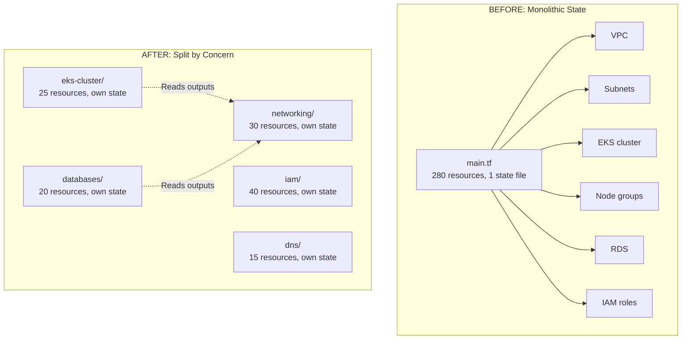
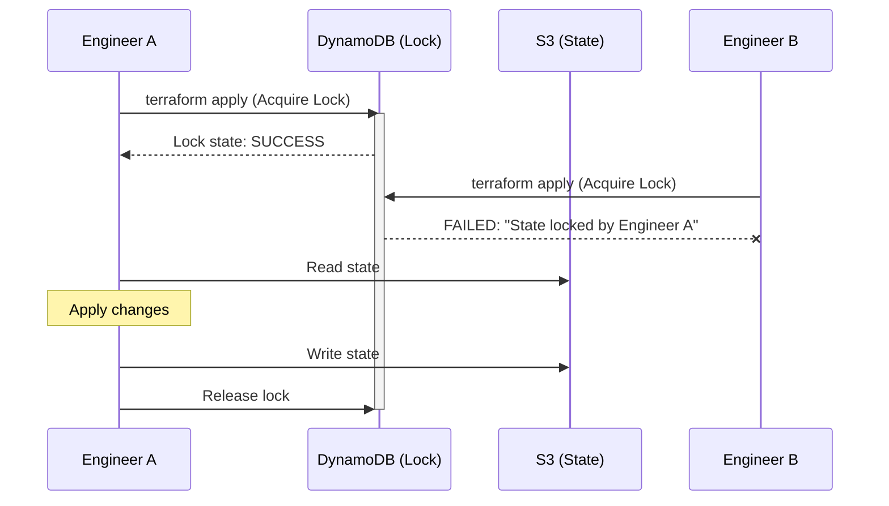
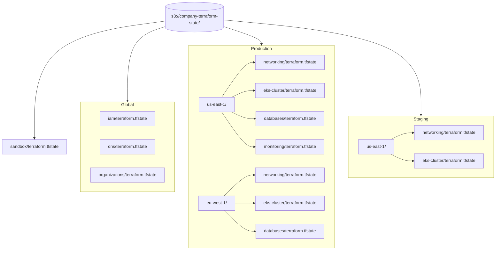
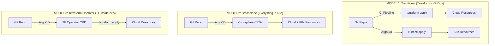
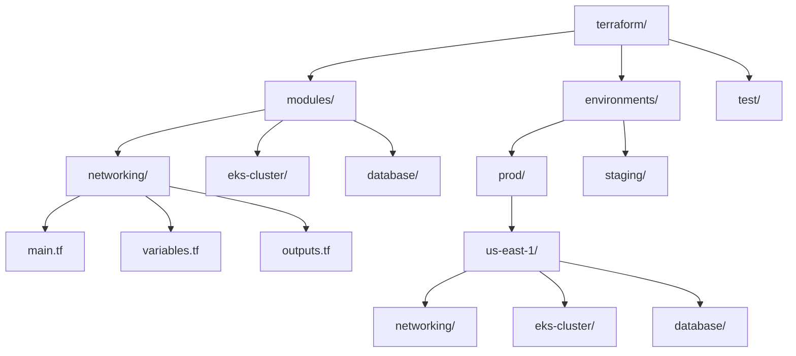

> **Complexity**: `[MEDIUM]`
>
> **Time to Complete**: 2 hours
>
> **Prerequisites**: Basic Terraform experience (variables, modules, state), familiarity with Git workflows
>
> **Track**: Advanced Cloud Operations

## What You'll Be Able to Do

After completing this module, you will be able to:

- **Design** Terraform or Pulumi state management strategies for large-scale multi-account infrastructure to eliminate single points of failure.
- **Implement** modular IaC patterns with versioned components, workspace isolation, and strict policy-as-code validation.
- **Diagnose** configuration drift across environments and deploy automated remediation pipelines for infrastructure managed by Terraform or CloudFormation.
- **Evaluate** the architectural tradeoffs of various IaC tools (Terraform, Pulumi, CloudFormation, Bicep, Crossplane) for multi-cloud Kubernetes platform engineering.
- **Compare** traditional push-based pipeline deployments against pull-based Kubernetes-native GitOps controllers for cloud infrastructure orchestration.

---

## Why This Module Matters

In May 2023, a platform engineering team at Global Freight Logistics—a major international shipping corporation—operated their entire AWS cloud footprint using a single, monolithic Terraform state file managing hundreds of critical resources. What began two years earlier as a convenient way to quickly stand up their initial cloud environment had silently evolved into a massive JSON bottleneck. A routine `terraform plan` took 12 minutes to execute, as the engine meticulously queried the provider API to verify the status of every virtual private cloud, relational database, and Kubernetes node group before it could even begin to compute requested changes.

The breaking point arrived during a high-severity production incident when a core application load balancer required an urgent target group update to route traffic away from a failing availability zone. As the engineer initiated the apply sequence, the deployment pipeline froze for twelve agonizing minutes while the monolithic state refreshed. During this delay, the localized degradation cascaded into a complete system outage, halting warehouse routing systems and causing an estimated $1.2 million in SLA penalties and delayed shipments. Out of sheer desperation, the engineer aborted the pipeline and made the configuration change manually via the AWS Management Console—a "break-glass" maneuver that immediately restored service but introduced severe configuration drift that corrupted the next day's automated deployments.

This module fundamentally deconstructs how to scale infrastructure as code safely. You will learn to isolate failure domains by fracturing monolithic state files into decoupled components, design reusable Kubernetes infrastructure modules, and orchestrate automated drift detection to catch console cowboys. By the end of this module, you will understand how to transition from brittle, serialized deployments to resilient, decentralized GitOps workflows using tools like Terraform, Terratest, and Crossplane.

---

## The Monolithic State Problem

Terraform state is the critical mapping between your declarative configuration files and the real, physical infrastructure residing in your cloud provider. Every resource you manage adds complex metadata to the state file. As the state grows, every operation slows down logarithmically because Terraform refreshes the entire state via API calls before making any localized changes.

Think of a monolithic state file like maintaining the financial ledger for a massive multinational corporation in a single spreadsheet document. If an accountant wants to update a $10 expense in the marketing department, they must wait for the entire spreadsheet—containing billions of rows across all global departments—to recalculate its formulas. Eventually, the file becomes so unwieldy that it crashes the program entirely.

> **Pause and predict**: If two engineers simultaneously run `terraform apply` on a local monolithic state file without any remote backend or locking configured, what exactly happens to the JSON file?

| Resources | State Size | Plan Time | Apply Time | Risk |
|---|---|---|---|---|
| 10 | ~100KB | 5 sec | 30 sec | Low |
| 50 | ~500KB | 30 sec | 2 min | Low |
| 100 | ~2MB | 2 min | 5 min | Medium |
| 250 | ~10MB | 8 min | 15 min | High |
| 500 | ~30MB | 15 min | 25 min | Very High |
| 1000+ | ~100MB+ | 30+ min | 45+ min | Extreme |

**At 250+ resources, you WILL experience:**
- Unacceptably slow plans that block CI/CD pipeline concurrency.
- Frequent state lock timeouts during peak deployment hours.
- Team members waiting idle to apply changes sequentially.
- Intense temptation to bypass automation and make manual changes (resulting in drift).
- Catastrophic state corruption from aborted or concurrent operations.

### State Splitting Strategy

The most effective solution is to split your Terraform configuration into multiple independent, sharply bounded state files. Each state file should manage a tightly coupled logical group of resources that share a lifecycle.



By isolating these layers, you enforce a strict blast radius. A destructive change to the database tier cannot inadvertently delete the transit gateway routing tables.

> **Stop and think**: In the split-state architecture shown below, if a syntax error breaks the `databases/` configuration, can the platform team still deploy updates to the EKS cluster or IAM roles? How does this impact deployment velocity during an incident?

---

## Splitting State and Loose Coupling

Once you fragment your state, those independent pieces inevitably need to communicate. For example, the Kubernetes compute cluster must know the identifiers of the private subnets provisioned by the networking tier. The legacy method for this is the `terraform_remote_state` data source.

### Remote State Data Sources (Tight Coupling)

The `terraform_remote_state` data source reaches directly into another team's state file in the remote backend to read its exported outputs. 

```hcl
# networking/outputs.tf -- Export values from networking state
output "vpc_id" {
  value = aws_vpc.main.id
}

output "private_subnet_ids" {
  value = aws_subnet.private[*].id
}

output "eks_security_group_id" {
  value = aws_security_group.eks.id
}

# eks-cluster/data.tf -- Read from networking state
data "terraform_remote_state" "networking" {
  backend = "s3"
  config = {
    bucket = "company-terraform-state"
    key    = "networking/terraform.tfstate"
    region = "us-east-1"
  }
}

# eks-cluster/cluster.tf -- Use the imported values
resource "aws_eks_cluster" "main" {
  name     = "prod-cluster"
  role_arn = aws_iam_role.eks.arn

  vpc_config {
    subnet_ids         = data.terraform_remote_state.networking.outputs.private_subnet_ids
    security_group_ids = [data.terraform_remote_state.networking.outputs.eks_security_group_id]
  }
}
```

While functional, this approach generates heavy architectural coupling. The EKS configuration must know exactly where the networking team stores their state and the exact string names of their outputs. If the networking team refactors their state backend or renames `vpc_id` to `primary_vpc_id`, the EKS deployment instantly breaks.

### Better Alternative: Use Data Sources Instead of Remote State

To achieve true loose coupling—akin to relying on a stable API contract rather than directly accessing another microservice's database—you should query the cloud provider directly using native data sources and robust resource tagging strategies.

```hcl
# Instead of remote state, query AWS directly
# This avoids tight coupling between state files

data "aws_vpc" "main" {
  tags = {
    Name        = "production-vpc"
    Environment = "production"
  }
}

data "aws_subnets" "private" {
  filter {
    name   = "vpc-id"
    values = [data.aws_vpc.main.id]
  }
  tags = {
    Tier = "private"
  }
}

resource "aws_eks_cluster" "main" {
  name     = "prod-cluster"
  role_arn = aws_iam_role.eks.arn

  vpc_config {
    subnet_ids = data.aws_subnets.private.ids
  }
}
```

This decoupled approach ensures that as long as the networking team maintains the agreed-upon tagging taxonomy, they are free to completely overhaul their internal module structures without disrupting downstream consumers.

---

## Remote Backends and State Locking

Local state files committed to source control are a critical security vulnerability and an operational anti-pattern. State files contain the plaintext representations of all configured variables, including database master passwords, private TLS keys, and identity provider secrets. Furthermore, Git cannot facilitate atomic locking during deployments.

To solve this, enterprise IaC relies on Remote Backends combined with distributed state locking.

> **Stop and think**: What happens if an engineer gets impatient during a long `terraform apply`, force-quits their terminal, and then manually deletes the DynamoDB lock record so they can try again?



The standard AWS pattern pairs an S3 bucket (for encrypted state storage) with a DynamoDB table (for atomic locking). 

```hcl
# Backend configuration (per-state-file)
terraform {
  backend "s3" {
    bucket         = "company-terraform-state"
    key            = "prod/us-east-1/networking/terraform.tfstate"
    region         = "us-east-1"
    encrypt        = true
    kms_key_id     = "alias/terraform-state"
    dynamodb_table = "terraform-state-lock"
  }
}

# Create the DynamoDB lock table (one-time setup)
# aws dynamodb create-table \
#   --table-name terraform-state-lock \
#   --attribute-definitions AttributeName=LockID,AttributeType=S \
#   --key-schema AttributeName=LockID,KeyType=HASH \
#   --billing-mode PAY_PER_REQUEST
```

### State File Organization Pattern

A robust directory hierarchy is essential to prevent operational confusion. The standard industry pattern aligns state storage paths precisely with the logical topology of the business units, environments, and regions.

```text
s3://company-terraform-state/
├── global/
│   ├── iam/terraform.tfstate
│   ├── dns/terraform.tfstate
│   └── organizations/terraform.tfstate
│
├── prod/
│   ├── us-east-1/
│   │   ├── networking/terraform.tfstate
│   │   ├── eks-cluster/terraform.tfstate
│   │   ├── databases/terraform.tfstate
│   │   └── monitoring/terraform.tfstate
│   │
│   └── eu-west-1/
│       ├── networking/terraform.tfstate
│       ├── eks-cluster/terraform.tfstate
│       └── databases/terraform.tfstate
│
├── staging/
│   └── us-east-1/
│       ├── networking/terraform.tfstate
│       └── eks-cluster/terraform.tfstate
│
└── sandbox/
    └── terraform.tfstate
```

To visualize this logical distribution mapping:



This specific Key/path structure: `{env}/{region}/{component}/terraform.tfstate` perfectly matches the organizational landing zone foundations discussed in earlier architecture modules, mapping clearly onto isolated cloud accounts and minimizing the blast radius of any individual apply operation.

---

## Designing Modules for Scale

Well-designed modules are the foundational building blocks for managing Kubernetes infrastructure. A mature module encapsulates a logical unit of infrastructure with a highly opinionated, cleanly constructed interface, preventing consumers from making architecture-breaking misconfigurations.

> **Pause and predict**: If a module has 50 variables to account for every possible AWS configuration, how does that impact the readability of the root module consuming it? Is it actually better than writing raw resources?

A common failure mode is creating "wrapper modules" that merely expose every single underlying provider parameter. Such modules provide zero abstraction value. Instead, modules should encode your organization's specific security and compliance policies directly into their baseline behavior.

### EKS Cluster Module

Observe the constraints and sensible defaults built into this EKS module structure:

```hcl
# modules/eks-cluster/variables.tf
variable "cluster_name" {
  type        = string
  description = "Name of the EKS cluster"
}

variable "cluster_version" {
  type        = string
  description = "Kubernetes version"
  default     = "1.35"
}

variable "vpc_id" {
  type        = string
  description = "VPC ID where the cluster will be created"
}

variable "subnet_ids" {
  type        = list(string)
  description = "Subnet IDs for the cluster (private subnets)"
}

variable "node_groups" {
  type = map(object({
    instance_types = list(string)
    desired_size   = number
    min_size       = number
    max_size       = number
    capacity_type  = optional(string, "ON_DEMAND")
    labels         = optional(map(string), {})
    taints = optional(list(object({
      key    = string
      value  = string
      effect = string
    })), [])
  }))
  description = "Node group configurations"
}

variable "enable_karpenter" {
  type        = bool
  default     = true
  description = "Install Karpenter for autoscaling"
}

variable "cluster_addons" {
  type = map(object({
    version = optional(string)
  }))
  default = {
    vpc-cni            = {}
    coredns            = {}
    kube-proxy         = {}
    aws-ebs-csi-driver = {}
  }
}

variable "tags" {
  type    = map(string)
  default = {}
}
```

```hcl
# modules/eks-cluster/main.tf
resource "aws_eks_cluster" "this" {
  name     = var.cluster_name
  version  = var.cluster_version
  role_arn = aws_iam_role.cluster.arn

  vpc_config {
    subnet_ids              = var.subnet_ids
    endpoint_private_access = true
    endpoint_public_access  = false
    security_group_ids      = [aws_security_group.cluster.id]
  }

  access_config {
    authentication_mode                         = "API_AND_CONFIG_MAP"
    bootstrap_cluster_creator_admin_permissions = true
  }

  encryption_config {
    provider {
      key_arn = aws_kms_key.eks.arn
    }
    resources = ["secrets"]
  }

  tags = merge(var.tags, {
    "kubernetes.io/cluster/${var.cluster_name}" = "owned"
  })

  depends_on = [
    aws_iam_role_policy_attachment.cluster_policy,
    aws_iam_role_policy_attachment.cluster_vpc_policy,
  ]
}

resource "aws_eks_node_group" "this" {
  for_each = var.node_groups

  cluster_name    = aws_eks_cluster.this.name
  node_group_name = each.key
  node_role_arn   = aws_iam_role.node.arn
  subnet_ids      = var.subnet_ids
  instance_types  = each.value.instance_types
  capacity_type   = each.value.capacity_type

  scaling_config {
    desired_size = each.value.desired_size
    min_size     = each.value.min_size
    max_size     = each.value.max_size
  }

  labels = merge(each.value.labels, {
    "node-group" = each.key
  })

  dynamic "taint" {
    for_each = each.value.taints
    content {
      key    = taint.value.key
      value  = taint.value.value
      effect = taint.value.effect
    }
  }

  tags = var.tags
}

# EKS addons
resource "aws_eks_addon" "this" {
  for_each = var.cluster_addons

  cluster_name                = aws_eks_cluster.this.name
  addon_name                  = each.key
  addon_version               = each.value.version
  resolve_conflicts_on_create = "OVERWRITE"
  resolve_conflicts_on_update = "PRESERVE"
}
```

```hcl
# modules/eks-cluster/outputs.tf
output "cluster_name" {
  value = aws_eks_cluster.this.name
}

output "cluster_endpoint" {
  value = aws_eks_cluster.this.endpoint
}

output "cluster_ca_certificate" {
  value = aws_eks_cluster.this.certificate_authority[0].data
}

output "oidc_provider_arn" {
  value = aws_iam_openid_connect_provider.eks.arn
}

output "oidc_provider_url" {
  value = aws_eks_cluster.this.identity[0].oidc[0].issuer
}

output "node_security_group_id" {
  value = aws_eks_cluster.this.vpc_config[0].cluster_security_group_id
}
```

### Using the Module

Notice how clean the consumption logic becomes when the module handles the underlying heavy lifting. The developer defines intent, not provider mechanics.

```hcl
# environments/prod/us-east-1/eks-cluster/main.tf
module "eks" {
  source = "../../../../modules/eks-cluster"

  cluster_name    = "prod-us-east-1"
  cluster_version = "1.35"
  vpc_id          = data.aws_vpc.prod.id
  subnet_ids      = data.aws_subnets.private.ids

  node_groups = {
    general = {
      instance_types = ["m7i.xlarge"]
      desired_size   = 3
      min_size       = 3
      max_size       = 10
      capacity_type  = "ON_DEMAND"
      labels = {
        "workload-class" = "general"
      }
    }

    spot-workers = {
      instance_types = ["m7i.xlarge", "m6i.xlarge", "c7i.xlarge"]
      desired_size   = 5
      min_size       = 2
      max_size       = 20
      capacity_type  = "SPOT"
      labels = {
        "workload-class" = "batch"
        "node-type"      = "spot"
      }
      taints = [
        {
          key    = "spot"
          value  = "true"
          effect = "NO_SCHEDULE"
        }
      ]
    }
  }

  enable_karpenter = true

  tags = {
    Environment = "production"
    Team        = "platform"
    CostCenter  = "CC-1000"
  }
}
```

---

## IaC + GitOps: Crossplane vs. Terraform Operator

Historically, teams operate with a split-brain model: Terraform acts as an imperative CLI tool triggered by CI/CD pipelines to construct cloud resources, while a GitOps engine (like ArgoCD) pulls Kubernetes YAML into clusters. However, a significant architectural shift is moving the control plane entirely into Kubernetes via controllers like Crossplane or the Terraform Operator.



**Model 1: Traditional**
- **Pros**: Exceptionally mature, universally understood, provides a clear `terraform plan` for PR reviews before any action is executed.
- **Cons**: Requires synchronization between two disparate tools, independent access management workflows, and separated state systems.

**Model 2: Crossplane**
- **Pros**: Unifies all platform provisioning under a single GitOps workflow. Crossplane leverages Kubernetes-native continuous reconciliation loops that intrinsically correct configuration drift on the fly.
- **Cons**: The Upbound ecosystem is newer. Debugging nested resource failures requires strong Kubernetes diagnostics skills as underlying provider mechanics are deeply abstracted.

**Model 3: Terraform Operator**
- **Pros**: Enables Kubernetes-native deployment workflows while allowing organizations to recycle their existing, heavy investments in HCL modules.
- **Cons**: Extreme state management complexity. Embedding an imperative CLI tool (Terraform) inside a declarative scheduling loop (Kubernetes) introduces profound architectural fragility and race conditions.

### Crossplane Example

Crossplane translates infrastructure blueprints into Custom Resource Definitions (CRDs).

> **Stop and think**: If Crossplane continuously reconciles state every 60 seconds, how do you handle "break-glass" emergency changes where an engineer *must* temporarily manually modify an AWS resource in the console to stop a critical incident?

```text
# Create an RDS instance using Crossplane
apiVersion: rds.aws.upbound.io/v1beta2
kind: Instance
metadata:
  name: payments-db
  namespace: crossplane-system
spec:
  forProvider:
    region: us-east-1
    instanceClass: db.r7g.large
    engine: postgres
    engineVersion: "16"
    allocatedStorage: 100
    storageType: gp3
    dbName: payments
    masterUsername: admin
    masterPasswordSecretRef:
      name: rds-password
      namespace: crossplane-system
      key: password
    vpcSecurityGroupIds:
      - sg-abc123
    dbSubnetGroupName: prod-db-subnets
    publiclyAccessible: false
    backupRetentionPeriod: 14
    multiAz: true
    tags:
      Environment: production
      Team: payments
      CostCenter: CC-2000
  providerConfigRef:
    name: aws-provider
# ---
# The Crossplane controller continuously reconciles:
# If someone changes the RDS instance in the console,
# Crossplane will revert it to match this spec.
# This is drift detection + correction built in.
```

### When to Use Each Approach

| Factor | Terraform | Crossplane | TF Operator |
|---|---|---|---|
| Existing TF codebase | Keep Terraform | Consider migration | Use TF Operator |
| Team skill set | TF experts | K8s experts | TF experts |
| Cloud resource coverage | Excellent (all providers) | Good (growing) | Uses TF providers |
| Drift correction | Manual (`terraform apply`) | Automatic (reconciliation) | Periodic (`terraform apply`) |
| State management | S3 + DynamoDB | etcd (K8s) | S3 + DynamoDB |
| PR workflow | `terraform plan` in PR | `kubectl diff` in PR | `terraform plan` in PR |
| Multi-cloud | Excellent | Good | Excellent |

---

## Drift Detection and Testing

Configuration drift occurs the moment the actual state of your cloud infrastructure diverges from the source-controlled desired state. This usually results from hasty manual intervention in cloud consoles, automated system changes that bypass pipelines, or undocumented default behavior changes from upstream providers.

> **Pause and predict**: Aside from catching manual operational changes, why is scheduled drift detection considered a critical security control?

### Detecting Drift

Detecting drift proactively prevents massive "surprise" applies where a benign pull request unexpectedly schedules the destruction of an unmanaged data tier.

```bash
# Terraform: Detect drift with refresh-only plan
terraform plan -refresh-only

# Expected output when drift exists:
# Note: Objects have changed outside of Terraform
#
# Terraform detected the following changes made outside of Terraform
# since the last "terraform apply":
#
#   # aws_security_group.eks has been changed
#   ~ resource "aws_security_group" "eks" {
#       ~ ingress {
#           + cidr_blocks = ["0.0.0.0/0"]  <-- SOMEONE OPENED THIS TO THE WORLD
#         }
#     }

# Run drift detection on a schedule (CI/CD)
# GitHub Actions example:
```

A resilient pipeline runs this detection automatically using chron-based scheduled jobs.

```yaml
# .github/workflows/drift-detection.yml
name: Terraform Drift Detection
on:
  schedule:
    - cron: '0 6 * * *'  # Daily at 6 AM UTC
  workflow_dispatch:

jobs:
  detect-drift:
    runs-on: ubuntu-latest
    strategy:
      matrix:
        component:
          - networking
          - eks-cluster
          - databases
          - iam
    steps:
      - uses: actions/checkout@v4

      - uses: hashicorp/setup-terraform@v3
        with:
          terraform_version: 1.9.0

      - name: Configure AWS credentials
        uses: aws-actions/configure-aws-credentials@v4
        with:
          role-to-assume: arn:aws:iam::111111111111:role/terraform-drift-detector
          aws-region: us-east-1

      - name: Terraform Init
        working-directory: terraform/prod/us-east-1/${{ matrix.component }}
        run: terraform init -input=false

      - name: Detect Drift
        id: drift
        working-directory: terraform/prod/us-east-1/${{ matrix.component }}
        run: |
          terraform plan -refresh-only -detailed-exitcode -input=false 2>&1 | tee plan.txt
          EXIT_CODE=${PIPESTATUS[0]}
          if [ $EXIT_CODE -eq 2 ]; then
            echo "drift_detected=true" >> $GITHUB_OUTPUT
            echo "DRIFT DETECTED in ${{ matrix.component }}"
          elif [ $EXIT_CODE -eq 0 ]; then
            echo "drift_detected=false" >> $GITHUB_OUTPUT
            echo "No drift in ${{ matrix.component }}"
          else
            echo "Error running terraform plan"
            exit 1
          fi

      - name: Alert on Drift
        if: steps.drift.outputs.drift_detected == 'true'
        run: |
          curl -X POST "${{ secrets.SLACK_WEBHOOK }}" \
            -H 'Content-type: application/json' \
            --data "{
              \"text\": \"DRIFT DETECTED in terraform/prod/us-east-1/${{ matrix.component }}\nRun terraform plan to see details.\"
            }"
```

### Terratest: Testing Infrastructure Code

Unlike application code, infrastructure code cannot be comprehensively mocked without sacrificing realism. Terratest is a Go library that validates your infrastructure by physically provisioning the real assets, executing functional validations against them, and tearing them down safely.

> **Stop and think**: Notice the `defer terraform.Destroy(t, terraformOptions)` line in the Terratest example. What happens to the AWS resources if a test assertion fails halfway through the execution?

```go
// test/eks_cluster_test.go
package test

import (
    "testing"
    "time"

    "github.com/gruntwork-io/terratest/modules/aws"
    "github.com/gruntwork-io/terratest/modules/k8s"
    "github.com/gruntwork-io/terratest/modules/terraform"
    "github.com/stretchr/testify/assert"
    "github.com/stretchr/testify/require"
)

func TestEksCluster(t *testing.T) {
    t.Parallel()

    terraformOptions := terraform.WithDefaultRetryableErrors(t, &terraform.Options{
        TerraformDir: "../modules/eks-cluster",
        Vars: map[string]interface{}{
            "cluster_name":    "test-cluster-" + time.Now().Format("20060102150405"),
            "cluster_version": "1.35",
            "vpc_id":          "vpc-test123",
            "subnet_ids":      []string{"subnet-a", "subnet-b"},
            "node_groups": map[string]interface{}{
                "test": map[string]interface{}{
                    "instance_types": []string{"t3.medium"},
                    "desired_size":   1,
                    "min_size":       1,
                    "max_size":       2,
                    "capacity_type":  "SPOT",
                },
            },
        },
    })

    // Clean up at the end
    defer terraform.Destroy(t, terraformOptions)

    // Deploy the module
    terraform.InitAndApply(t, terraformOptions)

    // Validate outputs
    clusterName := terraform.Output(t, terraformOptions, "cluster_name")
    assert.Contains(t, clusterName, "test-cluster-")

    clusterEndpoint := terraform.Output(t, terraformOptions, "cluster_endpoint")
    assert.NotEmpty(t, clusterEndpoint)

    // Validate the cluster is actually functional
    kubeconfig := aws.GetKubeConfigForEksCluster(t, clusterName, "us-east-1")

    options := k8s.NewKubectlOptions("", kubeconfig, "default")

    // Check that nodes are ready
    nodes := k8s.GetNodes(t, options)
    require.GreaterOrEqual(t, len(nodes), 1)

    for _, node := range nodes {
        for _, condition := range node.Status.Conditions {
            if condition.Type == "Ready" {
                assert.Equal(t, "True", string(condition.Status))
            }
        }
    }

    // Check that core addons are running
    k8s.WaitUntilDeploymentAvailable(t, options, "coredns", 5, 30*time.Second)
}
```

```bash
# Run Terratest
cd test/
go test -v -timeout 30m -run TestEksCluster
```

---

## Did You Know?

1. **Terraform state files have caused more production incidents than Terraform configurations** according to a 2024 survey by Spacelift. The most common state-related incidents are: state corruption from concurrent applies (31%), state lock not released after a failed apply (28%), sensitive data exposed in state files (22%), and state lost due to backend misconfiguration (19%). This is why state management is not an afterthought -- it is the most operationally critical aspect of Terraform.

2. **Crossplane has over 200 managed resource types for AWS alone** as of 2025, covering the most commonly used services (EKS, RDS, S3, IAM, VPC, Lambda, DynamoDB, and many more). However, it still has gaps compared to Terraform's AWS provider, which covers over 1,200 resource types. The gap is closing -- the Upbound Marketplace now generates Crossplane providers directly from Terraform providers using a tool called upjet.

3. **The average Terraform module in the public registry has 2.3 variables that are never used** according to an analysis by Bridgecrew/Prisma Cloud. Module bloat is a real problem: teams copy modules from the registry, add variables for every possible configuration, and end up with modules that are harder to understand than raw resources. The best modules have 5-10 input variables with sensible defaults, not 50+ variables that try to cover every edge case.

4. **HashiCorp changed Terraform's license from Mozilla Public License 2.0 to Business Source License (BSL) in August 2023**, which triggered the creation of OpenTofu -- a community-maintained fork under the Linux Foundation. As of 2025, both projects continue active development with diverging feature sets. OpenTofu added client-side state encryption (a long-requested feature) before HashiCorp, while Terraform added native testing and ephemeral values. Most organizations continue using Terraform, but the fork ensures that an open-source alternative exists.

---

## Common Mistakes

| Mistake | Why It Happens | How to Fix It |
|---|---|---|
| One monolithic state file for everything | "It started small and grew" | Split by concern: networking, compute, databases, IAM. Each component in its own directory with its own state. Do this early -- splitting later is painful. |
| Not using state locking | "We'll coordinate manually" | Always use DynamoDB (AWS), GCS (GCP), or Blob Storage (Azure) for locking. Without locking, concurrent applies WILL corrupt state. |
| Storing secrets in state | "It's encrypted at rest" | Terraform state contains plaintext values of all managed resources, including passwords. Use separate secret management (Vault, AWS Secrets Manager) and reference secrets by ARN, not value. |
| Writing modules that are too generic | "We'll configure everything through variables" | Write modules for YOUR use case. A module with 50 variables is worse than raw resources. Start specific, generalize only when you have three proven use cases. |
| No automated drift detection | "We run terraform plan manually before changes" | Drift happens between planned changes. Schedule daily drift detection in CI. Alert on drift immediately -- it is often a security issue. |
| Using `terraform taint` to force recreation | "The resource is broken, just recreate it" | `terraform taint` is destructive and deprecated in favor of `-replace`. Understand why the resource is broken before recreating. Tainting a node group kills all pods on those nodes. |
| Not testing modules before use | "It works on my machine" | Use Terratest or `terraform test` (built-in since 1.6) to validate modules create functional infrastructure. Test in an isolated account to avoid production impact. |
| Manual state manipulation without backup | "I'll just terraform state rm this broken resource" | Always back up state before manipulation: `terraform state pull > backup.tfstate`. State operations are irreversible. One wrong `state rm` and you orphan real resources. |

---

## Quiz

<details>
<summary>1. Scenario: You just joined a team where a single `terraform plan` takes 14 minutes. The state file contains 800 resources across VPCs, EKS clusters, and RDS instances. What is happening under the hood during those 14 minutes, and how does splitting the state resolve this?</summary>

Before every plan or apply, Terraform performs a "state refresh" where it queries the cloud provider API for the current state of every resource in the state file. With 800 resources, these API calls compound, taking minutes just to verify existing infrastructure before planning new changes. Additionally, Terraform must evaluate dependencies across the entire monolithic graph and hold the massive JSON state in memory. Splitting the state drastically reduces the number of API calls and limits the dependency graph for any single operation. This ensures that a change to an RDS instance only refreshes the database resources, keeping plan times under a minute.
</details>

<details>
<summary>2. Scenario: Your team split the networking and compute state files. You need to pass the VPC ID from the networking state to the compute state. You can either use `terraform_remote_state` or an `aws_vpc` data source. Which approach creates tighter coupling, and why might you prefer the other?</summary>

Using `terraform_remote_state` creates tight coupling because the compute configuration must know exactly where the networking state file is stored and what its outputs are named. If the networking team moves their state file or renames an output, the compute deployment breaks. AWS data sources offer loose coupling by querying the cloud provider API directly based on resource tags or attributes. The compute module doesn't need to know how the VPC was created, only how to find it. While data sources require consistent tagging conventions and add API calls during the plan phase, they are generally preferred because they survive organizational restructuring and state file migrations.
</details>

<details>
<summary>3. Scenario: Your organization relies heavily on ArgoCD and wants developers to self-service RDS databases using Kubernetes manifests, rather than learning HCL. Should you adopt Crossplane or stick with Terraform, and why?</summary>

You should adopt Crossplane for this scenario because it aligns perfectly with a Kubernetes-native, self-service model. Crossplane allows developers to provision cloud resources using the same Kubernetes YAML and GitOps pipelines (like ArgoCD) they already use for application deployments. Instead of forcing developers to learn Terraform HCL and maintain separate CI/CD pipelines, they simply submit a Custom Resource Definition (CRD) to the cluster. Furthermore, Crossplane's continuous reconciliation loop ensures that the RDS database remains in its desired state automatically, without requiring developers to run `terraform apply`.
</details>

<details>
<summary>4. Scenario: A junior engineer temporarily opens port 22 to the world on a production security group via the AWS Console at 3 AM. Your IaC tool is Crossplane. How will the system react compared to a traditional Terraform setup running in a daily CI pipeline?</summary>

Because Crossplane operates as a Kubernetes controller, its continuous reconciliation loop will detect the manual console change during its next cycle (typically within 60 seconds). Crossplane will automatically revert the security group back to the desired state defined in the Git repository, closing the unauthorized port without any human intervention. In contrast, a traditional Terraform setup would not detect this drift until the scheduled daily CI pipeline runs its `terraform plan -refresh-only`. The port would remain open and vulnerable for hours, requiring manual review of the drift report and a subsequent `terraform apply` to fix it.
</details>

<details>
<summary>5. Scenario: A team proposes committing their Terraform state file to their private Git repository to keep code and state versioned together, arguing that the repo is secure. Why is this a dangerous anti-pattern, and what three specific problems does a remote backend solve?</summary>

Committing state files to Git is dangerous because Terraform stores the plaintext values of all managed resources, meaning database passwords, private keys, and API tokens would be permanently recorded in the commit history. Furthermore, Git cannot provide the state locking necessary to prevent two engineers from simultaneously applying changes and corrupting the infrastructure state. A remote backend solves these issues by providing encryption at rest, centralized access control, and state locking via mechanisms like DynamoDB. It also prevents the repository from bloating with massive JSON files that change on every infrastructure update.
</details>

<details>
<summary>6. Scenario: You maintain an EKS Terraform module used by 15 different product teams. One team requests a new feature that fundamentally changes how node groups are defined. How do you implement this change without breaking the module for the other 14 teams?</summary>

You must treat the module as a versioned software artifact and implement the change using semantic versioning. Add the new feature by introducing optional variables with default values that strictly preserve the existing behavior for the 14 other teams. If the change is fundamentally breaking and cannot be made backward-compatible, you must release a new major version of the module (e.g., v2.0.0). The other teams will remain pinned to the v1 release and can plan their migration to the new architecture independently, ensuring that your feature addition causes zero operational disruption.
</details>

---

## Hands-On Exercise: Structure and Test Terraform for Multi-Account EKS

In this comprehensive exercise, you will restructure a brittle monolithic Terraform configuration into a robust modular, multi-state design, ready for multi-account deployment.

### Scenario

You have inherited a monolithic `main.tf` file that simultaneously creates a VPC, an EKS cluster, an RDS database, and several IAM roles. Your objective is to fracture it into independent modules, wire the states together cleanly, and implement a testing suite.

### Task 1: Design the Directory Structure

Map out a file hierarchy that explicitly separates modules (reusable templates) from environments (the actual executions of those templates). Isolate the state directories for networking, compute, and databases.

<details>
<summary>Solution</summary>

```text
terraform/
├── modules/
│   ├── networking/
│   │   ├── main.tf
│   │   ├── variables.tf
│   │   └── outputs.tf
│   ├── eks-cluster/
│   │   ├── main.tf
│   │   ├── variables.tf
│   │   └── outputs.tf
│   └── database/
│       ├── main.tf
│       ├── variables.tf
│       └── outputs.tf
│
├── environments/
│   ├── prod/
│   │   └── us-east-1/
│   │       ├── networking/
│   │       │   ├── main.tf        # Uses modules/networking
│   │       │   ├── backend.tf     # S3 state: prod/us-east-1/networking
│   │       │   └── terraform.tfvars
│   │       ├── eks-cluster/
│   │       │   ├── main.tf        # Uses modules/eks-cluster
│   │       │   ├── backend.tf     # S3 state: prod/us-east-1/eks-cluster
│   │       │   ├── data.tf        # Reads VPC from networking state
│   │       │   └── terraform.tfvars
│   │       └── database/
│   │           ├── main.tf        # Uses modules/database
│   │           ├── backend.tf     # S3 state: prod/us-east-1/database
│   │           ├── data.tf        # Reads VPC from networking state
│   │           └── terraform.tfvars
│   │
│   └── staging/
│       └── us-east-1/
│           └── ...                # Same structure, different values
│
└── test/
    ├── networking_test.go
    └── eks_cluster_test.go
```


</details>

### Task 2: Write the Networking Module

Define the foundational networking module template to dynamically provision public and private subnets across multiple availability zones using CIDR arithmetic.

<details>
<summary>Solution</summary>

```hcl
# modules/networking/variables.tf
variable "environment" {
  type = string
}

variable "region" {
  type = string
}

variable "vpc_cidr" {
  type    = string
  default = "10.0.0.0/16"
}

variable "azs" {
  type    = list(string)
  default = ["us-east-1a", "us-east-1b", "us-east-1c"]
}

# modules/networking/main.tf
resource "aws_vpc" "main" {
  cidr_block           = var.vpc_cidr
  enable_dns_hostnames = true
  enable_dns_support   = true

  tags = {
    Name        = "${var.environment}-vpc"
    Environment = var.environment
  }
}

resource "aws_subnet" "private" {
  count             = length(var.azs)
  vpc_id            = aws_vpc.main.id
  cidr_block        = cidrsubnet(var.vpc_cidr, 4, count.index)
  availability_zone = var.azs[count.index]

  tags = {
    Name                              = "${var.environment}-private-${var.azs[count.index]}"
    "kubernetes.io/role/internal-elb" = "1"
    Tier                              = "private"
  }
}

resource "aws_subnet" "public" {
  count                   = length(var.azs)
  vpc_id                  = aws_vpc.main.id
  cidr_block              = cidrsubnet(var.vpc_cidr, 4, count.index + length(var.azs))
  availability_zone       = var.azs[count.index]
  map_public_ip_on_launch = true

  tags = {
    Name                     = "${var.environment}-public-${var.azs[count.index]}"
    "kubernetes.io/role/elb" = "1"
    Tier                     = "public"
  }
}

# modules/networking/outputs.tf
output "vpc_id" {
  value = aws_vpc.main.id
}

output "private_subnet_ids" {
  value = aws_subnet.private[*].id
}

output "public_subnet_ids" {
  value = aws_subnet.public[*].id
}

output "vpc_cidr" {
  value = aws_vpc.main.cidr_block
}
```
</details>

### Task 3: Write the Environment Configuration

Deploy instances of the networking and EKS modules inside your production environment, ensuring you define a rigorous S3 backend and accurately link the EKS module to the networking state exports.

<details>
<summary>Solution</summary>

```hcl
# environments/prod/us-east-1/networking/backend.tf
terraform {
  backend "s3" {
    bucket         = "company-terraform-state"
    key            = "prod/us-east-1/networking/terraform.tfstate"
    region         = "us-east-1"
    encrypt        = true
    dynamodb_table = "terraform-state-lock"
  }
}

# environments/prod/us-east-1/networking/main.tf
module "networking" {
  source = "../../../../modules/networking"

  environment = "production"
  region      = "us-east-1"
  vpc_cidr    = "10.0.0.0/16"
  azs         = ["us-east-1a", "us-east-1b", "us-east-1c"]
}

output "vpc_id" {
  value = module.networking.vpc_id
}

output "private_subnet_ids" {
  value = module.networking.private_subnet_ids
}

# environments/prod/us-east-1/eks-cluster/data.tf
# Read VPC info from the networking state
data "terraform_remote_state" "networking" {
  backend = "s3"
  config = {
    bucket = "company-terraform-state"
    key    = "prod/us-east-1/networking/terraform.tfstate"
    region = "us-east-1"
  }
}

# environments/prod/us-east-1/eks-cluster/main.tf
module "eks" {
  source = "../../../../modules/eks-cluster"

  cluster_name = "prod-us-east-1"
  vpc_id       = data.terraform_remote_state.networking.outputs.vpc_id
  subnet_ids   = data.terraform_remote_state.networking.outputs.private_subnet_ids

  node_groups = {
    general = {
      instance_types = ["m7i.xlarge"]
      desired_size   = 3
      min_size       = 3
      max_size       = 10
    }
  }

  tags = {
    Environment = "production"
    CostCenter  = "CC-1000"
  }
}
```
</details>

### Task 4: Write a Drift Detection Script

Develop a custom bash script that recursively steps into the networking, EKS, and database directories to execute automated, refresh-only state checks, bubbling up critical alerts if the live configuration has drifted.

<details>
<summary>Solution</summary>

```bash
#!/bin/bash
# scripts/detect-drift.sh
set -e

COMPONENTS=("networking" "eks-cluster" "database")
ENVIRONMENT="prod"
REGION="us-east-1"
DRIFT_FOUND=0

echo "=== Terraform Drift Detection ==="
echo "Environment: $ENVIRONMENT"
echo "Region: $REGION"
echo "Date: $(date -u +%Y-%m-%dT%H:%M:%SZ)"
echo ""

for COMPONENT in "${COMPONENTS[@]}"; do
  DIR="terraform/environments/${ENVIRONMENT}/${REGION}/${COMPONENT}"

  if [ ! -d "$DIR" ]; then
    echo "SKIP: $COMPONENT (directory not found)"
    continue
  fi

  echo "--- Checking $COMPONENT ---"
  cd "$DIR"

  terraform init -input=false -no-color > /dev/null 2>&1

  # Run refresh-only plan with detailed exit code
  # Exit code 0 = no changes, 1 = error, 2 = changes detected
  set +e
  PLAN_OUTPUT=$(terraform plan -refresh-only -detailed-exitcode -input=false -no-color 2>&1)
  EXIT_CODE=$?
  set -e

  if [ $EXIT_CODE -eq 2 ]; then
    echo "DRIFT DETECTED in $COMPONENT"
    echo "$PLAN_OUTPUT" | grep -A 5 "has been changed"
    DRIFT_FOUND=1
  elif [ $EXIT_CODE -eq 0 ]; then
    echo "OK: No drift in $COMPONENT"
  else
    echo "ERROR: Failed to check $COMPONENT"
    echo "$PLAN_OUTPUT"
  fi

  cd - > /dev/null
  echo ""
done

if [ $DRIFT_FOUND -eq 1 ]; then
  echo "=== DRIFT DETECTED ==="
  echo "Run 'terraform plan' in the affected components for details."
  exit 2
else
  echo "=== ALL CLEAR ==="
  echo "No drift detected in any component."
  exit 0
fi
```
</details>

### Task 5: Write a Basic Terraform Test

Use the native Terraform testing framework (introduced in v1.6) to compose an automated validation suite that asserts the behavioral correctness of your core networking boundaries before the module can be deployed anywhere.

<details>
<summary>Solution</summary>

```hcl
# modules/networking/tests/networking.tftest.hcl
# (Terraform native testing, available since v1.6)

variables {
  environment = "test"
  region      = "us-east-1"
  vpc_cidr    = "10.99.0.0/16"
  azs         = ["us-east-1a", "us-east-1b"]
}

run "vpc_is_created" {
  command = plan

  assert {
    condition     = aws_vpc.main.cidr_block == "10.99.0.0/16"
    error_message = "VPC CIDR should be 10.99.0.0/16"
  }

  assert {
    condition     = aws_vpc.main.enable_dns_hostnames == true
    error_message = "VPC should have DNS hostnames enabled"
  }

  assert {
    condition     = aws_vpc.main.tags["Environment"] == "test"
    error_message = "VPC should be tagged with Environment=test"
  }
}

run "subnets_are_created" {
  command = plan

  assert {
    condition     = length(aws_subnet.private) == 2
    error_message = "Should create 2 private subnets (one per AZ)"
  }

  assert {
    condition     = length(aws_subnet.public) == 2
    error_message = "Should create 2 public subnets (one per AZ)"
  }

  assert {
    condition     = aws_subnet.private[0].tags["Tier"] == "private"
    error_message = "Private subnets should be tagged Tier=private"
  }
}

run "subnets_have_unique_cidrs" {
  command = plan

  assert {
    condition     = aws_subnet.private[0].cidr_block != aws_subnet.private[1].cidr_block
    error_message = "Private subnets should have different CIDR blocks"
  }
}
```

```bash
# Run the tests
cd modules/networking
terraform test

# Expected output:
# tests/networking.tftest.hcl... in progress
#   run "vpc_is_created"... pass
#   run "subnets_are_created"... pass
#   run "subnets_have_unique_cidrs"... pass
# tests/networking.tftest.hcl... tearing down
# tests/networking.tftest.hcl... pass
#
# Success! 3 passed, 0 failed.
```
</details>

### Success Criteria

- [ ] Directory structure effectively separates networking, EKS, and databases into logically independent state boundaries.
- [ ] Each functional component utilizes its own remote backend configuration with a rigorously enforced unique state key.
- [ ] The core EKS compute component correctly inherits VPC metadata from the upstream networking state.
- [ ] The custom drift detection script seamlessly iterates over isolated components and reports unapproved deviations.
- [ ] Automated tests consistently validate expected module output formats without manually provisioning cloud assets.

---

## Next Module

Return to the [Advanced Operations README](./README.md) for a summary of all modules in this phase and guidance on what to pursue next. You have comprehensively navigated the full lifecycle of advanced cloud operations: transitioning from monolithic state chaos toward modular GitOps automation, enabling your platform to safely scale without arbitrary operational ceilings.