> **Complexity**: `[COMPLEX]`
>
> **Time to Complete**: 3 hours
>
> **Prerequisites**: [Module 8.1: Multi-Account Architecture & Org Design](../module-8.1-multi-account/), basic understanding of VPCs/VNets and CIDR notation
>
> **Track**: Advanced Cloud Operations

## What You'll Be Able to Do

After completing this module, you will be able to:

- **Configure AWS Transit Gateway, GCP Cloud Interconnect, and Azure Virtual WAN for centralized network routing**
- **Design hub-spoke network topologies that support transitive routing, traffic inspection, and cross-region connectivity**
- **Implement network segmentation using route tables, firewall appliances, and centralized egress inspection points**
- **Diagnose cross-region and cross-account routing failures in transit hub architectures using flow logs and route analysis**
- **Evaluate cross-AZ and cross-region network topologies to mitigate hidden data transfer costs in high-throughput environments**
- **Debug overlapping CIDR conflicts and implement centralized IP Address Management (IPAM) strategies**

---

## Why This Module Matters

Teams that outgrow full-mesh VPC peering can hit peering quotas and route-table management overhead, making a later migration to a transit hub slow and risky.

Large-scale network migrations can consume weeks of senior engineering time and delay product delivery, especially in regulated environments. 

The primary lesson is not merely to use a Transit Gateway from the start. The critical lesson is that network topology decisions made at the beginning of a cloud journey become load-bearing walls that are extraordinarily expensive to dismantle later. This module teaches you how to choose the correct network topology from day one, how the three major cloud providers implement transit networking, and how to handle the complex problems that manifest only at scale: overlapping CIDR blocks, transitive routing blackholes, and exorbitant egress costs.

---

## Network Topology Patterns

Every multi-account cloud architecture requires a definitive network topology. A network topology is your blueprint for how Virtual Private Clouds (VPCs) or Virtual Networks (VNets) connect to each other, route traffic to the public internet, and interface with legacy on-premises data centers. There are three fundamental design patterns, each presenting sharp trade-offs between simplicity, cost, and operational overhead.

### Pattern 1: Full Mesh (VPC Peering)

In a Full Mesh topology, every VPC connects directly to every other VPC that needs to communicate. Think of this like a town where every house builds a private driveway directly to every other house they want to visit.

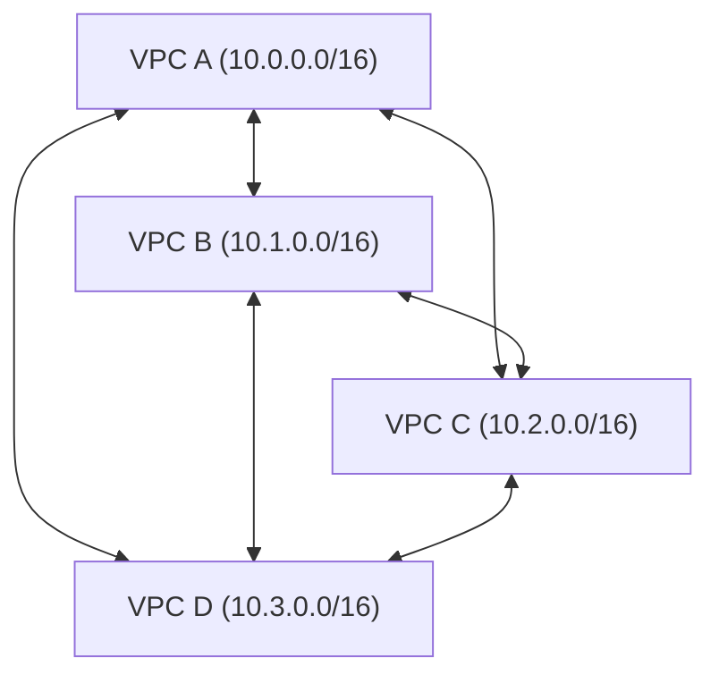

**Connections needed**: `N * (N-1) / 2`
- 4 VPCs = 6 connections
- 10 VPCs = 45 connections
- 25 VPCs = 300 connections
- 50 VPCs = 1,225 connections

**Pros**: This pattern offers the lowest possible latency because traffic takes a direct path without intermediate hops. There is no central router to become a single point of failure, no bandwidth bottleneck, and crucially, no per-gigabyte data processing charges for the transit hop itself (in AWS, intra-region VPC peering is free for the connection).

**Cons**: The architecture scales quadratically. Route tables grow linearly per VPC, creating immense administrative burden. [VPC Peering explicitly denies transitive routing](https://docs.aws.amazon.com/whitepapers/latest/aws-vpc-connectivity-options/vpc-peering.html) (if VPC A peers with B, and B peers with C, VPC A cannot reach C through B). Furthermore, there is no centralized inspection point to enforce universal firewall policies.

**When to use**: Full mesh is appropriate for very small deployments under 10 VPCs. It is also favored in highly cost-sensitive environments where avoiding per-GB processing charges is more important than architectural simplicity.

### Pattern 2: Hub-and-Spoke (Transit Gateway / NCC / Virtual WAN)

A Hub-and-Spoke model centralizes routing. A central hub routes traffic between all attached spokes. Spokes connect only to the hub, never directly to each other. This is analogous to a central post office sorting all mail for a region.

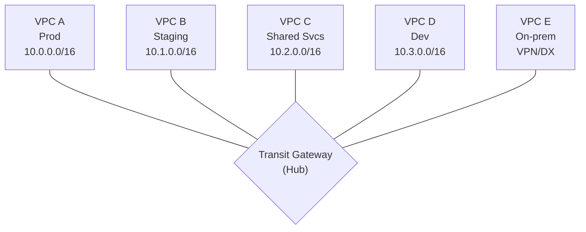

**Connections needed**: `N` (exactly one connection per spoke)
- 50 VPCs = 50 connections
- Transitive routing: YES (VPC A can reach VPC D strictly through the hub)
- Centralized inspection: YES (All traffic can be forced through a firewall VPC)

**Pros**: This pattern exhibits linear scaling, making it manageable at enterprise scale. It enables centralized routing policy, transitive routing, and provides a single, logical attachment point for on-premises connectivity (VPN/Direct Connect). It is the foundational pattern for centralized egress and deep security inspection.

**Cons**: The hub acts as a potential bandwidth bottleneck, although managed cloud hubs are designed to handle massive throughput. Cloud providers levy per-GB data processing charges for traffic passing through the hub (e.g., [AWS Transit Gateway charges $0.02/GB](https://aws.amazon.com/transit-gateway/pricing/)). A catastrophic hub misconfiguration affects all intra-organization connectivity.

**When to use**: This is the default enterprise standard for environments with 10 or more VPCs. It is mandatory for environments requiring centralized security inspection, extensive on-premises connectivity, or regulated sectors demanding deep traffic visibility.

### Pattern 3: Hybrid (Hub-and-Spoke + Direct Peering)

The Hybrid pattern utilizes a hub for the vast majority of organizational traffic but implements direct peering exclusively for extraordinarily high-bandwidth or latency-sensitive flows.

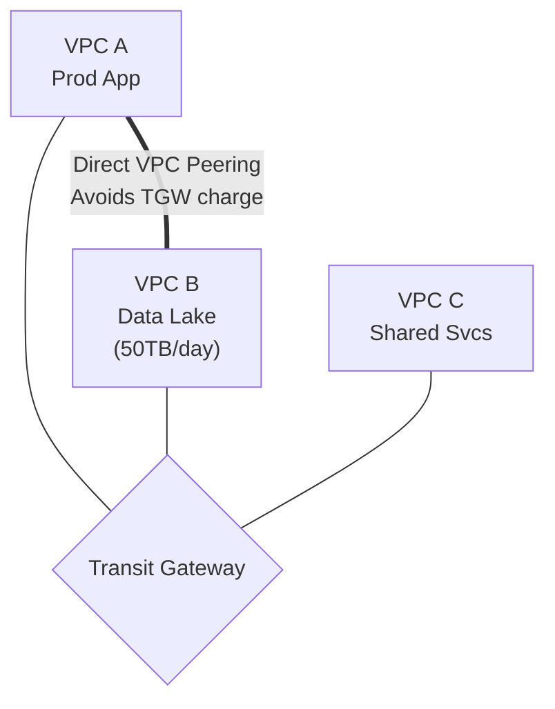

**Rule of thumb**: Implement direct peering bypasses only when sustained traffic between two specific VPCs is high enough that transit-hub processing fees materially affect your bill.

> **Pause and predict**: You have 30 VPCs that all need to communicate. Why is VPC Peering impractical at this scale?
>
> <details>
> <summary>Answer</summary>
> Full mesh VPC Peering for 30 VPCs requires N*(N-1)/2 = 435 peering connections. Each peering connection requires route table entries in both VPCs. The route table limit is 200 entries per route table (can be raised to 1,000, but at a performance cost). Beyond the route table pressure, managing 435 connections is operationally complex: adding VPC #31 requires 30 new peering connections and 60 new route table entries. Transit Gateway reduces this to N connections (one per VPC) with centralized routing.
> </details>

---

## Transit Gateway Deep Dive (AWS)

AWS Transit Gateway (TGW) serves as the backbone of enterprise AWS networking. It operates as a cloud-native router positioned at the geographical center of your network, linking VPCs, Customer Gateways via VPN tunnels, and AWS Direct Connect gateways.

### Core Concepts

Understanding TGW requires mastering three core primitives: Attachments, Route Tables, and Peering.

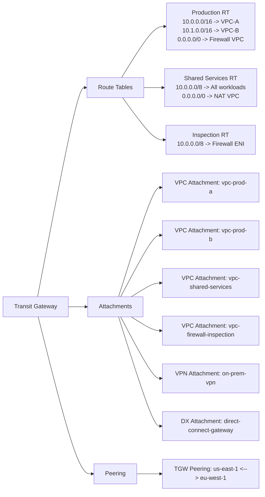

### Setting Up Transit Gateway with Terraform

When provisioning a Transit Gateway via Infrastructure as Code, you must configure it defensively. Notice how `default_route_table_association` and `default_route_table_propagation` are explicitly disabled.

```hcl
# Create the Transit Gateway
resource "aws_ec2_transit_gateway" "main" {
  description                     = "Organization Transit Gateway"
  amazon_side_asn                 = 64512
  auto_accept_shared_attachments  = "disable"
  default_route_table_association = "disable"
  default_route_table_propagation = "disable"
  dns_support                     = "enable"
  vpn_ecmp_support                = "enable"

  tags = {
    Name        = "org-transit-gateway"
    Environment = "infrastructure"
  }
}

# Share the TGW across the organization using RAM
resource "aws_ram_resource_share" "tgw_share" {
  name                      = "transit-gateway-share"
  allow_external_principals = false
}

resource "aws_ram_resource_association" "tgw" {
  resource_arn       = aws_ec2_transit_gateway.main.arn
  resource_share_arn = aws_ram_resource_share.tgw_share.arn
}

resource "aws_ram_principal_association" "org" {
  principal          = "arn:aws:organizations::111111111111:organization/o-abc1234567"
  resource_share_arn = aws_ram_resource_share.tgw_share.arn
}

# Create route tables for different traffic domains
resource "aws_ec2_transit_gateway_route_table" "production" {
  transit_gateway_id = aws_ec2_transit_gateway.main.id
  tags = { Name = "production-routes" }
}

resource "aws_ec2_transit_gateway_route_table" "shared_services" {
  transit_gateway_id = aws_ec2_transit_gateway.main.id
  tags = { Name = "shared-services-routes" }
}

resource "aws_ec2_transit_gateway_route_table" "inspection" {
  transit_gateway_id = aws_ec2_transit_gateway.main.id
  tags = { Name = "inspection-routes" }
}

# Attach a workload VPC (done in each workload account)
resource "aws_ec2_transit_gateway_vpc_attachment" "prod_vpc" {
  subnet_ids         = [aws_subnet.private_a.id, aws_subnet.private_b.id]
  transit_gateway_id = aws_ec2_transit_gateway.main.id
  vpc_id             = aws_vpc.production.id

  transit_gateway_default_route_table_association = false
  transit_gateway_default_route_table_propagation = false

  tags = { Name = "prod-vpc-attachment" }
}

# Associate the attachment with the production route table
resource "aws_ec2_transit_gateway_route_table_association" "prod" {
  transit_gateway_attachment_id  = aws_ec2_transit_gateway_vpc_attachment.prod_vpc.id
  transit_gateway_route_table_id = aws_ec2_transit_gateway_route_table.production.id
}

# Propagate the VPC's routes into the shared services route table
# (so shared services can reach production)
resource "aws_ec2_transit_gateway_route_table_propagation" "prod_to_shared" {
  transit_gateway_attachment_id  = aws_ec2_transit_gateway_vpc_attachment.prod_vpc.id
  transit_gateway_route_table_id = aws_ec2_transit_gateway_route_table.shared_services.id
}
```

### Routing Traffic Through a Centralized Firewall

The most powerful architectural capability unlocked by Transit Gateway is centralized inspection. By strategically assigning route tables, you can force all east-west (VPC-to-VPC) traffic through a dedicated firewall appliance before it reaches its final destination.

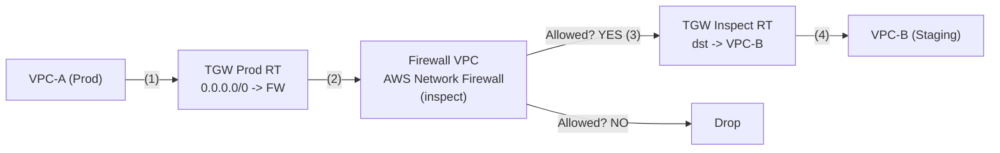

The traffic flow executes in a precise sequence:
1. A packet leaves VPC-A. The VPC route table sends it to the TGW Attachment.
2. The packet arrives at the TGW and evaluates the "Prod" Route Table. The Prod RT has a default route forcing everything to the Firewall VPC.
3. The packet traverses the firewall appliance in the Firewall VPC.
4. If allowed, the packet leaves the Firewall VPC and re-enters the TGW, but this time it is evaluated against the "Inspect" Route Table.
5. The Inspect RT contains the specific route for VPC-B, delivering the packet successfully.

This architecture introduces additional hop and inspection latency but provides major security benefits:
- Centralized Intrusion Detection/Prevention (IDS/IPS) for internal traffic.
- Consolidated logging of all inter-VPC flows in a single pane of glass.
- Critical capability to block lateral movement by ransomware or compromised Kubernetes pods.

```hcl
# Route all traffic from production to the firewall
resource "aws_ec2_transit_gateway_route" "prod_default" {
  destination_cidr_block         = "0.0.0.0/0"
  transit_gateway_attachment_id  = aws_ec2_transit_gateway_vpc_attachment.firewall.id
  transit_gateway_route_table_id = aws_ec2_transit_gateway_route_table.production.id
}

# In the firewall VPC, route return traffic back through TGW
resource "aws_route" "firewall_return" {
  route_table_id         = aws_route_table.firewall_private.id
  destination_cidr_block = "10.0.0.0/8"
  transit_gateway_id     = aws_ec2_transit_gateway.main.id
}
```

> **Stop and think**: Why should you avoid using the default Transit Gateway route table?
>
> <details>
> <summary>Answer</summary>
> The default TGW route table propagates all routes from all attachments into a single routing domain. This means every VPC can reach every other VPC. For a production environment, this violates the principle of least privilege at the network level: a development VPC should not have network-layer routing to a production VPC. By disabling the default route table and creating separate route tables (production, staging, shared-services), you can control which VPCs can communicate. Production VPCs see only other production VPCs and shared services. Development VPCs see only development VPCs and shared services. This is network segmentation via routing policy.
> </details>

---

## GCP Network Connectivity Center (NCC) and Shared VPC

Google Cloud Platform (GCP) approaches transit networking from an entirely different philosophy. Instead of a single gateway product routing between disparate VPCs, GCP relies heavily on **Shared VPC** for intra-organization connectivity, reserving the Network Connectivity Center (NCC) for hybrid cloud and multi-cloud scenarios.

### Shared VPC: The GCP Way

In GCP, Shared VPC is the dominant multi-project networking model. Rather than peering dozens of separate VPCs, network administrators create one massive VPC inside a central "Host Project". They then share specific subnets out to "Service Projects" owned by individual teams. 

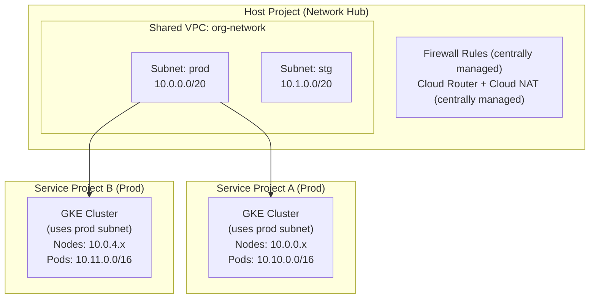

The pivotal distinction from AWS is that there is only ONE network boundary to manage. [Resources across all projects communicate via private IPs inherently because they exist within the same routing plane. Firewall rules are administered centrally within the Host Project.](https://cloud.google.com/vpc/docs/shared-vpc)

```bash
# Enable Shared VPC on the host project
gcloud compute shared-vpc enable network-hub-project

# Associate service projects
gcloud compute shared-vpc associated-projects add team-a-prod \
  --host-project=network-hub-project

gcloud compute shared-vpc associated-projects add team-b-prod \
  --host-project=network-hub-project

# Create subnets with secondary ranges for GKE
gcloud compute networks subnets create prod-subnet \
  --project=network-hub-project \
  --network=org-network \
  --region=us-central1 \
  --range=10.0.0.0/20 \
  --secondary-range=pods=10.10.0.0/16,services=10.20.0.0/20

# Grant GKE service account access to the shared subnet
PROJECT_NUM=$(gcloud projects describe team-a-prod --format="value(projectNumber)")

gcloud projects add-iam-policy-binding network-hub-project \
  --member="serviceAccount:service-${PROJECT_NUM}@container-engine-robot.iam.gserviceaccount.com" \
  --role="roles/container.hostServiceAgentUser"

# Create GKE cluster in service project using shared VPC
gcloud container clusters create team-a-prod \
  --project=team-a-prod \
  --region=us-central1 \
  --network=projects/network-hub-project/global/networks/org-network \
  --subnetwork=projects/network-hub-project/regions/us-central1/subnetworks/prod-subnet \
  --cluster-secondary-range-name=pods \
  --services-secondary-range-name=services \
  --enable-private-nodes \
  --master-ipv4-cidr=172.16.0.0/28
```

> **Stop and think**: In AWS, network segmentation is achieved by isolating workloads into separate VPCs and connecting them via a Transit Gateway with distinct route tables. In GCP's Shared VPC model, multiple environments might share the same VPC. How do you prevent workloads in a staging subnet from communicating with workloads in a production subnet?
>
> <details>
> <summary>Answer</summary>
> In a GCP Shared VPC, all subnets route to each other by default. To isolate environments, you must implement centralized egress and ingress firewall rules in the host project. You apply network tags or attach specific Service Accounts to the compute instances (or GKE nodes) in each environment. Then, you create firewall rules that explicitly deny traffic between the staging and production tags/service accounts, ensuring network segmentation is enforced by the firewall rather than by route isolation.
> </details>

### GCP Network Connectivity Center

Network Connectivity Center (NCC) provides a managed hub focused primarily on establishing external connectivity. Use NCC to terminate high-bandwidth BGP sessions, on-premises VPNs, and Dedicated Interconnects, piping that external traffic smoothly into your Shared VPC.

```bash
# Create an NCC hub
gcloud network-connectivity hubs create org-hub \
  --description="Organization network hub"

# Create a spoke for a VPN tunnel to on-premises
gcloud network-connectivity spokes create onprem-spoke \
  --hub=org-hub \
  --region=us-central1 \
  --vpn-tunnel=onprem-tunnel-1,onprem-tunnel-2 \
  --site-to-site-data-transfer

# Create a spoke for a Cloud Interconnect (dedicated connection)
gcloud network-connectivity spokes create colo-spoke \
  --hub=org-hub \
  --region=us-central1 \
  --interconnect-attachment=colo-attachment-1
```

---

## Azure Virtual WAN

Microsoft Azure utilizes Virtual WAN (vWAN), a managed service consolidating networking, security, and routing functionalities into a single interface. Virtual WAN streamlines large-scale branch connectivity.

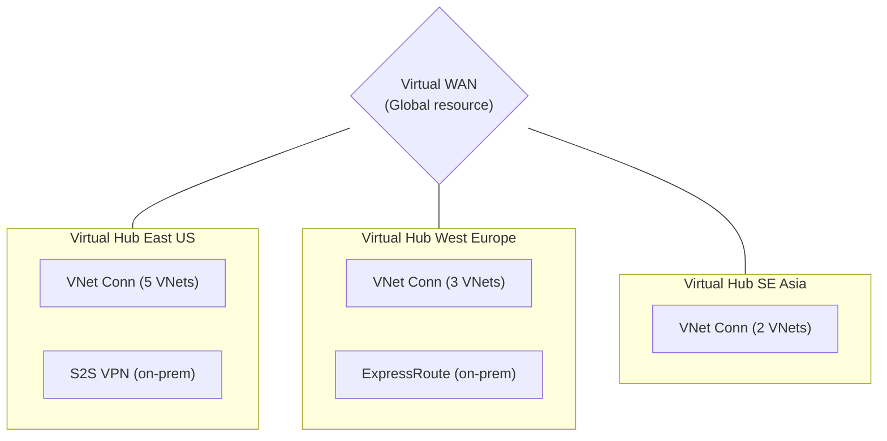

A crucial feature of Virtual WAN Standard tier is its automatic, global meshing. If you deploy regional Hubs across the globe, [Microsoft automatically provisions full-mesh transit routing between them over the Azure backbone.](https://learn.microsoft.com/en-us/azure/virtual-wan/virtual-wan-faq)

```bash
# Create a Virtual WAN
az network vwan create \
  --name org-vwan \
  --resource-group networking-rg \
  --type Standard \
  --branch-to-branch-traffic true

# Create a regional hub
az network vhub create \
  --name eastus-hub \
  --resource-group networking-rg \
  --vwan org-vwan \
  --address-prefix 10.100.0.0/24 \
  --location eastus \
  --sku Standard

# Connect a spoke VNet to the hub
az network vhub connection create \
  --name prod-vnet-connection \
  --resource-group networking-rg \
  --vhub-name eastus-hub \
  --remote-vnet /subscriptions/SUB_ID/resourceGroups/prod-rg/providers/Microsoft.Network/virtualNetworks/prod-vnet \
  --internet-security true

# Add a VPN gateway to the hub
az network vpn-gateway create \
  --name eastus-vpn-gw \
  --resource-group networking-rg \
  --vhub eastus-hub \
  --scale-unit 2
```

---

## The Overlapping CIDR Problem

Overlapping CIDR ranges constitute the single most pervasive networking error in multi-account cloud architectures. Two disparate teams independently select the common `10.0.0.0/16` block for their respective VPCs. The architecture functions flawlessly in isolation until a business requirement forces integration. At that exact moment, routing breaks down entirely because IP routers cannot decipher identical destination addresses.

### How It Happens

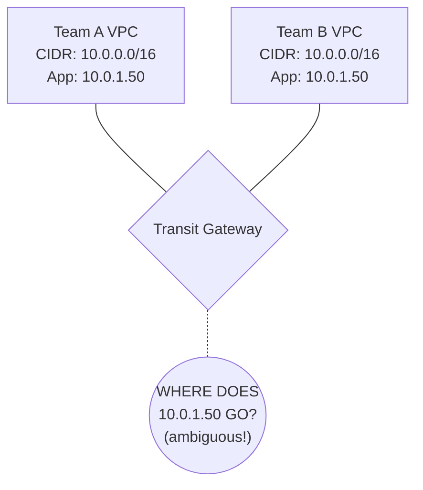

Overlapping CIDR blocks prevent straightforward peering or hub-based routing, so you must renumber networks or introduce translation or proxy patterns before interconnecting them.

> **Stop and think**: You are merging with another company, and their production VPC uses `10.0.0.0/16`, the exact same CIDR as your production VPC. How can you establish connectivity between these two environments without changing their IP addresses?
>
> <details>
> <summary>Answer</summary>
> Direct routing is impossible with overlapping CIDRs. You must use Private NAT (Network Address Translation) gateways or intermediary proxy instances. Traffic from your VPC is translated to a non-overlapping intermediate IP range before it crosses the Transit Gateway, and vice versa. This requires complex DNS configuration and dual NAT setups, highlighting why centralized IPAM is critical from day one to avoid overlapping IPs in the first place.
> </details>

### Prevention: IP Address Management (IPAM)

The preventative cure is instituting [centralized IP Address Management (IPAM). By defining authoritative IP pools, you force teams to request allocations programmatically](https://docs.aws.amazon.com/vpc/latest/ipam/allocate-cidrs-ipam.html), entirely eliminating human error.

```bash
# AWS: Use VPC IPAM (IP Address Manager)
aws ec2 create-ipam \
  --operating-regions RegionName=us-east-1 RegionName=eu-west-1

# Create a top-level pool
aws ec2 create-ipam-pool \
  --ipam-scope-id ipam-scope-abc123 \
  --address-family ipv4 \
  --description "Organization IPv4 pool"

# Provision the master CIDR block
aws ec2 provision-ipam-pool-cidr \
  --ipam-pool-id ipam-pool-abc123 \
  --cidr 10.0.0.0/8

# Create sub-pools per environment
aws ec2 create-ipam-pool \
  --ipam-scope-id ipam-scope-abc123 \
  --source-ipam-pool-id ipam-pool-abc123 \
  --address-family ipv4 \
  --allocation-default-netmask-length 20 \
  --description "Production VPCs"

# When creating a VPC, request from the pool (no manual CIDR)
aws ec2 create-vpc \
  --ipv4-ipam-pool-id ipam-pool-prod123 \
  --ipv4-netmask-length 20
```

### CIDR Allocation Strategy

A robust strategy segments the massive `10.0.0.0/8` master block into logical routing domains before a single line of Terraform is written. Furthermore, deploying Kubernetes requires immense IP space for Pods. In most cases, utilize Carrier-Grade NAT ranges (e.g., `100.64.0.0/10`) for secondary pod subnets to avoid exhausting your primary routing space.

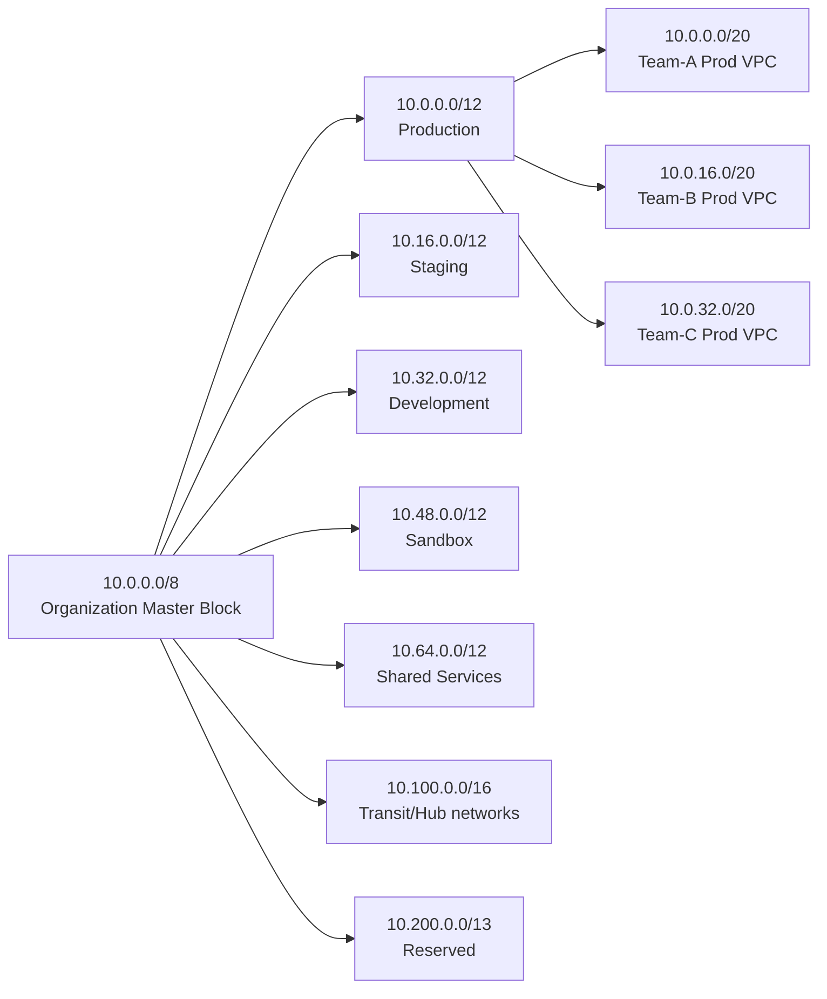

---

## Egress Filtering and Cost Optimization

Egress (outbound) data transfer represents the silent killer of cloud budgets. AWS levies a charge of $0.09/GB for internet egress. At scale, this rapidly eclipses compute costs. 

### Centralized Egress Pattern

Instead of deploying discrete NAT Gateways into every workload VPC, funnel all outbound internet requests through your Transit Gateway into a dedicated Egress VPC.

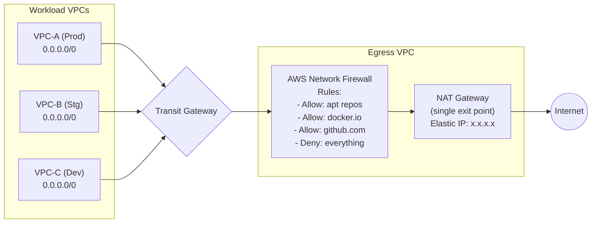

The architectural benefits are manifold:
- **Consolidated Identity**: Presenting a single egress Elastic IP vastly simplifies firewall allowlisting required by third-party partners.
- **Deep Filtering**: Intercepting traffic prevents compromised container pods from communicating with command-and-control servers or exfiltrating data.
- **Cost Reduction**: Eliminating redundant NAT Gateways across dozens of VPCs saves substantial hourly running costs ($32/month per eliminated gateway).

### AWS Network Firewall Rules

By utilizing [stateful domain allowlists inspecting TLS SNI headers](https://docs.aws.amazon.com/network-firewall/latest/APIReference/API_RulesSourceList.html), administrators can permit access specifically to necessary artifact repositories while discarding malicious outbound requests.

```bash
# Create a rule group for allowed domains
aws network-firewall create-rule-group \
  --rule-group-name "allowed-egress-domains" \
  --type STATEFUL \
  --capacity 100 \
  --rule-group '{
    "RulesSource": {
      "RulesSourceList": {
        "Targets": [
          ".amazonaws.com",
          ".docker.io",
          ".github.com",
          ".githubusercontent.com",
          "registry.k8s.io",
          ".grafana.com",
          "apt.kubernetes.io"
        ],
        "TargetTypes": ["HTTP_HOST", "TLS_SNI"],
        "GeneratedRulesType": "ALLOWLIST"
      }
    }
  }'
```

### Cross-AZ and Cross-Region Transfer Costs

The most frequently overlooked expenditure in Kubernetes networking is cross-AZ data transfer. Examine the pricing matrix carefully:

| Traffic Path | AWS Cost/GB | GCP Cost/GB | Azure Cost/GB |
|---|---|---|---|
| Same AZ | Free | Free | Free |
| Cross-AZ (same region) | Charge depends on service and traffic path | Charge depends on zones, IP type, and path | Charge depends on service and billing path |
| Cross-Region (same continent) | Metered; exact rate depends on source and destination regions | Metered; exact rate depends on source and destination regions | Metered; exact rate depends on source and destination regions |
| Cross-Region (intercontinental) | Metered; typically higher than intra-continent traffic | Metered; typically higher than intra-continent traffic | Metered; typically higher than intra-continent traffic |
| Internet egress | Metered; varies by source region and usage tier | Metered; varies by destination and usage tier | Metered; varies by source region and pricing path |
| TGW data processing | AWS Transit Gateway adds per-GB processing charges | Product- and path-dependent; check current NCC or VPC pricing | Product- and path-dependent; check current Virtual WAN and bandwidth pricing |

The AWS cross-AZ charge proves particularly devastating for distributed Kubernetes workloads. If a cluster spans three Availability Zones to maintain high availability, every intra-cluster service request that crosses an AZ boundary incurs a $0.02/GB round-trip charge.

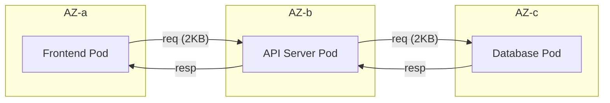

To mitigate this, leverage Kubernetes topology-aware routing so traffic prefers same-zone endpoints when the Service and endpoint distribution allow it.

---

## Troubleshooting Transit Networks

When complex hub-and-spoke networks fail, they rarely trigger explicit error codes. They fail silently, manifesting as routing blackholes. Because a single packet might traverse five different routing tables across three VPCs, diagnosing the exact point of failure demands systematic analysis.

### Identifying Routing Blackholes with VPC Flow Logs

VPC Flow Logs persistently record metadata regarding IP traffic flowing through network interfaces. During troubleshooting, you must scan relentlessly for `REJECT` records.

```text
# Sample VPC Flow Log (AWS)
version account-id interface-id srcaddr dstaddr srcport dstport protocol packets bytes start end action log-status
2 123456789012 eni-0a1b2c3d 10.0.1.50 10.1.2.75 443 49152 6 5 500 1620140761 1620140821 ACCEPT OK
2 123456789012 eni-0a1b2c3d 10.0.1.50 10.2.3.10 443 49153 6 1 40 1620140761 1620140821 REJECT OK
```

A `REJECT` action occurs for two primary reasons:
1. **Firewall Block**: The packet arrived at the destination, but a Security Group or Network ACL denied it.
2. **Path Issue**: A missing or incorrect route can blackhole traffic, but you need route analysis tools in addition to flow logs to prove that was the cause. 

### Route Analysis Tools

To augment manual log parsing, cloud providers offer automated path analysis. AWS Reachability Analyzer and GCP Connectivity Tests can model the expected path and highlight blocking components in routing or policy.

---

## Did You Know?

1. [**AWS Transit Gateway processes over 100 Gbps per attachment** and supports up to 5,000 attachments per gateway](https://docs.aws.amazon.com/vpc/latest/tgw/transit-gateway-quotas.html). Its release gave AWS customers a managed alternative to self-built transit VPC patterns.
2. **GCP's Shared VPC is built for large multi-project environments.** Use host projects and shared subnets when multiple teams need centralized network control with delegated project ownership.
3. **Azure Virtual WAN Standard automatically meshes hubs** within the same Virtual WAN, reducing manual inter-hub routing work over Microsoft's backbone.
4. **Cross-AZ data transfer in AWS can become a major bill driver at scale.** Track it explicitly instead of assuming it is negligible.

---

## Common Mistakes

| Mistake | Why It Happens | How to Fix It |
|---|---|---|
| Using VPC Peering when Transit Gateway is needed | Peering is simpler to set up initially | Start evaluating TGW early if you expect multiple VPCs, centralized inspection, or ongoing network growth. Migration from peering to TGW is usually more disruptive later. |
| Overlapping CIDR ranges across accounts | No centralized IP planning | Implement AWS IPAM or maintain a CIDR registry in your IaC. Allocate from non-overlapping pools per environment. |
| Forgetting to update VPC route tables after TGW attachment | TGW handles its routes, but VPCs need routes pointing to TGW | Automate: when attaching a VPC to TGW, also add a route `0.0.0.0/0 -> tgw-id` in the VPC's private route table. |
| Running NAT Gateways in every VPC | Each VPC needs internet access | Centralize NAT in a shared egress VPC when the traffic pattern and failure model fit; this can remove repeated hourly NAT gateway charges, but the exact savings depend on region and usage. |
| Ignoring cross-AZ data transfer costs | "It's just $0.01/GB" | For high-throughput K8s clusters, this can be thousands per month. Use topology-aware routing and monitor cross-AZ traffic with VPC Flow Logs. |
| Not enabling TGW route table segmentation | Using the default route table for everything | Create separate route tables per security domain (prod, staging, shared). This prevents staging workloads from routing to production VPCs. |
| Peering VPCs across regions without considering latency | "The cloud handles it" | Cross-region latency varies widely by geography and path. For real-time APIs, measure it directly with `ping`, `mtr`, or application-level tests before designing cross-region flows. |
| Skipping egress filtering | "We trust our workloads" | A compromised pod can exfiltrate data to any IP. Centralized egress with domain allowlists is a critical security control. |

---

## Quiz

<details>
<summary>1. You are a network architect moving from AWS to GCP. In AWS, you connected 50 project VPCs using Transit Gateway. How will your approach to multi-project connectivity fundamentally change in GCP, and why?</summary>

In AWS, Transit Gateway connects separate VPCs (each with its own CIDR, route tables, and security groups) through a central router, maintaining network isolation. GCP uses a Shared VPC model where a single VPC is owned by a host project and its subnets are shared to service projects. There are no separate VPCs to connect—everything resides in one network. This eliminates the need for transit routing for intra-org traffic, but means firewall rules apply across all projects sharing the VPC.
</details>

<details>
<summary>2. Your EKS cluster spans 3 AZs and generates 50TB of cross-AZ traffic monthly. What are two strategies to reduce this cost?</summary>

Strategy 1: Enable topology-aware routing in Kubernetes. Configure Services with `internalTrafficPolicy: Local` where possible, and use the `trafficDistribution: PreferClose` field in your Service spec so kube-proxy prefers endpoints in the same AZ. Strategy 2: Use pod topology spread constraints combined with service affinity to co-locate communicating services in the same AZ. For example, place the API server and its database cache in the same AZ. This requires understanding your service call graph. Together, these can reduce cross-AZ traffic by 40-70%, saving $500-$700/month on a 50TB workload.
</details>

<details>
<summary>3. A partner company requires you to provide a static IP for their firewall allowlist. You have 12 VPCs across 3 accounts. How do you provide a single egress IP?</summary>

Create a centralized egress VPC with a NAT Gateway attached to an Elastic IP. Route all internet-bound traffic from your 12 VPCs through the Transit Gateway to the egress VPC. The NAT Gateway translates all outbound traffic to the single Elastic IP. The partner allowlists this one IP. This pattern also lets you add AWS Network Firewall in the egress VPC for domain-based filtering. The cost is one NAT Gateway ($32/month + $0.045/GB) instead of 12 NAT Gateways ($384/month), plus TGW data processing ($0.02/GB). At moderate traffic volumes, the centralized approach is cheaper and more manageable.
</details>

<details>
<summary>4. Your platform team has historically used a shared wiki spreadsheet to allocate VPC CIDR blocks. Recently, two different product teams accidentally claimed the same `10.4.0.0/16` block, causing a multi-day outage when their networks couldn't peer. How would implementing AWS VPC IPAM prevent this situation from happening again?</summary>

AWS VPC IPAM provides automated, conflict-free CIDR allocation enforced at the API level. When you create a VPC from an IPAM pool, IPAM guarantees the allocated CIDR does not overlap with any other allocation in the pool. Spreadsheets and tagging rely entirely on human discipline—someone must manually check the spreadsheet, and nothing prevents them from bypassing it. Furthermore, IPAM tracks actual usage versus allocation and integrates with AWS Organizations to enforce allocation guardrails programmatically.
</details>

<details>
<summary>5. You are designing a transit network in AWS for a highly regulated financial application. All traffic between the 'payments' VPC and the 'web' VPC must be inspected by an Intrusion Prevention System (IPS). You have configured a Transit Gateway with isolated route tables. What is the necessary routing flow to guarantee inspection?</summary>

Traffic from the 'web' VPC must hit a TGW attachment associated with a 'web' route table. This route table must have a default route (0.0.0.0/0) pointing exclusively to the firewall VPC attachment. In the firewall VPC, traffic is processed by the IPS instances, then routed back to the TGW. Critically, the firewall VPC attachment must be associated with a distinct 'inspection' route table containing specific CIDR routes for the 'payments' VPC, ensuring the cleaned traffic is forwarded accurately to its final destination.
</details>

<details>
<summary>6. A platform team deployed a multi-region Kubernetes v1.35 architecture. The application operates smoothly, but the monthly cloud bill displays exorbitant data transfer spikes. Upon investigation, they discover that front-end pods in `us-east-1a` are communicating with backend pods in `us-east-1b` and `us-east-1c` equally. How can this architecture be optimized to diminish these costs without sacrificing availability?</summary>

The exorbitant costs stem directly from cross-AZ data transfer, which incurs financial penalties in both directions. The architecture can be deeply optimized by enabling topology-aware routing. By configuring Services with `trafficDistribution: PreferClose` (a feature introduced in Kubernetes 1.30 and fully stable in v1.35), `kube-proxy` actively prioritizes routing network traffic to application endpoints residing strictly within the same Availability Zone. This minimizes wasteful cross-AZ hops and vastly reduces the associated data transfer fees.
</details>

---

## Hands-On Exercise: Deploy an End-to-End Hub-and-Spoke Network

In this exercise, you will deploy a fully executable hub-and-spoke network topology. You will provision the foundational infrastructure, architect the routing logic, apply the configuration via Terraform, and finalize the setup by deploying a stateful egress firewall.

### Scenario

**Company**: DataStream (a massive data pipeline provider)
- **Infrastructure**: Four discrete workload VPCs (`ingest-prod`, `process-prod`, `api-prod`, `shared-services`).
- **On-Premises**: A legacy data center connected via VPN.
- **Security Requirement**: All outbound internet egress must be scrutinized by a centralized firewall.
- **Segmentation Requirement**: The `ingest` and `process` VPCs must communicate natively; however, the `api` VPC must absolutely not reach `ingest` directly.

### Step 0: Infrastructure Scaffolding

Before we can test Transit Gateway routing, we must provision the underlying VPCs. Save the following code block as `scaffold.tf` and deploy it. This establishes the structural foundation required for the subsequent Terraform operations.

```hcl
provider "aws" {
  region = "us-east-1"
}

variable "vpcs" {
  default = {
    "ingest-prod"     = "10.0.0.0/20"
    "process-prod"    = "10.0.16.0/20"
    "api-prod"        = "10.0.32.0/20"
    "shared-services" = "10.64.0.0/20"
    "egress-vpc"      = "10.100.1.0/24"
  }
}

resource "aws_vpc" "scaffold" {
  for_each             = var.vpcs
  cidr_block           = each.value
  enable_dns_support   = true
  enable_dns_hostnames = true
  tags = { Name = each.key }
}

resource "aws_subnet" "scaffold" {
  for_each   = var.vpcs
  vpc_id     = aws_vpc.scaffold[each.key].id
  cidr_block = cidrsubnet(each.value, 4, 0)
  tags       = { Name = "${each.key}-subnet-az1" }
}

output "egress_vpc_id" {
  value = aws_vpc.scaffold["egress-vpc"].id
}

output "egress_subnet_id" {
  value = aws_subnet.scaffold["egress-vpc"].id
}
```

Execute the scaffolding setup:
```bash
terraform init
terraform apply -auto-approve
```

### Task 1: Design the CIDR Plan

Now that the VPCs exist, formulate a comprehensive CIDR allocation plan ensuring zero overlap across the hub, spokes, EKS pods, and on-premises facilities.

<details>
<summary>Solution</summary>

```text
CIDR Allocation Plan
════════════════════════════════════════

Network Hub:
  Transit Gateway CIDR: 10.100.0.0/24

Workload VPCs:
  ingest-prod:      10.0.0.0/20  (4,094 usable IPs)
  process-prod:     10.0.16.0/20
  api-prod:         10.0.32.0/20
  shared-services:  10.64.0.0/20

Egress/Firewall VPC:
  egress-vpc:       10.100.1.0/24

On-Premises:
  datacenter:       172.16.0.0/12 (existing allocation)

Pod CIDRs (secondary ranges for EKS):
  ingest-prod pods:   100.64.0.0/16
  process-prod pods:  100.65.0.0/16
  api-prod pods:      100.66.0.0/16
```
</details>

### Task 2: Design the TGW Route Tables

Draft the logical associations and propagations required to enforce the strict segmentation requirement: `ingest` and `process` communicate freely, but `api` remains isolated from `ingest`.

<details>
<summary>Solution</summary>

```text
TGW Route Tables:
═══════════════════════════════════════

Route Table: "data-pipeline" (for ingest and process)
  Associations: ingest-prod, process-prod
  Propagations from: ingest-prod, process-prod, shared-services
  Static route: 0.0.0.0/0 -> egress-vpc attachment
  Result: ingest <-> process: YES, ingest -> shared: YES

Route Table: "api-tier" (for api)
  Associations: api-prod
  Propagations from: process-prod, shared-services
  Static route: 0.0.0.0/0 -> egress-vpc attachment
  NOT propagated: ingest-prod
  Result: api -> process: YES, api -> ingest: NO

Route Table: "shared" (for shared-services)
  Associations: shared-services
  Propagations from: ingest-prod, process-prod, api-prod
  Static route: 0.0.0.0/0 -> egress-vpc attachment
  Result: shared -> all workloads: YES

Route Table: "egress" (for firewall/egress VPC)
  Associations: egress-vpc
  Propagations from: ALL VPCs
  Result: return traffic routes to correct VPC
```
</details>

### Task 3: Write the Terraform for TGW Route Segmentation

To render the architecture functional, save the solution block below to a file named `tgw.tf`. 

*Prerequisite Note:* Because the solution strictly demonstrates the TGW routing logic, ensure you also add standard `aws_ec2_transit_gateway_vpc_attachment` resources pointing your scaffolded VPCs to the newly declared `aws_ec2_transit_gateway.main` to make the deployment perfectly whole.

Run `terraform apply -auto-approve` after saving the logic.

<details>
<summary>Solution</summary>

```hcl
resource "aws_ec2_transit_gateway" "main" {
  amazon_side_asn                 = 64512
  default_route_table_association = "disable"
  default_route_table_propagation = "disable"
  tags = { Name = "datastream-tgw" }
}

# Route Tables
resource "aws_ec2_transit_gateway_route_table" "data_pipeline" {
  transit_gateway_id = aws_ec2_transit_gateway.main.id
  tags = { Name = "data-pipeline-rt" }
}

resource "aws_ec2_transit_gateway_route_table" "api_tier" {
  transit_gateway_id = aws_ec2_transit_gateway.main.id
  tags = { Name = "api-tier-rt" }
}

resource "aws_ec2_transit_gateway_route_table" "shared" {
  transit_gateway_id = aws_ec2_transit_gateway.main.id
  tags = { Name = "shared-rt" }
}

resource "aws_ec2_transit_gateway_route_table" "egress" {
  transit_gateway_id = aws_ec2_transit_gateway.main.id
  tags = { Name = "egress-rt" }
}

# Associations (which RT does each attachment use for outbound lookups)
resource "aws_ec2_transit_gateway_route_table_association" "ingest_to_pipeline" {
  transit_gateway_attachment_id  = aws_ec2_transit_gateway_vpc_attachment.ingest.id
  transit_gateway_route_table_id = aws_ec2_transit_gateway_route_table.data_pipeline.id
}

resource "aws_ec2_transit_gateway_route_table_association" "process_to_pipeline" {
  transit_gateway_attachment_id  = aws_ec2_transit_gateway_vpc_attachment.process.id
  transit_gateway_route_table_id = aws_ec2_transit_gateway_route_table.data_pipeline.id
}

resource "aws_ec2_transit_gateway_route_table_association" "api_to_api_tier" {
  transit_gateway_attachment_id  = aws_ec2_transit_gateway_vpc_attachment.api.id
  transit_gateway_route_table_id = aws_ec2_transit_gateway_route_table.api_tier.id
}

# Propagations (which VPC routes are visible in each RT)
# Data pipeline RT sees: ingest, process, shared-services
resource "aws_ec2_transit_gateway_route_table_propagation" "ingest_in_pipeline" {
  transit_gateway_attachment_id  = aws_ec2_transit_gateway_vpc_attachment.ingest.id
  transit_gateway_route_table_id = aws_ec2_transit_gateway_route_table.data_pipeline.id
}

resource "aws_ec2_transit_gateway_route_table_propagation" "process_in_pipeline" {
  transit_gateway_attachment_id  = aws_ec2_transit_gateway_vpc_attachment.process.id
  transit_gateway_route_table_id = aws_ec2_transit_gateway_route_table.data_pipeline.id
}

resource "aws_ec2_transit_gateway_route_table_propagation" "shared_in_pipeline" {
  transit_gateway_attachment_id  = aws_ec2_transit_gateway_vpc_attachment.shared.id
  transit_gateway_route_table_id = aws_ec2_transit_gateway_route_table.data_pipeline.id
}

# API tier RT sees: process, shared-services (NOT ingest)
resource "aws_ec2_transit_gateway_route_table_propagation" "process_in_api" {
  transit_gateway_attachment_id  = aws_ec2_transit_gateway_vpc_attachment.process.id
  transit_gateway_route_table_id = aws_ec2_transit_gateway_route_table.api_tier.id
}

resource "aws_ec2_transit_gateway_route_table_propagation" "shared_in_api" {
  transit_gateway_attachment_id  = aws_ec2_transit_gateway_vpc_attachment.shared.id
  transit_gateway_route_table_id = aws_ec2_transit_gateway_route_table.api_tier.id
}

# Default routes to egress VPC for internet-bound traffic
resource "aws_ec2_transit_gateway_route" "pipeline_default" {
  destination_cidr_block         = "0.0.0.0/0"
  transit_gateway_attachment_id  = aws_ec2_transit_gateway_vpc_attachment.egress.id
  transit_gateway_route_table_id = aws_ec2_transit_gateway_route_table.data_pipeline.id
}

resource "aws_ec2_transit_gateway_route" "api_default" {
  destination_cidr_block         = "0.0.0.0/0"
  transit_gateway_attachment_id  = aws_ec2_transit_gateway_vpc_attachment.egress.id
  transit_gateway_route_table_id = aws_ec2_transit_gateway_route_table.api_tier.id
}
```
</details>

### Task 4: Write Egress Firewall Rules

Finally, deploy the AWS Network Firewall into the Egress VPC. Before executing the script below, you must substitute the placeholder variables with your live infrastructure details.

Execute this command to retrieve your live IDs from Step 0:
```bash
export LIVE_ACCOUNT=$(aws sts get-caller-identity --query Account --output text)
export LIVE_VPC=$(terraform output -raw egress_vpc_id)
export LIVE_SUBNET=$(terraform output -raw egress_subnet_id)
```
Replace `ACCOUNT` with `$LIVE_ACCOUNT`, `vpc-egress123` with `$LIVE_VPC`, and `subnet-fw-az1` with `$LIVE_SUBNET` within the bash snippet below prior to running it.

<details>
<summary>Solution</summary>

```bash
# Create a stateful rule group with domain allowlist
aws network-firewall create-rule-group \
  --rule-group-name "datastream-egress-allowlist" \
  --type STATEFUL \
  --capacity 200 \
  --rule-group '{
    "RulesSource": {
      "RulesSourceList": {
        "Targets": [
          ".amazonaws.com",
          "registry.k8s.io",
          ".docker.io",
          ".github.com",
          ".githubusercontent.com",
          "pypi.org",
          "files.pythonhosted.org",
          ".datadog.com",
          ".grafana.net"
        ],
        "TargetTypes": ["HTTP_HOST", "TLS_SNI"],
        "GeneratedRulesType": "ALLOWLIST"
      }
    }
  }'

# Create the firewall policy
aws network-firewall create-firewall-policy \
  --firewall-policy-name "datastream-egress-policy" \
  --firewall-policy '{
    "StatelessDefaultActions": ["aws:forward_to_sfe"],
    "StatelessFragmentDefaultActions": ["aws:forward_to_sfe"],
    "StatefulRuleGroupReferences": [
      {
        "ResourceArn": "arn:aws:network-firewall:us-east-1:ACCOUNT:stateful-rulegroup/datastream-egress-allowlist"
      }
    ],
    "StatefulDefaultActions": ["aws:drop_strict"],
    "StatefulEngineOptions": {
      "RuleOrder": "STRICT_ORDER"
    }
  }'

# Create the firewall in the egress VPC
aws network-firewall create-firewall \
  --firewall-name "datastream-egress-fw" \
  --firewall-policy-arn "arn:aws:network-firewall:us-east-1:ACCOUNT:firewall-policy/datastream-egress-policy" \
  --vpc-id vpc-egress123 \
  --subnet-mappings SubnetId=subnet-fw-az1 SubnetId=subnet-fw-az2
```
</details>

### Task 5: Validation & Teardown

Verify the successful deployment of the hub-and-spoke infrastructure and tear down the assets to prevent recurring cloud charges.

- [ ] Validate the Transit Gateway route table configuration:
  ```bash
  aws ec2 describe-transit-gateway-route-tables
  ```
- [ ] Validate the active state of the Network Firewall appliance:
  ```bash
  aws network-firewall describe-firewall --firewall-name "datastream-egress-fw"
  ```
- [ ] Destroy the entire scaffolded infrastructure:
  ```bash
  terraform destroy -auto-approve
  ```

---

## Next Module

[Module 8.3: Cross-Cluster & Cross-Region Networking](../module-8.3-cross-cluster-networking/) -- Transition your perspective from raw cloud-level virtual networks to intricate Kubernetes-level networking. You will master how individual pods separated by vast geographic distances discover and talk to each other seamlessly using Cilium Cluster Mesh, the advanced Multi-Cluster Services API, and global DNS load balancing layers.

## Sources

- [docs.aws.amazon.com: vpc peering.html](https://docs.aws.amazon.com/whitepapers/latest/aws-vpc-connectivity-options/vpc-peering.html) — AWS documentation explicitly states that VPC peering does not support transitive peering.
- [aws.amazon.com: pricing](https://aws.amazon.com/transit-gateway/pricing/) — The AWS Transit Gateway pricing page directly states a $0.02 data-processing charge in its pricing example.
- [cloud.google.com: shared vpc](https://cloud.google.com/vpc/docs/shared-vpc) — The Shared VPC overview directly describes host and service projects, internal-IP communication, and centralized control of network resources.
- [docs.aws.amazon.com: API RulesSourceList.html](https://docs.aws.amazon.com/network-firewall/latest/APIReference/API_RulesSourceList.html) — The API reference explicitly says that for HTTPS traffic, domain filtering is SNI-based.
- [learn.microsoft.com: virtual wan faq](https://learn.microsoft.com/en-us/azure/virtual-wan/virtual-wan-faq) — Microsoft's Virtual WAN FAQ states that hubs in a Standard Virtual WAN are meshed and automatically connected.
- [docs.aws.amazon.com: allocate cidrs ipam.html](https://docs.aws.amazon.com/vpc/latest/ipam/allocate-cidrs-ipam.html) — AWS IPAM documentation explicitly says it helps strategically assign prefixes and avoid overlapping IP ranges.
- [docs.aws.amazon.com: transit gateway quotas.html](https://docs.aws.amazon.com/vpc/latest/tgw/transit-gateway-quotas.html) — AWS Transit Gateway quotas directly document both limits.
- [docs.aws.amazon.com: vpc peering connection quotas.html](https://docs.aws.amazon.com/vpc/latest/peering/vpc-peering-connection-quotas.html) — General lesson point for an illustrative rewrite.
- [aws.amazon.com: pricing](https://aws.amazon.com/vpc/pricing/) — General lesson point for an illustrative rewrite.
- [AWS Transit Gateway Route Tables](https://docs.aws.amazon.com/vpc/latest/tgw/tgw-route-tables.html) — Covers TGW associations, propagations, and static routes, which are central to hub-and-spoke segmentation.
