> **Complexity**: `[COMPLEX]`
>
> **Time to Complete**: 3 hours
>
> **Prerequisites**: [Module 8.1: Multi-Account Architecture & Org Design](../module-8.1-multi-account/), basic understanding of VPCs/VNets and CIDR notation
>
> **Track**: Advanced Cloud Operations

## What You'll Be Able to Do

After completing this module, you will be able to:

- **Configure AWS Transit Gateway, GCP Cloud Interconnect, and Azure Virtual WAN for centralized network routing**
- **Design hub-spoke network topologies that support transitive routing, traffic inspection, and cross-region connectivity**
- **Implement network segmentation using route tables, firewall appliances, and centralized egress inspection points**
- **Diagnose cross-region and cross-account routing failures in transit hub architectures using flow logs and route analysis**

---

## Why This Module Matters

**November 2020. A large European e-commerce company. Black Friday preparation.**

The networking team had built a hub-and-spoke topology using AWS VPC Peering -- 23 spoke VPCs connected to a central hub VPC. The architecture worked. Until it didn't. Three weeks before Black Friday, the data platform team needed connectivity to a new analytics VPC. They submitted a peering request. The networking team realized they had hit the VPC peering limit of 125 per VPC -- not because of the connections themselves, but because VPC peering route table entries had consumed the 50-route default quota (increasable to 1,000) across multiple route tables. Adding one more peering connection would require restructuring routing for 16 production VPCs.

The migration to AWS Transit Gateway took 11 days. During peak pre-Black Friday traffic. With a hard freeze on infrastructure changes that the CEO overrode because they had no choice. The migration succeeded, but two transient routing blackholes caused 14 minutes of degraded checkout performance across three regions.

The lesson is not "use Transit Gateway from the start" (though you probably should). The lesson is that network topology decisions made at the beginning of a cloud journey become load-bearing walls that are extraordinarily expensive to change later. This module teaches you how to choose the right network topology from day one, how the three major clouds implement transit networking, and how to handle the gnarly problems that show up only at scale: overlapping CIDRs, transitive routing, and egress cost optimization.

---

## Network Topology Patterns

Every multi-account cloud architecture needs a network topology -- a plan for how VPCs (or VNets, in Azure terms) connect to each other, to the internet, and to on-premises networks. There are three fundamental patterns, each with sharp trade-offs.

### Pattern 1: Full Mesh (VPC Peering)

Every VPC connects directly to every other VPC that needs to communicate.

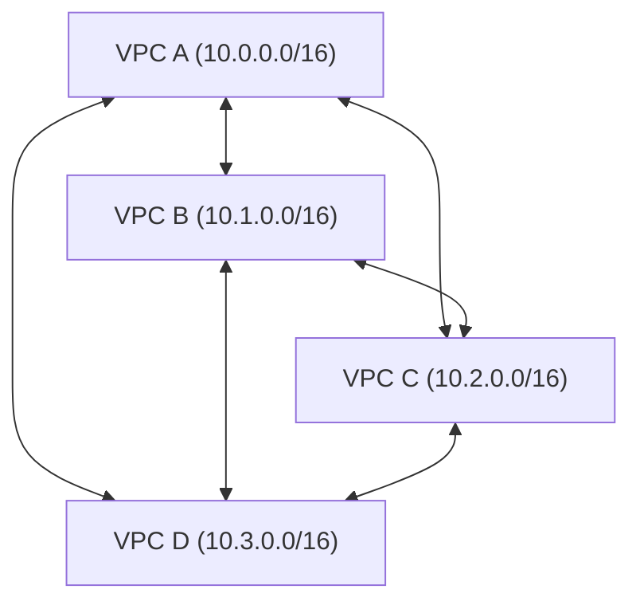

**Connections needed**: N * (N-1) / 2
- 4 VPCs = 6 connections
- 10 VPCs = 45 connections
- 25 VPCs = 300 connections
- 50 VPCs = 1,225 connections   <-- unmanageable

**Pros**: Lowest latency (direct path), no single point of failure, no bandwidth bottleneck, no data processing charges (in AWS, VPC peering is free for same-region).

**Cons**: Scales quadratically. Route tables grow linearly per VPC. No transitive routing (A peers with B, B peers with C, but A cannot reach C through B). No centralized inspection point.

**When to use**: Under 10 VPCs. Simple connectivity requirements. Cost-sensitive (no per-GB processing charges).

### Pattern 2: Hub-and-Spoke (Transit Gateway / NCC / Virtual WAN)

A central hub routes traffic between all spokes. Spokes connect only to the hub.

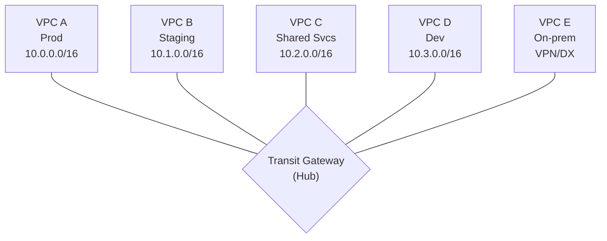

**Connections needed**: N (one per spoke)
- 50 VPCs = 50 connections
- Transitive routing: YES (A can reach D through the hub)
- Centralized inspection: YES (route through firewall VPC)

**Pros**: Linear scaling. Centralized routing policy. Transitive routing. Single attachment point for on-premises connectivity. Centralized egress and security inspection.

**Cons**: Hub is a potential bottleneck (though cloud-managed hubs handle massive bandwidth). Per-GB data processing charges (AWS Transit Gateway: $0.02/GB). Hub failure affects all connectivity (though cloud-managed hubs have built-in HA).

**When to use**: 10+ VPCs. Need centralized security inspection. On-premises connectivity. Regulated environments requiring traffic visibility.

### Pattern 3: Hybrid (Hub-and-Spoke + Direct Peering)

Hub for most traffic, but direct peering for high-bandwidth or latency-sensitive flows.

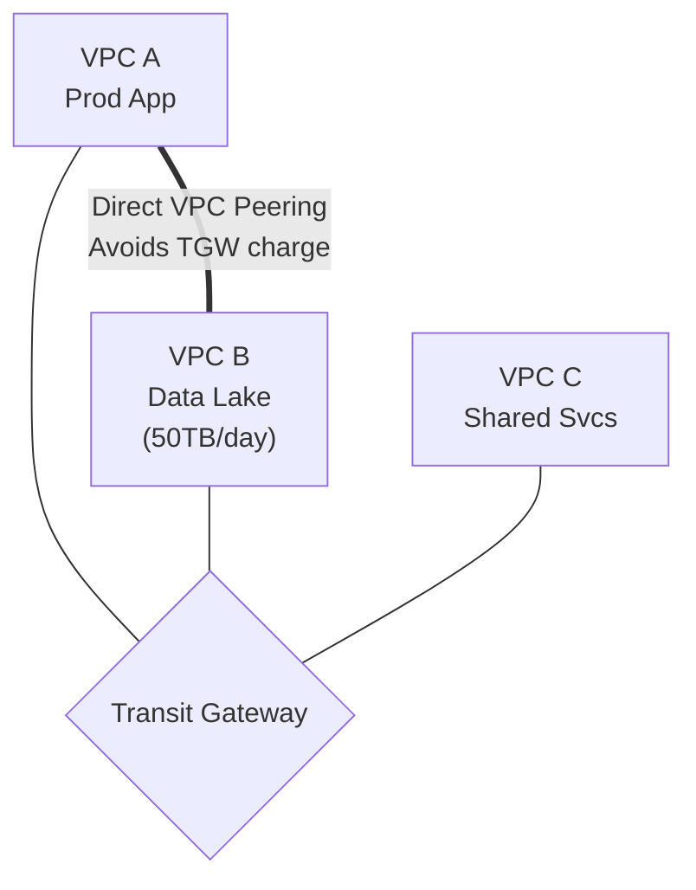

Rule of thumb: Direct peer when data transfer > 5TB/month between two specific VPCs.

> **Pause and predict**: You have 30 VPCs that all need to communicate. Why is VPC Peering impractical at this scale?
>
> <details>
> <summary>Answer</summary>
> Full mesh VPC Peering for 30 VPCs requires N*(N-1)/2 = 435 peering connections. Each peering connection requires route table entries in both VPCs. The route table limit is 200 entries per route table (can be raised to 1,000, but at a performance cost). Beyond the route table pressure, managing 435 connections is operationally complex: adding VPC #31 requires 30 new peering connections and 60 new route table entries. Transit Gateway reduces this to N connections (one per VPC) with centralized routing.
> </details>

---

## Transit Gateway Deep Dive (AWS)

AWS Transit Gateway (TGW) is the backbone of enterprise AWS networking. Think of it as a cloud-native router that sits at the center of your network, connecting VPCs, VPN tunnels, and Direct Connect gateways.

### Core Concepts

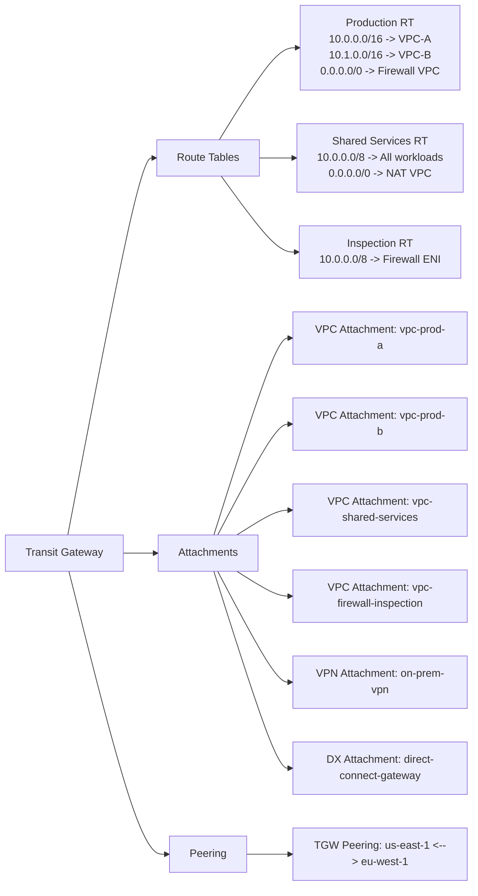

### Setting Up Transit Gateway with Terraform

```hcl
# Create the Transit Gateway
resource "aws_ec2_transit_gateway" "main" {
  description                     = "Organization Transit Gateway"
  amazon_side_asn                 = 64512
  auto_accept_shared_attachments  = "disable"
  default_route_table_association = "disable"
  default_route_table_propagation = "disable"
  dns_support                     = "enable"
  vpn_ecmp_support                = "enable"

  tags = {
    Name        = "org-transit-gateway"
    Environment = "infrastructure"
  }
}

# Share the TGW across the organization using RAM
resource "aws_ram_resource_share" "tgw_share" {
  name                      = "transit-gateway-share"
  allow_external_principals = false
}

resource "aws_ram_resource_association" "tgw" {
  resource_arn       = aws_ec2_transit_gateway.main.arn
  resource_share_arn = aws_ram_resource_share.tgw_share.arn
}

resource "aws_ram_principal_association" "org" {
  principal          = "arn:aws:organizations::111111111111:organization/o-abc1234567"
  resource_share_arn = aws_ram_resource_share.tgw_share.arn
}

# Create route tables for different traffic domains
resource "aws_ec2_transit_gateway_route_table" "production" {
  transit_gateway_id = aws_ec2_transit_gateway.main.id
  tags = { Name = "production-routes" }
}

resource "aws_ec2_transit_gateway_route_table" "shared_services" {
  transit_gateway_id = aws_ec2_transit_gateway.main.id
  tags = { Name = "shared-services-routes" }
}

resource "aws_ec2_transit_gateway_route_table" "inspection" {
  transit_gateway_id = aws_ec2_transit_gateway.main.id
  tags = { Name = "inspection-routes" }
}

# Attach a workload VPC (done in each workload account)
resource "aws_ec2_transit_gateway_vpc_attachment" "prod_vpc" {
  subnet_ids         = [aws_subnet.private_a.id, aws_subnet.private_b.id]
  transit_gateway_id = aws_ec2_transit_gateway.main.id
  vpc_id             = aws_vpc.production.id

  transit_gateway_default_route_table_association = false
  transit_gateway_default_route_table_propagation = false

  tags = { Name = "prod-vpc-attachment" }
}

# Associate the attachment with the production route table
resource "aws_ec2_transit_gateway_route_table_association" "prod" {
  transit_gateway_attachment_id  = aws_ec2_transit_gateway_vpc_attachment.prod_vpc.id
  transit_gateway_route_table_id = aws_ec2_transit_gateway_route_table.production.id
}

# Propagate the VPC's routes into the shared services route table
# (so shared services can reach production)
resource "aws_ec2_transit_gateway_route_table_propagation" "prod_to_shared" {
  transit_gateway_attachment_id  = aws_ec2_transit_gateway_vpc_attachment.prod_vpc.id
  transit_gateway_route_table_id = aws_ec2_transit_gateway_route_table.shared_services.id
}
```

### Routing Traffic Through a Centralized Firewall

The most powerful TGW pattern is centralized inspection -- routing all east-west traffic through a firewall appliance before it reaches its destination.

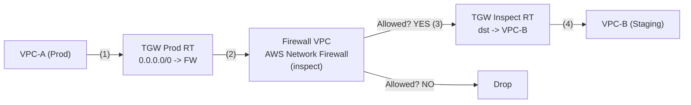

Flow: VPC-A -> TGW (Prod RT) -> Firewall VPC -> TGW (Inspect RT) -> VPC-B

This adds ~1ms latency but gives you:
- IDS/IPS for east-west traffic
- Centralized logging of all inter-VPC flows
- Ability to block lateral movement (ransomware, compromised pods)

```hcl
# Route all traffic from production to the firewall
resource "aws_ec2_transit_gateway_route" "prod_default" {
  destination_cidr_block         = "0.0.0.0/0"
  transit_gateway_attachment_id  = aws_ec2_transit_gateway_vpc_attachment.firewall.id
  transit_gateway_route_table_id = aws_ec2_transit_gateway_route_table.production.id
}

# In the firewall VPC, route return traffic back through TGW
resource "aws_route" "firewall_return" {
  route_table_id         = aws_route_table.firewall_private.id
  destination_cidr_block = "10.0.0.0/8"
  transit_gateway_id     = aws_ec2_transit_gateway.main.id
}
```

> **Stop and think**: Why should you avoid using the default Transit Gateway route table?
>
> <details>
> <summary>Answer</summary>
> The default TGW route table propagates all routes from all attachments into a single routing domain. This means every VPC can reach every other VPC. For a production environment, this violates the principle of least privilege at the network level: a development VPC should not have network-layer routing to a production VPC. By disabling the default route table and creating separate route tables (production, staging, shared-services), you can control which VPCs can communicate. Production VPCs see only other production VPCs and shared services. Development VPCs see only development VPCs and shared services. This is network segmentation via routing policy.
> </details>

---

## GCP Network Connectivity Center (NCC) and Shared VPC

GCP takes a different approach to transit networking. Instead of a single transit gateway product, GCP offers Network Connectivity Center (NCC) for hybrid and multi-cloud, and Shared VPC for intra-organization connectivity.

### Shared VPC: The GCP Way

In GCP, Shared VPC is the primary multi-project networking model. Rather than peering separate VPCs, you create one VPC in a host project and share subnets with service projects.

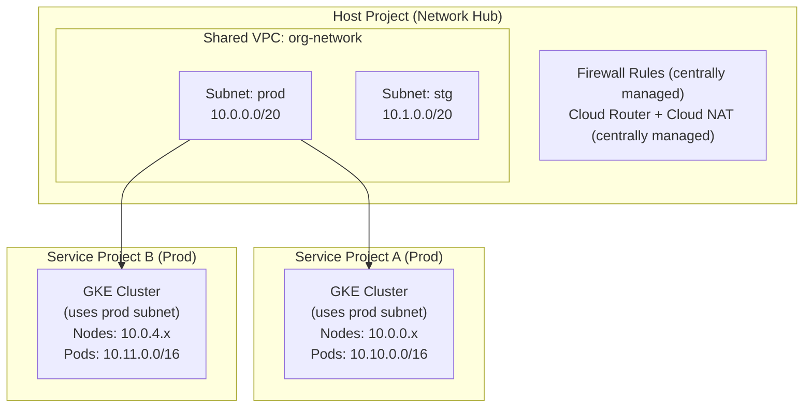

Key difference from AWS: ONE VPC, shared across projects. No peering needed. Firewall rules are centralized.

```bash
# Enable Shared VPC on the host project
gcloud compute shared-vpc enable network-hub-project

# Associate service projects
gcloud compute shared-vpc associated-projects add team-a-prod \
  --host-project=network-hub-project

gcloud compute shared-vpc associated-projects add team-b-prod \
  --host-project=network-hub-project

# Create subnets with secondary ranges for GKE
gcloud compute networks subnets create prod-subnet \
  --project=network-hub-project \
  --network=org-network \
  --region=us-central1 \
  --range=10.0.0.0/20 \
  --secondary-range=pods=10.10.0.0/16,services=10.20.0.0/20

# Grant GKE service account access to the shared subnet
PROJECT_NUM=$(gcloud projects describe team-a-prod --format="value(projectNumber)")

gcloud projects add-iam-policy-binding network-hub-project \
  --member="serviceAccount:service-${PROJECT_NUM}@container-engine-robot.iam.gserviceaccount.com" \
  --role="roles/container.hostServiceAgentUser"

# Create GKE cluster in service project using shared VPC
gcloud container clusters create team-a-prod \
  --project=team-a-prod \
  --region=us-central1 \
  --network=projects/network-hub-project/global/networks/org-network \
  --subnetwork=projects/network-hub-project/regions/us-central1/subnetworks/prod-subnet \
  --cluster-secondary-range-name=pods \
  --services-secondary-range-name=services \
  --enable-private-nodes \
  --master-ipv4-cidr=172.16.0.0/28
```

> **Stop and think**: In AWS, network segmentation is achieved by isolating workloads into separate VPCs and connecting them via a Transit Gateway with distinct route tables. In GCP's Shared VPC model, multiple environments might share the same VPC. How do you prevent workloads in a staging subnet from communicating with workloads in a production subnet?
>
> <details>
> <summary>Answer</summary>
> In a GCP Shared VPC, all subnets route to each other by default. To isolate environments, you must implement centralized egress and ingress firewall rules in the host project. You apply network tags or attach specific Service Accounts to the compute instances (or GKE nodes) in each environment. Then, you create firewall rules that explicitly deny traffic between the staging and production tags/service accounts, ensuring network segmentation is enforced by the firewall rather than by route isolation.
> </details>

### GCP Network Connectivity Center

NCC is GCP's hub for connecting on-premises networks, other clouds, and remote VPCs. Think of it as the GCP equivalent of AWS Transit Gateway, but focused on hybrid connectivity.

```bash
# Create an NCC hub
gcloud network-connectivity hubs create org-hub \
  --description="Organization network hub"

# Create a spoke for a VPN tunnel to on-premises
gcloud network-connectivity spokes create onprem-spoke \
  --hub=org-hub \
  --region=us-central1 \
  --vpn-tunnel=onprem-tunnel-1,onprem-tunnel-2 \
  --site-to-site-data-transfer

# Create a spoke for a Cloud Interconnect (dedicated connection)
gcloud network-connectivity spokes create colo-spoke \
  --hub=org-hub \
  --region=us-central1 \
  --interconnect-attachment=colo-attachment-1
```

---

## Azure Virtual WAN

Azure's approach to transit networking is Virtual WAN -- a managed hub that combines VPN, ExpressRoute, and VNet-to-VNet connectivity into a single service.

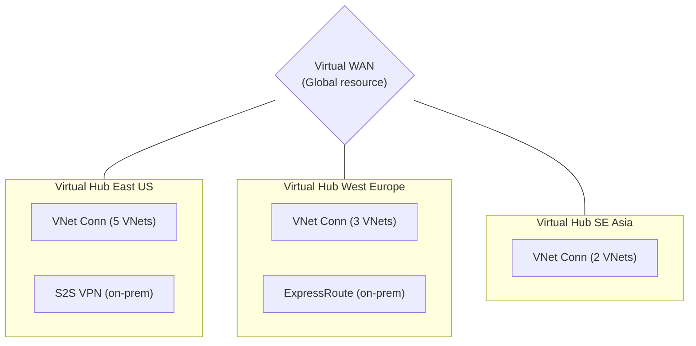

- Hub-to-hub: Automatic (any-to-any by default)
- VNet-to-VNet via hub: Automatic routing
- On-prem to VNet: Through hub VPN/ER gateway

```bash
# Create a Virtual WAN
az network vwan create \
  --name org-vwan \
  --resource-group networking-rg \
  --type Standard \
  --branch-to-branch-traffic true

# Create a regional hub
az network vhub create \
  --name eastus-hub \
  --resource-group networking-rg \
  --vwan org-vwan \
  --address-prefix 10.100.0.0/24 \
  --location eastus \
  --sku Standard

# Connect a spoke VNet to the hub
az network vhub connection create \
  --name prod-vnet-connection \
  --resource-group networking-rg \
  --vhub-name eastus-hub \
  --remote-vnet /subscriptions/SUB_ID/resourceGroups/prod-rg/providers/Microsoft.Network/virtualNetworks/prod-vnet \
  --internet-security true

# Add a VPN gateway to the hub
az network vpn-gateway create \
  --name eastus-vpn-gw \
  --resource-group networking-rg \
  --vhub eastus-hub \
  --scale-unit 2
```

---

## The Overlapping CIDR Problem

This is the single most common networking mistake in multi-account architectures. Two teams independently choose `10.0.0.0/16` for their VPCs. Everything works fine until they need to connect those VPCs. Then nothing works, because routers cannot distinguish between two identical address ranges.

### How It Happens

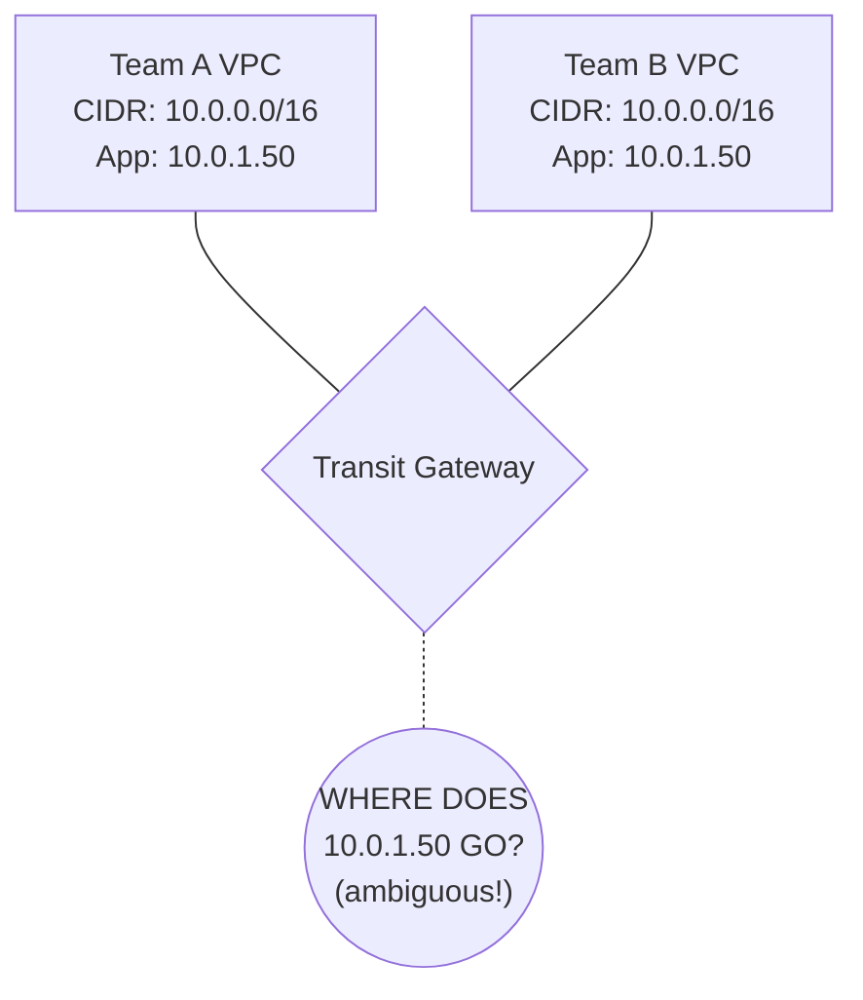

You CANNOT peer or transit-connect VPCs with overlapping CIDRs. This is a hard constraint in all three clouds.

> **Stop and think**: You are merging with another company, and their production VPC uses `10.0.0.0/16`, the exact same CIDR as your production VPC. How can you establish connectivity between these two environments without changing their IP addresses?
>
> <details>
> <summary>Answer</summary>
> Direct routing is impossible with overlapping CIDRs. You must use Private NAT (Network Address Translation) gateways or intermediary proxy instances. Traffic from your VPC is translated to a non-overlapping intermediate IP range before it crosses the Transit Gateway, and vice versa. This requires complex DNS configuration and dual NAT setups, highlighting why centralized IPAM is critical from day one to avoid overlapping IPs in the first place.
> </details>

### Prevention: IP Address Management (IPAM)

The solution is centralized IP address management. Allocate CIDR blocks from a central authority before creating any VPC.

```bash
# AWS: Use VPC IPAM (IP Address Manager)
aws ec2 create-ipam \
  --operating-regions RegionName=us-east-1 RegionName=eu-west-1

# Create a top-level pool
aws ec2 create-ipam-pool \
  --ipam-scope-id ipam-scope-abc123 \
  --address-family ipv4 \
  --description "Organization IPv4 pool"

# Provision the master CIDR block
aws ec2 provision-ipam-pool-cidr \
  --ipam-pool-id ipam-pool-abc123 \
  --cidr 10.0.0.0/8

# Create sub-pools per environment
aws ec2 create-ipam-pool \
  --ipam-scope-id ipam-scope-abc123 \
  --source-ipam-pool-id ipam-pool-abc123 \
  --address-family ipv4 \
  --allocation-default-netmask-length 20 \
  --description "Production VPCs"

# When creating a VPC, request from the pool (no manual CIDR)
aws ec2 create-vpc \
  --ipv4-ipam-pool-id ipam-pool-prod123 \
  --ipv4-netmask-length 20
```

### CIDR Allocation Strategy

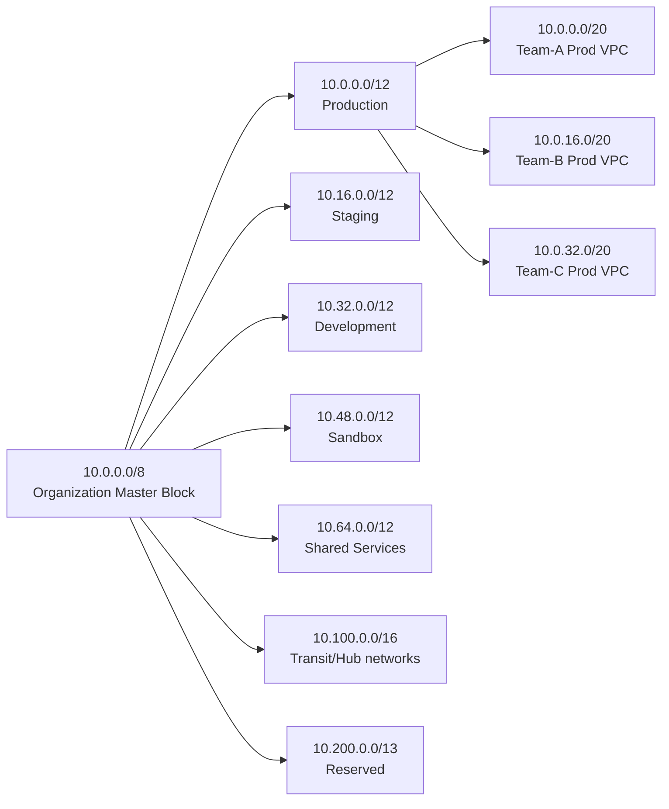

GKE/EKS Pod CIDRs: Use `100.64.0.0/10` (Carrier-grade NAT range). This avoids conflicts with VPC CIDRs entirely.

---

## Egress Filtering and Cost Optimization

Egress (outbound) traffic is where cloud networking gets expensive. AWS charges $0.09/GB for internet egress in most regions. At scale, this becomes the dominant networking cost.

### Centralized Egress Pattern

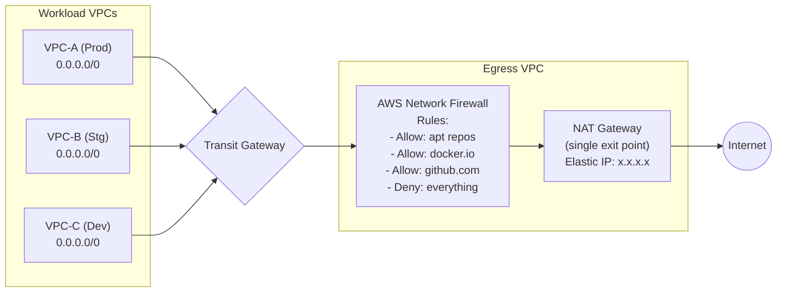

Benefits:
- Single egress IP (easier firewall allowlisting by partners)
- Centralized filtering (block exfiltration attempts)
- Fewer NAT Gateways (cost savings: $32/month each + $0.045/GB)

### AWS Network Firewall Rules

```bash
# Create a rule group for allowed domains
aws network-firewall create-rule-group \
  --rule-group-name "allowed-egress-domains" \
  --type STATEFUL \
  --capacity 100 \
  --rule-group '{
    "RulesSource": {
      "RulesSourceList": {
        "Targets": [
          ".amazonaws.com",
          ".docker.io",
          ".github.com",
          ".githubusercontent.com",
          "registry.k8s.io",
          ".grafana.com",
          "apt.kubernetes.io"
        ],
        "TargetTypes": ["HTTP_HOST", "TLS_SNI"],
        "GeneratedRulesType": "ALLOWLIST"
      }
    }
  }'
```

### Cross-AZ and Cross-Region Transfer Costs

This is the cost surprise that catches most teams:

| Traffic Path | AWS Cost/GB | GCP Cost/GB | Azure Cost/GB |
|---|---|---|---|
| Same AZ | Free | Free | Free |
| Cross-AZ (same region) | $0.01 each direction | Free (within same zone group) | Free |
| Cross-Region (same continent) | $0.02 | $0.01 | $0.02 |
| Cross-Region (intercontinental) | $0.02-$0.08 | $0.02-$0.08 | $0.02-$0.05 |
| Internet egress | $0.09 (first 10TB) | $0.12 (first 1TB) | $0.087 |
| TGW data processing | $0.02 | N/A | ~$0.02 (vHub) |

The AWS cross-AZ charge is particularly insidious for Kubernetes. If your EKS cluster spans three AZs (as it should for HA), every pod-to-pod call that crosses an AZ boundary incurs $0.02/GB round-trip. For a chatty microservices architecture, this adds up fast.

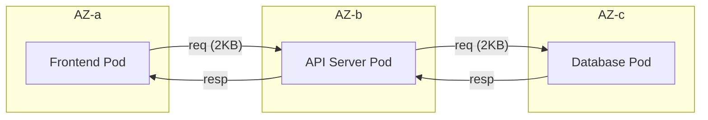

**Cross-AZ Cost Example**:
- Each request: ~2KB avg
- Requests/second: 10,000
- Cross-AZ hops per request: 2 (frontend->api, api->db)
- Monthly cross-AZ traffic: 10,000 req/s x 2KB x 2 hops x 86,400s x 30 days = ~103 TB
- Cost: 103 TB x $0.01/GB x 2 (both directions) = **$2,060/month**

Mitigation: Use topology-aware routing to prefer same-AZ communication.

---

## Did You Know?

1. **AWS Transit Gateway processes over 100 Gbps per attachment** and supports up to 5,000 attachments per gateway. When it launched in 2018, it immediately obsoleted hundreds of custom "transit VPC" solutions that companies had built using EC2 instances as routers -- solutions that cost 10x more and topped out at a few Gbps.

2. **GCP's Shared VPC can host up to 1,000 service projects** per host project. This means a single VPC can serve an entire large organization. The trade-off is that all firewall rules are centralized -- which is either a feature (security team controls all rules) or a bottleneck (teams wait for firewall rule changes), depending on your organization.

3. **Azure Virtual WAN Standard tier hubs automatically create full-mesh connectivity** between all hubs in the VWAN. If you have hubs in East US, West Europe, and Southeast Asia, traffic between any two hubs routes over the Microsoft backbone automatically -- with no additional configuration. This is the fastest path to global network connectivity across any cloud.

4. **Cross-AZ data transfer in AWS costs companies more than they realize.** A 2023 analysis by Vantage found that cross-AZ data transfer was the third-highest cost category for the median AWS customer, behind EC2 compute and S3 storage. Kubernetes clusters that span AZs (which they should, for availability) are a major contributor. Istio and Cilium both support topology-aware routing to reduce this cost.

---

## Troubleshooting Transit Networks

When transit hubs fail, they usually fail silently by dropping traffic (a "routing blackhole"). Because traffic traverses multiple hops (VPC A -> TGW -> Firewall VPC -> TGW -> VPC B), pinpointing the exact location of the drop requires a systematic approach using flow logs and route analysis tools.

### Identifying Routing Blackholes with VPC Flow Logs

VPC Flow Logs capture IP traffic going to and from network interfaces in your VPC. When troubleshooting transit connectivity, you are looking for `REJECT` records.

```text
# Sample VPC Flow Log (AWS)
version account-id interface-id srcaddr dstaddr srcport dstport protocol packets bytes start end action log-status
2 123456789012 eni-0a1b2c3d 10.0.1.50 10.1.2.75 443 49152 6 5 500 1620140761 1620140821 ACCEPT OK
2 123456789012 eni-0a1b2c3d 10.0.1.50 10.2.3.10 443 49153 6 1 40 1620140761 1620140821 REJECT OK
```

In the example above, traffic from `10.0.1.50` to `10.1.2.75` is `ACCEPT`ed, but traffic to `10.2.3.10` is `REJECT`ed. 

A `REJECT` can happen for two primary reasons:
1. **Security Groups / Network ACLs**: The traffic reached the destination interface, but a firewall rule blocked it.
2. **Missing Routes (Blackhole)**: The router (e.g., Transit Gateway or VPC Router) has no route to the destination, or the route exists but points to a dead attachment.

To distinguish between the two, you must check flow logs at *both* the source and destination ENIs, as well as the transit hub ENIs in the source VPC. If the traffic leaves the source VPC but never appears in the destination VPC's flow logs, the drop occurred in the transit hub.

### Route Analysis Tools

Parsing flow logs manually across dozens of accounts is tedious. Cloud providers offer automated tools to simulate and trace network paths.

#### AWS Reachability Analyzer
AWS Reachability Analyzer performs static analysis of your network configuration without sending actual packets. You define a source (e.g., an EC2 instance) and a destination (e.g., an IP address in another peered VPC).

The tool evaluates route tables, security groups, Network ACLs, and TGW attachments along the path. If the path is blocked, it tells you exactly which component is dropping the traffic (e.g., "Missing route in TGW route table 'tgw-rtb-prod' for destination 10.2.0.0/16").

#### GCP Network Topology
GCP's Network Topology provides a visual, graph-based view of your entire organization's network traffic. It overlays metrics (latency, packet loss, bandwidth) onto the topology map. 

For troubleshooting, GCP offers **Connectivity Tests** (part of Network Intelligence Center). Similar to AWS Reachability Analyzer, it performs static and dynamic analysis to verify if an endpoint in Service Project A can reach an endpoint in Service Project B across a Shared VPC, instantly flagging missing IAM permissions, firewall rules, or routes.

---

## Common Mistakes

| Mistake | Why It Happens | How to Fix It |
|---|---|---|
| Using VPC Peering when Transit Gateway is needed | Peering is simpler to set up initially | Start with TGW if you have >5 VPCs or need centralized inspection. Migration from peering to TGW is painful. |
| Overlapping CIDR ranges across accounts | No centralized IP planning | Implement AWS IPAM or maintain a CIDR registry in your IaC. Allocate from non-overlapping pools per environment. |
| Forgetting to update VPC route tables after TGW attachment | TGW handles its routes, but VPCs need routes pointing to TGW | Automate: when attaching a VPC to TGW, also add a route `0.0.0.0/0 -> tgw-id` in the VPC's private route table. |
| Running NAT Gateways in every VPC | Each VPC needs internet access | Centralize NAT in a shared egress VPC. Route internet-bound traffic through TGW. Saves $32/month per eliminated NAT GW. |
| Ignoring cross-AZ data transfer costs | "It's just $0.01/GB" | For high-throughput K8s clusters, this can be thousands per month. Use topology-aware routing and monitor cross-AZ traffic with VPC Flow Logs. |
| Not enabling TGW route table segmentation | Using the default route table for everything | Create separate route tables per security domain (prod, staging, shared). This prevents staging workloads from routing to production VPCs. |
| Peering VPCs across regions without considering latency | "The cloud handles it" | Cross-region latency adds 30-120ms per hop. For real-time APIs, this matters. Measure with `ping` or `mtr` before designing cross-region flows. |
| Skipping egress filtering | "We trust our workloads" | A compromised pod can exfiltrate data to any IP. Centralized egress with domain allowlists is a critical security control. |

---

## Quiz

<details>
<summary>1. You are a network architect moving from AWS to GCP. In AWS, you connected 50 project VPCs using Transit Gateway. How will your approach to multi-project connectivity fundamentally change in GCP, and why?</summary>

In AWS, Transit Gateway connects separate VPCs (each with its own CIDR, route tables, and security groups) through a central router, maintaining network isolation. GCP uses a Shared VPC model where a single VPC is owned by a host project and its subnets are shared to service projects. There are no separate VPCs to connect—everything resides in one network. This eliminates the need for transit routing for intra-org traffic, but means firewall rules apply across all projects sharing the VPC.
</details>

<details>
<summary>2. Your EKS cluster spans 3 AZs and generates 50TB of cross-AZ traffic monthly. What are two strategies to reduce this cost?</summary>

Strategy 1: Enable topology-aware routing in Kubernetes. Configure Services with `internalTrafficPolicy: Local` where possible, and use the `trafficDistribution: PreferClose` field in your Service spec so kube-proxy prefers endpoints in the same AZ. Strategy 2: Use pod topology spread constraints combined with service affinity to co-locate communicating services in the same AZ. For example, place the API server and its database cache in the same AZ. This requires understanding your service call graph. Together, these can reduce cross-AZ traffic by 40-70%, saving $500-$700/month on a 50TB workload.
</details>

<details>
<summary>3. A partner company requires you to provide a static IP for their firewall allowlist. You have 12 VPCs across 3 accounts. How do you provide a single egress IP?</summary>

Create a centralized egress VPC with a NAT Gateway attached to an Elastic IP. Route all internet-bound traffic from your 12 VPCs through the Transit Gateway to the egress VPC. The NAT Gateway translates all outbound traffic to the single Elastic IP. The partner allowlists this one IP. This pattern also lets you add AWS Network Firewall in the egress VPC for domain-based filtering. The cost is one NAT Gateway ($32/month + $0.045/GB) instead of 12 NAT Gateways ($384/month), plus TGW data processing ($0.02/GB). At moderate traffic volumes, the centralized approach is cheaper and more manageable.
</details>

<details>
<summary>4. Your platform team has historically used a shared wiki spreadsheet to allocate VPC CIDR blocks. Recently, two different product teams accidentally claimed the same `10.4.0.0/16` block, causing a multi-day outage when their networks couldn't peer. How would implementing AWS VPC IPAM prevent this situation from happening again?</summary>

AWS VPC IPAM provides automated, conflict-free CIDR allocation enforced at the API level. When you create a VPC from an IPAM pool, IPAM guarantees the allocated CIDR does not overlap with any other allocation in the pool. Spreadsheets and tagging rely entirely on human discipline—someone must manually check the spreadsheet, and nothing prevents them from bypassing it. Furthermore, IPAM tracks actual usage versus allocation and integrates with AWS Organizations to enforce allocation guardrails programmatically.
</details>

---

## Hands-On Exercise: Build a Hub-and-Spoke Network

In this exercise, you will design and implement a hub-and-spoke network topology for a multi-account organization.

### Scenario

**Company**: DataStream (a data pipeline company)
- 4 workload VPCs: ingest-prod, process-prod, api-prod, shared-services
- On-premises data center connected via VPN
- Requirement: all internet egress must go through a centralized firewall
- Requirement: ingest and process VPCs must communicate; api VPC must not reach ingest directly

### Task 1: Design the CIDR Plan

Allocate non-overlapping CIDRs for all VPCs and the TGW hub.

<details>
<summary>Solution</summary>

```text
CIDR Allocation Plan
════════════════════════════════════════

Network Hub:
  Transit Gateway CIDR: 10.100.0.0/24

Workload VPCs:
  ingest-prod:      10.0.0.0/20  (4,094 usable IPs)
  process-prod:     10.0.16.0/20
  api-prod:         10.0.32.0/20
  shared-services:  10.64.0.0/20

Egress/Firewall VPC:
  egress-vpc:       10.100.1.0/24

On-Premises:
  datacenter:       172.16.0.0/12 (existing allocation)

Pod CIDRs (secondary ranges for EKS):
  ingest-prod pods:   100.64.0.0/16
  process-prod pods:  100.65.0.0/16
  api-prod pods:      100.66.0.0/16
```
</details>

### Task 2: Design the TGW Route Tables

Create route table associations and propagations that enforce the requirement: ingest and process can communicate, but api cannot reach ingest.

<details>
<summary>Solution</summary>

```text
TGW Route Tables:
═══════════════════════════════════════

Route Table: "data-pipeline" (for ingest and process)
  Associations: ingest-prod, process-prod
  Propagations from: ingest-prod, process-prod, shared-services
  Static route: 0.0.0.0/0 -> egress-vpc attachment
  Result: ingest <-> process: YES, ingest -> shared: YES

Route Table: "api-tier" (for api)
  Associations: api-prod
  Propagations from: process-prod, shared-services
  Static route: 0.0.0.0/0 -> egress-vpc attachment
  NOT propagated: ingest-prod
  Result: api -> process: YES, api -> ingest: NO

Route Table: "shared" (for shared-services)
  Associations: shared-services
  Propagations from: ingest-prod, process-prod, api-prod
  Static route: 0.0.0.0/0 -> egress-vpc attachment
  Result: shared -> all workloads: YES

Route Table: "egress" (for firewall/egress VPC)
  Associations: egress-vpc
  Propagations from: ALL VPCs
  Result: return traffic routes to correct VPC
```
</details>

### Task 3: Write the Terraform for TGW Route Segmentation

Implement the route tables from Task 2 in Terraform.

<details>
<summary>Solution</summary>

```hcl
resource "aws_ec2_transit_gateway" "main" {
  amazon_side_asn                 = 64512
  default_route_table_association = "disable"
  default_route_table_propagation = "disable"
  tags = { Name = "datastream-tgw" }
}

# Route Tables
resource "aws_ec2_transit_gateway_route_table" "data_pipeline" {
  transit_gateway_id = aws_ec2_transit_gateway.main.id
  tags = { Name = "data-pipeline-rt" }
}

resource "aws_ec2_transit_gateway_route_table" "api_tier" {
  transit_gateway_id = aws_ec2_transit_gateway.main.id
  tags = { Name = "api-tier-rt" }
}

resource "aws_ec2_transit_gateway_route_table" "shared" {
  transit_gateway_id = aws_ec2_transit_gateway.main.id
  tags = { Name = "shared-rt" }
}

resource "aws_ec2_transit_gateway_route_table" "egress" {
  transit_gateway_id = aws_ec2_transit_gateway.main.id
  tags = { Name = "egress-rt" }
}

# Associations (which RT does each attachment use for outbound lookups)
resource "aws_ec2_transit_gateway_route_table_association" "ingest_to_pipeline" {
  transit_gateway_attachment_id  = aws_ec2_transit_gateway_vpc_attachment.ingest.id
  transit_gateway_route_table_id = aws_ec2_transit_gateway_route_table.data_pipeline.id
}

resource "aws_ec2_transit_gateway_route_table_association" "process_to_pipeline" {
  transit_gateway_attachment_id  = aws_ec2_transit_gateway_vpc_attachment.process.id
  transit_gateway_route_table_id = aws_ec2_transit_gateway_route_table.data_pipeline.id
}

resource "aws_ec2_transit_gateway_route_table_association" "api_to_api_tier" {
  transit_gateway_attachment_id  = aws_ec2_transit_gateway_vpc_attachment.api.id
  transit_gateway_route_table_id = aws_ec2_transit_gateway_route_table.api_tier.id
}

# Propagations (which VPC routes are visible in each RT)
# Data pipeline RT sees: ingest, process, shared-services
resource "aws_ec2_transit_gateway_route_table_propagation" "ingest_in_pipeline" {
  transit_gateway_attachment_id  = aws_ec2_transit_gateway_vpc_attachment.ingest.id
  transit_gateway_route_table_id = aws_ec2_transit_gateway_route_table.data_pipeline.id
}

resource "aws_ec2_transit_gateway_route_table_propagation" "process_in_pipeline" {
  transit_gateway_attachment_id  = aws_ec2_transit_gateway_vpc_attachment.process.id
  transit_gateway_route_table_id = aws_ec2_transit_gateway_route_table.data_pipeline.id
}

resource "aws_ec2_transit_gateway_route_table_propagation" "shared_in_pipeline" {
  transit_gateway_attachment_id  = aws_ec2_transit_gateway_vpc_attachment.shared.id
  transit_gateway_route_table_id = aws_ec2_transit_gateway_route_table.data_pipeline.id
}

# API tier RT sees: process, shared-services (NOT ingest)
resource "aws_ec2_transit_gateway_route_table_propagation" "process_in_api" {
  transit_gateway_attachment_id  = aws_ec2_transit_gateway_vpc_attachment.process.id
  transit_gateway_route_table_id = aws_ec2_transit_gateway_route_table.api_tier.id
}

resource "aws_ec2_transit_gateway_route_table_propagation" "shared_in_api" {
  transit_gateway_attachment_id  = aws_ec2_transit_gateway_vpc_attachment.shared.id
  transit_gateway_route_table_id = aws_ec2_transit_gateway_route_table.api_tier.id
}

# Default routes to egress VPC for internet-bound traffic
resource "aws_ec2_transit_gateway_route" "pipeline_default" {
  destination_cidr_block         = "0.0.0.0/0"
  transit_gateway_attachment_id  = aws_ec2_transit_gateway_vpc_attachment.egress.id
  transit_gateway_route_table_id = aws_ec2_transit_gateway_route_table.data_pipeline.id
}

resource "aws_ec2_transit_gateway_route" "api_default" {
  destination_cidr_block         = "0.0.0.0/0"
  transit_gateway_attachment_id  = aws_ec2_transit_gateway_vpc_attachment.egress.id
  transit_gateway_route_table_id = aws_ec2_transit_gateway_route_table.api_tier.id
}
```
</details>

### Task 4: Write Egress Firewall Rules

Write AWS Network Firewall rules that allow only specific domains for egress traffic.

<details>
<summary>Solution</summary>

```bash
# Create a stateful rule group with domain allowlist
aws network-firewall create-rule-group \
  --rule-group-name "datastream-egress-allowlist" \
  --type STATEFUL \
  --capacity 200 \
  --rule-group '{
    "RulesSource": {
      "RulesSourceList": {
        "Targets": [
          ".amazonaws.com",
          "registry.k8s.io",
          ".docker.io",
          ".github.com",
          ".githubusercontent.com",
          "pypi.org",
          "files.pythonhosted.org",
          ".datadog.com",
          ".grafana.net"
        ],
        "TargetTypes": ["HTTP_HOST", "TLS_SNI"],
        "GeneratedRulesType": "ALLOWLIST"
      }
    }
  }'

# Create the firewall policy
aws network-firewall create-firewall-policy \
  --firewall-policy-name "datastream-egress-policy" \
  --firewall-policy '{
    "StatelessDefaultActions": ["aws:forward_to_sfe"],
    "StatelessFragmentDefaultActions": ["aws:forward_to_sfe"],
    "StatefulRuleGroupReferences": [
      {
        "ResourceArn": "arn:aws:network-firewall:us-east-1:ACCOUNT:stateful-rulegroup/datastream-egress-allowlist"
      }
    ],
    "StatefulDefaultActions": ["aws:drop_strict"],
    "StatefulEngineOptions": {
      "RuleOrder": "STRICT_ORDER"
    }
  }'

# Create the firewall in the egress VPC
aws network-firewall create-firewall \
  --firewall-name "datastream-egress-fw" \
  --firewall-policy-arn "arn:aws:network-firewall:us-east-1:ACCOUNT:firewall-policy/datastream-egress-policy" \
  --vpc-id vpc-egress123 \
  --subnet-mappings SubnetId=subnet-fw-az1 SubnetId=subnet-fw-az2
```
</details>

### Success Criteria

- [ ] CIDR plan has zero overlaps and leaves room for growth
- [ ] TGW route tables enforce the segmentation requirement (api cannot reach ingest)
- [ ] Terraform correctly uses associations and propagations (not just static routes)
- [ ] Egress firewall uses domain-based allowlisting, not IP-based
- [ ] Default action for unmatched egress traffic is DROP

---

## Next Module

[Module 8.3: Cross-Cluster & Cross-Region Networking](../module-8.3-cross-cluster-networking/) -- Move from cloud-level networking to Kubernetes-level networking. Learn how pods in different clusters and regions discover and talk to each other using Cilium Cluster Mesh, the Multi-Cluster Services API, and global load balancing.