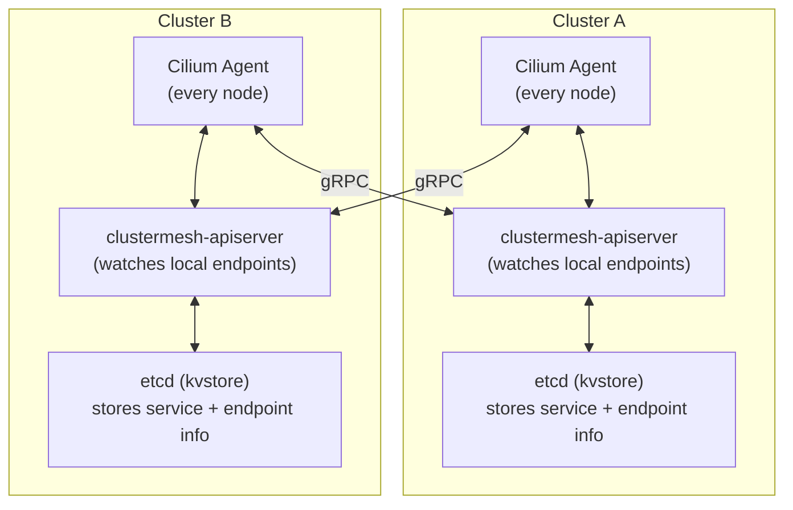
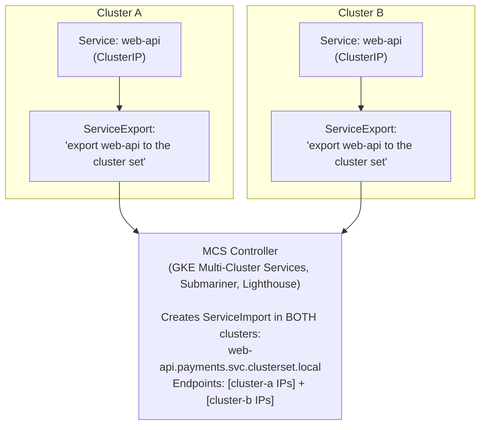
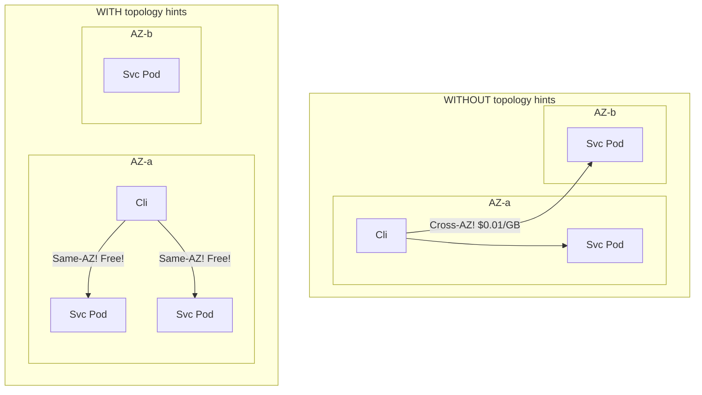

> **Complexity**: `[COMPLEX]`
>
> **Time to Complete**: 3 hours
>
> **Prerequisites**: [Module 8.2: Advanced Cloud Networking & Transit Hubs](../module-8.2-transit-hubs/), working knowledge of Kubernetes Services and Ingress
>
> **Track**: Advanced Cloud Operations

## What You'll Be Able to Do

After completing this module, you will be able to:

- **Evaluate** the critical trade-offs between flat routable topologies and isolated island architectures when designing multi-cluster networks.
- **Implement** transparent, cross-cluster service discovery utilizing the advanced eBPF capabilities of Cilium Cluster Mesh.
- **Compare** the Kubernetes Multi-Cluster Services (MCS) API against proprietary mesh solutions for establishing robust cross-boundary communication.
- **Diagnose** cross-Availability Zone traffic routing inefficiencies and implement topology-aware routing to heavily reduce data transfer costs.
- **Design** sophisticated global load balancing strategies and robust split-brain mitigation tactics for active-active multi-region Kubernetes deployments.

## Why This Module Matters

A common multi-region rollout failure is discovering too late that a dependency still lives in another cluster and that a hardcoded ClusterIP cannot be used across cluster boundaries.

Under production load, an ad hoc cross-region dependency can push a latency-sensitive call path over its timeout budget, and a fail-open payment flow can turn that into a severe fraud incident before dashboards catch it.

Cross-cluster networking is notoriously the complex architectural problem nobody thinks deeply about until they are suddenly forced to operate two distinct clusters. At that exact moment, it escalates into the most urgent and unforgiving problem in the infrastructure. This module goes far beyond the basics to teach you the advanced networking models, robust tools, and critical patterns required to make pods in different clusters—and entirely different geographic regions—communicate reliably and securely. You will learn the profound architectural difference between flat and island networking, master how Cilium Cluster Mesh and the native Multi-Cluster Services (MCS) API function under the hood, and discover how to design for the terrifying split-brain scenarios that make multi-cluster networking genuinely challenging.

## Flat vs. Island Networking Models

When you transition from operating a single Kubernetes cluster to managing multiple clusters, you are typically confronted early with a fundamental architectural choice regarding network topology. Should pods in entirely different clusters be able to reach each other directly via their IP addresses, or should they communicate exclusively through explicit, highly controlled service discovery mechanisms and gateways? This decision dictates your IP Address Management (IPAM) strategy, your security posture, and your cloud routing configuration.

### Flat Networking (Routable Pod CIDRs)

In a purely flat networking model, every single pod across every cluster deployed in your organization is assigned a unique, globally routable IP address within your corporate intranet or Virtual Private Cloud (VPC). A pod residing in Cluster A can reach a pod in Cluster B directly by its IP address, exactly the same way it would seamlessly reach a fellow pod within its own local cluster environment.

```mermaid
flowchart LR
    subgraph Cluster A ["Cluster A (us-east-1)<br>Pod CIDR: 100.64.0.0/16"]
        PodA["frontend-pod<br>100.64.12.5"]
        PodB["api-pod<br>100.64.33.18"]
        PodA -->|"Direct IP"| PodB
    end
    
    subgraph VPC ["VPC Peering or TGW"]
        route["Routing"]
    end
    
    subgraph Cluster B ["Cluster B (eu-west-1)<br>Pod CIDR: 100.65.0.0/16"]
        PodC["frontend-pod<br>100.65.8.22"]
        PodD["api-pod<br>100.65.41.9"]
        PodC --> PodD
    end
    
    PodB -->|"Direct IP"| route
    route -->|"Direct IP"| PodD
    
    classDef cluster fill:none,stroke:#333,stroke-width:2px;
    class Cluster A,Cluster B cluster;
```

**Architectural Requirements:**
- **Strict IPAM:** Non-overlapping Pod CIDRs across ALL clusters are mandatory. You cannot have two clusters utilizing the `10.244.0.0/16` space.
- **Underlay Routing:** VPC-level routing for pod CIDRs must be established. The underlay network (routers, Transit Gateways) must possess routes directing traffic to the specific nodes hosting those pod IPs.
- **CNI Integration:** The Container Network Interface (CNI) must actively advertise pod routes to the broader VPC environment (for instance, utilizing the AWS VPC CNI or Calico running in BGP peering mode).

**Pros**: The flat model offers a wonderfully simple mental model for developers. Any pod can directly reach any other pod, provided network policies allow it. There is no absolute requirement for a heavyweight service mesh or complex Layer 7 gateways just to establish basic TCP connectivity. Standard debugging tools like `curl <pod-ip>` function flawlessly across massive cluster boundaries.

**Cons**: The demand for globally unique pod CIDRs makes IP Address Management (IPAM) highly critical and often exhausting. Every individual cluster's pod CIDR must be explicitly routable through the core VPC infrastructure, which can easily exhaust cloud provider route table limits. Furthermore, there is no inherent access control boundary; any compromised pod can theoretically attempt to reach any other pod across the globe unless you meticulously enforce restrictive NetworkPolicies.

### Island Networking (Isolated Pod CIDRs)

Conversely, in the island networking model, each Kubernetes cluster operates as a fiercely independent networking island. Pod CIDR blocks are entirely localized to the cluster and are permitted to overlap freely with other clusters. Any cross-cluster communication must traverse explicit, carefully managed gateways or high-level service abstractions.

```mermaid
flowchart LR
    subgraph Cluster A ["Cluster A (us-east-1)<br>Pod CIDR: 10.244.0.0/16"]
        PodA["frontend-pod<br>10.244.1.5"]
        GWA["Gateway/LB<br>(NodePort, NLB, or Istio GW)"]
        PodA --> GWA
    end
    
    subgraph Cluster B ["Cluster B (eu-west-1)<br>Pod CIDR: 10.244.0.0/16"]
        PodB["frontend-pod<br>10.244.1.5"]
        GWB["Gateway/LB<br>(NodePort, NLB, or Istio GW)"]
        GWB --> PodB
    end
    
    GWA -->|"HTTPS<br>(public or private link)"| GWB
    
    classDef cluster fill:none,stroke:#333,stroke-width:2px;
    class Cluster A,Cluster B cluster;
```

**Architectural Characteristics:**
- **CIDR Independence:** Pod CIDRs CAN heavily overlap (e.g., deploying `10.244.x.x` in literally every cluster you provision).
- **Explicit Communication:** Traffic exclusively flows through explicit ingress controllers, API gateways, or service mesh east-west gateways.
- **Inherent Security:** Access control is strictly enforced at the gateway layer, providing a natural choke point for security audits and WAF inspections.

**Pros**: There is zero CIDR coordination required between teams, massively reducing administrative overhead. Clusters become completely independently deployable units. The gateway provides a highly natural, defensible access control boundary. This model effortlessly scales to hundreds or thousands of clusters and operates flawlessly across wildly different cloud providers and on-premises bare-metal servers.

**Cons**: Traffic incurs higher latency due to the mandatory extra network hop through the gateway infrastructure. Service discovery becomes significantly more complex, as you cannot rely on simple internal DNS records. Establishing connectivity usually requires explicit configuration (Ingress, DNS, certificates) for each cross-cluster service. Debugging is notoriously harder because direct pod-to-pod pings are impossible.

### Decision Framework

Choosing between these topologies is a foundational platform engineering decision. Use the following heuristic matrix to guide your architectural design.

| Factor | Choose Flat | Choose Island |
|---|---|---|
| Number of clusters | < 10 | 10+ |
| Cloud providers | Single cloud | Multi-cloud |
| Team autonomy | Low (centralized platform) | High (independent teams) |
| Service mesh | Already using one | Not using / optional |
| Compliance | Low (no strict boundaries) | High (network isolation required) |
| Migration from monolith | Yes (pods need to reach legacy IPs) | No |
| CNI | AWS VPC CNI, Azure CNI | Calico, Cilium (overlay mode) |

> **Stop and think**: If your company acquires a startup that uses the exact same Pod CIDR (e.g., 10.244.0.0/16) as your main clusters, which networking model will you be forced to use to connect them?

## Cilium Cluster Mesh

When operating within a flat networking topology, Cilium Cluster Mesh is a widely used open-source option for linking multiple Kubernetes clusters at the networking and service discovery layers. Utilizing the immense power of eBPF (Extended Berkeley Packet Filter) within the Linux kernel, Cilium enables pods residing in one cluster to effortlessly discover and communicate with services located in a completely different cluster exactly as if they were local workloads.

### How It Works Under the Hood

Cilium Cluster Mesh completely bypasses the historical limitations of `kube-proxy` and traditional `iptables` rules by injecting networking logic directly into the kernel using eBPF programs attached to network interfaces.



1. Each individual cluster runs a dedicated `clustermesh-apiserver` component. This component's sole responsibility is to securely expose the cluster's internal service and endpoint topology data.
2. The Cilium agents running on every node in each cluster establish secure gRPC connections to the OTHER cluster's apiserver, constantly syncing state to learn about remote service endpoints.
3. When a pod located in Cluster A attempts to resolve a service that exists in both interconnected clusters, the eBPF datapath transparently intercepts the request and load-balances the traffic across both local AND remote pod endpoints dynamically.
4. The actual traffic between the clusters flows entirely directly (from the source pod IP directly to the destination pod IP) utilizing the underlying flat network routing infrastructure (such as AWS VPC peering or a Transit Gateway).

### Setting Up Cluster Mesh

The configuration process requires non-overlapping CIDRs and a properly routed underlay network. 

```bash
# Prerequisites: Cilium installed in both clusters with cluster mesh enabled
# Both clusters must have non-overlapping Pod CIDRs
# Underlying network must route pod CIDRs between clusters

# Install Cilium CLI
CILIUM_CLI_VERSION=$(curl -s https://raw.githubusercontent.com/cilium/cilium-cli/main/stable.txt)
curl -L --fail --remote-name-all \
  https://github.com/cilium/cilium-cli/releases/download/${CILIUM_CLI_VERSION}/cilium-darwin-arm64.tar.gz
sudo tar xzvf cilium-darwin-arm64.tar.gz -C /usr/local/bin

# Install Cilium with cluster mesh support on Cluster A
cilium install \
  --set cluster.name=cluster-a \
  --set cluster.id=1 \
  --set ipam.operator.clusterPoolIPv4PodCIDRList="100.64.0.0/16"

# Install Cilium with cluster mesh support on Cluster B
cilium install \
  --set cluster.name=cluster-b \
  --set cluster.id=2 \
  --set ipam.operator.clusterPoolIPv4PodCIDRList="100.65.0.0/16"

# Enable cluster mesh on both clusters
cilium clustermesh enable --context cluster-a
cilium clustermesh enable --context cluster-b

# Connect the clusters
cilium clustermesh connect --context cluster-a --destination-context cluster-b

# Verify the connection
cilium clustermesh status --context cluster-a
```

### Cross-Cluster Service Discovery in Action

Once the Cluster Mesh is fully interconnected, standard Kubernetes services that share the exact same name and namespace across the different clusters are automatically and seamlessly merged into a global service entity by Cilium. You can exert granular control over this behavior utilizing specific annotations.

```yaml
# Deploy a service in both clusters with the same name
# Cilium will load-balance across endpoints in BOTH clusters
apiVersion: v1
kind: Service
metadata:
  name: fraud-detection
  namespace: payments
  annotations:
    # Optional: prefer local endpoints, use remote only as fallback
    io.cilium/global-service: "true"
    io.cilium/service-affinity: "local"
spec:
  selector:
    app: fraud-detection
  ports:
    - port: 8080
      targetPort: 8080
```

By default, Cilium load-balances traffic globally. However, for latency-sensitive applications, maintaining local affinity is paramount. You can explicitly define service affinity rules to govern endpoint selection.

```yaml
# Service affinity options:
# "local"  - prefer endpoints in the same cluster (fallback to remote)
# "remote" - prefer endpoints in the remote cluster
# "none"   - load-balance equally across all clusters (default)
```

If you wish to prevent a service from being exposed to the global mesh entirely, you simply omit the `global-service` annotation.

```yaml
# To make a service available ONLY to the local cluster
# (not exported to cluster mesh), omit the global-service annotation
apiVersion: v1
kind: Service
metadata:
  name: internal-cache
  namespace: payments
  # No io.cilium/global-service annotation = local only
spec:
  selector:
    app: redis-cache
  ports:
    - port: 6379
```

> **Pause and predict**: If you annotate a service with `io.cilium/service-affinity: "local"`, what happens when all local endpoints for that service crash? Will the requests fail, or will they route to the remote cluster?

### Network Policies Across Boundaries

One of the most profound advantages of utilizing a unified CNI across clusters is the ability to enforce consistent, identity-based security policies that span the entire global infrastructure. Cilium Cluster Mesh intelligently extends network policies across physical cluster boundaries, allowing you to filter traffic based on cryptographically verified pod identities rather than fragile IP addresses.

```yaml
# Allow traffic from cluster-b's frontend to cluster-a's API
apiVersion: cilium.io/v2
kind: CiliumNetworkPolicy
metadata:
  name: allow-cross-cluster-frontend
  namespace: payments
spec:
  endpointSelector:
    matchLabels:
      app: fraud-detection
  ingress:
    - fromEndpoints:
        - matchLabels:
            app: payment-frontend
            io.cilium.k8s.policy.cluster: cluster-b
      toPorts:
        - ports:
            - port: "8080"
              protocol: TCP
```

## Multi-Cluster Services API (MCS API)

While Cilium provides an incredibly powerful datapath implementation, the Kubernetes Multi-Cluster Services (MCS) API, formally defined in KEP-1645, represents the official, standardized Kubernetes approach to cross-cluster service discovery. The MCS API is intentionally less feature-rich out-of-the-box than a complete mesh like Cilium, but it offers a vendor-neutral interface that various controllers can implement.

### Core Concepts of MCS

The MCS API introduces two critical Custom Resource Definitions (CRDs) to the Kubernetes ecosystem: [`ServiceExport` and `ServiceImport`](https://cloud.google.com/kubernetes-engine/docs/how-to/multi-cluster-services).



**DNS Resolution Mechanics:**
- When an application queries `web-api.payments.svc.cluster.local`, DNS returns ONLY the local endpoints residing within the same cluster.
- When an application explicitly queries `web-api.payments.svc.clusterset.local`, the MCS-aware DNS implementation returns an aggregated list of endpoints compiled from ALL clusters that have successfully exported that service.

### Leveraging the MCS API on Google Kubernetes Engine (GKE)

Google Cloud Platform's GKE provides deeply integrated, [native support for the MCS API through its Fleet management capabilities](https://cloud.google.com/kubernetes-engine/docs/how-to/multi-cluster-services).

```bash
# Register clusters to a fleet
gcloud container fleet memberships register cluster-a \
  --gke-cluster=us-central1/cluster-a \
  --enable-workload-identity

gcloud container fleet memberships register cluster-b \
  --gke-cluster=europe-west1/cluster-b \
  --enable-workload-identity

# Enable multi-cluster services
gcloud container fleet multi-cluster-services enable

# Grant the required IAM role
gcloud projects add-iam-policy-binding PROJECT_ID \
  --member="serviceAccount:PROJECT_ID.svc.id.goog[gke-mcs/gke-mcs-importer]" \
  --role="roles/compute.networkViewer"
```

To expose a service, you must deliberately create a `ServiceExport` object in the cluster hosting the workload.

```yaml
# Export a service from Cluster A
apiVersion: net.gke.io/v1
kind: ServiceExport
metadata:
  name: fraud-detection
  namespace: payments
```

The underlying MCS controller observes this `ServiceExport` and automatically synthesizes a corresponding `ServiceImport` object in all other registered clusters within the defined fleet. Consequently, pods running in remote clusters can now reliably resolve `fraud-detection.payments.svc.clusterset.local`. This unified DNS query will seamlessly return endpoint IP addresses collected from absolutely all clusters that simultaneously export the exact same service name within the identical namespace.

### MCS API vs. Cilium Cluster Mesh Comparison

When deciding on a cross-cluster strategy, consider these fundamental differences:

| Feature | MCS API | Cilium Cluster Mesh |
|---|---|---|
| Kubernetes-native | Yes (KEP-1645) | No (Cilium-specific) |
| Service discovery | DNS (clusterset.local) | eBPF (transparent) |
| Pod-to-pod direct | Depends on implementation | Yes (requires flat network) |
| Network policy across clusters | No | Yes (CiliumNetworkPolicy) |
| Cloud support | GKE native, others via Submariner | Any (self-managed) |
| Overlapping pod CIDRs | Depends on implementation | No (requires unique CIDRs) |
| Service affinity (prefer local) | Via topology hints | Via annotation |
| Maturity | GA on GKE; maturity varies by controller and distribution | Available in current Cilium releases |

## Cross-AZ and Cross-Region Cost Management

Navigating cross-cluster networking is rarely just a pure technical or architectural challenge—it frequently morphs into a devastating cost management challenge. In major public cloud environments like AWS and GCP, whenever network traffic crosses the physical boundaries between Availability Zones (AZs) or geographic regions, the cloud provider levies data transfer fees. At scale, these ["penny per gigabyte" charges](https://aws.amazon.com/vpc/pricing/) can rapidly accumulate into hundreds of thousands of dollars annually.

### Implementing Topology-Aware Routing

Modern iterations of Kubernetes (v1.30 and above) possess sophisticated, built-in capabilities to mitigate these exorbitant cross-AZ costs through a feature known as topology-aware routing. By actively utilizing the [`trafficDistribution` field](https://kubernetes.io/blog/2024/04/17/kubernetes-v1-30-release/), platform engineers can instruct the `kube-proxy` to aggressively prioritize routing requests to service endpoints located within the exact same availability zone as the client pod.

```yaml
# Enable topology-aware routing on a service (Kubernetes 1.30+)
apiVersion: v1
kind: Service
metadata:
  name: fraud-detection
  namespace: payments
spec:
  trafficDistribution: PreferClose
  selector:
    app: fraud-detection
  ports:
    - port: 8080
```

To understand the profound financial impact of this simple configuration change, consider the routing dynamics illustrated below:



Without topology-aware routing, kube-proxy uses its normal cluster-wide endpoint selection rather than preferring same-zone endpoints. Once topology hints are engaged, kube-proxy fundamentally alters its behavior, prioritizing endpoints situated within the identical zone to effectively bypass unnecessary cross-AZ transit.

### Comprehensive Monitoring of Cross-AZ Traffic

To truly optimize costs, you must possess the ability to actively monitor and quantify cross-AZ communication patterns using raw network flow telemetry.

```bash
# Use VPC Flow Logs to identify cross-AZ traffic patterns
# Enable flow logs on each subnet
aws ec2 create-flow-logs \
  --resource-type Subnet \
  --resource-ids subnet-prod-az1a subnet-prod-az1b subnet-prod-az1c \
  --traffic-type ALL \
  --log-destination-type s3 \
  --log-destination arn:aws:s3:::vpc-flow-logs-bucket \
  --log-format '${az-id} ${srcaddr} ${dstaddr} ${bytes} ${flow-direction}'

# Query with Athena to find top cross-AZ talkers
# (assumes flow logs are partitioned in S3)
cat <<'SQL'
SELECT
  srcaddr,
  dstaddr,
  az_id,
  SUM(bytes) / 1073741824 AS gb_transferred,
  SUM(bytes) / 1073741824 * 0.01 AS estimated_cost_usd
FROM vpc_flow_logs
WHERE srcaddr LIKE '100.64.%'   -- pod CIDR
  AND dstaddr LIKE '100.64.%'   -- pod CIDR
  AND az_id != dst_az_id         -- cross-AZ
  AND date = '2026-03-24'
GROUP BY srcaddr, dstaddr, az_id
ORDER BY gb_transferred DESC
LIMIT 20
SQL
```

> **Stop and think**: Does topology-aware routing guarantee that cross-AZ traffic will never happen? What triggers kube-proxy to spill traffic over to another zone?

## Global Load Balancing for Multi-Region Deployments

When architecting systems that span multiple global regions, relying exclusively on internal service discovery is insufficient for handling external user ingress. You require a robust mechanism to intelligently route incoming users to the absolute nearest, healthiest cluster available. Global load balancing resolves this colossal challenge directly at the network edge.

### Comparing Global Load Balancing Solutions

Different cloud providers employ drastically different technological approaches to global ingress routing:

- **AWS Ecosystem: Route53 paired with Global Accelerator**
  - Route53 handles advanced DNS-based resolution, providing complex latency, geolocation, and automated failover routing logic.
  - Global Accelerator provisions [dedicated Anycast IP addresses, accelerating traffic over the AWS global backbone](https://docs.aws.amazon.com/global-accelerator/latest/dg/introduction-how-it-works.html) while offering rapid health checks and TCP/UDP level load balancing.

- **GCP Ecosystem: Cloud Load Balancing (Global Tier)**
  - Google utilizes a uniquely powerful model providing [a single global Anycast IP address](https://cloud.google.com/load-balancing/docs/load-balancing-overview) that routes HTTP(S), TCP, and UDP traffic across the entire world.
  - It seamlessly features profound, native integration directly with GKE Network Endpoint Groups (NEGs).

### Provisioning GCP Global Load Balancers with Multi-Cluster Gateways

Google's implementation of the emerging Kubernetes Gateway API delivers sophisticated multi-cluster support natively.

```yaml
# GKE Gateway API with multi-cluster support
apiVersion: gateway.networking.k8s.io/v1
kind: Gateway
metadata:
  name: global-gateway
  namespace: payments
spec:
  gatewayClassName: gke-l7-global-external-managed-mc
  listeners:
    - name: https
      port: 443
      protocol: HTTPS
      tls:
        mode: Terminate
        certificateRefs:
          - name: payments-tls
```

Once the core Gateway is securely instantiated, you subsequently bind routing rules to dynamically direct incoming HTTP requests toward your deployed `ServiceImport` resources.

```yaml
apiVersion: gateway.networking.k8s.io/v1
kind: HTTPRoute
metadata:
  name: payments-route
  namespace: payments
spec:
  parentRefs:
    - name: global-gateway
  rules:
    - matches:
        - path:
            type: PathPrefix
            value: /api/payments
      backendRefs:
        - group: net.gke.io
          kind: ServiceImport
          name: payments-api
          port: 8080
```

### Implementing DNS-Based Failover via AWS Route53

If your architecture is strictly bound to AWS, establishing automated, [latency-driven routing combined with robust failover mechanisms](https://docs.aws.amazon.com/Route53/latest/DeveloperGuide/routing-policy-latency.html) demands meticulous configuration of Route53 health checks and alias records.

```bash
# Create health checks for each regional endpoint
HEALTH_CHECK_EAST=$(aws route53 create-health-check \
  --caller-reference "east-$(date +%s)" \
  --health-check-config '{
    "Type": "HTTPS",
    "ResourcePath": "/healthz",
    "FullyQualifiedDomainName": "east.api.example.com",
    "Port": 443,
    "RequestInterval": 10,
    "FailureThreshold": 3
  }' \
  --query 'HealthCheck.Id' --output text)

HEALTH_CHECK_WEST=$(aws route53 create-health-check \
  --caller-reference "west-$(date +%s)" \
  --health-check-config '{
    "Type": "HTTPS",
    "ResourcePath": "/healthz",
    "FullyQualifiedDomainName": "west.api.example.com",
    "Port": 443,
    "RequestInterval": 10,
    "FailureThreshold": 3
  }' \
  --query 'HealthCheck.Id' --output text)

# Create latency-based routing with failover
aws route53 change-resource-record-sets \
  --hosted-zone-id Z1234567890 \
  --change-batch '{
    "Changes": [
      {
        "Action": "CREATE",
        "ResourceRecordSet": {
          "Name": "api.example.com",
          "Type": "A",
          "SetIdentifier": "us-east-1",
          "Region": "us-east-1",
          "AliasTarget": {
            "HostedZoneId": "Z2FDTNDATAQYW2",
            "DNSName": "east-nlb-abc123.elb.us-east-1.amazonaws.com",
            "EvaluateTargetHealth": true
          },
          "HealthCheckId": "'$HEALTH_CHECK_EAST'"
        }
      },
      {
        "Action": "CREATE",
        "ResourceRecordSet": {
          "Name": "api.example.com",
          "Type": "A",
          "SetIdentifier": "eu-west-1",
          "Region": "eu-west-1",
          "AliasTarget": {
            "HostedZoneId": "Z32O12XQLNTSW2",
            "DNSName": "west-nlb-xyz789.elb.eu-west-1.amazonaws.com",
            "EvaluateTargetHealth": true
          },
          "HealthCheckId": "'$HEALTH_CHECK_WEST'"
        }
      }
    ]
  }'
```

## Split-Brain: The Multi-Cluster Nightmare

The most terrifying phenomenon in distributed systems architecture is the split-brain scenario. This catastrophic event unfolds when distinct clusters completely lose network connectivity with one another due to an unexpected partition, yet they individually remain fully online, continuing to process external user traffic independently. During this partition, every isolated cluster falsely assumes it is the sole, authoritative source of operational truth.

```mermaid
sequenceDiagram
    participant A as Cluster A
    participant B as Cluster B
    
    Note over A,B: Normal Operation
    A<-->>B: Network Connected
    Note left of A: User X balance: $500
    Note right of B: User X balance: $500
    
    Note over A,B: Network partition occurs! ╳
    Note left of A: User deposits $100
    Note right of B: User withdraws $200
    Note left of A: User X: $600
    Note right of B: User X: $300
    
    Note over A,B: Network restores
    A<-->>B: Network Connected
    Note left of A: "User X: $600"
    Note right of B: "User X: $300"
    
    Note over A,B: Which is correct? BOTH are. And NEITHER is.<br/>The real answer should be $400 ($500 + $100 - $200)<br/>but neither cluster knows about the other's operation.
```

When the fundamental network infrastructure eventually restores connectivity, the architectural damage has already been done: you are left staring at hopelessly conflicting, irreconcilable system states.

### Architectural Mitigation Strategies

To defend against split-brain corruption, platform architects must implement profound, application-aware safeguards:

**Strategy 1: Single Writer, Multiple Readers.** Enforce strict rules where only a single designated cluster maintains the definitive authority to execute write operations to a specific data partition. All other participating clusters are demoted to serving exclusively read-only traffic. If the designated writer cluster catastrophically fails, you must carefully execute a highly controlled promotion process for one of the readers, often accepting a marginal risk of minor data loss.

**Strategy 2: CRDTs (Conflict-free Replicated Data Types).** Completely re-architect your core data structures so that concurrently executed, conflicting modifications are mathematically guaranteed to successfully merge. Specialized data structures like monotonic counters, distributed sets, and operational registers can be rigorously designed to remain perfectly conflict-free, although this universally mandates profound, invasive changes to application-level code.

**Strategy 3: Distributed Fencing Tokens.** Require the critical write path to unconditionally secure a cryptographic validation token from an external, highly robust distributed lock service (such as an externalized etcd cluster or Apache ZooKeeper). Throughout the duration of a network partition, exclusively the specific cluster that actively retains ownership of the unexpired token is permitted to successfully write data. All other isolated clusters will aggressively reject write attempts until they can reliably reacquire the validated token.

```yaml
# Strategy 1: Leader election for cross-cluster write authority
# Using a Kubernetes Lease object in a "coordination" cluster
apiVersion: coordination.k8s.io/v1
kind: Lease
metadata:
  name: payments-write-leader
  namespace: coordination
spec:
  holderIdentity: cluster-a
  leaseDurationSeconds: 30
  acquireTime: "2026-03-24T10:15:00Z"
  renewTime: "2026-03-24T10:15:25Z"
  leaseTransitions: 3
```

```python
# Application-level split-brain detection
# Each cluster periodically checks if it can reach the other
import requests
import time

PEER_CLUSTERS = {
    "cluster-b": "https://cluster-b.internal.example.com/healthz",
    "cluster-c": "https://cluster-c.internal.example.com/healthz",
}

def check_partition():
    """Detect if we're in a network partition."""
    unreachable = []
    for cluster, url in PEER_CLUSTERS.items():
        try:
            resp = requests.get(url, timeout=5)
            if resp.status_code != 200:
                unreachable.append(cluster)
        except requests.exceptions.RequestException:
            unreachable.append(cluster)

    if unreachable:
        # We might be partitioned. Switch to safe mode:
        # - Reject writes that require cross-cluster consistency
        # - Continue serving reads from local cache
        # - Alert the on-call team
        enter_safe_mode(unreachable)
        return True
    return False

def enter_safe_mode(unreachable_clusters):
    """Restrict operations during detected partition."""
    print(f"PARTITION DETECTED: Cannot reach {unreachable_clusters}")
    print("Entering safe mode: rejecting cross-cluster writes")
    # Set a readiness probe to fail for write endpoints
    # This makes the load balancer stop sending write traffic here
    with open("/tmp/write-ready", "w") as f:
        f.write("false")
```

> **Pause and predict**: If you use a single-writer, multiple-reader database architecture across two clusters, what happens to write requests during a network partition if the active writer is in the partitioned cluster?

## Did You Know?

1. **Cilium Cluster Mesh can be configured for up to 255 connected clusters by default, or 511 with `maxConnectedClusters=511`**; increasing that limit reduces the number of cluster-local identities available.
2. **Inter-AZ and inter-zone data transfer charges can become material at scale**. Providers publish current network pricing directly, so teams should model those costs from the live pricing pages instead of assuming they are negligible.
3. **The Kubernetes Multi-Cluster Services API is defined by KEP-1645**, and implementation maturity still varies across controllers and distributions even though the upstream API has advanced over time.
4. **Large-scale cluster managers such as Google's Borg included integrated naming and service-discovery concepts well before Kubernetes standardized multi-cluster service discovery**.

## Common Mistakes

| Mistake | Why It Happens | How to Fix It |
|---|---|---|
| Overlapping pod CIDRs across clusters | Default CNI settings use the same range (e.g., 10.244.0.0/16) | Plan pod CIDRs before deploying clusters. Use unique ranges (100.64.x.0/16, 100.65.x.0/16, etc.) |
| Hardcoding ClusterIPs in config | Works in single-cluster, breaks in multi-cluster | Use DNS names (service.namespace.svc.cluster.local) or MCS API (service.namespace.svc.clusterset.local) |
| Not considering DNS TTL during failover | DNS records have TTLs that clients cache | Set health check intervals to 10s and DNS TTL to 30-60s. Use Global Accelerator (anycast) for instant failover without DNS. |
| Ignoring cross-AZ costs for pod traffic | "It's just a penny per GB" | At tens of terabytes per month, cross-AZ traffic can become a noticeable bill line item. Enable topology-aware routing and monitor with VPC Flow Logs. |
| Using ClusterIP services for cross-cluster communication | ClusterIPs are local to each cluster | Use LoadBalancer or NodePort services, or Cilium global services, or MCS API ServiceExport |
| No health checking for cross-cluster endpoints | Assuming remote cluster is always healthy | Implement active health checks. Use Cilium's built-in health probing or external health check endpoints. |
| Flat networking without network policies | "Any pod can reach any pod" is convenient but dangerous | Deploy CiliumNetworkPolicy or NetworkPolicy to restrict cross-cluster traffic to explicitly allowed paths. |
| Not testing split-brain scenarios | "The network never partitions" | It does. Run chaos engineering experiments (disconnect clusters, observe behavior). Implement partition detection and safe mode. |

## Quiz

<details>
<summary>1. Your organization is merging with another company. You now have 15 clusters spread across AWS, GCP, and on-premises environments, with overlapping 10.244.0.0/16 pod subnets. Would you choose an island or flat networking model to connect these clusters, and why?</summary>

You would choose the island networking model for this scenario. Island networking is required here because flat networking demands globally unique pod CIDRs, which you no longer have due to the overlapping subnets from the merger. Furthermore, flat networking scales poorly beyond a handful of clusters and is notoriously difficult to configure across disparate cloud providers and on-premises boundaries. By treating each cluster as an isolated island, you rely on explicit gateways to route cross-cluster traffic, completely sidestepping the IP overlap issue and maintaining clean administrative boundaries across the 15 clusters.
</details>

<details>
<summary>2. Your platform team is debating whether to implement Cilium Cluster Mesh or the Kubernetes Multi-Cluster Services (MCS) API to allow frontend pods in cluster A to discover backend pods in cluster B. If the team requires the service discovery mechanism to be completely transparent to the application code without changing DNS suffixes, which solution should they choose and why?</summary>

The team should choose Cilium Cluster Mesh for this requirement. Cilium Cluster Mesh operates transparently at the eBPF and kernel level, intercepting standard Kubernetes DNS requests and seamlessly load-balancing across local and remote endpoints using the exact same `cluster.local` DNS name. In contrast, the MCS API introduces a new DNS suffix (`clusterset.local`), which would require the application code or configuration to explicitly target the new domain to reach cross-cluster endpoints. Because Cilium merges services with the same name and namespace across clusters, it satisfies the requirement for zero application-level changes while enabling global discovery.
</details>

<details>
<summary>3. A service has 6 replicas: 4 running in us-east-1a and 2 running in us-east-1b. A client pod makes a request from us-east-1a. How does traffic distribution change if you enable topology-aware routing on the service?</summary>

Without topology hints, kube-proxy randomly distributes traffic across all 6 endpoints, meaning roughly 33% of requests from the client in `us-east-1a` would cross the availability zone boundary to `us-east-1b`. With topology-aware routing enabled (`trafficDistribution: PreferClose`), kube-proxy creates endpoint slices that heavily prefer routing traffic to endpoints located in the exact same zone as the requesting client. Because there are four healthy endpoints available in `us-east-1a` to handle the load, kube-proxy will route most of the client's traffic to those local endpoints. This eliminates the latency and the $0.01/GB cross-AZ data transfer charges that would otherwise occur.
</details>

<details>
<summary>4. Your multi-region payment gateway experiences a 10-minute network partition where the US-East and EU-West clusters lose connectivity to each other, but both remain online and accept user traffic. What phenomenon occurs during this time, and why is it dangerous for the system's data integrity?</summary>

During this partition, a 'split-brain' scenario occurs because both the US-East and EU-West clusters continue operating independently, with each believing it is the sole authoritative source of truth. This is incredibly dangerous because users might perform concurrent write operations—such as depositing funds in the US and withdrawing them in the EU—creating conflicting state changes that the system cannot easily reconcile once the network restores. Since neither cluster is aware of the other's transactions during the outage, simple synchronization will overwrite or lose data. To prevent catastrophic data corruption, systems must implement application-level mitigations like single-writer architectures, CRDTs, or strict partition detection that forces the system into a read-only safe mode.
</details>

<details>
<summary>5. You are tasked with exposing a critical internal API from Cluster A to Cluster B. However, you discover that both clusters were provisioned with the default 10.244.0.0/16 pod CIDR. What architectural options do you have to establish this connectivity despite the overlapping IP space?</summary>

Because the pod CIDRs overlap, direct pod-to-pod communication (flat networking) and tools like Cilium Cluster Mesh are immediately ruled out. Your most straightforward option is to expose the API in Cluster A via a LoadBalancer service (such as an internal NLB) and configure Cluster B's pods to call that load balancer's IP or DNS name. Alternatively, you could deploy an API Gateway or a service mesh east-west gateway to bridge the traffic between the environments without requiring routable pod IPs. If a long-term, native multi-cluster mesh is required, your only definitive solution is to rebuild or re-IP one of the clusters so their subnet ranges no longer conflict.
</details>

<details>
<summary>6. Your organization is designing a multi-region active-passive disaster recovery architecture for a mission-critical web application. The lead architect proposes using GCP Global Load Balancing instead of AWS Route53 DNS-based failover. Why might the architect prefer the GCP Global Load Balancer for this specific multi-region failover scenario?</summary>

The architect likely prefers GCP Global Load Balancing because it utilizes a single anycast IP address that routes traffic at the network edge, allowing for near-instantaneous failover when a region goes down. In contrast, Route53 relies on DNS-based failover, which is inherently limited by DNS TTLs and client-side caching behaviors. Even if you configure a very low TTL in Route53, many client devices and intermediate ISPs will cache the stale IP address, meaning it could take several minutes for all users to be routed to the healthy region. Furthermore, GCP's solution provides advanced L7 features like header-based routing and native integration with GKE network endpoint groups, which a pure DNS solution cannot match.
</details>

## Hands-On Exercise: Connect Two Clusters with Cilium Cluster Mesh

In this comprehensive, multi-step exercise, you will manually provision two completely independent local `kind` clusters on your workstation, orchestrate the installation of Cilium featuring its powerful Cluster Mesh capabilities, and definitively verify cross-cluster service discovery and load balancing using a sample deployment.

### Prerequisites

Ensure you have the following critically required tooling actively functioning on your terminal path:
- Docker daemon actively running and properly configured.
- `kind` (Kubernetes in Docker) CLI installed globally.
- The dedicated `cilium` CLI application securely installed.
- `kubectl` CLI configured on your active path.

### Task 1: Create Two kind Clusters

Deploy two isolated clusters specifically engineered to utilize completely non-overlapping pod CIDR boundaries, ensuring they correctly disable their default native CNI plugins to accommodate our upcoming Cilium deployment.

<details>
<summary>Solution</summary>

```bash
# Cluster A configuration
cat <<'EOF' > cluster-a.yaml
kind: Cluster
apiVersion: kind.x-k8s.io/v1alpha4
networking:
  disableDefaultCNI: true
  podSubnet: "100.64.0.0/16"
  serviceSubnet: "10.96.0.0/16"
nodes:
  - role: control-plane
    image: kindest/node:v1.35.0
  - role: worker
    image: kindest/node:v1.35.0
  - role: worker
    image: kindest/node:v1.35.0
EOF

# Cluster B configuration
cat <<'EOF' > cluster-b.yaml
kind: Cluster
apiVersion: kind.x-k8s.io/v1alpha4
networking:
  disableDefaultCNI: true
  podSubnet: "100.65.0.0/16"
  serviceSubnet: "10.97.0.0/16"
nodes:
  - role: control-plane
    image: kindest/node:v1.35.0
  - role: worker
    image: kindest/node:v1.35.0
  - role: worker
    image: kindest/node:v1.35.0
EOF

# Create clusters
kind create cluster --name cluster-a --config cluster-a.yaml
kind create cluster --name cluster-b --config cluster-b.yaml

# Verify both clusters are running
kubectl --context kind-cluster-a get nodes
kubectl --context kind-cluster-b get nodes
```
</details>

### Task 2: Install Cilium with Cluster Mesh

Utilize the Cilium CLI tooling to thoroughly install the eBPF-driven networking layer directly onto both clusters, guaranteeing you activate the Cluster Mesh module and manually establish the crucial cross-cluster link connecting their discrete control planes.

<details>
<summary>Solution</summary>

```bash
# Install Cilium on Cluster A
cilium install --context kind-cluster-a \
  --set cluster.name=cluster-a \
  --set cluster.id=1 \
  --set ipam.mode=kubernetes

# Install Cilium on Cluster B
cilium install --context kind-cluster-b \
  --set cluster.name=cluster-b \
  --set cluster.id=2 \
  --set ipam.mode=kubernetes

# Wait for Cilium to be ready
cilium status --context kind-cluster-a --wait
cilium status --context kind-cluster-b --wait

# Enable cluster mesh
cilium clustermesh enable --context kind-cluster-a
cilium clustermesh enable --context kind-cluster-b

# Wait for cluster mesh to be ready
cilium clustermesh status --context kind-cluster-a --wait

# Connect the clusters
cilium clustermesh connect \
  --context kind-cluster-a \
  --destination-context kind-cluster-b

# Verify connection
cilium clustermesh status --context kind-cluster-a
```
</details>

### Task 3: Deploy a Global Service

Establish a global deployment of a sample application (`rebel-base`) into the default namespace of both interconnected clusters. Verify that you annotate the underlying Service definition appropriately to flag it forcefully as a globally routed service capable of cross-boundary discovery.

<details>
<summary>Solution</summary>

```bash
# Deploy the rebel-base service in both clusters
kubectl --context kind-cluster-a apply -f - <<'EOF'
apiVersion: apps/v1
kind: Deployment
metadata:
  name: rebel-base
  namespace: default
spec:
  replicas: 2
  selector:
    matchLabels:
      app: rebel-base
  template:
    metadata:
      labels:
        app: rebel-base
    spec:
      containers:
        - name: rebel-base
          image: docker.io/nginx:stable
          command: ["/bin/sh", "-c"]
          args:
            - |
              echo "Cluster A: Alderaan base" > /usr/share/nginx/html/index.html
              nginx -g "daemon off;"
          ports:
            - containerPort: 80
---
apiVersion: v1
kind: Service
metadata:
  name: rebel-base
  annotations:
    io.cilium/global-service: "true"
spec:
  selector:
    app: rebel-base
  ports:
    - port: 80
EOF

kubectl --context kind-cluster-b apply -f - <<'EOF'
apiVersion: apps/v1
kind: Deployment
metadata:
  name: rebel-base
  namespace: default
spec:
  replicas: 2
  selector:
    matchLabels:
      app: rebel-base
  template:
    metadata:
      labels:
        app: rebel-base
    spec:
      containers:
        - name: rebel-base
          image: docker.io/nginx:stable
          command: ["/bin/sh", "-c"]
          args:
            - |
              echo "Cluster B: Hoth base" > /usr/share/nginx/html/index.html
              nginx -g "daemon off;"
          ports:
            - containerPort: 80
---
apiVersion: v1
kind: Service
metadata:
  name: rebel-base
  annotations:
    io.cilium/global-service: "true"
spec:
  selector:
    app: rebel-base
  ports:
    - port: 80
EOF
```
</details>

### Task 4: Verify Cross-Cluster Load Balancing

Provision a temporary, interactive debugging pod strictly within the bounds of Cluster A. Systematically bombard the exposed `rebel-base` internal DNS endpoint, validating that the underlying Cilium eBPF mesh effectively distributes network traffic continuously across the physical divide resolving into Cluster B.

<details>
<summary>Solution</summary>

```bash
# Run a test pod in Cluster A
kubectl --context kind-cluster-a run test-client \
  --image=curlimages/curl \
  --restart=Never \
  --rm -it -- sh -c '
    echo "Testing cross-cluster load balancing..."
    for i in $(seq 1 20); do
      curl -s http://rebel-base.default.svc.cluster.local
    done | sort | uniq -c | sort -rn
  '

# Expected output (roughly even distribution):
#   10 Cluster A: Alderaan base
#   10 Cluster B: Hoth base

# Now test with local affinity
kubectl --context kind-cluster-a annotate service rebel-base \
  io.cilium/service-affinity=local --overwrite

# Run the test again - should strongly prefer Cluster A
kubectl --context kind-cluster-a run test-client-2 \
  --image=curlimages/curl \
  --restart=Never \
  --rm -it -- sh -c '
    for i in $(seq 1 20); do
      curl -s http://rebel-base.default.svc.cluster.local
    done | sort | uniq -c | sort -rn
  '

# Expected output (mostly local):
#   18 Cluster A: Alderaan base
#    2 Cluster B: Hoth base
```
</details>

### Task 5: Clean Up Your Environment

Tear down the local infrastructure entirely to reclaim valuable workstation system resources.

<details>
<summary>Solution</summary>

```bash
kind delete cluster --name cluster-a
kind delete cluster --name cluster-b
rm cluster-a.yaml cluster-b.yaml
```
</details>

### Exercise Success Criteria Checklist

Review these critical milestones prior to formally closing out your lab session constraints:
- [ ] You have effectively booted two distinctly functioning `kind` clusters utilizing strictly non-overlapping internal pod CIDRs.
- [ ] The core Cilium agent deployment remains fully stabilized and functionally healthy within both discrete clusters.
- [ ] The global Cluster Mesh stands formally connected (verified actively via execution of `cilium clustermesh status`).
- [ ] Your test global service functions reliably and actively accepts internal traffic dispatched transparently from both underlying clusters.
- [ ] Strict cross-cluster data balancing operations accurately report positive network distribution patterns.
- [ ] Programmatic service tier affinity constraints (enforcing explicit local network traffic preference) have been rigorously tested and demonstrably succeed under load.

## Next Module

[Module 8.4: Cross-Account IAM & Enterprise Identity](../module-8.4-enterprise-identity/) -- Now that you have definitively established robust physical and virtual networking pathways allowing your advanced clusters to freely communicate transparently across account silos, you must urgently learn to strictly manage exactly WHO is explicitly authorized to access WHAT resources. Master highly advanced cross-account IAM roles, deeply integrated workload identity federation architectures, and discover the masterful art of securely deploying enterprise trust boundaries that deliberately protect your organization without inadvertently becoming crippling developmental bottlenecks.

## Sources

- [cloud.google.com: multi cluster services](https://cloud.google.com/kubernetes-engine/docs/how-to/multi-cluster-services) — GKE's MCS documentation directly describes `ServiceExport`, auto-created `ServiceImport`, and the `svc.clusterset.local` name.
- [kubernetes.io: kubernetes v1 30 release](https://kubernetes.io/blog/2024/04/17/kubernetes-v1-30-release/) — The Kubernetes v1.30 release notes directly introduce `trafficDistribution` and `PreferClose`.
- [aws.amazon.com: pricing](https://aws.amazon.com/vpc/pricing/) — AWS VPC pricing directly lists the inter-AZ VPC peering transfer charge.
- [docs.aws.amazon.com: routing policy latency.html](https://docs.aws.amazon.com/Route53/latest/DeveloperGuide/routing-policy-latency.html) — The Route 53 latency-routing documentation directly describes this capability.
- [docs.aws.amazon.com: introduction how it works.html](https://docs.aws.amazon.com/global-accelerator/latest/dg/introduction-how-it-works.html) — AWS Global Accelerator docs directly state that its static IPs are anycast from the edge network and use the AWS global network.
- [cloud.google.com: load balancing overview](https://cloud.google.com/load-balancing/docs/load-balancing-overview) — Google's load-balancing overview directly describes a single anycast IP and automatic multi-region failover.
- [Kubernetes Topology Aware Routing](https://kubernetes.io/docs/concepts/services-networking/topology-aware-routing/) — Explains the core zone-local routing concept and the older topology-hints model behind cost-aware service routing.
