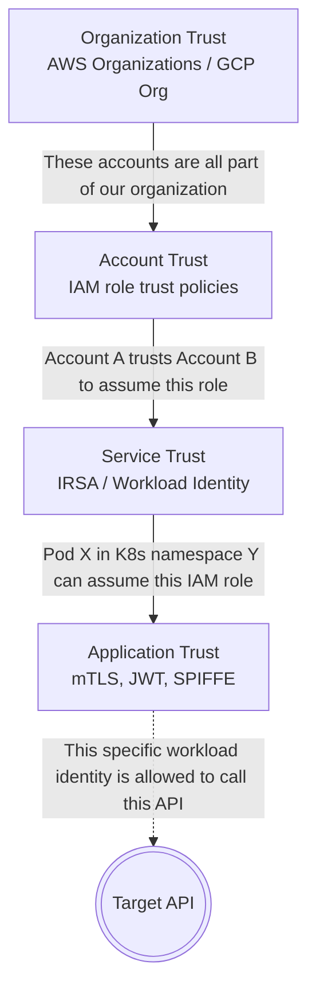
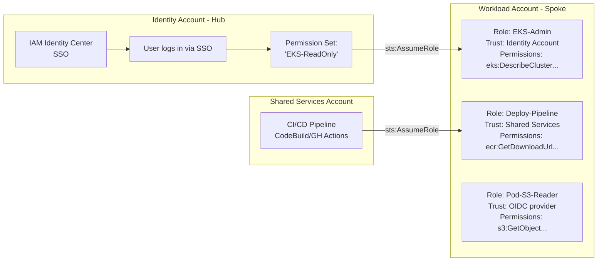
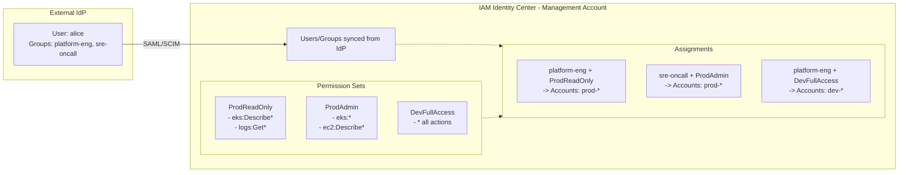
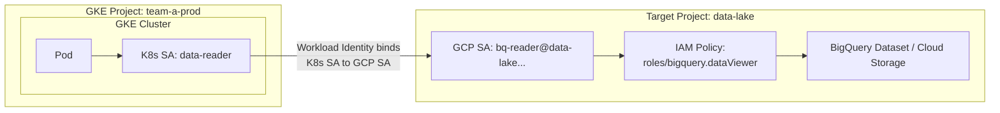
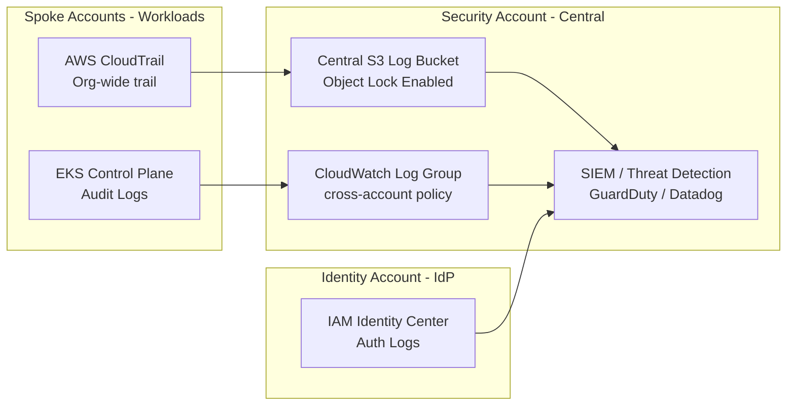
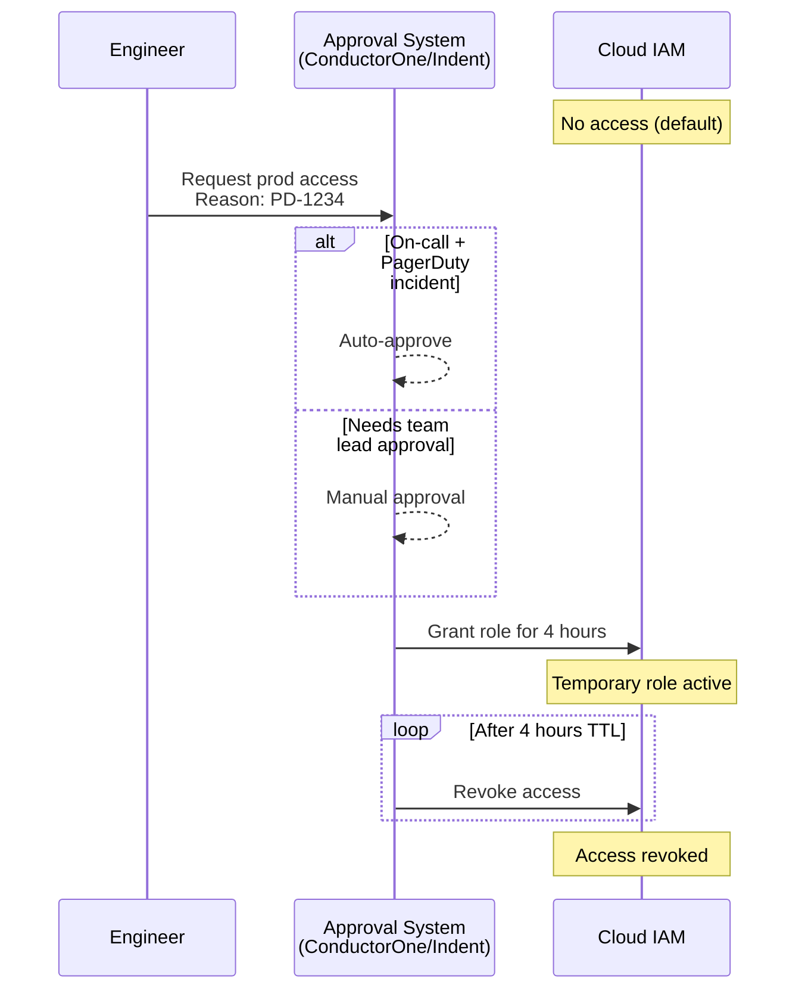

> **Complexity**: `[COMPLEX]`
>
> **Time to Complete**: 2.5 hours
>
> **Prerequisites**: [Module 8.1: Multi-Account Architecture](../module-8.1-multi-account/), basic understanding of IAM roles and policies in at least one cloud
>
> **Track**: Advanced Cloud Operations

## What You'll Be Able to Do

After completing this module, you will be able to:

- **Configure enterprise SSO integration with OIDC/SAML providers (Okta, Entra ID) for Kubernetes cluster access**
- **Implement cross-account IAM role chaining and federation patterns for multi-cloud Kubernetes environments**
- **Design RBAC hierarchies that map enterprise organizational structure to Kubernetes namespace-level permissions**
- **Deploy centralized audit logging for identity events across multiple clusters and cloud accounts**

---

## Why This Module Matters

**January 2023. A Fortune 500 financial services company.**

An engineer needed to debug a production issue in a Kubernetes cluster running in a different AWS account. The standard process: log into the management console, switch roles to the production account, navigate to EKS, download the kubeconfig, and authenticate with the cluster. The "role switch" used a long-lived IAM user with `AdministratorAccess` in the production account because the team had never gotten around to building proper cross-account role assumption chains.

That IAM user's access keys were stored in a shared `.env` file in a private GitHub repo. When an employee left the company and their personal GitHub account was compromised three months later, the attacker found the keys, assumed the production role, and had full admin access to production infrastructure for 11 hours before CloudTrail alerts triggered. The attacker exfiltrated 2.3 million customer records. The breach cost $18 million in regulatory fines, legal fees, and customer notification.

Every component of this failure was an identity problem: long-lived credentials instead of temporary tokens, overly broad permissions instead of least privilege, no just-in-time access controls, and no separation between human and machine identities. In a multi-account, multi-cluster world, identity is the new perimeter. This module teaches you how to build identity architectures that scale across accounts and clouds without becoming the security vulnerability they are supposed to prevent.

---

## Trust Boundaries: The Foundation of Cross-Account Identity

A trust boundary is the line between "I trust you" and "prove yourself." In a single AWS account, trust is implicit -- IAM roles trust the account they live in. In a multi-account world, you must explicitly establish trust between accounts.



### The Three Types of Identity

| Identity Type | Examples | Lifetime | Risk Level |
|---|---|---|---|
| Human | Engineers, admins, auditors | Session-based (1-12 hours) | High (phishing, credential theft) |
| Machine (cloud) | EC2 instance roles, GCE service accounts | Instance lifetime | Medium (compromise requires host access) |
| Workload (K8s) | Pod service accounts with cloud IAM bindings | Pod lifetime (minutes to days) | Medium-High (compromised pod = compromised identity) |

The critical insight: in a Kubernetes world, **workload identity is the most important identity type**. Pods need cloud credentials to access databases, secret stores, message queues, and storage. How you provide those credentials determines your security posture.

---

## Cross-Account Role Assumption (AWS)

The fundamental mechanism for cross-account access in AWS is role assumption. Account A creates a role with a trust policy that allows Account B's principals to assume it.

### The Role Chain Pattern



> **Stop and think**: What would happen if the Workload Account role (`EKS-Admin`) omitted the `aws:PrincipalOrgID` condition in its trust policy? If an attacker somehow guessed the role ARN, could they assume it?
> *Without the org condition, any AWS account that explicitly allows its users to assume your role could potentially do so if they know the ARN and the trust policy only specifies `arn:aws:iam::111111111111:root` without external IDs. Always restrict trust to your organization.*

### Setting Up Cross-Account Roles

```bash
# In the WORKLOAD account: Create a role that the Identity account can assume
aws iam create-role \
  --role-name EKS-Admin \
  --assume-role-policy-document '{
    "Version": "2012-10-17",
    "Statement": [
      {
        "Effect": "Allow",
        "Principal": {
          "AWS": "arn:aws:iam::111111111111:root"
        },
        "Action": "sts:AssumeRole",
        "Condition": {
          "StringEquals": {
            "aws:PrincipalOrgID": "o-abc1234567"
          },
          "Bool": {
            "aws:MultiFactorAuthPresent": "true"
          }
        }
      }
    ]
  }'

# Attach a policy that limits what this role can do
aws iam put-role-policy \
  --role-name EKS-Admin \
  --policy-name eks-admin-policy \
  --policy-document '{
    "Version": "2012-10-17",
    "Statement": [
      {
        "Effect": "Allow",
        "Action": [
          "eks:DescribeCluster",
          "eks:ListClusters",
          "eks:AccessKubernetesApi",
          "eks:ListNodegroups",
          "eks:DescribeNodegroup"
        ],
        "Resource": "arn:aws:eks:*:222222222222:cluster/*"
      }
    ]
  }'

# In the IDENTITY account: Allow a user/role to assume the cross-account role
aws iam put-user-policy \
  --user-name platform-engineer \
  --policy-name cross-account-assume \
  --policy-document '{
    "Version": "2012-10-17",
    "Statement": [
      {
        "Effect": "Allow",
        "Action": "sts:AssumeRole",
        "Resource": [
          "arn:aws:iam::222222222222:role/EKS-Admin",
          "arn:aws:iam::333333333333:role/EKS-Admin"
        ]
      }
    ]
  }'

# Assume the role and get temporary credentials
CREDS=$(aws sts assume-role \
  --role-arn arn:aws:iam::222222222222:role/EKS-Admin \
  --role-session-name "debug-session-$(date +%s)" \
  --duration-seconds 3600)

export AWS_ACCESS_KEY_ID=$(echo $CREDS | jq -r '.Credentials.AccessKeyId')
export AWS_SECRET_ACCESS_KEY=$(echo $CREDS | jq -r '.Credentials.SecretAccessKey')
export AWS_SESSION_TOKEN=$(echo $CREDS | jq -r '.Credentials.SessionToken')

# Now interact with EKS in the workload account
aws eks update-kubeconfig --name prod-cluster --region us-east-1
```

---

## IAM Identity Center (AWS SSO)

IAM Identity Center is the recommended way to manage human access to multiple AWS accounts. It provides a single sign-on portal where users authenticate once and then can switch between accounts and permission sets.



### Setting Up IAM Identity Center with Terraform

```hcl
# Configure the Identity Center instance
data "aws_ssoadmin_instances" "main" {}

locals {
  sso_instance_arn = tolist(data.aws_ssoadmin_instances.main.arns)[0]
  identity_store   = tolist(data.aws_ssoadmin_instances.main.identity_store_ids)[0]
}

# Create permission sets
resource "aws_ssoadmin_permission_set" "prod_readonly" {
  name             = "ProdReadOnly"
  instance_arn     = local.sso_instance_arn
  session_duration = "PT4H"
  description      = "Read-only access to production accounts"
}

resource "aws_ssoadmin_managed_policy_attachment" "prod_readonly_view" {
  instance_arn       = local.sso_instance_arn
  managed_policy_arn = "arn:aws:iam::aws:policy/ViewOnlyAccess"
  permission_set_arn = aws_ssoadmin_permission_set.prod_readonly.arn
}

# Custom inline policy for EKS access
resource "aws_ssoadmin_permission_set_inline_policy" "prod_readonly_eks" {
  instance_arn       = local.sso_instance_arn
  permission_set_arn = aws_ssoadmin_permission_set.prod_readonly.arn

  inline_policy = jsonencode({
    Version = "2012-10-17"
    Statement = [
      {
        Effect = "Allow"
        Action = [
          "eks:DescribeCluster",
          "eks:ListClusters",
          "eks:AccessKubernetesApi"
        ]
        Resource = "*"
      }
    ]
  })
}

resource "aws_ssoadmin_permission_set" "prod_admin" {
  name             = "ProdAdmin"
  instance_arn     = local.sso_instance_arn
  session_duration = "PT1H"  # Short session for admin access
  description      = "Admin access to production (break-glass)"
}

# Assign permission set to group for specific accounts
resource "aws_ssoadmin_account_assignment" "sre_prod_admin" {
  instance_arn       = local.sso_instance_arn
  permission_set_arn = aws_ssoadmin_permission_set.prod_admin.arn

  principal_id   = data.aws_identitystore_group.sre_oncall.group_id
  principal_type = "GROUP"

  target_id   = "222222222222"  # prod account ID
  target_type = "AWS_ACCOUNT"
}
```

---

## GCP Workload Identity Federation Across Projects

GCP's approach to cross-project identity uses Workload Identity Federation -- allowing GKE workloads in one project to impersonate service accounts in another project without managing keys.



> **Pause and predict**: In the GCP Workload Identity binding below, we specify `serviceAccount:team-a-prod.svc.id.goog[analytics/data-reader]`. What would happen if a developer in the same GKE cluster created a pod in the `default` namespace using a service account also named `data-reader`?
> *The pod in the `default` namespace would be denied access. The trust binding explicitly requires the `analytics` namespace. This namespace-level isolation prevents cross-tenant privilege escalation within a shared cluster.*

```bash
# Step 1: Enable Workload Identity on the GKE cluster
gcloud container clusters update team-a-prod \
  --project=team-a-prod \
  --region=us-central1 \
  --workload-pool=team-a-prod.svc.id.goog

# Step 2: Create a GCP service account in the TARGET project
gcloud iam service-accounts create bq-reader \
  --project=data-lake \
  --display-name="BigQuery Reader for Team A"

# Step 3: Grant the GCP SA access to BigQuery
gcloud projects add-iam-policy-binding data-lake \
  --member="serviceAccount:bq-reader@data-lake.iam.gserviceaccount.com" \
  --role="roles/bigquery.dataViewer"

# Step 4: Allow the K8s SA to impersonate the GCP SA
# This is the cross-project trust binding
gcloud iam service-accounts add-iam-policy-binding \
  bq-reader@data-lake.iam.gserviceaccount.com \
  --role="roles/iam.workloadIdentityUser" \
  --member="serviceAccount:team-a-prod.svc.id.goog[analytics/data-reader]"
#                          ^^^^^^^^^^^^^^ GKE project
#                                         ^^^^^^^^^ K8s namespace
#                                                    ^^^^^^^^^^^ K8s SA name

# Step 5: Create the K8s ServiceAccount with the annotation
kubectl --context team-a-prod create namespace analytics

kubectl --context team-a-prod apply -f - <<'EOF'
apiVersion: v1
kind: ServiceAccount
metadata:
  name: data-reader
  namespace: analytics
  annotations:
    iam.gke.io/gcp-service-account: bq-reader@data-lake.iam.gserviceaccount.com
EOF

# Step 6: Deploy a pod using this service account
kubectl --context team-a-prod apply -f - <<'EOF'
apiVersion: apps/v1
kind: Deployment
metadata:
  name: analytics-worker
  namespace: analytics
spec:
  replicas: 2
  selector:
    matchLabels:
      app: analytics-worker
  template:
    metadata:
      labels:
        app: analytics-worker
    spec:
      serviceAccountName: data-reader
      containers:
        - name: worker
          image: gcr.io/team-a-prod/analytics-worker:v1.4.2
          # No GCP credentials needed - Workload Identity provides them
EOF
```

---

## Azure Entra ID and Workload Identity

Azure uses Entra ID (formerly Azure AD) as the central identity provider, with Workload Identity Federation for Kubernetes pods.

```bash
# Step 1: Enable OIDC issuer and workload identity on AKS
az aks update \
  --resource-group prod-rg \
  --name team-a-prod \
  --enable-oidc-issuer \
  --enable-workload-identity

# Get the OIDC issuer URL
OIDC_ISSUER=$(az aks show \
  --resource-group prod-rg \
  --name team-a-prod \
  --query "oidcIssuerProfile.issuerUrl" -o tsv)

# Step 2: Create a Managed Identity (cross-subscription capable)
az identity create \
  --name "team-a-keyvault-reader" \
  --resource-group identity-rg \
  --subscription IDENTITY_SUB_ID

CLIENT_ID=$(az identity show \
  --name "team-a-keyvault-reader" \
  --resource-group identity-rg \
  --query 'clientId' -o tsv)

# Step 3: Create federated credential (trust K8s SA)
az identity federated-credential create \
  --name "aks-team-a-prod" \
  --identity-name "team-a-keyvault-reader" \
  --resource-group identity-rg \
  --issuer "$OIDC_ISSUER" \
  --subject "system:serviceaccount:app:keyvault-reader" \
  --audience "api://AzureADTokenExchange"

# Step 4: Grant the Managed Identity access to Key Vault
# (in a DIFFERENT subscription)
az role assignment create \
  --assignee $CLIENT_ID \
  --role "Key Vault Secrets User" \
  --scope "/subscriptions/KEYVAULT_SUB_ID/resourceGroups/security-rg/providers/Microsoft.KeyVault/vaults/prod-secrets"

# Step 5: Create the K8s ServiceAccount with workload identity labels
kubectl apply -f - <<EOF
apiVersion: v1
kind: ServiceAccount
metadata:
  name: keyvault-reader
  namespace: app
  annotations:
    azure.workload.identity/client-id: "$CLIENT_ID"
  labels:
    azure.workload.identity/use: "true"
EOF
```

---

## Attribute-Based Access Control (ABAC)

ABAC extends traditional RBAC by making access decisions based on attributes of the requester, the resource, and the environment -- not just static role assignments.

### RBAC vs ABAC

**RBAC**: *"Alice has the EKS-Admin role, which allows eks:\* on all clusters"*
- Static assignment
- Broad permissions
- No context awareness

**ABAC**: *"Alice can access EKS clusters IF: she is in the sre-oncall group AND the cluster has tag Environment=production AND the current time is during her on-call shift AND she has completed the security training this quarter AND the request originates from the corporate VPN"*
- Dynamic, context-aware
- Fine-grained
- Harder to reason about

### AWS ABAC with Tags

```json
{
  "Version": "2012-10-17",
  "Statement": [
    {
      "Effect": "Allow",
      "Action": [
        "eks:DescribeCluster",
        "eks:AccessKubernetesApi"
      ],
      "Resource": "*",
      "Condition": {
        "StringEquals": {
          "aws:ResourceTag/Team": "${aws:PrincipalTag/Team}",
          "aws:ResourceTag/Environment": "production"
        }
      }
    }
  ]
}
```

This policy says: "You can access EKS clusters only if the cluster's `Team` tag matches your own `Team` tag, and the cluster is in production." An engineer tagged `Team=payments` can access the payments production cluster but not the analytics production cluster. No explicit role assignment per cluster needed -- the tags do the work.

```bash
# Tag the IAM user/role with their team
aws iam tag-user \
  --user-name alice \
  --tags Key=Team,Value=payments Key=CostCenter,Value=CC-1234

# Tag the EKS cluster
aws eks tag-resource \
  --resource-arn arn:aws:eks:us-east-1:222222222222:cluster/payments-prod \
  --tags Team=payments,Environment=production
```

### GCP ABAC with IAM Conditions

```bash
# Grant access to GKE cluster only during business hours
gcloud projects add-iam-policy-binding team-a-prod \
  --member="user:alice@company.com" \
  --role="roles/container.developer" \
  --condition='expression=request.time.getHours("America/New_York") >= 9 && request.time.getHours("America/New_York") <= 17,title=business-hours-only,description=Access only during EST business hours'
```

> **Stop and think**: You configure an ABAC policy requiring `aws:ResourceTag/Environment = production` for access. What happens if an engineer with EC2 permissions simply removes the `Environment` tag from a production server?
> *Without the tag, the resource no longer matches the ABAC condition, potentially locking authorized users out. Conversely, if an attacker can modify tags, they can grant themselves access to resources by changing the tags to match their permissions. You must strictly control the `iam:TagResource` and `ec2:DeleteTags` permissions to protect your ABAC logic.*

---

## Centralized Audit Logging for Identity Events

When identities span multiple cloud accounts and Kubernetes clusters, distributed logging becomes a major blind spot. If an attacker assumes a role in Account A, pivoting to a cluster in Account B, you cannot piece together the attack timeline if logs are siloed in individual accounts. 

You must aggregate identity events into a centralized, immutable security account (often integrated with a SIEM like Splunk or Datadog).



### Key Configurations for Identity Auditing

1. **Organizational CloudTrail**: Never rely on individual account trails. Deploy an Organization Trail from your management account that automatically covers all existing and future member accounts. This captures all `AssumeRole`, `AssumeRoleWithWebIdentity` (IRSA), and `ConsoleLogin` events universally.
2. **Kubernetes Audit Logs**: Enable EKS/GKE/AKS control plane audit logging. In Kubernetes, the `kube-apiserver` audit logs show *who* did *what* to *which* resource. Forward these to your central logging account.
3. **Log Immutability**: Store centralized logs in an S3 bucket configured with **S3 Object Lock** (WORM - Write Once Read Many). If an attacker gains admin access to a spoke account, they cannot delete their tracks in the central security bucket.

### Tracing a Cross-Account Kubernetes Event

When auditing, you must stitch together cloud provider logs and Kubernetes logs. 

1. **CloudTrail**: Shows a human logging into SSO.
2. **CloudTrail**: Shows that SSO session assuming the `EKS-Admin` role via `AssumeRole`.
3. **EKS Audit Log**: Shows the `EKS-Admin` role calling `create pod`.

Here is an example of an EKS Audit log showing the mapped AWS identity. Notice how Kubernetes maps the cloud IAM ARN to a Kubernetes `User`:

```json
{
  "kind": "Event",
  "apiVersion": "audit.k8s.io/v1",
  "verb": "create",
  "user": {
    "username": "kubernetes-admin",
    "uid": "aws-iam-authenticator:111122223333:AROA1234567890EXAMPLE",
    "groups": ["system:masters", "system:authenticated"],
    "extra": {
      "accessKeyId": ["ASIA..."],
      "arn": ["arn:aws:sts::222222222222:assumed-role/EKS-Admin/alice-session"],
      "canonicalArn": ["arn:aws:iam::222222222222:role/EKS-Admin"],
      "sessionName": ["alice-session"]
    }
  },
  "objectRef": {
    "resource": "secrets",
    "namespace": "production",
    "name": "db-credentials"
  }
}
```

By querying your SIEM for `user.extra.sessionName = "alice-session"`, you can track Alice's actions across the cloud provider and inside the Kubernetes cluster.

---

## Just-In-Time (JIT) Access

JIT access grants elevated permissions only when needed, for a limited duration, with an approval workflow. It eliminates standing privileges -- the most dangerous security pattern in cloud environments.



### Implementing JIT with AWS SSO Permission Sets

```bash
# Create a "break-glass" permission set with short duration
aws sso-admin create-permission-set \
  --instance-arn $SSO_INSTANCE_ARN \
  --name "BreakGlass-ProdAdmin" \
  --session-duration "PT2H" \
  --description "Emergency production admin access - requires approval"

# The approval workflow lives in your JIT tool (ConductorOne, Indent, etc.)
# When approved, the tool makes this API call:

aws sso-admin create-account-assignment \
  --instance-arn $SSO_INSTANCE_ARN \
  --target-id 222222222222 \
  --target-type AWS_ACCOUNT \
  --permission-set-arn $BREAKGLASS_PS_ARN \
  --principal-type USER \
  --principal-id $USER_ID

# When the TTL expires, the tool removes the assignment:
aws sso-admin delete-account-assignment \
  --instance-arn $SSO_INSTANCE_ARN \
  --target-id 222222222222 \
  --target-type AWS_ACCOUNT \
  --permission-set-arn $BREAKGLASS_PS_ARN \
  --principal-type USER \
  --principal-id $USER_ID
```

### Kubernetes RBAC for JIT

```yaml
# A ClusterRoleBinding that grants temporary admin access
# Created by your JIT tool when access is approved
apiVersion: rbac.authorization.k8s.io/v1
kind: ClusterRoleBinding
metadata:
  name: jit-alice-admin-20260324
  labels:
    jit.company.com/requester: alice
    jit.company.com/expires: "2026-03-24T14:00:00Z"
    jit.company.com/ticket: "PD-1234"
  annotations:
    jit.company.com/reason: "Investigating payment processing errors"
    jit.company.com/approver: "bob@company.com"
subjects:
  - kind: User
    name: alice@company.com
    apiGroup: rbac.authorization.k8s.io
roleRef:
  kind: ClusterRole
  name: cluster-admin
  apiGroup: rbac.authorization.k8s.io
---
# CronJob to clean up expired JIT bindings
apiVersion: batch/v1
kind: CronJob
metadata:
  name: jit-cleanup
  namespace: kube-system
spec:
  schedule: "*/15 * * * *"
  jobTemplate:
    spec:
      template:
        spec:
          serviceAccountName: jit-cleanup-sa
          containers:
            - name: cleanup
              image: bitnami/kubectl:1.35
              command:
                - /bin/sh
                - -c
                - |
                  NOW=$(date -u +%Y-%m-%dT%H:%M:%SZ)
                  kubectl get clusterrolebindings -l jit.company.com/expires -o json | \
                    jq -r --arg now "$NOW" \
                    '.items[] | select(.metadata.labels["jit.company.com/expires"] < $now) | .metadata.name' | \
                    xargs -r kubectl delete clusterrolebinding
          restartPolicy: OnFailure
```

---

## Did You Know?

1. **AWS IAM evaluates an average of 2.5 billion authorization requests per second** across all AWS accounts globally. Every API call, every S3 object access, every Lambda invocation goes through IAM evaluation. The system has a design target of sub-millisecond evaluation latency, which is why IAM policies are evaluated locally at the service endpoint rather than at a central authorization server.

2. **GCP's Workload Identity Federation supports external identity providers beyond GCP.** You can configure a GKE workload in one cloud to authenticate to GCP services using an OIDC token issued by an AWS EKS cluster. This means an EKS pod can access BigQuery without any GCP service account keys -- the EKS OIDC issuer is registered as a trusted identity provider in GCP. This is how true multi-cloud workload identity works.

3. **The concept of "confused deputy" attacks** was first described by Norm Hardy in 1988. In cloud IAM, it applies when a service (the "deputy") is tricked into using its own permissions on behalf of an unauthorized caller. AWS mitigates this with the `aws:SourceArn` and `aws:SourceAccount` conditions on trust policies. Every cross-account role should include these conditions to prevent confused deputy attacks.

4. **Azure Entra ID processes over 90 billion authentications per day** as of 2025, making it the largest identity provider in the world by transaction volume. This includes not just Azure cloud access but Microsoft 365, third-party SaaS applications, and on-premises Active Directory hybrid scenarios. When you federate AKS workload identity through Entra ID, your Kubernetes pods are participating in this same identity fabric.

---

## Common Mistakes

| Mistake | Why It Happens | How to Fix It |
|---|---|---|
| Using long-lived access keys for cross-account access | "AssumeRole is complicated" | Always use STS temporary credentials. If your tool doesn't support AssumeRole, the tool is not ready for multi-account. |
| Granting `*` permissions on cross-account roles | "We'll tighten it later" | Define the minimum required permissions from day one. Use CloudTrail to identify which APIs are actually called, then scope down. |
| Not using MFA for human cross-account role assumption | "SSO handles authentication" | Even with SSO, require MFA via the `aws:MultiFactorAuthPresent` condition on trust policies for production account roles. |
| Sharing GCP service account keys between projects | "Workload Identity is too complex" | Workload Identity eliminates key management entirely. The setup complexity is a one-time cost; managing keys is a forever cost with ongoing risk. |
| No session duration limits on admin roles | Default is 1 hour for SSO, 12 hours for IAM roles | Set aggressive session durations: 1h for admin, 4h for read-only, 15 minutes for break-glass. Force re-authentication. |
| Using the same K8s service account for multiple workloads | "It's easier to manage one SA" | Each workload should have its own service account with its own cloud IAM binding. Shared SAs mean shared blast radius. |
| Not logging cross-account role assumptions | "CloudTrail is enabled" | Verify that AssumeRole events are captured in your centralized log archive. Create alerts for role assumptions into production accounts outside business hours. |
| Forgetting to add `aws:SourceAccount` to trust policies | "The role ARN in the trust policy is enough" | Without source conditions, any account that can construct the right principal ARN could assume your role. Always add `aws:PrincipalOrgID` or `aws:SourceAccount`. |

---

## Quiz

<details>
<summary>1. **Scenario:** An engineer proposes creating a set of long-lived AWS IAM access keys in the production account and storing them securely in HashiCorp Vault for the CI/CD pipeline to use for cross-account deployments. What is the primary security flaw with this approach compared to using STS temporary credentials?</summary>

While Vault provides secure storage, long-lived access keys never expire unless manually rotated, meaning a leaked key provides permanent access until someone notices and revokes it. Temporary credentials (STS) have a built-in expiration (typically 1-12 hours), which inherently limits the window of exploitation if they are compromised. STS credentials also carry session metadata (who assumed the role, from which account, the session name) that appears in CloudTrail logs, making audit trails more useful. Furthermore, STS role assumption can enforce MFA, IP restrictions, and time-based conditions at the point of assumption, which static keys cannot.
</details>

<details>
<summary>2. **Scenario:** Your team is migrating a data processing application from on-premises to GKE. The app needs to read from BigQuery. The legacy documentation instructs developers to download a JSON service account key and mount it as a Kubernetes Secret. How would you redesign this authentication flow using GCP Workload Identity Federation to eliminate the need for the JSON key?</summary>

Workload Identity Federation creates a trust relationship directly between a Kubernetes service account and a GCP service account, completely eliminating the need to manage or store JSON keys. When a pod needs GCP credentials, the GKE metadata server intercepts the token request and exchanges the pod's Kubernetes service account token (a JWT signed by the cluster's OIDC issuer) for a short-lived GCP access token. No long-lived keys are stored anywhere—not in Kubernetes Secrets, not in environment variables, not in files. The trust is established by registering the GKE cluster's OIDC issuer URL with GCP IAM, and binding a specific K8s namespace/service-account combination to a specific GCP service account.
</details>

<details>
<summary>3. **Scenario:** Your organization has 50 EKS clusters, each owned by a different product team. Using standard RBAC, the platform team currently manages 50 separate IAM roles (e.g., `Payments-EKS-Admin`, `Analytics-EKS-Admin`). The team is overwhelmed with role management requests. How could switching to Attribute-Based Access Control (ABAC) solve this operational bottleneck?</summary>

RBAC assigns permissions based on static roles, meaning every new cluster requires a new role and explicit assignment. ABAC, on the other hand, assigns permissions based on dynamic attributes and context. By switching to ABAC, you could create a single IAM policy that states: "A user can manage an EKS cluster IF the cluster's `Team` tag matches the user's `Team` tag." When a new cluster is created, you simply tag it with `Team=Payments`, and the payments engineers automatically gain access without any IAM role updates. You choose ABAC when you have many similar resources that differ by a tag, enabling permissions to scale automatically and allowing for context-aware access decisions like time-of-day or source IP.
</details>

<details>
<summary>4. **Scenario:** A third-party SaaS monitoring tool asks you to create an IAM role in your AWS account that trusts their AWS account (`arn:aws:iam::999999999999:root`). You create the role and provide them the Role ARN. Six months later, another customer of that same SaaS tool successfully forces the SaaS platform to assume your role and read your S3 buckets. What attack just occurred, and how should you have prevented it?</summary>

This is a classic "confused deputy" attack, where a service with cross-account permissions (the SaaS tool) is tricked into acting on behalf of an unauthorized party (the malicious customer). Because the trust policy only verified the SaaS provider's account ID, it couldn't distinguish between legitimate requests made on your behalf and requests the provider was tricked into making. You should have prevented this by adding `aws:ExternalId` or `aws:SourceAccount` conditions to the trust policy. These conditions ensure that the SaaS provider must supply a unique identifier tied specifically to your tenant when assuming the role, effectively verifying the original caller's identity, not just the immediate caller's identity.
</details>

<details>
<summary>5. **Scenario:** A junior engineer creates a single Kubernetes ServiceAccount named `cloud-access-sa` in the `default` namespace, binds it to an IAM role with S3 and DynamoDB permissions, and configures all 15 microservices in the cluster to use this ServiceAccount. Explain why this design violates core security principles and what the blast radius implications are.</summary>

Sharing a single service account across multiple workloads fundamentally violates the principle of least privilege, as every microservice now possesses the combined permissions of all workloads (S3 and DynamoDB), regardless of whether they actually need them. If any one of those 15 microservices is compromised via an application vulnerability, the attacker instantly gains full access to all cloud resources associated with the shared ServiceAccount. With individual, per-workload service accounts, a compromised pod can only access the specific cloud resources that particular workload requires. The operational overhead of creating per-workload SAs is minimal when automated through Infrastructure as Code, making the security benefits of a reduced blast radius highly worthwhile.
</details>

<details>
<summary>6. **Scenario:** An SRE's laptop is stolen while they are logged into their enterprise SSO portal. The attacker attempts to use the active SSO session to access the production EKS cluster and delete namespaces. However, the attacker finds they have only read-only permissions, despite the SRE being a senior admin. How did Just-In-Time (JIT) access architecture prevent this catastrophic breach?</summary>

JIT access prevented the breach by eliminating standing privileges, meaning that even senior admins do not possess permanent administrative access to production by default. In a JIT system, elevated permissions are granted only when a specific, justified need arises (such as an active PagerDuty incident), and only for a limited duration (e.g., 2 hours) following an approval workflow. Because the SRE had not requested and been approved for an active JIT session at the time the laptop was stolen, their baseline credentials only provided safe, read-only access. The attacker would have needed to compromise the separate JIT approval workflow—which typically requires MFA or peer approval—to elevate their privileges, drastically shrinking the attack surface.
</details>

---

## Hands-On Exercise: Build Cross-Account Identity for EKS

In this exercise, you will set up cross-account IAM role assumption and workload identity for an EKS cluster.

### Scenario

**Setup**: Two AWS accounts (simulated with IAM roles in a single account for this exercise).
- "Identity Account" role: manages who can access what
- "Workload Account" role: runs the EKS cluster
- A pod in EKS needs to read from an S3 bucket in a "Data Account"

### Task 1: Create the Cross-Account Trust Policy

Write an IAM role trust policy that allows the Identity Account to assume a role in the Workload Account, with MFA required and organization condition.

<details>
<summary>Solution</summary>

```json
{
  "Version": "2012-10-17",
  "Statement": [
    {
      "Sid": "AllowIdentityAccountAssumption",
      "Effect": "Allow",
      "Principal": {
        "AWS": "arn:aws:iam::111111111111:root"
      },
      "Action": "sts:AssumeRole",
      "Condition": {
        "StringEquals": {
          "aws:PrincipalOrgID": "o-abc1234567"
        },
        "Bool": {
          "aws:MultiFactorAuthPresent": "true"
        },
        "NumericLessThan": {
          "aws:MultiFactorAuthAge": "3600"
        }
      }
    }
  ]
}
```

The `MultiFactorAuthAge` condition ensures the MFA was verified within the last hour, preventing stale MFA sessions.
</details>

### Task 2: Configure EKS IRSA for Cross-Account S3 Access

Write the IAM role and Kubernetes ServiceAccount configuration for a pod that needs to read S3 objects from a different account.

<details>
<summary>Solution</summary>

```bash
# Step 1: Get the EKS OIDC provider URL
OIDC_PROVIDER=$(aws eks describe-cluster \
  --name prod-cluster \
  --query "cluster.identity.oidc.issuer" \
  --output text | sed 's|https://||')

# Step 2: Create the IAM role with trust policy for IRSA
cat <<EOF > irsa-trust-policy.json
{
  "Version": "2012-10-17",
  "Statement": [
    {
      "Effect": "Allow",
      "Principal": {
        "Federated": "arn:aws:iam::222222222222:oidc-provider/${OIDC_PROVIDER}"
      },
      "Action": "sts:AssumeRoleWithWebIdentity",
      "Condition": {
        "StringEquals": {
          "${OIDC_PROVIDER}:sub": "system:serviceaccount:analytics:s3-reader",
          "${OIDC_PROVIDER}:aud": "sts.amazonaws.com"
        }
      }
    }
  ]
}
EOF

aws iam create-role \
  --role-name pod-s3-reader \
  --assume-role-policy-document file://irsa-trust-policy.json

# Step 3: Grant the role cross-account S3 access
aws iam put-role-policy \
  --role-name pod-s3-reader \
  --policy-name s3-cross-account-read \
  --policy-document '{
    "Version": "2012-10-17",
    "Statement": [
      {
        "Effect": "Allow",
        "Action": [
          "s3:GetObject",
          "s3:ListBucket"
        ],
        "Resource": [
          "arn:aws:s3:::data-account-analytics-bucket",
          "arn:aws:s3:::data-account-analytics-bucket/*"
        ]
      }
    ]
  }'
```

```yaml
# Step 4: Create the Kubernetes ServiceAccount
apiVersion: v1
kind: ServiceAccount
metadata:
  name: s3-reader
  namespace: analytics
  annotations:
    eks.amazonaws.com/role-arn: arn:aws:iam::222222222222:role/pod-s3-reader
---
# Step 5: Deploy a pod using the service account
apiVersion: apps/v1
kind: Deployment
metadata:
  name: data-processor
  namespace: analytics
spec:
  replicas: 2
  selector:
    matchLabels:
      app: data-processor
  template:
    metadata:
      labels:
        app: data-processor
    spec:
      serviceAccountName: s3-reader
      containers:
        - name: processor
          image: amazon/aws-cli:latest
          command: ["sh", "-c", "aws s3 ls s3://data-account-analytics-bucket/ && sleep 3600"]
```

Note: The S3 bucket in the Data Account also needs a bucket policy allowing the role from the Workload Account.
</details>

### Task 3: Write the S3 Bucket Policy (Data Account Side)

Write the bucket policy that allows the pod's IAM role to read objects.

<details>
<summary>Solution</summary>

```json
{
  "Version": "2012-10-17",
  "Statement": [
    {
      "Sid": "AllowCrossAccountRead",
      "Effect": "Allow",
      "Principal": {
        "AWS": "arn:aws:iam::222222222222:role/pod-s3-reader"
      },
      "Action": [
        "s3:GetObject",
        "s3:ListBucket"
      ],
      "Resource": [
        "arn:aws:s3:::data-account-analytics-bucket",
        "arn:aws:s3:::data-account-analytics-bucket/*"
      ],
      "Condition": {
        "StringEquals": {
          "aws:PrincipalOrgID": "o-abc1234567"
        }
      }
    }
  ]
}
```

The organization condition ensures only roles from your organization can access the bucket, even if the role ARN is known.
</details>

### Task 4: Design JIT Access for Production EKS

Design a JIT access flow that grants temporary kubectl admin access to a production EKS cluster, including the approval workflow, the RBAC objects, and the cleanup mechanism.

<details>
<summary>Solution</summary>

```
JIT Flow:
1. Engineer opens a request in JIT tool (e.g., ConductorOne)
   - Specifies: cluster name, namespace, duration, reason, PagerDuty incident
2. Auto-approval if: on-call + active incident
   Manual approval if: not on-call
3. Approved -> JIT tool executes:
   a. Creates temporary IAM Identity Center assignment (SSO access)
   b. Creates ClusterRoleBinding in EKS with TTL label
   c. Notifies #security-audit Slack channel
4. TTL expires -> JIT tool executes:
   a. Removes IAM Identity Center assignment
   b. CronJob deletes expired ClusterRoleBinding
   c. Logs access duration and actions taken
```

```yaml
# The ClusterRoleBinding created by the JIT tool
apiVersion: rbac.authorization.k8s.io/v1
kind: ClusterRoleBinding
metadata:
  name: jit-alice-20260324-pd5678
  labels:
    jit.company.com/requester: alice
    jit.company.com/expires: "2026-03-24T16:00:00Z"
    jit.company.com/incident: "PD-5678"
    jit.company.com/type: break-glass
  annotations:
    jit.company.com/approver: auto-approved-oncall
    jit.company.com/reason: "Payment processing errors in us-east-1"
subjects:
  - kind: Group
    name: sso-alice-prod-admin
    apiGroup: rbac.authorization.k8s.io
roleRef:
  kind: ClusterRole
  name: cluster-admin
  apiGroup: rbac.authorization.k8s.io
---
# Scoped alternative: namespace-level admin instead of cluster-admin
apiVersion: rbac.authorization.k8s.io/v1
kind: RoleBinding
metadata:
  name: jit-alice-payments-admin
  namespace: payments
  labels:
    jit.company.com/requester: alice
    jit.company.com/expires: "2026-03-24T16:00:00Z"
subjects:
  - kind: Group
    name: sso-alice-prod-admin
    apiGroup: rbac.authorization.k8s.io
roleRef:
  kind: ClusterRole
  name: admin
  apiGroup: rbac.authorization.k8s.io
```
</details>

### Success Criteria

- [ ] Trust policy includes organization condition AND MFA requirement
- [ ] IRSA configuration correctly binds K8s SA to IAM role with namespace+SA conditions
- [ ] S3 bucket policy uses organization condition (not just role ARN)
- [ ] JIT design includes approval workflow, temporary RBAC, and automated cleanup
- [ ] No long-lived credentials used anywhere in the solution

---

## Next Module

[Module 8.5: Disaster Recovery: RTO/RPO for Kubernetes](../module-8.5-disaster-recovery/) -- Your multi-account architecture is secure, your clusters can communicate, and your identity is solid. Now learn what happens when everything falls over. RTO, RPO, etcd snapshots, Velero, and the art of recovering from the unthinkable.