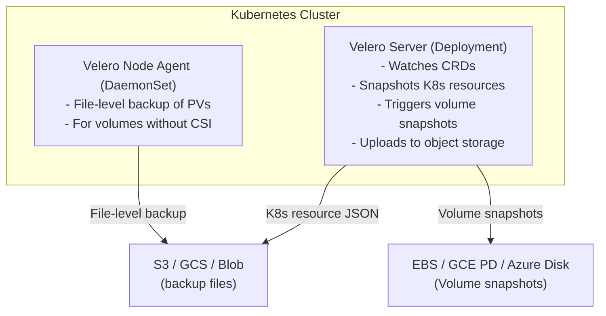
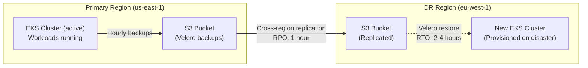
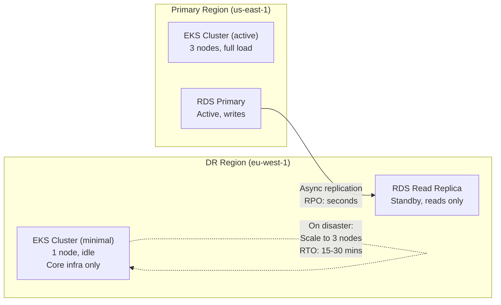
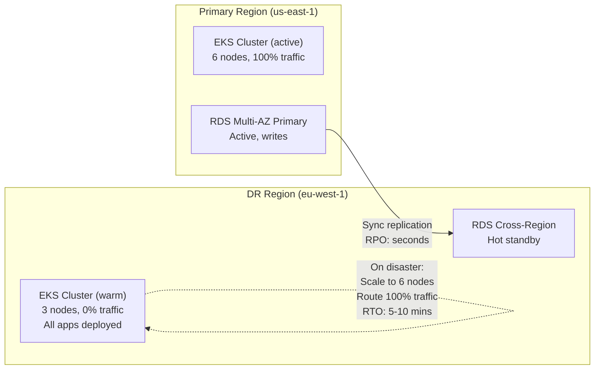
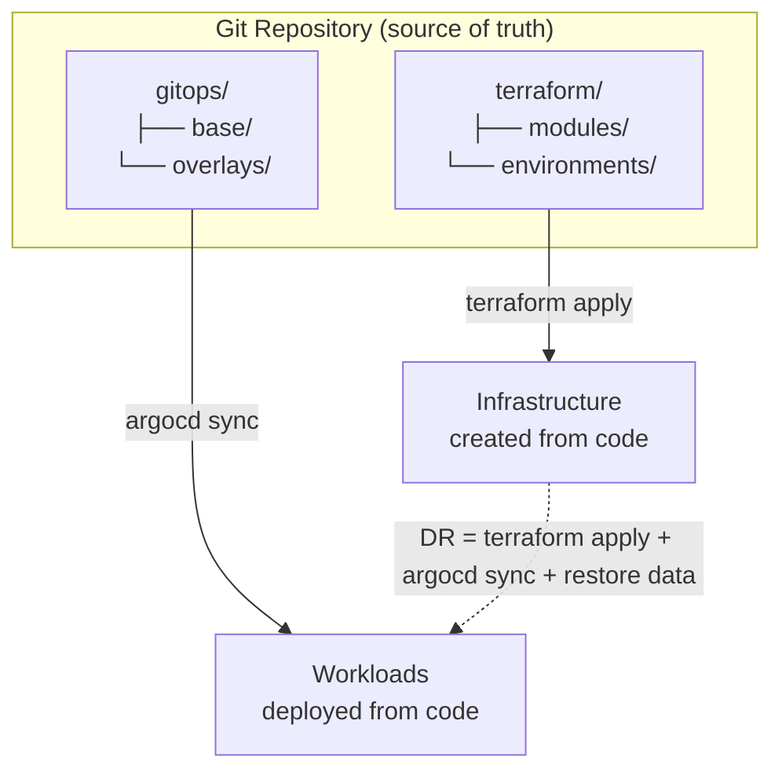

> **Complexity**: `[COMPLEX]`
>
> **Time to Complete**: 2.5 hours
>
> **Prerequisites**: [Module 8.1: Multi-Account Architecture](../module-8.1-multi-account/), experience operating at least one Kubernetes cluster in production
>
> **Track**: Advanced Cloud Operations

## What You'll Be Able to Do

After completing this module, you will be able to:

- **Design disaster recovery architectures for Kubernetes with defined RTO/RPO targets across cloud regions**
- **Implement Velero-based backup and restore strategies for cluster state, persistent volumes, and application data**
- **Configure cross-region replication for etcd snapshots, container images, and persistent storage volumes**
- **Deploy automated DR failover runbooks that validate recovery procedures through regular chaos testing**

---

## Why This Module Matters

**January 2017. GitLab.**

A database engineer executed a `rm -rf` command on what they believed was a replicated staging database directory. It was the production PostgreSQL data directory. The primary database for GitLab.com was gone. The team immediately looked to their backup systems: five different backup methods were configured. None of them worked. LVM snapshots had never been verified. pg_dump hadn't run successfully in months due to a silent error. Azure disk snapshots were untested. The S3 backup process was only partially configured. The only thing that saved GitLab was a staging database that happened to be a six-hour-old copy of production, created for an unrelated test.

GitLab lost six hours of data: 5,037 merge requests, comments, issues, and snippets. They also lost something harder to quantify: customer trust. The incident became a case study in every disaster recovery talk for the next five years.

The lesson is not "have backups." Every team has backups. The lesson is: **untested backups are not backups.** And in the Kubernetes world, the situation is even more complex. Your cluster state lives in etcd. Your application state lives in databases, PersistentVolumes, and external services. Your configuration lives in Git repos and Helm releases. A real disaster recovery plan must account for all of these, with tested procedures and clear targets for how fast you recover (RTO) and how much data you can afford to lose (RPO).

---

## RTO and RPO: The Two Numbers That Define Your DR Strategy

Every disaster recovery plan starts with two numbers. Get these wrong, and everything downstream is wrong.


**RPO (Recovery Point Objective):**
"How much data can we afford to lose?"
- RPO = 0: No data loss (synchronous replication)
- RPO = 1 hour: Lose up to 1 hour of data (hourly backups)
- RPO = 24 hours: Lose up to 1 day (daily backups)

**RTO (Recovery Time Objective):**
"How long can we be down?"
- RTO = 0: No downtime (active-active, covered in Module 8.6)
- RTO = 15 min: Quick failover (warm standby)
- RTO = 4 hours: Cold standby or backup restore
- RTO = 24 hours: Full rebuild from IaC

### Mapping RTO/RPO to DR Strategies

| Strategy | RTO | RPO | Cost | Complexity |
|---|---|---|---|---|
| Backup & Restore | 4-24 hours | Hours to days | Low ($) | Low |
| Pilot Light | 30-60 min | Minutes to hours | Medium ($$) | Medium |
| Warm Standby | 5-15 min | Seconds to minutes | High ($$$) | High |
| Active-Active | Near-zero | Near-zero | Very High ($$$$) | Very High |

### The War Story: When RTO Doesn't Match Reality

A retail company set their RTO at 4 hours for their Kubernetes platform. During their annual DR test, the actual recovery took 11 hours. Why?

- Restoring etcd from snapshot: 20 minutes (as expected)
- Waiting for nodes to rejoin and pods to schedule: 45 minutes (expected 15)
- Discovering that three CRDs were missing from the backup: 90 minutes to figure out
- DNS propagation for the new cluster endpoint: 35 minutes
- Discovering that PersistentVolume claims couldn't bind because the storage class didn't exist: 60 minutes
- Application health checks failing because the database connection string pointed to the old cluster: 120 minutes
- Load testing to verify the restored cluster could handle production traffic: 90 minutes

The lesson: your RTO should be based on tested recovery time, not theoretical recovery time. Add a 2x safety margin to your best-case test result.

> **Pause and predict**: Your database performs asynchronous replication to a DR region with an average lag of 5 minutes. You also take full database snapshots every 12 hours. If your primary region completely fails and you promote the replica in the DR region, what is your actual RPO? If the replica also fails and you must restore from the last snapshot, how does your RPO change?

---

## etcd Backup and Restore

For self-managed Kubernetes clusters (kubeadm, kOps, Rancher), etcd is the single point of truth. Lose etcd, lose your cluster.

### etcd Snapshot Backup

```bash
# Take a snapshot of etcd (run on a control plane node)
ETCDCTL_API=3 etcdctl snapshot save /var/backups/etcd/snapshot-$(date +%Y%m%d-%H%M%S).db \
  --endpoints=https://127.0.0.1:2379 \
  --cacert=/etc/kubernetes/pki/etcd/ca.crt \
  --cert=/etc/kubernetes/pki/etcd/server.crt \
  --key=/etc/kubernetes/pki/etcd/server.key

# Verify the snapshot
ETCDCTL_API=3 etcdctl snapshot status /var/backups/etcd/snapshot-20260324-100000.db \
  --write-out=table

# Expected output:
# +----------+----------+------------+------------+
# |   HASH   | REVISION | TOTAL KEYS | TOTAL SIZE |
# +----------+----------+------------+------------+
# | 3e6d0a12 | 15284032 |      12847 |    42 MB   |
# +----------+----------+------------+------------+

# Upload to S3 for off-site storage
aws s3 cp /var/backups/etcd/snapshot-20260324-100000.db \
  s3://company-etcd-backups/prod-cluster/$(date +%Y/%m/%d)/ \
  --sse aws:kms \
  --sse-kms-key-id alias/etcd-backup-key
```

### Automated etcd Backup with CronJob

```yaml
# For self-managed clusters, run etcd backup as a CronJob
apiVersion: batch/v1
kind: CronJob
metadata:
  name: etcd-backup
  namespace: kube-system
spec:
  schedule: "0 */4 * * *"  # Every 4 hours
  concurrencyPolicy: Forbid
  successfulJobsHistoryLimit: 3
  failedJobsHistoryLimit: 3
  jobTemplate:
    spec:
      template:
        spec:
          nodeName: control-plane-1  # Pin to control plane
          hostNetwork: true
          tolerations:
            - key: node-role.kubernetes.io/control-plane
              effect: NoSchedule
          containers:
            - name: etcd-backup
              image: registry.k8s.io/etcd:3.5.16-0
              command:
                - /bin/sh
                - -c
                - |
                  set -e
                  BACKUP_FILE="/backups/snapshot-$(date +%Y%m%d-%H%M%S).db"
                  etcdctl snapshot save "$BACKUP_FILE" \
                    --endpoints=https://127.0.0.1:2379 \
                    --cacert=/etc/kubernetes/pki/etcd/ca.crt \
                    --cert=/etc/kubernetes/pki/etcd/server.crt \
                    --key=/etc/kubernetes/pki/etcd/server.key
                  etcdctl snapshot status "$BACKUP_FILE" --write-out=json
                  echo "Backup complete: $BACKUP_FILE"
                  # Upload to S3 (requires aws-cli)
                  aws s3 cp "$BACKUP_FILE" \
                    "s3://etcd-backups/prod/$(date +%Y/%m/%d)/" \
                    --sse aws:kms
                  # Retain only last 7 days locally
                  find /backups -name "*.db" -mtime +7 -delete
              volumeMounts:
                - name: etcd-certs
                  mountPath: /etc/kubernetes/pki/etcd
                  readOnly: true
                - name: backup-dir
                  mountPath: /backups
          volumes:
            - name: etcd-certs
              hostPath:
                path: /etc/kubernetes/pki/etcd
            - name: backup-dir
              hostPath:
                path: /var/backups/etcd
          restartPolicy: OnFailure
```

### etcd Restore Procedure

```bash
# Stop all control plane components
systemctl stop kubelet

# Restore from snapshot
ETCDCTL_API=3 etcdctl snapshot restore /var/backups/etcd/snapshot-20260324-100000.db \
  --name etcd-member-1 \
  --data-dir=/var/lib/etcd-restored \
  --initial-cluster="etcd-member-1=https://10.0.1.10:2380" \
  --initial-cluster-token=etcd-cluster-restored \
  --initial-advertise-peer-urls=https://10.0.1.10:2380

# Replace the data directory
mv /var/lib/etcd /var/lib/etcd-old
mv /var/lib/etcd-restored /var/lib/etcd

# Restart kubelet (which starts etcd and other control plane components)
systemctl start kubelet

# Verify the cluster is healthy
kubectl get nodes
kubectl get pods -A
```

---

## Velero: Kubernetes-Native Backup and Restore

For managed Kubernetes (EKS, GKE, AKS) where you don't manage etcd directly, Velero is the standard tool for backing up and restoring Kubernetes resources and persistent volumes.



### Installing Velero

```bash
# Install Velero CLI
brew install velero

# Install Velero in the cluster (AWS example with EBS snapshots)
velero install \
  --provider aws \
  --plugins velero/velero-plugin-for-aws:v1.12.0 \
  --bucket velero-backups-prod \
  --backup-location-config region=us-east-1 \
  --snapshot-location-config region=us-east-1 \
  --secret-file ./velero-credentials \
  --use-node-agent \
  --default-volumes-to-fs-backup=false

# Verify installation
velero version
kubectl get pods -n velero
```

### Backup Strategies

```bash
# Full cluster backup
velero backup create full-backup-20260324 \
  --include-cluster-resources=true \
  --snapshot-volumes=true \
  --ttl 720h  # Retain for 30 days

# Namespace-level backup (for team-specific DR)
velero backup create payments-backup-20260324 \
  --include-namespaces payments \
  --snapshot-volumes=true \
  --ttl 2160h  # Retain for 90 days

# Scheduled backups
velero schedule create daily-full \
  --schedule="0 2 * * *" \
  --include-cluster-resources=true \
  --snapshot-volumes=true \
  --ttl 720h

velero schedule create hourly-critical \
  --schedule="0 * * * *" \
  --include-namespaces payments,orders,inventory \
  --snapshot-volumes=true \
  --ttl 168h  # Retain for 7 days

# Label-based backup (only backup PCI workloads)
velero backup create pci-backup-20260324 \
  --selector compliance=pci \
  --snapshot-volumes=true \
  --ttl 8760h  # Retain for 1 year (compliance)

# Check backup status
velero backup describe full-backup-20260324
velero backup logs full-backup-20260324
```

### Restore Procedures

```bash
# Restore entire cluster to a new cluster
velero restore create full-restore \
  --from-backup full-backup-20260324

# Restore specific namespace only
velero restore create payments-restore \
  --from-backup full-backup-20260324 \
  --include-namespaces payments

# Restore with namespace mapping (restore to different namespace)
velero restore create payments-dr-test \
  --from-backup full-backup-20260324 \
  --include-namespaces payments \
  --namespace-mappings payments:payments-dr-test

# Restore excluding certain resources (e.g., keep existing services)
velero restore create selective-restore \
  --from-backup full-backup-20260324 \
  --include-namespaces payments \
  --exclude-resources services,ingresses

# Monitor restore progress
velero restore describe full-restore
velero restore logs full-restore
```

> **Stop and think**: You just ran a Velero restore of a critical namespace to a new cluster. The pods are starting, but they are all stuck in `Pending` state. The persistent volume claims (PVCs) remain unbound. What Kubernetes resource did you likely forget to include in your backup or pre-create in the new cluster, and how would you fix it?

---

## Cross-Region Replication for DR

Backups are useless if they are destroyed in the same regional outage that took down your cluster. True disaster recovery requires replicating your state to a secondary region.

### Container Image Replication

During a disaster, you must pull container images to your new DR cluster. If your primary registry (e.g., ECR in `us-east-1`) is down, your pods will fail with `ImagePullBackOff`. You must configure cross-region replication for your registries.

```bash
# AWS ECR Cross-Region Replication Example
aws ecr put-registry-scanning-configuration \
  --scan-type ENHANCED

aws ecr put-registry-policy \
  --policy-text file://registry-policy.json

aws ecr put-replication-configuration \
  --replication-configuration '{ "rules": [ { "destinations": [ { "region": "eu-west-1", "registryId": "123456789012" } ] } ] }'
```

### Persistent Volume Replication

While Velero can back up volume data to S3, this file-level copy is slow for large databases. For critical workloads, use storage-level replication (like AWS EBS snapshots or CSI volume replication) synced to your DR region.

```yaml
# Example: CSI VolumeReplication CRD (requires replication-capable CSI driver)
apiVersion: replication.storage.openshift.io/v1alpha1
kind: VolumeReplication
metadata:
  name: prod-db-replication
  namespace: data
spec:
  volumeSnapshotClass: ebs-csi-snapclass
  replicationState: primary
  replicationSecretName: ebs-replication-secret
```

## DR Patterns for Kubernetes

### Pattern 1: Backup & Restore (Cold DR)



**Cost**: Lowest. You pay only for S3 storage and cross-region replication in steady state. The DR cluster is provisioned only during a disaster.

**Risk**: Longest recovery time. You are building infrastructure from scratch during the most stressful moment possible.

### Pattern 2: Pilot Light



### Pattern 3: Warm Standby



---

## DNS Failover

DNS is the traffic director in any DR scenario. How you configure DNS failover determines whether your users experience a smooth transition or a prolonged outage.

### Route53 Health Check + Failover

```bash
# Create health check for primary region
PRIMARY_HC=$(aws route53 create-health-check \
  --caller-reference "primary-$(date +%s)" \
  --health-check-config '{
    "Type": "HTTPS",
    "ResourcePath": "/healthz",
    "FullyQualifiedDomainName": "primary.api.example.com",
    "Port": 443,
    "RequestInterval": 10,
    "FailureThreshold": 3,
    "MeasureLatency": true,
    "Regions": ["us-east-1", "eu-west-1", "ap-southeast-1"]
  }' \
  --query 'HealthCheck.Id' --output text)

# Create failover routing policy
aws route53 change-resource-record-sets \
  --hosted-zone-id Z1234567890 \
  --change-batch '{
    "Changes": [
      {
        "Action": "CREATE",
        "ResourceRecordSet": {
          "Name": "api.example.com",
          "Type": "A",
          "SetIdentifier": "primary",
          "Failover": "PRIMARY",
          "AliasTarget": {
            "HostedZoneId": "Z2FDTNDATAQYW2",
            "DNSName": "primary-nlb.elb.us-east-1.amazonaws.com",
            "EvaluateTargetHealth": true
          },
          "HealthCheckId": "'$PRIMARY_HC'"
        }
      },
      {
        "Action": "CREATE",
        "ResourceRecordSet": {
          "Name": "api.example.com",
          "Type": "A",
          "SetIdentifier": "secondary",
          "Failover": "SECONDARY",
          "AliasTarget": {
            "HostedZoneId": "Z3AADJGX6KTTL2",
            "DNSName": "dr-nlb.elb.eu-west-1.amazonaws.com",
            "EvaluateTargetHealth": true
          }
        }
      }
    ]
  }'
```

### DNS TTL Considerations

| Time | Event |
|---|---|
| **T+0s** | Health check fails (3 consecutive failures at 10s interval = 30s) |
| **T+30s** | Route53 marks primary unhealthy |
| **T+30s** | Route53 starts returning DR IP for new DNS queries |
| **T+30s** | Clients with EXPIRED DNS cache get DR IP immediately |
| **T+60-300s**| Clients with CACHED DNS still hit primary (depends on TTL) |

**With TTL=60s:** Most clients failover within 90 seconds.
**With TTL=300s:** Some clients stuck for up to 330 seconds.

**RECOMMENDATION:** Set TTL=60s for DR-critical records. Lower TTLs mean more DNS queries (more cost) but faster failover. TTL=30s is the practical minimum—below that, many resolvers ignore the TTL and cache for at least 30 seconds anyway.

---

## IaC as Disaster Recovery

The most powerful DR strategy for Kubernetes is often the simplest: **your entire infrastructure is defined in code, tested regularly, and can be recreated from scratch.**



### DR Terraform Module

```hcl
# environments/eu-west-1/main.tf (DR region)
# Same modules as production, different variables

module "networking" {
  source = "../../modules/networking"

  region     = "eu-west-1"
  cidr_block = "10.1.0.0/16"
  azs        = ["eu-west-1a", "eu-west-1b", "eu-west-1c"]

  # DR: same structure, different region
  enable_nat_gateway = var.dr_active  # Only create NAT GW when DR is active
}

module "eks" {
  source = "../../modules/eks-cluster"

  cluster_name    = "prod-dr"
  cluster_version = "1.35"
  vpc_id          = module.networking.vpc_id
  subnet_ids      = module.networking.private_subnet_ids

  # DR: start small, scale up during failover
  node_groups = {
    general = {
      desired_size = var.dr_active ? 6 : 1
      min_size     = var.dr_active ? 3 : 1
      max_size     = 12
      instance_types = ["m7i.xlarge"]
    }
  }
}

module "database" {
  source = "../../modules/databases"

  # DR: cross-region read replica that can be promoted
  create_primary       = false
  create_read_replica  = true
  source_db_arn        = var.primary_rds_arn
  promote_on_failover  = var.dr_active
}

variable "dr_active" {
  description = "Set to true during DR failover to scale up resources"
  type        = bool
  default     = false
}
```

```bash
# DR failover procedure
# Step 1: Activate DR infrastructure
cd terraform/environments/eu-west-1
terraform apply -var="dr_active=true" -auto-approve

# Step 2: Promote database replica
aws rds promote-read-replica \
  --db-instance-identifier prod-dr-replica

# Step 3: Update kubeconfig for DR cluster
aws eks update-kubeconfig --name prod-dr --region eu-west-1

# Step 4: Trigger ArgoCD sync (if not auto-syncing)
argocd app sync --all --prune

# Step 5: Verify workloads
kubectl get pods -A | grep -v Running | grep -v Completed

# Step 6: Switch DNS
aws route53 change-resource-record-sets \
  --hosted-zone-id Z1234567890 \
  --change-batch file://failover-dns.json

# Step 7: Monitor
kubectl top nodes
kubectl top pods -A --sort-by=cpu
```

---

## Did You Know?

1. **Velero was originally called "Heptio Ark"** and was created by the team at Heptio (founded by two of Kubernetes' co-creators, Joe Beda and Craig McLuckie). When VMware acquired Heptio in 2018, the project was renamed to Velero (Latin for "sail") and donated to the CNCF. It is now the de facto standard for Kubernetes backup, with over 8,000 GitHub stars and production use at thousands of organizations.

2. **etcd can handle a cluster state restore in under 60 seconds** for a typical cluster with 10,000-15,000 objects. The bottleneck is not the restore itself but the time for all controllers to reconcile state after the restore. The kube-controller-manager must re-evaluate every ReplicaSet, Deployment, and StatefulSet, which can take several minutes for large clusters. During this reconciliation window, some pods may be temporarily evicted and rescheduled.

3. **AWS S3 Cross-Region Replication has a 99.99% SLA for replication within 15 minutes,** but the actual replication latency for most objects is under 30 seconds. This matters for Velero backups: if your primary region fails immediately after a backup completes, the backup files may not have replicated to the DR region yet. For critical RPO requirements, enable S3 Replication Time Control (RTC), which guarantees 99.99% of objects are replicated within 15 minutes.

4. **The GitLab 2017 data loss incident** was live-streamed on YouTube. The engineering team broadcast their recovery efforts in real-time, including the moments of panic when they discovered each backup method had failed. The video became one of the most-watched incident response recordings in tech history and directly inspired hundreds of companies to test their backup procedures. GitLab later published a detailed post-mortem that became a template for incident documentation.

---

## Common Mistakes

| Mistake | Why It Happens | How to Fix It |
|---|---|---|
| Never testing restores | "We have backups, that's enough" | Schedule quarterly DR tests. Restore to a separate namespace or cluster. Verify data integrity. If you haven't tested it, it doesn't work. |
| Backing up K8s resources but not PersistentVolumes | Velero defaults to resource-only backup | Explicitly enable `--snapshot-volumes=true` or `--default-volumes-to-fs-backup=true`. Verify PV data after restore. |
| Setting unrealistic RTO/RPO without testing | Business says "4 hours" without engineering input | Run a DR test, measure actual recovery time, report to business. Then set RTO = tested_time x 2. |
| Storing backups in the same region as the cluster | "S3 is durable enough" | Enable cross-region replication. If the region fails, your backups are inaccessible. |
| Forgetting CRDs and cluster-scoped resources in backups | Velero includes them but some custom configs are missed | Use `--include-cluster-resources=true`. Also back up your Helm releases, ArgoCD applications, and external secrets separately. |
| No runbook for DR procedures | "We'll figure it out during the incident" | Write step-by-step runbooks. Include exact commands, expected outputs, and decision points. Store in a location accessible when your primary infra is down (not in a wiki hosted on the same cluster). |
| Ignoring DNS TTL in RTO calculations | "DNS is instant" | DNS propagation with a 300s TTL adds up to 5 minutes to your RTO. Set DR-critical records to 60s TTL. |
| Not backing up secrets and config maps separately | "They're in the cluster backup" | External Secrets Operator configs, sealed secrets keys, and TLS certificates need special handling. Verify they're included and restorable. |

---

## Quiz

<details>
<summary>1. You are meeting with the VP of Engineering to define the DR strategy for a new payment processing system. They state, "We cannot afford to lose a single transaction, but if the system goes down, we have 4 hours to bring it back online before we face compliance fines." How would you translate this into RTO and RPO metrics, and how do these two metrics influence your architectural choices for this system?</summary>

The VP's requirements translate to an RPO (Recovery Point Objective) of zero and an RTO (Recovery Time Objective) of 4 hours. RPO dictates how much data you can afford to lose; an RPO of zero means you cannot rely on periodic backups and must implement synchronous replication across regions so data is committed in both places simultaneously before acknowledging the transaction. RTO dictates how long the system can be unavailable; an RTO of 4 hours means you do not need the expense of an active-active or warm standby setup. You can use a 'Pilot Light' or even a automated 'Backup & Restore' infrastructure provisioning process, as long as the data itself is synchronously replicated and protected.
</details>

<details>
<summary>2. Your team manages three Kubernetes clusters: a self-hosted kubeadm cluster on bare metal, and two managed EKS clusters. You need to implement a backup strategy that captures the cluster state and persistent application data across all three. How would your approach differ between the bare-metal and managed clusters, and why?</summary>

For the self-hosted kubeadm cluster, you should utilize etcd snapshots to capture the entire cluster state at a specific point in time, as you have direct access to the control plane nodes. etcd snapshots are incredibly fast and ensure total consistency of the Kubernetes data store, though they do not back up persistent volume data on their own. For the EKS clusters, you do not have access to the underlying etcd instances, so you must use a tool like Velero. Velero operates at the Kubernetes API level, backing up resource manifests and coordinating with cloud provider APIs to trigger volume snapshots (like EBS snapshots) to capture persistent data. While Velero can be used on the bare-metal cluster as well, etcd snapshots provide a lower-level, highly reliable bare-metal recovery option.
</details>

<details>
<summary>3. Your startup has grown, and your single-region EKS cluster is now a single point of failure. The CFO has approved a DR budget, but balks at the cost of doubling the infrastructure for an "Active-Active" setup. The CTO, however, insists that a 4-hour recovery time (Cold DR) will destroy customer trust during an outage. Which DR pattern should you recommend to balance these competing concerns, and why does it work?</summary>

You should recommend the "Pilot Light" pattern. In this architecture, you maintain a minimal, scaled-down version of your infrastructure in the DR region—such as a single-node EKS cluster with core services (like ArgoCD and monitoring) running, and a database read replica synchronizing data. This addresses the CFO's concern because the steady-state cloud compute costs are a fraction of your primary region. It addresses the CTO's concern because the control plane and data are already present; during a disaster, recovery is simply a matter of scaling up the node groups and promoting the database replica, which typically takes 15 to 30 minutes. This provides a dramatic reduction in RTO compared to Cold DR without the prohibitive costs of Active-Active.
</details>

<details>
<summary>4. During your annual DR simulation, your team initiates a failover to the secondary region. According to the architecture document, the RTO is 4 hours. However, it takes the team 11 hours to fully restore service and pass all health checks. Based on common Kubernetes disaster recovery pitfalls, what are the most likely architectural or procedural reasons for this massive discrepancy?</summary>

The most common cause of extended recovery times in Kubernetes is discovering missing cluster-scoped resources, such as CustomResourceDefinitions (CRDs) or StorageClasses, which were not explicitly included in the backup scope. Another major factor is PersistentVolume binding failures, which occur when the DR region lacks the exact storage configurations or availability zones expected by the PVCs. Procedurally, extended RTO is often the result of manual interventions required to fix hardcoded configuration strings (like database endpoints or S3 bucket names) that still point to the failed primary region. Finally, if infrastructure provisioning limits, such as cloud provider API rate limits or quota exhaustion, were not verified in advance, the team may spend hours just waiting for nodes to provision. The solution is to mandate quarterly testing and automate these edge cases via infrastructure-as-code.
</details>

<details>
<summary>5. Your company is migrating from a legacy VM-based architecture to Kubernetes. In the old system, DR involved restoring entire VM snapshots from cold storage, which took over 12 hours. You propose implementing "Infrastructure as Code (IaC) as DR" for the new Kubernetes environment. How would you explain to the change management board why this approach is faster and more reliable than their legacy snapshot restores?</summary>

In the legacy system, VM snapshots contained everything: the OS, the application binaries, the configuration, and the data, making them massive and slow to transfer and restore. With "IaC as DR", we completely decouple the infrastructure and application state from the persistent data. When a disaster occurs, we execute our Terraform or Pulumi scripts to provision a fresh, identical Kubernetes cluster in minutes, and our GitOps tools (like ArgoCD) instantly pull and deploy the application manifests from version control. The only thing we actually need to restore from a backup is the persistent database state. This approach is significantly faster because infrastructure creation is parallelized by the cloud provider, and it is more reliable because the DR environment is guaranteed to be configurationally identical to production, eliminating the "configuration drift" that plagues traditional snapshot restores.
</details>

<details>
<summary>6. A massive regional cloud outage takes down your primary Kubernetes cluster. The SRE on call immediately tries to access the company's internal Confluence wiki to follow the disaster recovery runbook, but the wiki is hosted on that exact same Kubernetes cluster and is inaccessible. What structural change must you implement after the post-mortem to prevent this, and what characteristics should the new runbook have?</summary>

You must completely decouple your disaster recovery documentation from the infrastructure it is meant to recover. The runbook should be stored in a highly available, out-of-band location, such as a separate cloud provider's storage bucket, a static site hosted on an independent CDN, or even a physical binder. This ensures that a localized failure or targeted attack does not simultaneously eliminate both your systems and your ability to restore them. Furthermore, the runbook must be written under the assumption that the original author is unavailable. It must contain exact commands, expected terminal outputs, explicit decision trees, and hardcoded escalation contacts so that any on-call engineer can execute the recovery steps without hesitation.
</details>

---

## Hands-On Exercise: Build and Test a DR Plan

In this exercise, you will set up Velero backups, perform a simulated disaster, and verify recovery.

### Prerequisites

- kind or minikube cluster
- Velero CLI installed
- MinIO (for local S3-compatible backup storage)

### Task 1: Set Up MinIO as Backup Storage

<details>
<summary>Solution</summary>

```bash
# Create a kind cluster
kind create cluster --name dr-test

# Deploy MinIO as backup storage
kubectl create namespace velero-storage

kubectl apply -f - <<'EOF'
apiVersion: apps/v1
kind: Deployment
metadata:
  name: minio
  namespace: velero-storage
spec:
  replicas: 1
  selector:
    matchLabels:
      app: minio
  template:
    metadata:
      labels:
        app: minio
    spec:
      containers:
        - name: minio
          image: minio/minio:latest
          command: ["minio", "server", "/data", "--console-address", ":9001"]
          env:
            - name: MINIO_ROOT_USER
              value: "minioadmin"
            - name: MINIO_ROOT_PASSWORD
              value: "minioadmin"
          ports:
            - containerPort: 9000
            - containerPort: 9001
          volumeMounts:
            - name: data
              mountPath: /data
      volumes:
        - name: data
          emptyDir: {}
---
apiVersion: v1
kind: Service
metadata:
  name: minio
  namespace: velero-storage
spec:
  selector:
    app: minio
  ports:
    - name: api
      port: 9000
    - name: console
      port: 9001
EOF

# Wait for MinIO to be ready
kubectl wait --for=condition=Ready pod -l app=minio -n velero-storage --timeout=120s

# Create the velero bucket
kubectl run minio-client --rm -i --restart=Never \
  --image=minio/mc:latest \
  --command -- sh -c '
    mc alias set myminio http://minio.velero-storage.svc:9000 minioadmin minioadmin
    mc mb myminio/velero-backups
    echo "Bucket created"
  '
```
</details>

### Task 2: Install Velero and Create a Sample Application

<details>
<summary>Solution</summary>

```bash
# Create Velero credentials file
cat <<'EOF' > /tmp/velero-creds
[default]
aws_access_key_id = minioadmin
aws_secret_access_key = minioadmin
EOF

# Install Velero
velero install \
  --provider aws \
  --plugins velero/velero-plugin-for-aws:v1.12.0 \
  --bucket velero-backups \
  --secret-file /tmp/velero-creds \
  --use-volume-snapshots=false \
  --backup-location-config \
    region=minio,s3ForcePathStyle=true,s3Url=http://minio.velero-storage.svc:9000 \
  --use-node-agent

# Wait for Velero to be ready
kubectl wait --for=condition=Ready pod -l app.kubernetes.io/name=velero -n velero --timeout=120s

# Deploy a sample application
kubectl create namespace payments

kubectl apply -f - <<'EOF'
apiVersion: apps/v1
kind: Deployment
metadata:
  name: payment-api
  namespace: payments
spec:
  replicas: 3
  selector:
    matchLabels:
      app: payment-api
  template:
    metadata:
      labels:
        app: payment-api
    spec:
      containers:
        - name: api
          image: nginx:stable
          ports:
            - containerPort: 80
---
apiVersion: v1
kind: Service
metadata:
  name: payment-api
  namespace: payments
spec:
  selector:
    app: payment-api
  ports:
    - port: 80
---
apiVersion: v1
kind: ConfigMap
metadata:
  name: payment-config
  namespace: payments
data:
  DATABASE_URL: "postgres://prod-db.us-east-1.rds.amazonaws.com:5432/payments"
  CACHE_URL: "redis://prod-cache.us-east-1.cache.amazonaws.com:6379"
  LOG_LEVEL: "info"
EOF

# Verify everything is running
kubectl get all -n payments
```
</details>

### Task 3: Create a Backup

<details>
<summary>Solution</summary>

```bash
# Create a backup of the payments namespace
velero backup create payments-dr-test \
  --include-namespaces payments \
  --include-cluster-resources=true \
  --wait

# Verify the backup succeeded
velero backup describe payments-dr-test
velero backup logs payments-dr-test

# List the backup contents
velero backup describe payments-dr-test --details
```
</details>

### Task 4: Simulate a Disaster and Restore

<details>
<summary>Solution</summary>

```bash
# DISASTER: Delete the entire payments namespace
kubectl delete namespace payments

# Verify it's gone
kubectl get namespace payments 2>&1 || echo "Namespace deleted - disaster simulated"

# RESTORE: Recover from backup
velero restore create payments-recovery \
  --from-backup payments-dr-test \
  --wait

# Verify the restore
velero restore describe payments-recovery

# Check that everything is back
kubectl get all -n payments
kubectl get configmap -n payments

# Verify the ConfigMap data is intact
kubectl get configmap payment-config -n payments -o yaml

# Verify pods are running
kubectl wait --for=condition=Ready pod -l app=payment-api -n payments --timeout=120s
echo "DR recovery complete!"
```
</details>

### Task 5: Write a DR Runbook

Document the exact steps for disaster recovery of the payments service, including pre-checks, recovery steps, and verification.

<details>
<summary>Solution</summary>

```markdown
# Payments Service DR Runbook

## Pre-Disaster Checklist (verify quarterly)
- [ ] Velero backup schedule is running (check: velero schedule get)
- [ ] Latest backup completed successfully (check: velero backup get)
- [ ] Cross-region replication is active (check: S3 replication metrics)
- [ ] DR cluster infrastructure exists (check: terraform plan on DR env)

## During Disaster

### Step 1: Confirm the disaster (5 min)
- Verify primary region is actually down (not a monitoring false positive)
- Check AWS Health Dashboard for the affected region
- Confirm with second team member before proceeding

### Step 2: Activate DR infrastructure (15 min)
- cd terraform/environments/eu-west-1
- terraform apply -var="dr_active=true" -auto-approve
- aws eks update-kubeconfig --name prod-dr --region eu-west-1

### Step 3: Restore from backup (10 min)
- velero restore create disaster-$(date +%Y%m%d) \
    --from-backup <latest-successful-backup> --wait
- kubectl get pods -n payments (verify all pods running)
- kubectl get configmap -n payments (verify configs present)

### Step 4: Promote database (5 min)
- aws rds promote-read-replica --db-instance-identifier prod-dr-replica
- Wait for DB status = "available"
- Update DATABASE_URL in payment-config ConfigMap if needed

### Step 5: Switch DNS (2 min)
- aws route53 change-resource-record-sets (use failover-dns.json)
- Verify: dig api.example.com (should return DR region IP)

### Step 6: Verify (10 min)
- curl https://api.example.com/healthz (should return 200)
- Run smoke tests: ./scripts/smoke-test.sh
- Check Grafana dashboards for error rates
- Notify #incident channel: "DR failover complete"

## Total expected time: 47 min (round up to 60 min)
```
</details>

### Clean Up

```bash
kind delete cluster --name dr-test
rm -f /tmp/velero-creds
```

### Success Criteria

- [ ] MinIO deployed as backup storage target
- [ ] Velero installed and connected to MinIO
- [ ] Sample application backed up successfully
- [ ] Namespace deleted (disaster simulated) and restored from backup
- [ ] All pods, services, and configmaps recovered with correct data
- [ ] DR runbook includes pre-checks, step-by-step recovery, and verification

---

## Next Module

[Module 8.6: Multi-Region Active-Active Deployments](../module-8.6-active-active/) -- Disaster recovery is about surviving failure. Active-active is about eliminating downtime entirely. Learn how to run your Kubernetes workloads in multiple regions simultaneously, handle global state management, and deal with the cost and complexity trade-offs.

## Sources

- [GitLab 2017 Database Outage Postmortem](https://about.gitlab.com/blog/postmortem-of-database-outage-of-january-31/) — Primary incident record for the backup failures, live-streamed recovery, and operational lessons used in this module.
- [Operating etcd Clusters for Kubernetes](https://kubernetes.io/docs/tasks/administer-cluster/configure-upgrade-etcd/) — Upstream reference for etcd's role in Kubernetes and the supported backup and restore workflow.
- [Disaster Recovery Options in the Cloud](https://docs.aws.amazon.com/whitepapers/latest/disaster-recovery-workloads-on-aws/disaster-recovery-options-in-the-cloud.html) — Maps backup-and-restore, pilot light, warm standby, and active-active patterns to RTO/RPO trade-offs.
- [Route 53 Failover Record Values](https://docs.aws.amazon.com/Route53/latest/DeveloperGuide/resource-record-sets-values-failover.html) — Authoritative reference for failover-record TTL guidance in the DNS section.
