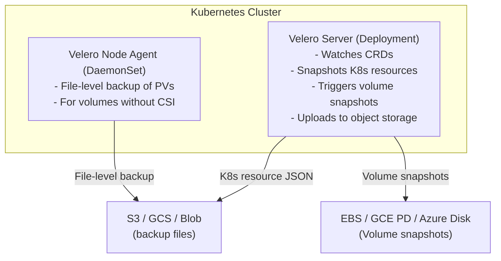
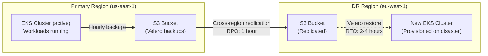
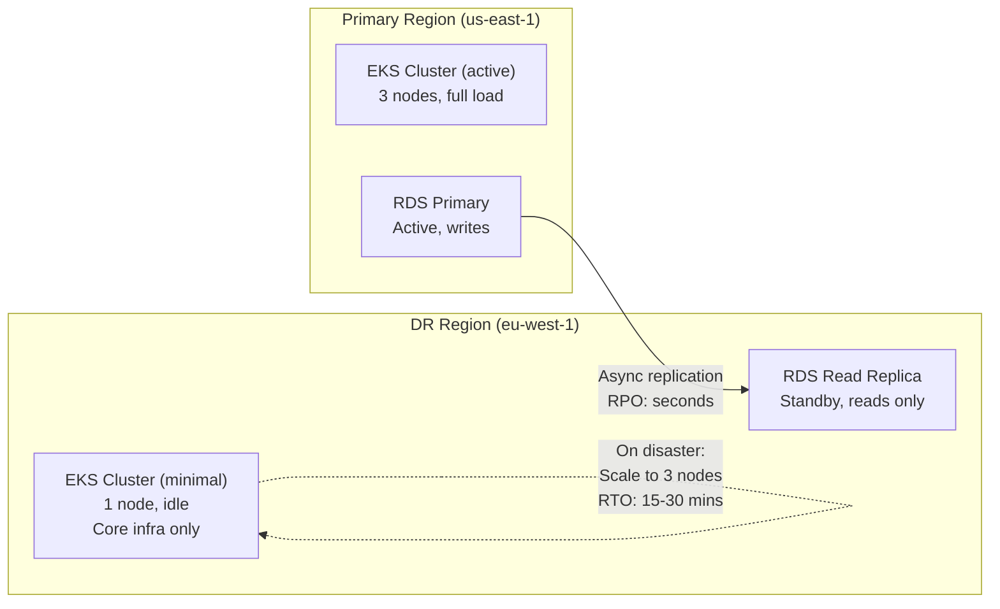
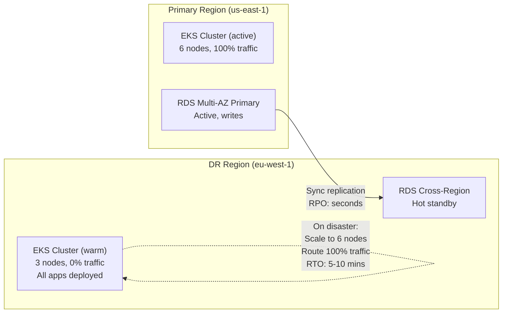
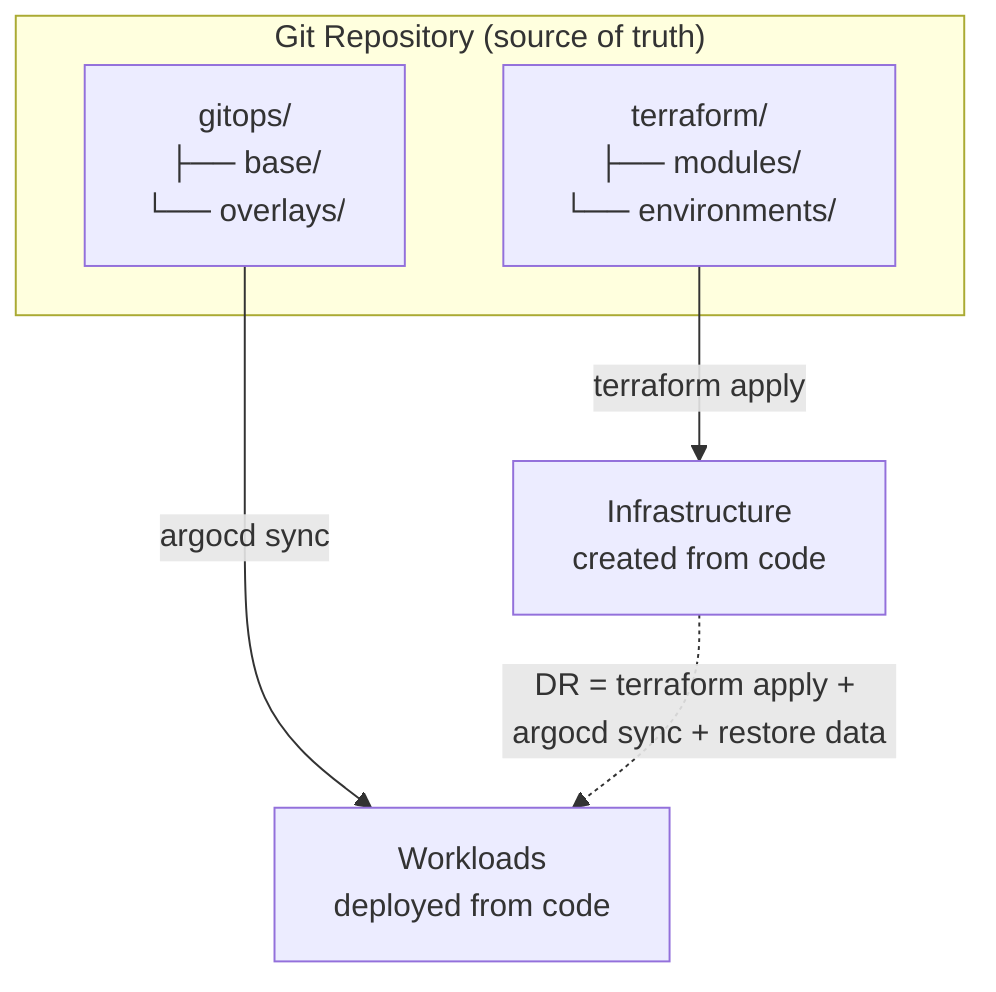

> **Complexity**: `[COMPLEX]`
>
> **Time to Complete**: 2.5 hours
>
> **Prerequisites**: [Module 8.1: Multi-Account Architecture](../module-8.1-multi-account/), experience operating at least one Kubernetes cluster in production
>
> **Track**: Advanced Cloud Operations

## What You'll Be Able to Do

By the end of this module you will translate business continuity requirements into concrete Kubernetes disaster recovery designs: you will define RTO and RPO targets that match real tested recovery times, implement backup paths for both etcd and workload state, replicate critical artifacts across regions, and maintain runbooks your on-call engineers can execute when the primary region is gone. You will also practice explaining trade-offs to non-Kubernetes stakeholders—finance, legal, and product—using the same vocabulary they see in cloud provider DR whitepapers.

Disaster recovery for Kubernetes is not a single tool install; it is a program that combines metrics (RTO/RPO), replication paths (etcd, Velero, databases, registries), traffic management (DNS), and governance (tested runbooks, evidence for auditors). The labs and quizzes here emphasize repeatable procedures over heroics. Every section below maps to at least one learning outcome so you can trace skills to assessments during study or certification prep. Keep a personal checklist of commands you actually ran, not just read—that checklist becomes the seed of your team runbook and evidence that you practiced restore, not only backup, before any audit or customer ever asks for proof.

- **Design disaster recovery architectures for Kubernetes with defined RTO/RPO targets across cloud regions**
- **Implement Velero-based backup and restore strategies for cluster state, persistent volumes, and application data**
- **Configure cross-region replication for etcd snapshots, container images, and persistent storage volumes**
- **Deploy automated DR failover runbooks that validate recovery procedures through regular chaos testing**

---

## Why This Module Matters

The January 2017 GitLab database outage is a cautionary tale that still shapes how platform teams think about backups: a routine maintenance mistake escalated because recovery paths were unclear and had not been exercised under realistic conditions. GitLab's public postmortem documents how the team reached for multiple backup mechanisms during the incident and still struggled to restore production quickly—proof that owning backup tooling is not the same as owning a tested recovery story.

The lesson is not "have backups," because every mature team already has backups on paper. The lesson is that **untested backups are not backups** in any operational sense: they are hope. In Kubernetes the hope breaks faster than on a single VM, because state is fragmented across layers. Your cluster control plane state lives in etcd (or in the managed control plane your cloud vendor operates on your behalf). Application durability lives in databases, PersistentVolumes, object stores, and SaaS dependencies you do not control. Desired-state configuration lives in Git repositories, Helm releases, and GitOps controllers. A credible DR plan names each layer, assigns an RPO and RTO to each, and proves—on a calendar schedule—that you can rebuild or fail over without improvising under fire.

---

## RTO and RPO: The Two Numbers That Define Your DR Strategy

Every disaster recovery plan starts with two numbers, and if you get them wrong every architectural choice that follows will be wrong too. Business stakeholders often speak in qualitative terms ("we need five nines" or "downtime is unacceptable"), but engineering needs quantitative targets you can test. **RPO (Recovery Point Objective)** answers how much data loss is acceptable measured as time: it is the maximum age of data you are willing to lose when you cut over to a secondary site or restore from backup. **RTO (Recovery Time Objective)** answers how long the business can tolerate the service being unavailable: it is the maximum elapsed time from failure detection until restored service passes your health checks. These two metrics are independent—a system can have a tight RPO with a loose RTO (synchronous replication but slow failover automation) or the opposite (frequent snapshots but hours of rebuild work).

The diagram below shows the timeline relationship: backups or replication define how far back in time you might roll (RPO window), while people, automation, and dependencies define how long restoration takes (RTO window). When you negotiate targets with product and compliance teams, always pair each number with the failure mode it assumes (single AZ loss, regional outage, operator error, ransomware) so nobody treats RPO/RTO as magic slogans on a slide.


```mermaid
flowchart LR
    A[Last Backup or Snapshot] -->|RPO: Data Loss Window| B[Disaster Occurs]
    B -->|RTO: Downtime Window| C[Service Restored]
```

In practice you express RPO with backup frequency, replication lag, or synchronous commit boundaries. An RPO of zero means you accept no committed writes that exist only in the failed primary—typically synchronous replication or dual-write patterns with conflict handling. An RPO of one hour means your last durable recovery point may be up to sixty minutes stale, which is common for snapshot schedules. An RPO of twenty-four hours means daily backups are your contract with the business, and everyone must understand that a Friday afternoon disaster could rewind to Thursday night's image.

RTO is expressed as maximum tolerable outage. An RTO near zero pushes you toward active-active designs (covered in [Module 8.6](../module-8.6-active-active/)), where traffic shifts while both regions already run workloads. An RTO of fifteen minutes usually implies warm capacity, rehearsed runbooks, and DNS or traffic management that flips quickly. An RTO of four hours often maps to pilot-light or cold-standby models where you provision or scale infrastructure during the event. An RTO of twenty-four hours may be acceptable for internal platforms if rebuild-from-IaC is automated, but only if stakeholders explicitly accept that window.

### Mapping RTO/RPO to DR Strategies

The AWS disaster recovery whitepaper (linked in Sources) maps classic patterns to these metrics. Use the table as a starting point for cost conversations, not as a substitute for measurement: your actual RTO/RPO come from timed game days, not from the label on the architecture diagram.

| Strategy | RTO | RPO | Cost | Complexity |
|---|---|---|---|---|
| Backup & Restore | 4-24 hours | Hours to days | Low ($) | Low |
| Pilot Light | 30-60 min | Minutes to hours | Medium ($$) | Medium |
| Warm Standby | 5-15 min | Seconds to minutes | High ($$$) | High |
| Active-Active | Near-zero | Near-zero | Very High ($$$$) | Very High |

### Negotiating RTO and RPO With the Business

Platform engineers often receive contradictory guidance: product wants zero downtime while finance refuses always-on DR clusters. Your job is to translate technical options into priced choices. Present the table above as a menu with monthly cost bands and rehearsed recovery times from your last game day, not from vendor marketing slides. When legal mentions compliance, ask which regulation defines the metric—many frameworks care about evidence of tested restore (your runbooks, ticket history, Velero success logs) rather than a specific pattern name.

Document assumptions explicitly: "RPO of one hour assumes Velero hourly schedule plus S3 CRR lag under fifteen minutes" is auditable; "we have backups" is not. Finally, separate **user-facing** RTO (includes DNS TTL and mobile app caching) from **platform** RTO (Kubernetes ready but traffic not yet shifted). Executives experience the larger number.

### When RTO Doesn't Match Reality

A retail company documented an RTO of four hours for their Kubernetes commerce platform, and leadership treated that number as contractual during compliance reviews. During the annual DR exercise the engineering timeline diverged almost immediately from the slide-deck plan. Restoring etcd from snapshot took twenty minutes as modeled, but waiting for worker nodes to rejoin and for the scheduler to place hundreds of pods consumed forty-five minutes instead of the fifteen they had budgeted. Three CustomResourceDefinitions were absent from the backup scope, which burned ninety minutes of detective work before controllers could reconcile operators the platform depended on.

DNS cutover added thirty-five minutes because the new cluster endpoint had not been pre-staged in lower environments. PersistentVolumeClaims failed to bind for an hour because the DR region lacked an equivalent StorageClass name and parameter set. Application health checks failed for two hours while ConfigMaps still aimed database URLs at the failed primary. Finally, load testing to prove the restored cluster could carry production traffic required ninety minutes the runbook had omitted entirely. Total elapsed time reached eleven hours—nearly triple the advertised RTO.

The lesson is procedural as much as technical: **base RTO on measured game-day duration, not on the fastest subsystem in isolation**, then add a safety margin (many teams use 2×) before you publish the number to executives. Each hidden dependency—CRDs, storage classes, DNS TTL, connection strings, capacity tests—is a line item your next runbook revision should name explicitly.

### Game-Day Testing Protocol

Schedule quarterly DR exercises with a written scenario ("primary region unavailable, no operator access to production GitOps repo") and a facilitator who is allowed to inject faults. Time each phase separately: backup freshness check, infrastructure bring-up, Velero restore, database promotion, DNS cutover, and application smoke tests. Record blockers in the same issue tracker you use for production incidents so leadership sees DR work as real engineering, not a checkbox. Rotate participants so kubectl fluency is not trapped in a single senior engineer.

> **Pause and predict**: Your database performs asynchronous replication to a DR region with an average lag of 5 minutes. You also take full database snapshots every 12 hours. If your primary region completely fails and you promote the replica in the DR region, what is your actual RPO? If the replica also fails and you must restore from the last snapshot, how does your RPO change?

When you answer, notice that **effective RPO is the worst of the paths you might actually take during failure**, not the best path on paper. Promotion might give you five minutes of loss, but snapshot restore might give you twelve hours—your incident commander chooses between them based on what survived. Document both numbers in the architecture record so nobody quotes only the optimistic figure.

---

## etcd Backup and Restore

For self-managed Kubernetes clusters (kubeadm, kOps, Rancher), etcd is the single source of truth for every namespaced object, cluster-scoped resource, and the metadata that ties workloads together. Lose etcd without a restorable snapshot and you do not have a cluster—you have orphaned nodes and PersistentVolumes that no longer map to API objects anyone can reconcile. Managed offerings (EKS, GKE, AKS) hide etcd from you, which is why the Velero section later focuses on API-level backups instead of snapshotting control plane files on disk.

Even when you operate etcd yourself, remember that etcd backup captures **Kubernetes object state**, not necessarily the bytes inside every database file. Pair etcd snapshots with application-consistent database backups or volume snapshots so your RPO for customer data matches what stakeholders expect. The commands below follow the upstream Kubernetes etcd administration guidance: snapshot to local disk, verify integrity, then copy off-site with encryption so a single-region fire does not destroy both live data and recovery artifacts.

### What etcd Backup Does Not Capture

etcd knows about PersistentVolumeClaim objects, not the bits on disk behind them. Secrets in etcd are base64-encoded in the API, but external-secrets references, cloud KMS keys, and sealed-secrets controllers may still require separate recovery steps. Node objects, kubelet configuration, and OS-level tuning on workers are also outside etcd. Maintain an inventory of "cluster-adjacent" systems—container registry credentials, CSI driver installations, CNI DaemonSets, ingress controllers—and verify each appears either in etcd backups (as API objects) or in your IaC/GitOps layers before you sign an RPO statement.

### etcd Snapshot Backup

```bash
# Take a snapshot of etcd (run on a control plane node)
ETCDCTL_API=3 etcdctl snapshot save /var/backups/etcd/snapshot-$(date +%Y%m%d-%H%M%S).db \
  --endpoints=https://127.0.0.1:2379 \
  --cacert=/etc/kubernetes/pki/etcd/ca.crt \
  --cert=/etc/kubernetes/pki/etcd/server.crt \
  --key=/etc/kubernetes/pki/etcd/server.key

# Verify the snapshot
ETCDCTL_API=3 etcdctl snapshot status /var/backups/etcd/snapshot-20260324-100000.db \
  --write-out=table

# Expected output:
# +----------+----------+------------+------------+
# |   HASH   | REVISION | TOTAL KEYS | TOTAL SIZE |
# +----------+----------+------------+------------+
# | 3e6d0a12 | 15284032 |      12847 |    42 MB   |
# +----------+----------+------------+------------+

# Upload to S3 for off-site storage
aws s3 cp /var/backups/etcd/snapshot-20260324-100000.db \
  s3://company-etcd-backups/prod-cluster/$(date +%Y/%m/%d)/ \
  --sse aws:kms \
  --sse-kms-key-id alias/etcd-backup-key
```

Treat the verification step as mandatory: `etcdctl snapshot status` confirms the file is readable before you upload it. Automate uploads with object-lock or versioning on the bucket so a malicious actor or confused operator cannot silently delete the only viable snapshot during a ransomware event. Document which control plane node ran the backup and which certificate paths were used, because restore drills fail when on-call engineers cannot reproduce the TLS context under stress.

### Automated etcd Backup with CronJob

```yaml
# For self-managed clusters, run etcd backup as a CronJob
apiVersion: batch/v1
kind: CronJob
metadata:
  name: etcd-backup
  namespace: kube-system
spec:
  schedule: "0 */4 * * *"  # Every 4 hours
  concurrencyPolicy: Forbid
  successfulJobsHistoryLimit: 3
  failedJobsHistoryLimit: 3
  jobTemplate:
    spec:
      template:
        spec:
          nodeName: control-plane-1  # Pin to control plane
          hostNetwork: true
          tolerations:
            - key: node-role.kubernetes.io/control-plane
              effect: NoSchedule
          containers:
            - name: etcd-backup
              image: registry.k8s.io/etcd:3.5.16-0
              command:
                - /bin/sh
                - -c
                - |
                  set -e
                  BACKUP_FILE="/backups/snapshot-$(date +%Y%m%d-%H%M%S).db"
                  etcdctl snapshot save "$BACKUP_FILE" \
                    --endpoints=https://127.0.0.1:2379 \
                    --cacert=/etc/kubernetes/pki/etcd/ca.crt \
                    --cert=/etc/kubernetes/pki/etcd/server.crt \
                    --key=/etc/kubernetes/pki/etcd/server.key
                  etcdctl snapshot status "$BACKUP_FILE" --write-out=json
                  echo "Backup complete: $BACKUP_FILE"
                  # Upload to S3 (requires aws-cli)
                  aws s3 cp "$BACKUP_FILE" \
                    "s3://etcd-backups/prod/$(date +%Y/%m/%d)/" \
                    --sse aws:kms
                  # Retain only last 7 days locally
                  find /backups -name "*.db" -mtime +7 -delete
              volumeMounts:
                - name: etcd-certs
                  mountPath: /etc/kubernetes/pki/etcd
                  readOnly: true
                - name: backup-dir
                  mountPath: /backups
          volumes:
            - name: etcd-certs
              hostPath:
                path: /etc/kubernetes/pki/etcd
            - name: backup-dir
              hostPath:
                path: /var/backups/etcd
          restartPolicy: OnFailure
```

Scheduling etcd backup as a CronJob keeps humans out of the critical path, but pin the Job to a control plane node with hostPath access to PKI material and validate RBAC so only the backup ServiceAccount can read etcd certificates. Retain a small number of successful Job histories for auditing, and alert when backups age beyond your stated RPO. In multi-control-plane clusters, coordinate so you do not snapshot concurrently from every member unless your runbook explicitly calls for that pattern.

If your organization runs etcd on three control plane nodes, clarify in documentation which member's snapshot you treat as canonical and how you restore multi-member quorum after disaster. Restoring a snapshot onto a single member differs from rebuilding a three-node cluster with join workflows; follow your distribution's disaster recovery guide literally rather than mixing kubeadm and vendor-specific steps from different blog posts.

### etcd Restore Procedure

```bash
# Stop all control plane components
systemctl stop kubelet

# Restore from snapshot
ETCDCTL_API=3 etcdctl snapshot restore /var/backups/etcd/snapshot-20260324-100000.db \
  --name etcd-member-1 \
  --data-dir=/var/lib/etcd-restored \
  --initial-cluster="etcd-member-1=https://10.0.1.10:2380" \
  --initial-cluster-token=etcd-cluster-restored \
  --initial-advertise-peer-urls=https://10.0.1.10:2380

# Replace the data directory
mv /var/lib/etcd /var/lib/etcd-old
mv /var/lib/etcd-restored /var/lib/etcd

# Restart kubelet (which starts etcd and other control plane components)
systemctl start kubelet

# Verify the cluster is healthy
kubectl get nodes
kubectl get pods -A
```

Restore is a controlled outage: stop kubelet, restore data directories with matching member name and initial cluster token, then bring components back in the order your distribution documents. Capture before-and-after `etcdctl endpoint health` output in the ticket so future reviewers can see whether quorum was healthy before you declared the incident resolved. Expect controllers to churn while they reconcile Deployments and StatefulSets against etcd state that may be hours old—communicate that window to application owners before you declare victory. Always rehearse restore on an isolated control plane first; overwriting production etcd paths without a snapshot of the current broken state removes your ability to roll back a mistaken restore command.

---

## Velero: Kubernetes-Native Backup and Restore

For managed Kubernetes (EKS, GKE, AKS) where you do not manage etcd directly, Velero is the de facto standard for capturing Kubernetes resources and coordinating volume snapshots through cloud APIs. Velero watches API objects, serializes them to object storage, and optionally triggers EBS/GCE PD/Azure Disk snapshots so PersistentVolume data moves in parallel with manifests. The node agent DaemonSet covers file-system backups when CSI snapshotting is unavailable, which is slower but sometimes the only portable option across on-prem clusters.


```mermaid
flowchart TD
    subgraph K8s["Kubernetes Cluster"]
        VS["Velero Server (Deployment)<br/>- Watches CRDs<br/>- Snapshots K8s resources<br/>- Triggers volume snapshots<br/>- Uploads to object storage"]
        VNA["Velero Node Agent (DaemonSet)<br/>- File-level backup of PVs<br/>- For volumes without CSI"]
    end
    
    OS["S3 / GCS / Blob<br/>(backup files)"]
    VSnap["EBS / GCE PD / Azure Disk<br/>(Volume snapshots)"]
    
    VS -->|K8s resource JSON| OS
    VS -->|Volume snapshots| VSnap
    VNA -->|File-level backup| OS
```

Think of Velero as two cooperating pipelines: the server component streams API objects to durable object storage, while snapshot integrations (or the node agent) capture disk state. Backups are namespaced or cluster-scoped collections you can schedule; restores are new custom resources that replay those collections into a target cluster, optionally remapping namespaces for blue/green drills. Because restores recreate Services, Ingresses, and PVCs, your DR cluster must already expose the same storage classes, ingress classes, and external secrets machinery production relies on—otherwise pods will schedule while remaining unreachable.

### Choosing Backup Scope

Before creating schedules, inventory namespaces by criticality and data mutability. System namespaces (`kube-system`, `velero`, monitoring stacks) change rarely but are required for platform function; application namespaces change constantly and drive revenue. Some teams back up entire clusters weekly for disaster scenarios while snapshotting payment namespaces hourly. Label selectors (`tier=critical`) let you add new workloads without editing schedule objects every sprint. Whatever scope you choose, document excluded namespaces explicitly—ephemeral CI namespaces do not need S3 spend, but skipping a namespace with a StatefulSet is how RPO silently becomes "never."

### Installing Velero

```bash
# Install Velero CLI
brew install velero

# Install Velero in the cluster (AWS example with EBS snapshots)
velero install \
  --provider aws \
  --plugins velero/velero-plugin-for-aws:v1.12.0 \
  --bucket velero-backups-prod \
  --backup-location-config region=us-east-1 \
  --snapshot-location-config region=us-east-1 \
  --secret-file ./velero-credentials \
  --use-node-agent \
  --default-volumes-to-fs-backup=false

# Verify installation
velero version
kubectl get pods -n velero
```

Install with credentials scoped to a dedicated backup bucket, separate from application data buckets, and enable encryption at rest plus cross-region replication on that bucket before you declare the system production-ready. The plugin version must match your Velero server version; mismatched pairs fail in ways that look like cloud permission errors. After install, run a small namespace backup and restore in a sandbox cluster to validate object storage connectivity before you attach schedules to production namespaces.

On EKS, confirm the Velero service account can call EC2 APIs for volume snapshots in both primary and DR regions; on GKE and AKS the equivalent snapshot APIs differ but the pattern is the same—Velero is only a coordinator. Store IAM policy ARNs in your runbook so incident commanders are not guessing which role to attach under pressure.

### Backup Strategies

```bash
# Full cluster backup
velero backup create full-backup-20260324 \
  --include-cluster-resources=true \
  --snapshot-volumes=true \
  --ttl 720h  # Retain for 30 days

# Namespace-level backup (for team-specific DR)
velero backup create payments-backup-20260324 \
  --include-namespaces payments \
  --snapshot-volumes=true \
  --ttl 2160h  # Retain for 90 days

# Scheduled backups
velero schedule create daily-full \
  --schedule="0 2 * * *" \
  --include-cluster-resources=true \
  --snapshot-volumes=true \
  --ttl 720h

velero schedule create hourly-critical \
  --schedule="0 * * * *" \
  --include-namespaces payments,orders,inventory \
  --snapshot-volumes=true \
  --ttl 168h  # Retain for 7 days

# Label-based backup (only backup PCI workloads)
velero backup create pci-backup-20260324 \
  --selector compliance=pci \
  --snapshot-volumes=true \
  --ttl 8760h  # Retain for 1 year (compliance)

# Check backup status
velero backup describe full-backup-20260324
velero backup logs full-backup-20260324
```

Layer schedules intentionally: a daily full cluster backup provides breadth, hourly namespace backups tighten RPO for revenue paths, and label selectors (for example `compliance=pci`) satisfy retention policies without copying every ephemeral sandbox. Always pass `--include-cluster-resources=true` when you need CRDs, ClusterRoles, and StorageClasses, and verify `--snapshot-volumes=true` when databases rely on PVs rather than external managed services. Inspect `velero backup describe` after each run; partial failures are common when a single VolumeSnapshot times out, and silent partials are how teams discover too late that one StatefulSet never made it off-site.

### Restore Procedures

```bash
# Restore entire cluster to a new cluster
velero restore create full-restore \
  --from-backup full-backup-20260324

# Restore specific namespace only
velero restore create payments-restore \
  --from-backup full-backup-20260324 \
  --include-namespaces payments

# Restore with namespace mapping (restore to different namespace)
velero restore create payments-dr-test \
  --from-backup full-backup-20260324 \
  --include-namespaces payments \
  --namespace-mappings payments:payments-dr-test

# Restore excluding certain resources (e.g., keep existing services)
velero restore create selective-restore \
  --from-backup full-backup-20260324 \
  --include-namespaces payments \
  --exclude-resources services,ingresses

# Monitor restore progress
velero restore describe full-restore
velero restore logs full-restore
```

Monitor restores the same way you monitor backups: `velero restore describe` shows phase and warnings, and logs expose admission webhook denials or resource version conflicts when DR clusters run newer Kubernetes minor versions than the backup source. Namespace mapping is invaluable for quarterly drills because it lets you restore `payments` into `payments-dr-test` without touching production Services. When you exclude Services or Ingresses deliberately, document why—usually to keep a shared ingress controller or external load balancer that already exists in DR.

> **Stop and think**: You just ran a Velero restore of a critical namespace to a new cluster. The pods are starting, but they are all stuck in `Pending` state. The persistent volume claims (PVCs) remain unbound. What Kubernetes resource did you likely forget to include in your backup or pre-create in the new cluster, and how would you fix it?

---

## Cross-Region Replication for DR

Backups are useless if they are destroyed in the same regional outage that took down your cluster, which is why mature DR programs treat object storage, container registries, and database replicas as first-class replication problems—not optional extras after Velero is installed. Cross-region replication adds cost and operational surface area, but it converts "we hope S3 durably stores bits" into "we can still read last night's backups when `us-east-1` is red on the status page." Measure replication lag with the same discipline you measure database lag, because Velero's RPO is bounded by how quickly backup objects appear in the DR bucket.

### Container Image Replication

During a disaster you must pull container images into the DR cluster before Deployments can become Ready. If your primary registry (for example ECR in `us-east-1`) is unreachable, every restored Pod stalls in `ImagePullBackOff` while the clock on your RTO keeps moving. Configure registry replication or maintain a hot mirror in the DR region, and document which image digests production pinned so you are not surprised by a `:latest` tag that moved during the outage.

```bash
# AWS ECR Cross-Region Replication Example
aws ecr put-registry-scanning-configuration \
  --scan-type ENHANCED

aws ecr put-registry-policy \
  --policy-text file://registry-policy.json

aws ecr put-replication-configuration \
  --replication-configuration '{ "rules": [ { "destinations": [ { "region": "eu-west-1", "registryId": "123456789012" } ] } ] }'
```

Registry replication policies should be tested by deliberately deploying a Pod in the DR region that references only the mirrored repository path, proving IAM roles and repository policies allow pulls without relying on primary-region VPC endpoints. Include image promotion pipelines in DR exercises: if your pipeline fails to push to the DR registry during normal operations, it will not magically work during an incident.

### Persistent Volume Replication

While Velero can copy volume data into S3, file-level backup is slow for multi-terabyte databases and may not guarantee crash-consistent pages unless you quiesce applications or use native volume snapshots. For critical StatefulSets, prefer storage-level replication—EBS snapshots replicated cross-region, or CSI VolumeReplication when your driver supports it—so promotion in DR is a storage operation with a clear RPO rather than a lengthy restore job.

```yaml
# Example: CSI VolumeReplication CRD (requires replication-capable CSI driver)
apiVersion: replication.storage.openshift.io/v1alpha1
kind: VolumeReplication
metadata:
  name: prod-db-replication
  namespace: data
spec:
  volumeSnapshotClass: ebs-csi-snapclass
  replicationState: primary
  replicationSecretName: ebs-replication-secret
```

Coordinate volume replication with application hooks: quiesce writers or use database-native replication for the authoritative dataset, and treat Kubernetes PV replication as a convenience layer for files—not a substitute for Postgres or MySQL HA unless you have tested crash consistency end to end.

### Monitoring Replication Lag

Publish dashboards for S3 replication time, database replica lag, and Velero `backup_last_successful_timestamp` per schedule. Alert when lag exceeds half your stated RPO so you fix replication before disaster strikes. During incidents, operators should glance at the same panels before promoting replicas—promoting a replica that is hours behind primary converts a regional outage into a data-loss event. Include replication health in executive summaries during monthly reliability reviews so funding for DR capacity is tied to measurable signals, not fear alone.

## DR Patterns for Kubernetes

Choosing a DR pattern is a budget conversation disguised as an architecture decision. Cold strategies minimize steady-state spend but maximize adrenaline during the incident; warm and pilot-light strategies spend continuously on smaller footprints in the DR region so failover becomes scaling and promotion rather than greenfield provisioning. Active-active spends the most but buys the tightest RTO/RPO. The diagrams below mirror the AWS disaster recovery pattern names; align each with your measured recovery times rather than aspirational labels.

### Pattern 1: Backup & Restore (Cold DR)


```mermaid
flowchart LR
    subgraph Primary["Primary Region (us-east-1)"]
        EKS_P["EKS Cluster (active)<br/>Workloads running"]
        S3_P["S3 Bucket<br/>(Velero backups)"]
        EKS_P -->|Hourly backups| S3_P
    end
    
    subgraph DR["DR Region (eu-west-1)"]
        EKS_D["New EKS Cluster<br/>(Provisioned on disaster)"]
        S3_D["S3 Bucket<br/>(Replicated)"]
        S3_D -.->|Velero restore<br/>RTO: 2-4 hours| EKS_D
    end
    
    S3_P -->|Cross-region replication<br/>RPO: 1 hour| S3_D
```

In backup-and-restore, production runs hot in the primary region while Velero (and database backups) land in replicated object storage. When disaster strikes, you provision a fresh cluster in DR—often via Terraform modules you maintain in parallel—and restore Kubernetes objects plus data snapshots into that greenfield environment. **Cost** stays lowest because you are not paying for idle compute in DR, only for storage and replication. **Risk** is the longest RTO: every minute of Terraform apply, Velero restore, and database hydration happens while stakeholders watch status pages. This pattern fits internal tools or workloads with explicit multi-hour RTO acceptance.

Capacity planning still matters in cold DR: verify DR region quotas for EC2, EIPs, and API rate limits before disaster, because Terraform apply failures due to quota exhaustion are indistinguishable from skill failures to executives watching the bridge line.

### Pattern 2: Pilot Light


```mermaid
flowchart LR
    subgraph Primary["Primary Region (us-east-1)"]
        EKS_P["EKS Cluster (active)<br/>3 nodes, full load"]
        RDS_P["RDS Primary<br/>Active, writes"]
    end
    
    subgraph DR["DR Region (eu-west-1)"]
        EKS_D["EKS Cluster (minimal)<br/>1 node, idle<br/>Core infra only"]
        RDS_D["RDS Read Replica<br/>Standby, reads only"]
    end
    
    RDS_P -->|Async replication<br/>RPO: seconds| RDS_D
    EKS_D -.->|On disaster:<br/>Scale to 3 nodes<br/>RTO: 15-30 mins| EKS_D
```

Pilot light keeps a **minimal** EKS footprint in DR—often one node running core platform services (ingress controllers, GitOps, monitoring) plus a database read replica receiving asynchronous replication from primary. Data is therefore fresher than snapshot-only cold DR, and failover becomes "scale node groups, promote replica, repoint DNS" instead of "stand up everything from zero." Steady-state cost is moderate because you pay for small always-on compute and replication bandwidth. RTO commonly lands in the fifteen-to-thirty-minute range if runbooks are rehearsed, which is why regulated retail and payments teams often stop here before attempting full active-active complexity.

### Pattern 3: Warm Standby


```mermaid
flowchart LR
    subgraph Primary["Primary Region (us-east-1)"]
        EKS_P["EKS Cluster (active)<br/>6 nodes, 100% traffic"]
        RDS_P["RDS Multi-AZ Primary<br/>Active, writes"]
    end
    
    subgraph DR["DR Region (eu-west-1)"]
        EKS_D["EKS Cluster (warm)<br/>3 nodes, 0% traffic<br/>All apps deployed"]
        RDS_D["RDS Cross-Region<br/>Hot standby"]
    end
    
    RDS_P -->|Sync replication<br/>RPO: seconds| RDS_D
    EKS_D -.->|On disaster:<br/>Scale to 6 nodes<br/>Route 100% traffic<br/>RTO: 5-10 mins| EKS_D
```

Warm standby deploys the full application chart in DR at reduced scale—every Deployment exists, probes run, and database replicas stay hot even while production traffic stays in primary. On failover you scale node groups to production sizes, promote the database, and swing traffic via DNS or global load balancing. Steady-state cost is higher because DR runs real pods continuously, but RTO can reach five to ten minutes when health checks and autoscaling policies are pre-tuned. Choose this pattern when executives reject cold DR timelines but will not fund active-active complexity.

### Combining Patterns in Practice

Large enterprises rarely pick a single pattern globally. Payments might run warm standby while internal analytics stays cold backup-and-restore. GitOps control planes might live pilot-light in DR so ArgoCD is already running before you restore application namespaces. Document these hybrids on architecture diagrams per product line to avoid the anti-pattern of "we are active-active" while only DNS health checks have been tested. The guiding question is always: **for this workload, what is the cost of one additional minute of downtime versus one additional always-on pod?**

---

## DNS Failover

DNS is the traffic director in any DR scenario: even perfect Kubernetes recovery fails the business if clients still resolve the primary region's load balancer. How you configure health-checked failover and TTL determines whether users glide to DR or stare at connection timeouts while cached records expire. Treat DNS as part of your RTO budget, not as an instantaneous flip.

### Route53 Health Check + Failover

```bash
# Create health check for primary region
PRIMARY_HC=$(aws route53 create-health-check \
  --caller-reference "primary-$(date +%s)" \
  --health-check-config '{
    "Type": "HTTPS",
    "ResourcePath": "/healthz",
    "FullyQualifiedDomainName": "primary.api.example.com",
    "Port": 443,
    "RequestInterval": 10,
    "FailureThreshold": 3,
    "MeasureLatency": true,
    "Regions": ["us-east-1", "eu-west-1", "ap-southeast-1"]
  }' \
  --query 'HealthCheck.Id' --output text)

# Create failover routing policy
aws route53 change-resource-record-sets \
  --hosted-zone-id Z1234567890 \
  --change-batch '{
    "Changes": [
      {
        "Action": "CREATE",
        "ResourceRecordSet": {
          "Name": "api.example.com",
          "Type": "A",
          "SetIdentifier": "primary",
          "Failover": "PRIMARY",
          "AliasTarget": {
            "HostedZoneId": "Z2FDTNDATAQYW2",
            "DNSName": "primary-nlb.elb.us-east-1.amazonaws.com",
            "EvaluateTargetHealth": true
          },
          "HealthCheckId": "'$PRIMARY_HC'"
        }
      },
      {
        "Action": "CREATE",
        "ResourceRecordSet": {
          "Name": "api.example.com",
          "Type": "A",
          "SetIdentifier": "secondary",
          "Failover": "SECONDARY",
          "AliasTarget": {
            "HostedZoneId": "Z3AADJGX6KTTL2",
            "DNSName": "dr-nlb.elb.eu-west-1.amazonaws.com",
            "EvaluateTargetHealth": true
          }
        }
      }
    ]
  }'
```

Route53 failover pairs a primary record with a secondary record and evaluates health checks from multiple vantage regions before marking the primary unhealthy. Alias targets to NLBs let AWS health checks reflect load balancer readiness, which is closer to user-observable failure than probing a single Pod. Document the exact CLI or infrastructure-as-code change set required to fail back after primary recovery, because failback is often harder than failover—clients may stick to DR until TTLs expire unless you plan asymmetric routing carefully.

### DNS TTL Considerations

The table below walks through a realistic timeline when health checks run every ten seconds and three consecutive failures trigger failover. Notice the gap between "DNS starts returning DR" and "all clients have moved": stale caches obey the TTL you published days earlier, not your incident urgency.

| Time | Event |
|---|---|
| **T+0s** | Health check fails (3 consecutive failures at 10s interval = 30s) |
| **T+30s** | Route53 marks primary unhealthy |
| **T+30s** | Route53 starts returning DR IP for new DNS queries |
| **T+30s** | Clients with EXPIRED DNS cache get DR IP immediately |
| **T+60-300s**| Clients with CACHED DNS still hit primary (depends on TTL) |

With **TTL=60s**, most resolvers pick up the DR address within about ninety seconds after Route53 flips, which is why DR-critical records commonly use sixty-second TTL even though query volume increases slightly. With **TTL=300s**, a subset of clients can remain pinned to the failed primary for more than five minutes after health checks already declared disaster, inflating measured RTO without any Kubernetes component being slow.

**Recommendation:** set TTL=60s on user-facing failover records you might need during regional disasters, accept the marginal query cost, and avoid chasing TTLs below thirty seconds because many recursive resolvers clamp caching behavior anyway. Combine low TTL with pre-warmed DR endpoints so the first new query succeeds instead of hitting a cold load balancer.

Some teams pair DNS failover with anycast or global load balancers so health checks happen closer to users; Kubernetes remains the system of record for pods, but traffic engineering owns the first hop. Regardless of vendor, rehearse both automated failover (health check driven) and manual break-glass (runbook-driven record change) so you are not discovering permission errors when Route53 is the only path left.

---

## IaC as Disaster Recovery

The most powerful DR strategy for Kubernetes is often the simplest on paper: **your entire infrastructure is defined in code, tested regularly, and can be recreated from scratch**—then hydrated with replicated data. Terraform (or equivalent) provisions networks, clusters, and managed databases; GitOps controllers reapply manifests that already passed production review; Velero or storage promotion supplies the bits that Git cannot recreate. DR becomes a rehearsed pipeline instead of a heroic all-nighter.


```mermaid
flowchart TD
    subgraph Git["Git Repository (source of truth)"]
        TF["terraform/<br/>├── modules/<br/>└── environments/"]
        GO["gitops/<br/>├── base/<br/>└── overlays/"]
    end
    
    Infra["Infrastructure<br/>created from code"]
    Apps["Workloads<br/>deployed from code"]
    
    TF -->|terraform apply| Infra
    GO -->|argocd sync| Apps
    
    Infra -.->|DR = terraform apply + argocd sync + restore data| Apps
```

The diagram highlights separation of concerns: infrastructure modules establish VPCs, clusters, and IAM; GitOps repos declare workload shape; backup systems supply stateful data. During normal operations, drift detection keeps these layers aligned. During DR, you execute the same pipelines against the DR region variable set, which is why duplicating environment folders (`us-east-1` vs `eu-west-1`) with only region-specific inputs prevents copy-paste errors when adrenaline is high.

### GitOps During DR

ArgoCD (or Flux) should already track the same branch production uses; DR is not the time to invent a new overlay unless you maintain it monthly. Freeze auto-sync policies during failover only if you must prevent pruning of temporary DR resources—otherwise let GitOps reconcile desired state while Velero supplies PVCs and Secrets that are not in Git. Validate that image tags in DR overlays point at replicated registries, and that AppProjects allow namespaces you plan to restore. A common failure mode is ArgoCD denying resources because the DR cluster's project rules still reference old cluster API server URLs.

### DR Terraform Module

```hcl
# environments/eu-west-1/main.tf (DR region)
# Same modules as production, different variables

module "networking" {
  source = "../../modules/networking"

  region     = "eu-west-1"
  cidr_block = "10.1.0.0/16"
  azs        = ["eu-west-1a", "eu-west-1b", "eu-west-1c"]

  # DR: same structure, different region
  enable_nat_gateway = var.dr_active  # Only create NAT GW when DR is active
}

module "eks" {
  source = "../../modules/eks-cluster"

  cluster_name    = "prod-dr"
  cluster_version = "1.35"
  vpc_id          = module.networking.vpc_id
  subnet_ids      = module.networking.private_subnet_ids

  # DR: start small, scale up during failover
  node_groups = {
    general = {
      desired_size = var.dr_active ? 6 : 1
      min_size     = var.dr_active ? 3 : 1
      max_size     = 12
      instance_types = ["m7i.xlarge"]
    }
  }
}

module "database" {
  source = "../../modules/databases"

  # DR: cross-region read replica that can be promoted
  create_primary       = false
  create_read_replica  = true
  source_db_arn        = var.primary_rds_arn
  promote_on_failover  = var.dr_active
}

variable "dr_active" {
  description = "Set to true during DR failover to scale up resources"
  type        = bool
  default     = false
}
```

The Terraform excerpt shows how a single boolean (`dr_active`) gates expensive resources: NAT gateways, larger node groups, and database promotion hooks. Keeping DR inexpensive while idle prevents finance from vetoing the entire program, while still letting operators flip one variable during incidents. Mirror production module versions exactly—drift between regions is how you discover incompatible launch templates or instance types only when us-east-1 is gone.

```bash
# DR failover procedure
# Step 1: Activate DR infrastructure
cd terraform/environments/eu-west-1
terraform apply -var="dr_active=true" -auto-approve

# Step 2: Promote database replica
aws rds promote-read-replica \
  --db-instance-identifier prod-dr-replica

# Step 3: Update kubeconfig for DR cluster
aws eks update-kubeconfig --name prod-dr --region eu-west-1

# Step 4: Trigger ArgoCD sync (if not auto-syncing)
argocd app sync --all --prune

# Step 5: Verify workloads
kubectl get pods -A | grep -v Running | grep -v Completed

# Step 6: Switch DNS
aws route53 change-resource-record-sets \
  --hosted-zone-id Z1234567890 \
  --change-batch file://failover-dns.json

# Step 7: Monitor
kubectl top nodes
kubectl top pods -A --sort-by=cpu
```

The seven-step shell script is the human-readable spine of your runbook: flip `dr_active` to scale node groups and NAT gateways, promote the read replica, point `kubectl` at the DR cluster, sync GitOps, verify workloads, then change DNS. Practice it quarterly with a fictional "primary region unavailable" inject so each owner knows which step they own. ArgoCD sync errors during DR usually mean DR lacks a secret store integration or private registry path that production had—fix those gaps during game days, not during Sev-1 calls.

### Secrets, TLS, and External Dependencies

Velero restores Secret objects, but Secrets are only as good as the keys they reference. Document how to restore sealed-secrets controller keys, cert-manager ClusterIssuers, and cloud KMS grants in DR accounts before you need them. Likewise list external SaaS webhooks, payment gateways, and fraud APIs—Kubernetes may be healthy while partners still block DR region IP ranges you never tested. A fifteen-minute tabletop exercise with vendor contacts often saves hours during real incidents.

---

## Did You Know?

1. **Velero was originally called "Heptio Ark"** and was created by the team at Heptio (founded by two of Kubernetes' co-creators, Joe Beda and Craig McLuckie). When VMware acquired Heptio in 2018, the project was renamed to Velero (Latin for "sail") and donated to the CNCF. It is now the de facto standard for Kubernetes backup, with over 8,000 GitHub stars and production use at thousands of organizations—worth mentioning when stakeholders ask whether Velero is "yet another backup tool."

2. **etcd can handle a cluster state restore in under 60 seconds** for a typical cluster with 10,000-15,000 objects, but the bottleneck is not the restore itself—it is controller reconciliation afterward. The kube-controller-manager must re-evaluate every ReplicaSet, Deployment, and StatefulSet, which can take several minutes for large clusters, and during that window some pods may be temporarily evicted and rescheduled. Plan maintenance windows and communications around that reconciliation storm, not just the snapshot duration.

3. **AWS S3 Cross-Region Replication advertises a 99.99% SLA for replication within 15 minutes,** yet many objects replicate in under thirty seconds under normal conditions. That still matters for Velero: if your primary region fails immediately after a backup completes, backup objects may not yet exist in the DR bucket. For tight RPO requirements, enable S3 Replication Time Control (RTC), which provides a contractual replication time window you can cite to auditors.

4. **The GitLab 2017 data loss incident** was live-streamed on YouTube while engineers attempted recovery in real time, including moments when expected backup paths did not pan out. The recording became one of the most-watched incident response videos in tech and pushed many organizations to schedule restore tests. GitLab's published postmortem remains a template for honest incident documentation—pair it with your own game-day reports so lessons stay institutional rather than heroic.

---

## Common Mistakes

The table below collects failure modes platform teams rediscover during their first real regional failover or annual DR test. None of these are exotic edge cases—they are the predictable gap between "we installed Velero" and "we can restore revenue traffic in the time we promised legal."

| Mistake | Why It Happens | How to Fix It |
|---|---|---|
| Never testing restores | "We have backups, that's enough" | Schedule quarterly DR tests. Restore to a separate namespace or cluster. Verify data integrity. If you haven't tested it, it doesn't work. |
| Backing up K8s resources but not PersistentVolumes | Velero defaults to resource-only backup | Explicitly enable `--snapshot-volumes=true` or `--default-volumes-to-fs-backup=true`. Verify PV data after restore. |
| Setting unrealistic RTO/RPO without testing | Business says "4 hours" without engineering input | Run a DR test, measure actual recovery time, report to business. Then set RTO = tested_time x 2. |
| Storing backups in the same region as the cluster | "S3 is durable enough" | Enable cross-region replication. If the region fails, your backups are inaccessible. |
| Forgetting CRDs and cluster-scoped resources in backups | Velero includes them but some custom configs are missed | Use `--include-cluster-resources=true`. Also back up your Helm releases, ArgoCD applications, and external secrets separately. |
| No runbook for DR procedures | "We'll figure it out during the incident" | Write step-by-step runbooks. Include exact commands, expected outputs, and decision points. Store in a location accessible when your primary infra is down (not in a wiki hosted on the same cluster). |
| Ignoring DNS TTL in RTO calculations | "DNS is instant" | DNS propagation with a 300s TTL adds up to 5 minutes to your RTO. Set DR-critical records to 60s TTL. |
| Not backing up secrets and config maps separately | "They're in the cluster backup" | External Secrets Operator configs, sealed secrets keys, and TLS certificates need special handling. Verify they're included and restorable. |

Treat this table as a pre-flight checklist before you sign any DR attestation for auditors. Pick the top three rows your organization has actually experienced in the last year—those deserve runbook steps this quarter, not "someday" backlog items.

---

## Quiz

The questions below connect RTO/RPO decisions to Kubernetes tooling choices. Read each scenario, formulate your answer, then expand the details block to compare with the suggested response. If your answer differs, trace whether the gap is technical (missing backup scope) or procedural (untested runbook).

<details>
<summary>1. You are meeting with the VP of Engineering to define the DR strategy for a new payment processing system. They state, "We cannot afford to lose a single transaction, but if the system goes down, we have 4 hours to bring it back online before we face compliance fines." How would you translate this into RTO and RPO metrics, and how do these two metrics influence your architectural choices for this system?</summary>

The VP's requirements translate to an RPO (Recovery Point Objective) of zero and an RTO (Recovery Time Objective) of 4 hours. RPO dictates how much data you can afford to lose; an RPO of zero means you cannot rely on periodic backups and must implement synchronous replication across regions so data is committed in both places simultaneously before acknowledging the transaction. RTO dictates how long the system can be unavailable; an RTO of 4 hours means you do not need the expense of an active-active or warm standby setup. You can use a 'Pilot Light' or even a automated 'Backup & Restore' infrastructure provisioning process, as long as the data itself is synchronously replicated and protected.
</details>

<details>
<summary>2. Your team manages three Kubernetes clusters: a self-hosted kubeadm cluster on bare metal, and two managed EKS clusters. You need to implement a backup strategy that captures the cluster state and persistent application data across all three. How would your approach differ between the bare-metal and managed clusters, and why?</summary>

For the self-hosted kubeadm cluster, you should utilize etcd snapshots to capture the entire cluster state at a specific point in time, as you have direct access to the control plane nodes. etcd snapshots are incredibly fast and ensure total consistency of the Kubernetes data store, though they do not back up persistent volume data on their own. For the EKS clusters, you do not have access to the underlying etcd instances, so you must use a tool like Velero. Velero operates at the Kubernetes API level, backing up resource manifests and coordinating with cloud provider APIs to trigger volume snapshots (like EBS snapshots) to capture persistent data. While Velero can be used on the bare-metal cluster as well, etcd snapshots provide a lower-level, highly reliable bare-metal recovery option.
</details>

<details>
<summary>3. Your startup has grown, and your single-region EKS cluster is now a single point of failure. The CFO has approved a DR budget, but balks at the cost of doubling the infrastructure for an "Active-Active" setup. The CTO, however, insists that a 4-hour recovery time (Cold DR) will destroy customer trust during an outage. Which DR pattern should you recommend to balance these competing concerns, and why does it work?</summary>

You should recommend the "Pilot Light" pattern. In this architecture, you maintain a minimal, scaled-down version of your infrastructure in the DR region—such as a single-node EKS cluster with core services (like ArgoCD and monitoring) running, and a database read replica synchronizing data. This addresses the CFO's concern because the steady-state cloud compute costs are a fraction of your primary region. It addresses the CTO's concern because the control plane and data are already present; during a disaster, recovery is simply a matter of scaling up the node groups and promoting the database replica, which typically takes 15 to 30 minutes. This provides a dramatic reduction in RTO compared to Cold DR without the prohibitive costs of Active-Active.
</details>

<details>
<summary>4. During your annual DR simulation, your team initiates a failover to the secondary region. According to the architecture document, the RTO is 4 hours. However, it takes the team 11 hours to fully restore service and pass all health checks. Based on common Kubernetes disaster recovery pitfalls, what are the most likely architectural or procedural reasons for this massive discrepancy?</summary>

The most common cause of extended recovery times in Kubernetes is discovering missing cluster-scoped resources, such as CustomResourceDefinitions (CRDs) or StorageClasses, which were not explicitly included in the backup scope. Another major factor is PersistentVolume binding failures, which occur when the DR region lacks the exact storage configurations or availability zones expected by the PVCs. Procedurally, extended RTO is often the result of manual interventions required to fix hardcoded configuration strings (like database endpoints or S3 bucket names) that still point to the failed primary region. Finally, if infrastructure provisioning limits, such as cloud provider API rate limits or quota exhaustion, were not verified in advance, the team may spend hours just waiting for nodes to provision. The solution is to mandate quarterly testing and automate these edge cases via infrastructure-as-code.
</details>

<details>
<summary>5. Your company is migrating from a legacy VM-based architecture to Kubernetes. In the old system, DR involved restoring entire VM snapshots from cold storage, which took over 12 hours. You propose implementing "Infrastructure as Code (IaC) as DR" for the new Kubernetes environment. How would you explain to the change management board why this approach is faster and more reliable than their legacy snapshot restores?</summary>

In the legacy system, VM snapshots contained everything: the OS, the application binaries, the configuration, and the data, making them massive and slow to transfer and restore. With "IaC as DR", we completely decouple the infrastructure and application state from the persistent data. When a disaster occurs, we execute our Terraform or Pulumi scripts to provision a fresh, identical Kubernetes cluster in minutes, and our GitOps tools (like ArgoCD) instantly pull and deploy the application manifests from version control. The only thing we actually need to restore from a backup is the persistent database state. This approach is significantly faster because infrastructure creation is parallelized by the cloud provider, and it is more reliable because the DR environment is guaranteed to be configurationally identical to production, eliminating the "configuration drift" that plagues traditional snapshot restores.
</details>

<details>
<summary>6. A massive regional cloud outage takes down your primary Kubernetes cluster. The SRE on call immediately tries to access the company's internal Confluence wiki to follow the disaster recovery runbook, but the wiki is hosted on that exact same Kubernetes cluster and is inaccessible. What structural change must you implement after the post-mortem to prevent this, and what characteristics should the new runbook have?</summary>

You must completely decouple your disaster recovery documentation from the infrastructure it is meant to recover. The runbook should be stored in a highly available, out-of-band location, such as a separate cloud provider's storage bucket, a static site hosted on an independent CDN, or even a physical binder. This ensures that a localized failure or targeted attack does not simultaneously eliminate both your systems and your ability to restore them. Furthermore, the runbook must be written under the assumption that the original author is unavailable. It must contain exact commands, expected terminal outputs, explicit decision trees, and hardcoded escalation contacts so that any on-call engineer can execute the recovery steps without hesitation.
</details>

---

## Hands-On Exercise: Build and Test a DR Plan

In this exercise you will build a miniature but complete DR loop on a local kind cluster: object storage for backups, Velero schedules, a sample payments namespace, a destructive failure, and a timed restore. The goal is muscle memory—typing `velero restore create` under calm conditions—so you are not reading CLI help for the first time during a Sev-1. Treat the runbook task as part of the exercise; documentation you cannot open during a simulated outage is not operational documentation.

### Prerequisites

You need a working kind or minikube cluster, the Velero CLI on your laptop, and MinIO deployed in-cluster as an S3-compatible endpoint. Solutions are collapsed under each task so you can attempt the steps yourself before expanding the answer key.

- kind or minikube cluster
- Velero CLI installed
- MinIO (for local S3-compatible backup storage)

### Task 1: Set Up MinIO as Backup Storage

Deploy MinIO first because Velero needs a reachable S3 API before the server Pod can mark backups as complete. Using in-cluster DNS (`minio.velero-storage.svc`) mirrors how production might point Velero at private object storage behind a VPC endpoint. After MinIO is healthy, create the bucket out-of-band with the `mc` client so you know permissions work before installing Velero itself.

<details>
<summary>Solution</summary>

```bash
# Create a kind cluster
kind create cluster --name dr-test

# Deploy MinIO as backup storage
kubectl create namespace velero-storage

kubectl apply -f - <<'EOF'
apiVersion: apps/v1
kind: Deployment
metadata:
  name: minio
  namespace: velero-storage
spec:
  replicas: 1
  selector:
    matchLabels:
      app: minio
  template:
    metadata:
      labels:
        app: minio
    spec:
      containers:
        - name: minio
          image: minio/minio:latest
          command: ["minio", "server", "/data", "--console-address", ":9001"]
          env:
            - name: MINIO_ROOT_USER
              value: "minioadmin"
            - name: MINIO_ROOT_PASSWORD
              value: "minioadmin"
          ports:
            - containerPort: 9000
            - containerPort: 9001
          volumeMounts:
            - name: data
              mountPath: /data
      volumes:
        - name: data
          emptyDir: {}
---
apiVersion: v1
kind: Service
metadata:
  name: minio
  namespace: velero-storage
spec:
  selector:
    app: minio
  ports:
    - name: api
      port: 9000
    - name: console
      port: 9001
EOF

# Wait for MinIO to be ready
kubectl wait --for=condition=Ready pod -l app=minio -n velero-storage --timeout=120s

# Create the velero bucket
kubectl run minio-client --rm -i --restart=Never \
  --image=minio/mc:latest \
  --command -- sh -c '
    mc alias set myminio http://minio.velero-storage.svc:9000 minioadmin minioadmin
    mc mb myminio/velero-backups
    echo "Bucket created"
  '
```
</details>

### Task 2: Install Velero and Create a Sample Application

The sample `payments` namespace deliberately includes a ConfigMap with hardcoded regional endpoints—after restore, ask yourself whether those values should be mutated for DR. That mirrors production mistakes where ConfigMaps still reference the failed region. Velero restores the object faithfully; fixing endpoints is your runbook's job.

<details>
<summary>Solution</summary>

```bash
# Create Velero credentials file
cat <<'EOF' > /tmp/velero-creds
[default]
aws_access_key_id = minioadmin
aws_secret_access_key = minioadmin
EOF

# Install Velero
velero install \
  --provider aws \
  --plugins velero/velero-plugin-for-aws:v1.12.0 \
  --bucket velero-backups \
  --secret-file /tmp/velero-creds \
  --use-volume-snapshots=false \
  --backup-location-config \
    region=minio,s3ForcePathStyle=true,s3Url=http://minio.velero-storage.svc:9000 \
  --use-node-agent

# Wait for Velero to be ready
kubectl wait --for=condition=Ready pod -l app.kubernetes.io/name=velero -n velero --timeout=120s

# Deploy a sample application
kubectl create namespace payments

kubectl apply -f - <<'EOF'
apiVersion: apps/v1
kind: Deployment
metadata:
  name: payment-api
  namespace: payments
spec:
  replicas: 3
  selector:
    matchLabels:
      app: payment-api
  template:
    metadata:
      labels:
        app: payment-api
    spec:
      containers:
        - name: api
          image: nginx:stable
          ports:
            - containerPort: 80
---
apiVersion: v1
kind: Service
metadata:
  name: payment-api
  namespace: payments
spec:
  selector:
    app: payment-api
  ports:
    - port: 80
---
apiVersion: v1
kind: ConfigMap
metadata:
  name: payment-config
  namespace: payments
data:
  DATABASE_URL: "postgres://prod-db.us-east-1.rds.amazonaws.com:5432/payments"
  CACHE_URL: "redis://prod-cache.us-east-1.cache.amazonaws.com:6379"
  LOG_LEVEL: "info"
EOF

# Verify everything is running
kubectl get all -n payments
```
</details>

### Task 3: Create a Backup

Use `--wait` so the shell exits only after the backup phase completes; in automation, parse JSON status instead. Inspect warnings even on success—Velero often completes with volume snapshot partial failures that become showstoppers during real restores.

<details>
<summary>Solution</summary>

```bash
# Create a backup of the payments namespace
velero backup create payments-dr-test \
  --include-namespaces payments \
  --include-cluster-resources=true \
  --wait

# Verify the backup succeeded
velero backup describe payments-dr-test
velero backup logs payments-dr-test

# List the backup contents
velero backup describe payments-dr-test --details
```
</details>

### Task 4: Simulate a Disaster and Restore

Deleting the namespace is a clean failure inject because it removes Services and Deployments but leaves cluster-scoped resources intact—similar to losing etcd objects for one product line while the platform remains. Time how long restore takes and compare to the RTO you would promise leadership; if restore exceeds expectations, capture why in your runbook draft.

<details>
<summary>Solution</summary>

```bash
# DISASTER: Delete the entire payments namespace
kubectl delete namespace payments

# Verify it's gone
kubectl get namespace payments 2>&1 || echo "Namespace deleted - disaster simulated"

# RESTORE: Recover from backup
velero restore create payments-recovery \
  --from-backup payments-dr-test \
  --wait

# Verify the restore
velero restore describe payments-recovery

# Check that everything is back
kubectl get all -n payments
kubectl get configmap -n payments

# Verify the ConfigMap data is intact
kubectl get configmap payment-config -n payments -o yaml

# Verify pods are running
kubectl wait --for=condition=Ready pod -l app=payment-api -n payments --timeout=120s
echo "DR recovery complete!"
```
</details>

### Task 5: Write a DR Runbook

Document the exact steps for disaster recovery of the payments service, including pre-checks, recovery steps, and verification. A useful runbook names owners per step, lists expected command output, and states when to abort (for example, if restore warnings mention missing StorageClasses). Store the finished document outside this cluster—object storage in a second cloud, a printed binder, or your team's incident wiki that does not run on Kubernetes.

<details>
<summary>Solution</summary>

```markdown
# Payments Service DR Runbook

## Pre-Disaster Checklist (verify quarterly)
- [ ] Velero backup schedule is running (check: velero schedule get)
- [ ] Latest backup completed successfully (check: velero backup get)
- [ ] Cross-region replication is active (check: S3 replication metrics)
- [ ] DR cluster infrastructure exists (check: terraform plan on DR env)

## During Disaster

### Step 1: Confirm the disaster (5 min)
- Verify primary region is actually down (not a monitoring false positive)
- Check AWS Health Dashboard for the affected region
- Confirm with second team member before proceeding

### Step 2: Activate DR infrastructure (15 min)
- cd terraform/environments/eu-west-1
- terraform apply -var="dr_active=true" -auto-approve
- aws eks update-kubeconfig --name prod-dr --region eu-west-1

### Step 3: Restore from backup (10 min)
- velero restore create disaster-$(date +%Y%m%d) \
    --from-backup <latest-successful-backup> --wait
- kubectl get pods -n payments (verify all pods running)
- kubectl get configmap -n payments (verify configs present)

### Step 4: Promote database (5 min)
- aws rds promote-read-replica --db-instance-identifier prod-dr-replica
- Wait for DB status = "available"
- Update DATABASE_URL in payment-config ConfigMap if needed

### Step 5: Switch DNS (2 min)
- aws route53 change-resource-record-sets (use failover-dns.json)
- Verify: dig api.example.com (should return DR region IP)

### Step 6: Verify (10 min)
- curl https://api.example.com/healthz (should return 200)
- Run smoke tests: ./scripts/smoke-test.sh
- Check Grafana dashboards for error rates
- Notify #incident channel: "DR failover complete"

## Total expected time: 47 min (round up to 60 min)
```
</details>

### Clean Up

Remove the lab cluster and credentials when you finish so MinIO credentials from the exercise do not linger on shared laptops. If you automate this lab in CI, publish artifacts (backup timestamps, restore duration) to your team channel so improvements stay visible quarter over quarter.

```bash
kind delete cluster --name dr-test
rm -f /tmp/velero-creds
```

### Success Criteria

If you can complete the tasks above without expanding the solution blocks first, you have the procedural fluency DR demands. Capture your wall-clock restore time in the runbook and compare it to the RTO your organization advertises—gap analysis is the product of this lab.

- [ ] MinIO deployed as backup storage target
- [ ] Velero installed and connected to MinIO
- [ ] Sample application backed up successfully
- [ ] Namespace deleted (disaster simulated) and restored from backup
- [ ] All pods, services, and configmaps recovered with correct data
- [ ] DR runbook includes pre-checks, step-by-step recovery, and verification

---

## Next Module

[Module 8.6: Multi-Region Active-Active Deployments](../module-8.6-active-active/) — Disaster recovery is about surviving regional failure with bounded data loss and recovery time. Active-active is about shrinking those bounds toward zero by serving traffic from multiple regions at once, which introduces hard problems in data consistency, observability correlation, and cost governance. After you can restore a namespace from Velero in a lab, that module shows when restoration is no longer the right tool because the business requires continuous availability instead of timely recovery.

## Sources

- [GitLab 2017 Database Outage Postmortem](https://about.gitlab.com/blog/postmortem-of-database-outage-of-january-31/) — Primary incident record for the backup failures, live-streamed recovery, and operational lessons used in this module.
- [Operating etcd Clusters for Kubernetes](https://kubernetes.io/docs/tasks/administer-cluster/configure-upgrade-etcd/) — Upstream reference for etcd's role in Kubernetes and the supported backup and restore workflow.
- [Disaster Recovery Options in the Cloud](https://docs.aws.amazon.com/whitepapers/latest/disaster-recovery-workloads-on-aws/disaster-recovery-options-in-the-cloud.html) — Maps backup-and-restore, pilot light, warm standby, and active-active patterns to RTO/RPO trade-offs.
- [Route 53 Failover Record Values](https://docs.aws.amazon.com/Route53/latest/DeveloperGuide/resource-record-sets-values-failover.html) — Authoritative reference for failover-record TTL guidance in the DNS section.
