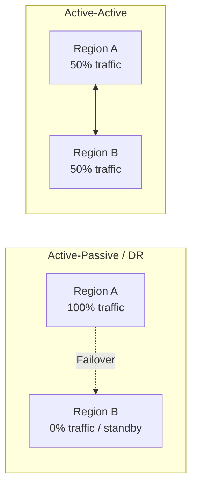
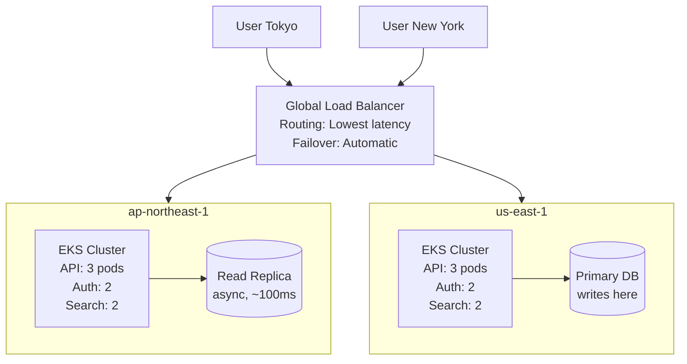
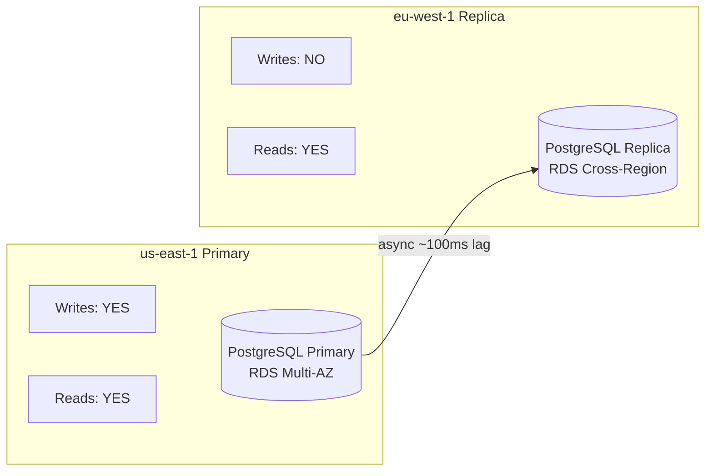
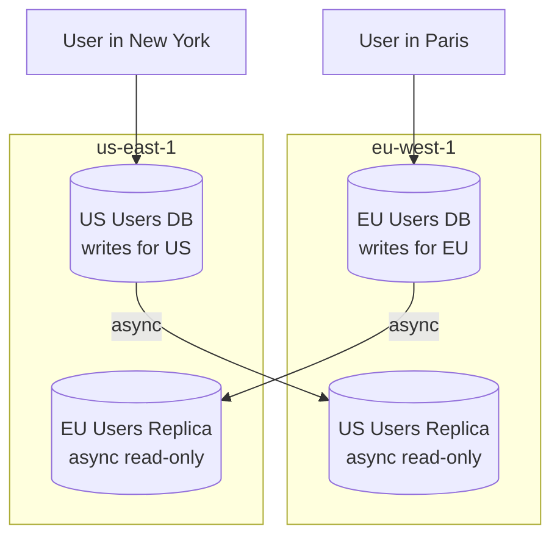
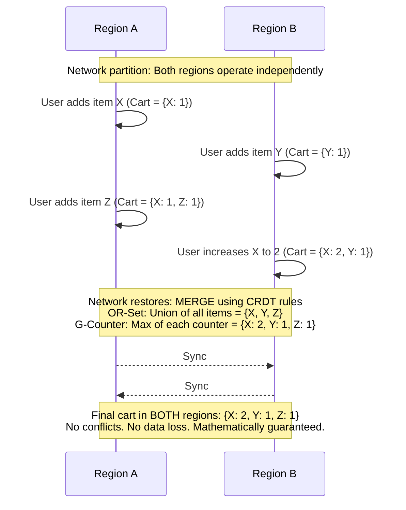
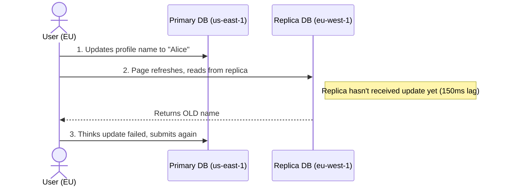
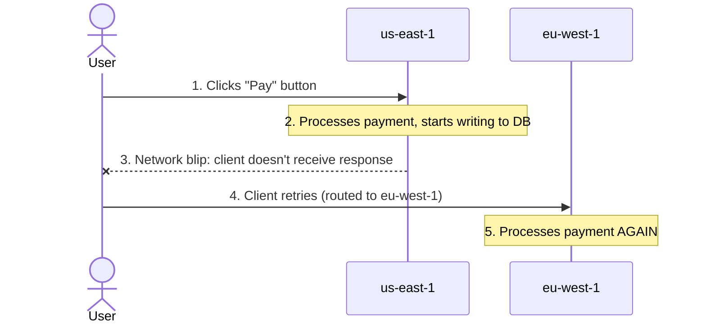

> **Complexity**: `[COMPLEX]`
>
> **Time to Complete**: 3 hours
>
> **Prerequisites**: [Module 8.5: Disaster Recovery](../module-8.5-disaster-recovery/), understanding of distributed systems basics (CAP theorem)
>
> **Track**: Advanced Cloud Operations

## What You'll Be Able to Do

After completing this module, you will be able to:

- **Design multi-region active-active Kubernetes deployments with global load balancing and data replication**
- **Implement traffic routing strategies (DNS-based, anycast, global LB) for active-active failover patterns**
- **Configure data replication and conflict resolution mechanisms for stateful workloads across regions**
- **Evaluate active-active vs active-passive tradeoffs including cost, complexity, and consistency guarantees**

---

## Why This Module Matters

**October 2021. A global food delivery platform. 34 million daily orders.**

The platform ran in a single AWS region (us-east-1) with a warm standby in eu-west-1 for DR. At 14:22 UTC, an AWS networking issue caused elevated packet loss in us-east-1 for 23 minutes. Not a full outage -- services were degraded, not dead. The warm standby couldn't help because the primary was technically "up," just slow. Health checks passed (they tested reachability, not latency). For those 23 minutes, order placement latency spiked from 200ms to 4.5 seconds. Users abandoned carts. Restaurants received stale orders. Delivery ETAs became meaningless.

The financial impact was $3.8 million in lost orders. But the strategic impact was larger: the company's biggest competitor, which ran active-active across three regions, experienced zero user-visible impact from the same AWS issue. Users who switched during those 23 minutes didn't come back.

This incident drove a six-month migration to active-active. The engineering team discovered that active-active is not "DR but better." It is a fundamentally different architecture that changes how you think about state, consistency, routing, and failure. This module teaches you how to design, implement, and operate multi-region active-active Kubernetes deployments -- including the hard parts that architecture diagrams always skip.

---

> **Stop and think**: If both regions in an active-active setup can accept write requests simultaneously, what happens when two users try to buy the last remaining item in your inventory at the exact same millisecond, but from different regions?

## What Active-Active Actually Means

Active-active means every region serves production traffic simultaneously. There is no standby. There is no failover. Every region is a primary.



The difference is not just about redundancy. Active-active means:
- Both regions write data (state management is HARD)
- Both regions must stay in sync (replication lag is REAL)
- Routing must be intelligent (not just DNS failover)
- Every service must be designed for multi-writer (or partitioned)

### The Active-Active Spectrum

Not everything needs to be active-active. Most organizations use a hybrid approach.

| Component | Active-Active? | Strategy |
|---|---|---|
| Stateless APIs | Yes | Deploy in all regions, route by latency |
| Static assets / CDN | Yes | Replicated at edge automatically |
| Session state | Yes (with care) | Sticky sessions or distributed cache (Redis Global) |
| User data (reads) | Yes | Read replicas in each region |
| User data (writes) | Depends | Single-writer or CRDT-based |
| Financial transactions | Rarely | Single-writer with async replication |
| Search index | Yes | Replicated index per region |
| Message queues | Regional | Each region has its own queue, cross-region for specific flows |

---

## Stateless Active-Active: The Easy Part

Stateless services (APIs that don't maintain local state between requests) are straightforward to run active-active. Deploy the same service in multiple regions, put a global load balancer in front, and route by latency.



### Deploying with ArgoCD ApplicationSets

```yaml
# ArgoCD ApplicationSet to deploy to multiple clusters
apiVersion: argoproj.io/v1alpha1
kind: ApplicationSet
metadata:
  name: payment-api
  namespace: argocd
spec:
  generators:
    - clusters:
        selector:
          matchLabels:
            environment: production
        values:
          region: '{{metadata.labels.region}}'
  template:
    metadata:
      name: 'payment-api-{{values.region}}'
    spec:
      project: default
      source:
        repoURL: https://github.com/company/k8s-manifests
        targetRevision: main
        path: 'apps/payment-api/overlays/{{values.region}}'
      destination:
        server: '{{server}}'
        namespace: payments
      syncPolicy:
        automated:
          prune: true
          selfHeal: true
        syncOptions:
          - CreateNamespace=true
```

### Regional Configuration with Kustomize

```yaml
# apps/payment-api/overlays/us-east-1/kustomization.yaml
apiVersion: kustomize.config.k8s.io/v1beta1
kind: Kustomization
resources:
  - ../../base
patches:
  - target:
      kind: Deployment
      name: payment-api
    patch: |
      - op: replace
        path: /spec/replicas
        value: 6
  - target:
      kind: ConfigMap
      name: payment-config
    patch: |
      - op: replace
        path: /data/DATABASE_URL
        value: "postgres://primary.us-east-1.rds.amazonaws.com:5432/payments"
      - op: replace
        path: /data/CACHE_URL
        value: "redis://global-cache.us-east-1.cache.amazonaws.com:6379"
      - op: replace
        path: /data/REGION
        value: "us-east-1"
```

---

## Global State Management: The Hard Part

The moment your active-active deployment needs to write data, everything gets complicated. The fundamental problem is the CAP theorem: in the presence of a network partition, you must choose between consistency and availability. Active-active chooses availability, which means you must deal with inconsistency.

### Strategy 1: Single-Writer, Multi-Reader

The simplest approach: one region owns writes for each piece of data. Other regions serve reads from replicas.



- **Read from eu-west-1:** user sees data that is ~100ms old
- **Write from eu-west-1:** proxied to us-east-1 (adds ~80ms latency)
- **When us-east-1 fails:** Promote eu-west-1 replica to primary (minutes). Some recent writes may be lost (RPO = replication lag).

```yaml
# Application config: route writes to primary, reads to local replica
apiVersion: v1
kind: ConfigMap
metadata:
  name: db-config
  namespace: payments
data:
  # Application reads from the nearest replica
  DATABASE_READ_URL: "postgres://read.payments-db.local:5432/payments"
  # Application writes always go to the primary
  DATABASE_WRITE_URL: "postgres://primary.us-east-1.rds.amazonaws.com:5432/payments"
  # Connection pooling config
  READ_POOL_SIZE: "20"
  WRITE_POOL_SIZE: "5"
```

### Strategy 2: Partitioned Writes (Geo-Sharding)

Each region owns writes for data that "belongs" to it. A user in Europe writes to the European database. A user in the US writes to the US database.



- **Partition key:** user's home region (set at registration)
- **Advantage:** No write conflicts (each region owns its partition)
- **Disadvantage:** Cross-region queries are slower (need to fan out)
- **Example:** User in Paris reads US friend's profile -> Read from US data replica in eu-west-1 (~100ms stale) OR read from us-east-1 directly (adds ~80ms latency, fresh).

### Strategy 3: Conflict-Free Replicated Data Types (CRDTs)

CRDTs are data structures that allow concurrent modifications in different regions and can be merged automatically without conflicts.



**CRDTs work for:**
- Counters (likes, views, inventory decrements)
- Sets (shopping carts, friend lists, tags)
- Registers (last-writer-wins for simple values)

**CRDTs DON'T work for:**
- Bank balances (need strong consistency)
- Inventory that can't go negative
- Sequential operations (order processing)

### Choosing Your Consistency Model

| Data Type | Consistency Need | Recommended Strategy |
|---|---|---|
| User profiles | Eventual (stale reads OK) | Single-writer + async replicas |
| Shopping cart | Eventual (merge conflicts OK) | CRDTs (OR-Set) |
| Inventory count | Strong (can't oversell) | Single-writer or distributed lock |
| Financial transactions | Strong (must not lose) | Single-writer, synchronous |
| Session tokens | Eventual (sticky routing helps) | Distributed cache (Redis Global) |
| Search results | Eventual (slightly stale OK) | Regional index, async update |
| Chat messages | Causal (order matters per conversation) | Causal broadcast or geo-shard by conversation |

---

> **Pause and predict**: If network latency between the US and Europe is ~100ms, how long does it take for a database write in the US to become visible to a read request in Europe? Is it just 100ms?

## Replication Lag: The Silent Killer

In any multi-region deployment, replication lag is the time between a write in one region and that write becoming visible in another region. It is not a bug to fix -- it is a physics constraint to design around.

> **REPLICATION LAG REALITY**
>
> - **Within same AZ:** < 1ms
> - **Cross-AZ:** 1-2ms
> - **Cross-region (US):** 20-40ms
> - **US to Europe:** 70-120ms
> - **US to Asia:** 150-250ms
>
> These are NETWORK latencies. Actual replication lag includes:
> - Write to primary WAL: ~1ms
> - WAL shipping to replica: network latency
> - Replay on replica: ~1-5ms
>
> Realistic replication lag:
> - Same region: 5-20ms
> - Cross-region: 100-500ms
> - Under load: Can spike to seconds

### The Read-Your-Own-Writes Problem



**Solution: "Read-your-own-writes" consistency**
After a write, route that user's reads to the primary for a short window (e.g., 5 seconds) before reverting to replica.

```python
# Read-your-own-writes implementation
import time
import redis

cache = redis.Redis(host="session-cache.local", port=6379)

def write_user_profile(user_id, data):
    """Write to primary and set a read-after-write flag."""
    primary_db.execute("UPDATE users SET name = %s WHERE id = %s",
                       (data["name"], user_id))

    # Set a flag: "this user wrote recently, read from primary"
    cache.setex(f"raw:{user_id}", 5, "1")  # Expires in 5 seconds

def read_user_profile(user_id):
    """Read from primary if user wrote recently, otherwise replica."""
    if cache.get(f"raw:{user_id}"):
        # User wrote recently -- read from primary to ensure consistency
        return primary_db.execute("SELECT * FROM users WHERE id = %s",
                                  (user_id,))
    else:
        # Safe to read from local replica
        return replica_db.execute("SELECT * FROM users WHERE id = %s",
                                  (user_id,))
```

---

## Traffic Routing for Active-Active

### Latency-Based Routing

```bash
# AWS Route53: Latency-based routing
aws route53 change-resource-record-sets \
  --hosted-zone-id Z1234567890 \
  --change-batch '{
    "Changes": [
      {
        "Action": "CREATE",
        "ResourceRecordSet": {
          "Name": "api.example.com",
          "Type": "A",
          "SetIdentifier": "us-east-1",
          "Region": "us-east-1",
          "TTL": 60,
          "ResourceRecords": [{"Value": "10.0.1.100"}],
          "HealthCheckId": "hc-us-east-1"
        }
      },
      {
        "Action": "CREATE",
        "ResourceRecordSet": {
          "Name": "api.example.com",
          "Type": "A",
          "SetIdentifier": "eu-west-1",
          "Region": "eu-west-1",
          "TTL": 60,
          "ResourceRecords": [{"Value": "10.1.1.100"}],
          "HealthCheckId": "hc-eu-west-1"
        }
      },
      {
        "Action": "CREATE",
        "ResourceRecordSet": {
          "Name": "api.example.com",
          "Type": "A",
          "SetIdentifier": "ap-northeast-1",
          "Region": "ap-northeast-1",
          "TTL": 60,
          "ResourceRecords": [{"Value": "10.2.1.100"}],
          "HealthCheckId": "hc-ap-northeast-1"
        }
      }
    ]
  }'
```

### Weighted Routing for Gradual Rollout

```bash
# Start with 90/10 split to canary new region
aws route53 change-resource-record-sets \
  --hosted-zone-id Z1234567890 \
  --change-batch '{
    "Changes": [
      {
        "Action": "CREATE",
        "ResourceRecordSet": {
          "Name": "api.example.com",
          "Type": "A",
          "SetIdentifier": "us-east-1-weighted",
          "Weight": 90,
          "TTL": 60,
          "ResourceRecords": [{"Value": "10.0.1.100"}],
          "HealthCheckId": "hc-us-east-1"
        }
      },
      {
        "Action": "CREATE",
        "ResourceRecordSet": {
          "Name": "api.example.com",
          "Type": "A",
          "SetIdentifier": "eu-west-1-weighted",
          "Weight": 10,
          "TTL": 60,
          "ResourceRecords": [{"Value": "10.1.1.100"}],
          "HealthCheckId": "hc-eu-west-1"
        }
      }
    ]
  }'
```

---

> **Pause and predict**: If a customer clicks "Pay" and their internet drops right before the response arrives, their phone will automatically retry. If that retry hits a different geographic region, how does your system know not to charge them again?

## Idempotency: The Active-Active Safety Net

In an active-active deployment, requests can be retried, duplicated, or rerouted between regions. Every write operation must be idempotent -- applying it twice must produce the same result as applying it once.



- **Without idempotency:** User charged twice.
- **With idempotency:** Second request recognized as duplicate, returns original result.

### Implementing Idempotency Keys

```python
# Idempotency key pattern
import hashlib
import redis
import json

cache = redis.Redis(host="idempotency-cache.local", port=6379)

def process_payment(request):
    """Process a payment with idempotency protection."""
    # Client must send an idempotency key (UUID generated client-side)
    idempotency_key = request.headers.get("Idempotency-Key")
    if not idempotency_key:
        return {"error": "Idempotency-Key header required"}, 400

    # Check if we've seen this request before
    cached_result = cache.get(f"idempotent:{idempotency_key}")
    if cached_result:
        # We've already processed this request -- return the cached result
        return json.loads(cached_result), 200

    # Try to acquire a lock (prevent concurrent processing of same key)
    lock_acquired = cache.set(
        f"idempotent-lock:{idempotency_key}",
        "processing",
        nx=True,  # Only set if not exists
        ex=30     # Lock expires in 30 seconds
    )

    if not lock_acquired:
        # Another instance is processing this request right now
        return {"error": "Request is being processed"}, 409

    try:
        # Process the payment
        result = payment_gateway.charge(
            amount=request.json["amount"],
            currency=request.json["currency"],
            customer_id=request.json["customer_id"]
        )

        # Cache the result for 24 hours
        cache.setex(
            f"idempotent:{idempotency_key}",
            86400,  # 24 hours
            json.dumps(result)
        )

        return result, 200
    finally:
        cache.delete(f"idempotent-lock:{idempotency_key}")
```

```yaml
# Kubernetes deployment with idempotency cache
apiVersion: apps/v1
kind: Deployment
metadata:
  name: payment-api
  namespace: payments
spec:
  replicas: 4
  selector:
    matchLabels:
      app: payment-api
  template:
    metadata:
      labels:
        app: payment-api
    spec:
      containers:
        - name: api
          image: company/payment-api:v2.8.1
          env:
            - name: IDEMPOTENCY_CACHE_URL
              value: "redis://idempotency-redis.payments.svc:6379"
            - name: IDEMPOTENCY_TTL_SECONDS
              value: "86400"
            - name: REGION
              valueFrom:
                configMapKeyRef:
                  name: region-config
                  key: REGION
```

---

> **Stop and think**: When doubling your infrastructure across two regions, will your monthly bill exactly double, or will it be more? Consider the cross-region networking and coordination layer.

## Cost Implications of Active-Active

Active-active is expensive. Understanding the cost model helps you make informed decisions about which components justify the investment.

### Active-Active Cost Breakdown

**Single-Region Cost: $25,000/month**
| Component | Cost |
|-----------|------|
| EKS cluster (6 nodes) | $4,200 |
| RDS Primary (Multi-AZ) | $3,800 |
| ElastiCache | $1,200 |
| ALB + NAT Gateway | $800 |
| S3 + CloudFront | $600 |
| Other (monitoring, etc.) | $2,400 |
| Data transfer | $2,000 |

**Active-Active (2 regions) Cost: $58,000/month (+132%)**
| Component | Cost | Notes |
|-----------|------|-------|
| 2x EKS clusters | $8,400 | (2x compute) |
| RDS Primary + Cross-Region | $6,200 | (+63% for replica) |
| 2x ElastiCache Global | $3,200 | (2.6x for global) |
| 2x ALB + NAT | $1,600 | (2x) |
| S3 + CloudFront (shared) | $800 | (+33%) |
| 2x Monitoring | $4,800 | (2x) |
| Cross-region replication | $3,500 | (NEW cost) |
| Data transfer (cross-region) | $5,500 | (+175%) |
| Global Load Balancer | $1,000 | (NEW cost) |
| Additional operational cost | $3,000 | (NEW: multi-region ops) |

Active-Active is NOT 2x. It's 2-3x due to:
- Cross-region data replication costs
- Global load balancing
- Increased operational complexity (monitoring, debugging, deploys)

### Cost Optimization Strategies

1. **Not everything needs active-active**
   - Stateless APIs: YES (easy, cheap)
   - Read-heavy services: YES (replicas are cheap)
   - Write-heavy services: MAYBE (consider geo-sharding)
   - Batch processing: NO (run in one region, failover)

2. **Right-size the secondary region**
   - Primary: 6 nodes (100% capacity)
   - Secondary: 4 nodes (70% capacity)
   - On failover: auto-scale secondary to 6 nodes
   - Saves: ~$1,400/month on compute

3. **Use reserved instances / savings plans**
   - Active-active GUARANTEES you'll use compute in both regions
   - Perfect candidate for 1-year commitments
   - Saves: 30-40% on compute

4. **Compress cross-region replication**
   - Database WAL compression: 60-70% reduction
   - Application-level compression for event streams
   - Saves: $1,000-$2,000/month on data transfer

---

## Did You Know?

1. **Netflix runs active-active across three AWS regions** (us-east-1, us-west-2, eu-west-1) and has been doing so since 2012. Their "Zuul" gateway handles over 300 billion requests per day across these regions. The annual cost of their multi-region infrastructure is estimated at over $400 million, but a single hour of global downtime would cost approximately $16 million in lost revenue -- making active-active a clear business case.

2. **CockroachDB was specifically designed for multi-region active-active writes.** It implements a distributed consensus protocol (a variant of Raft) that can commit writes across regions with serializable isolation. The trade-off is write latency: a cross-region write requires a round-trip to achieve consensus, adding 100-250ms. For read-heavy workloads (which most web applications are), this trade-off is excellent.

3. **The "read-your-own-writes" consistency problem** was formally defined by Doug Terry et al. at Microsoft Research in 1994. Thirty years later, it remains one of the most common bugs in distributed systems. Amazon's DynamoDB, Google's Spanner, and Azure's Cosmos DB all offer "session consistency" modes that guarantee read-your-own-writes, but only if the client maintains session affinity.

4. **Cross-region data transfer between AWS regions costs $0.02/GB**, but between AWS and GCP or Azure it costs $0.09/GB (standard internet egress rates). This 4.5x cost difference is one reason why multi-cloud active-active is significantly more expensive than multi-region active-active within a single cloud. Google's "cross-cloud interconnect" and AWS's "site-to-site VPN" reduce this somewhat, but typically not to intra-cloud rates.

---

## Common Mistakes

| Mistake | Why It Happens | How to Fix It |
|---|---|---|
| Treating active-active as "just deploy twice" | Underestimating state management complexity | Start with stateless services only. Add stateful active-active incrementally, service by service, with explicit consistency strategies. |
| Not handling replication lag in the application | "The database handles replication" | Build read-your-own-writes logic. Display "update pending" states. Use causal consistency where available. |
| Skipping idempotency for write operations | "Retries are rare" | In active-active, retries happen constantly due to routing changes. Every write must be idempotent. Add idempotency keys to all mutation APIs. |
| Global distributed locks | "We need consistency so let's lock across regions" | Cross-region locks add 100-300ms to every locked operation. Use geo-sharding instead: each region owns writes to its data partition. |
| Running the same batch jobs in every region | "Active-active means everything runs everywhere" | Batch jobs, cron jobs, and migrations should run in ONE region. Use leader election or a designated "batch region." |
| Not testing regional failover under load | "We tested failover in staging" | Production traffic patterns create cascading failures that staging can't replicate. Run monthly failover drills during peak traffic with real user traffic redirected. |
| Using synchronous cross-region replication for everything | "We need strong consistency" | Synchronous replication adds 100-300ms to every write. Only use it for data that truly needs it (financial transactions). Use async for everything else. |
| Ignoring clock skew between regions | "NTP handles it" | Clock skew between regions can be 10-50ms even with NTP. Use Hybrid Logical Clocks (HLC) or TrueTime-style APIs for ordering events across regions. |

---

## Quiz

<details>
<summary>1. Your team wants to expand your primary application from `us-east-1` to `eu-west-1` to serve European customers better. A junior engineer suggests just deploying the exact same stateless manifests and pointing a Route53 weighted record at both. Why will this approach likely cause a massive incident if user databases are involved?</summary>

Stateless services alone are insufficient because the underlying data stores (like databases) do not automatically synchronize writes globally. If you route writes to both regions without explicitly designing for multi-master replication, you can quickly create data conflicts and split-brain scenarios. Furthermore, replication lag between regions means a read in one region won't immediately see a write from another region. You must explicitly choose a strategy like single-writer or geo-sharding to manage this distributed state, otherwise user data will be corrupted or lost.
</details>

<details>
<summary>2. You are designing the backend for a global ride-sharing application. Drivers and riders interact continuously, but almost entirely within their own cities. European riders never match with US drivers. Which multi-region data strategy should you choose for the active rides database, and why?</summary>

Geo-sharding is the ideal choice here because the data naturally partitions by geography, meaning European users only interact with European data, and US users with US data. By explicitly sharding writes to the region where the entities reside, you completely avoid cross-region write latency and cross-region write conflicts. Single-writer would force most European rides to incur transatlantic latency on most status updates or location pings, severely degrading the real-time matching experience. Geo-sharding ensures optimal latency for the majority of operations while safely keeping the systems logically isolated.
</details>

<details>
<summary>3. A European customer just placed an item in their shopping cart and navigated to the checkout page. The checkout page, reading from the `eu-west-1` replica, claims their cart is empty. They immediately retry and accidentally order two items. What distributed systems reality caused this, and what architectural pattern prevents it?</summary>

This issue is caused by cross-region replication lag, which physically takes time to propagate the write from the primary database to the regional read replica. Because active-active architectures often rely on asynchronous replication to maintain availability and low latency, a read immediately following a write may hit a stale replica. To prevent this, implement the 'read-your-own-writes' pattern using a distributed cache flag. When a user modifies their cart, cache a session flag that temporarily forces all subsequent reads for that specific user to bypass the replica and read directly from the primary for a few seconds until replication catches up.
</details>

<details>
<summary>4. During a major AWS us-east-1 network event, your global load balancer successfully reroutes all new API traffic to your eu-west-1 cluster. However, your customer support queue immediately floods with users complaining they were charged twice for the same purchase. What critical active-active safety mechanism was missing from your payment endpoints, and why did the failover trigger this behavior?</summary>

The failover caused in-flight requests that didn't receive a response from the failed region to be automatically retried by clients or the load balancer against the healthy region. Because the original requests may have successfully committed to the database before the network connection dropped, the retried requests were processed again as brand new payments. Idempotency keys solve this by requiring the client to pass a unique identifier with every mutation, which the server uses to check if it has already processed the request. This mechanism guarantees that even if a request is submitted multiple times during a chaotic failover, the operation is only executed exactly once.
</details>

<details>
<summary>5. Your CFO is reviewing the Q3 cloud bill and notices your infrastructure costs have jumped 130% since migrating to an active-active architecture across two regions. They ask you to justify why you didn't just build a cheaper active-passive DR site. How do you financially and strategically justify the 2.3x cost multiplier?</summary>

To justify the 2.3x cost multiplier, you must translate infrastructure expense directly into business risk mitigation and revenue protection. A simple active-passive setup inherently carries recovery time objectives (RTO) measured in minutes or hours, and data loss (RPO) based on replication schedules. If your business loses $50,000 per hour of downtime, a single prolonged outage at a single region will vastly exceed the annual premium paid for active-active redundancy. Furthermore, an active-active architecture structurally improves baseline performance for global users by serving them from local regions, which increases conversion rates and competitive advantage.
</details>

<details>
<summary>6. You have successfully deployed your application to three regions globally. Everything is working perfectly until midnight UTC, when your finance team receives three identical daily revenue reports, and three separate database backup processes lock the primary database simultaneously. What architectural mistake led to this, and how should batch operations be handled in a multi-region setup?</summary>

Batch operations are inherently single-instance processes that require coordination rather than geographic replication. By deploying the cron jobs to all regions identically, each region independently triggered its own execution of the jobs against the same shared database or notification service. To fix this, you must explicitly designate one region as the 'batch leader' or implement distributed leader election (e.g., via a Redis lock or Kubernetes lease) so that only one region holds the authority to run scheduled tasks at any given time. If the leader region fails, the lock expires and a healthy region automatically promotes itself to take over the batch processing.
</details>

---

## Hands-On Exercise: Design an Active-Active Architecture

In this exercise, you will design an active-active architecture for a realistic application and implement the key patterns.

### Scenario

**Application**: TravelBook (a travel booking platform)
- 5 million monthly active users
- 60% of traffic from North America, 30% from Europe, 10% from Asia
- Core operations: search (read-heavy), booking (write), user profiles (read/write)
- Current setup: single-region (us-east-1), RTO=30min, RPO=5min
- Target: active-active in us-east-1 + eu-west-1, near-zero RTO/RPO

### Task 1: Classify Services by Consistency Need

For each TravelBook service, determine the active-active strategy.

<details>
<summary>Solution</summary>

| Service | Read/Write Ratio | Consistency Need | Strategy |
|---|---|---|---|
| Search API | 99% read | Eventual (stale results OK for seconds) | Active-active, regional search index |
| Booking Engine | 20% write | Strong (can't double-book) | Single-writer (us-east-1), proxied writes from EU |
| User Profiles | 95% read | Session (read-your-own-writes) | Single-writer + read replicas + RYOW cache |
| Payment Service | Mostly write | Strong + idempotent | Single-writer (us-east-1), idempotency keys |
| Notification Service | 90% write | Eventual (delayed delivery OK) | Regional queues, deduplicated delivery |
| Image/CDN Service | Mostly read | Eventual (cached at edge) | CloudFront/CDN, origin in both regions |
| Review System | 80% read | Eventual (new reviews appear within seconds) | Single-writer + async replication |

Key decisions:
- Booking and Payment stay single-writer because consistency > latency
- Search index is replicated per region for fastest reads
- User profiles use read-your-own-writes pattern
</details>

### Task 2: Design the Data Replication Strategy

For each database, specify the replication approach and expected lag.

<details>
<summary>Solution</summary>

```text
Database Replication Plan

1. Primary PostgreSQL (users, bookings, payments)
   Primary: us-east-1 (RDS Multi-AZ)
   Replica: eu-west-1 (RDS Cross-Region Read Replica)
   Replication: Async, expected lag 100-300ms
   Failover: Manual promotion (RPO = replication lag)

2. Elasticsearch (search index)
   us-east-1: Independent cluster, fed by CDC from PostgreSQL
   eu-west-1: Independent cluster, fed by CDC from PostgreSQL
   Not replicated between regions -- each rebuilds from source
   Lag: 1-5 seconds (CDC processing time)

3. Redis (session cache, idempotency keys, RYOW flags)
   us-east-1: ElastiCache Global Datastore (primary)
   eu-west-1: ElastiCache Global Datastore (replica, reads)
   Replication: Async, expected lag < 1ms (same continent)
   Special: Idempotency keys written to BOTH regions
            (using Global Datastore's cross-region replication)

4. S3 (images, documents)
   us-east-1: Primary bucket
   eu-west-1: Cross-Region Replication
   Replication: Async, typically < 15 minutes
   CloudFront caches in both regions (edge caching)
```
</details>

### Task 3: Implement Read-Your-Own-Writes Pattern

Write the application code and Kubernetes configuration for the RYOW pattern for user profiles.

<details>
<summary>Solution</summary>

```python
# user_service.py - Read-your-own-writes implementation
import redis
import psycopg2
import os
import json

REGION = os.environ["REGION"]
RYOW_TTL = int(os.environ.get("RYOW_TTL_SECONDS", "5"))

# Database connections
primary_db = psycopg2.connect(os.environ["DATABASE_WRITE_URL"])
replica_db = psycopg2.connect(os.environ["DATABASE_READ_URL"])
cache = redis.Redis.from_url(os.environ["CACHE_URL"])

def update_profile(user_id, data):
    """Update user profile with RYOW flag."""
    with primary_db.cursor() as cur:
        cur.execute(
            "UPDATE users SET name=%s, bio=%s, updated_at=NOW() WHERE id=%s RETURNING *",
            (data["name"], data["bio"], user_id)
        )
        updated = cur.fetchone()
        primary_db.commit()

    # Set RYOW flag: "this user wrote, read from primary for N seconds"
    cache.setex(f"ryow:{user_id}", RYOW_TTL, REGION)

    return updated

def get_profile(user_id):
    """Read profile from primary if RYOW, otherwise local replica."""
    ryow_flag = cache.get(f"ryow:{user_id}")

    if ryow_flag:
        # Recent write detected -- read from primary for consistency
        db = primary_db
        source = "primary"
    else:
        # No recent write -- safe to read from local replica
        db = replica_db
        source = "replica"

    with db.cursor() as cur:
        cur.execute("SELECT * FROM users WHERE id = %s", (user_id,))
        profile = cur.fetchone()

    return {"profile": profile, "_source": source}
```

```yaml
# Kubernetes deployment for us-east-1
apiVersion: apps/v1
kind: Deployment
metadata:
  name: user-service
  namespace: travelbook
spec:
  replicas: 4
  selector:
    matchLabels:
      app: user-service
  template:
    metadata:
      labels:
        app: user-service
    spec:
      containers:
        - name: api
          image: company/user-service:v3.1.0
          env:
            - name: REGION
              value: "us-east-1"
            - name: DATABASE_WRITE_URL
              value: "postgres://primary.rds.us-east-1.amazonaws.com:5432/travelbook"
            - name: DATABASE_READ_URL
              value: "postgres://replica.rds.us-east-1.amazonaws.com:5432/travelbook"
            - name: CACHE_URL
              value: "redis://global-cache.us-east-1.cache.amazonaws.com:6379"
            - name: RYOW_TTL_SECONDS
              value: "5"
          ports:
            - containerPort: 8080
          readinessProbe:
            httpGet:
              path: /healthz
              port: 8080
            initialDelaySeconds: 5
            periodSeconds: 10
```
</details>

### Task 4: Implement Idempotent Booking

Write the idempotency key pattern for the booking service.

<details>
<summary>Solution</summary>

```python
# booking_service.py - Idempotent booking
import redis
import json
import uuid
from datetime import datetime

cache = redis.Redis.from_url(os.environ["CACHE_URL"])
IDEMPOTENCY_TTL = 86400  # 24 hours

def create_booking(request):
    """Create a booking with idempotency protection."""
    idem_key = request.headers.get("Idempotency-Key")
    if not idem_key:
        return {"error": "Idempotency-Key header is required"}, 400

    # Check for cached result
    cached = cache.get(f"booking:idem:{idem_key}")
    if cached:
        result = json.loads(cached)
        result["_idempotent"] = True  # Flag that this is a cached response
        return result, 200

    # Acquire processing lock
    if not cache.set(f"booking:lock:{idem_key}", "1", nx=True, ex=60):
        return {"error": "Booking is being processed, please wait"}, 409

    try:
        # Check availability (read from primary for consistency)
        available = check_availability(
            request.json["hotel_id"],
            request.json["check_in"],
            request.json["check_out"]
        )
        if not available:
            result = {"error": "Room no longer available"}
            cache.setex(f"booking:idem:{idem_key}", IDEMPOTENCY_TTL,
                       json.dumps(result))
            return result, 409

        # Create the booking
        booking_id = str(uuid.uuid4())
        booking = {
            "booking_id": booking_id,
            "hotel_id": request.json["hotel_id"],
            "check_in": request.json["check_in"],
            "check_out": request.json["check_out"],
            "guest_id": request.json["guest_id"],
            "status": "confirmed",
            "created_at": datetime.utcnow().isoformat(),
            "region": os.environ["REGION"]
        }

        db.execute(
            "INSERT INTO bookings (id, hotel_id, check_in, check_out, guest_id, status) "
            "VALUES (%s, %s, %s, %s, %s, %s)",
            (booking_id, booking["hotel_id"], booking["check_in"],
             booking["check_out"], booking["guest_id"], "confirmed")
        )
        db.commit()

        # Cache the result
        cache.setex(f"booking:idem:{idem_key}", IDEMPOTENCY_TTL,
                   json.dumps(booking))

        return booking, 201

    finally:
        cache.delete(f"booking:lock:{idem_key}")
```
</details>

### Task 5: Calculate the Cost

Estimate the monthly cost difference between single-region and active-active for TravelBook.

<details>
<summary>Solution</summary>

```text
Single-Region (us-east-1):
  EKS (6x m7i.xlarge nodes)          $3,600
  RDS (db.r7g.xlarge, Multi-AZ)      $2,800
  ElastiCache (cache.r7g.large)        $900
  Elasticsearch (3x r7g.large)       $1,500
  ALB                                  $200
  NAT Gateway + data processing        $800
  S3 + CloudFront                      $500
  Data transfer (internet egress)    $1,800
  Monitoring (Datadog/Prometheus)    $1,200
  ─────────────────────────────────────────
  TOTAL:                            $13,300/month

Active-Active (us-east-1 + eu-west-1):
  2x EKS (5 nodes each, smaller sec) $5,800
  RDS Primary + Cross-Region Replica $4,100
  ElastiCache Global Datastore       $2,400
  2x Elasticsearch (independent)     $3,000
  2x ALB                               $400
  2x NAT Gateway                     $1,600
  S3 + CRR + CloudFront                $800
  Cross-region data transfer         $2,200
  Global Load Balancer (Route53/GA)    $400
  2x Monitoring                      $2,400
  Additional operational overhead    $1,500
  ─────────────────────────────────────────
  TOTAL:                            $24,600/month

Cost increase: $11,300/month (+85%)

Break-even analysis:
  If 1 hour of downtime = $15,000 in lost bookings
  Active-active prevents ~4 hours of downtime per year
  Prevented losses: $60,000/year
  Active-active cost: $135,600/year
  Pure financial ROI: negative

  BUT: Add customer trust, competitive positioning, and
  SLA penalty avoidance, and the case usually becomes positive
  for businesses above $50M annual revenue.
```
</details>

### Success Criteria

- [ ] Each service classified with appropriate consistency strategy
- [ ] Data replication plan specifies mechanism, lag, and failover for each database
- [ ] RYOW implementation correctly routes reads to primary after writes
- [ ] Idempotency key pattern prevents duplicate bookings across regions
- [ ] Cost analysis includes cross-region transfer, replication, and operational overhead

---

## Next Module

[Module 8.7: Stateful Workload Migration & Data Gravity](../module-8.7-stateful-migration/) -- You know how to run workloads across regions. Now learn how to move them. Database migrations, the Strangler Fig pattern, CSI snapshots, and the art of zero-downtime migration for stateful workloads.

## Sources

- [Amazon Route 53 Latency-Based Routing](https://docs.aws.amazon.com/Route53/latest/DeveloperGuide/routing-policy-latency.html) — Direct vendor documentation for one of the routing patterns the module discusses.
- [Promoting a Read Replica to Be a Standalone DB Instance](https://docs.aws.amazon.com/AmazonRDS/latest/UserGuide/USER_ReadRepl.Promote.html) — Grounds the failover discussion around asynchronous replicas, promotion timing, and recovery tradeoffs.
- [Azure Cosmos DB Consistency Levels](https://learn.microsoft.com/en-us/azure/cosmos-db/consistency-levels) — A clear primary source for session consistency and read-your-writes behavior in a real multi-region database product.
