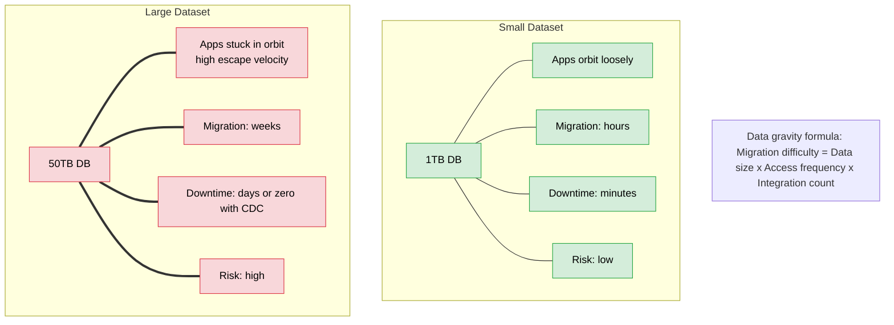
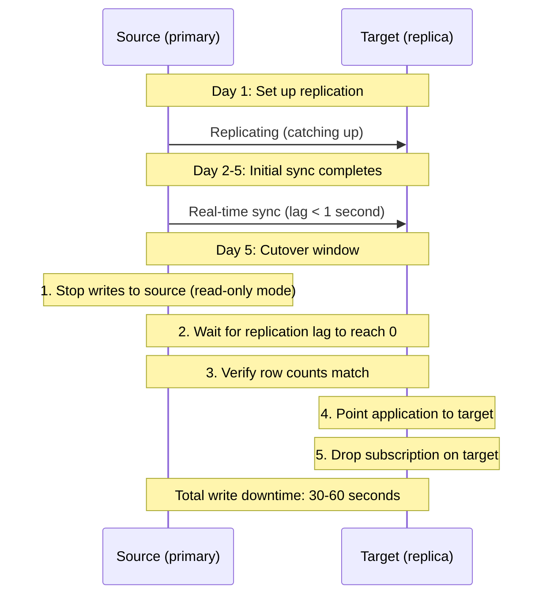
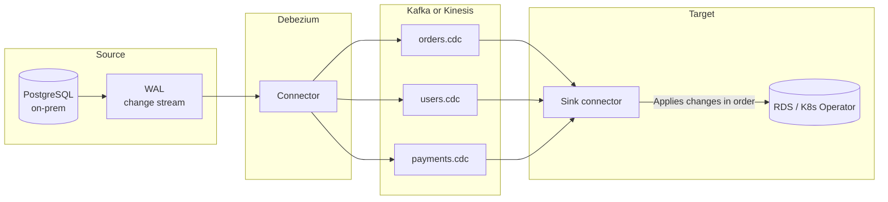

> **Complexity**: `[COMPLEX]`
>
> **Time to Complete**: 2.5 hours
>
> **Prerequisites**: [Module 8.5: Disaster Recovery](../module-8.5-disaster-recovery/), experience with PersistentVolumes and at least one database
>
> **Track**: Advanced Cloud Operations

## What You'll Be Able to Do

After completing this module, you will be able to:

- **Design** live migration strategies for stateful workloads between cloud regions to eliminate data gravity constraints.
- **Implement** data replication pipelines using Change Data Capture (CDC) and logical replication for zero-downtime database migrations.
- **Evaluate** migration approaches (lift-and-shift, re-platform, re-architect) based on workload state, access patterns, and data volume.
- **Diagnose** post-migration consistency issues, such as desynchronized sequences or row count mismatches, using robust verification scripts.

## Why This Module Matters

Stateful migration exposes a design fault line: if control planes diverge during topology shifts, consistency and write guarantees can become unreliable in minutes. This concept is further explored in [Advanced Merging](../../prerequisites/git-deep-dive/module-2-advanced-merging/).
<!-- incident-xref: github-2018-10-split-brain -->
<!-- incident-xref: github-2018-split-brain -->

A similar scenario unfolded for a major streaming service in late 2022. The engineering team had successfully migrated their stateless microservices from on-premises virtual machines to Kubernetes. The remaining legacy footprint was a 12TB PostgreSQL database, a 3TB Elasticsearch cluster, a Redis cluster with 200GB of hot data, and a media processing service with 50TB of files on local network storage. Every migration attempt was estimated at two weeks of downtime, which the business flatly rejected. The database was simply too large for a standard dump-and-restore within the allowed maintenance window. 

After months of delay, the streaming service engineers realized they were fighting "data gravity." Their 12TB database had grown to 16TB. Every day they waited, the mass of the data increased, pulling more dependencies into its orbit and making the eventual migration even more difficult. They eventually succeeded by combining Change Data Capture for the database, incremental synchronization for the media files, and the Strangler Fig pattern to route traffic incrementally. This module teaches you how to execute these exact patterns, allowing you to move massive stateful workloads without downtime while maintaining absolute data integrity.

## Understanding Data Gravity and Escape Velocity

Data gravity is a concept originally coined by Dave McCrory. The core insight relies on a physics analogy: data has mass. As data accumulates in one centralized location, it becomes progressively harder and more expensive to move. Applications, auxiliary services, reporting pipelines, and users are pulled toward the data, much like objects drawn toward a gravitational body. Attempting to move the data requires breaking these gravitational bonds, which demands significant engineering "escape velocity."

When a database is small, the applications connecting to it orbit loosely. You can take the database offline, move the files, update the connection strings, and bring the systems back online within a brief maintenance window. However, when a dataset grows into the tens or hundreds of terabytes, taking it offline is no longer feasible. The sheer physics of network transfer speeds means copying the data will take days or weeks. During that transfer window, the original database continues to receive new writes, creating a moving target that is extremely difficult to catch without specialized replication tooling.



To combat data gravity, engineers must decouple the applications from the data source before attempting the physical move. This often involves establishing replication bridges that synchronize state across geographic boundaries. By keeping the legacy system and the new target system in perfect sync, teams can eliminate the urgency of the transfer, allowing the bulk data copy to occur over weeks in the background while the business continues to operate normally.

| Data Size | Migration Method | Expected Duration | Downtime |
|---|---|---|---|
| < 1 TB | pg_dump / mysqldump | 1-4 hours | 1-4 hours |
| 1-10 TB | Logical replication + cutover | 1-3 days | Minutes |
| 10-100 TB | CDC (Debezium/DMS) + catchup | 1-4 weeks | Minutes |
| 100+ TB | Physical replication + CDC | 1-3 months | Minutes |
| Files (any size) | Incremental sync (rsync/rclone) | Days-weeks | Minutes |

> **Stop and think**: If you have a 5TB database that is accessed by 30 different microservices, what is the primary factor increasing its data gravity? Is it the size of the database, or the number of integrations? How would this impact your migration approach?

## The Strangler Fig Pattern in Practice

Named after the strangler fig tree that germinates in the canopy of a host tree and grows downwards until it eventually replaces the host entirely, this architectural pattern allows you to migrate monolithic services incrementally. Rather than attempting a high-risk big-bang cutover, you place a proxy router in front of the legacy system and selectively redirect specific API paths to newly modernized microservices running in Kubernetes.

This approach drastically reduces risk. If a newly migrated service fails or exhibits poor performance under production load, you can instantly revert the routing rule at the Ingress tier, sending traffic back to the legacy system. The stateful data underlying the new service must be synchronized with the legacy data, ensuring that regardless of which system processes the request, the user experiences consistent behavior.

```mermaid
graph TD
    subgraph Phase 1: Proxy all traffic through a router
        U1[Users] --> R1[Router / Ingress]
        R1 --> L1[Legacy System / VM]
    end

    subgraph Phase 2: New system handles some routes
        U2[Users] --> R2[Router / Ingress]
        R2 -->|/api/users, /api/payments| L2[Legacy System]
        R2 -->|/api/search, /api/catalog| N2[New K8s Services]
    end

    subgraph Phase 3: Most routes migrated
        U3[Users] --> R3[Router / Ingress]
        R3 -->|/api/payments| L3[Legacy System]
        R3 -->|/api/search, /api/catalog, /api/users, /api/orders| N3[New K8s Services]
    end

    subgraph Phase 4: Legacy system decommissioned
        U4[Users] --> R4[Router / Ingress]
        R4 -->|all routes| N4[New K8s Services]
    end
```



Implementing this pattern in Kubernetes typically involves configuring an Ingress controller to act as the primary traffic gateway. You define explicit prefix paths for the endpoints you have migrated, directing them to native Kubernetes Service objects. For all unmatched traffic, you define a catch-all route that points to an `ExternalName` Service. This special type of Kubernetes Service acts as a DNS alias, seamlessly passing the traffic out of the cluster to the legacy virtual machine environment.

```yaml
# Phase 2: Route some paths to new service, rest to legacy
apiVersion: networking.k8s.io/v1
kind: Ingress
metadata:
  name: strangler-fig-router
  namespace: migration
  annotations:
    nginx.ingress.kubernetes.io/upstream-vhost: "legacy.internal.company.com"
spec:
  rules:
    - host: api.example.com
      http:
        paths:
          # New services (migrated to K8s)
          - path: /api/search
            pathType: Prefix
            backend:
              service:
                name: search-service
                port:
                  number: 8080
          - path: /api/catalog
            pathType: Prefix
            backend:
              service:
                name: catalog-service
                port:
                  number: 8080
          # Everything else goes to the legacy system
          - path: /
            pathType: Prefix
            backend:
              service:
                name: legacy-proxy
                port:
                  number: 80
```

To resolve the backend reference for the catch-all legacy route, you define the `ExternalName` service:

```yaml
# ExternalName service pointing to legacy system
apiVersion: v1
kind: Service
metadata:
  name: legacy-proxy
  namespace: migration
spec:
  type: ExternalName
  externalName: legacy.internal.company.com
```

Beyond simple path-based routing, advanced ingress controllers and service meshes like Istio allow for percentage-based traffic splitting. This is essential for canary deployments during the migration phase. By sending only a small fraction of real user traffic to the new database-backed microservice, you can validate your data replication strategies under realistic workloads without jeopardizing the entire user base.

```yaml
# Use traffic splitting to gradually shift traffic
# (Istio VirtualService example)
apiVersion: networking.istio.io/v1
kind: VirtualService
metadata:
  name: user-service-migration
  namespace: migration
spec:
  hosts:
    - api.example.com
  http:
    - match:
        - uri:
            prefix: /api/users
      route:
        - destination:
            host: legacy-user-service
            port:
              number: 80
          weight: 80    # 80% to legacy
        - destination:
            host: new-user-service
            port:
              number: 8080
          weight: 20    # 20% to new K8s service
```

> **Pause and predict**: When using the Strangler Fig pattern with Kubernetes Ingress, what happens to requests for API endpoints that haven't been explicitly routed to the new services yet? How do you ensure users don't experience broken links?

## Strategic Approaches: Lift, Platform, or Architect

Migration is not a one-size-fits-all endeavor. The strategy chosen for a stateful workload depends heavily on the application's lifecycle phase, the business value it generates, and the technical debt it carries. Teams must critically evaluate whether moving a system as-is will merely transfer legacy problems into a modern environment, or if rebuilding the system will consume resources without delivering corresponding business advantages.

The three primary strategies are Lift-and-Shift, Re-Platform, and Re-Architect. Each carries distinct cost, risk, and timeline profiles. A comprehensive migration program typically utilizes a mix of all three strategies across different components of the software portfolio.

```mermaid
graph TD
    Start[Start here] --> Active{Is the application<br/>actively developed?}
    
    Active -- NO --> Lift[LIFT-AND-SHIFT<br/>Containerize as-is<br/>Move VM contents into a container<br/>Cost: Low | Risk: Low | Benefit: Low]
    
    Active -- YES --> Arch{Does it need<br/>fundamental<br/>architecture changes?}
    
    Arch -- NO --> Platform[RE-PLATFORM<br/>Adapt for K8s<br/>Use managed services<br/>Cost: Medium | Risk: Medium | Benefit: Medium]
    
    Arch -- YES --> Architect[RE-ARCHITECT<br/>Rebuild for cloud-native<br/>Break into microservices<br/>Cost: High | Risk: High | Benefit: High]
```

Lift-and-shift involves wrapping the existing binary in a container and mounting a PersistentVolume that contains an exact copy of the legacy disk. This is fast and requires minimal code changes, making it ideal for frozen applications. Re-platforming introduces minor optimizations, such as migrating a self-managed database to a managed cloud service like RDS while keeping the core application logic intact. Re-architecting is the most intensive path, demanding a complete rewrite to utilize cloud-native primitives, break apart monoliths, and decouple shared data stores.

| Strategy | When to Use | Database Approach | Timeline |
|---|---|---|---|
| Lift-and-shift | Legacy app, no active development, just need it running | Same DB, just in cloud (EC2/GCE + disk) | Days-weeks |
| Re-platform | Active app, keep architecture, use managed services | Migrate to RDS/CloudSQL/Azure SQL | Weeks-months |
| Re-architect | Active app, want cloud-native benefits, willing to invest | New schema, potentially new DB engine | Months-quarters |

> **Stop and think**: You inherited a 10-year-old monolithic inventory application. The original developers left the company 5 years ago, and the business only requires it for compliance audits twice a year. Which migration strategy is most appropriate and why?

## Infrastructure-Level Migration: CSI Volume Snapshots

When dealing with stateful workloads already running in Kubernetes that need to be migrated to a different cluster or region, the Container Storage Interface (CSI) provides a powerful mechanism: Volume Snapshots. Rather than copying data through the application layer, CSI allows you to leverage the cloud provider's native block-storage snapshot capabilities. 

This infrastructure-level approach is highly efficient. An AWS EBS snapshot, for example, is instantaneous from the perspective of the application because it captures the block states in the background and streams them to S3. This means you do not need to take the application offline for the duration of the data transfer. You simply trigger the snapshot, wait for the background copy to complete, and then use that snapshot as the data source for a new PersistentVolumeClaim in the destination cluster.

```yaml
# Step 1: Create a VolumeSnapshot of the source PV
apiVersion: snapshot.storage.k8s.io/v1
kind: VolumeSnapshot
metadata:
  name: postgres-data-snapshot
  namespace: databases
spec:
  volumeSnapshotClassName: ebs-csi-snapclass
  source:
    persistentVolumeClaimName: postgres-data
```

The cluster must have an appropriate `VolumeSnapshotClass` configured to instruct the CSI driver on how to handle the operation:

```yaml
# VolumeSnapshotClass (must exist in cluster)
apiVersion: snapshot.storage.k8s.io/v1
kind: VolumeSnapshotClass
metadata:
  name: ebs-csi-snapclass
driver: ebs.csi.aws.com
deletionPolicy: Retain
parameters:
  tagSpecification_1: "Name=migration-snapshot"
```

Once the snapshot object reports as ready, the actual data resides in the cloud provider's storage fabric. You can use standard cloud CLI tools to copy this snapshot across regional boundaries, preparing it for restoration in a disaster recovery or migration scenario.

```bash
# Check snapshot status
kubectl get volumesnapshot postgres-data-snapshot -n databases
# NAME                     READYTOUSE   RESTORESIZE   AGE
# postgres-data-snapshot   true         100Gi         2m

# The underlying cloud snapshot can be shared across accounts/regions
# AWS: Copy EBS snapshot to another region
SNAPSHOT_ID=$(kubectl get volumesnapshot postgres-data-snapshot -n databases \
  -o jsonpath='{.status.boundVolumeSnapshotContentName}')

# Get the actual EBS snapshot ID
EBS_SNAPSHOT=$(kubectl get volumesnapshotcontent $SNAPSHOT_ID \
  -o jsonpath='{.status.snapshotHandle}')

# Copy to DR region
aws ec2 copy-snapshot \
  --source-region us-east-1 \
  --source-snapshot-id $EBS_SNAPSHOT \
  --destination-region eu-west-1 \
  --description "Migration snapshot for postgres-data"
```

In the target cluster, provisioning a new persistent volume from the replicated snapshot is as simple as referencing the snapshot in the `dataSource` block of the new PVC definition. The CSI driver handles the allocation of the disk and the hydration of the block data prior to the pod starting.

```yaml
# Step 2: In the destination cluster, create a PVC from the snapshot
apiVersion: v1
kind: PersistentVolumeClaim
metadata:
  name: postgres-data-restored
  namespace: databases
spec:
  storageClassName: gp3
  dataSource:
    name: postgres-data-snapshot
    kind: VolumeSnapshot
    apiGroup: snapshot.storage.k8s.io
  accessModes:
    - ReadWriteOnce
  resources:
    requests:
      storage: 100Gi
```

> **Pause and predict**: You successfully created a volume snapshot in AWS `us-east-1` and copied it to `eu-west-1`. If the original source PV is 500Gi, will the new PVC in `eu-west-1` provision immediately, or do you need to wait for the data to copy into the new EBS volume before the pod can start?

## Database Replication Patterns

While infrastructure snapshots are excellent for block storage, migrating active, high-transaction databases requires application-aware methodologies. You must ensure transactional consistency, meaning no half-written records are transferred, and no writes are dropped during the cutover window.

### Pattern 1: Dump and Restore (Small Databases)

For databases under a few terabytes where the business can tolerate a maintenance window, a traditional logical dump and restore is the most deterministic approach. It guarantees clean data schemas and avoids the complexities of active replication pipelines. The primary limitation is that the database must be entirely locked against new writes during the extraction, transfer, and restoration phases.

```bash
# PostgreSQL: Dump from source, restore to target
# Use pg_dump with parallel jobs for speed
pg_dump \
  --host=source-db.internal \
  --port=5432 \
  --username=migration_user \
  --format=directory \
  --jobs=4 \
  --file=/tmp/pg_backup \
  mydb

# Restore to the new database (managed service or K8s operator)
pg_restore \
  --host=target-db.rds.amazonaws.com \
  --port=5432 \
  --username=admin \
  --dbname=mydb \
  --jobs=4 \
  --no-owner \
  /tmp/pg_backup

# Downtime = dump time + restore time + DNS switch
# For 5GB database: ~15-30 minutes total
```

### Pattern 2: Logical Replication (Medium Databases)

Modern relational databases support logical replication, a mechanism where the database parses its own Write-Ahead Log (WAL) and streams discrete INSERT, UPDATE, and DELETE commands to a subscribed replica. Unlike physical replication, which requires bit-for-bit identical disk layouts, logical replication allows the target database to run on a different operating system, a different major version, or a managed cloud platform.

```bash
# PostgreSQL logical replication: continuous sync with near-zero downtime

# On the SOURCE database: enable logical replication
# (postgresql.conf)
# wal_level = logical
# max_replication_slots = 4

# Create a publication (what to replicate)
psql -h source-db.internal -U admin -d mydb <<'SQL'
CREATE PUBLICATION migration_pub FOR ALL TABLES;
SQL

# On the TARGET database: create subscription
psql -h target-db.rds.amazonaws.com -U admin -d mydb <<'SQL'
-- Schema must already exist on the target
-- Create the subscription to start replicating
CREATE SUBSCRIPTION migration_sub
  CONNECTION 'host=source-db.internal port=5432 dbname=mydb user=replication_user password=xxx'
  PUBLICATION migration_pub;

-- Monitor replication lag
SELECT
  slot_name,
  pg_wal_lsn_diff(pg_current_wal_lsn(), confirmed_flush_lsn) AS lag_bytes
FROM pg_replication_slots
WHERE slot_name = 'migration_sub';
SQL
```

During this process, the target database performs an initial bulk synchronization of all existing rows, followed by a continuous streaming phase where it catches up to the live transaction log. The cutover is executed only when the lag between the source and target drops to nearly zero.



### Pattern 3: Change Data Capture (Large Databases)

For massive datasets or heterogeneous migrations (e.g., Oracle to PostgreSQL), direct database-to-database connections are often insufficient. Change Data Capture (CDC) architectures introduce an intermediate event streaming platform like Apache Kafka. A connector tool, such as Debezium, tails the source database's transaction log and publishes every mutation as a distinct event payload onto a Kafka topic. A sink connector then reads these topics and applies the mutations to the target database.

This architecture decouples the extraction phase from the loading phase, providing immense resilience against network partitions. If the target database goes offline during the migration, the source database is unaffected; the events simply buffer in the Kafka topic until the target returns and resumes consumption.



```yaml
# Debezium connector for PostgreSQL (running in K8s via Strimzi)
apiVersion: kafka.strimzi.io/v1beta2
kind: KafkaConnector
metadata:
  name: postgres-source-connector
  namespace: kafka
  labels:
    strimzi.io/cluster: kafka-connect
spec:
  class: io.debezium.connector.postgresql.PostgresConnector
  tasksMax: 1
  config:
    database.hostname: "source-db.internal"
    database.port: "5432"
    database.user: "debezium"
    database.password: "${file:/opt/kafka/external-configuration/db-credentials/password}"
    database.dbname: "mydb"
    database.server.name: "source"
    plugin.name: "pgoutput"
    publication.name: "debezium_pub"
    slot.name: "debezium_slot"
    snapshot.mode: "initial"
    transforms: "route"
    transforms.route.type: "org.apache.kafka.connect.transforms.RegexRouter"
    transforms.route.regex: "source\\.public\\.(.*)"
    transforms.route.replacement: "$1.cdc"
```

### Pattern 4: Kubernetes Operator Migration

When moving stateful workloads exclusively within the Kubernetes ecosystem, purpose-built controllers simplify the ingestion of external data. Operators like CloudNativePG are designed to handle bootstrapping by directly reading cloud-stored backups generated by tools like Barman or WAL-G. You can define a declarative specification that instructs the new cluster to construct itself using the history of a legacy external database.

```yaml
# CloudNativePG: Create a cluster from an external database backup
apiVersion: postgresql.cnpg.io/v1
kind: Cluster
metadata:
  name: payments-db
  namespace: databases
spec:
  instances: 3
  storage:
    size: 100Gi
    storageClass: gp3

  # Bootstrap from an external backup (S3)
  bootstrap:
    recovery:
      source: external-backup
      recoveryTarget:
        targetTime: "2026-03-24T10:00:00Z"

  externalClusters:
    - name: external-backup
      barmanObjectStore:
        destinationPath: "s3://pg-backups/source-db/"
        s3Credentials:
          accessKeyId:
            name: s3-creds
            key: ACCESS_KEY_ID
          secretAccessKey:
            name: s3-creds
            key: SECRET_ACCESS_KEY
        wal:
          compression: gzip
```

Alternatively, you can utilize built-in binary streaming mechanisms directly from the cluster, spinning up ephemeral migration pods that execute base backups securely over the internal network.

```bash
# Alternative: Use pg_basebackup to seed the operator
# Run from within the K8s cluster
kubectl run pg-migration --rm -it --restart=Never \
  --image=postgres:16 -- bash -c '
    pg_basebackup \
      --host=source-db.internal \
      --port=5432 \
      --username=replication_user \
      --pgdata=/var/lib/postgresql/data \
      --wal-method=stream \
      --progress \
      --verbose
  '
```

> **Stop and think**: You are migrating a 50TB PostgreSQL database with a strict SLA of zero downtime (read/write operations cannot be paused for more than 5 seconds). Would you choose logical replication or a CDC tool like Debezium? Why?

## Zero-Downtime Cutover Runbooks and Verification

A migration is only as strong as its validation logic. Executing a switch without absolute proof that the target system mirrors the source is an invitation to silent data corruption. A rigorous runbook breaks the cutover into discrete, heavily validated steps. The first phase requires establishing a write freeze on the source database to ensure the final few transactions flow through the replication pipeline.

Once the replication lag registers as absolute zero, the validation scripts execute. These scripts must rapidly compare row counts across critical tables and ensure that sequence generators (the mechanisms that create auto-incrementing primary keys) are correctly synchronized. Because logical replication typically moves data rows but not the underlying generator state, a failure to advance the sequences on the target will result in catastrophic primary key collisions the moment the application begins writing to the new database.

```bash
#!/bin/bash
# Verification script: compare source and target
set -e

SOURCE_HOST="source-db.internal"
TARGET_HOST="target-db.rds.amazonaws.com"
DB_NAME="mydb"

echo "Comparing table row counts..."
TABLES=$(psql -h $SOURCE_HOST -U admin -d $DB_NAME -t -c \
  "SELECT tablename FROM pg_tables WHERE schemaname = 'public'")

MISMATCH=0
for TABLE in $TABLES; do
  SOURCE_COUNT=$(psql -h $SOURCE_HOST -U admin -d $DB_NAME -t -c \
    "SELECT COUNT(*) FROM $TABLE")
  TARGET_COUNT=$(psql -h $TARGET_HOST -U admin -d $DB_NAME -t -c \
    "SELECT COUNT(*) FROM $TABLE")

  if [ "$SOURCE_COUNT" != "$TARGET_COUNT" ]; then
    echo "MISMATCH: $TABLE - source=$SOURCE_COUNT target=$TARGET_COUNT"
    MISMATCH=1
  else
    echo "OK: $TABLE - $SOURCE_COUNT rows"
  fi
done

if [ "$MISMATCH" -eq 1 ]; then
  echo "VERIFICATION FAILED: Row count mismatches detected"
  exit 1
fi

echo "Comparing sequences..."
psql -h $SOURCE_HOST -U admin -d $DB_NAME -t -c \
  "SELECT sequencename, last_value FROM pg_sequences WHERE schemaname = 'public'" | \
while read -r SEQ_NAME SEQ_VAL; do
  TARGET_VAL=$(psql -h $TARGET_HOST -U admin -d $DB_NAME -t -c \
    "SELECT last_value FROM pg_sequences WHERE sequencename = '$SEQ_NAME'")
  if [ "$SEQ_VAL" != "$TARGET_VAL" ]; then
    echo "SEQUENCE MISMATCH: $SEQ_NAME - source=$SEQ_VAL target=$TARGET_VAL"
  fi
done

echo "Verification complete."
```

## Did You Know?

1. **AWS Database Migration Service (DMS) has migrated millions of databases** since its launch in 2016. The most common migration path is Oracle-to-PostgreSQL, followed by SQL Server-to-Aurora. DMS handles schema conversion (via the Schema Conversion Tool) and ongoing CDC replication. For Kubernetes teams, DMS can replicate to an RDS instance that a K8s operator or application then connects to.
2. **The Strangler Fig pattern was coined by Martin Fowler in 2004**, inspired by the actual strangler fig trees he saw in Australia. These trees germinate in the canopy of a host tree, send roots down to the ground, and gradually envelop the host until the original tree dies. Fowler saw this as the perfect metaphor for gradually replacing a legacy system. The pattern has become the default migration strategy for monolith-to-microservices transitions.
3. **Data transfer over the internet at 1 Gbps takes about 2.5 hours for 1TB of data.** For a 50TB database, that's over 5 days of continuous transfer -- assuming the network link is fully saturated, which it won't be. In practice, with network overhead and shared bandwidth, it often takes much longer. AWS Snowball Edge devices transfer 80TB via physical shipping and typically take 4-6 business days door-to-door, making physical transfer competitive or faster for datasets above ~50TB. GCP has Transfer Appliance and Azure has Data Box for the same purpose.
4. **PostgreSQL's logical replication was introduced in version 10 (2017)** and significantly improved migration tooling. Before logical replication, the primary options for near-zero-downtime migration were: physical replication (requires same PG version and OS), third-party tools like Slony (complex, fragile), or CDC via trigger-based capture (high overhead). Logical replication made it possible to replicate between different PG versions, different platforms (on-prem to cloud), and even different schemas -- transforming database migration from a high-risk event to a routine operation.

## Common Mistakes

| Mistake | Why It Happens | How to Fix It |
|---|---|---|
| Attempting big-bang migration for large databases | "Let's just do it over the weekend" | Use CDC or logical replication for databases over 1TB. Big-bang migrations have unpredictable duration and high rollback cost. |
| Not testing the target database under production load | "It works with test data" | Before cutover, replay production traffic against the target using shadow traffic or load testing. Verify query performance, connection limits, and disk I/O. |
| Forgetting about sequences and auto-increment values | "The data replicated fine" | After replication, sequences on the target may not match. Explicitly advance sequences to match or exceed source values before cutover. |
| Skipping the rollback plan | "The migration will succeed" | Keep the source database running for at least 48 hours after cutover. If the target has issues, you can switch back. Without a rollback plan, you're stuck. |
| Migrating data and application simultaneously | "Let's do it all at once" | Migrate data first (with replication). Verify data. Then switch application. Two independent, reversible steps are safer than one combined step. |
| Ignoring timezone and charset differences | "UTF-8 is UTF-8" | Cloud-managed databases may have different default timezones, collations, or character sets. Verify these match before migration. Mismatches cause subtle data corruption. |
| Not accounting for DNS caching during cutover | "We changed the DNS, it should work immediately" | Application connection pools cache DNS. Even with low TTLs, a rolling restart of application pods may be needed to force new DNS resolution. |
| Using the same credentials for source and target during migration | "It's easier" | Use separate credentials for migration replication. This lets you revoke migration access independently and provides better audit trails. |

## Quiz

<details>
<summary>1. Your team is planning to migrate a legacy e-commerce system to Kubernetes. The database is relatively small (500GB) but is directly accessed by the web frontend, a reporting server, an inventory management cron job, and a third-party billing integration. Despite the small size, the migration has been delayed three times due to complexity. Describe what phenomenon is occurring here and how it affects your migration planning.</summary>

Data gravity is the observation that as data accumulates in one location, it becomes progressively harder and more expensive to move. Applications, services, and integrations develop dependencies on the data's location, acting like mass pulling objects into its orbit. In this scenario, the primary issue is the high integration count rather than the 500GB size, which could otherwise be migrated quickly. Because four distinct systems are directly coupled to the database, a simple lift-and-shift would require updating and restarting all four systems simultaneously, increasing risk and downtime. Migration planning must account for this by decoupling these integrations first, potentially using the Strangler Fig pattern to migrate the database and its consumers incrementally.
</details>

<details>
<summary>2. You have a monolith application handling 100,000 requests per minute. The business wants to modernize it into microservices but explicitly stated that any downtime longer than 15 minutes will result in unacceptable revenue loss. Your lead engineer suggests a big-bang cutover over a weekend. Explain why this might be risky and propose when you would choose the Strangler Fig pattern instead.</summary>

A big-bang cutover requires migrating the entire monolith and its data at once, meaning any unforeseen issues during the migration or post-cutover could result in extended downtime. Given the strict 15-minute downtime limit, rolling back a failed big-bang migration for a large dataset might exceed the allowable window, resulting in revenue loss. The Strangler Fig pattern is the better choice because it allows you to migrate individual microservices one at a time while proxying the rest of the traffic to the legacy monolith. This approach limits the blast radius of any single failure to a specific route, making rollbacks instantaneous via an ingress configuration change, and fully respects the zero-downtime requirement.
</details>

<details>
<summary>3. You are migrating an inventory database from an on-premises MySQL 5.7 instance to an Amazon Aurora MySQL cluster. Another team is simultaneously migrating an Oracle CRM database to PostgreSQL. Both teams need to synchronize data changes in near real-time during the migration window. Should both teams use logical replication, or is CDC required for one or both scenarios? Contrast the two approaches.</summary>

For the MySQL 5.7 to Aurora MySQL migration, logical replication is the simplest and most efficient choice. Logical replication is natively supported between compatible database engines, allowing the target to catch up and stay synced with near-zero downtime without requiring additional middleware. However, the Oracle to PostgreSQL migration involves different database engines, meaning native logical replication is impossible. In this cross-engine scenario, the team must use a CDC tool (like AWS DMS or Debezium) to read the Oracle transaction logs and translate those changes into compatible statements for the PostgreSQL target. CDC provides the necessary abstraction to bridge the gap between dissimilar platforms while still maintaining real-time synchronization.
</details>

<details>
<summary>4. Your company acquired a startup and needs to migrate their 15TB on-premises PostgreSQL database into your AWS environment (RDS) with a maximum allowable downtime of 5 minutes. Describe the end-to-end approach you would take to achieve this, from initial setup to final cutover.</summary>

First, you would provision the target RDS PostgreSQL instance and set up AWS Database Migration Service (DMS) or a CDC tool like Debezium. Since the dataset is large (15TB), the initial full-load replication will take several days or weeks, while normal operations continue on-premises. Once the full load completes, the CDC tool enters continuous replication mode to apply ongoing changes, reducing the replication lag to under a second. During the planned cutover window, you will place the on-premises database into read-only mode to prevent new writes, wait a few seconds for the final changes to replicate, and verify that the row counts and sequences match. Finally, you update the application's configuration to point to the RDS endpoint, completing the switch well within the 5-minute maximum downtime window while retaining the source as a rollback option.
</details>

<details>
<summary>5. You successfully completed a logical replication migration of a PostgreSQL database. The data synced perfectly, and you cut over to the new target database with zero downtime. However, exactly two minutes after cutover, the application starts throwing `duplicate key value violates unique constraint` errors whenever users try to create new accounts. Explain why this is happening and what crucial step was missed during the migration runbook.</summary>

When using logical replication or CDC tools, data rows are copied from the source to the target exactly as they appear, including their auto-incremented primary keys. However, the sequence generators themselves on the target database are not automatically advanced because the inserts are happening with explicit ID values rather than calling `nextval()`. Consequently, when the application connects to the target and attempts a normal insert, the sequence starts from its default value (or wherever it was last left), generating an ID that already exists in the replicated data. To prevent this, the migration runbook must include a crucial step to manually update all sequences on the target database to match or exceed the maximum ID values from the source before allowing the application to write new data.
</details>

<details>
<summary>6. Your Kubernetes cluster is running in a data center that is being decommissioned next month. You have 50 StatefulSets, each with its own PersistentVolume. A junior engineer suggests exporting the data from each pod using `tar` and `scp` to the new cluster. Explain why CSI volume snapshots provide a better alternative for this stateful workload migration and outline any limitations to this approach.</summary>

Exporting data via `tar` and `scp` requires shutting down the application to ensure data consistency, copying data over the network (which can take days for large datasets), and manually reconstructing the volume on the destination, resulting in significant downtime. CSI volume snapshots provide a better alternative by interacting directly with the underlying cloud provider's storage API to take an instantaneous, point-in-time snapshot of the disk at the block level without extended application downtime. This snapshot can then be easily transferred or referenced in the new location to provision a pre-populated volume immediately. However, the main limitation is that CSI snapshots are cloud-provider-specific; you cannot natively snapshot an AWS EBS volume and restore it as a Google Cloud Persistent Disk, which means this approach only works when staying within the same cloud provider or storage ecosystem.
</details>

## Hands-On Exercise: Migrate a Database to Kubernetes

In this exercise, you will migrate a PostgreSQL database from a standalone deployment to a managed cluster using logical replication, simulating a true zero-downtime cutover.

### Prerequisites

- kind cluster running locally
- kubectl installed and authenticated
- PostgreSQL client (`psql`) installed on your workstation

### Task 1: Deploy a "Legacy" PostgreSQL Instance

Establish your source environment by deploying a single-node PostgreSQL instance and populating it with sample schemas and seed data to represent the legacy system.

<details>
<summary>Solution</summary>

```bash
# Create the kind cluster
kind create cluster --name migration-lab

# Deploy a standalone PostgreSQL as the "legacy" database
kubectl create namespace legacy

kubectl apply -f - <<'EOF'
apiVersion: apps/v1
kind: StatefulSet
metadata:
  name: legacy-postgres
  namespace: legacy
spec:
  serviceName: legacy-postgres
  replicas: 1
  selector:
    matchLabels:
      app: legacy-postgres
  template:
    metadata:
      labels:
        app: legacy-postgres
    spec:
      containers:
        - name: postgres
          image: postgres:16
          env:
            - name: POSTGRES_DB
              value: myapp
            - name: POSTGRES_USER
              value: admin
            - name: POSTGRES_PASSWORD
              value: legacy-password
          args:
            - -c
            - wal_level=logical
            - -c
            - max_replication_slots=4
          ports:
            - containerPort: 5432
          volumeMounts:
            - name: data
              mountPath: /var/lib/postgresql/data
  volumeClaimTemplates:
    - metadata:
        name: data
      spec:
        accessModes: ["ReadWriteOnce"]
        resources:
          requests:
            storage: 1Gi
---
apiVersion: v1
kind: Service
metadata:
  name: legacy-postgres
  namespace: legacy
spec:
  selector:
    app: legacy-postgres
  ports:
    - port: 5432
EOF

# Wait for it to be ready
kubectl wait --for=condition=Ready pod legacy-postgres-0 -n legacy --timeout=120s

# Load sample data
kubectl exec -n legacy legacy-postgres-0 -- psql -U admin -d myapp -c "
CREATE TABLE users (
  id SERIAL PRIMARY KEY,
  name VARCHAR(100),
  email VARCHAR(100),
  created_at TIMESTAMP DEFAULT NOW()
);

INSERT INTO users (name, email) VALUES
  ('Alice Johnson', 'alice@example.com'),
  ('Bob Smith', 'bob@example.com'),
  ('Charlie Brown', 'charlie@example.com'),
  ('Diana Prince', 'diana@example.com'),
  ('Eve Torres', 'eve@example.com');

CREATE TABLE orders (
  id SERIAL PRIMARY KEY,
  user_id INTEGER REFERENCES users(id),
  total DECIMAL(10,2),
  status VARCHAR(20),
  created_at TIMESTAMP DEFAULT NOW()
);

INSERT INTO orders (user_id, total, status) VALUES
  (1, 99.99, 'completed'),
  (2, 149.50, 'completed'),
  (1, 75.00, 'pending'),
  (3, 200.00, 'completed'),
  (4, 50.25, 'shipped');
"

echo "Legacy database ready with sample data"
```
</details>

### Task 2: Set Up Logical Replication to a New Instance

Deploy the target cluster and construct a logical replication pipeline. You must migrate the schema independently before attaching the continuous replication subscription.

<details>
<summary>Solution</summary>

```bash
# Deploy a new PostgreSQL instance (simulating the migration target)
kubectl create namespace target

kubectl apply -f - <<'EOF'
apiVersion: apps/v1
kind: StatefulSet
metadata:
  name: target-postgres
  namespace: target
spec:
  serviceName: target-postgres
  replicas: 1
  selector:
    matchLabels:
      app: target-postgres
  template:
    metadata:
      labels:
        app: target-postgres
    spec:
      containers:
        - name: postgres
          image: postgres:16
          env:
            - name: POSTGRES_DB
              value: myapp
            - name: POSTGRES_USER
              value: admin
            - name: POSTGRES_PASSWORD
              value: target-password
          ports:
            - containerPort: 5432
          volumeMounts:
            - name: data
              mountPath: /var/lib/postgresql/data
  volumeClaimTemplates:
    - metadata:
        name: data
      spec:
        accessModes: ["ReadWriteOnce"]
        resources:
          requests:
            storage: 1Gi
---
apiVersion: v1
kind: Service
metadata:
  name: target-postgres
  namespace: target
spec:
  selector:
    app: target-postgres
  ports:
    - port: 5432
EOF

kubectl wait --for=condition=Ready pod target-postgres-0 -n target --timeout=120s

# Create the schema on the target (required for logical replication)
kubectl exec -n legacy legacy-postgres-0 -- pg_dump -U admin -d myapp --schema-only | \
  kubectl exec -i -n target target-postgres-0 -- psql -U admin -d myapp

# Set up publication on source
kubectl exec -n legacy legacy-postgres-0 -- psql -U admin -d myapp -c "
CREATE PUBLICATION migration_pub FOR ALL TABLES;
"

# Set up subscription on target
kubectl exec -n target target-postgres-0 -- psql -U admin -d myapp -c "
CREATE SUBSCRIPTION migration_sub
  CONNECTION 'host=legacy-postgres.legacy.svc.cluster.local port=5432 dbname=myapp user=admin password=legacy-password'
  PUBLICATION migration_pub;
"

# Verify replication is working
sleep 5
kubectl exec -n target target-postgres-0 -- psql -U admin -d myapp -c "SELECT COUNT(*) FROM users;"
kubectl exec -n target target-postgres-0 -- psql -U admin -d myapp -c "SELECT COUNT(*) FROM orders;"
```
</details>

### Task 3: Verify Data Consistency

Validate the synchronization pipeline by writing new data to the legacy system and confirming that it correctly traverses the publication boundary to arrive in the target system.

<details>
<summary>Solution</summary>

```bash
# Compare row counts
echo "=== Source ==="
kubectl exec -n legacy legacy-postgres-0 -- psql -U admin -d myapp -c "
SELECT 'users' as table_name, COUNT(*) FROM users
UNION ALL
SELECT 'orders', COUNT(*) FROM orders;"

echo "=== Target ==="
kubectl exec -n target target-postgres-0 -- psql -U admin -d myapp -c "
SELECT 'users' as table_name, COUNT(*) FROM users
UNION ALL
SELECT 'orders', COUNT(*) FROM orders;"

# Insert new data on source and verify it appears on target
kubectl exec -n legacy legacy-postgres-0 -- psql -U admin -d myapp -c "
INSERT INTO users (name, email) VALUES ('Frank Castle', 'frank@example.com');
INSERT INTO orders (user_id, total, status) VALUES (6, 175.00, 'pending');
"

# Wait for replication
sleep 3

# Verify on target
kubectl exec -n target target-postgres-0 -- psql -U admin -d myapp -c "
SELECT * FROM users WHERE name = 'Frank Castle';
SELECT * FROM orders WHERE user_id = 6;"
```
</details>

### Task 4: Perform the Cutover

Execute the final cutover steps: lock the source against new writes, await the final replication flush, forcefully align the sequences, and terminate the replication subscription to declare the target independent.

<details>
<summary>Solution</summary>

```bash
# Step 1: Verify replication is caught up
kubectl exec -n legacy legacy-postgres-0 -- psql -U admin -d myapp -c "
SELECT slot_name, confirmed_flush_lsn
FROM pg_replication_slots
WHERE slot_name = 'migration_sub';"

# Step 2: Set source to read-only (simulate stopping writes)
kubectl exec -n legacy legacy-postgres-0 -- psql -U admin -d myapp -c "
ALTER DATABASE myapp SET default_transaction_read_only = true;"

# Step 3: Final verification
echo "=== Final Source Count ==="
kubectl exec -n legacy legacy-postgres-0 -- psql -U admin -d myapp -c "
SELECT 'users' as t, COUNT(*) FROM users UNION ALL SELECT 'orders', COUNT(*) FROM orders;"

sleep 2

echo "=== Final Target Count ==="
kubectl exec -n target target-postgres-0 -- psql -U admin -d myapp -c "
SELECT 'users' as t, COUNT(*) FROM users UNION ALL SELECT 'orders', COUNT(*) FROM orders;"

# Step 4: Fix sequences on target
kubectl exec -n target target-postgres-0 -- psql -U admin -d myapp -c "
SELECT setval('users_id_seq', (SELECT MAX(id) FROM users));
SELECT setval('orders_id_seq', (SELECT MAX(id) FROM orders));"

# Step 5: Drop subscription (stop replication)
kubectl exec -n target target-postgres-0 -- psql -U admin -d myapp -c "
DROP SUBSCRIPTION migration_sub;"

# Step 6: Verify new inserts work on target
kubectl exec -n target target-postgres-0 -- psql -U admin -d myapp -c "
INSERT INTO users (name, email) VALUES ('Grace Hopper', 'grace@example.com');
SELECT * FROM users ORDER BY id DESC LIMIT 3;"

echo "Cutover complete! Target is now the primary database."
```
</details>

### Clean Up

After successfully completing the migration exercise, safely tear down your local kind cluster.

```bash
kind delete cluster --name migration-lab
```

### Success Checklist

- [ ] Legacy PostgreSQL is successfully deployed and populated with sample rows.
- [ ] Logical replication pipeline is fully established, linking the source and target deployments.
- [ ] Any new data injected into the legacy system automatically traverses the replication log to the target.
- [ ] Row counts and structural integrity are empirically verified as matching before executing cutover.
- [ ] Database sequences are manually advanced on the target system to prevent primary key collision constraints.
- [ ] New inserts flow flawlessly into the target database following the termination of the replication subscription.

## Next Module

[Module 8.8: Cloud Cost Optimization (Advanced)](../module-8.8-cloud-cost/) — Your stateful workloads have been cleanly migrated, continuously replicated, and are currently running smoothly across multiple regions. Now, it is time to learn how to stop hemorrhaging money. You will explore advanced multi-tenant cost allocation techniques, spot instance arbitrage, strategic savings plans, and the observability tools that grant you visibility into where every compute dollar is directed.

## Sources

- [Kubernetes Volume Snapshots](https://kubernetes.io/docs/concepts/storage/volume-snapshots/) — Covers the CSI snapshot model, lifecycle objects, and restoration flow used in the infrastructure migration section.
- [AWS Prescriptive Guidance: PostgreSQL Logical Replication](https://docs.aws.amazon.com/prescriptive-guidance/latest/migration-databases-postgresql-ec2/logical-replication.html) — Summarizes logical replication behavior and migration limitations, including sequences and schema constraints.
- [Amazon EBS Snapshot Copy](https://docs.aws.amazon.com/ebs/latest/userguide/ebs-copy-snapshot.html) — Directly supports the cross-Region snapshot-copy workflow used in the CSI snapshot migration example.
