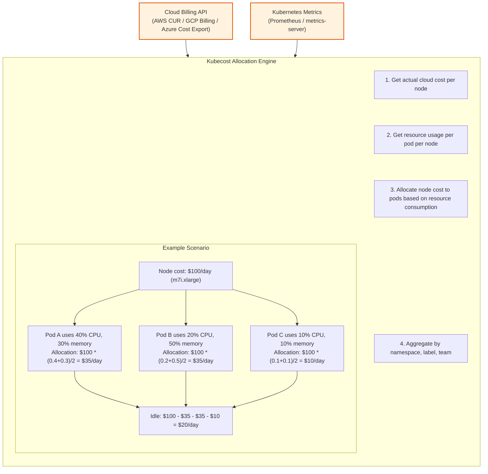
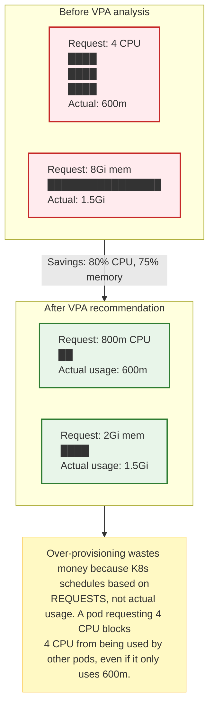

> **Complexity**: `[MEDIUM]`
>
> **Time to Complete**: 2 hours
>
> **Prerequisites**: Basic understanding of Kubernetes resource requests/limits and cloud billing concepts
>
> **Track**: Advanced Cloud Operations

## What You'll Be Able to Do

After completing this module, you will be able to:

- **Implement FinOps practices with cloud-native cost allocation tagging, showback, and chargeback mechanisms**
- **Configure Kubernetes cost visibility using Kubecost, OpenCost, or cloud-native cost tools across multi-cluster environments**
- **Optimize compute costs using reserved instances, committed use discounts, Spot/preemptible instances, and right-sizing**
- **Design automated cost anomaly detection and budget alerting pipelines that trigger remediation actions**

---

## Why This Module Matters

A fast-growing company with a large cloud bill.

Leadership realized cloud spend was growing faster than expected, but the organization still lacked workload-level cost visibility and could not answer basic ownership questions from provider billing alone.

Detailed cost reviews often uncover underutilized compute, steady workloads still billed at on-demand rates, orphaned storage, long-lived temporary environments, and overlooked network-transfer charges.

Applying right-sizing, commitment discounts, workload-level cost allocation, and carefully chosen interruptible capacity can materially reduce cloud spend without requiring application rewrites.

---

## The Four Pillars of Cloud Cost Optimization

```mermaid
graph TD
    classDef pillar fill:#f9f9f9,stroke:#333,stroke-width:2px;
    classDef header fill:#e1f5fe,stroke:#0288d1,stroke-width:2px;

    title[COST OPTIMIZATION FRAMEWORK]:::header

    subgraph Optimization Process [ ]
        direction LR
        P1["1. VISIBILITY<br/>'Where does the money go?'<br/>- Cost allocation<br/>- Showback/chargeback<br/>- Kubecost/OpenCost"]:::pillar
        P2["2. RIGHT-SIZING<br/>'Are resources matched to actual usage?'<br/>- CPU/memory utilization<br/>- VPA recommendations<br/>- Node right-sizing"]:::pillar
        P3["3. RATE OPTIMIZATION<br/>'Are we paying the best price?'<br/>- Savings Plans/CUDs<br/>- Reserved Instances<br/>- Committed Use"]:::pillar
        P4["4. ARCHITECTURAL<br/>'Can we change HOW we run things?'<br/>- Spot/preemptible instances<br/>- Topology-aware routing<br/>- Ephemeral environments<br/>- Orphaned resource cleanup"]:::pillar

        P1 --> P2 --> P3 --> P4
    end
    
    note[Implementation order: 1 --> 2 --> 3 --> 4<br/>You can't optimize what you can't see.]
    Optimization Process --> note
```

---

> **Pause and predict**: If three teams share a single Kubernetes node, how can you determine who pays for what?

## Pillar 1: Visibility with Kubecost and OpenCost

Kubernetes makes cost allocation hard because workloads share nodes. If three teams run pods on the same node, who pays for that node?

### Kubecost Architecture



### Installing Kubecost

```bash
# Install Kubecost via Helm
helm repo add kubecost https://kubecost.github.io/cost-analyzer/
helm repo update

helm install kubecost kubecost/cost-analyzer \
  --namespace kubecost \
  --create-namespace \
  --set kubecostToken="YOUR_TOKEN" \
  --set prometheus.server.retention="30d" \
  --set kubecostProductConfigs.clusterName="prod-us-east-1"

# For multi-cluster, install the agent on each cluster
# and point to a central Kubecost instance
helm install kubecost kubecost/cost-analyzer \
  --namespace kubecost \
  --create-namespace \
  --set agent.enabled=true \
  --set kubecostProductConfigs.clusterName="prod-eu-west-1" \
  --set federatedETL.primaryCluster="https://kubecost.prod-us-east-1.internal"

# Access the Kubecost UI
kubectl port-forward -n kubecost svc/kubecost-cost-analyzer 9090:9090
```

### OpenCost: The Open-Source Alternative

```bash
# OpenCost is CNCF-supported and free
helm repo add opencost https://opencost.github.io/opencost-helm-chart
helm repo update

helm install opencost opencost/opencost \
  --namespace opencost \
  --create-namespace \
  --set opencost.exporter.defaultClusterId="prod-us-east-1" \
  --set opencost.ui.enabled=true

# Query the API for cost allocation
curl http://localhost:9003/allocation/compute \
  --data-urlencode "window=7d" \
  --data-urlencode "aggregate=namespace" \
  --data-urlencode "accumulate=true" | jq '.data[0]'
```

### Multi-Tenant Cost Allocation

```yaml
# Label-based cost allocation strategy
# Every workload MUST have these labels for cost tracking
apiVersion: apps/v1
kind: Deployment
metadata:
  name: recommendation-engine
  namespace: ml-platform
  labels:
    team: ml-engineering
    cost-center: CC-4200
    product: recommendations
    environment: production
spec:
  template:
    metadata:
      labels:
        team: ml-engineering
        cost-center: CC-4200
        product: recommendations
        environment: production
    spec:
      containers:
        - name: engine
          image: company/rec-engine:v2.1.0
          resources:
            requests:
              cpu: "2"
              memory: "4Gi"
            limits:
              cpu: "4"
              memory: "8Gi"
```

```bash
# Enforce required labels with Kyverno
kubectl apply -f - <<'EOF'
apiVersion: kyverno.io/v1
kind: ClusterPolicy
metadata:
  name: require-cost-labels
spec:
  validationFailureAction: Enforce
  rules:
    - name: check-cost-labels
      match:
        any:
          - resources:
              kinds:
                - Deployment
                - StatefulSet
                - Job
      validate:
        message: "All workloads must have 'team', 'cost-center', and 'environment' labels"
        pattern:
          metadata:
            labels:
              team: "?*"
              cost-center: "?*"
              environment: "production|staging|development"
EOF
```

---

> **Stop and think**: Why is over-provisioning a pod's requested CPU worse than over-provisioning its limits?

## Pillar 2: Right-Sizing with VPA and HPA

The most common waste pattern in Kubernetes: developers set resource requests based on guesswork, then never revisit them.

### Vertical Pod Autoscaler (VPA) for Right-Sizing



```yaml
# VPA in recommendation mode (safe -- doesn't change anything)
apiVersion: autoscaling.k8s.io/v1
kind: VerticalPodAutoscaler
metadata:
  name: recommendation-engine-vpa
  namespace: ml-platform
spec:
  targetRef:
    apiVersion: apps/v1
    kind: Deployment
    name: recommendation-engine
  updatePolicy:
    updateMode: "Off"  # Only recommend, don't auto-apply
  resourcePolicy:
    containerPolicies:
      - containerName: engine
        minAllowed:
          cpu: "100m"
          memory: "256Mi"
        maxAllowed:
          cpu: "8"
          memory: "16Gi"
```

```bash
# Check VPA recommendations
kubectl get vpa recommendation-engine-vpa -n ml-platform -o yaml

# The recommendation section shows:
# - lowerBound: minimum safe resources
# - target: recommended resources
# - upperBound: maximum expected resources
# - uncappedTarget: ideal without min/max constraints

# Example output:
# recommendation:
#   containerRecommendations:
#     - containerName: engine
#       lowerBound:
#         cpu: 500m
#         memory: 1Gi
#       target:
#         cpu: 800m
#         memory: 2Gi
#       upperBound:
#         cpu: 1500m
#         memory: 4Gi
```

**A Note on VPA Auto-Update:** For bursty or unpredictable workloads, review VPA recommendations carefully before applying them automatically, and pair right-sizing with HPA when you need elastic horizontal scaling.

### HPA for Cost-Efficient Scaling

```yaml
# HPA with both CPU and custom metrics
apiVersion: autoscaling/v2
kind: HorizontalPodAutoscaler
metadata:
  name: api-server-hpa
  namespace: production
spec:
  scaleTargetRef:
    apiVersion: apps/v1
    kind: Deployment
    name: api-server
  minReplicas: 2
  maxReplicas: 20
  behavior:
    scaleDown:
      stabilizationWindowSeconds: 300  # Wait 5 min before scaling down
      policies:
        - type: Percent
          value: 25      # Scale down max 25% at a time
          periodSeconds: 60
    scaleUp:
      stabilizationWindowSeconds: 30
      policies:
        - type: Percent
          value: 100     # Can double immediately under load
          periodSeconds: 60
  metrics:
    - type: Resource
      resource:
        name: cpu
        target:
          type: Utilization
          averageUtilization: 70  # Target 70% CPU utilization
    - type: Resource
      resource:
        name: memory
        target:
          type: Utilization
          averageUtilization: 75
```

---

> **Pause and predict**: If your application traffic doubles every year, is it more cost-effective to buy 3-year Reserved Instances or stick to 1-year commitments?

## Pillar 3: Rate Optimization

### Savings Plans and Committed Use Discounts

```mermaid
graph TD
    classDef provider fill:#eceff1,stroke:#607d8b,stroke-width:2px;
    classDef strategy fill:#e3f2fd,stroke:#1565c0,stroke-width:2px;

    subgraph AWS ["AWS (m7i.xlarge)"]
        A1["On-Demand: $0.192/hr"]
        A2["1yr Savings Plan: $0.121/hr (-37%)"]
        A3["3yr Savings Plan: $0.077/hr (-60%)"]
        A4["Spot: $0.058/hr (-70%, interruptible)"]
    end:::provider

    subgraph GCP ["GCP (n2-standard-4)"]
        G1["On-Demand: $0.189/hr"]
        G2["1yr CUD: $0.119/hr (-37%)"]
        G3["3yr CUD: $0.085/hr (-55%)"]
        G4["Spot: $0.057/hr (-70%)"]
        G5["SUDs (automatic): $0.151/hr (-20%)"]
    end:::provider

    subgraph Azure ["Azure (D4s v5)"]
        Z1["On-Demand: $0.192/hr"]
        Z2["1yr Reserved: $0.124/hr (-35%)"]
        Z3["3yr Reserved: $0.079/hr (-59%)"]
        Z4["Spot: ~$0.038/hr (-80%)"]
    end:::provider

    subgraph STRATEGY ["Optimization Strategy"]
        S1["Baseline (24/7 workloads) --> Savings Plan / CUD"]
        S2["Bursty (predictable peaks) --> On-demand"]
        S3["Fault-tolerant (batch, CI) --> Spot instances"]
        S4["Development --> Spot + auto-shutdown"]
    end:::strategy
```

### Calculating Your Savings Plan Commitment

```bash
# AWS: Analyze your usage to determine the right commitment
aws ce get-savings-plans-purchase-recommendation \
  --savings-plans-type COMPUTE_SAVINGS_PLANS \
  --term-in-years ONE_YEAR \
  --payment-option NO_UPFRONT \
  --lookback-period-in-days SIXTY_DAYS \
  --output json | jq '.SavingsPlansPurchaseRecommendation'

# The output tells you:
# - Recommended hourly commitment (e.g., $12.50/hr)
# - Estimated monthly savings (e.g., $2,800/month)
# - Coverage percentage (e.g., 72% of on-demand usage)

# GCP: Analyze committed use
gcloud billing accounts describe BILLING_ACCOUNT_ID --format=json
# Use the GCP Billing Console > Committed use discounts > Analysis
```

---

> **Stop and think**: If Spot instances can be terminated at any time, what types of applications are completely unsuitable for them?

## Pillar 4: Spot Instance Lifecycle

Interruptible capacity on the major clouds can be substantially cheaper than on-demand pricing, but the exact discount and interruption behavior vary by provider, region, and instance type.

**Spot Instance Golden Rules:** Because eviction notice windows are short and provider-specific, use Spot only for workloads that tolerate interruption, recover cleanly on other nodes, and do not depend on a single local-stateful replica.

### Spot-Friendly Node Groups

```yaml
# EKS managed node group with Spot instances
apiVersion: eksctl.io/v1alpha5
kind: ClusterConfig
metadata:
  name: prod-cluster
  region: us-east-1
nodeGroups:
  # On-demand for critical workloads
  - name: on-demand-critical
    instanceType: m7i.xlarge
    desiredCapacity: 3
    minSize: 3
    maxSize: 6
    labels:
      node-type: on-demand
      workload-class: critical
    taints:
      - key: workload-class
        value: critical
        effect: NoSchedule

  # Spot for non-critical workloads
  - name: spot-general
    instanceTypes:
      - m7i.xlarge
      - m6i.xlarge
      - m5.xlarge
      - c7i.xlarge    # Diversify instance types
    spot: true
    desiredCapacity: 5
    minSize: 2
    maxSize: 15
    labels:
      node-type: spot
      workload-class: general
```

### Pod Scheduling for Spot

```yaml
# Non-critical workload: prefers Spot, tolerates interruption
apiVersion: apps/v1
kind: Deployment
metadata:
  name: batch-processor
  namespace: data-pipeline
spec:
  replicas: 8
  selector:
    matchLabels:
      app: batch-processor
  template:
    metadata:
      labels:
        app: batch-processor
    spec:
      # Prefer Spot nodes
      affinity:
        nodeAffinity:
          preferredDuringSchedulingIgnoredDuringExecution:
            - weight: 90
              preference:
                matchExpressions:
                  - key: node-type
                    operator: In
                    values:
                      - spot
      # Tolerate Spot taints
      tolerations:
        - key: "kubernetes.io/spot"
          operator: "Exists"
          effect: "NoSchedule"
      # Handle graceful shutdown on Spot interruption
      terminationGracePeriodSeconds: 120
      containers:
        - name: processor
          image: company/batch-processor:v1.8.0
          resources:
            requests:
              cpu: "1"
              memory: "2Gi"
          # Checkpoint progress periodically so interruption loses minimal work
          env:
            - name: CHECKPOINT_INTERVAL_SECONDS
              value: "30"
```

### Spot Interruption Handling

```yaml
# AWS Node Termination Handler (NTH)
# Detects Spot interruption notices and gracefully drains nodes
# Install via Helm:
# helm install aws-node-termination-handler \
#   eks/aws-node-termination-handler \
#   --namespace kube-system

# Karpenter: Automatically replaces interrupted Spot nodes
apiVersion: karpenter.sh/v1
kind: NodePool
metadata:
  name: spot-pool
spec:
  template:
    spec:
      requirements:
        - key: karpenter.sh/capacity-type
          operator: In
          values: ["spot"]
        - key: node.kubernetes.io/instance-type
          operator: In
          values:
            - m7i.xlarge
            - m7i.2xlarge
            - m6i.xlarge
            - m6i.2xlarge
            - c7i.xlarge
            - r7i.xlarge
      nodeClassRef:
        group: karpenter.k8s.aws
        kind: EC2NodeClass
        name: default
  disruption:
    consolidationPolicy: WhenEmpty
    consolidateAfter: 60s
  limits:
    cpu: "100"
    memory: "400Gi"
```

## Automated Budget Alerting and Anomaly Detection

Visibility is only useful if it drives action. Relying on humans to check dashboards guarantees that cost spikes will go unnoticed until the end of the month. You must implement automated budget alerting and anomaly detection pipelines.

### Kubecost Alerts

Kubecost can send alerts directly to Slack or Microsoft Teams when a namespace exceeds its daily budget or when spending anomalies occur.

```yaml
# Kubecost custom values.yaml for alerting
kubecostProductConfigs:
  currencyCode: "USD"
  slackWebhookUrl: "https://hooks.slack.com/services/T000/B000/XXX"
  
  # Alert if any namespace jumps more than 20% compared to a 3-day baseline
  spendChangeAlerts:
    enabled: true
    baselineWindow: "3d"
    spendChangePercentage: 20
    
  # Alert if the ml-platform namespace exceeds $50/day
  budgetAlerts:
    - name: "ml-platform-budget"
      namespace: "ml-platform"
      budget: 50
      window: "1d"
```

### Cloud Provider Anomaly Remediation

For cloud-native resources, you can use [AWS Budgets](https://docs.aws.amazon.com/awsaccountbilling/latest/aboutv2/budgets-controls.html) or [GCP Budgets](https://cloud.google.com/billing/docs/how-to/budgets) to trigger automated remediation (like shutting down a runaway dev environment) when a threshold is breached.

```yaml
# AWS Budget with an automated SNS action
apiVersion: cloudformation.aws.crossplane.io/v1alpha1
kind: Stack
metadata:
  name: dev-budget-alerter
spec:
  forProvider:
    templateBody: |
      Resources:
        DevBudget:
          Type: "AWS::Budgets::Budget"
          Properties:
            Budget:
              BudgetName: "DevCluster-Daily"
              BudgetLimit:
                Amount: 100
                Unit: USD
              TimeUnit: DAILY
              BudgetType: COST
            NotificationsWithSubscribers:
              - Notification:
                  NotificationType: ACTUAL
                  ComparisonOperator: GREATER_THAN
                  Threshold: 100
                Subscribers:
                  - SubscriptionType: SNS
                    Address: "arn:aws:sns:us-east-1:123456789012:CostAlerts"
```

Once the SNS topic receives the budget breach, it can trigger an AWS Lambda function that acts as a remediation pipeline—for example, automatically patching the cluster's node group `desiredCapacity` to `0` to halt further charges.

---

> **Pause and predict**: When a Kubernetes namespace is deleted, what cloud resources might be left behind?

## Orphaned Resource Cleanup

Orphaned resources are cloud resources that are no longer attached to any active workload but continue accruing charges. They are the silent budget killer.

### Common Orphaned Resources

| Resource | How It Gets Orphaned | Monthly Cost (typical) |
|---|---|---|
| Unattached EBS volumes | PVC deleted, PV not reclaimed | Recurring storage charges that scale with size and volume type |
| Unused Elastic IPs | Service deleted, EIP not released | Ongoing hourly public IPv4 charges until released |
| Old EBS snapshots | Backup policy with no expiry | Recurring snapshot storage charges until deleted or archived |
| Idle load balancers | Service deleted, LB remains | Ongoing hourly and usage-based charges until deleted |
| Stopped EC2 instances | "Paused" but never terminated | EBS costs continue |
| Orphaned NAT Gateways | VPC deleted, NAT GW remains | Ongoing hourly and data-processing charges until deleted |
| Unused RDS snapshots | Manual snapshots accumulated | Recurring snapshot storage charges until deleted |

### Automated Cleanup

```bash
# Find unattached EBS volumes
aws ec2 describe-volumes \
  --filters Name=status,Values=available \
  --query 'Volumes[*].{ID:VolumeId,Size:Size,Created:CreateTime,AZ:AvailabilityZone}' \
  --output table

# Find unused Elastic IPs
aws ec2 describe-addresses \
  --query 'Addresses[?AssociationId==null].{IP:PublicIp,AllocID:AllocationId}' \
  --output table

# Find load balancers with no targets
for LB_ARN in $(aws elbv2 describe-load-balancers --query 'LoadBalancers[*].LoadBalancerArn' --output text); do
  TG_COUNT=$(aws elbv2 describe-target-groups \
    --load-balancer-arn $LB_ARN \
    --query 'length(TargetGroups)' --output text)
  if [ "$TG_COUNT" = "0" ]; then
    LB_NAME=$(aws elbv2 describe-load-balancers \
      --load-balancer-arns $LB_ARN \
      --query 'LoadBalancers[0].LoadBalancerName' --output text)
    echo "ORPHANED LB: $LB_NAME ($LB_ARN)"
  fi
done

# Find EBS snapshots older than 90 days
NINETY_DAYS_AGO=$(date -u -v-90d +%Y-%m-%dT%H:%M:%S 2>/dev/null || date -u -d '90 days ago' +%Y-%m-%dT%H:%M:%S)
aws ec2 describe-snapshots \
  --owner-ids self \
  --query "Snapshots[?StartTime<='${NINETY_DAYS_AGO}'].{ID:SnapshotId,Size:VolumeSize,Date:StartTime}" \
  --output table
```

```yaml
# CronJob to detect and report orphaned resources
apiVersion: batch/v1
kind: CronJob
metadata:
  name: orphan-detector
  namespace: finops
spec:
  schedule: "0 8 * * 1"  # Every Monday at 8 AM
  jobTemplate:
    spec:
      template:
        spec:
          serviceAccountName: orphan-detector
          containers:
            - name: detector
              image: company/orphan-detector:v1.2.0
              env:
                - name: SLACK_WEBHOOK
                  valueFrom:
                    secretKeyRef:
                      name: slack-webhook
                      key: url
                - name: STALE_THRESHOLD_DAYS
                  value: "30"
              command:
                - /bin/sh
                - -c
                - |
                  echo "Scanning for orphaned resources..."
                  # Detect unattached volumes
                  VOLUMES=$(aws ec2 describe-volumes --filters Name=status,Values=available \
                    --query 'length(Volumes)' --output text)
                  # Detect unused EIPs
                  EIPS=$(aws ec2 describe-addresses \
                    --query 'length(Addresses[?AssociationId==null])' --output text)
                  # Send report to Slack
                  curl -X POST "$SLACK_WEBHOOK" -H 'Content-type: application/json' \
                    --data "{\"text\":\"Orphan Report: $VOLUMES unattached volumes, $EIPS unused EIPs\"}"
          restartPolicy: OnFailure
```

---

## Did You Know?

1. **Many Kubernetes environments run below their provisioned capacity.** Over-provisioned resource requests are a common source of waste, and recommendation tooling can help identify safer right-sizing opportunities before you change live workloads.

2. **AWS publishes rolling interruption-frequency data for Spot capacity.** Interruption rates vary by instance type and region, so check current Spot Advisor data and diversify across instance pools and Availability Zones instead of relying on fixed example percentages.

3. **Cross-zone or cross-AZ network traffic can become a meaningful Kubernetes cost driver.** Provider pricing differs, so verify your platform's current network charges before treating topology-aware routing as a cost-optimization lever.

4. [**OpenCost became a CNCF Sandbox project in 2022** and reached Incubation status in 2024](https://www.cncf.io/projects/opencost/). [It was originally developed by Kubecost as the open-source core of their commercial product](https://github.com/opencost/opencost). The CNCF adoption signaled that Kubernetes cost management was becoming a first-class concern alongside security and observability. OpenCost's APIs and data model are increasingly used across the Kubernetes cost-management ecosystem.

---

## Common Mistakes

| Mistake | Why It Happens | How to Fix It |
|---|---|---|
| Setting resource requests to match limits | "Same value means guaranteed QoS" | Requests should reflect typical usage, limits reflect peak. VPA recommendations help find the right values. Over-requesting wastes money. |
| Buying Savings Plans based on current usage | "We're using $10K/month now, commit to $10K" | Usage fluctuates. Commit conservatively to stable baseline usage and validate it with provider recommendation tools before buying long-term commitments. |
| Running dev/staging clusters 24/7 | "Someone might need them on weekends" | Implement auto-shutdown for non-production clusters and scale down idle capacity outside working hours to cut spend substantially. |
| Not diversifying Spot instance types | "We need m7i.xlarge specifically" | Single-type Spot pools are more fragile. Use multiple compatible instance types, and let provisioning tools such as Karpenter manage that diversity where appropriate. |
| Ignoring namespace-level resource quotas | "Trust developers to be reasonable" | Without quotas, one team can consume the entire cluster. Set ResourceQuotas per namespace based on team budgets. |
| No cost alerts or budgets | "We check the bill monthly" | By the time you see the monthly bill, the damage is done. Set budget alerts at 50%, 80%, and 100% thresholds for each account. |
| Deleting Spot nodes during business hours | "Karpenter consolidated idle nodes" | Configure consolidation windows to avoid Spot node replacement during peak hours. Use `disruption.consolidateAfter` to delay. |
| Not accounting for EBS costs separately from EC2 | "Compute is our biggest cost" | EBS volumes persist after pods are deleted. Monitor PVC lifecycle and implement `reclaimPolicy: Delete` for non-production volumes. |

---

## Quiz

<details>
<summary>1. Your CFO hands you the monthly AWS bill, pointing to a single $45,000 line item for EC2 instances in your production EKS cluster. She asks you to split this cost between the Data Science team and the Frontend team. Why is this impossible to do accurately using just the AWS Billing Console?</summary>

Cloud billing consoles only show costs per infrastructure resource (like EC2 instances or EBS volumes), not per Kubernetes workload. Because Kubernetes schedules pods from multiple teams onto the same shared nodes, a single $500/month EC2 instance might be running three Data Science jobs and two Frontend APIs simultaneously. To accurately split this cost, you need a tool like Kubecost or OpenCost that merges the billing data (the node's actual price) with Kubernetes metrics (how much CPU and memory each team's pods consumed on that specific node) and aggregates it via namespace or label. Without this workload-level correlation, any cost splitting is just a blind guess.
</details>

<details>
<summary>2. During a cost review, you notice the `recommendation-engine` deployment is consistently using only 15% of its requested CPU, while traffic patterns are highly unpredictable. Your junior engineer suggests implementing VPA in auto-update mode to fix the waste. Why might a combination of VPA (in recommendation mode) and HPA be a better financial and architectural decision?</summary>

If you use VPA in auto-update mode on an unpredictable workload, it will aggressively scale down the pod's CPU requests during quiet periods, which can lead to severe CPU throttling and performance degradation when traffic spikes suddenly. Instead, you should use VPA in "Off" (recommendation) mode to determine the optimal baseline size for a single pod based on historical data. Then, implement HPA to dynamically add or remove those correctly-sized pods based on real-time traffic demand. By right-sizing the individual pods with VPA insights and scaling their count horizontally with HPA, you eliminate the baseline waste of over-provisioning while maintaining the elasticity needed to handle sudden traffic peaks gracefully.
</details>

<details>
<summary>3. Your infrastructure currently incurs $10,000/month in on-demand EC2 usage for backend services that run 24/7. Your procurement manager suggests committing to a $10,000/month Compute Savings Plan to maximize discounts. Why is this a dangerous financial strategy?</summary>

Committing to the full $10,000 is a mistake because Savings Plans lock you into a minimum hourly spend regardless of your actual usage. If your usage drops due to future right-sizing, architectural changes, or migration, you will still be forced to pay the fully committed amount for idle capacity. Instead, you should commit to only 60-70% of your current baseline to maintain flexibility for dynamic scaling and optimization. The remaining infrastructure can run on on-demand pricing, or ideally on Spot instances for fault-tolerant workloads, which provide deeper discounts without any long-term commitment.
</details>

<details>
<summary>4. Your team wants to migrate a legacy monolithic application to a Spot instance node group to save 70% on compute costs. The application takes 5 minutes to gracefully shut down, requires persistent local disk state, and runs as a single replica. Why will this migration result in a catastrophic production outage?</summary>

Spot instances can be reclaimed by the cloud provider with only a 2-minute interruption warning. Since the legacy monolith takes 5 minutes to shut down, it will be forcefully terminated before it finishes its shutdown sequence, leading to data corruption or incomplete transactions. Furthermore, because it relies on local disk state and runs as a single replica, the entire application will go offline and lose its state when the underlying node disappears. Spot instances are only safe for stateless, fault-tolerant workloads that can gracefully terminate within 2 minutes and have multiple replicas distributed across different nodes to ensure continuous availability during interruptions.
</details>

<details>
<summary>5. Your engineering team maintains a dedicated development EKS cluster that costs $3,000/month and is only actively used by developers Monday through Friday from 9 AM to 6 PM. How much could you realistically save, and what mechanisms would you use to achieve this?</summary>

Because business hours represent roughly 45 hours out of a 168-hour week, leaving the cluster running 24/7 means you are paying for unused capacity 73% of the time. By implementing a scheduled auto-shutdown strategy that scales node groups down to zero outside of business hours, you can save approximately $2,190 per month. This can be achieved using tools like Karpenter with scheduled consolidation, custom CronJobs that manipulate node group sizes, or specialized downscaler controllers. Beyond compute nodes, you should also automate the suspension of NAT Gateways and LoadBalancers during these off-hours to eliminate all residual infrastructure costs.
</details>

<details>
<summary>6. You recently deleted a large development namespace containing StatefulSets, LoadBalancer services, and hundreds of pods. A month later, your cloud bill shows an unexpected $800 charge associated with the deleted environment. What specific Kubernetes architectural mechanisms likely caused these resources to be orphaned and continue accruing charges?</summary>

When deleting Kubernetes resources, the underlying cloud infrastructure isn't always automatically cleaned up due to default retention policies. The most likely culprit for the $800 charge is unattached EBS volumes left behind by the StatefulSets, because the default `StorageClass` often uses `reclaimPolicy: Retain`, meaning the cloud disk persists even after the PersistentVolumeClaim is deleted. Additionally, if the LoadBalancer services were forcefully deleted or the namespace was abruptly terminated without allowing controllers to finalize cleanup, the cloud provider's Load Balancers and associated Elastic IPs would remain active. To prevent this, you must configure `reclaimPolicy: Delete` for non-critical storage and implement automated scanning tools to detect and alert on unattached cloud resources. This ensures cloud provider costs are stopped when cluster resources are removed.
</details>

---

## Hands-On Exercise: Cost Optimization Audit

In this exercise, you will perform a cost optimization audit on a Kubernetes cluster.

### Prerequisites

- A running Kubernetes cluster (kind, minikube, or cloud)
- kubectl installed
- Metrics server installed (for VPA)

### Task 1: Identify Over-Provisioned Workloads

Deploy some intentionally over-provisioned workloads and use kubectl to identify waste.

<details>
<summary>Solution</summary>

```bash
# Create a kind cluster with metrics server
kind create cluster --name cost-lab

# Install metrics server
kubectl apply -f https://github.com/kubernetes-sigs/metrics-server/releases/latest/download/components.yaml

# Patch for kind (insecure kubelet)
kubectl patch deployment metrics-server -n kube-system \
  --type='json' -p='[{"op": "add", "path": "/spec/template/spec/containers/0/args/-", "value": "--kubelet-insecure-tls"}]'

# Wait for metrics server
sleep 30
kubectl wait --for=condition=Ready pod -l k8s-app=metrics-server -n kube-system --timeout=120s

# Deploy over-provisioned workloads
kubectl create namespace cost-audit

kubectl apply -f - <<'EOF'
apiVersion: apps/v1
kind: Deployment
metadata:
  name: api-server-wasteful
  namespace: cost-audit
  labels:
    team: backend
    cost-center: CC-1000
spec:
  replicas: 5
  selector:
    matchLabels:
      app: api-server
  template:
    metadata:
      labels:
        app: api-server
        team: backend
    spec:
      containers:
        - name: api
          image: nginx:stable
          resources:
            requests:
              cpu: "2"
              memory: "4Gi"
            limits:
              cpu: "4"
              memory: "8Gi"
---
apiVersion: apps/v1
kind: Deployment
metadata:
  name: worker-wasteful
  namespace: cost-audit
  labels:
    team: data
    cost-center: CC-2000
spec:
  replicas: 3
  selector:
    matchLabels:
      app: worker
  template:
    metadata:
      labels:
        app: worker
        team: data
    spec:
      containers:
        - name: worker
          image: nginx:stable
          resources:
            requests:
              cpu: "1"
              memory: "2Gi"
            limits:
              cpu: "2"
              memory: "4Gi"
EOF

# Wait for pods (some will be Pending due to insufficient resources)
sleep 15

# Check actual usage vs requests
echo "=== Pod Resource Usage vs Requests ==="
kubectl top pods -n cost-audit 2>/dev/null || echo "Metrics not ready yet, wait 60s"

# Compare requests to actual usage
kubectl get pods -n cost-audit -o custom-columns=\
NAME:.metadata.name,\
CPU_REQ:.spec.containers[0].resources.requests.cpu,\
MEM_REQ:.spec.containers[0].resources.requests.memory,\
STATUS:.status.phase
```
</details>

### Task 2: Calculate the Waste

<details>
<summary>Solution</summary>

```bash
# Calculate total requested vs actual
echo "=== Requested Resources ==="
echo "api-server: 5 pods x 2 CPU = 10 CPU requested"
echo "api-server: 5 pods x 4Gi = 20Gi memory requested"
echo "worker: 3 pods x 1 CPU = 3 CPU requested"
echo "worker: 3 pods x 2Gi = 6Gi memory requested"
echo ""
echo "TOTAL REQUESTED: 13 CPU, 26Gi memory"
echo ""
echo "At m7i.xlarge pricing ($0.192/hr, 4 CPU, 16Gi):"
echo "13 CPU / 4 CPU per node = 4 nodes needed (by CPU)"
echo "26Gi / 16Gi per node = 2 nodes needed (by memory)"
echo "Limiting factor: CPU (4 nodes)"
echo ""
echo "Cost: 4 nodes x $0.192/hr x 730 hours = $561/month"
echo ""
echo "=== Actual Usage (nginx idle) ==="
echo "Each nginx pod uses ~5m CPU and ~5Mi memory"
echo "Total actual: ~40m CPU, ~40Mi memory"
echo "Actual need: 1 node (easily)"
echo ""
echo "WASTE: $561 - $140 (1 node) = $421/month (75% waste)"
echo ""
echo "=== VPA Recommendations ==="
echo "api-server: request 50m CPU, 64Mi memory (from 2 CPU, 4Gi)"
echo "worker: request 50m CPU, 64Mi memory (from 1 CPU, 2Gi)"
```
</details>

### Task 3: Apply Right-Sizing

<details>
<summary>Solution</summary>

```bash
# Right-size the deployments based on "VPA recommendations"
kubectl patch deployment api-server-wasteful -n cost-audit --type=json -p='[
  {"op": "replace", "path": "/spec/template/spec/containers/0/resources/requests/cpu", "value": "100m"},
  {"op": "replace", "path": "/spec/template/spec/containers/0/resources/requests/memory", "value": "128Mi"},
  {"op": "replace", "path": "/spec/template/spec/containers/0/resources/limits/cpu", "value": "500m"},
  {"op": "replace", "path": "/spec/template/spec/containers/0/resources/limits/memory", "value": "256Mi"}
]'

kubectl patch deployment worker-wasteful -n cost-audit --type=json -p='[
  {"op": "replace", "path": "/spec/template/spec/containers/0/resources/requests/cpu", "value": "100m"},
  {"op": "replace", "path": "/spec/template/spec/containers/0/resources/requests/memory", "value": "128Mi"},
  {"op": "replace", "path": "/spec/template/spec/containers/0/resources/limits/cpu", "value": "500m"},
  {"op": "replace", "path": "/spec/template/spec/containers/0/resources/limits/memory", "value": "256Mi"}
]'

# Verify all pods are now Running (they fit on fewer nodes)
kubectl get pods -n cost-audit

echo "=== After Right-Sizing ==="
echo "api-server: 5 pods x 100m CPU = 500m CPU requested"
echo "worker: 3 pods x 100m CPU = 300m CPU requested"
echo "TOTAL: 800m CPU, ~1Gi memory"
echo "Fits on 1 node easily. Savings: 75%"
```
</details>

### Task 4: Create a Cost Optimization Report

Write a cost optimization report for a fictional team based on the audit findings.

<details>
<summary>Solution</summary>

```markdown
# Cost Optimization Report: Cost-Audit Namespace

## Executive Summary
Current monthly spend: ~$561 (4 nodes at on-demand pricing)
Optimized monthly spend: ~$140 (1 node at on-demand pricing)
Potential savings: $421/month ($5,052/year) -- 75% reduction

## Findings

### 1. Over-Provisioned Resources (Impact: $421/month)
- api-server requests 2 CPU per pod but uses ~5m (0.25%)
- worker requests 1 CPU per pod but uses ~5m (0.5%)
- Total CPU requested: 13 cores. Total used: 40 millicores.
- Recommendation: Reduce requests to 100m CPU, 128Mi memory

### 2. No Horizontal Pod Autoscaler (Impact: TBD)
- api-server runs 5 replicas constantly
- Likely needs 2 replicas at baseline, scale to 5 during peak
- Recommendation: Add HPA with min=2, max=8, target CPU=70%
- Estimated additional savings: 40% during off-peak

### 3. On-Demand Pricing (Impact: ~$50/month)
- Workloads run 24/7, perfect for Savings Plans
- With 1-year Compute Savings Plan: $140 * 0.63 = $88/month
- Savings: $52/month

## Recommended Actions (priority order)
1. Apply right-sized resource requests (immediate, $421/month)
2. Add HPA for api-server (1 day, ~$30/month additional)
3. Purchase Savings Plan for baseline compute (1 week, ~$50/month)

## Total Estimated Savings: $501/month ($6,012/year)
```
</details>

### Clean Up

```bash
kind delete cluster --name cost-lab
```

### Success Criteria

- [ ] Over-provisioned workloads deployed and identified
- [ ] Waste quantified in dollar terms
- [ ] Right-sized resource requests applied
- [ ] All pods running after right-sizing (no OOM or throttling)
- [ ] Cost optimization report includes specific dollar savings

---

## Next Module

[Module 8.9: Large-Scale Observability & Telemetry](../module-8.9-observability-scale/) -- You can see where the money goes. Now learn how to see where the problems are. Multi-cluster Prometheus with Thanos, OpenTelemetry at scale, and the art of monitoring Kubernetes without drowning in data.

## Sources

- [cncf.io: opencost](https://www.cncf.io/projects/opencost/) — The CNCF project page directly states the acceptance and incubation dates.
- [github.com: opencost](https://github.com/opencost/opencost) — The OpenCost repository states both its Kubecost origin and that it is a free, open-source distribution.
- [docs.aws.amazon.com: budgets controls.html](https://docs.aws.amazon.com/awsaccountbilling/latest/aboutv2/budgets-controls.html) — AWS Budgets documentation explicitly describes automatic budget actions at thresholds.
- [cloud.google.com: budgets](https://cloud.google.com/billing/docs/how-to/budgets) — Google Cloud Billing documentation directly says budgets can automate cost control responses using programmatic notifications.
- [github.com: aws node termination handler](https://github.com/aws/aws-node-termination-handler) — The upstream README directly documents Spot interruption detection and cordon/drain behavior.
- [docs.aws.amazon.com: ebs delete ebs volumes.html](https://docs.aws.amazon.com/prescriptive-guidance/latest/optimize-costs-microsoft-workloads/ebs-delete-ebs-volumes.html) — General lesson point for an illustrative rewrite.
- [aws.amazon.com: pricing](https://aws.amazon.com/vpc/pricing/) — General lesson point for an illustrative rewrite.
- [docs.aws.amazon.com: ebs snapshots.html](https://docs.aws.amazon.com/ebs/latest/userguide/ebs-snapshots.html) — General lesson point for an illustrative rewrite.
- [aws.amazon.com: pricing](https://aws.amazon.com/elasticloadbalancing/pricing//) — General lesson point for an illustrative rewrite.
- [aws.amazon.com: backup](https://aws.amazon.com/rds/features/backup/) — General lesson point for an illustrative rewrite.
- [docs.aws.amazon.com: get savings plans purchase recommendation.html](https://docs.aws.amazon.com/cli/latest/reference/ce/get-savings-plans-purchase-recommendation.html) — General lesson point for an illustrative rewrite.
- [aws.amazon.com: pricing](https://aws.amazon.com/ec2/pricing/) — General lesson point for an illustrative rewrite.
- [aws.amazon.com: applying spot to spot consolidation best practices with karpenter](https://aws.amazon.com/blogs/compute/applying-spot-to-spot-consolidation-best-practices-with-karpenter/) — General lesson point for an illustrative rewrite.
- [Topology Aware Routing](https://kubernetes.io/docs/concepts/services-networking/topology-aware-routing/) — Explains how Kubernetes prefers same-zone traffic, which is relevant when network-transfer pricing matters.
