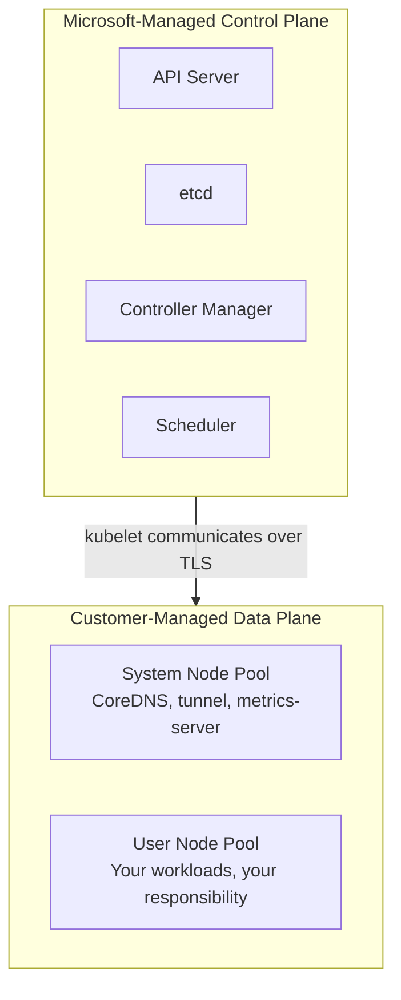
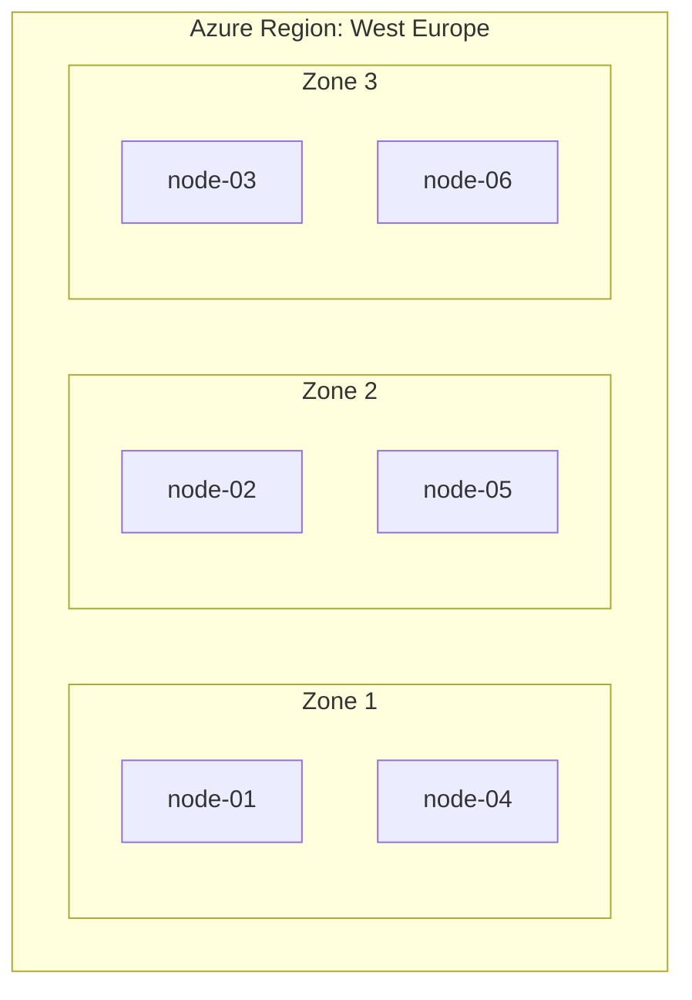
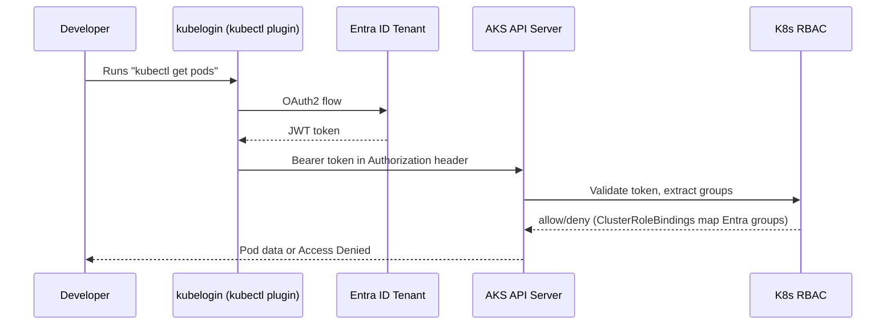

**Complexity**: [MEDIUM] | **Time to Complete**: 2h | **Prerequisites**: Azure Essentials, Cloud Architecture Patterns

## What You'll Be Able to Do

After completing this module, you will be able to:

- **Configure AKS clusters with system and user node pools, availability zones, and ephemeral OS disks**
- **Implement AKS auto-upgrade channels and planned maintenance windows for controlled Kubernetes version updates**
- **Deploy AKS with Entra ID RBAC integration to replace certificate-based kubeconfig with identity-driven access**
- **Design AKS node pool strategies with VM Scale Sets, taints, labels, and node selectors for workload isolation**

---

## Why This Module Matters

A poorly isolated AKS cluster can fail catastrophically during routine maintenance if critical and non-critical workloads all compete for the same limited node capacity.

The lesson is brutal but simple: AKS gives you a managed Kubernetes control plane, but the architecture decisions around node pools, availability zones, upgrade strategies, and identity integration are entirely yours. Get them wrong and you build a house of cards. Get them right and you have a platform that can survive node failures, zone outages, and even botched upgrades without your customers noticing.

In this module, you will learn how AKS is structured underneath the managed surface. You will understand the difference between system and user node pools, how Virtual Machine Scale Sets power your nodes, how availability zones protect you from datacenter failures, how upgrade channels keep your clusters current without surprises, how ephemeral OS disks dramatically improve node startup times, and how Entra ID integration replaces fragile kubeconfig certificates with proper identity management. By the end, you will deploy a production-grade AKS cluster using Bicep with Entra ID RBAC---the foundation for everything that follows in this deep dive.

---

## The AKS Control Plane: What Microsoft Manages (and What You Own)

When you create an AKS cluster, Microsoft provisions and manages the Kubernetes control plane: [the API server, etcd, the controller manager, and the scheduler](https://learn.microsoft.com/en-us/azure/aks/core-aks-concepts). You don't manage or SSH into these components directly; Microsoft operates them as part of the AKS service, and cluster-management pricing depends on the AKS tier you choose. This is the core value proposition of a managed Kubernetes service.

But "managed" does not mean "hands-off." You still make critical decisions that determine how the control plane behaves:



The SLA numbers matter. [If you deploy AKS across availability zones with the Standard tier, Microsoft guarantees 99.95% uptime for the API server. Without zones, you get 99.9%. On the Free tier, you get zero uptime guarantee](https://learn.microsoft.com/en-us/azure/aks/free-standard-pricing-tiers)---fine for dev, unacceptable for production. Premium tier is the long-term-support-oriented AKS tier for workloads that need extended version support.

```bash
# Create a cluster on the Standard tier (required for production SLA)
az aks create \
  --resource-group rg-aks-prod \
  --name aks-prod-westeurope \
  --tier standard \
  --kubernetes-version 1.35.2 \
  --location westeurope \
  --generate-ssh-keys

# Check your cluster's current tier
az aks show --resource-group rg-aks-prod --name aks-prod-westeurope \
  --query "sku.{Name:name, Tier:tier}" -o table
```

---

## System Pools vs User Pools: Separation of Concerns

[Every AKS cluster must have at least one system node pool. This pool runs the critical add-ons that keep Kubernetes functioning](https://learn.microsoft.com/en-us/azure/aks/use-system-pools): CoreDNS, the metrics server, the Azure cloud-provider integration, and the konnectivity-agent tunnel that connects your nodes to the managed control plane.

Think of system pools like the engine room on a ship. You do not put passenger luggage in the engine room, and you do not run your application workloads on system nodes. Why? Because if a misbehaving application pod consumes all CPU or memory on a system node, it can starve CoreDNS. When CoreDNS goes down, most pods in your cluster lose DNS resolution, and large parts of your platform can go dark.

```bash
# Create a cluster with a dedicated system pool (small, reliable VMs)
az aks create \
  --resource-group rg-aks-prod \
  --name aks-prod-westeurope \
  --nodepool-name system \
  --node-count 3 \
  --node-vm-size Standard_D2s_v5 \
  --zones 1 2 3 \
  --mode System \
  --max-pods 30 \
  --generate-ssh-keys

# Add a user pool for application workloads
az aks nodepool add \
  --resource-group rg-aks-prod \
  --cluster-name aks-prod-westeurope \
  --name apps \
  --node-count 3 \
  --node-vm-size Standard_D4s_v5 \
  --zones 1 2 3 \
  --mode User \
  --max-pods 110 \
  --enable-cluster-autoscaler \
  --min-count 3 \
  --max-count 12 \
  --labels workload=general
```

### Taints and Tolerations: Enforcing the Boundary

To keep application pods off system pools, add the `CriticalAddonsOnly=true:NoSchedule` taint to a dedicated system node pool. This means your application pods will not be scheduled on system nodes unless they explicitly tolerate this taint. You should generally not add that toleration to your application deployments.

> **Stop and think**: A developer creates a massive video-processing deployment but forgets to specify any node selectors or tolerations. You have a System pool (with the default taint) and a User pool. Which pool will the Kubernetes scheduler place these pods in, and why?

For user pools, you can add your own taints to create specialized pools:

```bash
# GPU pool with a taint so only GPU-requiring workloads land here
az aks nodepool add \
  --resource-group rg-aks-prod \
  --cluster-name aks-prod-westeurope \
  --name gpu \
  --node-count 1 \
  --node-vm-size Standard_NC6s_v3 \
  --node-taints "gpu=true:NoSchedule" \
  --labels accelerator=nvidia \
  --mode User

# Spot pool for fault-tolerant batch jobs (up to 90% cheaper)
az aks nodepool add \
  --resource-group rg-aks-prod \
  --cluster-name aks-prod-westeurope \
  --name spot \
  --node-count 0 \
  --node-vm-size Standard_D8s_v5 \
  --priority Spot \
  --eviction-policy Delete \
  --spot-max-price -1 \
  --enable-cluster-autoscaler \
  --min-count 0 \
  --max-count 20 \
  --mode User \
  --node-taints "kubernetes.azure.com/scalesetpriority=spot:NoSchedule"
```

| Pool Type | Purpose | Min Nodes | Taint Applied | When to Scale |
| :--- | :--- | :--- | :--- | :--- |
| **System** | CoreDNS, konnectivity, metrics-server | 3 (for HA across AZs) | `CriticalAddonsOnly` (auto) | Rarely---keep stable |
| **User (general)** | Standard application workloads | 3 (one per AZ) | None (or custom) | Autoscaler based on load |
| **User (GPU)** | ML inference, video processing | 0-1 | Custom GPU taint | Scale to zero when idle |
| **User (Spot)** | Batch jobs, CI runners, non-critical work | 0 | Spot taint (auto) | Aggressive autoscaling |

---

## Virtual Machine Scale Sets: The Engine Behind Node Pools

Many AKS node pools are backed by Azure Virtual Machine Scale Sets (VMSS), but AKS also supports Virtual Machines node pools. When the cluster autoscaler decides you need more nodes, it tells the VMSS to add instances. When it scales down, instances are removed from the VMSS. Understanding this relationship helps you troubleshoot node issues, because many problems that look like Kubernetes problems are actually VMSS problems.

```bash
# Find the VMSS backing your node pool
# AKS creates a separate resource group for infrastructure (MC_* prefix)
INFRA_RG=$(az aks show --resource-group rg-aks-prod --name aks-prod-westeurope \
  --query nodeResourceGroup -o tsv)

# List all VMSS in the infrastructure resource group
az vmss list --resource-group $INFRA_RG \
  --query "[].{Name:name, VMSize:sku.name, Capacity:sku.capacity}" -o table

# View instances in a specific VMSS
az vmss list-instances --resource-group $INFRA_RG \
  --name aks-apps-12345678-vmss \
  --query "[].{InstanceId:instanceId, Zone:zones[0], State:provisioningState}" -o table
```

### The Infrastructure Resource Group (MC_*)

When AKS creates your cluster, it also creates a second resource group with the naming convention `MC_{resource-group}_{cluster-name}_{region}`. This resource group contains all the infrastructure AKS manages on your behalf: the VMSS instances, load balancers, public IPs, managed disks, and virtual network interfaces.

A critical rule: **do not manually modify resources in the MC_ resource group unless AKS explicitly supports it**. AKS reconciles this resource group continuously. If you manually delete a load balancer rule or resize a VMSS, [AKS may revert your change on the next reconciliation cycle](https://learn.microsoft.com/en-us/Azure/aks/resize-node-pool?tabs=azure-cli), creating confusing and hard-to-debug behavior. If you need to customize infrastructure, use the AKS API or supported extensions.

```bash
# View what AKS has created in the infrastructure resource group
az resource list --resource-group $INFRA_RG \
  --query "[].{Name:name, Type:type}" -o table
```

---

## Availability Zones: Surviving Datacenter Failures

Many Azure regions offer multiple availability zones. Each zone is a physically separate datacenter (or group of datacenters) with independent power, cooling, and networking. When you deploy AKS nodes across all three zones, a complete datacenter failure takes out at most one-third of your capacity.



*Note: If Zone 1 fails, nodes 02, 03, 05, and 06 continue serving. The cluster autoscaler will add new nodes in zones 2 and 3 to recover capacity.*

Zone-spanning node pools aim to stay balanced across selected zones, typically within one node per zone, but temporary imbalances can still happen during failures or scaling events. Verify actual placement rather than assuming perfect spread.

Another critical detail: **persistent volumes (Azure Disks) are zone-locked**.

> **Pause and predict**: Imagine you have a stateful application pod running in Zone 1, connected to an Azure Disk PersistentVolume. The physical host running this node experiences a hardware failure, and the node goes offline. The cluster autoscaler spins up a replacement node in Zone 2, and the Kubernetes scheduler attempts to move your pod there. What will happen to your application?

[An Azure Disk created in Zone 1 cannot be attached to a node in Zone 2. If a pod with a PVC backed by an Azure Disk gets rescheduled to a different zone, it will be stuck in `Pending` forever.](https://learn.microsoft.com/en-in/troubleshoot/azure/azure-kubernetes/storage/fail-to-mount-azure-disk-volume) You must use topology-aware scheduling or switch to Azure Files (which are zone-redundant) for workloads that need cross-zone mobility.

```yaml
# Pod topology spread constraint to enforce even zone distribution
apiVersion: apps/v1
kind: Deployment
metadata:
  name: payment-api
spec:
  replicas: 6
  selector:
    matchLabels:
      app: payment-api
  template:
    metadata:
      labels:
        app: payment-api
    spec:
      topologySpreadConstraints:
        - maxSkew: 1
          topologyKey: topology.kubernetes.io/zone
          whenUnsatisfiable: DoNotSchedule
          labelSelector:
            matchLabels:
              app: payment-api
      containers:
        - name: payment-api
          image: myregistry.azurecr.io/payment-api:v3.2.1
          resources:
            requests:
              cpu: "500m"
              memory: "512Mi"
            limits:
              cpu: "1"
              memory: "1Gi"
```

---

## Upgrade Channels: Keeping Current Without Breaking Things

[Kubernetes releases a new minor version roughly every four months. AKS supports three minor versions at any time](https://learn.microsoft.com/en-us/azure/aks/supported-kubernetes-versions), and you are responsible for upgrading before your version falls out of support. The upgrade channel feature automates this process, but choosing the right channel is critical.

| Channel | Behavior | Best For |
| :--- | :--- | :--- |
| **none** | No automatic upgrades. You upgrade manually. | Teams needing full control over upgrade timing |
| **patch** | Automatically applies the latest patch within your current minor version (e.g., 1.35.0 to 1.35.2) | Most production clusters |
| **stable** | Upgrades to the latest patch of the N-1 minor version (one behind latest) | Conservative production environments |
| **rapid** | Upgrades to the latest patch of the latest minor version | Dev/test environments, early adopters |
| **node-image** | [Only upgrades the node OS image, not the Kubernetes version](https://learn.microsoft.com/en-us/azure/aks/auto-upgrade-cluster) | When you want OS patches but not K8s version changes |

```bash
# Set the upgrade channel
az aks update \
  --resource-group rg-aks-prod \
  --name aks-prod-westeurope \
  --auto-upgrade-channel stable

# Configure a maintenance window (avoid upgrades during business hours)
az aks maintenanceconfiguration add \
  --resource-group rg-aks-prod \
  --cluster-name aks-prod-westeurope \
  --name default \
  --schedule-type Weekly \
  --day-of-week Saturday \
  --start-time 02:00 \
  --duration 4 \
  --utc-offset "+01:00"
```

### How AKS Upgrades Work Under the Hood

When you trigger an upgrade (manually or via an auto-upgrade channel), AKS performs a rolling update of your nodes. The process for each node is:

1. AKS creates a new node with the target version (using a surge node)
2. The old node is cordoned (no new pods scheduled)
3. The old node is drained (existing pods are evicted with respect to PodDisruptionBudgets)
4. Once the old node is empty, it is deleted
5. AKS moves to the next node

> **Pause and predict**: You have a 10-node user pool running at 90% utilization. You trigger a Kubernetes version upgrade. If AKS were to take down 3 old nodes simultaneously before provisioning new ones, what would happen to your application performance? How does AKS prevent this?

[The **max surge** setting controls how many extra nodes AKS creates during the upgrade. A higher surge means faster upgrades but higher temporary costs. For production clusters, a max surge of 33% is a solid default](https://learn.microsoft.com/en-us/azure/aks/upgrade-aks-node-pools-rolling)---it upgrades one-third of your nodes at a time.

```bash
# Set max surge for a node pool
az aks nodepool update \
  --resource-group rg-aks-prod \
  --cluster-name aks-prod-westeurope \
  --name apps \
  --max-surge 33%

# Manually trigger a cluster upgrade
az aks upgrade \
  --resource-group rg-aks-prod \
  --name aks-prod-westeurope \
  --kubernetes-version 1.35.2 \
  --yes

# Check upgrade progress
az aks show --resource-group rg-aks-prod --name aks-prod-westeurope \
  --query "provisioningState" -o tsv
```

---

## Ephemeral OS Disks: Faster Nodes, Lower Costs

AKS can use managed OS disks or ephemeral OS disks, and it defaults to ephemeral OS disks when the node-pool configuration supports them and you don't explicitly request managed disks. These disks are persistent---if a node is deallocated and reallocated, the OS disk retains its data. But this durability comes at a cost: slower node startup times and additional storage charges.

[Ephemeral OS disks use the local temporary storage on the VM host.](https://learn.microsoft.com/en-us/azure/aks/concepts-storage) This means:

- **Faster node startup**: Because the OS disk stays on local storage, nodes can start faster than comparable managed-OS-disk configurations.
- **Lower latency for OS operations**: The disk is local NVMe or SSD, not a network-attached disk.
- **No additional disk cost**: The local storage is included in the VM price.
- **Recreated on reimage or deallocate/reallocate**: If a node using an ephemeral OS disk is reimaged or deallocated and reallocated, its OS state is reprovisioned from a fresh image.

The "reimaged on reboot" behavior is actually a benefit for security and consistency. With each reprovisioning cycle, your nodes return to a known-good state. Any drift, malware, or leftover state from previous workloads is wiped clean.

```bash
# Create a node pool with ephemeral OS disks
az aks nodepool add \
  --resource-group rg-aks-prod \
  --cluster-name aks-prod-westeurope \
  --name fastapps \
  --node-count 3 \
  --node-vm-size Standard_D4s_v5 \
  --os-disk-type Ephemeral \
  --zones 1 2 3 \
  --mode User
```

Not all VM sizes support ephemeral OS disks. The VM's local cache, temp disk, or NVMe storage must be large enough for the OS image, so you should confirm support against the current VM-size documentation before choosing a SKU.

---

## Entra ID Integration: Identity-First Cluster Access

For production, prefer Microsoft Entra integration for user authentication and consider disabling local accounts if you want to remove static `--admin` credentials. That gives you token-based user access with better central identity governance and auditing than relying on local cluster credentials.

Entra ID integration replaces certificates with OAuth 2.0 tokens. [When a user runs `kubectl get pods`, the kubeconfig triggers a browser-based login flow (or uses a cached token) against Entra ID. The API server validates the token, extracts the user's group memberships, and applies Kubernetes RBAC rules based on those groups.](https://learn.microsoft.com/en-us/azure/aks/azure-ad-rbac)



### Setting Up Entra ID Integration

[There are two modes: **AKS-managed Entra ID** (simpler, recommended) and **legacy Azure AD integration** (deprecated). Use AKS-managed for almost all new deployments.](https://learn.microsoft.com/en-us/azure/aks/azure-ad-integration-cli)

```bash
# Create the cluster with AKS-managed Entra ID
az aks create \
  --resource-group rg-aks-prod \
  --name aks-prod-westeurope \
  --enable-aad \
  --aad-admin-group-object-ids "$(az ad group show --group 'AKS-Admins' --query id -o tsv)" \
  --enable-azure-rbac \
  --generate-ssh-keys

# For existing clusters, enable Entra ID integration
az aks update \
  --resource-group rg-aks-prod \
  --name aks-prod-westeurope \
  --enable-aad \
  --aad-admin-group-object-ids "$(az ad group show --group 'AKS-Admins' --query id -o tsv)"
```

The `--enable-azure-rbac` flag is especially powerful. It lets you use Azure RBAC role assignments directly for Kubernetes authorization, without needing to create separate ClusterRoleBindings. [Azure provides four built-in roles:](https://learn.microsoft.com/en-us/azure/aks/manage-azure-rbac)

| Azure RBAC Role | Kubernetes Equivalent | Use Case |
| :--- | :--- | :--- |
| **Azure Kubernetes Service RBAC Cluster Admin** | cluster-admin | Platform team, break-glass access |
| **Azure Kubernetes Service RBAC Admin** | admin (namespaced) | Team leads, namespace owners |
| **Azure Kubernetes Service RBAC Writer** | edit (namespaced) | Developers who deploy workloads |
| **Azure Kubernetes Service RBAC Reader** | view (namespaced) | Read-only dashboards, auditors |

```bash
# Grant a developer group write access to the "payments" namespace
az role assignment create \
  --assignee-object-id "$(az ad group show --group 'Payments-Developers' --query id -o tsv)" \
  --role "Azure Kubernetes Service RBAC Writer" \
  --scope "$(az aks show -g rg-aks-prod -n aks-prod-westeurope --query id -o tsv)/namespaces/payments"
```

---

## Did You Know?

1. **AKS cluster-management pricing depends on the tier.** Free only charges for underlying resources, while Standard and Premium add cluster-management charges and SLA-backed features.

2. [**The MC_ resource group naming convention has a 80-character limit.**](https://learn.microsoft.com/en-us/troubleshoot/azure/azure-kubernetes/create-upgrade-delete/aks-common-issues-faq) If your resource group name, cluster name, and region combine to exceed 80 characters, AKS truncates the infrastructure resource group name. This has caused automation scripts to break when they construct the MC_ name programmatically. Use `az aks show --query nodeResourceGroup` instead of string concatenation.

3. **AKS supports Azure Linux for Linux node pools.** Azure Linux is Microsoft's container-focused Linux distribution for AKS, but Ubuntu remains the default Linux distro on AKS unless you choose the Azure Linux OS SKU.

4. [**The cluster autoscaler in AKS checks for pending pods every 10 seconds by default.** When it finds pods that cannot be scheduled due to insufficient resources, it calculates the minimum number of nodes needed across all configured node pools and issues a scale-up request to the VMSS. Scale-down is more conservative: nodes must be below 50% utilization for 10 minutes (by default) before they are candidates for removal.](https://learn.microsoft.com/en-us/training/modules/aks-cluster-autoscaling/)

---

## Common Mistakes

| Mistake | Why It Happens | How to Fix It |
| :--- | :--- | :--- |
| Running workloads on system node pools | Default cluster creation puts everything in one pool | For most production clusters, create separate user pools; system pools should primarily run critical add-ons |
| Using Free tier for production | Cost savings temptation or oversight during initial setup | Use Standard tier minimum for production; Premium for mission-critical workloads |
| Deploying nodes in a single availability zone | Not specifying `--zones` during pool creation | In regions with three zones, pass `--zones 1 2 3` for production pools; size node counts to match your zone strategy |
| Ignoring PodDisruptionBudgets during upgrades | Teams deploy without PDBs, then upgrades drain all replicas simultaneously | Create PDBs for every production deployment with `minAvailable` or `maxUnavailable` |
| Manually modifying resources in the MC_ resource group | Trying to fix networking or disk issues directly | Use AKS APIs and `az aks` commands for supported changes; manual edits are usually overwritten |
| Using certificate-based auth in production | It is the default and "just works" for initial setup | Enable Entra ID integration and Azure RBAC before onboarding any team |
| Setting max-pods too low on user pools | Copying system pool settings (30 pods) to user pools | Use 110 (default) or higher for user pools; calculate based on CNI and subnet sizing |
| Not configuring maintenance windows | Auto-upgrades happen at random times, causing surprise disruptions | Set maintenance windows to off-peak hours for both node OS and Kubernetes version upgrades |

---

## Quiz

<details>
<summary>1. Your team is deploying a new microservice architecture and decides to place all workloads into the default system node pool to save costs. During a load test, the new services consume 99% of the node's memory. Suddenly, every other application in the cluster starts reporting DNS resolution failures. What architectural mistake caused this cascading failure?</summary>

You ran application workloads on the system node pool, which shares resources with critical infrastructure like CoreDNS and the metrics server. When your application consumed all the memory, it starved CoreDNS, causing it to crash or become unresponsive. Because CoreDNS is responsible for resolving internal Kubernetes services, its failure caused every pod in the cluster to lose DNS resolution, effectively bringing down the entire platform. System pools should generally be isolated using the `CriticalAddonsOnly` taint to prevent exactly this scenario.
</details>

<details>
<summary>2. During a routine maintenance event, a node in Zone 1 is drained, and its pods are evicted. One of the evicted pods is a PostgreSQL database using an Azure Disk for its PersistentVolumeClaim. The Kubernetes scheduler decides to place the replacement pod on a node in Zone 2. What will be the state of the PostgreSQL pod, and why?</summary>

The PostgreSQL pod will be stuck in a `Pending` state indefinitely. This happens because Azure Disks are zone-locked resources; a disk created in Zone 1 physically exists in Zone 1's datacenter and cannot be attached to a Virtual Machine in Zone 2. The Kubernetes scheduler cannot satisfy both the PVC requirement (which is bound to the Zone 1 disk) and the node placement in Zone 2 simultaneously. To prevent this, you must use topology-aware scheduling to force the pod into Zone 1, or use a zone-redundant storage solution like Azure Files.
</details>

<details>
<summary>3. Your company operates in a highly regulated financial industry where stability is prioritized above all else. However, you still need automated patching for security vulnerabilities. You are debating between the 'patch' and 'stable' auto-upgrade channels for your AKS clusters. Which should you choose to minimize the risk of introducing breaking changes from new Kubernetes features?</summary>

You should choose the 'stable' channel. While both channels provide automated updates, they behave fundamentally differently regarding minor versions. The 'patch' channel automatically upgrades to the latest patch release within your *current* minor version, but it requires you to manually bump the minor version before it falls out of support. The 'stable' channel automatically upgrades your cluster to the latest patch of the N-1 minor version (one version behind the latest General Availability release). This ensures you are always on a proven, community-tested version without bleeding-edge features that might introduce instability.
</details>

<details>
<summary>4. You are planning a Kubernetes version upgrade for a massive 30-node user pool that processes real-time telemetry data. You want the upgrade to finish as quickly as possible and are willing to pay for extra temporary infrastructure. You set the max surge to 50%. Describe exactly what AKS will do during the first wave of this upgrade.</summary>

Setting max surge to 50% on a 30-node pool means AKS will create 15 additional "surge" nodes simultaneously with the new Kubernetes version. Once these 15 new nodes are ready, AKS will cordon and drain 15 of the old nodes, moving their workloads to the surge nodes or other available capacity. After the old nodes are empty, they are deleted. This aggressive surge drastically reduces the total time required to upgrade the cluster, but it means you will temporarily pay for 45 nodes instead of 30.
</details>

<details>
<summary>5. Your e-commerce application experiences massive, unpredictable traffic spikes during flash sales. The cluster autoscaler successfully requests new nodes, but you notice it takes over 90 seconds for a new node to become `Ready`, which is too slow to handle the sudden influx of users. How can changing the OS disk type solve this problem, and what are the trade-offs?</summary>

You should switch the node pool to use Ephemeral OS disks instead of standard managed disks. Ephemeral OS disks use the virtual machine's local temporary storage (NVMe or SSD) rather than provisioning and attaching a remote network disk. This eliminates the storage provisioning overhead, allowing nodes to boot and become `Ready` in roughly 20-30 seconds instead of 60-90 seconds. The trade-off is that the disk is wiped clean if the node is deallocated, but for stateless Kubernetes nodes, this is actually a benefit as it ensures a pristine, known-good state upon reboot.
</details>

<details>
<summary>6. Your security compliance team requires a unified audit trail for all access grants and the ability to instantly revoke a user's access across all cloud resources, including Kubernetes clusters. They are frustrated by the current process of manually updating `ClusterRoleBindings` in each AKS cluster. How does integrating Entra ID and Azure RBAC solve their problem?</summary>

Integrating Entra ID with Azure RBAC allows you to manage Kubernetes authorization using the exact same Azure role assignment model used for storage accounts or virtual machines. Instead of maintaining disconnected `ClusterRoleBindings` inside each cluster, you assign built-in Azure roles (like 'Azure Kubernetes Service RBAC Writer') directly to Entra ID groups at the cluster or namespace scope. This provides the security team with a single pane of glass for auditing access via the Azure Activity Log, allows them to enforce access via Azure Policy, and means that removing a user from an Entra ID group revokes their Kubernetes access without running any `kubectl` commands once their token is refreshed. This centralized approach completely eliminates the operational overhead of managing lifecycle access per cluster.
</details>

<details>
<summary>7. A junior administrator notices that the AKS cluster is running out of public IP addresses for new LoadBalancer services. To fix this "quickly", they navigate to the `MC_rg-aks-prod_aks-prod-westeurope_westeurope` resource group in the Azure Portal and manually attach a new Public IP prefix to the cluster's load balancer. A few hours later, the new IPs mysteriously disappear. What went wrong?</summary>

The administrator violated a cardinal rule of AKS: do not manually modify resources inside the infrastructure (`MC_`) resource group. AKS uses a continuous reconciliation loop to ensure the actual state of the infrastructure matches the desired state defined in the AKS control plane. When the administrator manually added the IP prefix, they created configuration drift. During the next reconciliation cycle, the AKS resource provider detected this drift and reverted the load balancer back to its original, declared state, deleting the manual changes. All infrastructure changes must be made through the AKS API or `az aks` CLI commands.
</details>

---

## Hands-On Exercise: Production-Grade AKS Cluster with Bicep and Entra ID RBAC

In this exercise, you will deploy a production-ready AKS cluster using Bicep (Azure's infrastructure-as-code language) with Entra ID integration, multiple node pools, availability zones, and proper RBAC.

### Prerequisites

- Azure CLI installed and authenticated (`az login`)
- An Azure subscription with Owner access (required for role assignments) and permissions to create Entra ID groups
- Bicep CLI (bundled with Azure CLI 2.20+)
- `kubectl` CLI installed (`az aks install-cli` or via package manager)

### Task 1: Create the Entra ID Groups

Before deploying the cluster, create the Entra ID groups that will map to Kubernetes roles.

<details>
<summary>Solution</summary>

```bash
# Create an admin group for cluster-admin access
az ad group create \
  --display-name "AKS-Prod-Admins" \
  --mail-nickname "aks-prod-admins"

# Create a developer group for namespace-scoped write access
az ad group create \
  --display-name "AKS-Prod-Developers" \
  --mail-nickname "aks-prod-developers"

# Store the group object IDs for use in Bicep
ADMIN_GROUP_ID=$(az ad group show --group "AKS-Prod-Admins" --query id -o tsv)
DEV_GROUP_ID=$(az ad group show --group "AKS-Prod-Developers" --query id -o tsv)

echo "Admin Group ID: $ADMIN_GROUP_ID"
echo "Developer Group ID: $DEV_GROUP_ID"

# Add yourself to the admin group
MY_USER_ID=$(az ad signed-in-user show --query id -o tsv)
az ad group member add --group "AKS-Prod-Admins" --member-id "$MY_USER_ID"
```

</details>

### Task 2: Write the Bicep Template

Create a Bicep file that defines the AKS cluster with all production best practices.

<details>
<summary>Solution</summary>

```bicep
// main.bicep
@description('Location for all resources')
param location string = resourceGroup().location

@description('Entra ID admin group object ID')
param adminGroupObjectId string

@description('Kubernetes version')
param kubernetesVersion string = '1.35.2'

var clusterName = 'aks-prod-${location}'
var systemPoolName = 'system'
var appsPoolName = 'apps'

resource aksCluster 'Microsoft.ContainerService/managedClusters@2024-09-01' = {
  name: clusterName
  location: location
  sku: {
    name: 'Base'
    tier: 'Standard'
  }
  identity: {
    type: 'SystemAssigned'
  }
  properties: {
    kubernetesVersion: kubernetesVersion
    dnsPrefix: clusterName
    enableRBAC: true

    aadProfile: {
      managed: true
      enableAzureRBAC: true
      adminGroupObjectIDs: [
        adminGroupObjectId
      ]
    }

    autoUpgradeProfile: {
      upgradeChannel: 'stable'
      nodeOSUpgradeChannel: 'NodeImage'
    }

    networkProfile: {
      networkPlugin: 'azure'
      networkPolicy: 'cilium'
      networkDataplane: 'cilium'
      loadBalancerSku: 'standard'
      serviceCidr: '10.0.0.0/16'
      dnsServiceIP: '10.0.0.10'
    }

    agentPoolProfiles: [
      {
        name: systemPoolName
        mode: 'System'
        count: 3
        vmSize: 'Standard_D2s_v5'
        availabilityZones: [ '1', '2', '3' ]
        osDiskType: 'Ephemeral'
        osDiskSizeGB: 64
        osType: 'Linux'
        osSKU: 'AzureLinux'
        maxPods: 30
        enableAutoScaling: false
        upgradeSettings: {
          maxSurge: '33%'
        }
      }
      {
        name: appsPoolName
        mode: 'User'
        count: 3
        vmSize: 'Standard_D4s_v5'
        availabilityZones: [ '1', '2', '3' ]
        osDiskType: 'Ephemeral'
        osDiskSizeGB: 100
        osType: 'Linux'
        osSKU: 'AzureLinux'
        maxPods: 110
        enableAutoScaling: true
        minCount: 3
        maxCount: 12
        upgradeSettings: {
          maxSurge: '33%'
        }
        nodeTaints: []
        nodeLabels: {
          workload: 'general'
        }
      }
    ]
  }
}

output clusterName string = aksCluster.name
output clusterFqdn string = aksCluster.properties.fqdn
output nodeResourceGroup string = aksCluster.properties.nodeResourceGroup
```

</details>

### Task 3: Deploy the Cluster

Deploy the Bicep template and verify the cluster is healthy.

<details>
<summary>Solution</summary>

```bash
# Create the resource group
az group create --name rg-aks-prod --location westeurope

# Deploy the Bicep template
az deployment group create \
  --resource-group rg-aks-prod \
  --template-file main.bicep \
  --parameters adminGroupObjectId="$ADMIN_GROUP_ID"

# Get cluster credentials (Entra ID mode)
az aks get-credentials \
  --resource-group rg-aks-prod \
  --name aks-prod-westeurope \
  --overwrite-existing

# Verify connectivity (this will trigger Entra ID login)
kubectl get nodes -o wide

# Verify node distribution across zones
kubectl get nodes -o custom-columns=NAME:.metadata.name,ZONE:.metadata.labels.'topology\.kubernetes\.io/zone',VERSION:.status.nodeInfo.kubeletVersion
```

</details>

### Task 4: Configure Azure RBAC Role Assignments

Grant the developer group scoped access to a specific namespace.

<details>
<summary>Solution</summary>

```bash
# Create the namespace
kubectl create namespace payments

# Get the cluster resource ID
CLUSTER_ID=$(az aks show -g rg-aks-prod -n aks-prod-westeurope --query id -o tsv)

# Assign the developer group "RBAC Writer" scoped to the payments namespace
az role assignment create \
  --assignee-object-id "$DEV_GROUP_ID" \
  --assignee-principal-type Group \
  --role "Azure Kubernetes Service RBAC Writer" \
  --scope "${CLUSTER_ID}/namespaces/payments"

# Verify the role assignment
az role assignment list \
  --scope "${CLUSTER_ID}/namespaces/payments" \
  --query "[].{Principal:principalName, Role:roleDefinitionName, Scope:scope}" -o table
```

</details>

### Task 5: Add a Maintenance Window and Verify Upgrade Channel

Configure maintenance windows so upgrades only happen during off-peak hours.

<details>
<summary>Solution</summary>

```bash
# Add a weekly maintenance window for Kubernetes upgrades
az aks maintenanceconfiguration add \
  --resource-group rg-aks-prod \
  --cluster-name aks-prod-westeurope \
  --name aksManagedAutoUpgradeSchedule \
  --schedule-type Weekly \
  --day-of-week Saturday \
  --start-time 02:00 \
  --duration 4 \
  --utc-offset "+01:00"

# Add a separate window for node OS image upgrades
az aks maintenanceconfiguration add \
  --resource-group rg-aks-prod \
  --cluster-name aks-prod-westeurope \
  --name aksManagedNodeOSUpgradeSchedule \
  --schedule-type Weekly \
  --day-of-week Sunday \
  --start-time 02:00 \
  --duration 4 \
  --utc-offset "+01:00"

# Verify the configuration
az aks maintenanceconfiguration list \
  --resource-group rg-aks-prod \
  --cluster-name aks-prod-westeurope -o table

# Verify the upgrade channel
az aks show -g rg-aks-prod -n aks-prod-westeurope \
  --query "autoUpgradeProfile" -o json
```

</details>

### Success Criteria

- [ ] Entra ID groups created for admin and developer roles
- [ ] AKS cluster deployed via Bicep with Standard tier
- [ ] System pool: 3 nodes, Standard_D2s_v5, across 3 availability zones, ephemeral OS disks
- [ ] Apps pool: 3-12 nodes (autoscaler enabled), Standard_D4s_v5, across 3 AZs, ephemeral OS disks
- [ ] Entra ID integration enabled with Azure RBAC
- [ ] Developer group has scoped write access to the payments namespace only
- [ ] Maintenance windows configured for Saturday and Sunday off-peak hours
- [ ] Upgrade channel set to "stable"

---

## Next Module

[Module 7.2: AKS Advanced Networking](../module-7.2-aks-networking/) --- Dive into the networking layer: compare Azure CNI, Kubenet, CNI Overlay, and CNI Powered by Cilium. Learn when to use each, how to implement network policies, and how to expose services through AGIC and Private Link.

## Sources

- [learn.microsoft.com: core aks concepts](https://learn.microsoft.com/en-us/azure/aks/core-aks-concepts) — Microsoft's AKS core concepts documentation explicitly describes the managed control-plane components.
- [learn.microsoft.com: free standard pricing tiers](https://learn.microsoft.com/en-us/azure/aks/free-standard-pricing-tiers) — The AKS pricing-tier documentation gives these SLA conditions directly.
- [learn.microsoft.com: use system pools](https://learn.microsoft.com/en-us/azure/aks/use-system-pools) — The AKS system node pool guidance documents the required system-pool presence and the intended split between system and user pools.
- [learn.microsoft.com: resize node pool](https://learn.microsoft.com/en-us/Azure/aks/resize-node-pool?tabs=azure-cli) — Microsoft's AKS guidance says agent nodes live in a custom MC_* resource group and direct IaaS customizations there do not persist.
- [learn.microsoft.com: fail to mount azure disk volume](https://learn.microsoft.com/en-in/troubleshoot/azure/azure-kubernetes/storage/fail-to-mount-azure-disk-volume) — Microsoft's AKS troubleshooting guidance explicitly documents disk/node zone mismatch as a cause of Pending or mount failures and recommends zone-aware placement.
- [learn.microsoft.com: supported kubernetes versions](https://learn.microsoft.com/en-us/azure/aks/supported-kubernetes-versions) — The AKS supported-versions page states both the upstream release cadence and AKS's three-GA-minor support window.
- [learn.microsoft.com: auto upgrade cluster](https://learn.microsoft.com/en-us/azure/aks/auto-upgrade-cluster) — AKS's automatic-upgrade documentation defines these channels and their version-selection behavior.
- [learn.microsoft.com: upgrade aks node pools rolling](https://learn.microsoft.com/en-us/azure/aks/upgrade-aks-node-pools-rolling) — The AKS rolling-upgrade documentation describes this flow and explicitly recommends 33% max surge for production pools.
- [learn.microsoft.com: concepts storage](https://learn.microsoft.com/en-us/azure/aks/concepts-storage) — AKS storage guidance explicitly documents these performance and operational benefits of ephemeral OS disks.
- [learn.microsoft.com: azure ad rbac](https://learn.microsoft.com/en-us/azure/aks/azure-ad-rbac) — Microsoft's AKS Entra/RBAC documentation explicitly describes token-based sign-in and authorization based on identity or group membership.
- [learn.microsoft.com: azure ad integration cli](https://learn.microsoft.com/en-us/azure/aks/azure-ad-integration-cli) — Microsoft's legacy integration page marks the old model deprecated and points users to the AKS-managed experience.
- [learn.microsoft.com: manage azure rbac](https://learn.microsoft.com/en-us/azure/aks/manage-azure-rbac) — The Azure RBAC for Kubernetes Authorization documentation lists these built-in AKS roles and their scope semantics.
- [learn.microsoft.com: aks common issues faq](https://learn.microsoft.com/en-us/troubleshoot/azure/azure-kubernetes/create-upgrade-delete/aks-common-issues-faq) — Microsoft's AKS naming FAQ explicitly documents the 80-character limit for autogenerated MC_ resource group names.
- [learn.microsoft.com: aks cluster autoscaling](https://learn.microsoft.com/en-us/training/modules/aks-cluster-autoscaling/) — Microsoft's AKS autoscaling training material documents these default cluster-autoscaler profile values.
- [Configure availability zones in Azure Kubernetes Service (AKS)](https://learn.microsoft.com/en-us/azure/aks/availability-zones-overview) — Explains zone-spanning versus regional behavior, zone resilience, and zone-aware workload placement in AKS.
- [Patch and upgrade Azure Kubernetes Service worker nodes and Kubernetes versions](https://learn.microsoft.com/en-us/azure/architecture/operator-guides/aks/aks-upgrade-practices) — Covers current Microsoft guidance for upgrade channels, node-image strategy, maintenance windows, and production-safe rollout patterns.
