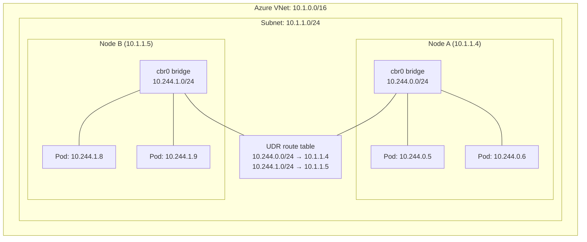
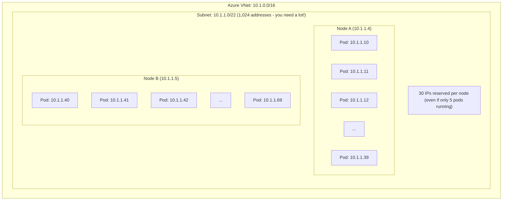
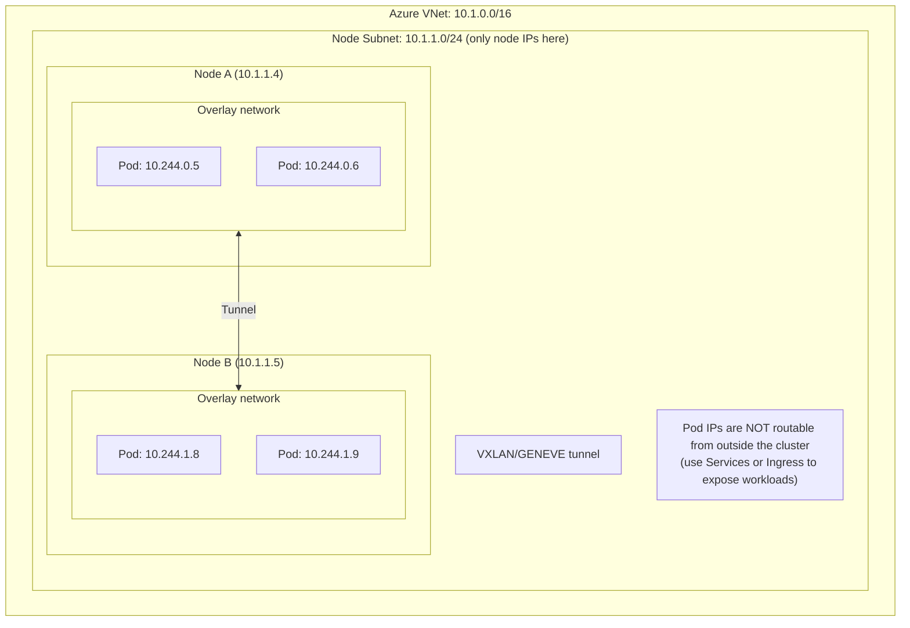
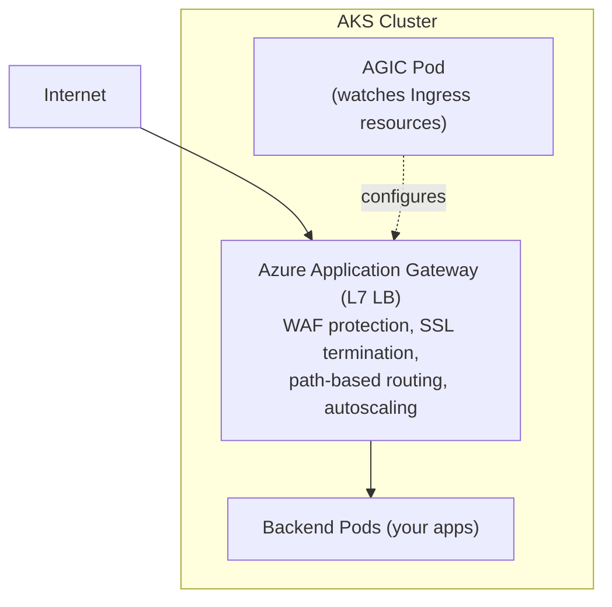
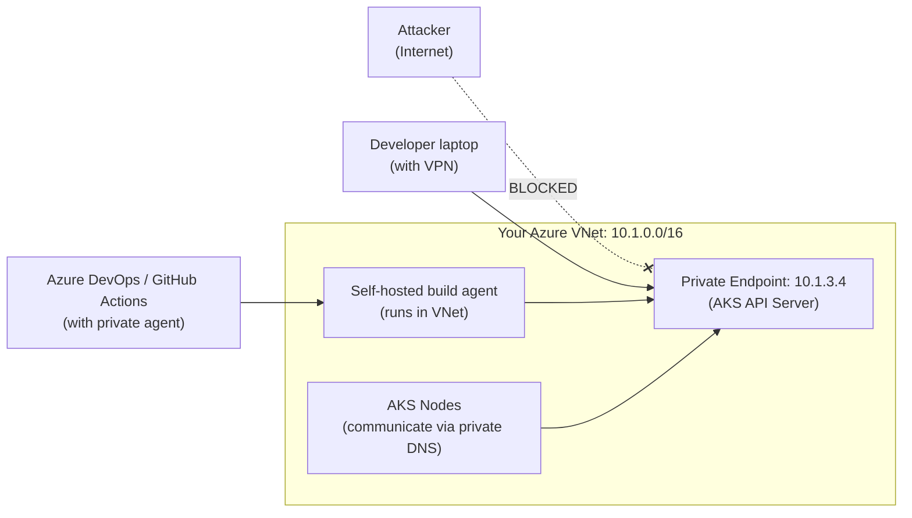

```mermaid
graph TD
    subgraph Traditional ["Traditional Networking Stack"]
        App1["Application"] --> Sock1["Socket Layer"]
        Sock1 --> iptables["iptables rules (thousands!)"]
        iptables --> Netfilter["Netfilter conntrack"]
        Netfilter --> NIC1["Network Interface"]
        NIC1 -.-> Note1["O(n) rule evaluation"]
    end
    
    subgraph Cilium ["Cilium eBPF Stack"]
        App2["Application"] --> Sock2["Socket Layer"]
        Sock2 --> eBPF["eBPF programs (compiled, fast)"]
        eBPF --> NIC2["Direct to NIC (bypass iptables entirely)"]
        NIC2 -.-> Note2["O(1) hash lookups"]
    end
```

**Complexity**: [COMPLEX] | **Time to Complete**: 3.5h | **Prerequisites**: [Module 7.1: AKS Architecture & Node Management](../module-7.1-aks-architecture/)

## What You'll Be Able to Do

After completing this module, you will be able to:

- **Diagnose** IP exhaustion and routing constraints to select the appropriate AKS Container Network Interface (CNI) model for enterprise-scale workloads.
- **Design** zero-trust network policies at Layer 4 and Layer 7 using Cilium eBPF to secure east-west pod-to-pod communication.
- **Implement** scalable ingress architectures using Azure Application Gateway Ingress Controller (AGIC) with built-in WAF protection.
- **Evaluate** private cluster topologies and construct secure egress control planes using NAT Gateway and Azure Firewall.

## Why This Module Matters

In early 2023, a massive European e-commerce organization handling billions in transaction volume embarked on an ambitious migration. They were transitioning from a monolithic legacy system to a modern microservices architecture hosted entirely on Azure Kubernetes Service (AKS). Eager to get started and lacking deep Kubernetes networking expertise, the platform engineering team opted for the default Kubenet networking plugin. It seemed like the simplest choice, primarily because it required very few IP addresses from their meticulously guarded corporate Azure Virtual Network (VNet). During the staging phase, which consisted of roughly a dozen microservices, everything operated flawlessly. Network latency was virtually undetectable, and pod-to-pod communication was seamless.

However, the reality of production hit them violently three months later. The architecture had expanded to encompass 85 distinct microservices, all chattering constantly with one another. During a high-traffic promotional event, the platform began suffering from intermittent, seemingly inexplicable 5-second delays on inter-service API calls. The delays compounded, cascading into widespread transaction timeouts. The engineering team spent two frantic weeks investigating the application code, optimizing database queries, and scaling up pod replicas, but the latency persisted. Finally, an external network architect uncovered the catastrophic root cause: Kubenet relies on user-defined routes (UDRs) and a local bridge network on each node. Every time a pod communicated with a pod on a different node, the packet had to traverse the Azure route table. With 85 services generating tens of thousands of cross-node requests per second, the Azure UDR update limits and routing overhead became a massive bottleneck, resulting in those mysterious 5-second propagation delays.

The remediation was excruciating. Because the Container Network Interface (CNI) cannot be changed on a running cluster, the organization was forced to execute a complete cluster rebuild using Azure CNI Overlay. The migration consumed three weeks of engineering effort, caused numerous maintenance windows, and resulted in an estimated $350,000 in lost revenue and engineering costs. This incident underscores a brutal truth about Kubernetes: networking is the architectural decision you make earliest and pay for latest. The choice between Kubenet, Azure CNI, CNI Overlay, and CNI Powered by Cilium directly dictates your scaling limitations, your network security posture, and your overall system resilience. In this module, we will dissect every facet of AKS networking, equipping you to make these critical decisions correctly from day one.

## The Four Networking Models: How Pods Get Their IP Addresses

The most fundamental architectural decision in any AKS cluster deployment is the selection of the Container Network Interface (CNI) plugin. This choice determines exactly how pods are assigned IP addresses, how they communicate across nodes, and how they interact with external Azure resources. Let us rigorously analyze the four available options, their underlying mechanics, and their specific enterprise use cases.

### Kubenet: The Simple (but Limited) Choice

Kubenet is the foundational, default networking model for many basic Kubernetes installations. Under Kubenet, pods do not receive IP addresses from the Azure VNet. Instead, they are assigned IPs from an entirely separate, logically isolated address space. Each node in the cluster is allocated a single IP address from the Azure VNet subnet. The node then runs a local bridge (`cbr0`), which manages a private `/24` subnet specifically for the pods residing on that node.

Consider the analogy of an apartment building. The building itself (the node) has a single street address (the VNet IP). The individual apartments (the pods) have internal room numbers (the private pod IPs). When a pod wants to talk to a pod on the same node, the local bridge routes the traffic internally. However, when a pod needs to communicate with a pod on a different node, the traffic must leave the building, get translated, and be directed by the city planner (the Azure User-Defined Route, or UDR).



Kubenet is exceptionally conservative with IP addresses. A 100-node cluster running 3,000 pods only consumes 100 VNet IPs. However, the trade-offs are significant and often disqualifying for serious production workloads:
- **No Direct VNet Connectivity**: Because pods have non-routable private IPs, external Azure resources (like a legacy VM or a service endpoint) cannot reach them directly.
- **UDR Scaling Limits**: Azure enforces a hard limit of 400 routes per UDR table. In a massive cluster, you can easily collide with this ceiling, causing the cluster to fail to register new nodes.
- **Routing Latency overhead**: Every packet crossing a node boundary must be processed by the UDR layer, injecting measurable latency at scale.
- **Platform Limitations**: Kubenet strictly does not support Windows Server nodes.

> **Pause and predict**: If you have 5 nodes and deploy 100 pods using Kubenet, how many IPs are consumed from your Azure VNet? Why?

### Azure CNI: Direct VNet Integration

Azure CNI represents the opposite end of the spectrum from Kubenet. In this model, the Kubernetes cluster networking is completely flattened into the Azure Virtual Network. In this model, pods are typically assigned first-class, routable IP addresses directly from an Azure VNet subnet.

To continue our previous analogy, Azure CNI is like a sprawling suburban neighborhood where every single house (pod) gets its own unique, globally recognized street address. They do not share a building address; they exist independently on the city map. This eliminates the need for local bridges and UDRs entirely.



The defining characteristic—and the greatest danger—of standard Azure CNI is its voracious appetite for IP addresses. By default, when a node spins up, Azure CNI pre-allocates an IP address for the maximum number of pods that node might theoretically host (defined by the `--max-pods` parameter, which defaults to 30 but is often set higher). If you deploy a 20-node cluster, Azure can reserve 600 IP addresses just for potential pods, plus 20 for the nodes, even if you have not deployed any workloads yet. In enterprise environments where IP space is tightly controlled by networking teams, this often leads to immediate deployment failure.

To address this severe limitation, Microsoft introduced **Azure CNI with dynamic IP allocation**. This modern variant preserves the direct VNet routing capability but changes the allocation behavior. Instead of pre-allocating large blocks of IPs at node startup, it dynamically assigns IPs to pods only as they are actively scheduled. Furthermore, it allows you to specify a dedicated, separate subnet just for pods, physically decoupling node IP exhaustion from pod IP exhaustion.

```bash
# Azure CNI with dynamic IP allocation
az aks create \
  --resource-group rg-aks-prod \
  --name aks-cni-dynamic \
  --network-plugin azure \
  --network-plugin-mode overlay \
  --vnet-subnet-id "/subscriptions/{sub}/resourceGroups/rg-network/providers/Microsoft.Network/virtualNetworks/vnet-prod/subnets/aks-nodes" \
  --pod-subnet-id "/subscriptions/{sub}/resourceGroups/rg-network/providers/Microsoft.Network/virtualNetworks/vnet-prod/subnets/aks-pods" \
  --zones 1 2 3
```

> **Stop and think**: You have a /24 subnet (254 usable IPs) and want to deploy a 5-node cluster using Azure CNI with the default 30 pods per node. Will this deployment succeed? What happens when you try to scale to 10 nodes?

### Azure CNI Overlay: Best of Both Worlds

For organizations that want the performance and feature set of Azure CNI but cannot afford to burn hundreds of VNet IP addresses, **Azure CNI Overlay** provides the optimal architectural compromise. In an overlay network, nodes receive IP addresses from the Azure VNet subnet, consuming very few addresses. Pods, however, receive IP addresses from a vast, private, internal CIDR block (typically `10.244.0.0/16`) that is entirely disconnected from the Azure VNet routing space.

Unlike Kubenet, which relies on clumsy Azure UDRs to route traffic between nodes, CNI Overlay utilizes highly efficient encapsulation protocols (VXLAN or GENEVE). When a pod on Node A sends a packet to a pod on Node B, the CNI plugin wraps the packet in a tunnel header and sends it directly across the VNet. The receiving node unwraps the packet and delivers it to the destination pod. The Azure VNet infrastructure is completely unaware of the internal pod IPs; it only sees standard traffic flowing between the node IPs.



The primary architectural trade-off is isolation. Because pod IPs are encapsulated, an external system (like a database on a peered VNet) cannot initiate a direct connection to a pod's IP address. You must rely entirely on Kubernetes Services, Ingress Controllers, and Load Balancers to bridge the gap between the overlay network and the external VNet. In modern microservices architectures, this is considered a best practice regardless, making CNI Overlay an excellent default choice.

```bash
# Create an AKS cluster with CNI Overlay
az aks create \
  --resource-group rg-aks-prod \
  --name aks-cni-overlay \
  --network-plugin azure \
  --network-plugin-mode overlay \
  --pod-cidr 10.244.0.0/16 \
  --zones 1 2 3
```

> **Pause and predict**: CNI Overlay solves the IP exhaustion problem of Azure CNI, but pods are no longer directly routable from the VNet. How would an external Azure VM in the same VNet communicate with a web service running on CNI Overlay pods?

### Azure CNI Powered by Cilium: The Future

If CNI Overlay is the current standard, **Azure CNI Powered by Cilium** is the undisputed future of Kubernetes networking. This model retains the IP-conserving overlay architecture but radically alters the underlying networking dataplane. Traditional Kubernetes networking relies on `kube-proxy`, a component that uses Linux `iptables` to implement Service load balancing and Network Policies. `iptables` was designed as a firewall, not a high-performance routing engine. When `kube-proxy` processes a packet, it must evaluate that packet against a sequential list of rules. If you have 5,000 services, the kernel must traverse a massive list of rules for every connection, resulting in linear O(n) performance degradation.

Cilium completely replaces `kube-proxy` and bypasses `iptables` entirely. It leverages **eBPF (Extended Berkeley Packet Filter)**, a revolutionary technology that allows compiled, sandboxed programs to run directly within the Linux kernel. Instead of sequential rule lists, Cilium uses highly optimized, hash-based eBPF maps to route traffic. These lookups occur in O(1) constant time, meaning the routing latency remains consistently ultra-low whether your cluster has 10 services or 100,000.



Beyond raw performance, the eBPF dataplane grants Cilium unprecedented visibility into network flows, allowing for advanced observability, transparent encryption, and Layer 7 network policies that are not practical with standard `iptables` alone.

```bash
# Create an AKS cluster with CNI Powered by Cilium
az aks create \
  --resource-group rg-aks-prod \
  --name aks-cilium \
  --network-plugin azure \
  --network-plugin-mode overlay \
  --network-dataplane cilium \
  --pod-cidr 10.244.0.0/16 \
  --zones 1 2 3 \
  --tier standard
```

> **Stop and think**: Traditional iptables evaluate rules sequentially, meaning latency increases as you add more services. How does Cilium's eBPF approach change this scaling dynamic when a cluster grows from 100 to 10,000 services?

### The Decision Matrix

| Feature | Kubenet | Azure CNI | CNI Overlay | CNI + Cilium |
| :--- | :--- | :--- | :--- | :--- |
| **VNet IPs per pod** | No (bridge IPs) | Yes | No (overlay IPs) | No (overlay IPs) |
| **IP consumption** | Low (node IPs only) | High (node + pod IPs) | Low (node IPs only) | Low (node IPs only) |
| **Max pods/node** | 250 | 250 | 250 | 250 |
| **Network policy engine** | Calico only | Azure NPM, Calico, Cilium | Azure NPM, Calico, Cilium | Cilium (native) |
| **eBPF dataplane** | No | No | No | Yes |
| **L7 network policies** | No | No | No | Yes |
| **Windows nodes** | No | Yes | Yes | Yes (preview) |
| **Direct pod VNet routing** | No (UDR) | Yes | No | No |
| **Recommended for new clusters** | No | Only if direct VNet routing needed | Good | Best |

## Network Policies: Controlling East-West Traffic

By default, Kubernetes implements a flat network topology. Any pod in any namespace can initiate a network connection with any other pod. While this frictionless environment accelerates initial development, it presents a catastrophic blast radius in production. If an attacker compromises a vulnerable frontend web container, they can immediately pivot laterally and attack backend databases or internal administrative APIs.

Network Policies implement zero-trust segmentation. They act as distributed firewalls, allowing you to explicitly define permitted ingress and egress traffic flows at the pod level using label selectors. AKS requires you to select your network policy engine during cluster creation; modifying this later necessitates a destructive rebuild.

### Azure Network Policy Manager (Azure NPM)

Azure NPM is Microsoft's native implementation of the standard Kubernetes NetworkPolicy API. On Linux nodes, it orchestrates `iptables` rules to enforce policies. It is straightforward, generally compatible with basic API definitions, and suitable for simple segmentation requirements. However, it only operates at Layer 3 (IP addresses) and Layer 4 (Ports/Protocols).

```yaml
# Block all ingress to pods in the database namespace
apiVersion: networking.k8s.io/v1
kind: NetworkPolicy
metadata:
  name: deny-all-ingress
  namespace: database
spec:
  podSelector: {}
  policyTypes:
    - Ingress
```

```yaml
# Allow only the API namespace to reach the database
apiVersion: networking.k8s.io/v1
kind: NetworkPolicy
metadata:
  name: allow-api-to-db
  namespace: database
spec:
  podSelector:
    matchLabels:
      app: postgres
  policyTypes:
    - Ingress
  ingress:
    - from:
        - namespaceSelector:
            matchLabels:
              team: api
      ports:
        - protocol: TCP
          port: 5432
```

### Calico: The Ecosystem Standard

Calico is the most widely deployed third-party network policy engine in the Kubernetes ecosystem. While it fully supports standard Kubernetes policies, its true power lies in its proprietary Custom Resource Definitions (CRDs). Calico introduces GlobalNetworkPolicies, allowing administrators to enforce cluster-wide security rules (like "deny all egress to known malicious IP ranges") without having to duplicate policies across hundreds of individual namespaces.

```yaml
# Calico GlobalNetworkPolicy: deny egress to the internet except DNS
apiVersion: projectcalico.org/v3
kind: GlobalNetworkPolicy
metadata:
  name: deny-egress-except-dns
spec:
  order: 100
  selector: "app != 'internet-proxy'"
  types:
    - Egress
  egress:
    - action: Allow
      protocol: UDP
      destination:
        ports:
          - 53
    - action: Allow
      protocol: TCP
      destination:
        ports:
          - 53
    - action: Allow
      destination:
        nets:
          - 10.0.0.0/8
    - action: Deny
```

### Cilium Network Policies: L7-Aware Security

Cilium elevates network security from the transport layer to the application layer. Standard Network Policies only comprehend IPs and ports. Cilium, powered by eBPF, understands HTTP paths, gRPC methods, and DNS queries. You can construct policies that allow a pod to execute an `HTTP GET` request to `/api/v1/read` while simultaneously blocking an `HTTP POST` to `/api/v1/write`. This granularity is crucial for securing modern, API-driven microservices.

```yaml
# CiliumNetworkPolicy: allow HTTP GET to /api/v1/products only
apiVersion: cilium.io/v2
kind: CiliumNetworkPolicy
metadata:
  name: allow-product-reads
  namespace: frontend
spec:
  endpointSelector:
    matchLabels:
      app: web-frontend
  egress:
    - toEndpoints:
        - matchLabels:
            app: product-api
      toPorts:
        - ports:
            - port: "8080"
              protocol: TCP
          rules:
            http:
              - method: GET
                path: "/api/v1/products.*"
```

Crucially, Cilium supports DNS-based egress filtering. In cloud environments, external services (like Stripe, GitHub, or AWS S3) frequently rotate their underlying IP addresses. A traditional Layer 3 policy attempting to whitelist external IPs will inevitably break when the remote provider updates their DNS records. Cilium resolves this by intercepting DNS queries locally, determining the returned IP address dynamically, and automatically updating the eBPF allowlist in real-time.

```yaml
# CiliumNetworkPolicy: DNS-based egress filtering
apiVersion: cilium.io/v2
kind: CiliumNetworkPolicy
metadata:
  name: allow-specific-domains
  namespace: backend
spec:
  endpointSelector:
    matchLabels:
      app: payment-service
  egress:
    - toFQDNs:
        - matchName: "api.stripe.com"
        - matchName: "api.paypal.com"
      toPorts:
        - ports:
            - port: "443"
              protocol: TCP
    - toEndpoints:
        - matchLabels:
            "k8s:io.kubernetes.pod.namespace": kube-system
            "k8s:k8s-app": kube-dns
      toPorts:
        - ports:
            - port: "53"
              protocol: ANY
          rules:
            dns:
              - matchPattern: "*.stripe.com"
              - matchPattern: "*.paypal.com"
```

> **Stop and think**: You need to ensure your backend pods can only download updates from `github.com`. How would implementing this differ between Azure NPM (standard NetworkPolicy) and Cilium Network Policies? Which approach is more resilient to infrastructure changes?

## Ingress: Getting Traffic Into Your Cluster

Routing external traffic into your Kubernetes cluster requires an Ingress Controller—a specialized reverse proxy that reads Kubernetes Ingress objects and dynamically configures routing rules. AKS offers two robust, managed add-ons for this purpose, drastically reducing the operational burden of managing external load balancers.

### Application Gateway Ingress Controller (AGIC)

AGIC fundamentally changes the traditional ingress architecture. Instead of deploying an NGINX proxy pod inside the cluster, AGIC delegates the heavy lifting to an external Azure Application Gateway. The AGIC pod merely watches the Kubernetes API and translates Ingress resources into Azure ARM API calls, configuring the external gateway dynamically.



The primary driver for selecting AGIC is enterprise security. Azure Application Gateway integrates seamlessly with Azure Web Application Firewall (WAF), providing robust, continuously updated protection against OWASP Top 10 vulnerabilities like SQL injection and cross-site scripting (XSS). Because the traffic is inspected and terminated outside the cluster, malicious payloads are neutralized before they ever interact with your Kubernetes nodes.

```bash
# Enable AGIC add-on with a new Application Gateway
az aks enable-addons \
  --resource-group rg-aks-prod \
  --name aks-prod-westeurope \
  --addons ingress-appgw \
  --appgw-name appgw-aks \
  --appgw-subnet-cidr "10.1.2.0/24"
```

### NGINX Ingress (Web Application Routing Add-on)

For architectures that do not mandate external WAF inspection, or where cost optimization is paramount, the Web Application Routing add-on deploys a highly optimized, fully managed instance of NGINX Ingress Controller directly into your cluster.

```bash
# Enable the web application routing add-on
az aks enable-addons \
  --resource-group rg-aks-prod \
  --name aks-prod-westeurope \
  --addons web_application_routing

# Verify the ingress controller is running
kubectl get pods -n app-routing-system
```

This add-on abstracts away the complexity of managing NGINX configurations and integrates beautifully with Azure Key Vault. Instead of manually handling Kubernetes TLS Secrets, you can bind your ingress directly to a Key Vault certificate URI. The add-on automatically fetches, rotates, and mounts the certificates for seamless SSL offloading.

```yaml
# Ingress resource using the web application routing add-on
apiVersion: networking.k8s.io/v1
kind: Ingress
metadata:
  name: payment-api
  namespace: payments
  annotations:
    kubernetes.azure.com/tls-cert-keyvault-uri: "https://kv-aks-prod.vault.azure.net/certificates/payment-api-tls"
spec:
  ingressClassName: webapprouting.kubernetes.azure.com
  rules:
    - host: payments.example.com
      http:
        paths:
          - path: /api
            pathType: Prefix
            backend:
              service:
                name: payment-api
                port:
                  number: 8080
  tls:
    - hosts:
        - payments.example.com
      secretName: payment-api-tls
```

### When to Use Which

| Criteria | AGIC (App Gateway) | Web App Routing (NGINX) |
| :--- | :--- | :--- |
| **WAF protection** | Built-in (WAF v2) | Need external WAF or ModSecurity |
| **SSL termination scale** | Handles thousands of certs natively | Slower at high cert counts |
| **Custom NGINX config** | Not applicable | Full NGINX configuration available |
| **gRPC support** | Limited | Full support |
| **WebSocket support** | Yes | Yes |
| **Cost** | Application Gateway pricing (can be expensive) | Included in node cost |
| **Best for** | Enterprise apps with WAF requirements | General-purpose microservices |

## Private Clusters and Private Link: Hiding the API Server

Every Kubernetes cluster is controlled via its API server. By default, AKS provisions a publicly accessible IP address for this API server. While authentication (RBAC and Microsoft Entra ID) protects the endpoint from unauthorized commands, its mere exposure on the public internet is unacceptable for many heavily regulated industries, such as finance or healthcare.

To achieve maximum isolation, you must deploy an AKS Private Cluster. When this feature is enabled, the API server is severed from the public internet entirely. Instead, Azure utilizes Private Link to inject a Private Endpoint directly into your VNet. The API server becomes just another internal IP address, accessible only to clients residing within the VNet or navigating through established VPN/ExpressRoute tunnels.



Architecting around a private cluster introduces profound operational shifts. Your CI/CD pipelines (like GitHub Actions or Azure DevOps) can no longer execute `kubectl` commands using their standard, cloud-hosted runners, as those runners operate on the public internet and cannot resolve your private API server. You are forced to deploy self-hosted agents within your VNet. Furthermore, you must establish and maintain an Azure Private DNS Zone to ensure all internal clients correctly resolve the cluster's internal FQDN.

```bash
# Create a private AKS cluster
az aks create \
  --resource-group rg-aks-prod \
  --name aks-private \
  --enable-private-cluster \
  --private-dns-zone system \
  --network-plugin azure \
  --network-plugin-mode overlay \
  --network-dataplane cilium \
  --zones 1 2 3

# Verify the API server is private
az aks show -g rg-aks-prod -n aks-private \
  --query "apiServerAccessProfile" -o json
```

### API Management Integration

In mature enterprise topologies, exposing APIs directly to the internet via an Ingress Controller is often insufficient. Organizations require sophisticated rate limiting, JWT validation, caching, and developer portal generation. By deploying Azure API Management (APIM) directly into the VNet alongside your private AKS cluster, you establish a highly secure, feature-rich API gateway pattern. APIM functions as the front door, scrubbing and managing requests before routing them privately to the internal AKS Ingress.

```bash
# Create API Management instance in the same VNet
az apim create \
  --name apim-aks-prod \
  --resource-group rg-aks-prod \
  --publisher-name "Contoso" \
  --publisher-email "platform@contoso.com" \
  --sku-name Developer \
  --virtual-network Internal \
  --virtual-network-type Internal

# Import an API from your AKS service
az apim api import \
  --resource-group rg-aks-prod \
  --service-name apim-aks-prod \
  --path "/payments" \
  --api-id "payment-api" \
  --specification-format OpenApiJson \
  --specification-url "http://payment-api.payments.svc.cluster.local:8080/openapi.json"
```

## Egress Control: Managing Outbound Traffic

Ingress control manages how traffic enters the cluster, but managing how traffic *leaves* the cluster (egress) is equally critical for security and operational stability. By default, AKS nodes are provisioned with a standard Azure Load Balancer that dynamically allocates outbound SNAT (Source Network Address Translation) ports across a pool of shared Microsoft IP addresses.

This default configuration introduces two distinct failure modes in production. First, if your pods frequently call external APIs (like web scraping or constant third-party webhook polling), you can easily exhaust your allotted SNAT ports, resulting in silently dropped connections and bizarre application timeouts. Second, if your partner APIs require IP whitelisting, you cannot provide them with a static, predictable IP address, as the default load balancer's IPs fluctuate.

### Azure NAT Gateway

The definitive architectural solution for predictable, high-volume egress is the Azure NAT Gateway. By attaching a NAT Gateway to your AKS node subnet, you force all outbound traffic to flow through a dedicated, static Public IP address. This completely eliminates SNAT exhaustion—a single NAT Gateway IP provides up to 64,512 simultaneous connections—and gives you a reliable IP to share with external partners for whitelisting.

```bash
# Create a NAT Gateway with a static public IP
az network public-ip create \
  --resource-group rg-aks-prod \
  --name pip-aks-egress \
  --sku Standard \
  --allocation-method Static

az network nat gateway create \
  --resource-group rg-aks-prod \
  --name natgw-aks \
  --public-ip-addresses pip-aks-egress \
  --idle-timeout 10

# Associate with the AKS subnet
az network vnet subnet update \
  --resource-group rg-aks-prod \
  --vnet-name vnet-prod \
  --name aks-nodes \
  --nat-gateway natgw-aks
```

### Azure Firewall for Centralized Egress

In highly regulated environments, simply controlling the source IP is inadequate. Security mandates often dictate that you must log, inspect, and explicitly authorize every outbound connection your cluster attempts to make. In a hub-and-spoke topology, you can enforce this by overriding the default route on the AKS subnet, forcing all internet-bound traffic to traverse a centralized Azure Firewall appliance.

```bash
# Route all egress through Azure Firewall
az network route-table create \
  --resource-group rg-aks-prod \
  --name rt-aks-egress

az network route-table route create \
  --resource-group rg-aks-prod \
  --route-table-name rt-aks-egress \
  --name default-route \
  --address-prefix 0.0.0.0/0 \
  --next-hop-type VirtualAppliance \
  --next-hop-ip-address 10.1.4.4  # Azure Firewall private IP
```

Using Azure Firewall allows your security operations center (SOC) to implement sophisticated FQDN (Fully Qualified Domain Name) filtering, ensuring your cluster can only communicate with authorized endpoints and intercepting data exfiltration attempts.

## Did You Know?

1. **Azure CNI Powered by Cilium replaces kube-proxy entirely.** In a traditional AKS cluster, kube-proxy maintains iptables rules on every node to implement Kubernetes Services. With Cilium, kube-proxy is not deployed at all. Cilium handles service routing using eBPF maps, which provide O(1) lookup performance compared to iptables' O(n) rule traversal. On clusters with over 5,000 services, this difference can reduce service routing latency by more than 60%.
2. **The maximum number of pods per node in AKS is 250, regardless of CNI plugin.** This is an Azure VMSS limitation, not a Kubernetes one. However, most teams find that 110 (the default for Azure CNI) is optimal. Going higher means more IP addresses consumed per node (with Azure CNI) and more kubelet overhead for pod lifecycle management.
3. **AKS Private Link costs nothing beyond the standard cluster pricing.** The Private Endpoint for the API server is included in the AKS service at no additional charge. However, the operational cost is significant—you need VPN or ExpressRoute connectivity for developer access, self-hosted CI/CD agents in the VNet, and proper DNS configuration. Many teams underestimate this operational overhead.
4. **Cilium's eBPF-based network policies are enforced at the kernel level before the packet reaches the application.** This means a compromised application cannot bypass network policies by manipulating its own network stack. Traditional iptables-based policies operate in the same kernel namespace, but eBPF programs are loaded and verified by the kernel itself, providing a stronger isolation boundary.

## Common Mistakes

| Mistake | Why It Happens | How to Fix It |
| :--- | :--- | :--- |
| Choosing Azure CNI without sizing subnets for pod IP consumption | Teams use existing small subnets from on-prem thinking | Calculate: (max_nodes x max_pods_per_node) + max_nodes. Use /20 or larger for production Azure CNI |
| Using Kubenet for production workloads with many services | It worked fine in dev with 5 services | Use CNI Overlay or CNI Powered by Cilium for production. Kubenet has inherent scaling limits |
| Not deploying network policies at all | "We'll add security later" | Deploy default-deny policies from day one. It is far easier to allowlist than to retroactively lock down |
| Mixing network policy engines (e.g., applying Calico CRDs on a Cilium cluster) | Confusion about which engine is active | Check your cluster's network policy setting; only use CRDs for the active engine |
| Creating a private cluster without planning for CI/CD access | Developers can kubectl from laptops, so CI/CD should work too | Private clusters block all public access. Deploy self-hosted agents in the VNet or use AKS command invoke |
| Deploying AGIC without understanding Application Gateway pricing | AGIC seems like the "enterprise" choice | Application Gateway WAF v2 costs $325+/month base. Use web application routing add-on unless you specifically need WAF |
| Not configuring egress control | Default load balancer outbound rules are "good enough" | Use NAT Gateway for static IPs. Use Azure Firewall for FQDN filtering. Pods should not have unrestricted internet access |
| Ignoring DNS resolution in private clusters | kubectl works from the VNet but not from CI/CD agents | Ensure all clients can resolve the private DNS zone. Use conditional DNS forwarding or Azure Private DNS resolver |

## Quiz

<details>
<summary>1. Your company is deploying a new microservices application to AKS. The networking team has allocated a small /24 subnet (254 IPs) for the cluster. The application requires 150 pods across 5 nodes, but also needs to be accessed by legacy Azure VMs on a peered VNet. Which CNI model (Azure CNI or CNI Overlay) should you choose, and what trade-offs must you manage?</summary>

You would usually choose CNI Overlay because Azure CNI would quickly exhaust or severely constrain the /24 subnet. With Azure CNI's default pre-allocation, 5 nodes would reserve 150 IPs just for pods, leaving little room for node IPs, upgrades, or scaling. CNI Overlay solves this by assigning pod IPs from a private, non-routable address space, consuming only 5 VNet IPs for the nodes. However, the trade-off is that the legacy Azure VMs cannot route directly to the pod IPs; you must expose the application using an internal LoadBalancer Service or an Ingress Controller to bridge the VNet and the overlay network.
</details>

<details>
<summary>2. During an architecture review for a massive cluster intended to run 8,000 distinct microservices, a senior engineer proposes using Azure CNI Powered by Cilium instead of traditional Azure CNI. They claim this will significantly reduce network latency between services. Why is this claim correct regarding kube-proxy?</summary>

The claim is correct because Cilium entirely replaces the traditional kube-proxy component with an eBPF-based dataplane. In a standard setup, kube-proxy translates Kubernetes Services into thousands of sequential iptables rules, meaning every packet must traverse a long list of rules to find its destination. This creates significant latency at scale due to the linear evaluation of these rules. Cilium, on the other hand, uses eBPF maps embedded directly in the Linux kernel to perform service routing. These maps use highly efficient, O(1) hash-based lookups, ensuring that routing performance remains consistently fast whether the cluster has 80 services or 8,000.
</details>

<details>
<summary>3. A compliance auditor requires that your payment processing pods only communicate with the external payment gateway at `api.stripe.com`, but the gateway's IP addresses change dynamically due to their CDN. Why would standard Kubernetes NetworkPolicies fail this audit, and how do Cilium L7 policies solve it?</summary>

Standard Kubernetes NetworkPolicies operate strictly at Layer 3 and Layer 4, meaning they can only filter traffic based on static IP CIDR blocks and ports. Because Stripe's IPs change dynamically, maintaining an accurate IP allowlist in a standard NetworkPolicy is operationally impractical and would lead to blocked legitimate traffic or overly permissive rules. Cilium L7 policies solve this by intercepting and evaluating DNS queries at the application layer. When a pod requests `api.stripe.com`, Cilium resolves the domain, dynamically allows the outbound connection to the returned IPs, and enforces that the traffic uses the correct protocol (like HTTPS), fully satisfying the compliance requirement.
</details>

<details>
<summary>4. Your security team mandates that a new production AKS cluster must have its API server endpoint completely removed from the public internet using the `--enable-private-cluster` flag. After deployment, your existing GitHub Actions pipeline, which uses Ubuntu-latest runners, suddenly fails to run `kubectl apply`. Why did this happen, and what architectural changes must you make to fix the pipeline?</summary>

This failure occurs because the `--enable-private-cluster` flag places the AKS API server behind an Azure Private Endpoint, giving it a private IP address and entirely disabling public routing. The GitHub Actions hosted runners operate outside your VNet on the public internet, so they can no longer reach or resolve the API server directly. To fix this, you must rethink your pipeline architecture by deploying self-hosted build agents directly inside the cluster's VNet or a peered VNet. Alternatively, you can use the `az aks command invoke` feature, which tunnels commands through the Azure Resource Manager management plane, bypassing the need for direct network line-of-sight to the API server.
</details>

<details>
<summary>5. Your team is launching a new public-facing customer portal on AKS. The security team requires strict OWASP vulnerability protection (like SQL injection blocking) at the edge, while the finance team wants to minimize infrastructure costs. You must choose an ingress controller. Which ingress solution—AGIC or the NGINX web application routing add-on—is the correct architectural choice for this scenario?</summary>

You must choose the Application Gateway Ingress Controller (AGIC) because of the strict security requirement for OWASP vulnerability protection. AGIC natively integrates with Azure Application Gateway, which provides a built-in Web Application Firewall (WAF) that actively inspects Layer 7 traffic and blocks threats like SQL injection before they ever reach the cluster. While the NGINX web application routing add-on is significantly cheaper and included in the node cost, it lacks native WAF capabilities. Relying on NGINX would require you to deploy and manage complex third-party security tools (like ModSecurity) manually, so in this scenario, the security mandate outweighs the desire to minimize base infrastructure costs.
</details>

<details>
<summary>6. Your AKS pods scrape financial data from a partner API that strictly enforces IP whitelisting. Currently, your cluster uses the default Azure Load Balancer for egress, and the partner frequently blocks your requests, claiming the traffic comes from unrecognized IPs. Why is the default Load Balancer causing this issue, and how does a NAT Gateway permanently resolve it?</summary>

The default Azure Load Balancer dynamically assigns outbound traffic to a pool of public IP addresses, meaning your pods' source IP can change unpredictably. This unpredictable behavior causes the partner's strict whitelist to reject the connections when they originate from an unrecognized pool IP. Additionally, the default setup can suffer from SNAT port exhaustion under heavy outbound load, leading to dropped connections. Implementing a NAT Gateway permanently resolves this because it attaches a dedicated, static Public IP address to your entire AKS subnet for all outbound traffic. This allows you to provide the partner with a single, unchanging IP address for their whitelist, while also providing a massive pool of SNAT ports (up to 64,512 per IP) to handle high-volume scraping without dropping connections.
</details>

<details>
<summary>7. Six months after deploying a production AKS cluster using Azure NPM, your security team demands you implement DNS-based egress filtering using Cilium Network Policies. You attempt to update the cluster configuration via the Azure CLI to switch the network policy engine to Cilium, but the command is rejected. Why does Azure prevent this change, and what is the required path forward?</summary>

Azure prevents this change because the network policy engine is deeply and irreversibly embedded into the cluster's core networking dataplane at creation time. Azure NPM relies on iptables rules and native OS constructs, whereas Cilium requires completely replacing the kube-proxy component and injecting eBPF programs directly into the Linux kernel. Attempting to rip out one foundational networking stack and hot-swap it with another on a live cluster would cause catastrophic network failure and complete loss of pod-to-pod connectivity. The supported path forward is to perform a blue-green-style migration: you must build a new AKS cluster with Cilium enabled from the start, and then carefully migrate your workloads over to the new environment.
</details>

## Hands-On Exercise: CNI Powered by Cilium with L7 Egress Domain Filtering

In this exercise, you will deploy an AKS cluster with CNI Powered by Cilium and implement L7-aware egress policies that restrict pods to specific external domains.

### Prerequisites

- Azure CLI with aks-preview extension (`az extension add --name aks-preview`)
- An Azure subscription with Contributor access
- kubectl and kubelogin installed

### Task 1: Deploy AKS with CNI Powered by Cilium

Create a cluster with the Cilium dataplane and verify it is operational.

<details>
<summary>Solution</summary>

```bash
# Create a resource group
az group create --name rg-aks-cilium --location westeurope

# Create the cluster with Cilium
az aks create \
  --resource-group rg-aks-cilium \
  --name aks-cilium-lab \
  --network-plugin azure \
  --network-plugin-mode overlay \
  --network-dataplane cilium \
  --pod-cidr 10.244.0.0/16 \
  --node-count 3 \
  --node-vm-size Standard_D4s_v5 \
  --zones 1 2 3 \
  --tier standard \
  --generate-ssh-keys

# Get credentials
az aks get-credentials -g rg-aks-cilium -n aks-cilium-lab --overwrite-existing

# Verify Cilium is running
kubectl get pods -n kube-system -l k8s-app=cilium -o wide

# Verify kube-proxy is NOT running (Cilium replaces it)
kubectl get pods -n kube-system -l component=kube-proxy
# Expected: No resources found

# Check Cilium status
kubectl exec -n kube-system -l k8s-app=cilium -- cilium status --brief
```

</details>

### Task 2: Deploy Test Workloads

Deploy a frontend and backend service with clearly defined communication requirements.

<details>
<summary>Solution</summary>

```bash
# Create namespaces
kubectl create namespace frontend
kubectl create namespace backend

# Deploy backend (payment service that needs to reach Stripe)
kubectl apply -f - <<'EOF'
apiVersion: apps/v1
kind: Deployment
metadata:
  name: payment-service
  namespace: backend
spec:
  replicas: 2
  selector:
    matchLabels:
      app: payment-service
  template:
    metadata:
      labels:
        app: payment-service
    spec:
      containers:
        - name: payment
          image: curlimages/curl:8.5.0
          command: ["sleep", "infinity"]
          resources:
            requests:
              cpu: "100m"
              memory: "128Mi"
---
apiVersion: v1
kind: Service
metadata:
  name: payment-service
  namespace: backend
spec:
  selector:
    app: payment-service
  ports:
    - port: 8080
      targetPort: 8080
EOF

# Deploy frontend (web app that calls the payment service)
kubectl apply -f - <<'EOF'
apiVersion: apps/v1
kind: Deployment
metadata:
  name: web-frontend
  namespace: frontend
spec:
  replicas: 2
  selector:
    matchLabels:
      app: web-frontend
  template:
    metadata:
      labels:
        app: web-frontend
    spec:
      containers:
        - name: web
          image: curlimages/curl:8.5.0
          command: ["sleep", "infinity"]
          resources:
            requests:
              cpu: "100m"
              memory: "128Mi"
EOF

# Verify pods are running
kubectl get pods -n backend
kubectl get pods -n frontend
```

</details>

### Task 3: Apply Default-Deny Network Policies

Lock down both namespaces with default-deny policies before adding allowlists.

<details>
<summary>Solution</summary>

```yaml
# Save as default-deny.yaml
apiVersion: cilium.io/v2
kind: CiliumNetworkPolicy
metadata:
  name: default-deny-all
  namespace: backend
spec:
  endpointSelector: {}
  ingress:
    - {}
  egress:
    - {}
```

```yaml
apiVersion: cilium.io/v2
kind: CiliumNetworkPolicy
metadata:
  name: default-deny-all
  namespace: frontend
spec:
  endpointSelector: {}
  ingress:
    - {}
  egress:
    - {}
```

```bash
# Apply the deny-all policies
kubectl apply -f default-deny.yaml

# Verify that the payment service can no longer reach the internet
PAYMENT_POD=$(kubectl get pod -n backend -l app=payment-service -o jsonpath='{.items[0].metadata.name}')
kubectl exec -n backend "$PAYMENT_POD" -- curl -s --max-time 5 https://httpbin.org/get
# Expected: timeout (connection blocked)
```

Note: The default-deny policy above uses empty ingress/egress rules, which blocks everything that is not explicitly allowed by another policy. This is the recommended starting point for any production namespace.

</details>

### Task 4: Implement L7 Egress Domain Filtering

Allow the payment service to reach only specific external domains (Stripe and the cluster's DNS).

<details>
<summary>Solution</summary>

```yaml
# Save as payment-egress-policy.yaml
apiVersion: cilium.io/v2
kind: CiliumNetworkPolicy
metadata:
  name: payment-egress-domains
  namespace: backend
spec:
  endpointSelector:
    matchLabels:
      app: payment-service
  egress:
    # Allow DNS resolution for permitted domains only
    - toEndpoints:
        - matchLabels:
            "k8s:io.kubernetes.pod.namespace": kube-system
            "k8s:k8s-app": kube-dns
      toPorts:
        - ports:
            - port: "53"
              protocol: ANY
          rules:
            dns:
              - matchPattern: "*.stripe.com"
              - matchPattern: "api.stripe.com"
              - matchPattern: "httpbin.org"
    # Allow HTTPS to resolved Stripe IPs
    - toFQDNs:
        - matchName: "api.stripe.com"
        - matchName: "httpbin.org"
      toPorts:
        - ports:
            - port: "443"
              protocol: TCP
    # Allow communication within the cluster
    - toEndpoints:
        - matchLabels:
            "k8s:io.kubernetes.pod.namespace": frontend
```

```bash
kubectl apply -f payment-egress-policy.yaml

# Test: payment service can reach httpbin.org (our stand-in for Stripe)
kubectl exec -n backend "$PAYMENT_POD" -- curl -s --max-time 10 https://httpbin.org/get | head -5
# Expected: success (JSON response)

# Test: payment service CANNOT reach google.com
kubectl exec -n backend "$PAYMENT_POD" -- curl -s --max-time 5 https://www.google.com
# Expected: timeout (domain not in allowlist)

# Test: payment service CANNOT reach example.com
kubectl exec -n backend "$PAYMENT_POD" -- curl -s --max-time 5 https://example.com
# Expected: timeout (domain not in allowlist)
```

</details>

### Task 5: Allow Frontend-to-Backend Communication

Configure policies so the frontend can reach the payment service on port 8080 but nothing else.

<details>
<summary>Solution</summary>

```yaml
# Save as frontend-to-backend.yaml
apiVersion: cilium.io/v2
kind: CiliumNetworkPolicy
metadata:
  name: frontend-to-payment
  namespace: frontend
spec:
  endpointSelector:
    matchLabels:
      app: web-frontend
  egress:
    # Allow DNS
    - toEndpoints:
        - matchLabels:
            "k8s:io.kubernetes.pod.namespace": kube-system
            "k8s:k8s-app": kube-dns
      toPorts:
        - ports:
            - port: "53"
              protocol: ANY
    # Allow reaching payment service in backend namespace
    - toEndpoints:
        - matchLabels:
            "k8s:io.kubernetes.pod.namespace": backend
            app: payment-service
      toPorts:
        - ports:
            - port: "8080"
              protocol: TCP
```

```yaml
# Update backend ingress to allow frontend traffic
apiVersion: cilium.io/v2
kind: CiliumNetworkPolicy
metadata:
  name: allow-frontend-ingress
  namespace: backend
spec:
  endpointSelector:
    matchLabels:
      app: payment-service
  ingress:
    - fromEndpoints:
        - matchLabels:
            "k8s:io.kubernetes.pod.namespace": frontend
            app: web-frontend
      toPorts:
        - ports:
            - port: "8080"
              protocol: TCP
```

```bash
kubectl apply -f frontend-to-backend.yaml

# Verify the Cilium policies are loaded
kubectl get ciliumnetworkpolicies -A

# Check Cilium's policy enforcement status
kubectl exec -n kube-system -l k8s-app=cilium -- cilium endpoint list
```

</details>

### Task 6: Verify the Complete Security Posture

Run a comprehensive test to confirm all policies are working as expected.

<details>
<summary>Solution</summary>

```bash
PAYMENT_POD=$(kubectl get pod -n backend -l app=payment-service -o jsonpath='{.items[0].metadata.name}')
FRONTEND_POD=$(kubectl get pod -n frontend -l app=web-frontend -o jsonpath='{.items[0].metadata.name}')

echo "=== Test 1: Payment service -> httpbin.org (should SUCCEED) ==="
kubectl exec -n backend "$PAYMENT_POD" -- curl -s --max-time 10 -o /dev/null -w "%{http_code}" https://httpbin.org/get

echo ""
echo "=== Test 2: Payment service -> google.com (should FAIL) ==="
kubectl exec -n backend "$PAYMENT_POD" -- curl -s --max-time 5 -o /dev/null -w "%{http_code}" https://www.google.com || echo "BLOCKED"

echo ""
echo "=== Test 3: Frontend -> internet (should FAIL) ==="
kubectl exec -n frontend "$FRONTEND_POD" -- curl -s --max-time 5 -o /dev/null -w "%{http_code}" https://httpbin.org/get || echo "BLOCKED"

echo ""
echo "=== Test 4: Cilium policy verdict log ==="
kubectl exec -n kube-system -l k8s-app=cilium -- cilium monitor --type policy-verdict --last 10
```

</details>

### Success Criteria

- [ ] AKS cluster running with CNI Powered by Cilium (kube-proxy absent)
- [ ] Cilium agent pods healthy on all nodes
- [ ] Default-deny CiliumNetworkPolicies applied in both namespaces
- [ ] Payment service can resolve and reach api.stripe.com / httpbin.org on port 443
- [ ] Payment service cannot reach any other external domain (google.com, example.com)
- [ ] Frontend can reach payment-service on port 8080
- [ ] Frontend cannot reach the internet directly
- [ ] Cilium policy verdict logs show allowed and denied connections

## Next Module

[Module 7.3: AKS Workload Identity & Security](../module-7.3-aks-identity/) — Learn how to eliminate hardcoded credentials entirely using Entra Workload Identity, federated identity credentials, and the Secrets Store CSI Driver with Azure Key Vault integration.

## Sources

- [Overview of Azure CNI Overlay networking in AKS](https://learn.microsoft.com/en-us/azure/aks/concepts-network-azure-cni-overlay) — Best current Microsoft reference for overlay architecture, scale limits, and the kubenet comparison.
- [Configure Azure CNI Powered by Cilium in AKS](https://learn.microsoft.com/en-us/azure/aks/azure-cni-powered-by-cilium) — Documents current Cilium support boundaries, kube-proxy behavior, and AKS-specific limitations.
- [Create a private AKS cluster](https://learn.microsoft.com/en-us/azure/aks/private-clusters) — Covers Private Link, private DNS behavior, and operational constraints for private control-plane access.
