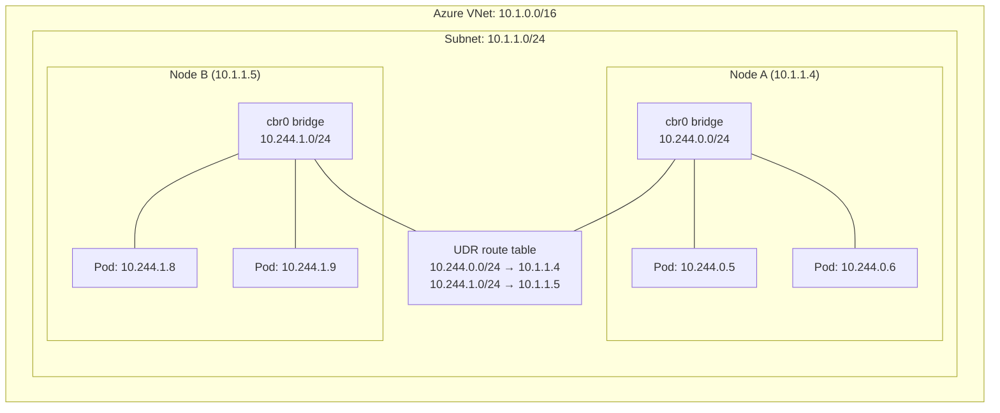
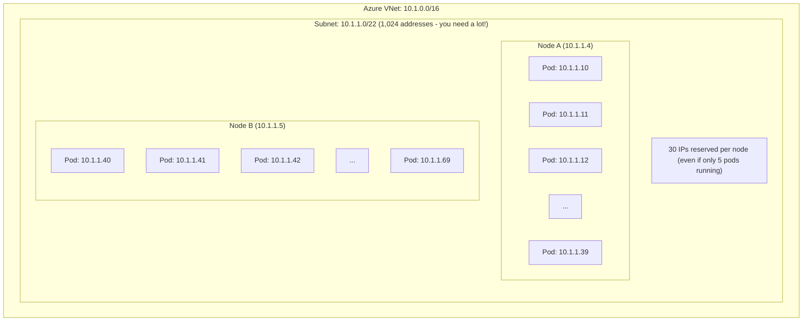
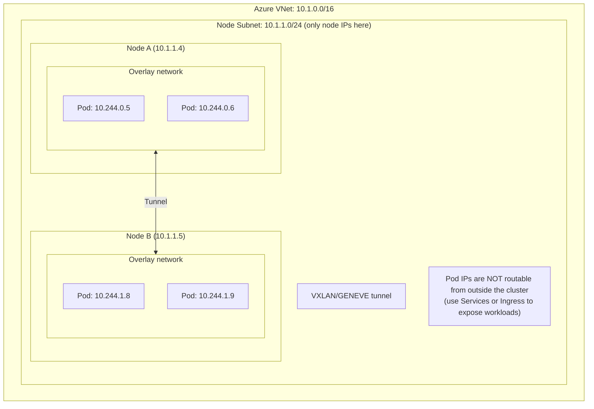
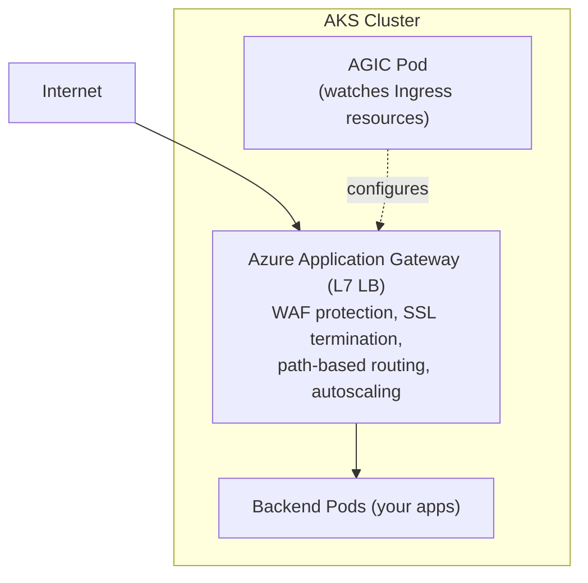
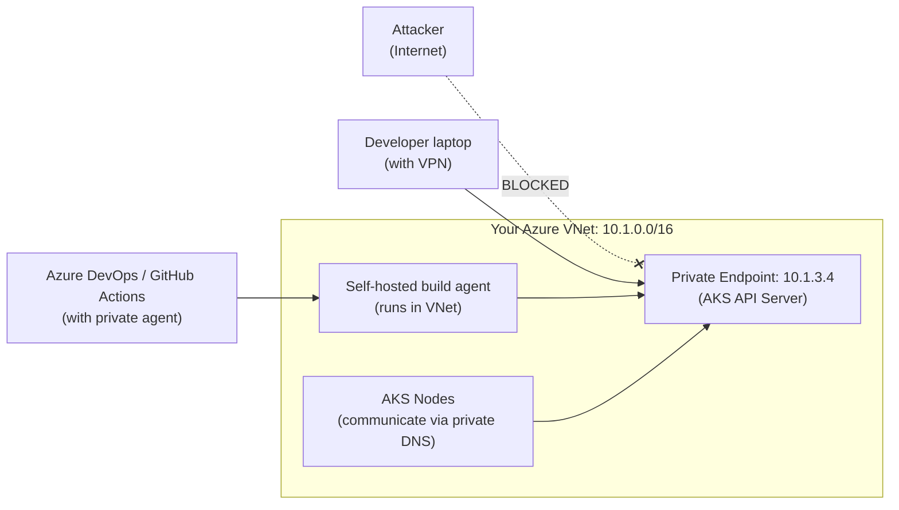

**Complexity**: [COMPLEX] | **Time to Complete**: 3.5h | **Prerequisites**: [Module 7.1: AKS Architecture & Node Management](../module-7.1-aks-architecture/)

## What You'll Be Able to Do

After completing this module, you will be able to:

- **Configure Azure CNI Overlay and Azure CNI with dynamic IP allocation for large-scale AKS networking**
- **Implement AKS ingress with Application Gateway Ingress Controller (AGIC) and internal load balancers**
- **Deploy network policies on AKS using Azure Network Policy Manager or Calico for pod-level traffic isolation**
- **Design AKS private clusters with Private Link, DNS integration, and VNet peering for hub-spoke topologies**

---

## Why This Module Matters

In February 2024, a European e-commerce platform migrated from a legacy monolith to a microservices architecture running on AKS. The team chose the default Kubenet networking plugin because it seemed simpler and required fewer IP addresses. Everything worked fine in their three-service staging environment. Three months after going to production with 85 microservices, the platform started experiencing intermittent 5-second delays on inter-service calls. The delays worsened under load. After two weeks of fruitless application debugging, a network engineer finally traced the problem: Kubenet uses user-defined routes (UDRs) and a bridge network on each node, meaning every pod-to-pod call crossing node boundaries required an extra hop through the Azure routing table. With 85 services generating thousands of cross-node calls per second, the UDR route table hit its update limit, causing route propagation delays that manifested as those mysterious 5-second pauses. The migration to Azure CNI took three weeks and required a complete cluster rebuild---a cost of roughly $180,000 in engineering time and lost revenue during the transition.

Networking is the decision you make early and pay for late. The choice between Azure CNI, Kubenet, CNI Overlay, and the newer CNI Powered by Cilium determines your IP address consumption, pod-to-pod latency, network policy capabilities, and even which Azure services can communicate directly with your pods. Get it wrong and you face an expensive re-architecture. Get it right and your network becomes invisible---which is exactly what a network should be.

In this module, you will understand every AKS networking model in depth, compare network policy engines (Azure Network Policy Manager, Calico, and Cilium), learn when to use Application Gateway Ingress Controller versus NGINX, architect private clusters with Private Link, and connect your cluster to Azure API Management. The hands-on exercise has you deploying CNI Powered by Cilium with L7-aware egress domain filtering---the most advanced networking setup AKS offers.

---

## The Four Networking Models: How Pods Get Their IP Addresses

The single most consequential networking decision in AKS is which Container Network Interface (CNI) plugin to use. This choice affects IP address consumption, network performance, and which features are available. Let us break down all four options.

### Kubenet: The Simple (but Limited) Choice

Kubenet assigns pods IP addresses from a virtual network space that is separate from the Azure VNet. Each node gets a single IP address from the VNet subnet, and pods on that node receive addresses from a private 10.244.0.0/16 range managed by a local bridge. Traffic between pods on different nodes is routed through Azure UDRs.



Kubenet conserves IP addresses---if you have 100 pods across 3 nodes, you only consume 3 VNet IPs. But the trade-offs are severe for production workloads:

- **No direct VNet connectivity for pods**: Azure services (like Azure SQL with VNet service endpoints) cannot reach pod IPs directly.
- **UDR limits**: Azure supports a maximum of 400 routes per route table. With large clusters, you can hit this limit.
- **Performance overhead**: Every cross-node packet traverses the UDR routing layer, adding latency.
- **No Windows node support**: Kubenet only works with Linux nodes.

> **Pause and predict**: If you have 5 nodes and deploy 100 pods using Kubenet, how many IPs are consumed from your Azure VNet? Why?

### Azure CNI: Direct VNet Integration

Azure CNI assigns every pod an IP address directly from the VNet subnet. Each pod is a first-class citizen on the Azure network---accessible by any Azure resource that can reach the VNet, without NAT or routing tricks.



The critical issue with Azure CNI is IP address consumption. By default, AKS pre-allocates IPs for the maximum number of pods each node can run (set by `--max-pods`, default 30). A 10-node cluster with the default setting consumes 300 VNet IPs plus 10 for the nodes themselves---310 total. If you have a /24 subnet (254 usable IPs), you cannot even run 10 nodes.

**Dynamic IP allocation** (Azure CNI with dynamic allocation) mitigates this. Instead of pre-allocating, it assigns IPs only when pods are actually created. This reduces waste but still requires careful subnet planning.

```bash
# Azure CNI with dynamic IP allocation
az aks create \
  --resource-group rg-aks-prod \
  --name aks-cni-dynamic \
  --network-plugin azure \
  --network-plugin-mode overlay \
  --vnet-subnet-id "/subscriptions/{sub}/resourceGroups/rg-network/providers/Microsoft.Network/virtualNetworks/vnet-prod/subnets/aks-nodes" \
  --pod-subnet-id "/subscriptions/{sub}/resourceGroups/rg-network/providers/Microsoft.Network/virtualNetworks/vnet-prod/subnets/aks-pods" \
  --zones 1 2 3
```

> **Stop and think**: You have a /24 subnet (254 usable IPs) and want to deploy a 5-node cluster using Azure CNI with the default 30 pods per node. Will this deployment succeed? What happens when you try to scale to 10 nodes?

### Azure CNI Overlay: Best of Both Worlds

CNI Overlay was introduced to solve the IP exhaustion problem while maintaining most of the benefits of Azure CNI. Nodes get IPs from the VNet subnet (just like Kubenet), but pods get IPs from a private overlay network (default 10.244.0.0/16). The magic is that pod-to-pod traffic uses an overlay tunnel, not UDRs, so you do not hit route table limits.



The trade-off: pod IPs are not directly routable from the VNet. Azure services that rely on direct pod IP connectivity (like certain VNet service endpoint configurations) will not work. For most microservices architectures where external traffic enters through a load balancer or ingress controller, this is perfectly fine.

```bash
# Create an AKS cluster with CNI Overlay
az aks create \
  --resource-group rg-aks-prod \
  --name aks-cni-overlay \
  --network-plugin azure \
  --network-plugin-mode overlay \
  --pod-cidr 10.244.0.0/16 \
  --zones 1 2 3
```

> **Pause and predict**: CNI Overlay solves the IP exhaustion problem of Azure CNI, but pods are no longer directly routable from the VNet. How would an external Azure VM in the same VNet communicate with a web service running on CNI Overlay pods?

### Azure CNI Powered by Cilium: The Future

CNI Powered by Cilium replaces the traditional Azure CNI dataplane with Cilium's eBPF-based dataplane. This gives you all the benefits of CNI Overlay (efficient IP usage) plus Cilium's advanced features: eBPF-based packet processing (no iptables), L7 network policies, transparent encryption, and DNS-aware egress filtering.

```mermaid
graph TD
    subgraph Traditional ["Traditional Networking Stack"]
        App1["Application"] --> Sock1["Socket Layer"]
        Sock1 --> iptables["iptables rules (thousands!)"]
        iptables --> Netfilter["Netfilter conntrack"]
        Netfilter --> NIC1["Network Interface"]
        NIC1 -.-> Note1["O(n) rule evaluation"]
    end
    
    subgraph Cilium ["Cilium eBPF Stack"]
        App2["Application"] --> Sock2["Socket Layer"]
        Sock2 --> eBPF["eBPF programs (compiled, fast)"]
        eBPF --> NIC2["Direct to NIC (bypass iptables entirely)"]
        NIC2 -.-> Note2["O(1) hash lookups"]
    end
```



This is the model Microsoft is actively investing in, and it is the recommended choice for new clusters as of 2026. The eBPF dataplane is not just faster---it fundamentally changes how packet processing scales. With iptables, adding more services linearly increases the number of rules every packet must traverse. With eBPF, lookups are hash-based and remain constant regardless of the number of services.

```bash
# Create an AKS cluster with CNI Powered by Cilium
az aks create \
  --resource-group rg-aks-prod \
  --name aks-cilium \
  --network-plugin azure \
  --network-plugin-mode overlay \
  --network-dataplane cilium \
  --pod-cidr 10.244.0.0/16 \
  --zones 1 2 3 \
  --tier standard
```

> **Stop and think**: Traditional iptables evaluate rules sequentially, meaning latency increases as you add more services. How does Cilium's eBPF approach change this scaling dynamic when a cluster grows from 100 to 10,000 services?

### The Decision Matrix

| Feature | Kubenet | Azure CNI | CNI Overlay | CNI + Cilium |
| :--- | :--- | :--- | :--- | :--- |
| **VNet IPs per pod** | No (bridge IPs) | Yes | No (overlay IPs) | No (overlay IPs) |
| **IP consumption** | Low (node IPs only) | High (node + pod IPs) | Low (node IPs only) | Low (node IPs only) |
| **Max pods/node** | 250 | 250 | 250 | 250 |
| **Network policy engine** | Calico only | Azure NPM, Calico, Cilium | Azure NPM, Calico, Cilium | Cilium (native) |
| **eBPF dataplane** | No | No | No | Yes |
| **L7 network policies** | No | No | No | Yes |
| **Windows nodes** | No | Yes | Yes | Yes (preview) |
| **Direct pod VNet routing** | No (UDR) | Yes | No | No |
| **Recommended for new clusters** | No | Only if direct VNet routing needed | Good | Best |

---

## Network Policies: Controlling East-West Traffic

By default, every pod in a Kubernetes cluster can communicate with every other pod. This flat network is convenient for development but a security nightmare in production. Network policies let you define rules that control which pods can talk to which other pods.

AKS supports three network policy engines, and the choice is made at cluster creation time---you cannot change it later without rebuilding the cluster.

### Azure Network Policy Manager (Azure NPM)

Azure NPM implements Kubernetes NetworkPolicy resources using Azure-native constructs (iptables on Linux, HNS policies on Windows). It is the simplest option and supports all standard Kubernetes NetworkPolicy fields.

```yaml
# Block all ingress to pods in the database namespace
apiVersion: networking.k8s.io/v1
kind: NetworkPolicy
metadata:
  name: deny-all-ingress
  namespace: database
spec:
  podSelector: {}
  policyTypes:
    - Ingress

---
# Allow only the API namespace to reach the database
apiVersion: networking.k8s.io/v1
kind: NetworkPolicy
metadata:
  name: allow-api-to-db
  namespace: database
spec:
  podSelector:
    matchLabels:
      app: postgres
  policyTypes:
    - Ingress
  ingress:
    - from:
        - namespaceSelector:
            matchLabels:
              team: api
      ports:
        - protocol: TCP
          port: 5432
```

### Calico: The Ecosystem Standard

Calico extends the standard Kubernetes NetworkPolicy with its own CRD-based policies that support additional features: global policies (apply across all namespaces), ordered policy evaluation, and CIDR-based rules for controlling traffic to external destinations.

```yaml
# Calico GlobalNetworkPolicy: deny egress to the internet except DNS
apiVersion: projectcalico.org/v3
kind: GlobalNetworkPolicy
metadata:
  name: deny-egress-except-dns
spec:
  order: 100
  selector: "app != 'internet-proxy'"
  types:
    - Egress
  egress:
    - action: Allow
      protocol: UDP
      destination:
        ports:
          - 53
    - action: Allow
      protocol: TCP
      destination:
        ports:
          - 53
    - action: Allow
      destination:
        nets:
          - 10.0.0.0/8
    - action: Deny
```

### Cilium Network Policies: L7-Aware Security

Cilium policies operate at both L3/L4 (like traditional network policies) and L7 (HTTP, gRPC, Kafka, DNS). This means you can write policies that allow a pod to make GET requests to a specific API path but deny POST requests. You can also filter DNS queries, allowing pods to resolve only specific domain names.

```yaml
# CiliumNetworkPolicy: allow HTTP GET to /api/v1/products only
apiVersion: cilium.io/v2
kind: CiliumNetworkPolicy
metadata:
  name: allow-product-reads
  namespace: frontend
spec:
  endpointSelector:
    matchLabels:
      app: web-frontend
  egress:
    - toEndpoints:
        - matchLabels:
            app: product-api
      toPorts:
        - ports:
            - port: "8080"
              protocol: TCP
          rules:
            http:
              - method: GET
                path: "/api/v1/products.*"
```

```yaml
# CiliumNetworkPolicy: DNS-based egress filtering
apiVersion: cilium.io/v2
kind: CiliumNetworkPolicy
metadata:
  name: allow-specific-domains
  namespace: backend
spec:
  endpointSelector:
    matchLabels:
      app: payment-service
  egress:
    - toFQDNs:
        - matchName: "api.stripe.com"
        - matchName: "api.paypal.com"
      toPorts:
        - ports:
            - port: "443"
              protocol: TCP
    - toEndpoints:
        - matchLabels:
            "k8s:io.kubernetes.pod.namespace": kube-system
            "k8s:k8s-app": kube-dns
      toPorts:
        - ports:
            - port: "53"
              protocol: ANY
          rules:
            dns:
              - matchPattern: "*.stripe.com"
              - matchPattern: "*.paypal.com"
```

This DNS-aware policy is transformative for security. Instead of maintaining IP allowlists for external services (which change constantly), you specify domain names. Cilium intercepts DNS queries, resolves them, and dynamically creates IP-based rules. If Stripe changes their API server IP, your policy automatically adapts.

> **Stop and think**: You need to ensure your backend pods can only download updates from `github.com`. How would implementing this differ between Azure NPM (standard NetworkPolicy) and Cilium Network Policies? Which approach is more resilient to infrastructure changes?

---

## Ingress: Getting Traffic Into Your Cluster

AKS supports two primary ingress controllers as managed add-ons: Application Gateway Ingress Controller (AGIC) and the NGINX-based web application routing add-on.

### Application Gateway Ingress Controller (AGIC)

AGIC uses Azure Application Gateway (a layer-7 load balancer) as the ingress controller. The controller runs inside your cluster, watches for Kubernetes Ingress resources, and configures the Application Gateway accordingly.



AGIC shines when you need Web Application Firewall (WAF) protection, SSL offloading at scale, or native integration with Azure services like Azure Front Door. It does not run an in-cluster proxy---traffic goes directly from the Application Gateway to the backend pods (if using Azure CNI with direct pod routing) or through the node's IP.

```bash
# Enable AGIC add-on with a new Application Gateway
az aks enable-addons \
  --resource-group rg-aks-prod \
  --name aks-prod-westeurope \
  --addons ingress-appgw \
  --appgw-name appgw-aks \
  --appgw-subnet-cidr "10.1.2.0/24"
```

### NGINX Ingress (Web Application Routing Add-on)

The web application routing add-on deploys an NGINX-based ingress controller managed by AKS. It integrates with Azure DNS for automatic DNS record creation and Azure Key Vault for TLS certificate management.

```bash
# Enable the web application routing add-on
az aks enable-addons \
  --resource-group rg-aks-prod \
  --name aks-prod-westeurope \
  --addons web_application_routing

# Verify the ingress controller is running
kubectl get pods -n app-routing-system
```

```yaml
# Ingress resource using the web application routing add-on
apiVersion: networking.k8s.io/v1
kind: Ingress
metadata:
  name: payment-api
  namespace: payments
  annotations:
    kubernetes.azure.com/tls-cert-keyvault-uri: "https://kv-aks-prod.vault.azure.net/certificates/payment-api-tls"
spec:
  ingressClassName: webapprouting.kubernetes.azure.com
  rules:
    - host: payments.example.com
      http:
        paths:
          - path: /api
            pathType: Prefix
            backend:
              service:
                name: payment-api
                port:
                  number: 8080
  tls:
    - hosts:
        - payments.example.com
      secretName: payment-api-tls
```

### When to Use Which

| Criteria | AGIC (App Gateway) | Web App Routing (NGINX) |
| :--- | :--- | :--- |
| **WAF protection** | Built-in (WAF v2) | Need external WAF or ModSecurity |
| **SSL termination scale** | Handles thousands of certs natively | Slower at high cert counts |
| **Custom NGINX config** | Not applicable | Full NGINX configuration available |
| **gRPC support** | Limited | Full support |
| **WebSocket support** | Yes | Yes |
| **Cost** | Application Gateway pricing (can be expensive) | Included in node cost |
| **Best for** | Enterprise apps with WAF requirements | General-purpose microservices |

---

## Private Clusters and Private Link: Hiding the API Server

By default, the AKS API server has a public endpoint. Anyone on the internet can attempt to reach it (authentication still blocks unauthorized access, but the endpoint is discoverable). For regulated industries and security-conscious organizations, this is unacceptable.

A private AKS cluster moves the API server behind an Azure Private Endpoint. The API server gets a private IP address in your VNet, and the public endpoint is disabled entirely.



```bash
# Create a private AKS cluster
az aks create \
  --resource-group rg-aks-prod \
  --name aks-private \
  --enable-private-cluster \
  --private-dns-zone system \
  --network-plugin azure \
  --network-plugin-mode overlay \
  --network-dataplane cilium \
  --zones 1 2 3

# Verify the API server is private
az aks show -g rg-aks-prod -n aks-private \
  --query "apiServerAccessProfile" -o json
```

The `--private-dns-zone system` option creates an Azure Private DNS Zone in the MC_ resource group. AKS nodes resolve the API server FQDN through this private zone, getting the private IP instead of a public one. For the developer workstations and CI/CD agents to access the cluster, they must be on the VNet (or peered VNet) and have DNS resolution configured to use the private zone.

### API Management Integration

For clusters that need to expose APIs externally with enterprise-grade management, Azure API Management (APIM) sits in front of the cluster and provides rate limiting, authentication, request/response transformation, caching, and developer portal features.

```bash
# Create API Management instance in the same VNet
az apim create \
  --name apim-aks-prod \
  --resource-group rg-aks-prod \
  --publisher-name "Contoso" \
  --publisher-email "platform@contoso.com" \
  --sku-name Developer \
  --virtual-network Internal \
  --virtual-network-type Internal

# Import an API from your AKS service
az apim api import \
  --resource-group rg-aks-prod \
  --service-name apim-aks-prod \
  --path "/payments" \
  --api-id "payment-api" \
  --specification-format OpenApiJson \
  --specification-url "http://payment-api.payments.svc.cluster.local:8080/openapi.json"
```

---

## Egress Control: Managing Outbound Traffic

By default, AKS nodes use an Azure Load Balancer with outbound rules for internet access. Every node shares a pool of public IPs for outbound connections. For production clusters, you often need more control: which pods can reach the internet, which domains they can access, and what source IP they present.

### Azure NAT Gateway

For predictable outbound IPs (important when whitelisting with external partners), attach a NAT Gateway to your AKS subnet:

```bash
# Create a NAT Gateway with a static public IP
az network public-ip create \
  --resource-group rg-aks-prod \
  --name pip-aks-egress \
  --sku Standard \
  --allocation-method Static

az network nat gateway create \
  --resource-group rg-aks-prod \
  --name natgw-aks \
  --public-ip-addresses pip-aks-egress \
  --idle-timeout 10

# Associate with the AKS subnet
az network vnet subnet update \
  --resource-group rg-aks-prod \
  --vnet-name vnet-prod \
  --name aks-nodes \
  --nat-gateway natgw-aks
```

### Azure Firewall for Centralized Egress

For enterprise environments, Azure Firewall or a third-party NVA provides centralized egress with FQDN filtering, threat intelligence, and logging:

```bash
# Route all egress through Azure Firewall
az network route-table create \
  --resource-group rg-aks-prod \
  --name rt-aks-egress

az network route-table route create \
  --resource-group rg-aks-prod \
  --route-table-name rt-aks-egress \
  --name default-route \
  --address-prefix 0.0.0.0/0 \
  --next-hop-type VirtualAppliance \
  --next-hop-ip-address 10.1.4.4  # Azure Firewall private IP
```

---

## Did You Know?

1. **Azure CNI Powered by Cilium replaces kube-proxy entirely.** In a traditional AKS cluster, kube-proxy maintains iptables rules on every node to implement Kubernetes Services. With Cilium, kube-proxy is not deployed at all. Cilium handles service routing using eBPF maps, which provide O(1) lookup performance compared to iptables' O(n) rule traversal. On clusters with over 5,000 services, this difference can reduce service routing latency by more than 60%.

2. **The maximum number of pods per node in AKS is 250, regardless of CNI plugin.** This is an Azure VMSS limitation, not a Kubernetes one. However, most teams find that 110 (the default for Azure CNI) is optimal. Going higher means more IP addresses consumed per node (with Azure CNI) and more kubelet overhead for pod lifecycle management.

3. **AKS Private Link costs nothing beyond the standard cluster pricing.** The Private Endpoint for the API server is included in the AKS service at no additional charge. However, the operational cost is significant---you need VPN or ExpressRoute connectivity for developer access, self-hosted CI/CD agents in the VNet, and proper DNS configuration. Many teams underestimate this operational overhead.

4. **Cilium's eBPF-based network policies are enforced at the kernel level before the packet reaches the application.** This means a compromised application cannot bypass network policies by manipulating its own network stack. Traditional iptables-based policies operate in the same kernel namespace, but eBPF programs are loaded and verified by the kernel itself, providing a stronger isolation boundary.

---

## Common Mistakes

| Mistake | Why It Happens | How to Fix It |
| :--- | :--- | :--- |
| Choosing Azure CNI without sizing subnets for pod IP consumption | Teams use existing small subnets from on-prem thinking | Calculate: (max_nodes x max_pods_per_node) + max_nodes. Use /20 or larger for production Azure CNI |
| Using Kubenet for production workloads with many services | It worked fine in dev with 5 services | Use CNI Overlay or CNI Powered by Cilium for production. Kubenet has inherent scaling limits |
| Not deploying network policies at all | "We'll add security later" | Deploy default-deny policies from day one. It is far easier to allowlist than to retroactively lock down |
| Mixing network policy engines (e.g., applying Calico CRDs on a Cilium cluster) | Confusion about which engine is active | Check your cluster's network policy setting; only use CRDs for the active engine |
| Creating a private cluster without planning for CI/CD access | Developers can kubectl from laptops, so CI/CD should work too | Private clusters block all public access. Deploy self-hosted agents in the VNet or use AKS command invoke |
| Deploying AGIC without understanding Application Gateway pricing | AGIC seems like the "enterprise" choice | Application Gateway WAF v2 costs $325+/month base. Use web application routing add-on unless you specifically need WAF |
| Not configuring egress control | Default load balancer outbound rules are "good enough" | Use NAT Gateway for static IPs. Use Azure Firewall for FQDN filtering. Pods should not have unrestricted internet access |
| Ignoring DNS resolution in private clusters | kubectl works from the VNet but not from CI/CD agents | Ensure all clients can resolve the private DNS zone. Use conditional DNS forwarding or Azure Private DNS resolver |

---

## Quiz

<details>
<summary>1. Your company is deploying a new microservices application to AKS. The networking team has allocated a small /24 subnet (254 IPs) for the cluster. The application requires 150 pods across 5 nodes, but also needs to be accessed by legacy Azure VMs on a peered VNet. Which CNI model (Azure CNI or CNI Overlay) should you choose, and what trade-offs must you manage?</summary>

You must choose CNI Overlay because Azure CNI would exhaust the /24 subnet immediately. With Azure CNI's default pre-allocation, 5 nodes would reserve 150 IPs just for pods, leaving little room for node IPs, upgrades, or scaling. CNI Overlay solves this by assigning pod IPs from a private, non-routable address space, consuming only 5 VNet IPs for the nodes. However, the trade-off is that the legacy Azure VMs cannot route directly to the pod IPs; you must expose the application using an internal LoadBalancer Service or an Ingress Controller to bridge the VNet and the overlay network.
</details>

<details>
<summary>2. During an architecture review for a massive cluster intended to run 8,000 distinct microservices, a senior engineer proposes using Azure CNI Powered by Cilium instead of traditional Azure CNI. They claim this will significantly reduce network latency between services. Why is this claim correct regarding kube-proxy?</summary>

The claim is correct because Cilium entirely replaces the traditional kube-proxy component with an eBPF-based dataplane. In a standard setup, kube-proxy translates Kubernetes Services into thousands of sequential iptables rules, meaning every packet must traverse a long list of rules to find its destination. This creates significant latency at scale due to the linear evaluation of these rules. Cilium, on the other hand, uses eBPF maps embedded directly in the Linux kernel to perform service routing. These maps use highly efficient, O(1) hash-based lookups, ensuring that routing performance remains consistently fast whether the cluster has 80 services or 8,000.
</details>

<details>
<summary>3. A compliance auditor requires that your payment processing pods only communicate with the external payment gateway at `api.stripe.com`, but the gateway's IP addresses change dynamically due to their CDN. Why would standard Kubernetes NetworkPolicies fail this audit, and how do Cilium L7 policies solve it?</summary>

Standard Kubernetes NetworkPolicies operate strictly at Layer 3 and Layer 4, meaning they can only filter traffic based on static IP CIDR blocks and ports. Because Stripe's IPs change dynamically, maintaining an accurate IP allowlist in a standard NetworkPolicy is operationally impossible and would lead to blocked legitimate traffic or overly permissive rules. Cilium L7 policies solve this by intercepting and evaluating DNS queries at the application layer. When a pod requests `api.stripe.com`, Cilium resolves the domain, dynamically allows the outbound connection to the returned IPs, and enforces that the traffic uses the correct protocol (like HTTPS), fully satisfying the compliance requirement.
</details>

<details>
<summary>4. Your security team mandates that a new production AKS cluster must have its API server endpoint completely removed from the public internet using the `--enable-private-cluster` flag. After deployment, your existing GitHub Actions pipeline, which uses Ubuntu-latest runners, suddenly fails to run `kubectl apply`. Why did this happen, and what architectural changes must you make to fix the pipeline?</summary>

This failure occurs because the `--enable-private-cluster` flag places the AKS API server behind an Azure Private Endpoint, giving it a private IP address and entirely disabling public routing. The GitHub Actions hosted runners operate outside your VNet on the public internet, so they can no longer reach or resolve the API server directly. To fix this, you must rethink your pipeline architecture by deploying self-hosted build agents directly inside the cluster's VNet or a peered VNet. Alternatively, you can use the `az aks command invoke` feature, which tunnels commands through the Azure Resource Manager management plane, bypassing the need for direct network line-of-sight to the API server.
</details>

<details>
<summary>5. Your team is launching a new public-facing customer portal on AKS. The security team requires strict OWASP vulnerability protection (like SQL injection blocking) at the edge, while the finance team wants to minimize infrastructure costs. You must choose an ingress controller. Which ingress solution—AGIC or the NGINX web application routing add-on—is the correct architectural choice for this scenario?</summary>

You must choose the Application Gateway Ingress Controller (AGIC) because of the strict security requirement for OWASP vulnerability protection. AGIC natively integrates with Azure Application Gateway, which provides a built-in Web Application Firewall (WAF) that actively inspects Layer 7 traffic and blocks threats like SQL injection before they ever reach the cluster. While the NGINX web application routing add-on is significantly cheaper and included in the node cost, it lacks native WAF capabilities. Relying on NGINX would require you to deploy and manage complex third-party security tools (like ModSecurity) manually, so in this scenario, the security mandate outweighs the desire to minimize base infrastructure costs.
</details>

<details>
<summary>6. Your AKS pods scrape financial data from a partner API that strictly enforces IP whitelisting. Currently, your cluster uses the default Azure Load Balancer for egress, and the partner frequently blocks your requests, claiming the traffic comes from unrecognized IPs. Why is the default Load Balancer causing this issue, and how does a NAT Gateway permanently resolve it?</summary>

The default Azure Load Balancer dynamically assigns outbound traffic to a pool of public IP addresses, meaning your pods' source IP can change unpredictably. This unpredictable behavior causes the partner's strict whitelist to reject the connections when they originate from an unrecognized pool IP. Additionally, the default setup can suffer from SNAT port exhaustion under heavy outbound load, leading to dropped connections. Implementing a NAT Gateway permanently resolves this because it attaches a dedicated, static Public IP address to your entire AKS subnet for all outbound traffic. This allows you to provide the partner with a single, unchanging IP address for their whitelist, while also providing a massive pool of SNAT ports (up to 64,512 per IP) to handle high-volume scraping without dropping connections.
</details>

<details>
<summary>7. Six months after deploying a production AKS cluster using Azure NPM, your security team demands you implement DNS-based egress filtering using Cilium Network Policies. You attempt to update the cluster configuration via the Azure CLI to switch the network policy engine to Cilium, but the command is rejected. Why does Azure prevent this change, and what is the required path forward?</summary>

Azure prevents this change because the network policy engine is deeply and irreversibly embedded into the cluster's core networking dataplane at creation time. Azure NPM relies on iptables rules and native OS constructs, whereas Cilium requires completely replacing the kube-proxy component and injecting eBPF programs directly into the Linux kernel. Attempting to rip out one foundational networking stack and hot-swap it with another on a live cluster would cause catastrophic network failure and complete loss of pod-to-pod connectivity. The only supported path forward is a blue-green migration: you must build an entirely new AKS cluster with Cilium enabled from day one, and then carefully migrate your workloads over to the new environment.
</details>

---

## Hands-On Exercise: CNI Powered by Cilium with L7 Egress Domain Filtering

In this exercise, you will deploy an AKS cluster with CNI Powered by Cilium and implement L7-aware egress policies that restrict pods to specific external domains.

### Prerequisites

- Azure CLI with aks-preview extension (`az extension add --name aks-preview`)
- An Azure subscription with Contributor access
- kubectl and kubelogin installed

### Task 1: Deploy AKS with CNI Powered by Cilium

Create a cluster with the Cilium dataplane and verify it is operational.

<details>
<summary>Solution</summary>

```bash
# Create a resource group
az group create --name rg-aks-cilium --location westeurope

# Create the cluster with Cilium
az aks create \
  --resource-group rg-aks-cilium \
  --name aks-cilium-lab \
  --network-plugin azure \
  --network-plugin-mode overlay \
  --network-dataplane cilium \
  --pod-cidr 10.244.0.0/16 \
  --node-count 3 \
  --node-vm-size Standard_D4s_v5 \
  --zones 1 2 3 \
  --tier standard \
  --generate-ssh-keys

# Get credentials
az aks get-credentials -g rg-aks-cilium -n aks-cilium-lab --overwrite-existing

# Verify Cilium is running
kubectl get pods -n kube-system -l k8s-app=cilium -o wide

# Verify kube-proxy is NOT running (Cilium replaces it)
kubectl get pods -n kube-system -l component=kube-proxy
# Expected: No resources found

# Check Cilium status
kubectl exec -n kube-system -l k8s-app=cilium -- cilium status --brief
```

</details>

### Task 2: Deploy Test Workloads

Deploy a frontend and backend service with clearly defined communication requirements.

<details>
<summary>Solution</summary>

```bash
# Create namespaces
kubectl create namespace frontend
kubectl create namespace backend

# Deploy backend (payment service that needs to reach Stripe)
kubectl apply -f - <<'EOF'
apiVersion: apps/v1
kind: Deployment
metadata:
  name: payment-service
  namespace: backend
spec:
  replicas: 2
  selector:
    matchLabels:
      app: payment-service
  template:
    metadata:
      labels:
        app: payment-service
    spec:
      containers:
        - name: payment
          image: curlimages/curl:8.5.0
          command: ["sleep", "infinity"]
          resources:
            requests:
              cpu: "100m"
              memory: "128Mi"
---
apiVersion: v1
kind: Service
metadata:
  name: payment-service
  namespace: backend
spec:
  selector:
    app: payment-service
  ports:
    - port: 8080
      targetPort: 8080
EOF

# Deploy frontend (web app that calls the payment service)
kubectl apply -f - <<'EOF'
apiVersion: apps/v1
kind: Deployment
metadata:
  name: web-frontend
  namespace: frontend
spec:
  replicas: 2
  selector:
    matchLabels:
      app: web-frontend
  template:
    metadata:
      labels:
        app: web-frontend
    spec:
      containers:
        - name: web
          image: curlimages/curl:8.5.0
          command: ["sleep", "infinity"]
          resources:
            requests:
              cpu: "100m"
              memory: "128Mi"
EOF

# Verify pods are running
kubectl get pods -n backend
kubectl get pods -n frontend
```

</details>

### Task 3: Apply Default-Deny Network Policies

Lock down both namespaces with default-deny policies before adding allowlists.

<details>
<summary>Solution</summary>

```yaml
# Save as default-deny.yaml
apiVersion: cilium.io/v2
kind: CiliumNetworkPolicy
metadata:
  name: default-deny-all
  namespace: backend
spec:
  endpointSelector: {}
  ingress:
    - {}
  egress:
    - {}

---
apiVersion: cilium.io/v2
kind: CiliumNetworkPolicy
metadata:
  name: default-deny-all
  namespace: frontend
spec:
  endpointSelector: {}
  ingress:
    - {}
  egress:
    - {}
```

```bash
# Apply the deny-all policies
kubectl apply -f default-deny.yaml

# Verify that the payment service can no longer reach the internet
PAYMENT_POD=$(kubectl get pod -n backend -l app=payment-service -o jsonpath='{.items[0].metadata.name}')
kubectl exec -n backend "$PAYMENT_POD" -- curl -s --max-time 5 https://httpbin.org/get
# Expected: timeout (connection blocked)
```

Note: The default-deny policy above uses empty ingress/egress rules, which blocks everything that is not explicitly allowed by another policy. This is the recommended starting point for any production namespace.

</details>

### Task 4: Implement L7 Egress Domain Filtering

Allow the payment service to reach only specific external domains (Stripe and the cluster's DNS).

<details>
<summary>Solution</summary>

```yaml
# Save as payment-egress-policy.yaml
apiVersion: cilium.io/v2
kind: CiliumNetworkPolicy
metadata:
  name: payment-egress-domains
  namespace: backend
spec:
  endpointSelector:
    matchLabels:
      app: payment-service
  egress:
    # Allow DNS resolution for permitted domains only
    - toEndpoints:
        - matchLabels:
            "k8s:io.kubernetes.pod.namespace": kube-system
            "k8s:k8s-app": kube-dns
      toPorts:
        - ports:
            - port: "53"
              protocol: ANY
          rules:
            dns:
              - matchPattern: "*.stripe.com"
              - matchPattern: "api.stripe.com"
              - matchPattern: "httpbin.org"
    # Allow HTTPS to resolved Stripe IPs
    - toFQDNs:
        - matchName: "api.stripe.com"
        - matchName: "httpbin.org"
      toPorts:
        - ports:
            - port: "443"
              protocol: TCP
    # Allow communication within the cluster
    - toEndpoints:
        - matchLabels:
            "k8s:io.kubernetes.pod.namespace": frontend
```

```bash
kubectl apply -f payment-egress-policy.yaml

# Test: payment service can reach httpbin.org (our stand-in for Stripe)
kubectl exec -n backend "$PAYMENT_POD" -- curl -s --max-time 10 https://httpbin.org/get | head -5
# Expected: success (JSON response)

# Test: payment service CANNOT reach google.com
kubectl exec -n backend "$PAYMENT_POD" -- curl -s --max-time 5 https://www.google.com
# Expected: timeout (domain not in allowlist)

# Test: payment service CANNOT reach example.com
kubectl exec -n backend "$PAYMENT_POD" -- curl -s --max-time 5 https://example.com
# Expected: timeout (domain not in allowlist)
```

</details>

### Task 5: Allow Frontend-to-Backend Communication

Configure policies so the frontend can reach the payment service on port 8080 but nothing else.

<details>
<summary>Solution</summary>

```yaml
# Save as frontend-to-backend.yaml
apiVersion: cilium.io/v2
kind: CiliumNetworkPolicy
metadata:
  name: frontend-to-payment
  namespace: frontend
spec:
  endpointSelector:
    matchLabels:
      app: web-frontend
  egress:
    # Allow DNS
    - toEndpoints:
        - matchLabels:
            "k8s:io.kubernetes.pod.namespace": kube-system
            "k8s:k8s-app": kube-dns
      toPorts:
        - ports:
            - port: "53"
              protocol: ANY
    # Allow reaching payment service in backend namespace
    - toEndpoints:
        - matchLabels:
            "k8s:io.kubernetes.pod.namespace": backend
            app: payment-service
      toPorts:
        - ports:
            - port: "8080"
              protocol: TCP

---
# Update backend ingress to allow frontend traffic
apiVersion: cilium.io/v2
kind: CiliumNetworkPolicy
metadata:
  name: allow-frontend-ingress
  namespace: backend
spec:
  endpointSelector:
    matchLabels:
      app: payment-service
  ingress:
    - fromEndpoints:
        - matchLabels:
            "k8s:io.kubernetes.pod.namespace": frontend
            app: web-frontend
      toPorts:
        - ports:
            - port: "8080"
              protocol: TCP
```

```bash
kubectl apply -f frontend-to-backend.yaml

# Verify the Cilium policies are loaded
kubectl get ciliumnetworkpolicies -A

# Check Cilium's policy enforcement status
kubectl exec -n kube-system -l k8s-app=cilium -- cilium endpoint list
```

</details>

### Task 6: Verify the Complete Security Posture

Run a comprehensive test to confirm all policies are working as expected.

<details>
<summary>Solution</summary>

```bash
PAYMENT_POD=$(kubectl get pod -n backend -l app=payment-service -o jsonpath='{.items[0].metadata.name}')
FRONTEND_POD=$(kubectl get pod -n frontend -l app=web-frontend -o jsonpath='{.items[0].metadata.name}')

echo "=== Test 1: Payment service -> httpbin.org (should SUCCEED) ==="
kubectl exec -n backend "$PAYMENT_POD" -- curl -s --max-time 10 -o /dev/null -w "%{http_code}" https://httpbin.org/get

echo ""
echo "=== Test 2: Payment service -> google.com (should FAIL) ==="
kubectl exec -n backend "$PAYMENT_POD" -- curl -s --max-time 5 -o /dev/null -w "%{http_code}" https://www.google.com || echo "BLOCKED"

echo ""
echo "=== Test 3: Frontend -> internet (should FAIL) ==="
kubectl exec -n frontend "$FRONTEND_POD" -- curl -s --max-time 5 -o /dev/null -w "%{http_code}" https://httpbin.org/get || echo "BLOCKED"

echo ""
echo "=== Test 4: Cilium policy verdict log ==="
kubectl exec -n kube-system -l k8s-app=cilium -- cilium monitor --type policy-verdict --last 10
```

</details>

### Success Criteria

- [ ] AKS cluster running with CNI Powered by Cilium (kube-proxy absent)
- [ ] Cilium agent pods healthy on all nodes
- [ ] Default-deny CiliumNetworkPolicies applied in both namespaces
- [ ] Payment service can resolve and reach api.stripe.com / httpbin.org on port 443
- [ ] Payment service cannot reach any other external domain (google.com, example.com)
- [ ] Frontend can reach payment-service on port 8080
- [ ] Frontend cannot reach the internet directly
- [ ] Cilium policy verdict logs show allowed and denied connections

---

## Next Module

[Module 7.3: AKS Workload Identity & Security](../module-7.3-aks-identity/) --- Learn how to eliminate hardcoded credentials entirely using Entra Workload Identity, federated identity credentials, and the Secrets Store CSI Driver with Azure Key Vault integration.