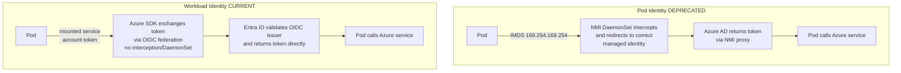
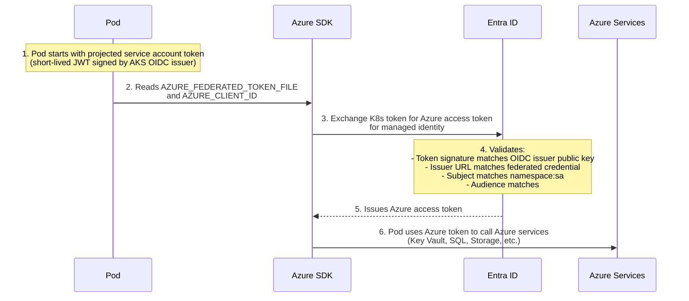

**Complexity**: [QUICK] | **Time to Complete**: 1.5h | **Prerequisites**: [Module 7.1: AKS Architecture & Node Management](../module-7.1-aks-architecture/)

## What You'll Be Able to Do

After completing this module, you will be able to:

- **Configure AKS Workload Identity with Entra ID federated credentials for pod-level Azure resource access**
- **Implement Azure Key Vault Secrets Provider (CSI driver) to inject secrets into pods without application changes**
- **Deploy Microsoft Defender for Containers to monitor AKS runtime threats and enforce security baselines**
- **Design namespace-level RBAC with Entra ID groups mapped to Kubernetes ClusterRoles for team-based access control**

---

## Why This Module Matters

Storing long-lived database credentials in Kubernetes Secrets can lead to serious breaches if those values are exposed through logs, chat systems, manifests, or overly broad cluster access. The operational and regulatory fallout can be severe, especially for systems handling sensitive data.

This incident is depressingly common. [Kubernetes Secrets are base64-encoded, not encrypted](https://kubernetes.io/docs/concepts/security/secrets-good-practices). Anyone with read access to Secrets in a namespace can decode them instantly. The real solution is to avoid putting long-lived credentials in Kubernetes whenever possible. Azure provides a complete credential-free architecture through three interlocking features: Entra Workload Identity (which gives pods an identity without a password), the Secrets Store CSI Driver (which injects secrets from Azure Key Vault directly into pods at mount time), and Microsoft Defender for Containers (which monitors runtime behavior and blocks known attack patterns).

In this module, you will learn the full journey from the deprecated Pod Identity to the modern Workload Identity architecture, understand how federated identity credentials eliminate service principal secrets, integrate the Secrets Store CSI Driver with Key Vault, and set up Azure Policy to enforce security guardrails across your cluster. By the end, your pods will authenticate to Azure services without a single credential stored anywhere in Kubernetes.

---

## From Pod Identity to Workload Identity: Why the Migration Matters

Azure AD Pod Identity (v1) was the original mechanism for giving AKS pods Azure identities. It used [a DaemonSet called the Node Managed Identity (NMI) that intercepted IMDS (Instance Metadata Service) requests from pods](https://learn.microsoft.com/en-us/azure/aks/use-azure-ad-pod-identity) and redirected them to the correct Azure Managed Identity. It worked, but it had serious problems:

> **Stop and think**: If Pod Identity intercepts all traffic to the IMDS endpoint (169.254.169.254), what happens if two pods on the same node need different identities? How does the DaemonSet distinguish them securely, and what are the risks if the interception mechanism fails?

- **NMI added operational dependency**: Pod Identity depended on the NMI component on each node to broker IMDS token requests for workloads.
- **IMDS interception added networking complexity**: Pod Identity relied on intercepting traffic to the IMDS endpoint rather than using direct OIDC federation.
- **Configuration overhead**: Pod Identity required AzureIdentity and AzureIdentityBinding resources, which added extra configuration to manage across namespaces.
- **Security concerns**: Pod Identity had documented network-path risks and required careful control of IMDS exposure in the cluster.

Pod Identity was [deprecated in October 2022](https://learn.microsoft.com/en-us/azure/aks/use-azure-ad-pod-identity) and replaced by Entra Workload Identity, which uses an entirely different mechanism based on OIDC federation.



If you are still running Pod Identity, migrate immediately. Microsoft has published a migration guide, and the process is straightforward for most workloads.

---

## How Workload Identity Works: The Full Chain

[Entra Workload Identity uses a standards-based OIDC federation flow](https://learn.microsoft.com/en-us/azure/aks/workload-identity-overview). No secrets, no DaemonSets, no iptables interception. Here is the complete authentication chain:

### Step 1: AKS Exposes an OIDC Issuer

When you enable Workload Identity on an AKS cluster, [AKS publishes an OIDC discovery document at a public URL](https://learn.microsoft.com/en-us/azure/aks/workload-identity-overview). This document describes the cluster's signing keys. Entra ID uses this document to verify that tokens issued by the cluster are legitimate.

```bash
# Enable OIDC issuer and Workload Identity on the cluster
az aks update \
  --resource-group rg-aks-prod \
  --name aks-prod-westeurope \
  --enable-oidc-issuer \
  --enable-workload-identity

# Get the OIDC issuer URL
OIDC_ISSUER=$(az aks show -g rg-aks-prod -n aks-prod-westeurope \
  --query "oidcIssuerProfile.issuerUrl" -o tsv)
echo "OIDC Issuer: $OIDC_ISSUER"
# Output: https://eastus.oic.prod-aks.azure.com/xxxxxxxx-xxxx-xxxx-xxxx-xxxxxxxxxxxx/
```

### Step 2: Create a Managed Identity in Azure

This is the identity your pod will assume. Unlike a service principal, a Managed Identity has no password or certificate to manage---Azure handles the credential lifecycle entirely.

```bash
# Create a user-assigned managed identity
az identity create \
  --resource-group rg-aks-prod \
  --name id-payment-service \
  --location westeurope

# Get the identity's client ID (you will need this)
CLIENT_ID=$(az identity show -g rg-aks-prod -n id-payment-service \
  --query clientId -o tsv)
echo "Client ID: $CLIENT_ID"
```

### Step 3: Create the Federated Identity Credential

This is the key step that connects your Kubernetes service account to the Azure Managed Identity. It tells Entra ID: "When a token comes from this specific OIDC issuer, for this specific Kubernetes service account in this specific namespace, trust it and issue an Azure token for this Managed Identity."

```bash
# Create the federation between the K8s service account and the managed identity
az identity federated-credential create \
  --name fed-payment-service \
  --identity-name id-payment-service \
  --resource-group rg-aks-prod \
  --issuer "$OIDC_ISSUER" \
  --subject "system:serviceaccount:payments:payment-service-sa" \
  --audiences "api://AzureADTokenExchange"
```

The `--subject` field is critically important. It follows the format [`system:serviceaccount:{namespace}:{service-account-name}`](https://learn.microsoft.com/en-us/azure/aks/csi-secrets-store-identity-access). If a pod in a different namespace or using a different service account tries to use this federation, Entra ID will reject the token. This provides namespace-level isolation without any network-based interception.

### Step 4: Create the Kubernetes Service Account with Annotations

```yaml
apiVersion: v1
kind: ServiceAccount
metadata:
  name: payment-service-sa
  namespace: payments
  annotations:
    azure.workload.identity/client-id: "<CLIENT_ID>"
  labels:
    azure.workload.identity/use: "true"
```

```bash
k apply -f - <<EOF
apiVersion: v1
kind: ServiceAccount
metadata:
  name: payment-service-sa
  namespace: payments
  annotations:
    azure.workload.identity/client-id: "$CLIENT_ID"
  labels:
    azure.workload.identity/use: "true"
EOF
```

### Step 5: Deploy the Pod with the Service Account

When you reference this service account in a pod, the Workload Identity webhook (running in AKS) automatically injects the following into the pod spec:

- A projected service account token volume mounted at `/var/run/secrets/azure/tokens/azure-identity-token`
- Environment variables: [`AZURE_CLIENT_ID`, `AZURE_TENANT_ID`, `AZURE_FEDERATED_TOKEN_FILE`, `AZURE_AUTHORITY_HOST`](https://github.com/Azure-Samples/azure-ad-workload-identity)

Your application code uses the Azure SDK's `DefaultAzureCredential`, which automatically picks up these environment variables and performs the token exchange.

> **Pause and predict**: If you delete the federated credential in Entra ID, how quickly will the pod lose access to Azure services? Will it be immediate, or will it take time based on the token expiration?

```yaml
apiVersion: apps/v1
kind: Deployment
metadata:
  name: payment-service
  namespace: payments
spec:
  replicas: 3
  selector:
    matchLabels:
      app: payment-service
  template:
    metadata:
      labels:
        app: payment-service
    spec:
      serviceAccountName: payment-service-sa
      containers:
        - name: payment
          image: myregistry.azurecr.io/payment-service:v2.1.0
          env:
            # These are injected automatically by the webhook,
            # but listing them here for clarity:
            # AZURE_CLIENT_ID
            # AZURE_TENANT_ID
            # AZURE_FEDERATED_TOKEN_FILE
          resources:
            requests:
              cpu: "250m"
              memory: "256Mi"
            limits:
              cpu: "500m"
              memory: "512Mi"
```



---

## Secrets Store CSI Driver with Azure Key Vault

Even with Workload Identity, you still need a way to get secrets (connection strings, API keys, certificates) into your pods. The Secrets Store CSI Driver mounts secrets from Azure Key Vault directly into your pod's filesystem as files, without them ever touching a Kubernetes Secret.

### How It Works

The CSI driver runs as a DaemonSet on every node. When a pod with a `SecretProviderClass` volume mounts, the driver:

1. Authenticates to Key Vault using the pod's Workload Identity
2. Retrieves the specified secrets, keys, or certificates
3. Mounts them as files in the pod's volume
4. [Optionally syncs them to a Kubernetes Secret](https://learn.microsoft.com/en-us/azure/aks/csi-secrets-store-driver) (for environment variable consumption)

```bash
# Enable the Secrets Store CSI Driver add-on
az aks enable-addons \
  --resource-group rg-aks-prod \
  --name aks-prod-westeurope \
  --addons azure-keyvault-secrets-provider

# Verify the driver pods are running
k get pods -n kube-system -l app=secrets-store-csi-driver
k get pods -n kube-system -l app=secrets-store-provider-azure
```

### Creating the Key Vault and Granting Access

```bash
# Create a Key Vault
az keyvault create \
  --resource-group rg-aks-prod \
  --name kv-aks-prod-we \
  --location westeurope \
  --enable-rbac-authorization

# Store a secret
az keyvault secret set \
  --vault-name kv-aks-prod-we \
  --name "db-connection-string" \
  --value "Server=tcp:sql-prod.database.windows.net,1433;Database=payments;Authentication=Active Directory Managed Identity"

# Store a TLS certificate
az keyvault certificate import \
  --vault-name kv-aks-prod-we \
  --name "payment-api-tls" \
  --file payment-api-tls.pfx

# Grant the managed identity access to Key Vault secrets
IDENTITY_PRINCIPAL_ID=$(az identity show -g rg-aks-prod -n id-payment-service \
  --query principalId -o tsv)

az role assignment create \
  --assignee-object-id "$IDENTITY_PRINCIPAL_ID" \
  --assignee-principal-type ServicePrincipal \
  --role "Key Vault Secrets User" \
  --scope "$(az keyvault show --name kv-aks-prod-we --query id -o tsv)"
```

### Defining the SecretProviderClass

```yaml
apiVersion: secrets-store.csi.x-k8s.io/v1
kind: SecretProviderClass
metadata:
  name: kv-payment-secrets
  namespace: payments
spec:
  provider: azure
  parameters:
    usePodIdentity: "false"
    useVMManagedIdentity: "false"
    clientID: "<CLIENT_ID_OF_MANAGED_IDENTITY>"
    keyvaultName: "kv-aks-prod-we"
    tenantId: "<TENANT_ID>"
    objects: |
      array:
        - |
          objectName: db-connection-string
          objectType: secret
          objectVersion: ""
        - |
          objectName: payment-api-tls
          objectType: secret
          objectVersion: ""
  # Optional: sync to a K8s Secret for env var consumption
  secretObjects:
    - secretName: payment-secrets-k8s
      type: Opaque
      data:
        - objectName: db-connection-string
          key: DB_CONNECTION_STRING
```

### Mounting Secrets in a Pod

```yaml
apiVersion: apps/v1
kind: Deployment
metadata:
  name: payment-service
  namespace: payments
spec:
  replicas: 3
  selector:
    matchLabels:
      app: payment-service
  template:
    metadata:
      labels:
        app: payment-service
    spec:
      serviceAccountName: payment-service-sa
      containers:
        - name: payment
          image: myregistry.azurecr.io/payment-service:v2.1.0
          # Option A: Read from mounted file
          volumeMounts:
            - name: secrets-store
              mountPath: "/mnt/secrets"
              readOnly: true
          # Option B: Read from synced K8s Secret as env var
          env:
            - name: DB_CONNECTION_STRING
              valueFrom:
                secretKeyRef:
                  name: payment-secrets-k8s
                  key: DB_CONNECTION_STRING
          resources:
            requests:
              cpu: "250m"
              memory: "256Mi"
      volumes:
        - name: secrets-store
          csi:
            driver: secrets-store.csi.k8s.io
            readOnly: true
            volumeAttributes:
              secretProviderClass: "kv-payment-secrets"
```

When the pod starts, the file `/mnt/secrets/db-connection-string` will contain the secret value. The secret is fetched fresh from Key Vault at pod startup. If you enable auto-rotation (via the [`--rotation-poll-interval`](https://learn.microsoft.com/en-us/azure/aks/csi-secrets-store-configuration-options) flag on the add-on), the CSI driver periodically checks Key Vault for updated values and refreshes the mounted files.

---

## Kubernetes RBAC with Entra ID Groups

To secure developer access to the AKS cluster API, you should integrate Kubernetes RBAC with Entra ID. Instead of distributing individual client certificates, you map Entra ID groups directly to Kubernetes `ClusterRole` or `Role` resources using a `RoleBinding`.

When you enable AKS Entra ID integration, you bind native RBAC roles to the [Entra ID group's Object ID](https://learn.microsoft.com/en-us/azure/aks/azure-ad-rbac):

```yaml
kind: RoleBinding
apiVersion: rbac.authorization.k8s.io/v1
metadata:
  name: dev-team-binding
  namespace: payments
subjects:
  - kind: Group
    name: "xxxxxxxx-xxxx-xxxx-xxxx-xxxxxxxxxxxx" # Entra ID Group Object ID
    apiGroup: rbac.authorization.k8s.io
roleRef:
  kind: ClusterRole
  name: edit
  apiGroup: rbac.authorization.k8s.io
```

This grants every member of the Entra ID group `edit` privileges within the `payments` namespace. When developers run `az aks get-credentials`, they authenticate through Microsoft Entra and use token-based access to the cluster, which scales better than distributing client certificates.

---

## Microsoft Defender for Containers

Defender for Containers provides [runtime threat protection for AKS clusters](https://learn.microsoft.com/en-us/azure/defender-for-cloud/defender-for-containers-azure-overview). It monitors container behavior using an agent (deployed as a DaemonSet) and compares activity against known attack patterns.

### What It Detects

| Threat Category | Examples |
| :--- | :--- |
| **Crypto mining** | Processes connecting to known mining pool domains, high CPU usage patterns |
| **Container escapes** | Attempts to access host filesystem, mount Docker socket, exploit kernel vulnerabilities |
| **Suspicious binaries** | Execution of netcat, nmap, or other reconnaissance tools inside containers |
| **Privilege escalation** | Containers running as root, capabilities added at runtime, setuid binaries |
| **Anomalous network** | Connections to known C2 servers, unusual port scanning activity |
| **Supply chain** | Images pulled from untrusted registries, modified system binaries |

```bash
# Enable Defender for Containers
az security pricing create \
  --name Containers \
  --tier Standard

# Enable the Defender sensor on the AKS cluster
az aks update \
  --resource-group rg-aks-prod \
  --name aks-prod-westeurope \
  --enable-defender

# Verify the Defender agent is running
k get pods -n kube-system -l app=microsoft-defender
```

### Defender Integration with Azure Policy

Defender works hand-in-hand with Azure Policy for Kubernetes. While Defender monitors runtime behavior (what containers actually do), Azure Policy prevents misconfigurations before they are deployed (what containers are allowed to do).

---

## Azure Policy for Kubernetes: Guardrails at Scale

Azure Policy for AKS uses [Gatekeeper (OPA-based admission controller)](https://learn.microsoft.com/en-us/azure/governance/policy/concepts/policy-for-kubernetes) to enforce policies on Kubernetes resource creation. When a developer runs `kubectl apply`, the API server sends the request to Gatekeeper, which evaluates it against your active policies and either allows or denies the operation.

```bash
# Enable Azure Policy add-on
az aks enable-addons \
  --resource-group rg-aks-prod \
  --name aks-prod-westeurope \
  --addons azure-policy

# Verify Gatekeeper pods are running
k get pods -n gatekeeper-system
```

### Essential Policies for Production AKS

> **Stop and think**: If you apply a new Azure Policy with a "deny" effect, what happens to existing pods that are already running and violate the policy? Will Gatekeeper terminate them?

Azure provides dozens of built-in policies. Here are the critical ones every production cluster should enforce:

| Policy | Effect | Why It Matters |
| :--- | :--- | :--- |
| **Do not allow privileged containers** | Deny | Privileged containers have full host access---effectively a container escape |
| **Containers should only use allowed images** | Deny | Prevent pulling from untrusted registries |
| **Containers should not run as root** | Deny | Root in a container can exploit kernel vulnerabilities |
| **Pods should use Workload Identity** | Audit | Detect pods still using deprecated auth methods |
| **Enforce resource limits** | Deny | Pods without limits can starve other workloads |
| **Do not allow hostPath volumes** | Deny | hostPath mounts expose the node filesystem to the container |

```bash
# Assign a built-in policy: do not allow privileged containers
az policy assignment create \
  --name "deny-privileged-containers" \
  --policy "95edb821-ddaf-4404-9732-666045e056b4" \
  --scope "$(az aks show -g rg-aks-prod -n aks-prod-westeurope --query id -o tsv)" \
  --params '{"effect": {"value": "deny"}}'

# Assign a policy initiative (group of related policies)
az policy assignment create \
  --name "aks-security-baseline" \
  --policy-set-definition "a8640138-9b0a-4a28-b8cb-1666c838647d" \
  --scope "$(az aks show -g rg-aks-prod -n aks-prod-westeurope --query id -o tsv)"

# Check compliance status
az policy state summarize \
  --resource "$(az aks show -g rg-aks-prod -n aks-prod-westeurope --query id -o tsv)"
```

When a developer tries to deploy a privileged container:

```bash
# This will be DENIED by Azure Policy
k apply -f - <<'EOF'
apiVersion: v1
kind: Pod
metadata:
  name: bad-pod
  namespace: default
spec:
  containers:
    - name: bad
      image: ubuntu:22.04
      securityContext:
        privileged: true
EOF
# Error from server (Forbidden): admission webhook "validation.gatekeeper.sh"
# denied the request: Privileged containers are not allowed
```

---

## Did You Know?

1. **The projected Kubernetes service account token used by Workload Identity is short-lived by default and rotated automatically.** Kubernetes refreshes projected tokens before expiry, and AKS Workload Identity exposes configuration for that token lifetime. This reduces exposure compared with long-lived static credentials.

2. **The Secrets Store CSI Driver can auto-rotate secrets without restarting pods.** When you enable rotation with [`--rotation-poll-interval 2m`](https://learn.microsoft.com/en-us/azure/aks/csi-secrets-store-configuration-options), the driver checks Key Vault for updated secret versions every 2 minutes and updates the mounted files in place. Your application can watch for file changes (using inotify on Linux) and reload secrets without a deployment rollout.

3. **Azure Policy for AKS evaluates existing resources, not just new ones.** When you assign a policy in "audit" mode, Azure scans all existing resources in the cluster and [reports non-compliant ones in the Azure Policy compliance dashboard](https://learn.microsoft.com/en-us/azure/governance/policy/concepts/policy-for-kubernetes). This gives you visibility into your current security posture before switching policies to "deny" mode.

4. **Federated identity credentials [support a maximum of 20 federations per managed identity](https://learn.microsoft.com/en-us/azure/aks/workload-identity-overview).** If you have 20 different service accounts across namespaces that all need the same Azure permissions, you need to either share a service account (not recommended across namespaces) or create multiple managed identities. Plan your identity architecture before hitting this limit.

---

## Common Mistakes

| Mistake | Why It Happens | How to Fix It |
| :--- | :--- | :--- |
| Storing secrets as base64 in Kubernetes Secrets | "It is encrypted, right?" (No, base64 is encoding, not encryption) | Use Secrets Store CSI Driver with Key Vault. Never store real credentials in K8s Secrets |
| Using Pod Identity (v1) on new clusters | Following outdated tutorials or blog posts | Always use Workload Identity (v2). Pod Identity is deprecated and has known security issues |
| Missing the `azure.workload.identity/use: "true"` label on the pod spec | AKS only mutates labeled pods for Workload Identity | Put the client ID annotation on the ServiceAccount and the `use: "true"` label on the pod template spec |
| Granting overly broad Key Vault access | Using "Key Vault Administrator" when only "Key Vault Secrets User" is needed | Follow least privilege. [Use "Key Vault Secrets User" for reading secrets](https://learn.microsoft.com/en-us/azure/key-vault/general/rbac-guide), "Key Vault Certificates User" for certificates |
| Not testing federated credential subject matching | Typo in namespace or service account name causes silent authentication failures | Double-check the subject format: `system:serviceaccount:{namespace}:{sa-name}`. Test with `az identity federated-credential show` |
| Setting Azure Policy to "deny" without first running "audit" | Existing non-compliant resources are reported, and future creates or recreations can be blocked by policy enforcement | Roll out policies in "audit" mode first, review compliance, fix violations, then switch to "deny" |
| Forgetting to enable OIDC issuer before Workload Identity | The OIDC issuer is a separate feature flag from Workload Identity | Enable both: [`--enable-oidc-issuer` AND `--enable-workload-identity`](https://learn.microsoft.com/en-us/azure/aks/csi-secrets-store-driver) |
| Not rotating Key Vault secrets after initial setup | "Set and forget" mentality for credentials | Enable auto-rotation on the CSI driver and implement secret rotation policies in Key Vault |

---

## Quiz

<details>
<summary>1. Your organization is planning to upgrade an older AKS cluster. A senior developer argues against migrating from Pod Identity (v1) to Workload Identity, stating "Pod Identity works fine, why change?" What architectural risks is the developer ignoring by keeping Pod Identity?</summary>

The developer is ignoring the inherent fragility and security risks of the Pod Identity architecture. Pod Identity relies on an NMI DaemonSet that intercepts IMDS requests using iptables rules, creating a single point of failure and potential conflicts with CNI plugins. Furthermore, it lacks strong namespace-level isolation, meaning any compromised pod on a node might potentially access any identity assigned to that node. Workload Identity eliminates these risks by using direct OIDC federation without interception or DaemonSets, securely tying identity to specific Kubernetes service accounts.
</details>

<details>
<summary>2. You have deployed a new payment processing pod with Workload Identity configured. However, the pod's logs show an "AADSTS700024: Client assertion is not within its valid time range" or "Subject mismatch" error when trying to access Azure SQL. You verified the Managed Identity has the correct SQL permissions. What configuration mistake likely caused this failure?</summary>

This failure is almost certainly caused by a mismatch in the federated identity credential's subject string. When the Azure SDK attempts to exchange the Kubernetes service account token for an Azure access token, Entra ID strictly validates the token's subject claim against the configured federation. If there is even a minor typo in the namespace or service account name (e.g., using `default` instead of `payments`), Entra ID rejects the exchange. You must ensure the subject format exactly matches `system:serviceaccount:{namespace}:{service-account-name}`.
</details>

<details>
<summary>3. Your security team mandates that no database credentials can ever be stored in the etcd database of your AKS cluster. How can you configure your application pods to access a Key Vault connection string while strictly adhering to this compliance requirement?</summary>

You can achieve this compliance requirement by utilizing the Secrets Store CSI Driver configured without Kubernetes Secret synchronization. The CSI driver authenticates to Key Vault using the pod's Workload Identity and mounts the retrieved secret directly into the pod's filesystem via an in-memory CSI volume. Because the secret is delivered as a file (e.g., at `/mnt/secrets/db-connection-string`), it exists only in the pod's transient filesystem and Key Vault itself. This avoids storing the credential in the Kubernetes API server and etcd, so it is not persisted within the cluster's state.
</details>

<details>
<summary>4. Your platform team is introducing a new Azure Policy that restricts pods from running as root. You apply the policy directly in "deny" mode to a production cluster. Moments later, the CI/CD pipeline starts failing for three legacy microservices, causing an incident. What deployment methodology should you have used to prevent this outage?</summary>

You should have initially deployed the policy in "audit" mode rather than "deny" mode. In "audit" mode, Azure Policy evaluates all existing resources against the new rules and reports violations to the compliance dashboard without blocking any API requests. This approach would have allowed you to identify the three legacy microservices running as root and remediate their deployment manifests before enforcement. By going straight to "deny" mode, the Gatekeeper admission webhook immediately started rejecting any updates or pod recreations for those services, causing the pipeline failures.
</details>

<details>
<summary>5. A junior engineer creates a Managed Identity for a web application pod and grants it the "Key Vault Administrator" role on the production Key Vault to ensure it can read an API key. Why is this role assignment a critical security vulnerability?</summary>

This assignment violates the principle of least privilege and significantly expands the blast radius if the pod is compromised. The "Key Vault Administrator" role allows the identity to create, update, delete, and manage access policies for all secrets, keys, and certificates in the vault. If an attacker gains remote code execution on the web pod, they could delete production certificates, alter access policies to lock out administrators, or create persistent backdoor credentials. The engineer should have used "Key Vault Secrets User", which strictly limits permissions to `Get` and `List` operations on secrets.
</details>

<details>
<summary>6. You deploy a pod that references a ServiceAccount configured with the `azure.workload.identity/client-id` annotation. However, the pod fails to authenticate, and you notice that the `AZURE_CLIENT_ID` environment variable and the token volume mount are entirely missing from the running pod spec. What missing configuration caused this silent failure?</summary>

The silent failure occurred because the ServiceAccount is missing the required `azure.workload.identity/use: "true"` label. While the annotation specifies which Managed Identity to use, the label is the specific trigger that tells the AKS Workload Identity mutating webhook to take action. Without this label, the webhook completely ignores the pod during admission, resulting in no environment variables or projected token volumes being injected. You generally need both the annotation for the client ID and the label to activate the injection process.
</details>

---

## Hands-On Exercise: Secrets Store CSI + Key Vault + Entra Workload Identity

In this exercise, you will set up a complete zero-credential architecture where a pod reads secrets from Azure Key Vault using Workload Identity, with no passwords or service principal secrets anywhere in the cluster.

### Prerequisites

- AKS cluster with OIDC issuer and Workload Identity enabled (from Module 7.1)
- Azure CLI authenticated with Contributor access
- kubectl configured for the cluster

### Task 1: Enable the Required Add-ons

Ensure your cluster has the OIDC issuer, Workload Identity, and Secrets Store CSI Driver enabled.

<details>
<summary>Solution</summary>

```bash
# Enable all required features
az aks update \
  --resource-group rg-aks-prod \
  --name aks-prod-westeurope \
  --enable-oidc-issuer \
  --enable-workload-identity

az aks enable-addons \
  --resource-group rg-aks-prod \
  --name aks-prod-westeurope \
  --addons azure-keyvault-secrets-provider

# Store the OIDC issuer URL
OIDC_ISSUER=$(az aks show -g rg-aks-prod -n aks-prod-westeurope \
  --query "oidcIssuerProfile.issuerUrl" -o tsv)

# Verify everything is enabled
az aks show -g rg-aks-prod -n aks-prod-westeurope \
  --query "{OIDC:oidcIssuerProfile.issuerUrl, WorkloadIdentity:securityProfile.workloadIdentity.enabled, CSIDriver:addonProfiles.azureKeyvaultSecretsProvider.enabled}" -o json
```

</details>

### Task 2: Create the Key Vault and Populate Secrets

Set up a Key Vault with test secrets.

<details>
<summary>Solution</summary>

```bash
# Create the Key Vault
az keyvault create \
  --resource-group rg-aks-prod \
  --name kv-aks-lab-$(openssl rand -hex 4) \
  --location westeurope \
  --enable-rbac-authorization

# Store the vault name
KV_NAME=$(az keyvault list -g rg-aks-prod --query "[0].name" -o tsv)

# Add test secrets
az keyvault secret set --vault-name "$KV_NAME" \
  --name "api-key" --value "sk-live-test-key-for-lab-exercise"

az keyvault secret set --vault-name "$KV_NAME" \
  --name "db-password" --value "S3cure-P@ssw0rd-2025!"

az keyvault secret set --vault-name "$KV_NAME" \
  --name "smtp-credentials" --value "user:mailgun-api-key-12345"

echo "Key Vault created: $KV_NAME"
```

</details>

### Task 3: Create the Managed Identity and Federated Credential

Set up the Workload Identity chain.

<details>
<summary>Solution</summary>

```bash
# Create the managed identity
az identity create \
  --resource-group rg-aks-prod \
  --name id-secret-reader \
  --location westeurope

CLIENT_ID=$(az identity show -g rg-aks-prod -n id-secret-reader --query clientId -o tsv)
PRINCIPAL_ID=$(az identity show -g rg-aks-prod -n id-secret-reader --query principalId -o tsv)
TENANT_ID=$(az account show --query tenantId -o tsv)

# Grant Key Vault Secrets User role
az role assignment create \
  --assignee-object-id "$PRINCIPAL_ID" \
  --assignee-principal-type ServicePrincipal \
  --role "Key Vault Secrets User" \
  --scope "$(az keyvault show --name $KV_NAME --query id -o tsv)"

# Create the federated credential for the K8s service account
az identity federated-credential create \
  --name fed-secret-reader \
  --identity-name id-secret-reader \
  --resource-group rg-aks-prod \
  --issuer "$OIDC_ISSUER" \
  --subject "system:serviceaccount:demo-secrets:secret-reader-sa" \
  --audiences "api://AzureADTokenExchange"

echo "Client ID: $CLIENT_ID"
echo "Tenant ID: $TENANT_ID"
```

</details>

### Task 4: Deploy the Kubernetes Resources

Create the namespace, service account, SecretProviderClass, and a test pod.

<details>
<summary>Solution</summary>

```bash
# Create namespace
k create namespace demo-secrets

# Create the service account with Workload Identity annotations
k apply -f - <<EOF
apiVersion: v1
kind: ServiceAccount
metadata:
  name: secret-reader-sa
  namespace: demo-secrets
  annotations:
    azure.workload.identity/client-id: "$CLIENT_ID"
  labels:
    azure.workload.identity/use: "true"
EOF

# Create the SecretProviderClass
k apply -f - <<EOF
apiVersion: secrets-store.csi.x-k8s.io/v1
kind: SecretProviderClass
metadata:
  name: kv-secrets
  namespace: demo-secrets
spec:
  provider: azure
  parameters:
    usePodIdentity: "false"
    clientID: "$CLIENT_ID"
    keyvaultName: "$KV_NAME"
    tenantId: "$TENANT_ID"
    objects: |
      array:
        - |
          objectName: api-key
          objectType: secret
        - |
          objectName: db-password
          objectType: secret
        - |
          objectName: smtp-credentials
          objectType: secret
  secretObjects:
    - secretName: app-secrets-synced
      type: Opaque
      data:
        - objectName: api-key
          key: API_KEY
        - objectName: db-password
          key: DB_PASSWORD
EOF

# Deploy a test pod
k apply -f - <<'EOF'
apiVersion: v1
kind: Pod
metadata:
  name: secret-test
  namespace: demo-secrets
spec:
  serviceAccountName: secret-reader-sa
  containers:
    - name: test
      image: busybox:1.36
      command: ["sleep", "infinity"]
      volumeMounts:
        - name: secrets
          mountPath: "/mnt/secrets"
          readOnly: true
      env:
        - name: API_KEY
          valueFrom:
            secretKeyRef:
              name: app-secrets-synced
              key: API_KEY
      resources:
        requests:
          cpu: "50m"
          memory: "64Mi"
  volumes:
    - name: secrets
      csi:
        driver: secrets-store.csi.k8s.io
        readOnly: true
        volumeAttributes:
          secretProviderClass: "kv-secrets"
EOF
```

</details>

### Task 5: Verify Secrets Are Accessible

Confirm that secrets are mounted as files and available as environment variables.

<details>
<summary>Solution</summary>

```bash
# Wait for the pod to be running
k wait --for=condition=Ready pod/secret-test -n demo-secrets --timeout=120s

# Verify secrets are mounted as files
echo "=== Mounted files ==="
k exec -n demo-secrets secret-test -- ls -la /mnt/secrets/

echo "=== API Key (file) ==="
k exec -n demo-secrets secret-test -- cat /mnt/secrets/api-key

echo "=== DB Password (file) ==="
k exec -n demo-secrets secret-test -- cat /mnt/secrets/db-password

echo "=== SMTP Credentials (file) ==="
k exec -n demo-secrets secret-test -- cat /mnt/secrets/smtp-credentials

# Verify environment variable from synced K8s Secret
echo "=== API Key (env var) ==="
k exec -n demo-secrets secret-test -- printenv API_KEY

# Verify the Workload Identity environment variables were injected
echo "=== Workload Identity env vars ==="
k exec -n demo-secrets secret-test -- printenv AZURE_CLIENT_ID
k exec -n demo-secrets secret-test -- printenv AZURE_TENANT_ID
k exec -n demo-secrets secret-test -- printenv AZURE_FEDERATED_TOKEN_FILE

# Verify the projected token exists
k exec -n demo-secrets secret-test -- cat /var/run/secrets/azure/tokens/azure-identity-token | head -c 50
echo "..."
```

</details>

### Task 6: Test the Security Boundary

Verify that a pod in a different namespace or with a different service account cannot access the secrets.

<details>
<summary>Solution</summary>

```bash
# Create a pod in default namespace (wrong namespace for the federated credential)
k run unauthorized-pod --image=busybox:1.36 -n default \
  --command -- sleep infinity

k wait --for=condition=Ready pod/unauthorized-pod -n default --timeout=60s

# This pod has NO Workload Identity configured
# It cannot authenticate to Key Vault
k exec -n default unauthorized-pod -- printenv AZURE_CLIENT_ID
# Expected: empty (no Workload Identity injection)

# Even if someone tries to use the Azure SDK from this pod,
# they will get an authentication error because:
# 1. No AZURE_CLIENT_ID env var
# 2. No federated token file
# 3. Even if they crafted a request, the OIDC subject would not match

# Clean up
k delete pod unauthorized-pod -n default

echo "Security boundary verified: pods without proper service account cannot access Key Vault"
```

</details>

### Success Criteria

- [ ] AKS cluster has OIDC issuer, Workload Identity, and Secrets Store CSI Driver enabled
- [ ] Key Vault created with RBAC authorization and three test secrets
- [ ] Managed Identity created with "Key Vault Secrets User" role (not Administrator)
- [ ] Federated credential links the correct namespace and service account
- [ ] Service account has both the `client-id` annotation and `use: "true"` label
- [ ] Pod successfully mounts all three secrets as files at `/mnt/secrets/`
- [ ] Environment variable API_KEY is populated from the synced Kubernetes Secret
- [ ] Workload Identity environment variables (AZURE_CLIENT_ID, AZURE_TENANT_ID, AZURE_FEDERATED_TOKEN_FILE) are present
- [ ] Pod in a different namespace cannot access Key Vault secrets

---

## Next Module

[Module 7.4: AKS Storage, Observability & Scaling](../module-7.4-aks-production/) --- Learn how to choose between Azure Disks and Azure Files for persistent storage, set up Container Insights with Managed Prometheus and Grafana, and implement event-driven autoscaling with the KEDA add-on.

## Sources

- [kubernetes.io: secrets good practices](https://kubernetes.io/docs/concepts/security/secrets-good-practices) — Kubernetes documents that Secret values are base64-encoded, stored unencrypted by default unless configured otherwise, and that list/get access exposes secret contents.
- [learn.microsoft.com: use azure ad pod identity](https://learn.microsoft.com/en-us/azure/aks/use-azure-ad-pod-identity) — Microsoft Learn explicitly describes NMI as a DaemonSet that intercepts token requests to IMDS.
- [learn.microsoft.com: workload identity overview](https://learn.microsoft.com/en-us/azure/aks/workload-identity-overview) — Microsoft documents Service Account Token Volume Projection and OIDC federation as the AKS Workload Identity model.
- [learn.microsoft.com: csi secrets store identity access](https://learn.microsoft.com/en-us/azure/aks/csi-secrets-store-identity-access) — Microsoft Learn shows the required subject format for AKS workload identity federation and ties the exchange to that specific issuer and subject.
- [github.com: azure ad workload identity](https://github.com/Azure-Samples/azure-ad-workload-identity) — The official Azure sample repository README explicitly lists the injected environment variables, projected volume, and token path.
- [learn.microsoft.com: csi secrets store driver](https://learn.microsoft.com/en-us/azure/aks/csi-secrets-store-driver) — The AKS CSI driver documentation lists mounting secrets/keys/certificates and syncing with Kubernetes Secrets as built-in features.
- [learn.microsoft.com: csi secrets store configuration options](https://learn.microsoft.com/en-us/azure/aks/csi-secrets-store-configuration-options) — Microsoft’s configuration guidance states that autorotation updates pod mounts and synced secrets and that the default rotation poll interval is two minutes.
- [learn.microsoft.com: azure ad rbac](https://learn.microsoft.com/en-us/azure/aks/azure-ad-rbac) — Microsoft’s AKS RBAC guidance describes Microsoft Entra authentication, RBAC based on group membership, and RoleBinding examples that use the group object ID.
- [learn.microsoft.com: defender for containers azure overview](https://learn.microsoft.com/en-us/azure/defender-for-cloud/defender-for-containers-azure-overview) — Microsoft describes runtime threat detection for AKS and documents the Defender DaemonSet/sensor components in Defender for Containers on Azure.
- [learn.microsoft.com: policy for kubernetes](https://learn.microsoft.com/en-us/azure/governance/policy/concepts/policy-for-kubernetes) — The Azure Policy for Kubernetes concept page explicitly says Azure Policy extends Gatekeeper v3 and reports auditing and compliance details back to Azure Policy.
- [learn.microsoft.com: rbac guide](https://learn.microsoft.com/en-us/azure/key-vault/general/rbac-guide) — Microsoft’s Key Vault RBAC guide distinguishes the full data-plane permissions of Key Vault Administrator from the read-only secret-content scope of Key Vault Secrets User.
