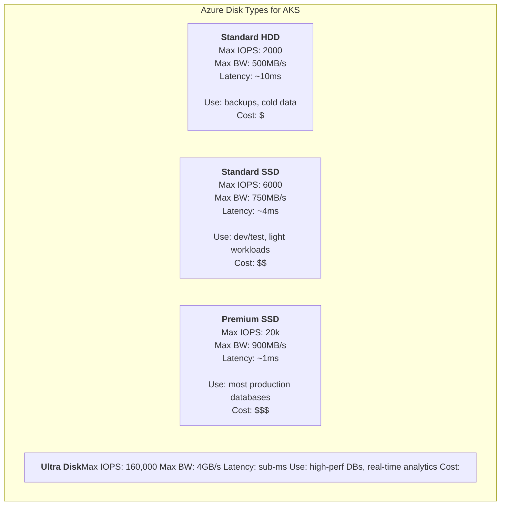
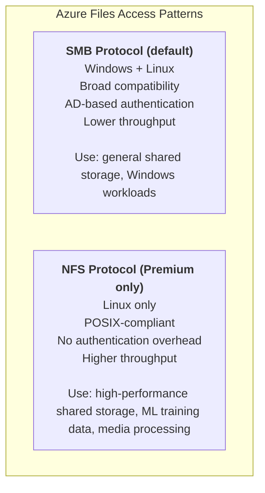
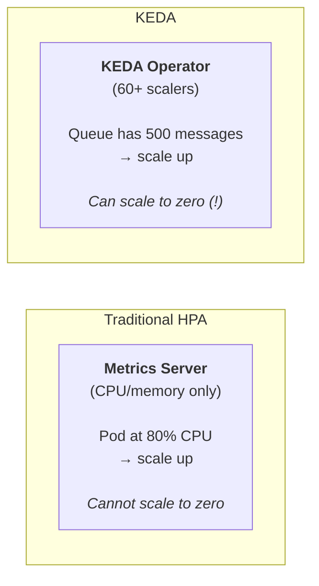
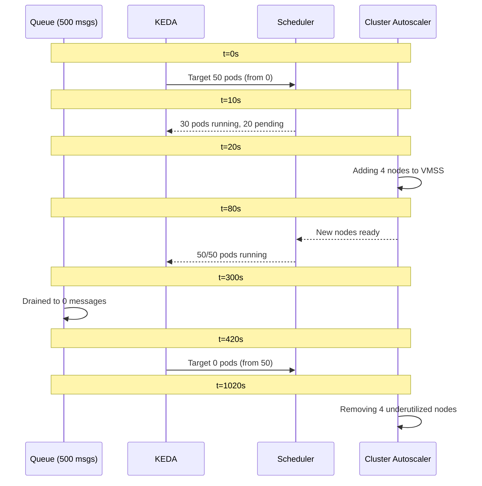

**Complexity**: [MEDIUM] | **Time to Complete**: 2.5h | **Prerequisites**: [Module 7.1: AKS Architecture & Node Management](../module-7.1-aks-architecture/)

## What You'll Be Able to Do

After completing this module, you will be able to:

- **Debug** event-driven autoscaling configurations using KEDA on AKS.
- **Implement** AKS observability with Azure Monitor Container Insights, Managed Prometheus, and Managed Grafana.
- **Compare** and evaluate Azure Disk and Azure Files CSI drivers with storage classes optimized for performance and cost on AKS.
- **Design** AKS cost optimization strategies using Spot node pools, cluster autoscaler tuning, and workload right-sizing.
- **Diagnose** performance bottlenecks related to I/O constraints in persistent volume claims.

---

## Why This Module Matters

In November 2023, an online retailer running on AKS experienced a catastrophic failure during their Black Friday sale. Their order processing service used Azure Premium SSD disks for a write-ahead log. When traffic spiked to 15x normal levels, the disk IOPS ceiling was hit and writes started queuing. The application had no metrics on disk I/O latency—their observability stack only monitored CPU and memory. Without visibility into the real bottleneck, the on-call engineer scaled the deployment from 6 to 30 replicas, which made things dramatically worse: 30 pods now competed for the same disk's IOPS budget. The queue grew, timeouts cascaded, and the entire order pipeline froze for 90 minutes during peak sales hours. Post-incident analysis estimated $4.2 million in lost revenue.

This story illustrates a pattern that repeats across organizations: storage, observability, and scaling are treated as afterthoughts during initial cluster setup, then become the root cause of the most painful production incidents. The three topics are deeply interconnected. Without proper observability, you cannot make informed scaling decisions. Without proper scaling, your storage layer gets overwhelmed. Without proper storage, your observability pipeline loses data during the exact moments you need it most. When systems fail, they rarely fail in isolation; a bottleneck in one subsystem masks the symptoms of another, leading responders down the wrong diagnostic path.

In this module, grounded in Kubernetes v1.35 best practices, you will learn how to choose between Azure Disks and Azure Files for different workload patterns, configure Container Insights with Managed Prometheus and Grafana for full-stack observability, and implement event-driven autoscaling with the KEDA add-on. The fix for the retailer was straightforward: migrate to Ultra Disks with provisioned IOPS, add disk I/O metrics to their Grafana dashboards, and implement KEDA-based scaling that responded to queue depth rather than CPU utilization. By the end of this module, you will have a cluster that monitors itself, scales based on real business signals, and stores data on the right tier for each workload.

---

## Azure Storage for Kubernetes: Disks vs Files

In modern Kubernetes environments (v1.35+), out-of-tree Container Storage Interface (CSI) drivers are the absolute standard for handling persistent storage. AKS integrates natively with Azure's storage fabric via two primary drivers: `disk.csi.azure.com` for block storage and `file.csi.azure.com` for file-level storage. Understanding when to use which is the foundation of stateful workload reliability.

### Azure Disks: Block Storage for Single-Pod Workloads

Azure Disks provide high-performance block-level storage that attaches directly to a virtual machine. Because it is block storage, it is natively bound to a single node at any given time. In Kubernetes terms, this maps to the `ReadWriteOnce` (RWO) access mode—meaning only one pod on one specific node can mount the disk for read-write access. If a pod crashes and is rescheduled to a new node, the CSI driver must detach the disk from the old node and attach it to the new one.



When defining a StorageClass for Azure Disks, you map the `skuName` to the tier you need. 

```yaml
# StorageClass for Premium SSD v2 with provisioned IOPS
apiVersion: storage.k8s.io/v1
kind: StorageClass
metadata:
  name: premium-ssd-v2
provisioner: disk.csi.azure.com
parameters:
  skuName: PremiumV2_LRS
  DiskIOPSReadWrite: "5000"
  DiskMBpsReadWrite: "200"
  cachingMode: None
reclaimPolicy: Retain
volumeBindingMode: WaitForFirstConsumer
allowVolumeExpansion: true
```

And then you can safely request the volume using a PersistentVolumeClaim (PVC):

```yaml
# PVC using the StorageClass
apiVersion: v1
kind: PersistentVolumeClaim
metadata:
  name: postgres-data
  namespace: database
spec:
  accessModes:
    - ReadWriteOnce
  storageClassName: premium-ssd-v2
  resources:
    requests:
      storage: 256Gi
```

The `volumeBindingMode: WaitForFirstConsumer` setting is critical for AKS clusters deployed across multiple availability zones. Because a managed disk is a physical resource located in a specific data center, it cannot cross availability zones. If the volume binding mode was set to `Immediate`, the control plane might create the disk in Zone 1. If the Kubernetes scheduler later places the pod on a node in Zone 2, the pod will be permanently stuck in `Pending` state because the disk cannot be attached. `WaitForFirstConsumer` delays the disk provisioning API call until the scheduler has chosen a node, ensuring the disk is created in the matching zone.

### Ultra Disks: When Premium SSD Is Not Enough

For standard Premium SSDs, your IOPS and throughput caps are rigidly tied to the size of the disk you provision. If you need 10,000 IOPS, you must provision a massive disk, even if your database is only 50 GB. Ultra Disks and Premium SSD v2 solve this problem by decoupling storage capacity from performance metrics. You can provision a small disk while independently dialing the IOPS up to massive numbers, which is perfect for latency-sensitive databases.

```bash
# Enable Ultra Disk support on a node pool
az aks nodepool add \
  --resource-group rg-aks-prod \
  --cluster-name aks-prod-westeurope \
  --name dbpool \
  --node-count 3 \
  --node-vm-size Standard_D8s_v5 \
  --zones 1 2 3 \
  --enable-ultra-ssd \
  --mode User \
  --node-taints "workload=database:NoSchedule" \
  --labels workload=database
```

```yaml
# StorageClass for Ultra Disk
apiVersion: storage.k8s.io/v1
kind: StorageClass
metadata:
  name: ultra-disk
provisioner: disk.csi.azure.com
parameters:
  skuName: UltraSSD_LRS
  DiskIOPSReadWrite: "50000"
  DiskMBpsReadWrite: "1000"
  cachingMode: None
reclaimPolicy: Retain
volumeBindingMode: WaitForFirstConsumer
allowVolumeExpansion: true
```

### Azure Files: Shared Storage for Multi-Pod Access

> **Pause and predict**: If you have a legacy CMS that writes user uploads to a local filesystem and you want to scale it to 3 replicas across different nodes, which Azure storage solution must you use and why?

Azure Files provides fully managed file shares in the cloud that are accessible via industry-standard SMB or NFS protocols. Because this is file-level storage, it maps to the `ReadWriteMany` (RWX) access mode in Kubernetes. This means multiple pods across entirely different nodes can mount the exact same volume concurrently. 

This is an absolute necessity for workloads like legacy CMS platforms, machine learning training jobs where many GPUs need to read the same dataset, or shared configuration directories.



When performance matters for Linux-based workloads, you should usually prefer NFS over SMB to reduce the authentication and protocol overhead often associated with Windows file sharing.

```yaml
# StorageClass for Azure Files NFS (Premium tier)
apiVersion: storage.k8s.io/v1
kind: StorageClass
metadata:
  name: azure-files-nfs-premium
provisioner: file.csi.azure.com
parameters:
  protocol: nfs
  skuName: Premium_LRS
mountOptions:
  - nconnect=4
  - noresvport
reclaimPolicy: Retain
volumeBindingMode: Immediate
allowVolumeExpansion: true
```

```yaml
# PVC for shared ML training data
apiVersion: v1
kind: PersistentVolumeClaim
metadata:
  name: training-data
  namespace: ml-pipeline
spec:
  accessModes:
    - ReadWriteMany
  storageClassName: azure-files-nfs-premium
  resources:
    requests:
      storage: 1Ti
```

### Shared Disks for High Availability

In extremely specific edge cases, you may need multiple pods to write to the same block storage device concurrently. Azure Shared Disks allow a single Premium SSD or Ultra Disk to be attached to multiple nodes simultaneously. This is designed for cluster-aware applications, like SQL Server Failover Cluster Instances, that implement their own SCSI persistent reservation commands to coordinate writes.

```yaml
# StorageClass for shared disks
apiVersion: storage.k8s.io/v1
kind: StorageClass
metadata:
  name: shared-premium-disk
provisioner: disk.csi.azure.com
parameters:
  skuName: Premium_LRS
  maxShares: "3"
  cachingMode: None
reclaimPolicy: Retain
volumeBindingMode: WaitForFirstConsumer
```

**Warning**: Shared Disks do not natively provide a managed filesystem. The application itself must coordinate concurrent block-level access. If you merely mount a shared disk using `ext4` or `xfs` from multiple Linux nodes, you risk data corruption because the kernel's in-memory caching is not coordinated across nodes. 

### The Storage Decision Matrix

| Criteria | Azure Disk (Premium) | Azure Disk (Ultra) | Azure Files (SMB) | Azure Files (NFS) |
| :--- | :--- | :--- | :--- | :--- |
| **Access mode** | RWO | RWO | RWX | RWX |
| **Max IOPS** | 20,000 | 160,000 | 10,000 | 100,000 |
| **Cross-zone** | No (zone-locked) | No (zone-locked) | Yes (ZRS available) | Yes (ZRS available) |
| **Latency** | ~1ms | Sub-ms | ~5-10ms | ~2-5ms |
| **Windows support** | Yes | Yes | Yes | No |
| **Best for** | Databases, stateful apps | High-IOPS databases | Shared config, CMS | ML data, media |
| **Cost** | $$$ | $$$$ | $$ | $$$ |

---

## Container Insights and Azure Monitor

Observability is the nervous system of your cluster. Container Insights is Azure's first-party observability solution for AKS. It automatically deploys the Azure Monitor Agent (AMA) as a DaemonSet across your cluster to aggregate node metrics, pod metrics, container logs, and Kubernetes events into a central Log Analytics workspace. 

### Enabling Container Insights

You can enable this integration at cluster creation or dynamically attach it to an existing environment:

```bash
# Create a Log Analytics workspace
az monitor log-analytics workspace create \
  --resource-group rg-aks-prod \
  --workspace-name law-aks-prod \
  --location westeurope \
  --retention-in-days 90

WORKSPACE_ID=$(az monitor log-analytics workspace show \
  -g rg-aks-prod -n law-aks-prod --query id -o tsv)

# Enable Container Insights
az aks enable-addons \
  --resource-group rg-aks-prod \
  --name aks-prod-westeurope \
  --addons monitoring \
  --workspace-resource-id "$WORKSPACE_ID"

# Verify the monitoring agent is running
k get pods -n kube-system -l component=ama-logs
```

### What Container Insights Collects

Once the AMA is deployed, it begins scraping extensive data streams shortly afterward:
- **Node metrics**: Deep hardware utilization metrics like disk I/O, network throughput, and CPU load.
- **Pod metrics**: Actual resource consumption contrasted against Kubernetes requested boundaries.
- **Container logs**: Every line of `stdout` and `stderr` emitted by the container runtime.
- **Inventory data**: A live map of running pods, healthy nodes, and active services.

```bash
# Query container logs in Log Analytics
az monitor log-analytics query \
  --workspace "$WORKSPACE_ID" \
  --analytics-query "ContainerLogV2 | where ContainerName == 'payment-service' | where LogMessage contains 'error' | top 20 by TimeGenerated desc" \
  --timespan "PT6H"
```

### Cost Control for Container Insights

> **Pause and predict**: You just deployed Container Insights on a busy cluster and your Log Analytics bill spiked by $500 in one day. What is the most likely culprit, and what configuration component will fix it?

Container Insights can become a massive billing liability if left in its default configuration. By default, it captures standard output from all containers, including very verbose ones. If your ingress controllers or core system pods are extremely verbose, Log Analytics will ingest gigabytes of data every hour. To manage this, you must apply a custom ConfigMap to instruct the agent to drop high-noise logs.

```yaml
# Save as container-insights-config.yaml
apiVersion: v1
kind: ConfigMap
metadata:
  name: container-azm-ms-agentconfig
  namespace: kube-system
data:
  schema-version: v1
  config-version: v1
  log-data-collection-settings: |
    [log_collection_settings]
      [log_collection_settings.stdout]
        enabled = true
        exclude_namespaces = ["kube-system", "gatekeeper-system"]
      [log_collection_settings.stderr]
        enabled = true
        exclude_namespaces = ["kube-system"]
      [log_collection_settings.env_var]
        enabled = false
  prometheus-data-collection-settings: |
    [prometheus_data_collection_settings.cluster]
      interval = "60s"
      monitor_kubernetes_pods = true
```

```bash
k apply -f container-insights-config.yaml
```

---

## Managed Prometheus and Grafana: Cloud-Native Monitoring

Container Insights is fantastic for log aggregation and infrastructural health, but it struggles with application-specific custom metrics. 

> **Stop and think**: If you rely strictly on Container Insights for everything, what happens when your application needs to expose a custom business metric like "active_user_sessions"? Why is Managed Prometheus a better fit for this?

Prometheus operates on a "pull" model, actively scraping metrics endpoints natively exposed by your microservices. Azure provides a fully managed implementation of Prometheus, completely eliminating the operational burden of managing persistent volumes, remote write configurations, and Thanos/Cortex scaling for long-term retention. 

### Setting Up Managed Prometheus

```bash
# Create an Azure Monitor workspace (for Prometheus)
az monitor account create \
  --resource-group rg-aks-prod \
  --name amw-aks-prod \
  --location westeurope

MONITOR_WORKSPACE_ID=$(az monitor account show \
  -g rg-aks-prod -n amw-aks-prod --query id -o tsv)

# Enable Managed Prometheus on the cluster
az aks update \
  --resource-group rg-aks-prod \
  --name aks-prod-westeurope \
  --enable-azure-monitor-metrics \
  --azure-monitor-workspace-resource-id "$MONITOR_WORKSPACE_ID"

# Verify the Prometheus agent is running
k get pods -n kube-system -l rsName=ama-metrics
```

### Setting Up Managed Grafana

Grafana is the industry-standard visualization layer for Prometheus. Azure Managed Grafana natively integrates with Azure AD for robust RBAC and automatically discovers your Managed Prometheus workspaces.

```bash
# Create a Managed Grafana instance
az grafana create \
  --resource-group rg-aks-prod \
  --name grafana-aks-prod \
  --location westeurope

# Link Grafana to the Azure Monitor workspace
GRAFANA_ID=$(az grafana show -g rg-aks-prod -n grafana-aks-prod --query id -o tsv)

az monitor account update \
  --resource-group rg-aks-prod \
  --name amw-aks-prod \
  --linked-grafana "$GRAFANA_ID"

# Get the Grafana URL
az grafana show -g rg-aks-prod -n grafana-aks-prod --query "properties.endpoint" -o tsv
```

### Custom Prometheus Metrics from Your Application

Once your ecosystem is established, getting your custom metrics ingested is as simple as adding standard Prometheus annotations to your Pod specifications. The Managed Prometheus agent will automatically discover these endpoints and begin scraping.

```yaml
apiVersion: apps/v1
kind: Deployment
metadata:
  name: payment-service
  namespace: payments
spec:
  replicas: 3
  selector:
    matchLabels:
      app: payment-service
  template:
    metadata:
      labels:
        app: payment-service
      annotations:
        prometheus.io/scrape: "true"
        prometheus.io/port: "8080"
        prometheus.io/path: "/metrics"
    spec:
      containers:
        - name: payment
          image: myregistry.azurecr.io/payment-service:v2.1.0
          ports:
            - containerPort: 8080
              name: http
          resources:
            requests:
              cpu: "250m"
              memory: "256Mi"
            limits:
              cpu: "1"
              memory: "512Mi"
```

### Creating Alert Rules

Dashboards are meaningless if nobody is looking at them during an incident. Alerting ensures that operational boundaries trigger actionable notifications.

```bash
# Create a Prometheus alert rule for high error rate
az monitor metrics alert create \
  --resource-group rg-aks-prod \
  --name "payment-high-error-rate" \
  --scopes "$MONITOR_WORKSPACE_ID" \
  --condition "avg http_requests_total{status=~'5..',service='payment-service'} by (service) / avg http_requests_total{service='payment-service'} by (service) > 0.05" \
  --description "Payment service error rate exceeds 5%" \
  --severity 1 \
  --window-size 5m \
  --evaluation-frequency 1m
```

You can also codify complex Alertmanager-style configurations using native Kubernetes custom resources.

```yaml
# PrometheusRuleGroup for custom alerts
apiVersion: alerts.monitor.azure.com/v1
kind: PrometheusRuleGroup
metadata:
  name: payment-alerts
spec:
  rules:
    - alert: PaymentServiceHighLatency
      expr: histogram_quantile(0.99, rate(http_request_duration_seconds_bucket{service="payment-service"}[5m])) > 2
      for: 3m
      labels:
        severity: warning
      annotations:
        summary: "Payment service p99 latency exceeds 2 seconds"
    - alert: PaymentServiceDown
      expr: up{job="payment-service"} == 0
      for: 1m
      labels:
        severity: critical
      annotations:
        summary: "Payment service is down"
```

---

## KEDA: Event-Driven Autoscaling

The standard Kubernetes Horizontal Pod Autoscaler (HPA) works brilliantly for web servers reacting to CPU load. However, it fails catastrophically for asynchronous or event-driven workers. If your messaging queue instantly receives a burst of 10,000 tasks, your consumer pods might process them very efficiently, keeping CPU usage extremely low. Because the CPU usage may stay relatively flat, the standard HPA may fail to scale out in time, resulting in a monumental processing backlog. 

KEDA (Kubernetes Event-Driven Autoscaling) intercepts the metrics pipeline. It provides over 60 custom scalers that allow your deployments to scale dynamically based on external business metrics rather than lagging infrastructure indicators.



### Enabling the KEDA Add-on

```bash
# Enable KEDA as an AKS add-on
az aks update \
  --resource-group rg-aks-prod \
  --name aks-prod-westeurope \
  --enable-keda

# Verify KEDA pods are running
k get pods -n kube-system -l app.kubernetes.io/name=keda-operator
```

### Scaling Based on Azure Service Bus Queue Depth

The most powerful pattern for KEDA on Azure is connecting it to Azure Service Bus. Instead of waiting for CPU to spike, KEDA constantly queries the queue API to determine exactly how many messages are waiting, then preemptively scales the deployment out. 

```yaml
# ScaledObject: scale order-processor based on Service Bus queue depth
apiVersion: keda.sh/v1alpha1
kind: ScaledObject
metadata:
  name: order-processor-scaler
  namespace: orders
spec:
  scaleTargetRef:
    name: order-processor
  pollingInterval: 15
  cooldownPeriod: 120
  minReplicaCount: 0      # Scale to zero when queue is empty!
  maxReplicaCount: 50
  triggers:
    - type: azure-servicebus
      metadata:
        queueName: incoming-orders
        namespace: sb-prod-westeurope
        messageCount: "10"  # 1 pod per 10 messages
      authenticationRef:
        name: servicebus-auth
```

In this example, KEDA ensures there is 1 pod running for every 10 messages. A massive queue will quickly trigger a massive scale-out event. Even better, when the queue is entirely drained, KEDA will scale the deployment to 0, completely removing compute costs during idle periods. 

### KEDA Authentication with Workload Identity

For KEDA to interrogate the Service Bus API, it needs secure authorization. Avoid storing connection strings in secrets; instead, utilize Workload Identity natively.

```yaml
# TriggerAuthentication using Workload Identity
apiVersion: keda.sh/v1alpha1
kind: TriggerAuthentication
metadata:
  name: servicebus-auth
  namespace: orders
spec:
  podIdentity:
    provider: azure-workload
    identityId: "<CLIENT_ID_OF_MANAGED_IDENTITY>"
```

### Scaling Based on Prometheus Metrics

If you want to orchestrate scaling based on a specialized metric inside your codebase (e.g., requests per second processed, or active user sessions), KEDA can natively scale based on any query executed against your Prometheus server.

```yaml
# Scale based on a custom Prometheus metric
apiVersion: keda.sh/v1alpha1
kind: ScaledObject
metadata:
  name: api-gateway-scaler
  namespace: gateway
spec:
  scaleTargetRef:
    name: api-gateway
  pollingInterval: 30
  cooldownPeriod: 180
  minReplicaCount: 2
  maxReplicaCount: 30
  triggers:
    - type: prometheus
      metadata:
        serverAddress: "http://prometheus-server.monitoring:9090"
        metricName: http_requests_per_second
        query: "sum(rate(http_requests_total{service='api-gateway'}[2m]))"
        threshold: "100"  # 1 pod per 100 requests/sec
```

### KEDA Scaling Strategies Compared

| Scaler | Trigger Source | Scale to Zero | Typical Use Case |
| :--- | :--- | :--- | :--- |
| **azure-servicebus** | Queue message count | Yes | Order processing, async tasks |
| **azure-eventhub** | Consumer group lag | Yes | Event streaming, IoT data |
| **azure-queue** | Storage queue length | Yes | Background jobs, batch processing |
| **prometheus** | Any Prometheus metric | No (min 1) | RPS-based scaling, custom metrics |
| **cron** | Time schedule | Yes | Predictable traffic patterns |
| **azure-monitor** | Azure Monitor metrics | Yes | Infrastructure-based triggers |

### Combining KEDA with Cluster Autoscaler

While KEDA rapidly orchestrates the scaling of Pods, the underlying hardware must expand to accommodate them. KEDA and the Azure Cluster Autoscaler work in perfect tandem to resolve this layer constraint. 



---

## Cost Optimization: Spot Instances and Right-Sizing

The flexibility of Kubernetes inevitably leads to spiraling cloud compute costs if discipline is not applied. While auto-scaling ensures you only pay for what you actively require, your node provisioning strategy ensures you pay the absolute lowest price for those compute resources.

### Spot Node Pools

Azure Spot Virtual Machines offer the ability to consume unutilized Azure data center capacity at discounts approaching 90%. However, Azure can evict these machines with only a 30-second warning (`SIGTERM`) if a full-price customer demands the compute space.

```bash
# Add a Spot node pool to an existing cluster
az aks nodepool add \
  --resource-group rg-aks-prod \
  --cluster-name aks-prod-westeurope \
  --name spotpool \
  --priority Spot \
  --eviction-policy Delete \
  --spot-max-price -1 \
  --enable-cluster-autoscaler \
  --min-count 1 \
  --max-count 10 \
  --node-vm-size Standard_D4s_v5
```

Because of their volatile nature, Spot nodes are deeply integrated with Kubernetes taints and tolerations. AKS will automatically taint Spot nodes so that normal critical workloads are completely shielded from them. You must explicitly configure your deployment to tolerate the `spot` designation.

```yaml
# Pod configured to run on Spot nodes
apiVersion: apps/v1
kind: Deployment
metadata:
  name: batch-worker
spec:
  template:
    spec:
      tolerations:
      - key: "kubernetes.azure.com/scalesetpriority"
        operator: "Equal"
        value: "spot"
        effect: "NoSchedule"
      affinity:
        nodeAffinity:
          preferredDuringSchedulingIgnoredDuringExecution:
          - weight: 100
            preference:
              matchExpressions:
              - key: kubernetes.azure.com/scalesetpriority
                operator: In
                values:
                - spot
```

> **Stop and think**: If your entire web frontend is running on a Spot node pool and Azure experiences a sudden surge in demand for that VM size in your region, what happens to your application? How should you architect a production deployment to utilize Spot savings without risking downtime?

Avoid running primary database tiers or essential API gateways entirely on Spot hardware. The optimal approach is running your baseline required replicas on standard On-Demand instances, and using KEDA to burst onto Spot VMs specifically to process sudden traffic spikes. 

### Workload Right-Sizing

The Cluster Autoscaler looks strictly at the requested resources of your Pods, not their actual usage. If you deploy a Pod requesting 4 CPU cores but it only consumes 0.1 cores, the autoscaler will aggressively spin up new expensive nodes to satisfy the massive request, leaving you paying for massive amounts of unused "slack" capacity.

To solve this, you must apply workload right-sizing logic. Establish robust memory requests equal to your limits to protect against Out-of-Memory (OOM) killings, while keeping your CPU requests honest to your baseline average usage.

```yaml
# A well-sized container specification
resources:
  requests:
    memory: "256Mi"
    cpu: "100m"     # 1/10th of a core for baseline
  limits:
    memory: "256Mi" # Equal to request to prevent OOM
    cpu: "500m"     # Allowed to burst up to half a core
```

---

## Did You Know?

1. **Azure Disk IOPS scale with disk size on Premium SSD, but Ultra Disk decouples them.** A 256 GB Premium SSD v1 gets 1,100 IOPS. To get 5,000 IOPS you need a 1 TB disk, even if you only store 50 GB of data. Ultra Disk lets you provision 50,000 IOPS on a 64 GB disk. This decoupling can save thousands of dollars per month for I/O-intensive databases that do not need large storage volumes.
2. **KEDA can scale to zero replicas, which the standard HPA cannot do.** The HPA requires a minimum of 1 replica. KEDA's ability to scale to zero is transformative for cost optimization on batch processing workloads. A cluster with 200 different queue consumers that are each idle 95% of the time can run zero pods for most of those consumers, only spinning them up when messages arrive. Combined with the cluster autoscaler, this means you can run a multi-tenant batch processing platform where idle tenants cost nothing.
3. **Azure Managed Prometheus stores metrics for 18 months at no additional retention cost.** Self-hosted Prometheus typically requires careful capacity planning for long-term storage (using Thanos or Cortex). Azure Monitor workspace handles this natively, making it possible to query 18 months of historical metrics for capacity planning and trend analysis without managing any storage infrastructure.
4. **The `nconnect` mount option for Azure Files NFS multiplies throughput by opening multiple TCP connections.** A single NFS connection typically tops out at 300-400 MB/s due to TCP window limitations. Setting `nconnect=4` in your StorageClass mount options opens 4 parallel TCP connections per mount, effectively quadrupling throughput. This is essential for ML training workloads that read large datasets from shared storage.

---

## Common Mistakes

| Mistake | Why It Happens | How to Fix It |
| :--- | :--- | :--- |
| Using Premium SSD when IOPS requirement exceeds the disk-size-to-IOPS ratio | Not understanding that Premium SSD IOPS are tied to disk size | Calculate required IOPS first. If you need high IOPS on small storage, use Ultra Disk or Premium SSD v2 |
| Mounting Azure Disks without `WaitForFirstConsumer` binding mode | Copying StorageClass examples that use `Immediate` binding | Always use `volumeBindingMode: WaitForFirstConsumer` on zone-aware clusters to prevent zone mismatches |
| Sending all container logs to Log Analytics without filtering | Default Container Insights config collects everything | Use the ConfigMap to exclude noisy namespaces (kube-system, monitoring) and disable env_var collection |
| Setting KEDA minReplicaCount to 0 for latency-sensitive services | Attracted by cost savings of scale-to-zero | Only scale to zero for batch/queue consumers. Latency-sensitive services need minReplicaCount >= 1 to avoid cold start delays |
| Not configuring PodDisruptionBudgets for KEDA-scaled workloads | PDBs seem unnecessary for "elastic" workloads | KEDA scales pods, but node upgrades drain them. Without PDBs, all replicas can be evicted simultaneously during cluster upgrades |
| Mounting Azure Files SMB when NFS would perform better | SMB is the default and works on both Windows and Linux | For Linux-only workloads needing high throughput, prefer NFS with the `nconnect` mount option in most cases |
| Creating Grafana dashboards without alert rules | "We will check the dashboards when something is wrong" | If nobody is watching the dashboard when the incident starts, it has zero value. Pair dashboards with alert rules for production-critical signals |
| Ignoring disk I/O metrics in observability setup | CPU and memory are the default metrics; disk I/O requires explicit configuration | Add disk IOPS, throughput, and latency to your monitoring ConfigMap and Grafana dashboards |

---

## Quiz

<details>
<summary>1. Scenario: You deployed a StatefulSet using a Premium SSD StorageClass with `Immediate` binding mode across a 3-zone AKS cluster. The first pod comes up fine, but the second pod is permanently stuck in `Pending` state. What architectural constraint caused this, and how does `WaitForFirstConsumer` solve it?</summary>

Azure Disks are zone-locked resources, meaning a disk created in Availability Zone 1 can only be attached to a virtual machine physically located in Zone 1. When you use `Immediate` binding mode, the Kubernetes control plane creates the disk immediately upon seeing the PersistentVolumeClaim, without knowing which node the scheduler will eventually choose for the pod. If the disk happens to be created in Zone 1, but the pod is scheduled onto a node in Zone 2, the pod cannot mount the volume and remains stuck in `Pending`. Using `WaitForFirstConsumer` solves this by delaying the disk creation API call until the exact moment the scheduler places the pod on a specific node, ensuring the disk is provisioned in the correct matching zone.
</details>

<details>
<summary>2. Scenario: Your DBA team needs to migrate a high-transaction PostgreSQL database to AKS. The database is only 50 GB in size, but requires a guaranteed 15,000 IOPS to handle peak loads. Why would provisioning a 50 GB Premium SSD fail to meet this requirement, and what storage tier is mathematically required instead?</summary>

Standard Premium SSDs tie their IOPS and throughput performance directly to the provisioned capacity of the disk. A 64 GB Premium SSD (P6) provides only 240 IOPS, meaning you would have to provision and pay for a 1 TB disk just to achieve the 5,000 IOPS tier, and even larger to hit 15,000. Ultra Disks and Premium SSD v2 solve this by decoupling capacity from performance, allowing you to independently dial in exact IOPS and throughput metrics. By using Ultra Disk, you can provision a 50 GB disk but explicitly set the `DiskIOPSReadWrite` parameter to 15,000, paying only for the performance you need without wasting money on empty terabytes of storage.
</details>

<details>
<summary>3. Scenario: A machine learning pipeline needs to train a model using 5 TB of image data shared across 20 GPU pods simultaneously. The data scientists initially used Azure Files SMB but are complaining that the data loading phase takes hours due to network bottlenecking. Which Azure Files protocol should they switch to, and what specific mount option will drastically reduce their load times?</summary>

The data scientists should switch their StorageClass to use Azure Files with the NFS protocol, which avoids the authentication overhead and Windows-centric design of SMB. NFS on Azure Files Premium provides significantly higher throughput for Linux-based workloads like machine learning containers. Furthermore, they must add the `nconnect=4` (or up to 16) setting in their StorageClass mount options. By default, an NFS mount uses a single TCP connection that tops out at around 300-400 MB/s due to TCP window limits; `nconnect` opens multiple parallel TCP connections to the storage account, multiplying the throughput and drastically reducing data load times.
</details>

<details>
<summary>4. Scenario: An e-commerce backend uses standard HPA (CPU/Memory) to scale its order processing workers. During a flash sale, 10,000 orders hit the Azure Service Bus queue in seconds. The workers process them so efficiently that their CPU stays below the HPA threshold, so the HPA does not scale them up fast enough, resulting in a 2-hour processing backlog. How would KEDA fundamentally change how this scaling decision is made?</summary>

The standard HPA is entirely blind to external business metrics like queue depth, relying solely on lagging infrastructure metrics like CPU utilization which may not correlate with the actual backlog. KEDA replaces this paradigm by connecting directly to the Azure Service Bus API and reading the exact number of pending messages waiting to be processed. Instead of waiting for CPU to spike, KEDA can be configured to instantly provision one worker pod for every 50 messages in the queue. This event-driven approach ensures the deployment scales out preemptively the moment the queue begins to fill, processing the 10,000 orders in minutes rather than hours, and then safely scaling back down to zero when the queue is empty.
</details>

<details>
<summary>5. Scenario: You configure KEDA to scale a consumer deployment to 100 replicas based on queue depth, but your AKS cluster currently only has 3 nodes which can fit 30 pods total. Walk through the exact sequence of events that occurs between KEDA and the Cluster Autoscaler when 1,000 messages suddenly arrive in the queue.</summary>

When the messages arrive, the KEDA operator detects the queue depth and quickly updates the deployment's target replica count to 100. The Kubernetes scheduler successfully places 30 pods on the existing 3 nodes, but the remaining 70 pods transition into a `Pending` state due to insufficient CPU or memory resources on the cluster. The Cluster Autoscaler constantly watches for `Pending` pods; upon detecting them, it calculates how many new nodes are required and makes an API call to Azure to expand the Virtual Machine Scale Set. Once the new VMs boot up and join the AKS cluster as Ready nodes, the scheduler automatically places the remaining 70 pods onto them, allowing all 100 consumers to process the queue in parallel.
</details>

<details>
<summary>6. Scenario: A junior engineer enables Container Insights on a production cluster with default settings to troubleshoot a specific microservice. A week later, the Azure Log Analytics bill arrives at $2,000. Why did this happen by default, and what specific configuration changes in the `container-azm-ms-agentconfig` ConfigMap are required to stop the bleeding while still monitoring the application?</summary>

By default, the Azure Monitor Agent deployed by Container Insights captures stdout and stderr from containers across the cluster, including incredibly noisy system components. This massive ingestion volume is billed per gigabyte by Log Analytics, leading to the rapid cost spike. To fix this, the engineer must deploy a custom ConfigMap named `container-azm-ms-agentconfig` in the `kube-system` namespace. In this configuration, they need to explicitly add `kube-system` and other high-volume namespaces to the `exclude_namespaces` array for stdout and stderr, and disable environment variable collection (`env_var.enabled = false`), ensuring only relevant application logs are ingested and billed.
</details>

<details>
<summary>7. Scenario: To save money, a team creates a single 1 TB Premium SSD with `maxShares: 3` and mounts it to three different web server pods using the default `ext4` filesystem so they can share static assets. Within an hour, the filesystem is completely corrupted and the data is lost. What architectural rule of Shared Disks did they violate, and what is required to share block storage safely?</summary>

The team misunderstood the difference between block storage and file storage; Azure Shared Disks provide concurrent block-level access to the underlying storage device, not a managed filesystem. Standard Linux filesystems like `ext4` or `xfs` cache data in memory and are completely unaware that other operating systems might be modifying the same underlying disk blocks simultaneously, inevitably leading to catastrophic data corruption. To share a disk safely, the pods must either utilize a specialized cluster-aware filesystem (like GFS2) that coordinates locks across nodes, or the application itself must be explicitly designed to manage concurrent block-level arbitration, such as SQL Server Failover Cluster Instances. For simple shared static assets, the team should have used Azure Files (NFS or SMB) instead.
</details>

---

## Hands-On Exercise: KEDA + Azure Service Bus Queue Scaling + Monitor Alerts

In this exercise, you will set up event-driven autoscaling where a consumer deployment scales from zero to many replicas based on Azure Service Bus queue depth, with monitoring alerts that fire when the queue exceeds a threshold. You will also create a zone-aware StorageClass to properly deploy stateful workloads.

### Prerequisites

- AKS cluster with KEDA add-on enabled
- Azure CLI authenticated
- Workload Identity configured (from Module 7.3)

### Task 1: Create a Zone-Aware StorageClass and PVC

Before setting up scaling, provision a Premium SSD v2 StorageClass that correctly handles availability zones, and create a PersistentVolumeClaim.

<details>
<summary>Solution</summary>

```bash
# Create a zone-aware StorageClass
k apply -f - <<EOF
apiVersion: storage.k8s.io/v1
kind: StorageClass
metadata:
  name: premium-ssd-v2-zone-aware
provisioner: disk.csi.azure.com
parameters:
  skuName: PremiumV2_LRS
  DiskIOPSReadWrite: "3000"
  DiskMBpsReadWrite: "125"
  cachingMode: None
reclaimPolicy: Delete
volumeBindingMode: WaitForFirstConsumer
allowVolumeExpansion: true
EOF

# Create a PersistentVolumeClaim
k apply -f - <<EOF
apiVersion: v1
kind: PersistentVolumeClaim
metadata:
  name: order-db-pvc
  namespace: default
spec:
  accessModes:
    - ReadWriteOnce
  storageClassName: premium-ssd-v2-zone-aware
  resources:
    requests:
      storage: 100Gi
EOF

# Verify the PVC stays in Pending state (because WaitForFirstConsumer delays provisioning until a Pod uses it)
k get pvc order-db-pvc
```

</details>

### Task 2: Create the Azure Service Bus Namespace and Queue

<details>
<summary>Solution</summary>

```bash
# Create the Service Bus namespace
az servicebus namespace create \
  --resource-group rg-aks-prod \
  --name sb-aks-lab-$(openssl rand -hex 4) \
  --location westeurope \
  --sku Standard

SB_NAMESPACE=$(az servicebus namespace list -g rg-aks-prod \
  --query "[0].name" -o tsv)

# Create the queue
az servicebus queue create \
  --resource-group rg-aks-prod \
  --namespace-name "$SB_NAMESPACE" \
  --name incoming-orders \
  --max-size 1024 \
  --default-message-time-to-live "PT1H"

# Get the connection string for the producer script
SB_CONNECTION=$(az servicebus namespace authorization-rule keys list \
  --resource-group rg-aks-prod \
  --namespace-name "$SB_NAMESPACE" \
  --name RootManageSharedAccessKey \
  --query primaryConnectionString -o tsv)

echo "Service Bus Namespace: $SB_NAMESPACE"
```

</details>

### Task 3: Set Up Workload Identity for KEDA and the Consumer

Create a managed identity that KEDA and the consumer pods will use to read from the queue.

<details>
<summary>Solution</summary>

```bash
# Get the OIDC issuer
OIDC_ISSUER=$(az aks show -g rg-aks-prod -n aks-prod-westeurope \
  --query "oidcIssuerProfile.issuerUrl" -o tsv)

# Create the managed identity
az identity create \
  --resource-group rg-aks-prod \
  --name id-order-processor \
  --location westeurope

SB_CLIENT_ID=$(az identity show -g rg-aks-prod -n id-order-processor \
  --query clientId -o tsv)
SB_PRINCIPAL_ID=$(az identity show -g rg-aks-prod -n id-order-processor \
  --query principalId -o tsv)

# Grant Service Bus Data Receiver role
SB_ID=$(az servicebus namespace show -g rg-aks-prod -n "$SB_NAMESPACE" --query id -o tsv)

az role assignment create \
  --assignee-object-id "$SB_PRINCIPAL_ID" \
  --assignee-principal-type ServicePrincipal \
  --role "Azure Service Bus Data Receiver" \
  --scope "$SB_ID"

# Create federated credential
az identity federated-credential create \
  --name fed-order-processor \
  --identity-name id-order-processor \
  --resource-group rg-aks-prod \
  --issuer "$OIDC_ISSUER" \
  --subject "system:serviceaccount:orders:order-processor-sa" \
  --audiences "api://AzureADTokenExchange"

# Create the namespace and service account
k create namespace orders

k apply -f - <<EOF
apiVersion: v1
kind: ServiceAccount
metadata:
  name: order-processor-sa
  namespace: orders
  annotations:
    azure.workload.identity/client-id: "$SB_CLIENT_ID"
  labels:
    azure.workload.identity/use: "true"
EOF
```

</details>

### Task 4: Deploy the Consumer Application and KEDA ScaledObject

Deploy the consumer and configure KEDA to scale it based on queue depth.

<details>
<summary>Solution</summary>

```bash
# Deploy the order processor (a simple consumer simulator)
k apply -f - <<'EOF'
apiVersion: apps/v1
kind: Deployment
metadata:
  name: order-processor
  namespace: orders
spec:
  replicas: 0
  selector:
    matchLabels:
      app: order-processor
  template:
    metadata:
      labels:
        app: order-processor
    spec:
      serviceAccountName: order-processor-sa
      containers:
        - name: processor
          image: busybox:1.36
          command:
            - /bin/sh
            - -c
            - |
              echo "Order processor started. Processing messages..."
              while true; do
                echo "$(date): Processing order batch..."
                sleep 5
              done
          resources:
            requests:
              cpu: "100m"
              memory: "128Mi"
            limits:
              cpu: "250m"
              memory: "256Mi"
EOF

# Create the KEDA TriggerAuthentication
TENANT_ID=$(az account show --query tenantId -o tsv)

k apply -f - <<EOF
apiVersion: keda.sh/v1alpha1
kind: TriggerAuthentication
metadata:
  name: servicebus-workload-auth
  namespace: orders
spec:
  podIdentity:
    provider: azure-workload
    identityId: "$SB_CLIENT_ID"
EOF

# Create the ScaledObject
k apply -f - <<EOF
apiVersion: keda.sh/v1alpha1
kind: ScaledObject
metadata:
  name: order-processor-scaler
  namespace: orders
spec:
  scaleTargetRef:
    name: order-processor
  pollingInterval: 10
  cooldownPeriod: 60
  minReplicaCount: 0
  maxReplicaCount: 20
  triggers:
    - type: azure-servicebus
      metadata:
        queueName: incoming-orders
        namespace: $SB_NAMESPACE
        messageCount: "5"
      authenticationRef:
        name: servicebus-workload-auth
EOF

# Verify KEDA is watching the queue
k get scaledobject -n orders
k get hpa -n orders
```

</details>

### Task 5: Send Messages and Observe Scaling

Flood the queue with messages and watch KEDA scale the consumer.

<details>
<summary>Solution</summary>

```bash
# Verify current state: 0 replicas
k get deployment order-processor -n orders

# Send 100 messages to the queue
for i in $(seq 1 100); do
  az servicebus queue message send \
    --resource-group rg-aks-prod \
    --namespace-name "$SB_NAMESPACE" \
    --queue-name incoming-orders \
    --body "{\"orderId\": \"ORD-$i\", \"amount\": $((RANDOM % 1000 + 1))}"
done

echo "Sent 100 messages. Watching KEDA scale..."

# Watch the scaling happen (KEDA polls every 10 seconds)
# Run this in a loop or use watch
k get deployment order-processor -n orders -w

# After a few moments, you should see replicas increasing:
# order-processor   0/20   0  0  0s
# order-processor   20/20  20 0  15s
# (KEDA targets 1 pod per 5 messages: 100/5 = 20 pods)

# Check the HPA that KEDA created
k describe hpa -n orders

# Check queue depth decreasing (in a real app, consumers would drain the queue)
az servicebus queue show \
  --resource-group rg-aks-prod \
  --namespace-name "$SB_NAMESPACE" \
  --name incoming-orders \
  --query "countDetails.activeMessageCount" -o tsv
```

</details>

### Task 6: Set Up Azure Monitor Alert for Queue Backlog

Create an alert that fires when the queue depth exceeds a threshold, indicating consumers cannot keep up.

<details>
<summary>Solution</summary>

```bash
# Create an action group for notifications
az monitor action-group create \
  --resource-group rg-aks-prod \
  --name ag-aks-oncall \
  --short-name aks-oncall \
  --email-receiver name="Platform Team" address="platform-oncall@contoso.com"

ACTION_GROUP_ID=$(az monitor action-group show \
  -g rg-aks-prod -n ag-aks-oncall --query id -o tsv)

# Create metric alert on Service Bus queue depth
az monitor metrics alert create \
  --resource-group rg-aks-prod \
  --name "high-order-queue-depth" \
  --scopes "$SB_ID" \
  --condition "avg ActiveMessages > 200" \
  --window-size 5m \
  --evaluation-frequency 1m \
  --severity 2 \
  --description "Order queue has more than 200 active messages for 5 minutes. Consumers may not be keeping up." \
  --action "$ACTION_GROUP_ID"

# Verify the alert rule
az monitor metrics alert show \
  -g rg-aks-prod -n "high-order-queue-depth" -o table

# Create a second alert for KEDA scaling failures
# (when KEDA hits maxReplicaCount but queue is still growing)
az monitor metrics alert create \
  --resource-group rg-aks-prod \
  --name "order-queue-critical" \
  --scopes "$SB_ID" \
  --condition "avg ActiveMessages > 1000" \
  --window-size 5m \
  --evaluation-frequency 1m \
  --severity 1 \
  --description "CRITICAL: Order queue exceeds 1000 messages. KEDA may have hit maxReplicaCount. Investigate immediately." \
  --action "$ACTION_GROUP_ID"
```

</details>

### Task 7: Verify Scale-to-Zero

Drain the queue and confirm KEDA scales the deployment back to zero.

<details>
<summary>Solution</summary>

```bash
# In a real scenario, consumers process messages. For the lab, purge the queue:
az servicebus queue message purge \
  --resource-group rg-aks-prod \
  --namespace-name "$SB_NAMESPACE" \
  --queue-name incoming-orders

# Watch the deployment scale down (takes cooldownPeriod seconds: 60s in our config)
echo "Waiting for KEDA cooldown (60 seconds)..."
k get deployment order-processor -n orders -w

# After ~60-90 seconds:
# order-processor   20/0   20  20  2m
# order-processor   0/0    0   0   3m

# Verify final state
k get pods -n orders
# Expected: No resources found in orders namespace

# Verify the ScaledObject status
k describe scaledobject order-processor-scaler -n orders | grep -A5 "Status:"

echo "Scale-to-zero verified. Clean up when ready:"
echo "az group delete --name rg-aks-prod --yes --no-wait"
```

</details>

### Success Criteria

- [ ] Premium SSD v2 zone-aware StorageClass and PVC created
- [ ] Azure Service Bus namespace and queue created
- [ ] Workload Identity configured for the consumer (managed identity + federated credential + service account)
- [ ] Consumer deployment starts at 0 replicas
- [ ] KEDA ScaledObject and TriggerAuthentication deployed
- [ ] Sending 100 messages causes KEDA to scale to 20 replicas (100 messages / 5 per pod)
- [ ] HPA created by KEDA is visible with `kubectl get hpa`
- [ ] Azure Monitor alert configured for queue depth > 200 (warning) and > 1000 (critical)
- [ ] After queue is drained, deployment scales back to 0 replicas within the cooldown period
- [ ] No credentials stored in Kubernetes Secrets (Workload Identity used throughout)

---

## Next Module

This is the final module in the AKS Deep Dive series. You now have the knowledge to architect, secure, network, observe, and scale production AKS clusters using industry-standard features from Kubernetes v1.35. 

For further learning, explore the [Platform Engineering Track](/platform/) to deepen your understanding of continuous deployment configurations, advanced SRE resilience strategies, and cutting-edge DevSecOps pipelines that continue to build on this powerful infrastructure foundation.

## Sources

- [Azure Disk CSI Driver on AKS](https://learn.microsoft.com/en-us/Azure/aks/azure-disk-csi) — Authoritative reference for AKS disk provisioning, topology-aware binding, and Azure Disk CSI behavior.
- [Monitor AKS](https://learn.microsoft.com/en-us/azure/aks/monitor-aks) — Microsoft's overview for AKS observability, including Container insights, managed Prometheus, and Managed Grafana.
- [KEDA on AKS](https://learn.microsoft.com/en-us/azure/aks/keda-about) — Explains what the AKS KEDA add-on supports and when to use event-driven autoscaling instead of basic HPA patterns.
