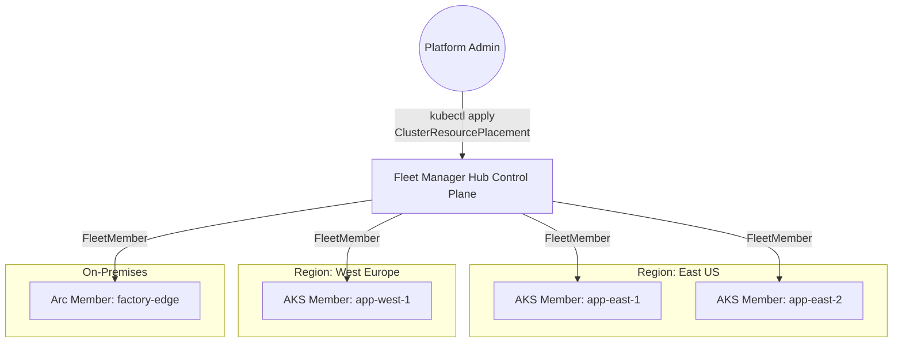

> **AKS Deep Dive** | Complexity: `[ADVANCED]` | Time: 2.5h

As organizations scale their Kubernetes footprints, managing a single sprawling cluster often becomes untenable due to blast radius concerns, hard limits, or multi-region requirements. The natural evolution is multi-cluster architecture, but this introduces massive operational overhead: how do you coordinate upgrades, enforce policies, and distribute workloads consistently across dozens of clusters?

Enter **Azure Kubernetes Fleet Manager (Fleet)**.

Fleet provides a centralized control plane to manage multiple AKS clusters (and Azure Arc-enabled Kubernetes clusters) as a single, cohesive entity. It solves the "n-cluster problem" by introducing fleet-level workload placement, coordinated multi-cluster upgrades, and unified governance.

## When to Adopt Fleet Manager

Before diving into the mechanics, it is crucial to understand *when* you actually need Fleet Manager. Multi-cluster architectures introduce complexity; you should not adopt them prematurely.

**Use single-cluster (or a few independent clusters) when:**
- You operate in a single region and haven't hit AKS scalability limits (e.g., 5,000 nodes).
- Your team structure is simple, and blast radius concerns are satisfied by namespaces and RBAC.
- You prefer to manage multi-cluster deployments entirely through an external GitOps tool (like ArgoCD) without needing native Azure coordinated upgrades.

**Adopt Azure Kubernetes Fleet Manager when:**
- **High Availability & Disaster Recovery:** You run active-active or active-passive workloads across multiple Azure regions.
- **Blast Radius Reduction:** You intentionally split workloads across many smaller clusters rather than one massive cluster to minimize the impact of control plane failures or misconfigurations.
- **Lifecycle Management at Scale:** You need to orchestrate Kubernetes version upgrades across dozens of clusters in a safe, staged manner (e.g., Dev -> Staging -> Prod/Canary -> Prod/Main) without writing complex custom pipelines.
- **Hybrid/Edge Footprint:** You manage a mix of AKS and on-premises/edge clusters via Azure Arc and need a single pane of glass for policy and placement.

> **Pause and predict**: If you have 50 AKS clusters across 3 regions, how would you upgrade them without Fleet Manager? You would likely need a complex CI/CD pipeline looping through clusters, checking health, and handling rollbacks. Fleet Manager moves this orchestration logic into the Azure platform itself.

## Architecture and Topology

Fleet Manager operates on a **hub-and-spoke** topology.

1.  **The Fleet (Hub):** An Azure resource that acts as the centralized control plane. Under the hood, a Fleet resource with the "Hub cluster" feature enabled provisions a managed, headless Kubernetes control plane. You do not run user workloads directly on the Hub; it exists solely to store fleet-level custom resources (like placements and update runs) and API objects.
2.  **Member Clusters (Spokes):** Standard AKS clusters or Azure Arc-enabled clusters that are joined to the Fleet.



### Joining a Cluster to a Fleet

Clusters are joined to the Fleet by creating a `FleetMember` resource. This can be done via the Azure CLI, ARM templates, Bicep, or Terraform.

```bash
# Create the Fleet resource (with a hub cluster)
az fleet create \
    --resource-group my-fleet-rg \
    --name global-app-fleet \
    --enable-hub

# Join an existing AKS cluster as a member
az fleet member create \
    --resource-group my-fleet-rg \
    --fleet-name global-app-fleet \
    --name east-member-1 \
    --member-cluster-id /subscriptions/.../managedClusters/app-east-1
```

Once joined, the Fleet Hub has the necessary credentials and network line-of-sight to sync resources down to the member clusters.

## Fleet-Level Workload Placement

The most powerful feature of Fleet Manager is the ability to deploy Kubernetes resources to the Hub, and have the Hub intelligently distribute them to the member clusters based on rules. This is achieved using the `ClusterResourcePlacement` Custom Resource Definition (CRD).

Instead of running `kubectl apply` against 10 different clusters, you authenticate to the *Fleet Hub* and apply your standard Kubernetes manifests (Deployments, Services, ConfigMaps, etc.). Then, you create a `ClusterResourcePlacement` to tell the Hub *where* those resources should go.

### Placement Strategies

Fleet supports several placement policies:

1.  **`pickAll`:** Distribute the resources to *all* member clusters, optionally filtering by cluster labels.
2.  **`pickFixed`:** Distribute the resources to a specific, hardcoded list of member cluster names.
3.  **`pickN`:** Distribute the resources to a specific *number* of clusters (e.g., "put this workload on exactly 3 clusters that have the label `env=prod`").

### Example: Propagating a Frontend App

Let's say you have a frontend application deployed in the `frontend-app` namespace on the Hub cluster. You want to deploy this namespace (and everything in it) to all member clusters labeled `region: westeurope`.

```yaml
apiVersion: placement.kubernetes-fleet.io/v1beta1
kind: ClusterResourcePlacement
metadata:
  name: frontend-europe-placement
spec:
  resourceSelectors:
    - group: ""
      version: v1
      kind: Namespace
      name: frontend-app
  policy:
    placementType: PickAll
    affinity:
      clusterAffinity:
        clusterSelectorTerms:
          - labelSelector:
              matchLabels:
                region: westeurope
```

When you apply this to the Hub, the Fleet controller packages the `frontend-app` namespace, the Deployments, Services, and ConfigMaps within it, and pushes them to the matching member clusters. It also monitors the member clusters to ensure the resources remain synchronized with the Hub's desired state.

> **Stop and think**: If you delete a Deployment directly on one of the member clusters, what happens? Because the Fleet Hub is the source of truth for placed resources, the Fleet controller will detect the drift and automatically recreate the Deployment on the member cluster to match the Hub's state.

## Coordinated Multi-Cluster Upgrades

Upgrading Kubernetes versions (e.g., from v1.34 to v1.35) is stressful. Upgrading 50 clusters is a nightmare. Fleet Manager provides an orchestration engine for multi-cluster upgrades using **Update Runs**, **Stages**, and **Groups**.

Instead of upgrading clusters randomly or relying on external CI/CD loops, you model your rollout strategy natively in Azure.

1.  **Update Groups:** Logical groupings of clusters (e.g., `dev-clusters`, `canary-clusters`, `prod-westeurope`, `prod-eastus`).
2.  **Update Stages:** Ordered sequences of Update Groups. A stage waits for the previous stage to complete successfully before starting. You can also configure bake times (wait periods) between stages.
3.  **Update Runs:** The actual execution of an upgrade, targeting a specific Kubernetes version (e.g., upgrade all clusters to v1.35.x).

### Defining an Update Strategy

You can define a reusable `FleetUpdateStrategy`.

```bash
az fleet updatestrategy create \
    --resource-group my-fleet-rg \
    --fleet-name global-app-fleet \
    --name safe-rollout-strategy \
    --stages \
      '{"name": "Stage1-Dev", "groups": [{"name": "dev-group"}], "afterStageWaitInSeconds": 3600}' \
      '{"name": "Stage2-Canary", "groups": [{"name": "canary-group"}], "afterStageWaitInSeconds": 86400}' \
      '{"name": "Stage3-Prod", "groups": [{"name": "prod-east"}, {"name": "prod-west"}]}'
```

In this strategy:
1. The `dev-group` upgrades first.
2. The system waits 1 hour (3600 seconds) to allow for automated alerts to fire if something is broken.
3. The `canary-group` upgrades.
4. The system waits 24 hours (86400 seconds) for bake time.
5. The production groups (`prod-east` and `prod-west`) upgrade concurrently.

You trigger the upgrade by creating an Update Run using this strategy:

```bash
az fleet updaterun create \
    --resource-group my-fleet-rg \
    --fleet-name global-app-fleet \
    --name upgrade-to-1-35 \
    --upgrade-type Full \
    --kubernetes-version 1.35.2 \
    --update-strategy-name safe-rollout-strategy
```

If a stage fails (e.g., a cluster upgrade fails or workloads become unhealthy and trigger a halt), the Update Run pauses, preventing the bad update from cascading to your production clusters.

## GitOps and Policy at Scale

Fleet Manager integrates seamlessly with other Azure scalable management tools.

### GitOps with Flux

While you *can* manually `kubectl apply` resources to the Fleet Hub, best practice is to manage the Hub's state via GitOps. You can install the Flux v2 extension directly onto the Fleet Hub cluster.

1. Commit your Kubernetes manifests and `ClusterResourcePlacement` YAMLs to a Git repository.
2. Configure the Flux extension on the Fleet Hub to watch that repository.
3. Flux syncs the resources to the Hub.
4. Fleet Manager distributes the resources to the member clusters.

This provides a centralized GitOps workflow for a multi-cluster fleet, rather than having to install and configure Flux individually on every single spoke cluster.

### Azure Policy

Azure Policy can be applied at the resource group or subscription level containing your AKS clusters. However, when using Fleet Manager, you can ensure consistent policy enforcement across all members. For instance, you can use Azure Policy to enforce that all clusters in a specific Update Group have the correct labels applied, or that certain privileged containers are blocked globally across the fleet.

### Multi-Cluster Observability

To monitor a fleet, you must aggregate telemetry. The standard pattern is configuring all member AKS clusters to send their metrics and logs to a centralized **Azure Monitor Workspace** (for Managed Prometheus) and a centralized **Log Analytics Workspace**. Azure Managed Grafana can then connect to the Azure Monitor Workspace, allowing you to build dashboards that query metrics across the entire fleet, filtering by cluster name or region labels.

## Knowledge Check

### Scenario 1

You are the platform engineer for an e-commerce company running 12 AKS clusters across 4 regions. You have defined a `ClusterResourcePlacement` on your Fleet Hub to deploy a new microservice to all 12 clusters. You commit the YAML to your Git repository, Flux syncs it to the Hub, but the microservice only appears on 3 of the clusters. You check the Hub, and the `ClusterResourcePlacement` status shows it successfully matched and applied to all 12 clusters. 

What is the most likely cause of this discrepancy?

- [ ] A) The Fleet Manager controller is experiencing high latency and the rollout to the remaining 9 clusters is just delayed.
- [ ] B) The `pickN` placement strategy was accidentally configured to limit the deployment to 3 clusters.
- [ ] C) The workloads on the 9 missing clusters were deployed, but a local GitOps agent (like ArgoCD or Flux) installed directly on those member clusters immediately deleted or overwrote the Fleet-managed resources because they drifted from the local agent's Git source.
- [ ] D) The Azure region hosting the 9 missing clusters does not support Fleet Manager.

<details>
<summary><strong>Explanation</strong></summary>

**Correct Answer: C**

If the Hub reports successful placement to all 12 clusters, it means the Fleet controller successfully communicated with the API servers of those member clusters and applied the manifests. However, if a member cluster has its own local GitOps controller (like ArgoCD) running, and that controller is configured to manage the same namespaces or resources, it will view the Fleet's changes as "drift". The local GitOps agent will immediately reconcile the cluster state back to *its* Git source, effectively deleting or undoing the resources placed by Fleet Manager. When using Fleet Manager for workload placement, you must ensure that local cluster controllers do not have conflicting management scopes. Answer B is incorrect because the scenario states the status showed it matched all 12 clusters. Answer D is incorrect as Fleet member clusters can be in any region.
</details>

### Scenario 2

Your organization is preparing to upgrade its entire fleet of 40 AKS clusters from Kubernetes v1.34 to v1.35. You have created a `FleetUpdateStrategy` with three stages: `Dev`, `Staging`, and `Production`, with a 12-hour wait time between Staging and Production. During the `Staging` stage upgrade, one of the 5 clusters in the staging group fails its node image upgrade due to a custom daemonset blocking node drains. 

How will the Fleet Manager Update Run behave in this situation?

- [ ] A) It will immediately rollback the failed staging cluster to v1.34, continue upgrading the other 4 staging clusters, and then proceed to the Production stage.
- [ ] B) It will halt the entire Update Run at the `Staging` stage. The `Production` stage will not begin until the failed cluster is remediated and the run is resumed.
- [ ] C) It will skip the failed cluster, mark the `Staging` stage as partially complete, wait the 12 hours, and then automatically start the `Production` stage.
- [ ] D) It will force-delete the blocking daemonset, retry the upgrade on the failed cluster, and proceed to Production.

<details>
<summary><strong>Explanation</strong></summary>

**Correct Answer: B**

Azure Kubernetes Fleet Manager's update orchestration is designed for safety. If a cluster upgrade fails within a stage, the default behavior of the Update Run is to halt. It will not automatically proceed to the next stage (Production). This is the primary value proposition of stages: preventing a bad upgrade or systemic issue from cascading to your most critical environments. An administrator must investigate the failure on the specific staging cluster, resolve the issue (e.g., fix the pod disruption budgets or daemonset blocking the drain), and then resume the Update Run. Fleet Manager does not currently perform automatic cluster-level rollbacks of Kubernetes versions (Answer A), nor does it forcefully delete user workloads to bypass drain failures (Answer D).
</details>