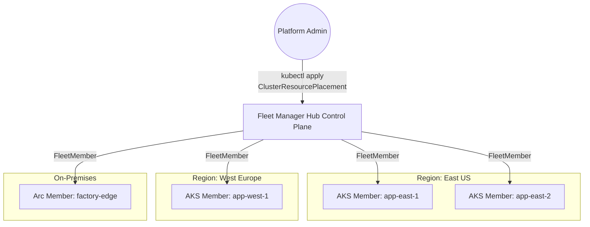

> **AKS Deep Dive** | Complexity: `[ADVANCED]` | Time: 2.5h

As organizations scale their Kubernetes footprints, managing a single sprawling cluster often becomes untenable because blast radius, hard scalability limits, or multi-region requirements push teams toward many smaller clusters instead of one giant control plane. That shift solves one class of problems but introduces another: how do you coordinate upgrades, enforce policies, and distribute workloads consistently when every cluster has its own API server, credentials, and operational lifecycle? **Azure Kubernetes Fleet Manager (Fleet)** answers that question with a centralized control plane that treats multiple AKS clusters—and Azure Arc-enabled Kubernetes clusters—as members of one logical fleet. Fleet solves the "n-cluster problem" by introducing fleet-level workload placement, coordinated multi-cluster upgrades, and unified governance so platform teams can reason about dozens of clusters the way they once reasoned about namespaces inside a single cluster.

## Hands-On Exercise

Goal: Build a two-cluster AKS Fleet, propagate an application from the Fleet hub to both member clusters, observe reconciliation after drift, and define a staged multi-cluster upgrade strategy.

- [ ] Set the lab variables and install the Fleet CLI extension.

  ```bash
  export SUBSCRIPTION_ID=$(az account show --query id -o tsv)
  export GROUP=rg-aks-fleet-lab
  export FLEET=aks-fleet-lab
  export CLUSTER_EAST=aks-fleet-east
  export CLUSTER_WEST=aks-fleet-west
  export EAST_MEMBER=member-east
  export WEST_MEMBER=member-west
  export EAST_LOCATION=eastus
  export WEST_LOCATION=westus2
  export STRATEGY=safe-rollout

  az account set --subscription "${SUBSCRIPTION_ID}"
  az extension add --name fleet
  az extension update --name fleet
  ```

  Before creating Azure resources, confirm the active subscription, signed-in user, and installed Fleet extension version match the lab variables you exported:

  ```bash
  az account show --query "{subscription:id,user:user.name}" -o table
  az extension show --name fleet --query version -o tsv
  ```

- [ ] Create a resource group and deploy two AKS clusters in different regions.

  ```bash
  az group create --name "${GROUP}" --location "${EAST_LOCATION}"

  az aks create \
    --resource-group "${GROUP}" \
    --name "${CLUSTER_EAST}" \
    --location "${EAST_LOCATION}" \
    --node-count 1 \
    --generate-ssh-keys

  az aks create \
    --resource-group "${GROUP}" \
    --name "${CLUSTER_WEST}" \
    --location "${WEST_LOCATION}" \
    --node-count 1 \
    --generate-ssh-keys
  ```

  List both AKS clusters in the lab resource group and confirm each reports a healthy power state in the expected east and west regions:

  ```bash
  az aks list --resource-group "${GROUP}" --query "[].{name:name,location:location,power:powerState.code}" -o table
  ```

- [ ] Create a Fleet hub and join both AKS clusters as Fleet members with separate update groups.

  ```bash
  az fleet create \
    --resource-group "${GROUP}" \
    --name "${FLEET}" \
    --location "${EAST_LOCATION}" \
    --enable-hub

  export EAST_ID=$(az aks show --resource-group "${GROUP}" --name "${CLUSTER_EAST}" --query id -o tsv)
  export WEST_ID=$(az aks show --resource-group "${GROUP}" --name "${CLUSTER_WEST}" --query id -o tsv)

  az fleet member create \
    --resource-group "${GROUP}" \
    --fleet-name "${FLEET}" \
    --name "${EAST_MEMBER}" \
    --member-cluster-id "${EAST_ID}" \
    --update-group stage1

  az fleet member create \
    --resource-group "${GROUP}" \
    --fleet-name "${FLEET}" \
    --name "${WEST_MEMBER}" \
    --member-cluster-id "${WEST_ID}" \
    --update-group stage2
  ```

  List Fleet members from the hub subscription and confirm the east and west clusters appear as members with distinct update groups:

  ```bash
  az fleet member list --resource-group "${GROUP}" --fleet-name "${FLEET}" -o table
  ```

- [ ] Authorize hub-cluster access and pull kubeconfig contexts for the hub and both members.

  ```bash
  export FLEET_ID="/subscriptions/${SUBSCRIPTION_ID}/resourceGroups/${GROUP}/providers/Microsoft.ContainerService/fleets/${FLEET}"
  export IDENTITY=$(az ad signed-in-user show --query id -o tsv)

  az role assignment create \
    --role "Azure Kubernetes Fleet Manager RBAC Cluster Admin" \
    --assignee "${IDENTITY}" \
    --scope "${FLEET_ID}"

  az fleet get-credentials --resource-group "${GROUP}" --name "${FLEET}" --context "${FLEET}-hub" --overwrite-existing
  az fleet get-credentials --resource-group "${GROUP}" --name "${FLEET}" --member "${EAST_MEMBER}" --context "${EAST_MEMBER}-ctx" --overwrite-existing
  az fleet get-credentials --resource-group "${GROUP}" --name "${FLEET}" --member "${WEST_MEMBER}" --context "${WEST_MEMBER}-ctx" --overwrite-existing
  ```

  From the hub kube context, list member clusters and confirm Fleet-applied location labels match the east and west regions you used during cluster creation:

  ```bash
  kubectl --context "${FLEET}-hub" get memberclusters
  kubectl --context "${FLEET}-hub" get memberclusters -o jsonpath='{range .items[*]}{.metadata.name}{"\t"}{.metadata.labels.fleet\.azure\.com/location}{"\n"}{end}'
  ```

- [ ] Deploy a sample namespace and application to the Fleet hub cluster.

  ```bash
  cat <<'EOF' | kubectl --context "${FLEET}-hub" apply -f -
  apiVersion: v1
  kind: Namespace
  metadata:
    name: fleet-demo
  ---
  apiVersion: apps/v1
  kind: Deployment
  metadata:
    name: web
    namespace: fleet-demo
  spec:
    replicas: 1
    selector:
      matchLabels:
        app: web
    template:
      metadata:
        labels:
          app: web
      spec:
        containers:
        - name: web
          image: mcr.microsoft.com/oss/nginx/nginx:1.25.5
          ports:
          - containerPort: 80
  ---
  apiVersion: v1
  kind: Service
  metadata:
    name: web
    namespace: fleet-demo
  spec:
    selector:
      app: web
    ports:
    - port: 80
      targetPort: 80
  EOF
  ```

  Confirm the sample deployment, service, and pod are running on the Fleet hub before you create the cluster-wide placement object:

  ```bash
  kubectl --context "${FLEET}-hub" -n fleet-demo get deploy,svc,pods
  ```

- [ ] Create a `ClusterResourcePlacement` that propagates the namespace and its child resources to all Fleet members.

  ```bash
  cat <<'EOF' | kubectl --context "${FLEET}-hub" apply -f -
  apiVersion: placement.kubernetes-fleet.io/v1
  kind: ClusterResourcePlacement
  metadata:
    name: fleet-demo-all
  spec:
    resourceSelectors:
    - group: ""
      version: v1
      kind: Namespace
      name: fleet-demo
    policy:
      placementType: PickAll
  EOF
  ```

  Describe the placement object on the hub and confirm Fleet reports the `fleet-demo` namespace as scheduled and applied to every member cluster:

  ```bash
  kubectl --context "${FLEET}-hub" get clusterresourceplacement fleet-demo-all
  kubectl --context "${FLEET}-hub" describe clusterresourceplacement fleet-demo-all
  ```

- [ ] Confirm the workload exists on both member clusters, then create drift on one member and watch Fleet reconcile it.

  ```bash
  kubectl --context "${EAST_MEMBER}-ctx" -n fleet-demo get deploy,svc,pods
  kubectl --context "${WEST_MEMBER}-ctx" -n fleet-demo get deploy,svc,pods

  kubectl --context "${WEST_MEMBER}-ctx" -n fleet-demo delete deployment web
  sleep 20
  kubectl --context "${WEST_MEMBER}-ctx" -n fleet-demo get deployment web
  ```

  After deleting the deployment on the west member, confirm Fleet recreates the workload and the placement status still shows a healthy apply:

  ```bash
  kubectl --context "${WEST_MEMBER}-ctx" -n fleet-demo get pods
  kubectl --context "${FLEET}-hub" describe clusterresourceplacement fleet-demo-all
  ```

- [ ] Define a staged Fleet update strategy so one member upgrades before the other.

  ```bash
  cat <<'EOF' > example-stages.json
  {
    "stages": [
      {
        "name": "stage-1-canary",
        "groups": [
          {
            "name": "stage1"
          }
        ],
        "afterStageWaitInSeconds": 900
      },
      {
        "name": "stage-2-production",
        "groups": [
          {
            "name": "stage2"
          }
        ]
      }
    ]
  }
  EOF

  az fleet updatestrategy create \
    --resource-group "${GROUP}" \
    --fleet-name "${FLEET}" \
    --name "${STRATEGY}" \
    --stages example-stages.json
  ```

  Show the update strategy YAML and list available upgrades on the east cluster to confirm staged rollout metadata:

  ```bash
  az fleet updatestrategy show --resource-group "${GROUP}" --fleet-name "${FLEET}" --name "${STRATEGY}" -o yaml
  az aks get-upgrades --resource-group "${GROUP}" --name "${CLUSTER_EAST}" -o table
  ```

The lab is complete when all of the following success criteria are true:

- The Fleet hub shows both member clusters as joined.
- `fleet-demo-all` reports as scheduled and applied from the hub.
- The `fleet-demo` namespace and `web` workload exist on both member clusters.
- Deleting the deployment from one member cluster results in Fleet recreating it.
- The Fleet update strategy exists and shows two ordered stages mapped to different update groups.

## When to Adopt Fleet Manager

Before diving into the mechanics, it is crucial to understand *when* you actually need Fleet Manager, because multi-cluster architectures introduce operational complexity that you should not take on until a single-cluster model genuinely stops working. A small team in one region with modest node counts can usually satisfy blast-radius and tenancy needs with namespaces, RBAC, and network policies, especially if an external GitOps controller already coordinates releases across a handful of independent clusters.

### When a Single Cluster (or a Few Independent Clusters) Is Enough

- You operate in a single region and have not hit AKS scalability limits (for example, the roughly 5,000-node cluster ceiling).
- Your team structure is simple, and blast radius concerns are satisfied by namespaces and RBAC alone.
- You prefer to manage multi-cluster deployments entirely through an external GitOps tool (like Argo CD) without needing native Azure coordinated upgrades.

### When to Adopt Azure Kubernetes Fleet Manager

- **High Availability & Disaster Recovery:** You run active-active or active-passive workloads across multiple Azure regions and need a control plane that understands regional membership.
- **Blast Radius Reduction:** You intentionally split workloads across many smaller clusters rather than one massive cluster so control plane failures or misconfigurations affect fewer tenants.
- **Lifecycle Management at Scale:** You must orchestrate Kubernetes version upgrades across dozens of clusters in a safe, staged manner (for example, Dev → Staging → Prod/Canary → Prod/Main) without maintaining bespoke CI/CD loops for every wave.
- **Hybrid/Edge Footprint:** You manage a mix of AKS and on-premises or edge clusters via Azure Arc and need a single pane of glass for policy and placement.

> **Pause and predict**: If you have 50 AKS clusters across 3 regions, how would you upgrade them without Fleet Manager? You would likely need a complex CI/CD pipeline looping through clusters, checking health, and handling rollbacks. Fleet Manager moves that orchestration logic into the Azure platform itself.

## Architecture and Topology

Fleet Manager operates on a **hub-and-spoke** topology in which a Fleet resource with an enabled hub cluster becomes the centralized control plane, while standard AKS or Arc-enabled clusters join as spokes. The hub is not a place for application workloads: when you enable the hub cluster feature, Azure provisions a managed, headless Kubernetes control plane that stores fleet-level custom resources such as placements and update runs, and member clusters receive synchronized objects through Fleet controllers rather than through ad hoc scripting from your laptop.

1.  **The Fleet (Hub):** An Azure resource that acts as the centralized control plane. Under the hood, a Fleet resource with the "Hub cluster" feature enabled provisions a managed, headless Kubernetes control plane. You do not run user workloads directly on the Hub; it exists solely to store fleet-level custom resources (like placements and update runs) and API objects.
2.  **Member Clusters (Spokes):** Standard AKS clusters or Azure Arc-enabled clusters that are joined to the Fleet.


```mermaid
graph TD
    Fleet[Fleet Manager Hub Control Plane]
    
    subgraph Region: East US
        ClusterA[AKS Member: app-east-1]
        ClusterB[AKS Member: app-east-2]
    end
    
    subgraph Region: West Europe
        ClusterC[AKS Member: app-west-1]
    end
    
    subgraph On-Premises
        ClusterD[Arc Member: factory-edge]
    end

    Fleet -->|FleetMember| ClusterA
    Fleet -->|FleetMember| ClusterB
    Fleet -->|FleetMember| ClusterC
    Fleet -->|FleetMember| ClusterD
    
    Admin((Platform Admin)) -->|kubectl apply <br> ClusterResourcePlacement| Fleet
```

### Joining a Cluster to a Fleet

Clusters are joined to the Fleet by creating a `FleetMember` resource through the Azure CLI, ARM templates, Bicep, or Terraform, and once that relationship exists the hub receives the credentials and network path it needs to push placement decisions to each spoke. The join operation is intentionally boring infrastructure work—what matters is that every member cluster becomes addressable from the hub API so propagation and upgrade orchestration can run without per-cluster kubeconfig juggling.

```bash
# Create the Fleet resource (with a hub cluster)
az fleet create \
    --resource-group my-fleet-rg \
    --name global-app-fleet \
    --enable-hub

# Join an existing AKS cluster as a member
az fleet member create \
    --resource-group my-fleet-rg \
    --fleet-name global-app-fleet \
    --name east-member-1 \
    --member-cluster-id /subscriptions/.../managedClusters/app-east-1
```

After the member record exists, the Fleet Hub maintains line-of-sight to the member API server and can reconcile placed resources whenever the hub desired state changes.

## Fleet-Level Workload Placement

The most powerful feature of Fleet Manager is the ability to deploy Kubernetes resources to the Hub and have the Hub intelligently distribute them to member clusters based on rules defined in a `ClusterResourcePlacement` Custom Resource Definition (CRD). Instead of running `kubectl apply` against ten different clusters, you authenticate to the *Fleet Hub*, apply the same Deployments, Services, and ConfigMaps you would use in a single cluster, and let Fleet decide which members should receive each object based on labels, counts, or explicit names.

### Placement Strategies

Fleet supports several placement policies, and choosing among them is how you express blast-radius and capacity intent without rewriting manifests for every member cluster in the fleet:

1.  **`pickAll`:** Distribute the resources to *all* member clusters, optionally filtering by cluster labels.
2.  **`pickFixed`:** Distribute the resources to a specific, hardcoded list of member cluster names.
3.  **`pickN`:** Distribute the resources to a specific *number* of clusters (e.g., "put this workload on exactly 3 clusters that have the label `env=prod`").

### Example: Propagating a Frontend App

Suppose a frontend application lives in the `frontend-app` namespace on the Hub and you want that namespace—and every namespaced object inside it—on all member clusters labeled `region: westeurope`. The placement object below selects the namespace and applies a `PickAll` policy filtered by cluster labels, which is the usual pattern for regional active-active footprints.

```yaml
apiVersion: placement.kubernetes-fleet.io/v1beta1
kind: ClusterResourcePlacement
metadata:
  name: frontend-europe-placement
spec:
  resourceSelectors:
    - group: ""
      version: v1
      kind: Namespace
      name: frontend-app
  policy:
    placementType: PickAll
    affinity:
      clusterAffinity:
        clusterSelectorTerms:
          - labelSelector:
              matchLabels:
                region: westeurope
```

When you apply this manifest to the Hub, the Fleet controller packages the `frontend-app` namespace together with its Deployments, Services, and ConfigMaps, pushes the bundle to matching members, and continues to watch those clusters so drift against the hub desired state is corrected automatically.

> **Stop and think**: If you delete a Deployment directly on one of the member clusters, what happens? Because the Fleet Hub is the source of truth for placed resources, the Fleet controller will detect the drift and automatically recreate the Deployment on the member cluster to match the Hub's state.

## Coordinated Multi-Cluster Upgrades

Upgrading Kubernetes versions (for example, from v1.34 to v1.35) is stressful on one cluster and operationally hazardous across fifty, which is why Fleet Manager exposes an orchestration engine built from **Update Runs**, **Stages**, and **Groups** instead of leaving every team to script their own wave logic. Rather than upgrading clusters randomly or relying on external CI/CD loops that are hard to audit, you model rollout intent natively in Azure and let Fleet enforce ordering, bake times, and halt conditions when health checks fail mid-stage.

1.  **Update Groups:** Logical groupings of clusters (e.g., `dev-clusters`, `canary-clusters`, `prod-westeurope`, `prod-eastus`).
2.  **Update Stages:** Ordered sequences of Update Groups. A stage waits for the previous stage to complete successfully before starting. You can also configure bake times (wait periods) between stages.
3.  **Update Runs:** The actual execution of an upgrade, targeting a specific Kubernetes version (e.g., upgrade all clusters to v1.35.2).

### Defining an Update Strategy

A reusable `FleetUpdateStrategy` captures the wave pattern so every Kubernetes minor bump follows the same safety rails instead of retyping stage JSON under pressure.

```bash
az fleet updatestrategy create \
    --resource-group my-fleet-rg \
    --fleet-name global-app-fleet \
    --name safe-rollout-strategy \
    --stages \
      '{"name": "Stage1-Dev", "groups": [{"name": "dev-group"}], "afterStageWaitInSeconds": 3600}' \
      '{"name": "Stage2-Canary", "groups": [{"name": "canary-group"}], "afterStageWaitInSeconds": 86400}' \
      '{"name": "Stage3-Prod", "groups": [{"name": "prod-east"}, {"name": "prod-west"}]}'
```

In the strategy above, the `dev-group` upgrades first, the platform waits one hour so automated alerts can surface regressions, the `canary-group` upgrades next, a twenty-four-hour bake window runs, and only then do the `prod-east` and `prod-west` groups upgrade concurrently. You start the real version change by creating an Update Run that references the strategy and target Kubernetes version:

```bash
az fleet updaterun create \
    --resource-group my-fleet-rg \
    --fleet-name global-app-fleet \
    --name upgrade-to-1-35 \
    --upgrade-type Full \
    --kubernetes-version 1.35.2 \
    --update-strategy-name safe-rollout-strategy
```

If a stage fails—because a cluster upgrade errors or workloads become unhealthy and trigger a halt—the Update Run pauses instead of cascading the same change into production, which is the core safety property staged fleets are meant to buy you.

## GitOps and Policy at Scale

Fleet Manager integrates with the broader Azure management stack so hub state, policy, and telemetry can be governed consistently even when member clusters span regions and tenancy models. The integration points below are not mandatory on day one, but they are the patterns teams converge on once fleet size makes manual hub edits unsustainable.

### GitOps with Flux

While you *can* manually `kubectl apply` resources to the Fleet Hub, best practice is to manage the Hub's desired state with GitOps: install the Flux v2 extension on the Fleet Hub, commit Kubernetes manifests plus `ClusterResourcePlacement` YAML to a repository, and let Flux reconcile the hub while Fleet propagates the same objects to members. That workflow gives you one Git-driven pipeline for a multi-cluster fleet instead of installing and configuring Flux independently on every spoke cluster, which is how you avoid conflicting sources of truth between hub placement and local controllers.

### Azure Policy

Azure Policy can target the resource groups or subscriptions that contain your AKS clusters, and in a Fleet deployment you typically use it to enforce labels on update groups, block privileged containers fleet-wide, or require diagnostic settings before a cluster is allowed to join a production stage. Fleet membership does not replace Policy; it gives you a natural scope boundary so the same guardrails apply to every member attached to a hub.

### Multi-Cluster Observability

To monitor a fleet effectively, you aggregate telemetry from every member into shared backends: configure member AKS clusters to send metrics and logs to a centralized **Azure Monitor Workspace** (for Managed Prometheus) and a centralized **Log Analytics Workspace**, then connect **Azure Managed Grafana** to that workspace so dashboards can query across the fleet using cluster name or region labels. Without that aggregation step, each cluster looks healthy in isolation while regional or placement-level incidents remain invisible until customers complain.

## Knowledge Check

### Scenario 1

You are the platform engineer for an e-commerce company running 12 AKS clusters across 4 regions. You have defined a `ClusterResourcePlacement` on your Fleet Hub to deploy a new microservice to all 12 clusters. You commit the YAML to your Git repository, Flux syncs it to the Hub, but the microservice only appears on 3 of the clusters. You check the Hub, and the `ClusterResourcePlacement` status shows it successfully matched and applied to all 12 clusters. Given that the hub believes placement succeeded everywhere, which explanation best accounts for workloads missing on nine members despite a successful Fleet status?

- [ ] A) The Fleet Manager controller is experiencing high latency and the rollout to the remaining 9 clusters is just delayed.
- [ ] B) The `pickN` placement strategy was accidentally configured to limit the deployment to 3 clusters.
- [ ] C) The workloads on the 9 missing clusters were deployed, but a local GitOps agent (like ArgoCD or Flux) installed directly on those member clusters immediately deleted or overwrote the Fleet-managed resources because they drifted from the local agent's Git source.
- [ ] D) The Azure region hosting the 9 missing clusters does not support Fleet Manager.

<details>
<summary><strong>Explanation</strong></summary>

**Correct Answer: C**

If the Hub reports successful placement to all 12 clusters, it means the Fleet controller successfully communicated with the API servers of those member clusters and applied the manifests. However, if a member cluster has its own local GitOps controller (like ArgoCD) running, and that controller is configured to manage the same namespaces or resources, it will view the Fleet's changes as drift. The local GitOps agent will immediately reconcile the cluster state back to its Git source, effectively deleting or undoing the resources placed by Fleet Manager. When using Fleet Manager for workload placement, you must ensure that local cluster controllers do not have conflicting management scopes. Answer B is incorrect because the scenario states the status showed it matched all 12 clusters. Answer D is incorrect as Fleet member clusters can be in any region.
</details>

### Scenario 2

Your organization is preparing to upgrade its entire fleet of 40 AKS clusters from Kubernetes v1.34 to v1.35. You have created a `FleetUpdateStrategy` with three stages: `Dev`, `Staging`, and `Production`, with a 12-hour wait time between Staging and Production. During the `Staging` stage upgrade, one of the 5 clusters in the staging group fails its node image upgrade because a custom daemonset blocks node drains. When that failure happens inside a staged Fleet Update Run, how should you expect Fleet Manager to behave before any production clusters are touched?

- [ ] A) It will immediately rollback the failed staging cluster to v1.34, continue upgrading the other 4 staging clusters, and then proceed to the Production stage.
- [ ] B) It will halt the entire Update Run at the `Staging` stage. The `Production` stage will not begin until the failed cluster is remediated and the run is resumed.
- [ ] C) It will skip the failed cluster, mark the `Staging` stage as partially complete, wait the 12 hours, and then automatically start the `Production` stage.
- [ ] D) It will force-delete the blocking daemonset, retry the upgrade on the failed cluster, and proceed to Production.

<details>
<summary><strong>Explanation</strong></summary>

**Correct Answer: B**

Azure Kubernetes Fleet Manager's update orchestration is designed for safety. If a cluster upgrade fails within a stage, the default behavior of the Update Run is to halt. It will not automatically proceed to the next stage (Production). This is the primary value proposition of stages: preventing a bad upgrade or systemic issue from cascading to your most critical environments. An administrator must investigate the failure on the specific staging cluster, resolve the issue (e.g., fix the pod disruption budgets or daemonset blocking the drain), and then resume the Update Run. Fleet Manager does not currently perform automatic cluster-level rollbacks of Kubernetes versions (Answer A), nor does it forcefully delete user workloads to bypass drain failures (Answer D).
</details>

## Sources

- [Azure Kubernetes Fleet Manager overview](https://learn.microsoft.com/en-us/azure/kubernetes-fleet/overview) — Microsoft's canonical reference for the Fleet hub + member-cluster model, supported topologies, and the "n-cluster problem" this module frames.
- [Orchestrate cluster updates across clusters with Azure Kubernetes Fleet Manager](https://learn.microsoft.com/en-us/azure/kubernetes-fleet/update-orchestration) — Authoritative source for `FleetUpdateStrategy`, staged Update Runs, and the halt-on-failure behavior referenced in Scenario 2.
- [Propagate resources from a Fleet Manager hub cluster to member clusters](https://learn.microsoft.com/en-us/azure/kubernetes-fleet/resource-propagation) — Describes `ClusterResourcePlacement` semantics and how the hub reconciles workload placement to members.
- [Multi-cluster load balancing with Azure Kubernetes Fleet Manager](https://learn.microsoft.com/en-us/azure/kubernetes-fleet/concepts-load-balancing) — Reference for multi-cluster service discovery and cross-cluster traffic policies.
- [Fleet Manager and GitOps (Flux/ArgoCD) coexistence](https://learn.microsoft.com/en-us/azure/azure-arc/kubernetes/conceptual-gitops-flux2) — Context for the Scenario 1 conflict between Fleet-driven placement and a cluster-local GitOps controller reconciling to a different source of truth.
- [Kubernetes 1.35 release notes](https://kubernetes.io/releases/) — Upstream release cadence referenced in the v1.34 → v1.35 fleet upgrade example.
