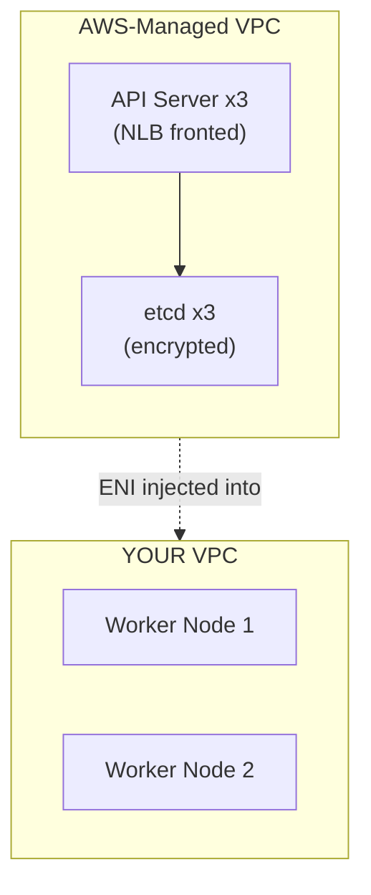
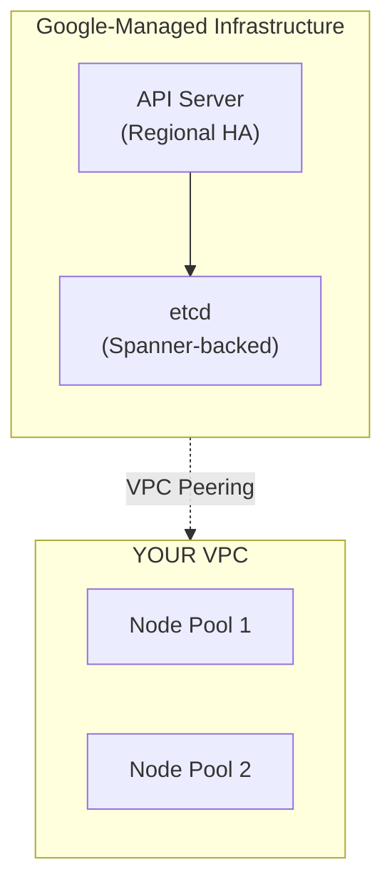
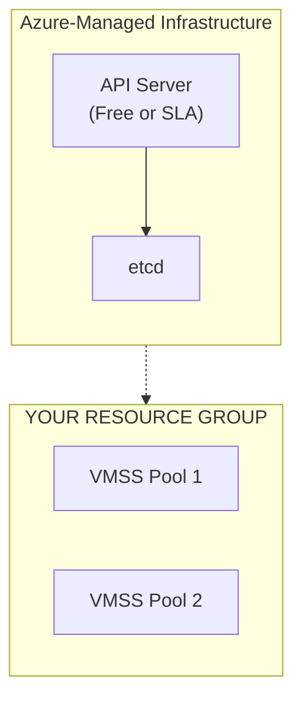
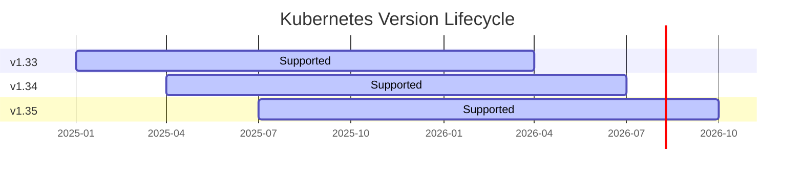
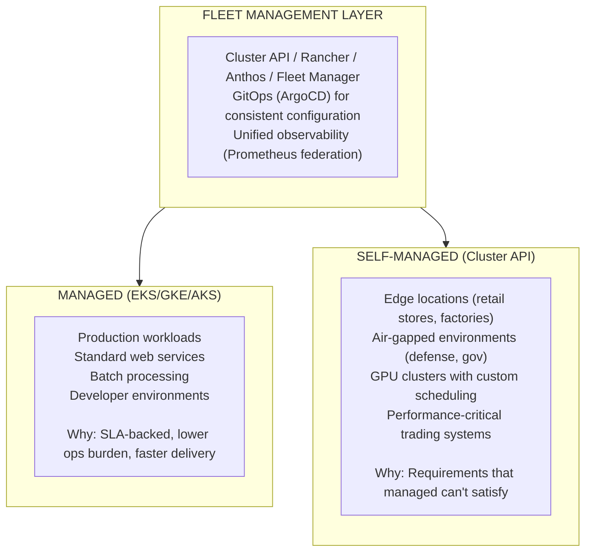

> **Complexity**: `[MEDIUM]`
>
> **Time to Complete**: 2 hours
>
> **Prerequisites**: Basic Kubernetes knowledge (Pods, Deployments, Services)
>
> **Track**: Cloud Architecture Patterns

## What You'll Be Able to Do

After completing this module, you will be able to:

- **Evaluate** managed Kubernetes services (EKS, GKE, AKS) against self-managed clusters for specific workload requirements and constraints.
- **Design** comprehensive decision frameworks that weigh control plane responsibility, upgrade lifecycle velocity, and team capability.
- **Compare** the total cost of ownership between managed and self-managed Kubernetes infrastructures, explicitly accounting for hidden operational and labor costs.
- **Implement** bulletproof migration strategies from legacy self-managed Kubernetes environments to modern managed services with minimal workload disruption.
- **Diagnose** structural and operational risks in existing self-managed Kubernetes cluster configurations to preempt catastrophic failures.

---

## Why This Module Matters

March 2022. A mid-sized fintech startup in Berlin named ValuKredit was expanding rapidly. The platform team had been running self-managed Kubernetes on bare-metal servers in a colocation facility for three years. They were exceptionally proud of their architecture. They boasted custom-tuned etcd clusters, hand-rolled automated certificate rotation, and bespoke multi-dimensional monitoring. The tight-knit team of six engineers knew nearly every corner and quirk of their intricate infrastructure.

Then, their lead infrastructure engineer resigned abruptly. Two weeks later, a second senior engineer departed for a major technology firm. The remaining four engineers had never performed a Kubernetes version upgrade without those two individuals directing the operation. When a critical CVE hit the kube-apiserver in April, the depleted team simply froze. They lacked the operational confidence to patch the control plane safely. For eleven agonizing days, their production cluster ran a publicly disclosed, highly weaponized vulnerability because nobody understood the upgrade procedure well enough to execute it without risking a total outage. The subsequent postmortem estimated their risk exposure at three point four million dollars in potential breach liability. Six months later, they abandoned their custom setup and migrated entirely to GKE. Their remaining engineers finally returned to shipping product features instead of babysitting etcd databases.

This narrative plays out in reverse, too. A global logistics company running exclusively on EKS discovered that their managed control plane's fifteen-minute SLA for API server availability was woefully insufficient for their real-time, automated container orchestration workloads. They required sub-second failover and custom admission webhooks that inherently conflicted with EKS's strict managed add-on lifecycle policies. Ultimately, they moved to self-managed Kubernetes on raw EC2 instances. Consequently, their infrastructure costs dropped by a massive margin because they could meticulously right-size their control plane nodes instead of paying flat per-cluster fees, and they regained absolute authority over their scheduler. 

Neither organization made a fundamentally wrong decision. Both choices were exactly right for their specific operational contexts. The truly difficult part of cloud architecture is knowing precisely which context you are currently operating in. In this module, you will learn to make that critical decision with absolute confidence. You will understand what "managed" actually entails, how to calculate the unforgiving true cost of self-management, and when you must utilize the escape hatches to run your own control plane.

---

## Section 1: The Shared Responsibility Model

The most pervasive and dangerous assumption in cloud native engineering is that adopting a managed Kubernetes service absolves the platform team of all operational responsibility. This is categorically false. Every single managed Kubernetes offering operates on a strict shared responsibility model, and the demarcation line—the exact point where the provider's pager stops ringing and yours starts—varies wildly between Amazon EKS, Google GKE, and Azure AKS.

Think of infrastructure like housing. Running self-managed Kubernetes on bare metal is like building and maintaining your own house from the foundation up. You pour the concrete, fix the plumbing, repair the roof, and furnish the interior. If the pipes burst, you are the one holding the wrench at midnight. 

Managed Kubernetes is like renting a high-end apartment. The landlord (the cloud provider) is responsible for the building's structural integrity, the main water lines, and the central heating system. However, you are still entirely responsible for your own furniture, securing your front door, and ensuring you do not start a fire in the kitchen. The provider maintains the control plane (the plumbing), but you still own and must secure your workloads (the furniture).

### Shared Responsibility: Who Owns What?

| Component | Self-Managed | Managed (EKS/GKE/AKS) | Serverless (Fargate/Cloud Run) |
|-----------|-------------|----------------------|------------------------------|
| Application Code | YOU | YOU | YOU |
| Container Images | YOU | YOU | YOU |
| Pod Security | YOU | YOU | YOU |
| Network Policies | YOU | YOU | SHARED |
| Ingress / LB | YOU | YOU | PROVIDER |
| Worker Nodes | YOU | YOU * | PROVIDER |
| Node OS Patching | YOU | YOU * | PROVIDER |
| kubelet | YOU | YOU * | PROVIDER |
| Control Plane | YOU | PROVIDER | PROVIDER |
| etcd | YOU | PROVIDER | PROVIDER |
| API Server HA | YOU | PROVIDER | PROVIDER |
| Certificate Mgmt | YOU | PROVIDER | PROVIDER |
| Cloud Infra | YOU ** | PROVIDER | PROVIDER |
| Physical Security | YOU ** | PROVIDER | PROVIDER |

*\* With managed node groups, some node responsibilities shift to the provider.*  
*\*\* Only applies to on-premises or bare-metal deployments.*

Notice that even with a fully managed Kubernetes cluster, you are still actively responsible for a massive portion of the operational stack. Worker node OS patching, network policies, pod security admission, and ingress controller configuration—these remain your unyielding responsibility regardless of the cloud provider you choose.

> **Stop and think**: If a critical vulnerability is discovered in the Linux kernel's networking stack, and you are using EKS with managed node groups, who is responsible for initiating the patching process, and why might the cloud provider intentionally wait for you to trigger it rather than auto-updating your nodes immediately?

### The Control Plane: What Managed Really Manages

The Kubernetes control plane is the brain of your cluster. When you opt for a managed service, the provider takes over the heavy lifting of running these specific components:

| Component | What It Does | Self-Managed Burden |
|-----------|-------------|---------------------|
| kube-apiserver | All cluster communication flows through here | Must configure HA, TLS, audit logging, OIDC |
| etcd | Stores all cluster state | Must manage backups, compaction, defragmentation, quorum |
| kube-scheduler | Decides where pods run | Must configure profiles, custom scorers |
| kube-controller-manager | Runs reconciliation loops | Must manage leader election, garbage collection tuning |
| cloud-controller-manager | Integrates with cloud APIs | Must build/maintain if not on a major cloud |

When you use EKS, GKE, or AKS, the provider runs these complex, stateful components for you. But the exact definition of "runs" means very different things depending on which hyperscaler you choose.

---

## Section 2: Provider Comparison: Control Plane Architectures

It is critical to understand how the major cloud providers physically architect their managed Kubernetes offerings. They do not simply run `kubeadm` behind a curtain. They have engineered massive, multi-tenant architectures to achieve economies of scale.

### Amazon EKS Architecture

In AWS, the control plane lives in a Virtual Private Cloud (VPC) that AWS owns and completely obscures from you. 



**Key Architectural Details:**
- The control plane resides entirely in an AWS-managed account. You have zero access to the underlying EC2 instances.
- To allow the API server to communicate with the kubelets on your worker nodes, AWS injects Elastic Network Interfaces (ENIs) directly into your designated VPC subnets. These ENIs bridge the network gap.
- You NEVER see, touch, or interact with the etcd instances. They are continuously backed up and encrypted by AWS.

### Google GKE Architecture

Google leverages its vast internal infrastructure experience to provide a deeply integrated control plane experience.



**Key Architectural Details:**
- GKE Autopilot goes even further than standard GKE—Google manages the worker nodes entirely. You only define the workloads and pay for the exact pod resources requested.
- In some GKE implementations, etcd is actually backed by Google Spanner for extreme, globally distributed durability rather than running as standard local etcd processes.
- Network communication often relies on automated VPC Peering or Private Service Connect under the hood.

### Azure AKS Architecture

Microsoft Azure takes a slightly different approach, blending managed abstraction with visible resource groups.



**Key Architectural Details:**
- AKS offers a Free tier that has NO SLA on the control plane. It is suitable only for development.
- The Standard tier costs a flat rate and adds a financially backed 99.95% SLA.
- AKS explicitly places some load balancers and network security groups into an auto-generated managed resource group (typically prefixed with `MC_`) directly inside YOUR Azure subscription.

> **Pause and predict**: GKE Autopilot completely abstracts away worker nodes, billing you only for requested pod resources. If your security team mandates a third-party intrusion detection agent that runs as a highly privileged DaemonSet to inspect host-level syscalls, how will Autopilot's architecture conflict with this requirement?

### The Critical Differences

| Feature | EKS | GKE | AKS |
|---------|-----|-----|-----|
| Control Plane Cost | $0.10/hr ($73/mo) | Free (Autopilot) or $0.10/hr (Standard) | Free (no SLA) or $0.10/hr (SLA) |
| Control Plane SLA | 99.95% | 99.95% (Regional) | 99.95% (Standard tier) |
| Max Pods per Node | 110 (default ENI limits) | 110 (default), 256 (GKE) | 250 |
| K8s Version Lag | ~2-3 months behind upstream | ~1-2 months behind upstream | ~2-3 months behind upstream |
| etcd Access | None | None | None |
| Autopilot Mode | Fargate (serverless pods) | GKE Autopilot (full cluster) | None (virtual nodes via ACI) |
| Private Cluster | Yes (API endpoint in VPC) | Yes (Private cluster) | Yes (Private AKS) |

---

## Section 3: Total Cost of Ownership: The Numbers Nobody Talks About

The most devastating mistake engineering teams make is comparing only the raw infrastructure sticker price. "EKS costs seventy-three dollars a month for the control plane, but running `kubeadm` on our own VMs is free!" This is a deeply flawed premise. Building your own house is technically "free" if you stubbornly refuse to calculate the cost of your labor, your materials, your permits, and the three years of your life spent swinging a hammer.

Let us build a highly realistic Total Cost of Ownership (TCO) model for a medium-complexity production deployment.

### Self-Managed Kubernetes: True Annual Cost

**Infrastructure**

| Component | Cost |
|-----------|------|
| Control plane VMs (3x HA) | $3,600/yr |
| etcd dedicated nodes (3x SSD) | $5,400/yr |
| Load balancer for API server | $1,200/yr |
| Backup storage (etcd snapshots) | $360/yr |
| **Infrastructure subtotal:** | **$10,560/yr** |

**Operational Labor (2 senior engineers, partial allocation)**

| Component | Cost |
|-----------|------|
| Kubernetes upgrades (4x/yr) | $12,000 |
| etcd maintenance + monitoring | $8,000 |
| Certificate rotation | $4,000 |
| Security patching (CVEs) | $6,000 |
| Incident response (control plane) | $10,000 |
| Documentation & runbooks | $3,000 |
| **Labor subtotal:** | **$43,000/yr** |

**Risk (annualized)**

| Component | Cost |
|-----------|------|
| Extended outage (control plane) | $8,000 |
| Failed upgrade rollback | $5,000 |
| Key person dependency | $7,000 |
| **Risk subtotal:** | **$20,000/yr** |

**TOTAL SELF-MANAGED: $73,560/yr**

---

### Managed Kubernetes (EKS): True Annual Cost

**Managed Service**

| Component | Cost |
|-----------|------|
| EKS control plane | $876/yr |
| NAT Gateway (2 AZs) | $7,200/yr * |
| VPC endpoints (ECR, S3, etc.) | $1,800/yr * |
| CloudWatch / logging | $2,400/yr |
| **Service subtotal:** | **$12,276/yr** |

**Operational Labor (1 senior engineer, partial allocation)**

| Component | Cost |
|-----------|------|
| Managed upgrades (4x/yr) | $4,000 |
| Node group management | $3,000 |
| Add-on management | $2,000 |
| Incident response (node-level) | $4,000 |
| **Labor subtotal:** | **$13,000/yr** |

**Risk (annualized)**

| Component | Cost |
|-----------|------|
| Provider outage impact | $3,000 |
| Upgrade compatibility issues | $2,000 |
| **Risk subtotal:** | **$5,000/yr** |

**TOTAL MANAGED: $30,276/yr**

*\* These specific costs exist in BOTH models but are almost always forgotten when engineering teams compare "free kubeadm versus a monthly EKS fee."*

The managed option is roughly sixty percent cheaper when you accurately account for raw labor and enterprise risk. But the math shifts dramatically at scale. An organization running a massive fleet of clusters might find that investing in a dedicated platform team to manage self-hosted Kubernetes using Cluster API is vastly more cost-effective than paying for control plane fees across hundreds of individual environments.

> **Stop and think**: The TCO models assume a static baseline of infrastructure. If your workloads are highly bursty and you run across three Availability Zones to ensure high availability, how does the managed control plane architecture of EKS invisibly multiply your cross-AZ data transfer costs compared to a self-managed cluster?

### The Costs People Forget

When budgeting for Kubernetes, these are the hidden vampires that drain your operational budget:

| Hidden Cost | Self-Managed | Managed |
|-------------|-------------|---------|
| Data transfer between AZs | You pay | You pay |
| NAT Gateway data processing | You pay | You pay |
| Load balancer idle hours | You configure + pay | Auto-provisioned, you pay |
| etcd backup storage | You build + pay | Included |
| Control plane monitoring | You instrument | Included (basic) |
| Kubernetes CVE patching | You triage + patch | Provider patches, you schedule |
| On-call rotation (control plane) | You staff 24/7 | Provider staffs |
| Compliance auditing | You document | Shared (SOC2, HIPAA certs available) |

---

## Section 4: Version Lifecycle: The Upgrade Treadmill

Kubernetes releases three minor versions per year, approximately every fifteen weeks. Each version is officially supported for only about fourteen months. This accelerated cadence means you are constantly running on an upgrade treadmill. If you fall behind, you are running unsupported, decaying software filled with known vulnerabilities.



**Provider Upgrade Policies:**
- **EKS**: Adds a new version approximately two to three months after the upstream release. Gives advance notice before initiating a forced upgrade. Extended support is available for an additional twelve months at a heavy premium.
- **GKE**: Adds a new version quickly. Auto-upgrades by default depending on your chosen release channel (Rapid, Regular, or Stable).
- **AKS**: Operates on an "N-2" support model (the latest release and the two previous minor versions). Preview versions are generally available earlier for testing.

### Self-Managed Upgrade Reality

Upgrading a self-managed cluster is a high-stakes, multi-day project. Here is what it actually involves mechanically:

```bash
# Step 1: Read the changelog (yes, all of it)
# https://github.com/kubernetes/kubernetes/blob/master/CHANGELOG/

# Step 2: Check for API deprecations that affect your workloads
# This command lists resources using deprecated APIs
kubectl get --raw /metrics | grep apiserver_requested_deprecated_apis

# Step 3: Upgrade etcd first (if required by version compatibility matrix)
# Back up etcd BEFORE touching anything
ETCDCTL_API=3 etcdctl snapshot save /backup/etcd-pre-upgrade-$(date +%Y%m%d).db \
  --endpoints=https://127.0.0.1:2379 \
  --cacert=/etc/kubernetes/pki/etcd/ca.crt \
  --cert=/etc/kubernetes/pki/etcd/server.crt \
  --key=/etc/kubernetes/pki/etcd/server.key

# Step 4: Upgrade control plane nodes one at a time
# On each control plane node:
sudo apt-get update && sudo apt-get install -y kubeadm=1.35.0-1.1
sudo kubeadm upgrade apply v1.35.0
sudo apt-get install -y kubelet=1.35.0-1.1 kubectl=1.35.0-1.1
sudo systemctl daemon-reload && sudo systemctl restart kubelet

# Step 5: Upgrade worker nodes (drain, upgrade, uncordon)
# For EACH worker node:
kubectl drain node-1 --ignore-daemonsets --delete-emptydir-data
# SSH to node-1:
sudo apt-get update && sudo apt-get install -y kubeadm=1.35.0-1.1
sudo kubeadm upgrade node
sudo apt-get install -y kubelet=1.35.0-1.1
sudo systemctl daemon-reload && sudo systemctl restart kubelet
# Back on control plane:
kubectl uncordon node-1

# Step 6: Verify everything works
kubectl get nodes  # All should show v1.35.0
kubectl get pods --all-namespaces  # No CrashLoopBackOffs
```

For a standard cluster, this meticulous procedure takes hours of careful execution. A single mistake during etcd compaction can render the entire cluster irrevocably read-only.

### Managed Upgrade Reality

The managed path is significantly simpler, utilizing cloud-native APIs:

```bash
# EKS: Update control plane (takes ~25 minutes)
aws eks update-cluster-version \
  --name production \
  --kubernetes-version 1.35

# Then update each managed node group
aws eks update-nodegroup-version \
  --cluster-name production \
  --nodegroup-name standard-workers

# GKE: If using release channels, it's automatic
# For manual control:
gcloud container clusters upgrade production \
  --master \
  --cluster-version 1.35.0-gke.100 \
  --region us-central1

# AKS:
az aks upgrade \
  --resource-group production-rg \
  --name production \
  --kubernetes-version 1.35.0
```

While the managed path executes with simple commands, it is not without peril. Managed upgrades can still violently break workloads that depend on removed APIs, beta features, or specific internal controller behaviors. You still need extensive integration testing.

> **Pause and predict**: Your EKS control plane is automatically upgraded by AWS because the old version reached its end of support. However, you forgot to upgrade your worker node groups, leaving the kubelets three minor versions behind the new control plane. Based on Kubernetes version skew policies, what is the immediate impact on your currently running workloads, and what hidden danger lurks when a node eventually reboots?

---

## Section 5: Escape Hatches: When Managed Isn't Enough

Managed Kubernetes covers the vast majority of enterprise use cases beautifully. But there are legitimate, highly technical reasons to hit the escape hatch and build your own.

### When to Leave Managed

| Scenario | Why Managed Falls Short | Self-Managed Solution |
|----------|------------------------|----------------------|
| Custom schedulers | Managed platforms limit scheduler plugins | Run your own kube-scheduler with custom scoring |
| Extreme low-latency | Shared control planes add ~10-50ms to API calls | Dedicated control plane, tuned etcd, local SSDs |
| Air-gapped / classified | No internet connectivity allowed | Fully offline cluster with private registry |
| Custom etcd tuning | Cannot access etcd configuration | Tune heartbeat intervals, snapshot schedules, compaction |
| Edge / IoT | Clusters on resource-constrained hardware | k3s, k0s, MicroK8s with 512MB RAM |
| Multi-cloud consistency | Want identical control planes everywhere | Cluster API or Rancher across all environments |
| Regulatory sovereignty | Data must stay in specific jurisdiction without cloud provider access | On-prem or sovereign cloud with full control |

### When to Stay Managed

If your justification for abandoning a managed platform is any of the following, you must strongly reconsider:

- **"It will be cheaper."** It is almost certainly not cheaper. Do the total cost of ownership math demonstrated above.
- **"We want more control."** Control over what, specifically? Most perceived "control" needs are comfortably met by using managed node groups combined with custom admission webhooks.
- **"We don't trust the cloud provider."** If you are already running on their virtual machines, their physical network, and their block storage, managing your own control plane software does not meaningfully reduce your trust dependency.
- **"Our team wants to learn Kubernetes deeply."** Intellectual curiosity is wonderful, but production is not an educational sandbox. Run self-managed clusters in a local lab environment.

> **Stop and think**: A maritime logistics company wants to run Kubernetes on cargo ships to process telemetry data locally. The ships have intermittent, high-latency satellite internet. If they attempt to use EKS or GKE for these onboard clusters by connecting back to a cloud region, what fundamental distributed systems failure will occur every time a ship loses its satellite link?

### The Hybrid Approach

Highly mature engineering organizations often adopt a unified hybrid model to balance speed and control.



---

## Section 6: Decision Framework: Making the Right Choice

Do not treat this architectural choice as an emotional binary decision. Use a structured, quantitative framework.

### Step 1: Score Your Requirements

Rate each factor on a scale of one to five based on how critical it is to your immediate organizational goals:

| Factor | Weight | Managed | Self-Managed |
|--------|--------|---------|-------------|
| Time to production | ___ | +3 | -2 |
| Operational simplicity | ___ | +3 | -3 |
| Cost at current scale (<10 clusters) | ___ | +2 | -1 |
| Cost at large scale (50+ clusters) | ___ | -1 | +2 |
| Control plane customization | ___ | -2 | +3 |
| Air-gap / sovereignty requirements | ___ | -3 | +3 |
| Team Kubernetes expertise (deep) | ___ | 0 | +2 |
| Team Kubernetes expertise (shallow) | ___ | +3 | -3 |
| Multi-cloud portability | ___ | -1 | +2 |
| Compliance / audit requirements | ___ | +1 | +1 |

Multiply your assigned weight by the score in each column, then sum the columns. The higher total represents your optimal architectural path.

### Step 2: The Three Questions

Before signing any contracts or provisioning any infrastructure, look your team in the eye and answer these honestly:

1. **"Can we reliably staff a true 24/7 on-call rotation exclusively for the control plane?"** If the answer is no, go managed. An etcd quorum loss does not care that it is a national holiday.
2. **"Do we currently have at least two engineers who can perform a Kubernetes minor version upgrade completely unsupervised?"** If the answer is no, go managed. Key person dependency on core infrastructure is a catastrophic company-level risk.
3. **"Is there a concrete, highly specific technical requirement that the managed platform cannot fulfill?"** If you cannot articulate it in one sentence, go managed. Vague desires for architectural purity do not justify grueling operational overhead.

---

## Did You Know?

- **GKE was the very first managed Kubernetes service**, officially launched in 2015—just a single year after Kubernetes itself was open-sourced by Google. Google had already been orchestrating massive container workloads internally via Borg since 2003, giving them a monumental head start that is still evident in GKE's rapid feature velocity today.
- **The EKS control plane physically executes on EC2 instances inside a completely locked-down, AWS-owned account.** To bridge the network, AWS seamlessly injects Elastic Network Interfaces (ENIs) from their account directly into your VPC. This hidden architecture is the primary reason EKS clusters silently consume IP addresses in your subnets—a frequent source of unexpected IP exhaustion in tightly planned networks.
- **AKS is one of the few major managed Kubernetes services that offers a genuinely free tier without a built-in expiration window.** The significant caveat: the free tier provides zero SLA. If your control plane fails, Azure's default response is to suggest upgrading to the Standard tier. Running mission-critical production workloads on a free-tier AKS cluster is professional negligence.
- **etcd, the highly sensitive database underlying all Kubernetes clusters, was originally created by CoreOS in 2013**—long before Kubernetes itself existed. It utilizes the complex Raft consensus algorithm and rigorously requires a majority quorum (two out of three nodes, or three out of five) to accept any writes. Losing quorum means your entire cluster instantaneously becomes read-only.

---

## Common Mistakes

| Mistake | Why It Happens | How to Fix It |
|---------|---------------|---------------|
| Comparing only control plane costs | EKS "$73/mo" vs kubeadm "$0" seems obvious | Calculate full TCO including labor, risk, and data transfer |
| Running self-managed without etcd expertise | "How hard can a database be?" | Very hard. etcd quorum loss = total cluster outage. Get trained or go managed |
| Ignoring managed node groups | Teams manage nodes manually on EKS/GKE | Use managed node groups (EKS) or node auto-provisioning (GKE) to reduce toil |
| Skipping upgrade testing | "It worked in staging" (staging was 3 versions behind) | Maintain version parity across environments; test upgrades in a disposable cluster first |
| Choosing self-managed for "learning" in production | Curiosity-driven architecture decisions | Learn in lab environments. Production exists to serve customers, not educate engineers |
| Not planning for provider lock-in | "We'll just migrate later" | Abstract provider-specific features behind interfaces from day one (Cluster API, Crossplane) |
| Assuming managed means zero ops | "GKE handles everything" | You still own nodes, networking, security, and workload configuration |
| Running free-tier AKS in production | Cost optimization taken too far | The $0.10/hr for Standard tier buys an SLA. Production without an SLA is gambling |

---

## Quiz

<details>
<summary>1. A startup has 3 engineers, no Kubernetes experience, and needs to ship a product in 6 weeks. Should they use managed or self-managed Kubernetes? Why?</summary>

Managed, without question. With only 3 engineers and no Kubernetes experience, the operational burden of self-managed Kubernetes would consume their entire capacity. Setting up HA control planes, etcd backups, certificate management, and upgrade procedures would take weeks before they could deploy a single workload. Managed services like GKE Autopilot or EKS with Fargate let them focus on application code from day one. The $73/month for a managed control plane is trivial compared to weeks of engineering time.
</details>

<details>
<summary>2. Your self-managed Kubernetes cluster suddenly prevents any new pods from scheduling, and existing deployments cannot be updated. The worker nodes are perfectly healthy and have plenty of CPU and memory capacity. What control plane component has likely suffered a catastrophic failure, and why does this specific failure mode freeze the cluster state rather than crash the running workloads?</summary>

The etcd database has likely lost quorum. etcd stores all cluster state -- every pod definition, every secret, every configmap, every custom resource. If etcd loses quorum (majority of nodes become unavailable), the entire cluster becomes read-only. Running pods continue to execute normally because they are managed locally by the kubelet on each node, which already has its running instructions. However, the API server cannot accept or persist any new state changes (like scheduling new pods, updating deployments, or scaling), effectively freezing the cluster's state. Managed services handle etcd replication, backups, and quorum management, removing this single highest-risk operational burden.
</details>

<details>
<summary>3. A global enterprise runs 150 Kubernetes clusters across various regions. The CFO suggests moving all of them to managed services (like EKS or GKE) to reduce the burden on the platform team. As the lead architect, you argue that staying self-managed is actually more cost-effective at this massive scale. What specific operational economies of scale support your argument?</summary>

At 150 clusters, managed control plane fees alone cost roughly $131,400/year (150 x $876). But the real savings come from economies of scale in operations: a dedicated platform team of 4-5 engineers can automate upgrades, monitoring, and incident response across all 150 clusters using tools like Cluster API. The per-cluster operational cost drops dramatically. Additionally, at this scale, the team can optimize control plane sizing (using smaller VMs for non-critical clusters), share etcd infrastructure where appropriate, and negotiate better raw compute pricing. The fixed cost of a highly skilled platform team is amortized across many clusters, making the per-cluster cost lower than the managed fee plus the inevitable per-cluster managed operations overhead.
</details>

<details>
<summary>4. Your compliance officer mandates moving off managed EKS to self-managed Kubernetes running on EC2 instances because they "do not trust AWS with access to the control plane data." Explain why this architectural decision fails to meaningfully improve the security posture against the cloud provider.</summary>

If you're running self-managed Kubernetes on EC2 instances, you already fundamentally trust the provider with compute, storage, networking, hypervisor security, physical security, and the API you use to provision everything. The provider can theoretically access your data at rest (if they control the KMS keys), your network traffic, and your VM memory. Running your own control plane on their infrastructure doesn't reduce this underlying trust dependency -- it just means you are now also responsible for securing the control plane applications yourself, while still depending on the exact same provider for everything underneath it. True sovereignty requires running on hardware you physically control, not just managing your own kube-apiserver on someone else's machines.
</details>

<details>
<summary>5. You've provisioned an EKS cluster in a tightly scoped /24 private subnet. You deploy only 10 small pods, yet your cloud console shows you are out of available IP addresses. Explain the architectural quirk of EKS that consumes these invisible IP addresses in your VPC, and why the managed control plane requires them.</summary>

EKS injects Elastic Network Interfaces (ENIs) from an AWS-managed account directly into your VPC subnets. These ENIs act as a secure bridge, allowing the managed control plane (which runs in an invisible AWS-owned VPC) to communicate directly with the kubelets running on your worker nodes. Each ENI consumes IP addresses from your subnet CIDR range. The surprise comes because these ENIs are invisible in your normal EC2 console view since they are owned by AWS. Combined with the default VPC CNI behavior where each pod gets a native VPC IP, this architecture can exhaust tightly planned subnets much faster than expected, forcing you to use larger subnets or prefix delegation.
</details>

<details>
<summary>6. Your team runs GKE with release channels set to "Stable." During an audit, the security team flags that your production clusters are consistently 3-4 months behind the latest upstream Kubernetes version and demands you switch to self-managed to upgrade faster. Why is their demand architecturally misguided, and what purpose does this version lag serve?</summary>

The demand is misguided because the "Stable" channel intentionally lags behind to ensure proven reliability, not because of provider negligence. Being 3-4 months behind means you are running versions that have been thoroughly battle-tested by users in the Rapid and Regular channels first, catching edge-case bugs before they hit your production workloads. Switching to self-managed to run the bleeding-edge version would massively increase operational risk and the burden of patching. Furthermore, managed providers actively backport critical security CVE patches to the Stable channel versions, meaning your cluster remains secure even if you aren't on the latest feature release.
</details>

<details>
<summary>7. Your company has two senior infrastructure engineers who built and maintain your custom self-managed Kubernetes clusters. They both leave the company on the same day. Detail the specific, immediate operational risks the company faces during the next Kubernetes minor release, and explain how this "key person dependency" justifies the cost of a managed service.</summary>

The immediate risk is a paralyzed infrastructure. A Kubernetes minor upgrade in a self-managed environment involves complex, sequential steps: backing up etcd, upgrading the control plane components carefully to maintain quorum, draining nodes, and upgrading kubelets. Without the engineers who understand the custom certificate rotation, backup mechanisms, and undocumented quirks of your specific clusters, attempting this upgrade risks a total, unrecoverable cluster outage. If you don't upgrade, you eventually fall out of support and face unpatched CVEs. This key person dependency is a massive, unquantified financial risk (potential extended downtime, emergency contractor fees, security breaches) that often dwarfs the predictable $73/month fee of a managed control plane.
</details>

---

## Hands-On Exercise: Managed Migration Analysis

You have been tasked as the lead platform engineer at a large corporation currently running complex, legacy self-managed Kubernetes environments. Leadership demands a rigorous, data-driven recommendation on whether to completely migrate your workloads to a managed Kubernetes service. You will methodically analyze the current state, calculate the financials, and author a migration proposal.

### Setup

No active Kubernetes cluster is required for this analytical exercise. You will be working directly with realistic configuration artifacts and financial data.

### Task 1: Analyze the Current Cluster Manifest

Review the real-world cluster specification below. Diagnose and list the severe operational risks embedded within this configuration.

```yaml
# cluster-manifest.yaml -- Current self-managed production cluster
apiVersion: kubeadm.k8s.io/v1beta4
kind: ClusterConfiguration
kubernetesVersion: v1.32.6
controlPlaneEndpoint: "k8s-api.internal.company.com:6443"
networking:
  podSubnet: "10.244.0.0/16"
  serviceSubnet: "10.96.0.0/12"
etcd:
  local:
    dataDir: /var/lib/etcd
    # NOTE: No extra backup configuration
    # NOTE: Running on same nodes as control plane
controllerManager:
  extraArgs:
    - name: terminated-pod-gc-threshold
      value: "100"
apiServer:
  certSANs:
    - "k8s-api.internal.company.com"
    - "10.0.1.10"
    - "10.0.1.11"
    - "10.0.1.12"
  extraArgs:
    - name: audit-log-path
      value: /var/log/kubernetes/audit.log
    - name: audit-log-maxage
      value: "30"
# ---
# Node inventory
# Control plane: 3x t3.large (2 vCPU, 8GB RAM)
# Workers: 12x m5.2xlarge (8 vCPU, 32GB RAM)
# etcd: co-located on control plane nodes (no dedicated disks)
# OS: Ubuntu 20.04 LTS (EOL April 2025 -- ALREADY EOL)
# Last upgrade: 8 months ago
# Kubernetes version: v1.32.6 (3 versions behind current)
# Team: 2 senior engineers (one leaving in 3 months)
```

<details>
<summary>Solution: Risk Analysis</summary>

**Critical Risks Identified:**

1. **Kubernetes version 2 minor versions behind** -- v1.32 while current is v1.35. May already be out of official support. Security patches not being applied.

2. **OS is past EOL** -- Ubuntu 20.04 LTS reached EOL in April 2025. No security patches for the host OS. This is a compliance failure in most frameworks.

3. **etcd co-located with control plane, no dedicated storage** -- etcd on shared disks with other control plane components means I/O contention. etcd is extremely sensitive to disk latency; >10ms fsync can cause leader elections and cluster instability.

4. **No visible etcd backup configuration** -- If etcd data is lost, the entire cluster state is lost. No snapshots, no off-site backup.

5. **Key person dependency** -- Only 2 senior engineers, one leaving in 3 months. After departure, single point of failure for all cluster operations.

6. **8 months since last upgrade** -- Indicates the team is already struggling with upgrade cadence. They'll need to skip-upgrade, which is riskier than sequential upgrades.

7. **No encryption at rest mentioned** -- etcd data (which contains all Secrets) is likely stored unencrypted on disk.
</details>

### Task 2: Calculate TCO for Both Options

Utilizing the cluster inventory data from Task 1, calculate and compare the total annual costs of remaining self-managed versus migrating to EKS.

**Option A: Continuing Self-Managed**

- Infrastructure: 3x t3.large control plane nodes + etcd backup storage + external monitoring.
- Labor: 2 engineers (soon dropping to 1), massive estimated hours for forced upgrades, manual OS patching, and grueling on-call shifts.
- Risk: High premium to factor in the departing engineer and extreme version debt.

**Option B: Migrating to EKS**

- EKS control plane flat fee.
- Managed node group (12x m5.2xlarge, maintaining identical compute capacity).
- Migration project cost (one-time heavy labor investment).
- Massive ongoing operations reduction post-migration.

<details>
<summary>Solution: TCO Comparison</summary>

**Option A: Continue Self-Managed (Annual)**

| Item | Cost |
|------|------|
| Control plane VMs (3x t3.large) | $2,880 |
| etcd storage (if fixed with dedicated gp3) | $720 |
| OS upgrade project (Ubuntu 20.04 -> 24.04) | $8,000 (one-time) |
| Kubernetes catch-up upgrade (v1.32 -> v1.35) | $6,000 (one-time) |
| Engineer backfill (replacing departing) | $15,000 (recruiting) |
| Ongoing operations (1.5 FTE equivalent) | $52,500 |
| Risk premium (single engineer, version debt) | $25,000 |
| **Total Year 1** | **$110,100** |

**Option B: Migrate to EKS (Annual)**

| Item | Cost |
|------|------|
| EKS control plane | $876 |
| Migration project (one-time) | $20,000 |
| NAT Gateway + VPC endpoints | $9,000 |
| Managed node group operations (0.5 FTE) | $17,500 |
| CloudWatch + logging | $3,600 |
| Risk (reduced, SLA-backed) | $5,000 |
| **Total Year 1** | **$55,976** |
| **Total Year 2+** | **$35,976** |

Recommendation: Migrate to EKS. The one-time migration cost is recovered within 6 months through reduced operational burden, and the departing engineer's knowledge is less critical when the control plane is managed.
</details>

### Task 3: Design the Migration Strategy

Draft a comprehensive, step-by-step migration timeline to move workloads from the decaying self-managed cluster to the new EKS environment safely. Address exactly how you handle stateful databases.

```
MIGRATION TIMELINE (6 weeks)
═══════════════════════════════════════════════════════════════

Week 1-2: Foundation
  - Provision EKS cluster (Terraform/OpenTofu)
  - Configure VPC peering between old and new clusters
  - Set up ArgoCD on EKS pointing to same Git repos
  - Deploy monitoring stack (Prometheus, Grafana)
  - Configure IAM roles for service accounts (IRSA)

Week 3: Stateless Migration
  - Migrate stateless workloads (APIs, workers) to EKS
  - Split traffic 50/50 using weighted DNS (Route 53)
  - Monitor error rates, latency, resource usage
  - If stable: shift to 90/10 (EKS/old)

Week 4: Stateful Migration
  - For databases: DO NOT migrate. Use managed services
    (RDS, ElastiCache) or keep external to both clusters
  - For PVs: Use Velero to snapshot and restore
  - For in-cluster state (Redis, Kafka): Deploy fresh
    on EKS, migrate data during maintenance window

Week 5: Cutover
  - Route 100% of traffic to EKS
  - Keep old cluster running (read-only) for 1 week
  - Validate all workloads, monitoring, alerting

Week 6: Decommission
  - Export final etcd backup from old cluster (archive)
  - Terminate old control plane and worker nodes
  - Update DNS records, remove VPC peering
  - Update runbooks and documentation
```

<details>
<summary>Solution: Migration Strategy</summary>

**Approach: Parallel Cluster with Gradual Workload Migration**

```
MIGRATION TIMELINE (6 weeks)
═══════════════════════════════════════════════════════════════

Week 1-2: Foundation
  - Provision EKS cluster (Terraform/OpenTofu)
  - Configure VPC peering between old and new clusters
  - Set up ArgoCD on EKS pointing to same Git repos
  - Deploy monitoring stack (Prometheus, Grafana)
  - Configure IAM roles for service accounts (IRSA)

Week 3: Stateless Migration
  - Migrate stateless workloads (APIs, workers) to EKS
  - Split traffic 50/50 using weighted DNS (Route 53)
  - Monitor error rates, latency, resource usage
  - If stable: shift to 90/10 (EKS/old)

Week 4: Stateful Migration
  - For databases: DO NOT migrate. Use managed services
    (RDS, ElastiCache) or keep external to both clusters
  - For PVs: Use Velero to snapshot and restore
  - For in-cluster state (Redis, Kafka): Deploy fresh
    on EKS, migrate data during maintenance window

Week 5: Cutover
  - Route 100% of traffic to EKS
  - Keep old cluster running (read-only) for 1 week
  - Validate all workloads, monitoring, alerting

Week 6: Decommission
  - Export final etcd backup from old cluster (archive)
  - Terminate old control plane and worker nodes
  - Update DNS records, remove VPC peering
  - Update runbooks and documentation
```

**CI/CD Changes Required:**
- Update kubeconfig in CI/CD secrets (new EKS endpoint)
- Replace `kubectl` auth with `aws eks get-token` or IRSA
- Update container registry references if moving to ECR
- Test all deployment pipelines in staging-EKS first

**Rollback Plan:**
- Old cluster remains running until Week 6
- DNS can be flipped back in <5 minutes
- All workload definitions exist in Git (GitOps)
- etcd backup from old cluster available for restore
</details>

### Task 4: Write the Executive Summary

Synthesize your technical findings into a single, punchy executive summary designed for the CTO. Frame the migration entirely around operational risk reduction and labor efficiency.

<details>
<summary>Solution: Executive Summary</summary>

**Recommendation: Migrate Production Kubernetes to Amazon EKS**

**Current State Risk Assessment: HIGH**

Our self-managed Kubernetes cluster has four critical issues:
1. Running Kubernetes v1.32 (3 versions behind, potentially out of support)
2. Host OS (Ubuntu 20.04) is past end-of-life with no security patches
3. etcd (cluster database) has no backup configuration or dedicated storage
4. One of our two infrastructure engineers is departing in 3 months

Any of these alone is concerning. Together, they represent a material risk to service availability and data security.

**Cost Comparison (Annual)**

| | Self-Managed (Current) | EKS (Proposed) |
|---|---|---|
| Year 1 | $110,100 | $55,976 |
| Year 2+ | $73,560 | $35,976 |

The managed path saves approximately $50,000 in Year 1 and $38,000 annually thereafter, primarily through reduced engineering labor and risk.

**Recommendation**

Migrate to Amazon EKS over a 6-week period using parallel clusters with gradual traffic shifting. This eliminates the control plane operational burden, resolves the version and OS debt, and reduces dependency on specialized infrastructure knowledge.

**Timeline**: 6 weeks from approval to full migration. Old cluster decommissioned by end of Week 6.
</details>

### Success Criteria

- [x] Identified at least 5 catastrophic operational risks in the provided cluster manifest.
- [x] Calculated realistic TCO for both options, proving managed is highly cost-effective here.
- [x] Designed a migration timeline and defended the parallel cluster approach.
- [x] Addressed the extreme danger of stateful workload migration properly.
- [x] Secured a highly resilient rollback plan ensuring immediate failback capability.
- [x] Drafted a decisive, numbers-driven executive summary optimized for leadership review.

---

## Next Module

[Module 4.2: Multi-Cluster and Multi-Region Architectures](../module-4.2-multi-cluster/) -- Now that you fully grasp the managed versus self-managed dynamic and have right-sized your control plane architecture, we will drastically expand the blast radius. In the next module, you will learn to orchestrate advanced architectures that securely span discrete failure domains, cross geographical regions, and navigate the complexities of unified multi-cloud deployments.

## Sources

- [Kubernetes Version Skew Policy](https://kubernetes.io/releases/version-skew-policy) — Explains the supported version window and the control-plane-to-kubelet compatibility rules that drive upgrade planning.
- [Amazon EKS VPC and Subnet Considerations](https://docs.aws.amazon.com/eks/latest/best-practices/subnets.html) — Shows how EKS control-plane networking works and why ENIs and VPC-native pod IPs matter for subnet design.
- [GKE Release Channels](https://cloud.google.com/kubernetes-engine/docs/concepts/release-channels) — Clarifies how Rapid, Regular, Stable, and auto-upgrade behavior affect managed-cluster version lifecycle decisions.
- [AKS Free, Standard, and Premium Pricing Tiers](https://learn.microsoft.com/en-us/azure/aks/free-standard-pricing-tiers) — Defines what Azure actually manages in each AKS tier and where SLA-backed production guidance begins.
