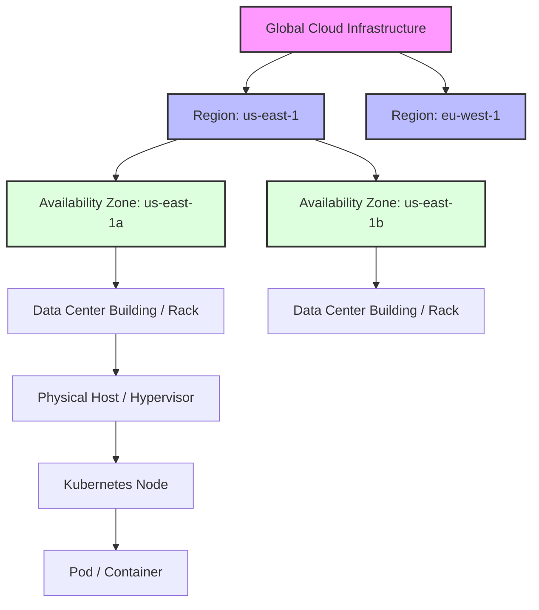
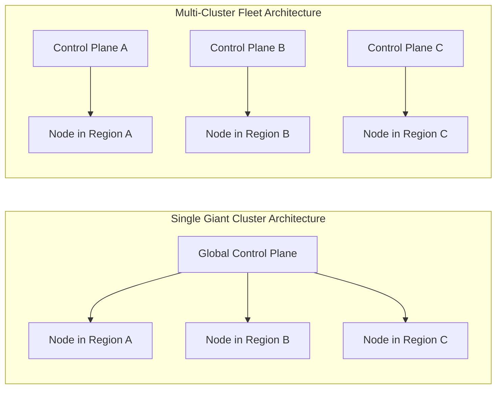
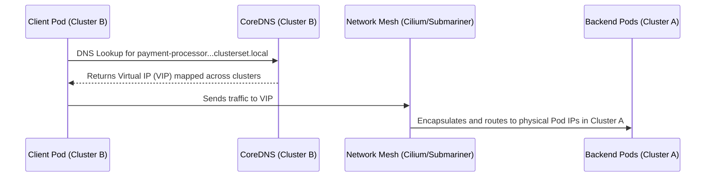

> **Complexity**: `[COMPLEX]`
>
> **Time to Complete**: 3 hours
>
> **Prerequisites**: [Module 4.1: Managed vs Self-Managed Kubernetes](../module-4.1-managed-vs-selfmanaged/)
>
> **Track**: Cloud Architecture Patterns

## What You'll Be Able to Do

After completing this module, you will be able to:

- **Design multi-cluster architectures for fault isolation, regulatory compliance, and team autonomy across regions**
- **Implement cross-cluster service discovery and traffic routing using service mesh or DNS-based approaches**
- **Configure cluster federation patterns for workload placement, failover, and capacity management**
- **Evaluate single-cluster vs multi-cluster tradeoffs for latency, blast radius, and operational complexity**
- **Diagnose network partitions and state synchronization issues in geographically distributed Kubernetes fleets**

---

## Why This Module Matters

**October 25, 2021. Facebook (now Meta).**

At 15:39 UTC, a routine maintenance command issued to Facebook's backbone routers went wrong. The command was intended to assess the capacity of the backbone network. Instead, it disconnected every Facebook data center from the internet simultaneously. Not gradually. Not region by region. All at once.

BGP routes for Facebook, Instagram, WhatsApp, and Oculus were withdrawn from the global routing table. DNS servers, now unreachable, started returning SERVFAIL. Within minutes, 3.5 billion people lost access to the services they used for communication, business, and (in some countries) emergency coordination. Facebook's own engineers couldn't access internal tools to diagnose the problem because those tools ran on the same infrastructure. They had to physically drive to data centers and manually reconfigure routers.

The outage lasted nearly six hours. Revenue impact: approximately $65 million. Market cap loss during the outage: $48 billion. WhatsApp-dependent businesses in India, Brazil, and Southeast Asia lost an entire day of commerce.

The root cause wasn't a hardware failure or a cyberattack. It was a single-cluster, single-plane-of-control architecture where one bad command could reach every region simultaneously. There was no blast radius containment. No regional isolation. No independent failure domain that could keep operating while the rest recovered.

This module teaches you how to design architectures where that can't happen. You'll learn to think in failure domains, route traffic across regions, manage state across distance, and build systems where the worst-case scenario is a regional degradation -- not a global outage.

---

## Failure Domains: The Foundation of Multi-Cluster Design

Before you can design a multi-cluster architecture, you need to understand failure domains -- the boundaries within which a failure is contained.

Think of failure domains like bulkheads on a ship. A breach in one compartment doesn't sink the ship because the bulkheads contain the flooding. In cloud infrastructure, failure domains work the same way: a failure within one domain shouldn't propagate to others. 

In a Kubernetes environment, failure domains exist at multiple overlapping layers, spanning physical infrastructure, network topology, and logical control planes. To build truly resilient systems, an architect must ensure that no single point of failure can bridge multiple failure domains.

### The Cloud Failure Domain Hierarchy



When deploying a Kubernetes cluster, the control plane components (API server, controller manager, scheduler, and most importantly, etcd) dictate your logical failure domain. If the control plane fails, the entire cluster -- regardless of how many physical availability zones it spans -- becomes unmanageable. 

This introduces the concept of the **Blast Radius**. The blast radius defines the total number of systems, services, and users impacted if a specific failure domain goes offline. A single massive Kubernetes cluster spanning an entire organization has an organizational-level blast radius. A rogue controller, a malicious deployment, or a catastrophic etcd corruption will take down every workload.

> **Stop and think**: If an AWS Availability Zone goes offline, what happens to a single Kubernetes cluster that spans three AZs but has its entire etcd quorum running on nodes within the failed AZ?

If etcd loses quorum, the API server becomes strictly read-only, and eventually unresponsive. The scheduler cannot place new pods. Existing pods will continue to run, but any node failures or pod crashes cannot be remediated. The cluster is effectively paralyzed until quorum is restored. This highlights why distributing control plane nodes across distinct physical failure domains is critical -- but it also illustrates why a single control plane is itself a single logical failure domain.

---

## Evaluating Tradeoffs: Single Giant Cluster vs. Many Smaller Clusters

The most fundamental architectural decision you will make in modern platform engineering is selecting your cluster scaling strategy. Should you build one massive, multi-tenant cluster, or should you provision dozens (or hundreds) of smaller, purpose-built clusters?

### The Single Giant Cluster

In the early days of Kubernetes, organizations defaulted to building a single, monolithic cluster. The logic was sound: managing one control plane is easier than managing twenty. You pay the cloud provider fee once. You install your monitoring agents, logging sidecars, and ingress controllers exactly once. 

However, as usage scales, the "Single Giant Cluster" anti-pattern emerges, revealing severe limitations:

1. **Scalability Ceilings**: Kubernetes v1.35 officially supports up to 5,000 nodes and 150,000 pods. While these numbers seem massive, large enterprises hit these limits through microservice sprawl and aggressive auto-scaling.
2. **The "Noisy Neighbor" Problem**: A misconfigured deployment in one namespace can exhaust the API server's rate limits, starving other namespaces of control plane resources.
3. **Hard Multi-Tenancy is Impossible**: Kubernetes is fundamentally a soft multi-tenant system. A kernel panic on a shared node, or a container escape vulnerability, compromises all workloads on that physical host, regardless of namespace isolation.

### The Fleet Architecture (Multi-Cluster)

Modern architectures favor "Fleet Management" -- deploying many isolated clusters. This approach aligns with the **Cell-Based Architecture** pattern, where infrastructure is divided into self-contained, independent cells. 



#### War Story: The Stretching of Cluster 9

A financial technology company attempted to run a single stretched Kubernetes cluster across three AWS regions (us-east-1, us-west-2, and eu-central-1) to achieve "global high availability." They reasoned that if one region went down, the pods would simply be rescheduled in another region.

They successfully provisioned the master nodes, placing one etcd member in each region. The cluster came alive. Then, they deployed their first application. Within minutes, the API server became completely unresponsive. Pods were stuck in `Pending`. Why?

etcd relies on the Raft consensus algorithm, requiring a strict quorum for every write operation. Raft requires extremely low-latency network connections (typically under 10 milliseconds) to maintain heartbeats and elect leaders. The latency between us-east-1 and eu-central-1 was over 90 milliseconds. The etcd nodes constantly missed heartbeats, assumed the leader was dead, and initiated endless leader elections. The cluster spent 100 percent of its time trying to elect a leader and zero percent of its time serving API requests. 

**The Lesson:** Never stretch a single Kubernetes control plane across a high-latency Wide Area Network (WAN). Multi-region deployments require multi-cluster architectures.

### Tradeoff Comparison

| Architectural Dimension | Single Giant Cluster | Multi-Cluster Fleet |
| :--- | :--- | :--- |
| **Blast Radius** | Massive. One catastrophic failure takes down the entire organization. | Small. Failures are contained to specific regions, tenants, or environments. |
| **Operational Overhead** | Low initially, but becomes increasingly complex due to RBAC and policy conflicts. | High. Requires advanced GitOps tooling to manage fleet state consistently. |
| **Cost Efficiency** | High. Compute resources are shared and bin-packed efficiently. | Lower. Multiple control plane fees and duplicated system overhead (logging agents). |
| **Security/Compliance** | Soft isolation via Namespaces and NetworkPolicies. Fails strict PCI-DSS physical isolation requirements. | Hard isolation. Distinct control planes and separate physical nodes per tenant. |

---

## Cross-Cluster Service Discovery and Traffic Routing

When you adopt a multi-cluster architecture, a new challenge immediately arises: How does a microservice in Cluster A talk to a microservice in Cluster B?

In a single cluster, the internal DNS (CoreDNS) resolves `my-service.my-namespace.svc.cluster.local` seamlessly. When workloads span multiple clusters, that local DNS resolution boundary is broken. 

### Pattern 1: API Gateway and Ingress Chaining

The simplest approach is to treat external clusters as standard internet clients. Cluster A routes traffic out of its network, through the public internet or transit gateway, and into Cluster B's public Ingress Controller. 

While easy to implement, this pattern suffers from high latency, complex TLS certificate management, and a massive security footprint, as internal microservices are exposed via external ingress points.

### Pattern 2: Multi-Cluster Services (MCS) API

The Kubernetes Multi-Cluster Services (MCS) API is the modern, native standard for cross-cluster service discovery. It introduces two custom resources: `ServiceExport` and `ServiceImport`.

When you create a `ServiceExport` in Cluster A, a fleet controller automatically generates a corresponding `ServiceImport` in Cluster B. CoreDNS is then configured to resolve a new domain topology: `clusterset.local`.

```yaml
# Deployed in Cluster A (us-east)
apiVersion: multicluster.x-k8s.io/v1alpha1
kind: ServiceExport
metadata:
  name: payment-processor
  namespace: finance
---
# Automatically generated in Cluster B (us-west) by the MCS controller
apiVersion: multicluster.x-k8s.io/v1alpha1
kind: ServiceImport
metadata:
  name: payment-processor
  namespace: finance
spec:
  type: ClusterSetIP
  ports:
  - port: 8443
    protocol: TCP
```

A pod in Cluster B can now resolve `payment-processor.finance.svc.clusterset.local`. The MCS implementation (like GKE Multi-cluster Services or open-source Submariner) programs the underlying network to route the packets directly to the pod IPs in Cluster A, completely bypassing external ingress controllers.



> **Pause and predict**: If you export a service from Cluster A to Cluster B using the MCS API, but the physical WAN link between the two clusters drops, what will the endpoints in Cluster B resolve to, and how will the client handle it?

During a network partition, the `ServiceImport` endpoints will still resolve via CoreDNS, because DNS records are cached locally. However, the actual packets sent to those IPs will be dropped by the network mesh. This is why cross-cluster calls must implement aggressive client-side timeouts and circuit breakers; DNS resolution does not guarantee physical reachability.

### Pattern 3: Multi-Cluster Service Mesh (Istio)

For advanced traffic routing (e.g., "route 80 percent of traffic locally, and 20 percent to the remote cluster"), architects rely on a Service Mesh like Istio. 

In an Istio Multi-Primary architecture, each cluster runs its own Istio control plane. The control planes exchange endpoint discovery information securely. Envoy proxies inject themselves into every pod, intercepting outbound traffic and securely tunneling it via mutual TLS (mTLS) directly to the destination pod in the remote cluster. 

This approach provides deep observability, zero-trust security, and advanced failure routing, but comes with significant operational complexity and resource overhead.

---

## Multi-Region Data and State Management

Stateless applications are easy to distribute across clusters. You simply deploy identical ReplicaSets to every region and let global DNS handle the load balancing. 

Stateful applications (databases, message queues, consensus stores) are incredibly difficult to distribute. The speed of light imposes a hard floor on latency. Synchronous data replication across regions requires waiting for the data to travel, be written, and be acknowledged before confirming the transaction to the user.

### Active-Active vs Active-Passive Architectures

1. **Active-Active (Synchronous)**: Writes can occur in any region and are immediately synchronized globally. This requires specialized, distributed SQL databases like Google Cloud Spanner or CockroachDB. These systems use advanced atomic clocks and complex consensus algorithms to manage global state. They are highly resilient but suffer from write latency penalties.
2. **Active-Passive (Asynchronous)**: All writes are directed to a primary cluster (e.g., us-east). Data is asynchronously replicated to a standby cluster (e.g., eu-west). If the primary fails, the standby is promoted. This is vastly simpler to implement but introduces data loss risk (Recovery Point Objective > 0) during a hard failover.

When deploying StatefulSets in a multi-cluster environment, they must be localized. Never attempt to stretch a single StatefulSet (like a Kafka cluster or a MongoDB replica set) across multiple Kubernetes clusters using cross-cluster networking unless the database engine explicitly supports high-latency WAN clustering. Instead, deploy separate StatefulSets in each cluster and utilize the database's native asynchronous replication tools to sync the state.

---

## Fleet Management and GitOps

Managing one Kubernetes cluster via manual `kubectl apply` commands is risky. Managing fifty clusters manually is operational suicide. 

To maintain consistency, security, and predictability across a fleet, architects must adopt GitOps. The entire desired state of the fleet -- infrastructure, base configurations, and applications -- is defined declaratively in a Git repository. 

A GitOps controller, such as ArgoCD or Flux, runs in a dedicated management cluster (or locally within each cluster). It constantly monitors the Git repository. If the live state of a cluster diverges from the Git state, the controller automatically remediates the drift.

### The ArgoCD ApplicationSet Pattern

To deploy an application to multiple clusters simultaneously, modern GitOps relies on generators. The ArgoCD `ApplicationSet` custom resource can dynamically generate deployment manifests for every cluster that matches a specific label constraint.

```yaml
# Deployed in the Management Cluster (v1.35 compliant API usage)
apiVersion: argoproj.io/v1alpha1
kind: ApplicationSet
metadata:
  name: global-frontend-deployment
  namespace: argocd
spec:
  generators:
  - clusters:
      selector:
        matchLabels:
          environment: production
          region: us-east
  template:
    metadata:
      name: '{{name}}-frontend'
    spec:
      project: default
      source:
        repoURL: https://github.com/kubedojo/frontend-app.git
        targetRevision: HEAD
        path: manifests/base
      destination:
        server: '{{server}}'
        namespace: frontend-prod
      syncPolicy:
        automated:
          prune: true
          selfHeal: true
```

In this architecture, scaling to a new region is trivial. You provision a new Kubernetes cluster, register it with the ArgoCD management plane, and assign the label `region: us-east`. The ApplicationSet controller detects the new cluster and immediately synchronizes the frontend application to it. Zero manual intervention required.

---

## Network Architecture: Connecting Clusters

To enable native pod-to-pod communication across clusters (bypassing ingress gateways), the underlying cluster networks must be peered. 

### IP Address Management (IPAM) Collisions

The most frequent architectural failure in multi-cluster networking is overlapping CIDR blocks. When provisioning a cluster, you must define the Pod CIDR (the IP range assigned to containers) and the Service CIDR (the IP range assigned to ClusterIP services).

If Cluster A uses `10.0.0.0/16` for pods, and Cluster B uses `10.0.0.0/16` for pods, they can never be peered. A router receiving a packet destined for `10.0.5.5` will not know which cluster holds the destination pod.

Before deploying a fleet, you must establish an enterprise IPAM registry, ensuring every cluster receives a globally unique, non-overlapping subnet. 

### Cilium Cluster Mesh

Standard Container Network Interfaces (CNIs) like Flannel or Calico are designed for single clusters. Modern ebpf-based CNIs, particularly Cilium, offer a feature called Cluster Mesh.

Cilium Cluster Mesh securely connects multiple Kubernetes clusters into a single unified network routing plane. By exchanging endpoint identity data securely between control planes, a pod in Cluster A can address a pod in Cluster B by its direct IP address, and Cilium will handle the cross-cluster routing, network policy enforcement, and encryption transparently via IPsec or WireGuard tunnels.

```mermaid
graph TD
    subgraph Cluster A (us-east)
        PodA[Frontend Pod] --> CiliumA[Cilium eBPF Datapath]
    end
    
    subgraph Cluster B (us-west)
        CiliumB[Cilium eBPF Datapath] --> PodB[Backend Pod]
    end
    
    CiliumA <==>|Encrypted WireGuard Tunnel| CiliumB
    CiliumA -.->|Identity Sync| CiliumB
```

---

## Did You Know?

- On June 8, 2021, Fastly experienced a global outage affecting 85% of its network due to a single configuration change pushed globally, underscoring the extreme danger of global, single-plane-of-control architectures without blast radius isolation.
- The Multi-Cluster Services (MCS) API was introduced as an Alpha feature in Kubernetes v1.20 and has since become the defacto standard for cross-cluster DNS resolution in production fleets running v1.35.
- Operating a multi-cluster fleet increases baseline infrastructure costs significantly; managing redundant control planes on cloud providers like EKS or GKE can add approximately $850 per cluster annually in baseline fees alone, before computing resources are consumed.
- Kubernetes scalability limits officially test up to 5,000 nodes and 150,000 pods per cluster. However, organizations with massive scale adopt multi-cluster architectures long before hitting physical compute limits to mitigate configuration sprawl and strict network policy constraints.

---

## Common Mistakes

| Mistake | Why | Fix |
| :--- | :--- | :--- |
| Stretching a single cluster across a WAN | etcd requires <10ms latency for Raft consensus. WAN latency causes continuous leader election failures, rendering the control plane unusable. | Provision dedicated, autonomous control planes for each physical region and utilize federation logic for higher-level orchestration. |
| Overlapping Pod/Service CIDRs | If you later decide to peer cluster networks using a CNI mesh or VPC peering, overlapping IP ranges cause unresolvable network collisions. | Implement a strict IP Address Management (IPAM) registry to assign globally unique CIDRs per cluster during infrastructure provisioning. |
| Hardcoding external IPs for cluster-to-cluster traffic | Ephemeral external IPs change upon service recreation, leading to brittle cross-cluster dependencies that break silently. | Utilize the Multi-Cluster Services (MCS) API or a dedicated Service Mesh to manage dynamic service discovery and virtual IPs. |
| Manual application deployments across the fleet | Humans making manual `kubectl apply` calls across dozens of clusters inevitably make typos, resulting in configuration drift and unpredictable failover. | Implement a GitOps control plane (like ArgoCD ApplicationSets or Flux) to enforce consistent state across the entire fleet declaratively. |
| Synchronous database replication across regions | The speed of light imposes rigid latency floors. Synchronous writes across oceans will destroy application performance and throughput. | Architect applications for asynchronous multi-region replication, or design regional active-passive data silos. |
| Ignoring cross-region data transfer egress costs | Cloud providers charge heavily for data leaving a region. Chatty microservices spanning regions will generate massive, unexpected cloud bills. | Constrain highly communicative microservices to the same cluster/region. Only send aggregated telemetry or critical state updates across the WAN. |
| Failing to test regional failover capacity | Assuming a secondary region can handle failover traffic without load testing often results in cascading failures when the secondary cluster is overwhelmed. | Implement routine chaos engineering; proactively drain production clusters to validate failover capacity and load balancing logic. |

---

## Hands-On Exercise: Building a Multi-Cluster Fleet

In this exercise, you will deploy two isolated Kubernetes clusters locally, configure non-overlapping CIDR blocks, and deploy an application across both using GitOps principles.

<details>
<summary><strong>Task 1: Bootstrap Two Independent Clusters</strong></summary>

**Goal:** Create two distinct clusters using `kind` (Kubernetes IN Docker) with strict, non-overlapping Pod and Service CIDR ranges. Target version v1.35.

**Solution:**
Create a configuration file for Cluster 1 (us-east):
```yaml
# cluster1-config.yaml
kind: Cluster
apiVersion: kind.x-k8s.io/v1alpha4
name: us-east-cluster
networking:
  podSubnet: "10.10.0.0/16"
  serviceSubnet: "10.11.0.0/16"
```

Create a configuration file for Cluster 2 (us-west):
```yaml
# cluster2-config.yaml
kind: Cluster
apiVersion: kind.x-k8s.io/v1alpha4
name: us-west-cluster
networking:
  podSubnet: "10.20.0.0/16"
  serviceSubnet: "10.21.0.0/16"
```

Bootstrap the clusters:
```bash
kind create cluster --config cluster1-config.yaml --image kindest/node:v1.35.0
kind create cluster --config cluster2-config.yaml --image kindest/node:v1.35.0
```
Verify both contexts are available: `kubectl config get-contexts`
</details>

<details>
<summary><strong>Task 2: Configure Cross-Cluster Contexts</strong></summary>

**Goal:** Validate that you can issue commands seamlessly to both failure domains without mixing configurations.

**Solution:**
Set aliases for rapid context switching:
```bash
alias k-east="kubectl --context kind-us-east-cluster"
alias k-west="kubectl --context kind-us-west-cluster"
```
Verify the nodes and IP allocations:
```bash
k-east get nodes -o wide
k-west get nodes -o wide
```
Confirm that the internal IPs for the nodes fall into completely separate subnets, ensuring no collisions exist if a mesh were applied.
</details>

<details>
<summary><strong>Task 3: Install a GitOps Controller (ArgoCD)</strong></summary>

**Goal:** Transform the `us-east` cluster into a management plane by installing ArgoCD.

**Solution:**
```bash
k-east create namespace argocd
k-east apply -n argocd -f https://raw.githubusercontent.com/argoproj/argo-cd/stable/manifests/install.yaml
```
Wait for the pods to initialize:
```bash
k-east wait --for=condition=Ready pods --all -n argocd --timeout=300s
```
</details>

<details>
<summary><strong>Task 4: Register the Remote Cluster</strong></summary>

**Goal:** Add the `us-west` cluster to ArgoCD's management scope so it can deploy applications remotely.

**Solution:**
Extract the ArgoCD initial admin password:
```bash
k-east -n argocd get secret argocd-initial-admin-secret -o jsonpath="{.data.password}" | base64 -d
```
Port-forward the ArgoCD server (in a separate terminal):
```bash
k-east port-forward svc/argocd-server -n argocd 8080:443
```
Login using the ArgoCD CLI (assuming it is installed locally):
```bash
argocd login localhost:8080 --username admin --insecure
```
Add the `us-west` cluster context to ArgoCD:
```bash
argocd cluster add kind-us-west-cluster --yes
```
</details>

<details>
<summary><strong>Task 5: Deploy a Cross-Cluster Application</strong></summary>

**Goal:** Use ArgoCD to deploy a basic Nginx web server simultaneously to both clusters.

**Solution:**
Create an application manifest that targets both clusters iteratively (simulating an ApplicationSet for simplicity in this lab):

```yaml
# multi-deploy.yaml
apiVersion: argoproj.io/v1alpha1
kind: Application
metadata:
  name: nginx-east
  namespace: argocd
spec:
  project: default
  source:
    repoURL: https://github.com/argoproj/argocd-example-apps.git
    targetRevision: HEAD
    path: guestbook
  destination:
    server: https://kubernetes.default.svc
    namespace: default
  syncPolicy:
    automated: {}
---
apiVersion: argoproj.io/v1alpha1
kind: Application
metadata:
  name: nginx-west
  namespace: argocd
spec:
  project: default
  source:
    repoURL: https://github.com/argoproj/argocd-example-apps.git
    targetRevision: HEAD
    path: guestbook
  destination:
    name: kind-us-west-cluster
    namespace: default
  syncPolicy:
    automated: {}
```
Apply the declarative configuration to the management cluster:
```bash
k-east apply -f multi-deploy.yaml
```
</details>

<details>
<summary><strong>Task 6: Validate and Test Failure Isolation</strong></summary>

**Goal:** Prove that the application is running in both clusters and test the blast radius containment by simulating a critical failure in `us-east`.

**Solution:**
Verify the pods are running in both clusters:
```bash
k-east get pods
k-west get pods
```
Simulate a catastrophic control plane failure in the primary region by stopping the Docker container running the `us-east` cluster:
```bash
docker stop us-east-cluster-control-plane
```
Attempt to query the `us-east` cluster:
```bash
k-east get pods # This will time out and fail.
```
Query the `us-west` cluster:
```bash
k-west get pods # The workloads continue running perfectly.
```
You have successfully demonstrated blast radius isolation. The failure domain was contained entirely to `us-east`.
</details>

**Success Checklist:**
- [x] Two independent clusters deployed via `kind`.
- [x] Non-overlapping Pod and Service CIDRs validated.
- [x] ArgoCD management plane initialized.
- [x] Remote cluster registered successfully with GitOps controller.
- [x] Workloads deployed simultaneously to multiple clusters declaratively.
- [x] Blast radius containment verified through simulated node failure.

---

## Knowledge Check

Test your understanding of multi-cluster architectures with these scenario-based questions.

<details>
<summary><strong>Question 1: The Multi-Cluster Latency Dilemma</strong></summary>

**Scenario:**
You are designing a high-frequency trading application that spans AWS `us-east-1` and `eu-west-1`. You decide to deploy a single Kubernetes v1.35 cluster with control plane nodes distributed evenly across both regions to ensure the control plane survives if one region goes offline. After deployment, your API server continuously times out, and no pods can be scheduled.

**What is the architectural flaw in this design?**

A. The Kubernetes scheduler cannot assign pods across regions without the `multicluster.kubernetes.io/topology` flag enabled.
B. etcd relies on the Raft consensus algorithm which requires strict, low-latency network connections; the transatlantic latency prevents quorum.
C. The kubelet in `eu-west-1` requires a dedicated NAT gateway to communicate with the API server in `us-east-1`.
D. Cross-region clusters require the Multi-Cluster Services API to be installed before the control plane can initialize.

**Answer:**
B. etcd relies on the Raft consensus algorithm which requires strict, low-latency network connections; the transatlantic latency prevents quorum.

**Explanation:**
The foundation of a Kubernetes cluster is the etcd key-value store, which uses the Raft algorithm to maintain state consistency. Raft requires constant heartbeat messages between nodes to maintain leadership and commit writes. If network latency exceeds a few milliseconds (which is physically unavoidable across oceans), etcd nodes will miss heartbeats, assume the leader has failed, and trigger endless leader elections. This renders the entire control plane unresponsive. You must never stretch a single etcd quorum across a high-latency WAN.
</details>

<details>
<summary><strong>Question 2: Network Peering Collisions</strong></summary>

**Scenario:**
Your organization operates two autonomous Kubernetes clusters, `cluster-prod` and `cluster-analytics`. Both were provisioned with the default kubeadm Pod CIDR of `10.244.0.0/16`. You are now tasked with implementing Cilium Cluster Mesh to allow pods in `cluster-prod` to directly query database pods in `cluster-analytics`. You establish a VPN tunnel between the physical networks, but traffic between the pods fails to route.

**What is the root cause of the routing failure?**

A. Cilium Cluster Mesh requires IPSec encryption, which is blocked by default on most cloud provider VPNs.
B. The CoreDNS configuration in `cluster-prod` lacks the `clusterset.local` forwarding stub domain.
C. The overlapping Pod CIDRs cause unresolvable routing collisions, as the network cannot distinguish destination subnets.
D. The API server in `cluster-analytics` has not exposed a `ServiceExport` resource for the database.

**Answer:**
C. The overlapping Pod CIDRs cause unresolvable routing collisions, as the network cannot distinguish destination subnets.

**Explanation:**
For any two networks to exchange direct IP traffic, their subnet ranges must be distinct. When `cluster-prod` attempts to route a packet to a pod IP like `10.244.5.15` in `cluster-analytics`, the local networking stack in `cluster-prod` assumes the IP belongs to its own local network because the CIDR blocks overlap. The packet is never forwarded across the VPN tunnel. Strict IP Address Management (IPAM) is a prerequisite for any multi-cluster networking implementation.
</details>

<details>
<summary><strong>Question 3: Managing Configuration Drift</strong></summary>

**Scenario:**
You manage a fleet of 50 edge Kubernetes clusters located in retail stores. An engineer manually runs `kubectl edit deployment/payment-gateway` on cluster #32 to hot-fix a critical bug, bypassing the standard deployment pipeline. A week later, a global failover event routes traffic from cluster #31 to cluster #32, and the application crashes due to a schema mismatch introduced by the hot-fix.

**Which architectural pattern would have proactively prevented this configuration drift?**

A. Implementing the Multi-Cluster Services (MCS) API.
B. Deploying a GitOps controller like ArgoCD configured with automated drift remediation and self-healing.
C. Configuring ExternalDNS to strictly weight traffic away from degraded clusters.
D. Using StatefulSets instead of Deployments for the payment gateway.

**Answer:**
B. Deploying a GitOps controller like ArgoCD configured with automated drift remediation and self-healing.

**Explanation:**
GitOps treats a Git repository as the single source of truth for the entire cluster fleet. When an engineer makes a manual out-of-band change via `kubectl edit`, the live state of the cluster diverges from the declared state in Git. A GitOps controller configured with self-healing continuously monitors for this drift. Within seconds of the manual edit, ArgoCD would detect the discrepancy, overwrite the manual changes, and force the cluster back into compliance with the Git repository, entirely eliminating configuration drift.
</details>

<details>
<summary><strong>Question 4: Service Discovery Boundaries</strong></summary>

**Scenario:**
You have deployed a frontend application in Cluster A and a backend API in Cluster B. The frontend application is configured to reach the backend by querying the DNS name `backend-api.finance.svc.cluster.local`. Both clusters are fully functional, but the frontend application repeatedly logs `NXDOMAIN` (Non-Existent Domain) errors.

**Why is the DNS resolution failing?**

A. The `.local` top-level domain is strictly reserved for physical node resolution, not pod resolution.
B. The backend application in Cluster B has not properly configured its readiness probes.
C. The `cluster.local` DNS suffix is bounded exclusively to the internal CoreDNS instance of the local cluster; it cannot resolve across failure domains.
D. The frontend pods lack the required RBAC permissions to query the Kubernetes API server in Cluster B.

**Answer:**
C. The `cluster.local` DNS suffix is bounded exclusively to the internal CoreDNS instance of the local cluster; it cannot resolve across failure domains.

**Explanation:**
By design, the CoreDNS instance running within a Kubernetes cluster is authoritative only for services existing within that specific cluster. The suffix `svc.cluster.local` represents a hard logical boundary. To resolve services across clusters, you must implement a cross-cluster discovery mechanism, such as the Multi-Cluster Services (MCS) API, which provisions a new, distinct top-level domain (typically `clusterset.local`) designed specifically for global resolution.
</details>

<details>
<summary><strong>Question 5: Active-Passive Stateful Constraints</strong></summary>

**Scenario:**
You are migrating a monolithic Postgres database to a multi-cluster Kubernetes architecture spanning New York and London. Business requirements dictate zero data loss (RPO = 0) during a regional failure. You configure synchronous replication between the primary database in New York and the replica in London. Immediately after deployment, application latency spikes, and users complain about extreme sluggishness during checkout operations.

**Evaluate the tradeoff made in this architecture.**

A. The system traded network bandwidth for high availability, overwhelming the CNI overlay.
B. The system traded write performance (latency) for strict data consistency across a massive geographic distance.
C. The system traded pod density for compute isolation, starving the database of memory.
D. The system traded DNS resolution speed for cross-cluster security encapsulation.

**Answer:**
B. The system traded write performance (latency) for strict data consistency across a massive geographic distance.

**Explanation:**
Synchronous replication requires that every transaction committed to the primary database must travel across the network to the secondary database, be written to disk, and send an acknowledgment back before the application considers the transaction complete. The speed of light dictates that a round-trip packet between New York and London takes roughly 70 to 90 milliseconds. By enforcing synchronous replication (RPO = 0) across a high-latency WAN, you have artificially injected severe delay into every single database write, destroying application performance.
</details>

<details>
<summary><strong>Question 6: Managing Egress Costs</strong></summary>

**Scenario:**
You deploy a highly communicative microservices architecture across two distinct cloud regions, connected via a managed transit gateway. Microservice Alpha (us-east) makes hundreds of API calls per second to Microservice Beta (us-west) to validate session tokens. At the end of the month, your cloud provider bill has skyrocketed by several thousand dollars, specifically under the line item "Data Transfer Out."

**What architectural principle was violated in this design?**

A. Stateful workloads were placed on ephemeral spot instances.
B. The blast radius of the architecture was contained too tightly.
C. Chatty, high-bandwidth communication paths were allowed to cross regional WAN boundaries, incurring massive egress costs.
D. The system failed to utilize ebpf-based load balancing for internal API calls.

**Answer:**
C. Chatty, high-bandwidth communication paths were allowed to cross regional WAN boundaries, incurring massive egress costs.

**Explanation:**
Cloud providers typically do not charge for data transfer between pods within the same Availability Zone. However, data leaving an Availability Zone -- and especially data leaving a Region (Data Transfer Out / Egress) -- is billed at a premium rate. Architecting a system where chatty microservices frequently communicate across regional boundaries is a major financial anti-pattern. Workloads with heavy interdependencies must be scheduled within the same cluster and region to avoid catastrophic billing surprises.
</details>

---

## Next Module

Now that you understand how to design and distribute workloads across multiple failure domains safely, it is time to explore how we secure the perimeters of those domains. In the next module, you will learn how to implement zero-trust architectures, enforce stringent network policies, and protect your clusters from lateral movement.

**Continue to [Module 4.3: Zero-Trust Networking and Perimeter Security](../module-4.3-zero-trust/)**