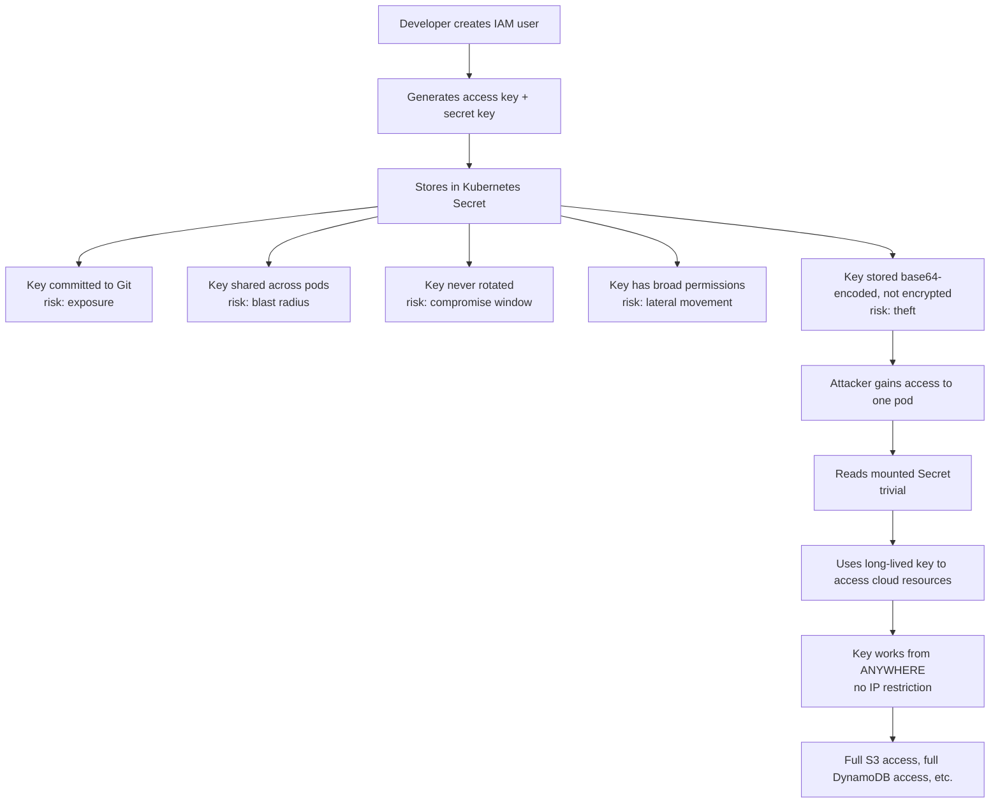
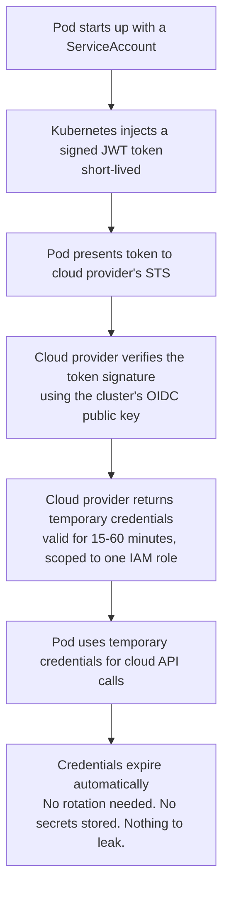
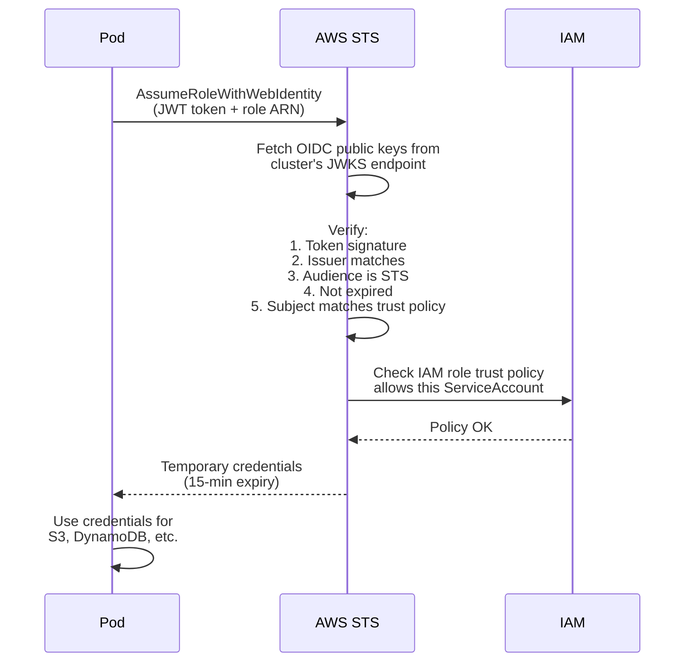
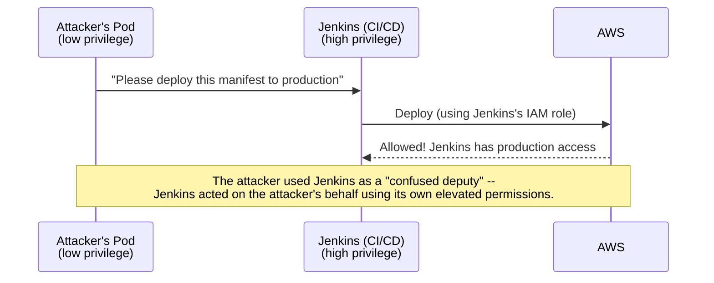
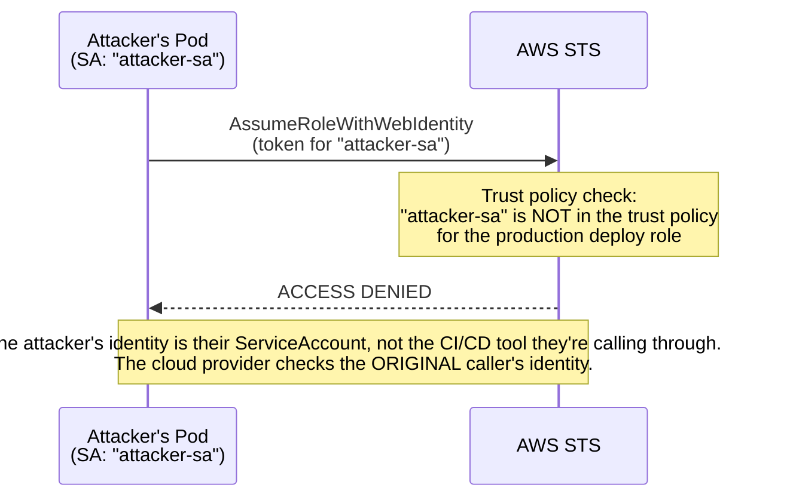

> **Complexity**: `[MEDIUM]`
>
> **Time to Complete**: 2.5 hours
>
> **Prerequisites**: [Module 4.1: Managed vs Self-Managed Kubernetes](../module-4.1-managed-vs-selfmanaged/)
>
> **Track**: Cloud Architecture Patterns

## What You Will Be Able to Do

After completing this module, you will be able to:

- **Design** pod-level identity architectures that map Kubernetes service accounts to cloud IAM roles accurately and securely.
- **Implement** least-privilege access for workloads accessing cloud services, such as object storage and databases, directly from ephemeral pods.
- **Diagnose** IAM-to-Kubernetes authentication failures across trust policy boundaries, OIDC provider configurations, and annotation misconfigurations.
- **Evaluate** the security posture of existing cluster credential management systems and migrate static secrets to ephemeral federated identities without workload downtime.

## Why This Module Matters

A team under delivery pressure might take the fast path: create an IAM user, store the access key in a Kubernetes Secret, and mount it into a pod. That approach can get a feature running quickly, but it also embeds a long-lived cloud credential directly into the workload.

If a static access key ends up in source control and carries broad permissions, it can expose far more cloud data than the workload actually needs, especially when the credential does not expire on its own. 

Revoking an embedded access key can break dependent workloads, and a review often reveals that the same static-secret pattern has spread to many services. Cleanup then turns into a costly security and operations exercise.

This is the exact problem that cloud IAM integration solves. Instead of passing static secrets around -- creating them, storing them, rotating them, and praying nobody commits them to version control -- you pass identity. The pod mathematically proves "I am the payment processor" and the cloud provider verifies the claim, returning short-lived credentials good for the next fifteen minutes. No long-lived keys. No secrets to rotate. No credentials to leak. In this module, running on modern Kubernetes v1.35+, you will learn exactly how this works, from the OpenID Connect mechanics underneath to the practical implementation on each major cloud provider.

## The Fundamental Problem: Pods Need Cloud Access

> **Stop and think**: If a pod needs to read from an S3 bucket, what's the simplest, most naïve way to give it access? What could go wrong if that access method is shared across multiple pods or committed to version control?

Almost every real-world Kubernetes workload needs to talk to managed cloud services outside the cluster. Reading from S3, publishing messages to SNS, querying DynamoDB, pulling container images from private registries, or encrypting payload data with KMS. Each of these external API calls requires rigorous authentication. The cluster boundary is not an isolation boundary; your workloads are active participants in the broader cloud ecosystem.

### The Old Way: Static Credentials

Historically, engineers treated pods like virtual machines, assigning them static identities in the form of long-lived API keys. This approach introduces massive operational and security overhead.



To understand the anti-pattern fully, examine the following configuration. This is what you should aggressively hunt down and eliminate in your clusters. Notice how the secret data is merely [base64-encoded](https://kubernetes.io/docs/concepts/configuration/secret/), offering no cryptographic protection at rest within the pod.

```yaml
# DO NOT DO THIS -- the anti-pattern
apiVersion: v1
kind: Secret
metadata:
  name: aws-credentials
  namespace: production
type: Opaque
data:
  # These are base64-encoded, NOT encrypted
  # Anyone with namespace read access can decode them
  AWS_ACCESS_KEY_ID: QUtJQVhYWFhYWFhYWFhYWA==
  AWS_SECRET_ACCESS_KEY: d0phbGpkaGZranNoZGtqZmhza2RqaGZrc2Q=
```

```yaml
apiVersion: apps/v1
kind: Deployment
metadata:
  name: data-processor
spec:
  template:
    spec:
      containers:
        - name: processor
          image: company/data-processor:v1.2
          envFrom:
            - secretRef:
                name: aws-credentials
          # This pod now has permanent cloud access
          # The key works forever, from any network
          # If this pod is compromised, so is the key
```

In the configuration above, the pod mounts the credentials directly into its environment. If the application is vulnerable to remote code execution or even a simple directory traversal attack, the attacker can quickly obtain long-lived cloud access. 

## The Evolution to Federated Identity

The industry shifted away from static credentials toward federated identity. Federated identity means the cloud provider trusts the Kubernetes cluster to authenticate its own workloads. The cluster issues a time-bound mathematical proof of identity, and the cloud provider exchanges that proof for temporary access tokens.

### The New Way: Federated Identity



This architecture brings powerful security properties:
- **Ephemeral Credentials**: Tokens are valid for a short window and expire automatically. If intercepted after expiration, they are mathematically useless.
- **Scoped Permissions**: Each pod receives access tailored explicitly to its role, severely limiting the blast radius of a compromise.
- **Stateless Operation**: No secrets exist in the cluster state or etcd. There is nothing to steal at rest.
- **Audience Restriction**: The token specifies exactly which cloud provider it is intended for, preventing replay attacks across different infrastructure boundaries.
- **Deep Auditability**: Cloud audit logs record the exact pod identity that assumed the role, providing unparalleled incident response capabilities.

## How OIDC Federation Actually Works Under the Hood

> **Pause and predict**: If the pod doesn't have a static password, how can the cloud provider trust that the pod is who it says it is? Try to mentally construct how a third party might verify a pod's identity using public/private keys before reading the flow below.

The mechanism underneath this seamless authentication is OpenID Connect (OIDC) token exchange. In modern Kubernetes environments running v1.35+, the Service Account Token Volume Projection feature is natively integrated with the kube-apiserver. Let us trace the entire cryptographic flow step by step to understand the underlying mechanics.

### Step 1: The Cluster Publishes Its Public Keys

Every Kubernetes cluster operates a Service Account Token Issuer. This issuer maintains a secure key pair. The private key signs the tokens, while the public key is hosted at a [publicly accessible OIDC discovery endpoint](https://docs.aws.amazon.com/eks/latest/userguide/iam-roles-for-service-accounts.html). The cloud provider uses this endpoint to fetch the public key and verify incoming tokens.

```bash
# Every EKS cluster has an OIDC issuer URL
aws eks describe-cluster --name production --query "cluster.identity.oidc.issuer"
# Output: "https://oidc.eks.us-east-1.amazonaws.com/id/ABCDEF1234567890"

# The OIDC discovery document is publicly accessible
curl -s https://oidc.eks.us-east-1.amazonaws.com/id/ABCDEF1234567890/.well-known/openid-configuration | jq .
# {
#   "issuer": "https://oidc.eks.us-east-1.amazonaws.com/id/ABCDEF1234567890",
#   "jwks_uri": "https://oidc.eks.us-east-1.amazonaws.com/id/ABCDEF1234567890/keys",
#   "authorization_endpoint": "...",
#   "response_types_supported": ["id_token"],
#   "subject_types_supported": ["public"],
#   "id_token_signing_alg_values_supported": ["RS256"]
# }

# The public keys (JWKS) used to verify tokens
curl -s https://oidc.eks.us-east-1.amazonaws.com/id/ABCDEF1234567890/keys | jq .
# Returns RSA public keys that can verify ServiceAccount tokens
```

When you examine the JWKS (JSON Web Key Set) endpoint, you will find the precise RSA parameters required to construct the public key. If the cluster rotates its signing keys, the JWKS document updates dynamically.

### Step 2: Kubernetes Injects a Signed Token into the Pod

When a pod is scheduled, the kubelet provisions its volume mounts. If the pod uses a ServiceAccount associated with a cloud identity, [Kubernetes projects a highly specific JSON Web Token (JWT) into the pod's filesystem](https://kubernetes.io/docs/reference/access-authn-authz/service-accounts-admin/). This JWT is cryptographically signed by the cluster's private key.

```yaml
# The ServiceAccount references an IAM role
apiVersion: v1
kind: ServiceAccount
metadata:
  name: data-processor
  namespace: production
  annotations:
    # EKS
    eks.amazonaws.com/role-arn: arn:aws:iam::123456789012:role/data-processor-role
    # GKE
    # iam.gke.io/gcp-service-account: data-processor@project.iam.gserviceaccount.com
    # AKS
    # azure.workload.identity/client-id: "12345678-abcd-efgh-ijkl-123456789012"
```

Inside the pod, the application code or the cloud SDK reads this file. The payload of this JWT contains crucial metadata asserting the pod's identity, its namespace, and its exact lifespan.

```bash
# Inside the pod, the token is mounted at a well-known path
# Let's decode it to see what's inside
cat /var/run/secrets/eks.amazonaws.com/serviceaccount/token | jwt decode -

# Decoded JWT payload:
# {
#   "aud": ["sts.amazonaws.com"],           # Audience: only valid for AWS STS
#   "exp": 1711296000,                       # Expires in 24 hours
#   "iat": 1711209600,                       # Issued at
#   "iss": "https://oidc.eks...ABCDEF",     # Issuer: this cluster's OIDC endpoint
#   "kubernetes.io": {
#     "namespace": "production",
#     "pod": {
#       "name": "data-processor-7d4b8c9f-x2k4",
#       "uid": "a1b2c3d4-..."
#     },
#     "serviceaccount": {
#       "name": "data-processor",
#       "uid": "e5f6g7h8-..."
#     }
#   },
#   "sub": "system:serviceaccount:production:data-processor"
# }
```

### Step 3: The Pod Exchanges the Token for Cloud Credentials

The cloud provider SDKs (such as boto3 for AWS) are inherently aware of these projected tokens. When the application attempts to initialize a client for a service like S3, [the SDK discovers the token file, reads the OIDC identity, and invokes the Security Token Service (STS) to request an exchange](https://docs.aws.amazon.com/eks/latest/eksctl/iamserviceaccounts.html).



### Step 4: IAM Trust Policy Controls Which Pods Get Which Roles

The final layer of security resides in the cloud provider's IAM trust policy. The cloud provider will not blindly issue credentials to any valid token; [the token's specific claims must match the conditions defined on the role](https://docs.aws.amazon.com/eks/latest/userguide/associate-service-account-role.html).

```json
{
  "Version": "2012-10-17",
  "Statement": [
    {
      "Effect": "Allow",
      "Principal": {
        "Federated": "arn:aws:iam::123456789012:oidc-provider/oidc.eks.us-east-1.amazonaws.com/id/ABCDEF1234567890"
      },
      "Action": "sts:AssumeRoleWithWebIdentity",
      "Condition": {
        "StringEquals": {
          "oidc.eks.us-east-1.amazonaws.com/id/ABCDEF1234567890:sub": "system:serviceaccount:production:data-processor",
          "oidc.eks.us-east-1.amazonaws.com/id/ABCDEF1234567890:aud": "sts.amazonaws.com"
        }
      }
    }
  ]
}
```

This trust policy forms an unbreakable access control boundary. It explicitly states: "Only the `data-processor` ServiceAccount residing in the `production` namespace of the cluster associated with this specific OIDC issuer is authorized to assume this role." No other pod, no other namespace, and no other cluster can satisfy these conditions.

## The Confused Deputy Problem

> **Stop and think**: Imagine a CI/CD tool that has permissions to deploy anything to the cluster and access any cloud resource. If an attacker compromises a low-privilege pod, how might they abuse the CI/CD tool's permissions to bypass their own restrictions?

The confused deputy problem is arguably the most critical security concept in IAM federation architecture. Failing to understand it leads directly to catastrophic privilege escalation attacks. Think of it like valet parking: you hand your keys to the valet (the deputy) to park your car. If an attacker tricks the valet into retrieving your car by faking a ticket, the valet unwittingly assists in stealing the vehicle because the valet has the authorized keys.

**WITHOUT proper scoping:**

If a cluster utilizes node-level identity or shared high-privilege roles, a low-privilege workload can leverage a higher-privilege service to act on its behalf.



**WITH pod-level identity:**

Pod-level identity neutralizes this threat by enforcing identity verification at the workload level. The cloud provider evaluates the original caller's specific token, not the intermediate deputy's inherent permissions.



The remediation is structural and straightforward: every discrete workload requires its own dedicated ServiceAccount, and each IAM role's trust policy must rigidly define which ServiceAccounts are permitted to assume it. A pod operating in the `staging` namespace will fundamentally fail to assume a role that demands the `production:data-processor` subject claim.

## Implementation: AWS (IRSA and Pod Identity)

Amazon Web Services provides two primary mechanisms for integrating Kubernetes identity. IAM Roles for Service Accounts (IRSA) is the foundational, heavily established approach. EKS Pod Identity is the more modern, significantly streamlined alternative introduced to simplify large-scale cluster management.

### IRSA Setup

Configuring IRSA involves creating the OIDC provider association and explicitly mapping the Kubernetes annotations to the IAM role.

```bash
# Step 1: Associate OIDC provider with your AWS account
eksctl utils associate-iam-oidc-provider \
  --cluster production \
  --approve

# Step 2: Create IAM role with trust policy for the ServiceAccount
aws iam create-role \
  --role-name data-processor-role \
  --assume-role-policy-document '{
    "Version": "2012-10-17",
    "Statement": [{
      "Effect": "Allow",
      "Principal": {
        "Federated": "arn:aws:iam::123456789012:oidc-provider/oidc.eks.us-east-1.amazonaws.com/id/ABCDEF1234567890"
      },
      "Action": "sts:AssumeRoleWithWebIdentity",
      "Condition": {
        "StringEquals": {
          "oidc.eks.us-east-1.amazonaws.com/id/ABCDEF1234567890:sub": "system:serviceaccount:production:data-processor",
          "oidc.eks.us-east-1.amazonaws.com/id/ABCDEF1234567890:aud": "sts.amazonaws.com"
        }
      }
    }]
  }'

# Step 3: Attach a permission policy (least privilege!)
aws iam put-role-policy \
  --role-name data-processor-role \
  --policy-name s3-read-patient-data \
  --policy-document '{
    "Version": "2012-10-17",
    "Statement": [{
      "Effect": "Allow",
      "Action": [
        "s3:GetObject",
        "s3:ListBucket"
      ],
      "Resource": [
        "arn:aws:s3:::patient-data-bucket",
        "arn:aws:s3:::patient-data-bucket/*"
      ]
    }]
  }'
```

Once the IAM side is established, you apply the annotation to your Kubernetes ServiceAccount and assign it to the pod template. Notice that the deployment specification completely lacks environment variables for access keys.

```yaml
# Step 4: Create ServiceAccount with role annotation
apiVersion: v1
kind: ServiceAccount
metadata:
  name: data-processor
  namespace: production
  annotations:
    eks.amazonaws.com/role-arn: arn:aws:iam::123456789012:role/data-processor-role
```

```yaml
# Step 5: Use the ServiceAccount in your Deployment
apiVersion: apps/v1
kind: Deployment
metadata:
  name: data-processor
  namespace: production
spec:
  replicas: 3
  selector:
    matchLabels:
      app: data-processor
  template:
    metadata:
      labels:
        app: data-processor
    spec:
      serviceAccountName: data-processor  # This is the key line
      containers:
        - name: processor
          image: company/data-processor:v1.2
          # No AWS_ACCESS_KEY_ID needed!
          # No AWS_SECRET_ACCESS_KEY needed!
          # The AWS SDK automatically uses the projected token
```

### EKS Pod Identity (Newer, Simpler)

EKS Pod Identity simplifies the trust relationship profoundly. You no longer need to manage OIDC provider setup or complex trust policies per cluster. The association is handled directly by the EKS control plane API.

```bash
# Pod Identity simplifies the trust relationship
# No OIDC provider setup needed per cluster

# Step 1: Install the Pod Identity Agent add-on
aws eks create-addon \
  --cluster-name production \
  --addon-name eks-pod-identity-agent

# Step 2: Create the association directly
aws eks create-pod-identity-association \
  --cluster-name production \
  --namespace production \
  --service-account data-processor \
  --role-arn arn:aws:iam::123456789012:role/data-processor-role
```

## Implementation: GCP (Workload Identity)

Google Cloud Platform relies on Workload Identity, which maps Kubernetes ServiceAccounts directly to Google Cloud Service Accounts (GSA). The architecture [intercepts metadata server calls](https://cloud.google.com/kubernetes-engine/docs/concepts/workload-identity) to inject the correct identity tokens.

```bash
# Step 1: Enable Workload Identity on the cluster (if not already)
gcloud container clusters update production \
  --region us-central1 \
  --workload-pool=my-project.svc.id.goog

# Step 2: Create a GCP service account
gcloud iam service-accounts create data-processor \
  --display-name="Data Processor K8s Workload"

# Step 3: Grant the GCP SA access to resources
gcloud projects add-iam-policy-binding my-project \
  --member="serviceAccount:data-processor@my-project.iam.gserviceaccount.com" \
  --role="roles/storage.objectViewer" \
  --condition="expression=resource.name.startsWith('projects/_/buckets/patient-data'),title=patient-data-only"

# Step 4: Bind K8s SA to GCP SA
gcloud iam service-accounts add-iam-policy-binding \
  data-processor@my-project.iam.gserviceaccount.com \
  --role roles/iam.workloadIdentityUser \
  --member "serviceAccount:my-project.svc.id.goog[production/data-processor]"
```

The Kubernetes ServiceAccount configuration in GCP relies on [the specific `iam.gke.io` annotation](https://cloud.google.com/kubernetes-engine/docs/how-to/workload-identity?hl=en) to forge the link between the cluster entity and the GSA.

```yaml
# Step 5: Annotate the Kubernetes ServiceAccount
apiVersion: v1
kind: ServiceAccount
metadata:
  name: data-processor
  namespace: production
  annotations:
    iam.gke.io/gcp-service-account: data-processor@my-project.iam.gserviceaccount.com
```

## Implementation: Azure (Workload Identity)

Microsoft Azure utilizes Azure AD Workload Identity, integrating Kubernetes OIDC with Azure Active Directory federated credentials. This [replaces the deprecated AAD Pod Identity project](https://learn.microsoft.com/en-us/azure/aks/use-azure-ad-pod-identity).

```bash
# Step 1: Enable Workload Identity on the cluster
az aks update \
  --resource-group production-rg \
  --name production \
  --enable-oidc-issuer \
  --enable-workload-identity

# Step 2: Get the OIDC issuer URL
OIDC_ISSUER=$(az aks show \
  --resource-group production-rg \
  --name production \
  --query "oidcIssuerProfile.issuerUrl" -o tsv)

# Step 3: Create a managed identity
az identity create \
  --name data-processor-identity \
  --resource-group production-rg

CLIENT_ID=$(az identity show \
  --name data-processor-identity \
  --resource-group production-rg \
  --query "clientId" -o tsv)

# Step 4: Create federated credential
az identity federated-credential create \
  --name data-processor-fed \
  --identity-name data-processor-identity \
  --resource-group production-rg \
  --issuer "$OIDC_ISSUER" \
  --subject "system:serviceaccount:production:data-processor" \
  --audiences "api://AzureADTokenExchange"

# Step 5: Grant access to Azure resources
az role assignment create \
  --assignee "$CLIENT_ID" \
  --role "Storage Blob Data Reader" \
  --scope "/subscriptions/.../resourceGroups/.../providers/Microsoft.Storage/storageAccounts/patientdata"
```

In AKS, you apply the client ID directly to the ServiceAccount and label it appropriately so [the mutating admission webhook injects the necessary environment variables into the pod](https://learn.microsoft.com/en-us/azure/aks/workload-identity-overview).

```yaml
apiVersion: v1
kind: ServiceAccount
metadata:
  name: data-processor
  namespace: production
  annotations:
    azure.workload.identity/client-id: "12345678-abcd-efgh-ijkl-123456789012"
  labels:
    azure.workload.identity/use: "true"
```

## Auditing Cloud API Calls Back to Pods

One of the most powerful and often overlooked benefits of federated identity is forensic auditability. Cloud audit logs record the assumed role used by a workload, and some platforms can attach extra session context that helps correlate activity back to Kubernetes identities.

```bash
# AWS CloudTrail: Find all S3 calls made by the data-processor pod
aws cloudtrail lookup-events \
  --lookup-attributes AttributeKey=ResourceType,AttributeValue=AWS::S3::Object \
  --query 'Events[?contains(CloudTrailEvent, `data-processor`)].CloudTrailEvent' \
  --output text | jq -r '
    select(.userIdentity.type == "AssumedRole") |
    {
      time: .eventTime,
      action: .eventName,
      resource: .requestParameters.bucketName,
      role: .userIdentity.arn,
      sourceIP: .sourceIPAddress,
      sessionIssuer: .userIdentity.sessionContext.sessionIssuer.userName
    }
  '

# Example output:
# {
#   "time": "2026-03-24T10:15:23Z",
#   "action": "GetObject",
#   "resource": "patient-data-bucket",
#   "role": "arn:aws:sts::123456789012:assumed-role/data-processor-role/...",
#   "sourceIP": "10.0.42.17",
#   "sessionIssuer": "data-processor-role"
# }
```

Combining cloud audit logs with Kubernetes audit and event data can give you a detailed investigation trail from workload identity to cloud API activity. Compare this forensic depth to the archaic static key approach, where the audit log cryptically shows "IAM user data-processor-user" with zero context regarding which cluster, namespace, or pod actually initiated the request.

### Cross-Referencing with Kubernetes Audit Logs

To build an end-to-end incident timeline, you can cross-reference the cloud provider logs with the Kubernetes cluster audit logs.

```bash
# Kubernetes audit log shows which user/SA created the pod
# Combined with CloudTrail, you get end-to-end traceability:
#
# 1. Developer "alice@company.com" deploys data-processor (K8s audit)
# 2. Pod "data-processor-7d4b8c9f" starts (K8s events)
# 3. Pod assumes role "data-processor-role" (CloudTrail)
# 4. Pod reads "patient-data-bucket/file.json" (CloudTrail)
#
# Full chain: Human → Deployment → Pod → Cloud Resource
```

## Least Privilege at the Pod Level

> **Pause and predict**: If we use short-lived tokens, what happens if an attacker steals the token file from the pod's filesystem? Can they use it from their laptop outside the cloud environment? How would you design a policy to prevent that?

The principle of least privilege mandates that each pod must possess only the permissions strictly necessary to execute its function, and absolutely nothing more. The following practices are non-negotiable for production environments.

### One ServiceAccount Per Workload

Never share ServiceAccounts. Sharing identities defeats the purpose of granular access control and expands the blast radius of a breach. Additionally, always disable automatic token mounting on the default namespace account to prevent accidental token leakage to non-participating pods.

```yaml
# BAD: Shared ServiceAccount with broad permissions
# Every pod in the namespace uses "default" SA
# with a role that has S3 + DynamoDB + SQS + SNS access

# GOOD: Dedicated ServiceAccounts with minimal permissions
apiVersion: v1
kind: ServiceAccount
metadata:
  name: order-processor     # Can only write to orders DynamoDB table
  namespace: production
  annotations:
    eks.amazonaws.com/role-arn: arn:aws:iam::123456789012:role/order-processor
```

```yaml
apiVersion: v1
kind: ServiceAccount
metadata:
  name: notification-sender  # Can only publish to notifications SNS topic
  namespace: production
  annotations:
    eks.amazonaws.com/role-arn: arn:aws:iam::123456789012:role/notification-sender
```

```yaml
apiVersion: v1
kind: ServiceAccount
metadata:
  name: report-generator     # Can only read from S3 analytics bucket
  namespace: production
  annotations:
    eks.amazonaws.com/role-arn: arn:aws:iam::123456789012:role/report-generator
```

### Preventing ServiceAccount Token Theft

Even with ephemeral, short-lived tokens, an attacker compromising a pod could potentially extract the token and attempt to assume the IAM role remotely. To fortify your perimeter, append stringent network condition keys to the IAM trust policy.

```json
{
  "Version": "2012-10-17",
  "Statement": [
    {
      "Effect": "Allow",
      "Principal": {
        "Federated": "arn:aws:iam::123456789012:oidc-provider/oidc.eks.us-east-1.amazonaws.com/id/ABCDEF1234567890"
      },
      "Action": "sts:AssumeRoleWithWebIdentity",
      "Condition": {
        "StringEquals": {
          "oidc.eks.us-east-1.amazonaws.com/id/ABCDEF1234567890:sub": "system:serviceaccount:production:data-processor",
          "oidc.eks.us-east-1.amazonaws.com/id/ABCDEF1234567890:aud": "sts.amazonaws.com"
        },
        "StringEquals": {
          "aws:SourceVpc": "vpc-0abc123def456"
        }
      }
    }
  ]
}
```

Additional network-based conditions can narrow where temporary credentials are usable, but you need to validate the exact AWS condition keys and request paths that apply in your environment.

## Did You Know?

- **Older Kubernetes releases relied on long-lived ServiceAccount token Secrets.** Modern clusters use projected, time-bound tokens obtained through the TokenRequest flow instead, which reduces the operational risk of permanently mounted credentials.
- **AWS STS web identity federation is heavily used by EKS workloads.** Each request requires token validation before temporary credentials are issued.
- **The "confused deputy problem" was first described in a 1988 paper** by Norm Hardy. He used the example of a system compiler that could write to any file because it ran with elevated privileges. A malicious user tricked the compiler into overwriting the system's billing file instead of the intended output file. The same architectural flaw exists today when high-privilege services act on behalf of low-privilege callers.
- **Google's Workload Identity Federation supports many external identity providers**, including AWS, Azure, GitHub Actions, GitLab CI, and OIDC- or SAML-compatible providers. That means external automation can authenticate to Google Cloud without relying on long-lived service account keys.

## Common Mistakes

| Mistake | Why It Happens | How to Fix It |
|---------|---------------|---------------|
| Using the default ServiceAccount | Pods use "default" SA unless explicitly configured | Always create and assign dedicated ServiceAccounts. Set `automountServiceAccountToken: false` on the default SA |
| Overly broad IAM policies | Developer uses managed policy like `AmazonS3FullAccess` for convenience | Write custom policies scoped to specific resources (bucket ARN, table name) |
| Not restricting trust policy audience | Trust policy missing `aud` condition | Always include audience condition (`sts.amazonaws.com` for AWS) to prevent token reuse |
| Forgetting to test token refresh | Works initially but breaks after token expiry | Run long-lived load tests to verify the SDK refreshes tokens automatically |
| One IAM role for entire namespace | "All services in production share one role" | One role per ServiceAccount. Blast radius of a compromise is one service, not the whole namespace |
| Not auditing AssumeRole calls | CloudTrail configured but nobody reviews it | Set up alerts for unexpected AssumeRoleWithWebIdentity calls (wrong source IP, unusual time) |
| Leaving legacy token Secrets | Old non-expiring SA token Secrets still exist in cluster | Audit and delete Secrets of type `kubernetes.io/service-account-token`. Use projected tokens only |
| Skipping IP condition on trust policy | Trusting any source that presents a valid token | Add documented trust-policy conditions that match the STS request context you actually use, and test them before relying on them in production |

## Quiz

<details>
<summary>1. You've restricted RBAC access to a Kubernetes Secret containing AWS credentials so that only the cluster admin can read it via the API. However, a developer's pod still mounts this Secret to access an S3 bucket. If an attacker finds an RCE vulnerability in the developer's application, can they access the AWS credentials? Why or why not?</summary>

Yes, the attacker can access the AWS credentials. While RBAC prevents unauthorized API users from reading the Secret, the Secret is mounted as plaintext files inside the pod's filesystem. An attacker with Remote Code Execution (RCE) inside the container can simply read the mounted file contents directly from the filesystem. Because these are long-lived static credentials, the attacker can then exfiltrate them and use them from anywhere on the internet until they are manually revoked. This bypasses the API-level RBAC completely because the vulnerability exists at the workload runtime level.
</details>

<details>
<summary>2. A new pod named `payment-worker` starts up and immediately tries to read from an encrypted SQS queue. It doesn't have any AWS access keys in its environment variables. Walk through the exact cryptographic and API steps that happen behind the scenes for this pod to successfully read the queue.</summary>

First, Kubernetes injects a projected service account token (a signed JWT) into the `payment-worker` pod's filesystem, containing the pod's identity and signed by the cluster's OIDC issuer. When the pod attempts to access SQS, the AWS SDK automatically reads this token and calls the AWS STS `AssumeRoleWithWebIdentity` API. STS fetches the cluster's public keys from the OIDC discovery endpoint and cryptographically verifies the token's signature. It then checks the IAM role's trust policy to ensure the token's subject (the specific pod/service account) is authorized. Once validated, STS returns short-lived, temporary credentials that the SDK uses to complete the SQS request.
</details>

<details>
<summary>3. Your company uses a centralized backup service running in the cluster that has IAM permissions to read all S3 buckets. A developer writes a pod that asks the backup service to restore a file from a highly sensitive HR bucket, which the developer's pod normally cannot access. What security vulnerability is this, and how would configuring pod-level identity for the developer's pod change the outcome?</summary>

This scenario describes the "confused deputy" problem, where a privileged entity (the backup service) is tricked into acting on behalf of a less-privileged entity (the developer's pod). Because the backup service uses its own elevated IAM role to perform the action, the cloud provider cannot distinguish between a legitimate backup request and a malicious exploit. If the developer's pod used its own pod-level identity to interact with the cloud provider directly, its individual ServiceAccount would be evaluated against the HR bucket's IAM policies. The cloud provider would see that the developer's specific identity lacks access to the sensitive HR bucket and deny the request, effectively neutralizing the confused deputy exploit.
</details>

<details>
<summary>4. An attacker manages to exploit a directory traversal flaw in your web app and downloads the `/var/run/secrets/eks.amazonaws.com/serviceaccount/token` file. They copy this JWT to their laptop at a coffee shop and try to call `AssumeRoleWithWebIdentity`. Assuming the IAM trust policy only checks the OIDC subject and audience, will the attacker get AWS credentials? How would you modify the IAM policy to block this?</summary>

Yes, the attacker will successfully get AWS credentials in this scenario. The token is cryptographically valid and signed by the cluster, and since the trust policy only checks the subject and audience, AWS STS will accept it from any IP address. To block this, you should add a condition like `aws:SourceVpc` or `aws:SourceIp` to the IAM role's trust policy. This ensures that even if the token is stolen and exfiltrated, AWS will only allow the `AssumeRoleWithWebIdentity` call if it originates from within your organization's designated network boundary, rendering the stolen token useless at the coffee shop.
</details>

<details>
<summary>5. To save time, a platform engineer creates a single `ProdClusterRole` in AWS with access to S3, DynamoDB, and SQS. They map this role to every ServiceAccount in the `production` namespace. Months later, a vulnerability in the image resizing service is exploited. Explain the blast radius of this breach and how the incident response team will struggle to investigate it using CloudTrail.</summary>

The blast radius of this breach is massive because the compromised image resizing service now has full access to S3, DynamoDB, and SQS, even if it only legitimately needed S3. The attacker can use the shared role to laterally move and exfiltrate data from databases or manipulate message queues that have nothing to do with image processing. Furthermore, incident response will be much harder because CloudTrail logs will often show the same `ProdClusterRole` identity across many cloud API calls from the namespace. The security team will be unable to definitively distinguish which actions were performed by the compromised pod versus legitimate traffic from other services, delaying containment efforts and root cause analysis.
</details>

<details>
<summary>6. Your organization is scaling from 2 EKS clusters to 50 EKS clusters across different regions. You currently use IRSA (IAM Roles for Service Accounts). As you automate the cluster provisioning, the IAM team complains that the trust policies for your application roles are hitting size limits and becoming unmanageable. Why is this happening with IRSA, and how would migrating to EKS Pod Identity resolve this friction?</summary>

With IRSA, the IAM trust policy for a role must explicitly list the specific OIDC provider URL for every single cluster that needs to assume it. As you scale to 50 clusters, the trust policy grows significantly because you must append 50 different OIDC provider ARNs and conditions, eventually hitting IAM policy size limits and creating a maintenance nightmare. EKS Pod Identity solves this by moving the trust relationship to the EKS service itself, rather than individual cluster OIDC providers. The IAM role's trust policy only needs to trust the EKS Pod Identity principal once, and you manage the specific pod-to-role mappings via API within the EKS clusters, drastically simplifying IAM management at scale.
</details>

## Hands-On Exercise: Build a Zero-Trust Pod Identity Model

You are tasked with securing a critical microservices application that currently relies entirely on static AWS credentials. You will design and implement a zero-trust identity model using OIDC federation.

### Context

The application consists of four distinct microservices:

| Service | Cloud Resources Needed | Current Auth |
|---------|----------------------|-------------|
| `order-api` | DynamoDB (orders table, read/write) | Shared IAM user key |
| `payment-processor` | SQS (payment queue, send/receive), KMS (encrypt/decrypt) | Shared IAM user key |
| `notification-service` | SNS (notifications topic, publish only) | Shared IAM user key |
| `analytics-pipeline` | S3 (analytics bucket, read only), Athena (query) | Shared IAM user key |

All four services currently share one monolithic IAM user (`app-user`) provisioned with `AdministratorAccess`. You must dismantle this architecture securely.

### Task 1: Design the IAM Role Architecture

For each microservice, define the IAM role name, construct the trust policy, and formulate the permission policy. Strictly enforce the principle of least privilege.

<details>
<summary>Solution</summary>

```jsonc
// Role 1: order-api-role
// Trust: system:serviceaccount:production:order-api
// Permissions:
{
  "Version": "2012-10-17",
  "Statement": [{
    "Effect": "Allow",
    "Action": [
      "dynamodb:GetItem",
      "dynamodb:PutItem",
      "dynamodb:UpdateItem",
      "dynamodb:Query",
      "dynamodb:Scan"
    ],
    "Resource": [
      "arn:aws:dynamodb:us-east-1:123456789012:table/orders",
      "arn:aws:dynamodb:us-east-1:123456789012:table/orders/index/*"
    ]
  }]
}

// Role 2: payment-processor-role
// Trust: system:serviceaccount:production:payment-processor
// Permissions:
{
  "Version": "2012-10-17",
  "Statement": [
    {
      "Effect": "Allow",
      "Action": [
        "sqs:SendMessage",
        "sqs:ReceiveMessage",
        "sqs:DeleteMessage",
        "sqs:GetQueueAttributes"
      ],
      "Resource": "arn:aws:sqs:us-east-1:123456789012:payment-queue"
    },
    {
      "Effect": "Allow",
      "Action": [
        "kms:Encrypt",
        "kms:Decrypt",
        "kms:GenerateDataKey"
      ],
      "Resource": "arn:aws:kms:us-east-1:123456789012:key/payment-key-id"
    }
  ]
}

// Role 3: notification-service-role
// Trust: system:serviceaccount:production:notification-service
// Permissions:
{
  "Version": "2012-10-17",
  "Statement": [{
    "Effect": "Allow",
    "Action": "sns:Publish",
    "Resource": "arn:aws:sns:us-east-1:123456789012:notifications"
  }]
}

// Role 4: analytics-pipeline-role
// Trust: system:serviceaccount:production:analytics-pipeline
// Permissions:
{
  "Version": "2012-10-17",
  "Statement": [
    {
      "Effect": "Allow",
      "Action": ["s3:GetObject", "s3:ListBucket"],
      "Resource": [
        "arn:aws:s3:::analytics-data",
        "arn:aws:s3:::analytics-data/*"
      ]
    },
    {
      "Effect": "Allow",
      "Action": [
        "athena:StartQueryExecution",
        "athena:GetQueryResults",
        "athena:GetQueryExecution"
      ],
      "Resource": "*",
      "Condition": {
        "StringEquals": {
          "athena:workGroup": "analytics"
        }
      }
    }
  ]
}
```
</details>

### Task 2: Write the Kubernetes Manifests

Draft the Kubernetes ServiceAccount and Deployment specifications for each service to utilize your newly constructed IRSA mapping.

<details>
<summary>Solution</summary>

```yaml
# serviceaccounts.yaml
apiVersion: v1
kind: ServiceAccount
metadata:
  name: order-api
  namespace: production
  annotations:
    eks.amazonaws.com/role-arn: arn:aws:iam::123456789012:role/order-api-role
```

```yaml
apiVersion: v1
kind: ServiceAccount
metadata:
  name: payment-processor
  namespace: production
  annotations:
    eks.amazonaws.com/role-arn: arn:aws:iam::123456789012:role/payment-processor-role
```

```yaml
apiVersion: v1
kind: ServiceAccount
metadata:
  name: notification-service
  namespace: production
  annotations:
    eks.amazonaws.com/role-arn: arn:aws:iam::123456789012:role/notification-service-role
```

```yaml
apiVersion: v1
kind: ServiceAccount
metadata:
  name: analytics-pipeline
  namespace: production
  annotations:
    eks.amazonaws.com/role-arn: arn:aws:iam::123456789012:role/analytics-pipeline-role
```

```yaml
# Disable auto-mount on the default SA
apiVersion: v1
kind: ServiceAccount
metadata:
  name: default
  namespace: production
automountServiceAccountToken: false
```

```yaml
# deployments.yaml (showing order-api as example)
apiVersion: apps/v1
kind: Deployment
metadata:
  name: order-api
  namespace: production
spec:
  replicas: 3
  selector:
    matchLabels:
      app: order-api
  template:
    metadata:
      labels:
        app: order-api
    spec:
      serviceAccountName: order-api
      containers:
        - name: order-api
          image: company/order-api:v2.1
          ports:
            - containerPort: 8080
          env:
            - name: AWS_REGION
              value: "us-east-1"
            - name: DYNAMODB_TABLE
              value: "orders"
            # NO AWS_ACCESS_KEY_ID
            # NO AWS_SECRET_ACCESS_KEY
          resources:
            requests:
              cpu: 250m
              memory: 512Mi
            limits:
              cpu: "1"
              memory: 1Gi
```
</details>

### Task 3: Design the Migration Plan

You need to execute the migration from static credentials to IRSA strictly without triggering workload downtime. Document a bulletproof, phased rollout plan.

<details>
<summary>Solution</summary>

**Migration Plan: Static Credentials to IRSA (Zero Downtime)**

```text
Phase 1: Parallel Permissions (Week 1)
  - Create all 4 IAM roles with IRSA trust policies
  - Attach permission policies to each role
  - DO NOT remove the existing IAM user yet
  - Both auth methods work simultaneously

Phase 2: Rolling Migration (Week 2)
  For each service, one at a time:
  1. Create the new ServiceAccount with IRSA annotation
  2. Update the Deployment to use the new ServiceAccount
  3. Remove the envFrom referencing aws-credentials Secret
  4. Deploy with rolling update (zero downtime)
  5. Verify cloud API calls succeed (check CloudTrail)
  6. Monitor for 24 hours before moving to next service

Phase 3: Cleanup (Week 3)
  - Verify no pods still reference the old Secret
  - Delete the aws-credentials Kubernetes Secret
  - Disable the IAM user's access key (don't delete yet)
  - Wait 1 week for any stragglers

Phase 4: Decommission (Week 4)
  - Delete the IAM user's access key
  - Delete the IAM user
  - Remove AdministratorAccess policy (was attached to user)
  - Document the new architecture in runbooks
```

Key risk mitigation strategies:
- Running parallel authentication during the transition guarantees rollback is instant if issues arise (simply re-add the Secret reference to the deployment).
- Upgrading one service at a time systematically limits the potential blast radius of configuration errors.
- Enforcing a strict 24-hour monitoring window consistently catches intermittent issues before proceeding to the next target.
- Ensuring the legacy IAM user is not fully deleted until all services are confirmed functional prevents catastrophic lockouts.
</details>

### Task 4: Write an Audit Query

Engineer a CloudTrail parsing query capable of detecting anomalous cloud API access, hunting specifically for calls that might indicate a pod compromise.

<details>
<summary>Solution</summary>

```bash
# CloudTrail Insights: Detect anomalous AssumeRoleWithWebIdentity calls

# Query 1: Calls from unexpected source IPs (outside VPC)
aws cloudtrail lookup-events \
  --lookup-attributes AttributeKey=EventName,AttributeValue=AssumeRoleWithWebIdentity \
  --start-time "2026-03-23T00:00:00Z" \
  --end-time "2026-03-24T23:59:59Z" \
  --query 'Events[].CloudTrailEvent' \
  --output text | jq -r '
    select(.sourceIPAddress != null) |
    select(.sourceIPAddress | test("^10\\.") | not) |
    {
      time: .eventTime,
      sourceIP: .sourceIPAddress,
      role: .requestParameters.roleArn,
      subject: .requestParameters.roleSessionName,
      error: .errorCode
    }
  '

# Query 2: Failed AssumeRole attempts (potential probing)
aws cloudtrail lookup-events \
  --lookup-attributes AttributeKey=EventName,AttributeValue=AssumeRoleWithWebIdentity \
  --query 'Events[?contains(CloudTrailEvent, `AccessDenied`)].CloudTrailEvent' \
  --output text | jq -r '{
    time: .eventTime,
    source: .sourceIPAddress,
    attemptedRole: .requestParameters.roleArn,
    error: .errorMessage
  }'

# Query 3: Unusual API calls for a specific role
# (e.g., the order-api role calling S3 -- it shouldn't)
aws cloudtrail lookup-events \
  --lookup-attributes AttributeKey=Username,AttributeValue=order-api-role \
  --query 'Events[].CloudTrailEvent' \
  --output text | jq -r '
    select(.eventName | test("^(GetObject|PutObject|ListBucket)")) |
    {
      alert: "ORDER-API ROLE ACCESSING S3 - UNEXPECTED",
      time: .eventTime,
      action: .eventName,
      resource: .requestParameters.bucketName
    }
  '
```
</details>

### Success Criteria

- [ ] Designed one granular IAM role per service with enforced least-privilege permissions.
- [ ] Confirmed trust policies specify the exact ServiceAccount boundaries and explicitly require the correct audience parameters.
- [ ] Verified Kubernetes manifests natively consume projected tokens and definitively lack static credential environment configurations.
- [ ] Validated the `default` ServiceAccount in the target namespace has `automountServiceAccountToken` completely disabled.
- [ ] Constructed a zero-downtime migration plan utilizing parallel identity architectures.
- [ ] Deployed forensic audit queries explicitly tailored to detect anomalous token exchanges or unauthorized resource manipulation.

## Next Module

[Module 4.4: Cloud-Native Networking and VPC Topologies](../module-4.4-vpc-topologies/) -- Identity establishes *who* is allowed to access your sensitive resources. Networking dictates exactly *how* that raw traffic flows between those distinct entities. We will systematically design sophisticated VPC architectures that ensure your Kubernetes clusters remain highly connected, intrinsically secure, and deeply protected from the pervasive threat of IP exhaustion.

## Sources

- [kubernetes.io: secret](https://kubernetes.io/docs/concepts/configuration/secret/) — The Kubernetes Secrets documentation explicitly distinguishes Secret storage from simple base64 encoding and recommends stronger handling for sensitive data.
- [docs.aws.amazon.com: iam roles for service accounts.html](https://docs.aws.amazon.com/eks/latest/userguide/iam-roles-for-service-accounts.html) — The EKS IRSA documentation states that each cluster has a public OIDC discovery endpoint with signing keys for projected service account tokens.
- [kubernetes.io: service accounts admin](https://kubernetes.io/docs/reference/access-authn-authz/service-accounts-admin/) — The Kubernetes service account administration docs describe bound projected tokens, TokenRequest, default lifetimes, and pod-scoped claims.
- [docs.aws.amazon.com: iamserviceaccounts.html](https://docs.aws.amazon.com/eks/latest/eksctl/iamserviceaccounts.html) — The eksctl IRSA guide documents injection of `AWS_ROLE_ARN` and `AWS_WEB_IDENTITY_TOKEN_FILE` and notes that recent SDKs use them.
- [docs.aws.amazon.com: associate service account role.html](https://docs.aws.amazon.com/eks/latest/userguide/associate-service-account-role.html) — The EKS IRSA documentation shows trust policy examples with `sub` and `aud` conditions and explains their least-privilege role.
- [cloud.google.com: workload identity](https://cloud.google.com/kubernetes-engine/docs/concepts/workload-identity) — Google's GKE Workload Identity documentation describes the GKE metadata server and its interception of metadata requests.
- [cloud.google.com: workload identity](https://cloud.google.com/kubernetes-engine/docs/how-to/workload-identity?hl=en) — The GKE how-to guide documents both the `roles/iam.workloadIdentityUser` binding and the `iam.gke.io/gcp-service-account` annotation.
- [learn.microsoft.com: use azure ad pod identity](https://learn.microsoft.com/en-us/azure/aks/use-azure-ad-pod-identity) — The AKS pod-managed identity documentation recommends Microsoft Entra Workload ID and states the older model was deprecated.
- [learn.microsoft.com: workload identity overview](https://learn.microsoft.com/en-us/azure/aks/workload-identity-overview) — The AKS workload identity overview documents the `azure.workload.identity/client-id` annotation, required `use: true` label, and webhook mutation behavior.
