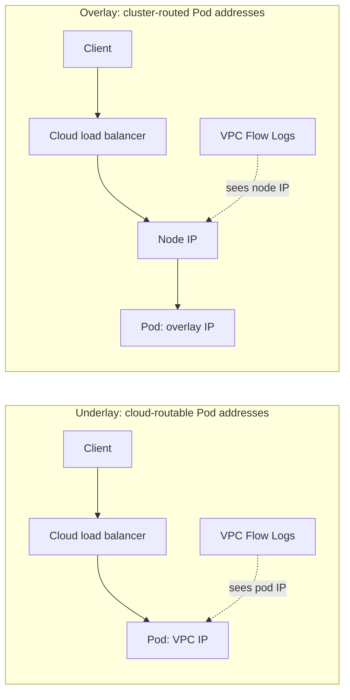
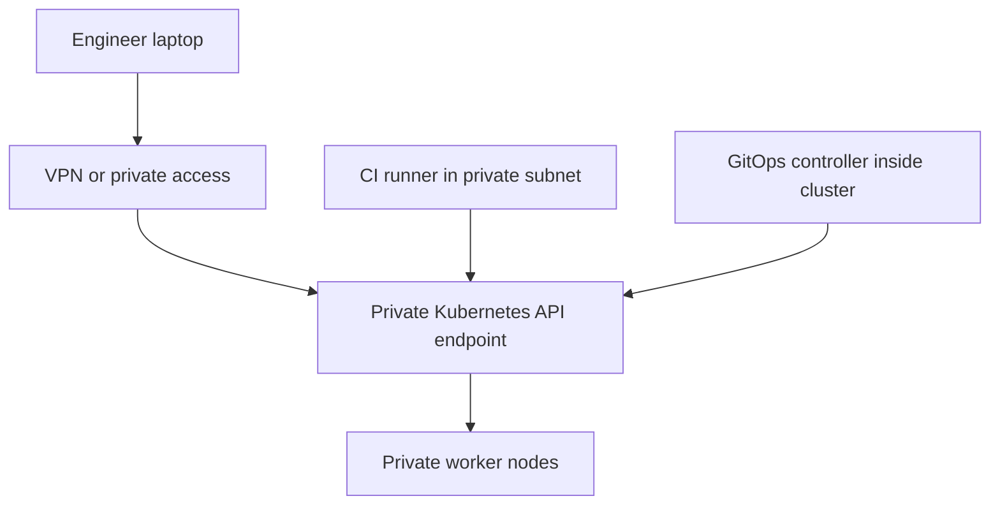
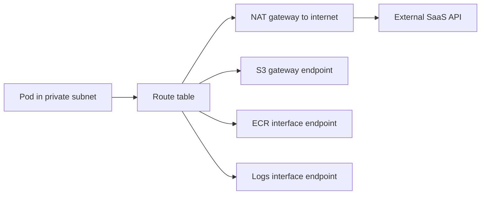
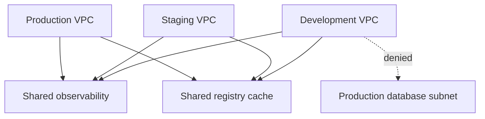

> **Complexity**: Advanced
>
> **Time to Complete**: 3-4 hours
>
> **Prerequisites**: [Module 4.1: Managed vs Self-Managed Kubernetes](../module-4.1-managed-vs-selfmanaged/), [Module 4.2: Multi-Cluster and Multi-Region Architectures](../module-4.2-multi-cluster/), VPC subnetting basics, Kubernetes Services, and route-table fundamentals.

---

## What You'll Be Able to Do

- **Design** cloud-native VPC and VNet topologies for Kubernetes clusters across availability zones, private subnets, ingress paths, and shared-service networks.
- **Diagnose** IP exhaustion by connecting pod density, node type, subnet CIDR size, service ranges, and future cluster growth.
- **Implement** private-cluster access patterns with private API endpoints, controlled administration paths, and VPC-native routing.
- **Compare** underlay and overlay CNI models by evaluating performance, IP consumption, observability, cloud integration, and portability.
- **Evaluate** egress cost and compliance tradeoffs using NAT gateways, VPC endpoints, private service access, proxies, and centralized routing.

## Why This Module Matters

Cloud networking failures rarely look like networking failures at first. A deployment may fail because Pods are stuck in `ContainerCreating`. An autoscaler may add nodes while new Pods still can not receive addresses. A private cluster may appear healthy until the release pipeline loses access to the API endpoint. A cost incident may begin as a normal-looking NAT gateway line item that grows every time a cluster pulls images, streams logs, or reads object storage. The visible symptom is usually application pain, but the root cause is often VPC topology.

Kubernetes changes the scale of IP planning. A virtual-machine application might need one address per server, while a VPC-native Kubernetes cluster can need one address per Pod, one address per node, additional addresses for load balancers, and reserved space for future expansion. That difference turns a comfortable `/24` into a production constraint. The cluster may have enough CPU and memory, but if the subnet has no remaining addresses, workloads still can not start. This is why cloud architects and platform engineers need to understand pod networking before they choose subnet sizes.

The security model also changes. In a traditional three-tier application, the main boundaries are often public subnet, private subnet, database subnet, firewall, and load balancer. In a Kubernetes platform, those boundaries still exist, but they are joined by cluster API endpoints, node pools, CNI behavior, NetworkPolicies, ingress controllers, service meshes, VPC endpoints, and cross-account or cross-project routing. A secure cluster is not only one with private nodes. It is one where administration, ingress, egress, service-to-service traffic, and cloud-service access all follow deliberate paths.

This module focuses on design reasoning rather than memorizing one provider's console. The examples use AWS terms such as VPC, EKS, NAT Gateway, VPC endpoints, and Transit Gateway, but the same design questions apply to Azure VNets and AKS, Google Cloud VPCs and GKE, and hybrid networks. The exact service names differ; the architecture questions do not. Where Kubernetes commands appear, assume Kubernetes 1.35 or newer and define the shortcut with `alias k=kubectl` before using `k`.

## Did You Know

- VPC-native pod networking can consume subnet IP addresses far faster than node-based planning suggests because every Pod may receive a routable VPC address.
- Overlay networking reduces cloud-subnet pressure, but it can move observability and enforcement away from native cloud routing, security groups, and flow logs.
- A private cluster API endpoint improves exposure posture only when administrators and CI/CD systems have a reliable private access path into the network.
- Egress design is both a security and cost decision; traffic that should stay on private cloud backbones can become expensive if it crosses NAT gateways unnecessarily.

## 1. Start With Address Space, Not Products

VPC topology starts with address space because every later decision depends on whether routes can be expressed unambiguously. A VPC CIDR must leave room for public entry points, private node subnets, load balancers, databases, endpoints, shared services, future clusters, and sometimes peering or transit routing. If the organization also has on-premises networks, partner networks, or other cloud environments, the VPC range must not overlap those networks. Overlap is not a cosmetic problem; routers can not reliably decide where to send traffic when two reachable networks claim the same destination range.

Kubernetes adds another layer to the address plan. In VPC-native designs, Pods consume addresses from node subnets or dedicated pod ranges. In overlay designs, Pods consume an internal cluster range that may not be visible to the VPC fabric. In both cases, Services consume a separate cluster range inside Kubernetes. A design document should state which address pools exist, who allocates them, how large they are, which systems route them, and what happens when the platform grows. "We will use `10.0.0.0/16`" is not a design; it is only the first number in the design.

```text
Example cloud platform address plan

Organization reserved cloud block: 10.64.0.0/12

production-vpc: 10.64.0.0/16
  public-ingress-a:       10.64.0.0/24
  public-ingress-b:       10.64.1.0/24
  private-nodes-a:        10.64.16.0/20
  private-nodes-b:        10.64.32.0/20
  private-nodes-c:        10.64.48.0/20
  endpoints-shared:       10.64.80.0/24

staging-vpc: 10.65.0.0/16
shared-services-vpc: 10.80.0.0/16
on-premises summary route: 10.0.0.0/12
```

The example deliberately leaves unused space between subnet groups. That gap is operationally useful because network designs almost always grow. Private endpoint subnets, additional node pools, regional expansion, dedicated ingress zones, inspection appliances, and shared services often appear after the first cluster succeeds. If the original VPC is packed tightly, every new requirement becomes a migration rather than a route-table change. Private RFC 1918 space is limited, but inside a properly allocated organizational plan, wasting a little local space is usually cheaper than renumbering a live platform.

## 2. Plan Kubernetes IP Consumption

The most common Kubernetes VPC planning mistake is counting nodes instead of Pods. With VPC-native networking, each Pod may receive an IP address from the VPC or from a cloud-managed secondary range. The scheduler can only place new Pods when the CNI can assign addresses. If the subnet is exhausted, adding CPU and memory capacity does not help. This creates incidents that confuse application teams because nodes appear healthy and autoscaling appears active, yet the CNI can not create network interfaces or assign Pod addresses.

AWS EKS with the Amazon VPC CNI is the classic example because Pods receive VPC IP addresses by default. The number of assignable Pod addresses depends on instance type, elastic network interface limits, IP-per-interface limits, warm IP targets, prefix delegation settings, and subnet size. A small instance with low ENI limits behaves very differently from a large instance with prefix delegation enabled. Capacity planning therefore needs both the cluster's maximum node count and the CNI's address allocation model.

```text
Subnet sizing thought process

Target:
  24 worker nodes across three availability zones
  up to 40 Pods per node
  VPC-native pod addresses
  100 percent growth headroom

Rough demand:
  24 nodes * 40 Pod addresses = 960 Pod addresses
  24 node primary addresses    = 24 node addresses
  load balancers/endpoints     = reserve additional subnet space
  growth headroom             = roughly double the planned demand

Conclusion:
  Three tiny /24 private subnets are likely too small.
  Larger per-AZ private subnets or dedicated pod ranges are safer.
```

Prefix delegation changes the arithmetic by assigning address prefixes to nodes rather than only individual secondary addresses. That can improve pod density and reduce the per-node address management bottleneck, but it does not remove the need for subnet planning. Prefixes still come from somewhere. If the subnet is small, prefix allocation can still fail. The practical lesson is to size subnets for the maximum cluster shape, not the first week's node count.

GKE and AKS use different implementation details, but the same design discipline applies. GKE VPC-native clusters use alias IP ranges for Pods and Services. Azure CNI options can assign VNet IPs to Pods or use overlay behavior depending on mode. The names differ, yet the review question is stable: where do Pod addresses come from, how many are available, how fast are they consumed, and can the architecture grow without renumbering?

## 3. Choose Underlay or Overlay Networking

An underlay model gives Pods addresses that are routable in the cloud network. Cloud load balancers, route tables, flow logs, and security controls can often see Pod addresses directly. This improves cloud-native integration and can reduce encapsulation overhead. It also means subnet planning becomes more important because every Pod consumes cloud-network address space. Underlay is usually attractive when the platform stays inside one cloud provider and wants first-class load balancer, flow-log, and security-group integration.

An overlay model gives Pods addresses inside a cluster-managed network and encapsulates traffic between nodes. The cloud network usually sees node-to-node traffic rather than every individual Pod conversation. This reduces pressure on cloud subnets and can help with multi-cloud or IP-constrained environments. The tradeoff is that cloud-native observability and enforcement may be less direct. Some troubleshooting moves from cloud tools to CNI tools because the cloud fabric sees only the outer packet.



Neither model is universally superior. Underlay favors cloud integration and performance transparency. Overlay favors portability and address conservation. Some CNIs offer hybrid options, eBPF datapaths, native routing modes, or cloud-specific integrations that blur the line. The important architectural habit is to make the tradeoff explicit. If a team chooses overlay because private address space is constrained, it should also decide how it will observe pod-level traffic, enforce policy, and expose services. If a team chooses underlay, it should show the subnet math.

| Factor | Underlay / VPC-native | Overlay / encapsulated |
|---|---|---|
| Pod address source | Cloud VPC/VNet ranges or provider-managed secondary ranges | Cluster-managed pod CIDR |
| Subnet pressure | Higher because Pods can consume cloud addresses | Lower because nodes consume cloud addresses |
| Cloud load balancer integration | Often direct to Pod IPs when supported | Often node or proxy based |
| Flow-log clarity | Cloud flow logs may show Pod addresses | Cloud flow logs usually show node tunnel traffic |
| Portability | More provider-specific | Often easier across clouds or constrained networks |
| Failure mode to watch | Subnet or prefix exhaustion | Encapsulation, MTU, CNI observability, tunnel health |

## 4. Design Private Cluster Access

A private cluster is more than private worker nodes. The cluster API endpoint, node-to-control-plane path, administrator access path, and CI/CD access path all need design. If the API endpoint is public, exposure is reduced through authentication, authorization, and source restrictions, but the endpoint remains reachable from the internet. If the endpoint is private, the exposure surface shrinks, but administrators and pipelines need private network connectivity before they can run `kubectl`, Helm, or GitOps controllers.

Private-only endpoint designs usually use a combination of VPN, private connectivity, bastion hosts, in-VPC CI runners, or GitOps agents that pull changes from inside the cluster. Each option has a different operational model. A bastion host is simple but becomes a sensitive administrative chokepoint. A VPN provides direct operator access but requires identity, device, and route management. In-VPC runners keep CI traffic private but require runner lifecycle and credential controls. GitOps agents reduce inbound access needs but still require safe outbound connectivity and strong repository controls.



Before flipping a cluster to private-only, test the administration path and rollback path. If the current `kubectl` access depends on the public endpoint and no private route exists, the team can lock itself out of routine administration. Worker nodes may continue talking to the control plane privately, but humans and pipelines may lose the ability to deploy or debug. A private endpoint is a security improvement only when the private operational path is ready.

## 5. Build Ingress Paths Deliberately

Ingress design answers how external users reach services in the cluster. In cloud-native platforms, that usually means a public or internal load balancer, a Kubernetes Service, an ingress controller, Gateway API, or a service mesh gateway. The right design depends on protocol, source IP preservation, TLS termination, WAF needs, path routing, authentication, and whether the load balancer can target Pods directly. A simple `LoadBalancer` Service may be enough for an internal TCP service, while a public HTTP API usually needs stronger L7 controls.

Gateway API improves the old Ingress model by separating infrastructure ownership from application routing. Platform teams can own GatewayClasses, Gateways, listener policy, certificates, and shared load balancers. Application teams can own HTTPRoutes that attach to approved Gateways. That separation is useful in organizations where many teams publish services but only a smaller platform group should manage public edge configuration. The design is also easier to review because route attachment, listener scope, and namespace access are explicit.

```yaml
apiVersion: gateway.networking.k8s.io/v1
kind: Gateway
metadata:
  name: shared-public-gateway
  namespace: platform-ingress
spec:
  gatewayClassName: managed-l7
  listeners:
    - name: https
      protocol: HTTPS
      port: 443
      allowedRoutes:
        namespaces:
          from: Selector
          selector:
            matchLabels:
              allow-public-gateway: "true"
```

Ingress is also a security boundary. Public services should normally pass through TLS termination, WAF or equivalent filtering, rate limiting where appropriate, and clear ownership. Internal services should not accidentally become public because a manifest copied a `LoadBalancer` type from an example. In review, ask which clients should reach the service, whether the load balancer is public or internal, where TLS terminates, which route owns the hostname, and how source restrictions are enforced.

## 6. Control Egress Cost and Compliance

Egress is the path from workloads to destinations outside the cluster. It includes package downloads, image pulls, object storage, logging APIs, managed databases, SaaS APIs, license servers, and partner integrations. Many teams design ingress carefully and leave egress to the default route table. That creates two problems: uncontrolled outbound reachability and unnecessary cost. In AWS, for example, private-subnet traffic to public AWS service endpoints may cross NAT gateways unless VPC endpoints are configured. The result can be a large data-processing bill for traffic that could have stayed private.

VPC endpoints, PrivateLink-style services, private Google access, Azure private endpoints, and equivalent features reduce unnecessary public egress. They can keep object storage, container registry, logging, secrets, and identity-service traffic on private provider networks. They can also simplify compliance because traffic does not need a public internet path. These endpoints are not free, and interface endpoints have hourly and per-AZ design considerations, but they are often much cheaper and safer than pushing high-volume internal cloud traffic through NAT.



Compliance-driven egress designs often add an explicit proxy or inspection layer. In that design, workloads may be denied general internet access and allowed to call only approved destinations through a proxy. NetworkPolicy can restrict Pods to the proxy, while cloud security groups and route tables restrict subnet-level paths. This is more complex than default NAT, but it gives security teams a place to log, filter, and review outbound traffic. The platform team should document exception processes because developers will eventually need new destinations.

## 7. Connect Multiple VPCs and Environments

Single-VPC platforms eventually grow into multi-environment networks. Development, staging, production, shared services, data platforms, security tooling, and on-premises networks may all need controlled communication. VPC peering is simple for a few networks, but it becomes hard to manage as the number of VPCs grows. Peering is also non-transitive in many clouds, which means routes do not automatically pass through one peered VPC to another. Transit routing services solve the hub-and-spoke problem but introduce cost, route-table design, and segmentation responsibilities.

```text
Number of pairwise peering connections

2 VPCs  -> 1 connection
3 VPCs  -> 3 connections
5 VPCs  -> 10 connections
10 VPCs -> 45 connections
```

Transit gateways, cloud routers, and hub networks are powerful because they centralize attachments and route policy. They are also dangerous when treated as a flat network. Production should not automatically reach every development subnet. Shared observability services may need inbound traffic from many environments, while developer sandboxes should not reach production databases. The transit layer should have route tables and segmentation rules that match the organization's trust model, not merely the network diagram.

Hybrid connectivity adds latency, bandwidth, and ownership questions. VPN can be fast to establish and suitable for management or moderate traffic. Dedicated private circuits such as Direct Connect or ExpressRoute can provide more predictable throughput and latency, but they require longer lead time and operational coordination. Kubernetes does not remove these constraints. If a service in the cluster calls a database across a high-latency hybrid link, the application must tolerate that latency no matter how elegant the Pod network is.

## 8. Operate the Network With Evidence

Network debugging should follow the packet path rather than the organizational chart. Start with the symptom: is the Pod unscheduled, Running but not Ready, unreachable through a Service, unable to resolve DNS, unable to reach an external destination, or slow under load? Each symptom points to a different layer. Pod scheduling failures may be CNI or subnet address problems. Service failures may be selector or endpoint problems. External egress failures may be DNS, route table, NAT, endpoint policy, security group, proxy, or NetworkPolicy issues.

```bash
alias k=kubectl

k get pods -A -o wide
k describe pod <pod-name> -n <namespace>
k get svc,endpoints -n <namespace>
k get networkpolicy -A
k logs -n kube-system -l k8s-app=aws-node --tail=100
```

Cloud-side evidence is just as important as Kubernetes evidence. Route tables show whether a subnet has a path to NAT, endpoints, peering, or transit. Flow logs show whether traffic reached an interface and whether it was accepted or rejected at that layer. Load balancer target health shows whether the edge can reach backend Pods or nodes. Endpoint policies show whether a private service endpoint allows the requested action. When the platform team combines Kubernetes events with cloud network evidence, incidents become much easier to isolate.

Avoid the reflex of changing security rules first. Opening `0.0.0.0/0` or disabling NetworkPolicies may hide the immediate symptom while creating a larger exposure. A better approach is to prove which boundary denied or dropped traffic. If DNS resolution fails, route-table changes will not help. If the Service has no endpoints, adding a NAT gateway will not help. If a route table points to the wrong transit attachment, restarting Pods will not help. Evidence-driven debugging is slower for the first five minutes and faster for the next five hours.

## 9. Design for Availability Zones and Failure Domains

Availability-zone design is the quiet part of VPC topology. A cluster that spans three zones but places all NAT, endpoints, or load-balancer targets in one zone is not truly zonal. Kubernetes can reschedule Pods across nodes, but it can not compensate for a route table that sends every private subnet through a single-zone dependency. If the platform claims zone resilience, the network path for ingress, egress, service endpoints, and control-plane access needs to survive the loss or isolation of one zone.

Private node subnets should usually be created per zone with consistent sizing and route-table intent. If one zone has a much smaller subnet than the others, autoscaling may fail only in that zone, and topology spread constraints may become impossible to satisfy. This creates a confusing failure mode: the cluster has free capacity in aggregate, but the scheduler is constrained by zones, Pod topology rules, storage topology, or load-balancer target health. The network design should therefore reserve enough address space per zone, not only across the whole VPC.

NAT gateway placement is a common availability and cost trap. A single NAT gateway is cheaper, but every private subnet that depends on it loses outbound internet access if that zone or NAT gateway fails. A NAT gateway in every zone improves resilience and avoids cross-zone routing for egress, but it increases hourly cost. VPC endpoints have similar placement questions: interface endpoints are created in selected subnets, and workloads in other zones may cross zones to reach them if the design is incomplete. The architecture decision should explicitly state which dependencies are zonal and why.

Load balancer target behavior also depends on zone design. If a public load balancer spans three zones but healthy Pods exist in only one zone, the system may be more fragile than the diagram suggests. Some providers and load balancers can perform cross-zone load balancing, but that may change cost and failure behavior. When reviewing ingress, ask whether each zone has enough healthy targets, whether topology spread rules support that goal, and whether the load balancer health checks match the Service and Pod readiness contract.

Stateful dependencies complicate the picture further. A database, cache, file system, or message broker may have its own zone placement and failover rules. If an application Pod moves across zones but its dependency remains single-zone, latency and data-transfer costs may change. If a PersistentVolume is bound to one zone, a Pod that needs it may not be schedulable in another zone. Kubernetes exposes some of this through volume topology and scheduling events, but the network and storage design should anticipate it before an incident.

## 10. Separate Shared Services From Workload Networks

Shared services are tempting to put directly inside production because they are required by production workloads. Observability collectors, image caches, artifact repositories, identity proxies, DNS forwarders, and security tooling all feel foundational. The problem is that their network relationships differ from application services. Many environments may need to send telemetry to shared observability. Production may need to pull images from a shared registry. Development may need access to shared test services. Those patterns are easier to reason about when shared services live in a clearly defined network zone with explicit routes.

A shared-services VPC or hub namespace does not automatically make a design secure. It gives the platform team a place to attach route tables, endpoint policies, inspection controls, and service ownership. Production might route logs to shared observability but reject inbound connections from development. Development might reach a shared package mirror but not production databases. Security tooling might receive mirrored traffic or logs but not have general lateral reach. The topology should encode those differences instead of relying on human memory.



DNS becomes important in shared-service designs. A service name that resolves differently inside development and production can help isolate environments, but it can also hide mistakes. Private hosted zones, conditional forwarding, split-horizon DNS, and service discovery need ownership. If a production workload resolves a shared endpoint to the wrong VPC, the issue may look like an application timeout. DNS records should be reviewed with the same seriousness as route tables because names are part of the network control plane.

Identity should not be inferred from network location alone. A request from a production subnet may still come from the wrong workload or an over-privileged service account. Modern cloud platforms combine network controls with workload identity, IAM conditions, endpoint policies, and application authentication. Network topology reduces the blast radius, but it should not be the only gate for sensitive shared services. The review question is: if a route exists, what identity and policy still limit what can happen over that route?

## 11. Review MTU, DNS, and Service Discovery

Not every network incident is caused by a blocked route. Overlay encapsulation, VPN tunnels, service mesh sidecars, and hybrid links can all reduce the effective Maximum Transmission Unit. When packets exceed the path MTU and fragmentation or discovery fails, applications may see strange timeouts, partial responses, or protocol-specific failures. This is especially hard to diagnose because small health checks may pass while larger payloads fail. If the topology includes tunnels or overlays, the design should document MTU assumptions and test realistic payload sizes.

DNS failures are equally common. Kubernetes has cluster DNS for Services, cloud networks have private DNS for endpoints and internal load balancers, and hybrid environments may have conditional forwarding between on-premises and cloud resolvers. If one layer is misconfigured, applications may fail before routing begins. Debugging should include `nslookup` or equivalent checks from inside a Pod, from a node, and from an administrative network. The answer may differ at each point because each point uses a different resolver path.

Service discovery also changes during migrations. A workload that once called `database.internal.example.com` may move into Kubernetes and suddenly prefer a Kubernetes Service name, a private endpoint name, or a service mesh hostname. During transitions, teams sometimes maintain several names for the same dependency. That is acceptable only when ownership is clear. Stale DNS records can keep old paths alive long after the intended migration has finished, making traffic flows harder to audit.

The best topology reviews include packet-size and DNS test cases. For example, a review can ask the team to prove that a Pod can resolve the container registry endpoint, pull an image through the intended private endpoint, reach an internal API by private DNS name, and send a realistic payload over the hybrid path. Those checks are cheaper than discovering at launch that only the smallest requests survive a tunnel path.

## 12. Document the Topology as an Operations Contract

A VPC diagram is useful, but it is not sufficient. The operations contract should state the intended paths for administration, ingress, egress, cloud-service access, inter-environment traffic, and hybrid traffic. It should name the owner of each route table, endpoint, DNS zone, load balancer, proxy, and transit attachment. It should also record the negative spaces: development does not reach production databases, workloads do not bypass the egress proxy, and public clients do not reach private Services directly. Those denials are part of the design.

Good documentation includes capacity assumptions. Record maximum nodes, expected Pods per node, chosen CNI mode, subnet sizes, pod ranges, service ranges, and headroom. Without those numbers, future teams may add node pools or clusters that consume the remaining address space. The document should also state what metric warns before exhaustion. For VPC-native clusters, that may be subnet available IPs, CNI warm IP behavior, node ENI allocation, and Pod scheduling failures. For overlay clusters, it may be overlay CIDR capacity and CNI health.

The contract should be updated after incidents. If an egress outage was caused by a missing endpoint policy, update the egress section. If a private cluster locked out CI, update the administration path. If a route table allowed development to reach production unexpectedly, update segmentation rules and tests. Architecture documents decay when they only describe launch day. They stay useful when they reflect how the platform actually operates.

Finally, keep examples close to the design. A short command list for checking endpoints, routes, flow logs, and Kubernetes objects is more useful than a diagram alone during an incident. A reviewer should be able to read the topology document and understand both the intended steady state and the first evidence to collect when the steady state breaks. That is the difference between a network drawing and an operations-ready architecture.

## 13. Add Preventive Guardrails

The strongest network topology is not only reviewed by humans; it is protected by guardrails that catch predictable mistakes before resources land. Infrastructure-as-code policies can reject subnets that are too small for a production cluster, public cluster endpoints without an approved exception, public load balancers in namespaces that should be internal only, route tables that bypass inspection, or security groups that expose administrative ports broadly. These policies should encode the organization's known failure modes, not every theoretical preference.

Preventive guardrails work best when they explain the architectural reason behind the rejection. A policy that says "subnet too small" is less useful than one that says "production node subnets must provide enough addresses for target Pods, nodes, load balancer targets, and 100 percent growth headroom." A policy that blocks public API endpoints should point to the approved private-access pattern. Good guardrails teach the design standard while enforcing it. Bad guardrails become mysterious bureaucracy and are bypassed during incidents.

```text
Useful topology guardrail examples

- Production Kubernetes private subnets must be at least the approved size for the cluster class.
- Public API endpoints require an explicit exception and source allowlist.
- Public load balancers must carry owner, data-classification, and review labels.
- Private clusters must declare an administrator and CI/CD access path.
- High-volume provider services must use private endpoints when available.
- Transit routes between development and production require an approved shared-service path.
- Network diagrams must include DNS, egress, and route-table ownership, not only subnets.
```

Runtime guardrails are equally important. Subnet available-address metrics should alert before exhaustion, not after Pods fail. NAT gateway data processing should have cost anomaly alerts. Load balancer target health should page when an ingress path has no healthy backends. Private endpoint errors should be visible to platform teams because endpoint policies can deny requests in ways that look like application failures. NetworkPolicy default-deny adoption should be measured by namespace so teams know which workloads still rely on implicit trust.

The platform team should also run periodic topology drift reviews. Cloud networks are often changed by urgent tickets: one more route, one more security-group rule, one more peering connection, one more endpoint. Each change may be reasonable alone, but together they can erode segmentation. A monthly or quarterly review can compare intended topology with actual route tables, security groups, endpoints, load balancers, DNS zones, and transit attachments. Drift review is not glamorous, but it prevents the network from becoming an undocumented exception pile.

## 14. Use a Review Checklist Before Cluster Launch

Before launching a production cluster, run a topology review that forces specific answers. Start with address planning: What CIDR is allocated to the VPC? Which subnets are public, private, endpoint, and reserved? How many nodes and Pods are expected per zone? What CNI mode is used? What metric warns before IP exhaustion? Which team can allocate additional ranges? If any of those answers is missing, the cluster may work on day one and fail during the first scale event.

Next review exposure. Is the API endpoint public, private, or both? Which identities can administer the cluster? Where do CI/CD runners run? Which load balancers are public? Which services are internal only? Where does TLS terminate? Which WAF or rate-limit controls protect public routes? Which namespaces are allowed to attach routes to shared gateways? Exposure review should produce a list of allowed paths, not only a list of blocked paths.

Then review egress. Which destinations do workloads need? Which cloud-provider services have private endpoints? Which traffic still needs NAT? Which traffic must pass through an inspection proxy? How are proxy exceptions requested? How are egress costs monitored? Which namespaces have default-deny NetworkPolicies? Egress is often where cost, compliance, and developer experience collide, so the decision needs explicit ownership rather than default routes inherited from a sample VPC.

Finally review operations. What evidence should on-call collect during Pod IP assignment failures? Where are flow logs stored? Which dashboards show subnet address usage, NAT data processing, endpoint errors, load balancer target health, and DNS failures? Which team owns route tables and transit attachments after launch? Which change process updates the topology document? A cluster can be well designed technically and still be difficult to operate if no one knows where the evidence lives.

## 15. Apply the Pattern Across Cloud Providers

The examples in this module use AWS vocabulary because EKS, Amazon VPC CNI, NAT Gateway, VPC endpoints, and Transit Gateway make the tradeoffs concrete. The same review process applies elsewhere. In Google Cloud, the terms shift toward VPC-native clusters, alias IP ranges, Cloud NAT, Private Service Connect, Cloud Router, and VPC Network Peering. In Azure, the terms shift toward VNets, Azure CNI modes, Private Link, NAT Gateway, Route Server, and ExpressRoute. The provider names change, but the questions remain stable.

For every provider, ask where Pod addresses come from, how Services are exposed, how the cluster API endpoint is reached, how private workloads reach provider services, how external egress is controlled, and how multiple environments route to one another. If a provider offers a managed shortcut, still identify the underlying path. A managed private endpoint is easier to operate than a hand-built proxy, but it still has DNS, policy, subnet, cost, and ownership implications. Managed does not mean undesigned.

Multi-cloud platforms need extra restraint. It is tempting to design one abstract topology that hides provider differences, but the differences matter when incidents happen. A useful platform standard defines common concepts such as private nodes, endpoint access, egress policy, ingress ownership, and address planning, then maps those concepts to provider-specific implementations. That gives teams a shared architecture language without pretending every cloud network behaves identically.

The mature design habit is to separate principle from mechanism. The principle might be "production workloads do not use public egress for provider-native object storage." The AWS mechanism may be an S3 gateway endpoint. The Google Cloud mechanism may be private Google access or Private Service Connect depending on the service. The Azure mechanism may be a private endpoint. This separation lets architecture reviews stay portable while implementation remains precise enough to operate.

This is also how teams avoid cargo-cult diagrams. A copied reference architecture may show three zones, private subnets, ingress, NAT, and endpoints, yet still be wrong for the workload if address growth, egress destinations, compliance boundaries, or hybrid routes differ. The review should ask what the platform is trying to protect, what it is trying to optimize, and what failure it must survive. Once those answers are clear, provider-specific services become implementation choices instead of architecture by screenshot. That habit keeps the design explainable when cloud products, provider defaults, team ownership, compliance scope, workload traffic patterns, audit demands, incident lessons, regional constraints, business priorities, budget pressures, and organizational risk tolerance change over time.

## Common Mistakes

| Mistake | Why It Happens | Better Move |
|---|---|---|
| Sizing subnets from node count only | Teams plan like virtual machines and forget Pod addresses, load balancers, endpoints, and future node pools. | Calculate Pod density, node limits, CNI behavior, growth headroom, and per-AZ subnet capacity. |
| Choosing overlay or underlay without naming the tradeoff | A default CNI is accepted as a product choice instead of an architecture choice. | Record how the model affects IP consumption, observability, load balancing, policy, and portability. |
| Making the API endpoint private before access paths exist | Security hardening is applied before VPN, bastion, CI, or GitOps access has been tested. | Build and test the private administration path, then switch endpoint exposure deliberately. |
| Letting every private subnet use NAT for cloud services | Default routes work, so teams miss endpoint options until the bill arrives. | Add provider-native endpoints for high-volume cloud services such as object storage, registry, logs, and identity. |
| Treating Transit Gateway as one flat network | Centralized routing is easier to connect than to segment. | Use route-table separation and explicit propagation rules for each trust zone. |
| Publishing Services with public load balancers by accident | Example manifests use `LoadBalancer` without explaining internal versus public schemes. | Require ingress review, internal annotations where appropriate, Gateway API policy, and ownership labels. |
| Debugging from application logs only | Network symptoms appear in app logs, but root cause lives in events, routes, endpoints, or flow logs. | Trace the path through Kubernetes objects and cloud network evidence before changing application code. |

## Knowledge Check

<details>
<summary>1. A cluster has plenty of CPU and memory, but new Pods fail with IP assignment errors. Diagnose the likely VPC topology issue.</summary>

The likely issue is subnet or pod-address exhaustion in a VPC-native CNI model. The scheduler may find node resources, but the CNI still needs an available address for each Pod. Check CNI events, node IP allocation, subnet free-address metrics, and whether prefix delegation or larger pod ranges are configured. Adding nodes can make the problem worse if each node consumes more addresses from the same exhausted subnet.
</details>

<details>
<summary>2. Design a safer private-cluster administration path before disabling the public API endpoint.</summary>

Provide at least one tested private access path, such as VPN or private connectivity for administrators, a hardened bastion, in-VPC CI runners, or a GitOps controller that operates from inside the network. Confirm `kubectl` access through the private route, document break-glass access, and verify worker-node control-plane communication before disabling public endpoint access.
</details>

<details>
<summary>3. Compare underlay and overlay networking for a Kubernetes platform that has limited RFC 1918 address space but needs strong cloud flow-log visibility.</summary>

Overlay networking reduces pressure on scarce cloud subnet space because Pods use cluster-managed addresses, but cloud flow logs usually show node tunnel traffic rather than individual Pod addresses. Underlay improves cloud-native visibility and direct Pod integration, but it consumes VPC addresses quickly. The decision requires choosing which constraint is more important and adding compensating controls for the weaker side.
</details>

<details>
<summary>4. Evaluate whether VPC endpoints can reduce NAT gateway cost for a private cluster that pulls images and writes logs frequently.</summary>

VPC endpoints are likely a strong fit for high-volume provider services such as container registry, object storage, logging, secrets, and identity APIs. Moving that traffic to private endpoints can reduce NAT data-processing charges and keep traffic on private provider paths. The team still needs NAT or an egress proxy for true internet and SaaS destinations.
</details>

<details>
<summary>5. Diagnose why a Service has no reachable backends even though Pods exist in the namespace.</summary>

First compare Service selectors with Pod labels and inspect endpoints. The Service may select the wrong labels, Pods may be failing readiness, or the Service may be in a different namespace. If the Service has endpoints but clients still fail, continue to NetworkPolicy, security groups, route tables, DNS, and load balancer target health.
</details>

<details>
<summary>6. Choose between VPC peering and a transit gateway for eight VPCs across development, staging, production, and shared services.</summary>

Eight VPCs would require many pairwise peering connections and route-table updates, so a hub-and-spoke transit design is usually easier to operate. The transit layer should not be flat; use route tables and propagation rules to segment production, development, shared services, and inspection paths. Cost and data-processing charges still need review.
</details>

<details>
<summary>7. Implement a debugging sequence for a Pod that can not call an external SaaS API from a private subnet.</summary>

Check DNS resolution from a test Pod, NetworkPolicy egress rules, Pod security context if a proxy is required, route table default routes, NAT gateway health, endpoint policies for provider services, security groups, and flow logs. If the organization requires proxy egress, verify the Pod has proxy environment variables and that policy allows traffic only to the proxy.
</details>

## Hands-On Exercise: Review a VPC Topology for Kubernetes

This exercise is a design review rather than a live cloud deployment. You will evaluate a proposed topology, identify risks, and write concrete changes. Use a scratch file or architecture decision record format. The goal is to practice the review questions before real cloud resources make mistakes expensive.

- [ ] Calculate whether the proposed private subnets can support the target node and Pod density with growth headroom.
- [ ] Decide whether underlay or overlay networking better fits the stated constraints, and document the tradeoff.
- [ ] Define the private API endpoint access path for administrators and CI/CD.
- [ ] Identify which high-volume provider services should use private endpoints instead of NAT.
- [ ] Choose a multi-VPC routing model and state the segmentation rule for production versus non-production networks.
- [ ] Write the first five debugging commands or evidence sources you would use during an IP assignment or egress incident.

```text
Scenario

The platform team is designing a production Kubernetes VPC.

Inputs:
  - Three availability zones
  - One managed Kubernetes cluster
  - Maximum 36 worker nodes
  - Target 45 Pods per node
  - VPC-native Pod networking
  - Private worker nodes
  - Private cluster API endpoint desired
  - Heavy image pulls from the cloud container registry
  - Logs shipped to the provider logging service
  - Occasional calls to external SaaS APIs
  - Production must reach shared observability services
  - Development must not reach production databases

Initial proposal:
  - VPC CIDR: 10.20.0.0/20
  - Three private node subnets: /24 each
  - Three public ingress subnets: /27 each
  - NAT gateway in every AZ
  - No VPC endpoints
  - Public and private Kubernetes API endpoint
  - VPC peering to development and shared services
```

Your first review should focus on address capacity. Thirty-six nodes times forty-five Pods is 1,620 Pod addresses before node addresses, load balancers, endpoints, and headroom. Three `/24` private subnets provide far less usable room than a comfortable VPC-native design needs. Recommend larger private subnets, dedicated pod ranges where the provider supports them, prefix delegation where appropriate, or an overlay model if address space can not be expanded.

Your second review should focus on egress. Heavy registry pulls and provider logging are strong candidates for private endpoints. NAT may still be needed for SaaS APIs, but provider-service traffic should not blindly cross NAT gateways if private endpoints are available. Document endpoint subnets, security groups, endpoint policies, and route-table changes so the design is auditable.

Your third review should focus on operations. If the team wants a private API endpoint, it needs private administrator and CI/CD paths before the public endpoint is removed. If peering connects development, production, and shared services, document why peering is still manageable and how routes prevent development from reaching production databases. If that policy is hard to express with peering at current scale, recommend transit routing with separate route tables.

```bash
alias k=kubectl

# Evidence you would collect during a real incident
k get pods -A -o wide
k describe pod <pending-pod> -n <namespace>
k get svc,endpoints -n <namespace>
k get networkpolicy -A
k logs -n kube-system -l k8s-app=aws-node --tail=100
```

## Next Module

Next, continue to [Module 4.5: Serverless and Event-Driven Cloud Patterns](./module-4.5-serverless-event-driven/) to compare network topology decisions with higher-level event-driven architectures.

## Sources

- [Amazon EKS: Amazon VPC CNI plugin](https://docs.aws.amazon.com/eks/latest/userguide/pod-networking.html) — Explains VPC-native Pod networking behavior and Amazon VPC CNI concepts.
- [Amazon EKS: Increase available IP addresses for Pods](https://docs.aws.amazon.com/eks/latest/userguide/cni-increase-ip-addresses.html) — Documents prefix delegation and approaches for increasing Pod IP capacity.
- [Google Kubernetes Engine: VPC-native clusters](https://cloud.google.com/kubernetes-engine/docs/concepts/alias-ips) — Describes alias IP ranges for GKE Pods and Services.
- [Azure Kubernetes Service: Azure CNI networking](https://learn.microsoft.com/en-us/azure/aks/concepts-network-azure-cni-pod-subnet) — Covers Azure CNI behavior and Pod subnet planning.
- [Kubernetes: Services](https://kubernetes.io/docs/concepts/services-networking/service/) — Defines Service routing, selectors, and stable networking for Pods.
- [Kubernetes: Network Policies](https://kubernetes.io/docs/concepts/services-networking/network-policies/) — Explains Kubernetes-native traffic policy controls.
- [Gateway API documentation](https://gateway-api.sigs.k8s.io/) — Provides the upstream Gateway API model for role-oriented ingress and routing.
- [Amazon EKS: Cluster endpoint access control](https://docs.aws.amazon.com/eks/latest/userguide/cluster-endpoint.html) — Documents public and private Kubernetes API endpoint options.
- [AWS: VPC endpoints](https://docs.aws.amazon.com/vpc/latest/privatelink/vpc-endpoints.html) — Explains endpoint types for private access to AWS services and endpoint services.
- [AWS: NAT gateways](https://docs.aws.amazon.com/vpc/latest/userguide/vpc-nat-gateway.html) — Documents NAT gateway behavior for private subnet internet egress.
- [AWS Transit Gateway documentation](https://docs.aws.amazon.com/vpc/latest/tgw/what-is-transit-gateway.html) — Covers hub-and-spoke routing between VPCs and networks.
- [AWS Direct Connect documentation](https://docs.aws.amazon.com/directconnect/latest/UserGuide/Welcome.html) — Describes dedicated private connectivity for hybrid cloud designs.
