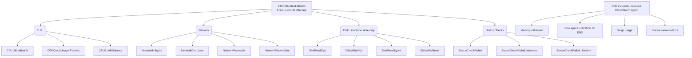
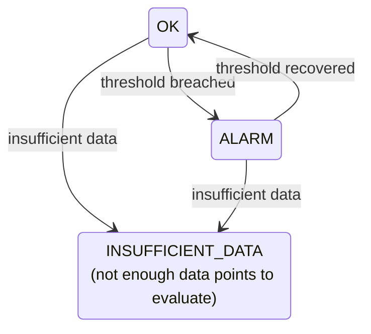
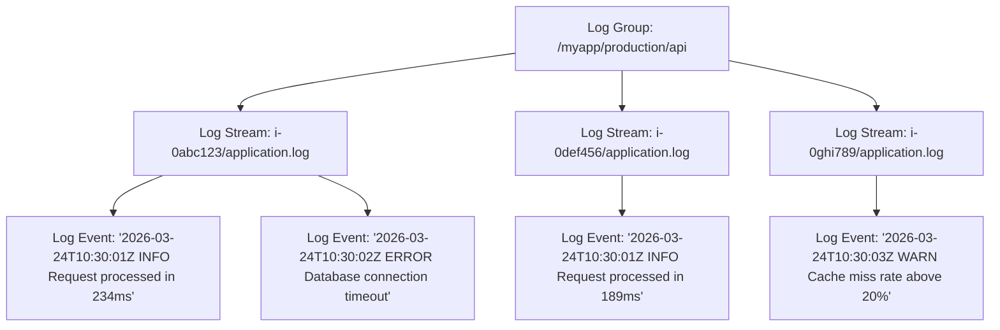
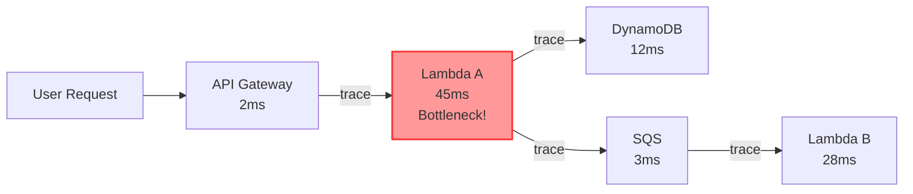

**Complexity:** `[MEDIUM]` | **Time to Complete:** 2 hours | **Track:** AWS DevOps Essentials

## Prerequisites

Before starting this module, ensure you have:
- Completed [Module 1.3: EC2 & Compute Fundamentals](../module-1.3-ec2/) (launching instances, security groups, IAM instance profiles)
- An AWS account with admin access (or scoped permissions for CloudWatch, EC2, IAM)
- AWS CLI v2 installed and configured locally
- At least one running EC2 instance to instrument (or willingness to launch one)
- Basic understanding of metrics, logs, and alerting concepts in distributed systems

## What You'll Be Able to Do

After completing this module, you will be able to:

- **Implement** the CloudWatch Agent to collect custom OS-level metrics (memory, disk) and application logs from EC2 instances.
- **Design** CloudWatch Alarms combining multiple metrics with composite logic and automated EventBridge remediations.
- **Diagnose** complex application failures by writing efficient Logs Insights queries to filter and parse distributed system logs.
- **Evaluate** the financial impact of your architecture by designing CloudWatch Dashboards that utilize metric math to visualize real-time cost trends.

---

## Why This Module Matters

In July 2019, a major financial services company experienced a 14-hour outage that cost them an estimated $12 million in lost transactions. The root cause was a memory leak in a Java microservice running on EC2. The leak took roughly 6 hours to exhaust available memory, at which point the application began throwing `OutOfMemoryError` exceptions. The operations team did not notice the issue for another 3 hours because they only monitored CPU utilization—the default CloudWatch metric for EC2. Memory usage, application-level errors, and garbage collection pauses were completely invisible to them. 

By the time a customer complaint finally triggered a manual investigation, cascading failures had already spread to three downstream payment services. The system was completely paralyzed, and engineers had to comb through raw text logs manually via SSH to find the failure point, losing precious hours during the highest traffic window of the week.

Had they installed the CloudWatch Agent to collect memory and disk metrics, configured a custom metric for JVM heap usage, and set an alarm at 80% memory utilization, they would have received an automated alert 6 hours before the outage occurred. A simple auto-scaling policy tied to memory pressure could have launched fresh instances automatically to mitigate the leak. The total cost of prevention would have been roughly $3 per month in CloudWatch custom metrics. In this module, you will learn the full CloudWatch observability stack to prevent these exact scenarios.

---

## Did You Know?

- **CloudWatch ingests over 1 trillion metrics per day** across all AWS customers. It is one of the oldest AWS services, launching alongside EC2 in 2009, and has grown from a simple CPU-monitoring tool into a massive, globally distributed observability platform.
- **EC2 standard metrics have a 5-minute resolution** by default and are completely free. Enabling "detailed monitoring" bumps this to 1-minute resolution but costs approximately $2.10 per instance per month (7 metrics at $0.30 each). Most production workloads strictly require 1-minute resolution to catch transient spikes.
- **CloudWatch Logs Insights can query terabytes of logs in seconds** using a purpose-built query language. It was released in November 2018 and has largely eliminated the need for teams to ship logs to complex external search clusters just for ad-hoc querying. You only pay $0.005 per GB of data scanned.
- **The CloudWatch Agent replaced three older tools**: the CloudWatch Monitoring Scripts (Perl-based `mon-put-instance-data.pl`), the SSM CloudWatch Plugin (on Windows), and the older CloudWatch Logs Agent (`awslogs`). If you encounter legacy tutorials referencing these components, they are outdated.

---

## Standard Metrics: What AWS Gives You for Free

Every AWS service automatically publishes metrics to CloudWatch at no cost. These are called **standard metrics** (sometimes referred to as basic monitoring or vended metrics). Understanding what is free versus paid prevents surprise billing spikes.

### EC2 Standard Metrics



The biggest gap in EC2 standard metrics is **memory**. AWS cannot see inside your instance's operating system. The hypervisor only sees hardware-level data like CPU cycles, network packets, and instance-store disk I/O. Therefore, memory and EBS disk space metrics require an agent running inside the instance.

> **Stop and think**: If an EC2 instance exhausts its memory and crashes, which of the standard free metrics might give you a clue that something went wrong, given that `MemoryUtilization` is not tracked?

### Viewing Standard Metrics

You can retrieve these metrics instantly using the AWS CLI.

```bash
# List all available metrics for an instance
aws cloudwatch list-metrics \
  --namespace "AWS/EC2" \
  --dimensions "Name=InstanceId,Value=i-0abc123def456789"

# Get CPU utilization for the last hour (5-minute periods)
aws cloudwatch get-metric-statistics \
  --namespace "AWS/EC2" \
  --metric-name CPUUtilization \
  --dimensions Name=InstanceId,Value=i-0abc123def456789 \
  --start-time "$(date -u -v-1H '+%Y-%m-%dT%H:%M:%S')" \
  --end-time "$(date -u '+%Y-%m-%dT%H:%M:%S')" \
  --period 300 \
  --statistics Average Maximum

# On Linux, use date -d instead of -v:
# --start-time "$(date -u -d '1 hour ago' '+%Y-%m-%dT%H:%M:%S')"
```

### Other Services' Free Metrics

| Service | Key Free Metrics | Default Resolution |
|---------|-----------------|-------------------|
| RDS | CPUUtilization, FreeStorageSpace, ReadIOPS, WriteIOPS, DatabaseConnections | 1 minute |
| ALB | RequestCount, TargetResponseTime, HTTPCode_Target_4XX_Count, HealthyHostCount | 1 minute |
| ECS | CPUUtilization, MemoryUtilization (per service) | 1 minute |
| Lambda | Invocations, Duration, Errors, Throttles, ConcurrentExecutions | 1 minute |
| SQS | NumberOfMessagesSent, ApproximateNumberOfMessagesVisible, ApproximateAgeOfOldestMessage | 5 minutes |
| DynamoDB | ConsumedReadCapacityUnits, ConsumedWriteCapacityUnits, ThrottledRequests | 1 minute |

Notice that ECS gives you memory utilization for free because it can observe container-level memory from the task metadata. EC2, operating at the virtual machine level, does not.

---

## Custom Metrics: Measuring What Matters

Standard metrics tell you about the health of your infrastructure. Custom metrics tell you about the health of your business. Business-critical values—like requests per second, payment processing latency, queue depth, and cache hit ratio—must be emitted as custom metrics.

### Publishing Custom Metrics

You can publish data points directly to the CloudWatch API. 

```bash
# Publish a single metric data point
aws cloudwatch put-metric-data \
  --namespace "MyApp/Production" \
  --metric-name "OrdersProcessed" \
  --value 142 \
  --unit Count \
  --dimensions Environment=production,Service=order-processor

# Publish with a timestamp (useful for backfilling)
aws cloudwatch put-metric-data \
  --namespace "MyApp/Production" \
  --metric-name "PaymentLatencyMs" \
  --value 238 \
  --unit Milliseconds \
  --timestamp "2026-03-24T10:30:00Z"

# Publish multiple metrics in one call (more efficient)
aws cloudwatch put-metric-data \
  --namespace "MyApp/Production" \
  --metric-data '[
    {"MetricName": "ActiveUsers", "Value": 1834, "Unit": "Count"},
    {"MetricName": "ErrorRate", "Value": 0.023, "Unit": "Percent"},
    {"MetricName": "CacheHitRatio", "Value": 94.6, "Unit": "Percent"}
  ]'
```

### Pricing Reality Check

Custom metrics cost **$0.30 per metric per month** for the first 10,000 metrics, dropping to $0.10 at scale. A "metric" is uniquely defined by its combination of namespace, metric name, and dimensions.

For instance, the following represent three separate billable metrics:

```
MyApp/Production + OrdersProcessed + Environment=production,Service=orders
MyApp/Production + OrdersProcessed + Environment=staging,Service=orders
MyApp/Production + OrdersProcessed + Environment=production,Service=payments
```

Teams that over-use dimensions (e.g., adding an instance ID, request ID, or user IP address as dimensions) can accidentally create millions of unique metrics and face bills in the tens of thousands of dollars. A firm rule: dimensions should have low cardinality. Store high-cardinality data in log files, not metric dimensions.

### Embedded Metric Format (EMF)

If your application writes structured JSON logs, CloudWatch can automatically extract metrics from them. This is the Embedded Metric Format (EMF), and it is the most scalable way to publish custom metrics from Lambda functions and ECS tasks without blocking application threads.

```python
import json
import sys

def emit_metric(metric_name, value, unit="Count", dimensions=None):
    """Emit a CloudWatch metric via Embedded Metric Format."""
    emf = {
        "_aws": {
            "Timestamp": 1711267200000,  # epoch ms
            "CloudWatchMetrics": [
                {
                    "Namespace": "MyApp/Production",
                    "Dimensions": [list(dimensions.keys())] if dimensions else [[]],
                    "Metrics": [
                        {"Name": metric_name, "Unit": unit}
                    ]
                }
            ]
        },
        metric_name: value
    }
    if dimensions:
        emf.update(dimensions)
    # Print to stdout -- CloudWatch Logs automatically extracts the metric
    print(json.dumps(emf))
    sys.stdout.flush()

# Usage
emit_metric("CheckoutLatency", 234, "Milliseconds",
            {"Environment": "production", "Region": "us-east-1"})
```

With EMF, you get both a searchable log entry AND a CloudWatch metric from a single stdout print statement, entirely bypassing the network latency of the `put-metric-data` API.

> **Pause and predict**: If you use `put-metric-data` synchronously in a Lambda function that processes 10,000 requests per second, what two major bottlenecks or operational issues will you likely encounter?

---

## CloudWatch Alarms: Intelligent Alerting

Metrics without alarms are simply graphs that no one watches at 3:00 AM. Alarms bridge the gap between telemetry collection and incident response, waking up engineers only when action is required.

### Alarm Anatomy

Every CloudWatch Alarm evaluates data over a defined period and maintains one of three states:



### Creating Alarms

Alarms can perform automated actions based on their state transitions.

```bash
# CPU alarm: trigger if average CPU > 80% for 3 consecutive 5-minute periods
aws cloudwatch put-metric-alarm \
  --alarm-name "high-cpu-i-0abc123" \
  --alarm-description "CPU utilization exceeds 80% for 15 minutes" \
  --metric-name CPUUtilization \
  --namespace AWS/EC2 \
  --statistic Average \
  --period 300 \
  --threshold 80 \
  --comparison-operator GreaterThanThreshold \
  --evaluation-periods 3 \
  --dimensions Name=InstanceId,Value=i-0abc123def456789 \
  --alarm-actions arn:aws:sns:us-east-1:123456789012:ops-alerts \
  --ok-actions arn:aws:sns:us-east-1:123456789012:ops-alerts \
  --treat-missing-data missing

# Status check alarm (recover the instance automatically)
aws cloudwatch put-metric-alarm \
  --alarm-name "status-check-i-0abc123" \
  --alarm-description "Recover instance on status check failure" \
  --metric-name StatusCheckFailed_System \
  --namespace AWS/EC2 \
  --statistic Maximum \
  --period 60 \
  --threshold 1 \
  --comparison-operator GreaterThanOrEqualToThreshold \
  --evaluation-periods 2 \
  --dimensions Name=InstanceId,Value=i-0abc123def456789 \
  --alarm-actions arn:aws:automate:us-east-1:ec2:recover

# Custom metric alarm: order processing errors
aws cloudwatch put-metric-alarm \
  --alarm-name "order-errors-high" \
  --metric-name "OrderErrors" \
  --namespace "MyApp/Production" \
  --statistic Sum \
  --period 300 \
  --threshold 10 \
  --comparison-operator GreaterThanThreshold \
  --evaluation-periods 1 \
  --dimensions Name=Environment,Value=production \
  --alarm-actions arn:aws:sns:us-east-1:123456789012:ops-alerts
```

### The `treat-missing-data` Gotcha

This crucial setting determines what happens when CloudWatch has no data points for an evaluation period.

| Setting | Behavior | Best For |
|---------|----------|----------|
| `missing` | Maintains current state | Most alarms (conservative) |
| `notBreaching` | Treats missing data as OK | Sporadic metrics (batch jobs) |
| `breaching` | Treats missing data as ALARM | Critical systems where silence is bad |
| `ignore` | Skips the period entirely | Alarms with naturally gappy data |

The default is `missing`, which is generally safe. But for critical continuous health checks, consider `breaching`—if your application completely stops reporting metrics, silence is itself an emergency worth alerting on.

> **Stop and think**: You have an alarm monitoring a batch job that runs once an hour. If `treat-missing-data` is set to `missing`, what state will the alarm be in for the 59 minutes the job isn't running, and how might that affect your incident response?

### Composite Alarms

When a single metric alarm produces too much noise, combine multiple alarms with boolean logic to create high-signal composite alarms.

```bash
# Only alert if BOTH CPU is high AND memory is high
aws cloudwatch put-composite-alarm \
  --alarm-name "instance-stressed" \
  --alarm-rule 'ALARM("high-cpu-i-0abc123") AND ALARM("high-memory-i-0abc123")' \
  --alarm-actions arn:aws:sns:us-east-1:123456789012:ops-alerts
```

This drastically reduces alert fatigue. A transient CPU spike alone is often harmless. A CPU spike combined with exhausted memory and an elevated 5xx error rate is an active incident.

---

## CloudWatch Logs: Centralized Log Management

Every application produces logs, but accessing them across hundreds of instances via SSH is impossible at scale. CloudWatch Logs gives you a centralized data store to securely hold, search, and parse those logs.

### Core Concepts



- **Log Group**: A massive container for log streams, typically one per application/environment.
- **Log Stream**: A continuous sequence of log events from a specific source (like one EC2 instance or one Lambda invocation).
- **Log Event**: A single timestamped string of text or JSON.

### Setting Retention (Cost Control)

By default, CloudWatch Logs retains data **forever**. This is the single biggest cause of billing shock for CloudWatch newcomers.

```bash
# Set retention to 30 days (common for production)
aws logs put-retention-policy \
  --log-group-name "/myapp/production/api" \
  --retention-in-days 30

# Common retention periods:
# 1, 3, 5, 7, 14, 30, 60, 90, 120, 150, 180, 365, 400, 545, 731, 1096, 1827, 2192, 2557, 2922, 3288, 3653

# Check current retention for all log groups
aws logs describe-log-groups \
  --query 'logGroups[*].[logGroupName,retentionInDays,storedBytes]' \
  --output table
```

### CloudWatch Logs Insights

Logs Insights provides a purpose-built query language to scan terabytes of logs asynchronously. 

```bash
# Find the 20 slowest requests in the last hour
aws logs start-query \
  --log-group-name "/myapp/production/api" \
  --start-time $(date -u -v-1H '+%s') \
  --end-time $(date -u '+%s') \
  --query-string '
    fields @timestamp, @message
    | filter @message like /processed in/
    | parse @message "processed in *ms" as latency
    | sort latency desc
    | limit 20
  '

# Count errors by type in the last 24 hours
aws logs start-query \
  --log-group-name "/myapp/production/api" \
  --start-time $(date -u -v-24H '+%s') \
  --end-time $(date -u '+%s') \
  --query-string '
    fields @timestamp, @message
    | filter @message like /ERROR/
    | parse @message "ERROR * - *" as errorType, errorMessage
    | stats count(*) as errorCount by errorType
    | sort errorCount desc
  '

# Get the query results (use the queryId from start-query response)
aws logs get-query-results --query-id "a1b2c3d4-5678-90ab-cdef-example"
```

Key Logs Insights query patterns:

| Pattern | Example | Use Case |
|---------|---------|----------|
| `filter` | `filter @message like /ERROR/` | Narrow to relevant logs |
| `parse` | `parse @message "status=*" as code` | Extract fields from unstructured logs |
| `stats` | `stats count(*) by code` | Aggregate and group |
| `sort` | `sort @timestamp desc` | Order results |
| `limit` | `limit 50` | Cap result size |
| `fields` | `fields @timestamp, @message` | Select columns |

> **Pause and predict**: You run a Logs Insights query searching for an error over a 30-day window on a high-traffic API. It costs $15 to run. If you add a `limit 10` clause to the exact same query and run it again, will the cost decrease? Why or why not?

### Metric Filters: Turning Logs Into Metrics

You can define CloudWatch Metrics from continuous log patterns without altering application code. Crucially, evaluating logs with metric filters is completely free; you are not charged for the compute required to scan the incoming log streams. You only pay standard rates for the resulting custom metrics that the filter generates.

```bash
# Create a metric filter that counts ERROR lines
aws logs put-metric-filter \
  --log-group-name "/myapp/production/api" \
  --filter-name "ErrorCount" \
  --filter-pattern "ERROR" \
  --metric-transformations \
    metricName=ApplicationErrors,metricNamespace=MyApp/Production,metricValue=1,defaultValue=0

# More specific: count 5xx responses in JSON logs
aws logs put-metric-filter \
  --log-group-name "/myapp/production/api" \
  --filter-name "5xxResponses" \
  --filter-pattern '{ $.statusCode >= 500 }' \
  --metric-transformations \
    metricName=Server5xxErrors,metricNamespace=MyApp/Production,metricValue=1,defaultValue=0
```

---

## The CloudWatch Agent: Unlocking OS-Level Metrics

The CloudWatch Agent is a lightweight daemon that resides inside your EC2 instances. It captures the operating system metrics the hypervisor misses and streams text logs directly to CloudWatch Logs.

### Installation

```bash
# Amazon Linux 2 / Amazon Linux 2023
sudo yum install -y amazon-cloudwatch-agent

# Ubuntu/Debian
wget https://amazoncloudwatch-agent.s3.amazonaws.com/ubuntu/amd64/latest/amazon-cloudwatch-agent.deb
sudo dpkg -i amazon-cloudwatch-agent.deb

# Verify installation
amazon-cloudwatch-agent-ctl -a status
```

### Configuration

The agent is governed by a JSON file that explicitly declares which metrics to scrape and which file paths to tail.

```json
{
  "agent": {
    "metrics_collection_interval": 60,
    "run_as_user": "cwagent"
  },
  "metrics": {
    "namespace": "CWAgent",
    "append_dimensions": {
      "InstanceId": "${aws:InstanceId}",
      "AutoScalingGroupName": "${aws:AutoScalingGroupName}"
    },
    "aggregation_dimensions": [
      ["InstanceId"],
      ["AutoScalingGroupName"]
    ],
    "metrics_collected": {
      "mem": {
        "measurement": [
          "mem_used_percent",
          "mem_available_percent",
          "mem_total"
        ],
        "metrics_collection_interval": 60
      },
      "disk": {
        "measurement": [
          "disk_used_percent",
          "disk_free"
        ],
        "resources": ["/", "/data"],
        "metrics_collection_interval": 60
      },
      "swap": {
        "measurement": ["swap_used_percent"]
      },
      "cpu": {
        "measurement": [
          "cpu_usage_idle",
          "cpu_usage_user",
          "cpu_usage_system",
          "cpu_usage_iowait"
        ],
        "totalcpu": true,
        "metrics_collection_interval": 60
      }
    }
  },
  "logs": {
    "logs_collected": {
      "files": {
        "collect_list": [
          {
            "file_path": "/var/log/myapp/application.log",
            "log_group_name": "/myapp/production/api",
            "log_stream_name": "{instance_id}/application.log",
            "retention_in_days": 30,
            "timestamp_format": "%Y-%m-%dT%H:%M:%S"
          },
          {
            "file_path": "/var/log/syslog",
            "log_group_name": "/myapp/production/system",
            "log_stream_name": "{instance_id}/syslog",
            "retention_in_days": 14
          }
        ]
      }
    }
  }
}
```

### Storing Config in SSM and Starting the Agent

Do not bake this config file directly into your AMI. Instead, store it centrally in Systems Manager (SSM).

```bash
# Store the config in SSM Parameter Store
aws ssm put-parameter \
  --name "AmazonCloudWatch-linux-config" \
  --type String \
  --value file:///opt/aws/amazon-cloudwatch-agent/etc/config.json

# Fetch config from SSM and start the agent
sudo /opt/aws/amazon-cloudwatch-agent/bin/amazon-cloudwatch-agent-ctl \
  -a fetch-config \
  -m ec2 \
  -s \
  -c ssm:AmazonCloudWatch-linux-config

# Check agent status
amazon-cloudwatch-agent-ctl -a status
```

### Required IAM Policy

The EC2 instance role requires permission to write metrics, create log streams, and fetch parameters from SSM.

```json
{
  "Version": "2012-10-17",
  "Statement": [
    {
      "Effect": "Allow",
      "Action": [
        "cloudwatch:PutMetricData",
        "logs:CreateLogGroup",
        "logs:CreateLogStream",
        "logs:PutLogEvents",
        "logs:DescribeLogStreams",
        "ssm:GetParameter"
      ],
      "Resource": "*"
    },
    {
      "Effect": "Allow",
      "Action": "ec2:DescribeTags",
      "Resource": "*"
    }
  ]
}
```

AWS provides the `CloudWatchAgentServerPolicy` managed policy which natively covers these exact requirements:

```bash
aws iam attach-role-policy \
  --role-name my-ec2-role \
  --policy-arn arn:aws:iam::aws:policy/CloudWatchAgentServerPolicy
```

---

## CloudWatch Dashboards and Metric Math

While alarms handle proactive response, dashboards provide the unified situational awareness required during live incident triage. 

### Metric Math

Metric Math enables you to mathematically manipulate multiple CloudWatch metrics to derive entirely new operational insights without writing custom publisher code.

For example, calculating a live error rate percentage directly from raw load balancer metrics:

```json
[
  { "Id": "requests", "MetricStat": { "Metric": { "Namespace": "AWS/ApplicationELB", "MetricName": "RequestCount", "Dimensions": [ { "Name": "LoadBalancer", "Value": "app/my-alb/123" } ] }, "Period": 300, "Stat": "Sum" }, "ReturnData": false },
  { "Id": "errors", "MetricStat": { "Metric": { "Namespace": "AWS/ApplicationELB", "MetricName": "HTTPCode_Target_5XX_Count", "Dimensions": [ { "Name": "LoadBalancer", "Value": "app/my-alb/123" } ] }, "Period": 300, "Stat": "Sum" }, "ReturnData": false },
  { "Id": "error_rate", "Expression": "(errors / requests) * 100", "Label": "5xx Error Rate (%)", "ReturnData": true }
]
```

### Visualizing Cost Trends

A highly effective, yet often overlooked, use of metric math is tracking **cost trends**. By querying the `EstimatedCharges` metric in the `AWS/Billing` namespace and comparing it mathematically against your application's `RequestCount`, you can use metric math to graph your real-time cost-per-request. This powerful technique transforms a standard operational dashboard into an immediate FinOps visibility tool, allowing engineers to evaluate the financial efficiency of a new code deployment within minutes.

---

## EventBridge and X-Ray: Automation and Tracing

### EventBridge: Event-Driven Automation

EventBridge is the high-throughput nervous system connecting AWS services. When infrastructure state changes—an instance terminates, a pipeline completes, or an alarm breaches—EventBridge routes that payload to a designated target for remediation.

```bash
# React when an EC2 instance stops unexpectedly
aws events put-rule \
  --name "ec2-instance-stopped" \
  --event-pattern '{
    "source": ["aws.ec2"],
    "detail-type": ["EC2 Instance State-change Notification"],
    "detail": {
      "state": ["stopped", "terminated"]
    }
  }' \
  --state ENABLED

# Send to SNS topic
aws events put-targets \
  --rule "ec2-instance-stopped" \
  --targets '[{"Id":"notify-ops","Arn":"arn:aws:sns:us-east-1:123456789012:ops-alerts"}]'

# Schedule-based rule (cron): run a Lambda every day at 6 AM UTC
aws events put-rule \
  --name "daily-health-check" \
  --schedule-expression "cron(0 6 * * ? *)" \
  --state ENABLED
```

### X-Ray: Distributed Tracing

In modern microservices architectures, an API request might flow through ten different distributed services. When the request is slow, logs alone cannot quickly pinpoint the exact bottleneck. AWS X-Ray solves this by passing a trace ID through every hop.



---

## Cost Considerations and Best Practices

CloudWatch scaling costs can ambush unprepared teams. Here is a baseline pricing reality check (US East, 2026):

| Component | Free Tier | Paid Rate |
|-----------|-----------|-----------|
| Standard metrics | All included | Free |
| Detailed monitoring (1-min) | 10 metrics | $0.30/metric/month |
| Custom metrics | First 10 metrics | $0.30/metric/month (first 10K) |
| Alarms | 10 standard alarms | $0.10/alarm/month |
| Logs ingestion | 5 GB/month | $0.50/GB |
| Logs storage | 5 GB/month | $0.03/GB/month |
| Logs Insights queries | None free | $0.005/GB scanned |
| Dashboards | 3 dashboards (50 metrics) | $3.00/dashboard/month |

The three catastrophic cost drivers are almost always:
1. **Unchecked log ingestion** – verbose debugging statements left active in production.
2. **Infinite log retention** – retaining massive datasets indefinitely because no policy was set.
3. **Metric cardinality explosions** – injecting highly variable data like `UserId` into metric dimensions.

---

## Common Mistakes

| Mistake | Why It Happens | How to Fix It |
|---------|---------------|---------------|
| Not setting log group retention | Default is "never expire" and it accumulates silently | Set retention on every log group at creation time; audit with `describe-log-groups` regularly |
| Monitoring only CPU on EC2 | It is the only visible metric without agent setup | Install CloudWatch Agent on day one; memory and disk are essential signals |
| High-cardinality custom metric dimensions | Adding request ID, user ID, or IP as dimensions | Dimensions should have low cardinality (environment, service, region); put high-cardinality data in logs |
| Setting alarm evaluation period too short | Wanting to catch issues fast | A single 1-minute breach is often noise; use 3+ evaluation periods to reduce false alarms |
| Using `treat-missing-data` = `breaching` on metrics that naturally gap | Sporadic batch jobs or infrequent Lambda invocations | Use `notBreaching` or `ignore` for intermittent data sources |
| Not using Logs Insights, querying raw streams instead | Habit from grep/tail workflows | Logs Insights is faster, supports aggregation, and works across streams; invest 30 minutes learning the query syntax |
| Forgetting IAM permissions for CloudWatch Agent | Agent installed but fails silently | Attach `CloudWatchAgentServerPolicy` managed policy to the instance role; check agent logs at `/opt/aws/amazon-cloudwatch-agent/logs/` |
| Creating dashboards instead of alarms | Dashboards feel productive | Dashboards require someone watching; alarms notify you proactively; build alarms first, dashboards second |

---

## Quiz

<details>
<summary>1. You are migrating a Java application from ECS to EC2. On ECS, you had a CloudWatch dashboard showing memory utilization without installing any agents. On EC2, the dashboard is blank. Why is this happening, and how do you fix it?</summary>

EC2 standard metrics are collected by the hypervisor, which sits outside the instance's operating system and only sees hardware-level data like CPU cycles and network I/O. It cannot see inside the guest OS to measure memory allocation or process-level metrics. ECS, however, collects container metrics through the ECS agent running inside the instance, which has direct access to container resource usage via the container runtime API. To fix the blank dashboard on EC2, you must install and configure the CloudWatch Agent inside the OS to explicitly collect and publish memory metrics.
</details>

<details>
<summary>2. You configure a CloudWatch Alarm on CPUUtilization with a period of 300 seconds, an evaluation period of 3, and a threshold of 80%. A bug causes CPU to spike to 100% for 10 minutes, drop to 50% for 5 minutes, and spike back to 100% for 5 minutes. Does the alarm trigger? Why or why not?</summary>

The alarm does not trigger under these specific conditions. For an alarm to trigger with the default settings, the metric must breach the threshold for all consecutive evaluation periods—in this case, three consecutive 5-minute periods (15 minutes total). Since the CPU dropped below the 80% threshold during the third 5-minute period, the consecutive breach chain was broken, effectively resetting the evaluation timer. To catch intermittent spikes like this, you would need to use the "M out of N" evaluation model, such as requiring 2 out of 3 periods to breach the threshold.
</details>

<details>
<summary>3. Your team is writing a high-throughput Lambda function that processes thousands of payment events per second. A developer suggests using the boto3 SDK to call `put_metric_data` for every payment to track custom business metrics. Why is this a poor architectural choice, and what should be used instead?</summary>

Calling the `put-metric-data` API directly within a high-throughput Lambda function introduces significant latency and cost, as every invocation must wait for a synchronous HTTP network call to CloudWatch to complete. At thousands of requests per second, this synchronous bottleneck could lead to API throttling limits and artificially inflate your Lambda duration billing. Furthermore, standard API calls do not automatically capture log correlation data, making debugging harder. Instead, you should use the Embedded Metric Format (EMF) to write the metric data as structured JSON to stdout. CloudWatch Logs will asynchronously parse the EMF logs and publish the metrics behind the scenes, eliminating the API latency and cost from your function's execution path.
</details>

<details>
<summary>4. You inherit an AWS environment where the monthly CloudWatch bill has inexplicably jumped from $50 to $800. The application architecture has not changed, but traffic has doubled. What are the first three areas you should investigate to identify the root cause?</summary>

First, you should investigate log ingestion volume, as doubled traffic often means doubled logs, and verbose logging quickly consumes terabytes of expensive ingestion data. Second, you must check the log group retention policies; if the default "Never expire" is set, storage costs will compound infinitely over time as old logs are never deleted. Third, review the custom metrics for high-cardinality dimensions, such as a developer accidentally adding a unique Request ID or User ID as a dimension. This mistake generates millions of unique billable metrics, which is one of the most common causes of massive CloudWatch billing spikes. Checking these three areas will quickly isolate the source of the unexpected charges.
</details>

<details>
<summary>5. You need to automatically reboot an EC2 instance when it fails a system status check, and you also need to trigger a complex Step Functions workflow that opens a Jira ticket and pages the on-call engineer. Should you use a CloudWatch Alarm action, an EventBridge rule, or both? Why?</summary>

You should use a combination of both a CloudWatch Alarm action and an EventBridge rule for this scenario. CloudWatch Alarm actions are threshold-based and have built-in, native support for simple EC2 recovery actions (like rebooting or recovering an instance) when a status check fails. However, Alarm actions cannot directly trigger complex workflows like Step Functions, as their targets are limited to specific automated actions or SNS topics. To achieve the second requirement, you would create an EventBridge rule configured to listen for the specific CloudWatch Alarm state change event. EventBridge can then flexibly route that event payload directly to the Step Functions state machine to handle the ticketing and paging.
</details>

<details>
<summary>6. During a major production incident, your team ran the same complex Logs Insights query across 500 GB of log data dozens of times, resulting in hundreds of dollars in query fees. How can you architect the system to reduce the cost of tracking this specific error pattern in the future?</summary>

To prevent repeated query fees for known error patterns, you should create a CloudWatch Metric Filter on the log group that matches the specific error syntax. Evaluating logs with metric filters is completely free; it continuously evaluates incoming logs in real-time and increments a custom CloudWatch metric whenever the pattern is found. You can then build dashboards and alarms based on this custom metric, which costs a flat, predictable monthly rate rather than incurring per-query scan charges. For ad-hoc querying during an incident, you can also reduce costs by narrowing the Logs Insights time range to just the last few minutes, drastically reducing the gigabytes of data scanned. Using these strategies ensures that operational visibility does not result in unpredictable billing spikes.
</details>

<details>
<summary>7. Your infrastructure team is deploying 50 EC2 instances via Auto Scaling. A junior engineer suggests baking the CloudWatch Agent JSON configuration file directly into the Golden AMI. Why might this lead to operational headaches, and what service should you use instead?</summary>

Baking the configuration file directly into the AMI creates a tight coupling that requires you to rebuild and redeploy the entire Golden AMI across all 50 instances just to change a single metric interval or add a new log path. This turns a trivial configuration change into a time-consuming infrastructure deployment that increases the risk of operational drift if some instances fail to update. Instead, you should store the JSON configuration in Systems Manager (SSM) Parameter Store. This centralized approach allows instances to fetch the latest configuration dynamically at startup. Furthermore, you can push updates to running instances using SSM Run Command without ever needing to touch the base AMI.
</details>

---

## Hands-On Exercise: CloudWatch Agent on EC2 with Custom Logs and CPU Alarm

### Objective

Install the CloudWatch Agent on an EC2 instance, configure it to collect memory metrics and ship application logs, then create an alarm that fires when CPU exceeds a threshold.

### Setup

You need:
- An EC2 instance (Amazon Linux 2023 recommended) with an IAM role attached.
- SSH access to the instance.
- The IAM role must have `CloudWatchAgentServerPolicy` attached.

If you do not have an instance ready, run the following from your local terminal:

```bash
# Create an IAM role for the instance (if you don't have one)
aws iam create-role \
  --role-name cw-lab-ec2-role \
  --assume-role-policy-document '{
    "Version": "2012-10-17",
    "Statement": [{
      "Effect": "Allow",
      "Principal": {"Service": "ec2.amazonaws.com"},
      "Action": "sts:AssumeRole"
    }]
  }'

aws iam attach-role-policy \
  --role-name cw-lab-ec2-role \
  --policy-arn arn:aws:iam::aws:policy/CloudWatchAgentServerPolicy

aws iam attach-role-policy \
  --role-name cw-lab-ec2-role \
  --policy-arn arn:aws:iam::aws:policy/AmazonSSMManagedInstanceCore

aws iam create-instance-profile --instance-profile-name cw-lab-profile
aws iam add-role-to-instance-profile \
  --instance-profile-name cw-lab-profile \
  --role-name cw-lab-ec2-role

# Launch an instance (use your key pair and security group)
aws ec2 run-instances \
  --image-id resolve:ssm:/aws/service/ami-amazon-linux-latest/al2023-ami-kernel-default-x86_64 \
  --instance-type t3.micro \
  --iam-instance-profile Name=cw-lab-profile \
  --key-name YOUR_KEY_PAIR \
  --security-group-ids sg-YOUR_SG \
  --tag-specifications 'ResourceType=instance,Tags=[{Key=Name,Value=cw-lab}]'
```

### Task 1: Install the CloudWatch Agent

Extract the instance IP automatically, SSH into the instance, and install the agent.

<details>
<summary>Solution</summary>

```bash
# SSH into the instance
INSTANCE_PUBLIC_IP=$(aws ec2 describe-instances --filters "Name=tag:Name,Values=cw-lab" --query "Reservations[0].Instances[0].PublicIpAddress" --output text)
ssh -i your-key.pem ec2-user@$INSTANCE_PUBLIC_IP

# Install the CloudWatch Agent
sudo yum install -y amazon-cloudwatch-agent

# Verify installation
amazon-cloudwatch-agent-ctl -a status
# Should show: "status": "stopped"
```
</details>

### Task 2: Create a Sample Application Log

Generate a log file that continuously simulates application output.

<details>
<summary>Solution</summary>

```bash
# Create the log directory
sudo mkdir -p /var/log/myapp
sudo chown ec2-user:ec2-user /var/log/myapp

# Generate some fake log entries
cat > /tmp/generate-logs.sh <<'SCRIPT'
#!/bin/bash
while true; do
  TIMESTAMP=$(date -u '+%Y-%m-%dT%H:%M:%SZ')
  LATENCY=$((RANDOM % 500 + 10))
  STATUS_CODES=(200 200 200 200 200 201 301 400 404 500)
  STATUS=${STATUS_CODES[$RANDOM % ${#STATUS_CODES[@]}]}
  echo "${TIMESTAMP} INFO request_id=$(uuidgen | cut -c1-8) status=${STATUS} latency=${LATENCY}ms path=/api/orders"
  sleep 2
done >> /var/log/myapp/application.log
SCRIPT

chmod +x /tmp/generate-logs.sh
nohup /tmp/generate-logs.sh &
```
</details>

### Task 3: Configure and Start the CloudWatch Agent

Write the agent configuration to capture OS-level memory metrics and tail the mock application log file.

<details>
<summary>Solution</summary>

```bash
# Write the agent config
sudo tee /opt/aws/amazon-cloudwatch-agent/etc/custom-config.json <<'EOF'
{
  "agent": {
    "metrics_collection_interval": 60,
    "run_as_user": "root"
  },
  "metrics": {
    "namespace": "CWAgentLab",
    "append_dimensions": {
      "InstanceId": "${aws:InstanceId}"
    },
    "metrics_collected": {
      "mem": {
        "measurement": ["mem_used_percent"],
        "metrics_collection_interval": 60
      },
      "disk": {
        "measurement": ["disk_used_percent"],
        "resources": ["/"],
        "metrics_collection_interval": 60
      },
      "cpu": {
        "measurement": ["cpu_usage_idle", "cpu_usage_user"],
        "totalcpu": true,
        "metrics_collection_interval": 60
      }
    }
  },
  "logs": {
    "logs_collected": {
      "files": {
        "collect_list": [
          {
            "file_path": "/var/log/myapp/application.log",
            "log_group_name": "/cw-lab/application",
            "log_stream_name": "{instance_id}",
            "retention_in_days": 7
          }
        ]
      }
    }
  }
}
EOF

# Start the agent with the config
sudo /opt/aws/amazon-cloudwatch-agent/bin/amazon-cloudwatch-agent-ctl \
  -a fetch-config \
  -m ec2 \
  -s \
  -c file:/opt/aws/amazon-cloudwatch-agent/etc/custom-config.json

# Verify it is running
amazon-cloudwatch-agent-ctl -a status
# Should show: "status": "running"
```
</details>

### Task 4: Verify Metrics and Logs Appear in CloudWatch

Wait a few minutes for the telemetry payload to reach AWS, then execute these commands from your local machine.

<details>
<summary>Solution</summary>

```bash
# Check that custom metrics are appearing (from your local machine)
aws cloudwatch list-metrics \
  --namespace "CWAgentLab" \
  --query 'Metrics[*].[MetricName,Dimensions]' \
  --output table

# Get the latest memory metric
INSTANCE_ID=$(aws ec2 describe-instances --filters "Name=tag:Name,Values=cw-lab" --query "Reservations[0].Instances[0].InstanceId" --output text)

aws cloudwatch get-metric-statistics \
  --namespace "CWAgentLab" \
  --metric-name "mem_used_percent" \
  --dimensions Name=InstanceId,Value=$INSTANCE_ID \
  --start-time "$(date -u -v-10M '+%Y-%m-%dT%H:%M:%S')" \
  --end-time "$(date -u '+%Y-%m-%dT%H:%M:%S')" \
  --period 60 \
  --statistics Average

# Check logs are flowing
aws logs describe-log-streams \
  --log-group-name "/cw-lab/application" \
  --query 'logStreams[*].[logStreamName,lastEventTimestamp]' \
  --output table

# Read recent log entries
aws logs get-log-events \
  --log-group-name "/cw-lab/application" \
  --log-stream-name "$INSTANCE_ID" \
  --limit 10 \
  --query 'events[*].message' \
  --output text
```
</details>

### Task 5: Create a CPU Alarm

Create a proactive alarm that triggers an SNS notification when CPU load exceeds a designated threshold, then stress-test the environment.

<details>
<summary>Solution</summary>

```bash
INSTANCE_ID=$(aws ec2 describe-instances --filters "Name=tag:Name,Values=cw-lab" --query "Reservations[0].Instances[0].InstanceId" --output text)
INSTANCE_PUBLIC_IP=$(aws ec2 describe-instances --filters "Name=tag:Name,Values=cw-lab" --query "Reservations[0].Instances[0].PublicIpAddress" --output text)

# Create an SNS topic for notifications (or use an existing one)
TOPIC_ARN=$(aws sns create-topic --name cw-lab-alerts --query 'TopicArn' --output text)

# Subscribe your email
aws sns subscribe \
  --topic-arn $TOPIC_ARN \
  --protocol email \
  --notification-endpoint your-email@example.com
# Confirm the subscription via the email you receive

# Create the CPU alarm
aws cloudwatch put-metric-alarm \
  --alarm-name "cw-lab-high-cpu" \
  --alarm-description "CPU exceeds 70% for 2 minutes" \
  --metric-name CPUUtilization \
  --namespace AWS/EC2 \
  --statistic Average \
  --period 60 \
  --threshold 70 \
  --comparison-operator GreaterThanThreshold \
  --evaluation-periods 2 \
  --dimensions Name=InstanceId,Value=$INSTANCE_ID \
  --alarm-actions $TOPIC_ARN \
  --ok-actions $TOPIC_ARN \
  --treat-missing-data missing

# SSH into the instance and stress the CPU
ssh -i your-key.pem ec2-user@$INSTANCE_PUBLIC_IP

# Inside the EC2 instance, install and run stress-ng
sudo yum install -y stress-ng
stress-ng --cpu 2 --timeout 300

# After 2-3 minutes, check alarm state from your local machine
aws cloudwatch describe-alarms \
  --alarm-names "cw-lab-high-cpu" \
  --query 'MetricAlarms[0].[AlarmName,StateValue,StateReason]' \
  --output text
```
</details>

### Task 6: Clean Up

Tear down all infrastructure deployed in this lab to avoid ongoing costs.

<details>
<summary>Solution</summary>

```bash
INSTANCE_ID=$(aws ec2 describe-instances --filters "Name=tag:Name,Values=cw-lab" --query "Reservations[0].Instances[0].InstanceId" --output text)

# Delete the alarm
aws cloudwatch delete-alarms --alarm-names "cw-lab-high-cpu"

# Delete SNS topic and subscription
TOPIC_ARN=$(aws sns create-topic --name cw-lab-alerts --query 'TopicArn' --output text)
aws sns delete-topic --topic-arn $TOPIC_ARN

# Delete log group
aws logs delete-log-group --log-group-name "/cw-lab/application"

# Terminate the EC2 instance
aws ec2 terminate-instances --instance-ids $INSTANCE_ID

# Clean up IAM (after instance is terminated)
aws iam remove-role-from-instance-profile \
  --instance-profile-name cw-lab-profile \
  --role-name cw-lab-ec2-role
aws iam delete-instance-profile --instance-profile-name cw-lab-profile
aws iam detach-role-policy \
  --role-name cw-lab-ec2-role \
  --policy-arn arn:aws:iam::aws:policy/CloudWatchAgentServerPolicy
aws iam detach-role-policy \
  --role-name cw-lab-ec2-role \
  --policy-arn arn:aws:iam::aws:policy/AmazonSSMManagedInstanceCore
aws iam delete-role --role-name cw-lab-ec2-role
```
</details>

### Success Criteria

- [ ] CloudWatch Agent installed and running successfully on the provisioned EC2 instance.
- [ ] Memory metrics (`mem_used_percent`) successfully emitted and visible under the custom `CWAgentLab` namespace.
- [ ] Simulated application logs securely flowing into CloudWatch Logs under the `/cw-lab/application` log group.
- [ ] Proactive CPU alarm correctly provisioned and initiating in an `OK` state.
- [ ] `stress-ng` test predictably forces the CPU threshold limit, pushing the alarm into the `ALARM` state.
- [ ] Event-driven SNS notification dispatched and validated by email receipt.
- [ ] Complete teardown and removal of all lab infrastructure elements.

---

## Next Module

Continue to [Module 1.11: CI/CD on AWS](../module-1.11-cicd/) — where you will progress from observing operations to automating them, leveraging AWS CodeBuild, CodeDeploy, and CodePipeline to safely deploy applications into the very infrastructure you have now successfully instrumented.