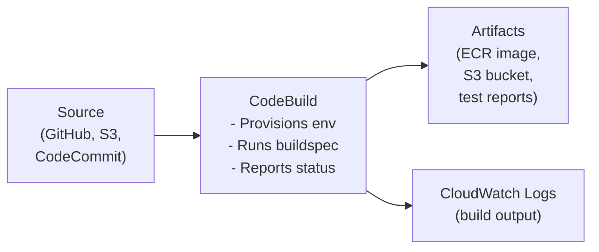
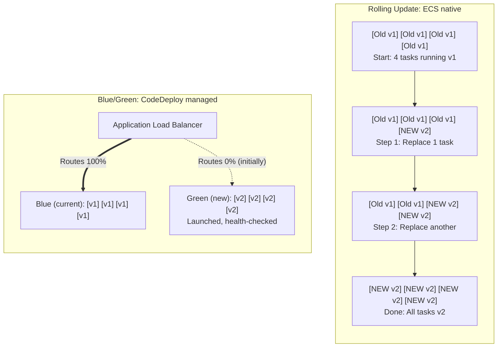
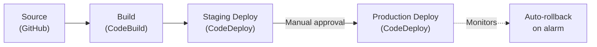
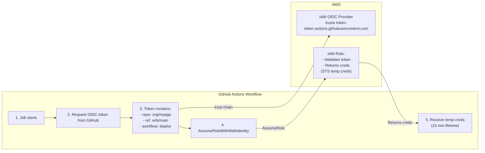

**Complexity:** `[MEDIUM]` | **Time to Complete:** 2 hours | **Track:** AWS DevOps Essentials

## Prerequisites

Before starting this module, ensure you have:
- Completed [Module 1.6: ECR (Container Registry)](../module-1.6-ecr/) (pushing/pulling container images)
- Completed [Module 1.7: ECS (Container Orchestration)](../module-1.7-ecs-fargate/) (ECS services, task definitions, Fargate)
- Familiarity with CI/CD concepts (build, test, deploy pipeline stages)
- A GitHub account and a repository to use for pipeline integration
- AWS CLI v2 installed and configured
- Basic knowledge of Docker and Dockerfiles

## What You'll Be Able to Do

After completing this module, you will be able to:

- **Deploy end-to-end CI/CD pipelines using CodePipeline, CodeBuild, and CodeDeploy for containerized applications**
- **Configure CodeBuild projects with buildspec files that run tests, build images, and push to ECR**
- **Implement blue/green and canary deployment strategies using CodeDeploy with ECS**
- **Design pipeline stages with manual approval gates and automated rollbacks**

---

## Why This Module Matters

Manual production deployments and unreviewed database migrations can cause severe customer-facing failures, data inconsistencies, and expensive cleanup work. CI/CD pipelines reduce that risk by making deployments repeatable, testable, and easier to roll back.

A CI/CD pipeline would have caught this in minutes, not hours. Automated tests would have validated the migration against a staging database. A blue/green deployment would have allowed instant rollback when health checks failed. Code review enforced by the pipeline would have flagged the outdated migration script. And nobody would have needed to SSH into production on a Friday.

In this module, you will learn the AWS Code Suite -- CodeBuild for building and testing code, CodeDeploy for deployment strategies, and CodePipeline for orchestrating the full workflow. You will also learn how to connect GitHub and GitLab repositories to AWS using [OIDC federation, which is the modern, secure alternative to storing long-lived access keys](https://docs.aws.amazon.com/IAM/latest/UserGuide/id_roles_providers_oidc.html).

---

## Did You Know?

- **AWS CodePipeline became generally available in July 2015.** Before AWS-native managed CI/CD services were widely used, many teams ran tools such as Jenkins on EC2 instances.

- **CodeBuild runs on managed compute** and charges for build usage rather than requiring you to keep a dedicated build server running. In a small setup, that can be much cheaper than operating an always-on Jenkins host, depending on build volume and infrastructure choices.

- **OIDC federation for GitHub Actions** avoids storing long-lived IAM access keys in GitHub. GitHub Actions can request short-lived identity tokens, and AWS can trust those tokens to issue temporary credentials for a tightly scoped IAM role.

- **Blue/green deployments on ECS** can be implemented with CodeDeploy, while the ECS deployment circuit breaker handles rollback for rolling deployments. AWS has also added newer ECS-native deployment strategies, so check the current ECS deployment documentation before choosing an approach.

---

## CodeBuild: Building and Testing Code

CodeBuild is a fully managed build service. You give it source code, a build specification file (`buildspec.yml`), and a compute environment. It runs your build, publishes artifacts, and reports success or failure.

### How CodeBuild Works



### The buildspec.yml File

This is the heart of CodeBuild. It defines what happens during each build phase:

```yaml
version: 0.2

env:
  variables:
    APP_NAME: "myapp"
    AWS_DEFAULT_REGION: "us-east-1"
  parameter-store:
    DB_PASSWORD: "/myapp/production/database/password"
  secrets-manager:
    DOCKER_HUB_TOKEN: "dockerhub-credentials:token"

phases:
  install:
    runtime-versions:
      docker: 20
      python: 3.12
    commands:
      - echo "Installing dependencies..."
      - pip install -r requirements.txt
      - pip install pytest flake8

  pre_build:
    commands:
      - echo "Running linting and unit tests..."
      - flake8 src/ --max-line-length 120
      - pytest tests/unit/ --junitxml=reports/unit-tests.xml
      - echo "Logging into ECR..."
      - ACCOUNT_ID=$(aws sts get-caller-identity --query Account --output text)
      - ECR_URI="${ACCOUNT_ID}.dkr.ecr.${AWS_DEFAULT_REGION}.amazonaws.com"
      - aws ecr get-login-password | docker login --username AWS --password-stdin ${ECR_URI}

  build:
    commands:
      - echo "Building Docker image..."
      - COMMIT_HASH=$(echo $CODEBUILD_RESOLVED_SOURCE_VERSION | cut -c 1-8)
      - IMAGE_TAG="${COMMIT_HASH:-latest}"
      - docker build -t ${ECR_URI}/${APP_NAME}:${IMAGE_TAG} .
      - docker build -t ${ECR_URI}/${APP_NAME}:latest .

  post_build:
    commands:
      - echo "Pushing Docker image to ECR..."
      - docker push ${ECR_URI}/${APP_NAME}:${IMAGE_TAG}
      - docker push ${ECR_URI}/${APP_NAME}:latest
      - echo "Writing image definitions for ECS..."
      - printf '[{"name":"myapp","imageUri":"%s"}]' ${ECR_URI}/${APP_NAME}:${IMAGE_TAG} > imagedefinitions.json

reports:
  unit-tests:
    files:
      - "reports/unit-tests.xml"
    file-format: JUNITXML

artifacts:
  files:
    - imagedefinitions.json
    - appspec.yml
  discard-paths: yes

cache:
  paths:
    - "/root/.cache/pip/**/*"
    - "/var/lib/docker/**/*"
```

Let's break down the important parts:

**Phases** execute in order: `install` -> `pre_build` -> `build` -> `post_build`. If a command fails, that phase fails, so later steps that must not run after a failure should be guarded explicitly.

**Environment variables** can come from three sources: [inline values, SSM Parameter Store, and Secrets Manager](https://docs.aws.amazon.com/codebuild/latest/APIReference/API_EnvironmentVariable.html). CodeBuild resolves them before the build starts.

**Artifacts** are files preserved after the build completes. [The `imagedefinitions.json` file is a special format that ECS deployments use to know which container image to pull](https://docs.aws.amazon.com/codepipeline/latest/userguide/file-reference.html).

**Cache** speeds up subsequent builds by [preserving directories like pip's download cache or Docker layers](https://docs.aws.amazon.com/codebuild/latest/userguide/build-caching.html).

> **Stop and think**: The buildspec.yml example caches `/root/.cache/pip/**/*` and `/var/lib/docker/**/*`. While caching significantly accelerates build times, what architectural or security risks might emerge if your CI pipeline relies on a stale Docker layer cache for months without invalidation, particularly regarding base OS dependencies?

### Creating a CodeBuild Project

```bash
# Create the CodeBuild service role first
aws iam create-role \
  --role-name codebuild-myapp-role \
  --assume-role-policy-document '{
    "Version": "2012-10-17",
    "Statement": [{
      "Effect": "Allow",
      "Principal": {"Service": "codebuild.amazonaws.com"},
      "Action": "sts:AssumeRole"
    }]
  }'

# Attach policies for ECR, logs, S3, and secrets
aws iam attach-role-policy \
  --role-name codebuild-myapp-role \
  --policy-arn arn:aws:iam::aws:policy/AmazonEC2ContainerRegistryPowerUser

ACCOUNT_ID=$(aws sts get-caller-identity --query Account --output text)

aws iam put-role-policy \
  --role-name codebuild-myapp-role \
  --policy-name CodeBuildBasePolicy \
  --policy-document "{
    \"Version\": \"2012-10-17\",
    \"Statement\": [
      {
        \"Effect\": \"Allow\",
        \"Action\": [
          \"logs:CreateLogGroup\",
          \"logs:CreateLogStream\",
          \"logs:PutLogEvents\"
        ],
        \"Resource\": \"arn:aws:logs:*:${ACCOUNT_ID}:log-group:/aws/codebuild/*\"
      },
      {
        \"Effect\": \"Allow\",
        \"Action\": [
          \"s3:PutObject\",
          \"s3:GetObject\",
          \"s3:GetBucketAcl\",
          \"s3:GetBucketLocation\"
        ],
        \"Resource\": \"*\"
      },
      {
        \"Effect\": \"Allow\",
        \"Action\": [
          \"ssm:GetParameters\",
          \"secretsmanager:GetSecretValue\"
        ],
        \"Resource\": \"*\"
      }
    ]
  }"

# Create the CodeBuild project
aws codebuild create-project \
  --name myapp-build \
  --source '{
    "type": "GITHUB",
    "location": "https://github.com/YOUR_ORG/myapp.git",
    "buildspec": "buildspec.yml"
  }' \
  --artifacts '{"type": "NO_ARTIFACTS"}' \
  --environment '{
    "type": "LINUX_CONTAINER",
    "image": "aws/codebuild/amazonlinux2-x86_64-standard:5.0",
    "computeType": "BUILD_GENERAL1_SMALL",
    "privilegedMode": true
  }' \
  --service-role "arn:aws:iam::${ACCOUNT_ID}:role/codebuild-myapp-role"
```

The [`privilegedMode: true` flag is required when building Docker images inside CodeBuild](https://docs.aws.amazon.com/codebuild/latest/userguide/create-project.html). Without it, the Docker daemon cannot start.

### Build Compute Types

| Compute Type | vCPU | Memory | Cost/min (US East) |
|-------------|------|--------|-------------------|
| BUILD_GENERAL1_SMALL | 2 | 4 GiB | See current AWS pricing |
| BUILD_GENERAL1_MEDIUM | 4 | 8 GiB | See current AWS pricing |
| BUILD_GENERAL1_LARGE | 8 | 16 GiB | See current AWS pricing |
| BUILD_GENERAL1_2XLARGE | 72 | 144 GiB | See current AWS pricing |

Most application builds work fine on SMALL. Use MEDIUM or LARGE for heavy compilation (C++, Rust) or large test suites.

---

## CodeDeploy: Deployment Strategies

CodeDeploy handles the how of getting new code onto your compute targets. [It supports EC2 instances, on-premises servers, Lambda functions, and ECS services](https://docs.aws.amazon.com/codedeploy/latest/userguide/welcome.html) -- each with different deployment strategies.

### Deployment Types for ECS



**Traffic shift strategies:**
- **AllAtOnce**: 0% --> 100% instantly
- **Canary10Percent5Minutes**: 10% for 5 min, then 100%
- **Linear10PercentEvery1Minute**: 10%, 20%, 30%... every minute

Blue/green is the gold standard for production ECS deployments because it provides:
1. **Instant rollback** -- just shift traffic back to the blue target group
2. **Zero downtime** -- the old tasks keep running until traffic fully shifts
3. **Validation window** -- test the green environment with real traffic before committing

### The appspec.yml File

For ECS deployments, CodeDeploy uses an `appspec.yml` that defines the task definition and optional lifecycle hooks:

```yaml
version: 0.0
Resources:
  - TargetService:
      Type: AWS::ECS::Service
      Properties:
        TaskDefinition: "arn:aws:ecs:us-east-1:123456789012:task-definition/myapp:42"
        LoadBalancerInfo:
          ContainerName: "myapp"
          ContainerPort: 8080
        PlatformVersion: "LATEST"

Hooks:
  - BeforeInstall: "LambdaFunctionToValidateBeforeInstall"
  - AfterInstall: "LambdaFunctionToValidateAfterInstall"
  - AfterAllowTestTraffic: "LambdaFunctionToRunIntegrationTests"
  - BeforeAllowTraffic: "LambdaFunctionToValidateBeforeTraffic"
  - AfterAllowTraffic: "LambdaFunctionToRunSmokeTests"
```

Each hook references a Lambda function that CodeDeploy invokes at that point in the deployment. If a hook function reports failure, the deployment fails, and CodeDeploy rolls back automatically only when automatic rollback is enabled for the deployment or deployment group.

> **Pause and predict**: In a CodeDeploy Blue/Green deployment, traffic is shifted to the new Green environment. If a `BeforeAllowTraffic` lifecycle hook Lambda function fails or times out due to a missing IAM permission, how will CodeDeploy handle the active ALB listener rules, and will any customer traffic be routed to the Green tasks?

### Automatic Rollback

CodeDeploy can monitor CloudWatch Alarms during deployment and roll back if things go wrong:

```bash
# Create a deployment group with alarm-based rollback
aws deploy create-deployment-group \
  --application-name myapp \
  --deployment-group-name production \
  --deployment-config-name CodeDeployDefault.ECSCanary10Percent5Minutes \
  --ecs-services '[{
    "serviceName": "myapp-service",
    "clusterName": "production"
  }]' \
  --load-balancer-info '{
    "targetGroupPairInfoList": [{
      "targetGroups": [
        {"name": "myapp-blue-tg"},
        {"name": "myapp-green-tg"}
      ],
      "prodTrafficRoute": {
        "listenerArns": ["arn:aws:elasticloadbalancing:us-east-1:123456789012:listener/app/myapp-alb/abc123/def456"]
      }
    }]
  }' \
  --auto-rollback-configuration '{
    "enabled": true,
    "events": ["DEPLOYMENT_FAILURE", "DEPLOYMENT_STOP_ON_ALARM"]
  }' \
  --alarm-configuration '{
    "enabled": true,
    "alarms": [
      {"name": "myapp-5xx-errors-high"},
      {"name": "myapp-latency-p99-high"}
    ]
  }' \
  --service-role-arn arn:aws:iam::123456789012:role/codedeploy-ecs-role
```

This is powerful: deploy with canary at 10%, wait 5 minutes, and if the `5xx-errors-high` alarm fires during that window, automatically roll back. No human intervention needed.

---

## CodePipeline: Orchestrating the Full Workflow

CodePipeline connects source, build, and deploy stages into an automated workflow. When you push code to GitHub, the pipeline triggers automatically and progresses through each stage.

### Pipeline Architecture



### Creating a Pipeline with CLI

```bash
# Create the artifact bucket
aws s3 mb s3://myapp-pipeline-artifacts-${ACCOUNT_ID}

# Create the pipeline role
aws iam create-role \
  --role-name codepipeline-myapp-role \
  --assume-role-policy-document '{
    "Version": "2012-10-17",
    "Statement": [{
      "Effect": "Allow",
      "Principal": {"Service": "codepipeline.amazonaws.com"},
      "Action": "sts:AssumeRole"
    }]
  }'

# The pipeline definition (save as pipeline.json)
cat > /tmp/pipeline.json <<'EOF'
{
  "pipeline": {
    "name": "myapp-pipeline",
    "roleArn": "arn:aws:iam::ACCOUNT_ID:role/codepipeline-myapp-role",
    "artifactStore": {
      "type": "S3",
      "location": "myapp-pipeline-artifacts-ACCOUNT_ID"
    },
    "stages": [
      {
        "name": "Source",
        "actions": [
          {
            "name": "GitHub-Source",
            "actionTypeId": {
              "category": "Source",
              "owner": "AWS",
              "provider": "CodeStarSourceConnection",
              "version": "1"
            },
            "configuration": {
              "ConnectionArn": "arn:aws:codestar-connections:us-east-1:ACCOUNT_ID:connection/CONNECTION_ID",
              "FullRepositoryId": "YOUR_ORG/myapp",
              "BranchName": "main",
              "OutputArtifactFormat": "CODE_ZIP"
            },
            "outputArtifacts": [{"name": "SourceOutput"}]
          }
        ]
      },
      {
        "name": "Build",
        "actions": [
          {
            "name": "Docker-Build",
            "actionTypeId": {
              "category": "Build",
              "owner": "AWS",
              "provider": "CodeBuild",
              "version": "1"
            },
            "configuration": {
              "ProjectName": "myapp-build"
            },
            "inputArtifacts": [{"name": "SourceOutput"}],
            "outputArtifacts": [{"name": "BuildOutput"}]
          }
        ]
      },
      {
        "name": "Deploy-Staging",
        "actions": [
          {
            "name": "ECS-Deploy-Staging",
            "actionTypeId": {
              "category": "Deploy",
              "owner": "AWS",
              "provider": "ECS",
              "version": "1"
            },
            "configuration": {
              "ClusterName": "staging",
              "ServiceName": "myapp-service",
              "FileName": "imagedefinitions.json"
            },
            "inputArtifacts": [{"name": "BuildOutput"}]
          }
        ]
      },
      {
        "name": "Approval",
        "actions": [
          {
            "name": "Manual-Approval",
            "actionTypeId": {
              "category": "Approval",
              "owner": "AWS",
              "provider": "Manual",
              "version": "1"
            },
            "configuration": {
              "NotificationArn": "arn:aws:sns:us-east-1:ACCOUNT_ID:pipeline-approvals",
              "CustomData": "Review staging deployment before promoting to production"
            }
          }
        ]
      },
      {
        "name": "Deploy-Production",
        "actions": [
          {
            "name": "ECS-Deploy-Production",
            "actionTypeId": {
              "category": "Deploy",
              "owner": "AWS",
              "provider": "CodeDeployToECS",
              "version": "1"
            },
            "configuration": {
              "ApplicationName": "myapp",
              "DeploymentGroupName": "production",
              "TaskDefinitionTemplateArtifact": "BuildOutput",
              "AppSpecTemplateArtifact": "BuildOutput"
            },
            "inputArtifacts": [{"name": "BuildOutput"}]
          }
        ]
      }
    ]
  }
}
EOF

# Create the pipeline
aws codepipeline create-pipeline --cli-input-json file:///tmp/pipeline.json
```

### Source Providers: CodeStar Connections vs Webhooks

The modern way to connect GitHub to CodePipeline is through [**CodeStar Connections** (also called CodeConnections)](https://docs.aws.amazon.com/codepipeline/latest/userguide/update-github-action-connections.html). This replaces the older OAuth token and webhook approach:

```bash
# Create a connection (must be completed in the AWS Console)
aws codestar-connections create-connection \
  --provider-type GitHub \
  --connection-name myapp-github

# The connection starts in PENDING status
# Complete it via: AWS Console -> CodePipeline -> Settings -> Connections
# You'll authorize the AWS Connector for GitHub app
```

Why CodeStar Connections over webhooks:
- No long-lived OAuth token to manage or rotate
- GitHub App-based authentication (more secure, fine-grained permissions)
- Supports both clone and webhook trigger in one configuration
- Works with GitHub Organizations access controls

---

## OIDC Federation for GitHub Actions

If your team already uses GitHub Actions for CI and only needs AWS for deployment, you do not need CodeBuild or CodePipeline at all. Instead, configure OIDC federation so GitHub Actions can assume an IAM role directly.

### How OIDC Federation Works



### Setting Up OIDC Federation

```bash
# Step 1: Create the OIDC identity provider in IAM
aws iam create-open-id-connect-provider \
  --url "https://token.actions.githubusercontent.com" \
  --client-id-list "sts.amazonaws.com" \
  --thumbprint-list "6938fd4d98bab03faadb97b34396831e3780aea1"

# Step 2: Create the IAM role that GitHub Actions will assume
ACCOUNT_ID=$(aws sts get-caller-identity --query Account --output text)

cat > /tmp/github-actions-trust.json <<EOF
{
  "Version": "2012-10-17",
  "Statement": [
    {
      "Effect": "Allow",
      "Principal": {
        "Federated": "arn:aws:iam::${ACCOUNT_ID}:oidc-provider/token.actions.githubusercontent.com"
      },
      "Action": "sts:AssumeRoleWithWebIdentity",
      "Condition": {
        "StringEquals": {
          "token.actions.githubusercontent.com:aud": "sts.amazonaws.com"
        },
        "StringLike": {
          "token.actions.githubusercontent.com:sub": "repo:YOUR_ORG/myapp:ref:refs/heads/main"
        }
      }
    }
  ]
}
EOF

aws iam create-role \
  --role-name github-actions-deploy \
  --assume-role-policy-document file:///tmp/github-actions-trust.json

# Step 3: Attach permissions (e.g., ECR push + ECS deploy)
aws iam attach-role-policy \
  --role-name github-actions-deploy \
  --policy-arn arn:aws:iam::aws:policy/AmazonEC2ContainerRegistryPowerUser

aws iam put-role-policy \
  --role-name github-actions-deploy \
  --policy-name ECSDeployPolicy \
  --policy-document '{
    "Version": "2012-10-17",
    "Statement": [{
      "Effect": "Allow",
      "Action": [
        "ecs:UpdateService",
        "ecs:DescribeServices",
        "ecs:RegisterTaskDefinition",
        "ecs:DescribeTaskDefinition",
        "iam:PassRole"
      ],
      "Resource": "*"
    }]
  }'
```

### GitHub Actions Workflow

```yaml
name: Deploy to ECS

on:
  push:
    branches: [main]

permissions:
  id-token: write   # Required for OIDC
  contents: read

jobs:
  deploy:
    runs-on: ubuntu-latest
    steps:
      - uses: actions/checkout@v4

      - name: Configure AWS Credentials
        uses: aws-actions/configure-aws-credentials@v4
        with:
          role-to-assume: arn:aws:iam::123456789012:role/github-actions-deploy
          aws-region: us-east-1

      - name: Login to ECR
        id: ecr-login
        uses: aws-actions/amazon-ecr-login@v2

      - name: Build and push Docker image
        env:
          ECR_REGISTRY: ${{ steps.ecr-login.outputs.registry }}
          IMAGE_TAG: ${{ github.sha }}
        run: |
          docker build -t $ECR_REGISTRY/myapp:$IMAGE_TAG .
          docker push $ECR_REGISTRY/myapp:$IMAGE_TAG

      - name: Update ECS service
        env:
          ECR_REGISTRY: ${{ steps.ecr-login.outputs.registry }}
          IMAGE_TAG: ${{ github.sha }}
        run: |
          # Get current task definition
          TASK_DEF=$(aws ecs describe-task-definition \
            --task-definition myapp \
            --query 'taskDefinition' --output json)

          # Update image in task definition
          NEW_TASK_DEF=$(echo $TASK_DEF | jq \
            --arg IMAGE "$ECR_REGISTRY/myapp:$IMAGE_TAG" \
            '.containerDefinitions[0].image = $IMAGE |
             del(.taskDefinitionArn, .revision, .status,
                 .requiresAttributes, .compatibilities,
                 .registeredAt, .registeredBy)')

          # Register new task definition
          NEW_REVISION=$(aws ecs register-task-definition \
            --cli-input-json "$NEW_TASK_DEF" \
            --query 'taskDefinition.taskDefinitionArn' --output text)

          # Update the service
          aws ecs update-service \
            --cluster production \
            --service myapp-service \
            --task-definition $NEW_REVISION \
            --force-new-deployment
```

The critical trust policy condition is `StringLike` on the `sub` claim. [This restricts which repository and branch can assume the role.](https://github.com/aws-actions/configure-aws-credentials) Without it, any GitHub repository could assume your role.

| Condition Pattern | What It Allows |
|-------------------|----------------|
| `repo:org/myapp:ref:refs/heads/main` | Only main branch pushes |
| `repo:org/myapp:*` | Any branch, any event in that repo |
| `repo:org/*:ref:refs/heads/main` | Main branch of any repo in the org |
| `repo:org/myapp:environment:production` | Only the "production" environment |

> **Stop and think**: The OIDC trust policy example strictly matches the `sub` claim to a specific repository and branch (`repo:YOUR_ORG/myapp:ref:refs/heads/main`). If you omitted the branch restriction (`:ref:refs/heads/main`), what specific attack vector would this open up regarding untrusted code execution in your AWS environment?

---

## Decision Matrix: CodePipeline vs GitHub Actions

| Factor | CodePipeline + CodeBuild | GitHub Actions + OIDC |
|--------|-------------------------|----------------------|
| All-AWS stack | Best fit | Extra config needed |
| Already using GitHub Actions | Redundant | Natural extension |
| Blue/green ECS deploys | CodeDeploy integration native | Requires custom scripting |
| Build caching | S3-based, manual config | GitHub Cache action, simpler |
| Cost (small team) | ~$5-20/month | Free tier generous (2,000 min/month) |
| Cost (large team) | Scales linearly | Can get expensive on private repos |
| Secrets management | SSM/SecretsManager native | GitHub Secrets + OIDC for AWS |
| Approval gates | Built-in manual approval stage | Environment protection rules |
| Visibility | AWS Console only | GitHub PR integration |

There is no single right answer. Many teams use a hybrid: GitHub Actions for CI (build + test) and CodeDeploy for production deployment (blue/green with alarm rollback).

---

## Common Mistakes

| Mistake | Why It Happens | How to Fix It |
|---------|---------------|---------------|
| Storing AWS access keys as GitHub Secrets | Older tutorials still recommend this | Use OIDC federation -- no long-lived credentials to leak or rotate |
| Not setting `privilegedMode: true` in CodeBuild | Seems like a security flag to leave off | Required for Docker builds; without it, Docker daemon fails to start inside the build container |
| Buildspec `post_build` failing silently | Assuming post_build only runs on success | `post_build` runs even when `build` fails; check `$CODEBUILD_BUILD_SUCCEEDING` before push commands |
| Over-scoping the OIDC trust policy with `repo:org/*` | "It's easier to manage one role" | Create per-repo or per-team roles; a compromised repo should not access all your AWS resources |
| Using rolling updates instead of blue/green for production | "It's simpler" and the default | Blue/green gives instant rollback; rolling updates cannot undo a bad deployment without redeploying |
| Not adding CloudWatch Alarms to CodeDeploy | Not knowing about alarm-based rollback | Configure deployment group with alarm monitoring; automated rollback catches issues humans miss at 3 AM |
| Hardcoding account IDs in buildspec.yml | Copy-paste from examples | Use `aws sts get-caller-identity` or CodeBuild environment variables like `$AWS_ACCOUNT_ID` |
| Forgetting `imagedefinitions.json` format for ECS | Subtle format differences | ECS standard deploy needs `[{"name":"container","imageUri":"..."}]`; CodeDeploy ECS needs `appspec.yml` + `taskdef.json` |

---

## Quiz

<details>
<summary>1. Your team wants to deploy a new microservice. You need the ability to roll back instantly if error rates spike. Should you use the CodePipeline ECS deploy action or the CodeDeployToECS deploy action?</summary>

The **ECS deploy action** performs a standard rolling update, which replaces tasks gradually but does not provide an instant, traffic-shifting rollback mechanism if errors occur. In your scenario, you should use the **CodeDeployToECS action**, which provisions a completely new set of "green" tasks and shifts traffic away from the "blue" tasks at the ALB level. This strategy gives you the ability to monitor error rates during the shift and quickly route traffic back to the blue tasks if a spike occurs. Furthermore, CodeDeploy integrates directly with CloudWatch Alarms to automate this rollback, completely removing human reaction time from the incident response. Using the standard ECS action would require a full re-deployment to roll back, causing prolonged downtime.
</details>

<details>
<summary>2. A security audit flags your GitHub repository for storing AWS IAM access keys as long-lived secrets to deploy your application. You propose migrating to OIDC federation. How does this architectural shift resolve the auditor's security concerns?</summary>

With OIDC federation, GitHub's identity provider issues a short-lived JSON Web Token (JWT) that contains claims about the workflow executing the deployment. AWS IAM is configured to mathematically verify this token's signature and check its claims against the role's trust policy before returning temporary STS credentials. Because these credentials are generated dynamically and expire automatically after a short period (typically 15 to 60 minutes), there is no static key file that can be committed to source control or leaked in build logs. This architectural shift resolves the auditor's concerns by eliminating long-lived secrets entirely, removing both the risk of permanent credential theft and the operational overhead of rotating keys.
</details>

<details>
<summary>3. During a critical hotfix, your CodeBuild logs show that the unit tests in the `build` phase failed. However, the `post_build` phase still attempted to push an image to ECR, causing confusion. Why did the pipeline attempt to push the image despite test failures, and how can you prevent this?</summary>

By design, CodeBuild executes the `post_build` phase regardless of whether the `build` phase succeeded or failed. Because your `build` phase failed, the Docker image may not have been successfully constructed, but the `post_build` commands still attempted to execute the `docker push` operation. This behavior ensures that cleanup tasks or failure notifications can always run, but it can lead to confusing logs if you assume execution stops immediately upon failure. To prevent this, you must explicitly check the `$CODEBUILD_BUILD_SUCCEEDING` environment variable at the beginning of the `post_build` phase and conditionally skip the push command if the value is `0`. Alternatively, the push command can be moved to the end of the `build` phase, which does halt on failure.
</details>

<details>
<summary>4. You are reviewing a pull request for an OIDC trust policy that uses `"StringLike": "repo:myorg/*"`. The developer argues this is efficient because it allows all 50 of the organization's repositories to use the same IAM deployment role. Why should you reject this PR from a security standpoint?</summary>

From a security standpoint, using a wildcard for the repository in the `sub` claim violates the principle of least privilege by allowing any repository in the organization to assume the production deployment role. If an attacker or a disgruntled employee compromises a low-security internal tool repository, they can modify its GitHub Actions workflow to assume this shared IAM role. Once assumed, the attacker gains full access to the AWS resources permitted by that role, potentially allowing them to modify production infrastructure or exfiltrate data. To secure the federation, the trust policy must explicitly scope access to the specific repository and branch (e.g., `repo:myorg/myapp:ref:refs/heads/main`) that legitimately requires the permissions.
</details>

<details>
<summary>5. You have configured a CodePipeline with a standard ECS deploy action, but the pipeline is failing with an error about missing artifact configurations. You are currently passing the raw Docker image URI as an output variable from CodeBuild. What missing file is preventing the ECS deploy action from knowing which image to deploy, and what is its purpose?</summary>

The `imagedefinitions.json` file is a required artifact for the standard CodePipeline ECS deploy action because the action cannot parse raw string outputs to know which container image to update in the task definition. This JSON file must contain an array of objects specifying the exact container name (as defined in your ECS task definition) and the newly built image URI (e.g., `[{"name":"my-container","imageUri":".../myapp:abc123"}]`). Without this file mapping the logical container name to the physical image artifact, the deployment stage fails because it does not know how to generate the new task definition revision. It serves as the critical translation layer between the build phase's output and the deployment phase's input requirements.
</details>

<details>
<summary>6. Your e-commerce site is launching a major checkout page redesign. Management is terrified of a bug preventing all users from checking out, but they want to deploy during business hours. How does choosing a `Canary10Percent5Minutes` strategy over an `AllAtOnce` strategy specifically mitigate their concerns?</summary>

A canary deployment reduces the blast radius by initially routing only a small fraction of customer traffic (e.g., 10%) to the new checkout page, rather than exposing all users simultaneously. During the 5-minute canary window, CodeDeploy actively monitors predefined CloudWatch Alarms for issues like HTTP 500 errors or elevated latency. If a critical bug is present, only the 10% of users in the canary group will experience the failure, and CodeDeploy will automatically halt the deployment and roll traffic back to the stable version. In contrast, an `AllAtOnce` deployment would immediately subject 100% of your business traffic to the bug, maximizing the financial impact and customer frustration before a manual rollback could be initiated.
</details>

---

## Hands-On Exercise: CodePipeline from GitHub Push to ECS Deploy

### Objective

Build a complete CI/CD pipeline: push code to GitHub, CodeBuild builds a Docker image and pushes to ECR, then ECS deploys the new image.

> **Note**: This exercise requires a GitHub repository and AWS resources. It will incur minor AWS charges (typically under $1 for the exercise duration).

### Setup

You need:
- A GitHub repository with a simple Dockerfile (a basic Nginx or Python Flask app)
- An ECR repository created (`aws ecr create-repository --repository-name cicd-lab`)
- An ECS cluster and service running (from Module 1.7, or create a simple one)

### Task 1: Create a Simple Application Repository

Set up a minimal application with a Dockerfile and buildspec.

<details>
<summary>Solution</summary>

Create these files in your GitHub repository:

**Dockerfile**:
```dockerfile
FROM nginx:alpine
COPY index.html /usr/share/nginx/html/index.html
EXPOSE 80
```

**index.html**:
```html
<!DOCTYPE html>
<html>
<body><h1>CICD Lab - Version 1</h1></body>
</html>
```

**buildspec.yml**:
```yaml
version: 0.2

phases:
  pre_build:
    commands:
      - ACCOUNT_ID=$(aws sts get-caller-identity --query Account --output text)
      - ECR_URI="${ACCOUNT_ID}.dkr.ecr.${AWS_DEFAULT_REGION}.amazonaws.com"
      - aws ecr get-login-password | docker login --username AWS --password-stdin ${ECR_URI}
      - COMMIT_HASH=$(echo $CODEBUILD_RESOLVED_SOURCE_VERSION | cut -c 1-8)
      - IMAGE_TAG="${COMMIT_HASH:-latest}"
  build:
    commands:
      - docker build -t ${ECR_URI}/cicd-lab:${IMAGE_TAG} .
      - docker tag ${ECR_URI}/cicd-lab:${IMAGE_TAG} ${ECR_URI}/cicd-lab:latest
  post_build:
    commands:
      - docker push ${ECR_URI}/cicd-lab:${IMAGE_TAG}
      - docker push ${ECR_URI}/cicd-lab:latest
      # NOTE: The name "cicd-lab" below must EXACTLY match the container name in your ECS task definition
      - printf '[{"name":"cicd-lab","imageUri":"%s"}]' ${ECR_URI}/cicd-lab:${IMAGE_TAG} > imagedefinitions.json

artifacts:
  files:
    - imagedefinitions.json
```

Push these files to the `main` branch.
</details>

### Task 2: Set Up CodeStar Connection to GitHub

Connect your GitHub account to AWS for pipeline source access.

<details>
<summary>Solution</summary>

```bash
# Create the connection
aws codestar-connections create-connection \
  --provider-type GitHub \
  --connection-name cicd-lab-github

# Note the ConnectionArn from the output
# The connection is in PENDING status -- you must complete it in the console:
# 1. Go to AWS Console -> CodePipeline -> Settings -> Connections
# 2. Click "Update pending connection" for cicd-lab-github
# 3. Authorize the AWS Connector GitHub App
# 4. Select your GitHub account/organization
# 5. The status changes to "Available"

# Verify
aws codestar-connections list-connections \
  --query 'Connections[?ConnectionName==`cicd-lab-github`].[ConnectionArn,ConnectionStatus]' \
  --output table
```
</details>

### Task 3: Create the CodeBuild Project

<details>
<summary>Solution</summary>

```bash
ACCOUNT_ID=$(aws sts get-caller-identity --query Account --output text)

# Create CodeBuild service role
aws iam create-role \
  --role-name cicd-lab-codebuild-role \
  --assume-role-policy-document '{
    "Version": "2012-10-17",
    "Statement": [{
      "Effect": "Allow",
      "Principal": {"Service": "codebuild.amazonaws.com"},
      "Action": "sts:AssumeRole"
    }]
  }'

aws iam attach-role-policy \
  --role-name cicd-lab-codebuild-role \
  --policy-arn arn:aws:iam::aws:policy/AmazonEC2ContainerRegistryPowerUser

aws iam put-role-policy \
  --role-name cicd-lab-codebuild-role \
  --policy-name CodeBuildLogs \
  --policy-document "{
    \"Version\": \"2012-10-17\",
    \"Statement\": [{
      \"Effect\": \"Allow\",
      \"Action\": [\"logs:CreateLogGroup\",\"logs:CreateLogStream\",\"logs:PutLogEvents\"],
      \"Resource\": \"arn:aws:logs:*:${ACCOUNT_ID}:log-group:/aws/codebuild/*\"
    },{
      \"Effect\": \"Allow\",
      \"Action\": [\"s3:PutObject\",\"s3:GetObject\",\"s3:GetBucketAcl\",\"s3:GetBucketLocation\"],
      \"Resource\": \"*\"
    }]
  }"

# Create the project
aws codebuild create-project \
  --name cicd-lab-build \
  --source '{"type":"CODEPIPELINE","buildspec":"buildspec.yml"}' \
  --artifacts '{"type":"CODEPIPELINE"}' \
  --environment '{
    "type":"LINUX_CONTAINER",
    "image":"aws/codebuild/amazonlinux2-x86_64-standard:5.0",
    "computeType":"BUILD_GENERAL1_SMALL",
    "privilegedMode":true
  }' \
  --service-role "arn:aws:iam::${ACCOUNT_ID}:role/cicd-lab-codebuild-role"
```
</details>

### Task 4: Create and Run the Pipeline

<details>
<summary>Solution</summary>

```bash
ACCOUNT_ID=$(aws sts get-caller-identity --query Account --output text)
CONNECTION_ARN=$(aws codestar-connections list-connections \
  --query 'Connections[?ConnectionName==`cicd-lab-github`].ConnectionArn' --output text)

# Create artifact bucket
aws s3 mb s3://cicd-lab-artifacts-${ACCOUNT_ID}

# Create pipeline role (needs broad permissions)
aws iam create-role \
  --role-name cicd-lab-pipeline-role \
  --assume-role-policy-document '{
    "Version": "2012-10-17",
    "Statement": [{
      "Effect": "Allow",
      "Principal": {"Service": "codepipeline.amazonaws.com"},
      "Action": "sts:AssumeRole"
    }]
  }'

aws iam put-role-policy \
  --role-name cicd-lab-pipeline-role \
  --policy-name PipelinePolicy \
  --policy-document "{
    \"Version\": \"2012-10-17\",
    \"Statement\": [
      {\"Effect\":\"Allow\",\"Action\":[\"s3:*\"],\"Resource\":[\"arn:aws:s3:::cicd-lab-artifacts-${ACCOUNT_ID}\",\"arn:aws:s3:::cicd-lab-artifacts-${ACCOUNT_ID}/*\"]},
      {\"Effect\":\"Allow\",\"Action\":[\"codebuild:StartBuild\",\"codebuild:BatchGetBuilds\"],\"Resource\":\"*\"},
      {\"Effect\":\"Allow\",\"Action\":[\"ecs:*\"],\"Resource\":\"*\"},
      {\"Effect\":\"Allow\",\"Action\":[\"iam:PassRole\"],\"Resource\":\"*\"},
      {\"Effect\":\"Allow\",\"Action\":[\"codestar-connections:UseConnection\"],\"Resource\":\"${CONNECTION_ARN}\"}
    ]
  }"

# Set these variables to match your environment
GITHUB_REPO="YOUR_ORG/YOUR_REPO"  # e.g., octocat/my-app
ECS_CLUSTER="YOUR_CLUSTER"        # e.g., ecs-lab-cluster
ECS_SERVICE="YOUR_SERVICE"        # e.g., ecs-lab-service

# Create the pipeline
cat > /tmp/cicd-pipeline.json <<EOF
{
  "pipeline": {
    "name": "cicd-lab-pipeline",
    "roleArn": "arn:aws:iam::${ACCOUNT_ID}:role/cicd-lab-pipeline-role",
    "artifactStore": {
      "type": "S3",
      "location": "cicd-lab-artifacts-${ACCOUNT_ID}"
    },
    "stages": [
      {
        "name": "Source",
        "actions": [{
          "name": "GitHub",
          "actionTypeId": {"category":"Source","owner":"AWS","provider":"CodeStarSourceConnection","version":"1"},
          "configuration": {
            "ConnectionArn": "${CONNECTION_ARN}",
            "FullRepositoryId": "${GITHUB_REPO}",
            "BranchName": "main",
            "OutputArtifactFormat": "CODE_ZIP"
          },
          "outputArtifacts": [{"name": "SourceOutput"}]
        }]
      },
      {
        "name": "Build",
        "actions": [{
          "name": "DockerBuild",
          "actionTypeId": {"category":"Build","owner":"AWS","provider":"CodeBuild","version":"1"},
          "configuration": {"ProjectName": "cicd-lab-build"},
          "inputArtifacts": [{"name": "SourceOutput"}],
          "outputArtifacts": [{"name": "BuildOutput"}]
        }]
      },
      {
        "name": "Deploy",
        "actions": [{
          "name": "ECS-Deploy",
          "actionTypeId": {"category":"Deploy","owner":"AWS","provider":"ECS","version":"1"},
          "configuration": {
            "ClusterName": "${ECS_CLUSTER}",
            "ServiceName": "${ECS_SERVICE}",
            "FileName": "imagedefinitions.json"
          },
          "inputArtifacts": [{"name": "BuildOutput"}]
        }]
      }
    ]
  }
}
EOF

aws codepipeline create-pipeline --cli-input-json file:///tmp/cicd-pipeline.json

# Watch the pipeline execute
aws codepipeline get-pipeline-state \
  --name cicd-lab-pipeline \
  --query 'stageStates[*].[stageName,actionStates[0].latestExecution.status]' \
  --output table
```
</details>

### Task 5: Trigger the Pipeline with a Code Change

Update `index.html`, push to main, and verify the new version deploys.

<details>
<summary>Solution</summary>

```bash
# In your local repo clone
echo '<!DOCTYPE html><html><body><h1>CICD Lab - Version 2</h1><p>Deployed via pipeline!</p></body></html>' > index.html

git add index.html
git commit -m "feat: update to version 2"
git push origin main

# Monitor the pipeline
watch -n 10 'aws codepipeline get-pipeline-state \
  --name cicd-lab-pipeline \
  --query "stageStates[*].[stageName,actionStates[0].latestExecution.status]" \
  --output table'

# After Deploy stage shows "Succeeded", verify the ECS service updated
aws ecs describe-services \
  --cluster ${ECS_CLUSTER:-YOUR_CLUSTER} \
  --services ${ECS_SERVICE:-YOUR_SERVICE} \
  --query 'services[0].deployments[*].[status,runningCount,taskDefinition]' \
  --output table
```
</details>

### Task 6: Clean Up

<details>
<summary>Solution</summary>

```bash
# Delete pipeline
aws codepipeline delete-pipeline --name cicd-lab-pipeline

# Delete CodeBuild project
aws codebuild delete-project --name cicd-lab-build

# Delete artifact bucket
aws s3 rb s3://cicd-lab-artifacts-${ACCOUNT_ID} --force

# Delete CodeStar connection
aws codestar-connections delete-connection --connection-arn $CONNECTION_ARN

# Delete IAM roles
aws iam delete-role-policy --role-name cicd-lab-codebuild-role --policy-name CodeBuildLogs
aws iam detach-role-policy --role-name cicd-lab-codebuild-role \
  --policy-arn arn:aws:iam::aws:policy/AmazonEC2ContainerRegistryPowerUser
aws iam delete-role --role-name cicd-lab-codebuild-role

aws iam delete-role-policy --role-name cicd-lab-pipeline-role --policy-name PipelinePolicy
aws iam delete-role --role-name cicd-lab-pipeline-role

# Delete ECR repository (if created for this lab)
aws ecr delete-repository --repository-name cicd-lab --force
```
</details>

### Success Criteria

- [ ] buildspec.yml builds Docker image and pushes to ECR
- [ ] CodeBuild project runs successfully with privileged mode enabled
- [ ] Pipeline triggers automatically on GitHub push
- [ ] imagedefinitions.json correctly maps container name to ECR URI
- [ ] ECS service updates with new task definition after pipeline completes
- [ ] Version 2 content is served by the updated service
- [ ] All resources cleaned up

---

## Next Module

Continue to [Module 1.12: Infrastructure as Code on AWS](../module-1.12-cloudformation/) -- where you will learn to define all of the infrastructure you have been creating manually as declarative templates. Every resource from this CI/CD pipeline -- the IAM roles, CodeBuild project, pipeline definition, and ECS cluster -- can be managed as code.

## Sources

- [docs.aws.amazon.com: id roles providers oidc.html](https://docs.aws.amazon.com/IAM/latest/UserGuide/id_roles_providers_oidc.html) — AWS IAM documentation directly recommends OIDC federation instead of storing long-term credentials in external applications.
- [aws.amazon.com: pricing](https://aws.amazon.com/codebuild/pricing/) — General lesson point for an illustrative rewrite.
- [docs.aws.amazon.com: API EnvironmentVariable.html](https://docs.aws.amazon.com/codebuild/latest/APIReference/API_EnvironmentVariable.html) — The CodeBuild API reference directly documents PLAINTEXT, PARAMETER_STORE, and SECRETS_MANAGER environment variable types.
- [docs.aws.amazon.com: file reference.html](https://docs.aws.amazon.com/codepipeline/latest/userguide/file-reference.html) — AWS CodePipeline documentation directly describes imagedefinitions.json as the input for ECS standard deployment actions.
- [docs.aws.amazon.com: build caching.html](https://docs.aws.amazon.com/codebuild/latest/userguide/build-caching.html) — AWS documentation explicitly states that caching stores reusable build components and saves build time across builds.
- [docs.aws.amazon.com: create project.html](https://docs.aws.amazon.com/codebuild/latest/userguide/create-project.html) — The CodeBuild project documentation states that privileged mode must be enabled for builds that need Docker daemon access.
- [docs.aws.amazon.com: welcome.html](https://docs.aws.amazon.com/codedeploy/latest/userguide/welcome.html) — The CodeDeploy overview page directly lists these supported deployment targets.
- [docs.aws.amazon.com: update github action connections.html](https://docs.aws.amazon.com/codepipeline/latest/userguide/update-github-action-connections.html) — AWS explicitly documents the GitHub App action as recommended and the OAuth app action as not recommended.
- [github.com: configure aws credentials](https://github.com/aws-actions/configure-aws-credentials) — The official aws-actions repository shows the AWS trust-policy pattern that restricts the token.actions.githubusercontent.com sub claim to a specific repo and branch.
- [AWS CodeBuild buildspec reference](https://docs.aws.amazon.com/codebuild/latest/userguide/build-spec-ref.html) — Authoritative reference for phases, artifacts, caching syntax, reports, and buildspec behavior.
- [Amazon ECS blue/green deployments](https://docs.aws.amazon.com/AmazonECS/latest/developerguide/deployment-type-blue-green.html) — Current ECS deployment guidance, including modern blue/green terminology and lifecycle behavior.
