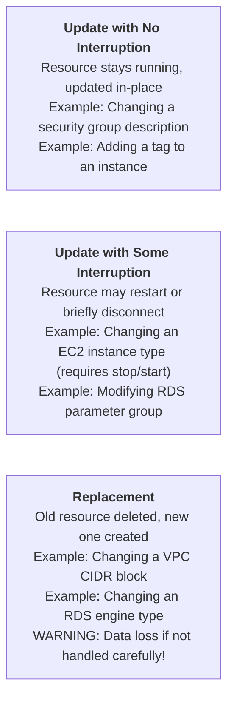
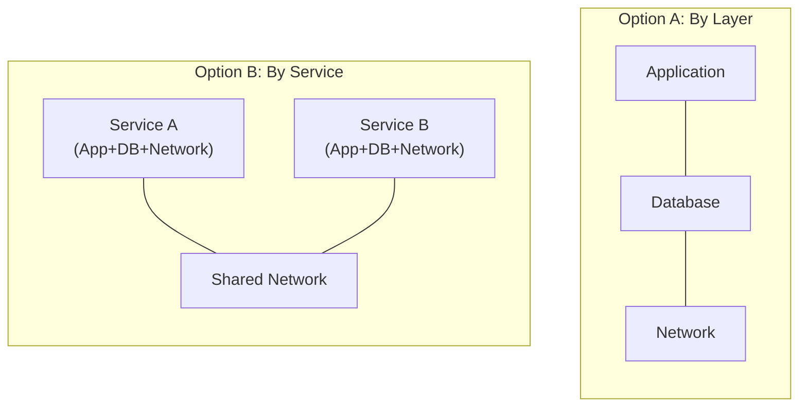

**Complexity:** `[MEDIUM]` | **Time to Complete:** 1.5 hours | **Track:** AWS DevOps Essentials

## Prerequisites

Before starting this module, ensure you have:
- Familiarity with Infrastructure as Code concepts (what IaC solves, declarative vs. imperative)
- Experience creating AWS resources via CLI (from previous modules)
- AWS CLI v2 installed and configured
- An AWS account with permissions to create VPCs, subnets, security groups, and CloudFormation stacks
- Comfortable reading YAML (JSON also works, but YAML is the standard for CloudFormation templates)

## What You'll Be Able to Do

After completing this module, you will be able to:

- **Deploy multi-resource CloudFormation stacks with parameters, mappings, and conditional logic**
- **Implement CloudFormation change sets and stack policies to prevent accidental deletion of stateful resources**
- **Design nested stacks and cross-stack references to modularize infrastructure templates at scale**
- **Diagnose CloudFormation rollback failures and resolve dependency conflicts in stack updates**

---

## Why This Module Matters

In March 2017, an engineer at a major US company was debugging a billing system issue in S3. The intended fix was to remove a small number of servers from a subsystem. Due to a typo in a manual command, a much larger set of servers was removed than intended. The cascading failure took down significant portions of the internet for nearly four hours, affecting companies from Slack to Trello to the SEC. AWS later published a detailed post-mortem and committed to adding safeguards. One of those safeguards? Better tooling around infrastructure changes so that a single mistyped command cannot cause region-wide impact.

This is what Infrastructure as Code solves at its core. When your infrastructure is defined in a template file, changes go through version control, code review, and automated validation before they touch production. A typo in a CloudFormation template fails at validation time, not at execution time. A bad change is caught in a pull request diff, not in a 4-hour outage post-mortem. And rollback is automatic -- CloudFormation undoes changes if a stack update fails, returning to the last known good state.

In this module, you will learn AWS CloudFormation -- the native IaC service that has been part of AWS since 2011. You will understand template structure, parameters, outputs, intrinsic functions, and how stacks manage the lifecycle of your resources. You will also learn when CloudFormation is the right choice versus Terraform, and where the AWS Cloud Development Kit (CDK) fits in.

---

## Did You Know?

- **CloudFormation manages over 750 AWS resource types** as of 2026, covering virtually every AWS service. When AWS launches a new service, CloudFormation support typically follows within weeks, often on launch day. The full resource specification is published as a JSON schema that is over 80 MB uncompressed.

- **A single CloudFormation stack can contain up to 500 resources**. For larger architectures, you use nested stacks or stack sets. The 500-resource limit has caught many teams who started with a monolithic template -- planning your stack boundaries early saves painful refactoring later.

- **CloudFormation drift detection**, launched in 2018, can tell you when someone has manually changed a resource that CloudFormation manages. This solves the "who touched production?" problem -- if a security group rule was added via the console, drift detection flags the discrepancy so you can decide whether to update the template or revert the manual change.

- **The AWS CDK (Cloud Development Kit)** generates CloudFormation templates under the hood. When you write CDK in TypeScript, Python, or Go, the `cdk synth` command produces a standard CloudFormation YAML template. This means CDK is not a replacement for CloudFormation -- it is a higher-level authoring tool that compiles down to it.

---

## Template Anatomy

A CloudFormation template is a YAML (or JSON) file that declares the desired state of your infrastructure. Here is the full structure:

```yaml
AWSTemplateFormatVersion: "2010-09-09"
Description: "What this template creates and why"

# Parameters: User-provided values at deploy time
Parameters:
  EnvironmentName:
    Type: String
    Default: production
    AllowedValues: [development, staging, production]

# Mappings: Static lookup tables
Mappings:
  RegionAMI:
    us-east-1:
      HVM64: ami-0abc123def456789
    eu-west-1:
      HVM64: ami-0def456abc789012

# Conditions: Conditional resource creation
Conditions:
  IsProduction: !Equals [!Ref EnvironmentName, production]

# Resources: The actual AWS resources (REQUIRED - only mandatory section)
Resources:
  MyVPC:
    Type: AWS::EC2::VPC
    Properties:
      CidrBlock: "10.0.0.0/16"

# Outputs: Values to export or display
Outputs:
  VPCId:
    Value: !Ref MyVPC
    Export:
      Name: !Sub "${EnvironmentName}-VPCId"
```

Only the `Resources` section is required. Everything else is optional but strongly recommended for production templates.

### Resources: The Core of Every Template

Each resource has a logical name (your label), a type (the AWS resource), and properties (configuration):

```yaml
Resources:
  # Logical name: WebServerSecurityGroup
  WebServerSecurityGroup:
    Type: AWS::EC2::SecurityGroup
    Properties:
      GroupDescription: "Allow HTTP and SSH"
      VpcId: !Ref MyVPC
      SecurityGroupIngress:
        - IpProtocol: tcp
          FromPort: 80
          ToPort: 80
          CidrIp: 0.0.0.0/0
        - IpProtocol: tcp
          FromPort: 22
          ToPort: 22
          CidrIp: 10.0.0.0/8
```

The logical name (`WebServerSecurityGroup`) is how you reference this resource elsewhere in the template. The physical name (the actual AWS resource ID) is generated by CloudFormation unless you explicitly set it -- and you usually should not, because explicit names prevent replacement updates.

> **Stop and think**: If CloudFormation automatically appends random alphanumeric suffixes to your physical resource names, how can you efficiently locate a specific DynamoDB table or S3 bucket in the AWS Console without manually searching through dozens of similarly named resources?

### Parameters: Making Templates Reusable

Parameters let you customize a template at deploy time without editing the file:

```yaml
Parameters:
  VPCCidr:
    Type: String
    Default: "10.0.0.0/16"
    Description: "CIDR block for the VPC"
    AllowedPattern: "^(\\d{1,3}\\.){3}\\d{1,3}/\\d{1,2}$"
    ConstraintDescription: "Must be a valid CIDR (e.g., 10.0.0.0/16)"

  InstanceType:
    Type: String
    Default: t3.micro
    AllowedValues:
      - t3.micro
      - t3.small
      - t3.medium
    Description: "EC2 instance type"

  KeyPairName:
    Type: AWS::EC2::KeyPair::KeyName
    Description: "Name of an existing EC2 key pair"

  EnableNATGateway:
    Type: String
    Default: "false"
    AllowedValues: ["true", "false"]
    Description: "Whether to create a NAT Gateway (adds cost)"
```

AWS-specific parameter types like `AWS::EC2::KeyPair::KeyName` provide dropdown validation in the console and catch errors before deployment starts.

### Outputs: Sharing Information Between Stacks

Outputs expose values from your stack -- either for human consumption or for cross-stack references:

```yaml
Outputs:
  VPCId:
    Description: "The VPC ID"
    Value: !Ref VPC
    Export:
      Name: !Sub "${AWS::StackName}-VPCId"

  PublicSubnet1Id:
    Description: "Public subnet in AZ1"
    Value: !Ref PublicSubnet1
    Export:
      Name: !Sub "${AWS::StackName}-PublicSubnet1Id"

  ALBDNSName:
    Description: "Application Load Balancer DNS name"
    Value: !GetAtt ApplicationLoadBalancer.DNSName
```

The `Export` field makes the value available to other stacks via `Fn::ImportValue`. This is how you share a VPC ID from a network stack with an application stack.

> **Pause and predict**: If Stack B uses `!ImportValue` to consume a VPC ID explicitly exported by Stack A, what exactly happens at the API level if an administrator mistakenly attempts to delete Stack A?

---

## Intrinsic Functions: The Template Programming Language

CloudFormation templates are declarative, but intrinsic functions add dynamic behavior. These are the functions you will use daily.

### Ref and GetAtt

```yaml
# !Ref returns the resource's primary identifier
# For an EC2 instance: the instance ID
# For a parameter: the parameter value
SecurityGroupId: !Ref WebServerSecurityGroup

# !GetAtt returns a specific attribute of a resource
# Different from !Ref -- GetAtt accesses secondary attributes
LoadBalancerDNS: !GetAtt ApplicationLoadBalancer.DNSName
SecurityGroupId: !GetAtt WebServerSecurityGroup.GroupId
```

### Sub (String Substitution)

```yaml
# Variable substitution in strings
# ${AWS::StackName} and ${AWS::Region} are pseudo-parameters
BucketName: !Sub "${AWS::StackName}-artifacts-${AWS::Region}"

# Reference resource attributes
UserData:
  Fn::Base64: !Sub |
    #!/bin/bash
    echo "VPC ID is ${VPC}" >> /var/log/setup.log
    echo "Region is ${AWS::Region}" >> /var/log/setup.log
    aws s3 cp s3://${ArtifactBucket}/config.yml /opt/app/config.yml
```

### Select, Split, and Join

```yaml
# Pick an item from a list
AZ: !Select [0, !GetAZs ""]   # First AZ in the region

# Split a string into a list
# If "10.0.0.0/16" --> ["10.0.0.0", "16"]
CidrParts: !Split ["/", !Ref VPCCidr]

# Join list items into a string
SubnetIds: !Join [",", [!Ref Subnet1, !Ref Subnet2, !Ref Subnet3]]
```

### Conditionals

```yaml
Conditions:
  IsProduction: !Equals [!Ref EnvironmentName, production]
  CreateNAT: !Equals [!Ref EnableNATGateway, "true"]
  ProdWithNAT: !And [!Condition IsProduction, !Condition CreateNAT]

Resources:
  NATGateway:
    Type: AWS::EC2::NatGateway
    Condition: CreateNAT    # Only created if condition is true
    Properties:
      SubnetId: !Ref PublicSubnet1
      AllocationId: !GetAtt NATElasticIP.AllocationId

  NATElasticIP:
    Type: AWS::EC2::EIP
    Condition: CreateNAT
    Properties:
      Domain: vpc

  # Use If to set property values conditionally
  WebServer:
    Type: AWS::EC2::Instance
    Properties:
      InstanceType: !If [IsProduction, t3.medium, t3.micro]
      Monitoring: !If [IsProduction, true, false]
```

### Quick Reference Table

| Function | Purpose | Example |
|----------|---------|---------|
| `!Ref` | Resource ID or parameter value | `!Ref MyVPC` |
| `!GetAtt` | Resource attribute | `!GetAtt ALB.DNSName` |
| `!Sub` | String interpolation | `!Sub "${AWS::StackName}-bucket"` |
| `!Select` | Pick from list | `!Select [0, !GetAZs ""]` |
| `!Split` | String to list | `!Split [",", "a,b,c"]` |
| `!Join` | List to string | `!Join ["-", ["my", "stack"]]` |
| `!If` | Conditional value | `!If [IsProd, t3.large, t3.micro]` |
| `!Equals` | Compare values | `!Equals [!Ref Env, prod]` |
| `!FindInMap` | Lookup in Mappings | `!FindInMap [RegionAMI, !Ref "AWS::Region", HVM64]` |
| `!ImportValue` | Cross-stack reference | `!ImportValue "network-stack-VPCId"` |
| `!GetAZs` | List AZs in region | `!GetAZs ""` (current region) |
| `!Cidr` | Generate CIDR blocks | `!Cidr [!Ref VPCCidr, 6, 8]` |

---

## Stack Lifecycle: Create, Update, Delete

A **stack** is an instance of a template. When you create a stack, CloudFormation provisions all the resources defined in the template. When you update a stack, it calculates the diff and applies only the changes. When you delete a stack, it tears down all resources in reverse dependency order.

### Creating a Stack

```bash
# Create a stack from a local template
aws cloudformation create-stack \
  --stack-name my-network \
  --template-body file://network.yaml \
  --parameters \
    ParameterKey=EnvironmentName,ParameterValue=production \
    ParameterKey=VPCCidr,ParameterValue=10.0.0.0/16

# Create a stack that creates IAM resources (requires explicit capability)
aws cloudformation create-stack \
  --stack-name my-app \
  --template-body file://app.yaml \
  --capabilities CAPABILITY_NAMED_IAM

# Wait for completion
aws cloudformation wait stack-create-complete --stack-name my-network

# Check stack status
aws cloudformation describe-stacks \
  --stack-name my-network \
  --query 'Stacks[0].[StackName,StackStatus]' \
  --output text
```

### Update Behavior: The Three Types of Resource Changes

When you update a stack, each resource change falls into one of three categories:



Always check the AWS documentation for a resource type to understand which property changes trigger replacement. The CloudFormation docs mark each property with "Update requires: No interruption," "Some interruption," or "Replacement."

> **Stop and think**: During a stack update, CloudFormation determines that an EC2 instance must be replaced. By default, it attempts to create the new instance before deleting the old one. If your template also provisions an Elastic IP address and attaches it directly to this instance, why might this "create-before-delete" replacement update immediately fail?

### Change Sets: Preview Before You Apply

Never update a production stack blindly. Create a change set first:

```bash
# Create a change set (does NOT apply changes)
aws cloudformation create-change-set \
  --stack-name my-network \
  --change-set-name update-subnets \
  --template-body file://network-v2.yaml \
  --parameters \
    ParameterKey=EnvironmentName,ParameterValue=production

# Review what will change
aws cloudformation describe-change-set \
  --stack-name my-network \
  --change-set-name update-subnets \
  --query 'Changes[*].ResourceChange.{Action:Action,Resource:LogicalResourceId,Type:ResourceType,Replacement:Replacement}' \
  --output table

# If changes look safe, execute
aws cloudformation execute-change-set \
  --stack-name my-network \
  --change-set-name update-subnets

# If changes are wrong, delete the change set (no effect on stack)
aws cloudformation delete-change-set \
  --stack-name my-network \
  --change-set-name update-subnets
```

The change set output tells you whether each resource will be Added, Modified, or Removed, and whether modification requires Replacement. This is your safety net.

### Rollback Behavior

If a stack creation or update fails, CloudFormation rolls back automatically:

- **Create failure**: All resources created so far are deleted
- **Update failure**: All changes are reverted to the previous state
- **Delete failure**: Stack enters `DELETE_FAILED` state (usually due to resources that cannot be deleted, like non-empty S3 buckets)

You can disable rollback for debugging (`--disable-rollback`), but never do this in production.

---

## Nested Stacks: Managing Complexity

When your infrastructure grows beyond 200-300 resources, a single template becomes unwieldy. Nested stacks let you compose multiple templates:

```yaml
# Parent template: main.yaml
Resources:
  NetworkStack:
    Type: AWS::CloudFormation::Stack
    Properties:
      TemplateURL: https://s3.amazonaws.com/my-templates/network.yaml
      Parameters:
        EnvironmentName: !Ref EnvironmentName
        VPCCidr: !Ref VPCCidr

  DatabaseStack:
    Type: AWS::CloudFormation::Stack
    DependsOn: NetworkStack
    Properties:
      TemplateURL: https://s3.amazonaws.com/my-templates/database.yaml
      Parameters:
        VPCId: !GetAtt NetworkStack.Outputs.VPCId
        PrivateSubnetIds: !GetAtt NetworkStack.Outputs.PrivateSubnetIds

  ApplicationStack:
    Type: AWS::CloudFormation::Stack
    DependsOn: [NetworkStack, DatabaseStack]
    Properties:
      TemplateURL: https://s3.amazonaws.com/my-templates/application.yaml
      Parameters:
        VPCId: !GetAtt NetworkStack.Outputs.VPCId
        DatabaseEndpoint: !GetAtt DatabaseStack.Outputs.DatabaseEndpoint
```

Common patterns for stack boundaries:



Option A (layer-based) works well for monolithic applications. Option B (service-based) works better for microservices where each team owns their full stack.

---

## CloudFormation vs Terraform: When to Use What

This is one of the most debated topics in DevOps. Here is an honest comparison:

| Factor | CloudFormation | Terraform |
|--------|---------------|-----------|
| **AWS-only** | Native, first-class | Excellent support via AWS provider |
| **Multi-cloud** | AWS only | Multi-cloud, multi-provider |
| **State management** | Managed by AWS (no state file) | State file (local or remote, you manage) |
| **Drift detection** | Built-in | `terraform plan` shows drift |
| **Rollback** | Automatic on failure | Manual (apply previous state) |
| **Language** | YAML/JSON (declarative) | HCL (declarative with loops, modules) |
| **Modularity** | Nested stacks, StackSets | Modules (more flexible) |
| **Learning curve** | Moderate (verbose but predictable) | Moderate (more features to learn) |
| **Cost** | Free | Free (OSS), paid for Terraform Cloud |
| **Community modules** | Limited (AWS Samples) | Vast (Terraform Registry) |
| **Speed** | Slower (sequential by default) | Faster (parallel by default) |

**Use CloudFormation when:**
- Your organization is AWS-only and will stay that way
- You want zero state management overhead
- You need automatic rollback guarantees
- You are using AWS services that require CloudFormation (Service Catalog, Control Tower)

**Use Terraform when:**
- You use multiple cloud providers or SaaS services
- You need HCL's programming features (for-each loops, dynamic blocks)
- Your team already knows Terraform
- You want a rich ecosystem of community modules

Many teams use both: CloudFormation for AWS-native constructs (especially in landing zones and governance) and Terraform for application infrastructure.

---

## AWS CDK: Brief Mention

The AWS Cloud Development Kit lets you define CloudFormation resources using real programming languages (TypeScript, Python, Java, C#, Go). Under the hood, CDK generates a CloudFormation template:

```python
# CDK Python example -- this generates a CloudFormation template
from aws_cdk import Stack, aws_ec2 as ec2
from constructs import Construct

class NetworkStack(Stack):
    def __init__(self, scope: Construct, id: str, **kwargs):
        super().__init__(scope, id, **kwargs)

        self.vpc = ec2.Vpc(self, "MainVPC",
            max_azs=3,
            nat_gateways=1,
            subnet_configuration=[
                ec2.SubnetConfiguration(
                    name="Public",
                    subnet_type=ec2.SubnetType.PUBLIC,
                    cidr_mask=24
                ),
                ec2.SubnetConfiguration(
                    name="Private",
                    subnet_type=ec2.SubnetType.PRIVATE_WITH_EGRESS,
                    cidr_mask=24
                )
            ]
        )
```

This 20-line Python class generates a CloudFormation template with a VPC, 6 subnets (public + private in 3 AZs), route tables, a NAT Gateway, and an Internet Gateway -- roughly 200 lines of YAML. CDK is worth learning if you find yourself writing repetitive CloudFormation templates, but understanding raw CloudFormation first is essential because CDK debugging requires reading the generated template.

---

## Common Mistakes

| Mistake | Why It Happens | How to Fix It |
|---------|---------------|---------------|
| Hardcoding resource names | Wanting predictable names | Let CloudFormation generate names; hardcoded names prevent replacement updates and cause conflicts across environments |
| Not using change sets for production updates | "I know what changed" confidence | Always create and review a change set; the 30 seconds it takes has prevented countless outages |
| Monolithic templates with 400+ resources | Starting small and never splitting | Plan stack boundaries early; split by layer (network/app/data) or by service boundary |
| Forgetting `--capabilities CAPABILITY_NAMED_IAM` | Template creates IAM roles but deploy command omits the flag | Add `CAPABILITY_NAMED_IAM` (or `CAPABILITY_IAM`) whenever your template creates IAM resources |
| Not setting `DeletionPolicy: Retain` on databases | Assuming delete protection is enough | Set `DeletionPolicy: Retain` on RDS instances, S3 buckets with data, and DynamoDB tables so accidental stack deletion does not destroy data |
| Using `!Ref` when `!GetAtt` is needed | Confusion about which function returns which value | `!Ref` returns the primary identifier (e.g., instance ID); `!GetAtt` returns other attributes (e.g., DNS name, ARN); check the docs for each resource type |
| Manual console changes to CloudFormation-managed resources | "Just this one quick fix" | Run drift detection regularly; treat manual changes as tech debt that must be reconciled with the template |
| Not exporting outputs from shared stacks | Copy-pasting resource IDs between templates | Use `Export` on outputs and `Fn::ImportValue` in consuming stacks; this creates explicit dependencies and prevents accidental deletion |

---

## Quiz

<details>
<summary>1. You are deploying a massive infrastructure update involving 50 new resources. During the deployment, the 45th resource fails to create due to an insufficient permissions error. What state will the first 44 resources be in after the deployment process fully concludes?</summary>

CloudFormation will automatically roll back the entire deployment, meaning the first 44 resources will be completely deleted if this was a new stack, or reverted to their previous state if this was an update. This "all-or-nothing" transaction model ensures your infrastructure never gets stuck in an inconsistent, partially deployed state. Once the rollback finishes, the stack will reach the `UPDATE_ROLLBACK_COMPLETE` or `ROLLBACK_COMPLETE` state, representing the last known good configuration. This automatic safety mechanism is a key differentiator from tools like Terraform, where a failed apply often leaves resources in a partial state that requires manual cleanup.
</details>

<details>
<summary>2. Your company is expanding its network and you need to increase the size of an existing production VPC. You update the `CidrBlock` property in your CloudFormation template from `10.0.0.0/16` to `10.0.0.0/15` and execute the update. What is the immediate impact on the resources currently running inside this VPC?</summary>

Updating the CIDR block of an existing VPC is a change that strictly requires replacement, meaning CloudFormation will attempt to create a brand new VPC and delete the old one. Because a VPC cannot be deleted while it still contains active subnets, instances, and network interfaces, the update will almost certainly fail and roll back unless you have orchestrated a complex migration strategy. This destructive behavior occurs because the fundamental networking boundary of the resources is changing, preventing an in-place modification. You should always use change sets to catch `Replacement: True` actions on foundational resources before they cause widespread outages or failed updates.
</details>

<details>
<summary>3. You are writing a CloudFormation template that deploys an EC2 instance and a configuration script. You need to pass the instance's private IP address to the script as an environment variable, but using `!Ref MyInstance` is causing the script to fail. Why is this happening, and how do you resolve it?</summary>

The script is failing because `!Ref` applied to an EC2 instance returns the instance's primary identifier, which is its Instance ID (e.g., `i-0abc123def456789`), not its IP address. To retrieve secondary attributes like IP addresses or DNS names, you must use the `!GetAtt` intrinsic function instead. By changing your template to use `!GetAtt MyInstance.PrivateIp`, CloudFormation will correctly resolve and inject the private IP address into your configuration script. Always consult the CloudFormation resource reference documentation, as each resource type defines exactly what `!Ref` returns and which specific attributes are exposed via `!GetAtt`.
</details>

<details>
<summary>4. You have explicitly named a production S3 bucket `my-app-data-bucket` in your CloudFormation template. Months later, you modify the template to change the bucket's physical location (a property requiring replacement) and execute the update. Why does the update immediately fail and roll back?</summary>

The update fails because explicitly hardcoded names prevent CloudFormation from performing its standard "create-before-delete" replacement process. When CloudFormation attempts to create the new replacement bucket, it tries to use the exact same name (`my-app-data-bucket`), which collides with the existing bucket that has not been deleted yet. Because S3 bucket names must be globally unique, AWS rejects the creation request, causing the entire stack update to abort and roll back. To avoid this lifecycle deadlock, you should allow CloudFormation to auto-generate physical names or use dynamic names incorporating the stack name, ensuring replacement resources get a unique identifier before the old resource is destroyed.
</details>

<details>
<summary>5. Your platform team manages the core VPC network, while three independent product teams manage their own application stacks that need to deploy resources into that VPC. Should you use nested stacks to connect the applications to the network, or cross-stack references (Exports/ImportValue)? Why?</summary>

You should use cross-stack references (Outputs with `Export` and `!ImportValue`) because the network and the applications have completely independent lifecycles and are managed by different teams. Nested stacks are designed for tightly coupled resources that share a single lifecycle and are deployed together by a single owner as a monolithic unit. By using cross-stack references, you establish a hard dependency graph at the AWS level, ensuring the platform team cannot accidentally delete the core VPC while the product teams' applications are still actively relying on its exported subnets. This loosely coupled approach perfectly aligns with the organizational boundary between the platform and product teams.
</details>

<details>
<summary>6. Your team is adopting AWS CDK to replace raw YAML templates. A developer argues that since CDK uses TypeScript, they no longer need to understand CloudFormation concepts like logical IDs, stack rollbacks, or change sets. How would you correct this architectural misunderstanding?</summary>

You must correct this misunderstanding by explaining that CDK is not an alternative infrastructure engine, but rather a higher-level abstraction layer that compiles directly down into standard CloudFormation templates. When you run `cdk deploy`, AWS is still executing a CloudFormation stack under the hood. This means all the fundamental rules of CloudFormation—including resource replacement behaviors, stack state machines, and drift detection—still entirely govern your deployment. Furthermore, when deployments fail, AWS returns errors referencing the generated CloudFormation logical IDs and property structures, making it impossible to effectively debug CDK applications without a solid understanding of the underlying CloudFormation engine.
</details>

<details>
<summary>7. A junior engineer accidentally deletes the CloudFormation stack that manages your production RDS database. After the stack deletion successfully completes, you find that the database instance is still running normally and the data is completely intact. What specific template configuration prevented a catastrophic data loss, and how does it alter the standard stack lifecycle?</summary>

The template utilized the `DeletionPolicy: Retain` attribute on the RDS database resource, which explicitly overrides CloudFormation's default behavior of destroying managed resources during stack deletion. When the stack was deleted, CloudFormation simply removed the database from its internal tracking state, leaving the physical AWS resource abandoned but completely operational. This safeguard is critical for any stateful resource containing persistent data, as it decouples the lifecycle of the data from the lifecycle of the infrastructure automation code. To resume managing the database with IaC, you would need to import the retained resource back into a new CloudFormation stack.
</details>

---

## Hands-On Exercise: Deploy a VPC Architecture from CloudFormation

### Objective

Create a production-ready VPC with public and private subnets across two availability zones, an Internet Gateway, and a NAT Gateway -- all defined in a single CloudFormation template. Then update the stack using a change set.

### Task 1: Write the CloudFormation Template

Create a template that defines a VPC with public and private subnets.

<details>
<summary>Solution</summary>

Save this as `vpc-stack.yaml`:

```yaml
AWSTemplateFormatVersion: "2010-09-09"
Description: "Production VPC with public and private subnets in 2 AZs"

Parameters:
  EnvironmentName:
    Type: String
    Default: cfn-lab
    Description: "Environment name prefixed to resources"

  VPCCidr:
    Type: String
    Default: "10.100.0.0/16"
    Description: "CIDR block for the VPC"

  PublicSubnet1Cidr:
    Type: String
    Default: "10.100.1.0/24"

  PublicSubnet2Cidr:
    Type: String
    Default: "10.100.2.0/24"

  PrivateSubnet1Cidr:
    Type: String
    Default: "10.100.10.0/24"

  PrivateSubnet2Cidr:
    Type: String
    Default: "10.100.20.0/24"

  EnableNATGateway:
    Type: String
    Default: "true"
    AllowedValues: ["true", "false"]
    Description: "Create a NAT Gateway for private subnet internet access"

Conditions:
  CreateNAT: !Equals [!Ref EnableNATGateway, "true"]

Resources:
  # ============ VPC ============
  VPC:
    Type: AWS::EC2::VPC
    Properties:
      CidrBlock: !Ref VPCCidr
      EnableDnsSupport: true
      EnableDnsHostnames: true
      Tags:
        - Key: Name
          Value: !Sub "${EnvironmentName}-vpc"

  # ============ Internet Gateway ============
  InternetGateway:
    Type: AWS::EC2::InternetGateway
    Properties:
      Tags:
        - Key: Name
          Value: !Sub "${EnvironmentName}-igw"

  InternetGatewayAttachment:
    Type: AWS::EC2::VPCGatewayAttachment
    Properties:
      InternetGatewayId: !Ref InternetGateway
      VpcId: !Ref VPC

  # ============ Public Subnets ============
  PublicSubnet1:
    Type: AWS::EC2::Subnet
    Properties:
      VpcId: !Ref VPC
      AvailabilityZone: !Select [0, !GetAZs ""]
      CidrBlock: !Ref PublicSubnet1Cidr
      MapPublicIpOnLaunch: true
      Tags:
        - Key: Name
          Value: !Sub "${EnvironmentName}-public-1"

  PublicSubnet2:
    Type: AWS::EC2::Subnet
    Properties:
      VpcId: !Ref VPC
      AvailabilityZone: !Select [1, !GetAZs ""]
      CidrBlock: !Ref PublicSubnet2Cidr
      MapPublicIpOnLaunch: true
      Tags:
        - Key: Name
          Value: !Sub "${EnvironmentName}-public-2"

  # ============ Private Subnets ============
  PrivateSubnet1:
    Type: AWS::EC2::Subnet
    Properties:
      VpcId: !Ref VPC
      AvailabilityZone: !Select [0, !GetAZs ""]
      CidrBlock: !Ref PrivateSubnet1Cidr
      Tags:
        - Key: Name
          Value: !Sub "${EnvironmentName}-private-1"

  PrivateSubnet2:
    Type: AWS::EC2::Subnet
    Properties:
      VpcId: !Ref VPC
      AvailabilityZone: !Select [1, !GetAZs ""]
      CidrBlock: !Ref PrivateSubnet2Cidr
      Tags:
        - Key: Name
          Value: !Sub "${EnvironmentName}-private-2"

  # ============ Public Route Table ============
  PublicRouteTable:
    Type: AWS::EC2::RouteTable
    Properties:
      VpcId: !Ref VPC
      Tags:
        - Key: Name
          Value: !Sub "${EnvironmentName}-public-rt"

  DefaultPublicRoute:
    Type: AWS::EC2::Route
    DependsOn: InternetGatewayAttachment
    Properties:
      RouteTableId: !Ref PublicRouteTable
      DestinationCidrBlock: 0.0.0.0/0
      GatewayId: !Ref InternetGateway

  PublicSubnet1RouteTableAssoc:
    Type: AWS::EC2::SubnetRouteTableAssociation
    Properties:
      SubnetId: !Ref PublicSubnet1
      RouteTableId: !Ref PublicRouteTable

  PublicSubnet2RouteTableAssoc:
    Type: AWS::EC2::SubnetRouteTableAssociation
    Properties:
      SubnetId: !Ref PublicSubnet2
      RouteTableId: !Ref PublicRouteTable

  # ============ NAT Gateway (Conditional) ============
  NATElasticIP:
    Type: AWS::EC2::EIP
    Condition: CreateNAT
    DependsOn: InternetGatewayAttachment
    Properties:
      Domain: vpc
      Tags:
        - Key: Name
          Value: !Sub "${EnvironmentName}-nat-eip"

  NATGateway:
    Type: AWS::EC2::NatGateway
    Condition: CreateNAT
    Properties:
      AllocationId: !GetAtt NATElasticIP.AllocationId
      SubnetId: !Ref PublicSubnet1
      Tags:
        - Key: Name
          Value: !Sub "${EnvironmentName}-nat"

  # ============ Private Route Table ============
  PrivateRouteTable:
    Type: AWS::EC2::RouteTable
    Properties:
      VpcId: !Ref VPC
      Tags:
        - Key: Name
          Value: !Sub "${EnvironmentName}-private-rt"

  DefaultPrivateRoute:
    Type: AWS::EC2::Route
    Condition: CreateNAT
    Properties:
      RouteTableId: !Ref PrivateRouteTable
      DestinationCidrBlock: 0.0.0.0/0
      NatGatewayId: !Ref NATGateway

  PrivateSubnet1RouteTableAssoc:
    Type: AWS::EC2::SubnetRouteTableAssociation
    Properties:
      SubnetId: !Ref PrivateSubnet1
      RouteTableId: !Ref PrivateRouteTable

  PrivateSubnet2RouteTableAssoc:
    Type: AWS::EC2::SubnetRouteTableAssociation
    Properties:
      SubnetId: !Ref PrivateSubnet2
      RouteTableId: !Ref PrivateRouteTable

Outputs:
  VPCId:
    Description: "VPC ID"
    Value: !Ref VPC
    Export:
      Name: !Sub "${EnvironmentName}-VPCId"

  PublicSubnet1Id:
    Description: "Public Subnet 1 ID"
    Value: !Ref PublicSubnet1
    Export:
      Name: !Sub "${EnvironmentName}-PublicSubnet1Id"

  PublicSubnet2Id:
    Description: "Public Subnet 2 ID"
    Value: !Ref PublicSubnet2
    Export:
      Name: !Sub "${EnvironmentName}-PublicSubnet2Id"

  PrivateSubnet1Id:
    Description: "Private Subnet 1 ID"
    Value: !Ref PrivateSubnet1
    Export:
      Name: !Sub "${EnvironmentName}-PrivateSubnet1Id"

  PrivateSubnet2Id:
    Description: "Private Subnet 2 ID"
    Value: !Ref PrivateSubnet2
    Export:
      Name: !Sub "${EnvironmentName}-PrivateSubnet2Id"

  PublicSubnetIds:
    Description: "Comma-separated public subnet IDs"
    Value: !Join [",", [!Ref PublicSubnet1, !Ref PublicSubnet2]]

  PrivateSubnetIds:
    Description: "Comma-separated private subnet IDs"
    Value: !Join [",", [!Ref PrivateSubnet1, !Ref PrivateSubnet2]]
```
</details>

### Task 2: Validate and Deploy the Stack

Validate the template syntax, then create the stack.

<details>
<summary>Solution</summary>

```bash
# Validate the template (catches syntax errors)
aws cloudformation validate-template \
  --template-body file://vpc-stack.yaml

# Create the stack (without NAT Gateway to save cost)
aws cloudformation create-stack \
  --stack-name cfn-lab-network \
  --template-body file://vpc-stack.yaml \
  --parameters \
    ParameterKey=EnvironmentName,ParameterValue=cfn-lab \
    ParameterKey=EnableNATGateway,ParameterValue=false

# Wait for creation to complete
aws cloudformation wait stack-create-complete --stack-name cfn-lab-network

# Check status
aws cloudformation describe-stacks \
  --stack-name cfn-lab-network \
  --query 'Stacks[0].[StackName,StackStatus,CreationTime]' \
  --output table

# View the outputs
aws cloudformation describe-stacks \
  --stack-name cfn-lab-network \
  --query 'Stacks[0].Outputs[*].[OutputKey,OutputValue]' \
  --output table
```
</details>

### Task 3: Update the Stack Using a Change Set

Enable the NAT Gateway by updating the `EnableNATGateway` parameter.

<details>
<summary>Solution</summary>

```bash
# Create a change set to preview the update
aws cloudformation create-change-set \
  --stack-name cfn-lab-network \
  --change-set-name enable-nat-gateway \
  --template-body file://vpc-stack.yaml \
  --parameters \
    ParameterKey=EnvironmentName,ParameterValue=cfn-lab \
    ParameterKey=EnableNATGateway,ParameterValue=true

# Wait for change set to be created
aws cloudformation wait change-set-create-complete \
  --stack-name cfn-lab-network \
  --change-set-name enable-nat-gateway

# Review what will change
aws cloudformation describe-change-set \
  --stack-name cfn-lab-network \
  --change-set-name enable-nat-gateway \
  --query 'Changes[*].ResourceChange.{Action:Action,LogicalId:LogicalResourceId,Type:ResourceType}' \
  --output table

# You should see: Add NATElasticIP, Add NATGateway, Add DefaultPrivateRoute

# Execute the change set
aws cloudformation execute-change-set \
  --stack-name cfn-lab-network \
  --change-set-name enable-nat-gateway

# Wait for update to complete
aws cloudformation wait stack-update-complete --stack-name cfn-lab-network

# Verify NAT Gateway was created
aws ec2 describe-nat-gateways \
  --filter "Name=tag:Name,Values=cfn-lab-nat" \
  --query 'NatGateways[*].[NatGatewayId,State,SubnetId]' \
  --output table
```
</details>

### Task 4: Run Drift Detection

Simulate a manual change, then detect the drift.

<details>
<summary>Solution</summary>

```bash
# Get the VPC ID from the stack outputs
VPC_ID=$(aws cloudformation describe-stacks \
  --stack-name cfn-lab-network \
  --query 'Stacks[0].Outputs[?OutputKey==`VPCId`].OutputValue' --output text)

# Make a manual change (add a tag via console or CLI)
aws ec2 create-tags \
  --resources $VPC_ID \
  --tags Key=ManualChange,Value=SomeoneUsedTheConsole

# Detect drift
DRIFT_ID=$(aws cloudformation detect-stack-drift \
  --stack-name cfn-lab-network \
  --query 'StackDriftDetectionId' --output text)

# Wait a moment for detection to complete
sleep 15

# Check drift status
aws cloudformation describe-stack-drift-detection-status \
  --stack-drift-detection-id $DRIFT_ID \
  --query '[StackDriftStatus,DetectionStatus]' --output text

# See which resources drifted
aws cloudformation describe-stack-resource-drifts \
  --stack-name cfn-lab-network \
  --stack-resource-drift-status-filters MODIFIED \
  --query 'StackResourceDrifts[*].[LogicalResourceId,StackResourceDriftStatus]' \
  --output table
```
</details>

### Task 5: Clean Up

<details>
<summary>Solution</summary>

```bash
# Delete the stack (this removes all resources)
aws cloudformation delete-stack --stack-name cfn-lab-network

# Wait for deletion
aws cloudformation wait stack-delete-complete --stack-name cfn-lab-network

# Verify the stack is gone
aws cloudformation list-stacks \
  --stack-status-filter DELETE_COMPLETE \
  --query 'StackSummaries[?StackName==`cfn-lab-network`].[StackName,StackStatus,DeletionTime]' \
  --output table
```
</details>

### Success Criteria

- [ ] Template validates without errors (`validate-template` passes)
- [ ] Stack creates successfully with VPC, 4 subnets, Internet Gateway, and route tables
- [ ] Stack outputs show correct VPC ID and subnet IDs
- [ ] Change set correctly previews the NAT Gateway addition (3 new resources)
- [ ] Stack update adds NAT Gateway and private route successfully
- [ ] Drift detection identifies the manual tag change on the VPC
- [ ] Stack deletes cleanly with all resources removed

---

## Next Module

You have completed the AWS DevOps Essentials infrastructure modules. Return to the [AWS Essentials README]() to review your progress and explore advanced topics. From here, consider diving into the [Platform Engineering Track](/platform/) to learn how these AWS building blocks fit into a broader platform strategy.