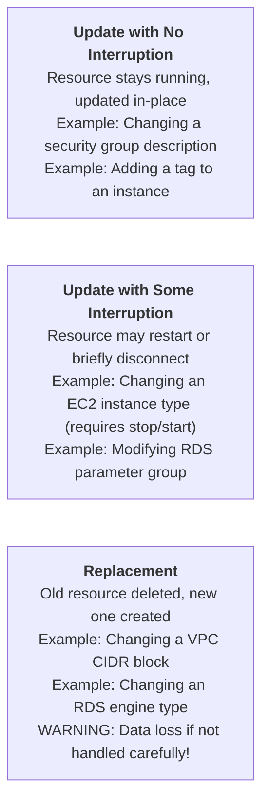
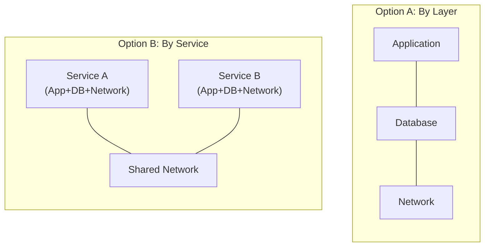

**Complexity:** `[MEDIUM]` | **Time to Complete:** 1.5 hours | **Track:** AWS DevOps Essentials

## Prerequisites

Before beginning this module, ensure you have the following prerequisites in place:
- Familiarity with Infrastructure as Code concepts, specifically understanding the difference between declarative and imperative provisioning paradigms.
- Experience creating AWS resources via the Command Line Interface, which establishes the baseline knowledge of the API calls that CloudFormation automates.
- The AWS CLI version 2 installed and configured with appropriate credentials on your local workstation.
- An AWS account with administrator-level permissions to create Virtual Private Clouds, subnets, security groups, and CloudFormation stacks.
- Comfort reading and analyzing configuration files, as this module relies heavily on declarative data serialization.

## What You'll Be Able to Do

After completing this rigorous module, you will possess the capabilities to:

- **Design** multi-resource CloudFormation templates integrating parameters, mappings, and complex conditional logic to support multi-environment deployments.
- **Implement** CloudFormation change sets and apply restrictive stack policies to prevent the accidental deletion or modification of stateful data resources.
- **Evaluate** stack architecture to modularize infrastructure templates using nested stacks and cross-stack references, scaling up to enterprise-level environments.
- **Diagnose** CloudFormation rollback failures and resolve difficult dependency conflicts during in-place stack updates and replacements.
- **Compare** the resource lifecycle behaviors of CloudFormation with third-party tools like Terraform to make informed architectural decisions.

---

## Why This Module Matters

In March 2017, an engineer at Amazon Web Services was debugging a billing system issue within the Simple Storage Service (S3) in the Northern Virginia region. The intended fix was to execute a routine playbook to remove a small number of servers from an indexing subsystem. Due to a simple typo in a manual operational command, a significantly larger set of servers was forcefully removed than originally intended. This simple human error triggered a cascading failure that took down massive portions of the internet for nearly four hours, resulting in an estimated 150 million dollars in financial impact across companies ranging from Slack to Trello to the Securities and Exchange Commission.

AWS later published a highly detailed post-mortem analyzing the root causes and committed to adding extensive systemic safeguards. One of the most critical safeguards emphasized in the aftermath was the necessity of robust tooling around infrastructure changes, ensuring that a single mistyped command cannot immediately cause region-wide catastrophic impact. The industry learned a hard lesson that day: imperative, manual operations performed directly against production infrastructure are an unacceptable risk profile for modern systems.

This is precisely what Infrastructure as Code solves at its foundational core. When your infrastructure is defined explicitly in a text-based template file, changes are forced to go through version control, peer code review, and automated pre-flight validation before they ever touch a production environment. A syntax typo in a CloudFormation template fails safely at validation time, rather than crashing an active system during execution. A dangerous architectural change is caught in a pull request diff, rather than discovered during a four-hour outage post-mortem. Furthermore, rollback is fully automatic—CloudFormation undoes applied changes if a stack update fails halfway through, systematically returning the environment to the last known good configuration state.

---

## Did You Know?

- **CloudFormation manages over 750 distinct AWS resource types** as of 2026, covering virtually every service in the AWS ecosystem. When AWS launches a new service, CloudFormation support typically follows within weeks, often appearing on launch day. The full resource specification is published as a JSON schema that weighs in at over 80 megabytes uncompressed.
- **A single CloudFormation stack can contain a maximum of 500 resources**. For larger architectures, engineers must utilize nested stacks or stack sets. The 500-resource limit has caught many teams by surprise when they started with a monolithic template, proving that planning your stack boundaries early saves highly painful refactoring efforts later in the project lifecycle.
- **CloudFormation drift detection**, originally launched in November 2018, can definitively tell you when an administrator has manually changed a resource that CloudFormation manages. This solves the classic "who touched production?" problem; if a security group rule was added via the management console, drift detection flags the discrepancy immediately so you can decide whether to update the source template or revert the manual change.
- **The AWS Cloud Development Kit**, introduced in July 2019, fundamentally generates CloudFormation templates under the hood. When you write infrastructure code in TypeScript, Python, or Go, the synthesizer command produces a standard declarative YAML template, meaning the kit is not a replacement for CloudFormation but rather a powerful higher-level authoring abstraction that compiles down to it.

---

## Declarative Templates and Architecture

CloudFormation fundamentally shifts your perspective from imperative commands (telling AWS *how* to build something) to a declarative model (telling AWS *what* you want the final state to be). Think of CloudFormation like an architect's blueprint for a skyscraper. The architect does not write instructions for the construction workers on how to mix concrete or operate cranes; they simply draw the final layout of the building. The CloudFormation service acts as the general contractor, interpreting your blueprint and determining the correct order of operations to construct it.

### Template Anatomy

A CloudFormation template is a structured file that declares the desired state of your entire infrastructure. Let us examine the full hierarchical structure of a standard template:

```cloudformation
AWSTemplateFormatVersion: "2010-09-09"
Description: "What this template creates and why"

# Parameters: User-provided values at deploy time
Parameters:
  EnvironmentName:
    Type: String
    Default: production
    AllowedValues: [development, staging, production]

# Mappings: Static lookup tables
Mappings:
  RegionAMI:
    us-east-1:
      HVM64: ami-0abc123def456789
    eu-west-1:
      HVM64: ami-0def456abc789012

# Conditions: Conditional resource creation
Conditions:
  IsProduction: !Equals [!Ref EnvironmentName, production]

# Resources: The actual AWS resources (REQUIRED - only mandatory section)
Resources:
  MyVPC:
    Type: AWS::EC2::VPC
    Properties:
      CidrBlock: "10.0.0.0/16"

# Outputs: Values to export or display
Outputs:
  VPCId:
    Value: !Ref MyVPC
    Export:
      Name: !Sub "${EnvironmentName}-VPCId"
```

Only the `Resources` section is strictly required by the CloudFormation engine. Everything else is technically optional but strongly recommended for professional, production-grade templates. Each top-level section serves a distinct purpose in making the template robust, reusable, and dynamic across multiple environments.

### Resources: The Core of Every Template

Resources form the absolute center of gravity for your template. Each resource entry must have a logical name (which acts as your internal label), a resource type (dictating the AWS service), and a properties block (providing the specific configuration details).

```cloudformation
Resources:
  # Logical name: WebServerSecurityGroup
  WebServerSecurityGroup:
    Type: AWS::EC2::SecurityGroup
    Properties:
      GroupDescription: "Allow HTTP and SSH"
      VpcId: !Ref MyVPC
      SecurityGroupIngress:
        - IpProtocol: tcp
          FromPort: 80
          ToPort: 80
          CidrIp: 0.0.0.0/0
        - IpProtocol: tcp
          FromPort: 22
          ToPort: 22
          CidrIp: 10.0.0.0/8
```

The logical name (`WebServerSecurityGroup`) is how you reference this specific resource elsewhere inside the same template. In contrast, the physical name (the actual AWS resource ID generated in the cloud) is generated autonomously by CloudFormation unless you explicitly define it. You should almost never hardcode physical names, because doing so can prevent some replacement updates from functioning correctly.

> **Stop and think**: If CloudFormation automatically appends random alphanumeric suffixes to your physical resource names, how can you efficiently locate a specific DynamoDB table or S3 bucket in the AWS Console without manually searching through dozens of similarly named resources?

When resources are dynamically named, the best practice for discovering them is through the Stack Outputs tab or by utilizing strict resource tagging strategies. By standardizing tags such as `Environment` and `Project`, you can query the Resource Groups Tagging API to find your assets quickly.

### Parameters: Making Templates Reusable

Hardcoding values is a severe anti-pattern in Infrastructure as Code. Parameters allow you to customize a template dynamically at deployment time without ever editing the underlying file. This is what enables you to use the exact same template for both testing and production environments.

```cloudformation
Parameters:
  VPCCidr:
    Type: String
    Default: "10.0.0.0/16"
    Description: "CIDR block for the VPC"
    AllowedPattern: "^(\\d{1,3}\\.){3}\\d{1,3}/\\d{1,2}$"
    ConstraintDescription: "Must be a valid CIDR (e.g., 10.0.0.0/16)"

  InstanceType:
    Type: String
    Default: t3.micro
    AllowedValues:
      - t3.micro
      - t3.small
      - t3.medium
    Description: "EC2 instance type"

  KeyPairName:
    Type: AWS::EC2::KeyPair::KeyName
    Description: "Name of an existing EC2 key pair"

  EnableNATGateway:
    Type: String
    Default: "false"
    AllowedValues: ["true", "false"]
    Description: "Whether to create a NAT Gateway (adds cost)"
```

AWS-specific parameter types, such as `AWS::EC2::KeyPair::KeyName`, are particularly powerful. When deploying a stack through the AWS Management Console, these types provide automatic dropdown validation, fetching valid keys from your account and actively catching errors long before the deployment process even begins. Furthermore, using `AllowedPattern` with regular expressions guarantees that input data conforms exactly to expected formats, such as validating a networking CIDR block.

### Outputs: Sharing Information Between Stacks

Outputs serve as the public API of your CloudFormation stack. They expose critical values from your deployed resources, either for direct human consumption in the console or to enable cross-stack references across the broader architecture.

```cloudformation
Outputs:
  VPCId:
    Description: "The VPC ID"
    Value: !Ref VPC
    Export:
      Name: !Sub "${AWS::StackName}-VPCId"

  PublicSubnet1Id:
    Description: "Public subnet in AZ1"
    Value: !Ref PublicSubnet1
    Export:
      Name: !Sub "${AWS::StackName}-PublicSubnet1Id"

  ALBDNSName:
    Description: "Application Load Balancer DNS name"
    Value: !GetAtt ApplicationLoadBalancer.DNSName
```

The `Export` block is what makes the value globally available to other stacks in the same region via the `Fn::ImportValue` intrinsic function. This precise mechanism is how you securely share a foundational VPC ID generated by a core networking stack with multiple independent application stacks.

> **Pause and predict**: If Stack B uses `!ImportValue` to consume a VPC ID explicitly exported by Stack A, what exactly happens at the API level if an administrator mistakenly attempts to delete Stack A?

CloudFormation is intelligent enough to track these cross-stack references securely. If an administrator tries to delete Stack A, the CloudFormation engine will immediately reject the deletion request and throw an error, citing that Stack B still depends on the exported value. This hard dependency lock provides a massive safety net against catastrophic infrastructure deletion.

---

## Intrinsic Functions: The Template Programming Language

While CloudFormation templates are strictly declarative, intrinsic functions add the dynamic behavior and runtime logic necessary for professional deployments. These functions are evaluated securely by the CloudFormation engine during the stack creation or update lifecycle.

### Ref and GetAtt

The two most common intrinsic functions deal with extracting information from your declared resources.

```cloudformation
# !Ref returns the resource's primary identifier
# For an EC2 instance: the instance ID
# For a parameter: the parameter value
SecurityGroupId: !Ref WebServerSecurityGroup

# !GetAtt returns a specific attribute of a resource
# Different from !Ref -- GetAtt accesses secondary attributes
LoadBalancerDNS: !GetAtt ApplicationLoadBalancer.DNSName
SecurityGroupId: !GetAtt WebServerSecurityGroup.GroupId
```

### Sub (String Substitution)

Constructing dynamic strings is necessary for naming conventions, resource tagging, and injection into configuration scripts like EC2 User Data.

```cloudformation
# Variable substitution in strings
# ${AWS::StackName} and ${AWS::Region} are pseudo-parameters
BucketName: !Sub "${AWS::StackName}-artifacts-${AWS::Region}"

# Reference resource attributes
UserData:
  Fn::Base64: !Sub |
    #!/bin/bash
    echo "VPC ID is ${VPC}" >> /var/log/setup.log
    echo "Region is ${AWS::Region}" >> /var/log/setup.log
    aws s3 cp s3://${ArtifactBucket}/config.yml /opt/app/config.yml
```

### Select, Split, and Join

Manipulating lists and arrays is a common requirement when dealing with availability zones, subnets, and routing configurations.

```cloudformation
# Pick an item from a list
AZ: !Select [0, !GetAZs ""]   # First AZ in the region

# Split a string into a list
# If "10.0.0.0/16" --> ["10.0.0.0", "16"]
CidrParts: !Split ["/", !Ref VPCCidr]

# Join list items into a string
SubnetIds: !Join [",", [!Ref Subnet1, !Ref Subnet2, !Ref Subnet3]]
```

### Conditionals

Real-world infrastructure templates must adapt based on the deployment environment. You might want highly available NAT Gateways in production, but completely omit them in development to save extensive costs. Conditionals make this possible without duplicating code.

```cloudformation
Conditions:
  IsProduction: !Equals [!Ref EnvironmentName, production]
  CreateNAT: !Equals [!Ref EnableNATGateway, "true"]
  ProdWithNAT: !And [!Condition IsProduction, !Condition CreateNAT]

Resources:
  NATGateway:
    Type: AWS::EC2::NatGateway
    Condition: CreateNAT    # Only created if condition is true
    Properties:
      SubnetId: !Ref PublicSubnet1
      AllocationId: !GetAtt NATElasticIP.AllocationId

  NATElasticIP:
    Type: AWS::EC2::EIP
    Condition: CreateNAT
    Properties:
      Domain: vpc

  # Use If to set property values conditionally
  WebServer:
    Type: AWS::EC2::Instance
    Properties:
      InstanceType: !If [IsProduction, t3.medium, t3.micro]
      Monitoring: !If [IsProduction, true, false]
```

### Quick Reference Table

Understanding these functions is critical. Study this reference table detailing their syntax and common use cases:

| Function | Purpose | Example |
|----------|---------|---------|
| `!Ref` | Resource ID or parameter value | `!Ref MyVPC` |
| `!GetAtt` | Resource attribute | `!GetAtt ALB.DNSName` |
| `!Sub` | String interpolation | `!Sub "${AWS::StackName}-bucket"` |
| `!Select` | Pick from list | `!Select [0, !GetAZs ""]` |
| `!Split` | String to list | `!Split [",", "a,b,c"]` |
| `!Join` | List to string | `!Join ["-", ["my", "stack"]]` |
| `!If` | Conditional value | `!If [IsProd, t3.large, t3.micro]` |
| `!Equals` | Compare values | `!Equals [!Ref Env, prod]` |
| `!FindInMap` | Lookup in Mappings | `!FindInMap [RegionAMI, !Ref "AWS::Region", HVM64]` |
| `!ImportValue` | Cross-stack reference | `!ImportValue "network-stack-VPCId"` |
| `!GetAZs` | List AZs in region | `!GetAZs ""` (current region) |
| `!Cidr` | Generate CIDR blocks | `!Cidr [!Ref VPCCidr, 6, 8]` |

---

## Stack Lifecycle: Create, Update, Delete

A **stack** is an instantiated runtime environment derived directly from a template. When you create a stack, CloudFormation parses the template, resolves the dependency graph, and provisions all the resources in the exact correct order. When you update a stack, it intelligently calculates the diff and applies only the required changes. When you finally delete a stack, it systematically tears down all resources in the reverse order of their dependencies.

### Creating a Stack

Creating a stack involves submitting your template file along with the necessary runtime parameters to the CloudFormation API.

```bash
# Create a stack from a local template
aws cloudformation create-stack \
  --stack-name my-network \
  --template-body file://network.yaml \
  --parameters \
    ParameterKey=EnvironmentName,ParameterValue=production \
    ParameterKey=VPCCidr,ParameterValue=10.0.0.0/16

# Create a stack that creates IAM resources (requires explicit capability)
aws cloudformation create-stack \
  --stack-name my-app \
  --template-body file://app.yaml \
  --capabilities CAPABILITY_NAMED_IAM

# Wait for completion
aws cloudformation wait stack-create-complete --stack-name my-network

# Check stack status
aws cloudformation describe-stacks \
  --stack-name my-network \
  --query 'Stacks[0].[StackName,StackStatus]' \
  --output text
```

### Update Behavior: The Three Types of Resource Changes

When you submit an updated template to a running stack, CloudFormation analyzes the altered properties and categorizes the necessary changes into one of three distinct behavioral buckets:



It is imperative that you verify the official AWS documentation for a specific resource type to understand which property changes trigger a destructive replacement. The CloudFormation documentation prominently marks each property with "Update requires: No interruption," "Some interruption," or "Replacement."

> **Stop and think**: During a stack update, CloudFormation determines that an EC2 instance must be replaced. By default, it attempts to create the new instance before deleting the old one. If your template also provisions an Elastic IP address and attaches it directly to this instance, why might this "create-before-delete" replacement update immediately fail?

In this scenario, the Elastic IP is an exclusive resource that can only be associated with one running instance at a time. The "create-before-delete" process spins up the new instance and attempts to associate the Elastic IP to it while the old instance still holds the lock on that IP address. This causes a conflict, leading to an immediate stack update rollback. Handling exclusive dependencies requires careful template engineering.

### Change Sets: Preview Before You Apply

You must never update a production stack blindly. The concept of a Change Set acts as your primary safety mechanism, allowing you to preview exactly what modifications CloudFormation intends to execute before committing to them.

```bash
# Create a change set (does NOT apply changes)
aws cloudformation create-change-set \
  --stack-name my-network \
  --change-set-name update-subnets \
  --template-body file://network-v2.yaml \
  --parameters \
    ParameterKey=EnvironmentName,ParameterValue=production

# Review what will change
aws cloudformation describe-change-set \
  --stack-name my-network \
  --change-set-name update-subnets \
  --query 'Changes[*].ResourceChange.{Action:Action,Resource:LogicalResourceId,Type:ResourceType,Replacement:Replacement}' \
  --output table

# If changes look safe, execute
aws cloudformation execute-change-set \
  --stack-name my-network \
  --change-set-name update-subnets

# If changes are wrong, delete the change set (no effect on stack)
aws cloudformation delete-change-set \
  --stack-name my-network \
  --change-set-name update-subnets
```

The output of a change set is invaluable. It clearly informs you whether each resource will be Added, Modified, or Removed, and whether a modification will mandate a Replacement. Neglecting to review change sets has caused massive enterprise outages when engineers mistakenly assumed a parameter tweak was a safe in-place update.

### Rollback Behavior and Resilience

If a stack creation or update experiences a critical failure halfway through, CloudFormation exhibits its greatest strength: automatic rollback.

- **Create failure**: All resources created successfully so far are systematically deleted, leaving the environment clean.
- **Update failure**: All modifications are reverted meticulously to the previous state, maintaining system stability.
- **Delete failure**: The stack enters a `DELETE_FAILED` state. This usually occurs due to resources that physically cannot be deleted automatically, such as S3 buckets that still contain user data.

While you possess the ability to disable rollbacks during initial development for debugging purposes (via `--disable-rollback`), performing this action in a production environment is an immense risk and is strongly prohibited by DevOps standards.

---

## Nested Stacks: Managing Architectural Complexity

When an infrastructure footprint grows beyond a few hundred resources, attempting to maintain a single monolithic template file becomes an agonizing operational burden. Nested stacks allow you to break down your architecture, composing multiple independent templates into a cohesive deployment hierarchy.

```cloudformation
# Parent template: main.yaml
Resources:
  NetworkStack:
    Type: AWS::CloudFormation::Stack
    Properties:
      TemplateURL: https://s3.amazonaws.com/my-templates/network.yaml
      Parameters:
        EnvironmentName: !Ref EnvironmentName
        VPCCidr: !Ref VPCCidr

  DatabaseStack:
    Type: AWS::CloudFormation::Stack
    DependsOn: NetworkStack
    Properties:
      TemplateURL: https://s3.amazonaws.com/my-templates/database.yaml
      Parameters:
        VPCId: !GetAtt NetworkStack.Outputs.VPCId
        PrivateSubnetIds: !GetAtt NetworkStack.Outputs.PrivateSubnetIds

  ApplicationStack:
    Type: AWS::CloudFormation::Stack
    DependsOn: [NetworkStack, DatabaseStack]
    Properties:
      TemplateURL: https://s3.amazonaws.com/my-templates/application.yaml
      Parameters:
        VPCId: !GetAtt NetworkStack.Outputs.VPCId
        DatabaseEndpoint: !GetAtt DatabaseStack.Outputs.DatabaseEndpoint
```

Establishing strong architectural boundaries is vital when utilizing nested stacks. Engineering teams traditionally rely on two common abstraction patterns for stack division:



Option A (layer-based architecture) functions superbly for highly centralized monolithic applications governed by a single platform team. Option B (service-based architecture) is significantly more effective for dynamic microservices environments where cross-functional product teams own and deploy their complete stack autonomously.

---

## CloudFormation vs Terraform: When to Use What

This comparison represents one of the most vigorously debated topics in modern DevOps culture. Understanding the fundamental philosophical differences between CloudFormation and HashiCorp's Terraform is crucial for a senior cloud engineer.

| Factor | CloudFormation | Terraform |
|--------|---------------|-----------|
| **AWS-only** | Native, first-class | Excellent support via AWS provider |
| **Multi-cloud** | AWS only | Multi-cloud, multi-provider |
| **State management** | Managed by AWS (no state file) | State file (local or remote, you manage) |
| **Drift detection** | Built-in | `terraform plan` shows drift |
| **Rollback** | Automatic on failure | Manual (apply previous state) |
| **Language** | YAML/JSON (declarative) | HCL (declarative with loops, modules) |
| **Modularity** | Nested stacks, StackSets | Modules (more flexible) |
| **Learning curve** | Moderate (verbose but predictable) | Moderate (more features to learn) |
| **Cost** | Free | Free (OSS), paid for Terraform Cloud |
| **Community modules** | Limited (AWS Samples) | Vast (Terraform Registry) |
| **Speed** | Slower (sequential by default) | Faster (parallel by default) |

**Use CloudFormation exclusively when:**
- Your enterprise organization is strictly AWS-only and has strategic commitments to remain within that ecosystem.
- You desire absolutely zero operational overhead regarding state file management and remote locking architectures.
- You demand strict, native, automatic rollback guarantees for mission-critical infrastructure changes.
- You heavily rely upon native AWS governance services that mandate CloudFormation integration, such as AWS Service Catalog or AWS Control Tower.

**Use Terraform decisively when:**
- Your system integrates multiple disparate cloud providers, SaaS products, or external APIs concurrently.
- You require advanced HashiCorp Configuration Language (HCL) features, including programmatic loops and dynamic block generation.
- Your engineering department already possesses deep institutional knowledge and extensive tooling built around Terraform.
- You wish to rapidly bootstrap environments utilizing a vast ecosystem of standardized community modules.

In highly mature engineering organizations, utilizing both platforms is common. Platform teams often use CloudFormation for fundamental AWS landing zones and strict governance controls, while product teams leverage Terraform to rapidly iterate on complex application infrastructure.

---

## AWS CDK: Brief Mention

The AWS Cloud Development Kit (CDK) fundamentally revolutionizes IaC by permitting developers to define infrastructure utilizing expressive, imperative programming languages such as TypeScript, Python, Java, C#, and Go. However, it is vital to remember that CDK operates strictly as a synthesizer; under the hood, the kit generates pure CloudFormation templates before initiating deployment.

```python
# CDK Python example -- this generates a CloudFormation template
from aws_cdk import Stack, aws_ec2 as ec2
from constructs import Construct

class NetworkStack(Stack):
    def __init__(self, scope: Construct, id: str, **kwargs):
        super().__init__(scope, id, **kwargs)

        self.vpc = ec2.Vpc(self, "MainVPC",
            max_azs=3,
            nat_gateways=1,
            subnet_configuration=[
                ec2.SubnetConfiguration(
                    name="Public",
                    subnet_type=ec2.SubnetType.PUBLIC,
                    cidr_mask=24
                ),
                ec2.SubnetConfiguration(
                    name="Private",
                    subnet_type=ec2.SubnetType.PRIVATE_WITH_EGRESS,
                    cidr_mask=24
                )
            ]
        )
```

This remarkably concise 20-line Python class effectively generates an extensive CloudFormation template containing an entire VPC, six independent subnets correctly distributed across three availability zones, associated route tables, a managed NAT Gateway, and an Internet Gateway. Manually writing this would easily exceed 200 lines of verbose YAML. While the CDK is an incredibly powerful tool for reducing boilerplate code, deeply understanding raw CloudFormation is absolutely non-negotiable. When a CDK deployment inevitably fails, the resulting stack trace and error logs exclusively reference the underlying CloudFormation engine, its logical IDs, and its rigid declarative rules.

---

## Common Mistakes

Navigating infrastructure as code requires immense discipline. Be highly vigilant against these ubiquitous pitfalls.

| Mistake | Why It Happens | How to Fix It |
|---------|---------------|---------------|
| Hardcoding resource names | Wanting predictable names | Let CloudFormation generate names; hardcoded names prevent replacement updates and cause conflicts across environments |
Create and review a change set for production updates; the brief extra step has prevented countless outages
| Monolithic templates with 400+ resources | Starting small and never splitting | Plan stack boundaries early; split by layer (network/app/data) or by service boundary |
| Forgetting `--capabilities CAPABILITY_NAMED_IAM` | Template creates IAM roles but deploy command omits the flag | Add `CAPABILITY_NAMED_IAM` (or `CAPABILITY_IAM`) whenever your template creates IAM resources |
| Not setting `DeletionPolicy: Retain` on databases | Assuming delete protection is enough | Set `DeletionPolicy: Retain` on RDS instances, S3 buckets with data, and DynamoDB tables so accidental stack deletion does not destroy data |
| Using `!Ref` when `!GetAtt` is needed | Confusion about which function returns which value | `!Ref` returns the primary identifier (e.g., instance ID); `!GetAtt` returns other attributes (e.g., DNS name, ARN); check the docs for each resource type |
| Manual console changes to CloudFormation-managed resources | "Just this one quick fix" | Run drift detection regularly; treat manual changes as tech debt that must be reconciled with the template |
| Not exporting outputs from shared stacks | Copy-pasting resource IDs between templates | Use `Export` on outputs and `Fn::ImportValue` in consuming stacks; this creates explicit dependencies and prevents accidental deletion |

---

## Quiz

<details>
<summary>1. You are deploying a massive infrastructure update involving 50 new resources. During the deployment, the 45th resource fails to create due to an insufficient permissions error. What state will the first 44 resources be in after the deployment process fully concludes?</summary>

CloudFormation will automatically roll back the entire deployment, meaning the first 44 resources will be completely deleted if this was a new stack, or reverted to their previous state if this was an update. This "all-or-nothing" transaction model usually prevents your infrastructure from getting stuck in an inconsistent, partially deployed state. Once the rollback finishes, the stack will reach the `UPDATE_ROLLBACK_COMPLETE` or `ROLLBACK_COMPLETE` state, representing the last known good configuration. This automatic safety mechanism is a key differentiator from tools like Terraform, where a failed apply often leaves resources in a partial state that requires manual cleanup.
</details>

<details>
<summary>2. Your company is expanding its network and you need to increase the size of an existing production VPC. You update the `CidrBlock` property in your CloudFormation template from `10.0.0.0/16` to `10.0.0.0/15` and execute the update. What is the immediate impact on the resources currently running inside this VPC?</summary>

Updating the CIDR block of an existing VPC is a change that strictly requires replacement, meaning CloudFormation will attempt to create a brand new VPC and delete the old one. Because a VPC cannot be deleted while it still contains active subnets, instances, and network interfaces, the update will almost certainly fail and roll back unless you have orchestrated a complex migration strategy. This destructive behavior occurs because the fundamental networking boundary of the resources is changing, preventing an in-place modification. You should use change sets to catch `Replacement: True` actions on foundational resources before they cause widespread outages or failed updates.
</details>

<details>
<summary>3. You are writing a CloudFormation template that deploys an EC2 instance and a configuration script. You need to pass the instance's private IP address to the script as an environment variable, but using `!Ref MyInstance` is causing the script to fail. Why is this happening, and how do you resolve it?</summary>

The script is failing because `!Ref` applied to an EC2 instance returns the instance's primary identifier, which is its Instance ID (e.g., `i-0abc123def456789`), not its IP address. To retrieve secondary attributes like IP addresses or DNS names, you must use the `!GetAtt` intrinsic function instead. By changing your template to use `!GetAtt MyInstance.PrivateIp`, CloudFormation will correctly resolve and inject the private IP address into your configuration script. Consult the CloudFormation resource reference documentation, as each resource type defines exactly what `!Ref` returns and which specific attributes are exposed via `!GetAtt`.
</details>

<details>
<summary>4. You have explicitly named a production S3 bucket `my-app-data-bucket` in your CloudFormation template. Months later, you modify the template to change the bucket's physical location (a property requiring replacement) and execute the update. Why does the update immediately fail and roll back?</summary>

The update fails because explicitly hardcoded names prevent CloudFormation from performing its standard "create-before-delete" replacement process. When CloudFormation attempts to create the new replacement bucket, it tries to use the exact same name (`my-app-data-bucket`), which collides with the existing bucket that has not been deleted yet. Because S3 bucket names must be globally unique, AWS rejects the creation request, causing the entire stack update to abort and roll back. To avoid this lifecycle deadlock, you should allow CloudFormation to auto-generate physical names or use dynamic names incorporating the stack name, ensuring replacement resources get a unique identifier before the old resource is destroyed.
</details>

<details>
<summary>5. Your platform team manages the core VPC network, while three independent product teams manage their own application stacks that need to deploy resources into that VPC. Should you use nested stacks to connect the applications to the network, or cross-stack references (Exports/ImportValue)? Why?</summary>

You should use cross-stack references (Outputs with `Export` and `!ImportValue`) because the network and the applications have completely independent lifecycles and are managed by different teams. Nested stacks are designed for tightly coupled resources that share a single lifecycle and are deployed together by a single owner as a monolithic unit. By using cross-stack references, you establish a hard dependency graph at the AWS level, ensuring the platform team cannot accidentally delete the core VPC while the product teams' applications are still actively relying on its exported subnets. This loosely coupled approach perfectly aligns with the organizational boundary between the platform and product teams.
</details>

<details>
<summary>6. Your team is adopting AWS CDK to replace raw YAML templates. A developer argues that since CDK uses TypeScript, they no longer need to understand CloudFormation concepts like logical IDs, stack rollbacks, or change sets. How would you correct this architectural misunderstanding?</summary>

You must correct this misunderstanding by explaining that CDK is not an alternative infrastructure engine, but rather a higher-level abstraction layer that compiles directly down into standard CloudFormation templates. When you run `cdk deploy`, AWS is still executing a CloudFormation stack under the hood. This means all the fundamental rules of CloudFormation—including resource replacement behaviors, stack state machines, and drift detection—still entirely govern your deployment. Furthermore, when deployments fail, AWS returns errors referencing the generated CloudFormation logical IDs and property structures, making it much harder to effectively debug CDK applications without a solid understanding of the underlying CloudFormation engine.
</details>

<details>
<summary>7. A junior engineer accidentally deletes the CloudFormation stack that manages your production RDS database. After the stack deletion successfully completes, you find that the database instance is still running normally and the data is completely intact. What specific template configuration prevented a catastrophic data loss, and how does it alter the standard stack lifecycle?</summary>

The template utilized the `DeletionPolicy: Retain` attribute on the RDS database resource, which explicitly overrides CloudFormation's default behavior of destroying managed resources during stack deletion. When the stack was deleted, CloudFormation simply removed the database from its internal tracking state, leaving the physical AWS resource abandoned but completely operational. This safeguard is critical for any stateful resource containing persistent data, as it decouples the lifecycle of the data from the lifecycle of the infrastructure automation code. To resume managing the database with IaC, you would need to import the retained resource back into a new CloudFormation stack.
</details>

---

## Hands-On Exercise: Deploy a VPC Architecture from CloudFormation

### Objective

To solidify your understanding of declarative orchestration, you will create a production-ready VPC encompassing public and private subnets distributed securely across two availability zones. Your configuration will integrate an Internet Gateway and a managed NAT Gateway, defined seamlessly within a single comprehensive CloudFormation template. Following stack creation, you will execute controlled infrastructure modifications utilizing the change set workflow.

### Task 1: Write the CloudFormation Template

Develop a robust architectural template that properly declares a VPC alongside fully defined public and private networking subnets.

<details>
<summary>Solution</summary>

Save this as `vpc-stack.yaml`:

```cloudformation
AWSTemplateFormatVersion: "2010-09-09"
Description: "Production VPC with public and private subnets in 2 AZs"

Parameters:
  EnvironmentName:
    Type: String
    Default: cfn-lab
    Description: "Environment name prefixed to resources"

  VPCCidr:
    Type: String
    Default: "10.100.0.0/16"
    Description: "CIDR block for the VPC"

  PublicSubnet1Cidr:
    Type: String
    Default: "10.100.1.0/24"

  PublicSubnet2Cidr:
    Type: String
    Default: "10.100.2.0/24"

  PrivateSubnet1Cidr:
    Type: String
    Default: "10.100.10.0/24"

  PrivateSubnet2Cidr:
    Type: String
    Default: "10.100.20.0/24"

  EnableNATGateway:
    Type: String
    Default: "true"
    AllowedValues: ["true", "false"]
    Description: "Create a NAT Gateway for private subnet internet access"

Conditions:
  CreateNAT: !Equals [!Ref EnableNATGateway, "true"]

Resources:
  # ============ VPC ============
  VPC:
    Type: AWS::EC2::VPC
    Properties:
      CidrBlock: !Ref VPCCidr
      EnableDnsSupport: true
      EnableDnsHostnames: true
      Tags:
        - Key: Name
          Value: !Sub "${EnvironmentName}-vpc"

  # ============ Internet Gateway ============
  InternetGateway:
    Type: AWS::EC2::InternetGateway
    Properties:
      Tags:
        - Key: Name
          Value: !Sub "${EnvironmentName}-igw"

  InternetGatewayAttachment:
    Type: AWS::EC2::VPCGatewayAttachment
    Properties:
      InternetGatewayId: !Ref InternetGateway
      VpcId: !Ref VPC

  # ============ Public Subnets ============
  PublicSubnet1:
    Type: AWS::EC2::Subnet
    Properties:
      VpcId: !Ref VPC
      AvailabilityZone: !Select [0, !GetAZs ""]
      CidrBlock: !Ref PublicSubnet1Cidr
      MapPublicIpOnLaunch: true
      Tags:
        - Key: Name
          Value: !Sub "${EnvironmentName}-public-1"

  PublicSubnet2:
    Type: AWS::EC2::Subnet
    Properties:
      VpcId: !Ref VPC
      AvailabilityZone: !Select [1, !GetAZs ""]
      CidrBlock: !Ref PublicSubnet2Cidr
      MapPublicIpOnLaunch: true
      Tags:
        - Key: Name
          Value: !Sub "${EnvironmentName}-public-2"

  # ============ Private Subnets ============
  PrivateSubnet1:
    Type: AWS::EC2::Subnet
    Properties:
      VpcId: !Ref VPC
      AvailabilityZone: !Select [0, !GetAZs ""]
      CidrBlock: !Ref PrivateSubnet1Cidr
      Tags:
        - Key: Name
          Value: !Sub "${EnvironmentName}-private-1"

  PrivateSubnet2:
    Type: AWS::EC2::Subnet
    Properties:
      VpcId: !Ref VPC
      AvailabilityZone: !Select [1, !GetAZs ""]
      CidrBlock: !Ref PrivateSubnet2Cidr
      Tags:
        - Key: Name
          Value: !Sub "${EnvironmentName}-private-2"

  # ============ Public Route Table ============
  PublicRouteTable:
    Type: AWS::EC2::RouteTable
    Properties:
      VpcId: !Ref VPC
      Tags:
        - Key: Name
          Value: !Sub "${EnvironmentName}-public-rt"

  DefaultPublicRoute:
    Type: AWS::EC2::Route
    DependsOn: InternetGatewayAttachment
    Properties:
      RouteTableId: !Ref PublicRouteTable
      DestinationCidrBlock: 0.0.0.0/0
      GatewayId: !Ref InternetGateway

  PublicSubnet1RouteTableAssoc:
    Type: AWS::EC2::SubnetRouteTableAssociation
    Properties:
      SubnetId: !Ref PublicSubnet1
      RouteTableId: !Ref PublicRouteTable

  PublicSubnet2RouteTableAssoc:
    Type: AWS::EC2::SubnetRouteTableAssociation
    Properties:
      SubnetId: !Ref PublicSubnet2
      RouteTableId: !Ref PublicRouteTable

  # ============ NAT Gateway (Conditional) ============
  NATElasticIP:
    Type: AWS::EC2::EIP
    Condition: CreateNAT
    DependsOn: InternetGatewayAttachment
    Properties:
      Domain: vpc
      Tags:
        - Key: Name
          Value: !Sub "${EnvironmentName}-nat-eip"

  NATGateway:
    Type: AWS::EC2::NatGateway
    Condition: CreateNAT
    Properties:
      AllocationId: !GetAtt NATElasticIP.AllocationId
      SubnetId: !Ref PublicSubnet1
      Tags:
        - Key: Name
          Value: !Sub "${EnvironmentName}-nat"

  # ============ Private Route Table ============
  PrivateRouteTable:
    Type: AWS::EC2::RouteTable
    Properties:
      VpcId: !Ref VPC
      Tags:
        - Key: Name
          Value: !Sub "${EnvironmentName}-private-rt"

  DefaultPrivateRoute:
    Type: AWS::EC2::Route
    Condition: CreateNAT
    Properties:
      RouteTableId: !Ref PrivateRouteTable
      DestinationCidrBlock: 0.0.0.0/0
      NatGatewayId: !Ref NATGateway

  PrivateSubnet1RouteTableAssoc:
    Type: AWS::EC2::SubnetRouteTableAssociation
    Properties:
      SubnetId: !Ref PrivateSubnet1
      RouteTableId: !Ref PrivateRouteTable

  PrivateSubnet2RouteTableAssoc:
    Type: AWS::EC2::SubnetRouteTableAssociation
    Properties:
      SubnetId: !Ref PrivateSubnet2
      RouteTableId: !Ref PrivateRouteTable

Outputs:
  VPCId:
    Description: "VPC ID"
    Value: !Ref VPC
    Export:
      Name: !Sub "${EnvironmentName}-VPCId"

  PublicSubnet1Id:
    Description: "Public Subnet 1 ID"
    Value: !Ref PublicSubnet1
    Export:
      Name: !Sub "${EnvironmentName}-PublicSubnet1Id"

  PublicSubnet2Id:
    Description: "Public Subnet 2 ID"
    Value: !Ref PublicSubnet2
    Export:
      Name: !Sub "${EnvironmentName}-PublicSubnet2Id"

  PrivateSubnet1Id:
    Description: "Private Subnet 1 ID"
    Value: !Ref PrivateSubnet1
    Export:
      Name: !Sub "${EnvironmentName}-PrivateSubnet1Id"

  PrivateSubnet2Id:
    Description: "Private Subnet 2 ID"
    Value: !Ref PrivateSubnet2
    Export:
      Name: !Sub "${EnvironmentName}-PrivateSubnet2Id"

  PublicSubnetIds:
    Description: "Comma-separated public subnet IDs"
    Value: !Join [",", [!Ref PublicSubnet1, !Ref PublicSubnet2]]

  PrivateSubnetIds:
    Description: "Comma-separated private subnet IDs"
    Value: !Join [",", [!Ref PrivateSubnet1, !Ref PrivateSubnet2]]
```
</details>

### Task 2: Validate and Deploy the Stack

Strictly validate the template syntax through the AWS CLI prior to deploying the operational stack.

<details>
<summary>Solution</summary>

```bash
# Validate the template (catches syntax errors)
aws cloudformation validate-template \
  --template-body file://vpc-stack.yaml

# Create the stack (without NAT Gateway to save cost)
aws cloudformation create-stack \
  --stack-name cfn-lab-network \
  --template-body file://vpc-stack.yaml \
  --parameters \
    ParameterKey=EnvironmentName,ParameterValue=cfn-lab \
    ParameterKey=EnableNATGateway,ParameterValue=false

# Wait for creation to complete
aws cloudformation wait stack-create-complete --stack-name cfn-lab-network

# Check status
aws cloudformation describe-stacks \
  --stack-name cfn-lab-network \
  --query 'Stacks[0].[StackName,StackStatus,CreationTime]' \
  --output table

# View the outputs
aws cloudformation describe-stacks \
  --stack-name cfn-lab-network \
  --query 'Stacks[0].Outputs[*].[OutputKey,OutputValue]' \
  --output table
```
</details>

### Task 3: Update the Stack Using a Change Set

Securely implement the NAT Gateway by updating the respective template parameter, guaranteeing safe review via a generated change set.

<details>
<summary>Solution</summary>

```bash
# Create a change set to preview the update
aws cloudformation create-change-set \
  --stack-name cfn-lab-network \
  --change-set-name enable-nat-gateway \
  --template-body file://vpc-stack.yaml \
  --parameters \
    ParameterKey=EnvironmentName,ParameterValue=cfn-lab \
    ParameterKey=EnableNATGateway,ParameterValue=true

# Wait for change set to be created
aws cloudformation wait change-set-create-complete \
  --stack-name cfn-lab-network \
  --change-set-name enable-nat-gateway

# Review what will change
aws cloudformation describe-change-set \
  --stack-name cfn-lab-network \
  --change-set-name enable-nat-gateway \
  --query 'Changes[*].ResourceChange.{Action:Action,LogicalId:LogicalResourceId,Type:ResourceType}' \
  --output table

# You should see: Add NATElasticIP, Add NATGateway, Add DefaultPrivateRoute

# Execute the change set
aws cloudformation execute-change-set \
  --stack-name cfn-lab-network \
  --change-set-name enable-nat-gateway

# Wait for update to complete
aws cloudformation wait stack-update-complete --stack-name cfn-lab-network

# Verify NAT Gateway was created
aws ec2 describe-nat-gateways \
  --filter "Name=tag:Name,Values=cfn-lab-nat" \
  --query 'NatGateways[*].[NatGatewayId,State,SubnetId]' \
  --output table
```
</details>

### Task 4: Run Drift Detection

Simulate a damaging manual intervention via the AWS CLI and correctly diagnose the divergence utilizing the native Drift Detection capability.

<details>
<summary>Solution</summary>

```bash
# Get the VPC ID from the stack outputs
VPC_ID=$(aws cloudformation describe-stacks \
  --stack-name cfn-lab-network \
  --query 'Stacks[0].Outputs[?OutputKey==`VPCId`].OutputValue' --output text)

# Make a manual change (add a tag via console or CLI)
aws ec2 create-tags \
  --resources $VPC_ID \
  --tags Key=ManualChange,Value=SomeoneUsedTheConsole

# Detect drift
DRIFT_ID=$(aws cloudformation detect-stack-drift \
  --stack-name cfn-lab-network \
  --query 'StackDriftDetectionId' --output text)

# Wait a moment for detection to complete
sleep 15

# Check drift status
aws cloudformation describe-stack-drift-detection-status \
  --stack-drift-detection-id $DRIFT_ID \
  --query '[StackDriftStatus,DetectionStatus]' --output text

# See which resources drifted
aws cloudformation describe-stack-resource-drifts \
  --stack-name cfn-lab-network \
  --stack-resource-drift-status-filters MODIFIED \
  --query 'StackResourceDrifts[*].[LogicalResourceId,StackResourceDriftStatus]' \
  --output table
```
</details>

### Task 5: Clean Up

Decommission the entire isolated laboratory architecture flawlessly, returning your AWS account to its original state.

<details>
<summary>Solution</summary>

```bash
# Delete the stack (this removes all resources)
aws cloudformation delete-stack --stack-name cfn-lab-network

# Wait for deletion
aws cloudformation wait stack-delete-complete --stack-name cfn-lab-network

# Verify the stack is gone
aws cloudformation list-stacks \
  --stack-status-filter DELETE_COMPLETE \
  --query 'StackSummaries[?StackName==`cfn-lab-network`].[StackName,StackStatus,DeletionTime]' \
  --output table
```
</details>

### Success Criteria

- [ ] Template validation concludes successfully without syntactic discrepancies (`validate-template` passes securely).
- [ ] The stack bootstraps accurately, yielding the VPC, four discrete subnets, an active Internet Gateway, and highly resilient route tables.
- [ ] Exported stack outputs present correctly parameterized VPC IDs alongside verifiable subnet identities.
- [ ] Your change set definitively previews the introduction of the NAT Gateway architecture across three newly defined AWS resources.
- [ ] Executed stack updates introduce the NAT Gateway and private associative route effectively without impacting prevailing systems.
- [ ] Executed drift detection meticulously flags the externally managed manual tag divergence upon the core VPC.
- [ ] Deep stack deletion removes all experimental network assets cohesively, preserving account compliance boundaries.

---

## Next Module

You have completed the exhaustive AWS DevOps Essentials infrastructure modules. Returning to the core fundamentals proves that robust systems demand uncompromising automation structures.

Ready to examine the deeper organizational contexts regarding standard architecture distribution? Return to the foundational documentation and strongly consider exploring the [Platform Engineering Track](/platform/) to comprehensively learn how these AWS CloudFormation declarative frameworks directly support large-scale enterprise platform operations.

## Sources

- [CloudFormation Template Sections](https://docs.aws.amazon.com/AWSCloudFormation/latest/UserGuide/template-anatomy.html) — This is the canonical reference for what each top-level template section does and which sections are required.
- [Update Stacks Using Change Sets](https://docs.aws.amazon.com/AWSCloudFormation/latest/UserGuide/using-cfn-updating-stacks-changesets.html) — It covers the safest operational workflow for previewing updates, replacements, and deletes before execution.
- [Split Templates with Nested Stacks](https://docs.aws.amazon.com/AWSCloudFormation/latest/UserGuide/using-cfn-nested-stacks.html) — It shows how to decompose larger CloudFormation architectures once a single template becomes hard to manage.
