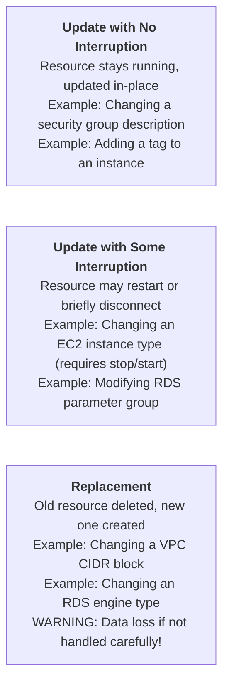
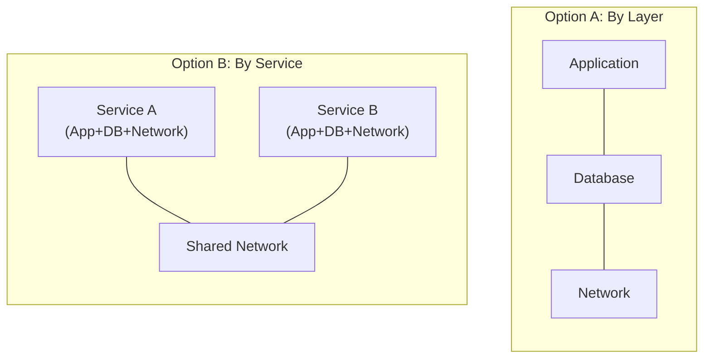

## Prerequisites

Before diving into the complexities of AWS CloudFormation, you must have a foundational understanding of Infrastructure as Code principles. You should know the fundamental differences between declarative and imperative systems, and why declarative systems have become the industry standard for cloud environments. Additionally, you need practical experience creating AWS resources manually via the AWS Command Line Interface (CLI) or the AWS Management Console, specifically virtual networking components like Virtual Private Clouds (VPCs), subnets, route tables, and security groups. Ensure that you have the AWS CLI v2 installed and configured with administrative credentials on your local machine. You must also be comfortable reading and writing YAML documents, as this module will extensively rely on YAML syntax for defining infrastructure templates.

## What You'll Be Able to Do

After completing this module, you will be able to:

- **Design** and deploy multi-resource CloudFormation stacks utilizing advanced features like parameters, mapping tables, and conditional logic.
- **Implement** robust deployment safety mechanisms including CloudFormation change sets and stack policies to protect stateful resources from accidental deletion.
- **Architect** complex, modular infrastructure at scale by implementing nested stacks and cross-stack references effectively.
- **Diagnose** and debug CloudFormation rollback failures, identify resource replacement behaviors, and resolve dependency conflicts during stack updates.

---

## Why This Module Matters

On February 28, 2017, an engineer at Amazon Web Services was debugging an issue with the billing system for the Simple Storage Service (S3) in the us-east-1 region. To resolve the problem, the engineer needed to execute a script to take a small number of billing servers offline. Unfortunately, the command was entered incorrectly, containing a typographical error that instructed the system to remove a significantly larger set of servers than intended. This single human error triggered a cascading failure that brought down the S3 indexing subsystem, which in turn took down the entire S3 storage layer in that region. The outage lasted for over four hours and disrupted countless major services, including Slack, Trello, Quora, and the SEC, costing companies an estimated $150 million in lost revenue.

This catastrophic event highlights the extreme danger of managing infrastructure imperatively or manually. When human operators are typing commands directly into production systems, the blast radius of a single mistake is practically unlimited. This is the exact problem that Infrastructure as Code (IaC) is designed to solve. By defining your infrastructure in a declarative template, changes are no longer executed as raw commands. Instead, they are proposed as code modifications, allowing them to pass through version control, peer review, and automated validation pipelines before they ever interact with the production environment. A typo in a CloudFormation template fails during the validation phase, safely blocking the deployment rather than causing a massive outage.

In this comprehensive module, you will master AWS CloudFormation, the native Infrastructure as Code service deeply integrated into the AWS ecosystem. You will learn how to author sophisticated templates, utilize intrinsic functions to dynamically configure resources, and safely manage the lifecycle of your infrastructure stacks. We will explore how CloudFormation handles updates, the critical importance of change sets, and how to architect modular systems using nested stacks. By the end of this module, you will understand how to treat your cloud environments with the exact same rigor, safety, and testing methodology as your application source code.

---

## Did You Know?

- As of early 2026, CloudFormation actively manages over 750 distinct AWS resource types, encompassing virtually every service offered by the platform. When AWS launches a new service, CloudFormation support typically follows within weeks, often becoming available on launch day. The complete resource specification is published as a massive JSON schema that exceeds 80 MB when uncompressed.
- A single CloudFormation stack is permitted to contain up to 500 individual resources. For massive architectures that exceed this hard limit, engineers must design modular solutions using nested stacks or stack sets. This 500-resource limit has forced many organizations to painful refactoring efforts after starting with a monolithic template, underscoring the importance of planning stack boundaries early.
- CloudFormation drift detection, an advanced feature launched in November 2018, provides the ability to detect when an operator has manually altered a resource managed by CloudFormation. This effectively solves the dreaded "who touched production?" scenario by immediately flagging discrepancies, allowing administrators to either incorporate the manual change into the template or revert the resource to its declared state.
- The AWS Cloud Development Kit (CDK), introduced in July 2019, is not an alternative infrastructure engine but rather a higher-level abstraction layer. When developers write infrastructure using TypeScript, Python, or Go in the CDK, the `cdk synth` command compiles this imperative code directly into a standard, declarative CloudFormation template, which is then deployed by the standard CloudFormation service.

---

## Core Concept: Declarative Infrastructure

To truly master CloudFormation, you must fundamentally internalize the concept of declarative infrastructure. In imperative programming, you write a sequence of commands that specify exactly *how* to achieve a result (for example, "Create a VPC, then create a subnet, then attach it to a route table"). In a declarative system like CloudFormation, you declare the *desired end state* (for example, "A VPC must exist, and it must contain this specific subnet"). 

The underlying engine assumes the responsibility of figuring out the correct API calls, dependency ordering, and execution sequence required to transition your environment from its current state to your desired state. This represents a profound shift in mindset. You are no longer an operator executing manual tasks; you are a systems architect defining the immutable truth of your environment. CloudFormation acts as a meticulous state machine, continuously tracking the mapping between your template definitions and the physical AWS resources it provisions.

---

## Template Anatomy

A CloudFormation template is a structured YAML or JSON document that acts as the absolute blueprint for your infrastructure. YAML is the overwhelming industry standard due to its readability, concise structure, and native support for inline comments. Let us examine the anatomy of a complete template.

```cloudformation
AWSTemplateFormatVersion: "2010-09-09"
Description: "What this template creates and why"

# Parameters: User-provided values at deploy time
Parameters:
  EnvironmentName:
    Type: String
    Default: production
    AllowedValues: [development, staging, production]

# Mappings: Static lookup tables
Mappings:
  RegionAMI:
    us-east-1:
      HVM64: ami-0abc123def456789
    eu-west-1:
      HVM64: ami-0def456abc789012

# Conditions: Conditional resource creation
Conditions:
  IsProduction: !Equals [!Ref EnvironmentName, production]

# Resources: The actual AWS resources (REQUIRED - only mandatory section)
Resources:
  MyVPC:
    Type: AWS::EC2::VPC
    Properties:
      CidrBlock: "10.0.0.0/16"

# Outputs: Values to export or display
Outputs:
  VPCId:
    Value: !Ref MyVPC
    Export:
      Name: !Sub "${EnvironmentName}-VPCId"
```

Only the `Resources` section is strictly required by the CloudFormation engine. However, in any professional engineering environment, utilizing the other sections is absolutely essential for creating dynamic, reusable, and robust infrastructure definitions. The template format version specifies the capabilities of the parser, while the description provides critical context for human reviewers.

### Resources: The Core of Every Template

The `Resources` section is where you rigorously define the specific AWS components you want to provision. Every resource block consists of a logical name, a resource type, and a set of properties that configure its behavior.

```cloudformation
Resources:
  # Logical name: WebServerSecurityGroup
  WebServerSecurityGroup:
    Type: AWS::EC2::SecurityGroup
    Properties:
      GroupDescription: "Allow HTTP and SSH"
      VpcId: !Ref MyVPC
      SecurityGroupIngress:
        - IpProtocol: tcp
          FromPort: 80
          ToPort: 80
          CidrIp: 0.0.0.0/0
        - IpProtocol: tcp
          FromPort: 22
          ToPort: 22
          CidrIp: 10.0.0.0/8
```

The logical name (for example, `WebServerSecurityGroup`) is an arbitrary string you choose. It acts as the internal identifier within the template, allowing other resources to seamlessly reference it. Crucially, this logical name is distinct from the physical name of the resource in the AWS Console. By default, CloudFormation dynamically generates the physical name by combining the stack name, the logical name, and a random alphanumeric string. This automatic naming convention is incredibly important because it prevents naming collisions if you deploy the same template multiple times across different environments, and it enables safe resource replacement during complex updates.

> **Stop and think**: If CloudFormation automatically appends random alphanumeric suffixes to your physical resource names, how can you efficiently locate a specific DynamoDB table or S3 bucket in the AWS Console without manually searching through dozens of similarly named resources?

If you must find a dynamically named resource, the best practice is to navigate to the CloudFormation console, select your stack, and view the "Resources" tab. This tab provides a direct mapping between your template's logical IDs and the generated physical IDs, along with hyperlinked shortcuts straight to the resource. Alternatively, you can use resource tagging to organize and search for your infrastructure systematically across the AWS account.

### Parameters: Making Templates Reusable

Hardcoding values into templates drastically reduces their utility and guarantees future technical debt. Parameters allow you to pass dynamic inputs into your stack at deployment time, enabling a single template to provision a tiny development environment or a massive production cluster simply by changing the input arguments.

```cloudformation
Parameters:
  VPCCidr:
    Type: String
    Default: "10.0.0.0/16"
    Description: "CIDR block for the VPC"
    AllowedPattern: "^(\\d{1,3}\\.){3}\\d{1,3}/\\d{1,2}$"
    ConstraintDescription: "Must be a valid CIDR (e.g., 10.0.0.0/16)"

  InstanceType:
    Type: String
    Default: t3.micro
    AllowedValues:
      - t3.micro
      - t3.small
      - t3.medium
    Description: "EC2 instance type"

  KeyPairName:
    Type: AWS::EC2::KeyPair::KeyName
    Description: "Name of an existing EC2 key pair"

  EnableNATGateway:
    Type: String
    Default: "false"
    AllowedValues: ["true", "false"]
    Description: "Whether to create a NAT Gateway (adds cost)"
```

Notice the strategic use of `AllowedPattern` and `AllowedValues`. These specific constraints are executed by the CloudFormation validation engine before any actual resources are provisioned. The AWS-specific parameter type `AWS::EC2::KeyPair::KeyName` goes even further, performing a live API check to ensure the specified key pair actually exists in the target region before allowing the deployment operation to proceed.

### Outputs: Sharing Information Between Stacks

The `Outputs` section serves two primary architectural purposes: exposing important values (like URLs or load balancer IP addresses) to human operators on the console, and exporting resource identifiers globally so that other independent stacks can consume them seamlessly.

```cloudformation
Outputs:
  VPCId:
    Description: "The VPC ID"
    Value: !Ref VPC
    Export:
      Name: !Sub "${AWS::StackName}-VPCId"

  PublicSubnet1Id:
    Description: "Public subnet in AZ1"
    Value: !Ref PublicSubnet1
    Export:
      Name: !Sub "${AWS::StackName}-PublicSubnet1Id"

  ALBDNSName:
    Description: "Application Load Balancer DNS name"
    Value: !GetAtt ApplicationLoadBalancer.DNSName
```

By defining an `Export` block, you register the specific value in a global, region-wide registry for your AWS account. Other completely disconnected templates can subsequently retrieve this exact value using the `Fn::ImportValue` intrinsic function. This mechanism rigorously enforces strict, account-level dependency tracking.

> **Pause and predict**: If Stack B uses `!ImportValue` to consume a VPC ID explicitly exported by Stack A, what exactly happens at the API level if an administrator mistakenly attempts to delete Stack A?

If an administrator attempts to delete Stack A, the CloudFormation API will immediately intercept and reject the request, throwing a dependency violation error. AWS strictly prohibits the deletion of any stack that is actively exporting a value currently being imported by another active stack. To successfully delete Stack A, you must first update or delete Stack B to completely remove the import reference. This provides a powerful, structural safety net against accidental infrastructure destruction.

---

## Intrinsic Functions: The Template Programming Language

Because CloudFormation is fundamentally declarative, it naturally lacks standard programming constructs like loops, iterative functions, or variable mutations. To inject logic, CloudFormation provides intrinsic functions. These functions are evaluated at deployment time, allowing you to manipulate strings, retrieve complex resource properties, and implement highly dynamic conditional logic.

### Ref and GetAtt

The most heavily utilized functions in all of CloudFormation engineering are `!Ref` and `!GetAtt`. They serve as your primary tools for wiring decoupled resources together into a cohesive system.

```cloudformation
# !Ref returns the resource's primary identifier
# For an EC2 instance: the instance ID
# For a parameter: the parameter value
SecurityGroupId: !Ref WebServerSecurityGroup

# !GetAtt returns a specific attribute of a resource
# Different from !Ref -- GetAtt accesses secondary attributes
LoadBalancerDNS: !GetAtt ApplicationLoadBalancer.DNSName
SecurityGroupId: !GetAtt WebServerSecurityGroup.GroupId
```

It is a remarkably common pitfall for junior engineers to confuse these two functions. The `!Ref` function always returns the "primary identifier" of the designated resource, which varies significantly depending on the resource type. The `!GetAtt` function, on the other hand, is explicitly used to pull secondary metadata, such as Amazon Resource Names (ARNs), DNS records, or internal private IP addresses.

### Sub (String Substitution)

The `!Sub` function operates as the CloudFormation equivalent of string interpolation or template literals found in modern programming languages. It is invaluable for constructing dynamic names, ARNs, and complex configuration scripts.

```cloudformation
# Variable substitution in strings
# ${AWS::StackName} and ${AWS::Region} are pseudo-parameters
BucketName: !Sub "${AWS::StackName}-artifacts-${AWS::Region}"

# Reference resource attributes
UserData:
  Fn::Base64: !Sub |
    #!/bin/bash
    echo "VPC ID is ${VPC}" >> /var/log/setup.log
    echo "Region is ${AWS::Region}" >> /var/log/setup.log
    aws s3 cp s3://${ArtifactBucket}/config.yml /opt/app/config.yml
```

When writing robust bash scripts inside the `UserData` property of an EC2 instance, `!Sub` combined with a YAML literal block indicator (`|`) provides a highly readable syntax for injecting dynamic infrastructure metadata directly into your runtime scripts without breaking syntax parsing.

### Select, Split, and Join

These functions provide foundational list and string manipulation capabilities, which are routinely required when dealing with complicated network topologies, arrays of subnets, availability zones, and security group lists.

```cloudformation
# Pick an item from a list
AZ: !Select [0, !GetAZs ""]   # First AZ in the region

# Split a string into a list
# If "10.0.0.0/16" --> ["10.0.0.0", "16"]
CidrParts: !Split ["/", !Ref VPCCidr]

# Join list items into a string
SubnetIds: !Join [",", [!Ref Subnet1, !Ref Subnet2, !Ref Subnet3]]
```

### Conditionals

Conditional functions empower you to create resources only under highly specific circumstances, effectively transforming a rigid, static template into a highly flexible, environmentally aware module.

```cloudformation
Conditions:
  IsProduction: !Equals [!Ref EnvironmentName, production]
  CreateNAT: !Equals [!Ref EnableNATGateway, "true"]
  ProdWithNAT: !And [!Condition IsProduction, !Condition CreateNAT]

Resources:
  NATGateway:
    Type: AWS::EC2::NatGateway
    Condition: CreateNAT    # Only created if condition is true
    Properties:
      SubnetId: !Ref PublicSubnet1
      AllocationId: !GetAtt NATElasticIP.AllocationId

  NATElasticIP:
    Type: AWS::EC2::EIP
    Condition: CreateNAT
    Properties:
      Domain: vpc

  # Use If to set property values conditionally
  WebServer:
    Type: AWS::EC2::Instance
    Properties:
      InstanceType: !If [IsProduction, t3.medium, t3.micro]
      Monitoring: !If [IsProduction, true, false]
```

By explicitly defining logic in the `Conditions` section and referencing it within a target resource via the `Condition` key, you can optionally provision highly expensive infrastructure, such as multi-AZ NAT Gateways or premium databases, only when deploying to high-tier production environments. This architectural pattern saves substantial operational costs in lower-tier development and staging environments.

### Quick Reference Table

The following table provides a comprehensive overview of the most critical intrinsic functions you will utilize regularly in CloudFormation engineering.

| Function | Purpose | Example |
|----------|---------|---------|
| `!Ref` | Resource ID or parameter value | `!Ref MyVPC` |
| `!GetAtt` | Resource attribute | `!GetAtt ALB.DNSName` |
| `!Sub` | String interpolation | `!Sub "${AWS::StackName}-bucket"` |
| `!Select` | Pick from list | `!Select [0, !GetAZs ""]` |
| `!Split` | String to list | `!Split [",", "a,b,c"]` |
| `!Join` | List to string | `!Join ["-", ["my", "stack"]]` |
| `!If` | Conditional value | `!If [IsProd, t3.large, t3.micro]` |
| `!Equals` | Compare values | `!Equals [!Ref Env, prod]` |
| `!FindInMap` | Lookup in Mappings | `!FindInMap [RegionAMI, !Ref "AWS::Region", HVM64]` |
| `!ImportValue` | Cross-stack reference | `!ImportValue "network-stack-VPCId"` |
| `!GetAZs` | List AZs in region | `!GetAZs ""` (current region) |
| `!Cidr` | Generate CIDR blocks | `!Cidr [!Ref VPCCidr, 6, 8]` |

---

## Stack Lifecycle: Create, Update, Delete

A CloudFormation stack is the actual physical manifestation of your declarative template in the AWS environment. It serves as the definitive boundary that encompasses all provisioned resources. The lifecycle of a stack involves three primary phases: creation, updating, and deletion.

### Creating a Stack

Creating a new stack involves submitting your finalized template directly to the CloudFormation API, passing any required runtime parameters, and closely monitoring the real-time status of the deployment process.

```bash
# Create a stack from a local template
aws cloudformation create-stack \
  --stack-name my-network \
  --template-body file://network.yaml \
  --parameters \
    ParameterKey=EnvironmentName,ParameterValue=production \
    ParameterKey=VPCCidr,ParameterValue=10.0.0.0/16

# Create a stack that creates IAM resources (requires explicit capability)
aws cloudformation create-stack \
  --stack-name my-app \
  --template-body file://app.yaml \
  --capabilities CAPABILITY_NAMED_IAM

# Wait for completion
aws cloudformation wait stack-create-complete --stack-name my-network

# Check stack status
aws cloudformation describe-stacks \
  --stack-name my-network \
  --query 'Stacks[0].[StackName,StackStatus]' \
  --output text
```

Notice the explicit use of the `--capabilities CAPABILITY_NAMED_IAM` flag. CloudFormation enforces a strict requirement for you to explicitly acknowledge that the template will provision Identity and Access Management (IAM) resources. This essential security mechanism ensures that administrators cannot accidentally escalate privileges via a hidden IAM role embedded deep inside a massive template deployment.

### Update Behavior: The Three Types of Resource Changes

When you modify an existing template and update the stack, CloudFormation mathematically calculates the diff and determines precisely how to apply the changes to the physical resources. Comprehending these update behaviors is undeniably the most critical skill for preventing unexpected production outages.



You must always consult the official AWS resource reference documentation before modifying a property in a live production template. The documentation clearly states whether changing a specific property will result in "No interruption," "Some interruption," or a catastrophic "Replacement."

> **Stop and think**: During a stack update, CloudFormation determines that an EC2 instance must be replaced. By default, it attempts to create the new instance before deleting the old one. If your template also provisions an Elastic IP address and attaches it directly to this instance, why might this "create-before-delete" replacement update immediately fail?

The update will fail because an Elastic IP address can fundamentally only be attached to a single EC2 instance at any given time. When CloudFormation attempts to provision the replacement instance, it tries to map the Elastic IP to the newly created instance while the original, older instance is still running and actively holding the lock on that specific IP address. This direct collision triggers an immediate failure, causing the entire stack update sequence to abort and roll back. To resolve this gracefully, engineers must carefully manage dependencies, utilize advanced `UpdateReplacePolicy` configurations, or temporarily dissociate the IP address before executing the resource replacement.

### Change Sets: Preview Before You Apply

To completely mitigate the massive risks associated with unexpected resource replacements and service interruptions, you must routinely utilize Change Sets. A Change Set functions as a dry-run execution plan that provides a detailed, granular summary of the exact actions CloudFormation intends to perform on your behalf.

```bash
# Create a change set (does NOT apply changes)
aws cloudformation create-change-set \
  --stack-name my-network \
  --change-set-name update-subnets \
  --template-body file://network-v2.yaml \
  --parameters \
    ParameterKey=EnvironmentName,ParameterValue=production

# Review what will change
aws cloudformation describe-change-set \
  --stack-name my-network \
  --change-set-name update-subnets \
  --query 'Changes[*].ResourceChange.{Action:Action,Resource:LogicalResourceId,Type:ResourceType,Replacement:Replacement}' \
  --output table

# If changes look safe, execute
aws cloudformation execute-change-set \
  --stack-name my-network \
  --change-set-name update-subnets

# If changes are wrong, delete the change set (no effect on stack)
aws cloudformation delete-change-set \
  --stack-name my-network \
  --change-set-name update-subnets
```

A mature, modern DevOps pipeline will automatically generate a detailed Change Set on every proposed pull request, allowing peer reviewers to independently verify that an otherwise innocuous code change will not trigger a catastrophic database replacement in production.

### Rollback Behavior

CloudFormation is intrinsically highly resilient because of its transactional execution model. If any operation fails during a stack creation or update, CloudFormation automatically initiates a comprehensive rollback procedure.
- **Create Failure:** If resource 45 out of 50 fails to provision successfully, CloudFormation immediately halts and deletes the first 44 resources, leaving the environment completely clean and preventing orphaned infrastructure.
- **Update Failure:** If an update process fails midway through the execution, CloudFormation diligently reverts all successfully updated resources back to their previous, known-good state.
- **Delete Failure:** A stack will enter the dreaded `DELETE_FAILED` state if it encounters resources that simply cannot be removed (such as an S3 bucket currently containing objects). In these scenarios, you must manually empty the bucket and retry the deletion command.

---

## Nested Stacks: Managing Complexity

As infrastructure footprints inevitably grow, maintaining hundreds of distinct resources in a single monolithic template quickly becomes an operational nightmare. Nested stacks allow you to architect modular, heavily compartmentalized systems by treating secondary templates as individual resources within a primary parent stack.

```cloudformation
# Parent template: main.yaml
Resources:
  NetworkStack:
    Type: AWS::CloudFormation::Stack
    Properties:
      TemplateURL: https://s3.amazonaws.com/my-templates/network.yaml
      Parameters:
        EnvironmentName: !Ref EnvironmentName
        VPCCidr: !Ref VPCCidr

  DatabaseStack:
    Type: AWS::CloudFormation::Stack
    DependsOn: NetworkStack
    Properties:
      TemplateURL: https://s3.amazonaws.com/my-templates/database.yaml
      Parameters:
        VPCId: !GetAtt NetworkStack.Outputs.VPCId
        PrivateSubnetIds: !GetAtt NetworkStack.Outputs.PrivateSubnetIds

  ApplicationStack:
    Type: AWS::CloudFormation::Stack
    DependsOn: [NetworkStack, DatabaseStack]
    Properties:
      TemplateURL: https://s3.amazonaws.com/my-templates/application.yaml
      Parameters:
        VPCId: !GetAtt NetworkStack.Outputs.VPCId
        DatabaseEndpoint: !GetAtt DatabaseStack.Outputs.DatabaseEndpoint
```

When systematically architecting nested stacks, you have two primary structural patterns to consider: layering by macro architectural tier or compartmentalizing by discrete microservices.



Option A (the layer-based design) excels in more traditional, monolithic environments where a single, unified operations team manages the entirety of the infrastructure stack. Option B (the service-based design) is optimal for modern, decentralized architectures where autonomous product teams fully own and deploy their specific microservices right alongside shared core network infrastructure.

---

## CloudFormation vs Terraform: When to Use What

The ongoing debate between AWS CloudFormation and HashiCorp Terraform is a defining characteristic of modern cloud engineering discussions. Both are exceptional, enterprise-grade tools, but they cater to very different architectural philosophies and operational realities. The following structured comparison highlights the core technical distinctions.

| Factor | CloudFormation | Terraform |
|--------|---------------|-----------|
| **AWS-only** | Native, first-class | Excellent support via AWS provider |
| **Multi-cloud** | AWS only | Multi-cloud, multi-provider |
| **State management** | Managed by AWS (no state file) | State file (local or remote, you manage) |
| **Drift detection** | Built-in | `terraform plan` shows drift |
| **Rollback** | Automatic on failure | Manual (apply previous state) |
| **Language** | YAML/JSON (declarative) | HCL (declarative with loops, modules) |
| **Modularity** | Nested stacks, StackSets | Modules (more flexible) |
| **Learning curve** | Moderate (verbose but predictable) | Moderate (more features to learn) |
| **Cost** | Free | Free (OSS), paid for Terraform Cloud |
| **Community modules** | Limited (AWS Samples) | Vast (Terraform Registry) |
| **Speed** | Slower (sequential by default) | Faster (parallel by default) |

CloudFormation is the ideal choice for organizations that are wholly committed to the AWS ecosystem and strongly prefer a fully managed service that entirely eliminates the operational overhead of handling, securing, and locking remote state files. Furthermore, CloudFormation provides robust, automatic rollback features that are considered absolutely critical for stringent enterprise risk management. Conversely, Terraform dominates in hybrid or multi-cloud environments and offers a remarkably more expressive configuration language (HCL) that significantly accelerates the development of complex, dynamic infrastructure modules.

---

## AWS CDK: Brief Mention

The AWS Cloud Development Kit (CDK) represents the cutting-edge evolution of Infrastructure as Code on AWS. Rather than authoring static YAML declarations, advanced engineers utilize expressive, imperative programming languages such as TypeScript, Python, or Go to dynamically define cloud resources. However, it is vital to understand that the CDK is fundamentally a sophisticated synthesis engine, not an alternative deployment backend.

```python
# CDK Python example -- this generates a CloudFormation template
from aws_cdk import Stack, aws_ec2 as ec2
from constructs import Construct

class NetworkStack(Stack):
    def __init__(self, scope: Construct, id: str, **kwargs):
        super().__init__(scope, id, **kwargs)

        self.vpc = ec2.Vpc(self, "MainVPC",
            max_azs=3,
            nat_gateways=1,
            subnet_configuration=[
                ec2.SubnetConfiguration(
                    name="Public",
                    subnet_type=ec2.SubnetType.PUBLIC,
                    cidr_mask=24
                ),
                ec2.SubnetConfiguration(
                    name="Private",
                    subnet_type=ec2.SubnetType.PRIVATE_WITH_EGRESS,
                    cidr_mask=24
                )
            ]
        )
```

When you execute the `cdk synth` command on the concise code snippet above, the framework programmatically generates a comprehensive CloudFormation template containing hundreds of lines of complex YAML. Because the actual deployment is still executed entirely by the CloudFormation engine under the hood, a deep mastery of CloudFormation fundamentals—logical IDs, output exports, change sets, and transaction rollbacks—remains absolutely indispensable for successfully debugging failed CDK deployments in production.

---

## Common Mistakes

Even highly experienced engineers frequently encounter operational pitfalls when initially working with CloudFormation. Carefully review this detailed table to preemptively identify and resolve these incredibly common mistakes before they impact your environments.

| Mistake | Why It Happens | How to Fix It |
|---------|---------------|---------------|
| Hardcoding resource names | Wanting predictable names | Let CloudFormation generate names; hardcoded names prevent replacement updates and cause conflicts across environments |
| Not using change sets for production updates | "I know what changed" confidence | Always create and review a change set; the 30 seconds it takes has prevented countless outages |
| Monolithic templates with 400+ resources | Starting small and never splitting | Plan stack boundaries early; split by layer (network/app/data) or by service boundary |
| Forgetting `--capabilities CAPABILITY_NAMED_IAM` | Template creates IAM roles but deploy command omits the flag | Add `CAPABILITY_NAMED_IAM` (or `CAPABILITY_IAM`) whenever your template creates IAM resources |
| Not setting `DeletionPolicy: Retain` on databases | Assuming delete protection is enough | Set `DeletionPolicy: Retain` on RDS instances, S3 buckets with data, and DynamoDB tables so accidental stack deletion does not destroy data |
| Using `!Ref` when `!GetAtt` is needed | Confusion about which function returns which value | `!Ref` returns the primary identifier (e.g., instance ID); `!GetAtt` returns other attributes (e.g., DNS name, ARN); check the docs for each resource type |
| Manual console changes to CloudFormation-managed resources | "Just this one quick fix" | Run drift detection regularly; treat manual changes as tech debt that must be reconciled with the template |
| Not exporting outputs from shared stacks | Copy-pasting resource IDs between templates | Use `Export` on outputs and `Fn::ImportValue` in consuming stacks; this creates explicit dependencies and prevents accidental deletion |

---

## Quiz

Test your deep comprehension of CloudFormation architecture, functions, and critical lifecycle mechanisms.

<details>
<summary>1. You are deploying a massive infrastructure update involving 50 new resources. During the deployment, the 45th resource fails to create due to an insufficient permissions error. What state will the first 44 resources be in after the deployment process fully concludes?</summary>

CloudFormation will automatically roll back the entire deployment, meaning the first 44 resources will be completely deleted if this was a new stack, or reverted to their previous state if this was an update. This "all-or-nothing" transaction model ensures your infrastructure never gets stuck in an inconsistent, partially deployed state. Once the rollback finishes, the stack will reach the `UPDATE_ROLLBACK_COMPLETE` or `ROLLBACK_COMPLETE` state, representing the last known good configuration. This automatic safety mechanism is a key differentiator from tools like Terraform, where a failed apply often leaves resources in a partial state that requires manual cleanup.
</details>

<details>
<summary>2. Your company is expanding its network and you need to increase the size of an existing production VPC. You update the `CidrBlock` property in your CloudFormation template from `10.0.0.0/16` to `10.0.0.0/15` and execute the update. What is the immediate impact on the resources currently running inside this VPC?</summary>

Updating the CIDR block of an existing VPC is a change that strictly requires replacement, meaning CloudFormation will attempt to create a brand new VPC and delete the old one. Because a VPC cannot be deleted while it still contains active subnets, instances, and network interfaces, the update will almost certainly fail and roll back unless you have orchestrated a complex migration strategy. This destructive behavior occurs because the fundamental networking boundary of the resources is changing, preventing an in-place modification. You should always use change sets to catch `Replacement: True` actions on foundational resources before they cause widespread outages or failed updates.
</details>

<details>
<summary>3. You are writing a CloudFormation template that deploys an EC2 instance and a configuration script. You need to pass the instance's private IP address to the script as an environment variable, but using `!Ref MyInstance` is causing the script to fail. Why is this happening, and how do you resolve it?</summary>

The script is failing because `!Ref` applied to an EC2 instance returns the instance's primary identifier, which is its Instance ID (e.g., `i-0abc123def456789`), not its IP address. To retrieve secondary attributes like IP addresses or DNS names, you must use the `!GetAtt` intrinsic function instead. By changing your template to use `!GetAtt MyInstance.PrivateIp`, CloudFormation will correctly resolve and inject the private IP address into your configuration script. Always consult the CloudFormation resource reference documentation, as each resource type defines exactly what `!Ref` returns and which specific attributes are exposed via `!GetAtt`.
</details>

<details>
<summary>4. You have explicitly named a production S3 bucket `my-app-data-bucket` in your CloudFormation template. Months later, you modify the template to change the bucket's physical location (a property requiring replacement) and execute the update. Why does the update immediately fail and roll back?</summary>

The update fails because explicitly hardcoded names prevent CloudFormation from performing its standard "create-before-delete" replacement process. When CloudFormation attempts to create the new replacement bucket, it tries to use the exact same name (`my-app-data-bucket`), which collides with the existing bucket that has not been deleted yet. Because S3 bucket names must be globally unique, AWS rejects the creation request, causing the entire stack update to abort and roll back. To avoid this lifecycle deadlock, you should allow CloudFormation to auto-generate physical names or use dynamic names incorporating the stack name, ensuring replacement resources get a unique identifier before the old resource is destroyed.
</details>

<details>
<summary>5. Your platform team manages the core VPC network, while three independent product teams manage their own application stacks that need to deploy resources into that VPC. Should you use nested stacks to connect the applications to the network, or cross-stack references (Exports/ImportValue)? Why?</summary>

You should use cross-stack references (Outputs with `Export` and `!ImportValue`) because the network and the applications have completely independent lifecycles and are managed by different teams. Nested stacks are designed for tightly coupled resources that share a single lifecycle and are deployed together by a single owner as a monolithic unit. By using cross-stack references, you establish a hard dependency graph at the AWS level, ensuring the platform team cannot accidentally delete the core VPC while the product teams' applications are still actively relying on its exported subnets. This loosely coupled approach perfectly aligns with the organizational boundary between the platform and product teams.
</details>

<details>
<summary>6. Your team is adopting AWS CDK to replace raw YAML templates. A developer argues that since CDK uses TypeScript, they no longer need to understand CloudFormation concepts like logical IDs, stack rollbacks, or change sets. How would you correct this architectural misunderstanding?</summary>

You must correct this misunderstanding by explaining that CDK is not an alternative infrastructure engine, but rather a higher-level abstraction layer that compiles directly down into standard CloudFormation templates. When you run `cdk deploy`, AWS is still executing a CloudFormation stack under the hood. This means all the fundamental rules of CloudFormation—including resource replacement behaviors, stack state machines, and drift detection—still entirely govern your deployment. Furthermore, when deployments fail, AWS returns errors referencing the generated CloudFormation logical IDs and property structures, making it impossible to effectively debug CDK applications without a solid understanding of the underlying CloudFormation engine.
</details>

<details>
<summary>7. A junior engineer accidentally deletes the CloudFormation stack that manages your production RDS database. After the stack deletion successfully completes, you find that the database instance is still running normally and the data is completely intact. What specific template configuration prevented a catastrophic data loss, and how does it alter the standard stack lifecycle?</summary>

The template utilized the `DeletionPolicy: Retain` attribute on the RDS database resource, which explicitly overrides CloudFormation's default behavior of destroying managed resources during stack deletion. When the stack was deleted, CloudFormation simply removed the database from its internal tracking state, leaving the physical AWS resource abandoned but completely operational. This safeguard is critical for any stateful resource containing persistent data, as it decouples the lifecycle of the data from the lifecycle of the infrastructure automation code. To resume managing the database with IaC, you would need to import the retained resource back into a new CloudFormation stack.
</details>

---

## Hands-On Exercise: Deploy a VPC Architecture from CloudFormation

### Objective

In this comprehensive exercise, you will directly synthesize the architectural concepts learned throughout this module. Your primary objective is to architect and provision a production-ready VPC that intelligently incorporates public and private subnets heavily distributed across two distinct availability zones, complete with an Internet Gateway and a conditionally controlled NAT Gateway. You will define all of these components declaratively in a single template, validate the syntax, and execute deployment and iterative stack updates using safe change set operations.

### Task 1: Write the CloudFormation Template

Create a comprehensive template that distinctly defines a secure VPC with appropriate public and private routing topologies.

<details>
<summary>Solution</summary>

Save this highly structured definition as `vpc-stack.yaml`:

```cloudformation
AWSTemplateFormatVersion: "2010-09-09"
Description: "Production VPC with public and private subnets in 2 AZs"

Parameters:
  EnvironmentName:
    Type: String
    Default: cfn-lab
    Description: "Environment name prefixed to resources"

  VPCCidr:
    Type: String
    Default: "10.100.0.0/16"
    Description: "CIDR block for the VPC"

  PublicSubnet1Cidr:
    Type: String
    Default: "10.100.1.0/24"

  PublicSubnet2Cidr:
    Type: String
    Default: "10.100.2.0/24"

  PrivateSubnet1Cidr:
    Type: String
    Default: "10.100.10.0/24"

  PrivateSubnet2Cidr:
    Type: String
    Default: "10.100.20.0/24"

  EnableNATGateway:
    Type: String
    Default: "true"
    AllowedValues: ["true", "false"]
    Description: "Create a NAT Gateway for private subnet internet access"

Conditions:
  CreateNAT: !Equals [!Ref EnableNATGateway, "true"]

Resources:
  # ============ VPC ============
  VPC:
    Type: AWS::EC2::VPC
    Properties:
      CidrBlock: !Ref VPCCidr
      EnableDnsSupport: true
      EnableDnsHostnames: true
      Tags:
        - Key: Name
          Value: !Sub "${EnvironmentName}-vpc"

  # ============ Internet Gateway ============
  InternetGateway:
    Type: AWS::EC2::InternetGateway
    Properties:
      Tags:
        - Key: Name
          Value: !Sub "${EnvironmentName}-igw"

  InternetGatewayAttachment:
    Type: AWS::EC2::VPCGatewayAttachment
    Properties:
      InternetGatewayId: !Ref InternetGateway
      VpcId: !Ref VPC

  # ============ Public Subnets ============
  PublicSubnet1:
    Type: AWS::EC2::Subnet
    Properties:
      VpcId: !Ref VPC
      AvailabilityZone: !Select [0, !GetAZs ""]
      CidrBlock: !Ref PublicSubnet1Cidr
      MapPublicIpOnLaunch: true
      Tags:
        - Key: Name
          Value: !Sub "${EnvironmentName}-public-1"

  PublicSubnet2:
    Type: AWS::EC2::Subnet
    Properties:
      VpcId: !Ref VPC
      AvailabilityZone: !Select [1, !GetAZs ""]
      CidrBlock: !Ref PublicSubnet2Cidr
      MapPublicIpOnLaunch: true
      Tags:
        - Key: Name
          Value: !Sub "${EnvironmentName}-public-2"

  # ============ Private Subnets ============
  PrivateSubnet1:
    Type: AWS::EC2::Subnet
    Properties:
      VpcId: !Ref VPC
      AvailabilityZone: !Select [0, !GetAZs ""]
      CidrBlock: !Ref PrivateSubnet1Cidr
      Tags:
        - Key: Name
          Value: !Sub "${EnvironmentName}-private-1"

  PrivateSubnet2:
    Type: AWS::EC2::Subnet
    Properties:
      VpcId: !Ref VPC
      AvailabilityZone: !Select [1, !GetAZs ""]
      CidrBlock: !Ref PrivateSubnet2Cidr
      Tags:
        - Key: Name
          Value: !Sub "${EnvironmentName}-private-2"

  # ============ Public Route Table ============
  PublicRouteTable:
    Type: AWS::EC2::RouteTable
    Properties:
      VpcId: !Ref VPC
      Tags:
        - Key: Name
          Value: !Sub "${EnvironmentName}-public-rt"

  DefaultPublicRoute:
    Type: AWS::EC2::Route
    DependsOn: InternetGatewayAttachment
    Properties:
      RouteTableId: !Ref PublicRouteTable
      DestinationCidrBlock: 0.0.0.0/0
      GatewayId: !Ref InternetGateway

  PublicSubnet1RouteTableAssoc:
    Type: AWS::EC2::SubnetRouteTableAssociation
    Properties:
      SubnetId: !Ref PublicSubnet1
      RouteTableId: !Ref PublicRouteTable

  PublicSubnet2RouteTableAssoc:
    Type: AWS::EC2::SubnetRouteTableAssociation
    Properties:
      SubnetId: !Ref PublicSubnet2
      RouteTableId: !Ref PublicRouteTable

  # ============ NAT Gateway (Conditional) ============
  NATElasticIP:
    Type: AWS::EC2::EIP
    Condition: CreateNAT
    DependsOn: InternetGatewayAttachment
    Properties:
      Domain: vpc
      Tags:
        - Key: Name
          Value: !Sub "${EnvironmentName}-nat-eip"

  NATGateway:
    Type: AWS::EC2::NatGateway
    Condition: CreateNAT
    Properties:
      AllocationId: !GetAtt NATElasticIP.AllocationId
      SubnetId: !Ref PublicSubnet1
      Tags:
        - Key: Name
          Value: !Sub "${EnvironmentName}-nat"

  # ============ Private Route Table ============
  PrivateRouteTable:
    Type: AWS::EC2::RouteTable
    Properties:
      VpcId: !Ref VPC
      Tags:
        - Key: Name
          Value: !Sub "${EnvironmentName}-private-rt"

  DefaultPrivateRoute:
    Type: AWS::EC2::Route
    Condition: CreateNAT
    Properties:
      RouteTableId: !Ref PrivateRouteTable
      DestinationCidrBlock: 0.0.0.0/0
      NatGatewayId: !Ref NATGateway

  PrivateSubnet1RouteTableAssoc:
    Type: AWS::EC2::SubnetRouteTableAssociation
    Properties:
      SubnetId: !Ref PrivateSubnet1
      RouteTableId: !Ref PrivateRouteTable

  PrivateSubnet2RouteTableAssoc:
    Type: AWS::EC2::SubnetRouteTableAssociation
    Properties:
      SubnetId: !Ref PrivateSubnet2
      RouteTableId: !Ref PrivateRouteTable

Outputs:
  VPCId:
    Description: "VPC ID"
    Value: !Ref VPC
    Export:
      Name: !Sub "${EnvironmentName}-VPCId"

  PublicSubnet1Id:
    Description: "Public Subnet 1 ID"
    Value: !Ref PublicSubnet1
    Export:
      Name: !Sub "${EnvironmentName}-PublicSubnet1Id"

  PublicSubnet2Id:
    Description: "Public Subnet 2 ID"
    Value: !Ref PublicSubnet2
    Export:
      Name: !Sub "${EnvironmentName}-PublicSubnet2Id"

  PrivateSubnet1Id:
    Description: "Private Subnet 1 ID"
    Value: !Ref PrivateSubnet1
    Export:
      Name: !Sub "${EnvironmentName}-PrivateSubnet1Id"

  PrivateSubnet2Id:
    Description: "Private Subnet 2 ID"
    Value: !Ref PrivateSubnet2
    Export:
      Name: !Sub "${EnvironmentName}-PrivateSubnet2Id"

  PublicSubnetIds:
    Description: "Comma-separated public subnet IDs"
    Value: !Join [",", [!Ref PublicSubnet1, !Ref PublicSubnet2]]

  PrivateSubnetIds:
    Description: "Comma-separated private subnet IDs"
    Value: !Join [",", [!Ref PrivateSubnet1, !Ref PrivateSubnet2]]
```
</details>

### Task 2: Validate and Deploy the Stack

Rigorously validate the template syntax against the CloudFormation API, then proceed to reliably create the stack within your account environment.

<details>
<summary>Solution</summary>

```bash
# Validate the template (catches syntax errors)
aws cloudformation validate-template \
  --template-body file://vpc-stack.yaml

# Create the stack (without NAT Gateway to save cost)
aws cloudformation create-stack \
  --stack-name cfn-lab-network \
  --template-body file://vpc-stack.yaml \
  --parameters \
    ParameterKey=EnvironmentName,ParameterValue=cfn-lab \
    ParameterKey=EnableNATGateway,ParameterValue=false

# Wait for creation to complete
aws cloudformation wait stack-create-complete --stack-name cfn-lab-network

# Check status
aws cloudformation describe-stacks \
  --stack-name cfn-lab-network \
  --query 'Stacks[0].[StackName,StackStatus,CreationTime]' \
  --output table

# View the outputs
aws cloudformation describe-stacks \
  --stack-name cfn-lab-network \
  --query 'Stacks[0].Outputs[*].[OutputKey,OutputValue]' \
  --output table
```
</details>

### Task 3: Update the Stack Using a Change Set

Safely orchestrate an infrastructure modification by enabling the NAT Gateway parameter via a carefully reviewed change set execution.

<details>
<summary>Solution</summary>

```bash
# Create a change set to preview the update
aws cloudformation create-change-set \
  --stack-name cfn-lab-network \
  --change-set-name enable-nat-gateway \
  --template-body file://vpc-stack.yaml \
  --parameters \
    ParameterKey=EnvironmentName,ParameterValue=cfn-lab \
    ParameterKey=EnableNATGateway,ParameterValue=true

# Wait for change set to be created
aws cloudformation wait change-set-create-complete \
  --stack-name cfn-lab-network \
  --change-set-name enable-nat-gateway

# Review what will change
aws cloudformation describe-change-set \
  --stack-name cfn-lab-network \
  --change-set-name enable-nat-gateway \
  --query 'Changes[*].ResourceChange.{Action:Action,LogicalId:LogicalResourceId,Type:ResourceType}' \
  --output table

# You should see: Add NATElasticIP, Add NATGateway, Add DefaultPrivateRoute

# Execute the change set
aws cloudformation execute-change-set \
  --stack-name cfn-lab-network \
  --change-set-name enable-nat-gateway

# Wait for update to complete
aws cloudformation wait stack-update-complete --stack-name cfn-lab-network

# Verify NAT Gateway was created
aws ec2 describe-nat-gateways \
  --filter "Name=tag:Name,Values=cfn-lab-nat" \
  --query 'NatGateways[*].[NatGatewayId,State,SubnetId]' \
  --output table
```
</details>

### Task 4: Run Drift Detection

Simulate an unauthorized, out-of-band manual configuration modification, then confidently detect the resulting drift using the API.

<details>
<summary>Solution</summary>

```bash
# Get the VPC ID from the stack outputs
VPC_ID=$(aws cloudformation describe-stacks \
  --stack-name cfn-lab-network \
  --query 'Stacks[0].Outputs[?OutputKey==`VPCId`].OutputValue' --output text)

# Make a manual change (add a tag via console or CLI)
aws ec2 create-tags \
  --resources $VPC_ID \
  --tags Key=ManualChange,Value=SomeoneUsedTheConsole

# Detect drift
DRIFT_ID=$(aws cloudformation detect-stack-drift \
  --stack-name cfn-lab-network \
  --query 'StackDriftDetectionId' --output text)

# Wait a moment for detection to complete
sleep 15

# Check drift status
aws cloudformation describe-stack-drift-detection-status \
  --stack-drift-detection-id $DRIFT_ID \
  --query '[StackDriftStatus,DetectionStatus]' --output text

# See which resources drifted
aws cloudformation describe-stack-resource-drifts \
  --stack-name cfn-lab-network \
  --stack-resource-drift-status-filters MODIFIED \
  --query 'StackResourceDrifts[*].[LogicalResourceId,StackResourceDriftStatus]' \
  --output table
```
</details>

### Task 5: Clean Up

Maintain environmental hygiene by purposefully and methodically destroying the CloudFormation stack, ensuring zero leftover resources.

<details>
<summary>Solution</summary>

```bash
# Delete the stack (this removes all resources)
aws cloudformation delete-stack --stack-name cfn-lab-network

# Wait for deletion
aws cloudformation wait stack-delete-complete --stack-name cfn-lab-network

# Verify the stack is gone
aws cloudformation list-stacks \
  --stack-status-filter DELETE_COMPLETE \
  --query 'StackSummaries[?StackName==`cfn-lab-network`].[StackName,StackStatus,DeletionTime]' \
  --output table
```
</details>

### Success Criteria

- [ ] Template flawlessly validates without any structural errors (`validate-template` passes cleanly).
- [ ] Stack actively creates successfully with a complete VPC, 4 subnets, an Internet Gateway, and appropriate route tables.
- [ ] Stack output parameters accurately show correct VPC ID and individual subnet IDs.
- [ ] Change set execution correctly previews the NAT Gateway addition directly highlighting the 3 new physical resources.
- [ ] Stack update definitively adds the NAT Gateway and private route successfully without disruption.
- [ ] Drift detection reliably identifies and flags the manual tag change placed on the primary VPC resource.
- [ ] Stack meticulously deletes cleanly with all associated infrastructure completely removed.

---

## Next Module

Congratulations! You have thoroughly mastered the foundational mechanisms of Infrastructure as Code and successfully completed the AWS DevOps Essentials infrastructure modules. Return to the core AWS Essentials README to systematically review your overarching progress and aggressively explore advanced architectural topics. From here, seriously consider diving straight into the [Platform Engineering Track](/platform/) to strategically learn how these highly declarative AWS building blocks intricately fit into a much broader, organizational-level platform strategy.