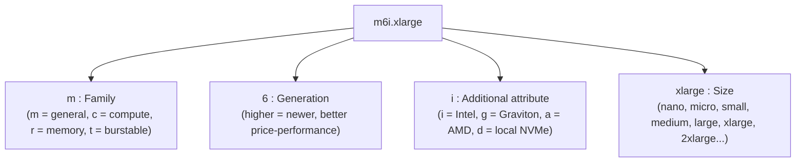
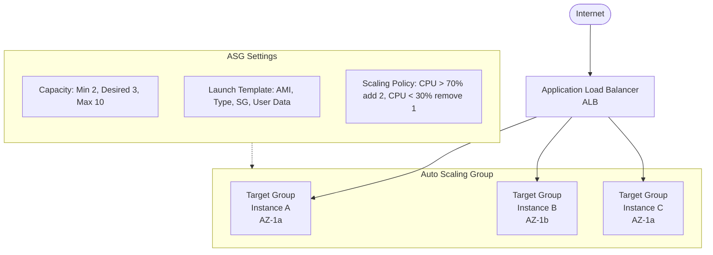

**Complexity**: [MEDIUM] | **Time to Complete**: 2.5h | **Prerequisites**: Module 1.2

## What You'll Be Able to Do

After completing this module, you will be able to:

- **Configure Auto Scaling Groups with launch templates to build self-healing, elastic compute clusters**
- **Implement Application Load Balancers with health checks and target groups for zero-downtime deployments**
- **Evaluate EC2 instance families and purchasing options (On-Demand, Spot, Reserved) to optimize cost and performance**
- **Deploy EC2 instances with User Data scripts and custom AMIs to automate application bootstrapping**

---

## Why This Module Matters

A team that manually provisions EC2 capacity ahead of a major traffic event can still be overwhelmed if demand exceeds forecasts and new instances take too long to bring online.

This disaster was entirely preventable. The engineers treated their cloud servers like physical hardware—static, precious, and requiring manual care. They failed to leverage the "Elastic" in Elastic Compute Cloud.

Amazon EC2 is not just virtual machines in the cloud; it is a programmable compute fabric. When used correctly, EC2 allows your infrastructure to expand and contract dynamically based on real-time demand, ensuring you have enough capacity to handle spikes without paying for idle servers during quiet periods. In this module, you will learn how to automate server provisioning using AMIs and User Data, understand the underlying storage mechanics with EBS, and combine Auto Scaling Groups with Application Load Balancers to build self-healing, highly available compute clusters that scale without human intervention. You will learn to treat servers as ephemeral commodities, not permanent pets.

## The Building Blocks of Compute

To launch an EC2 instance, you must make a series of configuration choices that define its performance profile, cost, and lifecycle. Each choice has trade-offs. Understanding those trade-offs is what separates someone who "uses EC2" from someone who architect with it.

### Instance Types and Families

AWS offers many instance types optimized for different use cases. They are [categorized by family](https://docs.aws.amazon.com/ec2/latest/instancetypes/ec2-instance-type-specifications.html):
*   **General Purpose (e.g., t3, m6i)**: Balanced compute, memory, and network resources. Good for web servers, code repositories, and small to medium databases. [T-series instances are "burstable"—they accumulate CPU credits during idle time and spend them during bursts.](https://docs.aws.amazon.com/AWSEC2/latest/UserGuide/burstable-credits-baseline-concepts.html) If your application has steady moderate usage with occasional spikes, T-series can be significantly cheaper than fixed-performance instances.
*   **Compute Optimized (e.g., c6i, c6g)**: High ratio of vCPUs to memory. Ideal for batch processing, media transcoding, scientific modeling, machine learning inference, and high-performance web servers that need raw CPU horsepower.
*   **Memory Optimized (e.g., r6i, x2idn)**: Designed for workloads that process large data sets in memory, such as relational databases, Redis/Memcached caches, in-memory analytics, and real-time big data processing with Apache Spark.
*   **Storage Optimized (e.g., i3, d3)**: High sequential read/write access to very large data sets on local storage. Designed for data warehousing, distributed file systems (HDFS), and log processing systems.
*   **Accelerated Computing (e.g., p4d, g5)**: Use hardware accelerators (GPUs or custom chips) for floating-point calculations, graphics processing, or machine learning model training.

#### Decoding the Instance Name

An [instance name like `m6i.xlarge` follows a consistent naming scheme](https://docs.aws.amazon.com/ec2/latest/instancetypes/instance-type-names.html):



Understanding the naming convention lets you interpret most instance types at a glance, even ones you have not encountered before.

### Instance Type Comparison Table

The table below compares commonly used instance types across the four most popular families. The table below uses representative `us-east-1` Linux On-Demand prices for a few common instance types; always verify current pricing before making production cost decisions.

| Instance Type | Family | vCPUs | Memory (GiB) | Network (Gbps) | On-Demand $/hr | Best Use Cases |
| :--- | :--- | :---: | :---: | :---: | :---: | :--- |
| `t3.micro` | Burstable GP | 2 | 1 | Up to 5 | ~$0.0104 | Dev/test, microservices, low-traffic sites |
| `t3.medium` | Burstable GP | 2 | 4 | Up to 5 | ~$0.0416 | Small web apps, CI/CD agents, staging environments |
| `t3.xlarge` | Burstable GP | 4 | 16 | Up to 5 | ~$0.1664 | Medium web apps, small databases, application servers |
| `m6i.large` | General Purpose | 2 | 8 | Up to 12.5 | ~$0.096 | Production web servers, mid-size databases, backend APIs |
| `m6i.xlarge` | General Purpose | 4 | 16 | Up to 12.5 | ~$0.192 | App servers, enterprise applications, container hosts |
| `m6i.2xlarge` | General Purpose | 8 | 32 | Up to 12.5 | ~$0.384 | Large application servers, medium databases, EKS nodes |
| `c6i.large` | Compute Optimized | 2 | 4 | Up to 12.5 | ~$0.085 | Batch processing, build servers, game servers |
| `c6i.xlarge` | Compute Optimized | 4 | 8 | Up to 12.5 | ~$0.170 | Video encoding, scientific computing, ML inference |
| `c6i.2xlarge` | Compute Optimized | 8 | 16 | Up to 12.5 | ~$0.340 | High-perf computing, ad serving, real-time analytics |
| `r6i.large` | Memory Optimized | 2 | 16 | Up to 12.5 | ~$0.126 | Redis/Memcached, small in-memory DBs |
| `r6i.xlarge` | Memory Optimized | 4 | 32 | Up to 12.5 | ~$0.252 | PostgreSQL/MySQL, medium caches, real-time analytics |
| `r6i.2xlarge` | Memory Optimized | 8 | 64 | Up to 12.5 | ~$0.504 | Large relational databases, Elasticsearch, SAP HANA |

**Key insight**: Notice how `t3.medium` and `m6i.large` both offer 2 vCPUs—but the `m6i.large` provides 8 GiB of memory (double the `t3.medium`'s 4 GiB at the same vCPU count) and consistent performance without credit-based throttling. For production workloads that need reliable, steady CPU performance, fixed-performance instance families are often a better fit than burstable T-series instances.

> **Stop and think**: You are migrating a legacy, monolithic application that requires 32 GiB of memory. It idles at 15% CPU utilization 95% of the time, but during monthly reporting runs, it hits 100% CPU for several hours. Which instance family and size provides the most cost-effective baseline without risking CPU throttling during the reporting runs?

*Note on Graviton: Instance families ending in 'g' (like m6g, c6g, r6g) use AWS Graviton processors (ARM architecture) rather than x86. They can often offer better price-performance than comparable x86-based instances, depending on workload, generation, and region. If your application stack supports ARM (most Linux workloads, containers, and interpreted languages do), Graviton instances are almost always the smarter choice.*

### Purchasing Options

How you pay for compute dramatically impacts your architecture and your monthly bill. Choosing the wrong purchasing model for a workload is one of the easiest ways to burn money in AWS.

*   **On-Demand**: [Pay for compute capacity by the second with no long-term commitments.](https://aws.amazon.com/ec2/pricing/on-demand/) Most expensive, but maximum flexibility. Use for spiky, unpredictable workloads and applications that cannot be interrupted.
*   **Reserved Instances (RIs)**: Commit to a specific instance type in a specific region for a 1-year or 3-year term. Offers significant discounts compared to On-Demand. [Standard RIs can be sold in the Reserved Instance Marketplace](https://docs.aws.amazon.com/AWSEC2/latest/UserGuide/reserved-instances-types.html) if your needs change.
*   **Savings Plans**: A more flexible alternative to RIs. Instead of committing to a specific instance type, [you commit to a consistent amount of usage measured in dollars per hour (e.g., "$10/hour of compute for 1 year"). This commitment applies across any instance family, size, OS, or region.](https://aws.amazon.com/savingsplans/faq//) Typically the best default choice for steady-state workloads.
*   **Spot Instances**: Request spare Amazon EC2 computing capacity at steep discounts. The catch? [AWS can reclaim the instance with a 2-minute warning if capacity is needed elsewhere.](https://docs.aws.amazon.com/AWSEC2/latest/UserGuide/spot-instance-termination-notices.html) Use for stateless, fault-tolerant, flexible workloads (e.g., image processing queues, CI/CD runners, big data analytics).
*   **Dedicated Hosts**: [A physical EC2 server dedicated for your use.](https://aws.amazon.com/ec2/pricing/) Required for licensing models that require per-socket or per-core visibility (e.g., Windows Server, Oracle Database), or for compliance requirements that prohibit multi-tenant hardware.

#### Purchasing Options Comparison Table

| Option | Discount vs On-Demand | Commitment | Interruption Risk | Best For |
| :--- | :---: | :--- | :---: | :--- |
| **On-Demand** | 0% (baseline) | None | None | Unpredictable workloads, short-term projects |
| **Savings Plan (1yr)** | ~30-40% | $/hr for 1 year | None | Steady-state production workloads |
| **Savings Plan (3yr)** | ~50-60% | $/hr for 3 years | None | Long-running stable infrastructure |
| **Reserved Instance (1yr, All Upfront)** | ~40% | Specific instance, 1 year | None | Known, fixed-size workloads |
| **Reserved Instance (3yr, All Upfront)** | ~60-72% | Specific instance, 3 years | None | Databases, core infrastructure |
| **Spot Instances** | ~60-90% | None | **Yes** (2-min warning) | Batch jobs, CI/CD, data processing |
| **Dedicated Hosts** | Varies | 1 or 3 years (or On-Demand) | None | License compliance, regulatory isolation |

**Cost example**: A continuously running `m6i.xlarge` can cost well over a thousand dollars per year on On-Demand pricing, while commitment-based discounts and Spot pricing can lower costs substantially depending on the workload design and plan you choose.

> **Pause and predict**: A data science team runs a massive, parallel data processing job every night. The job takes 4 hours to complete, but it is heavily checkpointed—if a server shuts down, the job simply resumes from the last checkpoint with a 5-minute penalty. If they switch from On-Demand to Spot instances and experience 3 interruptions per night, will this architectural change save money?

*The golden rule of EC2 cost optimization: use Savings Plans for your baseline, On-Demand for unpredictable burst, and Spot for anything that can tolerate interruption. For a stable production workload, avoid staying on pure On-Demand for more than a few weeks without evaluating a commitment.*

### Storage: Elastic Block Store (EBS)

While instances have temporary local storage (Instance Store), persistent storage requires Amazon EBS. EBS volumes are network-attached block storage drives that persist independently from the life of an instance. Think of them as USB drives you can plug into any server in the same Availability Zone.

*   **gp3 (General Purpose SSD)**: The default for most workloads. It includes baseline IOPS and throughput, and lets you provision additional performance independently of storage capacity. This decoupling is a major improvement over gp2, which tied IOPS directly to volume size.
*   **gp2 (General Purpose SSD, Legacy)**: The previous generation. IOPS scale with volume size (3 IOPS per GiB). Still widely used, but gp3 is almost always cheaper and more flexible for new deployments.
*   **io2 Block Express (Provisioned IOPS SSD)**: Designed for mission-critical, high-performance databases requiring sub-millisecond latency and up to 256,000 IOPS. Expensive, but necessary for I/O-intensive transactional workloads.
*   **st1 (Throughput Optimized HDD)**: Low-cost magnetic storage optimized for large sequential workloads like log processing, data warehousing, and streaming. Cannot be a boot volume.
*   **sc1 (Cold HDD)**: The lowest-cost option, designed for infrequently accessed data. Cannot be a boot volume.

#### EBS Snapshots

[You can create point-in-time backups of EBS volumes, which are stored incrementally in Amazon S3. The first snapshot captures the entire volume; subsequent snapshots only capture changed blocks, making them storage-efficient.](https://docs.aws.amazon.com/AWSEC2/latest/UserGuide/EBSSnapshots.html)

Key capabilities:
*   **Cross-AZ**: Use a snapshot to create a new volume in any AZ within the same region.
*   **Cross-Region**: Copy a snapshot to another region for disaster recovery.
*   **Sharing**: Share snapshots with other AWS accounts.
*   **Fast Snapshot Restore (FSR)**: [Pre-warm a snapshot so that volumes created from it deliver full performance immediately, without the usual first-access latency penalty.](https://docs.aws.amazon.com/ebs/latest/userguide/ebs-fast-snapshot-restore.html)

```bash
# Create a snapshot of an EBS volume
aws ec2 create-snapshot \
    --volume-id vol-0123456789abcdef0 \
    --description "Daily backup - production DB" \
    --tag-specifications 'ResourceType=snapshot,Tags=[{Key=Name,Value=prod-db-daily}]'

# List snapshots you own
aws ec2 describe-snapshots --owner-ids self \
    --query 'Snapshots[*].[SnapshotId,VolumeId,StartTime,State]' \
    --output table

# Create a volume from a snapshot in a different AZ
aws ec2 create-volume \
    --snapshot-id snap-0123456789abcdef0 \
    --availability-zone us-east-1b \
    --volume-type gp3
```

## Automating the Boot Process: AMIs and User Data

If you are logging into a server to run `apt-get install` or modify configuration files manually, you are creating a "pet." In cloud architecture, we want "cattle"—servers that are easily replaceable and identical. The distinction matters enormously: when a pet gets sick, you nurse it back to health; when cattle gets sick, you replace it with a healthy one. Auto Scaling only works if every instance is interchangeable.

### Amazon Machine Images (AMIs)

An AMI provides the information required to launch an instance. It includes the operating system, the architecture type (x86 or ARM), and a snapshot of the root volume.

Instead of configuring a server from scratch every time, a common pattern is "Golden Image" baking:
1. Launch a base Linux AMI.
2. Install your application, security agents, and dependencies.
3. Create a custom AMI from that instance.
4. Launch all future instances directly from your custom AMI—they boot in seconds, fully configured.

```bash
# Find the latest Amazon Linux 2023 AMI
aws ssm get-parameters \
    --names /aws/service/ami-amazon-linux-latest/al2023-ami-kernel-default-x86_64 \
    --query 'Parameters[0].Value' --output text

# Find the latest Ubuntu 22.04 AMI
aws ec2 describe-images \
    --owners 099720109477 \
    --filters "Name=name,Values=ubuntu/images/hvm-ssd/ubuntu-jammy-22.04-amd64-server-*" \
    --query 'sort_by(Images, &CreationDate)[-1].ImageId' \
    --output text

# Create a custom AMI from a running instance
aws ec2 create-image \
    --instance-id i-0123456789abcdef0 \
    --name "MyApp-GoldenImage-$(date +%Y%m%d)" \
    --description "App v2.3 with security agents" \
    --no-reboot

# List your custom AMIs
aws ec2 describe-images --owners self \
    --query 'Images[*].[ImageId,Name,CreationDate]' \
    --output table
```

**Golden Image pipeline in practice**: Production teams typically automate this with HashiCorp Packer or EC2 Image Builder. A CI/CD pipeline builds a new AMI nightly (or on every application release), tests it, and updates the Launch Template. The ASG then gradually rolls out instances using the new AMI.

### User Data and Cloud-Init

If you don't want to bake a custom AMI for every minor configuration change, use **User Data**.

When launching an instance, you can pass a shell script in the User Data field. [The `cloud-init` service running on the EC2 instance executes this script with root privileges during the final stages of the initial boot process.](https://docs.aws.amazon.com/AWSEC2/latest/UserGuide/user-data.html) It is the perfect place to fetch the latest application code from S3, start services, or register the instance with a configuration management tool.

```bash
#!/bin/bash
# Example User Data script
yum update -y
yum install -y httpd
systemctl start httpd
systemctl enable httpd
echo "<h1>Deployed via User Data</h1>" > /var/www/html/index.html
```

A more production-ready User Data script that fetches configuration from Parameter Store and signals success:

```bash
#!/bin/bash
set -euo pipefail

# Log everything for debugging
exec > >(tee /var/log/user-data.log) 2>&1
echo "User Data script started at $(date)"

# Install application
yum update -y
yum install -y httpd aws-cli jq

# Fetch configuration from Parameter Store
APP_VERSION=$(aws ssm get-parameter --name /myapp/version --query 'Parameter.Value' --output text --region us-east-1)
DB_ENDPOINT=$(aws ssm get-parameter --name /myapp/db-endpoint --query 'Parameter.Value' --output text --region us-east-1)

# Download application from S3
aws s3 cp "s3://my-deploy-bucket/releases/${APP_VERSION}/app.tar.gz" /tmp/
tar -xzf /tmp/app.tar.gz -C /var/www/html/

# Write config file
cat << CONF > /var/www/html/config.json
{
    "db_endpoint": "$DB_ENDPOINT",
    "app_version": "$APP_VERSION"
}
CONF

# Start web server
systemctl start httpd
systemctl enable httpd

echo "User Data script completed at $(date)"
```

**Debugging tip**: If your User Data script fails silently, SSH into the instance and check `/var/log/cloud-init-output.log`. This file contains the stdout and stderr of your script. Alternatively, add explicit logging as shown above.

### Golden Image vs. User Data: When to Use Which

| Approach | Boot Time | Flexibility | Maintenance | Best For |
| :--- | :--- | :--- | :--- | :--- |
| **Golden AMI** | Fast (seconds) | Low — rebuild to change | AMI pipeline needed | Stable base, infrequent changes |
| **User Data only** | Slow (minutes) | High — change at launch | Simple script | Rapid iteration, dev/test |
| **Hybrid (recommended)** | Medium | Balanced | Both pipelines | Production: AMI for base + User Data for config |

> **Stop and think**: If a critical zero-day vulnerability is discovered in the OpenSSL library, how does your patching strategy differ if you rely entirely on a Golden AMI versus relying entirely on User Data for OS configuration? Which approach allows for faster emergency remediation across a fleet of 1,000 instances?

A hybrid approach is a common production pattern because it balances fast boot times with runtime flexibility. Bake the OS, security agents, and application runtime into the AMI (things that rarely change). Use User Data to pull the latest application version and environment-specific configuration at boot time (things that change frequently).

## Scaling the Fleet: ASG and ALB

A single EC2 instance is a single point of failure. Modern architectures distribute load across a fleet of instances. The combination of an Application Load Balancer and an Auto Scaling Group is the fundamental pattern for highly available compute in AWS.

### Architecture Overview



### Application Load Balancer (ALB)

[An ALB operates at Layer 7 (HTTP/HTTPS). It receives incoming traffic and distributes it across multiple targets (like EC2 instances) in multiple Availability Zones.](https://docs.aws.amazon.com/elasticloadbalancing/latest/application/introduction.html) ALBs are themselves highly available—AWS runs them across multiple AZs behind the scenes.

Key features:

*   **Health Checks**: The ALB constantly polls a specific endpoint (e.g., `/health`) on your instances. If an instance fails the check, the ALB stops sending traffic to it until it recovers. [You configure the path, port, protocol, healthy/unhealthy thresholds, and check interval.](https://docs.aws.amazon.com/elasticloadbalancing/latest/application/target-group-health-checks.html)
*   **Path-Based Routing**: ALBs can inspect the URL path to route traffic to different target groups. For example, `/api/*` goes to backend instances while `/images/*` goes to a separate rendering fleet.
*   **Host-Based Routing**: [Route traffic based on the `Host` header.](https://docs.aws.amazon.com/elasticloadbalancing/latest/application/rule-condition-types.html) A single ALB can serve `api.example.com`, `app.example.com`, and `admin.example.com`, each routing to a different target group.
*   **Sticky Sessions**: When enabled, the ALB uses a cookie to route a user's requests to the same target for the duration of their session. Useful for stateful applications, but consider externalizing session state to ElastiCache or DynamoDB instead.
*   **Connection Draining**: When a target is deregistered (e.g., during scale-in or deployment), the ALB waits for in-flight requests to complete before fully removing it. [The default deregistration delay is 300 seconds.](https://docs.aws.amazon.com/elasticloadbalancing/latest/application/modify-target-group-health-settings.html)

```bash
# Create a target group with custom health check settings
aws elbv2 create-target-group \
    --name MyApp-TG \
    --protocol HTTP --port 80 \
    --vpc-id vpc-0123456789abcdef0 \
    --health-check-path /health \
    --health-check-interval-seconds 15 \
    --health-check-timeout-seconds 5 \
    --healthy-threshold-count 2 \
    --unhealthy-threshold-count 3 \
    --query 'TargetGroups[0].TargetGroupArn' --output text

# Check the health of targets in a target group
aws elbv2 describe-target-health \
    --target-group-arn arn:aws:elasticloadbalancing:us-east-1:123456789012:targetgroup/MyApp-TG/abc123 \
    --query 'TargetHealthDescriptions[*].[Target.Id,TargetHealth.State,TargetHealth.Description]' \
    --output table
```

### Auto Scaling Groups (ASG)

An ASG contains a collection of EC2 instances that are treated as a logical grouping for automatic scaling and management.

You define a **Launch Template** (specifying the AMI, instance type, security groups, and user data) and attach it to the ASG.

The ASG monitors the health of its instances and ensures the group maintains a specified state:
*   **Self-Healing (Desired Capacity)**: [If you set Desired Capacity to 3, and an instance crashes or is terminated, the ASG automatically launches a replacement using the Launch Template to bring the count back to 3.](https://docs.aws.amazon.com/en_us/autoscaling/ec2/userguide/ec2-auto-scaling-health-checks.html)
*   **Dynamic Scaling**: You can configure scaling policies tied to CloudWatch metrics. For example: "If average CPU utilization exceeds 70% for 3 minutes, launch 2 more instances. If it drops below 30%, terminate 1 instance."
*   **Predictive Scaling**: AWS can analyze historical traffic patterns and proactively scale the fleet before a predicted traffic surge, rather than reacting after the fact. Useful for workloads with predictable daily or weekly patterns.
*   **Scheduled Scaling**: If you know traffic spikes every weekday at 9 AM, you can pre-schedule scale-out actions. Cheaper and more responsive than reactive scaling.

When an ASG is linked to an ALB, newly launched instances are automatically registered with the load balancer and begin receiving traffic as soon as they pass health checks.

#### Scaling Policies in Depth

```bash
# Create a Target Tracking scaling policy (the simplest and most common)
# This policy keeps average CPU at ~60% by adding/removing instances automatically
aws autoscaling put-scaling-policy \
    --auto-scaling-group-name DojoWebASG \
    --policy-name TargetCPU60 \
    --policy-type TargetTrackingScaling \
    --target-tracking-configuration '{
        "PredefinedMetricSpecification": {
            "PredefinedMetricType": "ASGAverageCPUUtilization"
        },
        "TargetValue": 60.0,
        "ScaleInCooldown": 300,
        "ScaleOutCooldown": 60
    }'

# Create a scaling policy based on ALB request count per target
aws autoscaling put-scaling-policy \
    --auto-scaling-group-name DojoWebASG \
    --policy-name TargetRequestCount \
    --policy-type TargetTrackingScaling \
    --target-tracking-configuration '{
        "PredefinedMetricSpecification": {
            "PredefinedMetricType": "ALBRequestCountPerTarget",
            "ResourceLabel": "app/DojoWebALB/abc123/targetgroup/DojoWebTG/def456"
        },
        "TargetValue": 1000.0
    }'

# View current scaling activities
aws autoscaling describe-scaling-activities \
    --auto-scaling-group-name DojoWebASG \
    --query 'Activities[*].[StartTime,StatusCode,Description]' \
    --output table --max-items 5
```

**Warmup and scaling timing matter**: if you scale too aggressively you can thrash, and if you scale too slowly you can respond sluggishly. Tune warmup and scaling timing to match how long your instances actually take to become useful.

## EC2 Lifecycle Management with the CLI

Beyond launching and terminating instances, the AWS CLI gives you full lifecycle control. Here are operations you will use regularly.

```bash
# Launch a single instance with detailed configuration
aws ec2 run-instances \
    --image-id ami-0123456789abcdef0 \
    --instance-type t3.medium \
    --key-name my-keypair \
    --security-group-ids sg-0123456789abcdef0 \
    --subnet-id subnet-0123456789abcdef0 \
    --tag-specifications 'ResourceType=instance,Tags=[{Key=Name,Value=WebServer-01},{Key=Environment,Value=Production}]' \
    --user-data file://userdata.sh \
    --iam-instance-profile Name=WebServerRole \
    --query 'Instances[0].InstanceId' --output text

# List running instances with useful details
aws ec2 describe-instances \
    --filters "Name=instance-state-name,Values=running" \
    --query 'Reservations[*].Instances[*].[InstanceId,InstanceType,PrivateIpAddress,PublicIpAddress,Tags[?Key==`Name`].Value|[0]]' \
    --output table

# Stop an instance (EBS data preserved, public IP released unless Elastic IP)
aws ec2 stop-instances --instance-ids i-0123456789abcdef0

# Start a stopped instance
aws ec2 start-instances --instance-ids i-0123456789abcdef0

# Resize an instance (must be stopped first)
aws ec2 stop-instances --instance-ids i-0123456789abcdef0
aws ec2 wait instance-stopped --instance-ids i-0123456789abcdef0
aws ec2 modify-instance-attribute \
    --instance-id i-0123456789abcdef0 \
    --instance-type '{"Value": "m6i.xlarge"}'
aws ec2 start-instances --instance-ids i-0123456789abcdef0

# Terminate an instance (permanent — EBS root volume deleted by default)
aws ec2 terminate-instances --instance-ids i-0123456789abcdef0

# Connect to an instance via SSM (no SSH key or open port 22 required)
aws ssm start-session --target i-0123456789abcdef0
```

## Instance Metadata Service (IMDS)

Every EC2 instance has access to a [special HTTP endpoint at `169.254.169.254`](https://docs.aws.amazon.com/AWSEC2/latest/UserGuide/configuring-instance-metadata-service.html) that provides information about the instance itself. This metadata is invaluable for bootstrapping scripts that need to know "who am I?" and "where am I?"

```bash
# IMDSv2 (token-based, more secure — always use this)
TOKEN=$(curl -s -X PUT "http://169.254.169.254/latest/api/token" \
    -H "X-aws-ec2-metadata-token-ttl-seconds: 21600")

# Get basic instance identity
curl -s -H "X-aws-ec2-metadata-token: $TOKEN" http://169.254.169.254/latest/meta-data/instance-id
curl -s -H "X-aws-ec2-metadata-token: $TOKEN" http://169.254.169.254/latest/meta-data/instance-type
curl -s -H "X-aws-ec2-metadata-token: $TOKEN" http://169.254.169.254/latest/meta-data/placement/availability-zone
curl -s -H "X-aws-ec2-metadata-token: $TOKEN" http://169.254.169.254/latest/meta-data/local-ipv4
curl -s -H "X-aws-ec2-metadata-token: $TOKEN" http://169.254.169.254/latest/meta-data/public-ipv4

# Get the IAM role credentials (never hardcode creds — use this instead)
curl -s -H "X-aws-ec2-metadata-token: $TOKEN" http://169.254.169.254/latest/meta-data/iam/security-credentials/MyInstanceRole
```

**Security note**: The 2019 Capital One metadata-service breach (see *Node Metadata Security*) <!-- incident-xref: capital-one-2019 --> shows how SSRF protections and scoped IAM permissions around metadata are inseparable controls on any production AWS account.

```bash
# Enforce IMDSv2 on an existing instance
aws ec2 modify-instance-metadata-options \
    --instance-id i-0123456789abcdef0 \
    --http-tokens required \
    --http-endpoint enabled

# Enforce IMDSv2 in a Launch Template
aws ec2 create-launch-template \
    --launch-template-name SecureTemplate \
    --launch-template-data '{
        "MetadataOptions": {
            "HttpTokens": "required",
            "HttpEndpoint": "enabled",
            "HttpPutResponseHopLimit": 1
        }
    }'
```

## Did You Know?

1.  [Amazon EC2 Mac instances actually utilize physically unmodified Apple Mac mini computers integrated directly into the AWS Nitro System, allowing developers to natively run macOS workloads in the cloud for iOS application compilation. You rent the entire physical Mac mini for a minimum of 24 hours.](https://aws.amazon.com/about-aws/whats-new/2020/11/announcing-amazon-ec2-mac-instances-for-macos/)
2.  If you use an Elastic IP (EIP) address and it is attached to a running EC2 instance, it is free. However, if you reserve an EIP and let it sit idle (unattached), AWS charges you an hourly fee to prevent IPv4 address hoarding. [As of February 2024, AWS also charges $0.005/hr for *every* public IPv4 address, even those actively attached to running instances](https://aws.amazon.com/blogs/aws/new-aws-public-ipv4-address-charge-public-ip-insights/)—a change that caught many teams off guard.
3.  The AWS Nitro System is a combination of dedicated hardware and a lightweight hypervisor. It offloads networking, storage, and security functions, reducing virtualization overhead and leaving more host resources available to instances.
4.  [A single Auto Scaling Group can use mixed instance types and mixed purchasing options simultaneously.](https://docs.aws.amazon.com/AWSCloudFormation/latest/TemplateReference/aws-properties-autoscaling-autoscalinggroup-mixedinstancespolicy.html) You can configure an ASG to run 60% On-Demand (for baseline capacity) and 40% Spot (for cost-optimized burst capacity) across multiple instance families, letting AWS pick the cheapest available Spot option at any given moment. This "instance diversification" strategy dramatically reduces the chance of Spot interruptions.

## Common Mistakes

| Mistake | Why It Happens | How to Fix It |
| :--- | :--- | :--- |
| **Losing data on termination** | By default, the root EBS volume is set to "Delete on Termination". Engineers assume stopping is the same as terminating. | Store critical, persistent data on a secondary EBS volume with `DeleteOnTermination=false`, or design applications to be stateless and store data in RDS or S3. |
| **Hardcoding IP addresses** | Legacy applications expect static IPs for internal communication, or developers note down instance IPs in config files. | In an Auto Scaling environment, IPs change constantly. Use internal load balancers, service discovery (Cloud Map), or Route 53 private hosted zones. |
| **Storing AWS credentials on EC2** | Developers put `~/.aws/credentials` on the server so their scripts work, or bake access keys into AMIs. | This is a massive security risk. Always attach an IAM Role (Instance Profile) to the EC2 instance to provide secure, temporary credentials that rotate automatically. |
| **Ignoring Spot Instances for stateless workloads** | "We just use On-Demand for everything because it is simpler." | CI/CD build agents, batch processing jobs, and worker queues are inherently interruptible. Using Spot instances for these workloads can slash compute costs by 60-90%. |
| **Baking secrets into AMIs** | Setting passwords or API keys during the image build process because it "keeps things simple." | Anyone who can launch the AMI has the secrets. Inject secrets at runtime using User Data scripts that fetch them from AWS Secrets Manager or Systems Manager Parameter Store. |
| **Failing to configure ASG health checks** | The ASG relies on standard EC2 status checks, which only verify if the VM is running, not if the application is healthy. | Configure the ASG to use ELB Health Checks. If the web server crashes but the VM stays up, the ASG will terminate and replace the zombie instance. |
| **Using IMDSv1 instead of IMDSv2** | IMDSv1 is the legacy default and "just works" without tokens. Teams often leave the setting unchanged. | Enforce IMDSv2 (`http-tokens required`) on all instances and in all Launch Templates. IMDSv1 is vulnerable to SSRF attacks that can leak IAM credentials. |
| **Not setting a Health Check Grace Period** | The ASG can start health checking soon after launch, before the application has finished bootstrapping. | Set `--health-check-grace-period` to at least the time your User Data script takes to complete (typically 120-300 seconds). Without this, the ASG terminates healthy instances that are still booting. |

## Quiz

<details>
<summary>Question 1: You need to design an architecture for a video rendering application. The rendering jobs are pulled from an SQS queue. If a server goes offline mid-render, the job simply returns to the queue to be picked up by another server. The rendering requires significant CPU power but has a tight budget. What EC2 purchasing option is best?</summary>
Spot Instances are the correct choice because the workload is completely stateless, fault-tolerant, and driven by a queue. When an instance is interrupted with the 2-minute warning, the job simply fails and returns to the SQS queue, where another server will pick it up without data corruption. This architecture perfectly handles the volatility of Spot instances, providing access to powerful compute resources (like c6i instances) at a 70-90% discount compared to On-Demand. To further reduce interruption risk and maintain throughput, you should configure the fleet to diversify across multiple instance types (e.g., c6i, c5, c5a, c6g) and multiple Availability Zones.
</details>

<details>
<summary>Question 2: You launch an EC2 instance with a User Data script that updates the OS packages and installs Node.js. An hour later, you stop the instance and start it again. Will the User Data script run a second time?</summary>
No, the User Data script will not run a second time. By default, the `cloud-init` service that processes User Data scripts only executes during the very first boot lifecycle of the instance. Stopping and starting the instance simply reboots the operating system; it does not trigger the initialization phase again. If you require a script to run on every boot (such as pulling the latest configuration from Parameter Store), you should explicitly configure it using a `cloud-init` `#cloud-boothook` directive, place the script in the `/var/lib/cloud/scripts/per-boot/` directory on the instance, or use another boot-time mechanism such as `systemd`.
</details>

<details>
<summary>Question 3: Your Auto Scaling Group has a Minimum capacity of 2, a Maximum of 10, and a Desired capacity of 4. An Availability Zone experiences a localized failure, bringing down two of your instances. What will the Auto Scaling Group do?</summary>
The Auto Scaling Group will automatically launch two new instances to replace the failed ones. First, the ASG's health checks (or ELB health checks, if configured) will detect that the two instances in the failed AZ are no longer responding. Because the Desired capacity is explicitly set to 4, the ASG detects a drift in state and initiates a scale-out action in the remaining healthy Availability Zones to restore the fleet count. Once the failed AZ eventually recovers, the ASG will perform an AZ rebalancing operation during subsequent scaling activities, ensuring the instances are evenly distributed across all configured zones once again.
</details>

<details>
<summary>Question 4: You attach an EBS volume to an EC2 instance in `us-east-1a`. You take a snapshot of the volume. A few days later, the instance is terminated. Can you use the snapshot to create a new volume for an instance in `us-east-1b`?</summary>
Yes, you can absolutely use the snapshot to create a volume in a different Availability Zone. While EBS volumes themselves are inherently tied to a specific Availability Zone and cannot be moved, EBS snapshots are stored regionally within Amazon S3. Because the snapshot exists at the region level, it can be referenced to instantly provision a new, fully populated volume in `us-east-1b`, `us-east-1c`, or any other AZ within that same region. Furthermore, if you need to migrate the data to a completely different geographic region for disaster recovery, you can copy the snapshot across regions and restore it there.
</details>

<details>
<summary>Question 5: Your team manages an Auto Scaling Group using a legacy Launch Configuration. A critical security patch requires you to update the AMI across the entire fleet. You also want to start mixing On-Demand and Spot instances to save costs. What is the most efficient architectural path forward, and why?</summary>
You must migrate from a Launch Configuration to a Launch Template. Legacy Launch Configurations are strictly immutable; updating an AMI requires creating a completely new configuration object, updating the ASG to point to it, and deleting the old one. More importantly, Launch Configurations are deprecated and do not support modern EC2 features, such as combining Spot and On-Demand instances in the same ASG. Launch Templates solve both problems by supporting versioning—allowing you to simply draft a v2 of the template with the new AMI—and unlocking advanced features like mixed instance policies and IMDSv2 enforcement.
</details>

<details>
<summary>Question 6: An Application Load Balancer is routing traffic to a target group of EC2 instances. One instance suddenly starts returning HTTP 500 errors due to a memory leak in the application. How does the ALB handle this?</summary>
Assuming the ALB is configured with an active health check on an application path (e.g., `/health`), it will detect the HTTP 500 errors. Once the instance returns consecutive errors exceeding the configured "unhealthy threshold," the ALB marks the target as Unhealthy. It immediately stops routing new user requests to that specific instance, distributing the load across the remaining healthy targets to prevent a wider outage. If the Auto Scaling Group is configured to use `ELB` health checks rather than just `EC2` status checks, the ASG will recognize the unhealthy status, terminate the malfunctioning instance, and launch a fresh replacement to restore desired capacity.
</details>

<details>
<summary>Question 7: You have a production web application running on m6i.large instances. Traffic is very predictable: low overnight, ramps up at 8 AM, peaks at noon, and drops off at 6 PM. What scaling strategy should you use?</summary>
You should implement a hybrid strategy using both Scheduled Scaling and Target Tracking policies. Because the traffic pattern is highly predictable, you can configure a Scheduled Action to proactively scale out the fleet before 8 AM (e.g., increasing desired capacity from 2 to 6) and scale it back in at 6 PM, ensuring capacity is ready before the load hits. However, you should also layer a Target Tracking policy on top of this (e.g., targeting 60% CPU utilization). The scheduled scaling handles the known daily baseline efficiently, while the target tracking policy acts as a safety net to dynamically handle unpredictable spikes or sustained surges that exceed the daily norm.
</details>

<details>
<summary>Question 8: A developer creates a custom AMI that includes their application and all dependencies. They share this AMI with another AWS account. The second account launches an instance from this AMI, but it fails with a "snapshot not found" error. What went wrong?</summary>
The launch failure is caused by permissions on the underlying EBS snapshots associated with the AMI. An AMI is essentially a metadata pointer to one or more EBS snapshots stored in S3. When you share an AMI across AWS accounts, you must explicitly share the referenced EBS snapshots as well; otherwise, the target account lacks permission to read the data to create the root volume. Furthermore, if those snapshots are encrypted, you must also share the KMS key used for encryption and ensure the target account has IAM permissions to use that specific key for decryption during the instance launch.
</details>

## Hands-On Exercise: Auto-Scaling Web Fleet

In this exercise, we will create a Launch Template with a bootstrapping script, and deploy it behind an Application Load Balancer using an Auto Scaling Group. You will then generate load to trigger scaling and observe the ASG in action.

*(Prerequisite: You need the VPC and Subnet IDs from Module 1.2. We will assume standard default VPC if you deleted them).*

### Task 1: Create the User Data Script and Security Group
First, we define what the instance will look like and how it behaves on boot.

```bash
# Get Default VPC
VPC_ID=$(aws ec2 describe-vpcs --filter "Name=isDefault,Values=true" --query 'Vpcs[0].VpcId' --output text)
echo "VPC: $VPC_ID"

# Create a Security Group for the ALB (allow port 80 from the internet)
ALB_SG=$(aws ec2 create-security-group \
    --group-name DojoALB-SG \
    --description "Allow HTTP to ALB" \
    --vpc-id $VPC_ID \
    --query 'GroupId' --output text)
aws ec2 authorize-security-group-ingress \
    --group-id $ALB_SG --protocol tcp --port 80 --cidr 0.0.0.0/0

# Create a Security Group for web servers (allow port 80 ONLY from the ALB SG)
WEB_SG=$(aws ec2 create-security-group \
    --group-name DojoWeb-SG \
    --description "Allow HTTP from ALB only" \
    --vpc-id $VPC_ID \
    --query 'GroupId' --output text)
aws ec2 authorize-security-group-ingress \
    --group-id $WEB_SG --protocol tcp --port 80 --source-group $ALB_SG

# Create IAM Role for SSM Access
aws iam create-role --role-name DojoWebSSMRole --assume-role-policy-document '{"Version":"2012-10-17","Statement":[{"Effect":"Allow","Principal":{"Service":"ec2.amazonaws.com"},"Action":"sts:AssumeRole"}]}'
aws iam attach-role-policy --role-name DojoWebSSMRole --policy-arn arn:aws:iam::aws:policy/AmazonSSMManagedInstanceCore
aws iam create-instance-profile --instance-profile-name DojoWebSSMRole
aws iam add-role-to-instance-profile --instance-profile-name DojoWebSSMRole --role-name DojoWebSSMRole

sleep 10 # Wait for IAM instance profile to propagate

echo "ALB SG: $ALB_SG"
echo "Web SG: $WEB_SG"

# Create the bootstrap script
cat << 'USERDATA' > userdata.sh
#!/bin/bash
set -euo pipefail
exec > >(tee /var/log/user-data.log) 2>&1

yum update -y
yum install -y httpd stress-ng

# Enable and start Apache
systemctl start httpd
systemctl enable httpd

# Get instance metadata (IMDSv2)
TOKEN=$(curl -s -X PUT "http://169.254.169.254/latest/api/token" \
    -H "X-aws-ec2-metadata-token-ttl-seconds: 21600")
INSTANCE_ID=$(curl -s -H "X-aws-ec2-metadata-token: $TOKEN" \
    http://169.254.169.254/latest/meta-data/instance-id)
AZ=$(curl -s -H "X-aws-ec2-metadata-token: $TOKEN" \
    http://169.254.169.254/latest/meta-data/placement/availability-zone)
INSTANCE_TYPE=$(curl -s -H "X-aws-ec2-metadata-token: $TOKEN" \
    http://169.254.169.254/latest/meta-data/instance-type)

# Create a web page that identifies this specific instance
cat << HTML > /var/www/html/index.html
<!DOCTYPE html>
<html>
<head><title>KubeDojo EC2 Lab</title></head>
<body style="font-family: Arial; padding: 40px; text-align: center;">
    <h1>Hello from EC2!</h1>
    <table style="margin: auto; text-align: left;">
        <tr><td><strong>Instance ID:</strong></td><td>$INSTANCE_ID</td></tr>
        <tr><td><strong>Availability Zone:</strong></td><td>$AZ</td></tr>
        <tr><td><strong>Instance Type:</strong></td><td>$INSTANCE_TYPE</td></tr>
        <tr><td><strong>Boot Time:</strong></td><td>$(date)</td></tr>
    </table>
</body>
</html>
HTML

# Create a health check endpoint
echo "OK" > /var/www/html/health

echo "User Data completed successfully at $(date)"
USERDATA
```

### Task 2: Create the Launch Template
A Launch Template defines the blueprint for the ASG.

```bash
# Find the latest Amazon Linux 2023 AMI
AMI_ID=$(aws ssm get-parameters \
    --names /aws/service/ami-amazon-linux-latest/al2023-ami-kernel-default-x86_64 \
    --query 'Parameters[0].Value' --output text)
echo "AMI: $AMI_ID"

# Create Launch Template data (base64 encode the userdata)
cat << EOF > template-data.json
{
    "ImageId": "$AMI_ID",
    "InstanceType": "t3.micro",
    "SecurityGroupIds": ["$WEB_SG"],
    "UserData": "$(cat userdata.sh | base64 | tr -d '\n')",
    "IamInstanceProfile": {
        "Name": "DojoWebSSMRole"
    },
    "MetadataOptions": {
        "HttpTokens": "required",
        "HttpEndpoint": "enabled"
    },
    "TagSpecifications": [
        {
            "ResourceType": "instance",
            "Tags": [
                {"Key": "Name", "Value": "DojoWeb"},
                {"Key": "Project", "Value": "KubeDojo-EC2-Lab"}
            ]
        }
    ]
}
EOF

# Create the Launch Template
aws ec2 create-launch-template \
    --launch-template-name DojoWebTemplate \
    --version-description "v1-initial" \
    --launch-template-data file://template-data.json
```

### Task 3: Create the Load Balancer Infrastructure
Before creating the ASG, we need a target group and the ALB itself.

```bash
# Get Subnet IDs for the Default VPC (need at least 2 AZs)
SUBNETS=$(aws ec2 describe-subnets \
    --filters "Name=vpc-id,Values=$VPC_ID" "Name=default-for-az,Values=true" \
    --query 'Subnets[0:2].SubnetId' --output text)
SUBNET_1=$(echo $SUBNETS | awk '{print $1}')
SUBNET_2=$(echo $SUBNETS | awk '{print $2}')
echo "Subnet 1: $SUBNET_1"
echo "Subnet 2: $SUBNET_2"

# Create Target Group with custom health check
TG_ARN=$(aws elbv2 create-target-group \
    --name DojoWebTG \
    --protocol HTTP --port 80 \
    --vpc-id $VPC_ID \
    --health-check-path /health \
    --health-check-interval-seconds 15 \
    --healthy-threshold-count 2 \
    --unhealthy-threshold-count 3 \
    --query 'TargetGroups[0].TargetGroupArn' --output text)
echo "Target Group: $TG_ARN"

# Create ALB (Internet-facing)
ALB_ARN=$(aws elbv2 create-load-balancer \
    --name DojoWebALB \
    --subnets $SUBNET_1 $SUBNET_2 \
    --security-groups $ALB_SG \
    --query 'LoadBalancers[0].LoadBalancerArn' --output text)
echo "ALB: $ALB_ARN"

# Wait for ALB to provision (takes ~2 mins)
echo "Waiting for ALB to become active..."
aws elbv2 wait load-balancer-available --load-balancer-arns $ALB_ARN
```

**Challenge: Create the Listener**
The ALB is running, but it is not listening for traffic yet. Construct a command using the AWS CLI to create a listener on HTTP port 80 that forwards traffic to your Target Group (`$TG_ARN`).

<details>
<summary>Stuck? Click here for the solution</summary>

```bash
aws elbv2 create-listener \
    --load-balancer-arn $ALB_ARN \
    --protocol HTTP --port 80 \
    --default-actions Type=forward,TargetGroupArn=$TG_ARN

# Get ALB DNS Name
ALB_DNS=$(aws elbv2 describe-load-balancers \
    --load-balancer-arns $ALB_ARN \
    --query 'LoadBalancers[0].DNSName' --output text)
echo "ALB DNS: http://$ALB_DNS"
```
</details>

### Task 4: Challenge - Create the Auto Scaling Group
Instead of blind copy-pasting, construct the AWS CLI command to create the Auto Scaling Group yourself.

**Requirements**:
- **Name**: `DojoWebASG`
- **Template**: Use `LaunchTemplateName=DojoWebTemplate,Version='$Latest'`
- **Capacity**: Minimum `2`, Maximum `6`, Desired `2`
- **Network**: Place instances in both `$SUBNET_1` and `$SUBNET_2`
- **Routing**: Attach it to your Target Group (`$TG_ARN`)
- **Health**: Set the health check type to `ELB` with a grace period of `180` seconds. *(Critical: If you use the default EC2 health check, the ASG will not replace instances that fail ALB health checks!)*

<details>
<summary>Stuck? Click here for the solution</summary>

```bash
# Create ASG spanning two subnets, desired capacity 2
aws autoscaling create-auto-scaling-group \
    --auto-scaling-group-name DojoWebASG \
    --launch-template LaunchTemplateName=DojoWebTemplate,Version='$Latest' \
    --min-size 2 --max-size 6 --desired-capacity 2 \
    --vpc-zone-identifier "$SUBNET_1,$SUBNET_2" \
    --target-group-arns $TG_ARN \
    --health-check-type ELB \
    --health-check-grace-period 180 \
    --tags Key=Name,Value=DojoWeb-ASG,PropagateAtLaunch=false
```
</details>

Once the ASG is created, apply the scaling policy to allow it to react to CPU spikes:

```bash
# Add a Target Tracking scaling policy (scale based on CPU)
aws autoscaling put-scaling-policy \
    --auto-scaling-group-name DojoWebASG \
    --policy-name DojoTargetCPU50 \
    --policy-type TargetTrackingScaling \
    --target-tracking-configuration '{
        "PredefinedMetricSpecification": {
            "PredefinedMetricType": "ASGAverageCPUUtilization"
        },
        "TargetValue": 50.0,
        "ScaleInCooldown": 300,
        "ScaleOutCooldown": 60
    }'

echo "ASG created with scaling policy. Waiting for instances to launch..."
```

### Task 5: Verify and Test

```bash
# Check instance status (wait ~2 minutes for instances to boot)
aws autoscaling describe-auto-scaling-groups \
    --auto-scaling-group-names DojoWebASG \
    --query 'AutoScalingGroups[0].[DesiredCapacity,Instances[*].[InstanceId,HealthStatus,AvailabilityZone]]' \
    --output table

# Check target health in the ALB
aws elbv2 describe-target-health \
    --target-group-arn $TG_ARN \
    --query 'TargetHealthDescriptions[*].[Target.Id,TargetHealth.State]' \
    --output table

# Test the ALB endpoint (run multiple times to see different instance IDs)
curl http://$ALB_DNS
curl http://$ALB_DNS
curl http://$ALB_DNS
```

Open the DNS name in a browser. Refresh a few times to see the traffic balancing between different instances—you should see different Instance IDs and Availability Zones in the response.

### Task 6: Trigger Auto Scaling (Optional)

To observe scaling in action, SSH into one of the instances (or use SSM Session Manager) and generate CPU load:

```bash
# From inside an EC2 instance, generate CPU stress for 5 minutes
stress-ng --cpu 2 --timeout 300s

# From your local machine, watch the ASG react (run every 30 seconds)
watch -n 30 "aws autoscaling describe-auto-scaling-groups \
    --auto-scaling-group-names DojoWebASG \
    --query 'AutoScalingGroups[0].[DesiredCapacity,Instances[*].[InstanceId,HealthStatus]]' \
    --output table"

# Check scaling activity log
aws autoscaling describe-scaling-activities \
    --auto-scaling-group-name DojoWebASG \
    --query 'Activities[*].[StartTime,StatusCode,Description]' \
    --output table --max-items 5
```

Within a few minutes of the CPU load exceeding the 50% target, you should see the ASG launch additional instances automatically.

### Task 7: Test Self-Healing

Manually terminate one of the instances and watch the ASG replace it:

```bash
# Get an instance ID from the ASG
INSTANCE_TO_KILL=$(aws autoscaling describe-auto-scaling-groups \
    --auto-scaling-group-names DojoWebASG \
    --query 'AutoScalingGroups[0].Instances[0].InstanceId' --output text)

echo "Terminating $INSTANCE_TO_KILL to test self-healing..."
aws ec2 terminate-instances --instance-ids $INSTANCE_TO_KILL

# Watch the ASG detect the failure and launch a replacement
watch -n 15 "aws autoscaling describe-auto-scaling-groups \
    --auto-scaling-group-names DojoWebASG \
    --query 'AutoScalingGroups[0].Instances[*].[InstanceId,HealthStatus,LifecycleState]' \
    --output table"
```

The ASG should detect the terminated instance within 1-2 health check cycles and automatically launch a replacement to maintain the desired capacity of 2.

### Clean Up

**Important**: Always clean up to avoid ongoing charges.

```bash
# Step 1: Delete ASG (force-delete terminates all instances)
aws autoscaling delete-auto-scaling-group \
    --auto-scaling-group-name DojoWebASG --force-delete
echo "ASG deletion initiated. Waiting for instances to terminate..."
sleep 30

# Step 2: Delete ALB and Listener (listener is deleted with the ALB)
aws elbv2 delete-load-balancer --load-balancer-arn $ALB_ARN
echo "Waiting for ALB to be deleted..."
sleep 30

# Step 3: Delete Target Group (must wait for ALB to be fully gone)
aws elbv2 delete-target-group --target-group-arn $TG_ARN

# Step 4: Delete Launch Template
aws ec2 delete-launch-template --launch-template-name DojoWebTemplate

# Step 5: Delete Security Groups (must wait for instances to fully terminate)
echo "Waiting for instances to fully terminate before deleting security groups..."
sleep 60
aws ec2 delete-security-group --group-id $WEB_SG
aws ec2 delete-security-group --group-id $ALB_SG

# Step 6: Clean up IAM Role
aws iam remove-role-from-instance-profile --instance-profile-name DojoWebSSMRole --role-name DojoWebSSMRole
aws iam delete-instance-profile --instance-profile-name DojoWebSSMRole
aws iam detach-role-policy --role-name DojoWebSSMRole --policy-arn arn:aws:iam::aws:policy/AmazonSSMManagedInstanceCore
aws iam delete-role --role-name DojoWebSSMRole

# Step 7: Clean up local files
rm -f userdata.sh template-data.json

echo "Cleanup complete!"
```

### Success Criteria

- [ ] I successfully created separate Security Groups for the ALB and web servers (defense in depth).
- [ ] I created a Launch Template with User Data, IMDSv2 enforcement, and proper tagging.
- [ ] I created an ALB with a Target Group using a custom health check path (`/health`).
- [ ] I successfully constructed the commands to create the ALB listener and Auto Scaling Group from raw requirements.
- [ ] I hit the ALB DNS name in a browser and verified that my User Data script successfully configured the web servers, showing different Instance IDs on refresh.
- [ ] I observed the ASG self-heal by terminating an instance and watching a replacement launch automatically.

## Next Module

Now that you have stateless compute, you need a place to store massive amounts of unstructured data. Head to [Module 1.4: S3 & Object Storage](../module-1.4-s3/).

## Sources

- [docs.aws.amazon.com: ec2 instance type specifications.html](https://docs.aws.amazon.com/ec2/latest/instancetypes/ec2-instance-type-specifications.html) — AWS instance-type documentation explicitly defines these categories and their intended workload profiles.
- [docs.aws.amazon.com: burstable credits baseline concepts.html](https://docs.aws.amazon.com/AWSEC2/latest/UserGuide/burstable-credits-baseline-concepts.html) — AWS burstable-instance documentation directly explains CPU credit accrual and spending.
- [docs.aws.amazon.com: instance type names.html](https://docs.aws.amazon.com/ec2/latest/instancetypes/instance-type-names.html) — AWS documents the instance naming convention and each component of the identifier.
- [aws.amazon.com: on demand](https://aws.amazon.com/ec2/pricing/on-demand/) — General lesson point for an illustrative rewrite.
- [docs.aws.amazon.com: what is aws graviton.html](https://docs.aws.amazon.com/id_id/whitepapers/latest/aws-graviton-performance-testing/what-is-aws-graviton.html) — General lesson point for an illustrative rewrite.
- [docs.aws.amazon.com: reserved instances types.html](https://docs.aws.amazon.com/AWSEC2/latest/UserGuide/reserved-instances-types.html) — AWS's RI documentation explicitly distinguishes marketplace eligibility for Standard versus Convertible RIs.
- [aws.amazon.com: faq](https://aws.amazon.com/savingsplans/faq//) — AWS Savings Plans documentation directly describes the commitment model and flexibility scope.
- [docs.aws.amazon.com: spot instance termination notices.html](https://docs.aws.amazon.com/AWSEC2/latest/UserGuide/spot-instance-termination-notices.html) — AWS Spot interruption documentation directly states the two-minute notice behavior.
- [aws.amazon.com: pricing](https://aws.amazon.com/ec2/pricing/) — AWS's EC2 pricing page directly describes Dedicated Hosts as fully dedicated physical servers for your use.
- [docs.aws.amazon.com: EBSSnapshots.html](https://docs.aws.amazon.com/AWSEC2/latest/UserGuide/EBSSnapshots.html) — AWS snapshot documentation directly states that EBS snapshots are point-in-time, incremental backups stored in S3.
- [docs.aws.amazon.com: ebs fast snapshot restore.html](https://docs.aws.amazon.com/ebs/latest/userguide/ebs-fast-snapshot-restore.html) — AWS FSR documentation directly describes these behaviors.
- [docs.aws.amazon.com: user data.html](https://docs.aws.amazon.com/AWSEC2/latest/UserGuide/user-data.html) — The EC2 user-data guide directly covers these execution and debugging details.
- [docs.aws.amazon.com: introduction.html](https://docs.aws.amazon.com/elasticloadbalancing/latest/application/introduction.html) — AWS ALB documentation directly describes the OSI layer, multi-AZ targeting, and health-based routing.
- [docs.aws.amazon.com: target group health checks.html](https://docs.aws.amazon.com/elasticloadbalancing/latest/application/target-group-health-checks.html) — The target-group health-check guide documents these exact settings.
- [docs.aws.amazon.com: rule condition types.html](https://docs.aws.amazon.com/elasticloadbalancing/latest/application/rule-condition-types.html) — AWS listener-rule condition documentation explicitly covers host-header and path-pattern routing.
- [docs.aws.amazon.com: modify target group health settings.html](https://docs.aws.amazon.com/elasticloadbalancing/latest/application/modify-target-group-health-settings.html) — AWS target-group attribute documentation directly states both capabilities.
- [docs.aws.amazon.com: ec2 auto scaling health checks.html](https://docs.aws.amazon.com/en_us/autoscaling/ec2/userguide/ec2-auto-scaling-health-checks.html) — AWS Auto Scaling health-check documentation directly describes replacement behavior for unhealthy instances.
- [docs.aws.amazon.com: configuring instance metadata service.html](https://docs.aws.amazon.com/AWSEC2/latest/UserGuide/configuring-instance-metadata-service.html) — AWS's IMDS documentation directly covers the endpoint, token flow, and enforcement behavior.
- [aws.amazon.com: announcing amazon ec2 mac instances for macos](https://aws.amazon.com/about-aws/whats-new/2020/11/announcing-amazon-ec2-mac-instances-for-macos/) — AWS's launch announcement directly states the Mac mini/Nitro integration and the 24-hour minimum host allocation.
- [aws.amazon.com: new aws public ipv4 address charge public ip insights](https://aws.amazon.com/blogs/aws/new-aws-public-ipv4-address-charge-public-ip-insights/) — AWS's announcement directly states the February 1, 2024 pricing change and rate.
- [docs.aws.amazon.com: aws properties autoscaling autoscalinggroup mixedinstancespolicy.html](https://docs.aws.amazon.com/AWSCloudFormation/latest/TemplateReference/aws-properties-autoscaling-autoscalinggroup-mixedinstancespolicy.html) — AWS mixed-instances-policy documentation directly supports this capability and its launch-template requirement.
