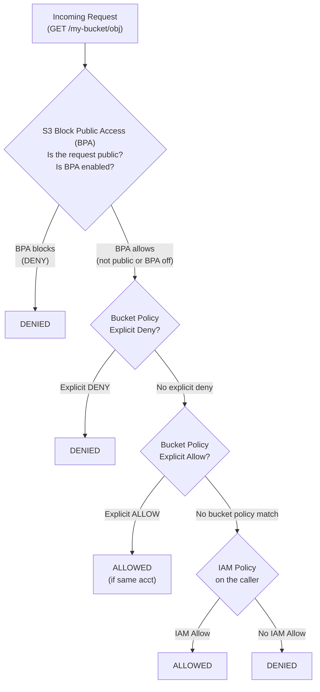
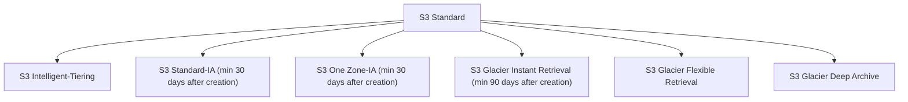
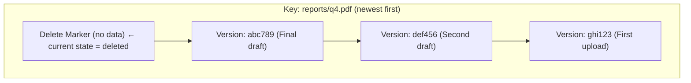

**Complexity**: [MEDIUM] | **Time to Complete**: 2.5h | **Prerequisites**: Module 1.1

## What You'll Be Able to Do

After completing this module, you will be able to:

- **Configure S3 bucket policies and access control lists to enforce least-privilege access on object storage**
- **Implement lifecycle policies to automate data tiering across S3 storage classes and reduce storage costs**
- **Deploy server-side encryption with KMS customer-managed keys and enforce encryption in transit**
- **Design presigned URL strategies and cross-account access patterns for secure, time-limited object sharing**

---

## Why This Module Matters

Publicly accessible S3 buckets have repeatedly exposed sensitive data when administrators or applications granted overly broad access. In practice, a single misconfigured bucket policy or ACL can turn private data into an internet-readable exposure until someone detects and fixes it.

Amazon Simple Storage Service (S3) is the foundational storage layer of the cloud. It is infinitely scalable, [highly durable, and handles trillions of objects globally](https://aws.amazon.com/s3). Because it is so accessible and easy to use, it is the standard destination for application assets, database backups, massive data lakes, and static website hosting.

However, this accessibility is a double-edged sword. S3 sits squarely on the public internet by default (in terms of network routing, not permissions). A single misconfigured bucket policy can turn a private data repository into a public data breach instantly. In this module, you will learn the mechanics of object storage versus traditional file storage. You will master the security layers that protect S3 data, implement lifecycle rules to automate cost-saving archiving strategies, and learn how to generate secure, time-limited access mechanisms to share objects without exposing your buckets.

---

## Object Storage vs. File Storage

If you have used a traditional operating system or a network attached storage (NAS) drive, you are familiar with **File Storage**. Data is organized in a hierarchical tree of nested directories and folders. Modifying a large file usually involves updating just the changed blocks on the disk.

S3 is **Object Storage**. It operates fundamentally differently:
*   **Flat Structure**: There are no real directories or folders in S3. Everything is stored in a massive, flat container called a **Bucket**.
*   **Keys and Objects**: Data is stored as an Object, consisting of the file data and its metadata. Every object is identified by a unique **Key** (the file path/name). When you see a path like `images/2023/photo.jpg` in S3, `images/2023/` is not a folder; the entire string `images/2023/photo.jpg` is just a long key name. The console visually simulates folders for your convenience.
*   **Immutability**: Objects in S3 are immutable. You cannot open a 10GB video file in S3, edit the metadata, and save just the changes. If you modify an object, S3 completely overwrites the existing object with the new version.

### Quick Comparison

| Feature | File Storage (EFS/NFS) | Block Storage (EBS) | Object Storage (S3) |
| :--- | :--- | :--- | :--- |
| **Structure** | Hierarchical (dirs/files) | Raw blocks on a disk | Flat namespace (keys) |
| **Access** | NFS/SMB protocol | Mounted to one EC2 | HTTP REST API |
| **Modify in place** | Yes | Yes | No (full overwrite) |
| **Max object size** | Limited by disk | Limited by volume | Up to 50 TB per object |
| **Metadata** | Basic (permissions, timestamps) | None (raw blocks) | Rich, custom key-value pairs |
| **Typical use** | Shared home dirs, CMS | Database volumes, OS disks | Backups, data lakes, static assets |
| **Durability** | Depends on config | 99.999% (within AZ) | 99.999999999% (11 nines) |

Think of it this way: EBS is a hard drive bolted to one server, EFS is a network file share everyone mounts, and S3 is a massive warehouse where you hand parcels to a clerk and get a receipt (the key) to retrieve them later.

---

## S3 Security: Layers of Defense

Because S3 buckets exist in a global namespace and are addressable via HTTP endpoints, securing them requires overlapping layers of authorization. S3 evaluates permissions using a combination of IAM policies and resource-based policies.

Here is how the full access evaluation flow works when a request hits S3:



**Key rules:**
- Explicit DENY always wins, anywhere in the chain
- [Cross-account: BOTH bucket policy AND caller IAM must Allow](https://docs.aws.amazon.com/AmazonS3/latest/userguide/how-s3-evaluates-access-control.html)
- Same account: Either bucket policy OR IAM Allow is sufficient
- BPA is the master override for public access attempts

### 1. S3 Block Public Access (BPA)

This is your master switch. BPA operates at the account or bucket level to override any policy that attempts to make data public. [If BPA is turned on (and it is by default for all new buckets), even if an administrator writes a bucket policy explicitly granting `s3:GetObject` to `*` (everyone), S3 will block the request.](https://docs.aws.amazon.com/AmazonS3/latest/userguide/access-control-block-public-access.html) **Never disable Block Public Access on a bucket unless you are intentionally hosting public web assets.**

BPA has four independent settings—you can toggle each one:

| Setting | What It Blocks |
| :--- | :--- |
| `BlockPublicAcls` | Rejects PUT requests that include a public ACL |
| `IgnorePublicAcls` | Ignores any existing public ACLs on the bucket/objects |
| `BlockPublicPolicy` | Rejects bucket policies that grant public access |
| `RestrictPublicBuckets` | Restricts access to buckets with public policies to only AWS services and authorized users |

Best practice: enable all four at the **account** level so no bucket in the entire account can ever go public accidentally.

```bash
# Enable BPA at the ACCOUNT level (recommended)
aws s3control put-public-access-block \
    --account-id $(aws sts get-caller-identity --query Account --output text) \
    --public-access-block-configuration \
    "BlockPublicAcls=true,IgnorePublicAcls=true,BlockPublicPolicy=true,RestrictPublicBuckets=true"
```

> **Stop and think**: If an S3 bucket has Block Public Access enabled at the account level, but a developer explicitly writes a Bucket Policy granting `s3:GetObject` to `*` (everyone), which rule wins when an anonymous user tries to download a file?

### 2. IAM Policies

As covered in Module 1.1, IAM policies are attached to the *identity* making the request (a User or a Role). If an EC2 instance has an IAM Role that allows `s3:PutObject` to a specific bucket, the instance can upload files.

Example: allow a role to read only from a specific prefix:

```json
{
    "Version": "2012-10-17",
    "Statement": [
        {
            "Effect": "Allow",
            "Action": [
                "s3:GetObject",
                "s3:ListBucket"
            ],
            "Resource": [
                "arn:aws:s3:::my-data-bucket",
                "arn:aws:s3:::my-data-bucket/reports/*"
            ],
            "Condition": {
                "StringEquals": {
                    "s3:prefix": "reports/"
                }
            }
        }
    ]
}
```

Notice the two ARN entries: one for the bucket itself (needed for `ListBucket`) and one for the objects inside it (needed for `GetObject`). Forgetting the bucket-level ARN is one of the most common IAM debugging headaches.

### 3. Bucket Policies

A Bucket Policy is attached directly to the *resource* (the bucket itself). It is a JSON document that acts like a bouncer at the door of the bucket.
*   **Cross-Account Access**: Bucket policies are essential for allowing users from *other* AWS accounts to read or write to your bucket.
*   **Enforcing Encryption**: You can write a bucket policy that denies all `s3:PutObject` requests unless the request includes a header enforcing AES256 server-side encryption.
*   **IP Restriction**: You can deny access to the bucket unless the request originates from your corporate VPN's IP address range.

Example: enforce encryption on all uploads:

```json
{
    "Version": "2012-10-17",
    "Statement": [
        {
            "Sid": "DenyUnencryptedUploads",
            "Effect": "Deny",
            "Principal": "*",
            "Action": "s3:PutObject",
            "Resource": "arn:aws:s3:::my-secure-bucket/*",
            "Condition": {
                "StringNotEquals": {
                    "s3:x-amz-server-side-encryption": "aws:kms"
                }
            }
        }
    ]
}
```

### 4. Access Control Lists (ACLs)

ACLs are a legacy access control mechanism from before IAM existed. They apply to individual objects or the bucket. [AWS strongly recommends disabling ACLs entirely (setting the bucket to "Bucket Owner Enforced")](https://docs.aws.amazon.com/AmazonS3/latest/userguide/about-object-ownership.html) and relying exclusively on IAM and Bucket Policies.

### Bucket Policy vs. ACL vs. IAM — When to Use What

| Aspect | IAM Policy | Bucket Policy | ACL |
| :--- | :--- | :--- | :--- |
| **Attached to** | Identity (user/role) | Resource (bucket) | Bucket or object |
| **Cross-account** | Only the caller side | Can grant to external principals | Can grant to other accounts |
| **Max size** | 6,144 chars (inline) | 20 KB | Fixed grantee list |
| **Granularity** | Any AWS action | S3 actions only | Read/Write/Full Control only |
| **Conditional logic** | Full Condition block | Full Condition block | None |
| **AWS recommendation** | Primary mechanism | Use for cross-account + resource constraints | **Disable (legacy)** |
| **When to use** | Controlling what *your* users can do | Controlling who can access *your* bucket | Almost never—only for S3 access logs |

**Rule of thumb**: Use IAM policies for same-account access control. Use bucket policies for cross-account access, IP restrictions, and encryption enforcement. Disable ACLs.

---

## Pre-Signed URLs: Secure Temporary Access

Imagine you are building a photo-sharing application. Users upload private photos, and the app displays them.

**The Bad Way**: The web server downloads the image from S3 and streams it to the client. This bottlenecks the web server's network and memory.
**The Insecure Way**: You make the S3 bucket public so the client browser can load the image directly via the S3 URL. Now anyone can steal the photos.

**The S3 Way**: Pre-Signed URLs.
Your backend application (which has an IAM Role with access to S3) uses the AWS SDK to generate a temporary, cryptographically signed URL. This URL grants access to download a *specific object* for a *specific period* (e.g., 5 minutes). The backend sends this URL to the frontend. The user's browser uses the signed URL to download the image directly from S3. Once the 5 minutes expire, the URL becomes invalid.

### Generating Pre-Signed URLs

```bash
# Generate a pre-signed URL valid for 300 seconds (5 minutes)
aws s3 presign s3://my-bucket/private/report.pdf --expires-in 300

# Output (example):
# https://my-bucket.s3.amazonaws.com/private/report.pdf?X-Amz-Algorithm=AWS4-HMAC-SHA256&X-Amz-Credential=...&X-Amz-Expires=300&X-Amz-Signature=abc123...

# Generate a pre-signed URL for UPLOADING (PUT)
aws s3 presign s3://my-bucket/uploads/user-photo.jpg \
    --expires-in 3600

# Anyone with this URL can upload a file to that exact key for 1 hour
```

Important details about pre-signed URLs:

- [The URL inherits the permissions of the IAM identity that generated it. If that identity loses access, existing pre-signed URLs typically stop working once that change takes effect.](https://docs.aws.amazon.com/AmazonS3/latest/userguide/using-presigned-url.html)
- Maximum expiration: up to 7 days when generated with the AWS CLI or SDKs using IAM user credentials; URLs signed with temporary credentials expire when those credentials expire.
- Pre-signed URLs work for both GET (download) and PUT (upload) operations.

> **Stop and think**: You generate a pre-signed URL valid for 7 days using your IAM User credentials. Two days later, your IAM User is deleted by an administrator. What happens when someone tries to use the URL on day 3?

---

## Storage Classes and Lifecycle Rules

S3 offers different storage classes designed for different data access patterns. Why pay premium rates for data you rarely access?

### Storage Class Comparison

| Storage Class | Availability | Min Storage Duration | Min Object Size | Retrieval Time | Storage Cost (us-east-1) | Retrieval Cost | Best For |
| :--- | :--- | :--- | :--- | :--- | :--- | :--- | :--- |
| **S3 Standard** | 99.99% | None | None | Instant | ~$0.023/GB/mo | None | Active data, websites |
| **S3 Intelligent-Tiering** | 99.9% | None | None | Instant* | ~$0.023/GB/mo + monitoring fee | None | Unknown access patterns |
| **S3 Standard-IA** | 99.9% | 30 days | 128 KB | Instant | ~$0.0125/GB/mo | $0.01/GB | Backups, DR copies |
| **S3 One Zone-IA** | 99.5% | 30 days | 128 KB | Instant | ~$0.01/GB/mo | $0.01/GB | Reproducible infrequent data |
| **S3 Glacier Instant** | 99.9% | 90 days | 128 KB | Instant | ~$0.004/GB/mo | $0.03/GB | Archive with instant access |
| **S3 Glacier Flexible** | 99.99% | 90 days | None | 1-5 min to 12 hrs | ~$0.0036/GB/mo | $0.01-0.03/GB | Long-term archives |
| **S3 Glacier Deep Archive** | 99.99% | 180 days | None | 12-48 hours | ~$0.00099/GB/mo | $0.02/GB | Compliance, 7-10yr retention |

*Note: Prices are approximate and vary by region. Check the [AWS S3 Pricing page](https://aws.amazon.com/s3/pricing/) for current rates.*

**S3 Intelligent-Tiering** deserves special attention. It automatically moves objects between an infrequent-access tier and a frequent-access tier based on usage patterns. [It charges a small monthly monitoring fee per object (~$0.0025 per 1,000 objects) but can save significantly on large datasets with unpredictable access patterns. There is no retrieval fee.](https://aws.amazon.com/pricing/s3/)

> **Pause and predict**: If you use S3 Intelligent-Tiering for a small bucket with only 50 objects that you access constantly, will you save money compared to S3 Standard?

### Cost Example

Suppose you store 10 TB of application logs:

| Strategy | Monthly Cost (approx) |
| :--- | :--- |
| All in S3 Standard | See current AWS pricing for an exact monthly total |
| All in S3 Standard-IA | See current AWS pricing for an exact monthly total |
| All in Glacier Deep Archive | See current AWS pricing for an exact monthly total |
| Smart tiering with lifecycle (30/90/365 day transitions) | Depends heavily on object size, access, and request patterns |

Lifecycle rules can materially reduce storage costs when access patterns and retention windows fit colder tiers.

### Lifecycle Rules

You don't want to manually move data between these tiers. S3 **Lifecycle Rules** automate the process.

You can configure a rule that says:
1. When log files are created, store them in **S3 Standard**.
2. After 30 days, transition them to **S3 Standard-IA**.
3. After 90 days, transition them to **S3 Glacier Flexible Retrieval**.
4. After 365 days, permanently **Delete** the objects.

This automated tiering drastically reduces storage costs for historical data.

```bash
# View existing lifecycle rules on a bucket
aws s3api get-bucket-lifecycle-configuration --bucket my-bucket

# Delete all lifecycle rules (careful!)
aws s3api delete-bucket-lifecycle --bucket my-bucket
```

### Lifecycle Rule Constraints

There are ordering rules you must follow when transitioning between storage classes. [S3 enforces a "waterfall" — you can only transition downward](https://docs.aws.amazon.com/AmazonS3/latest/userguide/lifecycle-transition-general-considerations.html):



You cannot transition from Glacier back to Standard-IA via a lifecycle rule. To move data "upward," you must restore and copy it manually.

> **Pause and predict**: Look at the minimum object size for S3 Standard-IA (128 KB). If you configure a lifecycle rule to transition a bucket containing 10 million tiny 5 KB log files from Standard to Standard-IA, what do you expect will happen to your monthly storage bill?

---

## Essential S3 CLI Commands

The AWS CLI provides two command families for S3:

- **`aws s3`** — High-level commands (cp, sync, ls, mv, rm). These handle multipart uploads, retries, and parallelism automatically.
- **`aws s3api`** — Low-level API calls (put-object, get-object, put-bucket-policy). Full control, JSON input/output.

### Copying Files

```bash
# Upload a single file
aws s3 cp backup.tar.gz s3://my-bucket/backups/backup.tar.gz

# Download a file
aws s3 cp s3://my-bucket/backups/backup.tar.gz ./backup.tar.gz

# Copy between buckets
aws s3 cp s3://source-bucket/data.csv s3://dest-bucket/archive/data.csv

# Upload with a specific storage class
aws s3 cp large-archive.tar.gz s3://my-bucket/archives/ \
    --storage-class GLACIER

# Upload with server-side encryption (KMS)
aws s3 cp secret-report.pdf s3://my-bucket/confidential/ \
    --sse aws:kms \
    --sse-kms-key-id alias/my-key

# Copy an entire directory (recursive)
aws s3 cp ./logs/ s3://my-bucket/logs/ --recursive

# Copy with a filter — only .log files
aws s3 cp ./logs/ s3://my-bucket/logs/ --recursive \
    --exclude "*" --include "*.log"
```

### Syncing Directories

`aws s3 sync` is the workhorse for backups. It only copies files that are new or modified (based on size and timestamp), similar to `rsync`.

```bash
# Sync a local directory to S3
aws s3 sync ./website/ s3://my-website-bucket/

# Sync from S3 to local
aws s3 sync s3://my-bucket/data/ ./local-data/

# Sync and DELETE files in the destination that don't exist in source
# (makes destination an exact mirror — use with caution!)
aws s3 sync ./website/ s3://my-website-bucket/ --delete

# Dry run — see what WOULD happen without actually doing it
aws s3 sync ./website/ s3://my-website-bucket/ --dryrun

# Sync only certain file types
aws s3 sync ./assets/ s3://my-bucket/assets/ \
    --exclude "*" --include "*.jpg" --include "*.png"
```

### Listing and Inspecting

```bash
# List all buckets in the account
aws s3 ls

# List objects in a bucket (top-level "folders")
aws s3 ls s3://my-bucket/

# List objects recursively with sizes
aws s3 ls s3://my-bucket/ --recursive --human-readable --summarize

# Get detailed metadata for a specific object
aws s3api head-object --bucket my-bucket --key reports/q4-summary.pdf
```

### Managing Buckets

```bash
# Create a bucket
aws s3 mb s3://my-new-bucket --region us-west-2

# Remove an EMPTY bucket
aws s3 rb s3://my-empty-bucket

# Remove a bucket AND all its contents (destructive!)
aws s3 rb s3://my-bucket --force

# Enable versioning
aws s3api put-bucket-versioning \
    --bucket my-bucket \
    --versioning-configuration Status=Enabled

# Check versioning status
aws s3api get-bucket-versioning --bucket my-bucket

# Enable default encryption (SSE-S3)
aws s3api put-bucket-encryption \
    --bucket my-bucket \
    --server-side-encryption-configuration '{
        "Rules": [{"ApplyServerSideEncryptionByDefault": {"SSEAlgorithm": "AES256"}}]
    }'
```

### Restoring from Glacier

Objects in Glacier classes are not immediately downloadable. You must initiate a restore first.

```bash
# Initiate a restore (Expedited = 1-5 min, Standard = 3-5 hrs, Bulk = 5-12 hrs)
aws s3api restore-object \
    --bucket my-archive-bucket \
    --key old-logs/app-2023.tar.gz \
    --restore-request '{"Days": 7, "GlacierJobParameters": {"Tier": "Standard"}}'

# Check restore status
aws s3api head-object \
    --bucket my-archive-bucket \
    --key old-logs/app-2023.tar.gz

# The "Restore" header will show:
#   ongoing-request="true"   → still restoring
#   ongoing-request="false", expiry-date="..."  → ready to download
```

---

## S3 Encryption

S3 offers multiple encryption options. Since January 2023, **[all new objects are encrypted by default](https://docs.aws.amazon.com/AmazonS3/latest/userguide/default-encryption-faq.html)** with SSE-S3 (AES-256), even if you do not specify encryption settings.

| Encryption Type | Key Managed By | When to Use |
| :--- | :--- | :--- |
| **SSE-S3** (AES-256) | AWS (fully managed) | Default, simplest option |
| **SSE-KMS** | AWS KMS (you control key policies) | Audit trail, key rotation, cross-account |
| **SSE-C** | You (provide key in every request) | Regulatory requirement to hold keys |
| **Client-side** | You (encrypt before upload) | Zero-trust, end-to-end encryption |

**SSE-KMS** is a common enterprise choice because it integrates with AWS KMS and CloudTrail for auditability, and customer-managed KMS keys can use optional automatic rotation.

---

## S3 Versioning Deep Dive

When versioning is enabled, every overwrite or delete creates a new version rather than destroying data.



A standard GET returns 404 (delete marker).
GET with `?versionId=abc789` returns the Final draft.
DELETE the delete marker → restores abc789 as current.

Important versioning behaviors:
- [Versioning cannot be disabled once enabled. You can only **suspend** it](https://docs.aws.amazon.com/AmazonS3/latest/userguide/Versioning.html) (new objects get a null version ID, but existing versions remain).
- Suspended versioning still preserves previously created versions — it does not delete them.
- You pay for **every** stored version, so frequent overwrites can multiply storage costs quickly.
- MFA Delete can require multi-factor authentication to delete versions or change versioning state.

> **Stop and think**: If you have a bucket with 1 million objects, and you enable versioning but never overwrite or delete any existing objects, what happens to your storage bill?

---

## Did You Know?

1.  [S3 provides "read-after-write" consistency for all PUTs and DELETEs. If you write a new object and immediately attempt to read it, S3 will return the new data. (Prior to December 2020, S3 was only eventually consistent, meaning immediate reads might return a 404 or an older version).](https://aws.amazon.com/about-aws/whats-new/2020/12/amazon-s3-now-delivers-strong-read-after-write-consistency-automatically-for-all-applications/)

2.  S3 supports static website hosting. By placing an `index.html` file in a bucket, turning off Block Public Access, and adding a public-read bucket policy, S3 acts as a globally distributed, highly available web server without provisioning any EC2 instances.

3.  S3 has offered ways to reduce data movement by filtering or transforming data closer to storage. For example, S3 Select can return only matching rows from supported object formats, but it is no longer available to new customers; check current AWS guidance before designing around older S3 query features.

4.  S3 is designed for [99.999999999% (11 nines) durability](https://docs.aws.amazon.com/AmazonS3/latest/userguide/s3-data-inventory.html). To put that in perspective: S3 is designed for extremely high durability, with data stored redundantly across multiple Availability Zones by default. S3 achieves this by automatically replicating every object across a minimum of 3 Availability Zones within a region.

---

## Common Mistakes

| Mistake | Why It Happens | How to Fix It |
| :--- | :--- | :--- |
| **Leaking data via public buckets** | Turning off Block Public Access because "the application is throwing a 403 error and this makes it work." | Never turn off BPA for private data. Fix the IAM policies or generate Pre-Signed URLs for the application. |
| **Paying for millions of tiny files in IA** | Moving massive amounts of 5KB log files to Standard-IA to save money. | Standard-IA has a minimum billable object size of 128KB. Moving a 5KB file charges you for 128KB, completely destroying the cost savings. Bundle tiny files before tiering. |
| **Using S3 as a database** | Because it has an API and stores JSON, developers try to use it for high-frequency transactional updates. | S3 is not optimized for rapid, sub-millisecond, concurrent transactional reads/writes. Use DynamoDB or RDS for transactional data. |
| **Failing to manage versioning costs** | Enabling versioning on a bucket that receives constant updates, keeping thousands of old versions forever. | S3 charges for *every* stored version. If you enable versioning, you MUST configure a Lifecycle Rule to expire noncurrent versions after a set period. |
| **Bucket name collisions** | Trying to create a bucket named `test-bucket`. | S3 bucket names must be globally unique across all AWS accounts in all regions. Use a naming convention involving your company name and account ID (e.g., `acme-corp-123456789012-prod-backups`). |
| **Ignoring server-side encryption** | Forgetting to check the encryption box. | Always enable default S3 Server-Side Encryption (SSE-S3 or SSE-KMS) to ensure data is encrypted at rest automatically. As of 2023, SSE-S3 is applied by default, but SSE-KMS is recommended for audit trails. |
| **Forgetting both ARN forms in IAM policies** | Writing an IAM policy with only the bucket ARN (`arn:aws:s3:::my-bucket`) or only the object ARN (`arn:aws:s3:::my-bucket/*`). | `ListBucket` requires the bucket ARN. `GetObject`/`PutObject` require the object ARN with `/*`. Always include **both** when granting read/write access. |
| **Not setting lifecycle rules on incomplete multipart uploads** | Large uploads that fail midway leave invisible fragments that cost money indefinitely. | Add a lifecycle rule to abort incomplete multipart uploads after 7 days: this is free storage savings that every bucket should have. |

---

## Quiz

<details>
<summary>Question 1: An auditor requires that your company keep application logs for exactly 7 years to meet compliance regulations. The logs are never accessed unless an audit occurs, at which point a 24-hour retrieval delay is perfectly acceptable. How should you store these logs most cost-effectively?</summary>

You should upload the logs directly to the S3 bucket and use a Lifecycle Rule to transition them to the S3 Glacier Deep Archive storage class as soon as practical. Glacier Deep Archive offers the lowest possible storage cost, designed exactly for data that is rarely accessed but must be retained for compliance. Since the auditor accepts a 24-hour retrieval delay, the 12-48 hour retrieval time of Deep Archive perfectly fits the requirement. Finally, you would configure the lifecycle rule to permanently delete the objects after 2,555 days (7 years) to prevent paying for data you no longer legally need to keep.
</details>

<details>
<summary>Question 2: You attempt to attach a Bucket Policy to an S3 bucket granting public read access to a specific prefix (`images/`). The AWS Console throws an error and refuses to save the policy. What is the most likely cause?</summary>

The most likely cause is that S3 Block Public Access (BPA) is enabled on the bucket or at the account level. BPA acts as a master security override that actively prevents you from applying any bucket policy or ACL that grants public access. Even if you have full administrative privileges, S3 will reject the policy save attempt to protect you from accidental exposure. You would need to intentionally disable the specific BPA settings before the public policy could be successfully attached.
</details>

<details>
<summary>Question 3: A third-party data analytics company needs to upload a daily CSV file to a bucket in your AWS account. They provide you with their IAM Role ARN. How do you grant them access without creating an IAM user for them in your account?</summary>

You should create a Resource-Based Policy (a Bucket Policy) on your S3 bucket that grants them access. The policy will specify an `Effect` of `Allow`, the `Action` as `s3:PutObject`, and the `Resource` as your bucket ARN. Crucially, the `Principal` in the policy must be set to the AWS account ID or the specific IAM Role ARN provided by the third-party company. Keep in mind that for cross-account access to work, the permissions must be explicitly granted on both sides: your bucket policy must allow their role, and their account's IAM policy must allow the role to upload to your bucket.
</details>

<details>
<summary>Question 4: You delete a 1GB video file from an S3 bucket that has Object Versioning enabled. You realize it was a mistake. Is the file gone permanently, and how do you recover it?</summary>

No, the file is not permanently deleted. Because Object Versioning is enabled on the bucket, a standard delete operation does not destroy the data; instead, it simply inserts a "Delete Marker" over the object. This marker becomes the current version, effectively hiding the object from standard list or download commands. To recover the file, you simply query the object's version history and delete the "Delete Marker," which immediately restores the previous version of the video file to the active state.
</details>

<details>
<summary>Question 5: Your team stores 50 million small JSON files (average 2 KB each) in S3 Standard. A cost optimization review suggests moving them to S3 Standard-IA. Will this save money?</summary>

No, implementing this change will likely increase your monthly storage costs significantly. S3 Standard-IA has a minimum billable object size constraint of 128 KB per object. Since your files average only 2 KB, AWS will bill each file as if it were 128 KB, effectively charging you for over 6 TB of storage instead of the actual 100 GB. Additionally, Standard-IA charges a per-GB retrieval fee, meaning you would pay every time a log is accessed. The correct cost-optimization approach would be to bundle these small JSON files into larger archives before moving them to an infrequent access tier.
</details>

<details>
<summary>Question 6: A user uploads an object to S3 via the console. At the exact same millisecond, a developer attempts to download that specific object via the AWS CLI. Will the developer get a 404 Not Found error, partial data, or the full object?</summary>

The developer will receive the full object without any corruption or partial data. S3 provides strong read-after-write consistency for all PUT operations, meaning that once S3 returns a success response for the upload, the data is immediately and fully available to all readers. If the developer's request hits S3 the exact millisecond before the upload definitively completes, they will simply receive a 404 Not Found error. In neither case will S3 return partial data during an ongoing write operation, ensuring strict data integrity.
</details>

<details>
<summary>Question 7: Your development team needs to grant a third-party auditor 24-hour read access to a specific confidential report stored in S3. One engineer suggests temporarily modifying the bucket policy to allow their IP address, while another suggests generating a Pre-Signed URL. Why is the Pre-Signed URL the more secure approach for this scenario?</summary>

A Pre-Signed URL is significantly more secure because it uses programmatic cryptography to generate a specific, time-bound signature for a single object operation. Modifying a bucket policy affects the permissions of the bucket broadly and relies entirely on an administrator remembering to manually revert the change later, which often leads to accidental exposure if forgotten. Once the expiration time on a Pre-Signed URL passes, the signature becomes mathematically invalid, requiring no cleanup or state changes to the bucket itself. Furthermore, Pre-Signed URLs operate with the permissions of the identity that created them and apply only to the precise object specified, meaning they are less likely to grant broader access than intended.
</details>

<details>
<summary>Question 8: You enable versioning on a bucket and then later decide you no longer want it. You call `put-bucket-versioning` with `Status=Suspended`. What happens to the existing object versions?</summary>

All existing object versions will remain in the bucket exactly as they were, and they will continue to incur standard storage costs. Suspending versioning does not delete any previous versions; it only affects how new write operations are handled. Any new objects or overwrites will receive a `null` version ID instead of a unique cryptographic version ID. If you actually want to free up storage space and stop paying for the old data, you must explicitly delete the old versions or configure a lifecycle rule to automatically expire noncurrent versions.
</details>

---

## Hands-On Exercise: Production Backup Bucket with Lifecycle Management

In this exercise, you will build a production-grade backup bucket with security hardening, versioning, lifecycle automation, and practice essential CLI operations. This mirrors what a real platform team configures for application backups.

### Task 1: Create and Secure the Bucket

```bash
# Generate a unique bucket name
export MY_BUCKET="dojo-backup-$(openssl rand -hex 6)"
echo "Bucket name: $MY_BUCKET"

# Create the bucket (default region)
aws s3 mb s3://$MY_BUCKET

# Create a customer-managed KMS key
export KMS_KEY_ID=$(aws kms create-key \
    --description "KMS key for Dojo Backup Bucket" \
    --query 'KeyMetadata.KeyId' --output text)
echo "Created KMS Key: $KMS_KEY_ID"

# Enforce Block Public Access (all four settings)
aws s3api put-public-access-block \
    --bucket $MY_BUCKET \
    --public-access-block-configuration \
    "BlockPublicAcls=true,IgnorePublicAcls=true,BlockPublicPolicy=true,RestrictPublicBuckets=true"

# Enable default encryption (SSE-KMS)
aws s3api put-bucket-encryption \
    --bucket $MY_BUCKET \
    --server-side-encryption-configuration '{
        "Rules": [
            {
                "ApplyServerSideEncryptionByDefault": {
                    "SSEAlgorithm": "aws:kms",
                    "KMSMasterKeyID": "'$KMS_KEY_ID'"
                },
                "BucketKeyEnabled": true
            }
        ]
    }'

# Enable Object Versioning
aws s3api put-bucket-versioning \
    --bucket $MY_BUCKET \
    --versioning-configuration Status=Enabled

# Verify all settings
echo "=== Block Public Access ==="
aws s3api get-public-access-block --bucket $MY_BUCKET
echo "=== Encryption ==="
aws s3api get-bucket-encryption --bucket $MY_BUCKET
echo "=== Versioning ==="
aws s3api get-bucket-versioning --bucket $MY_BUCKET
```

### Task 2: Upload Backups and Observe Versioning

Simulate a real backup workflow: daily database dumps that overwrite the same key.

```bash
# Create a simulated "daily backup" directory
mkdir -p ./backup-exercise

# Day 1 backup
echo '{"date": "2025-01-01", "records": 1000, "status": "healthy"}' > ./backup-exercise/db-dump.json
aws s3 cp ./backup-exercise/db-dump.json s3://$MY_BUCKET/backups/daily/db-dump.json
echo "Uploaded Day 1 backup"

# Day 2 backup (overwrites same key — versioning keeps Day 1)
echo '{"date": "2025-01-02", "records": 1042, "status": "healthy"}' > ./backup-exercise/db-dump.json
aws s3 cp ./backup-exercise/db-dump.json s3://$MY_BUCKET/backups/daily/db-dump.json
echo "Uploaded Day 2 backup"

# Day 3 backup (corrupted!)
echo '{"date": "2025-01-03", "records": -1, "status": "CORRUPTED"}' > ./backup-exercise/db-dump.json
aws s3 cp ./backup-exercise/db-dump.json s3://$MY_BUCKET/backups/daily/db-dump.json
echo "Uploaded Day 3 backup (corrupted)"

# View the current (corrupted) version
echo "=== Current version ==="
aws s3 cp s3://$MY_BUCKET/backups/daily/db-dump.json -

# List ALL versions — note the VersionIds
echo "=== All versions ==="
aws s3api list-object-versions \
    --bucket $MY_BUCKET \
    --prefix backups/daily/db-dump.json \
    --query 'Versions[].{Key:Key,VersionId:VersionId,LastModified:LastModified,Size:Size}'
```

### Task 3: Recover from the Corrupted Backup

Roll back to the healthy Day 2 backup by downloading a specific version.

```bash
# Get the version ID of Day 2 (the second entry, index [1])
DAY2_VERSION=$(aws s3api list-object-versions \
    --bucket $MY_BUCKET \
    --prefix backups/daily/db-dump.json \
    --query 'Versions[1].VersionId' --output text)
echo "Day 2 version ID: $DAY2_VERSION"

# Download the Day 2 version specifically
aws s3api get-object \
    --bucket $MY_BUCKET \
    --key backups/daily/db-dump.json \
    --version-id $DAY2_VERSION \
    ./backup-exercise/db-dump-day2-restored.json

echo "=== Restored Day 2 backup ==="
cat ./backup-exercise/db-dump-day2-restored.json

# Re-upload the healthy version as the current version
aws s3 cp ./backup-exercise/db-dump-day2-restored.json \
    s3://$MY_BUCKET/backups/daily/db-dump.json
echo "Day 2 backup restored as current version"

# Verify
aws s3 cp s3://$MY_BUCKET/backups/daily/db-dump.json -
```

### Task 4: Sync a Local Directory and Generate a Pre-Signed URL

```bash
# Create some additional "application logs"
for i in 1 2 3 4 5; do
    echo "Log entry $i: $(date -u +%Y-%m-%dT%H:%M:%SZ) - Application started" \
        > ./backup-exercise/app-log-day$i.txt
done

# Sync the entire directory to S3 (only new/changed files are uploaded)
aws s3 sync ./backup-exercise/ s3://$MY_BUCKET/logs/ \
    --exclude "*.json"

# Verify with a recursive listing
aws s3 ls s3://$MY_BUCKET/ --recursive --human-readable

# Generate a pre-signed URL to share one log file (valid 10 minutes)
SIGNED_URL=$(aws s3 presign s3://$MY_BUCKET/logs/app-log-day1.txt --expires-in 600)
echo "=== Pre-Signed URL (valid 10 min) ==="
echo "$SIGNED_URL"

# Test the URL (should return the log content)
curl -s "$SIGNED_URL"
```

### Task 5: Configure Production Lifecycle Rules

Set up a comprehensive lifecycle policy with multiple rules.

```bash
cat << 'EOF' > lifecycle.json
{
    "Rules": [
        {
            "ID": "TransitionDailyBackups",
            "Filter": {
                "Prefix": "backups/daily/"
            },
            "Status": "Enabled",
            "Transitions": [
                {
                    "Days": 30,
                    "StorageClass": "STANDARD_IA"
                },
                {
                    "Days": 90,
                    "StorageClass": "GLACIER"
                }
            ],
            "NoncurrentVersionTransitions": [
                {
                    "NoncurrentDays": 30,
                    "StorageClass": "GLACIER"
                }
            ],
            "NoncurrentVersionExpiration": {
                "NoncurrentDays": 365
            }
        },
        {
            "ID": "ExpireOldLogs",
            "Filter": {
                "Prefix": "logs/"
            },
            "Status": "Enabled",
            "Transitions": [
                {
                    "Days": 14,
                    "StorageClass": "STANDARD_IA"
                },
                {
                    "Days": 60,
                    "StorageClass": "GLACIER"
                }
            ],
            "Expiration": {
                "Days": 180
            }
        },
        {
            "ID": "CleanupIncompleteUploads",
            "Filter": {
                "Prefix": ""
            },
            "Status": "Enabled",
            "AbortIncompleteMultipartUpload": {
                "DaysAfterInitiation": 7
            }
        }
    ]
}
EOF

# Apply the lifecycle configuration
aws s3api put-bucket-lifecycle-configuration \
    --bucket $MY_BUCKET \
    --lifecycle-configuration file://lifecycle.json

# Verify — inspect each rule
aws s3api get-bucket-lifecycle-configuration --bucket $MY_BUCKET
```

What these rules accomplish:

| Rule | What It Does |
| :--- | :--- |
| **TransitionDailyBackups** | Current backups: Standard -> IA at 30 days -> Glacier at 90 days. Old versions: Glacier at 30 days, deleted at 365 days. |
| **ExpireOldLogs** | Logs: Standard -> IA at 14 days -> Glacier at 60 days -> Deleted at 180 days. |
| **CleanupIncompleteUploads** | Aborts any multipart upload that has been in progress for more than 7 days (prevents hidden storage costs). |

### Task 6: Apply a Bucket Policy (Enforce Encryption)

```bash
# Create a bucket policy that denies unencrypted uploads
cat << EOF > bucket-policy.json
{
    "Version": "2012-10-17",
    "Statement": [
        {
            "Sid": "DenyUnencryptedObjectUploads",
            "Effect": "Deny",
            "Principal": "*",
            "Action": "s3:PutObject",
            "Resource": "arn:aws:s3:::${MY_BUCKET}/*",
            "Condition": {
                "StringNotEquals": {
                    "s3:x-amz-server-side-encryption": "aws:kms"
                }
            }
        },
        {
            "Sid": "DenyInsecureTransport",
            "Effect": "Deny",
            "Principal": "*",
            "Action": "s3:*",
            "Resource": [
                "arn:aws:s3:::${MY_BUCKET}",
                "arn:aws:s3:::${MY_BUCKET}/*"
            ],
            "Condition": {
                "Bool": {
                    "aws:SecureTransport": "false"
                }
            }
        }
    ]
}
EOF

# Apply the bucket policy
aws s3api put-bucket-policy \
    --bucket $MY_BUCKET \
    --policy file://bucket-policy.json

# Verify
aws s3api get-bucket-policy --bucket $MY_BUCKET --output text | python3 -m json.tool
```

### Clean Up

Because a versioned bucket contains hidden data, a simple `rm --recursive` won't work easily from the standard CLI. We have to use the API to delete all versions.

```bash
# Python script to delete all versions and markers
cat << EOF > empty_bucket.py
import boto3
import sys

bucket_name = sys.argv[1]
s3 = boto3.resource('s3')
bucket = s3.Bucket(bucket_name)
print(f"Deleting all versions in {bucket_name}...")
bucket.object_versions.delete()
print(f"Deleting bucket {bucket_name}...")
bucket.delete()
print("Done!")
EOF

# Install required dependency
python3 -m pip install boto3

# Run script to delete bucket and contents
python3 empty_bucket.py $MY_BUCKET

# Schedule KMS key deletion (minimum 7 days)
aws kms schedule-key-deletion \
    --key-id $KMS_KEY_ID \
    --pending-window-in-days 7

# Clean up local files
rm -rf ./backup-exercise lifecycle.json bucket-policy.json empty_bucket.py
```

### Success Criteria

- [ ] I created a bucket with Block Public Access, a customer-managed KMS key for default encryption, and versioning enabled.
- [ ] I uploaded multiple versions of the same file and listed the version history.
- [ ] I recovered a specific previous version after a simulated data corruption.
- [ ] I synced a local directory to S3 and generated a working pre-signed URL.
- [ ] I applied a lifecycle configuration with multiple rules (transition, expiration, incomplete upload cleanup).
- [ ] I applied a bucket policy that enforces encryption and denies insecure (non-HTTPS) transport.
- [ ] I cleaned up all resources (bucket, local files, and KMS key).

---

## Next Module

Now that you have mastery over compute and storage, it is time to route users to your applications globally. Head to [Module 1.5: Route 53 & DNS](../module-1.5-route53/).

## Sources

- [aws.amazon.com: s3](https://aws.amazon.com/s3) — AWS's current S3 product page directly states S3 stores hundreds of exabytes and more than 500 trillion objects and emphasizes durability at scale.
- [docs.aws.amazon.com: access control block public access.html](https://docs.aws.amazon.com/AmazonS3/latest/userguide/access-control-block-public-access.html) — AWS documents that Block Public Access settings override public policies and permissions, and new buckets do not allow public access by default.
- [docs.aws.amazon.com: how s3 evaluates access control.html](https://docs.aws.amazon.com/AmazonS3/latest/userguide/how-s3-evaluates-access-control.html) — AWS's authorization workflow docs directly describe same-account versus cross-account evaluation and explicit deny behavior.
- [docs.aws.amazon.com: about object ownership.html](https://docs.aws.amazon.com/AmazonS3/latest/userguide/about-object-ownership.html) — AWS explicitly documents Bucket owner enforced as the default and recommends keeping ACLs disabled for most modern S3 use cases.
- [docs.aws.amazon.com: using presigned url.html](https://docs.aws.amazon.com/AmazonS3/latest/userguide/using-presigned-url.html) — The S3 presigned URL guide states that presigned URLs expire when the underlying credential expires or is revoked, deleted, or deactivated.
- [docs.aws.amazon.com: storage class intro.html](https://docs.aws.amazon.com/AmazonS3/latest/userguide/storage-class-intro.html) — AWS's storage class guide directly covers minimum duration rules, 128 KB billing constraints, and retrieval characteristics for the S3 storage classes discussed.
- [aws.amazon.com: s3](https://aws.amazon.com/pricing/s3/) — Current S3 pricing is published on AWS's official pricing page and is the correct primary source for region-specific storage and retrieval prices.
- [docs.aws.amazon.com: lifecycle transition general considerations.html](https://docs.aws.amazon.com/AmazonS3/latest/userguide/lifecycle-transition-general-considerations.html) — AWS documents the supported lifecycle transition matrix as a waterfall model with explicit allowed transitions.
- [docs.aws.amazon.com: default encryption faq.html](https://docs.aws.amazon.com/AmazonS3/latest/userguide/default-encryption-faq.html) — AWS's default encryption FAQ states that starting January 5, 2023, all new object uploads are automatically encrypted with SSE-S3.
- [docs.aws.amazon.com: Versioning.html](https://docs.aws.amazon.com/AmazonS3/latest/userguide/Versioning.html) — AWS's versioning documentation directly covers versioning-enabled versus suspended states, delete markers, and full-object billing for each version.
- [aws.amazon.com: amazon s3 now delivers strong read after write consistency automatically for all applications](https://aws.amazon.com/about-aws/whats-new/2020/12/amazon-s3-now-delivers-strong-read-after-write-consistency-automatically-for-all-applications/) — AWS's December 1, 2020 announcement directly documents the shift to strong read-after-write consistency.
- [docs.aws.amazon.com: s3 data inventory.html](https://docs.aws.amazon.com/AmazonS3/latest/userguide/s3-data-inventory.html) — AWS documentation directly states 11 nines durability and redundant storage across a minimum of three Availability Zones by default.
- [docs.aws.amazon.com: bucket naming](https://docs.aws.amazon.com/console/s3/bucket-naming) — AWS's bucket naming rules explicitly document shared global namespace uniqueness within a partition.
- [docs.aws.amazon.com: abort mpu.html](https://docs.aws.amazon.com/AmazonS3/latest/userguide/abort-mpu.html) — AWS explicitly states that uploaded multipart parts are billed and recommends aborting incomplete uploads, including via lifecycle configuration.
