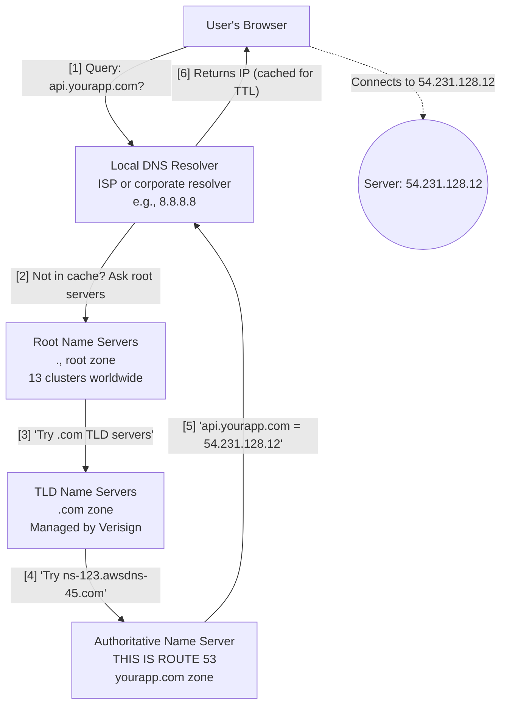
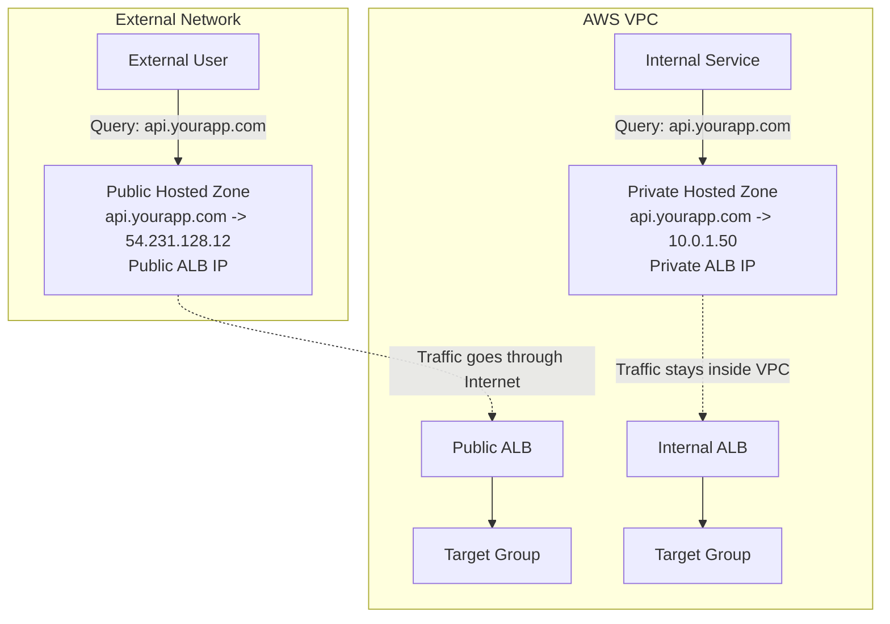
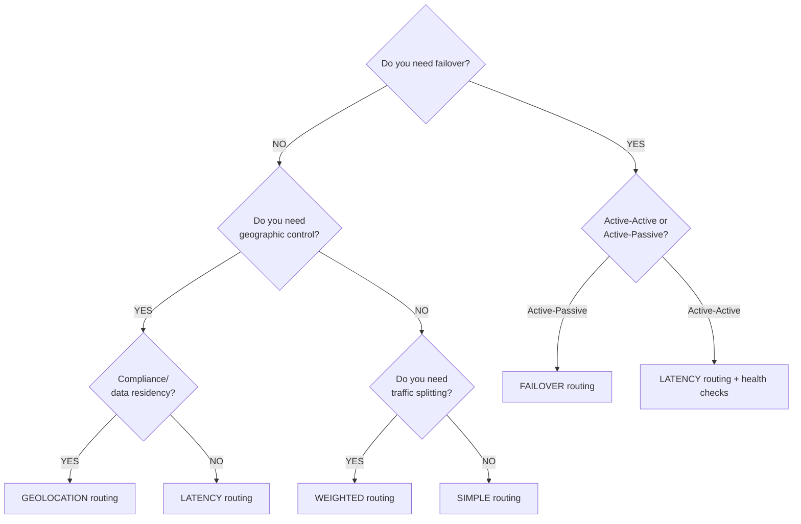
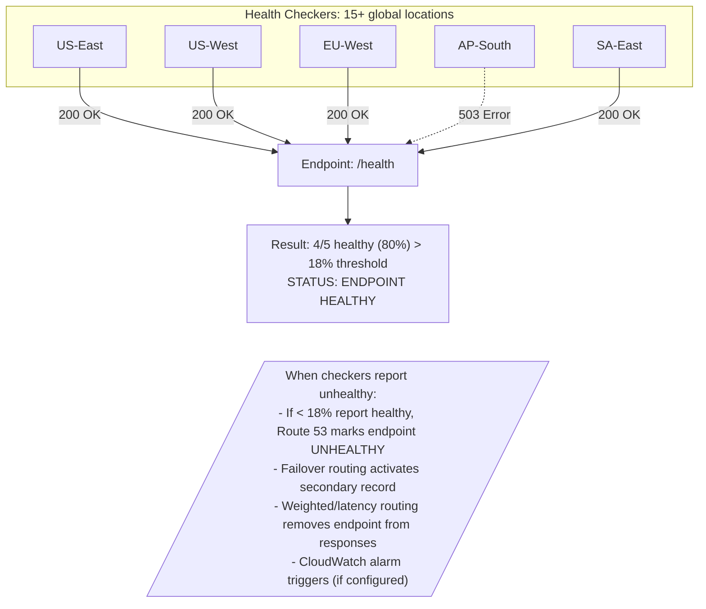

## Complexity: [MEDIUM]
## Time to Complete: 1.5 hours

---

## Prerequisites

Before starting this module, you should have completed:
- [Module 1.2: VPC & Networking Foundations](../module-1.2-vpc/)
- Basic understanding of domain names and how browsers resolve URLs
- AWS account with at least one registered domain (or willingness to register one ~$12/year)
- AWS CLI configured with appropriate permissions

## What You'll Be Able to Do

After completing this module, you will be able to:

- **Configure Route 53 hosted zones with multiple routing policies (weighted, latency, failover, geolocation)**
- **Implement DNS-based health checks and failover routing to achieve automated disaster recovery**
- **Design split-horizon DNS architectures that separate public and private name resolution**
- **Deploy alias records and integrate Route 53 with ALB, CloudFront, and S3 static websites**

---

## Why This Module Matters

In October 2021, Facebook disappeared from the internet. Not figuratively -- literally. For six hours, the company's DNS records were unreachable because a routine BGP configuration change accidentally withdrew the routes to Facebook's DNS servers. The result: 3.5 billion users locked out, an estimated $100 million in lost revenue, and employees unable to enter their own buildings because badge systems depended on internal DNS. The stock dropped 4.9% that day.

DNS is the invisible foundation of every internet application. When it works, nobody thinks about it. When it fails, nothing else matters -- your beautifully architected microservices, your multi-region deployment, your zero-downtime release strategy -- all of it becomes unreachable if users cannot resolve your domain name.

AWS Route 53 is Amazon's managed DNS service, named after the port that DNS traffic runs on (port 53). It handles over a trillion DNS queries per month across AWS's global network of edge locations. In this module, you will learn how Route 53 works, how to configure hosted zones and records, how to implement sophisticated routing policies for multi-region architectures, and how to keep your DNS infrastructure healthy with automated health checks. By the end, you will have built a multi-region active-passive failover configuration -- the kind of setup that would have saved Facebook's engineers a very bad day.

---

## How DNS Actually Works

Before we touch Route 53, let us make sure the foundation is solid. DNS is often described as "the phone book of the internet," but that analogy undersells it. A better analogy: DNS is the postal system of the internet -- it translates human-friendly addresses (like `api.yourapp.com`) into machine-routable IP addresses (like `54.231.128.12`).

Here is what happens when a user types your domain into their browser:



Route 53 lives at step 4-5 in this chain. It is the **authoritative name server** for your domains. When any resolver in the world asks "where is api.yourapp.com?", Route 53 answers.

### DNS Record Types You Need to Know

| Record Type | Purpose | Example | When to Use |
|-------------|---------|---------|-------------|
| A | Maps name to IPv4 address | `api.example.com -> 54.231.128.12` | Direct IP mapping |
| AAAA | Maps name to IPv6 address | `api.example.com -> 2600:1f18:...` | IPv6 endpoints |
| CNAME | Maps name to another name | `www.example.com -> example.com` | Aliases (cannot be used at zone apex) |
| ALIAS | Route 53 extension of A/AAAA | `example.com -> d1234.cloudfront.net` | AWS resources at zone apex |
| MX | Mail exchange servers | `example.com -> mail.example.com (priority 10)` | Email routing |
| TXT | Arbitrary text | `example.com -> "v=spf1 include:_spf.google.com"` | SPF, DKIM, domain verification |
| NS | Name server delegation | `example.com -> ns-123.awsdns-45.com` | Zone delegation |
| SOA | Start of Authority | Zone metadata | Automatically managed by Route 53 |
| SRV | Service locator | `_sip._tcp.example.com -> sip.example.com:5060` | Service discovery |
| CAA | Certificate Authority Authorization | `example.com -> 0 issue "letsencrypt.org"` | Restrict who can issue TLS certs |

The **ALIAS record** deserves special attention. Standard DNS does not allow a CNAME at the zone apex (the naked domain like `example.com`). But you often want your naked domain pointing to a load balancer or CloudFront distribution. Route 53's ALIAS record solves this -- it functions like a CNAME but returns an A/AAAA record, so it works at the zone apex. And queries against ALIAS records pointing to AWS resources are free.

---

## Hosted Zones: Public and Private

A **hosted zone** is a container for DNS records for a single domain. Think of it as a DNS configuration file for one domain and its subdomains.

### Public Hosted Zones

Public hosted zones answer DNS queries from the entire internet. When you register a domain or transfer DNS management to Route 53, you create a public hosted zone.

```bash
# Create a public hosted zone
aws route53 create-hosted-zone \
  --name example.com \
  --caller-reference "$(date +%s)" \
  --hosted-zone-config Comment="Production domain"

# List all hosted zones
aws route53 list-hosted-zones

# Get details of a specific zone (replace with your zone ID)
aws route53 get-hosted-zone --id Z0123456789ABCDEFGHIJ
```

When Route 53 creates a public hosted zone, it automatically assigns four name servers from different TLD domains (e.g., `ns-123.awsdns-45.com`, `ns-456.awsdns-78.net`, `ns-789.awsdns-12.org`, `ns-1012.awsdns-34.co.uk`). This four-TLD spread ensures that even if one TLD's infrastructure has issues, your DNS still works.

### Private Hosted Zones

Private hosted zones answer queries only from within one or more associated VPCs. They are essential for internal service discovery -- giving friendly names to internal resources without exposing them to the internet.

```bash
# Create a private hosted zone associated with a VPC
aws route53 create-hosted-zone \
  --name internal.yourcompany.com \
  --caller-reference "$(date +%s)" \
  --vpc VPCRegion=us-east-1,VPCId=vpc-0abc123def456 \
  --hosted-zone-config Comment="Internal services",PrivateZone=true

# Associate additional VPCs with the private hosted zone
aws route53 associate-vpc-with-hosted-zone \
  --hosted-zone-id Z0123456789ABCDEFGHIJ \
  --vpc VPCRegion=us-west-2,VPCId=vpc-0xyz789ghi012
```

> **Pause and predict**: You have a public hosted zone for `example.com` and a private hosted zone for `example.com` associated with your VPC. If an EC2 instance inside that VPC queries `api.example.com`, which zone answers the query, and why?

A common pattern is split-horizon DNS: the same domain name resolves to different IPs depending on whether the query comes from inside or outside your VPC. For example, `api.yourapp.com` might resolve to a public ALB IP for external users, but to a private IP for services running inside the VPC. This reduces latency and avoids unnecessary trips through the internet gateway.



### Hosted Zone Costs

Route 53 pricing is straightforward but can surprise you at scale:

| Component | Cost |
|-----------|------|
| Hosted zone | $0.50/month per zone (first 25 zones) |
| Standard queries | $0.40 per million queries |
| Latency-based routing queries | $0.60 per million queries |
| ALIAS queries to AWS resources | Free |
| Health checks | $0.50/month (basic), $0.75/month (HTTPS + string matching) |
| Domain registration | $12-40/year depending on TLD |

That ALIAS-queries-are-free detail matters. If you can use an ALIAS record instead of a CNAME, you save on query costs and get zone-apex support. Always prefer ALIAS for AWS resources.

---

## Creating and Managing DNS Records

Let us create some records. Route 53 uses a change-batch system where you submit JSON describing the changes you want.

### Basic Record Creation

```bash
# Create an A record pointing to an EC2 instance
aws route53 change-resource-record-sets \
  --hosted-zone-id Z0123456789ABCDEFGHIJ \
  --change-batch '{
    "Changes": [
      {
        "Action": "CREATE",
        "ResourceRecordSet": {
          "Name": "app.example.com",
          "Type": "A",
          "TTL": 300,
          "ResourceRecords": [
            {"Value": "54.231.128.12"}
          ]
        }
      }
    ]
  }'

# Create an ALIAS record pointing to an ALB
aws route53 change-resource-record-sets \
  --hosted-zone-id Z0123456789ABCDEFGHIJ \
  --change-batch '{
    "Changes": [
      {
        "Action": "UPSERT",
        "ResourceRecordSet": {
          "Name": "example.com",
          "Type": "A",
          "AliasTarget": {
            "HostedZoneId": "Z35SXDOTRQ7X7K",
            "DNSName": "my-alb-123456789.us-east-1.elb.amazonaws.com",
            "EvaluateTargetHealth": true
          }
        }
      }
    ]
  }'

# Create an ALIAS record pointing to a CloudFront Distribution
# Note: CloudFront always uses the fixed HostedZoneId Z2FDTNDATAQYW2
aws route53 change-resource-record-sets \
  --hosted-zone-id Z0123456789ABCDEFGHIJ \
  --change-batch '{
    "Changes": [
      {
        "Action": "UPSERT",
        "ResourceRecordSet": {
          "Name": "example.com",
          "Type": "A",
          "AliasTarget": {
            "HostedZoneId": "Z2FDTNDATAQYW2",
            "DNSName": "d111111abcdef8.cloudfront.net",
            "EvaluateTargetHealth": false
          }
        }
      }
    ]
  }'

# Create an ALIAS record pointing to an S3 Static Website
# Note: S3 HostedZoneId depends on the region of the bucket
aws route53 change-resource-record-sets \
  --hosted-zone-id Z0123456789ABCDEFGHIJ \
  --change-batch '{
    "Changes": [
      {
        "Action": "UPSERT",
        "ResourceRecordSet": {
          "Name": "www.example.com",
          "Type": "A",
          "AliasTarget": {
            "HostedZoneId": "Z3AQBSTGFYJSTF",
            "DNSName": "s3-website-us-east-1.amazonaws.com",
            "EvaluateTargetHealth": false
          }
        }
      }
    ]
  }'
```

Notice the `UPSERT` action in the second example. This is idempotent -- it creates the record if it does not exist, or updates it if it does. Production automation should always prefer `UPSERT` over `CREATE` to avoid failures when re-running scripts.

### TTL: The Caching Knob You Must Understand

> **Pause and predict**: You need to migrate a database to a new IP address on Friday at midnight. Your current DNS record has a TTL of 86400 seconds (24 hours). If you change the IP address in Route 53 at exactly midnight on Friday, when will all your global users finally connect to the new database, and how could you have prevented this delay?

TTL (Time to Live) controls how long resolvers cache your DNS records, in seconds. It is one of the most misunderstood settings in DNS:

| TTL Value | Use Case | Trade-off |
|-----------|----------|-----------|
| 60 seconds | Active failover, during migrations | High query volume, higher cost |
| 300 seconds (5 min) | Standard production records | Good balance for most apps |
| 3600 seconds (1 hour) | Stable records (MX, TXT) | Lower cost, slower changes |
| 86400 seconds (24 hours) | Records that never change | Lowest cost, very slow propagation |

A critical lesson: **lower your TTL before making changes.** If your TTL is 24 hours and you need to migrate to a new IP, some resolvers will not see the change for a full day. The standard playbook:

1. 48 hours before change: Lower TTL to 60 seconds
2. Wait for old TTL to expire (24 hours)
3. Make the IP change
4. Verify the change has propagated
5. Raise TTL back to the normal value

```bash
# Step 1: Lower TTL before migration
aws route53 change-resource-record-sets \
  --hosted-zone-id Z0123456789ABCDEFGHIJ \
  --change-batch '{
    "Changes": [{
      "Action": "UPSERT",
      "ResourceRecordSet": {
        "Name": "app.example.com",
        "Type": "A",
        "TTL": 60,
        "ResourceRecords": [{"Value": "54.231.128.12"}]
      }
    }]
  }'

# Step 2 (after old TTL expires): Change the IP
aws route53 change-resource-record-sets \
  --hosted-zone-id Z0123456789ABCDEFGHIJ \
  --change-batch '{
    "Changes": [{
      "Action": "UPSERT",
      "ResourceRecordSet": {
        "Name": "app.example.com",
        "Type": "A",
        "TTL": 60,
        "ResourceRecords": [{"Value": "52.86.200.34"}]
      }
    }]
  }'
```

---

## Routing Policies

This is where Route 53 goes from "managed DNS" to "intelligent traffic management." Routing policies determine how Route 53 responds to queries, enabling everything from simple round-robin to sophisticated multi-region failover.

### Simple Routing

One record, one or more values. If multiple values exist, Route 53 returns all of them in random order and the client picks one.

```bash
# Simple routing: single value
aws route53 change-resource-record-sets \
  --hosted-zone-id Z0123456789ABCDEFGHIJ \
  --change-batch '{
    "Changes": [{
      "Action": "UPSERT",
      "ResourceRecordSet": {
        "Name": "app.example.com",
        "Type": "A",
        "TTL": 300,
        "ResourceRecords": [
          {"Value": "54.231.128.12"},
          {"Value": "54.231.128.13"},
          {"Value": "54.231.128.14"}
        ]
      }
    }]
  }'
```

### Weighted Routing

Distribute traffic across resources in proportions you control. Ideal for blue-green deployments, A/B testing, and gradual migrations.

```bash
# 90% of traffic to production, 10% to canary
aws route53 change-resource-record-sets \
  --hosted-zone-id Z0123456789ABCDEFGHIJ \
  --change-batch '{
    "Changes": [
      {
        "Action": "UPSERT",
        "ResourceRecordSet": {
          "Name": "app.example.com",
          "Type": "A",
          "SetIdentifier": "production",
          "Weight": 90,
          "TTL": 60,
          "ResourceRecords": [{"Value": "54.231.128.12"}]
        }
      },
      {
        "Action": "UPSERT",
        "ResourceRecordSet": {
          "Name": "app.example.com",
          "Type": "A",
          "SetIdentifier": "canary",
          "Weight": 10,
          "TTL": 60,
          "ResourceRecords": [{"Value": "52.86.200.34"}]
        }
      }
    ]
  }'
```

A weight of 0 means the record is never returned unless all other records also have weight 0. This is useful for "dark launching" -- creating a record you can activate later by changing its weight.

### Latency-Based Routing

Route 53 routes traffic to the region with the lowest latency for the requester. AWS maintains a database of latency measurements between internet networks and AWS regions.

```bash
# Latency-based: US East endpoint
aws route53 change-resource-record-sets \
  --hosted-zone-id Z0123456789ABCDEFGHIJ \
  --change-batch '{
    "Changes": [{
      "Action": "UPSERT",
      "ResourceRecordSet": {
        "Name": "api.example.com",
        "Type": "A",
        "SetIdentifier": "us-east-1",
        "Region": "us-east-1",
        "TTL": 60,
        "ResourceRecords": [{"Value": "54.231.128.12"}]
      }
    }]
  }'

# Latency-based: EU West endpoint
aws route53 change-resource-record-sets \
  --hosted-zone-id Z0123456789ABCDEFGHIJ \
  --change-batch '{
    "Changes": [{
      "Action": "UPSERT",
      "ResourceRecordSet": {
        "Name": "api.example.com",
        "Type": "A",
        "SetIdentifier": "eu-west-1",
        "Region": "eu-west-1",
        "TTL": 60,
        "ResourceRecords": [{"Value": "52.17.200.45"}]
      }
    }]
  }'
```

Users in New York get routed to `us-east-1`. Users in London get `eu-west-1`. Users in Tokyo might get either, depending on which has lower measured latency from their ISP.

### Failover Routing

Active-passive failover. Route 53 returns the primary record unless its health check fails, then switches to secondary.

```bash
# Primary record with health check
aws route53 change-resource-record-sets \
  --hosted-zone-id Z0123456789ABCDEFGHIJ \
  --change-batch '{
    "Changes": [{
      "Action": "UPSERT",
      "ResourceRecordSet": {
        "Name": "app.example.com",
        "Type": "A",
        "SetIdentifier": "primary",
        "Failover": "PRIMARY",
        "TTL": 60,
        "HealthCheckId": "abcdef12-3456-7890-abcd-ef1234567890",
        "ResourceRecords": [{"Value": "54.231.128.12"}]
      }
    }]
  }'

# Secondary record (failover target)
aws route53 change-resource-record-sets \
  --hosted-zone-id Z0123456789ABCDEFGHIJ \
  --change-batch '{
    "Changes": [{
      "Action": "UPSERT",
      "ResourceRecordSet": {
        "Name": "app.example.com",
        "Type": "A",
        "SetIdentifier": "secondary",
        "Failover": "SECONDARY",
        "TTL": 60,
        "ResourceRecords": [{"Value": "52.86.200.34"}]
      }
    }]
  }'
```

### Geolocation Routing

Route traffic based on the geographic location of your users (continent, country, or US state). This is critical for compliance with data residency laws or delivering localized content.

```bash
# Geolocation routing: Default record (catch-all)
aws route53 change-resource-record-sets \
  --hosted-zone-id Z0123456789ABCDEFGHIJ \
  --change-batch '{
    "Changes": [{
      "Action": "UPSERT",
      "ResourceRecordSet": {
        "Name": "app.example.com",
        "Type": "A",
        "SetIdentifier": "default",
        "GeoLocation": {
          "CountryCode": "*"
        },
        "TTL": 60,
        "ResourceRecords": [{"Value": "54.231.128.12"}]
      }
    }]
  }'

# Geolocation routing: Europe-specific record
aws route53 change-resource-record-sets \
  --hosted-zone-id Z0123456789ABCDEFGHIJ \
  --change-batch '{
    "Changes": [{
      "Action": "UPSERT",
      "ResourceRecordSet": {
        "Name": "app.example.com",
        "Type": "A",
        "SetIdentifier": "europe",
        "GeoLocation": {
          "ContinentCode": "EU"
        },
        "TTL": 60,
        "ResourceRecords": [{"Value": "52.17.200.45"}]
      }
    }]
  }'
```

### Routing Policy Decision Matrix



---

## Health Checks

> **Stop and think**: You configure a failover routing policy with a primary and secondary record. If the primary application server process crashes but the underlying EC2 instance remains running, what specific mechanism is required for Route 53 to detect this application-level failure and trigger the failover?

Health checks are what make routing policies intelligent. Without them, Route 53 will happily send traffic to dead endpoints.

### Creating Health Checks

```bash
# HTTP health check against an endpoint
aws route53 create-health-check \
  --caller-reference "app-health-$(date +%s)" \
  --health-check-config '{
    "Type": "HTTP",
    "FullyQualifiedDomainName": "app.example.com",
    "Port": 80,
    "ResourcePath": "/health",
    "RequestInterval": 30,
    "FailureThreshold": 3
  }'

# HTTPS health check with string matching
aws route53 create-health-check \
  --caller-reference "api-health-$(date +%s)" \
  --health-check-config '{
    "Type": "HTTPS_STR_MATCH",
    "FullyQualifiedDomainName": "api.example.com",
    "Port": 443,
    "ResourcePath": "/health",
    "SearchString": "\"status\":\"healthy\"",
    "RequestInterval": 10,
    "FailureThreshold": 2
  }'

# Calculated health check (combines multiple checks)
aws route53 create-health-check \
  --caller-reference "combined-health-$(date +%s)" \
  --health-check-config '{
    "Type": "CALCULATED",
    "ChildHealthChecks": [
      "abcdef12-3456-7890-abcd-ef1234567890",
      "12345678-abcd-ef12-3456-7890abcdef12"
    ],
    "HealthThreshold": 1
  }'
```

### How Health Checks Work

Route 53 health checkers run from data centers in multiple AWS regions. By default, they check your endpoint every 30 seconds from about 15 locations worldwide. The endpoint is considered healthy if at least 18% of health checkers (roughly 3 out of 15) report it as healthy.



### Health Check Types

| Type | What It Checks | Best For |
|------|---------------|----------|
| HTTP/HTTPS | Endpoint returns 2xx/3xx | Web applications |
| HTTP_STR_MATCH / HTTPS_STR_MATCH | Response body contains a string | APIs returning JSON status |
| TCP | TCP connection succeeds | Databases, non-HTTP services |
| CALCULATED | Aggregates child health checks | Complex multi-component systems |
| CLOUDWATCH_METRIC | Based on CloudWatch alarm state | Internal resources not reachable from internet |

The `CLOUDWATCH_METRIC` type is crucial for private resources. Health checkers run from the public internet and cannot reach resources inside your VPC. For those, you create a CloudWatch alarm that monitors the resource, then create a health check that watches that alarm.

---

## DNSSEC: Signing Your Zone

DNSSEC (Domain Name System Security Extensions) protects against DNS spoofing by cryptographically signing records. Without DNSSEC, an attacker performing a man-in-the-middle attack could return false DNS records, redirecting your users to malicious servers.

Route 53 supports DNSSEC for public hosted zones. Enabling it involves creating a Key Signing Key (KSK) backed by AWS KMS:

```bash
# Step 1: Create a KMS key for DNSSEC (must be in us-east-1)
aws kms create-key \
  --region us-east-1 \
  --description "DNSSEC KSK for example.com" \
  --key-usage SIGN_VERIFY \
  --key-spec ECC_NIST_P256 \
  --policy '{
    "Version": "2012-10-17",
    "Statement": [
      {
        "Sid": "Allow Route 53 DNSSEC",
        "Effect": "Allow",
        "Principal": {"Service": "dnssec-route53.amazonaws.com"},
        "Action": ["kms:DescribeKey", "kms:GetPublicKey", "kms:Sign"],
        "Resource": "*"
      },
      {
        "Sid": "Allow key administration",
        "Effect": "Allow",
        "Principal": {"AWS": "arn:aws:iam::123456789012:root"},
        "Action": "kms:*",
        "Resource": "*"
      }
    ]
  }'

# Step 2: Enable DNSSEC signing
aws route53 create-key-signing-key \
  --hosted-zone-id Z0123456789ABCDEFGHIJ \
  --name example-com-ksk \
  --key-management-service-arn arn:aws:kms:us-east-1:123456789012:key/abcd1234-ef56-7890-abcd-ef1234567890 \
  --status ACTIVE

# Step 3: Enable DNSSEC for the zone
aws route53 enable-hosted-zone-dnssec \
  --hosted-zone-id Z0123456789ABCDEFGHIJ
```

After enabling DNSSEC, you must establish a chain of trust by adding a DS (Delegation Signer) record to the parent zone (your domain registrar). If your domain is registered with Route 53, this is straightforward. If it is registered elsewhere, you will need to add the DS record manually through your registrar's interface.

A warning: enabling DNSSEC is easy, but getting it wrong can make your domain unreachable. Always test with a staging domain first.

---

## Did You Know?

1. **Route 53 has a 100% uptime SLA** -- one of the very few AWS services with this guarantee. It achieves this through a global anycast network of over 200 edge locations. AWS has never had a complete Route 53 outage since its launch in December 2010, making it one of the most reliable services in all of cloud computing.

2. **The name "Route 53" is a double reference.** Obviously, DNS runs on port 53. But it is also a nod to US Route 66, the famous American highway -- connecting the concept of "routing" traffic across the internet to routing cars across the country. AWS engineers love their naming easter eggs.

3. **Route 53 processes over 1 trillion DNS queries per month**, making it one of the largest authoritative DNS systems on Earth. Despite this scale, the median query response time is under 1 millisecond from the nearest edge location. For comparison, blinking your eye takes about 300 milliseconds.

4. **ALIAS records were invented by AWS** because standard DNS could not solve the zone-apex CNAME problem. The IETF later formalized a similar concept as the ANAME record type in RFC drafts, but as of 2026, ALIAS remains an AWS-specific extension. Other providers have their own variants: Cloudflare calls theirs "CNAME flattening" and Google Cloud DNS uses "routing records."

---

## Common Mistakes

| Mistake | Why It Happens | How to Fix It |
|---------|---------------|---------------|
| Forgetting to lower TTL before migrations | TTL is set-and-forget for most teams | Create a migration runbook that starts with TTL reduction 48 hours before any DNS change |
| Using CNAME at zone apex | CNAME seems like the right record type for aliasing | Use Route 53 ALIAS records for zone apex. They function like CNAMEs but return A/AAAA records |
| No health checks on failover records | Health checks cost extra and seem optional | Failover routing without health checks is pointless -- Route 53 will never trigger failover. Always attach health checks to primary records |
| Health check endpoint behind security group | Health checkers come from AWS public IPs that are blocked | Add Route 53 health checker IP ranges to your security group. AWS publishes these in their ip-ranges.json |
| DNSSEC enabled without DS record at registrar | You enable signing but forget the chain of trust | Incomplete DNSSEC is worse than no DNSSEC -- DNSSEC-validating resolvers will refuse to resolve your domain. Always complete the DS record step |
| Private hosted zone not associated with VPC | Zone created but queries return NXDOMAIN | Associate the private hosted zone with every VPC that needs to resolve those records |
| Using Route 53 for internal service discovery without considering alternatives | It is the obvious choice for DNS | For Kubernetes workloads, CoreDNS handles internal resolution natively. Route 53 private zones are better for cross-VPC or hybrid-cloud discovery |
| Setting all weights to 0 in weighted routing | Trying to disable traffic to all endpoints | When all weights are 0, Route 53 returns all records equally. To truly stop traffic, delete the records or use a health check |

---

## Quiz

<details>
<summary>1. Your development team is trying to map the root domain (`example.com`) to an Application Load Balancer, but they keep getting an error when using a CNAME record. Why is this happening, and what Route 53 feature should they use instead?</summary>

A CNAME record creates an alias from one domain name to another, but the DNS protocol strictly forbids using a CNAME at the zone apex (e.g., `example.com` without a subdomain). If you attempt this, it conflicts with mandatory apex records like SOA and NS. To solve this, AWS invented the ALIAS record, which is a Route 53 extension that functions similarly to a CNAME but returns an A or AAAA record in the response. This means it works perfectly at the zone apex without violating DNS protocols. Furthermore, when ALIAS records point to AWS resources like an ALB, Route 53 does not charge for the DNS queries.
</details>

<details>
<summary>2. You have deployed a global web application using latency-based routing, with Application Load Balancers in `us-east-1` (Virginia) and `eu-west-1` (Ireland). A user sitting in a cafe in Sao Paulo, Brazil, opens your website. Which regional endpoint will Route 53 direct them to, and how is this decision made?</summary>

The user in Brazil will be directed to whichever endpoint has the lowest measured network latency from their specific network location, which is typically `us-east-1` (Virginia) in this scenario. Route 53 does not make decisions based on physical geographic distance; instead, it relies on a constantly updated database of actual network latency measurements between internet providers worldwide and AWS regions. This approach ensures optimal performance rather than just geographical proximity. If the user's local ISP in Sao Paulo happens to have superior peering and routing agreements with European backbone networks, they could technically be routed to `eu-west-1`, despite it being further away geographically. Ultimately, the latency telemetry collected by AWS dictates the routing outcome.
</details>

<details>
<summary>3. Your Route 53 HTTP health check for `api.example.com` shows the endpoint as 100% healthy, but your monitoring tools indicate that the backend database is down and users are receiving 500 Internal Server Error responses. Why didn't Route 53 detect this outage, and how should you reconfigure the health check?</summary>

The standard HTTP health check only verifies that the server responds with a successful HTTP status code (2xx or 3xx) at the specific `/health` path. If your `/health` endpoint is simply a static page or a basic function that doesn't check backend dependencies, it will continue returning `200 OK` even if the database is completely offline. To fix this, you should update your application's health endpoint to perform deep checks of critical dependencies, and ideally use a Route 53 `HTTPS_STR_MATCH` health check. This ensures Route 53 only marks the endpoint as healthy if the application explicitly returns a specific confirmation string like `"status":"healthy"` after validating its own dependencies. Implementing this strategy prevents false positives and ensures traffic is only sent to fully operational instances.
</details>

<details>
<summary>4. Your security team mandates DNSSEC for all public zones. A junior engineer creates the required KMS Key Signing Key in `eu-west-1` because that is where your application is hosted, but the Route 53 console rejects it. Why did this fail, and how must it be fixed?</summary>

The failure occurred because Route 53's DNSSEC signing infrastructure is physically centralized in the `us-east-1` (N. Virginia) region, regardless of where your application traffic originates. The KMS key used for the Key Signing Key (KSK) must be accessible to these specific Route 53 signing operations. Therefore, the architectural requirement dictates that the KMS key must be created in `us-east-1`. This regional requirement only applies to the signing process when records are updated; it does not affect the performance or latency for end users, as the signed records are still distributed globally through Route 53's anycast network. It is a crucial detail to remember when configuring DNSSEC, as failing to adhere to this restriction will block the entire setup process.
</details>

<details>
<summary>5. Your team is performing a canary deployment using Route 53 weighted routing. You have three records for `api.example.com`: the existing production environment (weight 70), a new canary environment (weight 20), and a legacy fallback environment (weight 10). Out of 10,000 incoming DNS queries, approximately how many will be routed to the canary environment, and why?</summary>

Approximately 2,000 queries will be routed to the canary environment. Route 53 calculates the probability of selecting a specific record by dividing its individual weight by the sum of all weights in the routing group. In this scenario, the total sum of weights is 100 (70 + 20 + 10), and the canary weight is 20, resulting in a 20% probability (20/100) for each query. Because Route 53 evaluates these probabilities dynamically on every single query rather than tracking state, the distribution is statistical and will align closely with 20% over a large volume of requests. This mechanism allows teams to precisely control traffic flow and gradually expose new features with minimal risk.
</details>

<details>
<summary>6. You have deployed an internal RDS database inside a private VPC. The security team wants Route 53 to automatically failover to a standby database if the primary becomes unresponsive, but Route 53 health checkers cannot reach private IPs. How can you implement this health check?</summary>

Because Route 53 health checkers operate from the public internet, they inherently cannot route traffic into your private VPC to check the database directly. To solve this, you must bridge the gap using CloudWatch. First, create a CloudWatch alarm that monitors an internal metric indicating database health, such as CPU utilization or a custom metric published by a Lambda function inside the VPC. Then, create a Route 53 health check of type `CLOUDWATCH_METRIC` that watches the state of this specific alarm. When the internal metric degrades, the CloudWatch alarm triggers, which in turn causes the Route 53 health check to fail, initiating your DNS failover.
</details>

<details>
<summary>7. Your disaster recovery plan relies on Route 53 failover routing with a primary record in `us-east-1` and a secondary record in `us-west-2`. Both records have a TTL of 300 seconds. A catastrophic power failure takes the `us-east-1` region offline. Realistically, what is the maximum amount of time it will take for all global users to be redirected to the secondary region?</summary>

It will take approximately 6.5 minutes for all global traffic to completely shift to the secondary region. This timeline is the sum of two distinct phases: health check failure detection and DNS cache expiration. First, with default health check settings (30-second interval, failure threshold of 3), Route 53 takes about 90 seconds to officially declare the primary endpoint unhealthy and update its internal routing tables. Second, downstream DNS resolvers (like ISPs and corporate networks) will continue serving the cached primary IP address until the 300-second (5-minute) TTL expires. To reduce this recovery time, you must lower the TTL on the DNS records and configure a faster health check interval.
</details>

---

## Hands-On Exercise: Multi-Region Active-Passive Failover

In this exercise, you will build a production-grade DNS failover configuration. We will simulate two regional endpoints and configure Route 53 to automatically fail over when the primary becomes unhealthy.

### Setup

You will need an AWS account and a registered domain (or a hosted zone you can experiment with). We will use placeholder values that you should replace with your actual resources.

```bash
# Set your variables
export DOMAIN="example.com"
export HOSTED_ZONE_ID="Z0123456789ABCDEFGHIJ"
export PRIMARY_IP="54.231.128.12"    # Replace with your us-east-1 resource IP
export SECONDARY_IP="52.86.200.34"   # Replace with your us-west-2 resource IP
```

### Task 1: Create Health Checks for Both Regions

Create HTTP health checks for the primary and secondary endpoints.

<details>
<summary>Solution</summary>

```bash
# Create health check for primary (us-east-1)
PRIMARY_HC=$(aws route53 create-health-check \
  --caller-reference "primary-hc-$(date +%s)" \
  --health-check-config '{
    "Type": "HTTP",
    "IPAddress": "'"${PRIMARY_IP}"'",
    "Port": 80,
    "ResourcePath": "/health",
    "RequestInterval": 10,
    "FailureThreshold": 2
  }' \
  --query 'HealthCheck.Id' --output text)

echo "Primary health check ID: ${PRIMARY_HC}"

# Create health check for secondary (us-west-2)
SECONDARY_HC=$(aws route53 create-health-check \
  --caller-reference "secondary-hc-$(date +%s)" \
  --health-check-config '{
    "Type": "HTTP",
    "IPAddress": "'"${SECONDARY_IP}"'",
    "Port": 80,
    "ResourcePath": "/health",
    "RequestInterval": 10,
    "FailureThreshold": 2
  }' \
  --query 'HealthCheck.Id' --output text)

echo "Secondary health check ID: ${SECONDARY_HC}"
```
</details>

### Task 2: Configure Failover Routing Records

Create the primary and secondary failover records, associating each with its health check.

<details>
<summary>Solution</summary>

```bash
aws route53 change-resource-record-sets \
  --hosted-zone-id ${HOSTED_ZONE_ID} \
  --change-batch '{
    "Changes": [
      {
        "Action": "UPSERT",
        "ResourceRecordSet": {
          "Name": "failover-demo.'"${DOMAIN}"'",
          "Type": "A",
          "SetIdentifier": "primary-us-east-1",
          "Failover": "PRIMARY",
          "TTL": 60,
          "HealthCheckId": "'"${PRIMARY_HC}"'",
          "ResourceRecords": [{"Value": "'"${PRIMARY_IP}"'"}]
        }
      },
      {
        "Action": "UPSERT",
        "ResourceRecordSet": {
          "Name": "failover-demo.'"${DOMAIN}"'",
          "Type": "A",
          "SetIdentifier": "secondary-us-west-2",
          "Failover": "SECONDARY",
          "TTL": 60,
          "HealthCheckId": "'"${SECONDARY_HC}"'",
          "ResourceRecords": [{"Value": "'"${SECONDARY_IP}"'"}]
        }
      }
    ]
  }'
```
</details>

### Task 3: Verify the Configuration

Query your DNS record and confirm it resolves to the primary IP.

<details>
<summary>Solution</summary>

```bash
# Query the record using dig
dig failover-demo.${DOMAIN} +short

# Expected output: primary IP (54.231.128.12)

# Test with Route 53's built-in DNS test
aws route53 test-dns-answer \
  --hosted-zone-id ${HOSTED_ZONE_ID} \
  --record-name failover-demo.${DOMAIN} \
  --record-type A

# Verify health check status
aws route53 get-health-check-status --health-check-id ${PRIMARY_HC}
aws route53 get-health-check-status --health-check-id ${SECONDARY_HC}
```
</details>

### Task 4: Simulate a Failover

Stop the primary endpoint's health check path and observe Route 53 failing over. Since you may not have actual servers, you can update the health check to point to an unreachable IP.

<details>
<summary>Solution</summary>

```bash
# Simulate primary failure by updating health check to an unreachable IP
aws route53 update-health-check \
  --health-check-id ${PRIMARY_HC} \
  --ip-address 192.0.2.1  # TEST-NET address, guaranteed unreachable

# Wait for health check to fail (about 30 seconds with 10s interval + threshold of 2)
echo "Waiting 45 seconds for health check to fail..."
sleep 45

# Check health status
aws route53 get-health-check-status --health-check-id ${PRIMARY_HC}

# Query DNS again -- should now return secondary IP
dig failover-demo.${DOMAIN} +short

# Expected output: secondary IP (52.86.200.34)
```
</details>

### Task 5: Add CloudWatch Alarm for Health Check Monitoring

Create a CloudWatch alarm that notifies you when a failover occurs.

<details>
<summary>Solution</summary>

```bash
# Create an SNS topic for alerts
TOPIC_ARN=$(aws sns create-topic --name dns-failover-alerts \
  --query 'TopicArn' --output text)

# Subscribe your email
aws sns subscribe \
  --topic-arn ${TOPIC_ARN} \
  --protocol email \
  --notification-endpoint your-email@example.com

# Create CloudWatch alarm on the primary health check
aws cloudwatch put-metric-alarm \
  --alarm-name "Route53-Primary-Unhealthy" \
  --alarm-description "Primary endpoint health check failed - failover active" \
  --namespace "AWS/Route53" \
  --metric-name "HealthCheckStatus" \
  --dimensions Name=HealthCheckId,Value=${PRIMARY_HC} \
  --statistic Minimum \
  --period 60 \
  --evaluation-periods 1 \
  --threshold 1 \
  --comparison-operator LessThanThreshold \
  --alarm-actions ${TOPIC_ARN}
```
</details>

### Task 6: Clean Up

Remove all the resources you created to avoid ongoing costs.

<details>
<summary>Solution</summary>

```bash
# Delete the DNS records
aws route53 change-resource-record-sets \
  --hosted-zone-id ${HOSTED_ZONE_ID} \
  --change-batch '{
    "Changes": [
      {
        "Action": "DELETE",
        "ResourceRecordSet": {
          "Name": "failover-demo.'"${DOMAIN}"'",
          "Type": "A",
          "SetIdentifier": "primary-us-east-1",
          "Failover": "PRIMARY",
          "TTL": 60,
          "HealthCheckId": "'"${PRIMARY_HC}"'",
          "ResourceRecords": [{"Value": "'"${PRIMARY_IP}"'"}]
        }
      },
      {
        "Action": "DELETE",
        "ResourceRecordSet": {
          "Name": "failover-demo.'"${DOMAIN}"'",
          "Type": "A",
          "SetIdentifier": "secondary-us-west-2",
          "Failover": "SECONDARY",
          "TTL": 60,
          "HealthCheckId": "'"${SECONDARY_HC}"'",
          "ResourceRecords": [{"Value": "'"${SECONDARY_IP}"'"}]
        }
      }
    ]
  }'

# Delete health checks
aws route53 delete-health-check --health-check-id ${PRIMARY_HC}
aws route53 delete-health-check --health-check-id ${SECONDARY_HC}

# Delete CloudWatch alarm
aws cloudwatch delete-alarms --alarm-names "Route53-Primary-Unhealthy"

# Delete SNS topic
aws sns delete-topic --topic-arn ${TOPIC_ARN}
```
</details>

### Success Criteria

- [ ] Two health checks created (primary and secondary)
- [ ] Failover routing records created and pointing to correct IPs
- [ ] DNS resolves to primary IP when primary is healthy
- [ ] DNS resolves to secondary IP when primary health check fails
- [ ] CloudWatch alarm configured to alert on failover events
- [ ] All resources cleaned up after exercise

---

## Next Module

Next up: **[Module 1.6: Elastic Container Registry (ECR)](../module-1.6-ecr/)** -- Learn to store, manage, and secure your container images with AWS's native registry. You will set up lifecycle policies, vulnerability scanning, and cross-account sharing -- essential foundations before deploying containers to ECS or EKS.