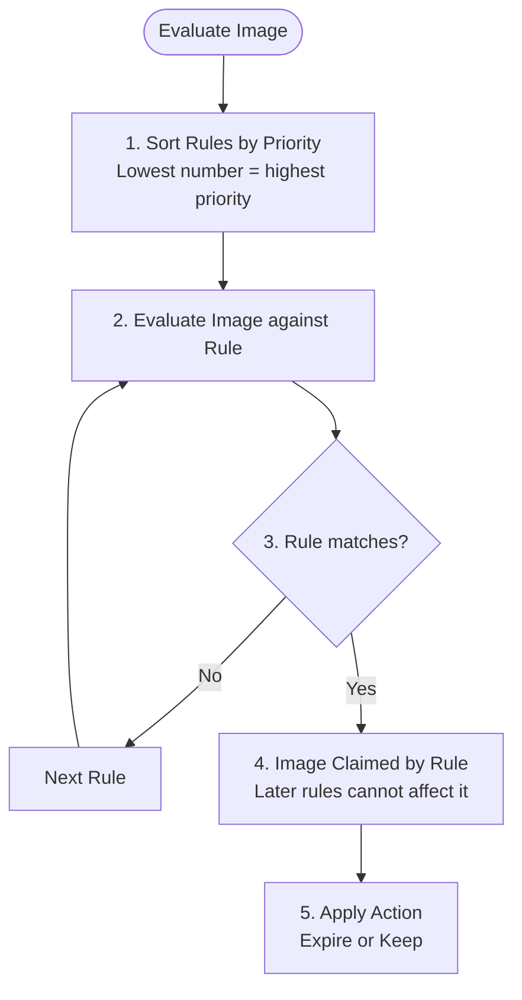

## Complexity: [MEDIUM]
## Time to Complete: 1 hour

---

## Prerequisites

Before starting this module, you should have completed:
- [Module 1.1: IAM & Security Foundations](../module-1.1-iam/)
- Docker fundamentals (building and tagging images)
- Docker installed locally and running
- AWS CLI configured with appropriate permissions

## What You'll Be Able to Do

After completing this module, you will be able to:

- **Configure ECR repositories with immutable tagging and lifecycle policies to manage container image sprawl**
- **Implement cross-account and cross-region image replication for multi-region deployment pipelines**
- **Deploy ECR image scanning with vulnerability reporting and enforce scan-on-push policies**
- **Secure ECR access with IAM policies and VPC endpoints to keep image pulls off the public internet**

---

## Why This Module Matters

In January 2024, a mid-stage fintech startup pushed a routine update to their payment processing service. The deployment succeeded. Five minutes later, their monitoring exploded. The application was crashing on startup, throwing cryptic "exec format error" messages. The previous container image -- the one that worked -- had been overwritten because they were using the `latest` tag with mutable tagging enabled. Their CI pipeline had pushed an ARM64 image over the existing AMD64 image. No versioning. No immutability. No way to roll back except to rebuild from source, which took 22 minutes while their payment pipeline was down. Twenty-two minutes of lost transactions for a fintech company is the kind of thing that ends up in board meeting slides.

Container registries are one of those infrastructure components that seem boring until they break. They sit between your CI pipeline and your runtime environment, holding every version of every service your company runs. A misconfigured registry means you cannot deploy, cannot roll back, and cannot verify that what is running in production is what you think is running. AWS Elastic Container Registry (ECR) is Amazon's managed container registry, deeply integrated with ECS, EKS, Lambda, and the rest of the AWS ecosystem.

In this module, you will learn how ECR works, how to configure it properly for production workloads, and how to avoid the mistakes that turn a routine deployment into a production incident. By the end, you will have built a complete image lifecycle -- from building and pushing images with proper tagging, to configuring lifecycle policies that keep your registry clean and your costs under control.

---

## ECR Architecture and Concepts

ECR is a fully managed Docker container registry. Unlike running your own registry (Docker Registry, Harbor, or Nexus), ECR handles storage, availability, encryption, and access control for you. Let us break down the key concepts.

### Registries, Repositories, and Images

```mermaid
graph TD
    Acc[AWS Account 123456789012] --> Reg[ECR Registry: 123456789012.dkr.ecr.us-east-1.amazonaws.com]
    
    Reg --> Repo1[Repository: myapp/api]
    Reg --> Repo2[Repository: myapp/worker]
    Reg --> Repo3[Repository: shared/nginx-base]
    
    Repo1 --> Img1[Image: sha256:abc123... | tag: v1.2.0]
    Repo1 --> Img2[Image: sha256:def456... | tag: v1.2.1]
    Repo1 --> Img3[Image: sha256:ghi789... | tag: v1.3.0, latest]
    
    Repo2 --> Img4[Image: sha256:jkl012... | tag: v2.0.0]
    Repo2 --> Img5[Image: sha256:mno345... | tag: v2.1.0]
    
    Repo3 --> Img6[Image: sha256:pqr678... | tag: 1.25-custom]
```

**Registry**: One per AWS account per region. For private ECR registries in standard AWS regions, the URL format is `{account_id}.dkr.ecr.{region}.amazonaws.com`. You cannot change this URL.

**Repository**: A collection of related container images, like a Git repository for code. Naming convention matters -- use a slash-separated hierarchy like `team/service` or `app/component`.

**Image**: An individual container image, identified by its SHA256 digest and optionally by one or more tags. A single image can have multiple tags.

### Public vs Private Repositories

ECR offers two flavors:

| Feature | ECR Private | ECR Public |
|---------|------------|------------|
| URL format | `{account_id}.dkr.ecr.{region}.amazonaws.com` | `public.ecr.aws/{alias}` |
| Authentication | Required for pull and push | Required for push; pull is anonymous |
| Cost | $0.10/GB/month storage + data transfer | Free (up to limits) |
| Use case | Internal services, proprietary code | Open source projects, shared base images |
| Regions | All commercial regions | us-east-1 only (content delivered globally via CloudFront) |
| Vulnerability scanning | Basic + Enhanced (Inspector) | Not supported |
| Lifecycle policies | Yes | No |

For most DevOps workflows, you will use private repositories. Public ECR is excellent for distributing open-source tools or shared base images that external teams or customers need to pull.

```bash
# Create a private repository
aws ecr create-repository \
  --repository-name myapp/api \
  --image-scanning-configuration scanOnPush=true \
  --image-tag-mutability IMMUTABLE \
  --encryption-configuration encryptionType=KMS

# Create a public repository
aws ecr-public create-repository \
  --repository-name my-oss-tool \
  --catalog-data '{
    "description": "My open source container tool",
    "architectures": ["x86-64", "ARM 64"],
    "operatingSystems": ["Linux"]
  }' \
  --region us-east-1
```

---

## Authentication and Pushing Images

ECR uses IAM for authentication, but Docker does not speak IAM natively. You need to exchange your IAM credentials for a Docker login token.

### Getting Authenticated

```bash
# The standard way: pipe ECR token directly to docker login
aws ecr get-login-password --region us-east-1 | \
  docker login --username AWS --password-stdin \
  123456789012.dkr.ecr.us-east-1.amazonaws.com

# The token is valid for 12 hours
# For CI/CD pipelines, refresh it at the start of each pipeline run
```

For ECS and EKS workloads, you do not need to handle authentication manually. ECS automatically pulls images from ECR using the task execution role. EKS nodes use the instance profile or IRSA (IAM Roles for Service Accounts) to authenticate.

### Building and Pushing Images

Here is the complete workflow from Dockerfile to ECR:

```bash
# Step 1: Build your image locally
docker build -t myapp/api:v1.3.0 .

# Step 2: Tag it for ECR
docker tag myapp/api:v1.3.0 \
  123456789012.dkr.ecr.us-east-1.amazonaws.com/myapp/api:v1.3.0

# Step 3: Push to ECR
docker push 123456789012.dkr.ecr.us-east-1.amazonaws.com/myapp/api:v1.3.0

# Verify the push
aws ecr describe-images \
  --repository-name myapp/api \
  --image-ids imageTag=v1.3.0
```

For production CI/CD pipelines, here is a more robust script:

```bash
#!/bin/bash
set -euo pipefail

ACCOUNT_ID=$(aws sts get-caller-identity --query Account --output text)
REGION="us-east-1"
REPO_NAME="myapp/api"
REGISTRY="${ACCOUNT_ID}.dkr.ecr.${REGION}.amazonaws.com"
IMAGE_TAG="${GIT_SHA:-$(git rev-parse --short HEAD)}"

# Authenticate
aws ecr get-login-password --region ${REGION} | \
  docker login --username AWS --password-stdin ${REGISTRY}

# Build with cache from previous image (speeds up CI builds significantly)
docker build \
  --cache-from ${REGISTRY}/${REPO_NAME}:latest \
  --build-arg BUILDKIT_INLINE_CACHE=1 \
  -t ${REGISTRY}/${REPO_NAME}:${IMAGE_TAG} \
  -t ${REGISTRY}/${REPO_NAME}:latest \
  .

# Push both tags
docker push ${REGISTRY}/${REPO_NAME}:${IMAGE_TAG}
docker push ${REGISTRY}/${REPO_NAME}:latest

echo "Pushed ${REGISTRY}/${REPO_NAME}:${IMAGE_TAG}"
```

---

## Image Tagging Strategies and Immutability

Tagging is where most teams get into trouble. Let us get this right.

### Tag Immutability

When tag immutability is enabled, once you push an image with a specific tag, that tag cannot be overwritten. This is critical for production safety.

```bash
# Enable immutability on an existing repository
aws ecr put-image-tag-mutability \
  --repository-name myapp/api \
  --image-tag-mutability IMMUTABLE

# Now this will FAIL if v1.3.0 already exists:
docker push 123456789012.dkr.ecr.us-east-1.amazonaws.com/myapp/api:v1.3.0
# Error: tag invalid: The image tag 'v1.3.0' already exists
```

With immutability enabled, you are guaranteed that `v1.3.0` always refers to the exact same image. This makes rollbacks reliable and audit trails meaningful.

### Tagging Strategy Comparison

| Strategy | Example | Pros | Cons |
|----------|---------|------|------|
| Semantic version | `v1.3.0` | Human readable, clear progression | Requires version discipline |
| Git SHA | `abc1234` | Ties image to exact source code | Not human readable |
| Both (recommended) | `v1.3.0` + `abc1234` | Best of both worlds | Slightly more complex CI |
| `latest` only | `latest` | Simple | No versioning, cannot roll back, dangerous |
| Date-based | `2026-03-24-1432` | Chronological ordering | No semantic meaning |

> **Stop and think**: Your CI pipeline successfully builds and pushes `myapp:latest` to a mutable ECR repository, overwriting the previous image. Five minutes later, the new code triggers a critical bug in production. You try to roll back by updating your ECS service to restart its tasks, hoping it pulls the old image. What will actually happen, and why is this an incident-response nightmare?

The recommended approach for production: **tag every image with both the semantic version and the Git SHA.** Use `latest` only as a convenience pointer that also gets applied alongside the versioned tag.

```bash
# Recommended: apply multiple tags
docker tag myapp/api:local \
  ${REGISTRY}/${REPO_NAME}:v1.3.0
docker tag myapp/api:local \
  ${REGISTRY}/${REPO_NAME}:${GIT_SHA}
docker tag myapp/api:local \
  ${REGISTRY}/${REPO_NAME}:latest

# With immutability ON:
# - v1.3.0 and ${GIT_SHA} are permanent, cannot be overwritten
# - latest is NOT allowed with IMMUTABLE (it needs to change each push)
# Solution: use IMMUTABLE repos without the 'latest' tag,
# or use a separate mutable repo for 'latest'
```

A practical note on immutability and `latest`: they are fundamentally incompatible. If you enable immutability, you cannot push `latest` more than once. Most teams choose one of two patterns:

1. **Enable immutability, never use `latest`** -- deployments always reference explicit versions
2. **Keep mutability, enforce versioning through CI policy** -- lint your pipeline to reject pushes without a version tag

Pattern 1 is safer. Pattern 2 is more convenient. Choose based on your team's discipline.

---

## Vulnerability Scanning

ECR provides two levels of vulnerability scanning: Basic and Enhanced.

### Basic Scanning

Basic scanning uses the open-source Clair engine to check for known CVEs in OS packages. It is included in ECR at no extra cost.

```bash
# Enable scan-on-push for a repository
aws ecr put-image-scanning-configuration \
  --repository-name myapp/api \
  --image-scanning-configuration scanOnPush=true

# Manually trigger a scan on an existing image
aws ecr start-image-scan \
  --repository-name myapp/api \
  --image-id imageTag=v1.3.0

# Get scan results
aws ecr describe-image-scan-findings \
  --repository-name myapp/api \
  --image-id imageTag=v1.3.0
```

### Enhanced Scanning

Enhanced scanning uses Amazon Inspector and provides deeper analysis including application dependency vulnerabilities (not just OS packages). It costs extra but catches significantly more issues.

```bash
# Enable enhanced scanning at the registry level
aws ecr put-registry-scanning-configuration \
  --scan-type ENHANCED \
  --rules '[
    {
      "scanFrequency": "CONTINUOUS_SCAN",
      "repositoryFilters": [
        {"filter": "myapp/*", "filterType": "WILDCARD"}
      ]
    },
    {
      "scanFrequency": "SCAN_ON_PUSH",
      "repositoryFilters": [
        {"filter": "*", "filterType": "WILDCARD"}
      ]
    }
  ]'
```

### Interpreting Scan Results

```bash
# Get findings summary
aws ecr describe-image-scan-findings \
  --repository-name myapp/api \
  --image-id imageTag=v1.3.0 \
  --query 'imageScanFindings.findingSeverityCounts'

# Example output:
# {
#     "CRITICAL": 0,
#     "HIGH": 2,
#     "MEDIUM": 8,
#     "LOW": 15,
#     "INFORMATIONAL": 3
# }

# Get detailed findings for critical and high severity
aws ecr describe-image-scan-findings \
  --repository-name myapp/api \
  --image-id imageTag=v1.3.0 \
  --query 'imageScanFindings.findings[?severity==`HIGH` || severity==`CRITICAL`]'
```

A practical CI/CD gate using scan results:

```bash
#!/bin/bash
# Gate deployment based on scan findings
CRITICAL=$(aws ecr describe-image-scan-findings \
  --repository-name myapp/api \
  --image-id imageTag=${IMAGE_TAG} \
  --query 'imageScanFindings.findingSeverityCounts.CRITICAL // `0`' \
  --output text)

HIGH=$(aws ecr describe-image-scan-findings \
  --repository-name myapp/api \
  --image-id imageTag=${IMAGE_TAG} \
  --query 'imageScanFindings.findingSeverityCounts.HIGH // `0`' \
  --output text)

if [ "${CRITICAL}" -gt 0 ]; then
  echo "BLOCKED: ${CRITICAL} critical vulnerabilities found"
  exit 1
fi

if [ "${HIGH}" -gt 5 ]; then
  echo "WARNING: ${HIGH} high-severity vulnerabilities found (threshold: 5)"
  exit 1
fi

echo "Scan passed: ${CRITICAL} critical, ${HIGH} high"
```

---

## Lifecycle Policies

Without lifecycle policies, your ECR storage grows indefinitely. Every CI build pushes a new image, and old images accumulate. A team pushing 10 builds per day generates 300+ images per month per repository. At $0.10/GB/month, this adds up.

Lifecycle policies let you automatically expire old images based on rules you define.

### Understanding Lifecycle Policy Rules

```bash
# Set a lifecycle policy that retains the last 10 tagged images
aws ecr put-lifecycle-policy \
  --repository-name myapp/api \
  --lifecycle-policy-text '{
    "rules": [
      {
        "rulePriority": 1,
        "description": "Keep last 10 tagged images",
        "selection": {
          "tagStatus": "tagged",
          "tagPrefixList": ["v"],
          "countType": "imageCountMoreThan",
          "countNumber": 10
        },
        "action": {
          "type": "expire"
        }
      },
      {
        "rulePriority": 2,
        "description": "Remove untagged images older than 3 days",
        "selection": {
          "tagStatus": "untagged",
          "countType": "sinceImagePushed",
          "countUnit": "days",
          "countNumber": 3
        },
        "action": {
          "type": "expire"
        }
      }
    ]
  }'
```

### Production-Grade Lifecycle Policy

Here is a comprehensive policy that covers the typical scenarios:

```bash
aws ecr put-lifecycle-policy \
  --repository-name myapp/api \
  --lifecycle-policy-text '{
    "rules": [
      {
        "rulePriority": 1,
        "description": "Keep release images (v-prefixed) for 180 days",
        "selection": {
          "tagStatus": "tagged",
          "tagPrefixList": ["v"],
          "countType": "sinceImagePushed",
          "countUnit": "days",
          "countNumber": 180
        },
        "action": {"type": "expire"}
      },
      {
        "rulePriority": 2,
        "description": "Keep only last 5 feature branch images",
        "selection": {
          "tagStatus": "tagged",
          "tagPrefixList": ["feature-", "fix-", "dev-"],
          "countType": "imageCountMoreThan",
          "countNumber": 5
        },
        "action": {"type": "expire"}
      },
      {
        "rulePriority": 10,
        "description": "Remove untagged images after 1 day",
        "selection": {
          "tagStatus": "untagged",
          "countType": "sinceImagePushed",
          "countUnit": "days",
          "countNumber": 1
        },
        "action": {"type": "expire"}
      }
    ]
  }'
```

> **Pause and predict**: You have a policy with two rules. Rule 1 (Priority 1) keeps 5 images with the prefix `prod-`. Rule 2 (Priority 2) expires all untagged images older than 7 days. You push an image with the tag `prod-v2.0` and immediately remove the tag because it was a mistake. 10 days later, will this image be deleted? Consider how ECR evaluates rules against image digests and tags.

### Preview Before You Apply

Lifecycle policies can be destructive -- they delete images. Always preview first:

```bash
# Preview what a lifecycle policy WOULD delete (dry run)
aws ecr get-lifecycle-policy-preview \
  --repository-name myapp/api

# Start a preview (if no preview exists)
aws ecr start-lifecycle-policy-preview \
  --repository-name myapp/api
```

### Lifecycle Policy Rule Evaluation Order

ECR evaluates lifecycle rules in a specific order. Understanding this prevents surprises:



**Example with our policy:**
- Image tagged `v1.3.0` pushed 90 days ago
  -> Matches Rule 1 (`v`-prefix, < 180 days) -> **KEPT**
- Image tagged `v1.0.0` pushed 200 days ago
  -> Matches Rule 1 (`v`-prefix, > 180 days) -> **EXPIRED**
- Image tagged `feature-auth-fix` (6th feature image)
  -> Matches Rule 2 (`feature-` prefix, > 5 count) -> **EXPIRED**
- Untagged image pushed 2 days ago
  -> Matches Rule 10 (untagged, > 1 day) -> **EXPIRED**

---

## Cross-Account and Cross-Region Sharing

In multi-account AWS environments (which is the standard for any serious organization), you often need to share images between accounts. The typical pattern: a CI/CD account builds and pushes images, and deployment accounts pull them.

### Cross-Account Access via Repository Policy

```bash
# Allow another AWS account to pull images
aws ecr set-repository-policy \
  --repository-name myapp/api \
  --policy-text '{
    "Version": "2012-10-17",
    "Statement": [
      {
        "Sid": "AllowCrossAccountPull",
        "Effect": "Allow",
        "Principal": {
          "AWS": [
            "arn:aws:iam::987654321098:root",
            "arn:aws:iam::111222333444:root"
          ]
        },
        "Action": [
          "ecr:GetDownloadUrlForLayer",
          "ecr:BatchGetImage",
          "ecr:BatchCheckLayerAvailability"
        ]
      }
    ]
  }'
```

### Cross-Region Replication

ECR supports automatic replication of images to other regions. This is essential for multi-region deployments to avoid cross-region image pulls during container startup (which add latency and data transfer costs).

```bash
# Configure replication to eu-west-1 and ap-southeast-1
aws ecr put-replication-configuration \
  --replication-configuration '{
    "rules": [
      {
        "destinations": [
          {
            "region": "eu-west-1",
            "registryId": "123456789012"
          },
          {
            "region": "ap-southeast-1",
            "registryId": "123456789012"
          }
        ],
        "repositoryFilters": [
          {
            "filter": "myapp/",
            "filterType": "PREFIX_MATCH"
          }
        ]
      }
    ]
  }'
```

### Cross-Account and Cross-Region Together

For organizations with separate accounts per environment and multiple regions:

```bash
# Replicate from CI account (123456789012) to:
# - Production account (987654321098) in us-east-1 and eu-west-1
aws ecr put-replication-configuration \
  --replication-configuration '{
    "rules": [
      {
        "destinations": [
          {
            "region": "us-east-1",
            "registryId": "987654321098"
          },
          {
            "region": "eu-west-1",
            "registryId": "987654321098"
          }
        ]
      }
    ]
  }'
```

The destination account must grant permission for the source account to replicate:

```bash
# Run this in the DESTINATION account
aws ecr put-registry-policy \
  --policy-text '{
    "Version": "2012-10-17",
    "Statement": [
      {
        "Sid": "AllowReplicationFrom",
        "Effect": "Allow",
        "Principal": {
          "AWS": "arn:aws:iam::123456789012:root"
        },
        "Action": [
          "ecr:CreateRepository",
          "ecr:ReplicateImage"
        ],
        "Resource": "arn:aws:ecr:*:987654321098:repository/*"
      }
    ]
  }'
```

---

## Securing ECR with VPC Endpoints (AWS PrivateLink)

By default, when your ECS tasks, EKS worker nodes, or EC2 instances pull images from ECR, the traffic travels over the public internet. This requires your subnets to have a NAT Gateway (which incurs data processing charges) or an Internet Gateway (which requires public IP addresses).

For enhanced security and to reduce NAT Gateway costs, you can configure VPC Endpoints (AWS PrivateLink) for ECR. This keeps all container image pull traffic entirely within the AWS private network.

To use ECR privately, you must create two types of VPC endpoints:
1. **ECR API Endpoint**: `com.amazonaws.region.ecr.api` (Used for authentication and API calls like `DescribeRepositories`)
2. **ECR Docker Routing Layer Endpoint**: `com.amazonaws.region.ecr.dkr` (Used for the actual Docker `pull` and `push` operations)

> **Pause and predict**: You configured both the ECR API and DKR VPC endpoints in your private subnet, routing all ECR traffic locally. However, when your ECS task attempts to start, it authenticates successfully but hangs while downloading the image layers. What crucial network path is missing?

Because ECR stores image layers in S3, you **must also create an S3 Gateway Endpoint** (`com.amazonaws.region.s3`) in your VPC routing table. When the Docker daemon pulls an image layer, ECR provides a pre-signed S3 URL, and the actual layer data flows through the S3 Gateway Endpoint.

```bash
# Example: Creating the ECR Docker endpoint (requires a security group that allows inbound HTTPS from your compute nodes)
aws ec2 create-vpc-endpoint \
  --vpc-id vpc-12345678 \
  --vpc-endpoint-type Interface \
  --service-name com.amazonaws.us-east-1.ecr.dkr \
  --subnet-ids subnet-11112222 subnet-33334444 \
  --security-group-ids sg-55556666
```

If you block public internet access in your private subnets and forget the S3 Gateway Endpoint, your ECS tasks will authenticate successfully but hang indefinitely in the "PENDING" state while trying to download the image layers.

---

## Did You Know?

1. **ECR stores images in S3 under the hood**, but you cannot see or access the S3 buckets directly. Each image layer is stored as an individual S3 object, deduplicated across all repositories in the same account and region. If five of your repositories use the same base layer (like `ubuntu:22.04`), that layer is stored only once. This deduplication can reduce your storage costs by 40-60% for organizations with many similar images.

2. **The ECR credential helper eliminates manual `docker login` calls.** Install `amazon-ecr-credential-helper` and configure Docker to use it, and every `docker pull` and `docker push` command against ECR automatically authenticates using your AWS credentials. GitHub Actions, GitLab CI, and Jenkins all have native ECR integration that uses this same mechanism under the hood.

3. **ECR pull-through cache** lets your ECR registry act as a proxy for public registries like Docker Hub, Quay.io, and GitHub Container Registry. When your workloads pull `docker.io/library/nginx:1.25`, ECR intercepts the request, caches the image locally, and serves subsequent pulls from the cache. This protects you from Docker Hub rate limits (100 pulls per 6 hours for anonymous users) and reduces external network dependencies.

4. **Amazon Inspector's enhanced scanning for ECR can detect vulnerabilities in 15+ programming languages**, not just OS packages. This includes npm, pip, Maven, NuGet, Go modules, Rust crates, and more. A single Node.js application image might have 3 OS-level vulnerabilities but 28 application-level ones. Basic scanning would only catch the 3.

---

## Common Mistakes

| Mistake | Why It Happens | How to Fix It |
|---------|---------------|---------------|
| Using `latest` tag as the only tag | It is the Docker default and seems simple | Always tag with a version or Git SHA. Treat `latest` as a convenience alias, never as the deployment target |
| Forgetting to authenticate before pushing | ECR tokens expire after 12 hours | Add `aws ecr get-login-password` to the start of every CI pipeline. Use the credential helper for local development |
| Not enabling scan-on-push | It is not the default when creating repositories | Create a script or Terraform module that always enables scanning. Gate deployments on scan results |
| No lifecycle policy | Teams do not think about storage costs until the bill arrives | Apply lifecycle policies at repository creation time. A default policy that keeps the last 20 tagged images and removes untagged images after 3 days works for most teams |
| Mutable tags in production | It is the ECR default, and immutability seems restrictive | Enable IMMUTABLE tag mutability for all production repositories. Mutable tags make rollbacks unreliable |
| Pulling images cross-region in production | The image exists in us-east-1 but the ECS cluster is in eu-west-1 | Configure ECR replication to all regions where you deploy containers. Cross-region pulls add 200-500ms to container startup and incur data transfer charges |
| Repository names that do not match service names | Ad hoc naming without convention | Establish a naming convention (e.g., `{team}/{service}`) and enforce it in CI. Consistent naming prevents confusion when you have 50+ repositories |
| Not setting repository policies for cross-account access | Developers use root-account credentials or overly broad IAM policies | Use ECR repository policies for cross-account pull access. Keep IAM policies for push access controlled by the CI/CD account |

---

## Quiz

<details>
<summary>1. Your security team mandates that all application dependencies (like npm packages and Python wheels) must be scanned for vulnerabilities before deployment. You enable ECR Basic scanning, but the security team reports that it is missing known vulnerabilities in your Node.js application. Why is this happening, and what must you change?</summary>

ECR Basic scanning uses the open-source Clair engine, which only checks for known CVEs in operating system packages (like those installed via apt or yum). It cannot look inside application-level dependency files like package.json or requirements.txt. To satisfy the security team's mandate, you must upgrade to Amazon Inspector Enhanced scanning. Enhanced scanning analyzes both OS packages and application dependencies across over 15 programming languages, catching vulnerabilities that Basic scanning completely ignores.
</details>

<details>
<summary>2. Your CI pipeline is configured to tag every build with both the Git SHA and the `latest` tag. After enabling ECR image tag immutability for your production repositories to improve security, your pipeline suddenly starts failing on the push step. Why is the pipeline failing, and what must you do to fix it?</summary>

Image tag immutability means that once a tag is applied to a specific image digest, it cannot be reassigned to a different image. The `latest` tag is designed to be a moving pointer that gets overwritten with every new build. Because these concepts are fundamentally incompatible, your pipeline fails when it tries to overwrite the `latest` tag from the previous build. To fix this, you must either remove the `latest` tag from your CI pipeline and deploy using the immutable Git SHA tags, or maintain a separate mutable repository specifically for the `latest` pointer.
</details>

<details>
<summary>3. You have an ECR lifecycle policy that keeps the last 10 images tagged with "v" prefix and removes untagged images after 3 days. You push an image tagged v1.5.0 and also tag it as "latest". Later, the v1.5.0 tag is removed by the lifecycle policy (it becomes the 11th oldest). What happens to the "latest" tag?</summary>

This is a subtle but important behavior in ECR. Lifecycle policies operate on the underlying image digest, not on individual tags attached to that image. If an image has multiple tags and the lifecycle policy matches one of those tags for expiration, the entire image and all of its associated tags are deleted. Consequently, when v1.5.0 is expired, the underlying image is deleted, which also strips away the "latest" tag that pointed to it. This demonstrates why relying on `latest` as a deployment reference is highly dangerous in a repository with lifecycle policies.
</details>

<details>
<summary>4. During a major traffic spike, your EKS cluster scales up rapidly, launching 50 new pods at once. The pods fail to start, and the Kubernetes events show 'Too Many Requests' errors from Docker Hub while trying to pull a public Nginx base image. How would implementing an ECR pull-through cache prevent this outage?</summary>

Docker Hub imposes strict rate limits on image pulls based on the IP address or authenticated user (e.g., 100 pulls per 6 hours for anonymous users). When 50 pods attempt to pull the Nginx image simultaneously from Docker Hub, you can quickly exhaust your limit, causing the pulls to be throttled and the pods to fail. An ECR pull-through cache acts as a local proxy; the first pull goes to Docker Hub and caches the image in your ECR registry. All subsequent pod scaling events pull from the local ECR cache, which is not subject to Docker Hub rate limits, thereby ensuring reliable and fast container startups.
</details>

<details>
<summary>5. Your organization has 30 different microservices, and you enforce a standard where every service uses the exact same `ubuntu:22.04` base image. Your finance department is concerned that storing 30 copies of a heavy OS image in ECR will cause storage costs to skyrocket. Why is their concern unfounded, and how does ECR handle this under the hood?</summary>

Container images are composed of multiple filesystem layers, and ECR stores each of these layers individually based on their SHA256 digest. When multiple repositories within the same account and region push images that share identical base layers (like the standard `ubuntu:22.04` image), ECR recognizes the duplicate hashes. Instead of storing 30 redundant copies, ECR stores the base layer only once in its underlying S3 bucket and creates references to it for each repository. You are only billed for the unique layer storage, meaning standardizing on a single base image actually drastically reduces your overall storage costs.
</details>

<details>
<summary>6. Your primary infrastructure is in `us-east-1`, but you recently deployed a disaster recovery ECS cluster in `eu-west-1`. The disaster recovery tasks are configured to pull their container images from the existing ECR registry in `us-east-1`. During a simulated failover, you notice that tasks take significantly longer to start and you incur unexpected AWS data transfer charges. Why did this happen and what is the proper architectural fix?</summary>

Pulling container images across AWS regions introduces substantial network latency, which directly increases the time it takes for your ECS tasks to download the image and start. Additionally, AWS charges for inter-region data transfer, meaning every cross-region image pull increases your monthly bill. To resolve both the performance degradation and the cost issue, you must configure ECR cross-region replication. By setting your `us-east-1` registry to automatically replicate images to a registry in `eu-west-1`, the disaster recovery tasks can perform local image pulls, eliminating the cross-region network delay and data transfer fees.
</details>

---

## Hands-On Exercise: Build, Push, Scan, and Lifecycle

In this exercise, you will create an ECR repository, build and push images with proper tagging, run vulnerability scans, configure lifecycle policies, and set up cross-account access.

### Setup

```bash
# Set your variables
export ACCOUNT_ID=$(aws sts get-caller-identity --query Account --output text)
export REGION="us-east-1"
export REGISTRY="${ACCOUNT_ID}.dkr.ecr.${REGION}.amazonaws.com"
export REPO_NAME="kubedojo/ecr-exercise"
```

### Task 1: Create a Repository with Best-Practice Settings

Create an ECR repository with scanning enabled and immutable tags.

<details>
<summary>Solution</summary>

```bash
aws ecr create-repository \
  --repository-name ${REPO_NAME} \
  --image-scanning-configuration scanOnPush=true \
  --image-tag-mutability IMMUTABLE \
  --encryption-configuration encryptionType=AES256 \
  --region ${REGION}

# Verify the repository settings
aws ecr describe-repositories \
  --repository-names ${REPO_NAME} \
  --query 'repositories[0].{Name:repositoryName,URI:repositoryUri,ScanOnPush:imageScanningConfiguration.scanOnPush,TagMutability:imageTagMutability}'
```
</details>

### Task 2: Build and Push a Test Image

Create a simple Dockerfile, build it, and push to ECR with proper tagging.

<details>
<summary>Solution</summary>

```bash
# Create a temporary directory for our test image
mkdir -p /tmp/ecr-exercise && cd /tmp/ecr-exercise

# Create a simple Dockerfile
cat > Dockerfile <<'DOCKERFILE'
FROM python:3.12-slim
LABEL maintainer="kubedojo"
LABEL version="1.0.0"

RUN pip install flask==3.0.0
COPY app.py /app/app.py
WORKDIR /app
EXPOSE 8080
CMD ["python", "app.py"]
DOCKERFILE

# Create a simple app
cat > app.py <<'PYTHON'
from flask import Flask, jsonify
app = Flask(__name__)

@app.route("/health")
def health():
    return jsonify({"status": "healthy"})

@app.route("/")
def index():
    return jsonify({"message": "ECR Exercise App", "version": "1.0.0"})

if __name__ == "__main__":
    app.run(host="0.0.0.0", port=8080)
PYTHON

# Authenticate
aws ecr get-login-password --region ${REGION} | \
  docker login --username AWS --password-stdin ${REGISTRY}

# Build and tag with version
docker build -t ${REGISTRY}/${REPO_NAME}:v1.0.0 .

# Push
docker push ${REGISTRY}/${REPO_NAME}:v1.0.0

# Verify
aws ecr describe-images \
  --repository-name ${REPO_NAME} \
  --query 'imageDetails[*].{Tags:imageTags,Pushed:imagePushedAt,Size:imageSizeInBytes,Digest:imageDigest}'
```
</details>

### Task 3: Push Multiple Versions (Simulate CI/CD History)

Build and push several versions to test lifecycle policies later.

<details>
<summary>Solution</summary>

```bash
# Push versions v1.1.0 through v1.12.0 (we will use lifecycle to prune)
for i in $(seq 1 12); do
  # Modify the app version to create different layers
  sed -i "s/version\": \"[0-9.]*\"/version\": \"1.${i}.0\"/" app.py

  docker build -t ${REGISTRY}/${REPO_NAME}:v1.${i}.0 .
  docker push ${REGISTRY}/${REPO_NAME}:v1.${i}.0

  echo "Pushed v1.${i}.0"
done

# List all images in the repository
aws ecr describe-images \
  --repository-name ${REPO_NAME} \
  --query 'sort_by(imageDetails, &imagePushedAt)[*].{Tag:imageTags[0],Pushed:imagePushedAt}' \
  --output table
```
</details>

### Task 4: Check Vulnerability Scan Results

Review the scan results for the latest image.

<details>
<summary>Solution</summary>

```bash
# Wait for scan to complete (scan-on-push was enabled)
echo "Waiting for scan to complete..."
aws ecr wait image-scan-complete \
  --repository-name ${REPO_NAME} \
  --image-id imageTag=v1.12.0

# Get scan findings summary
aws ecr describe-image-scan-findings \
  --repository-name ${REPO_NAME} \
  --image-id imageTag=v1.12.0 \
  --query '{
    Status: imageScanStatus.status,
    Counts: imageScanFindings.findingSeverityCounts,
    CompletedAt: imageScanFindings.imageScanCompletedAt
  }'

# Get detailed high/critical findings
aws ecr describe-image-scan-findings \
  --repository-name ${REPO_NAME} \
  --image-id imageTag=v1.12.0 \
  --query 'imageScanFindings.findings[?severity==`HIGH` || severity==`CRITICAL`].{Name:name,Severity:severity,Description:description,URI:uri}' \
  --output table
```
</details>

### Task 5: Apply a Lifecycle Policy to Retain Only the Last 10 Images

Configure a lifecycle policy that keeps the 10 most recent tagged images and removes the rest.

<details>
<summary>Solution</summary>

```bash
# First, preview what the policy would delete
aws ecr put-lifecycle-policy \
  --repository-name ${REPO_NAME} \
  --lifecycle-policy-text '{
    "rules": [
      {
        "rulePriority": 1,
        "description": "Keep only the last 10 versioned images",
        "selection": {
          "tagStatus": "tagged",
          "tagPrefixList": ["v"],
          "countType": "imageCountMoreThan",
          "countNumber": 10
        },
        "action": {
          "type": "expire"
        }
      },
      {
        "rulePriority": 2,
        "description": "Remove untagged images after 1 day",
        "selection": {
          "tagStatus": "untagged",
          "countType": "sinceImagePushed",
          "countUnit": "days",
          "countNumber": 1
        },
        "action": {
          "type": "expire"
        }
      }
    ]
  }'

# Verify the policy was applied
aws ecr get-lifecycle-policy \
  --repository-name ${REPO_NAME} \
  --query 'lifecyclePolicyText' --output text | python3 -m json.tool

# Note: Lifecycle policies run asynchronously (within 24 hours)
# To see what WOULD be deleted immediately, use:
aws ecr start-lifecycle-policy-preview \
  --repository-name ${REPO_NAME}

# Check preview results (may take a few minutes)
aws ecr get-lifecycle-policy-preview \
  --repository-name ${REPO_NAME} \
  --query 'previewResults[*].{Tag:imageTags[0],Action:action.type,AppliedRule:appliedAction.rulePriority}'
```
</details>

### Task 6: Configure Cross-Account Repository Access

Apply a repository policy that allows a simulated deployment account (e.g., AWS Account ID `999988887777`) to pull images from your repository.

<details>
<summary>Solution</summary>

```bash
# Create a policy JSON file
cat > repo-policy.json <<'POLICY'
{
  "Version": "2012-10-17",
  "Statement": [
    {
      "Sid": "AllowCrossAccountPull",
      "Effect": "Allow",
      "Principal": {
        "AWS": "arn:aws:iam::999988887777:root"
      },
      "Action": [
        "ecr:GetDownloadUrlForLayer",
        "ecr:BatchGetImage",
        "ecr:BatchCheckLayerAvailability"
      ]
    }
  ]
}
POLICY

# Apply the policy
aws ecr set-repository-policy \
  --repository-name ${REPO_NAME} \
  --policy-text file://repo-policy.json

# Verify the policy is applied
aws ecr get-repository-policy \
  --repository-name ${REPO_NAME} \
  --query 'policyText' --output text | python3 -m json.tool
```
</details>

### Task 7: Clean Up

Remove all resources created during this exercise.

<details>
<summary>Solution</summary>

```bash
# Delete all images in the repository first (required before repo deletion)
IMAGE_IDS=$(aws ecr list-images \
  --repository-name ${REPO_NAME} \
  --query 'imageIds[*]' --output json)

aws ecr batch-delete-image \
  --repository-name ${REPO_NAME} \
  --image-ids "${IMAGE_IDS}"

# Delete the repository
aws ecr delete-repository \
  --repository-name ${REPO_NAME} \
  --force

# Clean up local Docker images
docker images --filter "reference=${REGISTRY}/${REPO_NAME}" -q | \
  xargs -r docker rmi

# Clean up temporary files
rm -rf /tmp/ecr-exercise
rm -f repo-policy.json

echo "Cleanup complete"
```
</details>

### Success Criteria

- [ ] ECR repository created with scan-on-push and immutable tags
- [ ] Successfully authenticated and pushed a versioned image
- [ ] Multiple image versions pushed (simulating CI/CD history)
- [ ] Vulnerability scan results reviewed and interpreted
- [ ] Lifecycle policy applied that retains only the last 10 images
- [ ] Configured cross-account repository access
- [ ] All resources cleaned up

---

## Next Module

Next up: **[Module 1.7: Elastic Container Service (ECS) & Fargate](../module-1.7-ecs-fargate/)** -- Now that you can store container images, it is time to run them. You will learn to deploy containers on AWS using ECS with both EC2 and Fargate launch types, integrate with load balancers, and debug running containers with ECS Exec.

## Sources

- [Amazon ECR private registry](https://docs.aws.amazon.com/AmazonECR/latest/userguide/Registries.html) — Covers the core registry model, private registry URI format, and account-and-Region basics.
- [Scan images for software vulnerabilities in Amazon ECR](https://docs.aws.amazon.com/AmazonECR/latest/userguide/image-scanning.html) — Explains the current Basic versus Enhanced scanning model and where Amazon Inspector fits.
- [Amazon ECR interface VPC endpoints (AWS PrivateLink)](https://docs.aws.amazon.com/AmazonECR/latest/userguide/vpc-endpoints.html) — Documents the endpoint combination needed to pull private images without internet egress.
